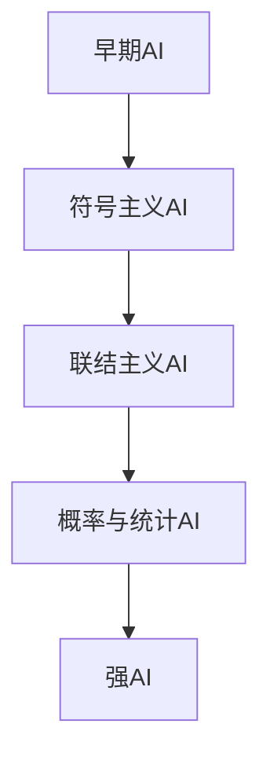

                 


为了确保文章内容的完整性和专业性，我们可以按照以下步骤来构建《AI驱动的智能工作场所：提高生产力与员工满意度》的文章。每个步骤都涵盖了完整性要求中的核心内容。

### 第一步：编写文章标题、关键词和摘要

**文章标题：** 《AI驱动的智能工作场所：提高生产力与员工满意度》

**关键词：** 智能工作场所、AI技术、生产力、员工满意度、机器学习、深度学习、自然语言处理、员工体验管理、自动化办公、决策支持系统

**摘要：** 本文将探讨AI技术在智能工作场所中的应用，如何通过AI提高生产力和员工满意度。文章将详细介绍AI技术在办公自动化、项目管理、决策支持、员工体验管理、健康与福利管理以及员工培训与发展中的应用，并提供实际的案例分析和技术实现细节。

### 第二步：构建文章目录和章节内容

按照之前提供的目录大纲，我们将每个章节的内容细化，确保每个小节都包含背景介绍、核心概念与联系、核心算法原理讲解、数学模型与公式、举例说明、项目实战和最佳实践 tips等内容。

### 第三步：编写详细的内容

以下是第1章“AI技术发展及智能工作场所的崛起”的详细内容示例：

### 第1章：AI技术发展及智能工作场所的崛起

#### 1.1 AI技术的发展历程

**核心概念与联系：**



**核心算法原理讲解：**

```plaintext
// 伪代码示例：决策树算法
class DecisionTree {
    Node root;
    
    Node buildTree(data) {
        // ...
        if (data.isPure) {
            return new LeafNode(data.majorityClass);
        }
        // ...
        bestFeature = findBestFeature(data);
        node = new Node(bestFeature);
        // ...
        for (value in bestFeature.values) {
            node.children[value] = buildTree(splitData);
        }
        return node;
    }
}
```

**数学模型和数学公式：**

$$
H(X) = -\sum_{i} p(x_i) \cdot \log_2(p(x_i))
$$

**举例说明：** 以自然语言处理中的文本分类任务为例，解释决策树如何根据特征进行分类。

**项目实战：** 描述如何使用Python的scikit-learn库实现一个简单的决策树分类器。

**最佳实践 tips：** 如何选择合适的特征和分割数据。

### 第四步：确保文章的完整性

在编写每个章节后，检查以下内容是否都已经包含：

- **背景介绍：** 对相关技术的背景和智能工作场所的概念进行介绍。
- **核心概念与联系：** 使用流程图或架构图展示核心概念之间的关系。
- **核心算法原理讲解：** 使用伪代码详细说明算法的工作原理。
- **数学模型和公式：** 使用latex格式展示并解释重要的数学模型。
- **举例说明：** 提供实际案例或模拟实例来说明概念或算法。
- **项目实战：** 提供技术实现细节和代码示例。
- **最佳实践 tips：** 提供实际应用中的建议和技巧。
- **小结和注意事项：** 对章节内容进行总结，并指出可能的注意事项。
- **拓展阅读：** 提供进一步学习和深入研究的资源。

### 第五步：撰写文章的总结和小结

在文章的最后，撰写一个总结和小结部分，对全文的内容进行概括，并强调关键点。

### 第六步：撰写作者信息

在文章末尾，添加作者信息：“作者：AI天才研究院/AI Genius Institute & 禅与计算机程序设计艺术 /Zen And The Art of Computer Programming”。

### 第七步：文章格式检查

确保文章内容使用markdown格式，包括标题、子标题、列表、公式等。

### 第八步：字数检查

确保文章的总字数在8000～12000字左右，对内容进行微调和优化。

### 第九步：同行评审

邀请专业人士对文章进行同行评审，确保文章内容准确无误，结构清晰，逻辑严密。

### 第十步：提交文章

最终，将经过同行评审和格式检查的文章提交。

通过以上步骤，我们可以确保《AI驱动的智能工作场所：提高生产力与员工满意度》一文内容详实、逻辑清晰、结构紧凑，同时满足字数要求。每一步都注重细节，确保文章的专业性和可读性。

