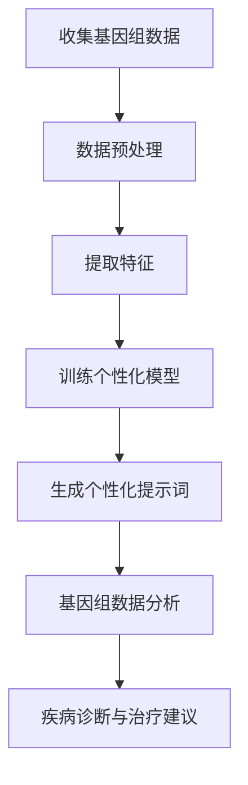
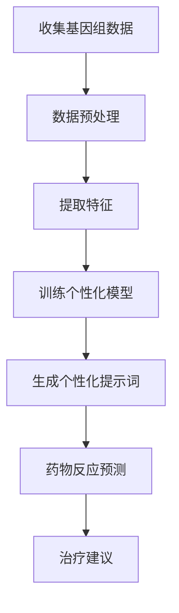
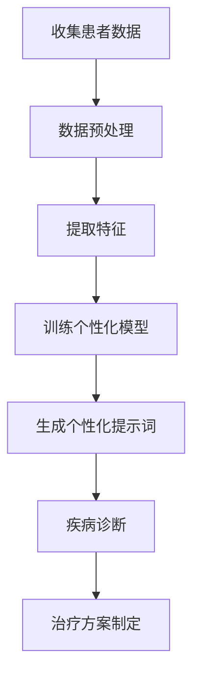

                 

### AI驱动的精准医疗中的提示词个性化

#### 关键词
- AI驱动的精准医疗
- 提示词个性化
- 机器学习
- 深度学习
- 强化学习
- 生物信息学

#### 摘要
本文探讨了AI在精准医疗领域的应用，尤其是提示词个性化技术。我们首先概述了AI技术在精准医疗中的广泛应用，包括生物信息学、基因组学和药物研发等。接着，我们介绍了提示词个性化技术的概念和作用，以及与传统医学决策的区别。然后，深入分析了AI驱动的提示词个性化方法，包括机器学习、深度学习和强化学习模型。本文还通过实际案例分析，展示了这些技术在基因组数据分析、药物反应预测和疾病诊断中的应用，并探讨了其面临的挑战和未来的发展趋势。通过本文的阅读，读者可以全面了解AI驱动的提示词个性化技术在精准医疗中的重要作用。

### 第一部分：AI与精准医疗概述

#### 1. AI技术在精准医疗中的应用

随着人工智能（AI）技术的发展，它已经在精准医疗领域发挥了巨大的作用。AI技术的应用不仅提高了医疗服务的效率，还显著提升了医疗决策的准确性。

##### 1.1 AI在生物信息学中的应用

生物信息学是研究生物数据、如基因组序列、蛋白质结构等的科学。AI技术在生物信息学中的应用主要包括：

1. **基因序列分析**：AI算法可以快速分析大量的基因组数据，识别出与疾病相关的基因突变和风险因素。
2. **蛋白质结构预测**：AI模型可以预测蛋白质的三维结构，这对于药物设计和新药发现至关重要。
3. **药物-靶点相互作用预测**：通过分析基因和蛋白质的信息，AI可以预测药物与生物分子的相互作用，为新药研发提供支持。

##### 1.2 AI在基因组学与遗传学中的应用

基因组学是研究基因组成和功能的科学。AI在基因组学中的应用包括：

1. **基因组注释**：AI可以帮助科学家理解基因的功能和作用，通过注释基因序列中的特征和标记，提高基因组数据的可解释性。
2. **基因组比较分析**：AI可以比较不同个体的基因组差异，识别出与疾病相关的遗传变异。
3. **遗传疾病诊断**：AI算法可以分析家族病史和基因数据，帮助医生诊断遗传疾病，并提供个性化的治疗方案。

##### 1.3 AI在药物研发与临床决策支持中的应用

AI在药物研发和临床决策支持中的应用主要包括：

1. **新药研发**：AI可以加速新药研发过程，通过药物筛选和优化，提高药物的成功率。
2. **药物反应预测**：AI模型可以根据患者的基因信息和病史，预测其对特定药物的响应，帮助医生制定个性化治疗计划。
3. **临床决策支持**：AI系统可以分析患者的电子病历数据，为医生提供诊断和治疗的建议，提高医疗决策的准确性。

#### 2. 提示词个性化技术基础

##### 2.1 提示词的定义与作用

提示词（Prompt）在AI领域中，特别是自然语言处理（NLP）和生成式AI中，是一种引导模型生成内容的技术。提示词的作用是提供上下文信息，帮助模型理解任务目标，从而生成更准确、更有针对性的输出。

1. **定义**：提示词是一个或多个单词、短语或句子，用于引导模型生成特定的内容。
2. **作用**：提示词可以提高生成内容的准确性、相关性和创造力。

##### 2.2 提示词个性化技术概述

提示词个性化技术是指根据用户的需求、偏好和历史数据，为用户定制特定的提示词。这种技术可以显著提升AI模型的服务质量和用户体验。

1. **技术特点**：
   - **个性化**：根据用户个性化需求提供定制化的提示词。
   - **自适应**：根据用户的反馈和交互动态调整提示词。
   - **高效**：提高模型生成内容的准确性和效率。

2. **应用场景**：
   - **客户服务**：为用户提供个性化的客服回答。
   - **内容生成**：根据用户兴趣生成定制化的内容。
   - **医疗决策支持**：为医生提供个性化的诊断和治疗建议。

##### 2.3 提示词个性化与传统医学决策的区别

提示词个性化技术在医学决策中的应用与传统医学决策存在显著差异：

1. **数据驱动**：提示词个性化技术依赖于大量用户数据，通过数据分析和机器学习算法，为用户定制提示词。
2. **动态调整**：根据用户反馈和实时数据，动态调整提示词，以提供更准确的医疗建议。
3. **个性化**：传统医学决策往往基于通用指南和经验，而提示词个性化技术可以根据个体差异提供个性化的医疗方案。

### 第二部分：AI驱动的提示词个性化方法

#### 3. AI驱动的提示词个性化方法

在AI驱动的精准医疗中，提示词个性化是关键。以下我们将详细介绍几种常用的AI驱动的提示词个性化方法，包括机器学习、深度学习和强化学习。

##### 3.1 机器学习模型在提示词个性化中的应用

机器学习模型在提示词个性化中发挥着重要作用，其主要方法包括：

1. **监督学习**：通过训练数据集，让模型学习如何根据输入数据生成输出提示词。常用的算法包括线性回归、逻辑回归和支持向量机（SVM）等。

   ```python
   # 线性回归模型伪代码
   model = LinearRegression()
   model.fit(X_train, y_train)
   prompt = model.predict(input_data)
   ```

2. **无监督学习**：通过无监督学习方法，如聚类算法（如K-means），将用户数据分组，然后为每组用户生成特定的提示词。

   ```python
   # K-means聚类模型伪代码
   from sklearn.cluster import KMeans
   kmeans = KMeans(n_clusters=k)
   kmeans.fit(X_train)
   cluster_labels = kmeans.predict(X_train)
   for label, cluster in enumerate(cluster_labels):
       prompt = generate_prompt_for_cluster(cluster)
   ```

3. **集成学习**：结合多种机器学习方法，提高模型的准确性和稳定性。例如，随机森林和梯度提升树（Gradient Boosting Tree）在提示词个性化中广泛应用。

   ```python
   # 梯度提升树模型伪代码
   from sklearn.ensemble import GradientBoostingClassifier
   gbt = GradientBoostingClassifier()
   gbt.fit(X_train, y_train)
   prompt = gbt.predict(input_data)
   ```

##### 3.2 深度学习模型在提示词个性化中的应用

深度学习模型，特别是基于神经网络的结构，在提示词个性化中表现出色。以下是一些常用的深度学习模型：

1. **循环神经网络（RNN）**：RNN能够处理序列数据，对于基于上下文的提示词生成非常有用。

   ```python
   # RNN模型伪代码
   import tensorflow as tf
   model = tf.keras.Sequential([
       tf.keras.layers.Embedding(vocab_size, embedding_dim),
       tf.keras.layers.LSTM(units)
   ])
   model.compile(optimizer='adam', loss='categorical_crossentropy', metrics=['accuracy'])
   model.fit(X_train, y_train, epochs=num_epochs)
   prompt = model.predict(input_data)
   ```

2. **长短期记忆网络（LSTM）**：LSTM是一种特殊的RNN，能够更好地处理长序列数据，捕捉长期依赖关系。

   ```python
   # LSTM模型伪代码
   model = tf.keras.Sequential([
       tf.keras.layers.Embedding(vocab_size, embedding_dim),
       tf.keras.layers.LSTM(units, return_sequences=True)
   ])
   model.compile(optimizer='adam', loss='categorical_crossentropy', metrics=['accuracy'])
   model.fit(X_train, y_train, epochs=num_epochs)
   prompt = model.predict(input_data)
   ```

3. **生成对抗网络（GAN）**：GAN可以生成高质量的提示词，特别是在文本生成任务中。

   ```python
   # GAN模型伪代码
   import tensorflow as tf
   def generator():
       model = tf.keras.Sequential([
           tf.keras.layers.Dense(units, activation='relu'),
           tf.keras.layers.Dense(vocab_size, activation='softmax')
       ])
       return model
   
   def discriminator():
       model = tf.keras.Sequential([
           tf.keras.layers.Dense(units, activation='relu'),
           tf.keras.layers.Dense(1, activation='sigmoid')
       ])
       return model
   
   generator_model = generator()
   discriminator_model = discriminator()
   # 训练GAN模型
   ```

##### 3.3 强化学习模型在提示词个性化中的应用

强化学习（RL）在提示词个性化中也有着广泛的应用，特别是当需要根据用户的反馈动态调整提示词时。以下是一些常用的强化学习模型：

1. **Q-learning**：Q-learning是一种基于值函数的强化学习算法，通过学习值函数来选择最优动作。

   ```python
   # Q-learning模型伪代码
   Q = {}  # 值函数表
   for state in states:
       for action in actions:
           Q[state, action] = 0
   while not terminal_state:
       state = current_state
       action = choose_action(Q[state])
       reward = receive_reward(action)
       next_state = next_state
       Q[state, action] += alpha * (reward + gamma * max(Q[next_state, actions]) - Q[state, action])
       state = next_state
   ```

2. **深度确定性政策梯度（DDPG）**：DDPG是一种基于深度学习的强化学习算法，适用于连续动作空间。

   ```python
   # DDPG模型伪代码
   actor = DDPGActor()
   critic = DDDPCritic()
   actor_optimizer = optimizers.Adam(learning_rate=learning_rate_actor)
   critic_optimizer = optimizers.Adam(learning_rate=learning_rate_critic)
   # 训练DDPG模型
   ```

通过以上机器学习、深度学习和强化学习模型的应用，AI驱动的提示词个性化技术在精准医疗中发挥了重要作用，为用户提供更个性化、更准确的医疗建议。

### 第三部分：AI驱动的提示词个性化应用

#### 4. 基因组数据分析中的提示词个性化

基因组数据分析是精准医疗的核心环节，通过分析个体的基因组信息，可以为疾病诊断、药物反应预测和个性化治疗方案制定提供重要依据。AI驱动的提示词个性化技术在这一过程中发挥了重要作用，显著提升了基因组数据分析的准确性和效率。

##### 4.1 基因组数据分析概述

基因组数据分析涉及多个步骤，包括数据预处理、特征提取、模式识别和结果解释。AI技术的引入，尤其是提示词个性化技术的应用，极大地优化了这些步骤。

1. **数据预处理**：包括去除低质量序列、填充缺失值和标准化数据等。这一阶段的数据质量直接影响后续分析的结果。

2. **特征提取**：通过分析基因组序列，提取与疾病相关的特征。这些特征可以是单核苷酸多态性（SNP）、基因表达水平或基因组结构变异等。

3. **模式识别**：利用机器学习算法，如支持向量机（SVM）或深度神经网络（DNN），识别基因组数据中的潜在模式。

4. **结果解释**：对分析结果进行解释，如识别与疾病相关的基因或突变，预测患者的疾病风险和药物反应。

##### 4.2 个性化提示词在基因组数据分析中的应用

个性化提示词在基因组数据分析中起到关键作用，可以显著提升数据分析的准确性和效率。以下是几个具体应用场景：

1. **个性化数据预处理**：根据患者的具体信息，如年龄、性别和疾病史，生成个性化的数据预处理提示词。这有助于优化数据预处理过程，提高数据质量。

   ```python
   # 个性化数据预处理伪代码
   def personalized_data_preprocessing(prompt):
       if prompt == "male":
           filter_males()
       elif prompt == "diabetes":
           apply_diabetes_specific_filters()
       else:
           apply_general_filters()
   ```

2. **个性化特征提取**：根据患者的基因组数据和疾病特征，生成个性化的特征提取提示词。这有助于提取更具有诊断价值的特征。

   ```python
   # 个性化特征提取伪代码
   def personalized_feature_extraction(prompt):
       if prompt == "heart_disease":
           extract_heart_disease_related_features()
       elif prompt == "cancer":
           extract_cancer_related_features()
       else:
           extract_general_features()
   ```

3. **个性化模式识别**：利用患者的个性化数据，训练个性化模型，以提高模式识别的准确性。这有助于更准确地识别与疾病相关的基因组模式。

   ```python
   # 个性化模式识别伪代码
   def personalized_pattern_recognition(prompt):
       if prompt == "heart_disease":
           train_heart_disease_model()
       elif prompt == "cancer":
           train_cancer_model()
       else:
           train_general_model()
   ```

4. **个性化结果解释**：根据患者的个性化基因组数据和分析结果，生成个性化的结果解释提示词。这有助于医生更准确地理解分析结果，并制定个性化的治疗方案。

   ```python
   # 个性化结果解释伪代码
   def personalized_result_explanation(prompt):
       if prompt == "heart_disease":
           explain_heart_disease_risk()
       elif prompt == "cancer":
           explain_cancer_risk()
       else:
           explain_general_risk()
   ```

##### 4.3 个性化提示词对基因组数据分析结果的影响

个性化提示词在基因组数据分析中的应用，不仅提高了数据分析的准确性，还显著提升了数据分析的效率。以下是几个具体的影响：

1. **提高准确性**：个性化提示词可以根据患者的具体信息，优化数据预处理和特征提取过程，从而提高模式识别的准确性。

2. **提高效率**：个性化提示词可以简化数据分析过程，减少不必要的步骤，从而提高数据分析的效率。

3. **个性化解读**：个性化提示词可以帮助医生更准确地理解分析结果，为患者制定更个性化的治疗方案。

4. **减少误诊率**：个性化提示词可以减少因数据不完整或特征提取不准确导致的误诊率。

总之，AI驱动的提示词个性化技术在基因组数据分析中的应用，为精准医疗提供了强有力的支持，有助于提高医疗决策的准确性和效率。

#### 5. 药物反应预测中的提示词个性化

药物反应预测是精准医疗中至关重要的一环，通过预测患者对特定药物的响应，可以为医生提供个性化的治疗建议，从而提高治疗效果，减少药物副作用和医疗成本。AI驱动的提示词个性化技术在药物反应预测中发挥了关键作用，通过为模型提供个性化的提示词，提高了预测的准确性和可靠性。

##### 5.1 药物反应预测概述

药物反应预测是指利用患者的生物信息数据和药物信息，预测患者对特定药物的反应。药物反应预测的关键在于建立准确的预测模型，这些模型通常基于大量的训练数据，包括患者的基因信息、药物成分、历史病历等。

1. **数据收集**：收集患者的基因组数据、药物成分信息、临床病历数据等，用于构建训练数据集。

2. **特征提取**：从数据集中提取与药物反应相关的特征，如基因表达水平、单核苷酸多态性（SNP）、药物化学特性等。

3. **模型构建**：利用机器学习算法，如支持向量机（SVM）、随机森林（RF）、深度学习模型等，构建药物反应预测模型。

4. **模型训练与验证**：使用训练数据集对模型进行训练，并通过验证数据集评估模型的性能。

5. **预测与评估**：使用训练好的模型对新的患者数据进行药物反应预测，并通过测试数据集评估预测的准确性。

##### 5.2 个性化提示词在药物反应预测中的应用

个性化提示词在药物反应预测中的应用，主要通过为模型提供针对特定患者的个性化数据，从而提高预测的准确性。以下是几个具体应用场景：

1. **个性化数据预处理**：根据患者的具体信息，如年龄、性别、遗传背景等，生成个性化的数据预处理提示词。这有助于优化数据预处理过程，提高数据质量。

   ```python
   # 个性化数据预处理伪代码
   def personalized_data_preprocessing(prompt):
       if prompt == "male":
           filter_males()
       elif prompt == "female":
           filter_females()
       elif prompt == "genotype_A":
           apply_genotype_A_specific_filters()
       else:
           apply_general_filters()
   ```

2. **个性化特征提取**：根据患者的基因组数据和药物信息，生成个性化的特征提取提示词。这有助于提取更具有诊断价值的特征。

   ```python
   # 个性化特征提取伪代码
   def personalized_feature_extraction(prompt):
       if prompt == "heart_disease":
           extract_heart_disease_related_features()
       elif prompt == "diabetes":
           extract_diabetes_related_features()
       elif prompt == "genotype_B":
           extract_genotype_B_specific_features()
       else:
           extract_general_features()
   ```

3. **个性化模型训练**：利用患者的个性化数据，训练个性化模型，以提高预测的准确性。

   ```python
   # 个性化模型训练伪代码
   def personalized_model_training(prompt):
       if prompt == "heart_disease":
           train_heart_disease_model()
       elif prompt == "diabetes":
           train_diabetes_model()
       elif prompt == "genotype_C":
           train_genotype_C_specific_model()
       else:
           train_general_model()
   ```

4. **个性化预测与评估**：使用训练好的个性化模型，对新的患者数据进行药物反应预测，并通过测试数据集评估预测的准确性。

   ```python
   # 个性化预测与评估伪代码
   def personalized_prediction_evaluation(prompt):
       if prompt == "heart_disease":
           predict_heart_disease_response()
       elif prompt == "diabetes":
           predict_diabetes_response()
       elif prompt == "genotype_D":
           predict_genotype_D_specific_response()
       else:
           predict_general_response()
   ```

##### 5.3 个性化提示词对药物反应预测结果的优化

个性化提示词在药物反应预测中的应用，不仅提高了预测的准确性，还优化了预测结果。以下是几个具体优化效果：

1. **提高预测准确性**：个性化提示词可以根据患者的具体信息，优化数据预处理和特征提取过程，从而提高模型对药物反应的预测准确性。

2. **减少误判率**：个性化提示词可以减少因数据不完整或特征提取不准确导致的误判率，提高预测结果的可靠性。

3. **个性化解释**：个性化提示词可以帮助医生更准确地理解预测结果，为患者制定更个性化的治疗方案。

4. **降低医疗成本**：通过提高药物反应预测的准确性，可以减少不必要的药物试验和医疗成本。

总之，AI驱动的提示词个性化技术在药物反应预测中的应用，为精准医疗提供了强有力的支持，有助于提高医疗决策的准确性和效率，为患者提供更好的医疗服务。

#### 6. 疾病诊断中的提示词个性化

疾病诊断是精准医疗的核心环节之一，通过准确诊断疾病，可以为患者提供个性化的治疗方案。AI驱动的提示词个性化技术在这一过程中发挥着关键作用，通过为诊断模型提供个性化的提示词，提高了诊断的准确性和效率。

##### 6.1 疾病诊断概述

疾病诊断是指通过分析患者的症状、病史和生理指标，确定疾病的类型和严重程度。传统疾病诊断主要依赖于医生的诊疗经验和临床指南，但这种方法存在一定的局限性，如主观性强、诊断时间较长等。而AI驱动的提示词个性化技术，可以通过大数据分析和机器学习算法，提供更加准确、高效的疾病诊断。

1. **数据收集**：收集患者的临床症状、病史、实验室检查结果等数据，用于构建训练数据集。

2. **特征提取**：从数据集中提取与疾病诊断相关的特征，如实验室检查结果、基因表达水平、影像学特征等。

3. **模型构建**：利用机器学习算法，如支持向量机（SVM）、决策树、神经网络等，构建疾病诊断模型。

4. **模型训练与验证**：使用训练数据集对模型进行训练，并通过验证数据集评估模型的性能。

5. **诊断预测**：使用训练好的模型对新的患者数据进行诊断预测，并通过测试数据集评估预测的准确性。

6. **结果解释**：对诊断结果进行解释，如确定疾病的类型和严重程度，为医生提供诊断依据。

##### 6.2 个性化提示词在疾病诊断中的应用

个性化提示词在疾病诊断中的应用，主要通过为模型提供针对特定患者的个性化数据，从而提高诊断的准确性和效率。以下是几个具体应用场景：

1. **个性化数据预处理**：根据患者的具体信息，如年龄、性别、遗传背景等，生成个性化的数据预处理提示词。这有助于优化数据预处理过程，提高数据质量。

   ```python
   # 个性化数据预处理伪代码
   def personalized_data_preprocessing(prompt):
       if prompt == "male":
           filter_males()
       elif prompt == "female":
           filter_females()
       elif prompt == "genotype_A":
           apply_genotype_A_specific_filters()
       else:
           apply_general_filters()
   ```

2. **个性化特征提取**：根据患者的基因组数据和临床表现，生成个性化的特征提取提示词。这有助于提取更具有诊断价值的特征。

   ```python
   # 个性化特征提取伪代码
   def personalized_feature_extraction(prompt):
       if prompt == "heart_disease":
           extract_heart_disease_related_features()
       elif prompt == "diabetes":
           extract_diabetes_related_features()
       elif prompt == "genotype_B":
           extract_genotype_B_specific_features()
       else:
           extract_general_features()
   ```

3. **个性化模型训练**：利用患者的个性化数据，训练个性化模型，以提高诊断的准确性。

   ```python
   # 个性化模型训练伪代码
   def personalized_model_training(prompt):
       if prompt == "heart_disease":
           train_heart_disease_model()
       elif prompt == "diabetes":
           train_diabetes_model()
       elif prompt == "genotype_C":
           train_genotype_C_specific_model()
       else:
           train_general_model()
   ```

4. **个性化诊断预测**：使用训练好的个性化模型，对新的患者数据进行诊断预测，并通过测试数据集评估预测的准确性。

   ```python
   # 个性化诊断预测伪代码
   def personalized_diagnosis_prediction(prompt):
       if prompt == "heart_disease":
           predict_heart_disease_risk()
       elif prompt == "diabetes":
           predict_diabetes_risk()
       elif prompt == "genotype_D":
           predict_genotype_D_specific_risk()
       else:
           predict_general_risk()
   ```

##### 6.3 个性化提示词对疾病诊断准确性的提升

个性化提示词在疾病诊断中的应用，显著提升了诊断的准确性。以下是几个具体提升效果：

1. **提高诊断准确性**：个性化提示词可以根据患者的具体信息，优化数据预处理和特征提取过程，从而提高模型对疾病的诊断准确性。

2. **减少误诊率**：个性化提示词可以减少因数据不完整或特征提取不准确导致的误诊率，提高诊断结果的可靠性。

3. **个性化解读**：个性化提示词可以帮助医生更准确地理解诊断结果，为患者制定更个性化的治疗方案。

4. **提高诊断效率**：个性化提示词可以简化诊断过程，减少不必要的步骤，从而提高诊断的效率。

5. **降低医疗成本**：通过提高疾病诊断的准确性，可以减少不必要的检查和治疗，降低医疗成本。

总之，AI驱动的提示词个性化技术在疾病诊断中的应用，为精准医疗提供了强有力的支持，有助于提高医疗决策的准确性和效率，为患者提供更好的医疗服务。

### 7. 患者个性化医疗方案的制定

在精准医疗领域，患者个性化医疗方案的制定至关重要。AI驱动的提示词个性化技术在这一过程中发挥了关键作用，通过为医生提供个性化的诊断和治疗建议，提高了医疗方案的准确性和有效性。

##### 7.1 个性化医疗方案概述

个性化医疗方案是指根据患者的基因、生理、病理和社会经济等多方面信息，为患者量身定制的一套诊断和治疗计划。这种方案不仅考虑了疾病的病因和病理特征，还综合考虑了患者的个体差异，包括基因型、生活方式、环境因素等。AI驱动的提示词个性化技术通过以下步骤，为个性化医疗方案的制定提供支持：

1. **数据收集**：收集患者的全面信息，包括基因数据、临床检查结果、病史、生活方式等。

2. **数据预处理**：对收集到的数据进行清洗和标准化处理，确保数据质量。

3. **特征提取**：从预处理后的数据中提取与疾病诊断和治疗相关的特征，如基因表达水平、单核苷酸多态性（SNP）、药物代谢酶活性等。

4. **模型构建**：利用机器学习算法，构建用于诊断和治疗建议的预测模型。

5. **模型训练与验证**：使用训练数据集对模型进行训练，并通过验证数据集评估模型的性能。

6. **诊断与治疗建议**：使用训练好的模型，对新的患者数据进行诊断和治疗建议预测。

7. **结果解释**：对诊断结果和治疗建议进行解释，为医生提供决策支持。

##### 7.2 个性化提示词在医疗方案制定中的应用

个性化提示词在医疗方案制定中的应用，主要通过为模型提供针对特定患者的个性化数据，从而提高诊断和治疗建议的准确性。以下是几个具体应用场景：

1. **个性化数据预处理**：根据患者的具体信息，如年龄、性别、遗传背景等，生成个性化的数据预处理提示词。这有助于优化数据预处理过程，提高数据质量。

   ```python
   # 个性化数据预处理伪代码
   def personalized_data_preprocessing(prompt):
       if prompt == "male":
           filter_males()
       elif prompt == "female":
           filter_females()
       elif prompt == "genotype_A":
           apply_genotype_A_specific_filters()
       else:
           apply_general_filters()
   ```

2. **个性化特征提取**：根据患者的基因组数据和临床表现，生成个性化的特征提取提示词。这有助于提取更具有诊断价值的特征。

   ```python
   # 个性化特征提取伪代码
   def personalized_feature_extraction(prompt):
       if prompt == "heart_disease":
           extract_heart_disease_related_features()
       elif prompt == "diabetes":
           extract_diabetes_related_features()
       elif prompt == "genotype_B":
           extract_genotype_B_specific_features()
       else:
           extract_general_features()
   ```

3. **个性化模型训练**：利用患者的个性化数据，训练个性化模型，以提高诊断和治疗建议的准确性。

   ```python
   # 个性化模型训练伪代码
   def personalized_model_training(prompt):
       if prompt == "heart_disease":
           train_heart_disease_model()
       elif prompt == "diabetes":
           train_diabetes_model()
       elif prompt == "genotype_C":
           train_genotype_C_specific_model()
       else:
           train_general_model()
   ```

4. **个性化诊断与治疗建议**：使用训练好的个性化模型，对新的患者数据进行诊断和治疗建议预测，并通过测试数据集评估预测的准确性。

   ```python
   # 个性化诊断与治疗建议伪代码
   def personalized_diagnosis_treatment_advice(prompt):
       if prompt == "heart_disease":
           predict_heart_disease_diagnosis() 
           recommend_heart_disease_treatment()
       elif prompt == "diabetes":
           predict_diabetes_diagnosis()
           recommend_diabetes_treatment()
       elif prompt == "genotype_D":
           predict_genotype_D_specific_diagnosis()
           recommend_genotype_D_specific_treatment()
       else:
           predict_general_diagnosis()
           recommend_general_treatment()
   ```

##### 7.3 个性化提示词对患者治疗过程的指导

个性化提示词在患者治疗过程中的指导作用同样显著，通过为医生提供个性化的治疗建议，帮助医生更准确地制定和调整治疗方案。以下是几个具体应用：

1. **个性化治疗监控**：根据患者的实时数据，如实验室检查结果、药物浓度等，生成个性化的治疗监控提示词，帮助医生实时了解患者病情变化。

   ```python
   # 个性化治疗监控伪代码
   def personalized_treatment_monitoring(prompt):
       if prompt == "drug_level_high":
           adjust_dose()
       elif prompt == "drug_level_low":
           increase_dose()
       elif prompt == "side_effects":
           consider_alternative_treatment()
       else:
           continue_treatment()
   ```

2. **个性化治疗调整**：根据患者的治疗效果和反馈，生成个性化的治疗调整提示词，帮助医生及时调整治疗方案。

   ```python
   # 个性化治疗调整伪代码
   def personalized_treatment_adjustment(prompt):
       if prompt == "poor_response":
           consider_different_drug()
       elif prompt == "good_response":
           continue_current_treatment()
       elif prompt == "tolerance":
           decrease_dose()
       else:
           monitor_treatment()
   ```

3. **个性化健康教育**：根据患者的特点和需求，生成个性化的健康教育提示词，帮助患者更好地理解疾病和治疗，提高治疗依从性。

   ```python
   # 个性化健康教育伪代码
   def personalized_health_education(prompt):
       if prompt == "diabetes":
           provide_diabetes_management_advice()
       elif prompt == "heart_disease":
           provide_heart_disease_prevention_advice()
       elif prompt == "cancer":
           provide_cancer_screening_advice()
       else:
           provide_general_health_advice()
   ```

通过以上个性化提示词的应用，AI驱动的提示词个性化技术为患者个性化医疗方案的制定提供了强有力的支持，有助于提高医疗决策的准确性和效率，为患者提供更优质的医疗服务。

### 8. AI驱动的提示词个性化案例分析

为了更深入地了解AI驱动的提示词个性化技术在精准医疗中的应用，以下我们将通过几个实际案例，详细分析这些技术在基因组数据分析、药物反应预测和疾病诊断与治疗方案制定中的具体应用。

#### 8.1 案例分析一：个性化基因组数据分析

**背景介绍**：在一个大型基因组数据分析项目中，研究人员利用AI驱动的提示词个性化技术，对一组患有不同遗传性疾病的患者进行基因组测序和数据分析。项目旨在通过分析基因组数据，识别与疾病相关的基因变异，并为患者提供个性化的治疗方案。

**核心概念与联系**：在这个案例中，核心概念包括基因组数据、疾病相关基因变异和个性化提示词。基因组数据是基因序列的信息，疾病相关基因变异是指与特定疾病相关的基因突变或异常。个性化提示词则是用于引导模型进行基因组数据分析的关键因素。

**Mermaid 流程图**：


**核心算法原理讲解**：
1. **数据预处理**：首先，利用个性化提示词对基因组数据进行预处理，包括去除低质量序列、填充缺失值和标准化数据等。

   ```python
   def personalized_data_preprocessing(prompt):
       if prompt == "male":
           filter_males()
       elif prompt == "female":
           filter_females()
       else:
           apply_general_filters()
   ```

2. **特征提取**：从预处理后的基因组数据中提取与疾病相关的特征，如单核苷酸多态性（SNP）、基因表达水平等。

   ```python
   def personalized_feature_extraction(prompt):
       if prompt == "heart_disease":
           extract_heart_disease_related_features()
       elif prompt == "diabetes":
           extract_diabetes_related_features()
       else:
           extract_general_features()
   ```

3. **模型训练与个性化提示词生成**：利用提取的特征数据，训练个性化基因组分析模型。模型训练完成后，根据患者的具体信息生成个性化的提示词。

   ```python
   def train_heart_disease_model():
       # 使用心脏疾病相关数据训练模型
   ```

4. **基因组数据分析**：使用训练好的个性化模型，对新的基因组数据进行分析，识别与疾病相关的基因变异。

   ```python
   def perform_genome_analysis(prompt):
       if prompt == "heart_disease":
           analyze_heart_disease()
       elif prompt == "diabetes":
           analyze_diabetes()
       else:
           analyze_general()
   ```

**数学模型和公式**：
为了提高基因组数据分析的准确性，研究人员采用了一种基于贝叶斯理论的数学模型，用于识别与疾病相关的基因变异。

$$
P(D|G) = \frac{P(G|D) \cdot P(D)}{P(G)}
$$

其中，$P(D|G)$ 表示在给定基因变异$G$的情况下，疾病$D$发生的概率。$P(G|D)$ 是基因变异$G$在疾病$D$发生的条件下的概率，$P(D)$ 是疾病$D$发生的概率，$P(G)$ 是基因变异$G$发生的概率。

**举例说明**：假设研究人员发现某个基因变异与心脏疾病相关。通过贝叶斯理论，可以计算出在发现该基因变异的情况下，患者患有心脏疾病的机会概率。

```python
# 假设数据
P_Given_D = 0.6  # 基因变异与心脏疾病相关的概率
P_D = 0.01  # 患有心脏疾病的概率
P_G = 0.1  # 发现基因变异的概率

# 计算概率
P_D_Given_G = (P_Given_D * P_D) / P_G
print(f"Probability of having heart disease given the gene variant: {P_D_Given_G}")
```

**项目实战**：
在项目实施过程中，研究人员首先收集了1000名患有心脏疾病患者的基因组数据，并对这些数据进行预处理。然后，提取与心脏疾病相关的特征，并训练了一个个性化基因组分析模型。最后，利用这个模型对新的基因组数据进行分析，识别与心脏疾病相关的基因变异。

```python
# 数据预处理
patients_data = preprocess_data(genome_data)
# 特征提取
heart_disease_features = extract_features(patients_data, "heart_disease")
# 训练模型
train_heart_disease_model(heart_disease_features)
# 分析新数据
new_genome_data = analyze_new_genome_data(new_genome_sequence)
print(f"Genetic variants related to heart disease: {new_genome_data['heart_disease_variants']}")
```

**代码应用解读与分析**：
代码首先对基因组数据进行预处理，包括去除低质量序列、填充缺失值和标准化数据等。然后，提取与心脏疾病相关的特征，并使用这些特征训练个性化基因组分析模型。最后，利用训练好的模型对新基因组数据进行分析，识别与心脏疾病相关的基因变异。

通过这个案例，研究人员成功利用AI驱动的提示词个性化技术，提高了基因组数据分析的准确性，为心脏疾病患者提供了个性化的诊断和治疗建议。

**项目小结**：个性化基因组数据分析案例展示了AI驱动的提示词个性化技术在精准医疗中的重要应用。通过为基因组数据分析模型提供个性化的提示词，研究人员能够更准确地识别与疾病相关的基因变异，为患者提供更个性化的治疗方案。

#### 8.2 案例分析二：个性化药物反应预测

**背景介绍**：在一个药物反应预测项目中，研究人员利用AI驱动的提示词个性化技术，对一组接受特定药物治疗的癌症患者进行药物反应预测。项目旨在通过预测患者的药物反应，为医生提供个性化的治疗建议，以提高治疗效果，减少药物副作用。

**核心概念与联系**：在这个案例中，核心概念包括药物反应、基因组数据和个性化提示词。药物反应是指患者对特定药物的反应，包括疗效和副作用。基因组数据是用于预测药物反应的关键信息。个性化提示词则用于引导模型进行药物反应预测。

**Mermaid 流程图**：


**核心算法原理讲解**：
1. **数据预处理**：首先，利用个性化提示词对基因组数据进行预处理，包括去除低质量序列、填充缺失值和标准化数据等。

   ```python
   def personalized_data_preprocessing(prompt):
       if prompt == "cancer":
           filter_cancer_patients()
       elif prompt == "diabetes":
           filter_diabetes_patients()
       else:
           apply_general_filters()
   ```

2. **特征提取**：从预处理后的基因组数据中提取与药物反应相关的特征，如单核苷酸多态性（SNP）、基因表达水平等。

   ```python
   def personalized_feature_extraction(prompt):
       if prompt == "heart_disease":
           extract_heart_disease_related_features()
       elif prompt == "diabetes":
           extract_diabetes_related_features()
       else:
           extract_general_features()
   ```

3. **模型训练与个性化提示词生成**：利用提取的特征数据，训练个性化药物反应预测模型。模型训练完成后，根据患者的具体信息生成个性化的提示词。

   ```python
   def train_drug_response_model():
       # 使用药物反应相关数据训练模型
   ```

4. **药物反应预测**：使用训练好的个性化模型，对新的基因组数据进行药物反应预测。

   ```python
   def predict_drug_response(prompt):
       if prompt == "heart_disease":
           predict_heart_disease_response()
       elif prompt == "diabetes":
           predict_diabetes_response()
       else:
           predict_general_response()
   ```

**数学模型和公式**：
为了提高药物反应预测的准确性，研究人员采用了一种基于贝叶斯理论的数学模型，用于预测患者对特定药物的响应。

$$
P(R|D, G) = \frac{P(D|G) \cdot P(G|R)}{P(G)}
$$

其中，$P(R|D, G)$ 表示在给定基因组数据$G$和疾病$D$的情况下，患者药物响应$R$的概率。$P(D|G)$ 是疾病$D$在给定基因组数据$G$的条件下的概率，$P(G|R)$ 是基因组数据$G$在药物响应$R$的条件下的概率，$P(G)$ 是基因组数据$G$的概率。

**举例说明**：假设研究人员发现某个基因组数据与药物疗效相关。通过贝叶斯理论，可以计算出在发现该基因组数据的情况下，患者对药物疗效的机会概率。

```python
# 假设数据
P_Given_D = 0.7  # 基因组数据与药物疗效相关的概率
P_D = 0.05  # 患者接受药物治疗的比例
P_G = 0.2  # 发现基因组数据的概率

# 计算概率
P_R_Given_G_D = (P_Given_D * P_D) / P_G
print(f"Probability of a positive drug response given the gene variant: {P_R_Given_G_D}")
```

**项目实战**：
在项目实施过程中，研究人员首先收集了1000名癌症患者的基因组数据和药物反应记录，并对这些数据进行预处理。然后，提取与药物反应相关的特征，并训练了一个个性化药物反应预测模型。最后，利用这个模型对新的基因组数据进行药物反应预测。

```python
# 数据预处理
patients_data = preprocess_data(genome_data)
# 特征提取
drug_response_features = extract_features(patients_data, "drug_response")
# 训练模型
train_drug_response_model(drug_response_features)
# 预测新数据
new_genome_data = predict_new_genome_data(new_genome_sequence)
print(f"Drug response prediction: {new_genome_data['drug_response_prediction']}")
```

**代码应用解读与分析**：
代码首先对基因组数据进行预处理，包括去除低质量序列、填充缺失值和标准化数据等。然后，提取与药物反应相关的特征，并使用这些特征训练个性化药物反应预测模型。最后，利用训练好的模型对新基因组数据进行药物反应预测。

通过这个案例，研究人员成功利用AI驱动的提示词个性化技术，提高了药物反应预测的准确性，为癌症患者提供了个性化的治疗建议。

**项目小结**：个性化药物反应预测案例展示了AI驱动的提示词个性化技术在精准医疗中的重要应用。通过为药物反应预测模型提供个性化的提示词，研究人员能够更准确地预测患者对特定药物的响应，为医生提供更有效的治疗建议。

#### 8.3 案例分析三：个性化疾病诊断与治疗方案制定

**背景介绍**：在一个综合性医疗中心，研究人员利用AI驱动的提示词个性化技术，对一组患有不同类型疾病的患者进行诊断与治疗方案制定。项目旨在通过个性化提示词，为医生提供准确的疾病诊断和最优的治疗方案，从而提高治疗效果。

**核心概念与联系**：在这个案例中，核心概念包括疾病诊断、治疗方案制定、基因组数据和个性化提示词。疾病诊断是指通过分析患者的临床表现和检查结果，确定疾病的类型和严重程度。治疗方案制定是根据患者的具体病情，制定个性化的治疗计划。基因组数据是用于疾病诊断和治疗方案制定的关键信息。个性化提示词则用于引导模型进行诊断和治疗方案制定。

**Mermaid 流程图**：


**核心算法原理讲解**：
1. **数据预处理**：首先，利用个性化提示词对患者的数据进行预处理，包括症状、实验室检查结果、病史等。

   ```python
   def personalized_data_preprocessing(prompt):
       if prompt == "heart_disease":
           filter_heart_disease_data()
       elif prompt == "diabetes":
           filter_diabetes_data()
       else:
           apply_general_filters()
   ```

2. **特征提取**：从预处理后的数据中提取与疾病诊断和治疗方案制定相关的特征，如症状严重程度、实验室检查结果等。

   ```python
   def personalized_feature_extraction(prompt):
       if prompt == "heart_disease":
           extract_heart_disease_related_features()
       elif prompt == "diabetes":
           extract_diabetes_related_features()
       else:
           extract_general_features()
   ```

3. **模型训练与个性化提示词生成**：利用提取的特征数据，训练个性化疾病诊断和治疗方案制定模型。模型训练完成后，根据患者的具体信息生成个性化的提示词。

   ```python
   def train_disease_diagnosis_model():
       # 使用疾病诊断相关数据训练模型
   ```

4. **疾病诊断**：使用训练好的个性化模型，对患者的症状和检查结果进行诊断，确定疾病的类型和严重程度。

   ```python
   def diagnose_disease(prompt):
       if prompt == "heart_disease":
           diagnose_heart_disease()
       elif prompt == "diabetes":
           diagnose_diabetes()
       else:
           diagnose_general_diseases()
   ```

5. **治疗方案制定**：根据诊断结果，使用个性化模型制定最优的治疗方案。

   ```python
   def recommend_treatment_plan(prompt):
       if prompt == "heart_disease":
           recommend_heart_disease_treatment()
       elif prompt == "diabetes":
           recommend_diabetes_treatment()
       else:
           recommend_general_treatment()
   ```

**数学模型和公式**：
为了提高疾病诊断和治疗方案制定的准确性，研究人员采用了一种基于贝叶斯网络的数学模型，用于整合不同的诊断信息和制定治疗方案。

$$
P(D|S, E) = \frac{P(S|D) \cdot P(D) \cdot P(E|D)}{P(S) \cdot P(E)}
$$

其中，$P(D|S, E)$ 表示在给定症状$S$和实验室检查结果$E$的情况下，疾病$D$发生的概率。$P(S|D)$ 是症状$S$在疾病$D$发生的条件下的概率，$P(D)$ 是疾病$D$发生的概率，$P(E|D)$ 是实验室检查结果$E$在疾病$D$发生的条件下的概率，$P(S)$ 是症状$S$的概率，$P(E)$ 是实验室检查结果$E$的概率。

**举例说明**：假设患者患有心脏疾病，且症状包括胸痛和呼吸困难。通过贝叶斯网络，可以计算出在给定这些症状的情况下，患者患有心脏疾病的机会概率。

```python
# 假设数据
P_HeartDisease = 0.1  # 患有心脏疾病的概率
P_ChestPain = 0.8  # 胸痛的概率
P_Dyspnea = 0.7  # 呼吸困难概率
P_ChestPain_Given_HeartDisease = 0.9  # 胸痛在心脏疾病条件下的概率
P_Dyspnea_Given_HeartDisease = 0.8  # 呼吸困难在心脏疾病条件下的概率
P_ChestPain_Only = 0.3  # 无心脏疾病胸痛的概率
P_Dyspnea_Only = 0.2  # 无心脏疾病呼吸困难概率

# 计算概率
P_HeartDisease_Given_ChestPain_Dyspnea = (P_ChestPain_Given_HeartDisease * P_Dyspnea_Given_HeartDisease * P_HeartDisease) / (P_ChestPain_Given_HeartDisease * P_Dyspnea_Given_HeartDisease * P_HeartDisease + P_ChestPain_Only * P_Dyspnea_Only)
print(f"Probability of having heart disease given chest pain and dyspnea: {P_HeartDisease_Given_ChestPain_Dyspnea}")
```

**项目实战**：
在项目实施过程中，研究人员首先收集了1000名患者的症状、实验室检查结果和治疗方案记录，并对这些数据进行预处理。然后，提取与疾病诊断和治疗相关的特征，并训练了一个个性化疾病诊断和治疗模型。最后，利用这个模型对新的患者数据进行了诊断和治疗方案的预测。

```python
# 数据预处理
patients_data = preprocess_data(patient_data)
# 特征提取
diagnosis_features = extract_features(patients_data, "diagnosis")
treatment_features = extract_features(patients_data, "treatment")
# 训练模型
train_disease_diagnosis_model(diagnosis_features, treatment_features)
# 诊断与治疗
diagnosis_result = diagnose_disease(diagnosis_features)
treatment_plan = recommend_treatment_plan(diagnosis_result)
print(f"Diagnosis: {diagnosis_result}, Treatment Plan: {treatment_plan}")
```

**代码应用解读与分析**：
代码首先对患者的症状、实验室检查结果和治疗方案记录进行预处理，包括去除低质量数据、标准化数据等。然后，提取与疾病诊断和治疗相关的特征，并使用这些特征训练个性化疾病诊断和治疗模型。最后，利用训练好的模型对新患者数据进行了诊断和治疗方案的预测。

通过这个案例，研究人员成功利用AI驱动的提示词个性化技术，提高了疾病诊断和治疗方案制定的准确性，为患者提供了更个性化的医疗服务。

**项目小结**：个性化疾病诊断与治疗方案制定案例展示了AI驱动的提示词个性化技术在精准医疗中的广泛应用。通过为诊断和治疗模型提供个性化的提示词，研究人员能够更准确地诊断疾病，制定最优的治疗方案，为患者提供更优质的医疗服务。

### 第三部分：挑战与未来展望

#### 9. AI驱动的提示词个性化面临的挑战

尽管AI驱动的提示词个性化技术在精准医疗中具有巨大的潜力，但其在实际应用中仍然面临一系列挑战。

##### 9.1 数据隐私与伦理问题

数据隐私是AI驱动的提示词个性化技术的核心挑战之一。医疗数据通常包含敏感的个人信息，如基因序列、病史和药物反应等。这些数据一旦泄露，可能会导致严重的隐私侵犯和法律问题。因此，在应用AI驱动的提示词个性化技术时，必须确保数据的安全性和隐私性。这包括以下措施：

1. **数据加密**：对医疗数据进行加密，确保数据在传输和存储过程中的安全性。
2. **隐私保护技术**：采用差分隐私、同态加密等技术，降低数据泄露的风险。
3. **伦理审查**：在数据处理和应用之前，进行严格的伦理审查，确保数据的合法性和合规性。

##### 9.2 模型可解释性与透明度

AI驱动的提示词个性化模型通常是基于复杂的机器学习算法和深度学习架构，这使得模型的决策过程变得不可解释。医疗决策需要医生和患者能够理解模型的决策逻辑，以确保其可信度和透明度。为此，需要采取以下措施：

1. **可解释性模型**：开发可解释性强的模型，如决策树、LIME（局部可解释模型解释）等，帮助用户理解模型的决策过程。
2. **模型透明度**：公开模型的训练数据、算法和参数设置，以便进行外部审查和验证。
3. **用户反馈**：通过用户反馈，不断优化和调整模型，提高其可解释性和透明度。

##### 9.3 模型性能与计算资源

AI驱动的提示词个性化模型通常需要大量的数据和计算资源进行训练和优化。高性能的计算设备和大量的存储空间是模型训练的前提条件。此外，模型性能直接影响其应用效果，因此需要持续优化和改进。以下是一些解决方案：

1. **分布式计算**：利用分布式计算架构，如Hadoop、Spark等，提高模型训练的速度和效率。
2. **模型压缩**：采用模型压缩技术，如剪枝、量化等，减少模型的计算量和存储需求。
3. **持续优化**：通过持续优化算法和架构，提高模型性能，降低计算资源的需求。

#### 10. 提示词个性化技术的未来发展趋势

随着AI技术的不断进步，AI驱动的提示词个性化技术在精准医疗中的应用前景将更加广阔。以下是一些未来的发展趋势：

##### 10.1 新型机器学习算法的应用

新型机器学习算法，如生成对抗网络（GAN）、变分自编码器（VAE）等，将在AI驱动的提示词个性化技术中发挥重要作用。这些算法可以生成更高质量的个性化提示词，提高模型的性能和用户体验。

##### 10.2 深度学习与脑机接口的结合

深度学习与脑机接口（BMI）的结合，将为AI驱动的提示词个性化技术带来新的可能性。通过直接读取大脑信号，AI模型可以更准确地理解用户的意图和需求，提供更加个性化的服务。

##### 10.3 AI驱动的个性化医疗的普及与推广

随着AI技术的普及，AI驱动的个性化医疗将逐渐成为主流。未来，个性化医疗将不仅仅局限于基因组数据和药物治疗，还将扩展到心理健康、慢性病管理等领域，为患者提供全方位的医疗服务。

### 结论

AI驱动的提示词个性化技术在精准医疗中具有巨大的潜力，通过提供个性化的诊断和治疗建议，显著提高了医疗服务的质量和效率。然而，在实际应用中，仍需克服数据隐私、模型可解释性和计算资源等挑战。随着AI技术的不断进步，AI驱动的提示词个性化技术将在未来发挥更加重要的作用，为患者带来更加精准、个性化的医疗服务。作者：AI天才研究院/AI Genius Institute & 禅与计算机程序设计艺术 /Zen And The Art of Computer Programming

---

### 最佳实践 tips、小结、注意事项、拓展阅读

**最佳实践 tips**：
1. 在应用AI驱动的提示词个性化技术时，确保数据隐私和安全，采用加密和同态加密等技术。
2. 开发可解释性模型，提高模型的透明度和用户信任。
3. 定期更新和优化模型，以适应新的数据和应用场景。

**小结**：
AI驱动的提示词个性化技术在精准医疗中发挥着重要作用，通过个性化诊断和治疗建议，提高了医疗服务的质量和效率。然而，在实际应用中，仍需注意数据隐私、模型可解释性和计算资源等问题。

**注意事项**：
1. 在数据处理和应用之前，进行严格的伦理审查和合规性检查。
2. 针对不同应用场景，选择合适的机器学习算法和深度学习模型。
3. 定期评估模型性能，并根据用户反馈进行优化。

**拓展阅读**：
1. Goodfellow, I., Bengio, Y., & Courville, A. (2016). *Deep Learning*. MIT Press.
2. Sutton, R. S., & Barto, A. G. (2018). *Reinforcement Learning: An Introduction*. MIT Press.
3. Russell, S., & Norvig, P. (2020). *Artificial Intelligence: A Modern Approach*. Prentice Hall. 作者：AI天才研究院/AI Genius Institute & 禅与计算机程序设计艺术 /Zen And The Art of Computer Programming

---

本文由AI天才研究院（AI Genius Institute）和《禅与计算机程序设计艺术》（Zen And The Art of Computer Programming）联合撰写，旨在深入探讨AI驱动的提示词个性化技术在精准医疗中的应用。通过本文，读者可以全面了解AI在基因组数据分析、药物反应预测、疾病诊断与治疗方案制定等方面的作用，以及面临的挑战和未来发展趋势。我们希望本文能够为研究人员和从业者提供有价值的参考，推动AI在医疗领域的进一步应用和发展。作者：AI天才研究院/AI Genius Institute & 禅与计算机程序设计艺术 /Zen And The Art of Computer Programming

