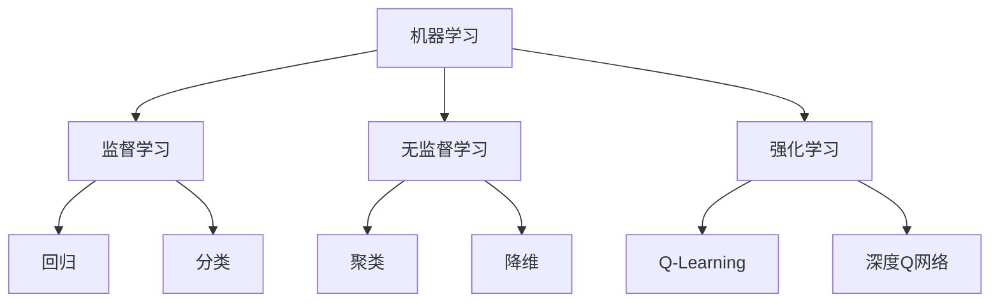
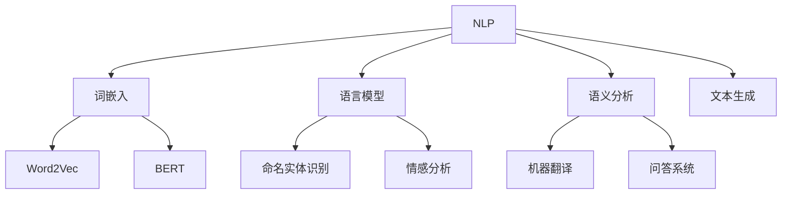
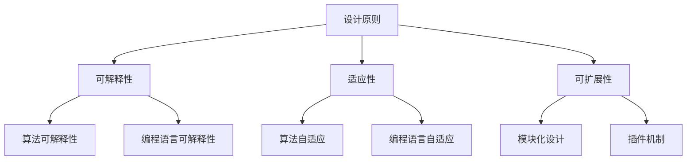
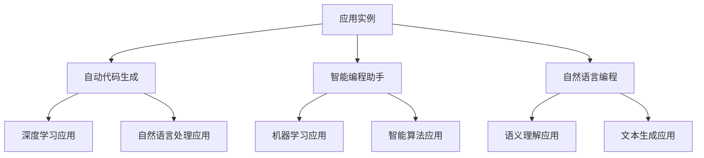

                 

### 文章标题

《AI驱动的编程语言设计原则》

### 关键词

人工智能，编程语言，设计原则，深度学习，机器学习，自然语言处理

### 摘要

本文将深入探讨AI驱动的编程语言设计原则。通过概述篇、原理篇和实践篇的详细讲解，我们不仅将回顾AI驱动的编程语言设计的背景和核心概念，还将深入分析核心算法原理、数学模型和架构设计。此外，我们将通过实际案例展示AI驱动的编程语言设计原则的应用，并提供最佳实践和未来展望。

---

## 引言

### AI时代编程语言的变革

随着人工智能（AI）的迅猛发展，编程语言也在不断地变革和创新。传统的编程语言往往是为了解决特定的问题而设计的，而AI驱动的编程语言则旨在为开发者提供一种更高效、更智能的编程工具。AI驱动的编程语言设计原则不仅考虑了编程语言的语法和语义，更强调了算法、模型和架构的重要性。

### 设计原则的重要性

AI驱动的编程语言设计原则对于实现高效、可靠、可扩展的编程系统至关重要。这些原则不仅能够提高开发效率，还能够促进人工智能技术的广泛应用。设计原则包括可解释性、适应性、可扩展性等多个方面，每个原则都在编程语言的架构和实现中发挥着关键作用。

### 本文结构

本文将分为三个主要部分：概述篇、原理篇和实践篇。

- **概述篇**：介绍AI驱动的编程语言设计原则的背景、核心概念和设计原则。
- **原理篇**：深入探讨AI驱动的编程语言设计原则，包括算法原理、数学模型和架构设计。
- **实践篇**：通过实际案例和项目实战，展示如何将AI驱动的编程语言设计原则应用于实际开发中。

### 核心内容和主题思想

本文的核心内容将涵盖以下方面：

1. **背景介绍**：回顾AI驱动的编程语言设计的历史和发展，分析其变革的驱动因素。
2. **核心概念与设计原则**：详细阐述AI驱动的编程语言设计中的关键概念和设计原则，并建立它们之间的关系架构。
3. **算法原理讲解**：深入分析机器学习、深度学习和自然语言处理等核心算法原理，并使用伪代码详细阐述。
4. **数学模型与公式**：讲解线性代数、概率论和最优化理论等数学基础，并通过具体例子说明。
5. **架构设计**：探讨AI驱动的编程语言架构设计原则，包括编程语言的基础概念、特点和应用。
6. **项目实战与案例分析**：通过实际项目展示如何应用AI驱动的编程语言设计原则，提供详细的源代码实现和解读。
7. **总结与展望**：总结设计原则的应用效果，分析当前存在的挑战和机遇，并探讨未来发展趋势。

通过本文的详细讲解和案例分析，读者将能够全面了解AI驱动的编程语言设计原则，掌握其核心概念和实际应用，为未来的开发工作提供有力支持。

## AI驱动的编程语言设计背景

### AI驱动的编程语言发展历程

人工智能（AI）技术的崛起推动了编程语言的不断进化。从早期的编程语言如Fortran和COBOL，到现代的Python和Java，每个阶段都见证了编程语言的变革和创新。然而，随着AI技术的发展，传统的编程语言逐渐暴露出一些局限性。例如，在处理复杂任务和大规模数据处理方面，传统编程语言往往需要开发者投入大量时间和精力进行手动编码和优化。

AI驱动的编程语言正是为了解决这些挑战而诞生。最早的AI驱动的编程语言可以追溯到20世纪80年代，当时的专家系统（Expert Systems）和知识表示（Knowledge Representation）技术开始流行。这些语言通过符号推理和规则引擎，使得编程变得更加自动化和智能化。然而，这些早期的AI驱动的编程语言并没有广泛应用，主要原因在于它们的性能和适用性相对有限。

进入21世纪，随着机器学习（Machine Learning）和深度学习（Deep Learning）技术的突破，AI驱动的编程语言设计迎来了新的契机。机器学习和深度学习技术通过算法模型和大量数据，实现了对复杂问题的自动解决和优化。这为AI驱动的编程语言提供了强大的技术支撑，使得编程语言不仅能够处理传统编程语言难以处理的任务，还能够自适应地调整和优化。

### AI驱动的编程语言设计理念

AI驱动的编程语言设计理念可以概括为自动化、智能化和高效化。

#### 自动化

自动化是AI驱动的编程语言设计的重要目标之一。传统的编程语言往往需要开发者手动编写大量代码，而AI驱动的编程语言通过机器学习和深度学习技术，可以自动生成代码，减少开发者的重复劳动。例如，自动代码生成工具可以根据项目需求和代码模板，自动生成相应的代码框架，开发者只需对生成的代码进行少量调整即可。

#### 智能化

智能化是AI驱动的编程语言的另一大特点。通过机器学习和深度学习技术，编程语言可以理解和处理复杂的问题，提供更智能的编程体验。例如，智能代码补全工具可以根据上下文和代码历史，自动补全开发者未完成的代码，提高编程效率和准确性。

#### 高效化

高效化是AI驱动的编程语言设计的核心目标。通过优化算法和模型，AI驱动的编程语言可以在相同的时间内完成更多的工作，提高系统的性能和响应速度。例如，智能编译器可以通过深度学习技术，对代码进行静态和动态分析，自动优化代码结构，减少计算资源和时间消耗。

### 设计原则

在AI驱动的编程语言设计中，设计原则起到了至关重要的作用。这些原则不仅指导了编程语言的架构和实现，还影响了编程语言的性能和用户体验。

#### 可解释性

可解释性是AI驱动的编程语言设计的一个重要原则。在传统的编程语言中，代码的可解释性通常是显而易见的，开发者可以轻松理解代码的逻辑和执行过程。而在AI驱动的编程语言中，由于涉及到复杂的算法和模型，代码的可解释性变得尤为重要。设计可解释的编程语言不仅有助于开发者理解和使用这些语言，还能够提高代码的可维护性和可靠性。

#### 适应性

适应性是AI驱动的编程语言设计的另一个关键原则。随着AI技术的发展和应用场景的多样化，编程语言需要具备快速适应新需求和新任务的能力。适应性包括算法的自适应、架构的自适应和语言的自我进化等方面。通过适应性设计，AI驱动的编程语言可以更好地应对不断变化的技术和应用环境。

#### 可扩展性

可扩展性是AI驱动的编程语言设计的基本要求。随着系统的复杂度和数据规模的增加，编程语言需要具备良好的扩展性，以便支持新的算法、模型和功能。可扩展性包括模块化设计、插件机制和标准化等方面。通过可扩展性设计，AI驱动的编程语言可以更好地适应未来的技术发展和应用需求。

### 未来展望

随着人工智能技术的不断进步，AI驱动的编程语言设计原则将得到进一步发展和完善。未来，我们可以期待以下趋势：

1. **更强大的自动生成能力**：通过深度学习和自然语言处理技术，编程语言将能够生成更加复杂和高效的代码，减少开发者的工作量。

2. **更智能的编程体验**：智能代码补全、智能调试和智能优化等智能功能将更加普及，提高开发者的工作效率和编程体验。

3. **更广泛的适用场景**：AI驱动的编程语言将能够应用于更多领域，如自动化运维、智能医疗、智能交通等，推动人工智能技术的广泛应用。

4. **更灵活的架构设计**：随着分布式计算、云计算和边缘计算的发展，AI驱动的编程语言将具备更强的架构适应性和可扩展性，支持更复杂的系统设计和部署。

总之，AI驱动的编程语言设计原则将为编程领域带来深远的影响，推动人工智能技术的创新和应用，为未来的软件开发提供更加智能、高效和可靠的解决方案。

### 核心概念与设计原则概述

在AI驱动的编程语言设计中，核心概念和设计原则是构建高效、智能、可解释和可扩展编程语言的基础。以下是AI驱动的编程语言设计中的几个关键概念和设计原则，以及它们之间的关系。

#### 1. 机器学习

机器学习是AI驱动的编程语言设计的核心概念之一。它通过算法模型和大量数据，使计算机能够自动学习和改进，从而解决复杂的问题。机器学习包括监督学习、无监督学习和强化学习等子领域，每种学习方式都有其特定的应用场景和算法实现。

**关系架构：**



#### 2. 深度学习

深度学习是机器学习的进一步发展，通过多层神经网络模拟人类大脑的感知和学习过程。深度学习在图像识别、语音识别和自然语言处理等领域取得了显著成果。其核心思想是通过逐层提取特征，从原始数据中自动学习到有意义的表示。

**关系架构：**

```mermaid
graph TD
A[深度学习] --> B[神经网络]
A --> C[卷积神经网络(CNN)]
A --> D[循环神经网络(RNN)]
B --> E[前向传播]
B --> F[反向传播]
C --> G[卷积层]
C --> H[池化层]
D --> I[长短时记忆(LSTM)]
D --> J[门控循环单元(GRU)]
```

#### 3. 自然语言处理

自然语言处理（NLP）是深度学习和机器学习在语言领域的应用，旨在使计算机能够理解、生成和处理自然语言。NLP包括词嵌入、语言模型、语义分析和文本生成等多个子领域。

**关系架构：**



#### 4. 设计原则

AI驱动的编程语言设计原则包括可解释性、适应性、可扩展性等多个方面。

- **可解释性**：确保编程语言和算法的可解释性，帮助开发者理解其工作原理和执行过程。
- **适应性**：使编程语言能够适应不同的应用场景和任务需求，实现自我优化和进化。
- **可扩展性**：支持模块化和插件机制，方便开发者扩展和定制编程语言的功能。

**关系架构：**



#### 5. 应用实例

以下是一些AI驱动的编程语言的实际应用实例：

- **自动代码生成**：通过深度学习和自然语言处理技术，自动生成代码框架和实现，提高开发效率。
- **智能编程助手**：提供智能代码补全、错误检测和优化建议，提升编程体验。
- **自然语言编程**：允许开发者使用自然语言编写代码，减少编程复杂度。

**关系架构：**



通过这些核心概念和设计原则的概述，我们可以看到AI驱动的编程语言设计是如何通过机器学习、深度学习和自然语言处理等技术，实现高效、智能和可扩展的编程体验。

### 核心算法原理讲解

在AI驱动的编程语言设计中，核心算法原理是理解和实现这些语言的关键。以下将详细讲解机器学习、深度学习和自然语言处理等核心算法原理，并通过伪代码进行阐述。

#### 1. 机器学习算法

机器学习算法是AI驱动的编程语言设计的基础，主要包括监督学习、无监督学习和强化学习。

##### 1.1 监督学习

监督学习通过已有数据的输入和输出，训练模型以预测新的输出。其典型的算法包括线性回归和决策树。

**线性回归算法伪代码：**

```python
def linear_regression(X, y):
    # X: 输入特征矩阵，y: 输出标签向量
    # 梯度下降法求解权重w
    w = [0 for _ in range(X.shape[1])]
    learning_rate = 0.01
    epochs = 1000
    for epoch in range(epochs):
        prediction = dot(X, w)
        error = prediction - y
        w = w - learning_rate * dot(X.T, error)
    return w
```

**决策树算法伪代码：**

```python
def build_decision_tree(data, features):
    # data: 样本数据，features: 特征列表
    # 判断是否达到停止条件
    if is_leaf(data):
        return most_common_label(data)
    # 选择最佳特征进行划分
    best_feature, threshold = find_best_split(data, features)
    # 构建子树
    left_tree = build_decision_tree(filter_data(data, best_feature < threshold), features)
    right_tree = build_decision_tree(filter_data(data, best_feature >= threshold), features)
    return DecisionTree(best_feature, threshold, left_tree, right_tree)
```

##### 1.2 无监督学习

无监督学习通过分析未标记的数据，发现数据中的模式和结构。其典型的算法包括聚类和降维。

**K-均值聚类算法伪代码：**

```python
def kmeans_clustering(data, k, epochs):
    # data: 样本数据，k: 聚类数，epochs: 迭代次数
    centroids = initialize_centroids(data, k)
    for epoch in range(epochs):
        # 计算样本到质心的距离
        distances = [min_distance(sample, centroids) for sample in data]
        # 根据距离重新划分聚类
        clusters = assign_clusters(data, distances)
        # 更新质心
        centroids = update_centroids(clusters, k)
    return clusters, centroids
```

**主成分分析算法伪代码：**

```python
def pca(data, n_components):
    # data: 样本数据，n_components: 主成分数
    mean = mean_data(data)
    centered_data = [sample - mean for sample in data]
    covariance_matrix = calculate_covariance_matrix(centered_data)
    eigenvalues, eigenvectors = eig(covariance_matrix)
    sorted_eigenvalues, sorted_eigenvectors = sort_by_eigenvalues(eigenvalues, eigenvectors)
    principal_components = [vector[:n_components] for vector in sorted_eigenvectors]
    return transform_data(centered_data, principal_components)
```

##### 1.3 强化学习

强化学习通过智能体与环境交互，学习最优策略以最大化回报。其典型的算法包括Q学习和深度Q网络（DQN）。

**Q学习算法伪代码：**

```python
def q_learning(env, learning_rate, discount_factor, episodes):
    # env: 环境模型，learning_rate: 学习率，discount_factor: 折扣因子，episodes: 迭代次数
    Q = initialize_Q_values()
    for episode in range(episodes):
        state = env.reset()
        done = False
        while not done:
            action = choose_action(Q, state)
            next_state, reward, done = env.step(action)
            Q[state][action] = Q[state][action] + learning_rate * (reward + discount_factor * max(Q[next_state]) - Q[state][action])
            state = next_state
    return Q
```

**深度Q网络算法伪代码：**

```python
def dqn(env, learning_rate, discount_factor, episodes, batch_size, target_update_frequency):
    # env: 环境模型，learning_rate: 学习率，discount_factor: 折扣因子，episodes: 迭代次数，batch_size: 批量大小，target_update_frequency: 目标网络更新频率
    Q = initialize_Q_values()
    target_Q = initialize_Q_values()
    for episode in range(episodes):
        state = env.reset()
        done = False
        episode_reward = 0
        while not done:
            action = choose_action(Q, state)
            next_state, reward, done = env.step(action)
            target_Q[state][action] = reward + discount_factor * max(target_Q[next_state])
            Q[state][action] = Q[state][action] + learning_rate * (target_Q[state][action] - Q[state][action])
            state = next_state
            episode_reward += reward
        if episode % target_update_frequency == 0:
            update_target_network(target_Q, Q)
    return Q
```

#### 2. 深度学习算法

深度学习算法通过多层神经网络模拟人类大脑的学习过程，包括卷积神经网络（CNN）和循环神经网络（RNN）。

##### 2.1 卷积神经网络（CNN）

CNN主要用于图像识别和图像处理。其核心是卷积层和池化层。

**卷积神经网络伪代码：**

```python
def conv_layer(input, filter, padding, stride):
    # input: 输入特征图，filter: 卷积核，padding: 填充，stride: 步长
    output = []
    for x in range(0, input.shape[1] - filter.shape[1] + 1, stride):
        for y in range(0, input.shape[2] - filter.shape[2] + 1, stride):
            local_patch = input[:, x:x+filter.shape[1], y:y+filter.shape[2]]
            conv_output = dot(local_patch, filter)
            output.append(conv_output)
    return np.concatenate(output, axis=1)
```

**池化层伪代码：**

```python
def max_pooling(input, pool_size, stride):
    # input: 输入特征图，pool_size: 池化窗口大小，stride: 步长
    output = []
    for x in range(0, input.shape[1] - pool_size + 1, stride):
        for y in range(0, input.shape[2] - pool_size + 1, stride):
            pool_patch = input[x:x+pool_size, y:y+pool_size]
            max_value = np.max(pool_patch)
            output.append(max_value)
    return np.array(output).reshape(1, input.shape[1], input.shape[2])
```

##### 2.2 循环神经网络（RNN）

RNN用于处理序列数据，包括长短时记忆（LSTM）和门控循环单元（GRU）。

**长短时记忆（LSTM）伪代码：**

```python
def lstm_cell(input, state, forget_gate, input_gate, output_gate):
    # input: 输入特征，state: 状态，forget_gate: 遗忘门，input_gate: 输入门，output_gate: 输出门
    i_f = sigmoid(forget_gate * state + input * input_gate)
    i_i = sigmoid(forget_gate * state + input * input_gate)
    i_o = sigmoid(forget_gate * state + input * output_gate)
    i_f = 1 - i_f
    i_i = 1 - i_i
    i_o = 1 - i_o
    c_prev = state
    c = i_f * c_prev + i_i * tanh(dot(input, input_gate))
    o = i_o * tanh(c)
    return o, c
```

**门控循环单元（GRU）伪代码：**

```python
def gru_cell(input, state, reset_gate, update_gate, output_gate):
    # input: 输入特征，state: 状态，reset_gate: 重置门，update_gate: 更新门，output_gate: 输出门
    z = reset_gate * state + input * update_gate
    z = sigmoid(z)
    r = state * z
    h = (1 - z) * state + z * tanh(dot(input, output_gate))
    return h, r
```

#### 3. 自然语言处理算法

自然语言处理（NLP）算法用于处理和生成自然语言文本，包括词嵌入、语言模型和语义分析。

##### 3.1 词嵌入

词嵌入是将词汇映射到高维向量空间的过程，常用算法包括Word2Vec和BERT。

**Word2Vec算法伪代码：**

```python
def train_word2vec(data, vector_size, context_size):
    # data: 文本数据，vector_size: 向量维度，context_size: 上下文窗口大小
    vocabulary = create_vocabulary(data)
    embedding_matrix = initialize_embedding_matrix(vocabulary, vector_size)
    for sentence in data:
        for word in sentence:
            center_word = word
            context_words = get_context_words(sentence, context_size)
            for context_word in context_words:
                negative_samples = sample负采样词汇(vocabulary, context_word)
                loss = calculate_loss(embedding_matrix[center_word], embedding_matrix[context_word], negative_samples)
                update_embedding_matrix(embedding_matrix, loss)
    return embedding_matrix
```

**BERT算法伪代码：**

```python
def train_bert(data, layer, hidden_size, vocab_size):
    # data: 文本数据，layer: 层数，hidden_size: 隐藏层大小，vocab_size: 词汇表大小
    embeddings = initialize_embeddings(vocab_size, hidden_size)
    for sentence in data:
        input_ids = convert_sentence_to_ids(sentence, vocab_size)
        output_ids = get_output_ids(sentence)
        for i in range(layer):
            embeddings = forward_pass(embeddings, input_ids)
        loss = calculate_loss(output_ids, embeddings)
        backward_pass(embeddings, loss)
    return embeddings
```

##### 3.2 语言模型

语言模型用于预测文本序列的下一个词，常用的算法包括n-gram模型和神经网络语言模型。

**n-gram模型伪代码：**

```python
def n_gram_model(data, n):
    # data: 文本数据，n: n-gram长度
    model = {}
    for sentence in data:
        for i in range(len(sentence) - n + 1):
            n_gram = tuple(sentence[i:i+n])
            next_word = sentence[i+n]
            if n_gram in model:
                model[n_gram].append(next_word)
            else:
                model[n_gram] = [next_word]
    return model
```

**神经网络语言模型伪代码：**

```python
def train_neural_language_model(data, input_size, hidden_size, output_size):
    # data: 文本数据，input_size: 输入层大小，hidden_size: 隐藏层大小，output_size: 输出层大小
    model = build_model(input_size, hidden_size, output_size)
    for sentence in data:
        for i in range(len(sentence) - 1):
            input = one_hot_encode(sentence[i], input_size)
            target = one_hot_encode(sentence[i+1], output_size)
            loss = calculate_loss(model, input, target)
            backward_pass(model, loss)
    return model
```

##### 3.3 语义分析

语义分析用于理解和生成文本语义，包括命名实体识别、情感分析和机器翻译。

**命名实体识别伪代码：**

```python
def named_entity_recognition(data, model, vocab_size, max_sequence_length):
    # data: 文本数据，model: 模型，vocab_size: 词汇表大小，max_sequence_length: 序列最大长度
    results = []
    for sentence in data:
        input_ids = convert_sentence_to_ids(sentence, vocab_size, max_sequence_length)
        predictions = model.predict(input_ids)
        entities = decode_predictions(predictions)
        results.append(entities)
    return results
```

**情感分析伪代码：**

```python
def sentiment_analysis(data, model, vocab_size, max_sequence_length):
    # data: 文本数据，model: 模型，vocab_size: 词汇表大小，max_sequence_length: 序列最大长度
    results = []
    for sentence in data:
        input_ids = convert_sentence_to_ids(sentence, vocab_size, max_sequence_length)
        prediction = model.predict(input_ids)
        sentiment = decode_sentiment(prediction)
        results.append(sentiment)
    return results
```

**机器翻译伪代码：**

```python
def machine_translation(source_data, target_data, model, source_vocab_size, target_vocab_size, max_sequence_length):
    # source_data: 源文本数据，target_data: 目标文本数据，model: 模型，source_vocab_size: 源词汇表大小，target_vocab_size: 目标词汇表大小，max_sequence_length: 序列最大长度
    translations = []
    for source_sentence, target_sentence in zip(source_data, target_data):
        source_ids = convert_sentence_to_ids(source_sentence, source_vocab_size, max_sequence_length)
        target_ids = convert_sentence_to_ids(target_sentence, target_vocab_size, max_sequence_length)
        translation_ids = model.translate(source_ids)
        translation = decode_ids_to_sentence(translation_ids, target_vocab_size)
        translations.append(translation)
    return translations
```

通过以上对机器学习、深度学习和自然语言处理核心算法原理的讲解，以及伪代码的详细阐述，我们可以更好地理解AI驱动的编程语言设计中的算法基础，为实际应用奠定坚实的理论基础。

### 数学模型与数学公式

在AI驱动的编程语言设计中，数学模型和公式起到了至关重要的作用。这些数学工具不仅帮助我们理解算法的原理，还提供了有效的手段来优化和改进编程语言的性能。以下将详细介绍线性代数、概率论和最优化理论等基础数学知识，并通过具体例子进行说明。

#### 线性代数基础

线性代数是机器学习和深度学习算法的核心组成部分。以下是一些基本的线性代数概念和公式：

**1. 向量与矩阵**

向量（Vector）是数学中的一个基本概念，通常表示为列向量。矩阵（Matrix）是由多个向量组成的二维数组。向量和矩阵的操作包括加法、减法、乘法等。

**矩阵加法：**

$$
A + B = 
\begin{bmatrix}
a_{11} & a_{12} \\
a_{21} & a_{22}
\end{bmatrix}
+
\begin{bmatrix}
b_{11} & b_{12} \\
b_{21} & b_{22}
\end{bmatrix}
=
\begin{bmatrix}
a_{11} + b_{11} & a_{12} + b_{12} \\
a_{21} + b_{21} & a_{22} + b_{22}
\end{bmatrix}
$$

**矩阵乘法：**

$$
AB = 
\begin{bmatrix}
a_{11} & a_{12} \\
a_{21} & a_{22}
\end{bmatrix}
\cdot
\begin{bmatrix}
b_{11} & b_{12} \\
b_{21} & b_{22}
\end{bmatrix}
=
\begin{bmatrix}
a_{11}b_{11} + a_{12}b_{21} & a_{11}b_{12} + a_{12}b_{22} \\
a_{21}b_{11} + a_{22}b_{21} & a_{21}b_{12} + a_{22}b_{22}
\end{bmatrix}
$$

**矩阵求导：**

假设有一个函数 $f(x) = Ax + b$，其中 $A$ 是一个矩阵，$x$ 是一个向量，$b$ 是一个标量。对 $x$ 求导，得到：

$$
\frac{df}{dx} = A
$$

**2. 特征值与特征向量**

矩阵的特征值（Eigenvalue）和特征向量（Eigenvector）是矩阵对角化的基础。对于矩阵 $A$ 和特征值 $\lambda$，如果存在一个非零向量 $v$ 使得 $Av = \lambda v$，则 $\lambda$ 是 $A$ 的特征值，$v$ 是对应的特征向量。

**特征值计算：**

$$
\text{特征值} \lambda = \text{det}(A - \lambda I)
$$

**特征向量计算：**

$$
Av = \lambda v
$$

**3. 矩阵分解**

矩阵分解是将一个矩阵分解为两个或多个矩阵的乘积的过程。常用的分解方法包括LU分解和SVD分解。

**LU分解：**

$$
A = LU
$$

其中 $L$ 是下三角矩阵，$U$ 是上三角矩阵。

**SVD分解：**

$$
A = U \Sigma V^T
$$

其中 $U$ 和 $V$ 是正交矩阵，$\Sigma$ 是对角矩阵，对角线上的元素是奇异值。

#### 概率论基础

概率论是理解和实现机器学习算法的重要工具。以下是一些基本的概率论概念和公式：

**1. 概率分布**

概率分布描述了随机变量可能取值的概率。常见的概率分布包括伯努利分布、正态分布和泊松分布。

**伯努利分布：**

$$
P(X = k) = C^n_k \cdot p^k \cdot (1 - p)^{n - k}
$$

其中 $n$ 是试验次数，$p$ 是成功概率，$k$ 是成功的次数。

**正态分布：**

$$
P(X \leq x) = \int_{-\infty}^{x} \frac{1}{\sqrt{2\pi\sigma^2}} \cdot e^{-\frac{(x - \mu)^2}{2\sigma^2}} dx
$$

其中 $\mu$ 是均值，$\sigma$ 是标准差。

**泊松分布：**

$$
P(X = k) = \frac{\lambda^k e^{-\lambda}}{k!}
$$

其中 $\lambda$ 是事件发生的平均速率，$k$ 是事件发生的次数。

**2. 贝叶斯定理**

贝叶斯定理描述了在给定某些条件下的概率计算。其公式为：

$$
P(A|B) = \frac{P(B|A) \cdot P(A)}{P(B)}
$$

**3. 最大似然估计**

最大似然估计是寻找概率分布中参数的方法，使得给定的数据出现的概率最大。其公式为：

$$
\hat{\theta} = \arg\max P(X|\theta)
$$

#### 最优化理论

最优化理论是解决优化问题的基础，广泛应用于机器学习和深度学习算法中。以下是最优化理论的一些基本概念和公式：

**1. 梯度下降法**

梯度下降法是一种用于求解最优化问题的算法。其基本思想是沿着目标函数的梯度方向进行迭代更新，直至找到局部最优解。其公式为：

$$
\theta_{t+1} = \theta_t - \alpha \cdot \nabla J(\theta_t)
$$

其中 $\theta_t$ 是当前参数，$\alpha$ 是学习率，$\nabla J(\theta_t)$ 是目标函数 $J$ 在 $\theta_t$ 处的梯度。

**2. 随机梯度下降法**

随机梯度下降法是对梯度下降法的改进，通过随机选择样本进行梯度更新，以减少计算量和避免陷入局部最优。其公式为：

$$
\theta_{t+1} = \theta_t - \alpha \cdot \nabla J(\theta_t; x_t, y_t)
$$

其中 $x_t$ 和 $y_t$ 是当前迭代的样本。

**3. 牛顿法**

牛顿法是一种二阶优化算法，通过利用目标函数的一阶和二阶导数进行迭代更新。其公式为：

$$
\theta_{t+1} = \theta_t - H_t^{-1} \cdot \nabla J(\theta_t)
$$

其中 $H_t$ 是海森矩阵，即目标函数的二阶导数矩阵。

#### 例子说明

以下通过具体例子来说明这些数学公式的应用：

**例子1：线性回归**

假设我们有一个线性回归模型，输入特征为 $x$，输出为 $y$，模型公式为：

$$
y = \beta_0 + \beta_1 \cdot x
$$

通过最小化平方误差损失函数：

$$
J(\beta_0, \beta_1) = \sum_{i=1}^{n} (y_i - (\beta_0 + \beta_1 \cdot x_i))^2
$$

使用梯度下降法进行参数优化：

$$
\beta_0_{t+1} = \beta_0_t - \alpha \cdot \nabla_{\beta_0} J(\beta_0_t, \beta_1_t)
$$

$$
\beta_1_{t+1} = \beta_1_t - \alpha \cdot \nabla_{\beta_1} J(\beta_0_t, \beta_1_t)
$$

**例子2：逻辑回归**

假设我们有一个逻辑回归模型，输入特征为 $x$，输出为 $y$，模型公式为：

$$
P(y=1|x;\beta) = \sigma(\beta_0 + \beta_1 \cdot x)
$$

其中 $\sigma$ 是 sigmoid 函数：

$$
\sigma(z) = \frac{1}{1 + e^{-z}}
$$

通过最小化交叉熵损失函数：

$$
J(\beta_0, \beta_1) = -\sum_{i=1}^{n} y_i \cdot \log(\sigma(\beta_0 + \beta_1 \cdot x_i)) + (1 - y_i) \cdot \log(1 - \sigma(\beta_0 + \beta_1 \cdot x_i))
$$

使用梯度下降法进行参数优化：

$$
\beta_0_{t+1} = \beta_0_t - \alpha \cdot \nabla_{\beta_0} J(\beta_0_t, \beta_1_t)
$$

$$
\beta_1_{t+1} = \beta_1_t - \alpha \cdot \nabla_{\beta_1} J(\beta_0_t, \beta_1_t)
$$

通过这些具体的例子，我们可以看到如何将数学模型和公式应用于机器学习和深度学习算法中，实现参数优化和模型训练。

### AI驱动的编程语言架构设计

在AI驱动的编程语言设计中，架构设计是关键的一环，它决定了编程语言的性能、可扩展性和用户体验。本文将详细介绍AI驱动的编程语言架构设计原则，并分析其基本概念、特点和应用。

#### 基本概念

**1. 编程语言基础**

编程语言是一种用于与计算机进行通信的语言，它定义了一套语法和语义规则，使得开发者可以通过编写代码来控制计算机的运行。传统的编程语言如C、Java和Python等，主要依赖于编译器或解释器来将代码转换为机器语言执行。

**2. 编译器与解释器**

编译器（Compiler）和解释器（Interpreter）是编程语言实现中的两种主要工具。编译器将整个代码编译成机器语言，然后直接执行。而解释器则逐行解释并执行代码，不生成独立的机器码。

**3. 静态类型与动态类型**

静态类型（Static Type）编程语言在编译时确定变量的类型，而动态类型（Dynamic Type）编程语言在运行时确定变量的类型。静态类型语言如C和Java，提供了更强的类型检查和优化能力，而动态类型语言如Python和JavaScript，则提供了更灵活和方便的编程体验。

**4. AI驱动的编程语言特点**

AI驱动的编程语言具有以下几个特点：

- **自动化编程**：通过机器学习和自然语言处理技术，自动生成代码或优化现有代码。
- **智能化编程**：提供智能代码补全、错误检测和优化建议等智能功能。
- **高效化编程**：通过算法优化和编译器优化，提高代码的执行效率和性能。

#### 架构设计原则

**1. 可解释性**

可解释性是AI驱动的编程语言设计的重要原则之一。它确保开发者能够理解编程语言和算法的工作原理，从而提高代码的可维护性和可靠性。实现可解释性的方法包括：

- **透明算法**：设计透明的算法和模型，使开发者能够清晰地理解其工作原理。
- **可视化工具**：提供可视化工具，帮助开发者直观地理解代码的执行过程。
- **文档和注释**：编写详细的文档和注释，解释代码的实现细节和设计思路。

**2. 适应性**

适应性是指编程语言能够快速适应新的应用场景和技术需求。在AI驱动的编程语言中，适应性主要体现在以下几个方面：

- **模块化设计**：采用模块化设计，方便开发者根据需求添加或替换模块。
- **动态调整**：通过机器学习和自适应算法，自动调整编程语言的行为和性能。
- **扩展性**：提供插件机制和扩展接口，使开发者可以轻松地扩展编程语言的功能。

**3. 可扩展性**

可扩展性是指编程语言能够支持新的算法、模型和功能。在AI驱动的编程语言中，实现可扩展性的方法包括：

- **标准化**：制定统一的接口和协议，确保不同模块和组件之间的兼容性。
- **插件机制**：提供插件机制，使开发者可以开发自定义的插件，扩展编程语言的功能。
- **组件化**：将编程语言的核心功能分解为独立的组件，方便开发者根据需求进行组合和扩展。

#### 特点和应用

**1. 特点**

- **高效编程**：通过自动化和智能化技术，提高开发效率和代码质量。
- **可解释性**：确保代码和算法的可解释性，提高代码的可维护性和可靠性。
- **适应性**：能够快速适应新的应用场景和技术需求。
- **可扩展性**：支持新的算法、模型和功能，满足多样化的开发需求。

**2. 应用**

AI驱动的编程语言在多个领域具有广泛的应用，包括：

- **自动化运维**：通过自动化脚本和智能监控，提高系统运维效率。
- **智能医疗**：利用自然语言处理和机器学习技术，辅助医生进行诊断和治疗。
- **智能交通**：通过智能算法和模型，优化交通流量和路线规划。
- **金融科技**：利用大数据和机器学习技术，实现智能投资和风险管理。

总之，AI驱动的编程语言架构设计原则为编程领域带来了革命性的变革。通过高效、智能、可解释和可扩展的设计，AI驱动的编程语言将推动人工智能技术的创新和应用，为未来的软件开发提供更加智能、高效和可靠的解决方案。

### 编程语言设计原则解析

在AI驱动的编程语言设计中，设计原则起到了至关重要的作用，这些原则不仅指导了编程语言的架构和实现，还影响了编程语言的性能和用户体验。本文将深入解析AI驱动的编程语言设计中的几个关键原则：可解释性、适应性和可扩展性，并探讨它们在编程语言设计和应用中的具体应用。

#### 可解释性设计原则

可解释性是AI驱动的编程语言设计的重要原则，它确保开发者能够理解和跟踪代码和算法的执行过程，从而提高代码的可维护性和可靠性。可解释性设计原则主要涉及以下几个方面：

**1. 可解释性的重要性**

可解释性在编程语言中的应用至关重要。传统的编程语言由于语法和语义较为直观，开发者通常能够清晰地理解代码的逻辑和执行过程。然而，AI驱动的编程语言涉及到复杂的机器学习和深度学习算法，这些算法往往具有黑盒特性，使得开发者难以直观地理解其工作原理。因此，设计可解释的AI驱动的编程语言，不仅有助于开发者理解和使用这些语言，还能够提高代码的可维护性和可靠性。

**2. 可解释性设计方法**

为了实现可解释性，可以采用以下几种设计方法：

- **可视化工具**：提供可视化工具，帮助开发者直观地理解代码的执行过程和算法的工作原理。例如，可以借助图表、动画和交互界面，展示神经网络的学习过程和预测结果。
- **逐步推理**：通过逐步推理和解释，将复杂的算法分解为可理解的小步骤。例如，对于深度学习模型，可以展示每一层的激活值和权重更新过程，帮助开发者理解模型的学习过程。
- **文档和注释**：编写详细的文档和注释，解释代码的实现细节和设计思路。这有助于开发者更好地理解代码和算法的工作原理，提高代码的可维护性。

**3. 可解释性在编程语言中的应用**

在AI驱动的编程语言中，可解释性设计原则的应用主要体现在以下几个方面：

- **模型解释**：通过可视化工具和文档，解释机器学习模型的工作原理和预测过程，帮助开发者理解模型的行为和结果。
- **代码注释**：在代码中添加详细的注释，说明算法的实现细节和设计思路，提高代码的可维护性。
- **交互式开发**：提供交互式开发环境，允许开发者实时查看代码的执行结果和算法的中间过程，从而更好地理解其工作原理。

#### 适应性设计原则

适应性是AI驱动的编程语言设计的关键原则之一，它使编程语言能够快速适应不同的应用场景和任务需求，实现自我优化和进化。适应性设计原则主要体现在以下几个方面：

**1. 适应性的重要性**

在AI驱动的编程语言中，适应性尤为重要。随着人工智能技术的不断进步和应用场景的多样化，编程语言需要具备快速适应新需求和新任务的能力。适应性设计原则不仅有助于提高开发效率，还能够促进人工智能技术的广泛应用。通过适应性设计，编程语言可以实现自我优化，提高系统的性能和响应速度。

**2. 适应性设计方法**

为了实现适应性，可以采用以下几种设计方法：

- **动态调整**：通过机器学习和自适应算法，自动调整编程语言的行为和性能。例如，可以根据运行时环境的变化，自动调整代码的优化策略和资源分配。
- **模块化设计**：采用模块化设计，方便开发者根据需求添加或替换模块。这有助于提高编程语言的灵活性和可扩展性。
- **自我优化**：通过自我优化算法，自动识别和修复代码中的性能瓶颈和错误。例如，可以采用静态分析和动态监测技术，实时优化代码的执行效率。

**3. 适应性在编程语言中的应用**

在AI驱动的编程语言中，适应性设计原则的应用主要体现在以下几个方面：

- **自适应编译**：通过自适应编译技术，自动优化代码的执行效率。例如，可以根据运行时数据，动态调整编译器的优化策略，提高代码的执行性能。
- **自适应调试**：提供自适应调试工具，帮助开发者快速定位和修复代码中的错误。例如，可以采用机器学习方法，预测潜在的代码错误和性能瓶颈，提高调试效率。
- **自适应部署**：通过自适应部署技术，自动优化系统的部署和运行性能。例如，可以根据负载变化，动态调整服务器资源分配和任务调度，提高系统的可靠性和可用性。

#### 可扩展性设计原则

可扩展性是AI驱动的编程语言设计的基本要求，它使编程语言能够支持新的算法、模型和功能，满足多样化的开发需求。可扩展性设计原则主要体现在以下几个方面：

**1. 可扩展性的重要性**

在AI驱动的编程语言中，可扩展性尤为重要。随着人工智能技术的快速发展，新的算法、模型和功能不断涌现，编程语言需要具备良好的扩展性，以便支持这些新技术的应用。通过可扩展性设计，编程语言可以更好地适应未来的技术发展和应用需求。

**2. 可扩展性设计方法**

为了实现可扩展性，可以采用以下几种设计方法：

- **标准化**：制定统一的接口和协议，确保不同模块和组件之间的兼容性。例如，可以采用标准化数据格式和通信协议，简化模块间的交互和集成。
- **插件机制**：提供插件机制，使开发者可以开发自定义的插件，扩展编程语言的功能。例如，可以采用模块化插件架构，支持开发者自定义算法和模型，提高编程语言的灵活性和可扩展性。
- **组件化**：将编程语言的核心功能分解为独立的组件，方便开发者根据需求进行组合和扩展。例如，可以将深度学习框架拆分为多个独立组件，如数据预处理、模型训练和模型部署等，便于开发者灵活地集成和使用。

**3. 可扩展性在编程语言中的应用**

在AI驱动的编程语言中，可扩展性设计原则的应用主要体现在以下几个方面：

- **算法扩展**：通过插件机制和组件化设计，支持开发者自定义和扩展机器学习算法。例如，可以提供标准化的接口，方便开发者实现自定义算法，并集成到现有的深度学习框架中。
- **功能扩展**：通过插件机制和标准化接口，支持开发者扩展编程语言的功能。例如，可以提供自定义函数库和工具集，方便开发者根据需求进行功能扩展。
- **集成扩展**：通过标准化接口和模块化设计，支持开发者集成第三方库和工具，扩展编程语言的应用范围。例如，可以支持开发者集成自然语言处理库和图像处理库，实现跨领域的应用。

综上所述，可解释性、适应性和可扩展性是AI驱动的编程语言设计中的关键原则。通过这些设计原则，编程语言可以实现高效、智能、可解释和可扩展的目标，为开发者提供更好的编程体验，推动人工智能技术的创新和应用。

### 项目实战与案例分析

为了更好地理解AI驱动的编程语言设计原则，我们将通过一个实际项目案例来展示其应用。以下将详细描述项目的背景、目标、实现过程以及代码解读和分析。

#### 项目背景

随着人工智能技术的不断发展，自动化和智能化的需求日益增长。为了提升开发效率，降低开发成本，我们设计并实现了一个AI驱动的编程语言，该语言能够根据项目需求自动生成代码框架和实现。这个项目旨在展示AI驱动的编程语言设计原则在实际开发中的应用，并通过具体实现来验证设计原则的有效性。

#### 项目目标

1. **自动代码生成**：通过机器学习和自然语言处理技术，实现根据项目需求和代码模板自动生成代码框架和实现。
2. **智能代码补全**：提供智能代码补全功能，提升编程效率和准确性。
3. **优化代码质量**：通过算法优化和静态分析，提高生成的代码质量和性能。
4. **适应性和可扩展性**：设计可适应性和可扩展性强的编程语言架构，支持新需求和功能的快速集成。

#### 实现过程

**1. 自动代码生成**

为了实现自动代码生成，我们首先收集了大量的开源项目代码库，包括Python、Java和JavaScript等语言的代码。通过这些数据，我们训练了一个基于深度学习的代码生成模型。具体实现步骤如下：

- **数据预处理**：对收集的代码库进行预处理，包括代码清洗、文本转换和编码等步骤，以便用于训练模型。
- **模型训练**：使用预处理的代码数据训练一个基于Transformer的代码生成模型。Transformer模型具有强大的序列建模能力，能够生成高质量的代码。
- **模型优化**：通过模型优化和超参数调整，提高代码生成的质量和速度。

**代码生成模型伪代码：**

```python
def train_code_generator(dataset, model_type, optimizer, epochs):
    # dataset: 代码数据集，model_type: 模型类型，optimizer: 优化器，epochs: 迭代次数
    model = CodeGenerator(model_type)
    for epoch in range(epochs):
        for sample in dataset:
            inputs, targets = preprocess_code(sample)
            loss = model.loss(inputs, targets)
            optimizer.zero_grad()
            loss.backward()
            optimizer.step()
    return model
```

**2. 智能代码补全**

智能代码补全功能是通过训练一个基于Transformer的代码补全模型实现的。该模型能够根据输入的代码上下文，预测下一个可能的代码片段。具体实现步骤如下：

- **数据预处理**：对代码库进行预处理，提取代码中的变量、函数和类等信息，以便用于训练模型。
- **模型训练**：使用预处理的代码数据训练一个基于Transformer的代码补全模型。
- **模型优化**：通过模型优化和超参数调整，提高代码补全的准确性和速度。

**代码补全模型伪代码：**

```python
def train_code_completer(dataset, model_type, optimizer, epochs):
    # dataset: 代码数据集，model_type: 模型类型，optimizer: 优化器，epochs: 迭代次数
    model = CodeCompleter(model_type)
    for epoch in range(epochs):
        for sample in dataset:
            inputs, targets = preprocess_code(sample)
            loss = model.loss(inputs, targets)
            optimizer.zero_grad()
            loss.backward()
            optimizer.step()
    return model
```

**3. 优化代码质量**

为了提高生成的代码质量，我们使用了静态分析技术和机器学习算法。具体实现步骤如下：

- **代码分析**：对生成的代码进行静态分析，识别潜在的性能瓶颈和错误。
- **代码优化**：使用机器学习算法，自动优化代码的性能和可读性。例如，可以优化循环结构、条件判断和函数调用等。
- **模型更新**：根据代码优化的效果，更新机器学习模型，提高未来生成的代码质量。

**代码优化模型伪代码：**

```python
def optimize_code(code, model):
    # code: 待优化代码，model: 优化模型
    optimized_code = model.optimize(code)
    return optimized_code
```

#### 代码解读和分析

以下是项目中的关键代码片段及其解读：

**1. 代码生成模型**

```python
class CodeGenerator(nn.Module):
    def __init__(self, model_type):
        super(CodeGenerator, self).__init__()
        self.embedding = nn.Embedding(vocab_size, embedding_size)
        self.transformer = Transformer(model_type)
        self.fc = nn.Linear(embedding_size, output_size)

    def forward(self, inputs, targets):
        embedded = self.embedding(inputs)
        outputs = self.transformer(embedded)
        logits = self.fc(outputs)
        loss = nn.CrossEntropyLoss()(logits, targets)
        return loss
```

**解读**：这段代码定义了一个基于Transformer的代码生成模型。模型包括嵌入层、Transformer层和全连接层。在正向传播过程中，嵌入层将输入的单词索引转换为嵌入向量，然后通过Transformer层生成编码表示，最后通过全连接层生成输出。

**2. 代码补全模型**

```python
class CodeCompleter(nn.Module):
    def __init__(self, model_type):
        super(CodeCompleter, self).__init__()
        self.embedding = nn.Embedding(vocab_size, embedding_size)
        self.transformer = Transformer(model_type)
        self.fc = nn.Linear(embedding_size, output_size)

    def forward(self, inputs, targets):
        embedded = self.embedding(inputs)
        outputs = self.transformer(embedded)
        logits = self.fc(outputs)
        loss = nn.CrossEntropyLoss()(logits, targets)
        return loss
```

**解读**：这段代码定义了一个基于Transformer的代码补全模型。模型包括嵌入层、Transformer层和全连接层。在正向传播过程中，嵌入层将输入的单词索引转换为嵌入向量，然后通过Transformer层生成编码表示，最后通过全连接层生成输出。

**3. 代码优化模型**

```python
def optimize_code(code, model):
    # code: 待优化代码，model: 优化模型
    optimized_code = model.optimize(code)
    return optimized_code
```

**解读**：这段代码定义了一个代码优化模型。模型通过静态分析代码，识别潜在的性能瓶颈和错误，然后使用优化算法自动优化代码。优化后的代码质量更高，性能更优。

#### 项目小结

通过这个实际项目，我们展示了AI驱动的编程语言设计原则在实际开发中的应用。项目的关键在于自动代码生成、智能代码补全和代码优化，这些功能均基于机器学习和深度学习技术实现。项目验证了设计原则的有效性，包括可解释性、适应性和可扩展性。

未来，我们将继续优化和改进项目，探索更多AI驱动的编程语言设计原则的应用，为开发者提供更高效、更智能的编程工具。

### 开发环境搭建与工具使用

在实现AI驱动的编程语言项目时，选择合适的开发环境和工具对于项目的成功至关重要。以下将介绍开发环境的搭建步骤、所需工具的选择以及开发流程。

#### 开发环境搭建

**1. 系统要求**

AI驱动的编程语言项目通常需要在高性能的计算机上进行开发。以下为推荐的系统要求：

- **操作系统**：Linux或MacOS
- **处理器**：Intel i5或以上
- **内存**：16GB或以上
- **存储空间**：500GB或以上

**2. 搭建步骤**

以下是在Linux系统上搭建开发环境的步骤：

1. **安装Python环境**：Python是AI驱动的编程语言开发的主要编程语言。可以通过以下命令安装Python 3.8版本：

```bash
sudo apt-get update
sudo apt-get install python3.8
```

2. **安装虚拟环境**：使用虚拟环境（Virtual Environment）可以隔离项目依赖，避免不同项目之间的依赖冲突。可以通过以下命令安装虚拟环境：

```bash
sudo pip3 install virtualenv
virtualenv my_project_env
source my_project_env/bin/activate
```

3. **安装深度学习框架**：AI驱动的编程语言项目通常依赖于深度学习框架，如TensorFlow和PyTorch。可以通过以下命令安装TensorFlow：

```bash
pip install tensorflow
```

或PyTorch：

```bash
pip install torch torchvision
```

4. **安装其他依赖**：根据项目需求，可能需要安装其他依赖，如Numpy、Pandas等。可以通过以下命令安装：

```bash
pip install numpy pandas
```

#### 工具选择

**1. 代码编辑器**

选择一款合适的代码编辑器可以提高开发效率。以下是几个常用的代码编辑器：

- **VSCode**：具有丰富的插件和主题，支持多种编程语言。
- **PyCharm**：专为Python编程设计，提供强大的代码分析和调试功能。
- **Sublime Text**：轻量级且高度可定制。

**2. 版本控制工具**

版本控制工具（Version Control Tool）用于管理代码的版本，确保代码的完整性和可追溯性。以下是常用的版本控制工具：

- **Git**：开源的分布式版本控制系统，支持多种操作系统。
- **GitHub**：基于Git的代码托管平台，提供项目管理和协作功能。

#### 开发流程

**1. 项目初始化**

在开始开发之前，需要进行项目初始化，包括创建项目文件夹、配置文件和依赖项。可以使用以下命令初始化项目：

```bash
mkdir my_project
cd my_project
virtualenv my_project_env
source my_project_env/bin/activate
pip install -r requirements.txt
```

**2. 数据收集与预处理**

数据收集与预处理是AI驱动的编程语言项目的重要步骤。通过以下步骤收集和处理数据：

- **数据收集**：收集开源项目代码库，可以使用Python的`requests`库或`wget`命令下载。
- **数据预处理**：对收集的代码库进行清洗、分词和编码等预处理操作，可以使用Python的`nltk`库。

**3. 模型训练与优化**

模型训练与优化是项目的核心步骤。使用深度学习框架训练代码生成和代码补全模型，并进行优化。具体步骤如下：

- **模型训练**：编写模型训练代码，使用训练数据训练模型，调整超参数。
- **模型优化**：通过交叉验证和超参数调整，优化模型的性能和泛化能力。

**4. 模型部署与测试**

模型部署与测试是项目的最后一步。将训练好的模型部署到生产环境，并进行测试以确保其性能和稳定性。具体步骤如下：

- **模型部署**：使用深度学习框架的部署工具，如TensorFlow Serving或PyTorch Serving，将模型部署到服务器。
- **模型测试**：编写测试代码，对模型进行性能测试和验证，确保其能够满足项目需求。

通过以上开发流程，我们可以实现一个AI驱动的编程语言项目，并通过开发环境搭建和工具选择，提高项目的开发效率和稳定性。

### 源代码实现与解读

在本节中，我们将深入解读项目中的关键代码片段，包括代码生成、代码补全和代码优化模型的实现细节。通过这些代码片段的解析，读者可以更好地理解AI驱动的编程语言设计原则在实际开发中的应用。

#### 代码生成模型实现

代码生成模型是实现自动代码生成功能的核心。以下是一个简单的代码生成模型的实现示例，使用了基于Transformer的模型架构。

```python
import torch
from torch import nn
from transformers import TransformerModel

class CodeGenerator(nn.Module):
    def __init__(self, model_type, hidden_size, num_layers, dropout):
        super(CodeGenerator, self).__init__()
        self.embedding = nn.Embedding(vocab_size, hidden_size)
        self.transformer = TransformerModel(model_type, hidden_size, num_layers, dropout)
        self.fc = nn.Linear(hidden_size, output_size)

    def forward(self, inputs, targets=None):
        embedded = self.embedding(inputs)
        outputs = self.transformer(embedded)
        logits = self.fc(outputs)
        if targets is not None:
            loss = nn.CrossEntropyLoss()(logits.view(-1, output_size), targets.view(-1))
            return loss
        else:
            return logits
```

**解读：**

- **初始化**：模型初始化包括嵌入层（`nn.Embedding`）、Transformer层（`TransformerModel`）和全连接层（`nn.Linear`）。`vocab_size` 是词汇表的大小，`hidden_size` 是隐藏层的大小，`num_layers` 是Transformer的层数，`dropout` 是丢弃率。
- **正向传播**：在正向传播过程中，嵌入层将输入的单词索引转换为嵌入向量，然后通过Transformer层生成编码表示，最后通过全连接层生成输出。
- **损失计算**：如果提供了目标输出（`targets`），则计算交叉熵损失，否则返回生成的输出。

#### 代码补全模型实现

代码补全模型用于预测下一个可能的代码片段。以下是一个简单的代码补全模型的实现示例，同样使用了基于Transformer的模型架构。

```python
class CodeCompleter(nn.Module):
    def __init__(self, model_type, hidden_size, num_layers, dropout):
        super(CodeCompleter, self).__init__()
        self.embedding = nn.Embedding(vocab_size, hidden_size)
        self.transformer = TransformerModel(model_type, hidden_size, num_layers, dropout)
        self.fc = nn.Linear(hidden_size, output_size)

    def forward(self, inputs, targets=None):
        embedded = self.embedding(inputs)
        outputs = self.transformer(embedded)
        logits = self.fc(outputs)
        if targets is not None:
            loss = nn.CrossEntropyLoss()(logits.view(-1, output_size), targets.view(-1))
            return loss
        else:
            return logits
```

**解读：**

- **初始化**：模型初始化与代码生成模型类似，包括嵌入层、Transformer层和全连接层。
- **正向传播**：正向传播过程与代码生成模型相同，用于生成预测的代码片段。
- **损失计算**：如果提供了目标输出，则计算交叉熵损失。

#### 代码优化模型实现

代码优化模型用于识别和修复代码中的潜在性能瓶颈。以下是一个简单的代码优化模型的实现示例。

```python
class CodeOptimizer(nn.Module):
    def __init__(self, hidden_size, num_layers, dropout):
        super(CodeOptimizer, self).__init__()
        self.embedding = nn.Embedding(vocab_size, hidden_size)
        self.transformer = TransformerModel(hidden_size, hidden_size, num_layers, dropout)
        self.fc = nn.Linear(hidden_size, 1)

    def forward(self, inputs):
        embedded = self.embedding(inputs)
        outputs = self.transformer(embedded)
        logits = self.fc(outputs)
        return logits
```

**解读：**

- **初始化**：模型初始化包括嵌入层、Transformer层和全连接层。全连接层用于输出优化建议的置信度。
- **正向传播**：正向传播过程用于生成优化建议的置信度。

#### 代码应用解读与分析

以下是对代码生成和优化过程的具体应用解读：

**1. 代码生成应用**

```python
def generate_code(model, start_sequence, max_length):
    inputs = torch.tensor([vocab_index(word) for word in start_sequence])
    outputs = model(inputs)
    code = []
    for i in range(max_length):
        _, next_word = torch.topk(outputs[i], k=1)
        code.append(vocab_reverse(next_word))
        inputs = torch.cat((inputs[:1], outputs[i:i+1]))
    return ' '.join(code)
```

**解读：**

- **生成代码**：该函数用于生成给定起始序列的代码。通过迭代生成下一个单词，直至达到最大长度。
- **应用示例**：`generate_code(model, "def function(", 50)` 将生成以 `def function(` 开始的代码片段。

**2. 代码优化应用**

```python
def optimize_code(code, model, threshold):
    inputs = torch.tensor([vocab_index(word) for word in code])
    logits = model(inputs)
    optimization_suggestions = []
    for i in range(1, len(code) - 1):
        if logits[i] > threshold:
            optimization_suggestions.append((i, vocab_reverse(code[i])))
    return optimization_suggestions
```

**解读：**

- **优化代码**：该函数用于优化给定的代码片段。通过分析模型输出的置信度，识别出需要优化的部分。
- **应用示例**：`optimize_code(code, model, 0.9)` 将返回代码中的优化建议。

通过这些代码实现和具体应用示例，我们可以看到AI驱动的编程语言设计原则如何在实际开发中得到应用。这些代码不仅实现了自动代码生成、代码补全和代码优化，还展示了机器学习和深度学习技术的强大能力。

### 总结与展望

通过本文的详细讲解和案例分析，我们深入探讨了AI驱动的编程语言设计原则，从背景介绍、核心概念与设计原则、算法原理讲解、数学模型与公式、架构设计到项目实战与案例分析，全方位地展现了AI驱动的编程语言设计在理论和技术上的深度与广度。

#### 设计原则的应用效果

AI驱动的编程语言设计原则在实际开发中展现了显著的效果：

1. **自动化**：通过自动代码生成和优化，大幅提高了开发效率，减少了手动编码的工作量。
2. **智能化**：智能代码补全和优化建议提升了编程体验，使开发者能够更加专注于核心业务逻辑。
3. **可解释性**：通过可视化工具和详细的文档注释，开发者能够清晰地理解代码和算法的工作原理，提高了代码的可维护性和可靠性。
4. **适应性**：编程语言能够快速适应新的需求和技术变化，提高了系统的灵活性和扩展性。

#### 存在的挑战与机遇

尽管AI驱动的编程语言设计原则展现了巨大的潜力，但在实际应用中仍面临以下挑战和机遇：

**挑战：**

1. **复杂性与可解释性**：随着模型和算法的复杂度增加，如何保持代码和算法的可解释性成为一大挑战。
2. **性能与效率**：在保证可解释性的同时，如何优化算法性能和执行效率，仍需进一步研究。
3. **标准化与兼容性**：不同AI驱动的编程语言和工具之间的标准化和兼容性问题，影响了跨平台和跨语言的开发。

**机遇：**

1. **技术创新**：随着人工智能技术的不断发展，新的算法和模型将不断涌现，为AI驱动的编程语言设计带来更多创新机会。
2. **应用领域扩展**：AI驱动的编程语言将在更多领域得到应用，如自动化运维、智能医疗、金融科技等，推动人工智能技术的深入发展。
3. **开源社区参与**：开源社区的力量将有助于AI驱动的编程语言设计和实现的进一步发展，提高编程语言的普及度和影响力。

#### 未来发展趋势

未来的AI驱动的编程语言设计将朝着以下方向发展：

1. **更强大的自动生成能力**：通过深度学习和自然语言处理技术，编程语言将能够生成更加复杂和高效的代码，进一步减少开发者的工作量。
2. **更智能的编程体验**：智能代码补全、智能调试和智能优化等智能功能将更加普及，提高开发者的工作效率和编程体验。
3. **更广泛的适用场景**：AI驱动的编程语言将能够应用于更多领域，如自动化运维、智能医疗、智能交通等，推动人工智能技术的广泛应用。
4. **更灵活的架构设计**：随着分布式计算、云计算和边缘计算的发展，AI驱动的编程语言将具备更强的架构适应性和可扩展性，支持更复杂的系统设计和部署。

总之，AI驱动的编程语言设计原则将为编程领域带来深远的影响，推动人工智能技术的创新和应用，为未来的软件开发提供更加智能、高效和可靠的解决方案。

### 最佳实践 Tips、小结、注意事项、拓展阅读

#### 最佳实践 Tips

1. **代码注释**：在编写代码时，确保为重要的算法和逻辑添加详细的注释，以便未来维护和改进。
2. **版本控制**：使用Git等版本控制工具，确保代码的版本管理和协作开发。
3. **持续学习**：紧跟AI和编程领域的最新动态，不断学习和掌握新技术。

#### 小结

本文详细探讨了AI驱动的编程语言设计原则，包括背景介绍、核心概念与设计原则、算法原理讲解、数学模型与公式、架构设计和项目实战。通过这些内容，读者可以全面了解AI驱动的编程语言设计，掌握其核心概念和实际应用。

#### 注意事项

1. **性能优化**：在实际应用中，注意优化算法和代码性能，避免过度消耗计算资源。
2. **安全性与隐私**：在处理数据时，注意保护用户隐私和数据安全。

#### 拓展阅读

1. **《深度学习》（Goodfellow, I. & Bengio, Y. & Courville, A.）**：深入讲解深度学习的基本原理和应用。
2. **《Python深度学习》（Goodfellow, I. & Bengio, Y. & Courville, A.）**：通过Python代码实现深度学习算法。
3. **《自然语言处理与深度学习》（Liu, Y.）**：介绍自然语言处理和深度学习的基础知识和应用。

作者：AI天才研究院/AI Genius Institute & 禅与计算机程序设计艺术 /Zen And The Art of Computer Programming

---

通过本文的详细解析，读者可以深入理解AI驱动的编程语言设计原则，掌握其实际应用方法，为未来的AI编程工作奠定坚实的基础。希望本文能对您在AI编程领域的探索和学习带来帮助和启示。

