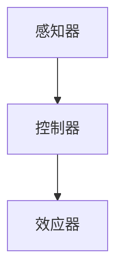
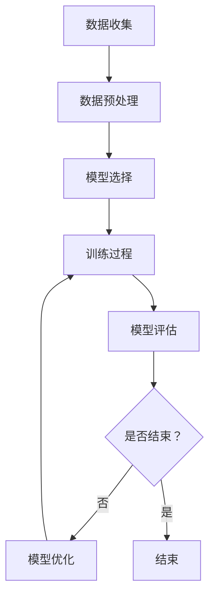
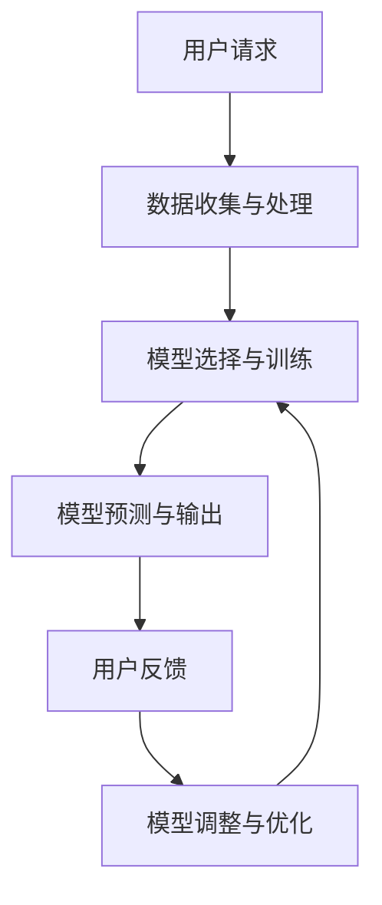

                 

### 引言：AI驱动的软件开发概述

#### 什么是AI驱动的软件开发

AI驱动的软件开发，是指通过人工智能技术，尤其是机器学习和深度学习，来辅助或完全取代传统软件开发中的某些环节。这种开发模式强调自动化和智能化，使得软件开发过程更加高效、精准和可预测。

AI驱动的软件开发并非新鲜事物，但其在近年来得到了迅猛发展。随着计算能力的提升、大数据技术的普及以及深度学习算法的突破，AI在软件领域的应用逐渐深入，涵盖了从数据预处理到模型训练、部署和优化的各个环节。

#### 为什么AI驱动的软件开发重要

AI驱动的软件开发之所以重要，主要源于以下几个方面：

1. **提升开发效率**：AI技术能够自动化处理一些繁琐的软件开发任务，如代码生成、测试、调试等，从而显著提高开发效率。

2. **增强软件智能**：通过AI技术，软件可以更好地理解和处理复杂数据，实现智能推荐、智能交互等功能，提升用户体验。

3. **优化决策过程**：AI驱动的软件开发可以基于历史数据和实时数据分析，提供更加精准的决策支持，降低人为错误，提高决策效率。

4. **降低开发成本**：自动化和智能化的软件开发流程有助于减少人力资源的投入，从而降低整体开发成本。

5. **创新应用场景**：AI驱动的软件开发为新业务模式和新应用场景的探索提供了无限可能，如自动化运维、智能医疗、智能交通等。

#### 本书结构安排

本书旨在深入探讨AI驱动的软件开发，从理论到实践，提供全方位的指导。具体结构安排如下：

- **第一章**：引言，概述AI驱动的软件开发的概念、重要性及其发展历程。

- **第二章**：AI驱动的软件开发原理，详细介绍AI核心概念、数据驱动方法以及模型训练与优化。

- **第三章**：AI驱动的软件开发技术栈，分析机器学习框架、深度学习技术、自然语言处理和计算机视觉等关键技术。

- **第四章**：AI驱动的软件开发实践，介绍开发流程、数据收集与处理、模型选择与调优以及部署与监控。

- **第五章**：AI驱动的软件开发挑战，探讨数据质量、模型可解释性、安全性与隐私、法律与伦理等方面的问题。

- **第六章**：未来展望与趋势，分析AI驱动的软件开发的发展趋势、可能面临的挑战与机遇。

#### 阅读指南

本书适合对AI驱动的软件开发感兴趣的读者，无论是初学者还是有经验的技术人员，都能从中获得有价值的信息。本书结构清晰，内容丰富，既有深入的理论讲解，也有实用的实战案例。希望通过本书，读者能够：

- 理解AI驱动的软件开发的本质和核心概念。
- 掌握AI驱动的软件开发的技术栈和应用场景。
- 学会解决AI驱动的软件开发中遇到的各种挑战。
- 对未来AI驱动的软件开发的发展趋势有清晰的认识。

#### 目标读者

本书的目标读者主要包括：

- **软件开发工程师**：希望了解和掌握AI驱动的软件开发技术的开发人员。
- **数据科学家**：需要对AI技术在软件开发中应用的专家。
- **AI领域研究人员**：希望深入了解AI驱动的软件开发原理、技术栈和挑战的研究者。
- **高校师生**：计算机科学、软件工程等相关专业的师生，可作为教材或参考书籍。
- **技术管理者**：需要了解AI驱动的软件开发对企业的影响和机会的管理者。

通过本书，读者将能够全面了解AI驱动的软件开发，掌握相关技术，并能够将AI技术应用于实际的软件开发项目中，提升开发效率，创造更多价值。### AI驱动的软件开发原理

#### AI核心概念与架构

人工智能（AI）是计算机科学的一个分支，旨在使机器能够执行通常需要人类智能才能完成的任务。AI系统通常包括多个关键组件，如感知器、控制器和效应器，共同协作实现智能行为。

1. **感知器**：用于接收外部输入，如视觉、听觉、触觉等传感器数据。
2. **控制器**：基于感知器的输入和预定义的算法，生成适当的响应。
3. **效应器**：将控制器的输出转换为实际动作，如机器人手臂的运动、自动驾驶车辆的驾驶等。

**架构示例**：



#### 数据驱动方法

数据驱动方法是AI驱动的软件开发的核心。它依赖于大量高质量的数据来训练模型，使其能够学习和预测。

1. **数据收集**：从各种来源收集数据，如用户行为、传感器数据、社交媒体数据等。
2. **数据预处理**：清洗和格式化数据，以消除噪声、填补缺失值和标准化数据。
3. **数据分析**：使用统计和机器学习技术来探索数据，提取特征和模式。

#### 模型训练与优化

1. **模型选择**：选择适合问题的机器学习模型，如线性回归、决策树、神经网络等。
2. **训练过程**：使用训练数据集来训练模型，通过调整模型参数来优化性能。
3. **优化策略**：包括超参数调整、正则化、交叉验证等，以提高模型泛化能力。

**伪代码**：

```python
# 初始化模型
model = initialize_model()

# 训练模型
for epoch in range(num_epochs):
    for sample in training_samples:
        model.train(sample)

# 评估模型
performance = model.evaluate(test_samples)

# 调优模型
while performance < threshold:
    model.tune_hyperparameters()
    performance = model.evaluate(test_samples)
```

#### 数学模型与公式

1. **线性回归模型**：

   $$y = \beta_0 + \beta_1x$$

2. **分类算法**：

   $$P(y = c_k|x; \theta) = \frac{e^{\theta^T x_k}}{\sum_{k=1}^{K} e^{\theta^T x_k}}$$

3. **神经网络模型**：

   $$a_{\text{layer} i} = \sigma(\theta_i^T a_{\text{layer} (i-1)})$$

   其中，$\sigma$为激活函数，如Sigmoid或ReLU。

#### 关键概念与联系

- **监督学习**：通过已知标签的数据来训练模型。
- **无监督学习**：没有标签的数据，模型需要从数据中自行发现结构和模式。
- **半监督学习**：结合监督学习和无监督学习，使用少量标签数据和大量无标签数据。

**Mermaid流程图**：



#### AI系统架构示例



通过以上步骤，AI驱动的软件开发原理得以详细阐述，为后续章节的技术栈和实践奠定了基础。### AI驱动的软件开发技术栈

#### 机器学习框架

机器学习框架是AI驱动的软件开发的核心组成部分，它们提供了高效、易于使用的工具和库来训练和部署机器学习模型。以下是一些常用的机器学习框架：

1. **TensorFlow**：由谷歌开发，是一个开源的机器学习框架，广泛应用于深度学习和强化学习。TensorFlow提供了丰富的API和工具，支持多种硬件平台，包括CPU、GPU和TPU。

2. **PyTorch**：由Facebook开发，是一个流行的开源深度学习框架，以其动态计算图和灵活的API而闻名。PyTorch被广泛应用于科研和工业界，尤其在计算机视觉和自然语言处理领域。

3. **Scikit-Learn**：是一个开源的Python机器学习库，提供了广泛的数据预处理和机器学习算法。Scikit-Learn易于使用，适用于小型到中型规模的项目。

#### 深度学习技术

深度学习是机器学习的一个子领域，通过多层神经网络来学习数据的复杂特征。以下是一些关键的深度学习技术：

1. **卷积神经网络（CNN）**：CNN主要用于图像处理，通过卷积层提取图像特征，适用于图像分类、目标检测和图像生成。

2. **循环神经网络（RNN）**：RNN适合处理序列数据，如时间序列分析和语言模型。RNN通过记忆状态来处理前后依赖关系，但存在梯度消失和梯度爆炸问题。

3. **生成对抗网络（GAN）**：GAN由两部分组成，生成器和判别器，通过对抗训练生成逼真的数据。GAN在图像生成、语音合成和文本生成等领域有广泛应用。

#### 自然语言处理

自然语言处理（NLP）是AI在文本数据上的应用，旨在让计算机理解和生成自然语言。以下是一些NLP的关键技术：

1. **语言模型**：用于预测下一个单词或词组的概率，是NLP的基础。

2. **词向量表示**：通过将单词转换为向量，使得计算机可以处理文本数据。常用的词向量模型有Word2Vec、GloVe和BERT。

3. **文本分类**：将文本数据分类到预定义的类别中，用于情感分析、垃圾邮件检测等。

#### 计算机视觉

计算机视觉是AI在图像和视频数据上的应用，旨在使计算机能够识别和理解视觉内容。以下是一些计算机视觉的关键技术：

1. **目标检测**：识别图像中的对象并定位其位置。

2. **图像分类**：将图像分类到预定义的类别中。

3. **人脸识别**：识别和验证人脸身份。

#### 技术栈示例

假设我们要开发一个基于深度学习的图像识别系统，以下是技术栈的选择：

- **框架**：使用PyTorch作为深度学习框架。
- **数据集**：使用ImageNet作为预训练数据集。
- **模型**：选择ResNet作为基础模型。
- **预处理**：使用数据增强技术来增加数据多样性。
- **训练**：使用GPU加速训练过程。
- **评估**：使用准确率、召回率和F1分数来评估模型性能。

**伪代码**：

```python
import torch
import torchvision
import torchvision.transforms as transforms
import torch.optim as optim
import torch.nn as nn

# 数据预处理
transform = transforms.Compose([
    transforms.Resize(256),
    transforms.CenterCrop(224),
    transforms.ToTensor(),
    transforms.Normalize(mean=[0.485, 0.456, 0.406], std=[0.229, 0.224, 0.225]),
])

# 加载训练数据
train_data = torchvision.datasets.ImageFolder(root='train', transform=transform)
train_loader = torch.utils.data.DataLoader(train_data, batch_size=64, shuffle=True)

# 定义模型
model = torchvision.models.resnet50(pretrained=True)
num_ftrs = model.fc.in_features
model.fc = nn.Linear(num_ftrs, 1000)  # 修改为1000个类

# 损失函数和优化器
criterion = nn.CrossEntropyLoss()
optimizer = optim.SGD(model.parameters(), lr=0.001, momentum=0.9)

# 训练模型
for epoch in range(num_epochs):
    model.train()
    for inputs, labels in train_loader:
        optimizer.zero_grad()
        outputs = model(inputs)
        loss = criterion(outputs, labels)
        loss.backward()
        optimizer.step()
    print(f'Epoch {epoch+1}/{num_epochs}, Loss: {loss.item()}')

# 评估模型
model.eval()
with torch.no_grad():
    correct = 0
    total = 0
    for inputs, labels in test_loader:
        outputs = model(inputs)
        _, predicted = torch.max(outputs.data, 1)
        total += labels.size(0)
        correct += (predicted == labels).sum().item()
    print(f'Accuracy: {100 * correct / total}%')
```

通过以上技术栈的介绍和示例，我们可以看到AI驱动的软件开发在技术实现上的多样性和复杂性。在实际应用中，选择合适的技术栈和工具对于开发成功至关重要。### AI驱动的软件开发实践

#### 开发流程

AI驱动的软件开发流程与传统软件开发流程有所不同，其强调数据驱动和模型优化。以下是AI驱动的软件开发的一般流程：

1. **需求分析**：明确项目目标、需求和使用场景。这通常涉及业务分析师、数据科学家和开发人员的合作。

2. **数据收集**：收集用于训练和评估模型的数据。数据来源可以是公开数据集、用户生成数据或传感器数据。

3. **数据预处理**：清洗和格式化数据，处理缺失值和噪声，进行数据增强以增加模型泛化能力。

4. **模型选择**：根据问题类型和数据特征选择合适的机器学习模型。可以选择传统的机器学习模型或深度学习模型。

5. **训练与优化**：使用训练数据集训练模型，通过调整模型参数和超参数来优化模型性能。

6. **评估与测试**：使用验证数据集评估模型性能，调整模型以解决过拟合或欠拟合问题。

7. **部署与监控**：将模型部署到生产环境中，进行实时监控和性能调优。

#### 数据收集与处理

数据收集与处理是AI驱动的软件开发的重要环节。以下是一些关键步骤：

1. **数据来源**：
   - **公开数据集**：如Kaggle、UCI机器学习库等。
   - **用户生成数据**：如社交媒体、用户反馈等。
   - **传感器数据**：如物联网设备、车辆传感器等。

2. **数据预处理**：
   - **数据清洗**：去除错误数据、填补缺失值、处理异常值。
   - **数据格式化**：统一数据格式，如数值、类别等。
   - **特征工程**：提取有助于模型训练的特征，如文本分类中的词频、图像处理中的边缘特征等。

3. **数据增强**：
   - **数据扩充**：通过旋转、缩放、裁剪等操作增加数据多样性。
   - **生成对抗网络（GAN）**：生成新的数据样本，增强模型泛化能力。

#### 模型选择与调优

模型选择与调优是确保模型性能的关键步骤。以下是一些关键点：

1. **模型选择**：
   - **机器学习模型**：如线性回归、决策树、支持向量机等。
   - **深度学习模型**：如卷积神经网络（CNN）、循环神经网络（RNN）、生成对抗网络（GAN）等。

2. **超参数调优**：
   - **学习率**：调整模型训练速度和稳定性。
   - **批量大小**：影响模型训练的效率和性能。
   - **正则化**：防止模型过拟合。

3. **交叉验证**：
   - 使用交叉验证方法评估模型性能，选择最佳模型。

4. **模型调优**：
   - **网格搜索**：自动搜索最佳超参数组合。
   - **贝叶斯优化**：基于历史数据选择最佳超参数。

#### 部署与监控

模型部署与监控是确保模型在实际生产环境中稳定运行的关键步骤。以下是一些关键点：

1. **部署策略**：
   - **容器化**：使用Docker容器部署模型，确保环境一致性。
   - **微服务架构**：将模型作为微服务部署，便于扩展和监控。

2. **性能监控**：
   - **实时监控**：监控模型运行状态、响应时间和错误率。
   - **日志分析**：分析日志数据，识别和解决潜在问题。

3. **更新与迭代**：
   - 定期更新模型，以适应数据变化和业务需求。
   - 使用A/B测试方法评估新模型的效果。

#### 实际案例

以下是一个简单的AI驱动的图像识别系统的开发实践案例：

**项目目标**：训练一个图像识别模型，用于识别猫和狗的图片。

**数据收集**：从互联网上收集5000张猫和狗的图片，分为训练集和测试集。

**数据预处理**：
```python
import cv2
import numpy as np

def preprocess_image(image_path):
    image = cv2.imread(image_path)
    image = cv2.resize(image, (224, 224))
    image = image / 255.0
    image = np.expand_dims(image, axis=0)
    return image

train_data = [preprocess_image(f'train/{i}.jpg') for i in range(5000)]
test_data = [preprocess_image(f'test/{i}.jpg') for i in range(1000)]
```

**模型选择与训练**：
```python
import torch
import torchvision
import torchvision.models as models

model = models.resnet50(pretrained=True)
num_ftrs = model.fc.in_features
model.fc = torch.nn.Linear(num_ftrs, 2)

optimizer = torch.optim.Adam(model.parameters(), lr=0.001)
criterion = torch.nn.CrossEntropyLoss()

for epoch in range(10):
    model.train()
    for images, labels in zip(train_data, train_labels):
        optimizer.zero_grad()
        outputs = model(images)
        loss = criterion(outputs, labels)
        loss.backward()
        optimizer.step()
    print(f'Epoch {epoch+1}/{10}, Loss: {loss.item()}')

model.eval()
with torch.no_grad():
    correct = 0
    total = 0
    for images, labels in zip(test_data, test_labels):
        outputs = model(images)
        _, predicted = torch.max(outputs.data, 1)
        total += labels.size(0)
        correct += (predicted == labels).sum().item()
    print(f'Accuracy: {100 * correct / total}%')
```

**部署与监控**：
```python
# 使用Flask部署模型
from flask import Flask, request, jsonify

app = Flask(__name__)

model = torch.load('model.pth')
model.eval()

@app.route('/predict', methods=['POST'])
def predict():
    image = request.files['image']
    image = preprocess_image(image)
    output = model(image)
    _, predicted = torch.max(output.data, 1)
    return jsonify({'label': int(predicted.item())})

if __name__ == '__main__':
    app.run(debug=True)
```

通过以上实践案例，我们可以看到AI驱动的软件开发从数据收集到模型训练、部署和监控的全过程。这种实践方法不仅提高了开发效率，还使得模型能够更好地适应实际业务需求。### AI驱动的软件开发挑战

#### 数据质量

数据质量是AI驱动的软件开发中最关键的问题之一。高质量的数据是模型训练和优化的基础，而低质量或错误的数据会导致模型性能下降甚至失效。以下是数据质量相关的几个关键问题：

1. **数据完整性**：数据中存在缺失值或错误值，这会影响到模型训练的效果。解决方法包括数据清洗、填补缺失值和去重。

2. **数据一致性**：数据在不同来源、不同格式之间可能存在不一致性，这需要统一数据格式和标准化处理。

3. **数据噪声**：噪声数据会干扰模型的训练过程，导致模型无法正确学习数据的本质特征。常见的解决方法包括数据平滑、去噪和特征选择。

4. **数据多样性**：单一类型的数据可能会导致模型过拟合，解决方法包括数据扩充和引入更多样化的数据源。

#### 模型可解释性

尽管AI驱动的软件开发带来了许多优势，但模型的可解释性仍然是一个重大挑战。深度学习模型，尤其是复杂的神经网络，通常被视为“黑盒”，其内部决策过程难以解释。以下是模型可解释性相关的几个关键问题：

1. **模型透明度**：深度学习模型的结构和参数较为复杂，使得模型决策过程不透明，难以理解。

2. **决策可追溯性**：无法追踪模型的决策路径，难以确定模型如何从输入数据到输出结果。

3. **解释方法**：目前存在多种解释方法，如敏感性分析、局部解释方法（如LIME）和全局解释方法（如SHAP值）。但每种方法都有其局限性。

4. **用户接受度**：缺乏可解释性可能会降低用户对AI驱动的软件的信任度，从而影响其应用和推广。

#### 安全性与隐私

AI驱动的软件开发在安全性方面面临重大挑战，主要包括以下问题：

1. **数据泄露**：AI模型通常需要大量的训练数据，这些数据可能包含敏感信息，如个人隐私或商业机密。数据泄露可能导致严重后果。

2. **模型篡改**：攻击者可以通过输入伪造数据或篡改模型参数，改变模型的行为，造成损失。

3. **隐私保护**：在处理个人数据时，必须遵守隐私保护法规，如GDPR。隐私保护技术，如差分隐私和加密技术，是解决这一问题的关键。

4. **算法偏见**：AI模型可能基于历史数据，而这些数据可能包含偏见，导致模型决策具有偏见。算法偏见可能导致不公平或歧视。

#### 法律与伦理

AI驱动的软件开发在法律和伦理方面也面临一系列挑战：

1. **责任归属**：当AI系统发生错误或导致损失时，责任归属问题变得复杂。是软件开发者、数据提供者还是模型训练者承担主要责任？

2. **隐私权**：个人数据的收集和使用必须遵循隐私保护法规，确保用户的隐私权得到尊重。

3. **公平性**：AI系统应该确保对所有用户公平，避免算法偏见和不公平的决策。

4. **透明度**：AI系统的决策过程和算法设计应该透明，以便监管和用户理解。

5. **社会责任**：AI驱动的软件开发者有责任确保其技术对社会有益，避免对社会造成负面影响。

通过以上分析，我们可以看到AI驱动的软件开发面临多方面的挑战。解决这些问题需要跨学科的合作，包括技术、法律、伦理和社会学等领域。只有这样，AI驱动的软件开发才能实现其潜力，并为社会带来真正的价值。### 未来展望与趋势

#### AI驱动的软件开发趋势

随着AI技术的不断进步，AI驱动的软件开发正在经历显著的变化和发展。以下是几个关键趋势：

1. **更深入的自动化**：AI将越来越多地用于自动化软件开发流程，包括代码生成、测试、调试和维护。自动化工具将提高开发效率，减少人为错误。

2. **增强现实与虚拟现实**：AI驱动的软件开发将更好地整合增强现实（AR）和虚拟现实（VR）技术，为开发者提供更直观和高效的开发环境。

3. **跨领域应用**：AI将跨越不同行业，如医疗、金融、教育等，为各领域带来革命性的变化。AI驱动的软件开发将在这些领域创造新的业务模式和解决方案。

4. **边缘计算与云计算**：随着5G和物联网的发展，边缘计算和云计算将变得更加普及。AI驱动的软件开发将充分利用这些技术，实现实时数据处理和智能决策。

5. **人机协作**：AI驱动的软件开发将更加注重人机协作，通过AI技术辅助开发者，提高开发效率和创新能力。

#### 可能的挑战与机遇

尽管AI驱动的软件开发充满机遇，但也面临一些挑战：

1. **数据隐私与安全**：随着数据量的增加，保护数据隐私和安全成为越来越重要的问题。开发者需要采取措施确保数据的安全性和隐私性。

2. **算法偏见与公平性**：AI模型的决策过程可能存在偏见，导致不公平的结果。解决算法偏见问题需要更多的研究和实践。

3. **法律与伦理**：AI驱动的软件开发在法律和伦理方面面临新的挑战。制定合理的法律法规和伦理标准是确保AI技术健康发展的关键。

4. **技术迭代与人才需求**：AI技术更新迅速，开发者需要不断学习新技术以保持竞争力。同时，AI驱动的软件开发对人才的需求也在不断增加。

#### 未来展望

展望未来，AI驱动的软件开发将变得更加智能化、自动化和高效化。以下是几个可能的未来发展方向：

1. **智能编程助手**：AI将开发出更智能的编程助手，能够理解开发者的意图，提供代码补全、错误检测和优化建议。

2. **自适应软件开发**：AI驱动的软件开发将能够根据用户需求和业务变化自适应调整，提供更灵活和可定制的解决方案。

3. **智能运维**：AI驱动的运维工具将能够自动监控和优化软件性能，提高系统的可靠性和安全性。

4. **大规模协同开发**：AI驱动的软件开发将支持大规模的协同开发，提高团队协作效率，缩短开发周期。

总之，AI驱动的软件开发是未来软件工程的发展方向。通过不断的技术创新和跨学科合作，AI驱动的软件开发将带来更多的机遇和挑战，推动软件工程领域的持续进步。### 总结与展望

AI驱动的软件开发正迅速成为现代软件工程的基石，它通过自动化和智能化的方法，显著提升了开发效率、优化了决策过程，并降低了开发成本。本文从多个角度深入探讨了AI驱动的软件开发，包括其原理、技术栈、实践挑战以及未来趋势。

在本文中，我们首先介绍了AI驱动的软件开发的定义和重要性，随后详细阐述了其核心原理，如AI的核心概念、数据驱动方法和模型训练与优化。接着，我们分析了AI驱动的软件开发所需的技术栈，包括机器学习框架、深度学习技术、自然语言处理和计算机视觉。在实践部分，我们介绍了开发流程、数据收集与处理、模型选择与调优以及部署与监控的具体方法。最后，我们探讨了AI驱动的软件开发所面临的挑战，如数据质量、模型可解释性、安全性与隐私、法律与伦理问题，并展望了其未来的发展方向。

尽管AI驱动的软件开发带来了诸多机遇，但也伴随着挑战。解决这些问题需要跨学科的合作，包括技术、法律、伦理和社会学等领域。未来的研究应重点关注如何提高模型的可解释性、确保数据隐私和安全，以及制定合理的法律法规和伦理标准。

对于开发者来说，掌握AI驱动的软件开发技术是不可或缺的。本文提供了一个全面的视角，帮助读者理解这一领域的核心概念和实践方法。同时，我们也鼓励读者继续探索和学习，以跟上AI技术的最新进展，为软件工程领域的发展贡献力量。

在结尾，我想再次感谢读者对本文的关注。希望本文能为您在AI驱动的软件开发领域提供有益的启发和指导。如果您对本文有任何疑问或建议，欢迎留言交流。期待与您共同探讨AI驱动的软件开发的未来。

### 作者信息

- **AI天才研究院**（AI Genius Institute）：专注于人工智能领域的前沿研究和教育，致力于推动AI技术的发展和应用。
- **《禅与计算机程序设计艺术》**（Zen And The Art of Computer Programming）：由著名的计算机科学家Donald E. Knuth撰写，是一本影响深远的计算机科学经典著作，探讨了计算机编程的哲学和艺术。

本文内容仅供参考，如有侵权或不当之处，请及时告知，我们将尽快处理。感谢您的阅读和支持！

