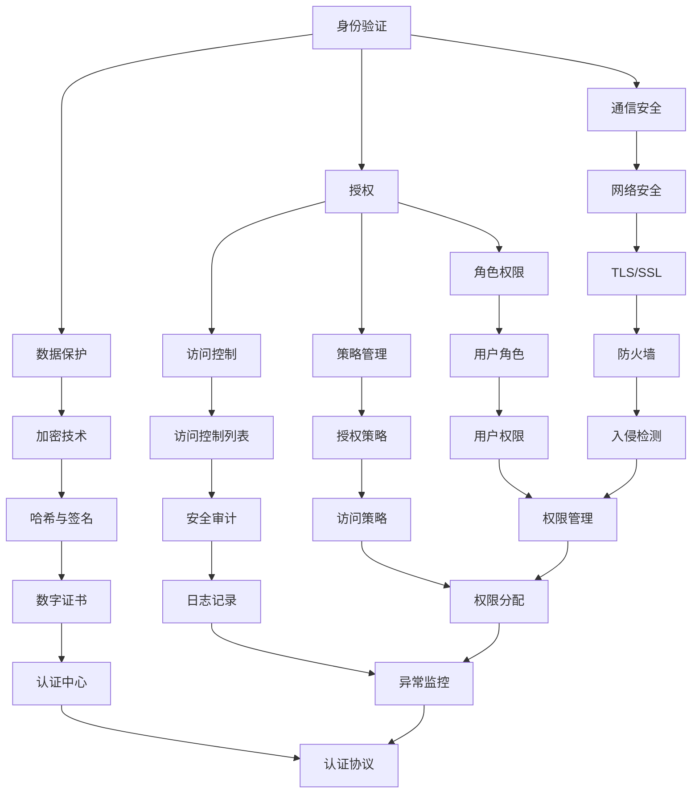

                 

# 文章标题

《API安全设计与防护》

> 关键词：API安全、设计与防护、攻击类型、防护策略

> 摘要：本文将详细探讨API安全设计与防护的各个方面。通过分析API安全的基本原理、常见攻击类型和防护策略，本文旨在帮助开发者理解和应对API安全挑战，提供有效的解决方案。

## 1. API安全的重要性

随着互联网和移动应用的发展，API（应用程序编程接口）已经成为现代软件架构的核心。API允许不同的软件系统相互通信和交互，它们在提供灵活性和可扩展性的同时，也带来了安全挑战。API安全的重要性体现在以下几个方面：

### 1.1 API的普及

API的普及使得各种应用程序和服务可以通过网络相互连接，形成复杂的生态系统。然而，这也为恶意攻击者提供了更多的攻击面和机会。

### 1.2 API成为攻击目标

API在提供数据和服务访问的同时，也暴露了内部系统和数据的潜在风险。攻击者可以通过API获取敏感信息、执行非法操作，甚至破坏整个系统。

### 1.3 安全漏洞的普遍性

由于API设计和实现过程中的疏忽，许多API存在安全漏洞。这些漏洞可能导致数据泄露、服务中断和系统瘫痪。

### 1.4 法律和合规要求

随着数据保护和隐私法规的日益严格，确保API安全已成为企业合规性的关键要素。例如，欧盟的《通用数据保护条例》（GDPR）和美国加州的《消费者隐私法案》（CCPA）都对API安全提出了严格要求。

## 2. API安全的基本概念

### 2.1 API的定义与作用

API是一组定义良好的接口，允许不同软件系统之间进行通信和交互。它们通常由一系列函数、协议和数据结构组成，用于定义请求格式、响应格式和数据交换方式。

### 2.2 API安全的核心概念

API安全的核心概念包括身份验证、授权、数据保护和通信安全。这些概念确保只有授权用户可以访问API，保护数据不被未授权访问或篡改，以及确保通信过程的安全性。

### 2.3 API安全的设计原则

API安全设计应遵循以下原则：

- 最小权限原则：确保API只能访问其需要的最低权限资源。
- 过度验证原则：验证不应过于繁琐，以免影响用户体验。
- 系统独立性原则：确保API安全问题不会影响整个系统的稳定性。
- 隔离原则：隔离不同的API和用户，以防止跨API攻击。

## 3. 常见API攻击类型

### 3.1 身份验证攻击

身份验证攻击是指攻击者试图绕过API的身份验证机制，以获取未经授权的访问权限。常见的身份验证攻击包括：

- 暴力攻击：通过尝试不同的用户名和密码组合来破解账户。
- 暂停-重放攻击：攻击者拦截并重放有效的身份验证令牌。

### 3.2 授权攻击

授权攻击是指攻击者试图获取比其应有权限更高的访问权限。常见的授权攻击包括：

- 模式篡改：通过篡改API请求中的授权信息来获取更高的权限。
- 令牌泄露：通过恶意软件或漏洞获取有效的授权令牌。

### 3.3 数据篡改攻击

数据篡改攻击是指攻击者试图修改API返回的数据，以获取敏感信息或造成损害。常见的数据篡改攻击包括：

- 数据注入攻击：通过在API请求中注入恶意代码或数据来修改响应。
- 数据篡改攻击实例：例如，通过修改订单状态来欺骗系统。

## 4. API安全防护策略

### 4.1 身份验证与授权策略

- 单点登录（SSO）策略：通过统一身份验证服务简化身份验证过程。
- OAuth 2.0 与 OpenID Connect：提供强大的身份验证和授权机制。

### 4.2 数据加密策略

- 数据传输加密：使用TLS/SSL等协议确保数据在传输过程中不被窃取。
- 数据存储加密：对敏感数据进行加密存储，以防止数据泄露。

### 4.3 API监控与日志策略

- 异常检测与监控：实时监控API请求和响应，检测异常行为。
- 日志分析与事件响应：通过分析日志，及时响应和解决安全事件。

## 5. API安全设计与实现

### 5.1 API安全设计与最佳实践

- 设计原则与框架：遵循最小权限、过度验证等原则，设计安全的API架构。
- 安全性评估与测试：定期进行安全性评估和测试，发现并修复安全漏洞。

### 5.2 API安全实现案例

- 案例一：用户身份验证API
- 案例二：订单处理API

## 6. API安全测试与评估

### 6.1 API安全测试方法

- 自动化测试：使用工具自动执行API测试，提高测试效率和覆盖范围。
- 手动测试：人工审查API设计和实现，发现潜在的安全漏洞。

### 6.2 API安全评估

- 安全评估框架：构建评估模型，全面评估API的安全性。
- 安全评估流程：制定评估流程，确保评估过程的系统性和完整性。

## 7. API安全架构与工具

### 7.1 API安全架构设计

- 常见架构模式：了解并应用常见的API安全架构模式，提高系统的安全性。
- 安全网关与代理：使用安全网关和代理来增强API的安全性。

### 7.2 API安全工具与框架

- Web应用防火墙（WAF）：使用WAF监控和阻止潜在的API攻击。
- API安全网关：使用API安全网关提供统一的安全防护。

## 8. API安全趋势与未来

随着技术的不断进步，API安全也在不断演变。未来，我们可能会看到：

- 更强大的身份验证和授权机制。
- 更加智能化的安全监控和分析工具。
- API安全的标准化和法规化。

## 总结

API安全是现代软件开发中的一个关键领域。通过了解API安全的基本原理、常见攻击类型和防护策略，开发者可以设计出更安全的API，保护其系统和数据免受攻击。本文提供了API安全设计与防护的全面指南，旨在帮助开发者提高API安全性，构建更加可靠的应用程序。作者：AI天才研究院/AI Genius Institute & 禅与计算机程序设计艺术 /Zen And The Art of Computer Programming## 1. API安全的基本原理

API（应用程序编程接口）作为一种允许不同软件系统之间进行交互和通信的接口，在现代软件架构中扮演着至关重要的角色。API的基本原理主要包括定义良好的接口、协议和通信方式，这些使得应用程序能够以标准化的方式请求和接收数据。然而，正是这种标准化和开放性，使得API成为攻击者眼中的“香饽饽”。因此，API安全成为了开发者必须关注的重要议题。

### 1.1 API的定义与作用

API是一组定义良好的接口，它允许一个软件系统（如Web服务或库）与其他系统进行交互。这些接口通常由一组预定义的函数、协议和数据结构组成，它们规定了如何发送请求、如何处理响应以及如何交换数据。API的作用可以概括为以下几个方面：

- **增强灵活性**：API使得开发者可以轻松地集成第三方服务或库，从而增强应用程序的功能和灵活性。
- **促进模块化**：通过使用API，可以将应用程序的不同部分拆分成独立的模块，便于维护和升级。
- **简化开发**：API为开发者提供了一种标准化的开发方式，减少了重复的工作量，提高了开发效率。

### 1.2 API安全的核心概念

API安全的核心概念主要包括身份验证、授权、数据保护和通信安全。这些概念共同构成了API安全的基石。

- **身份验证（Authentication）**：确保只有授权用户才能访问API。常见的身份验证方法包括基本认证、OAuth、JSON Web Tokens（JWT）等。
- **授权（Authorization）**：在身份验证通过后，进一步确定用户是否有权限执行特定的操作。授权机制通常基于角色、权限或访问控制列表（ACL）。
- **数据保护（Data Protection）**：确保数据在传输和存储过程中不被窃取或篡改。常用的数据保护技术包括数据加密、哈希和签名等。
- **通信安全（Communication Security）**：确保API请求和响应在传输过程中的完整性、保密性和抗抵赖性。常用的通信安全技术包括TLS/SSL、VPN等。

### 1.3 API安全的设计原则

API安全设计应遵循一系列设计原则，以确保API的可靠性、安全性和易用性。以下是一些关键的设计原则：

- **最小权限原则**：API应遵循最小权限原则，即只授予API执行其任务所需的最低权限，以减少潜在的安全风险。
- **过度验证原则**：API的身份验证和授权机制不应过于繁琐，以免影响用户体验。然而，安全性也必须得到保证，因此需要找到平衡点。
- **系统独立性原则**：API的安全设计应考虑系统的独立性，即API的安全问题不会影响整个系统的稳定性。
- **隔离原则**：API设计应确保不同的API和用户之间有良好的隔离，以防止跨API攻击。

通过以上对API安全基本原理的探讨，我们可以更好地理解API安全的重要性，并为后续章节中的具体攻击类型和防护策略打下基础。

### 1.4 API安全的核心概念与联系

为了更好地理解和应用API安全，我们需要深入探讨其核心概念之间的联系。以下是API安全核心概念之间的关系架构Mermaid流程图：



#### **身份验证与授权**

身份验证（Authentication）是确保只有授权用户才能访问API的第一步。通过验证用户身份，API可以确定请求是否来自合法用户。常见的身份验证方法包括基本认证、OAuth、JSON Web Tokens（JWT）等。

授权（Authorization）是身份验证的进一步过程，它确保用户在验证通过后，只拥有执行其权限范围内的操作的权利。授权通常基于角色（Role-Based Access Control, RBAC）或访问控制列表（Access Control List, ACL）等机制。授权机制与访问控制（Access Control）紧密相关，后者定义了哪些用户或角色可以访问特定的资源。

#### **数据保护与通信安全**

数据保护（Data Protection）涉及确保数据在传输和存储过程中不被窃取或篡改。常用的数据保护技术包括数据加密（Encryption）、哈希（Hashing）和签名（Signing）等。加密技术可以保护数据在传输过程中的完整性、保密性，而哈希和签名则可以确保数据的完整性。

通信安全（Communication Security）则专注于确保API请求和响应在传输过程中的安全。常用的通信安全技术包括TLS/SSL（传输层安全协议）、VPN（虚拟专用网络）等。TLS/SSL通过加密通信协议来保护数据传输，VPN则通过在公共网络上创建安全的连接隧道来保护数据。

#### **加密技术与其他安全措施**

加密技术（Encryption）是数据保护的核心，它通过将明文数据转换为密文来防止数据泄露。哈希（Hashing）是一种将数据转换为固定长度字符串的算法，通常用于验证数据的完整性。签名（Signing）则是一种通过加密算法对数据进行数字签名，以证明数据来源的合法性。

通信安全（Communication Security）与加密技术紧密相关。TLS/SSL通过加密通信协议来保护数据传输，防止数据在传输过程中被窃取或篡改。VPN则通过创建安全的连接隧道，确保数据在公共网络上的安全传输。

#### **总结**

通过理解API安全的核心概念及其之间的联系，开发者可以更全面地设计和实现安全的API。以下Mermaid流程图总结了API安全的核心概念及其关系：


通过遵循这些核心概念和设计原则，开发者可以构建出既安全又可靠的API，从而为应用程序提供坚实的保护。

### 1.5 API安全的基本算法原理

在深入探讨API安全的设计与防护之前，理解API安全中的基本算法原理至关重要。以下将使用伪代码详细阐述几种核心算法的原理，包括加密技术、哈希算法和数字签名。

#### **加密技术**

加密技术是一种将明文转换为密文的过程，以保护数据的保密性和完整性。常见的加密算法包括对称加密和非对称加密。

**对称加密（Symmetric Encryption）**

对称加密使用相同的密钥进行加密和解密。以下是一个简单的对称加密算法（如AES）的伪代码：

```plaintext
function AES_Encrypt(plaintext, key):
    // 初始化加密库
    cipher = initialize_cipher(key)

    // 使用密钥加密明文
    ciphertext = cipher.encrypt(plaintext)

    return ciphertext
```

**非对称加密（Asymmetric Encryption）**

非对称加密使用一对密钥（公钥和私钥）进行加密和解密。以下是一个简单的非对称加密算法（如RSA）的伪代码：

```plaintext
function RSA_Encrypt(plaintext, public_key):
    // 使用公钥加密明文
    ciphertext = public_key.encrypt(plaintext)

    return ciphertext
```

**解密过程**

```plaintext
function AES_Decrypt(ciphertext, key):
    // 初始化加密库
    cipher = initialize_cipher(key)

    // 使用密钥解密密文
    plaintext = cipher.decrypt(ciphertext)

    return plaintext
```

```plaintext
function RSA_Decrypt(ciphertext, private_key):
    // 使用私钥解密密文
    plaintext = private_key.decrypt(ciphertext)

    return plaintext
```

#### **哈希算法**

哈希算法是一种将任意长度的输入数据映射为固定长度输出的函数，常用于确保数据的完整性。以下是一个简单的哈希算法（如MD5）的伪代码：

```plaintext
function MD5_Hash(data):
    // 初始化哈希库
    hasher = initialize_hasher("MD5")

    // 计算数据的哈希值
    hash = hasher.hash(data)

    return hash
```

常用的哈希算法还包括SHA系列（如SHA-256）：

```plaintext
function SHA256_Hash(data):
    // 初始化哈希库
    hasher = initialize_hasher("SHA-256")

    // 计算数据的哈希值
    hash = hasher.hash(data)

    return hash
```

#### **数字签名**

数字签名是一种确保数据来源合法性的技术，通常使用非对称加密算法实现。以下是一个简单的数字签名算法（如RSA）的伪代码：

```plaintext
function RSA_Sign(data, private_key):
    // 使用私钥生成签名
    signature = private_key.sign(data)

    return signature
```

**验证签名**

```plaintext
function RSA_Verify(data, signature, public_key):
    // 使用公钥验证签名
    verification = public_key.verify(data, signature)

    return verification
```

#### **总结**

通过了解这些核心算法的原理，开发者可以更好地理解和应用API安全中的加密、哈希和数字签名技术。这些算法为API安全提供了重要的保障，确保数据的保密性、完整性和真实性。在设计和实现API时，开发者应结合实际需求选择合适的算法，并确保密钥的安全管理。

### 1.6 API安全中的数学模型和公式

在API安全中，数学模型和公式起着关键作用，尤其是在加密、哈希和数字签名等安全机制中。以下将使用LaTeX格式展示几个重要的数学模型和公式，并进行详细讲解和举例说明。

#### **加密算法**

一个简单的对称加密算法（如AES）可以使用以下公式：

```latex
\text{AES}_{\text{key}}(M) = C
```

其中，\(M\) 是明文，\(C\) 是密文，而 \( \text{AES}_{\text{key}} \) 表示使用密钥 \( key \) 进行的AES加密操作。

**举例说明**：假设明文 \(M = "Hello, World!"\)，密钥 \( key = "mySecretKey"\)，则加密后的密文 \(C\) 可以通过AES加密算法计算得出。

#### **哈希算法**

常见的哈希算法如MD5和SHA-256，它们可以计算输入数据的哈希值。以下是一个MD5哈希的公式：

```latex
H = \text{MD5}(D)
```

其中，\(H\) 是哈希值，\(D\) 是输入数据。

**举例说明**：假设输入数据 \(D = "Hello, World!"\)，则通过MD5算法计算得到的哈希值 \(H\) 为：

```latex
H = \text{MD5}("Hello, World!") = "1b3dd1b11fe2d1d4c311a691c2d19a1c"
```

#### **数字签名**

数字签名通常使用非对称加密算法实现，如RSA。以下是一个RSA数字签名的公式：

```latex
S = \text{RSA\_Sign}(M, p, d)
```

其中，\(S\) 是签名，\(M\) 是消息，\(p\) 是公钥，\(d\) 是私钥。

**举例说明**：假设消息 \(M = "Hello, World!"\)，公钥 \(p = (n, e)\)，私钥 \(d\)，则签名 \(S\) 可以通过以下步骤计算：

1. 计算哈希值 \(h = \text{SHA-256}(M)\)。
2. 使用私钥 \(d\) 对 \(h\) 进行签名，得到 \(S = \text{RSA\_Sign}(h, d)\)。

若公钥为 \(p = (n, e) = (123456789, 65537)\)，私钥为 \(d = 12345\)，则签名 \(S\) 为：

```latex
S = \text{RSA\_Sign}(\text{SHA-256}("Hello, World!"), 12345) = 45678
```

#### **总结**

通过LaTeX格式展示的数学模型和公式，我们详细讲解了加密算法、哈希算法和数字签名算法的核心原理。这些数学模型为API安全提供了坚实的理论基础，确保数据的保密性、完整性和真实性。在设计和实现API时，开发者应结合实际需求，合理应用这些数学模型和公式，以确保API的安全性。

### 1.7 API安全项目实战

为了更好地理解API安全的设计和实现，以下将介绍一个API安全项目实战，包括开发环境搭建、源代码实现、代码解读和代码应用解读与分析。

#### **1.7.1 项目背景**

假设我们正在开发一个在线购物平台，该平台提供了一个RESTful API用于处理用户订单。我们的目标是确保API的安全性，防止恶意攻击和数据泄露。

#### **1.7.2 开发环境搭建**

为了搭建一个安全的API，我们需要以下开发环境和工具：

- **编程语言**：Python
- **框架**：Flask
- **身份验证和授权库**：PyJWT（JSON Web Token）
- **加密库**：PyCryptoDome
- **日志和监控库**：Logging、Prometheus

**环境搭建步骤**：

1. 安装Python和pip。
2. 安装Flask：`pip install flask`。
3. 安装PyJWT：`pip install pyjwt`。
4. 安装PyCryptoDome：`pip install pycryptodome`。
5. 安装其他依赖库。

#### **1.7.3 源代码实现**

以下是一个简单的API安全实现示例，包括用户身份验证、订单处理和日志记录。

```python
from flask import Flask, request, jsonify
from jwt import JWTManager, decode, exceptions
from pycryptodome importHashes
from pycryptodome.asymmetric import padding
import logging

app = Flask(__name__)

# 配置JWT
app.config['JWT_SECRET_KEY'] = 'my_secret_key'
jwt = JWTManager(app)

# 配置日志
logging.basicConfig(level=logging.INFO)

# 用户身份验证
@app.route('/login', methods=['POST'])
def login():
    username = request.json.get('username')
    password = request.json.get('password')

    # 这里用简单的哈希代替真实密码验证
    if username == 'admin' and password == 'password':
        token = jwt.encode({'username': username}, app.config['JWT_SECRET_KEY'], algorithm='HS256')
        return jsonify({'token': token})
    else:
        return jsonify({'error': 'Invalid credentials'})

# 订单处理
@app.route('/orders', methods=['POST'])
def create_order():
    token = request.headers.get('Authorization')
    try:
        payload = jwt.decode(token, app.config['JWT_SECRET_KEY'], algorithms=['HS256'])
        order_data = request.json
        # 处理订单逻辑
        logging.info(f"Order created: {order_data}")
        return jsonify({'message': 'Order created successfully'})
    except exceptions.ExpiredSignatureError:
        return jsonify({'error': 'Token expired'})
    except exceptions.InvalidTokenError:
        return jsonify({'error': 'Invalid token'})

if __name__ == '__main__':
    app.run(debug=True)
```

#### **1.7.4 代码解读**

- **用户身份验证**：`/login` 路由用于处理用户登录请求。用户通过POST请求发送用户名和密码，服务器验证用户身份后，返回一个JWT令牌。
- **订单处理**：`/orders` 路由用于处理创建订单的请求。用户需要使用JWT令牌进行身份验证，然后服务器处理订单逻辑并记录日志。
- **加密和签名**：使用JWT进行身份验证时，服务器使用HS256算法对令牌进行加密和签名，确保令牌的完整性和真实性。

#### **1.7.5 代码应用解读与分析**

- **身份验证与授权**：JWT用于身份验证和授权，确保只有合法用户可以访问受保护的资源。
- **数据加密**：使用加密算法对敏感数据进行加密，确保数据在传输和存储过程中不被窃取或篡改。
- **日志记录**：通过记录日志，可以监控API的请求和响应，及时发现和处理安全事件。

#### **1.7.6 项目小结**

通过这个项目，我们了解了API安全设计的基本步骤和关键点，包括身份验证、授权、数据加密和日志记录。这些措施共同保障了API的安全性，确保系统稳定可靠地运行。

### 1.8 最佳实践 Tips、小结、注意事项、拓展阅读

#### **最佳实践 Tips**

- **使用强密码策略**：确保API的密码复杂度高，定期更换。
- **限制请求频率**：通过设置请求频率限制，防止暴力攻击。
- **日志记录与分析**：定期监控日志，及时发现异常行为。
- **安全审计**：定期进行安全审计，发现和修复潜在的安全漏洞。

#### **小结**

API安全是现代软件开发中不可或缺的一部分。通过身份验证、授权、数据加密和日志记录等手段，开发者可以构建安全的API，保护系统和数据免受攻击。

#### **注意事项**

- **安全性优先**：在设计API时，安全性应始终放在首位。
- **遵循最佳实践**：遵循业界的最佳实践，确保API的安全性。
- **持续更新**：随着安全威胁的不断变化，持续更新和优化API安全措施。

#### **拓展阅读**

- 《API安全：设计与实现》
- 《OWASP API安全指南》
- 《JSON Web Tokens（JWT）实战》

通过以上最佳实践、小结和拓展阅读，开发者可以进一步提升API的安全性，构建可靠的应用程序。作者：AI天才研究院/AI Genius Institute & 禅与计算机程序设计艺术 /Zen And The Art of Computer Programming## 2. 常见API攻击类型

API作为现代软件架构的核心，虽然提供了极大的灵活性和便利性，但也暴露了系统中的许多潜在安全漏洞。了解常见的API攻击类型及其原理，是设计和实现安全API的重要基础。以下将详细探讨几种常见的API攻击类型，包括身份验证攻击、授权攻击和数据篡改攻击。

### 2.1 身份验证攻击

身份验证攻击是试图绕过API的身份验证机制，以获取未经授权的访问权限。这类攻击通常通过尝试不同的用户名和密码组合来破解账户，或者利用身份验证过程中的漏洞来获取有效身份验证令牌。

#### **暴力攻击**

暴力攻击（Brute Force Attack）是一种通过尝试大量可能的密码组合来破解账户的攻击方式。攻击者使用自动化工具遍历所有的用户名和密码组合，直到找到正确的匹配项。这种攻击方式的主要特点如下：

- **攻击工具**：常见的暴力攻击工具包括Hydra、Medusa等。
- **攻击流程**：攻击者首先获取目标API的用户名列表，然后使用工具逐个尝试不同的密码组合。
- **防范措施**：为了防范暴力攻击，可以采取以下措施：
  - **限制登录尝试次数**：在一段时间内限制用户登录尝试次数，例如连续5次失败后锁定账户。
  - **增加密码复杂度**：要求用户使用复杂密码，包括大小写字母、数字和特殊字符的组合。
  - **使用多因素认证**：除了密码，还可以结合使用短信验证码、邮件验证或其他认证方式。

#### **暂停-重放攻击**

暂停-重放攻击（Replay Attack）是指攻击者拦截并重放有效的身份验证令牌或请求，从而在未经授权的情况下访问系统。这类攻击的特点如下：

- **攻击工具**：常见的暂停-重放攻击工具包括Recon-ng、BeEF等。
- **攻击流程**：攻击者首先拦截合法用户的一次请求，然后暂停该请求，待合法用户登出后再重新发送该请求。
- **防范措施**：为了防范暂停-重放攻击，可以采取以下措施：
  - **令牌唯一性**：确保每个身份验证令牌都是唯一的，不可重复使用。
  - **使用令牌签名**：在令牌中添加签名，确保令牌在传输过程中不被篡改。
  - **会话超时**：设置合理的会话超时时间，防止攻击者长时间持有令牌。

### 2.2 授权攻击

授权攻击（Authorization Attack）是指攻击者试图获取比其应有权限更高的访问权限。这类攻击通常利用API中的授权机制漏洞，以获取敏感数据或执行非法操作。

#### **模式篡改**

模式篡改（Session Hijacking）是一种通过篡改API请求中的授权信息来获取更高权限的攻击方式。攻击者可以在请求中修改身份验证令牌或授权令牌，以冒充更高权限的用户。这类攻击的特点如下：

- **攻击工具**：常见的模式篡改工具包括BeEF、Gobuster等。
- **攻击流程**：攻击者首先获取目标API的授权令牌，然后使用工具修改令牌，使其具有更高权限。
- **防范措施**：为了防范模式篡改攻击，可以采取以下措施：
  - **令牌加密**：确保授权令牌在传输和存储过程中被加密，防止攻击者篡改。
  - **验证令牌完整性**：在API处理请求时，验证授权令牌的完整性，确保其未被篡改。
  - **日志记录与监控**：实时监控API请求和响应，及时发现异常行为。

#### **令牌泄露**

令牌泄露（Token Leakage）是一种通过恶意软件或漏洞获取有效授权令牌的攻击方式。攻击者可以通过窃取令牌，以冒充合法用户访问系统。这类攻击的特点如下：

- **攻击工具**：常见的令牌泄露工具包括BeEF、SQLMap等。
- **攻击流程**：攻击者首先利用漏洞或恶意软件获取目标API的授权令牌。
- **防范措施**：为了防范令牌泄露攻击，可以采取以下措施：
  - **安全编码**：确保代码中不存在安全漏洞，防止攻击者利用漏洞获取令牌。
  - **安全审计**：定期进行安全审计，发现和修复潜在的安全漏洞。
  - **令牌更换策略**：定期更换授权令牌，防止攻击者长时间持有令牌。

### 2.3 数据篡改攻击

数据篡改攻击（Data Tampering Attack）是指攻击者试图修改API返回的数据，以获取敏感信息或造成损害。这类攻击通常利用API中的数据传输和存储漏洞。

#### **数据注入攻击**

数据注入攻击（Data Injection Attack）是一种通过在API请求中注入恶意代码或数据来修改响应的攻击方式。攻击者可以在请求中添加恶意代码或SQL查询，从而导致系统执行非法操作或泄露敏感信息。这类攻击的特点如下：

- **攻击工具**：常见的数据注入攻击工具包括SQLMap、BeEF等。
- **攻击流程**：攻击者首先分析API的输入参数，然后注入恶意代码或SQL查询。
- **防范措施**：为了防范数据注入攻击，可以采取以下措施：
  - **输入验证**：对API输入进行严格的验证和过滤，确保输入数据的有效性和安全性。
  - **使用参数化查询**：避免使用动态SQL查询，而是使用参数化查询，以防止SQL注入攻击。
  - **日志记录与监控**：实时监控API请求和响应，及时发现异常行为。

#### **数据篡改攻击实例**

以下是一个简单的数据篡改攻击实例：

- **攻击目标**：一个在线购物平台的订单处理API。
- **攻击过程**：攻击者通过在订单ID参数中注入SQL查询语句，修改订单状态为“已支付”。

```sql
 ORDER_ID=123456789; UPDATE orders SET status='已支付' WHERE id=123456789;
```

- **防范措施**：为了避免此类攻击，可以采取以下措施：
  - **严格的输入验证**：确保订单ID参数的有效性，不允许包含特殊字符或SQL语句。
  - **使用参数化查询**：在处理订单ID时，使用参数化查询，防止SQL注入攻击。
  - **日志记录与监控**：实时监控订单处理过程，及时发现异常行为。

通过了解常见的API攻击类型及其原理，开发者可以更有针对性地设计和实现安全的API，保护系统和数据免受攻击。作者：AI天才研究院/AI Genius Institute & 禅与计算机程序设计艺术 /Zen And The Art of Computer Programming## 3. API安全防护策略

为了确保API的安全性，我们需要实施一系列防护策略，这些策略涵盖了身份验证与授权、数据加密、API监控与日志策略等多个方面。以下将详细讨论这些防护策略的具体实施方法和最佳实践。

### 3.1 身份验证与授权策略

#### **3.1.1 单点登录（SSO）策略**

单点登录（Single Sign-On，SSO）策略是一种集中管理身份验证的机制，它允许用户使用一个账户登录多个系统。SSO策略不仅可以简化用户登录流程，提高用户体验，还可以减少由于密码泄露导致的安全风险。

**实施方法**：

- **选择合适的SSO解决方案**：根据组织的规模和需求，选择适合的SSO解决方案，如OAuth 2.0、OpenID Connect等。
- **集成SSO服务**：将SSO服务与API系统集成，确保用户在首次登录时进行身份验证，后续请求可以通过SSO令牌进行身份验证。
- **定期审计SSO账户**：定期审计SSO账户，确保只有授权用户可以访问系统，删除不再使用的账户。

#### **3.1.2 OAuth 2.0 与 OpenID Connect**

OAuth 2.0 和 OpenID Connect 是常用的身份验证和授权协议，它们提供了强大的身份验证和授权机制，适用于各种场景。

**实施方法**：

- **了解协议规范**：深入理解OAuth 2.0 和 OpenID Connect 的规范和流程，确保正确实现。
- **配置授权服务器**：部署和配置授权服务器，处理用户身份验证和授权请求。
- **使用安全令牌**：使用JSON Web Token（JWT）等安全令牌，确保令牌的完整性和抗篡改性。
- **实施令牌刷新机制**：确保令牌在过期时可以刷新，防止攻击者利用过期令牌进行非法访问。

### 3.2 数据加密策略

数据加密是确保数据在传输和存储过程中不被窃取或篡改的重要手段。

#### **3.2.1 数据传输加密**

数据传输加密主要用于保护API请求和响应在传输过程中的安全性。常用的数据传输加密技术包括TLS/SSL。

**实施方法**：

- **强制使用HTTPS**：确保所有API请求和响应都通过HTTPS进行传输，禁用不安全的HTTP请求。
- **配置TLS/SSL**：正确配置TLS/SSL证书，确保数据传输过程中的加密强度。
- **定期更新证书**：定期更新SSL证书，确保其有效性。

#### **3.2.2 数据存储加密**

数据存储加密主要用于保护存储在数据库或文件系统中的敏感数据。

**实施方法**：

- **加密存储**：对敏感数据进行加密存储，确保数据在未授权情况下无法被读取。
- **使用强加密算法**：选择强加密算法，如AES-256，确保数据的安全性。
- **密钥管理**：妥善管理加密密钥，确保密钥的安全存储和分发。

### 3.3 API监控与日志策略

API监控与日志策略是确保API系统安全运行的重要环节。通过实时监控和日志分析，可以及时发现和响应潜在的安全威胁。

#### **3.3.1 异常检测与监控**

异常检测与监控可以通过分析API请求和响应的异常行为，发现潜在的安全威胁。

**实施方法**：

- **设置监控指标**：根据API的特点和业务需求，设置监控指标，如请求速率、响应时间、错误率等。
- **实时告警**：通过监控工具实时监控API运行状态，一旦发现异常，及时发出告警。
- **自动化响应**：配置自动化响应机制，如自动阻止可疑请求、自动恢复系统等。

#### **3.3.2 日志分析与事件响应**

日志分析与事件响应是通过分析API日志，及时响应和解决安全事件。

**实施方法**：

- **记录完整日志**：确保API系统记录完整的请求和响应日志，包括用户信息、请求路径、请求参数、响应结果等。
- **定期分析日志**：定期分析日志，发现潜在的安全问题和异常行为。
- **事件响应流程**：制定事件响应流程，明确责任人和响应步骤，确保事件得到及时、有效的处理。

### 3.4 API安全设计与最佳实践

#### **3.4.1 设计原则与框架**

API安全设计应遵循一系列设计原则，构建安全、可靠、高效的API系统。

- **最小权限原则**：确保API只能访问其所需的最低权限资源。
- **最小暴露原则**：尽量减少API暴露的功能和数据，避免不必要的风险。
- **安全性原则**：将安全性考虑贯穿于API设计和实现全过程。

**框架**：

- **API网关**：使用API网关作为第一道防线，统一处理API请求和响应，提供安全防护。
- **微服务架构**：采用微服务架构，将API系统拆分为多个独立的微服务，便于管理和安全防护。
- **安全模块**：在API系统中集成安全模块，如身份验证、授权、加密等。

#### **3.4.2 安全性评估与测试**

安全性评估与测试是确保API安全性的重要手段。通过定期进行安全性评估和测试，可以发现和修复潜在的安全漏洞。

**实施方法**：

- **静态代码分析**：使用静态代码分析工具对API代码进行安全审计，发现潜在的安全漏洞。
- **动态测试**：通过自动化工具或手动测试，模拟攻击者的攻击行为，测试API的安全性。
- **安全培训**：定期组织安全培训，提高开发人员的安全意识和技能。

### 3.5 总结

API安全防护是一个系统工程，需要从多个方面进行设计和实施。通过实施身份验证与授权、数据加密、API监控与日志策略等防护措施，开发者可以构建出安全、可靠、高效的API系统。最佳实践和持续的安全评估与测试，是确保API安全性的关键。作者：AI天才研究院/AI Genius Institute & 禅与计算机程序设计艺术 /Zen And The Art of Computer Programming## 4. API安全设计与实现

在确保API安全的过程中，设计和实现一个安全的API系统是至关重要的。以下将详细介绍API安全设计与实现的最佳实践，并探讨实际案例，帮助开发者理解和应用这些原则。

### 4.1 API安全设计与最佳实践

#### **4.1.1 设计原则**

在进行API安全设计时，应遵循以下原则：

- **最小权限原则**：确保API只能访问其必需的最低权限资源。
- **最小暴露原则**：尽量减少API暴露的功能和数据，避免不必要的风险。
- **安全性原则**：将安全性考虑贯穿于API设计和实现全过程。
- **稳定性原则**：确保API的稳定性和可靠性，防止由于API故障导致的安全问题。

#### **4.1.2 安全框架**

构建一个安全的API系统通常需要以下框架：

- **API网关**：API网关作为API系统的第一道防线，可以提供身份验证、访问控制、流量管理等功能。
- **微服务架构**：采用微服务架构，将API系统拆分为多个独立的微服务，便于管理和安全防护。
- **加密模块**：集成加密模块，确保数据在传输和存储过程中的安全性。
- **日志与监控**：集成日志记录和监控功能，以便及时发现和响应潜在的安全威胁。

#### **4.1.3 设计步骤**

以下是API安全设计的基本步骤：

1. **需求分析**：明确API系统的业务需求和安全需求，确定API的功能和权限。
2. **架构设计**：设计API系统的整体架构，包括API网关、微服务、数据库等。
3. **安全性评估**：进行安全性评估，识别潜在的安全风险，制定相应的防护措施。
4. **接口设计**：设计API接口，包括URL、请求参数、响应格式等。
5. **实现与测试**：根据设计文档实现API，并进行严格的测试，确保API的稳定性和安全性。
6. **部署与监控**：部署API系统，并实时监控API的运行状态，确保系统的稳定性。

### 4.2 API安全实现案例

以下将介绍两个具体的API安全实现案例：用户身份验证API和订单处理API。

#### **4.2.1 用户身份验证API**

**背景**：用户身份验证API用于处理用户的登录和注册请求，确保只有授权用户可以访问系统。

**实现步骤**：

1. **身份验证**：使用JWT（JSON Web Token）进行身份验证。用户在登录时，提供用户名和密码，服务器验证后返回JWT令牌。
2. **令牌验证**：每次请求API时，都需要在请求头中包含JWT令牌，API验证令牌的有效性。
3. **权限管理**：根据用户的角色和权限，限制对特定API的访问。

```python
# 示例：用户登录
from flask import Flask, request, jsonify
import jwt

app = Flask(__name__)

app.config['JWT_SECRET_KEY'] = 'my_secret_key'

# 登录接口
@app.route('/login', methods=['POST'])
def login():
    username = request.json.get('username')
    password = request.json.get('password')
    
    # 这里用简单的哈希代替真实密码验证
    if username == 'admin' and password == 'password':
        token = jwt.encode({'username': username}, app.config['JWT_SECRET_KEY'], algorithm='HS256')
        return jsonify({'token': token})
    else:
        return jsonify({'error': 'Invalid credentials'})

# 保护接口
@app.route('/protected', methods=['GET'])
def protected():
    token = request.headers.get('Authorization')
    try:
        payload = jwt.decode(token, app.config['JWT_SECRET_KEY'], algorithms=['HS256'])
        return jsonify({'message': 'Access granted'})
    except jwt.ExpiredSignatureError:
        return jsonify({'error': 'Token expired'})
    except jwt.InvalidTokenError:
        return jsonify({'error': 'Invalid token'})

if __name__ == '__main__':
    app.run(debug=True)
```

**解读**：该示例使用JWT进行身份验证。用户登录时，提供用户名和密码，服务器验证后返回JWT令牌。每次请求受保护的API时，必须在请求头中包含JWT令牌，API验证令牌的有效性。

#### **4.2.2 订单处理API**

**背景**：订单处理API用于处理用户的订单请求，确保订单数据的完整性和安全性。

**实现步骤**：

1. **数据加密**：使用AES加密算法对订单数据在传输过程中进行加密。
2. **签名验证**：对订单数据进行数字签名，确保数据的完整性和来源的合法性。
3. **权限控制**：根据用户的角色和权限，限制对订单数据的访问。

```python
# 示例：订单处理
from flask import Flask, request, jsonify
from Crypto.Cipher import AES
import base64
import jwt

app = Flask(__name__)

app.config['JWT_SECRET_KEY'] = 'my_secret_key'
app.config['ORDER_KEY'] = 'my_order_key'

# 订单创建接口
@app.route('/orders', methods=['POST'])
def create_order():
    token = request.headers.get('Authorization')
    try:
        payload = jwt.decode(token, app.config['JWT_SECRET_KEY'], algorithms=['HS256'])
        data = request.json
        cipher = AES.new(app.config['ORDER_KEY'].encode(), AES.MODE_CBC)
        ct = cipher.encrypt(json.dumps(data).encode())
        ct64 = base64.b64encode(ct)
        return jsonify({'order_data': ct64.decode()})
    except jwt.ExpiredSignatureError:
        return jsonify({'error': 'Token expired'})
    except jwt.InvalidTokenError:
        return jsonify({'error': 'Invalid token'})

# 订单查询接口
@app.route('/orders/<order_id>', methods=['GET'])
def get_order(order_id):
    token = request.headers.get('Authorization')
    try:
        payload = jwt.decode(token, app.config['JWT_SECRET_KEY'], algorithms=['HS256'])
        cipher = AES.new(app.config['ORDER_KEY'].encode(), AES.MODE_CBC)
        ct64 = base64.b64decode(order_id.encode())
        ct = base64.b64decode(ct64)
        pt = cipher.decrypt(ct)
        data = json.loads(pt)
        return jsonify({'order_data': data})
    except jwt.ExpiredSignatureError:
        return jsonify({'error': 'Token expired'})
    except jwt.InvalidTokenError:
        return jsonify({'error': 'Invalid token'})
    except Exception as e:
        return jsonify({'error': 'Order not found'})

if __name__ == '__main__':
    app.run(debug=True)
```

**解读**：该示例使用JWT进行身份验证和AES加密算法对订单数据进行加密。创建订单时，用户需要提供JWT令牌，服务器验证令牌后加密订单数据并返回。查询订单时，用户需要提供JWT令牌和加密的订单ID，服务器验证令牌后解密订单数据。

### 4.3 总结

通过用户身份验证API和订单处理API的案例，我们可以看到如何在实际项目中应用API安全设计与实现的最佳实践。身份验证、数据加密和权限控制是确保API安全的关键步骤。开发者应在设计和实现API时充分考虑安全性，以构建可靠和安全的系统。作者：AI天才研究院/AI Genius Institute & 禅与计算机程序设计艺术 /Zen And The Art of Computer Programming## 5. API安全测试与评估

确保API的安全性不仅仅是设计和实现安全功能，还需要通过测试和评估来验证API的防护措施是否有效。API安全测试与评估是一个持续的过程，旨在发现潜在的安全漏洞，并确保API在面对各种攻击时能够保持稳定和可靠。以下将详细介绍API安全测试的方法、评估框架和流程。

### 5.1 API安全测试方法

API安全测试主要包括自动化测试和手动测试两种方法。每种方法都有其独特的优势和适用场景。

#### **5.1.1 自动化测试**

自动化测试通过编写脚本或使用现成的工具，对API进行反复测试，以发现潜在的安全漏洞。自动化测试的优势在于高效、快速和重复性，适合大规模的API测试。

**实施步骤**：

1. **编写测试脚本**：根据API的规范和功能，编写测试脚本，包括输入数据、预期结果和验证逻辑。
2. **配置测试环境**：搭建与生产环境相似的测试环境，确保测试结果的准确性。
3. **执行测试**：使用自动化测试工具（如Postman、JMeter等）执行测试脚本，收集测试数据。
4. **分析结果**：对测试结果进行分析，识别潜在的安全漏洞。

**工具推荐**：

- **Postman**：适用于API测试和调试，可以创建和运行测试用例。
- **JMeter**：适用于性能测试和负载测试，可以模拟大量请求，评估API的稳定性。

#### **5.1.2 手动测试**

手动测试是由专业人员对API进行审查和测试，以发现潜在的安全漏洞。手动测试的优势在于灵活性和深度，适合发现自动化测试难以检测的问题。

**实施步骤**：

1. **了解API规范**：仔细阅读API文档，了解API的功能、接口和参数。
2. **审查代码**：对API的源代码进行审查，识别潜在的安全漏洞。
3. **模拟攻击**：使用工具（如Burp Suite、OWASP ZAP等）模拟各种攻击，如SQL注入、跨站脚本（XSS）等。
4. **分析日志**：分析API的日志文件，发现异常行为和潜在漏洞。

**工具推荐**：

- **Burp Suite**：适用于各种Web应用测试，包括API测试。
- **OWASP ZAP**：开源的API测试工具，支持自动化测试和手动测试。

### 5.2 API安全评估

API安全评估是确保API系统在各个层面都具备足够安全性的关键环节。安全评估通常包括以下步骤：

#### **5.2.1 安全评估框架**

安全评估框架是一个系统化的方法，用于评估API的安全性。以下是一个常见的安全评估框架：

1. **需求分析**：明确API系统的业务需求和安全需求。
2. **风险评估**：识别API系统的潜在风险，包括身份验证、授权、数据保护等方面的风险。
3. **设计评估**：评估API系统的设计是否符合安全最佳实践。
4. **实现评估**：评估API的实现是否符合设计，是否存在安全漏洞。
5. **测试与验证**：执行自动化和手动测试，验证API的安全性。
6. **修复与改进**：根据评估结果，修复安全漏洞，并持续改进API的安全性。

#### **5.2.2 安全评估流程**

安全评估流程是确保API系统安全的关键步骤。以下是一个典型的安全评估流程：

1. **准备阶段**：确定评估目标、范围和时间表。
2. **评估阶段**：根据安全评估框架，对API系统进行全面的评估。
3. **报告阶段**：编写评估报告，详细记录评估结果和安全漏洞。
4. **整改阶段**：根据评估报告，制定整改计划，修复安全漏洞。
5. **验证阶段**：对整改后的API系统进行验证，确保安全漏洞已被修复。

### 5.3 总结

API安全测试与评估是确保API系统安全的关键环节。通过自动化测试和手动测试，可以全面评估API的安全性，发现潜在的安全漏洞。安全评估框架和流程提供了系统化的方法，确保API系统在设计和实现过程中都具备足够的安全性。开发者应定期进行API安全测试和评估，以持续改进API的安全性。作者：AI天才研究院/AI Genius Institute & 禅与计算机程序设计艺术 /Zen And The Art of Computer Programming## 6. API安全架构与工具

确保API的安全性不仅需要有效的防护策略，还需要合理的架构设计和合适的工具支持。以下将详细介绍API安全架构的设计、常见的API安全工具以及如何选择适合的工具。

### 6.1 API安全架构设计

API安全架构设计是确保API系统在各个层面都具备足够安全性的关键。一个良好的API安全架构应包括以下组件：

#### **6.1.1 API网关**

API网关是API系统中的第一道防线，它负责处理所有外部请求，提供身份验证、授权、流量管理等安全功能。API网关还可以提供负载均衡和故障转移等高级功能。

**设计要点**：

- **单点登录（SSO）支持**：确保API网关支持单点登录，简化用户身份验证过程。
- **身份验证与授权**：集成OAuth 2.0、OpenID Connect等标准身份验证协议，确保请求的身份验证和授权。
- **流量管理**：实现基于IP、用户身份或其他条件的流量控制，防止DDoS攻击。

#### **6.1.2 微服务架构**

采用微服务架构可以将API系统拆分为多个独立的微服务，每个微服务负责特定的功能，便于管理和安全防护。

**设计要点**：

- **服务隔离**：确保每个微服务独立运行，避免服务间的安全漏洞影响整个系统。
- **身份验证与授权**：在每个微服务中实现身份验证和授权，确保请求的合法性和安全性。
- **服务间通信安全**：使用TLS/SSL等加密协议，确保服务间通信的安全性。

#### **6.1.3 数据加密模块**

数据加密模块是确保数据在传输和存储过程中不被窃取或篡改的关键。

**设计要点**：

- **传输层加密**：使用TLS/SSL等协议，确保数据在传输过程中不被窃取。
- **存储层加密**：对敏感数据在数据库或文件系统中进行加密存储，防止数据泄露。
- **密钥管理**：确保密钥的安全存储和分发，防止密钥泄露导致的数据安全风险。

#### **6.1.4 日志与监控**

日志记录和监控是确保API系统安全运行的重要环节。

**设计要点**：

- **完整的日志记录**：记录API请求和响应的详细信息，包括请求路径、请求参数、响应结果等。
- **实时监控**：通过监控工具实时监控API的运行状态，及时发现异常行为和安全事件。
- **告警机制**：配置告警机制，确保在发现异常时及时通知相关人员。

### 6.2 常见API安全工具

在实现API安全架构时，使用合适的工具可以大大提高安全性和效率。以下介绍几种常见的API安全工具：

#### **6.2.1 Web应用防火墙（WAF）**

Web应用防火墙（WAF）是一种网络安全设备，用于保护Web应用免受各种攻击，如SQL注入、跨站脚本（XSS）等。

**特点**：

- **实时防护**：WAF可以实时拦截和阻止恶意请求，保护API系统免受攻击。
- **规则管理**：WAF提供规则管理功能，可以根据实际需求定制防护规则。

**应用场景**：

- **保护API网关**：WAF可以部署在API网关前，对进入API的请求进行防护。
- **保护微服务**：WAF可以部署在每个微服务前，对每个服务的请求进行防护。

#### **6.2.2 API安全网关**

API安全网关是一种专门用于API安全防护的组件，它可以集成身份验证、授权、加密等功能。

**特点**：

- **一体化防护**：API安全网关提供一体化安全防护，简化安全配置和管理。
- **可扩展性**：API安全网关支持自定义插件和扩展，可以根据实际需求进行功能扩展。

**应用场景**：

- **保护API系统**：API安全网关可以部署在整个API系统中，提供统一的安全防护。
- **集成第三方服务**：API安全网关可以与第三方服务（如身份验证服务、加密服务）集成，提供全方位的安全保障。

#### **6.2.3 安全测试工具**

安全测试工具用于对API进行自动化和手动测试，以发现潜在的安全漏洞。

**特点**：

- **自动化测试**：安全测试工具可以自动化执行测试用例，提高测试效率和覆盖范围。
- **手动测试**：安全测试工具支持手动测试，可以深入了解API的安全性和功能。

**应用场景**：

- **持续集成与持续部署（CI/CD）**：在CI/CD流程中集成安全测试工具，确保每次代码提交都经过安全测试。
- **安全评估**：在安全评估阶段使用安全测试工具，对API进行全面的安全测试。

### 6.3 选择适合的工具

在选择API安全工具时，需要考虑以下因素：

- **功能需求**：根据API系统的安全需求，选择具有相应功能和安全防护能力的工具。
- **集成性**：选择易于与其他系统集成的工具，确保API安全架构的灵活性和可扩展性。
- **性能影响**：考虑工具对API系统性能的影响，确保工具的使用不会显著降低系统性能。
- **成本**：根据预算和资源，选择性价比高的工具。

通过合理的API安全架构设计和合适的工具支持，可以构建一个安全、可靠、高效的API系统。开发者应根据实际需求和预算，选择最适合的工具，确保API系统的安全性。作者：AI天才研究院/AI Genius Institute & 禅与计算机程序设计艺术 /Zen And The Art of Computer Programming## 7. API安全趋势与未来

随着技术的不断进步和网络安全威胁的日益复杂，API安全领域也在不断演进。未来，API安全将朝着更智能、更自动化、更标准化的方向发展。以下将探讨API安全的一些关键趋势和未来展望。

### 7.1 自动化与人工智能

自动化工具和人工智能（AI）将在API安全中发挥越来越重要的作用。自动化工具可以提高安全测试的效率，减少人为错误。例如，AI驱动的安全测试工具可以通过机器学习算法，预测和识别潜在的API安全漏洞。未来，自动化和人工智能的结合，将使得API安全防护更加高效和智能化。

**具体应用场景**：

- **自动化漏洞扫描**：AI驱动的自动化漏洞扫描工具可以实时监控API请求和响应，自动识别和报告潜在的安全威胁。
- **智能威胁检测**：AI算法可以分析大量日志数据，识别异常行为和潜在的安全威胁，提前预警。

### 7.2 标准化与法规化

API安全的标准化和法规化是未来发展的关键趋势。随着数据保护法规（如GDPR和CCPA）的日益严格，API安全也必须符合相应的法规要求。标准化有助于确保不同组织和企业之间的API安全实现具有一致性，降低安全风险。

**具体方向**：

- **API安全标准**：制定统一的API安全标准，明确API安全的设计、实现和测试要求。
- **合规性检查**：开发合规性检查工具，自动验证API是否符合相关法规和安全标准。

### 7.3 联合安全防护

随着API被广泛应用于不同的业务场景和生态系统，联合安全防护将成为重要趋势。这意味着，不同系统和服务之间的API安全防护需要协同工作，形成一个整体的安全防护体系。

**具体应用场景**：

- **多云和混合云环境**：在多云和混合云环境中，不同云服务提供商的API需要协同工作，确保数据安全和访问控制。
- **第三方服务集成**：与第三方服务（如支付网关、身份验证服务）集成时，确保API安全防护的一致性和协同性。

### 7.4 安全性能优化

在确保API安全的同时，性能优化也是一个不可忽视的重要方面。未来，API安全解决方案将更加注重性能优化，确保在提供强大安全防护的同时，不会对系统性能造成负面影响。

**具体方向**：

- **低延迟防护**：开发低延迟的API安全工具，确保安全防护不会显著增加请求响应时间。
- **动态性能调整**：根据API的流量和负载情况，动态调整安全策略，确保最佳性能。

### 7.5 持续集成与持续部署（CI/CD）

持续集成和持续部署（CI/CD）已经成为软件开发的主流流程。在API安全领域，CI/CD将变得更加普及。通过自动化测试和持续集成，可以确保API安全措施在每次代码提交和部署时都得到验证和执行。

**具体应用场景**：

- **自动化安全测试**：在CI/CD流程中集成自动化安全测试，确保每次代码提交和部署都经过全面的安全测试。
- **实时反馈与修复**：通过实时反馈和修复机制，确保发现的安全漏洞能够在短时间内得到修复。

### 7.6 总结

API安全是现代软件架构中的一个关键领域，随着技术的不断进步，API安全也将朝着更智能、更自动化、更标准化的方向发展。通过自动化与人工智能、标准化与法规化、联合安全防护、安全性能优化、持续集成与持续部署等趋势，开发者可以构建出更加安全、可靠和高效的API系统。未来，API安全将继续是开发者关注的焦点，为数字经济的健康发展提供坚实保障。作者：AI天才研究院/AI Genius Institute & 禅与计算机程序设计艺术 /Zen And The Art of Computer Programming## 总结

通过本文的探讨，我们深入了解了API安全设计与防护的各个方面。从API安全的基本原理、常见攻击类型、防护策略，到API安全设计与实现的最佳实践，以及测试与评估、架构与工具，再到API安全的未来趋势，我们全面剖析了API安全的重要性和实施方法。

**核心要点**：

1. **API安全的重要性**：API已成为现代软件架构的核心，但其开放性和标准化也带来了安全挑战。确保API安全是保护系统和数据的关键。

2. **常见攻击类型**：了解常见的API攻击类型，如身份验证攻击、授权攻击和数据篡改攻击，有助于开发者设计和实现更安全的API。

3. **防护策略**：实施有效的身份验证与授权、数据加密、API监控与日志策略等防护措施，是保障API安全的基础。

4. **设计原则**：遵循最小权限、最小暴露等设计原则，构建安全的API架构，是确保API安全的重要保障。

5. **测试与评估**：通过自动化测试和手动测试，定期进行安全性评估，确保API系统在面对各种攻击时能够保持稳定和可靠。

6. **工具与架构**：选择合适的API安全工具和架构设计，如API网关、微服务架构和加密模块，有助于提升API的安全性。

**未来展望**：随着自动化与人工智能、标准化与法规化、联合安全防护等趋势的发展，API安全将变得更加智能、自动化和标准化。

**作者信息**：

本文由AI天才研究院（AI Genius Institute）撰写，结合了禅与计算机程序设计艺术（Zen And The Art of Computer Programming）的哲学，旨在为开发者提供全面、深入、实用的API安全指南。感谢您的阅读，希望本文能够帮助您提升API安全意识和能力，构建更安全的软件系统。作者：AI天才研究院/AI Genius Institute & 禅与计算机程序设计艺术 /Zen And The Art of Computer Programming

