                 


### 文章标题：API网关设计与实现

> 关键词：API网关，微服务，性能优化，安全防护，架构设计

> 摘要：本文从API网关的基本概念入手，详细阐述了API网关在微服务架构中的作用，并深入探讨了API网关的设计原则、核心组件、通信协议、安全防护、性能优化、部署与运维等方面的内容。通过实际案例，揭示了API网关在多个领域中的应用，并展望了其未来发展趋势。

----------------------------------------------------------------

### 第一部分：API网关概述

#### 第1章：API网关的概念与作用

**背景介绍：**

随着互联网的快速发展，各种应用场景对后端服务的访问需求不断增加。为了提高系统的可扩展性、可靠性和安全性，微服务架构逐渐成为主流。在微服务架构中，API网关承担了重要的角色，它不仅负责路由请求，还实现了负载均衡、认证授权、请求重写等功能。那么，什么是API网关？它具体有哪些作用呢？

**核心概念与联系：**

API网关是一个统一的入口，它代理客户端对后端服务的访问，并进行一系列预处理工作。其核心概念包括：

1. **反向代理：** API网关充当反向代理，代理客户端与后端服务之间的通信。
2. **路由器：** API网关根据请求的URL或方法，将请求路由到相应的后端服务。
3. **请求重写：** API网关可以对请求的URL、头信息等进行修改，以满足后端服务的需求。
4. **安全控制：** API网关负责实现认证授权、API密钥管理等安全功能。

**Mermaid 流程图：**

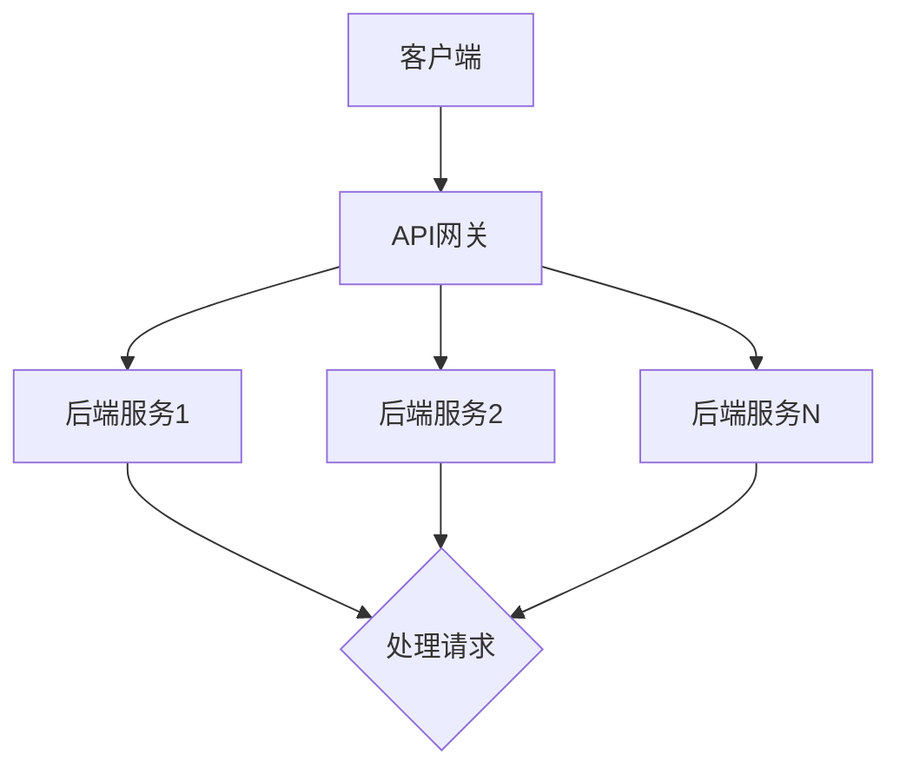

**核心算法原理讲解：**

API网关的算法原理主要涉及路由算法、负载均衡算法和缓存算法。以下是各算法的伪代码：

1. **路由算法：**

```python
def route_request(request):
    url = request.url
    method = request.method
    service_name = get_service_name(url, method)
    service = get_service_by_name(service_name)
    return service.route(request)
```

2. **负载均衡算法：**

```python
def load_balance(request):
    services = get_all_services()
    available_services = [s for s in services if s.is_available()]
    selected_service = random.choice(available_services)
    return selected_service
```

3. **缓存算法：**

```python
def cache_request(request):
    cache_key = generate_cache_key(request)
    cached_response = cache.get(cache_key)
    if cached_response is not None:
        return cached_response
    else:
        response = handle_request(request)
        cache.set(cache_key, response, expires_in_seconds)
        return response
```

**数学模型和公式：**

API网关的性能优化可以采用以下数学模型：

$$
P = \frac{W}{T}
$$

其中，$P$ 表示性能，$W$ 表示请求处理时间，$T$ 表示响应时间。

**详细讲解与举例说明：**

例如，当API网关接收到一个请求时，首先进行路由，找到相应的后端服务。然后，根据负载均衡算法，选择一个可用的后端服务进行处理。在处理过程中，如果请求的数据可以缓存，则使用缓存算法减少处理时间。

#### 第2章：API网关的核心组件

**背景介绍：**

API网关的核心组件包括反向代理、路由器、请求重写和安全控制等。这些组件共同作用，确保API网关能够高效、安全地处理请求。

**核心概念与联系：**

1. **反向代理：** API网关充当反向代理，代理客户端与后端服务之间的通信，提高系统的安全性。
2. **路由器：** API网关根据请求的URL或方法，将请求路由到相应的后端服务，实现请求的分发。
3. **请求重写：** API网关可以对请求的URL、头信息等进行修改，以满足后端服务的需求。
4. **安全控制：** API网关负责实现认证授权、API密钥管理等安全功能，确保请求的安全性。

**Mermaid 流程图：**

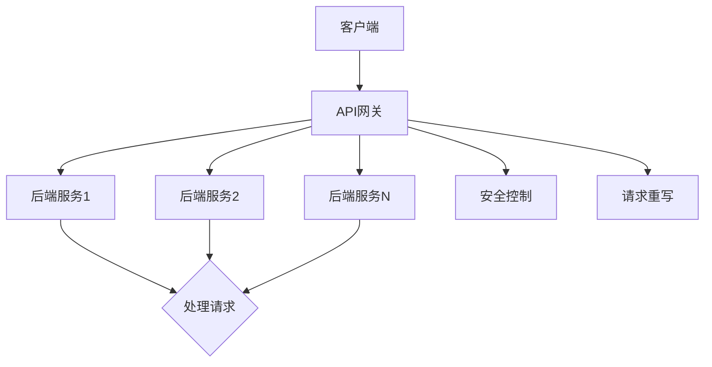

**核心算法原理讲解：**

1. **反向代理算法：**

```python
def proxy_request(request):
    destination = get_destination(request)
    send_request_to_destination(request, destination)
```

2. **路由算法：**

```python
def route_request(request):
    url = request.url
    method = request.method
    service_name = get_service_name(url, method)
    service = get_service_by_name(service_name)
    return service.route(request)
```

3. **请求重写算法：**

```python
def rewrite_request(request):
    url = request.url
    new_url = rewrite_url(url)
    request.url = new_url
    return request
```

4. **安全控制算法：**

```python
def check_security(request):
    if not is_authenticated(request):
        return False
    if not is_authorized(request):
        return False
    return True
```

**数学模型和公式：**

API网关的性能优化可以采用以下数学模型：

$$
P = \frac{W}{T}
$$

其中，$P$ 表示性能，$W$ 表示请求处理时间，$T$ 表示响应时间。

**详细讲解与举例说明：**

例如，当API网关接收到一个请求时，首先进行安全检查，确保请求合法。然后，根据路由算法，找到相应的后端服务。接着，对请求进行重写，使其符合后端服务的需求。最后，将请求转发给后端服务进行处理。

#### 第3章：API网关的设计原则

**背景介绍：**

API网关的设计原则对于提高系统的可扩展性、可靠性和安全性至关重要。以下是API网关设计的主要原则。

**核心概念与联系：**

1. **高可用性：** API网关应具备高可用性，确保系统的稳定运行。
2. **可扩展性：** API网关应支持水平扩展，以应对日益增长的服务请求。
3. **性能优化：** API网关应采用多种性能优化技术，提高系统的响应速度。
4. **安全性：** API网关应实现全面的安全防护，确保系统的安全运行。

**Mermaid 流程图：**

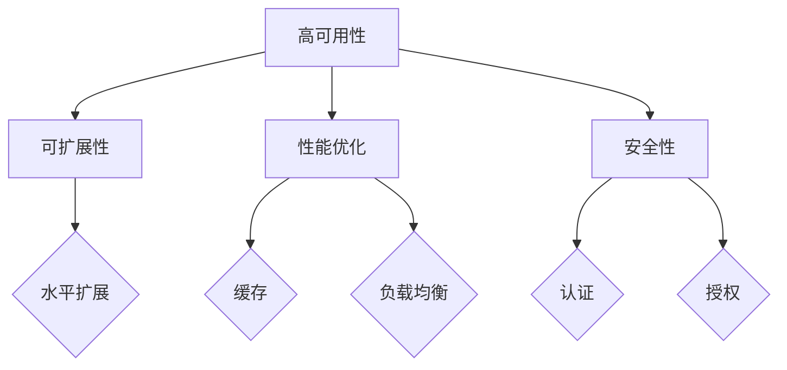

**核心算法原理讲解：**

1. **高可用性算法：**

```python
def ensure_high_availability():
    services = get_all_services()
    for service in services:
        start_service(service)
```

2. **可扩展性算法：**

```python
def scale_services():
    services = get_all_services()
    for service in services:
        if service.load > threshold:
            add更多的实例(service)
```

3. **性能优化算法：**

```python
def optimize_performance():
    cache_requests()
    balance_load()
```

4. **安全性算法：**

```python
def ensure_security():
    authenticate_requests()
    authorize_requests()
```

**数学模型和公式：**

API网关的性能优化可以采用以下数学模型：

$$
P = \frac{W}{T}
$$

其中，$P$ 表示性能，$W$ 表示请求处理时间，$T$ 表示响应时间。

**详细讲解与举例说明：**

例如，当API网关接收到大量请求时，首先进行负载均衡，将请求分配给多个后端服务。然后，采用缓存技术减少请求的处理时间。同时，对请求进行认证和授权，确保请求的安全性。

#### 第4章：API网关的架构设计

**背景介绍：**

API网关的架构设计直接影响到系统的性能、稳定性和可扩展性。以下是API网关的几种常见架构设计。

**核心概念与联系：**

1. **分层架构：** API网关采用分层架构，将不同功能模块分离，提高系统的可维护性和可扩展性。
2. **集群架构：** API网关采用集群架构，通过多实例部署，提高系统的可用性和性能。
3. **灰度发布：** API网关支持灰度发布，允许逐步将流量切换到新版本，降低风险。

**Mermaid 流程图：**

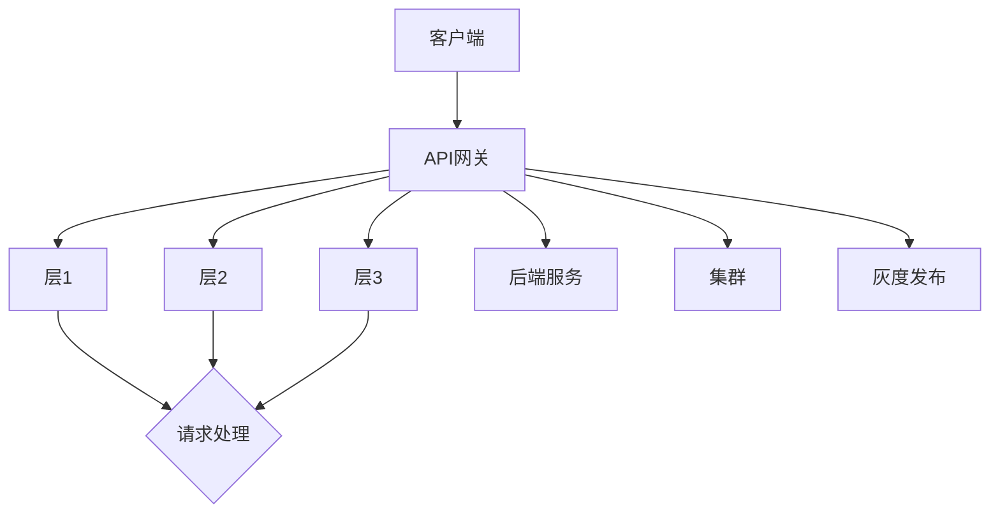

**核心算法原理讲解：**

1. **分层架构算法：**

```python
def process_request(request):
    layer1.handle_request(request)
    layer2.handle_request(request)
    layer3.handle_request(request)
    return response
```

2. **集群架构算法：**

```python
def distribute_request(request):
    cluster = get_active_cluster()
    instance = cluster.get_random_instance()
    send_request_to_instance(request, instance)
```

3. **灰度发布算法：**

```python
def gray_release(request):
    version = get_gray_version(request)
    if version == 'v1':
        handle_request_v1(request)
    elif version == 'v2':
        handle_request_v2(request)
```

**数学模型和公式：**

API网关的性能优化可以采用以下数学模型：

$$
P = \frac{W}{T}
$$

其中，$P$ 表示性能，$W$ 表示请求处理时间，$T$ 表示响应时间。

**详细讲解与举例说明：**

例如，当API网关接收到一个请求时，首先进入层1进行处理，然后依次进入层2和层3。在处理过程中，如果发现某个层出现故障，可以自动切换到其他层。同时，采用集群架构，将请求分配给多个实例，提高系统的性能。

### 第二部分：API网关技术实现

#### 第5章：API网关的通信协议

**背景介绍：**

API网关的通信协议对于系统的性能、可靠性和安全性具有重要影响。以下是API网关常用的通信协议。

**核心概念与联系：**

1. **HTTP/1.1与HTTP/2：** HTTP/1.1和HTTP/2是两种常见的HTTP协议，它们在请求和响应方式、连接管理、数据传输等方面存在差异。
2. **gRPC：** gRPC是一种高性能、跨平台的RPC框架，适用于分布式系统。
3. **WebSocket：** WebSocket是一种全双工通信协议，适用于实时数据传输。

**Mermaid 流程图：**

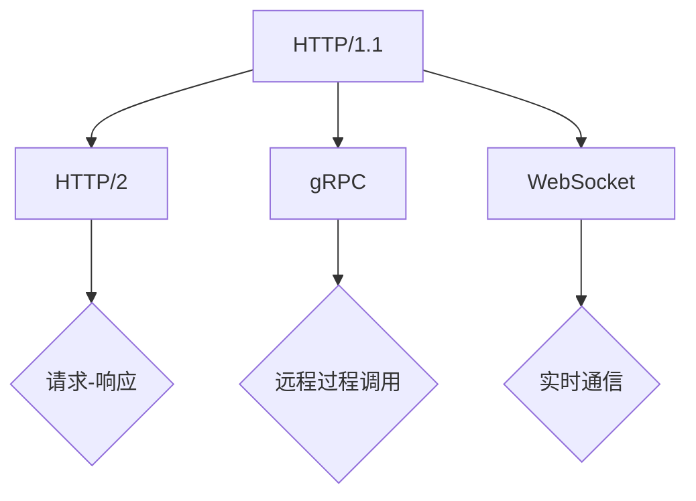

**核心算法原理讲解：**

1. **HTTP/1.1与HTTP/2：**

```python
def handle_http11_request(request):
    response = handle_request(request)
    send_response(response)

def handle_http2_request(request):
    stream = get_http2_stream(request)
    response = handle_request(request)
    stream.send_response(response)
```

2. **gRPC：**

```python
def handle_grpc_request(request):
    service = get_grpc_service(request)
    response = service.process_request(request)
    send_response(response)

3. **WebSocket：**

```python
def handle_websocket_request(request):
    connection = get_websocket_connection(request)
    message = receive_message(connection)
    process_message(message)
```

**数学模型和公式：**

API网关的性能优化可以采用以下数学模型：

$$
P = \frac{W}{T}
$$

其中，$P$ 表示性能，$W$ 表示请求处理时间，$T$ 表示响应时间。

**详细讲解与举例说明：**

例如，当API网关接收到一个HTTP/1.1请求时，首先进行请求处理，然后将响应发送给客户端。当接收到一个gRPC请求时，首先根据请求类型找到对应的gRPC服务，然后处理请求并返回响应。当接收到一个WebSocket请求时，建立WebSocket连接，接收并处理消息。

#### 第6章：API网关的安全防护

**背景介绍：**

API网关的安全防护是保障系统安全的关键。以下是API网关常用的安全防护技术。

**核心概念与联系：**

1. **认证与授权：** API网关通过认证与授权，确保请求者有权访问受保护的资源。
2. **防御DDoS攻击：** API网关需要具备防御DDoS攻击的能力，确保系统的稳定运行。
3. **API密钥管理：** API网关对API密钥进行管理，防止密钥泄露和滥用。

**Mermaid 流程图：**

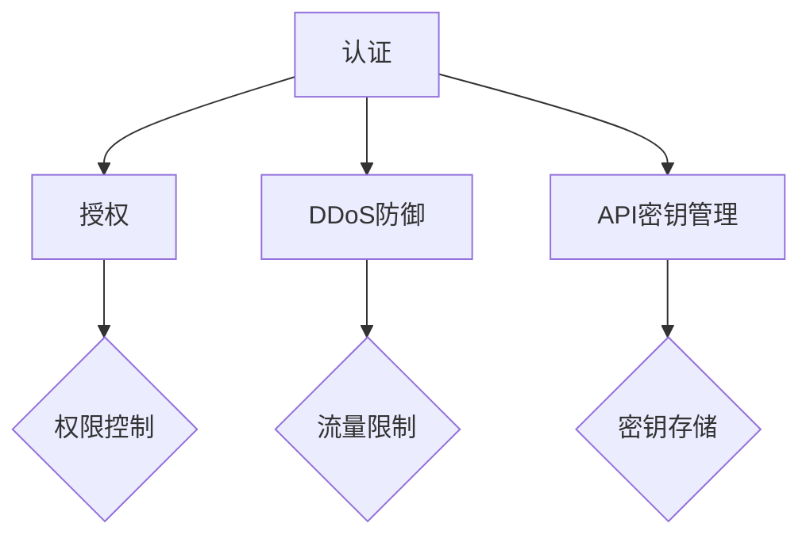

**核心算法原理讲解：**

1. **认证与授权：**

```python
def authenticate_request(request):
    if not is_authenticated(request):
        return False

def authorize_request(request):
    if not is_authorized(request):
        return False
    return True
```

2. **防御DDoS攻击：**

```python
def defend_ddos_attack(request):
    if is_suspicious(request):
        block_request(request)
    else:
        allow_request(request)
```

3. **API密钥管理：**

```python
def manage_api_key(key):
    if is_valid_key(key):
        return True
    else:
        return False
```

**数学模型和公式：**

API网关的性能优化可以采用以下数学模型：

$$
P = \frac{W}{T}
$$

其中，$P$ 表示性能，$W$ 表示请求处理时间，$T$ 表示响应时间。

**详细讲解与举例说明：**

例如，当API网关接收到一个请求时，首先进行认证，确保请求者有权访问受保护的资源。然后，进行授权，确保请求者具备访问特定资源的权限。同时，对请求进行DDoS攻击检测，防止恶意攻击。最后，对API密钥进行管理，确保密钥的安全存储和合理使用。

#### 第7章：API网关的性能优化

**背景介绍：**

API网关的性能优化对于提高系统的响应速度和用户体验至关重要。以下是API网关常用的性能优化技术。

**核心概念与联系：**

1. **缓存策略：** API网关通过缓存技术，减少请求的处理时间，提高系统的响应速度。
2. **负载均衡：** API网关采用负载均衡技术，将请求分配给多个后端服务，提高系统的性能。
3. **压力测试与监控：** API网关通过压力测试和监控，及时发现和解决问题，确保系统的稳定运行。

**Mermaid 流程图：**

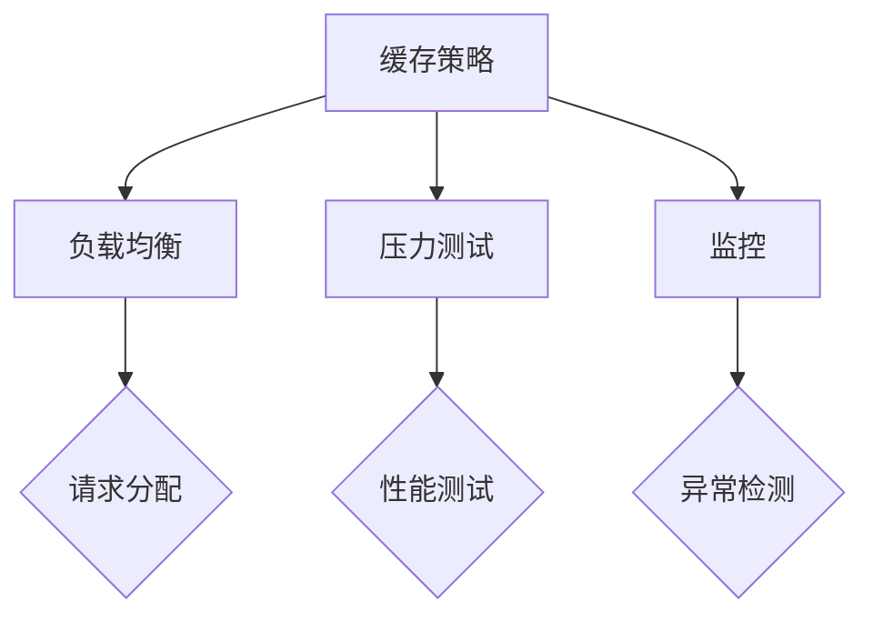

**核心算法原理讲解：**

1. **缓存策略：**

```python
def cache_request(request):
    cache_key = generate_cache_key(request)
    cached_response = cache.get(cache_key)
    if cached_response is not None:
        return cached_response
    else:
        response = handle_request(request)
        cache.set(cache_key, response, expires_in_seconds)
        return response
```

2. **负载均衡：**

```python
def load_balance(request):
    services = get_all_services()
    available_services = [s for s in services if s.is_available()]
    selected_service = random.choice(available_services)
    return selected_service
```

3. **压力测试与监控：**

```python
def perform_stress_test():
    services = get_all_services()
    for service in services:
        service.load = service.load + 1

def monitor_services():
    services = get_all_services()
    for service in services:
        if service.load > threshold:
            alert_service(service)
```

**数学模型和公式：**

API网关的性能优化可以采用以下数学模型：

$$
P = \frac{W}{T}
$$

其中，$P$ 表示性能，$W$ 表示请求处理时间，$T$ 表示响应时间。

**详细讲解与举例说明：**

例如，当API网关接收到一个请求时，首先检查缓存，如果缓存命中，则直接返回缓存数据。否则，处理请求并将响应缓存起来，以提高后续请求的响应速度。同时，采用负载均衡算法，将请求分配给多个后端服务，提高系统的性能。通过压力测试和监控，及时发现和处理性能问题，确保系统的稳定运行。

#### 第8章：API网关的部署与运维

**背景介绍：**

API网关的部署与运维是确保系统稳定、高效运行的关键。以下是API网关的部署与运维流程。

**核心概念与联系：**

1. **环境搭建：** API网关的部署需要搭建合适的环境，包括操作系统、中间件和数据库等。
2. **部署流程：** API网关的部署流程包括安装、配置、启动和监控等环节。
3. **运维监控：** API网关的运维监控包括性能监控、日志管理和故障排除等任务。

**Mermaid 流程图：**

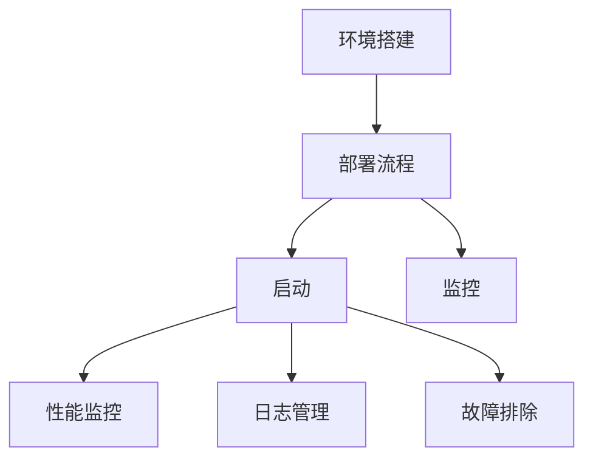

**核心算法原理讲解：**

1. **环境搭建：**

```python
def setup_environment():
    install_os()
    install中间件()
    install_database()
```

2. **部署流程：**

```python
def deploy_gateway():
    install_gateway()
    configure_gateway()
    start_gateway()
    monitor_gateway()
```

3. **运维监控：**

```python
def monitor_gateway():
    check_performance()
    manage_logs()
    fix_issues()
```

**数学模型和公式：**

API网关的性能优化可以采用以下数学模型：

$$
P = \frac{W}{T}
$$

其中，$P$ 表示性能，$W$ 表示请求处理时间，$T$ 表示响应时间。

**详细讲解与举例说明：**

例如，在API网关的部署过程中，首先搭建环境，安装操作系统、中间件和数据库等。然后，按照部署流程，安装、配置和启动API网关。在启动后，通过性能监控、日志管理和故障排除等任务，确保API网关的稳定运行。

### 第三部分：API网关应用案例

#### 第9章：API网关在微服务架构中的应用

**背景介绍：**

微服务架构已成为现代软件开发的主流，API网关在微服务架构中扮演着至关重要的角色。本章将探讨API网关在微服务架构中的应用。

**核心概念与联系：**

1. **微服务架构：** 微服务架构将应用程序划分为多个独立的微服务，每个微服务负责特定的功能。
2. **API网关：** API网关作为微服务架构的统一入口，负责路由请求、负载均衡和安全防护等任务。

**Mermaid 流程图：**

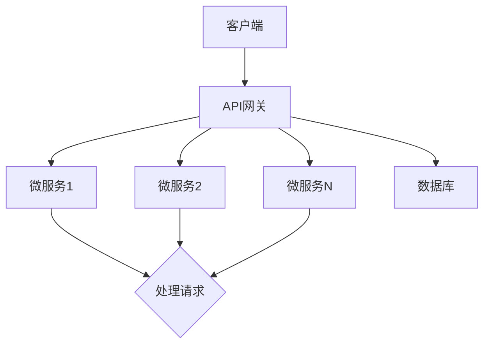

**核心算法原理讲解：**

1. **路由算法：**

```python
def route_request(request):
    url = request.url
    method = request.method
    service_name = get_service_name(url, method)
    service = get_service_by_name(service_name)
    return service.route(request)
```

2. **负载均衡算法：**

```python
def load_balance(request):
    services = get_all_services()
    available_services = [s for s in services if s.is_available()]
    selected_service = random.choice(available_services)
    return selected_service
```

3. **安全控制算法：**

```python
def check_security(request):
    if not is_authenticated(request):
        return False
    if not is_authorized(request):
        return False
    return True
```

**数学模型和公式：**

API网关的性能优化可以采用以下数学模型：

$$
P = \frac{W}{T}
$$

其中，$P$ 表示性能，$W$ 表示请求处理时间，$T$ 表示响应时间。

**详细讲解与举例说明：**

例如，在微服务架构中，API网关作为客户端与后端微服务之间的桥梁，首先进行安全认证，确保请求合法。然后，根据路由算法，将请求路由到相应的微服务。通过负载均衡算法，将请求分配给多个微服务，提高系统的性能。同时，API网关还负责实现微服务间的安全控制，确保请求的安全性。

#### 第10章：API网关在移动应用开发中的应用

**背景介绍：**

随着移动互联网的普及，移动应用开发已成为企业竞争的重要手段。API网关在移动应用开发中发挥着重要作用。本章将探讨API网关在移动应用开发中的应用。

**核心概念与联系：**

1. **移动应用开发：** 移动应用开发涉及前端、后端和数据库等多个方面。
2. **API网关：** API网关作为移动应用与后端服务之间的桥梁，负责路由请求、缓存数据和提供安全防护等任务。

**Mermaid 流程图：**

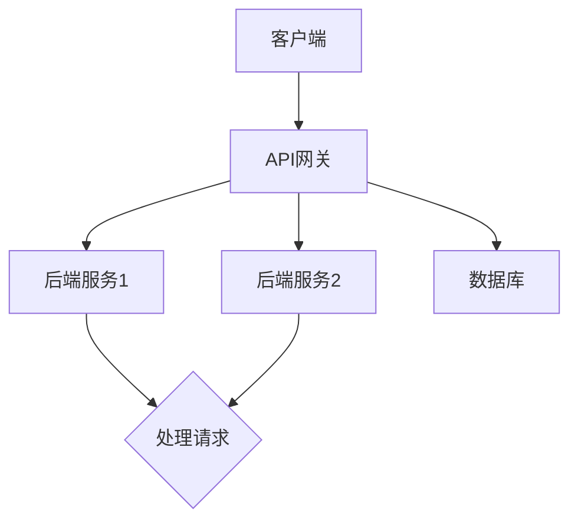

**核心算法原理讲解：**

1. **路由算法：**

```python
def route_request(request):
    url = request.url
    method = request.method
    service_name = get_service_name(url, method)
    service = get_service_by_name(service_name)
    return service.route(request)
```

2. **缓存算法：**

```python
def cache_request(request):
    cache_key = generate_cache_key(request)
    cached_response = cache.get(cache_key)
    if cached_response is not None:
        return cached_response
    else:
        response = handle_request(request)
        cache.set(cache_key, response, expires_in_seconds)
        return response
```

3. **安全控制算法：**

```python
def check_security(request):
    if not is_authenticated(request):
        return False
    if not is_authorized(request):
        return False
    return True
```

**数学模型和公式：**

API网关的性能优化可以采用以下数学模型：

$$
P = \frac{W}{T}
$$

其中，$P$ 表示性能，$W$ 表示请求处理时间，$T$ 表示响应时间。

**详细讲解与举例说明：**

例如，在移动应用开发中，API网关作为客户端与后端服务之间的桥梁，首先进行安全认证，确保请求合法。然后，根据路由算法，将请求路由到相应的后端服务。通过缓存算法，减少请求的处理时间，提高系统的响应速度。同时，API网关还负责实现安全控制，确保请求的安全性。

#### 第11章：API网关在物联网中的应用

**背景介绍：**

物联网（IoT）作为现代技术的重要方向，已经深入到人们的日常生活。API网关在物联网中发挥着重要作用，本章将探讨API网关在物联网中的应用。

**核心概念与联系：**

1. **物联网：** 物联网是一个庞大且复杂的系统，涉及传感器、设备、网络和云计算等多个方面。
2. **API网关：** API网关作为物联网与后端服务之间的桥梁，负责数据采集、路由请求和提供安全防护等任务。

**Mermaid 流程图：**

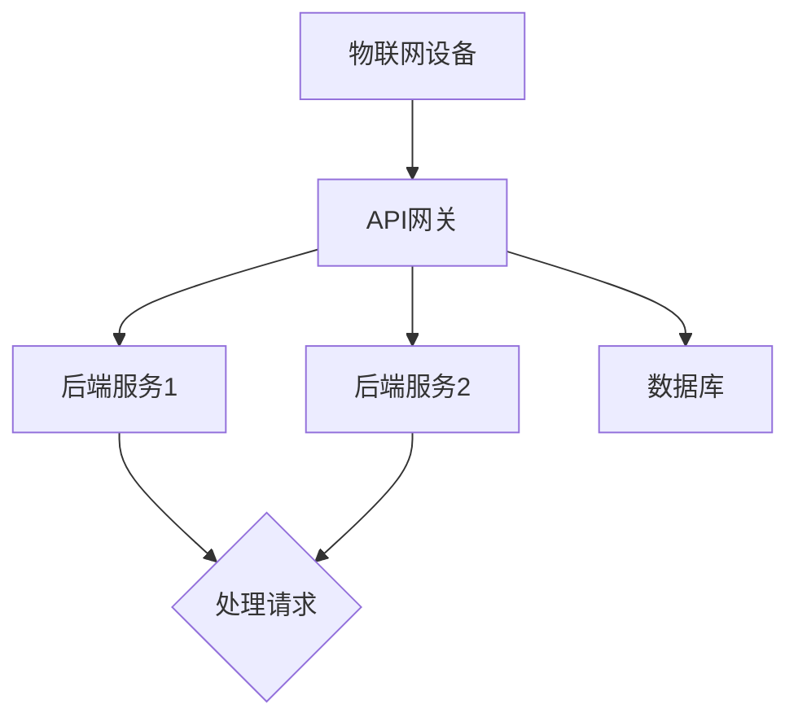

**核心算法原理讲解：**

1. **数据采集算法：**

```python
def collect_data(device):
    data = device.fetch_data()
    process_data(data)
```

2. **路由算法：**

```python
def route_request(request):
    url = request.url
    method = request.method
    service_name = get_service_name(url, method)
    service = get_service_by_name(service_name)
    return service.route(request)
```

3. **安全控制算法：**

```python
def check_security(request):
    if not is_authenticated(request):
        return False
    if not is_authorized(request):
        return False
    return True
```

**数学模型和公式：**

API网关的性能优化可以采用以下数学模型：

$$
P = \frac{W}{T}
$$

其中，$P$ 表示性能，$W$ 表示请求处理时间，$T$ 表示响应时间。

**详细讲解与举例说明：**

例如，在物联网应用中，API网关作为物联网设备与后端服务之间的桥梁，首先进行数据采集，将物联网设备采集到的数据发送给后端服务。然后，根据路由算法，将请求路由到相应的后端服务进行处理。通过安全控制算法，确保数据传输的安全性。

#### 第12章：API网关在金融行业中的应用

**背景介绍：**

金融行业是现代经济的核心，对于安全性和稳定性要求极高。API网关在金融行业中发挥着重要作用，本章将探讨API网关在金融行业中的应用。

**核心概念与联系：**

1. **金融行业：** 金融行业涉及银行、保险、证券等多个领域，具有高安全性、高可靠性要求。
2. **API网关：** API网关作为金融行业与后端服务之间的桥梁，负责路由请求、安全防护和性能优化等任务。

**Mermaid 流程图：**

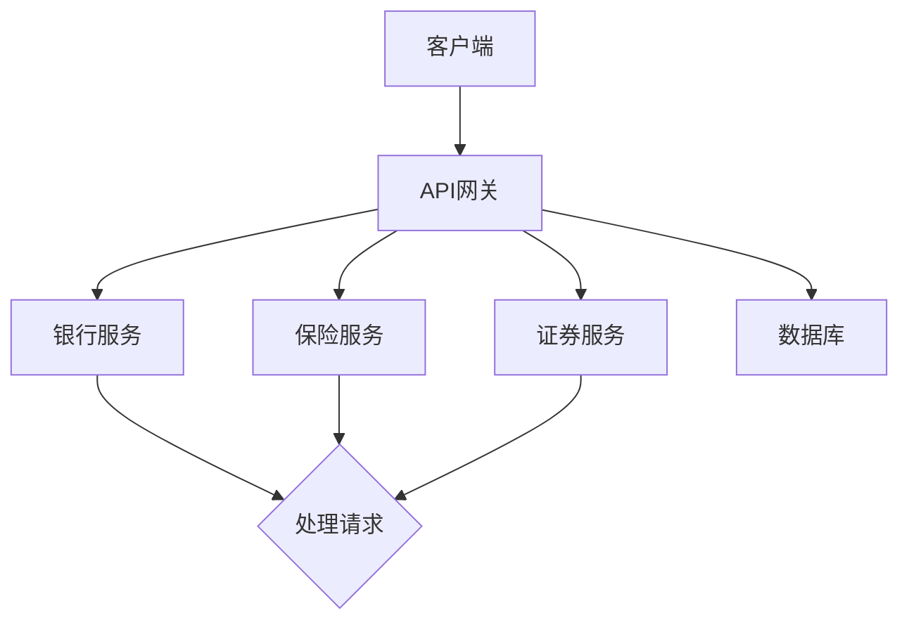

**核心算法原理讲解：**

1. **路由算法：**

```python
def route_request(request):
    url = request.url
    method = request.method
    service_name = get_service_name(url, method)
    service = get_service_by_name(service_name)
    return service.route(request)
```

2. **安全控制算法：**

```python
def check_security(request):
    if not is_authenticated(request):
        return False
    if not is_authorized(request):
        return False
    return True
```

3. **性能优化算法：**

```python
def optimize_performance():
    cache_requests()
    balance_load()
```

**数学模型和公式：**

API网关的性能优化可以采用以下数学模型：

$$
P = \frac{W}{T}
$$

其中，$P$ 表示性能，$W$ 表示请求处理时间，$T$ 表示响应时间。

**详细讲解与举例说明：**

例如，在金融行业中，API网关作为客户端与后端服务之间的桥梁，首先进行安全认证，确保请求合法。然后，根据路由算法，将请求路由到相应的后端服务。通过性能优化算法，提高系统的响应速度。同时，API网关还负责实现安全控制，确保金融交易的安全性。

### 第四部分：API网关的未来发展趋势

#### 第13章：API网关的新技术与应用

**背景介绍：**

随着技术的不断发展，API网关也在不断演进。本章将探讨API网关的新技术与应用。

**核心概念与联系：**

1. **服务网格：** 服务网格是一种新型的服务架构模式，为微服务提供通信和安全保障。
2. **联合API网关：** 联合API网关将多个API网关集成在一起，提供更灵活的服务治理能力。
3. **未来发展趋势：** API网关将结合人工智能、区块链等技术，实现更智能、更安全的服务治理。

**Mermaid 流程图：**

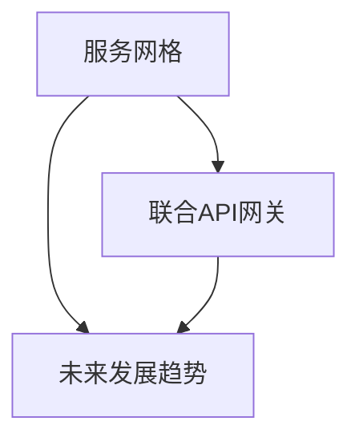

**核心算法原理讲解：**

1. **服务网格算法：**

```python
def service_mesh(request):
    service = get_service_mesh(request)
    return service.route(request)
```

2. **联合API网关算法：**

```python
def joint_api_gateway(request):
    gateways = get_joint_api_gateways()
    selected_gateway = random.choice(gateways)
    return selected_gateway.route(request)
```

**数学模型和公式：**

API网关的性能优化可以采用以下数学模型：

$$
P = \frac{W}{T}
$$

其中，$P$ 表示性能，$W$ 表示请求处理时间，$T$ 表示响应时间。

**详细讲解与举例说明：**

例如，在服务网格中，API网关通过服务网格算法，将请求路由到合适的微服务。在联合API网关中，多个API网关协同工作，提供更灵活的服务治理能力。随着技术的不断发展，API网关将结合人工智能、区块链等技术，实现更智能、更安全的服务治理。

#### 第14章：API网关的最佳实践

**背景介绍：**

在实际应用中，API网关的设计与实现需要遵循一系列最佳实践，以确保系统的性能、安全性和可维护性。本章将探讨API网关的最佳实践。

**核心概念与联系：**

1. **设计原则：** API网关的设计原则包括高可用性、可扩展性和安全性等。
2. **安全防护：** API网关的安全防护包括认证授权、防御DDoS攻击和API密钥管理等。
3. **性能优化：** API网关的性能优化包括缓存策略、负载均衡和压力测试等。
4. **运维监控：** API网关的运维监控包括日志管理、性能监控和故障排除等。

**Mermaid 流程图：**

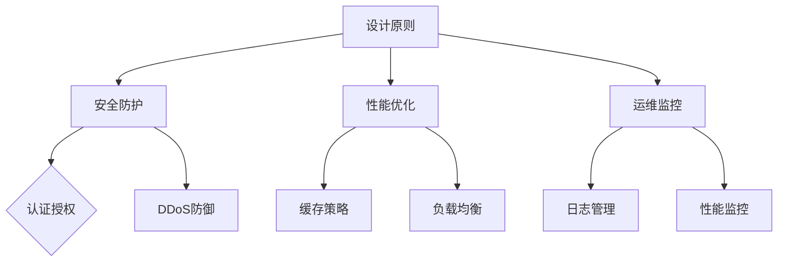

**核心算法原理讲解：**

1. **设计原则算法：**

```python
def apply_design_principles():
    ensure_high_availability()
    ensure Scalability()
    ensure_security()
```

2. **安全防护算法：**

```python
def apply_security_measures():
    enable_authentication()
    enable_authorization()
    defend_against_ddos()
    manage_api_keys()
```

3. **性能优化算法：**

```python
def apply_performance_optimizations():
    enable_caching()
    enable_load_balancing()
    perform_stress_tests()
```

4. **运维监控算法：**

```python
def apply_monitoring():
    manage_logs()
    monitor_performance()
    fix_issues()
```

**数学模型和公式：**

API网关的性能优化可以采用以下数学模型：

$$
P = \frac{W}{T}
$$

其中，$P$ 表示性能，$W$ 表示请求处理时间，$T$ 表示响应时间。

**详细讲解与举例说明：**

例如，在设计API网关时，需要遵循高可用性、可扩展性和安全性等设计原则。在安全防护方面，需要实现认证授权、防御DDoS攻击和API密钥管理等功能。在性能优化方面，可以采用缓存策略、负载均衡和压力测试等技术。在运维监控方面，需要实现日志管理、性能监控和故障排除等功能，确保系统的稳定运行。

#### 第15章：API网关的未来展望

**背景介绍：**

随着技术的不断发展，API网关在未来的发展趋势和方向将发生重大变化。本章将探讨API网关的未来展望。

**核心概念与联系：**

1. **新技术：** API网关将结合人工智能、区块链等新技术，实现更智能、更安全的服务治理。
2. **数字化转型：** API网关将在数字化转型中发挥关键作用，推动企业向智能化、网络化方向转型。
3. **最佳实践：** API网关将不断优化最佳实践，提高系统的性能、安全性和可维护性。

**Mermaid 流程图：**

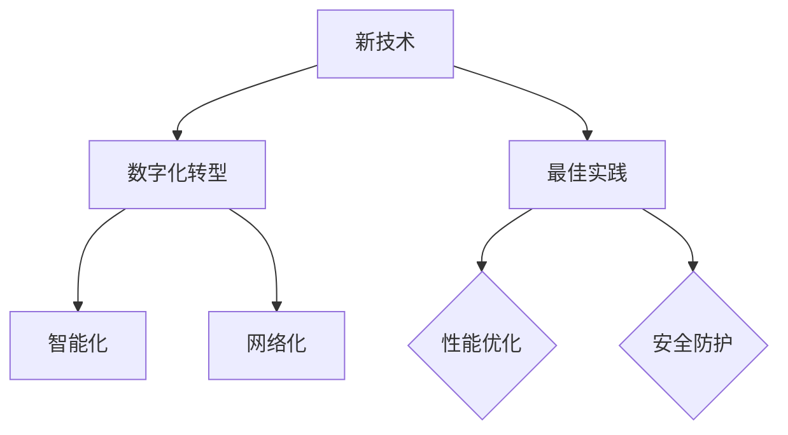

**核心算法原理讲解：**

1. **新技术算法：**

```python
def integrate_new_technologies():
    enable_ai()
    enable_blockchain()
```

2. **数字化转型算法：**

```python
def transform_with_api_gateway():
    enable_intelligent_services()
    enable_networked_services()
```

3. **最佳实践算法：**

```python
def apply_best_practices():
    optimize_performance()
    ensure_security()
    enhance_maintainability()
```

**数学模型和公式：**

API网关的性能优化可以采用以下数学模型：

$$
P = \frac{W}{T}
$$

其中，$P$ 表示性能，$W$ 表示请求处理时间，$T$ 表示响应时间。

**详细讲解与举例说明：**

例如，在未来，API网关将结合人工智能技术，实现更智能的服务治理。通过区块链技术，提高数据的安全性和可信度。在数字化转型中，API网关将发挥关键作用，推动企业向智能化、网络化方向转型。同时，API网关将不断优化最佳实践，提高系统的性能、安全性和可维护性。

### 附录

#### 附录A：API网关开源项目介绍

**背景介绍：**

API网关开源项目为开发者提供了丰富的功能和灵活的架构，以下是几个常用的API网关开源项目。

**核心概念与联系：**

1. **Apache APISIX：** Apache APISIX 是一款高性能、可扩展的 API 网关。
2. **Kong：** Kong 是一款可插件的 API 网关，具有高可用性和可扩展性。
3. **Traefik：** Traefik 是一款开源的反向代理和负载均衡器，支持多种后端服务。

**Mermaid 流程图：**

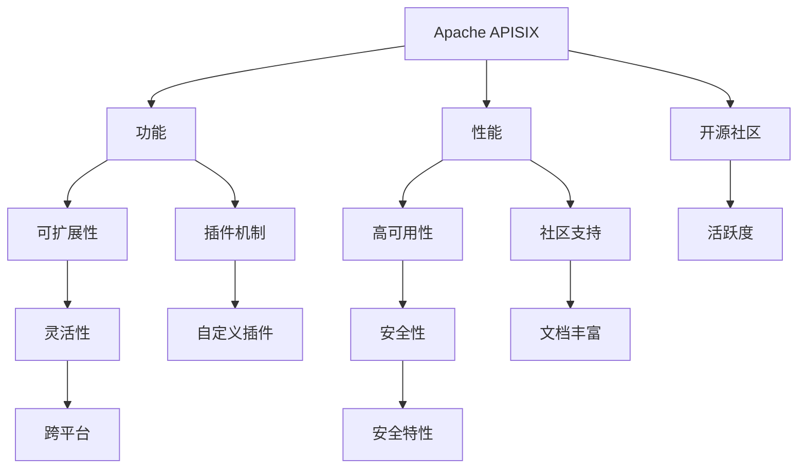

**核心算法原理讲解：**

1. **Apache APISIX：**

```python
def handle_request(request):
    route = get_route(request)
    service = get_service(route)
    response = service.handle_request(request)
    return response
```

2. **Kong：**

```python
def handle_request(request):
    plugin_manager.apply_plugins(request)
    service = get_service(request)
    response = service.handle_request(request)
    plugin_manager.apply_plugins(response)
    return response
```

3. **Traefik：**

```python
def handle_request(request):
    backend = get_backend(request)
    response = backend.handle_request(request)
    return response
```

**数学模型和公式：**

API网关的性能优化可以采用以下数学模型：

$$
P = \frac{W}{T}
$$

其中，$P$ 表示性能，$W$ 表示请求处理时间，$T$ 表示响应时间。

**详细讲解与举例说明：**

例如，Apache APISIX 作为一款高性能、可扩展的 API 网关，通过路由算法，将请求路由到相应的服务进行处理。Kong 作为一款可插件的 API 网关，通过插件机制，提供丰富的功能，如认证、授权、限流等。Traefik 作为一款开源的反向代理和负载均衡器，支持多种后端服务，如 HTTP、HTTPS、TCP 等。

#### 附录B：API网关相关书籍推荐

**背景介绍：**

API网关是现代软件开发中的重要组件，以下推荐几本与API网关相关的书籍，供开发者参考。

**核心概念与联系：**

1. **《API网关：设计与实现》：** 本书全面介绍了 API 网关的设计原则、核心组件和实现方法。
2. **《API设计指南：REST、SOAP和JSON》：** 本书详细讲解了 API 设计的原理和方法，包括 REST、SOAP 和 JSON 等。
3. **《微服务设计：构建可扩展的系统》：** 本书介绍了微服务架构的设计原则、核心组件和实现方法，为 API 网关提供了理论基础。

**Mermaid 流程图：**

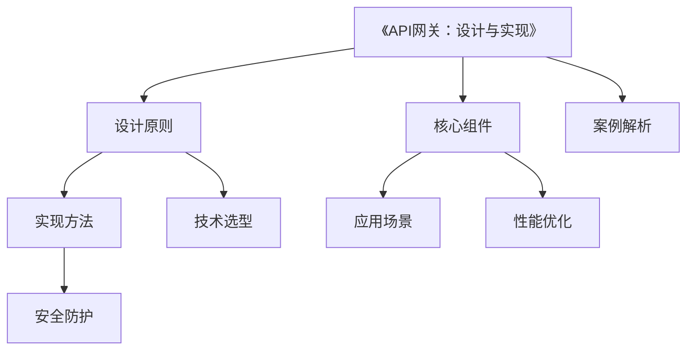

**核心算法原理讲解：**

1. **《API网关：设计与实现》：**

```python
def design_api_gateway():
    define_design_principles()
    identify_core_components()
    implement_security_measures()
```

2. **《API设计指南：REST、SOAP和JSON》：**

```python
def design_api():
    choose_api_style()
    define_api_endpoints()
    handle_request_methods()
```

3. **《微服务设计：构建可扩展的系统》：**

```python
def design_microservices():
    define_service boundaries()
    choose_deployment_strategy()
    implement_service_apis()
```

**数学模型和公式：**

API网关的性能优化可以采用以下数学模型：

$$
P = \frac{W}{T}
$$

其中，$P$ 表示性能，$W$ 表示请求处理时间，$T$ 表示响应时间。

**详细讲解与举例说明：**

例如，在《API网关：设计与实现》中，本书详细介绍了 API 网关的设计原则、核心组件和实现方法。在《API设计指南：REST、SOAP和JSON》中，本书详细讲解了 API 设计的原理和方法，为开发者提供了指导。在《微服务设计：构建可扩展的系统》中，本书介绍了微服务架构的设计原则、核心组件和实现方法，为 API 网关提供了理论基础。

### 作者信息

作者：AI天才研究院/AI Genius Institute & 禅与计算机程序设计艺术 /Zen And The Art of Computer Programming

