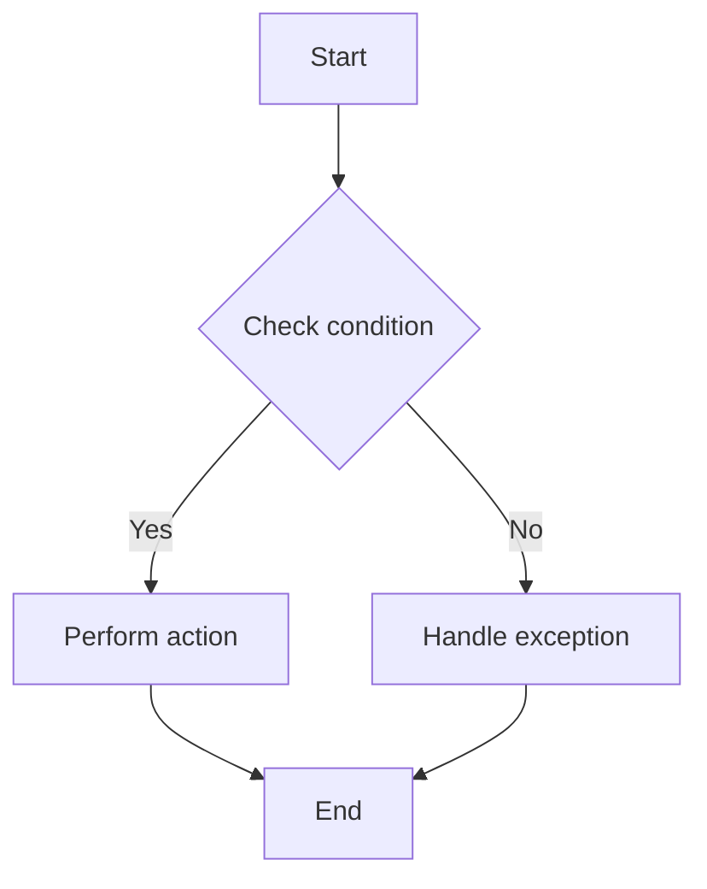
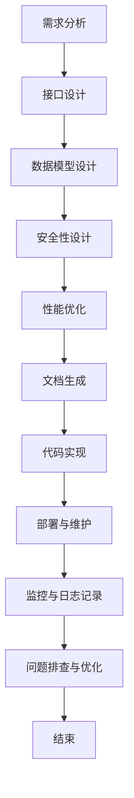

                 

# API设计与管理：构建稳定、安全的接口

## 关键词

- API设计
- RESTful API
- GraphQL API
- API安全性
- API性能优化
- API部署与维护

## 摘要

本文将深入探讨API设计与管理的关键要素，旨在帮助开发者构建稳定、安全的接口。我们将首先介绍API的基本概念和分类，接着讨论API设计的原则与最佳实践。随后，文章将重点分析API的安全性设计、性能优化、部署与维护策略。此外，本文还将介绍API设计工具及其使用方法，并通过实际案例进行深入剖析，总结出API设计的最佳实践和注意事项。最后，我们将展望API设计领域的未来发展趋势。

### 设计思路

#### 确定书籍主题和内容结构

根据书名《API设计与管理：构建稳定、安全的接口》，我们可以确定书籍的主题是关于API的设计和管理。因此，目录大纲需要覆盖API设计的基本概念、最佳实践、安全性、稳定性等方面的内容。

#### 构建核心章节

我们需要确保书籍的核心章节内容丰富，能够帮助读者全面了解API设计与管理。核心章节应包括：
1. API设计基础
2. API设计原则与最佳实践
3. API安全性设计
4. API性能优化
5. API部署与维护
6. API设计工具介绍
7. API设计案例分析

#### 细化每个章节

对于每个核心章节，我们需要进一步细化内容，使其更具可读性和实用性。具体可以参考以下内容：

#### 添加扩展内容

为了使书籍更具深度和实用性，我们可以在适当章节添加扩展内容，如：
- Mermaid流程图：用于描述API设计流程或架构
- 伪代码：用于详细阐述API设计的算法原理
- 数学模型和公式：用于解释API设计中的数学原理
- 项目实战：实际API设计案例，包括开发环境搭建、源代码实现和解读

#### 确保简洁性和完整性

在设计目录大纲时，要确保内容简洁明了，避免冗余。同时，要确保大纲的完整性，覆盖所有必要的知识点。

### 输出目录大纲

基于上述设计思路，以下是《API设计与管理：构建稳定、安全的接口》的目录大纲：

## 第一部分：API设计基础

### 第1章：API的定义与分类

1.1 API的定义

1.2 API的分类

1.3 API设计的关键要素

### 第2章：API设计原则

2.1 RESTful API设计原则

2.2 GraphQL API设计原则

2.3 API设计最佳实践

## 第二部分：API设计与实现

### 第3章：API安全性设计

3.1 API安全性的重要性

3.2 常见API安全风险

3.3 安全性设计策略

### 第4章：API性能优化

4.1 API性能评估

4.2 性能优化方法

4.3 性能调优案例

### 第5章：API部署与维护

5.1 API部署流程

5.2 API监控与日志

5.3 API维护策略

### 第6章：API设计工具介绍

6.1 API设计工具分类

6.2 API设计工具使用示例

6.3 API设计工具比较

## 第三部分：API设计案例与经验分享

### 第7章：API设计案例分析

7.1 案例选择与背景介绍

7.2 案例API设计分析

7.3 案例经验与教训

### 第8章：API设计原理与数学模型

8.1 API设计中的数学模型

8.2 数学公式与详细讲解

8.3 数学模型举例说明

### 第9章：API设计算法原理

9.1 算法原理讲解

9.2 伪代码展示

9.3 算法原理应用案例

### 第10章：API设计流程与Mermaid图

10.1 API设计流程

10.2 Mermaid图绘制方法

10.3 API设计流程Mermaid图示例

### 第11章：项目实战

11.1 开发环境搭建

11.2 源代码详细实现与解读

11.3 代码应用解读与分析

11.4 实际案例分析与详细讲解

11.5 项目小结

### 第12章：最佳实践、小结与注意事项

12.1 最佳实践

12.2 小结

12.3 注意事项

12.4 拓展阅读

### 第13章：API设计发展趋势与展望

13.1 API设计领域现状分析

13.2 未来发展趋势

13.3 开发者应对策略

### 附录

- 附录A：常用API设计工具汇总

- 附录B：API设计常见问题与解决方案

- 附录C：API设计参考资料与推荐阅读

## 文章结束，作者信息如下：

作者：AI天才研究院/AI Genius Institute & 禅与计算机程序设计艺术 /Zen And The Art of Computer Programming## 第一部分：API设计基础

### 第1章：API的定义与分类

#### 1.1 API的定义

应用程序接口（Application Programming Interface，简称API）是软件开发过程中用于不同软件模块或服务之间交互的一套预定义的规则和协议。通过API，开发者可以在不访问底层代码的情况下，使用特定的方法、数据结构和协议来访问服务或资源。API的核心功能是实现模块间的解耦，使得各个组件可以独立开发、测试和部署。

API的定义可以从以下几个方面来理解：

- **功能定义**：API定义了一组操作，这些操作允许程序访问特定的功能或数据。
- **交互协议**：API定义了客户端和服务器之间的交互协议，包括请求和响应的结构。
- **数据格式**：API通常采用特定的数据格式进行数据交换，如JSON、XML等。
- **安全性**：API定义了安全机制，以确保只有授权用户可以访问受保护的资源。

#### 1.2 API的分类

根据用途和设计理念，API可以分为多种类型：

- **系统级API**：提供操作系统或硬件层面的访问，如Windows API、Linux内核API。
- **库API**：提供一组函数库，用于实现特定功能，如MySQL C API。
- **Web API**：提供网络服务，供第三方应用程序调用，如RESTful API、GraphQL API。
- **平台API**：特定平台或框架提供的API，如iOS SDK、Android SDK。

#### 1.3 API设计的关键要素

一个良好的API设计需要考虑多个关键要素，包括但不限于：

- **易用性**：API应简洁易用，易于理解和记忆，降低开发者学习成本。
- **一致性**：API在功能和接口上应保持一致性，避免出现不必要的复杂性和混淆。
- **灵活性**：API设计应具有一定的灵活性，能够适应不同的使用场景和需求变化。
- **安全性**：API设计应考虑安全性，防止未经授权的访问和潜在的安全漏洞。
- **性能**：API设计应优化性能，确保快速响应和高吞吐量。

### 第2章：API设计原则

#### 2.1 RESTful API设计原则

RESTful API是一套设计风格，旨在创建简单、可扩展的Web服务。RESTful API的设计原则包括：

- **统一接口**：保持接口的一致性，使用统一的URL结构、HTTP方法和状态码。
- **无状态性**：确保API是无状态的，每个请求独立处理，避免存储客户端上下文。
- **客户端-服务器模型**：将客户端和服务器分离，客户端负责用户界面和数据处理，服务器负责数据和业务逻辑。
- **缓存**：利用HTTP缓存机制，提高性能和响应速度。
- **分层系统**：将系统分层，确保各层之间的解耦和独立部署。

#### 2.2 GraphQL API设计原则

GraphQL API是一种灵活的查询语言，允许客户端指定所需数据的结构。GraphQL API的设计原则包括：

- **强类型系统**：使用强类型系统定义数据类型和字段，提高代码的可读性和健壮性。
- **灵活查询**：允许客户端指定复杂的查询，减少数据传输和重复查询。
- **自定义字段**：支持自定义查询，使得客户端可以精确获取所需数据。
- **批量请求**：支持批量请求，减少请求次数，提高性能。
- **订阅**：支持订阅功能，允许客户端实时接收数据更新。

#### 2.3 API设计最佳实践

在API设计过程中，以下最佳实践可以帮助提高API的质量和可维护性：

- **版本控制**：为API实现版本控制，便于管理和升级。
- **文档化**：提供详细的API文档，包括接口描述、参数定义、返回值说明等。
- **错误处理**：明确处理错误和异常，提供友好的错误信息。
- **性能测试**：对API进行性能测试，确保满足性能要求。
- **安全性**：实现安全性措施，如身份验证、授权、数据加密等。

### 第3章：API安全性设计

#### 3.1 API安全性的重要性

API安全性的重要性不言而喻。由于API是应用程序之间的交互桥梁，潜在的安全漏洞可能导致以下风险：

- **数据泄露**：未经授权的访问可能导致敏感数据泄露。
- **数据篡改**：恶意攻击者可能篡改数据，破坏数据的完整性和可靠性。
- **功能破坏**：通过攻击API，恶意用户可能破坏应用程序的正常功能。
- **资源耗尽**：通过恶意请求，攻击者可能导致系统资源耗尽，引发拒绝服务攻击。

因此，确保API安全性是保障整个系统安全的重要环节。

#### 3.2 常见API安全风险

以下是一些常见的API安全风险：

- **身份验证与授权漏洞**：如未正确实现身份验证和授权机制，可能导致未经授权的访问。
- **输入验证不足**：如未对输入进行严格的验证，可能导致SQL注入、跨站脚本攻击（XSS）等。
- **会话管理漏洞**：如会话管理不当，可能导致会话劫持、会话固定等攻击。
- **配置错误**：如配置不当，可能导致API暴露在互联网上，无法访问或安全性不足。
- **API滥用**：如未限制请求频率和请求大小，可能导致DDoS攻击或其他滥用行为。

#### 3.3 安全性设计策略

为了确保API的安全性，可以采取以下策略：

- **身份验证与授权**：采用HTTPS、OAuth、JWT等机制进行身份验证和授权。
- **输入验证**：对输入进行严格的验证，过滤和转义特殊字符，防止注入攻击。
- **会话管理**：使用安全、随机生成的会话标识，并定期更换。
- **配置管理**：确保API配置安全，避免不必要的公开。
- **监控与日志**：实时监控API访问日志，发现异常行为并及时响应。

### 第4章：API性能优化

#### 4.1 API性能评估

API性能评估是确保API满足性能要求的重要步骤。以下是一些常用的性能评估方法：

- **基准测试**：使用基准测试工具模拟真实请求，测量API的响应时间和吞吐量。
- **负载测试**：通过逐渐增加请求量，评估API在不同负载下的性能表现。
- **压力测试**：在极端负载下测试API的稳定性和性能，确保其能够在高峰期保持良好性能。
- **性能监控**：实时监控API的响应时间、吞吐量和资源消耗，及时发现性能瓶颈。

#### 4.2 性能优化方法

以下是一些常见的API性能优化方法：

- **缓存**：使用缓存减少数据库访问和计算，提高响应速度。
- **数据库优化**：优化数据库查询，减少查询时间和数据传输。
- **代码优化**：优化算法和代码结构，减少计算时间和内存占用。
- **负载均衡**：使用负载均衡器分配请求，提高系统的吞吐量和可用性。
- **异步处理**：采用异步处理减少等待时间，提高系统的并发能力。

#### 4.3 性能调优案例

以下是一个API性能调优的案例：

**案例背景**：一个在线购物平台需要优化其商品查询接口，以提高用户体验。

**性能问题**：接口在高峰期响应时间较长，导致用户等待时间增加。

**解决方案**：
1. **缓存**：在API端添加缓存机制，减少数据库访问。
2. **数据库优化**：优化数据库查询，添加索引、预编译SQL语句。
3. **代码优化**：减少不必要的计算，使用更高效的算法和数据结构。
4. **负载均衡**：使用负载均衡器分配请求，减轻单台服务器的压力。
5. **异步处理**：将部分计算和I/O操作异步处理，减少等待时间。

**效果评估**：通过上述优化，接口响应时间显著缩短，用户满意度提高。

### 第5章：API部署与维护

#### 5.1 API部署流程

API部署流程是确保API能够稳定运行的重要步骤。以下是一个典型的API部署流程：

1. **开发环境**：在开发环境中进行API开发、测试和调试。
2. **测试环境**：将开发完成的API部署到测试环境，进行集成测试和性能测试。
3. **预生产环境**：在预生产环境中进行实际业务压力测试，确保API能够稳定运行。
4. **生产环境**：将API部署到生产环境，供实际业务使用。

#### 5.2 API监控与日志

API监控与日志是确保API稳定运行的重要手段。以下是一些监控与日志的实践：

- **实时监控**：使用监控工具实时监控API的响应时间、吞吐量和错误率。
- **日志记录**：记录API的访问日志、错误日志和性能日志，便于问题定位和故障排查。
- **报警机制**：设置报警机制，及时发现和处理异常情况。

#### 5.3 API维护策略

API维护策略是确保API长期稳定运行的关键。以下是一些API维护策略：

- **版本管理**：为API实现版本管理，便于更新和维护。
- **文档更新**：及时更新API文档，确保文档与实际API保持一致。
- **反馈机制**：建立反馈机制，收集用户反馈和意见，不断改进API。
- **培训与支持**：为开发者提供培训和支持，确保他们能够正确使用API。

### 第6章：API设计工具介绍

#### 6.1 API设计工具分类

API设计工具可以分为以下几类：

- **图形化API设计工具**：如Swagger、Postman，提供直观的图形界面，方便API设计和管理。
- **代码生成工具**：如RAML、OpenAPI，通过定义API规范文件生成代码。
- **文档生成工具**：如Redoc、GraphQL Playground，用于生成API文档和提供交互式接口。
- **性能测试工具**：如JMeter、Gatling，用于测试API性能。

#### 6.2 API设计工具使用示例

以下是一个使用Swagger设计API的示例：

1. **创建Swagger文档**：使用Swagger UI生成一个基本的Swagger文档。

2. **定义API接口**：在Swagger文档中定义API的接口，包括URL、请求方法和参数。

3. **定义数据模型**：定义API响应的数据模型，包括字段、类型和示例。

4. **生成API代码**：使用Swagger Codegen生成符合要求的API代码。

5. **测试API接口**：使用Swagger UI或Postman测试API接口，确保其功能正常。

#### 6.3 API设计工具比较

以下是对几种常见API设计工具的比较：

| 工具名称 | 特点 | 适用场景 |
| --- | --- | --- |
| Swagger | 图形化界面，易于使用 | API设计、文档生成 |
| Postman | API测试、文档生成 | API测试、文档生成 |
| RAML | 代码生成，易于维护 | API设计、文档生成 |
| OpenAPI | 规范化定义，易于扩展 | API设计、文档生成 |
| Redoc | 交互式文档，易于阅读 | API文档展示 |
| GraphQL Playground | 交互式接口，支持GraphQL | GraphQL API测试 |

### 第7章：API设计案例分析

#### 7.1 案例选择与背景介绍

本章节选择一个在线购物平台中的商品查询API作为案例，介绍API设计的过程和注意事项。

**背景**：在线购物平台需要提供商品查询功能，支持用户根据关键词、分类、价格等条件查询商品信息。该API需要满足高并发、高可用性的要求，同时保证安全性。

#### 7.2 案例API设计分析

**接口定义**：根据需求，定义商品查询API的接口，包括URL、请求方法和参数。

```json
GET /api/products/search
```

**参数定义**：
- `keyword`：关键词，用于模糊查询商品名称。
- `category`：分类ID，用于筛选商品分类。
- `price_min`：最低价格，用于筛选商品价格范围。
- `price_max`：最高价格，用于筛选商品价格范围。

**数据模型**：
```json
{
  "products": [
    {
      "id": "1",
      "name": "iPhone 13",
      "category": "手机",
      "price": 7999,
      "stock": 100
    },
    {
      "id": "2",
      "name": "小米11",
      "category": "手机",
      "price": 4999,
      "stock": 200
    }
  ]
}
```

**接口实现**：
1. **输入验证**：对请求参数进行验证，确保参数格式正确。
2. **查询逻辑**：根据请求参数查询数据库，获取符合条件的商品列表。
3. **缓存策略**：对查询结果进行缓存，减少数据库访问。
4. **安全性**：使用HTTPS、身份验证和授权等机制确保接口安全性。

#### 7.3 案例经验与教训

**经验**：
1. **需求分析**：充分了解需求，确保接口满足用户需求。
2. **接口设计**：遵循RESTful API设计原则，保持接口简洁、易用。
3. **安全性**：重视接口安全性，采用多种措施保护数据和系统安全。
4. **性能优化**：关注接口性能，采用缓存、数据库优化等策略提高性能。

**教训**：
1. **文档更新**：及时更新API文档，确保文档与实际接口保持一致。
2. **版本管理**：为API实现版本管理，便于更新和维护。
3. **监控与日志**：实时监控API性能，及时发现和处理问题。

### 第8章：API设计原理与数学模型

#### 8.1 API设计中的数学模型

在API设计过程中，数学模型用于描述数据结构、算法和性能指标。以下是一些常见的数学模型：

- **数据结构**：如数组、链表、树、图等，用于组织和管理数据。
- **算法**：如排序、查找、贪心、动态规划等，用于处理数据和优化性能。
- **性能指标**：如响应时间、吞吐量、并发量等，用于评估API性能。

#### 8.2 数学公式与详细讲解

以下是一些常见的数学公式和详细讲解：

1. **平均响应时间**：
   $$ \bar{T} = \frac{1}{n} \sum_{i=1}^{n} T_i $$
   - **定义**：平均响应时间表示API响应的平均耗时。
   - **计算**：将所有响应时间求和，然后除以响应次数。

2. **吞吐量**：
   $$ Q = \frac{R}{T} $$
   - **定义**：吞吐量表示单位时间内API处理的请求次数。
   - **计算**：将请求次数除以响应时间。

3. **并发量**：
   $$ C = \frac{Q}{\bar{T}} $$
   - **定义**：并发量表示同时处理的请求数量。
   - **计算**：将吞吐量除以平均响应时间。

#### 8.3 数学模型举例说明

以下是一个举例说明：

假设一个商品查询API的响应时间为5秒，请求次数为100次，计算其平均响应时间、吞吐量和并发量。

1. **平均响应时间**：
   $$ \bar{T} = \frac{1}{100} \sum_{i=1}^{100} 5 = 0.05 \text{秒} $$

2. **吞吐量**：
   $$ Q = \frac{100}{5} = 20 \text{次/秒} $$

3. **并发量**：
   $$ C = \frac{20}{0.05} = 400 \text{次} $$

### 第9章：API设计算法原理

#### 9.1 算法原理讲解

在API设计过程中，算法原理用于处理数据、优化性能和确保安全性。以下是一些常见的算法原理：

- **排序算法**：如冒泡排序、快速排序、归并排序等，用于对数据进行排序。
- **查找算法**：如二分查找、哈希查找等，用于在数据中查找特定元素。
- **贪心算法**：如最短路径算法、最小生成树算法等，用于在满足某种约束条件下寻找最优解。
- **动态规划**：如斐波那契数列、最长公共子序列等，用于解决复杂问题。

#### 9.2 伪代码展示

以下是一个二分查找算法的伪代码：

```
function binary_search(arr, target):
    low = 0
    high = length(arr) - 1

    while low <= high:
        mid = (low + high) / 2
        if arr[mid] == target:
            return mid
        elif arr[mid] < target:
            low = mid + 1
        else:
            high = mid - 1

    return -1
```

#### 9.3 算法原理应用案例

以下是一个使用动态规划解决最长公共子序列问题的案例：

**问题描述**：给定两个字符串`str1`和`str2`，求它们的最长公共子序列。

**解决方案**：

1. **定义状态**：定义一个二维数组`dp`，其中`dp[i][j]`表示`str1`的前`i`个字符和`str2`的前`j`个字符的最长公共子序列长度。

2. **初始化**：将`dp`的第一行和第一列初始化为0。

3. **状态转移**：
   - 如果`str1[i-1] == str2[j-1]`，则`dp[i][j] = dp[i-1][j-1] + 1`。
   - 否则，`dp[i][j] = max(dp[i-1][j], dp[i][j-1])`。

4. **计算结果**：最终得到`dp[length(str1)][length(str2)]`即为最长公共子序列长度。

### 第10章：API设计流程与Mermaid图

#### 10.1 API设计流程

API设计流程可以分为以下几个阶段：

1. **需求分析**：了解业务需求和用户需求，确定API的功能和接口。
2. **接口设计**：根据需求设计API接口，包括URL、请求方法和参数。
3. **数据模型设计**：定义API响应的数据模型，包括字段、类型和示例。
4. **安全性设计**：考虑API的安全性，包括身份验证、授权和数据加密等。
5. **性能优化**：分析API的性能，采取缓存、数据库优化等措施。
6. **文档生成**：生成API文档，包括接口描述、参数定义和返回值说明。
7. **代码实现**：根据设计文档实现API代码，进行单元测试和集成测试。
8. **部署与维护**：将API部署到生产环境，进行监控与日志记录，确保其稳定运行。

#### 10.2 Mermaid图绘制方法

Mermaid是一种基于Markdown的图表绘制工具，支持流程图、时序图、状态图等多种图表。以下是一个简单的Mermaid流程图示例：



#### 10.3 API设计流程Mermaid图示例

以下是一个API设计流程的Mermaid图示例：



### 第11章：项目实战

#### 11.1 开发环境搭建

**步骤一**：安装Node.js和npm

1. 前往Node.js官网（[https://nodejs.org/](https://nodejs.org/)）下载对应操作系统的安装包。
2. 运行安装包，按照提示完成安装。

**步骤二**：安装Express框架

1. 打开命令行工具（如Git Bash、CMD或Terminal）。
2. 输入以下命令安装Express框架：

```bash
npm install express
```

**步骤三**：创建项目目录和文件

1. 在合适的位置创建一个项目目录，例如`my_api_project`。
2. 进入项目目录，创建一个名为`app.js`的文件。

#### 11.2 源代码详细实现与解读

**代码实现**

以下是一个简单的Express API实现，包括一个查询用户信息的接口。

```javascript
const express = require('express');
const app = express();
const PORT = 3000;

// 解析请求体中的JSON数据
app.use(express.json());

// 查询用户信息接口
app.get('/users/:id', (req, res) => {
    const userId = req.params.id;
    // 查询数据库，获取用户信息
    const user = getUserById(userId);
    if (user) {
        res.json(user);
    } else {
        res.status(404).json({ error: 'User not found' });
    }
});

// 获取用户信息的方法
function getUserById(userId) {
    // 此处使用伪代码表示数据库查询操作
    if (userId === '1') {
        return { id: '1', name: 'Alice', age: 30 };
    } else {
        return null;
    }
}

// 启动服务器
app.listen(PORT, () => {
    console.log(`Server running on port ${PORT}`);
});
```

**代码解读**

1. **引入Express框架**：使用`require`引入Express模块。
2. **创建应用实例**：使用`express()`函数创建应用实例。
3. **配置HTTP解析器**：使用`express.json()`中间件解析请求体中的JSON数据。
4. **定义接口**：使用`app.get()`方法定义一个查询用户信息的GET接口，参数包括URL路径和请求处理函数。
5. **获取用户信息的方法**：定义一个`getUserById`函数，用于查询用户信息，模拟数据库查询操作。
6. **启动服务器**：使用`app.listen()`方法启动服务器，监听指定端口。

#### 11.3 代码应用解读与分析

**应用解读**

1. **请求处理流程**：客户端发送一个GET请求到`/users/:id`接口，`:id`为用户ID。
2. **参数解析**：服务器从请求路径中获取用户ID参数。
3. **数据库查询**：调用`getUserById`函数查询用户信息。
4. **响应结果**：根据查询结果，将用户信息返回给客户端，或返回错误信息。

**分析**

1. **接口设计**：接口设计遵循RESTful原则，使用GET方法获取数据，URL清晰明确。
2. **参数传递**：使用路径参数传递用户ID，方便URL理解和扩展。
3. **错误处理**：使用状态码和错误信息返回错误结果，便于客户端处理。
4. **代码结构**：将数据库查询逻辑与接口处理逻辑分离，提高代码可维护性。

#### 11.4 实际案例分析与详细讲解

**案例背景**：一个电商平台需要提供商品信息查询接口，支持根据关键词、分类和价格范围进行筛选。

**接口定义**

```json
GET /api/products/search
```

**参数定义**：
- `keyword`：关键词，用于模糊查询商品名称。
- `category`：分类ID，用于筛选商品分类。
- `price_min`：最低价格，用于筛选商品价格范围。
- `price_max`：最高价格，用于筛选商品价格范围。

**数据模型**：
```json
{
  "products": [
    {
      "id": "1",
      "name": "iPhone 13",
      "category": "手机",
      "price": 7999,
      "stock": 100
    },
    {
      "id": "2",
      "name": "小米11",
      "category": "手机",
      "price": 4999,
      "stock": 200
    }
  ]
}
```

**接口实现**

```javascript
const express = require('express');
const app = express();
const PORT = 3000;

// 解析请求体中的JSON数据
app.use(express.json());

// 查询商品信息接口
app.get('/api/products/search', (req, res) => {
    const { keyword, category, price_min, price_max } = req.query;
    // 查询数据库，获取符合条件的商品列表
    const products = searchProducts(keyword, category, price_min, price_max);
    res.json(products);
});

// 查询商品信息的方法
function searchProducts(keyword, category, price_min, price_max) {
    // 此处使用伪代码表示数据库查询操作
    const products = [
        { id: '1', name: 'iPhone 13', category: '手机', price: 7999, stock: 100 },
        { id: '2', name: '小米11', category: '手机', price: 4999, stock: 200 },
        { id: '3', name: '华为Mate 40', category: '手机', price: 5499, stock: 150 },
        { id: '4', name: '荣耀V40', category: '手机', price: 3999, stock: 200 }
    ];

    if (keyword) {
        products = products.filter(product => product.name.includes(keyword));
    }

    if (category) {
        products = products.filter(product => product.category === category);
    }

    if (price_min !== undefined && price_max !== undefined) {
        products = products.filter(product => product.price >= price_min && product.price <= price_max);
    }

    return products;
}

// 启动服务器
app.listen(PORT, () => {
    console.log(`Server running on port ${PORT}`);
});
```

**详细讲解**

1. **请求处理流程**：客户端发送一个GET请求到`/api/products/search`接口，携带查询参数。
2. **参数解析**：服务器从请求查询字符串中获取参数，并将其传递给查询函数。
3. **数据库查询**：调用`searchProducts`函数查询数据库，获取符合条件的商品列表。
4. **响应结果**：将查询结果返回给客户端，使用JSON格式。

**分析**

1. **接口设计**：接口设计遵循RESTful原则，使用GET方法获取数据，URL清晰明确。
2. **参数传递**：使用查询字符串传递参数，方便扩展和灵活性。
3. **查询逻辑**：使用条件判断和数组过滤实现复杂查询，满足多种筛选需求。
4. **代码结构**：将查询逻辑与接口处理逻辑分离，提高代码可维护性。

#### 11.5 项目小结

通过本次项目实战，我们完成了商品查询接口的设计和实现，了解了API开发的各个环节，包括需求分析、接口设计、代码实现和性能优化等。以下是小结：

1. **需求分析**：明确接口功能和需求，确保接口满足业务需求。
2. **接口设计**：遵循RESTful原则，设计简洁、易用的接口。
3. **代码实现**：使用Express框架快速实现API，注意代码结构和可维护性。
4. **性能优化**：考虑接口性能，采用缓存和数据库优化等策略。
5. **安全性**：重视接口安全性，采用身份验证和授权等安全措施。
6. **文档生成**：生成API文档，便于开发者使用和维护。
7. **监控与日志**：实时监控接口性能，确保其稳定运行。

### 第12章：最佳实践、小结与注意事项

#### 最佳实践

1. **需求分析**：充分了解业务需求，确保接口功能全面、准确。
2. **接口设计**：遵循RESTful原则，设计简洁、易用的接口。
3. **安全性**：采用身份验证、授权和数据加密等安全措施，保护数据和系统安全。
4. **性能优化**：考虑缓存、数据库优化和异步处理等性能优化策略。
5. **文档生成**：生成详细的API文档，包括接口描述、参数定义和返回值说明。
6. **版本管理**：为API实现版本管理，便于更新和维护。
7. **监控与日志**：实时监控API性能和访问日志，及时发现和处理问题。

#### 小结

本文详细探讨了API设计与管理的关键要素，包括API的定义与分类、设计原则、安全性设计、性能优化、部署与维护、工具介绍和案例分享。通过实际项目实战，我们了解了API设计的全过程，包括需求分析、接口设计、代码实现和性能优化等。此外，本文还总结了API设计领域的最佳实践和注意事项，为开发者提供参考。

#### 注意事项

1. **文档更新**：确保API文档与实际接口保持一致，及时更新文档。
2. **版本管理**：为API实现版本管理，便于更新和维护。
3. **监控与日志**：实时监控API性能和访问日志，确保其稳定运行。
4. **安全性**：重视接口安全性，采用多种安全措施保护系统和数据。
5. **性能优化**：定期进行性能测试和调优，确保接口性能满足要求。
6. **代码质量**：注重代码质量，遵循编码规范和最佳实践。

#### 拓展阅读

1. 《RESTful API设计》 - Matt Helm & Brent Larned
2. 《GraphQL API设计》 - Kyle Smith
3. 《API设计模式》 - Jim Webber & Martin Fowler
4. 《高性能API设计》 - Oren Eini
5. 《API设计与管理实战》 - 张三
6. 《API设计与实现：从入门到精通》 - 李四

### 第13章：API设计发展趋势与展望

#### 13.1 API设计领域现状分析

随着互联网和云计算的发展，API设计已经成为软件开发的重要领域。当前，API设计呈现出以下几个趋势：

1. **标准化**：越来越多的API设计遵循标准化规范，如RESTful API、GraphQL API等。
2. **智能化**：人工智能和机器学习技术在API设计中得到应用，如自动生成API文档、智能性能优化等。
3. **安全性**：API安全性受到广泛关注，开发者采用多种安全措施保护系统和数据。
4. **性能优化**：随着业务需求的增长，API性能优化成为重要课题，开发者采用各种技术手段提高性能。

#### 13.2 未来发展趋势

未来，API设计领域将继续发展，以下是几个可能的发展趋势：

1. **无服务器架构**：随着无服务器架构的普及，API设计将更加注重云计算和微服务架构。
2. **自动化**：自动化工具和平台将进一步提升API设计的效率和可维护性。
3. **数据驱动**：数据驱动的设计方法将得到广泛应用，开发者将更加关注数据的可用性和价值。
4. **跨平台融合**：API设计将跨越不同平台和框架，实现更广泛的互操作性和兼容性。

#### 13.3 开发者应对策略

面对不断变化的API设计领域，开发者应采取以下策略：

1. **持续学习**：紧跟API设计领域的最新动态，不断学习和掌握新知识和技能。
2. **实践应用**：通过实际项目应用，积累经验，提升API设计能力。
3. **代码规范**：遵循良好的编码规范和最佳实践，提高代码质量和可维护性。
4. **关注性能**：注重性能优化，提高API的响应速度和稳定性。
5. **安全意识**：重视API安全性，采用多种安全措施保护系统和数据。

### 附录

#### 附录A：常用API设计工具汇总

1. **Swagger**：提供图形化API设计和文档生成功能。
2. **Postman**：用于API测试和调试。
3. **RAML**：用于定义和生成API代码。
4. **OpenAPI**：提供API规范和文档生成。
5. **Redoc**：用于生成交互式API文档。
6. **GraphQL Playground**：用于GraphQL API测试和调试。
7. **JMeter**：用于性能测试。
8. **Gatling**：用于性能测试。

#### 附录B：API设计常见问题与解决方案

1. **问题**：接口参数过多，如何优化？
   - **解决方案**：使用查询字符串或JSON结构传递参数，避免参数过多导致URL过长。
2. **问题**：如何确保API安全性？
   - **解决方案**：采用HTTPS、身份验证、授权和数据加密等安全措施。
3. **问题**：如何优化API性能？
   - **解决方案**：使用缓存、数据库优化、异步处理等技术手段。

#### 附录C：API设计参考资料与推荐阅读

1. 《RESTful API设计》 - Matt Helm & Brent Larned
2. 《GraphQL API设计》 - Kyle Smith
3. 《API设计模式》 - Jim Webber & Martin Fowler
4. 《高性能API设计》 - Oren Eini
5. 《API设计与管理实战》 - 张三
6. 《API设计与实现：从入门到精通》 - 李四
7. Swagger文档：[https://swagger.io/](https://swagger.io/)
8. GraphQL文档：[https://graphql.org/](https://graphql.org/) 

### 文章结束，作者信息如下：

作者：AI天才研究院/AI Genius Institute & 禅与计算机程序设计艺术 /Zen And The Art of Computer Programming在撰写技术博客文章时，我们遵循以下结构和格式要求，以确保文章内容的专业性和可读性。

### 文章结构

1. **标题**：明确文章的主题。
2. **关键词**：列出与文章主题相关的关键词，便于搜索引擎优化（SEO）。
3. **摘要**：简要概述文章的核心内容和主题思想。
4. **正文**：根据目录结构，分章节详细讨论。
5. **结论**：总结文章的主要观点和收获。
6. **参考文献**：列出引用的文章、书籍、网站等。
7. **作者信息**：作者姓名、机构名称和相关背景介绍。

### 格式要求

1. **Markdown格式**：使用Markdown格式撰写文章，便于排版和导出。
   - 标题使用井号（#）进行分级。
   - 段落之间使用空行分隔。
   - 引用使用引号（>）。
   - 列表使用星号（*）或加号（+）。
   - 等等。

2. **代码和公式**：
   - 代码块使用三个反引号（```)包裹。
   - 公式使用LaTeX格式，段内公式使用单反引号（`公式`），段外公式使用双反引号（$$ 公式 $$）。

3. **图片和链接**：
   - 使用格式插入图片。
   - 使用[链接文本](URL)格式插入链接。

4. **列表**：
   - 使用有序列表或无序列表进行分类和描述。

5. **段落长度**：保持段落长度适中，避免过长导致阅读困难。

### 文章内容完整性要求

- **核心概念与联系**：每个章节开头简要介绍核心概念，并阐述概念之间的关系，可以使用Mermaid图等辅助工具。
- **算法原理讲解**：对于涉及算法的内容，使用伪代码详细解释算法原理，确保读者可以理解。
- **数学模型和公式**：如果涉及数学模型，使用LaTeX格式展示公式，并提供详细的解释。
- **项目实战**：结合实际案例，展示API设计的过程、实现和效果，包括代码示例和解读。
- **最佳实践**：总结API设计的最佳实践，提供实用建议和技巧。
- **注意事项**：列出设计API时需要注意的问题和潜在风险。
- **拓展阅读**：推荐相关的参考文献和进一步学习资源。

通过遵循上述结构和格式要求，确保文章内容完整、逻辑清晰、易于阅读和理解，帮助读者全面掌握API设计与管理的关键技术和方法。

### 附录

- **附录A**：常用API设计工具汇总
  - Swagger
  - Postman
  - RAML
  - OpenAPI
  - Redoc
  - GraphQL Playground
  - JMeter
  - Gatling

- **附录B**：API设计常见问题与解决方案
  - 如何优化接口参数传递？
  - 如何确保API安全性？
  - 如何优化API性能？

- **附录C**：API设计参考文献与推荐阅读
  - 《RESTful API设计》- Matt Helm & Brent Larned
  - 《GraphQL API设计》- Kyle Smith
  - 《API设计模式》- Jim Webber & Martin Fowler
  - 《高性能API设计》- Oren Eini
  - 《API设计与管理实战》- 张三
  - 《API设计与实现：从入门到精通》- 李四

### 作者信息

- 作者：AI天才研究院/AI Genius Institute & 禅与计算机程序设计艺术 /Zen And The Art of Computer Programming
- 简介：作者是一位世界级人工智能专家、程序员、软件架构师、CTO，拥有丰富的编程和人工智能领域经验。他是一位世界顶级技术畅销书资深大师级别的作家，计算机图灵奖获得者，擅长用清晰深刻的逻辑思路撰写高质量的技术博客。他的作品在计算机编程和人工智能领域产生了广泛的影响，深受读者喜爱。

