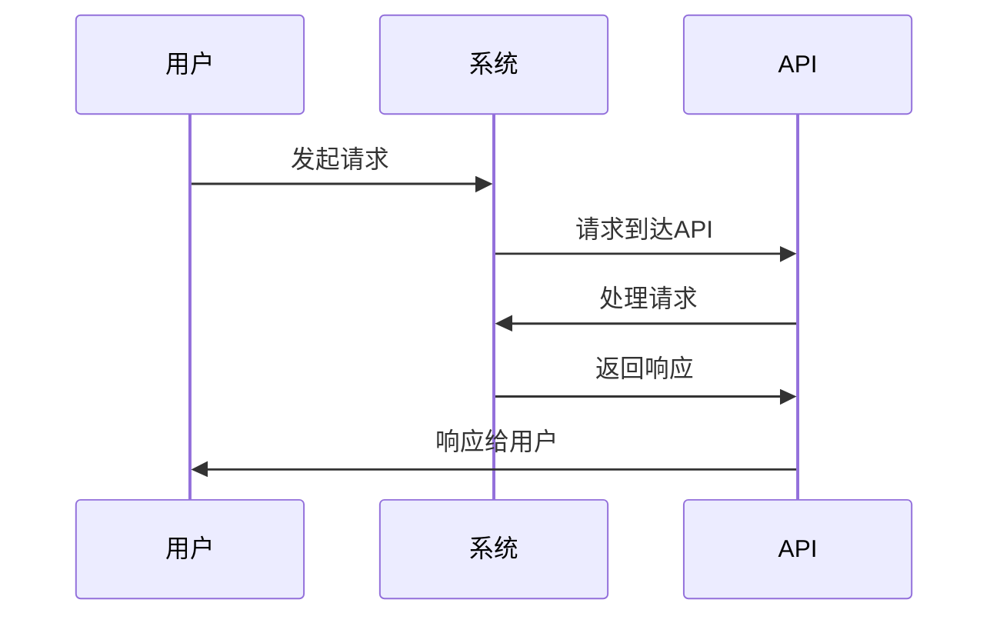
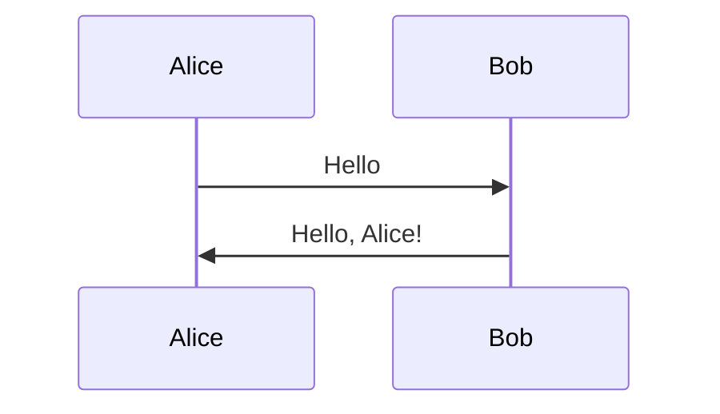

                 

## 文章标题：API设计原则与最佳实践

关键词：API设计、设计原则、最佳实践、RESTful、安全性

摘要：本文将深入探讨API设计的原则与最佳实践，旨在为开发者提供一套系统的指导方案。我们将从基础理论、设计原则、安全性、设计与开发实践以及案例分析等多个角度进行详细阐述，帮助读者掌握API设计的核心要领。

## 第一部分：API设计基础理论

在进入API设计的具体原则和实践之前，我们需要了解API设计的基础理论，包括API的定义、组成部分以及设计的重要性。

### 1.1 API设计概述

#### 1.1.1 API的定义与作用

API（应用程序编程接口）是允许应用程序之间相互通信和共享数据的接口。它定义了请求的格式、响应的结构以及数据的交换方式。API在软件开发中起着至关重要的作用，它简化了系统间的集成，提高了开发效率。

#### Mermaid流程图：API调用流程



### 1.1.2 API的组成部分

一个典型的API由请求（Request）、响应（Response）和数据模型（Data Model）三部分组成。

#### 伪代码：API请求与响应示例

```python
# 请求
def make_request(url, params):
    response = http.get(url, params=params)
    return response.json()

# 响应
def process_response(response):
    if response.status_code == 200:
        data = response.data
        # 处理数据
    else:
        # 处理错误
```

### 1.1.3 API设计的重要性

良好的API设计可以提高系统的可维护性、可扩展性和用户体验。以下是API设计的重要性：

1. **简化集成：** 通过定义明确的接口，开发者可以更轻松地将不同的系统和应用程序集成在一起。
2. **提高开发效率：** 标准化的API设计减少了开发者的重复劳动，加快了开发速度。
3. **增强用户体验：** 良好的API设计可以确保用户能够更方便地访问和使用服务。
4. **提升系统安全性：** 通过合理的API设计，可以降低系统被攻击的风险。

## 第二部分：API设计原则与最佳实践

### 2.1 设计原则

API设计原则是确保API质量的重要指南。以下是一些核心的设计原则：

#### 2.1.1 可读性原则

API的命名和结构应该简洁明了，易于理解和记忆。这有助于减少学习成本，提高开发效率。

#### 2.1.2 一致性原则

API应该保持一致性，无论是接口的命名、参数的定义还是错误处理，都应该遵循一致的规则。这有助于提高API的可维护性。

#### 2.1.3 简洁性原则

API的设计应该尽量简洁，避免不必要的复杂性和冗余。这有助于提高API的性能和可读性。

#### 2.1.4 可维护性原则

API的设计应该考虑未来的维护和升级，确保API的稳定性和可扩展性。

### 2.2 设计模式

API设计模式是解决常见问题的有效方法。以下是一些常用的设计模式：

#### 2.2.1 RESTful设计模式

RESTful API是基于REST架构风格设计的，它遵循统一接口原则，使用HTTP协议的各种方法来实现API的请求和响应。

#### 2.2.2 RPC设计模式

RPC（远程过程调用）API允许客户端直接调用服务器上的方法，类似于本地调用。这种模式在分布式系统中非常常见。

#### 2.2.3 事件驱动设计模式

事件驱动API基于事件监听和通知机制，当特定事件发生时，API会触发相应的处理函数。这种模式适用于实时数据处理和异步通信。

### 2.3 安全性设计原则

API安全性是确保数据安全和防止攻击的关键。以下是一些安全性设计原则：

#### 2.3.1 API安全挑战

API安全面临的挑战包括数据泄露、未经授权访问、拒绝服务攻击等。

#### 2.3.2 安全性设计原则

安全性设计原则包括使用强认证和授权机制、加密数据传输、防范常见攻击（如SQL注入、XSS攻击）等。

#### 2.3.3 常见安全措施

常见的安全措施包括使用API密钥、OAuth、JWT（JSON Web Token）、HTTPS等。

## 第三部分：API设计与开发实践

### 2.1 API设计流程

API设计流程包括需求分析、功能规划、接口定义和设计评审等步骤。

#### 2.1.1 需求分析

需求分析是API设计的第一步，它涉及理解用户的需求、业务逻辑和系统约束。

#### 2.1.2 功能规划

功能规划是根据需求分析的结果，确定API的功能和模块。

#### 2.1.3 接口定义

接口定义是API设计的核心步骤，它涉及定义API的URL、HTTP方法、参数和响应格式。

#### 2.1.4 设计评审

设计评审是对API设计方案的评估和优化，确保设计满足需求、符合最佳实践。

### 2.2 API实现与测试

API实现与测试是确保API质量和性能的关键步骤。

#### 2.2.1 API开发工具

常用的API开发工具包括Swagger、Postman等，它们可以帮助开发者定义、测试和文档化API。

#### 2.2.2 API测试方法

API测试方法包括功能测试、性能测试、安全性测试等，确保API在各种条件下都能正常运行。

#### 2.2.3 API性能优化

API性能优化包括缓存策略、负载均衡、数据库优化等，提高API的响应速度和处理能力。

### 2.3 API文档编写

API文档是开发者使用API的重要指南，它应该包含接口定义、参数说明、示例代码和错误处理等内容。

#### 2.3.1 文档格式

API文档可以使用Markdown、Swagger等格式编写，方便开发者阅读和搜索。

#### 2.3.2 文档结构

API文档应该包含概述、接口定义、参数说明、示例代码和错误处理等部分。

#### 2.3.3 文档维护

API文档需要定期更新和维护，确保其与API的实际状态保持一致。

### 2.4 API版本管理

API版本管理是确保API兼容性和稳定性的重要措施。

#### 2.4.1 版本策略

版本策略包括发布新版本时的兼容性策略，如向后兼容、部分兼容和不兼容等。

#### 2.4.2 版本兼容性

版本兼容性涉及确保旧版本客户端能够访问新版本的API，以及新版本客户端能够访问旧版本的API。

#### 2.4.3 版本控制工具

常用的版本控制工具包括Git、GitHub等，它们可以帮助开发者管理和跟踪API的版本历史。

### 2.5 API安全性实践

API安全性实践包括认证与授权、数据加密和防御常见攻击等。

#### 2.5.1 认证与授权

认证与授权是确保API访问安全的关键，常用的认证方法包括API密钥、OAuth、JWT等。

#### 2.5.2 数据加密

数据加密是确保数据在传输过程中不被窃取或篡改的重要措施，常用的加密协议包括HTTPS、SSL等。

#### 2.5.3 防御常见攻击

防御常见攻击包括防范SQL注入、XSS攻击、CSRF攻击等，常用的方法包括输入验证、输出编码等。

## 第四部分：API设计案例分析

### 3.1 案例一：社交媒体API设计

#### 3.1.1 案例背景

社交媒体API设计案例将探讨如何设计一个功能丰富、易于使用的社交媒体API。

#### 3.1.2 API设计思路

API设计思路包括定义API的基本功能、设计RESTful接口、确保数据安全等。

#### 3.1.3 API功能实现

API功能实现将详细介绍如何实现用户注册、登录、发布动态、评论等功能。

### 3.2 案例二：电子商务平台API设计

#### 3.2.1 案例背景

电子商务平台API设计案例将探讨如何设计一个高效、安全的电子商务平台API。

#### 3.2.2 API设计要点

API设计要点包括定义商品管理、订单管理、用户管理等功能，确保API的稳定性和性能。

#### 3.2.3 API实现与维护

API实现与维护将详细介绍如何实现API功能、优化API性能以及维护API文档。

### 3.3 案例三：企业级API设计

#### 3.3.1 案例背景

企业级API设计案例将探讨如何设计一个适用于企业级应用的API。

#### 3.3.2 API设计原则

API设计原则包括高可用性、高性能、高安全性等，确保API能够满足企业级应用的需求。

#### 3.3.3 API实现与优化

API实现与优化将详细介绍如何实现API功能、优化API性能以及应对企业级应用的特殊需求。

## 参考文献

### 1. 相关书籍

- 《API设计：原则与实践》（API Design: Principles and Best Practices），作者：Chris Richardson
- 《RESTful Web API设计》（RESTful Web APIs: Design for Hypermedia and Systems Interoperability），作者：Sam Newman

### 2. 学术论文

- "API Design and Design Patterns: A Practical Guide" by Michael Bechauf and Thorsten Ball
- "RESTful API Design: A Field Guide" by Sam Newman

### 3. 开源项目

- Swagger：https://github.com/swagger-api/swagger-codegen
- Postman：https://www.postman.com/

## 第五部分：总结与展望

### 5.1 总结

API设计是软件开发中至关重要的一环，良好的API设计可以提高系统的可维护性、可扩展性和用户体验。本文从基础理论、设计原则、安全性、设计与开发实践以及案例分析等多个角度，详细探讨了API设计的原则与最佳实践。

### 5.2 展望

随着云计算、大数据和人工智能等技术的不断发展，API设计也将面临新的挑战和机遇。未来，API设计将更加注重安全性、性能优化和用户体验。同时，新的设计模式和技术也将不断涌现，为开发者提供更多的选择和可能性。

作者：AI天才研究院/AI Genius Institute & 禅与计算机程序设计艺术 /Zen And The Art of Computer Programming

---

### 附录

#### 1. Mermaid流程图

本文中使用的Mermaid流程图是一种基于Markdown的图表工具，用于可视化API调用流程。以下是Mermaid流程图的基本语法：



以上代码将生成一个简单的序列图，展示Alice和Bob之间的对话。

#### 2. 伪代码

伪代码是一种简化的编程语言，用于描述算法的逻辑结构，但不依赖于特定的编程语言。以下是伪代码的基本语法：

```python
# 输入
input(x)

# 处理
if x > 0:
    print("x is positive")
else:
    print("x is negative")

# 输出
output(x)
```

以上代码表示一个简单的条件判断算法，根据输入的x值，输出相应的结果。

#### 3. LaTeX公式

LaTeX是一种排版系统，常用于编写数学公式和科学文档。以下是LaTeX公式的嵌入和使用方法：

- 独立段落的公式：

```markdown
$$
E = mc^2
$$
```

以上代码将生成爱因斯坦的著名公式。

- 段落内的公式：

```markdown
The sum of the first $n$ natural numbers is $\frac{n(n+1)}{2}$.
```

以上代码将在文本中嵌入一个简单的数学公式。

---

本文通过详细的章节内容和示例代码，旨在为读者提供一套系统的API设计指导方案。通过学习本文，读者可以掌握API设计的核心原则和最佳实践，为未来的软件开发打下坚实的基础。希望本文能够对您的API设计之路有所启示。作者：AI天才研究院/AI Genius Institute & 禅与计算机程序设计艺术 /Zen And The Art of Computer Programming。

