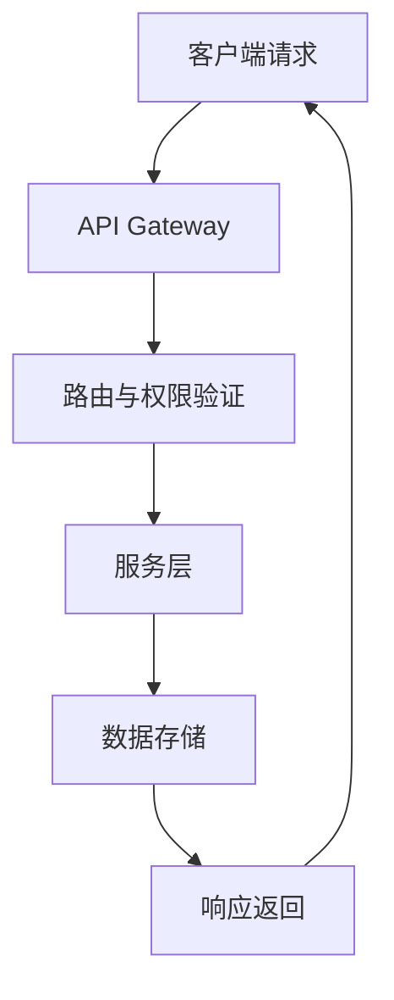

                 

，我们首先来讨论API设计的基础知识，这将为后续深入探讨RESTful接口的最佳实践奠定基础。

## 第1章：API设计基础

### 1.1 API设计概述

> **背景介绍**：随着互联网技术的快速发展，API设计已成为软件工程中的重要一环。API作为应用程序间交互的桥梁，其设计的优劣直接影响到系统的稳定性、扩展性和用户体验。本节将介绍API的基本概念、类型和重要性，并对比RESTful API与SOA、微服务的联系与区别。

#### 核心概念

API（Application Programming Interface）是提供一组预定义的功能和接口，使得其他应用程序可以通过调用这些接口与核心系统进行交互。API的定义范围广泛，涵盖了从简单的函数调用到复杂的分布式服务。

##### 类型

根据API的使用范围和目的，可以分为以下几种类型：

1. **内部API**：仅用于内部应用程序之间的通信。
2. **外部API**：允许外部应用程序访问核心系统的功能。
3. **合作伙伴API**：与合作伙伴共享，以便他们可以集成到自己的系统中。

##### 重要性

API的重要性在于：

1. **模块化**：将系统划分为多个独立的模块，便于开发、测试和部署。
2. **可扩展性**：通过API，系统能够灵活扩展，满足不断变化的需求。
3. **互操作性**：API使得不同系统和平台之间可以无缝交互。

#### 联系

##### RESTful API与SOA

RESTful API是遵循REST（Representational State Transfer）原则的API设计风格，而SOA（Service-Oriented Architecture）是一种面向服务的体系结构。两者的联系与区别如下：

- **联系**：SOA是一种更广泛的架构风格，RESTful API是SOA实现的一种方式。

- **区别**：SOA关注服务的整体设计，而RESTful API关注具体的实现细节。

##### RESTful API与微服务

微服务是一种架构风格，通过将应用程序构建为一组小的、独立的服务。RESTful API在微服务架构中广泛应用，用于服务之间的通信。

- **联系**：微服务架构中的服务通信常常通过RESTful API实现。

- **区别**：RESTful API是一种通信协议，而微服务是一种架构风格。

##### Mermaid流程图

以下是RESTful API的基本架构流程图：



#### 核心概念原理之间的关系

- **客户端请求**：客户端发送请求，请求包含URL、HTTP方法、请求体等信息。
- **API Gateway**：API Gateway作为系统的入口，负责处理请求路由、请求预处理和响应后处理。
- **路由与权限验证**：路由器根据URL路由请求到相应的服务，同时进行权限验证，确保请求的安全性。
- **服务层**：服务层处理具体的业务逻辑，与数据存储层进行交互。
- **数据存储**：数据存储层负责数据的持久化和管理。
- **响应返回**：将处理结果返回给客户端，结果通常包含状态码、响应体等信息。

#### API设计原则

1. **一致性**：确保API的设计保持一致，降低学习成本。
2. **简洁性**：设计简洁明了的API，便于使用和维护。
3. **稳定性**：设计稳定的API，减少后续变更带来的影响。

### 1.2 RESTful原则

> **核心概念与联系**：REST（Representational State Transfer）是一种架构风格，用于指导API的设计。它定义了一组原则和约束，旨在实现简单、灵活和可扩展的网络服务。本节将介绍REST的核心原理，包括状态转移、无状态性，以及HTTP方法的详细解释。

#### REST原理

REST是由Roy Fielding在2000年他的博士论文中提出的，旨在解决Web服务的架构问题。REST的核心原则包括：

1. **资源**：资源是网络中的任何实体，可以是数据、对象、文件等。
2. **表示**：资源的表示，如HTML、JSON、XML等。
3. **客户端-服务器**：客户端与服务器的分离，服务器只处理请求，不维护会话状态。
4. **无状态性**：服务器对每个请求都是独立的，不记忆之前的请求。
5. **统一接口**：提供统一的接口，使得不同的资源可以通过相同的操作进行访问。

#### 状态转移

在REST架构中，客户端通过发送请求来改变服务器的状态。每个请求都会引起状态的变化，客户端通过一系列请求来控制资源的操作。状态转移是REST的核心概念之一。

##### HTTP方法

HTTP（Hypertext Transfer Protocol）是Web通信的基础协议。RESTful API使用HTTP方法的集合来表示对资源的操作。以下是常用的HTTP方法：

1. **GET**：获取资源。请求不会修改资源的状态。
   $$\text{GET /users}$$：获取所有用户信息。

2. **POST**：创建资源。请求会创建新的资源。
   $$\text{POST /users}$$：创建新用户。

3. **PUT**：更新资源。请求会替换资源的当前状态。
   $$\text{PUT /users/{id}}$$：更新指定用户信息。

4. **DELETE**：删除资源。请求会删除指定资源。
   $$\text{DELETE /users/{id}}$$：删除指定用户。

#### 状态码

HTTP响应状态码是服务器对请求处理的响应。以下是常见的状态码：

- **2xx**：成功。请求已成功处理。
  - **200 OK**：请求成功。
  - **201 Created**：资源已创建。

- **4xx**：客户端错误。请求有误。
  - **400 Bad Request**：请求格式错误。
  - **404 Not Found**：资源未找到。

- **5xx**：服务器错误。服务器处理请求时出错。
  - **500 Internal Server Error**：服务器内部错误。

#### RESTful原则

1. **统一接口**：提供统一的接口，使资源操作标准化。
2. **无状态性**：确保服务器不记忆之前的请求，提高系统的可伸缩性。
3. **资源导向**：资源是核心，操作围绕资源进行。

### 1.3 RESTful API设计原则

> **核心概念与联系**：RESTful API设计不仅仅是遵循REST原则，还需要遵循一系列最佳实践，以确保API的一致性、简洁性和稳定性。本节将介绍RESTful API设计的关键原则，并详细讨论参数设计、返回值设计以及数据验证和错误处理。

#### RESTful API设计原则

1. **一致性**：API设计要保持一致，使开发者更容易理解和使用。
2. **简洁性**：设计简洁的API，降低学习成本，提高使用效率。
3. **稳定性**：设计稳定的API，减少变更带来的风险。

#### 参数设计

参数设计是API设计的关键部分，包括路径参数、查询参数和请求体。

1. **路径参数**：路径参数是URL的一部分，用于标识资源。例如：
   $$\text{GET /users/{id}}$$：获取指定用户的信息。

2. **查询参数**：查询参数是附加在URL末尾的键值对，用于过滤和排序。例如：
   $$\text{GET /users?limit=10&order=asc}$$：获取前10个按升序排列的用户。

3. **请求体**：请求体是发送到服务器的数据，通常用于创建或更新资源。例如：
   $$\text{POST /users}$$：发送用户数据以创建新用户。

#### 返回值设计

返回值设计同样重要，包括数据格式、状态码和错误信息。

1. **数据格式**：常见的返回值格式包括JSON和XML。例如，JSON格式如下：
   ```json
   {
     "status": "success",
     "data": {
       "id": 1,
       "name": "John Doe"
     }
   }
   ```

2. **状态码**：状态码用于指示请求的处理结果。例如，200表示成功，404表示未找到。

3. **错误信息**：错误信息用于描述请求失败的原因。例如：
   ```json
   {
     "status": "error",
     "error": "Invalid credentials"
   }
   ```

#### 数据验证与错误处理

1. **数据验证**：确保输入数据的有效性，例如检查数据类型、长度和格式。可以使用正则表达式或特定的验证库。

2. **错误处理**：当请求失败时，返回适当的错误信息，帮助开发者定位问题。例如，使用统一的错误响应格式。

### 1.4 安全性设计

> **核心概念与联系**：安全性是API设计的关键要素，确保API不被恶意攻击和未经授权的访问。本节将介绍API的安全性设计，包括认证和授权机制，以及如何防范常见的安全威胁。

#### 认证与授权

1. **认证**：认证是验证用户身份的过程。常见的认证机制包括：
   - **基本认证**：使用用户名和密码进行认证。
   - **OAuth 2.0**：一种开放标准授权协议，允许第三方应用访问受保护资源。
   - **JSON Web Tokens (JWT)**：一种用于认证和授权的加密令牌。

2. **授权**：授权是确保用户有权限访问特定资源的机制。常见的授权机制包括：
   - **角色基

