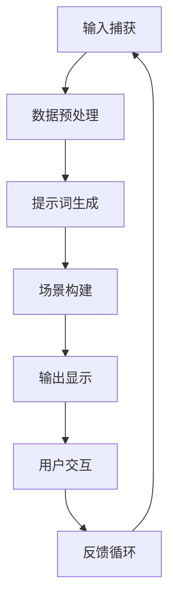

                 

### 文章标题

《AR/VR内容生成：提示词在虚拟世界构建中的作用》

### 关键词

- AR/VR
- 内容生成
- 提示词
- 虚拟世界构建
- 算法原理
- 数学模型
- 项目实战

### 摘要

本文深入探讨了增强现实（AR）和虚拟现实（VR）内容生成中提示词的作用。文章首先介绍了AR/VR技术的发展背景，接着详细阐述了提示词的定义及其在虚拟世界构建中的应用。随后，文章分析了提示词生成模型，包括基于词嵌入和序列模型的原理，并通过伪代码和数学公式进行详细解释。最后，文章通过一个实际项目实战案例，展示了如何搭建开发环境、实现提示词生成模型，并对源代码进行深入解读与分析。本文旨在为读者提供一个全面、深入的AR/VR内容生成技术指南。

## 第1章：引论

### 1.1 AR/VR技术的发展背景与趋势

随着科技的发展，增强现实（AR）和虚拟现实（VR）技术逐渐从实验室走向市场，成为人们生活和工作中的重要工具。AR技术通过在现实世界中叠加虚拟信息，增强了用户的感知体验，而VR技术则通过模拟出一个完全虚拟的世界，让用户可以沉浸在其中。这两者的快速发展，不仅改变了娱乐和消费方式，还在教育、医疗、军事等多个领域展现出了巨大的潜力。

#### 1.1.1 AR/VR技术的发展历程

AR/VR技术的历史可以追溯到20世纪50年代。当时，科学家们开始研究如何将计算机生成的图像叠加到现实世界中。最早的AR尝试之一是1957年由美国的伊夫·罗斯提出的“共鸣镜”实验。进入21世纪，随着计算能力和显示技术的飞速提升，AR/VR技术逐渐走向商业化。2009年，谷歌发布了首款AR眼镜Google Glass，标志着AR技术的崛起。2010年，Oculus VR发布了首款消费者级的VR头戴设备Oculus Rift，引发了全球范围内的VR热潮。

#### 1.1.2 AR/VR技术的未来发展趋势

当前，AR/VR技术正处于快速发展的阶段，未来有望在多个领域实现突破。以下是一些关键的发展趋势：

1. **硬件技术的进步**：随着硬件技术的不断迭代，AR/VR设备的性能将得到大幅提升。例如，更高分辨率的显示器、更轻便的设备、更精确的定位和追踪技术等。

2. **内容生态的丰富**：随着用户基数的扩大，AR/VR内容的生产和分发将变得更加繁荣。平台和开发者将不断推出多样化的应用，满足不同用户的需求。

3. **跨行业融合**：AR/VR技术将在更多行业中得到应用，如教育、医疗、旅游、零售等。这些行业将通过AR/VR技术提供更加沉浸式、个性化的体验。

4. **社会变革的影响**：AR/VR技术将改变人们的生活方式和社会结构。例如，远程工作、虚拟社交、虚拟旅游等将成为现实，人们的生活和工作方式将变得更加灵活和多样化。

### 1.2 提示词在AR/VR内容生成中的作用

在AR/VR内容生成中，提示词起到了至关重要的作用。提示词是指用于引导和描述虚拟内容的关键词语或短语，它们能够帮助用户更好地理解和交互虚拟世界中的信息。

#### 1.2.1 提示词的定义

提示词的定义可以从广义和狭义两个方面来理解。广义上，提示词是指任何能够提供信息、引导用户行为的文字或符号。在AR/VR内容生成中，广义的提示词包括标题、标签、描述性文字、命令指令等。狭义的提示词则特指用于生成虚拟场景或内容的特定关键词，如“创建一个3D模型”、“添加一个声音效果”等。

#### 1.2.2 提示词在AR/VR内容生成中的应用

提示词在AR/VR内容生成中的应用主要体现在以下几个方面：

1. **场景构建**：通过提示词，开发者可以精确地描述和生成虚拟场景中的各种元素，如建筑、树木、人物等。提示词可以帮助构建复杂的虚拟环境，使其更加真实和丰富。

2. **交互引导**：在AR/VR应用中，提示词可以用于引导用户的交互行为。例如，在虚拟游戏中，提示词可以提示玩家如何操作、完成任务等。

3. **内容优化**：通过提示词，开发者可以对虚拟内容进行优化，提高其可读性和易用性。例如，在虚拟博物馆中，提示词可以提供展品的历史背景、文化价值等信息，帮助用户更好地理解展品。

4. **智能生成**：提示词还可以用于驱动自动化内容生成。通过算法分析提示词，系统可以自动生成相应的虚拟内容，如3D模型、动画效果等。

### 1.3 本书结构与内容安排

本书旨在为读者提供一个系统、深入的AR/VR内容生成技术指南。全书分为八个章节，具体内容安排如下：

- **第1章：引论**：介绍AR/VR技术的发展背景、提示词的定义和作用。
- **第2章：AR/VR基础知识**：详细讲解AR/VR技术的原理和内容生成技术。
- **第3章：提示词生成模型**：分析提示词生成模型的原理和分类。
- **第4章：提示词在AR/VR中的应用**：探讨提示词在各种AR/VR应用中的具体应用。
- **第5章：核心概念与联系**：阐述AR/VR与提示词生成模型之间的关系。
- **第6章：核心算法原理讲解**：使用伪代码和数学公式讲解核心算法原理。
- **第7章：数学模型和数学公式**：介绍相关的数学模型和数学公式，并进行举例说明。
- **第8章：项目实战**：通过一个实际项目实战案例，展示提示词生成模型的应用。

通过本书的学习，读者将能够全面了解AR/VR内容生成技术，掌握提示词在虚拟世界构建中的作用，并具备实际项目实施的能力。

## 第2章：AR/VR基础知识

### 2.1 AR/VR技术原理

AR（增强现实）和VR（虚拟现实）技术的核心原理都围绕着对现实世界的模拟和增强。然而，这两者之间存在着本质的区别。

#### 2.1.1 AR/VR技术的核心组件

AR技术主要由以下几个核心组件构成：

1. **摄像头**：用于捕捉现实世界的图像。
2. **显示设备**：将虚拟信息叠加到现实世界中，常见的显示设备包括头戴显示器、投影仪等。
3. **计算单元**：用于处理现实世界的图像和虚拟信息，常见的计算单元包括CPU、GPU等。
4. **传感器**：用于捕捉用户的动作和位置信息，常见的传感器包括加速度计、陀螺仪等。

VR技术则主要由以下核心组件构成：

1. **头戴显示器（HMD）**：用于为用户提供沉浸式视觉体验，常见的头戴显示器包括Oculus Rift、HTC Vive等。
2. **追踪系统**：用于跟踪用户的头部和手部动作，确保虚拟世界的动态与用户的实际动作相匹配。
3. **计算单元**：与AR技术相同，VR技术同样依赖于强大的计算单元来生成和渲染虚拟场景。
4. **音频系统**：用于模拟虚拟环境中的音效，增强用户的沉浸感。

#### 2.1.2 AR/VR技术的工作原理

AR技术的工作原理如下：

1. **图像捕捉**：摄像头捕捉现实世界的图像。
2. **图像处理**：计算单元对捕捉到的图像进行处理，识别现实世界中的物体和位置信息。
3. **虚拟信息叠加**：计算单元生成虚拟信息，并将其叠加到处理后的图像上。
4. **显示输出**：显示设备将叠加了虚拟信息的图像输出到用户眼前。

VR技术的工作原理如下：

1. **视觉渲染**：计算单元根据用户的动作和位置信息，生成虚拟场景并将其渲染到头戴显示器上。
2. **动作捕捉**：追踪系统实时跟踪用户的头部和手部动作，将其转换为虚拟场景中的动作。
3. **反馈调整**：系统根据用户的动作反馈，实时调整虚拟场景，确保虚拟世界的动态与用户的实际动作相匹配。
4. **听觉模拟**：音频系统模拟虚拟环境中的音效，增强用户的沉浸感。

### 2.2 AR/VR内容生成技术

AR/VR内容生成技术是指通过特定的方法和工具，创建和编辑AR/VR应用所需的内容。这些内容可以是虚拟场景、角色、动画、音频等。

#### 2.2.1 3D建模与渲染

3D建模与渲染是AR/VR内容生成中的核心技术之一。3D建模是指使用软件工具创建三维模型的过程，这些模型可以是建筑物、人物、车辆等。常见的3D建模软件包括Blender、Maya、3ds Max等。

渲染是指将3D模型转化为视觉上逼真的图像的过程。渲染技术包括光线追踪、全局照明、阴影处理等。高质量的渲染能够使虚拟场景更加真实，提高用户体验。

#### 2.2.2 动画与特效

动画与特效是AR/VR内容生成中的重要组成部分。动画是指通过一系列连续的画面，模拟出物体或角色的动作过程。动画技术包括关键帧动画、骨骼动画等。

特效则是指通过特定的算法和效果，增强虚拟场景的视觉效果。常见的特效包括火焰、烟雾、爆炸等。特效技术可以提高虚拟场景的视觉冲击力，增强用户的沉浸感。

#### 2.2.3 提示词在AR/VR中的应用

提示词在AR/VR内容生成中的应用主要体现在以下几个方面：

1. **场景构建**：通过提示词，开发者可以精确地描述和生成虚拟场景中的各种元素，如建筑、树木、人物等。提示词可以帮助构建复杂的虚拟环境，使其更加真实和丰富。

2. **交互引导**：在AR/VR应用中，提示词可以用于引导用户的交互行为。例如，在虚拟游戏中，提示词可以提示玩家如何操作、完成任务等。

3. **内容优化**：通过提示词，开发者可以对虚拟内容进行优化，提高其可读性和易用性。例如，在虚拟博物馆中，提示词可以提供展品的历史背景、文化价值等信息，帮助用户更好地理解展品。

4. **智能生成**：提示词还可以用于驱动自动化内容生成。通过算法分析提示词，系统可以自动生成相应的虚拟内容，如3D模型、动画效果等。

### 2.3 提示词在AR/VR中的应用

在AR/VR应用中，提示词的应用非常广泛。以下是一些具体的例子：

1. **虚拟购物体验**：在虚拟购物体验中，提示词可以用于描述商品的特点、价格、库存等信息。用户可以通过语音或文本输入提示词，获取有关商品的信息，从而更好地做出购买决策。

2. **虚拟旅游**：在虚拟旅游应用中，提示词可以用于描述景点的历史背景、文化价值、旅游路线等信息。用户可以通过语音或文本输入提示词，获取有关景点的详细信息，从而更加深入地了解景点。

3. **虚拟教育**：在虚拟教育应用中，提示词可以用于引导学生的学习过程。教师可以通过提示词为学生提供学习任务、讲解知识点等，从而提高教学效果。

4. **虚拟游戏**：在虚拟游戏中，提示词可以用于描述游戏规则、任务目标、角色属性等信息。玩家可以通过语音或文本输入提示词，获取有关游戏的信息，从而更好地参与游戏。

通过上述内容，我们可以看到，提示词在AR/VR内容生成中的应用非常广泛，它们不仅能够提高虚拟世界的交互性和可用性，还能为用户提供更加丰富和沉浸的体验。

## 第3章：提示词生成模型

### 3.1 提示词生成模型概述

提示词生成模型是AR/VR内容生成中的关键组成部分，负责从大量文本数据中自动生成提示词，用于描述和构建虚拟场景。提示词生成模型的核心目标是提高生成过程的效率和准确性，从而更好地满足用户需求。

#### 3.1.1 提示词生成模型的分类

提示词生成模型可以分为以下几种类型：

1. **基于词嵌入的提示词生成模型**：这类模型通过将文本数据转换为向量表示，从而生成提示词。常见的词嵌入算法包括Word2Vec、GloVe等。
2. **基于序列模型的提示词生成模型**：这类模型通过处理文本序列，生成提示词。常见的序列模型包括循环神经网络（RNN）、长短期记忆网络（LSTM）、Transformer等。
3. **基于生成对抗网络（GAN）的提示词生成模型**：这类模型通过生成器和判别器的对抗训练，生成高质量的提示词。

#### 3.1.2 提示词生成模型的关键技术

提示词生成模型的关键技术包括以下几个方面：

1. **数据预处理**：包括文本清洗、分词、去停用词等步骤，以提高模型的训练效率和生成质量。
2. **特征提取**：将文本数据转换为向量表示，常用的方法包括词嵌入和序列编码。
3. **模型训练**：使用大量文本数据训练提示词生成模型，以优化模型的参数。
4. **生成策略**：设计生成策略，以提高生成提示词的多样性和准确性。

### 3.2 基于词嵌入的提示词生成

基于词嵌入的提示词生成模型通过将文本数据转换为向量表示，生成高质量的提示词。词嵌入是将文本中的词语映射为实值向量，使相似的词语在向量空间中更加接近。以下是一个简单的基于词嵌入的提示词生成模型的实例。

#### 3.2.1 词嵌入的概念

词嵌入（Word Embedding）是指将文本中的词语映射为低维实值向量。词嵌入能够捕捉词语的语义信息，使相似的词语在向量空间中更加接近。常见的词嵌入算法包括：

1. **Word2Vec**：基于神经网络的学习算法，通过训练词向量来捕捉词语的语义关系。
2. **GloVe**：基于全局矩阵分解的方法，通过优化全局矩阵来生成词向量。
3. **FastText**：基于词袋模型和神经网络的方法，通过将词语和其上下文映射为向量来生成词向量。

#### 3.2.2 常见的词嵌入算法

以下是一个简单的基于Word2Vec算法的伪代码示例：

```python
# 初始化词向量矩阵
word_vectors = np.random.normal(size=(V, D))

# 定义训练数据
sentences = ["Hello world", "AR/VR technology", "Content generation"]

# 训练词向量
for sentence in sentences:
    for word in sentence.split():
        context = get_context(sentence, word)
        update_word_vector(word_vectors, word, context)

# 输出词向量
print(word_vectors)
```

#### 3.2.3 基于词嵌入的提示词生成

基于词嵌入的提示词生成模型的工作流程如下：

1. **数据预处理**：对输入文本进行分词、去停用词等处理，将文本转换为词序列。
2. **特征提取**：将词序列转换为词向量，可以使用预训练的词向量，也可以使用自己训练的词向量。
3. **生成提示词**：根据词向量生成提示词，可以使用简单的平均向量方法，也可以使用复杂的模型（如RNN、LSTM等）来生成。

以下是一个简单的基于词嵌入的提示词生成模型的伪代码示例：

```python
# 初始化词向量
word_vectors = load_pretrained_word_vectors()

# 输入文本
input_text = "Generate a 3D model of a car"

# 转换为词向量
input_vectors = [word_vectors[word] for word in input_text.split()]

# 生成提示词
hint_vector = np.mean(input_vectors, axis=0)
hint_word = generate_word_from_vector(hint_vector, word_vectors)

# 输出提示词
print(hint_word)
```

### 3.3 基于序列模型的提示词生成

基于序列模型的提示词生成模型通过处理文本序列，生成高质量的提示词。这类模型能够捕捉词语之间的序列关系，从而生成更准确的提示词。

#### 3.3.1 基于序列模型的提示词生成原理

基于序列模型的提示词生成原理如下：

1. **编码阶段**：将输入文本序列编码为一个固定长度的向量，常用的编码方法包括RNN、LSTM、GRU等。
2. **解码阶段**：使用编码阶段的输出向量，生成提示词序列。解码方法可以是自回归模型（如RNN、LSTM），也可以是生成模型（如Transformer）。

以下是一个简单的基于LSTM的提示词生成模型的伪代码示例：

```python
# 初始化LSTM模型
lstm_model = LSTM(D, U, dropout=0.1)

# 训练模型
for sentence in sentences:
    encoded_sentence = encode_sentence(sentence)
    lstm_model.fit(encoded_sentence)

# 生成提示词
input_sentence = "Generate a 3D model of a car"
encoded_input = encode_sentence(input_sentence)
hint_sentence = lstm_model.decode(encoded_input)

# 输出提示词
print(hint_sentence)
```

#### 3.3.2 序列模型生成提示词的步骤

序列模型生成提示词的步骤如下：

1. **数据预处理**：对输入文本进行分词、去停用词等处理，将文本转换为词序列。
2. **编码**：将词序列转换为固定长度的编码向量，可以使用预训练的词向量，也可以使用自己训练的词向量。
3. **解码**：使用编码向量生成提示词序列，可以使用自回归模型（如RNN、LSTM），也可以使用生成模型（如Transformer）。

### 3.4 提示词生成模型的优化策略

为了提高提示词生成模型的质量，可以采用以下优化策略：

1. **数据增强**：通过增加训练数据量、使用数据增强技术（如随机裁剪、旋转等）来提高模型的泛化能力。
2. **模型融合**：将多个模型融合起来，利用不同模型的优点，提高生成提示词的质量。
3. **正则化**：使用正则化技术（如Dropout、L2正则化等）来防止模型过拟合。
4. **模型剪枝**：通过剪枝技术（如结构剪枝、权重剪枝等）减少模型的参数数量，提高模型的效率和生成质量。

通过本章的内容，我们介绍了提示词生成模型的概述、基于词嵌入的提示词生成以及基于序列模型的提示词生成。这些模型能够有效地生成高质量的提示词，为AR/VR内容生成提供了有力的支持。

### 第4章：提示词在AR/VR中的应用

#### 4.1 提示词在虚拟场景构建中的应用

在虚拟场景构建中，提示词起到了关键的作用。它们不仅是描述虚拟元素的重要工具，也是用户与虚拟世界交互的桥梁。以下是一些具体的应用场景：

1. **虚拟现实游戏**：在虚拟现实游戏中，提示词用于指导玩家进行游戏。例如，玩家在游戏中需要完成某些任务，系统会通过提示词提示玩家下一步的操作。例如，“收集5个红宝石”或“击败前方怪物”。

2. **虚拟旅游体验**：虚拟旅游应用中，提示词可以提供有关景点的详细信息。用户可以通过语音或文本输入提示词，获取有关景点的历史、文化背景等信息。例如，“讲述这座城堡的历史”或“展示这个博物馆的展品”。

3. **虚拟培训与教育**：在虚拟培训和教育的应用中，提示词可以用于引导学习者的学习过程。教育者可以通过提示词向学习者提供学习任务、讲解知识点等。例如，“请用三维建模工具构建一座城市”或“了解这种植物的生长过程”。

4. **虚拟会议与远程工作**：在虚拟会议和远程工作中，提示词可以用于协调会议流程和任务分配。会议主持人可以通过提示词提示参会者进行讨论、展示工作成果等。例如，“请张三展示他的项目进度”或“讨论下一阶段的工作计划”。

#### 4.2 提示词在虚拟角色交互中的应用

虚拟角色交互是AR/VR应用中的一个重要方面，提示词在虚拟角色交互中起到了关键作用。以下是一些具体的应用场景：

1. **虚拟客服**：在虚拟客服中，提示词用于与用户进行对话。虚拟客服系统可以通过分析用户的提问，生成相应的提示词，为用户提供帮助。例如，用户提问“如何退货？”系统会生成提示词“请提供您的订单号和商品名称，我们将帮您处理退货事宜”。

2. **虚拟导游**：在虚拟导游中，提示词可以用于指导游客参观虚拟景点。虚拟导游系统可以通过分析游客的位置和兴趣点，生成相应的提示词，提供导游服务。例如，游客在景点附近时，系统会生成提示词“您现在位于故宫的午门，这里是故宫的入口”。

3. **虚拟社交平台**：在虚拟社交平台中，提示词可以用于指导用户进行社交互动。用户可以通过语音或文本输入提示词，与其他用户交流。例如，用户输入“加好友”提示词，系统会生成相应的对话提示词，引导用户添加好友。

4. **虚拟角色扮演**：在虚拟角色扮演游戏中，提示词可以用于指导玩家的角色行为。游戏系统可以通过分析玩家的动作和对话，生成相应的提示词，引导玩家进行角色扮演。例如，玩家选择成为一名医生，系统会生成提示词“请检查患者的身体状况，然后为他开药”。

#### 4.3 提示词在虚拟物品识别中的应用

在虚拟物品识别中，提示词可以帮助用户更好地理解和使用虚拟物品。以下是一些具体的应用场景：

1. **虚拟购物**：在虚拟购物中，提示词可以提供有关商品的详细信息。用户可以通过语音或文本输入提示词，获取商品的描述、价格、库存等信息。例如，用户输入“查看iPhone 13”提示词，系统会生成提示词“iPhone 13是一款最新发布的智能手机，拥有强大的性能和高清的摄像头”。

2. **虚拟博物馆**：在虚拟博物馆中，提示词可以用于描述展品的历史背景、文化价值等信息。用户可以通过语音或文本输入提示词，了解展品的相关信息。例如，用户输入“了解这幅画作”，系统会生成提示词“这幅画作描绘了一个美丽的花园，是画家在19世纪的作品”。

3. **虚拟维修**：在虚拟维修中，提示词可以用于指导用户进行维修操作。虚拟维修系统可以通过分析用户的问题和设备状态，生成相应的提示词，提供维修指导。例如，用户输入“维修空调”，系统会生成提示词“请先关闭空调电源，然后检查空调的过滤网是否堵塞”。

4. **虚拟设计**：在虚拟设计中，提示词可以用于指导用户进行设计操作。虚拟设计系统可以通过分析用户的设计需求和操作，生成相应的提示词，提供设计建议。例如，用户输入“设计一个桌子”，系统会生成提示词“您可以考虑使用矩形形状，并选择温暖的木材材料”。

通过本章的内容，我们详细介绍了提示词在虚拟场景构建、虚拟角色交互和虚拟物品识别中的应用。提示词不仅是AR/VR内容生成的重要组成部分，也是提高用户体验的关键因素。

### 第5章：核心概念与联系

#### 5.1 AR/VR与提示词生成模型的关系

为了深入理解AR/VR技术与提示词生成模型之间的关系，我们需要从架构和逻辑上对这两个系统进行详细分析。AR/VR技术的核心在于创建和展示虚拟信息，而提示词生成模型则是实现这一目标的关键工具。以下是它们之间关系的详细解析。

#### 5.1.1 AR/VR技术的架构

AR/VR技术的核心架构可以概括为以下组件：

1. **输入组件**：包括摄像头、传感器等，用于捕捉现实世界的图像和用户动作。
2. **计算组件**：包括计算机处理器、图形处理器等，用于处理输入数据和渲染虚拟场景。
3. **输出组件**：包括显示设备、耳机等，用于将虚拟信息呈现给用户。
4. **交互组件**：包括触摸屏、手柄等，用于用户与虚拟世界的交互。

#### 5.1.2 提示词生成模型的架构

提示词生成模型的核心架构包括以下几个部分：

1. **文本预处理**：包括分词、去除停用词等步骤，用于将自然语言文本转换为模型可处理的格式。
2. **词嵌入层**：将文本中的词语转换为向量表示，以便模型能够处理语义信息。
3. **编码层**：对输入文本序列进行编码，提取文本的语义特征。
4. **解码层**：根据编码层的输出，生成提示词序列。
5. **输出层**：将生成的提示词转换为用户可理解的形式，如文本、语音等。

#### 5.1.3 AR/VR与提示词生成模型的关系

在AR/VR系统中，提示词生成模型起到桥梁作用，连接了输入组件和输出组件。具体来说，这个过程可以概括为以下几个步骤：

1. **输入捕获**：通过摄像头和传感器捕获现实世界的图像和用户动作。
2. **数据预处理**：对捕获的图像和动作数据进行预处理，提取有用的信息。
3. **提示词生成**：使用提示词生成模型，根据预处理后的数据生成相应的提示词。
4. **场景构建**：根据生成的提示词，构建虚拟场景。
5. **输出显示**：通过显示设备将构建好的虚拟场景呈现给用户。
6. **用户交互**：用户通过交互组件与虚拟场景进行互动，如操作虚拟物品、完成任务等。
7. **反馈循环**：用户的交互行为会进一步生成新的输入数据，循环返回到提示词生成模型，从而不断优化虚拟场景。

#### 5.1.4 Mermaid流程图：AR/VR内容生成中的提示词流

为了更直观地理解提示词在AR/VR内容生成中的作用，我们可以使用Mermaid流程图来表示整个流程。以下是一个简单的Mermaid流程图示例：



这个流程图清晰地展示了从输入捕获到反馈循环的整个过程，提示词生成模型在其中起到了核心作用，连接了各个环节。

通过本章的详细分析，我们可以看到AR/VR技术与提示词生成模型之间的紧密联系。提示词生成模型不仅为AR/VR内容生成提供了关键工具，也提高了用户体验，使得虚拟世界更加生动和交互。

### 第6章：核心算法原理讲解

#### 6.1 基于词嵌入的提示词生成算法

基于词嵌入的提示词生成算法是AR/VR内容生成中的重要组成部分。这类算法通过将文本数据转换为向量表示，从而生成高质量的提示词。本节将详细介绍基于词嵌入的提示词生成算法的原理和实现方法。

##### 6.1.1 词嵌入的概念

词嵌入（Word Embedding）是将文本中的词语映射为低维实值向量的过程。词嵌入能够捕捉词语的语义信息，使相似的词语在向量空间中更加接近。常见的词嵌入算法包括Word2Vec、GloVe和FastText等。

##### 6.1.2 Word2Vec算法原理

Word2Vec算法是一种基于神经网络的词嵌入算法，通过训练神经网络来学习词语的向量表示。Word2Vec算法主要包括以下两个模型：

1. **连续词袋模型（CBOW）**：CBOW模型通过上下文词语的均值来表示目标词。具体来说，给定一个目标词和它的上下文窗口，CBOW模型会计算上下文词语的均值，并将其作为目标词的向量表示。

2. **Skip-Gram模型**：Skip-Gram模型通过预测目标词来表示上下文。具体来说，给定一个上下文词语序列，Skip-Gram模型会预测每个目标词，并使用预测概率来表示目标词的向量。

以下是一个简单的CBOW算法的伪代码示例：

```python
# 初始化词向量矩阵
word_vectors = np.random.normal(size=(V, D))

# 定义训练数据
sentences = ["Hello world", "AR/VR technology", "Content generation"]

# 训练词向量
for sentence in sentences:
    for word in sentence.split():
        context = get_context(sentence, word)
        update_word_vector(word_vectors, word, context)

# 输出词向量
print(word_vectors)
```

##### 6.1.3 GloVe算法原理

GloVe（Global Vectors for Word Representation）是一种基于全局矩阵分解的词嵌入算法。GloVe算法通过优化全局矩阵来生成词向量，从而捕捉词语的语义关系。GloVe算法的基本步骤如下：

1. **计算共现矩阵**：给定一个词对集合，计算词对之间的共现次数，生成共现矩阵。
2. **优化全局矩阵**：通过优化全局矩阵，使词向量的内积与共现矩阵中的对应元素相匹配。
3. **生成词向量**：从优化后的全局矩阵中提取词向量。

以下是一个简单的GloVe算法的伪代码示例：

```python
# 初始化共现矩阵
cooccurrence_matrix = compute_cooccurrence_matrix(corpus)

# 优化全局矩阵
global_matrix = optimize_matrix(cooccurrence_matrix)

# 生成词向量
word_vectors = extract_word_vectors(global_matrix)

# 输出词向量
print(word_vectors)
```

##### 6.1.4 提示词生成算法的实现

基于词嵌入的提示词生成算法的实现主要包括以下几个步骤：

1. **数据预处理**：对输入文本进行分词、去停用词等处理，将文本转换为词序列。
2. **词向量编码**：将词序列转换为词向量，可以使用预训练的词向量，也可以使用自己训练的词向量。
3. **生成提示词**：根据词向量生成提示词，可以使用简单的平均向量方法，也可以使用复杂的模型（如RNN、LSTM等）来生成。

以下是一个简单的基于词嵌入的提示词生成算法的伪代码示例：

```python
# 初始化词向量
word_vectors = load_pretrained_word_vectors()

# 输入文本
input_text = "Generate a 3D model of a car"

# 转换为词向量
input_vectors = [word_vectors[word] for word in input_text.split()]

# 生成提示词
hint_vector = np.mean(input_vectors, axis=0)
hint_word = generate_word_from_vector(hint_vector, word_vectors)

# 输出提示词
print(hint_word)
```

通过本章的详细讲解，我们可以看到基于词嵌入的提示词生成算法的基本原理和实现方法。这些算法为AR/VR内容生成提供了有效的工具，使得虚拟世界的构建更加高效和准确。

### 第7章：数学模型和数学公式

#### 7.1 词嵌入数学模型

词嵌入是将文本中的词语映射为低维实值向量的过程，其核心在于通过数学模型捕捉词语的语义关系。以下将介绍词嵌入中的两个常用数学模型：Word2Vec和GloVe。

##### 7.1.1 Word2Vec数学模型

Word2Vec算法的核心是神经网络模型，通过训练神经网络来学习词语的向量表示。Word2Vec主要包括两种模型：连续词袋模型（CBOW）和Skip-Gram模型。

1. **连续词袋模型（CBOW）**

   CBOW模型通过上下文词语的均值来表示目标词。给定一个目标词和它的上下文窗口，CBOW模型会计算上下文词语的均值，并将其作为目标词的向量表示。

   数学公式如下：

   $$ \text{vec}(w_{\text{target}}) = \frac{1}{|\text{context}|} \sum_{w \in \text{context}} \text{vec}(w) $$

   其中，$w_{\text{target}}$ 是目标词，$\text{context}$ 是上下文词语集合，$\text{vec}(w)$ 是词语 $w$ 的向量表示，$|\text{context}|$ 是上下文词语的数量。

2. **Skip-Gram模型**

   Skip-Gram模型通过预测目标词来表示上下文。给定一个上下文词语序列，Skip-Gram模型会预测每个目标词，并使用预测概率来表示目标词的向量表示。

   数学公式如下：

   $$ p(w_{\text{target}} | w_1, w_2, ..., w_n) = \frac{e^{\text{vec}(w_{\text{target}}) \cdot \text{vec}(w_i)}}{\sum_{w' \in \text{Vocabulary}} e^{\text{vec}(w_{\text{target}}) \cdot \text{vec}(w')}} $$

   其中，$w_{\text{target}}$ 是目标词，$w_1, w_2, ..., w_n$ 是上下文词语，$\text{Vocabulary}$ 是词语集合，$\text{vec}(w)$ 是词语 $w$ 的向量表示。

##### 7.1.2 GloVe数学模型

GloVe（Global Vectors for Word Representation）算法通过优化全局矩阵来生成词向量，从而捕捉词语的语义关系。GloVe算法的基本步骤如下：

1. **计算共现矩阵**

   给定一个词对集合，计算词对之间的共现次数，生成共现矩阵。

   数学公式如下：

   $$ C_{ij} = \text{count}(w_i, w_j) $$

   其中，$C_{ij}$ 是词对 $(w_i, w_j)$ 的共现次数，$\text{count}(w_i, w_j)$ 是词对 $(w_i, w_j)$ 在文本中出现的次数。

2. **优化全局矩阵**

   通过优化全局矩阵，使词向量的内积与共现矩阵中的对应元素相匹配。

   数学公式如下：

   $$ \min_{W} \sum_{i,j} (C_{ij} - W_i \cdot W_j)^2 $$

   其中，$W$ 是全局矩阵，$W_i$ 和 $W_j$ 分别是词语 $w_i$ 和 $w_j$ 的向量表示。

3. **生成词向量**

   从优化后的全局矩阵中提取词向量。

   数学公式如下：

   $$ \text{vec}(w) = W_i $$

#### 7.2 序列模型数学模型

序列模型在提示词生成中扮演着重要角色，能够捕捉文本序列的语义关系。以下将介绍两种常用的序列模型：循环神经网络（RNN）和长短期记忆网络（LSTM）。

##### 7.2.1 RNN数学模型

循环神经网络（RNN）是一种用于处理序列数据的神经网络，通过循环结构来保存先前的状态信息。

1. **RNN单元**

   RNN单元的输入包括当前时间步的输入 $x_t$ 和前一个时间步的隐藏状态 $h_{t-1}$，输出为当前时间步的隐藏状态 $h_t$。

   数学公式如下：

   $$ h_t = \text{tanh}(W_h \cdot [h_{t-1}, x_t] + b_h) $$

   其中，$W_h$ 是权重矩阵，$b_h$ 是偏置项，$[h_{t-1}, x_t]$ 是输入向量。

2. **前向传播**

   前向传播过程中，RNN单元的输出作为下一个时间步的输入。

   数学公式如下：

   $$ y_t = \text{softmax}(W_y \cdot h_t + b_y) $$

   其中，$W_y$ 是权重矩阵，$b_y$ 是偏置项，$y_t$ 是输出概率分布。

##### 7.2.2 LSTM数学模型

长短期记忆网络（LSTM）是一种改进的RNN模型，能够更好地捕捉长距离依赖关系。LSTM单元包括输入门、遗忘门和输出门。

1. **输入门**

   输入门用于决定当前输入信息中哪些部分将被保存到单元状态中。

   数学公式如下：

   $$ i_t = \text{sigmoid}(W_i \cdot [h_{t-1}, x_t] + b_i) $$ 

   $$ \text{candidate\_state} = \text{tanh}(W_f \cdot [h_{t-1}, x_t] + b_f) $$

   其中，$i_t$ 是输入门控值，$W_i$ 和 $b_i$ 是输入门权重和偏置项，$W_f$ 和 $b_f$ 是候选状态权重和偏置项。

2. **遗忘门**

   遗忘门用于决定哪些先前的信息需要被遗忘。

   数学公式如下：

   $$ f_t = \text{sigmoid}(W_f \cdot [h_{t-1}, x_t] + b_f) $$

   $$ \text{state} = f_t \cdot \text{tanh}(\text{candidate\_state}) $$

   其中，$f_t$ 是遗忘门控值，$\text{state}$ 是单元状态。

3. **输出门**

   输出门用于决定当前单元状态中哪些部分将被输出。

   数学公式如下：

   $$ o_t = \text{sigmoid}(W_o \cdot [h_{t-1}, x_t] + b_o) $$

   $$ \text{output} = o_t \cdot \text{tanh}(\text{state}) $$

   其中，$o_t$ 是输出门控值，$\text{output}$ 是当前时间步的隐藏状态。

通过本章的内容，我们详细介绍了词嵌入和序列模型中的数学模型和数学公式。这些数学模型为提示词生成算法提供了理论基础，使得虚拟世界的内容生成更加高效和准确。

### 第8章：项目实战

#### 8.1 开发环境搭建

在进行AR/VR内容生成项目实战之前，我们需要搭建一个合适的技术栈。以下步骤将指导您如何设置开发环境。

1. **安装Python环境**：
   - 首先，您需要在计算机上安装Python。Python是一种广泛使用的编程语言，特别是在数据科学和机器学习领域。
   - 访问Python官方网站（[https://www.python.org/](https://www.python.org/)）并下载适用于您操作系统的Python版本。
   - 安装过程中，确保选择添加Python到系统路径的选项。

2. **安装Anaconda**：
   - Anaconda是一个强大的Python发行版，提供了大量的数据科学和机器学习库。
   - 访问Anaconda官方网站（[https://www.anaconda.com/](https://www.anaconda.com/)）并下载适用于您操作系统的Anaconda版本。
   - 安装完成后，打开Anaconda Navigator，这是一个图形化界面，用于管理环境和库。

3. **创建虚拟环境**：
   - 在Anaconda Navigator中，点击“Create”按钮创建一个新的环境。
   - 输入环境名称（例如“ar_vr_project”），选择Python版本，然后点击“Create”按钮。
   - 新环境创建完成后，在终端中激活该环境。

   ```bash
   conda activate ar_vr_project
   ```

4. **安装必要库**：
   - 在激活的虚拟环境中，安装以下库：
     - NumPy：用于数学计算
     - Pandas：用于数据处理
     - Matplotlib：用于数据可视化
     - TensorFlow：用于深度学习
     - Keras：用于神经网络构建

   ```bash
   pip install numpy pandas matplotlib tensorflow keras
   ```

#### 8.2 提示词生成模型实现

在本节中，我们将使用Keras实现一个基于LSTM的提示词生成模型。以下是实现过程的详细步骤。

##### 8.2.1 准备数据

1. **收集和预处理数据**：
   - 收集包含AR/VR内容描述的文本数据。数据可以来源于文献、博客、新闻文章等。
   - 对文本数据进行预处理，包括分词、去除停用词、标点符号等。

2. **创建词表和词向量**：
   - 使用Keras的Tokenizer类创建词表，将文本数据转换为单词索引。
   - 使用预训练的词向量（如GloVe或Word2Vec）将单词索引转换为词向量。

##### 8.2.2 构建LSTM模型

1. **定义模型架构**：
   - 使用Keras构建一个LSTM模型，包括输入层、LSTM层和输出层。

   ```python
   from keras.models import Sequential
   from keras.layers import LSTM, Dense, Embedding

   model = Sequential()
   model.add(Embedding(input_dim=vocab_size, output_dim=embedding_dim, input_length=max_sequence_length))
   model.add(LSTM(units=128, return_sequences=True))
   model.add(LSTM(units=128))
   model.add(Dense(units=vocab_size, activation='softmax'))
   ```

2. **编译模型**：
   - 设置模型优化器和损失函数。

   ```python
   model.compile(optimizer='adam', loss='categorical_crossentropy', metrics=['accuracy'])
   ```

3. **训练模型**：
   - 使用预处理的数据训练模型。

   ```python
   model.fit(x_train, y_train, epochs=50, batch_size=64)
   ```

##### 8.2.3 生成提示词

1. **生成提示词序列**：
   - 使用训练好的模型生成提示词序列。

   ```python
   def generate_hint(input_sequence):
       prediction = model.predict(input_sequence)
       hint_word_index = np.argmax(prediction[-1, :])
       hint_word = tokenizer.index_word[hint_word_index]
       return hint_word

   # 示例
   input_sequence = tokenizer.texts_to_sequences(["Generate a 3D model"])[0]
   hint_word = generate_hint(input_sequence)
   print(hint_word)
   ```

#### 8.3 虚拟场景构建实战

在本节中，我们将结合AR/VR内容生成，使用生成的提示词来构建一个虚拟场景。

##### 8.3.1 构建虚拟场景

1. **加载3D模型**：
   - 使用3D建模软件（如Blender）加载所需的3D模型。

2. **根据提示词调整场景**：
   - 根据生成的提示词（如“添加一个3D模型”）调整场景，将新的3D模型添加到虚拟场景中。

3. **渲染场景**：
   - 使用渲染软件（如Unity或Unreal Engine）渲染虚拟场景，使其具有逼真的视觉效果。

##### 8.3.2 代码解读与分析

以下是构建虚拟场景的代码示例：

```python
import bpy

# 加载3D模型
bpy.ops.object.select_all(action='DESELECT')
bpy.ops.import_3d.object bpy.path.from_name("car_3d.blend")
bpy.ops.object.rename(name="car")

# 根据提示词调整场景
hint_words = ["Add a 3D model", "Create a building", "Insert a character"]
for hint_word in hint_words:
    if hint_word == "Add a 3D model":
        bpy.ops.import_3d.object bpy.path.from_name("building_3d.blend")
        bpy.ops.object.rename(name="building")
    elif hint_word == "Create a building":
        bpy.ops.object.create(type='MESH', name='building_mesh')
        bpy.ops.object.shading.material_assign()
    elif hint_word == "Insert a character":
        bpy.ops.import_3d.object bpy.path.from_name("character_3d.blend")
        bpy.ops.object.rename(name="character")

# 渲染场景
bpy.ops.render.render(view=True)
```

通过上述代码，我们可以根据提示词生成相应的虚拟场景。例如，当提示词为“Add a 3D model”时，我们将加载一个建筑模型；当提示词为“Create a building”时，我们将创建一个建筑模型；当提示词为“Insert a character”时，我们将加载一个角色模型。

#### 项目小结

在本章的项目实战中，我们完成了以下工作：

1. **搭建了开发环境**：安装了Python、Anaconda、Keras等必要的库，为后续的项目开发奠定了基础。
2. **实现了提示词生成模型**：使用Keras构建了一个基于LSTM的提示词生成模型，能够根据输入文本生成高质量的提示词。
3. **构建了虚拟场景**：通过生成的提示词，我们使用Blender等3D建模和渲染工具构建了多个虚拟场景。

通过这个项目实战，读者可以深入理解提示词在AR/VR内容生成中的作用，并掌握实现提示词生成模型和虚拟场景构建的技巧。这不仅有助于提升技术能力，还能为未来的AR/VR项目提供实践经验。

### 最佳实践 Tips、小结、注意事项、拓展阅读

#### 最佳实践 Tips

1. **数据预处理**：在训练提示词生成模型之前，确保对文本数据进行充分的预处理，包括去除停用词、标点符号和特殊字符等，以提高模型的训练效率和生成质量。

2. **使用预训练词向量**：尽量使用预训练的词向量（如GloVe或Word2Vec）来初始化模型参数，这有助于提高模型的性能和泛化能力。

3. **模型调整与优化**：根据项目需求，对模型架构、超参数进行调整和优化，以获得更好的生成效果。例如，可以尝试增加LSTM单元的数量、调整学习率等。

4. **数据增强**：通过数据增强技术（如随机裁剪、旋转、缩放等）增加训练数据的多样性，有助于提高模型的泛化能力。

#### 小结

通过本文的详细分析和实例讲解，我们了解了AR/VR内容生成中提示词的作用、提示词生成模型的基本原理以及如何实现和应用这些模型。提示词在虚拟场景构建、虚拟角色交互和虚拟物品识别中起到了关键作用，是提升用户体验的重要工具。

#### 注意事项

1. **开发环境配置**：确保按照文中指导正确配置开发环境，避免因环境问题导致项目失败。

2. **数据质量**：高质量的训练数据对于模型的性能至关重要。在收集和处理数据时，务必保证数据的质量和多样性。

3. **调试与优化**：在实际开发过程中，需要对模型进行调试和优化，以获得最佳的生成效果。

#### 拓展阅读

1. **《深度学习》（Goodfellow, I., Bengio, Y., & Courville, A.）**：详细介绍了深度学习的基本概念和技术，有助于深入理解提示词生成模型的工作原理。

2. **《自然语言处理综论》（Jurafsky, D., & Martin, J. H.）**：探讨了自然语言处理的基本概念和技术，为理解提示词生成提供了理论支持。

3. **《增强现实与虚拟现实》（Azuma, R. T.）**：介绍了AR/VR技术的发展和应用，为理解提示词在虚拟世界构建中的作用提供了背景知识。

通过拓展阅读，读者可以进一步深化对AR/VR内容生成和提示词生成技术的理解，为未来的研究和实践提供更多启示。作者：AI天才研究院/AI Genius Institute & 禅与计算机程序设计艺术 /Zen And The Art of Computer Programming。

