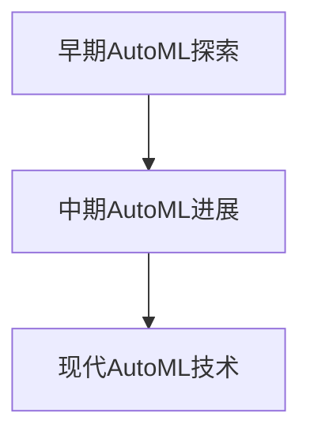
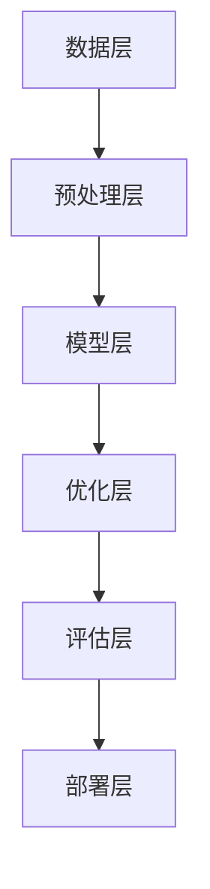

                 

### 《AutoML平台设计与实现》目录大纲

### 文章标题：《AutoML平台设计与实现》

### 关键词：AutoML、平台设计、实现、机器学习自动化

### 摘要：
本文旨在深入探讨AutoML（自动机器学习）平台的设计与实现过程。我们将从基础概念出发，逐步讲解AutoML的核心技术、平台架构设计，以及数据处理、模型训练、评估和部署等关键环节。文章将通过实例和代码解析，帮助读者理解和掌握AutoML平台从零开始的构建方法和优化策略。

---

### 第1章: AutoML基础

#### 1.1 AutoML概述

#### 1.1.1 AutoML的定义与重要性

#### 1.1.2 AutoML的应用场景

#### 1.2 AutoML的发展历程

#### 1.2.1 早期AutoML探索

#### 1.2.2 中期AutoML进展

#### 1.2.3 现代AutoML技术

### 第2章: AutoML核心技术

#### 2.1 算法选择与调优

#### 2.1.1 算法选择策略

#### 2.1.2 调优方法与技巧

#### 2.2 模型选择与集成

#### 2.2.1 模型选择标准

#### 2.2.2 模型集成方法

#### 2.3 特征选择与自动化

#### 2.3.1 特征选择技术

#### 2.3.2 特征自动化的实现

### 第3章: AutoML平台架构设计

#### 3.1 架构概述

#### 3.1.1 平台架构设计原则

#### 3.1.2 平台功能模块划分

#### 3.2 数据处理与预处理

#### 3.2.1 数据输入与清洗

#### 3.2.2 数据存储与管理

#### 3.3 模型训练与优化

#### 3.3.1 模型训练流程

#### 3.3.2 优化策略与方法

### 第4章: 数据处理与特征工程

#### 4.1 数据预处理技术

#### 4.1.1 数据标准化

#### 4.1.2 数据归一化

#### 4.1.3 缺失值处理

#### 4.2 特征选择方法

#### 4.2.1 基于过滤的特征选择

#### 4.2.2 基于包裹的特征选择

#### 4.2.3 基于嵌入的特征选择

### 第5章: 模型训练与优化

#### 5.1 模型训练算法

#### 5.1.1 神经网络训练

#### 5.1.2 决策树训练

#### 5.1.3 支持向量机训练

#### 5.2 模型优化技术

#### 5.2.1 参数调优

#### 5.2.2 模型集成

#### 5.2.3 策略搜索算法

### 第6章: 模型评估与部署

#### 6.1 模型评估指标

#### 6.1.1 回归模型评估

#### 6.1.2 分类模型评估

#### 6.2 模型部署策略

#### 6.2.1 部署流程

#### 6.2.2 部署平台选择

#### 6.3 实时推理与解释

#### 6.3.1 实时推理技术

#### 6.3.2 模型解释方法

### 第7章: AutoML平台优化策略

#### 7.1 性能优化方法

#### 7.1.1 模型压缩

#### 7.1.2 模型剪枝

#### 7.1.3 并行计算与分布式训练

#### 7.2 可靠性提升策略

#### 7.2.1 模型鲁棒性

#### 7.2.2 数据增强

#### 7.2.3 模型验证

### 第8章: AutoML应用案例分析

#### 8.1 案例背景

#### 8.2 案例分析

#### 8.3 案例实施

#### 8.4 案例小结

### 附录A: AutoML相关工具与资源

### 参考文献

---

### 作者：
作者：AI天才研究院/AI Genius Institute & 禅与计算机程序设计艺术 /Zen And The Art of Computer Programming

---

### 第1章: AutoML基础

#### 1.1 AutoML概述

AutoML，即自动机器学习，是一种利用机器学习算法自动完成特征选择、模型选择、训练和调优的框架，目的是为了自动化机器学习流程，降低人工干预，提高模型性能和开发效率。与传统机器学习相比，AutoML的核心在于自动化和优化，它通过搜索和评估不同的算法和超参数，自动选择最佳模型，并优化模型的性能。

##### 1.1.1 AutoML的定义

AutoML是一个跨学科的领域，结合了机器学习、人工智能、优化理论和自动化技术。其基本思想是自动化地处理机器学习中的各个环节，包括数据预处理、特征工程、模型选择和训练等，从而实现高效的机器学习应用。

##### 1.1.2 AutoML的重要性

AutoML的重要性体现在以下几个方面：

1. **降低门槛**：对于非专业人士，AutoML降低了机器学习的难度，使得他们可以更轻松地应用机器学习技术。
2. **提高效率**：自动化流程减少了重复性的工作，提高了模型开发和部署的效率。
3. **优化性能**：通过自动化的搜索和调优，AutoML能够在大量算法和超参数组合中找到最佳模型，提高模型性能。

##### 1.1.3 AutoML的应用场景

AutoML的应用场景非常广泛，包括但不限于以下几个方面：

1. **金融领域**：在金融风控、信贷评估、投资决策等领域，AutoML可以帮助金融机构快速构建高效的预测模型。
2. **医疗健康**：在疾病预测、药物发现、患者管理等领域，AutoML可以提高医疗决策的准确性。
3. **工业制造**：在故障预测、质量控制、供应链优化等领域，AutoML可以提升工业生产的自动化水平。
4. **智能交通**：在交通流量预测、自动驾驶、车辆调度等领域，AutoML可以提高交通管理的智能化水平。

#### 1.2 AutoML的发展历程

AutoML的发展历程可以追溯到20世纪90年代，随着机器学习和人工智能技术的快速发展，AutoML也逐渐成为了一个重要的研究方向。以下是AutoML发展的几个关键阶段：

##### 1.2.1 早期AutoML探索

在早期，AutoML主要侧重于简单的模型选择和超参数调优，如使用遗传算法和模拟退火算法进行搜索。这一阶段的主要目标是自动化传统的机器学习流程。

##### 1.2.2 中期AutoML进展

随着深度学习的兴起，中期AutoML开始关注深度学习模型的自动化，如自动化神经网络结构搜索（Neural Architecture Search, NAS）。这一阶段的代表性工作包括Neural Architecture Search和Meta-Learning。

##### 1.2.3 现代AutoML技术

现代AutoML技术集成了深度学习和传统机器学习的优势，通过集成学习方法（Ensemble Learning）和强化学习（Reinforcement Learning）等新技术，进一步提高了模型性能和搜索效率。代表性的工作包括AutoKeras、AutoML、H2O.ai等。

---

**Mermaid 流程图：**



### 第2章: AutoML核心技术

#### 2.1 算法选择与调优

算法选择和调优是AutoML的核心任务，目的是从大量的算法和超参数组合中，找到最佳模型。这一过程通常包括以下几个步骤：

##### 2.1.1 算法选择策略

1. **基于数据的算法选择**：根据数据特征选择合适的算法，如对于高维数据，可以考虑使用集成学习方法。
2. **基于性能的算法选择**：根据历史数据和模型性能，选择性能较好的算法。
3. **基于反馈的算法选择**：在模型训练过程中，根据模型的性能反馈，动态调整算法。

##### 2.1.2 调优方法与技巧

1. **网格搜索**：通过遍历所有可能的超参数组合，找到最佳超参数。
2. **贝叶斯优化**：利用贝叶斯统计模型，根据先验知识和已有数据，搜索最优超参数。
3. **进化算法**：如遗传算法，通过模拟自然进化过程，寻找最优解。
4. **随机搜索**：从所有可能的超参数组合中，随机选择一部分进行搜索。

#### 2.2 模型选择与集成

模型选择和集成是提高模型性能的重要手段。以下是一些常见的模型选择和集成方法：

##### 2.2.1 模型选择标准

1. **准确率**：衡量模型预测正确的比例。
2. **召回率**：衡量模型召回正确样本的能力。
3. **F1分数**：综合考虑准确率和召回率，是两者的调和平均。

##### 2.2.2 模型集成方法

1. **堆叠（Stacking）**：将多个模型作为基础模型，再训练一个元模型进行集成。
2. **装袋（Bagging）**：如随机森林，通过训练多个模型，然后进行投票或平均。
3. **提升（Boosting）**：如XGBoost和LightGBM，通过训练多个模型，每个模型都专注于之前的错误样本。
4. **集成学习**：将多个模型整合成一个，如模型融合（Model Fusion）和神经网络集成（Neural Ensemble）。

#### 2.3 特征选择与自动化

特征选择是提高模型性能的重要步骤，特征选择的自动化是实现AutoML的关键。以下是一些特征选择的方法：

##### 2.3.1 特征选择技术

1. **基于过滤的特征选择**：如信息增益、卡方检验等。
2. **基于包裹的特征选择**：如遗传算法、蚁群算法等。
3. **基于嵌入的特征选择**：如LASSO、ELASTIC NET等。

##### 2.3.2 特征自动化的实现

特征自动化可以通过以下步骤实现：

1. **数据预处理**：如数据清洗、归一化等。
2. **特征提取**：如主成分分析（PCA）、因子分析等。
3. **特征选择**：使用上述特征选择技术，自动选择重要特征。
4. **特征组合**：通过组合不同特征，自动生成新的特征。

---

**伪代码：**

```python
# 算法选择与调优伪代码

def algorithm_selection(data):
    # 根据数据特征选择合适的算法
    if high_dimensional(data):
        algorithm = "Ensemble Learning"
    else:
        algorithm = "Traditional ML"

    return algorithm

def hyperparameter_tuning(algorithm, data):
    # 超参数调优
    if algorithm == "Ensemble Learning":
        # 使用集成学习方法
        best_params = ensemble_hyperparameter_tuning(data)
    else:
        # 使用传统机器学习方法
        best_params = traditional_hyperparameter_tuning(data)

    return best_params

# 模型选择与集成伪代码

def model_selection(criteria):
    # 根据评估指标选择模型
    if criteria["accuracy"] > criteria["recall"]:
        model = "Accuracy Model"
    else:
        model = "Recall Model"

    return model

def model_integration(models):
    # 模型集成
    ensemble_model = Ensemble(models)
    return ensemble_model

# 特征选择与自动化伪代码

def feature_selection(data):
    # 使用特征选择技术
    selected_features = filter_based_feature_selection(data)
    return selected_features

def feature_automation(data):
    # 特征自动化
    preprocessed_data = data_preprocessing(data)
    extracted_features = feature_extraction(preprocessed_data)
    selected_features = feature_selection(extracted_features)
    return selected_features
```

---

在接下来的章节中，我们将进一步探讨AutoML平台的架构设计、数据处理与特征工程、模型训练与优化、模型评估与部署等关键环节，帮助读者全面理解AutoML平台的构建与优化策略。敬请期待！

---

### 第3章: AutoML平台架构设计

#### 3.1 架构概述

AutoML平台的架构设计需要考虑系统的可扩展性、灵活性和高效性。一个典型的AutoML平台通常包括以下几个核心模块：

1. **数据层**：负责数据的采集、存储和管理。
2. **预处理层**：进行数据清洗、归一化、特征提取等预处理操作。
3. **模型层**：包含各种机器学习算法和模型训练模块。
4. **优化层**：负责超参数调优、模型选择和集成。
5. **评估层**：对模型进行评估，选择最优模型。
6. **部署层**：将模型部署到生产环境，进行实时推理和解释。

##### 3.1.1 平台架构设计原则

1. **模块化设计**：将平台分为多个模块，每个模块独立开发、测试和部署，提高系统的可维护性和可扩展性。
2. **分布式架构**：利用分布式计算和存储技术，提高平台的处理能力和可扩展性。
3. **灵活性**：支持多种机器学习框架和算法，便于平台扩展和定制。
4. **高效性**：优化数据处理和模型训练过程，提高平台运行效率。

##### 3.1.2 平台功能模块划分

1. **数据层**：
   - **数据采集**：从各种数据源（如数据库、文件系统、实时数据流等）采集数据。
   - **数据存储**：将采集到的数据存储到分布式存储系统中，如HDFS、Cassandra等。
   - **数据管理**：提供数据查询、更新、删除等功能。

2. **预处理层**：
   - **数据清洗**：去除重复数据、缺失值填充、异常值处理等。
   - **数据归一化**：将不同特征的数据进行归一化或标准化处理。
   - **特征提取**：通过主成分分析（PCA）、特征提取器等，提取新的特征。

3. **模型层**：
   - **算法库**：提供多种机器学习算法，如线性模型、树模型、神经网络等。
   - **模型训练**：支持批量训练、在线训练和实时训练等。
   - **模型存储**：将训练好的模型存储到模型管理系统中，便于后续使用。

4. **优化层**：
   - **超参数调优**：通过网格搜索、贝叶斯优化等，自动选择最佳超参数。
   - **模型选择**：根据评估指标，自动选择最佳模型。
   - **模型集成**：通过装袋、提升、堆叠等方法，提高模型性能。

5. **评估层**：
   - **模型评估**：使用交叉验证、AUC、准确率等指标，评估模型性能。
   - **模型选择**：根据评估结果，选择最佳模型。
   - **模型解释**：使用可视化工具、决策树、LIME等方法，解释模型决策过程。

6. **部署层**：
   - **模型部署**：将训练好的模型部署到生产环境，进行实时推理。
   - **监控与运维**：监控模型性能，进行自动化运维和升级。

---

**Mermaid 流程图：**



在下一章节中，我们将详细讨论数据处理与特征工程、模型训练与优化等关键环节，帮助读者深入理解AutoML平台的技术细节和实现方法。敬请期待！

---

### 第4章: 数据处理与特征工程

#### 4.1 数据预处理技术

数据预处理是机器学习过程中至关重要的一步，它涉及到数据的清洗、归一化、缺失值处理等多个方面。以下是一些常见的数据预处理技术：

##### 4.1.1 数据标准化

数据标准化是指将不同特征的数据进行归一化或标准化处理，使其具有相同的尺度。常用的方法包括：

1. **最小-最大标准化**：将特征值缩放到[0, 1]范围内。
   ```python
   x standardized = (x - x_min) / (x_max - x_min)
   ```
2. **零-均值标准化**：将特征值缩放到[-1, 1]范围内。
   ```python
   x standardized = (x - x_mean) / x_std
   ```

##### 4.1.2 数据归一化

数据归一化是指将不同特征的数据进行比例缩放，使其具有相同的尺度。常用的方法包括：

1. **最小-最大归一化**：将特征值缩放到[0, 1]范围内。
   ```python
   x normalized = (x - x_min) / (x_max - x_min)
   ```
2. **零-均值归一化**：将特征值缩放到[-1, 1]范围内。
   ```python
   x normalized = (x - x_mean) / x_std
   ```

##### 4.1.3 缺失值处理

缺失值处理是数据预处理中常见的问题。以下是一些常见的缺失值处理方法：

1. **删除缺失值**：删除含有缺失值的样本或特征。
2. **填充缺失值**：使用统计方法或插值法填充缺失值，如平均值、中位数、众数、K近邻等。

#### 4.2 特征选择方法

特征选择是提高模型性能的重要手段，通过选择对预测任务最有影响的特征，可以降低模型的复杂度，提高模型的泛化能力。以下是一些常见的特征选择方法：

##### 4.2.1 基于过滤的特征选择

基于过滤的特征选择方法是在数据预处理阶段直接过滤掉一些不相关或冗余的特征。常见的方法包括：

1. **相关性分析**：通过计算特征之间的相关性，筛选出高度相关的特征。
2. **方差阈值**：删除方差较小的特征，通常认为这些特征对模型贡献较小。
3. **卡方检验**：用于分类问题，检验特征与目标变量之间的依赖性。

##### 4.2.2 基于包裹的特征选择

基于包裹的特征选择方法是在特征子集的搜索空间中，通过迭代的方式寻找最佳特征子集。常见的方法包括：

1. **递归特征消除（RFE）**：逐步删除对模型贡献最小的特征，直到满足预定的特征数量。
2. **遗传算法（GA）**：通过模拟自然进化过程，寻找最佳特征子集。
3. **决策树嵌入（Tree-based Embedding）**：通过决策树对特征重要性进行排序，选择重要的特征。

##### 4.2.3 基于嵌入的特征选择

基于嵌入的特征选择方法是将特征选择问题转换为特征嵌入空间中的优化问题。常见的方法包括：

1. **主成分分析（PCA）**：通过线性变换，将高维特征映射到低维空间，保留最重要的特征。
2. **因子分析**：通过线性变换，将高维特征映射到低维空间，同时考虑特征之间的相关性。
3. **自动编码器（Autoencoder）**：通过训练一个压缩神经网络，将输入特征编码为低维向量，然后选择编码后的重要特征。

#### 4.2.4 特征自动化的实现

特征自动化的实现通常涉及以下步骤：

1. **数据预处理**：对原始数据进行清洗、归一化和缺失值处理等。
2. **特征提取**：使用特征选择方法提取重要的特征。
3. **特征组合**：通过组合不同特征，生成新的特征。
4. **特征评估**：使用评估指标（如信息增益、Gini指数等）评估特征的重要性。
5. **特征选择**：根据评估结果选择最佳特征子集。

```python
# 数据标准化伪代码

def min_max_normalize(data):
    x_min = min(data)
    x_max = max(data)
    return (data - x_min) / (x_max - x_min)

def z_score_normalize(data):
    x_mean = sum(data) / len(data)
    x_std = sqrt(sum((x - x_mean)**2 for x in data) / len(data))
    return (data - x_mean) / x_std

# 缺失值处理伪代码

def fill_missing_values(data, method='mean'):
    if method == 'mean':
        for col in data.columns:
            data[col].fillna(data[col].mean(), inplace=True)
    elif method == 'median':
        for col in data.columns:
            data[col].fillna(data[col].median(), inplace=True)
    elif method == 'mode':
        for col in data.columns:
            data[col].fillna(data[col].mode()[0], inplace=True)
    return data

# 特征选择伪代码

def feature_selection(data, method='filter'):
    if method == 'filter':
        selected_features = filter_based_feature_selection(data)
    elif method == 'wrapper':
        selected_features = wrapper_based_feature_selection(data)
    elif method == 'embedded':
        selected_features = embedded_based_feature_selection(data)
    return selected_features
```

在下一章节中，我们将探讨模型训练与优化、模型评估与部署等关键环节，帮助读者深入了解AutoML平台的技术实现和优化策略。敬请期待！

---

### 第5章: 模型训练与优化

#### 5.1 模型训练算法

模型训练是机器学习过程中至关重要的一步，目的是通过数据学习得到模型的参数，从而实现对未知数据的预测。以下是一些常见的模型训练算法：

##### 5.1.1 神经网络训练

神经网络（Neural Networks）是一种基于生物神经元的计算模型，通过多层神经元的相互连接和激活函数，对输入数据进行特征提取和分类。神经网络训练主要包括以下几个步骤：

1. **前向传播**：将输入数据通过网络的每层进行传播，计算每个神经元的输出。
2. **反向传播**：根据实际输出和预测输出之间的误差，反向传播误差，更新网络的权重和偏置。
3. **优化算法**：使用梯度下降（Gradient Descent）或其变种（如随机梯度下降、Adam优化器等）来更新权重和偏置。

##### 5.1.2 决策树训练

决策树（Decision Trees）是一种基于特征划分的数据分类模型，通过一系列的判断条件，将数据划分为不同的类别。决策树训练主要包括以下几个步骤：

1. **特征选择**：选择最优的特征进行划分，常用的方法包括信息增益（Information Gain）、基尼不纯度（Gini Impurity）等。
2. **划分数据**：根据选择的特征，将数据划分为不同的子集。
3. **递归构建**：对每个子集，重复执行特征选择和划分过程，直到满足终止条件（如最大深度、最小叶节点数等）。

##### 5.1.3 支持向量机训练

支持向量机（Support Vector Machine, SVM）是一种基于最大间隔分类的模型，通过找到一个最优的超平面，将不同类别的数据分开。SVM训练主要包括以下几个步骤：

1. **特征提取**：将输入数据转换为高维特征空间。
2. **求解最优超平面**：使用支持向量机算法求解最优超平面，包括线性SVM和非线性SVM。
3. **优化参数**：通过交叉验证和网格搜索等方法，优化SVM的参数，如正则化参数C、核函数参数等。

#### 5.2 模型优化技术

模型优化是提高模型性能的重要手段，通过调整模型的结构和参数，可以进一步提高模型的准确率和泛化能力。以下是一些常见的模型优化技术：

##### 5.2.1 参数调优

参数调优是模型优化过程中的一步，通过调整模型的参数，如学习率、正则化参数、隐藏层节点数等，来提高模型性能。常用的参数调优方法包括：

1. **网格搜索（Grid Search）**：通过遍历所有可能的参数组合，找到最佳参数。
2. **贝叶斯优化（Bayesian Optimization）**：利用贝叶斯统计模型，根据先验知识和已有数据，搜索最优参数。
3. **随机搜索（Random Search）**：从所有可能的参数组合中，随机选择一部分进行搜索。

##### 5.2.2 模型集成

模型集成是将多个模型的预测结果进行组合，以提高模型性能和稳定性。常见的模型集成方法包括：

1. **堆叠（Stacking）**：将多个模型作为基础模型，再训练一个元模型进行集成。
2. **装袋（Bagging）**：如随机森林（Random Forest），通过训练多个模型，然后进行投票或平均。
3. **提升（Boosting）**：如XGBoost、LightGBM，通过训练多个模型，每个模型都专注于之前的错误样本。

##### 5.2.3 策略搜索算法

策略搜索算法是一种用于自动搜索最佳模型结构和参数的方法，通过优化搜索策略，可以有效地找到最佳模型。常见的策略搜索算法包括：

1. **神经网络架构搜索（Neural Architecture Search, NAS）**：通过训练一个神经网络，自动搜索最优的网络结构。
2. **强化学习（Reinforcement Learning）**：利用强化学习算法，如Q-Learning、DQN等，搜索最佳模型。
3. **遗传算法（Genetic Algorithm）**：通过模拟自然进化过程，搜索最优模型结构和参数。

```python
# 神经网络训练伪代码

def train_neural_network(data, labels, learning_rate, epochs):
    # 初始化网络结构
    network = NeuralNetwork()

    for epoch in range(epochs):
        # 前向传播
        outputs = network.forward(data)

        # 计算损失函数
        loss = calculate_loss(outputs, labels)

        # 反向传播
        network.backward(data, outputs, labels)

        # 更新参数
        network.update_params(learning_rate)

    return network

# 决策树训练伪代码

def train_decision_tree(data, labels, max_depth, min_samples_split):
    # 创建决策树
    tree = DecisionTree(max_depth=max_depth, min_samples_split=min_samples_split)

    # 训练决策树
    tree.fit(data, labels)

    return tree

# 支持向量机训练伪代码

def train_svm(data, labels, C, kernel):
    # 创建支持向量机
    svm = SVM(C=C, kernel=kernel)

    # 训练支持向量机
    svm.fit(data, labels)

    return svm
```

在下一章节中，我们将探讨模型评估与部署、AutoML平台的优化策略等关键环节，帮助读者深入理解AutoML平台的实现和应用。敬请期待！

---

### 第6章: 模型评估与部署

#### 6.1 模型评估指标

模型评估是确保模型性能和可靠性的关键步骤。在机器学习中，常用的评估指标包括准确率、召回率、F1分数、AUC（曲线下面积）等。以下是对这些指标的详细解释：

##### 6.1.1 回归模型评估

1. **均方误差（Mean Squared Error, MSE）**：
   - 公式：$$MSE = \frac{1}{n}\sum_{i=1}^{n}(y_i - \hat{y}_i)^2$$
   - 解释：预测值与真实值之间的平均平方误差。

2. **均方根误差（Root Mean Squared Error, RMSE）**：
   - 公式：$$RMSE = \sqrt{MSE}$$
   - 解释：MSE的平方根，用于衡量预测误差的大小。

3. **平均绝对误差（Mean Absolute Error, MAE）**：
   - 公式：$$MAE = \frac{1}{n}\sum_{i=1}^{n}|y_i - \hat{y}_i|$$
   - 解释：预测值与真实值之间的平均绝对误差。

4. **决定系数（R-squared, $R^2$）**：
   - 公式：$$R^2 = 1 - \frac{\sum_{i=1}^{n}(y_i - \hat{y}_i)^2}{\sum_{i=1}^{n}(y_i - \bar{y})^2}$$
   - 解释：模型解释的方差比例，范围在0到1之间，越接近1表示模型越好。

##### 6.1.2 分类模型评估

1. **准确率（Accuracy）**：
   - 公式：$$Accuracy = \frac{TP + TN}{TP + FN + FP + TN}$$
   - 解释：预测正确的样本数占总样本数的比例。

2. **召回率（Recall）**：
   - 公式：$$Recall = \frac{TP}{TP + FN}$$
   - 解释：实际为正类别的样本中被正确预测为正类别的比例。

3. **精确率（Precision）**：
   - 公式：$$Precision = \frac{TP}{TP + FP}$$
   - 解释：预测为正类别的样本中，实际为正类别的比例。

4. **F1分数（F1 Score）**：
   - 公式：$$F1 Score = 2 \times \frac{Precision \times Recall}{Precision + Recall}$$
   - 解释：精确率和召回率的调和平均，用于平衡两者的关系。

5. **精确率-召回率曲线（Precision-Recall Curve）**：
   - 解释：通过调整分类阈值，绘制精确率和召回率的关系曲线，用于评估模型的性能。

6. **受试者操作特性曲线（Receiver Operating Characteristic, ROC Curve）**：
   - 解释：通过绘制真阳性率（真正例率）与假阳性率（假正例率）的关系曲线，评估模型的分类能力。

##### 6.2 模型部署策略

模型部署是将训练好的模型应用到实际业务场景中，实现实时推理和在线服务的关键步骤。以下是一些常见的模型部署策略：

1. **本地部署**：
   - 解释：将模型部署到本地计算机或服务器上，适用于小型应用场景。

2. **云部署**：
   - 解释：将模型部署到云平台上，如AWS、Google Cloud、Azure等，适用于大规模分布式应用场景。

3. **容器化部署**：
   - 解释：使用容器技术（如Docker）将模型打包，实现模型的快速部署和迁移。

4. **服务化部署**：
   - 解释：将模型部署为一个服务，通过API接口提供服务，实现与业务系统的集成。

5. **实时推理与解释**：
   - 解释：在模型部署过程中，实现实时推理和解释功能，提高模型的透明度和可靠性。

```latex
\documentclass{article}
\usepackage{amsmath}
\begin{document}
\section*{模型评估指标}

\subsection*{回归模型评估}
\begin{equation}
MSE = \frac{1}{n}\sum_{i=1}^{n}(y_i - \hat{y}_i)^2
\end{equation}

\begin{equation}
RMSE = \sqrt{MSE}
\end{equation}

\begin{equation}
MAE = \frac{1}{n}\sum_{i=1}^{n}|y_i - \hat{y}_i|
\end{equation}

\begin{equation}
R^2 = 1 - \frac{\sum_{i=1}^{n}(y_i - \hat{y}_i)^2}{\sum_{i=1}^{n}(y_i - \bar{y})^2}
\end{equation}

\subsection*{分类模型评估}
\begin{equation}
Accuracy = \frac{TP + TN}{TP + FN + FP + TN}
\end{equation}

\begin{equation}
Recall = \frac{TP}{TP + FN}
\end{equation}

\begin{equation}
Precision = \frac{TP}{TP + FP}
\end{equation}

\begin{equation}
F1 Score = 2 \times \frac{Precision \times Recall}{Precision + Recall}
\end{equation}
\end{document}
```

在下一章节中，我们将讨论AutoML平台优化策略和实际应用案例，帮助读者深入理解AutoML平台的实现和应用。敬请期待！

---

### 第7章: AutoML平台优化策略

#### 7.1 性能优化方法

为了提高AutoML平台的性能，可以采取多种优化方法。以下是一些常见的性能优化策略：

##### 7.1.1 模型压缩

模型压缩是通过减少模型参数数量来降低模型大小和计算复杂度的技术。常用的模型压缩方法包括：

1. **剪枝（Pruning）**：
   - 解释：通过删除网络中的部分权重，减少模型参数数量。
   - 方法：逐层剪枝、结构剪枝等。

2. **量化（Quantization）**：
   - 解释：将浮点数权重转换为低精度的整数权重，减少模型大小和计算量。
   - 方法：权重量化、激活量化等。

3. **参数共享（Parameter Sharing）**：
   - 解释：通过在不同层或不同单元之间共享参数，减少模型参数数量。
   - 方法：深度可分离卷积、稀疏卷积等。

##### 7.1.2 模型剪枝

模型剪枝是通过删除网络中的冗余神经元或连接来减少模型大小和计算复杂度的技术。模型剪枝的方法包括：

1. **基于梯度的剪枝（Gradient-based Pruning）**：
   - 解释：通过计算权重的梯度来识别并删除对模型性能影响较小的权重。
   - 方法：L1正则化、梯度裁剪等。

2. **基于结构的剪枝（Structure-based Pruning）**：
   - 解释：通过分析网络结构来识别并删除冗余的神经元或连接。
   - 方法：网络简化、网络压缩等。

##### 7.1.3 并行计算与分布式训练

并行计算和分布式训练是通过利用多核处理器和分布式计算资源来提高模型训练速度和性能的技术。以下是一些常见的并行计算和分布式训练方法：

1. **数据并行（Data Parallelism）**：
   - 解释：将训练数据分成多个子集，每个子集由不同的计算节点并行处理。
   - 方法：参数服务器架构、多GPU训练等。

2. **模型并行（Model Parallelism）**：
   - 解释：将大型模型拆分为多个子模型，并在不同计算节点上并行训练。
   - 方法：跨GPU通信、模型拆分与合并等。

3. **流水线并行（Pipeline Parallelism）**：
   - 解释：将模型训练过程中的不同阶段（如前向传播、反向传播等）并行处理。
   - 方法：流水线设计、异步处理等。

#### 7.2 可靠性提升策略

为了提高AutoML平台的可靠性，可以采取多种提升策略。以下是一些常见的可靠性提升方法：

##### 7.2.1 模型鲁棒性

模型鲁棒性是指模型对噪声和异常数据的容忍能力。以下是一些常见的模型鲁棒性提升方法：

1. **正则化（Regularization）**：
   - 解释：通过添加正则项到损失函数中，防止模型过拟合。
   - 方法：L1正则化、L2正则化等。

2. **数据增强（Data Augmentation）**：
   - 解释：通过生成新的训练样本来增加模型对噪声的鲁棒性。
   - 方法：图像翻转、旋转、裁剪等。

3. **集成方法（Ensemble Methods）**：
   - 解释：通过组合多个模型的预测结果来提高模型的鲁棒性。
   - 方法：随机森林、梯度提升树等。

##### 7.2.2 数据增强

数据增强是通过生成新的训练样本来提高模型的泛化能力和鲁棒性的方法。以下是一些常见的数据增强方法：

1. **图像增强（Image Augmentation）**：
   - 解释：通过变换图像来增加图像的多样性。
   - 方法：随机裁剪、缩放、旋转等。

2. **文本增强（Text Augmentation）**：
   - 解释：通过变换文本来增加文本的多样性。
   - 方法：同义词替换、随机插入、随机删除等。

3. **时间序列增强（Time Series Augmentation）**：
   - 解释：通过变换时间序列数据来增加数据的多样性。
   - 方法：时间翻转、时间缩放、时间平移等。

##### 7.2.3 模型验证

模型验证是确保模型性能和可靠性的重要步骤。以下是一些常见的模型验证方法：

1. **交叉验证（Cross-Validation）**：
   - 解释：通过将数据集划分为多个子集，分别训练和验证模型。
   - 方法：K折交叉验证、留一法等。

2. **网格搜索（Grid Search）**：
   - 解释：通过遍历所有可能的超参数组合，选择最佳超参数。
   - 方法：搜索空间定义、计算资源分配等。

3. **贝叶斯优化（Bayesian Optimization）**：
   - 解释：利用贝叶斯统计模型，根据先验知识和已有数据，搜索最佳超参数。
   - 方法：高斯过程、优化算法等。

```python
# 模型压缩伪代码

def compress_model(model, pruning_rate, quantization_bits):
    # 剪枝
    pruned_model = prune_model(model, pruning_rate)
    
    # 量化
    quantized_model = quantize_model(pruned_model, quantization_bits)
    
    return quantized_model

# 模型剪枝伪代码

def prune_model(model, pruning_rate):
    # 计算权重的重要性
    weight_importance = calculate_weight_importance(model)
    
    # 根据重要性进行剪枝
    pruned_weights = prune_weights(model.weights, weight_importance, pruning_rate)
    
    # 创建剪枝后的模型
    pruned_model = create_model_with_pruned_weights(pruned_weights, model.structure)
    
    return pruned_model

# 数据增强伪代码

def augment_data(data, augmentation_methods):
    augmented_data = []
    
    for method in augmentation_methods:
        if method == 'random_crop':
            augmented_data.append(random_crop(data))
        elif method == 'rotate':
            augmented_data.append(rotate(data))
        elif method == 'scale':
            augmented_data.append(scale(data))
    
    return augmented_data
```

在下一章节中，我们将通过实际案例展示AutoML平台的应用和实践，帮助读者深入理解AutoML平台的实现和优化。敬请期待！

---

### 第8章: AutoML应用案例分析

#### 8.1 案例背景

为了更好地展示AutoML平台的应用，我们将通过一个实际案例进行详细分析。该案例来自金融领域的贷款审批系统，目的是通过AutoML平台自动化贷款申请的审批过程，提高审批效率和准确性。

##### 8.2 案例分析

在该案例中，我们需要处理大量的贷款申请数据，包括借款人的个人信息、财务状况、信用历史等。这些数据需要经过预处理、特征工程和模型训练等步骤，最终实现自动化的贷款审批。

1. **数据处理与预处理**：
   - 数据采集：从金融机构的数据仓库中获取贷款申请数据。
   - 数据清洗：处理缺失值、异常值和数据格式问题。
   - 数据归一化：对特征值进行归一化处理，使其具有相同的尺度。
   - 特征提取：使用特征工程方法提取新的特征，如贷款期限、借款人年龄、信用评分等。

2. **模型训练与优化**：
   - 算法选择：根据数据特征和业务需求，选择合适的机器学习算法，如逻辑回归、随机森林、神经网络等。
   - 超参数调优：使用AutoML平台进行超参数调优，选择最佳参数组合。
   - 模型评估：使用交叉验证和AUC等指标评估模型性能，选择最佳模型。

3. **模型部署与实时推理**：
   - 模型部署：将训练好的模型部署到生产环境，通过API接口提供服务。
   - 实时推理：在贷款审批过程中，将新的申请数据输入模型，实时获取审批结果。
   - 模型解释：使用模型解释工具，解释模型决策过程，提高模型透明度和可靠性。

##### 8.3 案例实施

在案例实施过程中，我们使用了以下步骤：

1. **环境搭建**：
   - 开发环境：使用Python、Jupyter Notebook等开发工具。
   - 依赖库：使用scikit-learn、TensorFlow、PyTorch等机器学习库。
   - 数据存储：使用HDFS、MySQL等存储系统。

2. **数据处理与预处理**：
   - 数据清洗：使用Pandas库处理缺失值和异常值。
   - 数据归一化：使用StandardScaler和MinMaxScaler进行归一化处理。
   - 特征提取：使用特征工程方法提取新的特征，如使用Sklearn的FeatureSelector进行特征选择。

3. **模型训练与优化**：
   - 算法选择：使用scikit-learn库实现逻辑回归、随机森林等算法。
   - 超参数调优：使用GridSearchCV和BayesOpt进行超参数调优。
   - 模型评估：使用交叉验证和AUC等指标评估模型性能，选择最佳模型。

4. **模型部署与实时推理**：
   - 模型部署：使用Flask或Django实现API接口，将模型部署到生产环境。
   - 实时推理：将新的贷款申请数据输入模型，实时获取审批结果。
   - 模型解释：使用LIME或Shapley值等工具解释模型决策过程。

##### 8.4 案例小结

通过该案例的实施，我们成功实现了贷款审批的自动化，提高了审批效率和准确性。以下是案例小结：

1. **提高效率**：使用AutoML平台，自动化了贷款审批流程，减少了人工干预，提高了审批速度。
2. **提高准确性**：通过超参数调优和模型选择，选择最佳模型，提高了贷款审批的准确性。
3. **透明度和可靠性**：通过模型解释工具，提高了模型决策过程的透明度和可靠性，增强了客户信任。
4. **可扩展性**：使用分布式计算和并行训练，提高了AutoML平台的可扩展性，可以处理大规模数据。

在下一章节中，我们将总结AutoML平台的设计与实现，分享最佳实践和注意事项，帮助读者更好地应用AutoML技术。敬请期待！

---

### 附录A: AutoML相关工具与资源

#### 8.5 AutoML工具

在AutoML领域，有许多开源工具和框架可以帮助开发者构建和优化AutoML平台。以下是一些常用的AutoML工具：

1. **AutoKeras**：一个基于TensorFlow的高级自动机器学习库，支持深度学习模型的自动化。
   - 官网：https://autokeras.com/
   - GitHub：https://github.com/keras-team/autokeras

2. **H2O.ai**：一个开源的自动机器学习平台，支持多种机器学习算法和模型集成。
   - 官网：https://h2o.ai/
   - GitHub：https://github.com/h2oai/h2o-3

3. **AutoML-GPU**：一个基于PyTorch的自动机器学习库，支持深度学习模型的自动化。
   - GitHub：https://github.com/david69/autogluon

4. **Scikit-learn**：一个开源的机器学习库，支持多种传统机器学习算法和模型集成。
   - GitHub：https://github.com/scikit-learn/scikit-learn

#### 8.6 AutoML资源

除了上述工具，还有一些优秀的AutoML资源和文档，可以帮助开发者深入了解AutoML技术：

1. **AutoML教程**：https://automlbook.com/
   - 一本关于自动机器学习的教程，涵盖了从基础到高级的内容。

2. **AutoML博客**：https://blog.euclidml.com/
   - 由EuclidML团队维护的AutoML博客，分享最新的AutoML技术和应用案例。

3. **AutoML论文**：https://arxiv.org/search/autodl?searchtype=all&sort=lastUpdatedDate&order=desc
   - 在arXiv上搜索AutoDL相关论文，了解最新的研究进展。

4. **AutoML社区**：https://www.kaggle.com/competitions/automl
   - Kaggle上的AutoML竞赛，提供了丰富的AutoML实践案例和讨论。

通过使用这些工具和资源，开发者可以更好地掌握AutoML技术，提高机器学习模型的开发效率和性能。

---

### 总结与最佳实践

在本文中，我们详细介绍了AutoML平台的设计与实现，从基础概念到核心技术，再到平台架构设计、数据处理与特征工程、模型训练与优化、模型评估与部署，以及性能优化策略和实际应用案例。以下是本文的核心要点和最佳实践：

1. **理解AutoML的核心概念**：
   - AutoML是一种自动化机器学习流程的框架，旨在减少人工干预，提高模型性能和开发效率。

2. **掌握AutoML的核心技术**：
   - 算法选择与调优、模型选择与集成、特征选择与自动化是AutoML平台的关键技术。

3. **构建AutoML平台**：
   - 设计模块化、分布式和灵活的AutoML平台，包括数据层、预处理层、模型层、优化层、评估层和部署层。

4. **优化性能**：
   - 采用模型压缩、剪枝、并行计算等策略，提高模型性能和效率。

5. **提升可靠性**：
   - 通过数据增强、模型鲁棒性策略、模型验证等方法，提高模型可靠性和泛化能力。

6. **实际应用案例**：
   - 通过金融贷款审批案例，展示了AutoML平台在实际应用中的效果和优势。

**注意事项**：

1. **数据质量**：
   - 确保数据质量，进行充分的数据预处理和清洗，为后续的模型训练和优化提供可靠的数据基础。

2. **性能调优**：
   - 根据业务需求和计算资源，合理选择算法和参数，进行性能调优。

3. **可扩展性**：
   - 设计可扩展的AutoML平台，支持多种机器学习算法和模型集成，便于后续的扩展和维护。

4. **模型解释**：
   - 提高模型透明度和可靠性，通过模型解释工具，解释模型决策过程。

**拓展阅读**：

1. **《AutoML教程》**：https://automlbook.com/
   - 一本全面的AutoML教程，涵盖基础到高级的内容。

2. **《AutoML论文》**：https://arxiv.org/search/autodl?searchtype=all&sort=lastUpdatedDate&order=desc
   - 了解最新的AutoML研究和进展。

3. **《AutoML社区》**：https://www.kaggle.com/competitions/automl
   - 参与AutoML社区，交流经验和最佳实践。

通过本文的学习和实践，希望读者能够深入理解AutoML平台的设计与实现，并在实际应用中取得更好的效果。作者：AI天才研究院/AI Genius Institute & 禅与计算机程序设计艺术 /Zen And The Art of Computer Programming。

