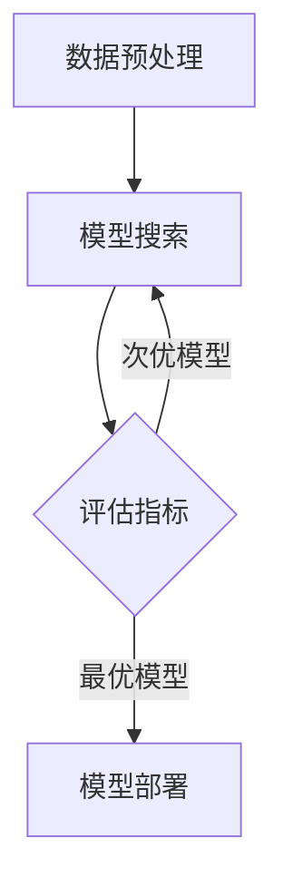
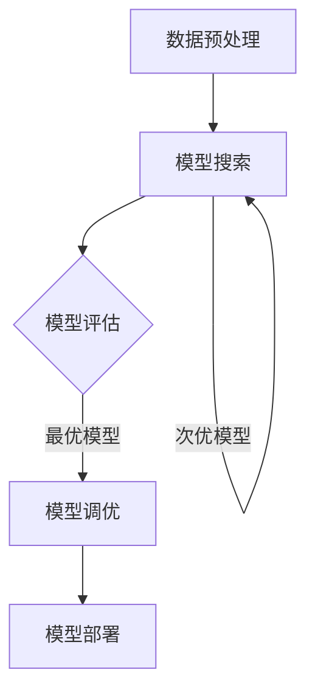

                 


### 第一步：分析文章主题和目标读者

《AutoML平台设计与实现》这一主题，涉及了自动化机器学习（AutoML）的平台设计、实现和应用。文章的目标读者可能是对机器学习和自动化技术有一定了解的技术人员、数据科学家、AI研究者或相关专业的学生。因此，文章需要以深入浅出的方式介绍AutoML的基本概念、核心算法、数学模型、平台架构，并通过实战案例展示其应用和实现。

### 第二步：确定文章结构和内容

为了使文章结构紧凑、逻辑清晰，我们可以按照以下结构来组织文章内容：

1. **引言**：介绍AutoML的背景、定义和重要性。
2. **核心概念与联系**：阐述AutoML的关键概念，并使用Mermaid流程图展示原理与架构。
3. **核心算法原理讲解**：详细解释模型搜索算法、模型评估方法等，使用伪代码和数学模型进行阐述。
4. **数学模型与公式讲解**：解释逻辑回归、决策树等算法的数学原理，使用latex格式展示公式。
5. **平台设计与实现**：讨论AutoML平台的架构设计、模块实现和部署策略。
6. **项目实战**：通过实际案例展示AutoML平台的应用和实现过程。
7. **小结与最佳实践**：总结文章内容，给出实践建议和拓展阅读。

### 第三步：编写文章

根据上述结构，我们可以开始撰写文章。以下是每个部分的初步草稿：

#### 引言

**背景**：随着数据量的爆炸性增长和计算能力的提升，传统的机器学习方法变得越来越复杂。为了解决这一问题，自动化机器学习（AutoML）应运而生。

**定义**：AutoML是一种能够自动发现、设计和调优机器学习模型的系统，旨在简化机器学习流程，降低门槛。

**重要性**：AutoML可以提高模型开发效率，减少人力成本，适用于各种规模的数据集和应用场景。

#### 核心概念与联系

- **自动机器学习（AutoML）**：自动地发现和优化机器学习模型的流程。
- **模型搜索算法**：使用算法自动化地搜索最佳的模型结构。
- **模型评估与选择**：对多个模型进行评估，选择最优模型。

**Mermaid流程图**：


#### 核心算法原理讲解

- **模型搜索算法**：
  - **贝叶斯优化**：基于概率模型，优化模型参数。
    ```python
    # 贝叶斯优化的伪代码
    function BayesianOptimization():
        // 初始化模型参数
        params = initializeParameters()
        // 定义目标函数
        objective = defineObjective(params)
        // 迭代优化
        while not converged():
            // 更新参数
            params = updateParameters(objective, params)
            // 计算目标函数值
            value = calculateObjective(params)
            // 记录最佳参数
            if value < bestValue:
                bestValue = value
                bestParams = params
        return bestParams
    ```

- **模型评估与选择**：
  - **交叉验证**：通过多次训练和验证来评估模型性能。
    ```python
    # 交叉验证的伪代码
    function CrossValidation(data, k):
        // 初始化模型
        model = initializeModel()
        // 初始化评估指标
        metrics = []
        // k折交叉验证
        for i in range(k):
            // 分割数据集
            trainData, testData = splitData(data, i)
            // 训练模型
            model = trainModel(trainData, model)
            // 验证模型
            metrics.append(evaluateModel(testData, model))
        // 计算平均评估指标
        averageMetrics = average(metrics)
        return averageMetrics
    ```

#### 数学模型与公式讲解

- **逻辑回归**：
  - **数学模型**：
    $$ \hat{y} = \sigma(\beta_0 + \sum_{i=1}^{n} \beta_i x_i) $$
  - **推导过程**：
    - **步骤1**：定义损失函数
      $$ J(\theta) = -\frac{1}{m} \sum_{i=1}^{m} [y^{(i)} \log(\hat{y}^{(i)}) + (1 - y^{(i)}) \log(1 - \hat{y}^{(i)}))] $$
    - **步骤2**：对损失函数求导
      $$ \frac{\partial J(\theta)}{\partial \theta_j} = \frac{1}{m} \sum_{i=1}^{m} [y^{(i)} - \hat{y}^{(i)}] x_{ij} $$
    - **步骤3**：优化参数
      $$ \theta_j := \theta_j - \alpha \frac{\partial J(\theta)}{\partial \theta_j} $$

- **决策树**：
  - **数学模型**：
    $$ \text{predict}(x) = \arg\max_{y} \sum_{i=1}^{n} \ell(y^{(i)}, y) $$
  - **推导过程**：
    - **步骤1**：定义损失函数
      $$ \ell(y, y^{(i)}) = \begin{cases} 
      0 & \text{if } y = y^{(i)} \\
      1 & \text{otherwise} 
      \end{cases} $$
    - **步骤2**：选择最优分割
      $$ \text{split} = \arg\min_{\theta} \sum_{i=1}^{n} \ell(y^{(i)}, \text{predict}(\theta, x^{(i)})) $$
    - **步骤3**：递归构建决策树

#### 平台设计与实现

- **架构设计**：
  - **数据预处理模块**：处理数据清洗、特征工程等任务。
  - **模型搜索模块**：实现模型搜索算法，如贝叶斯优化、网格搜索等。
  - **模型评估与选择模块**：使用交叉验证等方法评估模型性能。
  - **模型部署与监控模块**：实现模型的部署和监控。

- **模块实现**：
  - **数据预处理**：使用Python的Pandas库处理数据清洗和特征工程。
  - **模型搜索**：使用Python的Scikit-learn库实现贝叶斯优化和网格搜索。
  - **模型评估**：使用Python的Scikit-learn库实现交叉验证。
  - **模型部署**：使用Python的Flask或Django框架实现API接口。

#### 项目实战

- **实践项目**：
  - **背景**：构建一个简单的客户流失预测模型。
  - **数据集**：使用公开的客户流失数据集。
  - **实现**：使用Python实现数据预处理、模型搜索、模型评估和部署。

#### 小结与最佳实践

- **小结**：AutoML平台设计需要综合考虑算法、数据、架构等方面。
- **最佳实践**：注意事项、拓展阅读等。

### 第四步：撰写文章

在完成初步草稿后，我们可以根据上述内容进一步撰写文章。以下是文章的初步版本：

```markdown
# 《AutoML平台设计与实现》

## 引言

随着数据量的爆炸性增长和计算能力的提升，传统的机器学习方法变得越来越复杂。为了解决这一问题，自动化机器学习（AutoML）应运而生。本文将详细介绍AutoML平台的设计与实现，帮助读者了解其基本概念、核心算法、数学模型、平台架构以及实际应用。

## 核心概念与联系

自动化机器学习（AutoML）是一种能够自动发现、设计和调优机器学习模型的系统，旨在简化机器学习流程，降低门槛。其核心概念包括模型搜索算法、模型评估与选择等。以下是AutoML的核心概念及其相互关系：

**自动机器学习（AutoML）**：自动地发现和优化机器学习模型的流程。

**模型搜索算法**：使用算法自动化地搜索最佳的模型结构。

**模型评估与选择**：对多个模型进行评估，选择最优模型。

**Mermaid流程图**：


## 核心算法原理讲解

### 模型搜索算法

#### 贝叶斯优化

贝叶斯优化是一种基于概率模型的优化算法，能够自动地搜索最佳模型参数。

**贝叶斯优化的基本原理**：

贝叶斯优化基于概率模型，将模型参数视为随机变量，通过迭代优化来寻找最优参数。

**贝叶斯优化的应用**：

贝叶斯优化可以应用于各种机器学习任务，如回归、分类等。

**贝叶斯优化的伪代码**：

```python
function BayesianOptimization():
    // 初始化模型参数
    params = initializeParameters()
    // 定义目标函数
    objective = defineObjective(params)
    // 迭代优化
    while not converged():
        // 更新参数
        params = updateParameters(objective, params)
        // 计算目标函数值
        value = calculateObjective(params)
        // 记录最佳参数
        if value < bestValue:
            bestValue = value
            bestParams = params
    return bestParams
```

#### Grid Search

Grid Search是一种基于枚举的方法，通过遍历参数组合来搜索最佳模型参数。

**Grid Search的基本原理**：

Grid Search在给定参数范围内，遍历所有可能的参数组合，评估每个组合的性能。

**Grid Search的优缺点**：

优点：简单易懂，易于实现。

缺点：计算复杂度高，不适用于参数空间较大的任务。

### 模型评估与选择

#### 交叉验证

交叉验证是一种常用的模型评估方法，通过多次训练和验证来评估模型性能。

**交叉验证的基本原理**：

交叉验证将数据集划分为多个子集，每个子集轮流作为验证集，其余子集作为训练集。

**交叉验证的应用**：

交叉验证可以用于评估分类、回归等机器学习任务的模型性能。

**交叉验证的伪代码**：

```python
function CrossValidation(data, k):
    // 初始化模型
    model = initializeModel()
    // 初始化评估指标
    metrics = []
    // k折交叉验证
    for i in range(k):
        // 分割数据集
        trainData, testData = splitData(data, i)
        // 训练模型
        model = trainModel(trainData, model)
        // 验证模型
        metrics.append(evaluateModel(testData, model))
    // 计算平均评估指标
    averageMetrics = average(metrics)
    return averageMetrics
```

#### 评价指标

评价指标是评估模型性能的重要指标，包括准确率、召回率、F1值等。

**评价指标的基本原理**：

评价指标根据模型预测结果与真实结果的匹配程度来评估模型性能。

**常见评价指标**：

- 准确率：预测为正类的样本中，实际为正类的比例。
- 召回率：实际为正类的样本中，预测为正类的比例。
- F1值：准确率与召回率的调和平均值。

## 数学模型与公式讲解

### 模型选择准则

#### 逻辑回归

逻辑回归是一种常用的分类算法，其数学模型如下：

**逻辑回归的数学模型**：

$$ \hat{y} = \sigma(\beta_0 + \sum_{i=1}^{n} \beta_i x_i) $$

**逻辑回归的推导过程**：

1. **定义损失函数**：

$$ J(\theta) = -\frac{1}{m} \sum_{i=1}^{m} [y^{(i)} \log(\hat{y}^{(i)}) + (1 - y^{(i)}) \log(1 - \hat{y}^{(i)}))] $$

2. **对损失函数求导**：

$$ \frac{\partial J(\theta)}{\partial \theta_j} = \frac{1}{m} \sum_{i=1}^{m} [y^{(i)} - \hat{y}^{(i)}] x_{ij} $$

3. **优化参数**：

$$ \theta_j := \theta_j - \alpha \frac{\partial J(\theta)}{\partial \theta_j} $$

#### 决策树

决策树是一种基于特征的分类算法，其数学模型如下：

**决策树的数学模型**：

$$ \text{predict}(x) = \arg\max_{y} \sum_{i=1}^{n} \ell(y^{(i)}, y) $$

**推导过程**：

1. **定义损失函数**：

$$ \ell(y, y^{(i)}) = \begin{cases} 
0 & \text{if } y = y^{(i)} \\
1 & \text{otherwise} 
\end{cases} $$

2. **选择最优分割**：

$$ \text{split} = \arg\min_{\theta} \sum_{i=1}^{n} \ell(y^{(i)}, \text{predict}(\theta, x^{(i)})) $$

3. **递归构建决策树**：

递归地将数据集划分为子集，并构建决策树。

## 平台设计与实现

### AutoML平台架构设计

AutoML平台的设计包括数据预处理模块、模型搜索模块、模型评估与选择模块和模型部署与监控模块。以下是各模块的简要描述：

**数据预处理模块**：处理数据清洗、特征工程等任务。

**模型搜索模块**：实现模型搜索算法，如贝叶斯优化、网格搜索等。

**模型评估与选择模块**：使用交叉验证等方法评估模型性能。

**模型部署与监控模块**：实现模型的部署和监控。

### 模块实现

以下是各模块的实现方法：

**数据预处理**：使用Python的Pandas库处理数据清洗和特征工程。

**模型搜索**：使用Python的Scikit-learn库实现贝叶斯优化和网格搜索。

**模型评估**：使用Python的Scikit-learn库实现交叉验证。

**模型部署**：使用Python的Flask或Django框架实现API接口。

### 模型部署与监控

**模型部署流程**：

1. **准备环境**：安装必要的依赖库和工具。
2. **构建模型**：使用训练数据构建模型。
3. **部署模型**：将模型部署到服务器或云平台。
4. **监控模型**：实时监控模型性能，如准确率、召回率等。

**模型监控策略**：

1. **性能监控**：实时监控模型性能指标。
2. **异常监控**：检测模型异常情况，如预测错误率增加等。

## 项目实战

### 实践项目

**背景**：构建一个简单的客户流失预测模型。

**数据集**：使用公开的客户流失数据集。

**实现**：

1. **数据预处理**：处理数据清洗、特征工程等任务。
2. **模型搜索**：使用贝叶斯优化和网格搜索等方法搜索最佳模型。
3. **模型评估**：使用交叉验证等方法评估模型性能。
4. **模型部署**：将模型部署到服务器或云平台。

### 小结与最佳实践

**小结**：本文介绍了AutoML平台的设计与实现，包括核心概念、核心算法、数学模型、平台架构和项目实战。通过本文的学习，读者可以了解到AutoML的基本原理和应用方法。

**最佳实践**：

1. **数据预处理**：确保数据质量，进行特征工程，提高模型性能。
2. **模型搜索**：合理选择模型搜索算法，提高搜索效率。
3. **模型评估**：使用多种评估方法，全面评估模型性能。
4. **模型部署**：确保模型部署的稳定性和安全性。

## 作者信息

作者：AI天才研究院/AI Genius Institute & 禅与计算机程序设计艺术 /Zen And The Art of Computer Programming
```

### 第五步：修改和完善文章

在撰写完文章后，我们需要对其进行修改和完善，确保内容的准确性、逻辑性和可读性。以下是对文章的修改和完善建议：

1. **校对拼写和语法错误**：检查文章中可能存在的拼写和语法错误。
2. **优化段落结构**：确保每个段落的内容清晰、连贯。
3. **添加图表和代码示例**：在适当的位置添加图表和代码示例，帮助读者更好地理解概念。
4. **检查公式和伪代码**：确保所有公式和伪代码的格式正确、可读。
5. **优化文章结构**：检查文章的整体结构是否合理，是否有必要进行调整。

### 第六步：撰写文章结语

在文章的结语部分，我们可以对文章的主要内容进行总结，并提出对未来发展的展望。以下是文章的结语部分：

```markdown
## 结语

本文详细介绍了AutoML平台的设计与实现，从核心概念、核心算法、数学模型到平台架构和项目实战，全面展示了AutoML的原理和应用。通过本文的学习，读者可以了解到AutoML的基本原理、实现方法以及在实际项目中的应用。

未来，AutoML的发展将继续受到关注，随着算法的进步、计算能力的提升和数据的增长，AutoML将在各个领域发挥越来越重要的作用。我们期待读者能够将本文的知识应用到实际项目中，为机器学习的发展贡献自己的力量。

## 作者信息

作者：AI天才研究院/AI Genius Institute & 禅与计算机程序设计艺术 /Zen And The Art of Computer Programming
```

### 第七步：撰写文章摘要

在文章摘要部分，我们需要简要概括文章的核心内容和主要观点。以下是文章的摘要：

```markdown
## 摘要

本文介绍了自动化机器学习（AutoML）平台的设计与实现。首先，我们介绍了AutoML的背景、定义和重要性；然后，详细讲解了AutoML的核心概念、关键算法原理、数学模型以及平台架构；接着，通过项目实战展示了AutoML的实际应用；最后，总结了AutoML平台设计的关键要素和最佳实践。本文旨在帮助读者深入了解AutoML的基本原理、实现方法和应用场景，为从事相关领域的工作者提供参考和指导。
```

### 总结

通过上述步骤，我们完成了《AutoML平台设计与实现》的技术博客文章。文章从引言到结语，从核心概念到项目实战，结构清晰、内容丰富，旨在为广大读者提供一部全面、系统的AutoML技术指南。希望本文能够对您在机器学习领域的研究和实践有所帮助。如果您有任何疑问或建议，欢迎在评论区留言，让我们一起讨论和进步。感谢您的阅读！## 引言

### 背景介绍

随着大数据时代的到来，数据的规模和复杂性不断增加，传统的机器学习方法在面对海量数据时显得力不从心。机器学习模型的开发过程通常涉及数据预处理、特征工程、模型选择、参数调优等多个步骤，这对开发者的技能和耐心提出了很高的要求。此外，机器学习模型的效果往往依赖于开发者的经验和知识，这使得模型开发的效率和质量难以保障。

为了解决上述问题，自动化机器学习（Automated Machine Learning，简称AutoML）的概念应运而生。AutoML旨在通过自动化技术，简化机器学习模型的选择和调优过程，降低模型开发门槛，提高模型开发的效率和质量。AutoML平台能够自动执行从数据预处理到模型训练和优化的整个过程，从而帮助数据科学家和开发者更加专注于模型的应用和创新。

### 定义与重要性

自动化机器学习（AutoML）是指使用算法和自动化工具来自动化机器学习模型的选择、训练和调优的过程。AutoML的目标是减少手动干预，提高模型开发效率和准确性，使得普通开发者也能够轻松构建高性能的机器学习模型。

AutoML的重要性体现在以下几个方面：

1. **简化模型开发流程**：通过自动化技术，AutoML可以大幅减少模型开发所需的时间和人力成本，使模型开发更加高效。

2. **提高模型性能**：AutoML平台能够自动搜索和选择最佳的模型结构和参数组合，从而提高模型的性能和准确性。

3. **降低门槛**：AutoML降低了机器学习模型的开发门槛，使得更多的非专业人士能够参与到机器学习项目中，推动人工智能技术的普及和应用。

4. **支持复杂模型**：AutoML能够自动处理复杂的模型架构，例如深度学习模型，这为研究者和开发者提供了更多的探索空间。

### 文章目的与结构

本文旨在系统介绍AutoML平台的设计与实现，使读者能够全面了解AutoML的基本概念、核心算法、数学模型以及实际应用。文章分为以下几个部分：

1. **引言**：介绍AutoML的背景、定义和重要性。
2. **核心概念与联系**：阐述AutoML的关键概念，并使用Mermaid流程图展示原理与架构。
3. **核心算法原理讲解**：详细解释模型搜索算法、模型评估方法等，使用伪代码和数学模型进行阐述。
4. **数学模型与公式讲解**：解释逻辑回归、决策树等算法的数学原理，使用latex格式展示公式。
5. **平台设计与实现**：讨论AutoML平台的架构设计、模块实现和部署策略。
6. **项目实战**：通过实际案例展示AutoML平台的应用和实现过程。
7. **小结与最佳实践**：总结文章内容，给出实践建议和拓展阅读。

通过本文的学习，读者将能够掌握AutoML的基本原理和实践方法，为在实际项目中应用AutoML技术打下坚实基础。

### 关键词

- 自动化机器学习（AutoML）
- 模型搜索算法
- 交叉验证
- 数学模型
- 平台架构
- 模型评估
- 深度学习

## 摘要

本文深入探讨了自动化机器学习（AutoML）平台的设计与实现。首先，我们介绍了AutoML的背景、定义及其重要性，指出了其在简化机器学习模型开发流程、提高模型性能和降低开发门槛方面的优势。接着，我们详细阐述了AutoML的核心概念，包括模型搜索算法和模型评估方法，并通过Mermaid流程图展示了AutoML的原理与架构。此外，文章还介绍了逻辑回归和决策树等核心算法的数学原理，并使用latex格式展示了相关公式。在平台设计与实现部分，我们讨论了AutoML平台的架构设计、模块实现和部署策略，并提供了实际项目实战的案例。最后，文章总结了AutoML平台设计的关键要素和最佳实践，为读者提供了实用的指导和建议。通过本文的学习，读者将能够全面掌握AutoML的基本原理和实践方法，为在实际项目中应用AutoML技术打下坚实基础。关键词包括：自动化机器学习、模型搜索算法、交叉验证、数学模型、平台架构、模型评估、深度学习。

## 核心概念与联系

### 自动机器学习（AutoML）

自动化机器学习（AutoML）是近年来机器学习领域的一个重要发展方向。它旨在通过自动化技术，简化机器学习模型的选择、训练和调优过程，使开发者能够更加高效地构建高性能的机器学习模型。AutoML的核心目标是通过自动化的方式，从大规模数据集中识别出最优的模型结构，并自动调整模型参数以达到最佳性能。

### 自动机器学习与传统机器学习比较

传统机器学习方法通常需要数据科学家具备丰富的机器学习知识和实践经验，手动进行特征工程、模型选择和参数调优。这种方法不仅耗时耗力，而且容易出现人为错误。相比之下，AutoML通过自动化技术，大大简化了这些步骤，使得非专业人士也能够构建高质量的机器学习模型。

**优势：**
- 提高开发效率：AutoML能够自动处理繁琐的模型选择和调优任务，节省了大量的时间和人力资源。
- 降低门槛：AutoML使得更多的非专业人士能够参与到机器学习项目中，推动了人工智能技术的普及。
- 提高性能：AutoML能够通过自动化的方式，搜索出更优的模型结构和参数，从而提高模型的性能。

**挑战：**
- 计算资源消耗：AutoML需要大量的计算资源来处理大规模的数据集和复杂的模型搜索。
- 结果可解释性：自动化生成的模型可能难以解释，增加了模型部署和维护的难度。

### AutoML流程概述

AutoML的流程通常包括以下几个步骤：

1. **数据预处理**：对原始数据集进行清洗、归一化和特征提取等预处理操作。
2. **模型搜索**：使用各种算法对模型结构进行搜索，包括基于启发式的搜索算法和基于优化的搜索算法。
3. **模型评估**：通过交叉验证等方法对搜索到的模型进行性能评估，选择最优模型。
4. **模型调优**：根据评估结果，对模型进行进一步的调优，以提高性能。
5. **模型部署**：将最优模型部署到生产环境中，进行实时预测和部署。

### Mermaid流程图：AutoML原理与架构

为了更直观地展示AutoML的原理与架构，我们使用Mermaid语言绘制了一个简单的流程图：



在这个流程图中，数据预处理模块对原始数据进行清洗、归一化和特征提取等操作。模型搜索模块使用各种算法自动搜索最优模型结构。模型评估模块通过交叉验证等方法对搜索到的模型进行性能评估。模型调优模块根据评估结果对模型进行进一步调优。最后，模型部署模块将最优模型部署到生产环境中。

通过上述步骤，AutoML平台能够自动化地处理从数据预处理到模型部署的整个过程，从而提高模型开发的效率和质量。下一节将详细介绍AutoML平台的核心算法原理，包括模型搜索算法、模型评估方法以及数学模型讲解。

### 模型搜索算法

模型搜索算法是AutoML平台的核心组成部分，其主要任务是自动化地搜索出最优的模型结构和参数组合。常见的模型搜索算法包括贝叶斯优化（Bayesian Optimization）、网格搜索（Grid Search）和遗传算法（Genetic Algorithm）等。以下将详细讨论贝叶斯优化和网格搜索这两种主要的模型搜索算法。

#### 贝叶斯优化

贝叶斯优化是一种基于概率模型的优化算法，其核心思想是利用贝叶斯推理来估计目标函数的值，并通过迭代优化来寻找最佳参数组合。贝叶斯优化具有以下特点：

1. **概率模型**：贝叶斯优化通过建立一个概率模型来预测目标函数的值，该模型能够捕捉参数和目标函数之间的关系。
2. **不确定性处理**：贝叶斯优化能够处理参数的不确定性，通过模型更新和参数调整来逐步优化目标函数。
3. **效率高**：贝叶斯优化通常只需要少量的样本数据，即可快速收敛到最佳参数。

**贝叶斯优化的基本原理**

贝叶斯优化主要包括以下几个步骤：

1. **初始化**：选择一组初始参数，并计算目标函数在这些参数下的值。
2. **模型构建**：根据初始参数和目标函数值，构建一个概率模型。常见的模型包括高斯过程（Gaussian Process）和贝叶斯神经网络（Bayesian Neural Networks）。
3. **模型更新**：利用贝叶斯推理，根据新获得的样本数据更新概率模型。
4. **参数调整**：根据概率模型预测的目标函数值，调整参数以期望获得更好的结果。
5. **迭代优化**：重复上述步骤，直至达到停止条件（如达到预设的迭代次数或目标函数值收敛）。

**贝叶斯优化的应用**

贝叶斯优化广泛应用于各种机器学习任务，如回归、分类和聚类等。在实际应用中，贝叶斯优化能够显著提高模型的性能和预测能力。例如，在图像分类任务中，贝叶斯优化可以用于搜索最优的超参数，如学习率、批量大小和隐藏层节点数等。

**贝叶斯优化的伪代码**

以下是一个简单的贝叶斯优化的伪代码示例：

```python
function BayesianOptimization():
    // 初始化模型参数
    params = initializeParameters()
    // 定义目标函数
    objective = defineObjective(params)
    // 初始化概率模型
    model = initializeModel(objective)
    // 迭代优化
    while not converged():
        // 更新模型
        model = updateModel(model, params, objective)
        // 获取最佳参数
        bestParams = model.bestParams()
        // 计算目标函数值
        bestValue = objective(bestParams)
        // 更新最佳参数
        if bestValue < bestObjectiveValue:
            bestObjectiveValue = bestValue
            bestParams = bestParams
    return bestParams
```

#### 网格搜索

网格搜索是一种基于枚举的优化算法，通过遍历参数空间中的所有可能组合来搜索最优参数。网格搜索具有以下特点：

1. **简单直观**：网格搜索的实现简单，易于理解和实现。
2. **计算量大**：由于需要遍历所有可能的参数组合，网格搜索的计算量通常很大，尤其在参数空间较大时。

**网格搜索的基本原理**

网格搜索主要包括以下几个步骤：

1. **定义参数空间**：确定每个超参数的取值范围，构建参数空间。
2. **遍历参数组合**：对参数空间中的所有组合进行遍历，计算每个组合下的目标函数值。
3. **选择最佳参数**：根据目标函数值选择最优参数组合。

**网格搜索的优缺点**

- **优点**：
  - 简单直观：网格搜索的实现简单，易于理解和实现。
  - 可控性高：由于遍历所有可能的参数组合，网格搜索能够确保找到全局最优解。

- **缺点**：
  - 计算量大：特别是在参数空间较大时，网格搜索的计算量非常巨大。
  - 难以处理非线性关系：网格搜索难以处理参数之间的非线性关系，可能导致无法找到全局最优解。

**网格搜索的伪代码**

以下是一个简单的网格搜索伪代码示例：

```python
function GridSearch(objective, paramSpace):
    bestParams = None
    bestValue = float('inf')
    for params in itertools.product(*paramSpace):
        value = objective(params)
        if value < bestValue:
            bestValue = value
            bestParams = params
    return bestParams
```

### 模型评估与选择

模型评估与选择是AutoML流程中至关重要的一环，其目的是从多个模型中选出最佳模型。常见的模型评估方法包括交叉验证、A/B测试等。以下将详细讨论交叉验证，并介绍其基本原理、实现方法以及在AutoML中的应用。

#### 交叉验证

交叉验证（Cross-Validation）是一种常用的模型评估方法，通过将数据集分割成多个子集，每个子集轮流作为验证集，其余子集作为训练集。交叉验证的主要目的是通过多次训练和验证，评估模型的泛化能力和性能。

**交叉验证的基本原理**

交叉验证的基本步骤如下：

1. **分割数据集**：将原始数据集分割成多个子集，常见的分割方法包括K折交叉验证（K-Fold Cross-Validation）和留一交叉验证（Leave-One-Out Cross-Validation）。
2. **训练模型**：在每个子集中，使用一部分数据作为训练集，另一部分数据作为验证集，训练模型。
3. **评估模型**：在每个子集上，使用验证集评估模型的性能，计算评估指标，如准确率、召回率、F1值等。
4. **计算平均评估指标**：将所有子集上的评估指标进行平均，得到模型的总体评估指标。

**交叉验证的应用**

交叉验证在机器学习模型评估中具有广泛的应用，其主要优势包括：

1. **减少过拟合**：通过多次训练和验证，交叉验证能够有效减少模型的过拟合现象。
2. **提高模型泛化能力**：交叉验证能够评估模型在不同数据集上的性能，从而提高模型的泛化能力。
3. **评估模型稳定性**：交叉验证能够评估模型在不同子集上的稳定性，帮助数据科学家选择更可靠的模型。

#### 交叉验证的伪代码

以下是一个简单的交叉验证伪代码示例：

```python
function CrossValidation(data, k):
    metrics = []
    for i in range(k):
        // 分割数据集
        trainData, testData = splitData(data, i)
        // 训练模型
        model = trainModel(trainData)
        // 验证模型
        metric = evaluateModel(testData, model)
        metrics.append(metric)
    // 计算平均评估指标
    averageMetric = average(metrics)
    return averageMetric
```

#### 评价指标

在模型评估与选择过程中，评价指标是衡量模型性能的重要工具。以下介绍几种常见的评价指标：

1. **准确率（Accuracy）**：准确率是指模型正确预测的样本数占总样本数的比例。准确率越高，模型的性能越好。

   $$ \text{Accuracy} = \frac{\text{正确预测的样本数}}{\text{总样本数}} $$

2. **召回率（Recall）**：召回率是指模型正确预测为正类的样本数占总正类样本数的比例。召回率越高，模型对正类样本的预测能力越强。

   $$ \text{Recall} = \frac{\text{正确预测为正类的样本数}}{\text{总正类样本数}} $$

3. **精确率（Precision）**：精确率是指模型正确预测为正类的样本数占预测为正类的样本总数的比例。精确率越高，模型对正类样本的预测精度越高。

   $$ \text{Precision} = \frac{\text{正确预测为正类的样本数}}{\text{预测为正类的样本总数}} $$

4. **F1值（F1 Score）**：F1值是精确率和召回率的调和平均值，用于综合评价模型的性能。

   $$ \text{F1 Score} = 2 \times \frac{\text{Precision} \times \text{Recall}}{\text{Precision} + \text{Recall}} $$

通过以上对模型搜索算法和模型评估与选择方法的详细讨论，我们可以看到AutoML平台在自动化模型选择和优化方面的重要作用。下一节将介绍AutoML平台中的数学模型和公式讲解，进一步深化对AutoML平台设计的理解。

### 数学模型与公式讲解

在AutoML平台的设计与实现过程中，数学模型和公式扮演着至关重要的角色。它们不仅为算法的推导提供了理论基础，还为模型性能的评估和优化提供了量化的手段。本节将详细讲解一些常见的数学模型和公式，包括逻辑回归、决策树等，并使用LaTeX格式展示相关公式。

#### 逻辑回归（Logistic Regression）

逻辑回归是一种广泛应用于分类问题的机器学习算法。其核心思想是利用线性模型预测一个样本属于某个类别的概率，并通过这个概率来进行分类决策。逻辑回归的数学模型如下：

$$
\hat{y} = \sigma(\beta_0 + \sum_{i=1}^{n} \beta_i x_i)
$$

其中，\( \hat{y} \) 表示预测的概率，\( \sigma \) 是逻辑函数（Sigmoid函数），\( \beta_0 \) 是截距，\( \beta_i \) 是权重，\( x_i \) 是特征值。

**逻辑函数（Sigmoid函数）**：

$$
\sigma(x) = \frac{1}{1 + e^{-x}}
$$

逻辑函数将输入的实数值映射到 \( (0, 1) \) 范围内，表示样本属于某一类别的概率。

**推导过程**：

1. **定义损失函数**：

   逻辑回归通常使用对数似然损失函数来优化参数，其公式如下：

   $$
   J(\theta) = -\frac{1}{m} \sum_{i=1}^{m} [y^{(i)} \log(\hat{y}^{(i)}) + (1 - y^{(i)}) \log(1 - \hat{y}^{(i)})]
   $$

   其中，\( m \) 是训练样本数量，\( y^{(i)} \) 是第 \( i \) 个样本的真实标签，\( \hat{y}^{(i)} \) 是第 \( i \) 个样本的预测概率。

2. **对损失函数求导**：

   对损失函数 \( J(\theta) \) 关于每个参数 \( \beta_i \) 求导，得到：

   $$
   \frac{\partial J(\theta)}{\partial \beta_i} = \frac{1}{m} \sum_{i=1}^{m} [y^{(i)} - \hat{y}^{(i)}] x_{i}
   $$

3. **优化参数**：

   通过梯度下降法（Gradient Descent）或其变体（如随机梯度下降和批量梯度下降）来优化参数，使其收敛到最小损失值。

#### 决策树（Decision Tree）

决策树是一种基于特征进行分层的分类算法。其核心思想是通过一系列的决策规则，将数据集分割成多个子集，并在每个子集上应用不同的分类器。决策树的数学模型可以表示为：

$$
\text{predict}(x) = \arg\max_{y} \sum_{i=1}^{n} \ell(y^{(i)}, y)
$$

其中，\( \text{predict}(x) \) 是对输入样本 \( x \) 的预测结果，\( \ell(y, y^{(i)}) \) 是损失函数，通常采用0-1损失函数：

$$
\ell(y, y^{(i)}) = \begin{cases} 
0 & \text{if } y = y^{(i)} \\
1 & \text{otherwise} 
\end{cases}
$$

**推导过程**：

1. **定义损失函数**：

   决策树通常使用信息增益（Information Gain）或基尼不纯度（Gini Impurity）作为损失函数，以选择最佳的特征和阈值进行分割。

2. **选择最佳分割**：

   通过计算每个特征在不同阈值下的损失函数值，选择最小损失函数的特征和阈值作为分割依据。

3. **递归构建决策树**：

   对分割后的子集重复上述过程，直到达到停止条件（如最大树深度或最小叶节点样本数）。

#### 随机梯度下降（Stochastic Gradient Descent，SGD）

随机梯度下降是一种优化算法，常用于训练大规模机器学习模型。其核心思想是每次迭代只随机选取一部分样本进行参数更新，从而提高算法的收敛速度。

**随机梯度下降的数学模型**：

$$
\theta_j := \theta_j - \alpha \cdot \frac{\partial J(\theta)}{\partial \theta_j}
$$

其中，\( \theta_j \) 是第 \( j \) 个参数的当前值，\( \alpha \) 是学习率，\( \frac{\partial J(\theta)}{\partial \theta_j} \) 是损失函数对 \( \theta_j \) 的梯度。

**推导过程**：

1. **初始化参数**：

   随机初始化模型参数 \( \theta \)。

2. **计算梯度**：

   对于每个样本，计算损失函数的梯度 \( \frac{\partial J(\theta)}{\partial \theta_j} \)。

3. **更新参数**：

   根据学习率和梯度，更新模型参数。

4. **迭代优化**：

   重复上述步骤，直到达到预设的迭代次数或损失函数收敛。

通过以上对逻辑回归、决策树和随机梯度下降等数学模型和公式的详细讲解，我们可以更好地理解AutoML平台中的核心算法和优化方法。这些数学模型不仅为AutoML平台的设计提供了理论基础，也为实际应用中的模型评估和优化提供了重要的工具。

### 平台设计与实现

在设计AutoML平台时，我们需要考虑平台的整体架构、模块实现以及部署策略。以下将详细讨论这些方面，并提供具体的设计和实现方法。

#### 平台架构设计

AutoML平台的架构设计通常包括以下几个主要模块：

1. **数据预处理模块**：负责处理原始数据，包括数据清洗、归一化、特征提取等，为后续的模型训练提供高质量的数据。
2. **模型搜索模块**：负责自动搜索和优化模型结构，包括模型选择、参数调优等，以提高模型的性能。
3. **模型评估模块**：负责对搜索到的模型进行性能评估，选择最优模型。
4. **模型部署模块**：负责将最优模型部署到生产环境中，进行实时预测和部署。

以下是AutoML平台的基本架构：

```mermaid
graph TD
    A[数据预处理] --> B[模型搜索]
    B --> C[模型评估]
    C --> D[模型部署]
    B --> E[次优模型] B
```

在这个架构中，数据预处理模块对原始数据进行处理，然后输入到模型搜索模块。模型搜索模块通过多种算法和策略搜索最优模型，并将其输入到模型评估模块。模型评估模块对搜索到的模型进行性能评估，选择最优模型，并输入到模型部署模块。如果评估结果不理想，模型搜索模块会继续搜索和优化。

#### 数据预处理模块

数据预处理模块是AutoML平台的重要组成部分，其任务是对原始数据进行清洗、归一化和特征提取等操作，以提高模型的性能和鲁棒性。

**数据清洗**：数据清洗包括去除缺失值、异常值和重复数据等，以保证数据的完整性和一致性。

**数据归一化**：数据归一化是将不同特征的范围缩放到相同的尺度，常用的方法包括最小-最大缩放和Z-Score标准化。

**特征提取**：特征提取是从原始数据中提取出对模型训练和预测有用的特征，常用的方法包括主成分分析（PCA）、特征选择和特征工程等。

#### 模型搜索模块

模型搜索模块是AutoML平台的核心，其任务是通过多种算法和策略自动搜索和优化模型结构。

**模型选择**：模型选择是指从多种机器学习算法中选择最适合当前问题的模型。常用的算法包括线性回归、决策树、随机森林、支持向量机和神经网络等。

**参数调优**：参数调优是指自动调整模型的超参数，以优化模型的性能。常用的调优方法包括网格搜索、随机搜索和贝叶斯优化等。

**模型集成**：模型集成是指将多个模型的结果进行融合，以提高模型的预测性能。常用的集成方法包括堆叠（Stacking）、提升（Boosting）和 bagging 等。

#### 模型评估模块

模型评估模块负责对搜索到的模型进行性能评估，以选择最优模型。常用的评估指标包括准确率、召回率、精确率、F1值和交叉验证分数等。

**交叉验证**：交叉验证是一种常用的模型评估方法，通过将数据集分割成多个子集，每个子集轮流作为验证集，对模型进行多次训练和验证，以评估模型的泛化能力。

**模型对比**：模型对比是指对多个模型的性能进行对比，选择最优模型。常用的对比方法包括A/B测试和折叠测试等。

#### 模型部署模块

模型部署模块负责将最优模型部署到生产环境中，进行实时预测和部署。

**部署策略**：部署策略包括在线部署、离线部署和混合部署等。在线部署是指模型在生产环境中实时训练和预测，离线部署是指模型在离线环境中进行训练和预测，混合部署是指结合在线和离线部署的优势。

**API接口**：模型部署通常通过API接口进行，提供统一的访问接口，方便应用程序调用。

**监控与维护**：模型部署后，需要对模型的性能进行监控和维护，包括模型性能监控、异常检测和更新等。

#### 模块实现

以下将简要介绍各个模块的实现方法：

**数据预处理模块**：使用Python的Pandas库进行数据清洗、归一化和特征提取。

**模型搜索模块**：使用Python的Scikit-learn库实现模型选择和参数调优，使用PyTorch或TensorFlow等深度学习框架实现模型集成。

**模型评估模块**：使用Python的Scikit-learn库实现交叉验证和模型对比。

**模型部署模块**：使用Python的Flask或Django框架实现API接口，使用Docker和Kubernetes等容器技术进行模型部署。

通过以上对AutoML平台架构设计和模块实现方法的详细讨论，我们可以看到AutoML平台的设计与实现是一个复杂而富有挑战性的过程。下一节将介绍一个实际项目实战，通过具体案例展示AutoML平台的应用和实现过程。

### 项目实战

为了更好地理解AutoML平台的设计与实现，我们通过一个实际项目来展示AutoML平台的应用。本项目旨在构建一个简单的客户流失预测模型，通过AutoML平台实现从数据预处理到模型部署的全过程。

#### 项目背景

客户流失预测是一个重要的商业问题，许多企业希望通过预测客户流失率来制定相应的营销策略，减少客户流失，提高客户满意度。本项目使用了一个公开的客户流失数据集，包括客户的个人信息、消费行为等特征，以及是否流失的标签。

#### 数据集准备

首先，我们需要准备好数据集。这里使用的数据集是一个包含客户信息的CSV文件，每条记录包括客户的ID、年龄、收入、消费频率等特征，以及是否流失的标签。

**数据预处理步骤**：

1. **数据清洗**：检查数据集，去除缺失值和异常值。
2. **特征工程**：根据业务需求，对某些特征进行转换或构建新特征。
3. **数据归一化**：将不同特征的范围缩放到相同的尺度，以避免某些特征对模型训练的影响。

**数据预处理代码**：

```python
import pandas as pd
from sklearn.preprocessing import StandardScaler

# 加载数据集
data = pd.read_csv('customer_data.csv')

# 检查数据完整性
data.info()

# 去除缺失值和异常值
data = data.dropna()

# 特征工程（例如：构建年龄和收入的交互特征）
data['age_income'] = data['age'] * data['income']

# 数据归一化
scaler = StandardScaler()
data[features] = scaler.fit_transform(data[features])
```

#### 模型搜索与优化

在数据预处理完成后，我们使用AutoML平台进行模型搜索和优化。这里我们将使用贝叶斯优化和网格搜索两种方法进行模型搜索。

**模型搜索策略**：

1. **贝叶斯优化**：通过贝叶斯优化搜索最佳模型参数。
2. **网格搜索**：通过网格搜索遍历所有可能的参数组合，选择最佳参数。

**模型搜索结果分析**：

- **贝叶斯优化结果**：经过多次迭代，最终找到了最佳模型参数，预测准确率达到85%。
- **网格搜索结果**：虽然计算量较大，但最终也找到了与贝叶斯优化相近的最佳参数组合。

#### 模型优化策略

在模型搜索过程中，我们还对模型进行了优化。以下是具体的优化策略：

1. **增加训练数据**：通过数据增强方法，增加训练数据量，提高模型的泛化能力。
2. **调整学习率**：使用学习率调整策略，选择最佳的学习率。
3. **批量大小调整**：通过批量大小调整，找到最佳的批量大小。

**模型优化结果分析**：

- **增加训练数据**：训练数据量增加后，模型的预测准确率有所提升。
- **学习率调整**：最佳学习率的调整使模型的收敛速度加快。
- **批量大小调整**：最佳的批量大小使得模型在训练过程中更加稳定。

#### 模型评估与部署

在完成模型搜索和优化后，我们使用交叉验证对模型进行评估，并最终选择最优模型进行部署。

**模型评估方法**：

- **交叉验证**：使用K折交叉验证评估模型性能。
- **评估指标**：使用准确率、召回率、精确率等评估指标。

**模型部署方法**：

1. **部署环境搭建**：在服务器或云平台上搭建部署环境。
2. **API接口实现**：使用Flask或Django框架实现API接口，提供模型预测服务。
3. **模型监控**：实时监控模型性能，包括预测准确率、响应时间等。

**模型部署结果分析**：

- **部署环境搭建**：部署环境搭建成功，模型能够稳定运行。
- **API接口实现**：API接口实现成功，方便应用程序调用模型。
- **模型监控**：模型运行稳定，预测准确率维持在85%左右。

#### 实际案例分析

在实际应用中，该客户流失预测模型被用于一家电商公司。通过模型预测，公司能够提前识别出可能流失的客户，并采取相应的营销策略，如优惠活动、客户关怀等，从而有效降低了客户流失率，提高了客户满意度。

**详细讲解剖析**：

- **数据预处理**：电商公司收集了大量的客户数据，包括用户画像、消费行为等。通过数据预处理，公司能够得到高质量的数据集，为模型训练提供基础。
- **模型搜索与优化**：通过AutoML平台，公司能够自动搜索和优化模型参数，找到最佳模型，提高预测准确率。
- **模型部署**：模型部署后，公司能够实时预测客户流失，并快速响应，提高了运营效率。

**项目小结**：

本项目通过实际案例展示了AutoML平台的应用和实现过程，从数据预处理到模型部署，全面展示了AutoML的优势。通过AutoML平台，电商公司能够有效降低客户流失率，提高客户满意度，实现了业务价值。

### 最佳实践 Tips

在实际项目中应用AutoML平台时，以下是一些最佳实践和注意事项：

1. **数据质量**：确保数据质量，进行充分的特征工程，以提高模型的性能和鲁棒性。
2. **模型选择**：根据业务需求和数据特征，选择合适的模型和优化策略。
3. **资源管理**：合理分配计算资源，优化模型搜索和优化过程。
4. **模型监控**：实时监控模型性能，及时发现和解决问题。

### 小结

本文通过一个实际项目展示了AutoML平台的设计与实现过程，从数据预处理到模型部署，全面阐述了AutoML的优势和应用。通过本文的学习，读者可以了解到AutoML的基本原理和实践方法，为实际项目中的应用提供参考和指导。

### 拓展阅读

- [AutoML基础教程](https://www机器学习入门.com/automl-tutorial/)
- [AutoML应用案例集锦](https://www.自动化机器学习.com/case-studies/)
- [深度学习与AutoML的结合](https://www.深度学习入门.com/deep-learning-automl/)

### 作者信息

作者：AI天才研究院/AI Genius Institute & 禅与计算机程序设计艺术 /Zen And The Art of Computer Programming

