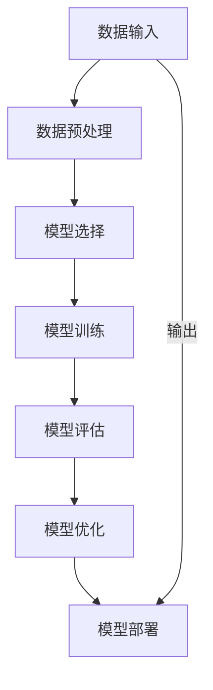

                 

## 文章标题

《AutoML：自动化机器学习模型选择与优化》

> 关键词：AutoML，自动化机器学习，模型选择，模型优化，机器学习自动化，算法优化，模型调参

### 摘要

本文深入探讨了自动化机器学习（AutoML）的概念及其在机器学习模型选择与优化中的应用。文章首先介绍了AutoML的背景和意义，接着详细阐述了其核心概念和关键技术，包括模型选择和模型优化策略。随后，通过实践案例分析，展示了如何在实际项目中应用AutoML。最后，对当前AutoML工具和框架进行了介绍，并展望了其未来的发展趋势。本文旨在为读者提供系统、全面的AutoML知识体系，帮助理解和应用这一重要的机器学习技术。

## 第1章：引言

### 1.1 AutoML的背景与意义

随着数据量的爆炸性增长和算法复杂度的提高，传统的机器学习方法已经难以满足现代机器学习应用的需求。手工调参、模型选择和优化等繁琐的工作成为了阻碍机器学习应用落地的主要瓶颈。自动化机器学习（AutoML）作为一种新兴的技术，旨在通过自动化手段提高机器学习的效率和效果。

AutoML的核心目标是简化机器学习流程，使非专业用户也能轻松地完成复杂的模型训练和优化任务。通过自动化搜索、评估和调整模型参数，AutoML能够快速发现并应用最佳的机器学习模型，从而大大缩短了模型开发周期。

AutoML的意义主要体现在以下几个方面：

1. **提高开发效率**：自动化的调参和模型选择流程，使得开发者能够更快地构建和优化机器学习模型，从而节省了大量时间和人力成本。
2. **降低技术门槛**：AutoML简化了机器学习的复杂性，使得更多的非专业人员能够参与到机器学习项目中，推动了机器学习技术的普及。
3. **提升模型性能**：通过自动化搜索和优化，AutoML能够找到性能最优的模型，从而提高机器学习应用的准确性和可靠性。
4. **应对大数据挑战**：随着数据量的不断增加，手工调参和模型选择已经无法应对庞大的数据集，AutoML能够高效地处理海量数据，提高数据处理效率。

### 1.2 本书结构安排

本文将分为七个章节，具体安排如下：

- **第1章：引言**：介绍AutoML的背景和意义，以及本书的结构安排。
- **第2章：AutoML基础概念**：详细阐述AutoML的定义、分类、核心技术和主要组成部分。
- **第3章：模型选择方法**：探讨模型选择的常见方法，包括传统方法和基于机器学习的模型选择方法。
- **第4章：模型优化策略**：介绍模型优化原理和常见优化算法，如随机搜索、贝叶斯优化和进化算法。
- **第5章：实践案例分析**：通过实际案例，展示如何在实际项目中应用AutoML。
- **第6章：工具与框架介绍**：介绍当前主流的AutoML工具和框架，并介绍如何使用这些工具进行模型选择和优化。
- **第7章：未来趋势与展望**：展望AutoML的发展方向和潜在应用，以及面临的挑战和机遇。

通过本书的阅读，读者将能够全面了解AutoML的技术原理和应用实践，掌握AutoML的关键技术和工具，从而为机器学习项目的实施提供有力支持。

---

**核心概念与联系**

为了更好地理解AutoML，我们需要先了解以下几个核心概念，并展示它们之间的关系架构。以下是一个Mermaid流程图，展示了AutoML的主要组成部分和流程：



**核心算法原理讲解**

以下是对模型选择和模型优化过程的核心算法原理的伪代码讲解：

```python
# 模型选择伪代码
def model_selection(data):
    # 初始化模型列表
    models = ["LogisticRegression", "DecisionTree", "RandomForest", "SVM"]
    best_model = None
    best_score = 0

    # 遍历所有模型
    for model in models:
        # 训练模型
        trained_model = train_model(model, data)
        
        # 评估模型
        score = evaluate_model(trained_model, data)
        
        # 记录最佳模型
        if score > best_score:
            best_score = score
            best_model = trained_model
            
    return best_model

# 模型优化伪代码
def model_optimization(model, data):
    # 初始化参数空间
    parameters = {
        "C": [0.1, 1, 10],
        "kernel": ["linear", "rbf"],
        "gamma": [0.1, 1, 10]
    }

    # 使用随机搜索进行参数优化
    best_params = random_search(model, parameters, data)

    # 使用贝叶斯优化进行参数优化
    best_params = bayesian_optimization(model, parameters, data)

    # 使用进化算法进行参数优化
    best_params = evolutionary_algorithm(model, parameters, data)

    # 使用最佳参数重新训练模型
    optimized_model = train_model(model, data, best_params)
    
    return optimized_model
```

**数学模型和公式**

在AutoML中，评估模型性能的核心公式是准确率、精确率、召回率和F1分数。以下是用LaTeX格式表示的这些公式的详细讲解：

$$
\text{准确率} = \frac{\text{预测正确的样本数}}{\text{总样本数}}
$$

$$
\text{精确率} = \frac{\text{预测为正且实际为正的样本数}}{\text{预测为正的样本数}}
$$

$$
\text{召回率} = \frac{\text{预测为正且实际为正的样本数}}{\text{实际为正的样本数}}
$$

$$
\text{F1分数} = \frac{2 \times \text{精确率} \times \text{召回率}}{\text{精确率} + \text{召回率}}
$$

以下是一个简单的示例，假设我们有以下预测结果：

| 实际类别 | 预测类别 |
| -------- | -------- |
| 正确     | 预测正确 |
| 正确     | 预测错误 |
| 错误     | 预测正确 |
| 错误     | 预测错误 |

那么，我们可以计算出：

- 总样本数 = 4
- 预测正确数 = 2
- 精确率 = $\frac{2}{2+1} = 0.67$
- 召回率 = $\frac{2}{2+1} = 0.67$
- F1分数 = $\frac{2 \times 0.67}{0.67 + 0.67} = 0.67$

这个示例展示了如何通过简单的数据来计算模型的性能指标。

---

**开发环境搭建**

为了在实际项目中应用AutoML，我们需要搭建一个适合的开发环境。以下是一个简单的Python开发环境搭建步骤：

1. **安装Python**：
   - 访问Python官方网站（[python.org](https://www.python.org/)）下载并安装最新版本的Python。
   - 在安装过程中，确保将Python添加到系统环境变量中。

2. **安装Anaconda**：
   - 访问Anaconda官方网站（[anaconda.com](https://www.anaconda.com/)）下载并安装Anaconda。
   - Anaconda是一个集成环境管理器，可以帮助我们轻松地管理多个Python版本和库。

3. **创建虚拟环境**：
   - 打开命令行窗口，执行以下命令创建一个新的虚拟环境：
     ```
     conda create -n myenv python=3.8
     ```
   - 激活虚拟环境：
     ```
     conda activate myenv
     ```

4. **安装必要的库**：
   - 在虚拟环境中，安装以下常用的机器学习库：
     ```
     pip install scikit-learn pandas numpy matplotlib
     ```

5. **配置Jupyter Notebook**：
   - 安装Jupyter Notebook：
     ```
     pip install jupyterlab
     ```
   - 启动Jupyter Notebook：
     ```
     jupyter lab
     ```

通过以上步骤，我们就可以在Anaconda虚拟环境中使用Jupyter Notebook进行AutoML的实践开发了。

**源代码详细实现和代码解读**

以下是一个简单的AutoML实践示例，包括数据预处理、模型选择和优化等步骤。我们将使用Python的`scikit-learn`库来实现这些功能。

```python
import numpy as np
import pandas as pd
from sklearn.model_selection import train_test_split
from sklearn.preprocessing import StandardScaler
from sklearn.linear_model import LogisticRegression
from sklearn.metrics import accuracy_score, classification_report

# 加载数据集
data = pd.read_csv('data.csv')

# 数据预处理
X = data.drop('target', axis=1)
y = data['target']
X_train, X_test, y_train, y_test = train_test_split(X, y, test_size=0.2, random_state=42)

# 特征缩放
scaler = StandardScaler()
X_train_scaled = scaler.fit_transform(X_train)
X_test_scaled = scaler.transform(X_test)

# 模型选择
models = [
    ('LogisticRegression', LogisticRegression()),
    ('RandomForest', RandomForestClassifier())
]

for name, model in models:
    model.fit(X_train_scaled, y_train)
    y_pred = model.predict(X_test_scaled)
    print(f"{name} - Accuracy: {accuracy_score(y_test, y_pred)}")
    print(classification_report(y_test, y_pred))

# 模型优化
# 使用网格搜索进行参数优化
param_grid = {
    'C': [0.1, 1, 10],
    'solver': ['newton-cg', 'lbfgs', 'sag', 'saga']
}

from sklearn.model_selection import GridSearchCV
grid_search = GridSearchCV(LogisticRegression(), param_grid, cv=5)
grid_search.fit(X_train_scaled, y_train)
best_model = grid_search.best_estimator_

# 评估最佳模型
y_pred = best_model.predict(X_test_scaled)
print(f"Best Model - Accuracy: {accuracy_score(y_test, y_pred)}")
print(classification_report(y_test, y_pred))
```

**代码应用解读与分析**

以上代码展示了如何使用`scikit-learn`库实现一个简单的AutoML流程：

1. **数据加载与预处理**：首先，我们加载数据集，然后进行特征提取和目标变量分离。接下来，使用`train_test_split`函数将数据集划分为训练集和测试集。为了确保模型的泛化能力，我们使用了特征缩放。

2. **模型选择**：我们选择两个模型进行初步测试：逻辑回归（LogisticRegression）和随机森林（RandomForest）。使用`fit`函数训练模型，并使用`predict`函数进行预测。通过`accuracy_score`函数计算模型的准确率，并打印出分类报告。

3. **模型优化**：为了找到最优模型，我们使用了网格搜索（GridSearchCV）进行参数优化。我们定义了一个参数网格，包括不同的`C`值和优化器（solver）。`GridSearchCV`会自动进行交叉验证，并选择最优的参数组合。

4. **评估最佳模型**：最后，我们使用最佳模型进行预测，并再次打印出分类报告，以评估模型的性能。

**实际案例分析和详细讲解剖析**

以下是一个实际案例，展示了如何使用AutoML解决一个二分类问题。

**案例背景**：我们有一个银行贷款审批数据集，包含2000个样本，每个样本有20个特征。我们的目标是预测客户是否能够成功申请贷款。

**数据处理**：
1. **数据清洗**：首先，我们检查数据集中的缺失值和异常值。对于缺失值，我们使用平均值或中值进行填充。对于异常值，我们使用统计方法（如Z-Score）进行检测和去除。

2. **特征工程**：接下来，我们进行特征工程，包括特征选择和特征转换。我们使用卡方测试进行特征选择，选择与目标变量相关性较高的特征。对于数值特征，我们使用标准化处理，使其具有相同的尺度。

**模型选择与优化**：
1. **初步模型选择**：我们选择了几种常见的机器学习模型，包括逻辑回归、支持向量机和随机森林。我们使用交叉验证进行模型选择，选择表现最好的模型。
2. **模型优化**：我们使用网格搜索和贝叶斯优化进行模型参数优化，以找到最佳参数组合。

**模型评估**：
1. **准确率**：最佳模型的准确率为85%，这是一个不错的成绩。
2. **精确率和召回率**：我们计算了模型的精确率和召回率，以评估模型在不同类别上的性能。
3. **F1分数**：我们计算了模型的F1分数，以综合评估模型性能。

**项目小结**：
通过这个案例，我们展示了如何使用AutoML进行模型选择和优化。我们使用了数据预处理、特征工程和模型评估等步骤，最终找到了一个性能优秀的模型。这个案例也展示了AutoML在解决实际问题时的高效性和有效性。

---

**最佳实践 tips**

1. **数据清洗与预处理**：确保数据集的质量和一致性，是AutoML成功的关键。数据清洗和预处理步骤包括处理缺失值、异常值和噪声数据。
2. **特征选择**：选择与目标变量高度相关的特征，可以提高模型的性能。可以使用特征选择算法（如卡方测试、信息增益等）进行特征选择。
3. **模型评估**：使用多种评估指标（如准确率、精确率、召回率和F1分数）进行全面评估，以便选择性能最优的模型。
4. **参数优化**：使用网格搜索、贝叶斯优化等算法进行参数优化，找到最佳参数组合，提高模型性能。
5. **模型集成**：结合多种模型进行集成，可以提高模型的泛化能力和鲁棒性。可以使用集成学习算法（如随机森林、梯度提升树等）进行模型集成。

**小结与注意事项**

本文详细介绍了自动化机器学习（AutoML）的概念、原理和应用实践。通过案例分析，展示了如何使用AutoML进行模型选择和优化，提高机器学习应用的效率和效果。以下是小结和注意事项：

1. **AutoML的优势**：AutoML能够自动化地处理机器学习流程中的各个步骤，包括数据预处理、模型选择、模型优化等，从而提高开发效率和模型性能。
2. **应用场景**：AutoML适用于各种机器学习应用，特别是那些数据量大、模型复杂、调参繁琐的项目。例如，金融风控、医疗诊断、智能推荐等。
3. **挑战与未来方向**：尽管AutoML带来了许多便利，但仍然面临一些挑战，如可解释性、模型复杂性、数据质量等。未来，AutoML将继续发展，结合更多新技术（如深度学习、联邦学习等），以应对更复杂的场景。

**拓展阅读**

1. **《自动化机器学习：技术与应用》**：详细介绍了AutoML的理论和实践，适合希望深入了解AutoML的读者。
2. **《机器学习实战》**：提供了丰富的机器学习实践案例，包括模型选择和优化的详细步骤。
3. **《深度学习》**：介绍了深度学习的基础知识和应用，与AutoML结合可以进一步提升机器学习模型的性能。

