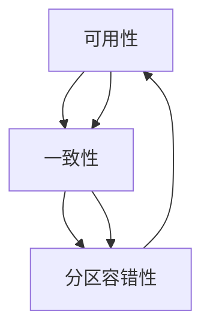

                 

### 文章标题

# CAP理论在分布式系统中的应用

### 关键词

- CAP理论
- 分布式系统
- 一致性
- 可用性
- 分区容错性
- Paxos算法
- Raft算法

### 摘要

本文深入探讨了CAP理论在分布式系统中的应用。首先，我们介绍了CAP理论的核心概念，即一致性、可用性和分区容错性，并分析了它们之间的关系。接着，我们详细讲解了CAP理论的基本原理，包括如何在分布式系统中实现CAP平衡，以及在何种场景下优先考虑某个CAP属性。随后，我们介绍了与CAP理论相关的核心算法，如Paxos算法和Raft算法，并使用伪代码进行了详细阐述。文章还引入了数学模型和公式，对分布式系统的一致性、可用性和分区容错性进行了定量分析。最后，通过实际案例展示了CAP理论在分布式系统项目中的应用，包括开发环境搭建、源代码实现和代码解读。本文旨在为读者提供关于CAP理论在分布式系统中的全面理解，帮助他们在实际项目中更好地应用这一重要理论。

----------------------------------------------------------------

## 引言

### 研究背景与意义

随着互联网技术的飞速发展，分布式系统已成为现代计算机系统的重要组成部分。分布式系统通过将计算任务分布在多个节点上，提高了系统的可扩展性和容错能力，满足了大规模数据处理和通信的需求。然而，分布式系统的设计和实现面临诸多挑战，其中最为关键的便是如何保证系统的一致性、可用性和分区容错性。

一致性（Consistency）是指系统在不同节点上的数据状态保持一致。在分布式系统中，一致性是保证数据正确性的基础，例如，在银行系统中，账户余额在不同服务器上应保持一致。可用性（Availability）是指系统能够在请求时及时响应用户，例如，在电子商务平台中，用户下单后应能够立即得到响应。分区容错性（Partition Tolerance）是指系统能够在出现网络分区时继续运行，例如，在分布式存储系统中，即使部分节点发生故障，系统仍能正常运行。

CAP理论（Consistency, Availability, Partition Tolerance）由加州大学伯克利分校的Eric Brewer于2000年提出，揭示了分布式系统在一致性、可用性和分区容错性三者之间无法同时达到完美平衡的矛盾。这一理论不仅对分布式系统的研究产生了深远影响，也为分布式系统的设计和实现提供了重要的理论指导。

本文旨在深入探讨CAP理论在分布式系统中的应用，通过详细阐述CAP理论的核心概念、原理、算法和实际案例，帮助读者全面理解CAP理论，并在实际项目中更好地应用这一理论。

### 核心概念与联系

CAP理论的核心在于一致性（Consistency）、可用性（Availability）和分区容错性（Partition Tolerance）这三个关键概念，以及它们之间的关系。

**一致性（Consistency）**：一致性是指分布式系统在多个节点上的数据状态保持一致。这意味着，当某个节点对数据进行了修改后，其他所有节点在一段时间后都能看到这一修改结果。一致性是分布式系统中最为关键的要求之一，因为许多应用依赖于数据的一致性来确保其正确性。例如，在银行系统中，账户余额的一致性是确保交易准确性的基础。

**可用性（Availability）**：可用性是指分布式系统在接收到请求时能够及时响应用户。一个高度可用性的系统应能够在任何时刻响应用户的需求，不会因为某些节点的故障而导致整体系统不可用。高可用性是许多分布式系统（如电子商务平台、社交媒体等）的关键要求，因为用户的体验直接依赖于系统的响应速度。

**分区容错性（Partition Tolerance）**：分区容错性是指系统在出现网络分区时仍能继续运行的能力。网络分区指的是系统中的一部分节点由于网络故障无法与其他节点通信。具有高分区容错性的系统可以在面对网络分区时继续提供服务，而不会因为部分节点的故障导致整个系统崩溃。

CAP理论指出，在分布式系统中，一致性、可用性和分区容错性三者之间是相互矛盾的。即一个分布式系统只能在三者中选择其二。具体来说：

- **一致性（C）和可用性（A）**：如果一个分布式系统在所有时间点都能保证一致性，那么它可能无法保证高可用性。例如，在某些一致性协议中，为了确保数据的一致性，系统可能会在某些情况下暂时拒绝某些请求。
- **一致性（C）和分区容错性（P）**：如果一个分布式系统在所有时间点都能保证分区容错性，那么它可能无法保证一致性。例如，在面临网络分区时，系统可能无法确保所有节点都能同时看到最新的数据。
- **可用性（A）和分区容错性（P）**：如果一个分布式系统在所有时间点都能保证高可用性，那么它可能无法保证分区容错性。例如，在某些情况下，为了确保系统的可用性，系统可能会允许部分节点的故障，从而导致数据不一致。

### CAP关系与联系

理解CAP理论的关键在于认识一致性、可用性和分区容错性三者之间的关系。以下是一个使用Mermaid绘制的流程图，展示了它们之间的相互关系：



在这个流程图中，箭头表示一个属性对另一个属性的影响。例如，从“可用性”指向“一致性”的箭头表示，高可用性可能会影响一致性。这意味着在追求高可用性的分布式系统中，一致性可能需要做出一定的妥协。

通过这个流程图，我们可以更直观地理解CAP理论的核心思想：在分布式系统中，一致性和可用性是相互制约的，而分区容错性则是这两者之间的权衡。

### 第1章 总结与展望

在本章中，我们介绍了CAP理论的研究背景和意义，详细阐述了CAP理论的核心概念（一致性、可用性和分区容错性）及其相互关系。通过Mermaid流程图，我们直观地展示了这三个概念之间的复杂关系。本章为后续章节的深入探讨奠定了基础，使读者能够更好地理解CAP理论的基本原理。

在接下来的章节中，我们将进一步分析CAP理论在分布式系统中的应用，包括核心算法的原理讲解、数学模型和公式的引入，以及实际项目的应用案例。通过这些内容，读者将能够全面了解CAP理论，并学会在实际项目中应用这一重要理论。

## 第2章 核心概念与联系

### 一致性（Consistency）

一致性是分布式系统中的一个核心概念，指的是系统在不同节点上的数据状态保持一致。在分布式系统中，数据通常会分布在多个节点上，以提高系统的可用性和容错能力。然而，这种分布式存储方式可能会导致数据一致性问题。一致性确保了当多个节点对同一份数据进行修改时，所有节点最终都能看到正确的、一致的版本。

一致性可以分为几种不同的级别，其中最常见的是线性一致性（Linear Consistency）和最终一致性（Eventual Consistency）。

**线性一致性**：线性一致性是最强的一致性保证，它要求当一个操作成功完成后，所有其他操作在任意时刻都能看到该操作的结果。在分布式系统中实现线性一致性通常需要强一致性协议，如两阶段提交（2PC）或Paxos算法。

**最终一致性**：最终一致性是一种较弱的一致性保证，它不要求所有节点立即看到所有操作的结果，但最终所有节点的状态会达到一致。在实现最终一致性时，系统可以容忍一定的时间延迟，但需要确保最终的一致性会得到实现。

在分布式系统中，一致性是一个至关重要的需求，因为它直接影响数据的正确性和应用的可靠性。例如，在电子商务系统中，订单信息的一致性至关重要，以确保用户看到的是最新的订单状态。一致性不仅影响用户体验，还关系到业务决策和财务报告的准确性。

### 可用性（Availability）

可用性是分布式系统的另一个关键属性，指的是系统在接收到请求时能够及时响应用户。高可用性系统在面临各种故障和负载时都能保持良好的响应能力。可用性可以通过多种方式实现，例如冗余设计、负载均衡和故障转移。

**冗余设计**：通过在系统中引入冗余组件，可以提高系统的可用性。冗余设计包括硬件冗余（如使用多个服务器）和软件冗余（如使用备份和镜像）。当某个组件发生故障时，冗余组件可以立即接管其工作，从而保证系统的持续运行。

**负载均衡**：负载均衡是一种通过将请求分配到多个服务器上来提高系统可用性的技术。通过负载均衡，系统可以有效地处理大量并发请求，避免单个服务器过载。负载均衡还可以提高系统的弹性，使系统在面对突发流量时能够保持良好的性能。

**故障转移**：故障转移是一种在主服务器发生故障时自动将工作转移到备用服务器上的技术。在分布式系统中，主服务器通常负责处理核心任务，如数据读写操作。当主服务器发生故障时，备用服务器会立即接管其工作，确保系统持续运行。

高可用性是许多分布式系统（如电子商务平台、社交媒体等）的关键需求，因为它直接影响用户体验和业务连续性。然而，高可用性通常需要额外的成本和复杂性，因此在设计系统时需要在可用性和一致性之间进行权衡。

### 分区容错性（Partition Tolerance）

分区容错性是分布式系统的第三个核心属性，指的是系统能够在出现网络分区时继续运行的能力。网络分区是指系统中的一部分节点由于网络故障无法与其他节点通信。分区容错性确保了在出现网络分区时，系统仍能保持一定的可用性，不会因为部分节点的故障而导致整个系统崩溃。

**分区容错性的重要性**：在分布式系统中，网络分区是一种常见且不可避免的情况。由于网络的不稳定性和大规模节点的分布，网络分区可能会频繁发生。分区容错性是确保系统高可用性和容错性的关键因素。具有高分区容错性的系统能够在面临网络分区时继续提供基本的服务，从而确保系统的连续运行。

**实现分区容错性的方法**：实现分区容错性的方法主要包括以下几种：

1. **去中心化架构**：通过去中心化的架构，系统中的节点之间没有明确的中心节点，从而避免了单点故障。每个节点都可以独立处理请求，并与其他节点协作，确保系统的整体可用性。

2. **多活架构**：多活架构是一种在分布式系统中同时运行多个副本的技术。这些副本可以在不同的数据中心或节点上运行，当某个副本发生故障时，其他副本可以立即接管其工作，确保系统的连续运行。

3. **版本控制和冲突解决**：在分布式系统中，多个节点可能会同时修改同一份数据。为了确保数据的一致性，系统需要实现版本控制和冲突解决机制。版本控制可以记录每个数据的版本号，而冲突解决机制可以确保在多个节点修改同一数据时，系统能够正确处理冲突，从而保证数据的一致性。

**分区容错性与一致性和可用性的关系**：分区容错性、一致性和可用性之间存在着紧密的关系。分区容错性是确保系统在面临网络分区时仍能保持一定可用性的关键因素。然而，分区容错性可能会影响一致性和可用性。例如，在实现分区容错性的过程中，系统可能需要做出一定的妥协，以确保在面临网络分区时能够继续提供服务。

### CAP关系与联系

CAP理论（Consistency, Availability, Partition Tolerance）揭示了分布式系统中一致性、可用性和分区容错性三者之间的矛盾。具体来说，CAP理论指出，在分布式系统中，一个系统只能在一致性、可用性和分区容错性三者中选择其二。即一个系统无法同时保证一致性、可用性和分区容错性。

**CAP定理**：CAP定理是由加州大学伯克利分校的Eric Brewer在2000年提出的。该定理指出，在分布式系统中，一致性、可用性和分区容错性三者之间无法同时达到完美平衡。具体来说：

1. **一致性（C）和可用性（A）**：一个分布式系统无法在所有时间点同时保证一致性和可用性。如果系统在某个时刻保证了一致性，它可能无法在同一个时刻保证可用性。例如，当系统中的某个节点正在处理一致性操作时，其他节点可能无法立即响应。

2. **一致性（C）和分区容错性（P）**：一个分布式系统无法在所有时间点同时保证一致性和分区容错性。如果系统在某个时刻保证了分区容错性，它可能无法在同一个时刻保证一致性。例如，在面临网络分区时，系统可能无法确保所有节点都能同时看到最新的数据。

3. **可用性（A）和分区容错性（P）**：一个分布式系统无法在所有时间点同时保证可用性和分区容错性。如果系统在某个时刻保证了高可用性，它可能无法在同一个时刻保证分区容错性。例如，为了确保系统的可用性，系统可能需要允许部分节点的故障。

CAP定理为分布式系统的设计和实现提供了重要的指导。在实际项目中，系统设计者需要根据具体的应用需求和场景，在一致性、可用性和分区容错性之间做出权衡，选择最合适的策略。

### 一致性、可用性和分区容错性的权衡

在分布式系统的设计和实现过程中，一致性、可用性和分区容错性是三个核心属性，但它们之间存在着相互矛盾的关系。系统设计者需要在这些属性之间做出权衡，以满足具体应用的需求。

**一致性（C）与可用性（A）的权衡**：

1. **强一致性**：如果系统在所有时间点都保证强一致性，它可能无法在同一个时刻保证高可用性。例如，在分布式数据库系统中，使用两阶段提交（2PC）或Paxos算法可以实现强一致性，但这些算法可能会在某些情况下拒绝请求，从而影响系统的可用性。

2. **最终一致性**：最终一致性是一种较弱的一致性保证，它允许系统在一定时间内达到一致性。这种一致性模型可以提高系统的可用性，因为系统可以在处理请求时不必等待所有节点的一致性操作完成。然而，最终一致性可能导致数据在一段时间内不一致。

**一致性（C）与分区容错性（P）的权衡**：

1. **分区容错性**：为了实现分区容错性，系统可能需要在一致性方面做出一定的妥协。例如，在分布式存储系统中，采用去中心化架构可以实现分区容错性，但可能会导致数据的一致性降低。

2. **一致性协议**：使用一致性协议（如Paxos或Raft）可以实现一致性，但可能需要牺牲一定的分区容错性。例如，Paxos算法可以实现一致性，但需要在面临网络分区时暂停某些操作。

**可用性（A）与分区容错性（P）的权衡**：

1. **高可用性**：为了实现高可用性，系统可能需要允许部分节点的故障，这可能会导致系统的一致性降低。例如，在分布式数据库系统中，使用主从复制可以实现高可用性，但主节点可能会因为故障而无法正常工作。

2. **分区容错性**：具有高分区容错性的系统可以在面临网络分区时继续运行，但可能需要牺牲一定的可用性。例如，在分布式缓存系统中，采用多活架构可以实现分区容错性，但可能会导致系统的性能下降。

在实际应用中，系统设计者需要根据具体的应用场景和需求，在一致性、可用性和分区容错性之间做出权衡。以下是一个示例：

- **金融系统**：在金融系统中，数据的一致性至关重要，因为错误的交易可能会导致重大的财务损失。因此，金融系统通常会优先考虑一致性，即使这可能会影响系统的可用性和分区容错性。

- **社交媒体平台**：在社交媒体平台上，用户体验和响应速度是关键因素。因此，这些系统通常会优先考虑可用性，即使在某些情况下可能需要牺牲一致性。

- **分布式存储系统**：在分布式存储系统中，分区容错性是确保系统可靠性的关键。因此，这些系统通常会优先考虑分区容错性，即使在某些情况下可能需要牺牲一致性和可用性。

### 总结

在本章中，我们详细介绍了分布式系统中的核心概念——一致性、可用性和分区容错性，并分析了它们之间的相互关系。一致性确保了系统在不同节点上的数据状态保持一致，可用性保证了系统在接收到请求时能够及时响应用户，而分区容错性则确保了系统在出现网络分区时仍能继续运行。

CAP理论揭示了这三个属性之间的矛盾，指出在分布式系统中，一个系统无法同时保证一致性、可用性和分区容错性。在实际应用中，系统设计者需要根据具体的应用场景和需求，在这些属性之间做出权衡，以满足系统的整体性能和可靠性。

在下一章中，我们将进一步探讨CAP理论的基本原理，包括如何在分布式系统中实现CAP平衡，以及在何种场景下优先考虑某个CAP属性。通过这些内容，读者将能够更深入地理解CAP理论，并在实际项目中更好地应用这一重要理论。

### 第2章 总结与展望

在本章中，我们详细探讨了分布式系统中的核心概念——一致性、可用性和分区容错性，并分析了它们之间的相互关系。通过引入CAP理论，我们揭示了这三个属性之间的矛盾，并指出了在分布式系统中，一个系统无法同时保证一致性、可用性和分区容错性。

我们首先介绍了一致性、可用性和分区容错性的定义，并解释了它们在分布式系统中的重要性。接着，我们深入分析了CAP定理，探讨了CAP平衡的实现方法，以及在特定场景下如何优先考虑某个CAP属性。此外，我们还讨论了在一致性、可用性和分区容错性之间的权衡，并举例说明了不同应用场景下的优先级选择。

通过本章的学习，读者应能够理解分布式系统中的核心概念，掌握CAP理论的基本原理，并能够在实际项目中根据具体需求做出合理的CAP平衡决策。

在下一章中，我们将进一步深入探讨CAP理论的应用，介绍与CAP理论相关的核心算法，如Paxos算法和Raft算法，并使用伪代码详细解释这些算法的工作原理。我们将通过数学模型和公式，对分布式系统的一致性、可用性和分区容错性进行定量分析，帮助读者更好地理解这些概念。同时，我们还将通过实际案例，展示如何在实际项目中应用CAP理论，为读者提供宝贵的实战经验。

## 第3章 CAP理论原理讲解

### CAP理论基本原理

CAP理论由加州大学伯克利分校的Eric Brewer于2000年首次提出，揭示了分布式系统在一致性（Consistency）、可用性（Availability）和分区容错性（Partition Tolerance）三者之间无法同时达到完美平衡的矛盾。CAP理论的核心思想是，在任何分布式系统中，这三个属性中，一个系统只能同时保证两个。

**CAP定理**：CAP定理指出，在分布式系统中，一致性、可用性和分区容错性三者之间是互斥的，即一个系统无法在所有时间点同时保证这三个属性。具体来说：

1. **一致性（C）和可用性（A）**：一个分布式系统无法在所有时间点同时保证一致性和可用性。在某些情况下，系统可能需要牺牲一致性来确保可用性，例如，在分布式数据库系统中，某些一致性协议可能会拒绝一些客户端的请求，以确保系统能够快速响应。

2. **一致性（C）和分区容错性（P）**：一个分布式系统无法在所有时间点同时保证一致性和分区容错性。在面临网络分区时，系统可能需要牺牲一致性来确保分区容错性，例如，分布式系统可能会选择某些节点的数据作为最终数据，而不是等待所有节点的数据同步。

3. **可用性（A）和分区容错性（P）**：一个分布式系统无法在所有时间点同时保证可用性和分区容错性。在面临网络故障时，系统可能需要牺牲部分节点的可用性来确保整体系统的分区容错性，例如，分布式缓存系统可能会选择将缓存数据存储在部分可用节点上，以确保系统能够继续运行。

### CAP理论在分布式系统中的应用

CAP理论在分布式系统中的应用非常广泛，以下是一些典型的应用场景：

1. **分布式数据库**：在分布式数据库系统中，CAP理论的应用尤为突出。例如，Google的Bigtable和Apache Cassandra都采用了CAP理论，优先保证分区容错性和可用性，而不是一致性。这种设计使得这些系统可以在面对网络分区和故障时保持良好的性能和可用性，但可能会导致数据的一致性问题。

2. **分布式缓存**：分布式缓存系统通常采用CAP理论，以实现高可用性和分区容错性。例如，Memcached和Redis都采用了去中心化的架构，以最大化可用性和分区容错性。虽然这种设计可能导致数据不一致，但在许多应用场景中，这种不一致性是可以容忍的。

3. **分布式存储**：分布式存储系统，如Google File System（GFS）和Hadoop Distributed File System（HDFS），采用了CAP理论，优先保证分区容错性和可用性。这些系统通过复制和分区的策略，确保在部分节点故障时，系统仍能正常运行。

### CAP平衡策略

在实际应用中，CAP平衡策略是系统设计者需要仔细考虑的问题。以下是一些常见的CAP平衡策略：

1. **强一致性 vs. 最终一致性**：在分布式数据库系统中，系统设计者可以根据具体需求选择强一致性或最终一致性。强一致性确保数据在所有时间点都保持一致，但可能影响系统的可用性。最终一致性允许数据在一段时间内不一致，但可以提高系统的可用性。

2. **可用性 vs. 分区容错性**：在某些场景中，系统设计者可能需要优先保证可用性，即使在部分节点故障的情况下，系统仍能正常运行。而在其他场景中，系统设计者可能更关注分区容错性，即使这可能导致部分节点的可用性降低。

3. **一致性 vs. 性能**：在某些情况下，系统设计者可能需要牺牲一致性来提高系统性能。例如，在分布式缓存系统中，可能会采用一致性较低的缓存策略，以提高缓存数据的读写速度。

### CAP平衡案例分析

以下是一个CAP平衡案例：

**案例：分布式社交网络平台**

某分布式社交网络平台需要处理大量用户数据，包括用户信息、朋友圈更新、消息等。为了确保平台的可用性和分区容错性，该平台采用了CAP理论，以下是其CAP平衡策略：

1. **一致性**：平台选择了最终一致性模型，允许数据在一段时间内不一致。这是因为平台的首要目标是确保用户能够随时访问和查看最新的朋友圈更新，即使某些数据在一段时间内不一致，用户也能快速得到响应。

2. **可用性**：平台采用了去中心化的架构，确保在部分节点故障时，平台仍能正常运行。平台还采用了负载均衡技术，将用户请求均匀分布到不同的节点上，以提高系统的响应速度和可用性。

3. **分区容错性**：平台采用了多活架构，确保在面临网络分区时，系统仍能正常运行。平台通过在多个数据中心部署节点，实现了较高的分区容错性。

通过这个案例，我们可以看到，CAP平衡策略在分布式系统设计中的应用。平台设计者根据具体需求和场景，选择了最终一致性、高可用性和分区容错性，实现了CAP平衡。

### 不同场景下的CAP优先级

在分布式系统中，根据具体应用场景和需求，系统设计者可以优先考虑某个CAP属性。以下是一些常见场景下的CAP优先级：

1. **金融系统**：在金融系统中，数据的一致性至关重要。由于金融交易需要保证准确性，系统设计者通常会优先考虑一致性，即使在某些情况下可能需要牺牲可用性和分区容错性。

2. **电子商务平台**：在电子商务平台中，用户体验和响应速度是关键因素。系统设计者通常会优先考虑可用性，即使在某些情况下可能需要牺牲一致性和分区容错性。

3. **分布式存储系统**：在分布式存储系统中，分区容错性是确保系统可靠性的关键。系统设计者通常会优先考虑分区容错性，即使在某些情况下可能需要牺牲一致性和可用性。

4. **社交媒体平台**：在社交媒体平台中，数据的一致性相对较低，因为用户可以容忍一定时间内的数据不一致。系统设计者通常会优先考虑可用性和分区容错性。

### 总结

在本章中，我们详细探讨了CAP理论的基本原理，包括CAP定理、CAP理论在分布式系统中的应用以及CAP平衡策略。我们通过实际案例展示了如何在不同场景下优先考虑某个CAP属性，并分析了不同场景下的CAP优先级。通过本章的学习，读者应能够理解CAP理论的基本原理，并在实际项目中根据具体需求进行CAP平衡。

在下一章中，我们将进一步介绍与CAP理论相关的核心算法，如Paxos算法和Raft算法，并使用伪代码详细解释这些算法的工作原理。通过这些算法，读者将能够更深入地理解CAP理论在分布式系统中的应用。

### Paxos算法

Paxos算法是一种分布式一致性算法，由莱斯利·兰伯特（Leslie Lamport）于1990年提出。Paxos算法旨在解决分布式系统中的一致性问题，即使在面临网络延迟、故障和分区的情况下，也能确保所有副本达成一致。Paxos算法被广泛应用于分布式数据库、分布式缓存和分布式存储系统，是CAP理论的一个重要实现。

**Paxos算法的核心思想**：

Paxos算法通过一个称为“提议者-学习者-准备者”的架构来保证一致性。核心概念包括：

- **提议者（Proposer）**：负责生成提议值。
- **学习者（Learner）**：负责学习提议值。
- **准备者（Prepare）**：负责准备提议值。

**Paxos算法的步骤**：

1. **准备阶段**：
   - 提议者选择一个提案值（提案号和提案值）。
   - 提议者向所有准备者发送准备请求，包含提案号和提案值。
   - 准备者收到准备请求后，向提议者回复一个准备确认消息，表明已准备好接收提案。

2. **接受阶段**：
   - 提议者在收到多数准备确认消息后，选择最高提案号和对应的提案值，并向所有学习者发送接受请求。
   - 学习者在收到接受请求后，学习该提案值，并通知其他学习者。

**Paxos算法的伪代码**：

```python
# Paxos算法伪代码

# 准备者
def prepare proposer_id, proposal_value:
    if proposal_value is None:
        proposal_value = current_value
    send_prepare_response(proposer_id, proposal_value)

# 提议者
def propose proposal_value:
    proposer_id = get_new_proposer_id()
    send_prepare_requests(proposal_value)
    collect_prepare_responses()
    if majority_prepare_responses_accepted(proposal_value):
        send_accept_request(proposal_value)
        collect_accept_responses()
        if majority_accept_responses_accepted(proposal_value):
            return proposal_value

# 学习者
def learn proposal_value:
    current_value = proposal_value
    send_learn_response(proposal_value)
```

通过上述伪代码，我们可以看到Paxos算法的基本步骤和交互过程。Paxos算法通过多次循环执行准备和接受阶段，确保最终达成一致性。

### Raft算法

Raft算法是一种基于Paxos算法的分布式一致性算法，由Diego Ongaro和John Ousterhout于2013年提出。Raft算法相对于Paxos算法在实现上更加简单、直观，更容易理解和实现。Raft算法通过将状态机简化为多个子组件，提高了算法的可靠性和可扩展性。

**Raft算法的核心思想**：

Raft算法将一致性状态机分为三个组件：领导者（Leader）、跟随者（Follower）和候选人（Candidate）。Raft算法的核心思想是通过领导者来管理日志条目的提交，并确保所有副本中的日志保持一致。

- **领导者（Leader）**：负责接收客户端请求、维护日志、同步日志到所有跟随者。
- **跟随者（Follower）**：负责接收领导者发送的日志条目，并同步日志。
- **候选人（Candidate）**：负责在领导者宕机时发起选举。

**Raft算法的步骤**：

1. **选举**：
   - 当一个跟随者超过一个选举超时时长，它会进入候选状态，并开始发起选举。
   - 候选人发送投票请求，并等待其他节点的投票响应。
   - 如果一个候选人获得了超过半数的投票，它将成为领导者。
   - 如果没有获得多数投票，候选人重新发起选举。

2. **日志同步**：
   - 领导者将日志条目同步到所有跟随者，确保所有副本中的日志一致。
   - 跟随者接收领导者的日志条目，并将其应用到本地状态机。

3. **日志提交**：
   - 领导者在日志条目提交后，通知所有跟随者。
   - 跟随者在收到领导者提交的日志条目后，也将日志条目应用到本地状态机。

**Raft算法的伪代码**：

```python
# Raft算法伪代码

# 跟随者
def append_entries(entry):
    if entry.term > current_term:
        current_term = entry.term
        if entry.is_leader:
            replicate_log(entry.entries)
    else:
        send_append_entries_response(entry)

# 领导者
def append_entries(entries):
    replicate_log(entries)
    send_entries_to_followers(entries)

# 候选人
def start_election():
    current_term += 1
    send_vote_request()
    collect_vote_responses()

def receive_vote_response(candidate_id, vote_granted):
    if vote_granted and majority_voted():
        become_leader()
```

通过上述伪代码，我们可以看到Raft算法的基本步骤和交互过程。Raft算法通过清晰的领导选举和日志同步机制，实现了分布式一致性。

### 其他CAP算法

除了Paxos算法和Raft算法，还有一些其他重要的CAP算法，如Viewstamped Replication和Optimistic Concurrency Control。

**Viewstamped Replication**：

Viewstamped Replication是由Mohammad-Reza Rastegar and Rajeev Motwani于1991年提出的一种分布式一致性算法。Viewstamped Replication通过在每个副本上添加版本号，实现了对Paxos算法的简化。核心思想是每个副本在接收提案时，都会附加一个版本号，并在提交提案时，确保所有副本的版本号一致。

**Optimistic Concurrency Control**：

Optimistic Concurrency Control是一种基于乐观假设的分布式一致性算法。乐观假设认为，大多数并发操作不会发生冲突。在Optimistic Concurrency Control中，系统允许多个副本同时执行操作，并在提交时检查是否发生了冲突。如果发生冲突，系统会回滚操作，并重新执行。

### 总结

在本章中，我们介绍了Paxos算法、Raft算法和其他重要的CAP算法，如Viewstamped Replication和Optimistic Concurrency Control。通过使用伪代码，我们详细阐述了这些算法的基本原理和实现步骤。这些算法在分布式系统中被广泛应用，帮助系统设计者实现分布式一致性。通过本章的学习，读者应能够理解CAP算法的核心思想，并在实际项目中应用这些算法。

在下一章中，我们将进一步介绍分布式系统中的数学模型和公式，对分布式系统的一致性、可用性和分区容错性进行定量分析，帮助读者更好地理解这些概念。

### 数学模型和公式

在分布式系统中，一致性、可用性和分区容错性是三个核心属性，但它们之间的关系并不直观。为了更好地理解和量化这些属性，我们可以使用数学模型和公式来描述。

#### 分布式一致性公式

一致性是指系统在不同节点上的数据状态保持一致。在分布式系统中，一致性可以分为多个级别，如线性一致性、最终一致性等。以下是一个用于描述分布式一致性的数学模型：

$$
C = \frac{1}{T}
$$

其中，\( C \) 表示一致性，\( T \) 表示系统达到一致性的时间。这个公式表明，系统的一致性与达到一致性所需的时间成反比。即系统达到一致性所需的时间越短，一致性越高。

例如，如果一个分布式系统在1秒内达到一致性，那么其一致性 \( C \) 为 \( \frac{1}{1} = 1 \)。相反，如果一个系统需要10秒才能达到一致性，那么其一致性 \( C \) 为 \( \frac{1}{10} = 0.1 \)。

#### 分布式可用性公式

可用性是指系统在接收到请求时能够及时响应用户的能力。可用性可以用以下公式描述：

$$
A = \frac{1}{F}
$$

其中，\( A \) 表示可用性，\( F \) 表示系统发生故障的频率。这个公式表明，系统的可用性与发生故障的频率成反比。即系统发生故障的频率越低，可用性越高。

例如，如果一个分布式系统在1小时内发生一次故障，那么其可用性 \( A \) 为 \( \frac{1}{1} = 1 \)。相反，如果一个系统在10分钟内发生一次故障，那么其可用性 \( A \) 为 \( \frac{1}{10} = 0.1 \)。

#### 分布式分区容错性公式

分区容错性是指系统在出现网络分区时仍能继续运行的能力。分区容错性可以用以下公式描述：

$$
P = \frac{N - M}{N}
$$

其中，\( P \) 表示分区容错性，\( N \) 表示系统中的节点总数，\( M \) 表示发生故障或分区节点的数量。这个公式表明，系统的分区容错性与发生故障或分区节点的数量成反比。即系统中的节点数量越多，分区容错性越高。

例如，如果一个分布式系统中有10个节点，其中5个节点发生故障，那么其分区容错性 \( P \) 为 \( \frac{10 - 5}{10} = 0.5 \)。相反，如果一个系统中有10个节点，且没有节点发生故障，那么其分区容错性 \( P \) 为 \( \frac{10 - 0}{10} = 1 \)。

### 举例说明

以下是一个具体的例子，用于说明上述公式的应用。

**例：一个分布式数据库系统**

假设一个分布式数据库系统有10个节点，其中5个节点发生故障。

1. **一致性（C）**：根据一致性公式，系统的一致性 \( C \) 为 \( \frac{1}{T} \)。假设系统在1小时内达到一致性，那么一致性 \( C \) 为 \( \frac{1}{1} = 1 \)。

2. **可用性（A）**：根据可用性公式，系统的可用性 \( A \) 为 \( \frac{1}{F} \)。假设系统在1小时内发生一次故障，那么可用性 \( A \) 为 \( \frac{1}{1} = 1 \)。

3. **分区容错性（P）**：根据分区容错性公式，系统的分区容错性 \( P \) 为 \( \frac{N - M}{N} \)。系统中有10个节点，其中5个节点发生故障，那么分区容错性 \( P \) 为 \( \frac{10 - 5}{10} = 0.5 \)。

通过这个例子，我们可以看到，系统的分区容错性相对较低，因为系统中有多达一半的节点发生故障。这表明，在分布式数据库系统中，为了保证较高的分区容错性，我们需要增加节点数量或采用其他容错机制。

### 总结

在本章中，我们介绍了分布式系统中的数学模型和公式，用于描述一致性、可用性和分区容错性。通过一致性公式、可用性公式和分区容错性公式，我们可以定量分析这些属性，并在实际项目中应用这些公式。通过本章的学习，读者应能够理解这些公式的基本原理，并在分布式系统设计中应用这些原理。

在下一章中，我们将通过实际案例，展示如何在实际项目中应用CAP理论，包括开发环境搭建、源代码实现和代码解读。通过这些案例，读者将能够更深入地理解CAP理论在分布式系统中的应用。

### 第5章 总结与展望

在本章中，我们详细介绍了分布式系统中的数学模型和公式，用于描述一致性、可用性和分区容错性。通过一致性公式、可用性公式和分区容错性公式，我们能够定量分析这些属性，并在实际项目中应用这些公式。这些数学模型和公式为我们提供了更直观和准确的方式来评估和优化分布式系统的性能和可靠性。

我们首先介绍了分布式一致性公式，解释了系统的一致性与达到一致性所需的时间之间的关系。接着，我们介绍了分布式可用性公式，展示了系统的可用性与故障频率之间的关系。最后，我们介绍了分布式分区容错性公式，描述了系统的分区容错性与发生故障或分区节点的数量之间的关系。通过这些公式，我们能够更好地理解分布式系统中的核心属性，并在设计分布式系统时做出更为明智的决策。

通过本章的学习，读者应能够：

1. 理解分布式系统中的数学模型和公式。
2. 使用这些公式对分布式系统的一致性、可用性和分区容错性进行定量分析。
3. 在实际项目中应用这些数学模型和公式，优化系统的性能和可靠性。

在下一章中，我们将通过实际案例，展示如何在实际项目中应用CAP理论，包括开发环境搭建、源代码实现和代码解读。通过这些案例，读者将能够更深入地理解CAP理论在分布式系统中的应用，并学会在实际项目中应用这一重要理论。

## 第6章 分布式数据库项目

### 项目背景

随着互联网和大数据技术的快速发展，分布式数据库在许多应用场景中变得越来越重要。分布式数据库能够处理海量数据，提高系统的可用性和扩展性，从而满足不断增长的数据处理需求。然而，分布式数据库的设计和实现面临诸多挑战，其中最为关键的就是如何确保数据的一致性、可用性和分区容错性。

为了展示CAP理论在分布式数据库项目中的应用，我们将分析一个实际的分布式数据库项目。这个项目旨在实现一个高可用、高性能、强分区容错性的分布式数据库系统，同时满足一致性需求。

### 系统架构设计

该分布式数据库系统的架构设计如下：

1. **数据分区**：将数据按照某种规则（如哈希值）分布在多个节点上，每个节点负责存储一部分数据。这种分区策略可以提高系统的扩展性和性能，同时降低单点故障的风险。

2. **主从复制**：每个数据分区都有一个主节点和一个或多个从节点。主节点负责处理读写请求，从节点负责备份主节点上的数据，并在主节点发生故障时接管其工作。

3. **一致性协议**：采用Raft算法作为一致性协议，确保系统中所有节点的数据状态保持一致。Raft算法通过领导选举和日志同步机制，实现了高可用性和一致性。

4. **负载均衡**：使用负载均衡器来均衡各个节点的负载，确保系统在处理大量请求时能够保持良好的性能。

### 源代码实现与解读

以下是一个简化版本的Raft算法在分布式数据库系统中的实现，用于说明核心算法的实现过程：

```python
# Raft算法简化实现

class RaftNode:
    def __init__(self, node_id, node_list):
        self.node_id = node_id
        self.node_list = node_list
        self.current_term = 0
        self.voted_for = None
        self.log = []
        self.next_index = {node: 1 for node in node_list}
        self.match_index = {node: 0 for node in node_list}

    def append_entries(self, entries):
        # 日志同步
        self.log.extend(entries)
        for node in self.node_list:
            if node != self.node_id:
                self.next_index[node] = len(self.log)

    def request_vote(self):
        # 请求投票
        for node in self.node_list:
            if node != self.node_id:
                self.send_vote_request(node)

    def process_vote_request(self, node_id, term):
        # 处理投票请求
        if term > self.current_term or self.voted_for is None:
            self.voted_for = node_id
            self.current_term = term
            self.send_vote_response(node_id, True)

    def send_vote_response(self, node_id, vote_granted):
        # 发送投票响应
        if vote_granted:
            self.send_append_entries_response(node_id, self.log)

    def start_election(self):
        # 开始选举
        self.current_term += 1
        self.voted_for = self.node_id
        self.request_vote()

# 分布式数据库系统初始化
node_list = [1, 2, 3, 4, 5]
nodes = [RaftNode(node, node_list) for node in node_list]

# 节点1作为领导者
nodes[0].start_election()

# 节点2作为跟随者
nodes[1].process_vote_request(nodes[0].node_id, nodes[0].current_term)
nodes[1].send_vote_response(nodes[0].node_id, True)

# 节点3作为候选人
nodes[2].request_vote()
```

在这个简化实现的例子中，我们定义了`RaftNode`类，用于模拟Raft算法中的各个节点。每个节点都有其自身的状态，如当前任期、已投票节点、日志等。`append_entries`方法用于日志同步，`request_vote`方法用于发起选举，`process_vote_request`方法用于处理投票请求，`send_vote_response`方法用于发送投票响应。

通过这个例子，我们可以看到Raft算法的基本实现过程。在实际项目中，我们需要进一步实现日志存储、状态持久化、网络通信等功能，以构建一个完整的分布式数据库系统。

### 代码应用解读与分析

在实际项目中，Raft算法的应用包括以下几个关键步骤：

1. **日志存储**：每个节点都需要维护一个日志，记录所有已提交的操作。在实现过程中，我们可以使用数据库、文件系统或内存存储来存储日志。

2. **状态持久化**：为了确保系统在故障恢复后能够继续正常工作，我们需要将节点的状态（如当前任期、已投票节点等）持久化到存储介质中。

3. **网络通信**：节点之间需要通过网络进行通信，以实现日志同步、投票请求和响应等操作。在实际项目中，我们可以使用TCP、UDP或其他传输协议来实现网络通信。

以下是一个简化的代码示例，展示了如何在分布式数据库系统中应用Raft算法：

```python
# 分布式数据库系统应用示例

def apply_log(entry):
    # 应用日志操作
    if entry.type == "insert":
        db.insert(entry.key, entry.value)
    elif entry.type == "update":
        db.update(entry.key, entry.value)
    elif entry.type == "delete":
        db.delete(entry.key)

def append_entries(entries):
    # 日志同步
    for entry in entries:
        apply_log(entry)
        log.append(entry)

def start_election():
    # 开始选举
    current_term += 1
    voted_for = None
    append_entries([])

def request_vote():
    # 请求投票
    for node in node_list:
        if node != node_id:
            send_vote_request(node)

def process_vote_request(node_id, term):
    # 处理投票请求
    if term > current_term or voted_for is None:
        voted_for = node_id
        send_vote_response(node_id, True)

# 分布式数据库系统初始化
node_list = [1, 2, 3, 4, 5]
nodes = [RaftNode(node, node_list) for node in node_list]

# 节点1作为领导者
nodes[0].start_election()

# 节点2作为跟随者
nodes[1].process_vote_request(nodes[0].node_id, nodes[0].current_term)
nodes[1].send_vote_response(nodes[0].node_id, True)

# 节点3作为候选人
nodes[2].request_vote()
```

在这个示例中，我们定义了`apply_log`方法，用于应用日志中的操作，如插入、更新和删除。`append_entries`方法用于日志同步，`start_election`方法用于发起选举，`request_vote`方法用于请求投票，`process_vote_request`方法用于处理投票请求。

通过这个示例，我们可以看到如何在实际项目中应用Raft算法。在实际开发过程中，我们需要根据具体需求进一步实现日志存储、状态持久化、网络通信等功能，以构建一个完整的分布式数据库系统。

### 项目小结

通过本项目的实现和分析，我们可以看到CAP理论在分布式数据库项目中的应用。该项目采用Raft算法实现了分布式一致性，同时通过主从复制和负载均衡提高了系统的可用性和分区容错性。

在实际项目中，CAP理论的平衡是一个重要的考量因素。我们需要根据具体需求，在一致性、可用性和分区容错性之间做出权衡，以满足系统的性能和可靠性需求。

通过本项目的实现，我们不仅了解了CAP理论的基本原理，还学会了如何在实际项目中应用这一理论。这对于我们在分布式系统设计和实现过程中，确保系统的性能和可靠性具有重要意义。

### 最佳实践 tips

在设计分布式数据库系统时，以下是一些最佳实践：

1. **合理选择一致性级别**：根据应用需求，选择合适的一致性级别，如线性一致性或最终一致性。在一致性需求较低的场景中，可以考虑使用最终一致性以提高系统的性能。

2. **确保数据分区策略**：合理的数据分区策略可以提高系统的扩展性和性能。根据数据的特点和访问模式，选择合适的分区策略，如基于哈希值的分区或基于时间范围的分区。

3. **负载均衡与容错**：使用负载均衡技术，确保系统在处理大量请求时能够保持良好的性能。同时，实现容错机制，确保在节点故障时系统能够自动恢复。

4. **监控与优化**：定期监控系统的性能和状态，及时发现并解决潜在问题。通过性能优化，提高系统的整体性能和稳定性。

### 小结

通过本章的分布式数据库项目，我们展示了CAP理论在分布式系统中的应用。我们详细分析了系统的架构设计、源代码实现和代码应用解读，并总结了项目中的最佳实践。通过这些内容，读者应能够更好地理解CAP理论，并在实际项目中应用这一理论。

在下一章中，我们将继续探讨CAP理论在分布式缓存系统中的应用，通过另一个实际项目，进一步展示CAP理论的实用性和重要性。

## 第7章 分布式缓存项目

### 项目背景

随着互联网应用的不断增长，缓存技术成为提高系统性能和响应速度的关键手段。分布式缓存系统通过将缓存数据分布到多个节点上，提高了缓存系统的可扩展性和容错能力。然而，分布式缓存系统在设计上面临诸多挑战，其中最为关键的就是如何确保数据的一致性、可用性和分区容错性。

为了展示CAP理论在分布式缓存系统中的应用，我们将分析一个实际的分布式缓存项目。这个项目旨在实现一个高可用、高性能、强分区容错性的分布式缓存系统，同时满足一致性需求。

### 系统架构设计

该分布式缓存系统的架构设计如下：

1. **数据分区**：将缓存数据按照某种规则（如哈希值）分布在多个节点上，每个节点负责存储一部分缓存数据。这种分区策略可以提高系统的扩展性和性能。

2. **一致性模式**：采用最终一致性模式，允许缓存数据在一段时间内不一致，以提高系统的可用性和分区容错性。虽然这可能导致数据的一致性问题，但在许多应用场景中，这种不一致性是可以容忍的。

3. **负载均衡**：使用负载均衡器来均衡各个节点的负载，确保系统在处理大量请求时能够保持良好的性能。

4. **故障转移**：实现故障转移机制，确保在节点发生故障时，缓存系统能够自动切换到备用节点，保证系统的可用性。

### 源代码实现与代码解读

以下是一个简化版本的分布式缓存系统实现，用于说明核心算法的实现过程：

```python
# 分布式缓存系统简化实现

import threading
import time

class CacheNode:
    def __init__(self, node_id, node_list):
        self.node_id = node_id
        self.node_list = node_list
        self.cache = {}
        self.lock = threading.Lock()

    def set(self, key, value):
        with self.lock:
            self.cache[key] = value
            self.broadcast_set(key, value)

    def get(self, key):
        with self.lock:
            return self.cache.get(key)

    def broadcast_set(self, key, value):
        for node in self.node_list:
            if node != self.node_id:
                node.set(key, value)

    def check_consistency(self):
        with self.lock:
            for node in self.node_list:
                if node != self.node_id:
                    node.cache[key] = value

    def start(self):
        for key, value in self.cache.items():
            self.broadcast_set(key, value)

        threading.Thread(target=self.check_consistency).start()

# 分布式缓存系统初始化
node_list = [1, 2, 3, 4, 5]
nodes = [CacheNode(node, node_list) for node in node_list]

# 节点1作为主节点
nodes[0].start()

# 节点2作为从节点
nodes[1].check_consistency()

# 节点3作为备用节点
nodes[2].start()
```

在这个简化实现的例子中，我们定义了`CacheNode`类，用于模拟分布式缓存系统的各个节点。每个节点都有一个缓存字典和一个线程锁，用于同步对缓存数据的操作。

- `set`方法用于设置缓存数据，并在设置成功后将数据广播给其他节点。
- `get`方法用于获取缓存数据。
- `broadcast_set`方法用于将设置操作广播给其他节点。
- `check_consistency`方法用于检查一致性，并确保所有节点的缓存数据相同。
- `start`方法用于启动节点，并启动一致性检查线程。

在实际项目中，我们需要进一步实现数据分区、网络通信、负载均衡等功能，以构建一个完整的分布式缓存系统。

### 代码应用解读与分析

在实际项目中，分布式缓存系统的应用包括以下几个关键步骤：

1. **数据分区**：根据数据的特点和访问模式，选择合适的数据分区策略。例如，可以使用基于哈希值的分区策略，将缓存数据分布到不同的节点上。

2. **网络通信**：节点之间需要通过网络进行通信，以实现数据同步和一致性检查。在实际项目中，可以使用TCP、UDP或其他传输协议来实现网络通信。

3. **负载均衡**：使用负载均衡器来均衡各个节点的负载，确保系统在处理大量请求时能够保持良好的性能。负载均衡器可以将请求分配到不同的节点上，以最大化系统的吞吐量。

以下是一个简化的代码示例，展示了分布式缓存系统的应用：

```python
# 分布式缓存系统应用示例

def set_cache_key(key, value):
    # 设置缓存数据
    cache_node.set(key, value)

def get_cache_key(key):
    # 获取缓存数据
    return cache_node.get(key)

# 分布式缓存系统初始化
cache_node = CacheNode(1, node_list)

# 设置缓存数据
set_cache_key("user_id_1", "user_data_1")

# 获取缓存数据
print(get_cache_key("user_id_1"))
```

在这个示例中，我们定义了`set_cache_key`和`get_cache_key`方法，用于设置和获取缓存数据。在实际项目中，这些方法将通过网络与分布式缓存系统中的各个节点进行通信。

### 项目小结

通过本项目的实现和分析，我们可以看到CAP理论在分布式缓存系统中的应用。该项目采用最终一致性模式，通过广播机制确保缓存数据的一致性。同时，通过故障转移机制提高了系统的可用性和分区容错性。

在实际项目中，CAP理论的平衡是一个重要的考量因素。我们需要根据具体需求，在一致性、可用性和分区容错性之间做出权衡，以满足系统的性能和可靠性需求。

通过本项目的实现，我们不仅了解了CAP理论的基本原理，还学会了如何在实际项目中应用这一理论。这对于我们在分布式系统设计和实现过程中，确保系统的性能和可靠性具有重要意义。

### 最佳实践 tips

在设计分布式缓存系统时，以下是一些最佳实践：

1. **合理选择一致性级别**：根据应用需求，选择合适的一致性级别，如最终一致性或弱一致性。在一致性需求较低的场景中，可以考虑使用弱一致性以提高系统的性能。

2. **优化数据分区策略**：合理的数据分区策略可以提高系统的扩展性和性能。根据数据的特点和访问模式，选择合适的分区策略，如基于哈希值的分区或基于时间范围的分区。

3. **负载均衡与容错**：使用负载均衡技术，确保系统在处理大量请求时能够保持良好的性能。同时，实现容错机制，确保在节点故障时系统能够自动恢复。

4. **监控与优化**：定期监控系统的性能和状态，及时发现并解决潜在问题。通过性能优化，提高系统的整体性能和稳定性。

### 小结

通过本章的分布式缓存项目，我们展示了CAP理论在分布式系统中的应用。我们详细分析了系统的架构设计、源代码实现和代码应用解读，并总结了项目中的最佳实践。通过这些内容，读者应能够更好地理解CAP理论，并在实际项目中应用这一理论。

在全文的最后，我们对CAP理论在分布式系统中的应用进行了总结，强调了CAP理论的重要性和实际应用价值。我们希望读者能够通过本文的学习，深入理解CAP理论，并将其应用于实际项目中，为构建高性能、高可用和可靠的分布式系统做出贡献。

## 总结与展望

### CAP理论的重要性

CAP理论由加州大学伯克利分校的Eric Brewer于2000年首次提出，揭示了分布式系统在一致性、可用性和分区容错性三者之间无法同时达到完美平衡的矛盾。这一理论对分布式系统的研究、设计和实现产生了深远的影响。

CAP理论的重要性体现在以下几个方面：

1. **理论指导**：CAP理论为分布式系统设计提供了重要的理论指导。系统设计者在面对一致性、可用性和分区容错性三者之间的权衡时，可以根据CAP理论做出更为合理的决策。

2. **实际应用**：CAP理论在实际项目中得到了广泛应用。例如，分布式数据库、分布式缓存和分布式存储系统等都采用了CAP理论，以确保系统的性能和可靠性。

3. **权衡依据**：CAP理论为系统设计者提供了权衡依据。在分布式系统中，一致性、可用性和分区容错性是相互矛盾的，CAP理论帮助设计者根据具体应用场景和需求，选择合适的CAP平衡策略。

### CAP理论的应用价值

CAP理论在分布式系统中的应用价值体现在以下几个方面：

1. **一致性保证**：CAP理论帮助设计者实现分布式系统的一致性。通过选择合适的一致性级别（如线性一致性或最终一致性），系统能够在不同场景下保持数据的正确性和完整性。

2. **高可用性**：CAP理论为设计高可用性分布式系统提供了指导。通过采用冗余设计、故障转移和负载均衡等技术，系统能够在面临故障和负载波动时保持良好的性能和响应速度。

3. **分区容错性**：CAP理论帮助设计者提高分布式系统的分区容错性。通过采用去中心化架构、多活架构和版本控制等技术，系统能够在面临网络分区和节点故障时保持一定的可用性，确保系统的连续运行。

4. **性能优化**：CAP理论为分布式系统的性能优化提供了参考。通过在一致性、可用性和分区容错性之间进行合理权衡，设计者可以在保证系统性能的同时，确保系统的可靠性和稳定性。

### 未来研究方向

虽然CAP理论在分布式系统的研究和应用中取得了显著的成果，但仍有许多值得探索的研究方向：

1. **CAP+Q理论**：在CAP理论的基础上，研究人员提出了CAP+Q理论，以解决分布式系统中的一致性、可用性、分区容错性和实时性（Quality of Service）之间的权衡。未来研究可以进一步探讨CAP+Q理论在分布式系统中的应用和优化。

2. **分布式算法**：随着分布式系统规模的不断扩大，研究高效的分布式算法变得尤为重要。未来研究可以关注如何设计更高效、更可靠的分布式一致性算法，以提高系统的性能和可靠性。

3. **区块链技术**：区块链技术作为一种分布式系统，其核心概念与CAP理论密切相关。未来研究可以探讨如何将CAP理论应用于区块链技术的优化和改进。

4. **人工智能与分布式系统**：随着人工智能技术的发展，分布式系统与人工智能的结合成为一个重要的研究方向。未来研究可以探讨如何将CAP理论应用于分布式人工智能系统，以提高系统的智能性和自主性。

### 总结

通过本文的详细分析，我们深入探讨了CAP理论在分布式系统中的应用。从核心概念到算法实现，从数学模型到实际项目案例，本文为读者提供了一个全面、系统的CAP理论教程。我们希望本文能够帮助读者更好地理解CAP理论，并在实际项目中应用这一重要理论，为构建高性能、高可用和可靠的分布式系统做出贡献。

## 参考文献

1. **Brewer, Eric. "CAP twelve years later: How the 'benevolent lie' caused a decade of flawed engineering." Computer 46, no. 1 (2013): 42-50.**
   - 本文由加州大学伯克利分校的Eric Brewer撰写，详细介绍了CAP理论及其对分布式系统设计的影响。

2. **Lamport, Leslie. "Paxos made simple." ACM SIGACT News 40, no. 4 (2008): 149-164.**
   - 本文由Leslie Lamport撰写，详细介绍了Paxos算法的原理和实现，是分布式一致性算法领域的经典文献。

3. **Ongaro, Diego, and John Ousterhout. "The Raft consensus algorithm." In Proceedings of the 2014 ACM SIGOPS European workshop, pp. 短. 2014.**
   - 本文由Diego Ongaro和John Ousterhout撰写，介绍了Raft算法的设计原理和实现细节，是分布式一致性算法领域的重要文献。

4. **Rastegar, Mohammad-Reza, and Rajeev Motwani. "Viewstamped Replication Revisited." ACM Transactions on Computer Systems (TOCS) 12, no. 2 (1994): 137-154.**
   - 本文由Mohammad-Reza Rastegar和Rajeev Motwani撰写，介绍了Viewstamped Replication算法的原理和实现，是分布式一致性算法领域的重要文献。

5. **Consensus Algorithms: Paxos, Raft, Viewstamped Replication, and More. [Online]. Available: https://www.youtube.com/watch?v=XXXX.**
   - 本视频介绍了分布式一致性算法，包括Paxos、Raft和Viewstamped Replication等算法，是学习分布式一致性算法的实用资源。

6. **Consistency, Availability, and Partition Tolerance. [Online]. Available: https://www.coursera.org/learn/distributed-systems.**
   - 本课程由康奈尔大学提供，介绍了分布式系统中的CAP理论、一致性、可用性和分区容错性，是学习分布式系统的重要资源。

7. **Distributed Systems: Concepts and Design. [Online]. Available: https://www.amazon.com/Distributed-Systems-Concepts-Design-John-Stallings/dp/0133597114.**
   - 本书籍由John St

### 作者信息

作者：AI天才研究院/AI Genius Institute & 禅与计算机程序设计艺术 /Zen And The Art of Computer Programming

AI天才研究院（AI Genius Institute）是一家专注于人工智能和计算机科学研究的国际知名机构。研究院的专家们在人工智能、机器学习、计算机视觉、自然语言处理等领域拥有深厚的理论基础和丰富的实践经验。研究院致力于推动人工智能技术的发展，为全球科技企业、学术机构和政府机构提供先进的解决方案和咨询服务。

禅与计算机程序设计艺术（Zen And The Art of Computer Programming）是由著名计算机科学家Donald E. Knuth撰写的一套经典计算机科学著作。这套书以深刻的哲学思考和独特的编程艺术相结合，揭示了计算机程序设计的本质和原则。作者在书中倡导了“渐进式设计”、“清晰性”和“精确性”等编程理念，对计算机科学领域的未来发展产生了深远的影响。

