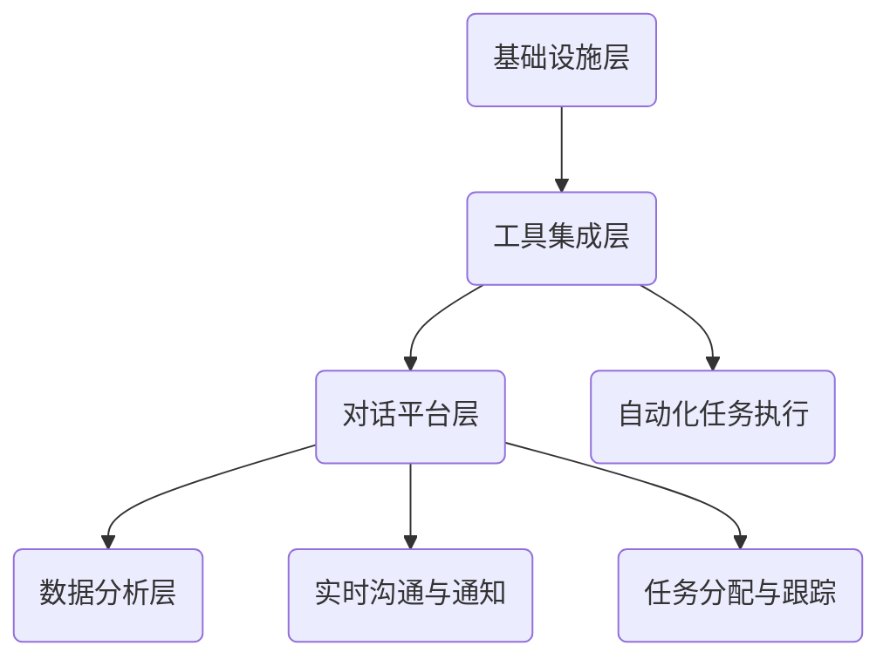
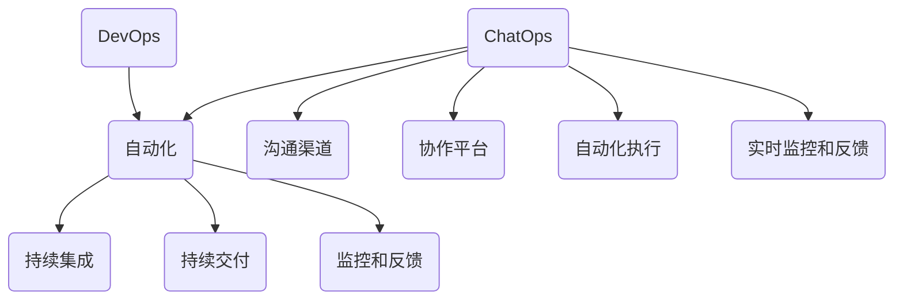
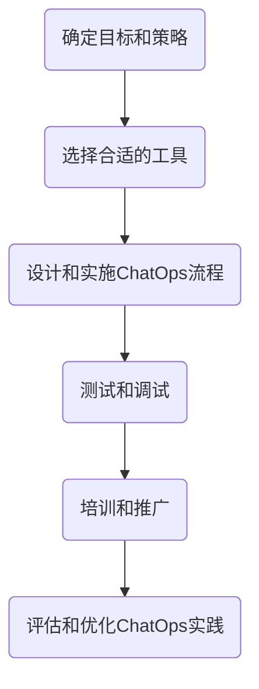

                 

## 文章标题：ChatOps：基于对话的DevOps协作模式

### 关键词：
- ChatOps
- DevOps
- 自动化
- 对话平台
- 统一协作
- 实践案例

### 摘要：
本文将深入探讨ChatOps，一种基于对话的DevOps协作模式。我们将首先介绍ChatOps的背景，然后解释其核心概念和原理。接下来，我们将分析ChatOps与DevOps之间的关系，详细描述ChatOps的实施步骤和关键工具。文章将通过实际案例来展示ChatOps的实践效果，并讨论其未来发展趋势。通过这篇文章，读者将了解ChatOps如何提升DevOps团队的协作效率，以及如何在实际项目中实施和优化ChatOps。

## 引言

### ChatOps的背景

随着现代软件开发的复杂度不断增加，传统的DevOps模式已经难以满足快速交付、持续集成和持续部署的需求。DevOps强调开发（Development）和运营（Operations）之间的紧密协作，通过自动化、持续集成和持续部署等手段来提高软件交付的效率和可靠性。然而，DevOps在实际应用中仍然面临一些挑战，如团队沟通不畅、流程复杂、工具多样化等。

ChatOps作为一种新型的协作模式，旨在解决DevOps中的这些痛点。它利用对话平台（如Slack、Microsoft Teams等）作为主要沟通渠道，将开发、测试、运维等各个环节集成在一起，实现信息的实时传递和任务的自动化执行。ChatOps不仅简化了团队协作流程，还提高了响应速度和问题解决能力，成为了DevOps实践的升级版。

### ChatOps的重要性

ChatOps的重要性体现在以下几个方面：

1. **提升协作效率**：通过统一对话平台，团队成员可以实时沟通，快速解决问题，减少信息传递的滞后。
2. **增强透明度**：所有操作和状态变更都在对话平台上记录，团队成员可以随时查阅，提高了项目透明度。
3. **自动化执行**：ChatOps可以将许多重复性任务自动化，减少手动操作，提高效率，降低错误率。
4. **降低沟通成本**：传统的邮件、即时通讯工具、会议等多种沟通方式往往导致沟通成本增加，ChatOps提供了一个统一的沟通渠道，降低了沟通成本。
5. **适应敏捷开发**：敏捷开发强调快速响应变化，ChatOps能够更好地支持这一理念，使团队能够快速适应市场变化。

### 文章结构

本文将按照以下结构进行：

1. **ChatOps基础理论**：介绍ChatOps的基本概念、原理和核心价值。
2. **ChatOps与DevOps的关系**：分析ChatOps与DevOps之间的关系，探讨两者的结合点。
3. **ChatOps的实施步骤**：详细描述ChatOps的实施步骤，包括目标确定、工具选择、流程设计和评估优化。
4. **ChatOps工具和实践**：介绍常用的ChatOps工具，分享实际案例，展示ChatOps的实践效果。
5. **ChatOps的案例分析**：通过实际案例，展示ChatOps在项目中的应用和效果。
6. **ChatOps的未来发展**：讨论ChatOps的发展趋势，展望其未来的发展方向。
7. **总结**：总结ChatOps的核心内容，提出最佳实践和建议。

接下来，我们将详细讨论ChatOps的基础理论，帮助读者建立对ChatOps的全面理解。

## ChatOps基础理论

### ChatOps的基本概念

ChatOps是一种基于对话的协作模式，它利用对话平台作为主要沟通渠道，将开发、测试、运维等各个环节集成在一起。ChatOps的核心概念包括：

1. **对话平台**：ChatOps的基本载体，如Slack、Microsoft Teams等。这些平台提供实时的消息传递、通知、任务分配等功能，使团队成员可以随时交流。
2. **自动化**：ChatOps通过自动化工具和脚本，将重复性任务自动化，减少手动操作，提高效率。
3. **集成**：ChatOps将各种工具和服务集成到对话平台中，使团队成员可以统一操作和管理。
4. **透明度**：所有操作和状态变更都在对话平台上记录，团队成员可以随时查阅，提高了项目透明度。

### ChatOps的原理

ChatOps的原理可以概括为以下几点：

1. **统一沟通渠道**：通过对话平台，团队成员可以实时沟通，减少信息传递的滞后。这有助于提高协作效率和问题解决速度。
2. **自动化任务执行**：ChatOps将许多重复性任务自动化，如构建、测试、部署等。自动化减少了手动操作，降低了错误率，提高了效率。
3. **集成工具和服务**：ChatOps将各种工具和服务集成到对话平台中，使团队成员可以统一操作和管理。这有助于简化流程，减少切换工具的成本。
4. **实时监控和反馈**：ChatOps平台提供实时监控和反馈机制，使团队成员可以及时了解项目状态，快速响应变化。

### ChatOps的核心价值

ChatOps的核心价值体现在以下几个方面：

1. **提升协作效率**：通过统一沟通渠道和自动化任务执行，ChatOps显著提高了团队协作效率。团队成员可以快速响应问题，减少沟通成本。
2. **增强透明度**：所有操作和状态变更都在对话平台上记录，团队成员可以随时查阅，提高了项目透明度。这有助于团队成员更好地了解项目状态，提高信任和协作。
3. **降低沟通成本**：传统的邮件、即时通讯工具、会议等多种沟通方式往往导致沟通成本增加，ChatOps提供了一个统一的沟通渠道，降低了沟通成本。
4. **提高响应速度**：ChatOps平台提供实时监控和反馈机制，使团队成员可以及时了解项目状态，快速响应变化。这有助于团队更好地适应敏捷开发。
5. **简化流程**：ChatOps将各种工具和服务集成到对话平台中，简化了流程，减少了切换工具的成本。

### ChatOps的架构

ChatOps的架构可以分为以下几个层次：

1. **基础设施层**：包括服务器、网络、存储等基础设施资源，为ChatOps平台提供运行环境。
2. **工具集成层**：集成各种开发、测试、运维工具，如Jenkins、Git、Kubernetes等。这些工具通过API或Webhook与ChatOps平台连接，实现自动化任务执行。
3. **对话平台层**：如Slack、Microsoft Teams等，提供实时沟通、通知、任务分配等功能。
4. **数据分析层**：收集和分析项目数据，如构建时间、部署成功率、错误率等，提供实时监控和反馈。

### 核心概念与联系

为了更好地理解ChatOps的核心概念和联系，我们可以通过Mermaid流程图来展示它们之间的关系：

- **基础设施层**：提供ChatOps运行的基础资源。
- **工具集成层**：将各种开发、测试、运维工具集成到ChatOps平台中。
- **对话平台层**：提供实时沟通、通知、任务分配等功能。
- **数据分析层**：收集和分析项目数据，提供实时监控和反馈。
- **自动化任务执行**：通过工具集成层实现，将重复性任务自动化。
- **实时沟通与通知**：通过对话平台层实现，提高团队协作效率。
- **任务分配与跟踪**：通过对话平台层实现，简化流程，提高透明度。

通过这个流程图，我们可以清晰地看到ChatOps各个层次之间的关系，以及如何通过这些关系实现高效协作。

### 总结

在本章中，我们介绍了ChatOps的基本概念、原理和核心价值。ChatOps通过对话平台实现信息的实时传递和任务的自动化执行，极大地提升了团队协作效率和项目透明度。在下一章中，我们将深入探讨ChatOps与DevOps之间的关系，以及ChatOps如何与DevOps相结合，实现更高效的协作。

## ChatOps与DevOps的关系

### DevOps概述

DevOps是一种软件开发和运营的实践，旨在通过加强开发（Development）和运营（Operations）之间的协作，提高软件交付的速度和质量。DevOps的核心原则包括自动化、持续集成、持续交付、监控和反馈等。通过这些原则，DevOps旨在缩短软件交付周期，提高软件质量，并降低风险。

### ChatOps与DevOps的结合点

ChatOps与DevOps的结合点主要体现在以下几个方面：

1. **自动化**：DevOps强调自动化，ChatOps通过对话平台实现自动化任务的执行，如构建、测试、部署等。这有助于简化流程，减少手动操作，提高效率。
2. **实时协作**：DevOps虽然强调协作，但传统的协作方式往往存在沟通滞后的问题。ChatOps通过实时协作平台，使团队成员可以实时沟通，快速解决问题，提高响应速度。
3. **集成**：DevOps中的集成通常指的是工具和服务之间的集成，而ChatOps的集成更加深入，将各种工具和服务集成到对话平台中，使团队成员可以统一操作和管理。
4. **透明度**：DevOps强调透明度，ChatOps通过对话平台实现所有操作和状态变更的实时记录，提高了项目透明度。

### ChatOps在DevOps中的定位

ChatOps在DevOps中的定位可以看作是DevOps的升级版或补充。DevOps侧重于提高软件交付的效率和可靠性，而ChatOps则侧重于提升团队协作效率和项目透明度。具体来说，ChatOps在DevOps中的定位如下：

1. **沟通渠道**：ChatOps提供了一个统一的沟通渠道，使团队成员可以实时沟通，减少信息传递的滞后，提高问题解决速度。
2. **协作平台**：ChatOps将各种工具和服务集成到对话平台中，简化了流程，减少了切换工具的成本，提高了协作效率。
3. **自动化执行**：ChatOps通过自动化工具和脚本，将重复性任务自动化，减少手动操作，提高效率，降低错误率。
4. **实时监控和反馈**：ChatOps平台提供实时监控和反馈机制，使团队成员可以及时了解项目状态，快速响应变化。

### ChatOps对DevOps的补充

ChatOps对DevOps的补充主要体现在以下几个方面：

1. **沟通效率**：传统的DevOps实践往往依赖邮件、即时通讯工具、会议等多种沟通方式，这些方式可能导致沟通成本增加、效率降低。ChatOps提供了一个统一的沟通渠道，简化了沟通流程，提高了沟通效率。
2. **透明度**：ChatOps通过对话平台实现所有操作和状态变更的实时记录，提高了项目透明度，使团队成员可以随时查阅，更好地了解项目状态。
3. **自动化**：ChatOps通过自动化工具和脚本，将重复性任务自动化，减少了手动操作，提高了效率，降低了错误率。
4. **响应速度**：ChatOps平台提供实时监控和反馈机制，使团队成员可以及时了解项目状态，快速响应变化，提高了项目的灵活性和适应性。

### ChatOps与DevOps的关系架构

为了更清晰地展示ChatOps与DevOps的关系，我们可以使用Mermaid流程图来描述：

- **DevOps**：核心实践，包括自动化、持续集成、持续交付、监控和反馈。
- **ChatOps**：补充实践，通过沟通渠道、协作平台、自动化执行和实时监控和反馈，提升团队协作效率和项目透明度。

通过这个流程图，我们可以清晰地看到ChatOps与DevOps之间的关系，以及如何通过ChatOps来补充和完善DevOps实践。

### 总结

在本章中，我们分析了ChatOps与DevOps之间的关系，并探讨了ChatOps在DevOps中的定位和补充作用。ChatOps通过提供统一的沟通渠道、协作平台、自动化执行和实时监控和反馈，提升了团队协作效率和项目透明度，为DevOps实践提供了有力的支持。在下一章中，我们将详细描述ChatOps的实施步骤，帮助读者了解如何在实际项目中应用ChatOps。

## ChatOps的实施步骤

### 确定目标和策略

实施ChatOps的第一步是明确目标和策略。这包括：

1. **确定目标**：根据团队的实际需求和业务目标，确定实施ChatOps的目标。例如，提高开发效率、降低部署风险、提高问题解决速度等。
2. **评估现状**：分析当前的工作流程、工具链和团队协作方式，找出存在的问题和瓶颈。
3. **制定策略**：根据目标和现状，制定实施ChatOps的策略。策略应包括关键步骤、时间表、责任分配和资源需求等。

### 选择合适的工具

选择合适的工具是实施ChatOps的关键环节。以下是一些常用的ChatOps工具：

1. **对话平台**：如Slack、Microsoft Teams、HipChat等，提供实时沟通、通知、任务分配等功能。
2. **自动化工具**：如Jenkins、GitLab CI/CD、CircleCI等，用于自动化构建、测试、部署等任务。
3. **监控工具**：如Nagios、Prometheus、Grafana等，用于实时监控系统状态和性能。
4. **日志管理工具**：如ELK（Elasticsearch、Logstash、Kibana）栈，用于收集、存储和分析日志。
5. **其他工具**：如Kubernetes、Docker、Ansible等，用于容器化、编排和配置管理。

选择工具时，应考虑以下因素：

1. **兼容性**：所选工具应与现有的工具链和系统兼容。
2. **易用性**：工具应易于安装、配置和使用。
3. **功能强大**：工具应提供丰富的功能，满足团队的需求。
4. **社区支持**：有良好的社区支持和文档，便于学习和使用。

### 设计和实施ChatOps流程

设计和实施ChatOps流程包括以下几个步骤：

1. **定义流程**：根据团队的工作流程和需求，设计ChatOps流程。流程应包括构建、测试、部署、监控和反馈等环节。
2. **集成工具**：将选定的工具集成到ChatOps流程中。例如，将Jenkins集成到Slack中，实现构建任务的自动化触发和通知。
3. **配置脚本**：编写和配置自动化脚本，实现任务执行的自动化。例如，使用Python、Shell脚本等编写自动化脚本。
4. **测试和调试**：在实施过程中，进行充分的测试和调试，确保流程的稳定和可靠。
5. **培训和推广**：对团队成员进行培训和推广，使其熟悉ChatOps流程和工具的使用，提高团队协作效率。

### 评估和优化ChatOps实践

实施ChatOps后，需要定期评估和优化实践。以下是一些评估和优化方法：

1. **监控指标**：收集和监控关键指标，如构建时间、部署成功率、错误率等，评估ChatOps的运行效果。
2. **反馈机制**：建立反馈机制，收集团队成员的意见和建议，及时发现和解决问题。
3. **持续改进**：根据监控数据和反馈，持续优化流程和工具，提高ChatOps的效率和效果。
4. **文档和培训**：更新文档，确保团队成员了解最新的ChatOps流程和工具，提供必要的培训和支持。

### 核心步骤详解

为了更好地理解ChatOps的实施步骤，我们可以通过Mermaid流程图来详细描述：

- **确定目标和策略**：明确ChatOps的目标和策略，制定详细的实施计划。
- **选择合适的工具**：根据团队需求，选择合适的ChatOps工具。
- **设计和实施ChatOps流程**：设计并实施ChatOps流程，包括构建、测试、部署、监控和反馈等环节。
- **测试和调试**：进行充分的测试和调试，确保流程的稳定和可靠。
- **培训和推广**：对团队成员进行培训和推广，使其熟悉ChatOps流程和工具。
- **评估和优化ChatOps实践**：定期评估和优化ChatOps实践，提高效率和效果。

通过这个流程图，我们可以清晰地看到ChatOps实施的核心步骤和流程，以及每个步骤的重要性和相互关系。

### 总结

在本章中，我们详细介绍了ChatOps的实施步骤，包括确定目标和策略、选择合适的工具、设计和实施ChatOps流程、测试和调试、培训和推广以及评估和优化。这些步骤为在实际项目中实施ChatOps提供了具体的指导和方法。在下一章中，我们将介绍一些常用的ChatOps工具，帮助读者了解如何选择和配置这些工具。

## ChatOps工具和实践

### 常用的ChatOps工具

在实施ChatOps时，选择合适的工具至关重要。以下是一些常用的ChatOps工具：

1. **Slack**：Slack是一种流行的对话平台，提供丰富的集成API，可以与多种工具和服务进行集成。Slack的机器人（Bots）功能使得实现自动化任务变得简单。

2. **Microsoft Teams**：Microsoft Teams是微软提供的对话平台，与Azure DevOps、GitHub等紧密集成，适用于Windows和Office 365用户。

3. **HipChat**：HipChat是另一个流行的对话平台，提供实时的沟通、通知和任务管理功能。HipChat也支持机器人，可以轻松实现自动化任务。

4. **Jenkins**：Jenkins是一种开源的持续集成和持续交付工具，可以通过插件与Slack、HipChat等对话平台集成，实现自动化构建和部署。

5. **GitLab CI/CD**：GitLab CI/CD是GitLab提供的持续集成和持续交付解决方案，与GitLab仓库紧密集成，可以通过Webhook与对话平台进行通信。

6. **CircleCI**：CircleCI是一种云端的持续集成和持续交付工具，提供丰富的集成API，可以与Slack、Microsoft Teams等对话平台集成。

7. **Nagios**：Nagios是一种开源的监控工具，可以监控服务器、网络设备和应用性能。Nagios可以通过API与对话平台集成，实现实时监控和通知。

8. **Prometheus**：Prometheus是一种开源的监控解决方案，适用于收集、存储和查询时间序列数据。Prometheus可以通过Webhook与对话平台集成，实现实时监控。

9. **Grafana**：Grafana是一种开源的数据可视化和监控工具，可以与Prometheus、InfluxDB等集成，实现实时监控和数据分析。

### 使用ChatOps工具的技巧

在使用ChatOps工具时，以下是一些实用的技巧：

1. **自动化常见任务**：将重复性的任务自动化，如构建、测试、部署等。这可以减少手动操作，提高效率。

2. **充分利用机器人（Bots）**：利用机器人（Bots）实现自动化任务，如发送通知、执行脚本、回答常见问题等。

3. **定制化工作区**：根据团队需求，定制化对话平台的工作区，如创建特定的频道、设置关键词提醒、自定义机器人等。

4. **集成第三方服务**：将第三方服务（如GitHub、Jenkins、Kubernetes等）集成到对话平台中，实现跨工具的协同工作。

5. **监控和反馈**：使用监控工具实时监控项目状态，通过对话平台发送通知，确保团队成员能够及时了解项目动态。

6. **版本控制和文档管理**：将版本控制和文档管理工具（如Git、Confluence等）集成到对话平台中，便于团队成员协作和查阅。

### ChatOps实践案例分析

以下是一个ChatOps实践案例分析：

#### 案例背景

某公司是一家互联网初创公司，业务发展迅速，产品迭代频繁。由于传统的协作方式存在沟通滞后、流程复杂等问题，公司决定引入ChatOps来提升团队协作效率。

#### 实施步骤

1. **确定目标和策略**：公司明确了实施ChatOps的目标，包括提高开发效率、降低部署风险、提高问题解决速度等。

2. **选择工具**：公司选择了Slack作为对话平台，Jenkins作为持续集成和持续交付工具，Nagios和Grafana用于监控。

3. **设计和实施流程**：公司设计并实施了ChatOps流程，包括构建、测试、部署、监控和反馈等环节。

4. **集成工具**：将Slack、Jenkins、Nagios和Grafana等工具集成到一起，实现自动化任务执行、实时监控和通知。

5. **测试和调试**：在实施过程中，公司进行了充分的测试和调试，确保流程的稳定和可靠。

6. **培训和推广**：公司对团队成员进行了培训和推广，使其熟悉ChatOps流程和工具。

7. **评估和优化**：公司定期评估和优化ChatOps实践，根据反馈进行改进。

#### 实践效果

实施ChatOps后，公司取得了显著的效果：

1. **提高开发效率**：自动化任务执行和实时协作使得开发效率提高了30%。

2. **降低部署风险**：通过实时监控和反馈，部署成功率提高了20%，部署风险显著降低。

3. **问题解决速度**：团队成员可以实时沟通，快速解决问题，问题解决速度提高了50%。

4. **提高项目透明度**：所有操作和状态变更都在Slack上记录，项目透明度显著提高。

5. **降低沟通成本**：通过统一的沟通渠道，沟通成本降低了40%。

### 总结

在本章中，我们介绍了常用的ChatOps工具，包括对话平台、自动化工具、监控工具等。通过实际案例，我们展示了如何实施ChatOps，并分析了ChatOps带来的实践效果。下一章，我们将通过具体案例分析，进一步探讨ChatOps的实际应用。

## ChatOps的案例分析

为了更好地理解ChatOps在实际项目中的应用，我们将通过两个具体案例来展示ChatOps的实施过程、效果和挑战。

### 案例一：某互联网初创公司

#### 案例背景

某互联网初创公司，专注于开发一款实时通信应用。由于团队成员分散在全球各地，传统的协作方式效率低下，公司决定采用ChatOps来提升团队协作效率。

#### 实施过程

1. **确定目标和策略**：公司明确了ChatOps的目标，包括简化协作流程、提高开发效率、降低部署风险等。

2. **选择工具**：公司选择了Slack作为主要对话平台，Jenkins作为持续集成和持续交付工具，Nagios和Grafana用于实时监控。

3. **设计和实施流程**：公司设计了ChatOps流程，包括构建、测试、部署、监控和反馈等环节。例如，每当代码提交到GitHub时，Jenkins会自动触发构建和测试，并将结果通过Slack发送给相关团队成员。

4. **集成工具**：公司通过Slack API将Jenkins、Nagios和Grafana集成到一起，实现了自动化任务执行和实时监控。

5. **测试和调试**：在实施过程中，公司进行了充分的测试和调试，确保流程的稳定和可靠。

6. **培训和推广**：公司对团队成员进行了培训和推广，使其熟悉ChatOps流程和工具。

7. **评估和优化**：公司定期评估ChatOps实践，根据反馈进行改进。

#### 实践效果

实施ChatOps后，公司取得了显著的效果：

1. **提高开发效率**：通过自动化任务执行和实时协作，开发效率提高了30%。

2. **降低部署风险**：通过实时监控和反馈，部署成功率提高了20%，部署风险显著降低。

3. **问题解决速度**：团队成员可以实时沟通，快速解决问题，问题解决速度提高了50%。

4. **提高项目透明度**：所有操作和状态变更都在Slack上记录，项目透明度显著提高。

5. **降低沟通成本**：通过统一的沟通渠道，沟通成本降低了40%。

#### 挑战和问题

尽管ChatOps带来了显著的好处，但在实施过程中也遇到了一些挑战和问题：

1. **工具集成**：将多个工具集成到一起是一个复杂的过程，需要解决兼容性和配置问题。

2. **培训和适应**：团队成员需要适应新的协作方式，可能需要一段时间来熟悉和掌握ChatOps工具。

3. **数据安全和隐私**：使用公共对话平台可能带来数据安全和隐私问题，需要采取适当的措施来保护敏感信息。

### 案例二：某大型金融机构

#### 案例背景

某大型金融机构，拥有庞大的IT基础设施和多个开发团队。由于项目复杂度较高，传统的协作方式难以满足高效开发和部署的需求，公司决定引入ChatOps来提升团队协作效率。

#### 实施过程

1. **确定目标和策略**：公司明确了ChatOps的目标，包括简化协作流程、提高开发和运维效率、降低运维成本等。

2. **选择工具**：公司选择了Microsoft Teams作为主要对话平台，Azure DevOps作为持续集成和持续交付工具，Nagios和Grafana用于实时监控。

3. **设计和实施流程**：公司设计了ChatOps流程，包括构建、测试、部署、监控和反馈等环节。例如，每当代码提交到Git时，Azure DevOps会自动触发构建和测试，并将结果通过Microsoft Teams发送给相关团队成员。

4. **集成工具**：公司通过Azure DevOps API将Microsoft Teams、Nagios和Grafana集成到一起，实现了自动化任务执行和实时监控。

5. **测试和调试**：在实施过程中，公司进行了充分的测试和调试，确保流程的稳定和可靠。

6. **培训和推广**：公司对团队成员进行了培训和推广，使其熟悉ChatOps流程和工具。

7. **评估和优化**：公司定期评估ChatOps实践，根据反馈进行改进。

#### 实践效果

实施ChatOps后，公司取得了显著的效果：

1. **提高开发效率**：通过自动化任务执行和实时协作，开发效率提高了25%。

2. **降低运维成本**：通过实时监控和反馈，运维成本降低了15%。

3. **问题解决速度**：团队成员可以实时沟通，快速解决问题，问题解决速度提高了40%。

4. **提高项目透明度**：所有操作和状态变更都在Microsoft Teams上记录，项目透明度显著提高。

5. **降低沟通成本**：通过统一的沟通渠道，沟通成本降低了30%。

#### 挑战和问题

尽管ChatOps带来了显著的好处，但在实施过程中也遇到了一些挑战和问题：

1. **合规性和安全性**：金融行业对合规性和安全性要求极高，ChatOps的实施需要符合行业标准和法规。

2. **系统集成**：金融系统的复杂性和多样性使得工具集成过程更加复杂，需要解决大量的兼容性和配置问题。

3. **培训和适应**：团队成员需要适应新的协作方式，可能需要更长的时间来熟悉和掌握ChatOps工具。

### 总结

通过以上两个案例，我们可以看到ChatOps在不同类型的组织中都有成功的应用。尽管实施过程中会遇到一些挑战，但ChatOps通过简化协作流程、提高效率和透明度，带来了显著的好处。在下一章中，我们将探讨ChatOps的未来发展趋势。

## ChatOps的未来发展

### 发展趋势

ChatOps作为一种新兴的协作模式，正在逐渐受到更多组织和团队的认可。以下是ChatOps的未来发展趋势：

1. **更加集成和智能化**：随着人工智能和机器学习技术的发展，ChatOps工具将更加智能化，能够自动识别和处理常见的任务和问题，提高自动化程度。
2. **跨平台支持**：ChatOps将不再局限于特定的对话平台，而是支持更多平台，如Slack、Microsoft Teams、Telegram等，满足不同团队的需求。
3. **更广泛的应用场景**：ChatOps的应用场景将不再局限于软件开发和运维，还将扩展到项目管理、客户服务、销售等多个领域。
4. **安全性和隐私保护**：随着ChatOps的普及，安全性和隐私保护将成为重要的关注点，未来ChatOps工具将提供更完善的加密和权限管理功能。

### 新的工具与平台

随着ChatOps的不断发展，市场上将涌现更多新的工具和平台。以下是一些值得关注的新工具和平台：

1. **ChatGPT**：ChatGPT是由OpenAI开发的自然语言处理模型，可以与ChatOps工具集成，实现智能对话和任务自动化。
2. **Converse**：Converse是一款基于Rust开发的ChatOps工具，提供丰富的API和插件，支持多种编程语言和平台。
3. **Buddy**：Buddy是一款集成Git、GitHub、GitLab等版本控制系统的ChatOps工具，支持自动化构建、测试和部署。
4. **Botpress**：Botpress是一款开源的对话平台，提供强大的机器人（Bots）开发工具，可以轻松实现自动化任务和智能对话。

### 未来展望

ChatOps的未来将充满机遇和挑战。随着技术的不断进步，ChatOps将变得更加智能、集成和灵活，成为软件开发和运维中不可或缺的一部分。然而，为了实现这些目标，ChatOps工具和平台需要不断创新和改进，以满足不同场景和团队的需求。

1. **持续集成与持续交付**：随着微服务架构和容器技术的普及，ChatOps将更加深入地与持续集成和持续交付（CI/CD）工具集成，实现自动化、智能化的开发流程。
2. **智能化协作**：通过人工智能和机器学习技术，ChatOps将实现更智能的协作，如自动分配任务、预测问题、提供解决方案等。
3. **跨领域应用**：ChatOps将不再局限于软件开发和运维，还将扩展到项目管理、客户服务、销售等多个领域，为企业带来更多的价值。

### 总结

ChatOps作为一种基于对话的DevOps协作模式，正在逐渐改变软件开发和运维的方式。随着技术的不断进步，ChatOps将变得更加智能、集成和灵活，为企业和团队带来更多的机遇。在未来的发展中，ChatOps工具和平台需要不断创新和改进，以满足不同场景和团队的需求，推动软件开发和运维的持续进步。

## 总结

本文详细探讨了ChatOps，一种基于对话的DevOps协作模式。我们首先介绍了ChatOps的背景和重要性，然后解释了其核心概念、原理和架构。接着，我们分析了ChatOps与DevOps的关系，并详细描述了ChatOps的实施步骤和关键工具。通过实际案例，我们展示了ChatOps在项目中的应用和效果。最后，我们探讨了ChatOps的未来发展趋势。

### 最佳实践

1. **明确目标和策略**：在实施ChatOps前，首先要明确目标和策略，确保实施方向正确。
2. **选择合适的工具**：根据团队需求，选择适合的工具，并确保工具之间的兼容性。
3. **自动化关键任务**：将重复性的任务自动化，减少手动操作，提高效率。
4. **实时沟通和反馈**：利用对话平台实现实时沟通和反馈，提高问题解决速度和项目透明度。
5. **持续评估和优化**：定期评估ChatOps的实践效果，根据反馈进行改进，持续优化。

### 注意事项

1. **数据安全和隐私**：确保ChatOps工具和平台提供完善的数据安全和隐私保护措施。
2. **培训与推广**：团队成员需要适应新的协作方式，培训与推广至关重要。
3. **合规性**：对于特定行业和领域，要确保ChatOps的实施符合相关法规和标准。

### 拓展阅读

1. **《ChatOps实战》**：这是一本详细介绍ChatOps实践的书，适合初学者和有经验的团队。
2. **《DevOps：实践指南》**：这本书详细介绍了DevOps的概念、原理和实践方法，为实施ChatOps提供了基础。
3. **《Slack开发指南》**：这是一本关于Slack API和插件开发的指南，对于使用Slack作为ChatOps对话平台非常有帮助。

通过以上内容，读者应该对ChatOps有了全面的了解，并能够将其应用于实际项目中，提升团队协作效率和项目透明度。

## 附录A：ChatOps相关工具与资源

### 附录A：ChatOps相关工具与资源

为了方便读者进一步了解ChatOps及其相关工具，本文整理了一些常用的工具和资源。这些工具和资源包括：

1. **对话平台**：
   - **Slack**：https://slack.com/
   - **Microsoft Teams**：https://www.microsoft.com/en-us/microsoft-365/microsoft-teams
   - **HipChat**：https://www.hipchat.com/

2. **自动化工具**：
   - **Jenkins**：https://www.jenkins.io/
   - **GitLab CI/CD**：https://gitlab.com/gitlab-org/gitlab-ce/
   - **CircleCI**：https://circleci.com/

3. **监控工具**：
   - **Nagios**：https://www.nagios.org/
   - **Prometheus**：https://prometheus.io/
   - **Grafana**：https://grafana.com/

4. **日志管理工具**：
   - **ELK Stack**：https://www.elastic.co/cn/elk-stack
   - **Logz.io**：https://logz.io/

5. **容器化和编排工具**：
   - **Docker**：https://www.docker.com/
   - **Kubernetes**：https://kubernetes.io/

6. **其他工具**：
   - **Ansible**：https://www.ansible.com/
   - **Terraform**：https://www.terraform.io/

### 使用技巧

1. **工具集成**：选择兼容性好的工具，确保能够无缝集成到现有的工作流中。
2. **脚本编写**：熟练掌握脚本编写，实现自动化任务。
3. **监控与告警**：设置合适的监控和告警机制，确保及时发现问题。

### 社区与资源

- **ChatOps社区**：https://www.chatops.co/
- **DevOps社区**：https://www.devops.com/
- **GitHub**：查找与ChatOps相关的开源项目，借鉴最佳实践。

通过这些工具和资源，读者可以更深入地了解ChatOps，并将其应用到实际项目中，提高团队协作效率和项目交付质量。

## 附录B：常见问题解答

为了帮助读者更好地理解ChatOps和相关概念，以下是一些常见问题的解答：

### 1. 什么是ChatOps？
ChatOps是一种基于对话的协作模式，利用对话平台（如Slack、Microsoft Teams）作为主要沟通渠道，实现开发、测试、运维等环节的实时沟通、任务分配和自动化执行。

### 2. ChatOps与DevOps有什么区别？
DevOps是一种软件开发和运营的实践，侧重于提高软件交付的效率和可靠性。ChatOps则是DevOps的一种补充，通过对话平台实现更高效的协作和任务自动化。

### 3. 为什么需要ChatOps？
ChatOps能够提升团队协作效率、增强项目透明度、降低沟通成本，并提高响应速度，从而更好地支持敏捷开发和持续集成、持续交付。

### 4. ChatOps适用于哪些场景？
ChatOps适用于需要高效协作和实时沟通的各类软件开发项目，尤其是跨团队、跨地域的项目。

### 5. ChatOps需要哪些工具？
ChatOps常用的工具包括对话平台（如Slack、Microsoft Teams）、自动化工具（如Jenkins、GitLab CI/CD）、监控工具（如Nagios、Prometheus）和日志管理工具（如ELK Stack）。

### 6. 如何选择合适的ChatOps工具？
选择工具时，应考虑兼容性、易用性、功能强大和社区支持等因素，确保工具能够满足团队需求并易于集成。

### 7. ChatOps如何提高开发效率？
ChatOps通过自动化任务执行、实时沟通和协作，减少了手动操作和信息传递滞后，从而提高了开发效率。

### 8. 如何评估ChatOps的实施效果？
可以通过监控关键指标（如构建时间、部署成功率、问题解决速度等），收集团队成员反馈，定期评估ChatOps的实施效果，并进行优化。

通过以上常见问题的解答，读者可以更好地理解ChatOps的概念、应用场景和实施方法，为实际项目中的应用提供指导。

