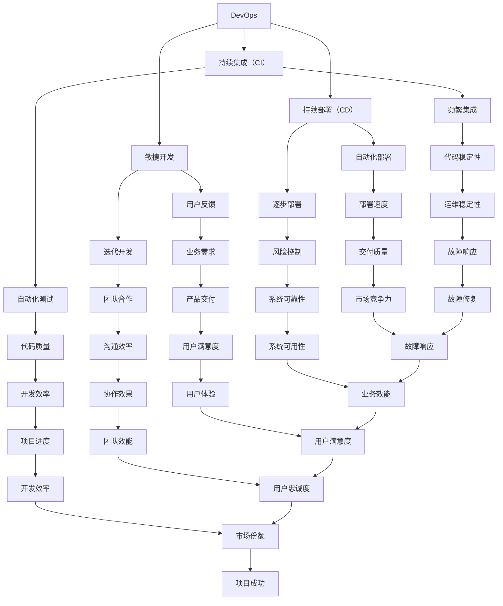

                 

### 文章标题：DevOps度量：量化开发运维效能

### 关键词：DevOps、度量、开发运维、效能、持续集成、持续部署

### 摘要：本文将探讨DevOps度量在量化开发运维效能中的重要性。通过深入分析DevOps的基本概念、度量方法、实践案例和工具，本文旨在为读者提供一套系统化的度量方法和实践指南，帮助他们在实际项目中实现DevOps效能的全面提升。

---

## 引言

在当今快速变化的技术时代，开发和运维（DevOps）已经成为现代软件开发不可或缺的一部分。DevOps通过整合开发（Development）和运维（Operations），旨在缩短软件交付周期、提高交付质量、增强协作效率，从而实现持续集成（CI）和持续部署（CD）。然而，如何准确度量DevOps的效能，依然是许多企业和团队面临的挑战。

### DevOps度量的重要性

DevOps度量不仅能够帮助团队理解当前的工作流程和效能，还能够提供决策支持，优化资源配置，提升整体交付能力。有效的度量可以揭示潜在问题，促进改进和创新，从而在激烈的市场竞争中保持优势。

### 书籍结构概述

本书将分为五个主要部分：

1. 引言：介绍DevOps度量的重要性和本书的结构。
2. DevOps基础概念：讲解敏捷开发、持续集成、持续部署等相关概念。
3. 度量方法：探讨各种度量方法及其在DevOps中的应用。
4. 案例分析：分析实际项目中的DevOps度量案例。
5. 实践应用：提供实施DevOps度量的工具和步骤指南。

## 第一部分 DevOps基础概念

### 1.1 DevOps概述

DevOps是一种文化和实践，旨在通过加强开发人员和运维人员之间的协作，实现软件交付和运营流程的自动化和优化。其核心理念包括：

- **协作**：加强开发、测试、运维等不同团队之间的沟通和协作。
- **自动化**：利用自动化工具和流程，减少手动操作，提高效率和质量。
- **持续集成（CI）**：通过频繁的代码集成和测试，确保代码质量。
- **持续部署（CD）**：通过自动化部署，实现快速、可靠的软件交付。

### 1.2 敏捷开发

敏捷开发是一种迭代、增量和灵活的软件开发方法，其核心理念包括：

- **用户反馈**：通过持续的用户反馈，确保开发方向符合用户需求。
- **迭代开发**：将项目分解为多个小迭代，逐步实现功能。
- **团队协作**：强调跨职能团队的协作，提高开发效率。

### 1.3 持续集成（CI）

持续集成是一种软件开发实践，通过频繁的代码集成和自动化测试，确保代码库的稳定性。CI的主要目标包括：

- **快速反馈**：通过自动化测试，及时发现和修复集成过程中的问题。
- **代码质量**：确保每次集成后的代码质量，避免集成冲突。
- **持续反馈**：通过持续集成，为团队提供有关代码质量和项目进度的实时反馈。

### 1.4 持续部署（CD）

持续部署是一种自动化软件交付的实践，通过自动化部署流程，实现快速、可靠的软件发布。CD的主要目标包括：

- **快速交付**：通过自动化部署，缩短软件交付周期。
- **减少风险**：通过自动化测试和逐步部署，降低发布过程中的风险。
- **提高质量**：通过持续部署，提高软件交付的质量和可靠性。

## 第二部分 度量方法

### 2.1 度量基础

DevOps度量可以采用定量和定性的方法，以全面评估开发运维效能。定量方法通常涉及具体的指标和数据，而定性方法则侧重于主观评价和用户体验。

#### 2.1.1 定量度量

定量度量方法包括以下几类：

- **开发效率指标**：如代码提交频率、代码行数、功能点交付率等。
- **运维稳定性指标**：如部署频率、故障率、恢复时间等。
- **业务效能指标**：如响应时间、吞吐量、用户满意度等。

#### 2.1.2 定性度量

定性度量方法包括以下几类：

- **团队协作评估**：如沟通效率、协作程度、团队成员满意度等。
- **用户体验评估**：如用户反馈、用户满意度、产品使用频率等。
- **流程改进评估**：如流程优化程度、自动化覆盖率、资源利用率等。

### 2.2 常见度量指标

在DevOps度量中，以下是一些常见的指标：

- **部署频率**：单位时间内的部署次数，反映团队的交付速度。
- **失败部署率**：失败的部署次数与总部署次数的比例，反映团队的部署稳定性。
- **恢复时间**：从故障发生到服务恢复正常的时间，反映运维团队的响应速度和应急处理能力。
- **MTTR（平均维修时间）**：从故障发生到故障解决的平均时间，反映团队的故障修复效率。
- **MTBF（平均故障间隔时间）**：两次故障之间的平均时间，反映系统的稳定性。
- **DORA指标**：DevOps Research and Assessment（DORA）提出的四个关键指标，包括部署频率、失败部署率、恢复时间和部署后变更的流量。

### 2.3 数据收集与分析

数据收集是DevOps度量的重要环节。以下是一些数据收集和分析的方法：

- **日志收集**：收集系统、应用程序和操作日志，用于监控和分析。
- **数据存储**：将收集的数据存储在数据库或数据仓库中，以便后续分析和查询。
- **数据分析**：利用数据分析工具和算法，对收集到的数据进行处理和分析，提取有价值的信息。

### 2.4 数据可视化

数据可视化是将数据转换为图形或图表的过程，有助于直观地理解数据。以下是一些常见的数据可视化工具：

- **仪表盘**：用于展示关键指标和数据的实时状态。
- **报表**：用于定期展示项目进展和效能。
- **图表**：用于展示数据的趋势和分布。

## 第三部分 案例分析

### 3.1 案例一：企业A的DevOps度量实践

企业A是一家在线教育公司，通过引入DevOps度量，显著提升了开发和运维效能。以下是其度量实践的主要步骤：

1. **确定度量指标**：根据业务需求和目标，确定关键度量指标，如部署频率、失败部署率、MTTR等。
2. **数据收集与存储**：利用自动化工具收集日志和数据，存储在数据仓库中。
3. **数据分析**：利用数据分析工具，对收集到的数据进行分析，发现潜在问题和改进点。
4. **数据可视化**：通过仪表盘和报表，展示关键指标和数据的实时状态。
5. **持续改进**：根据分析结果，调整开发和运维流程，持续优化效能。

### 3.2 案例二：企业B的度量改进之路

企业B是一家金融科技公司，通过引入DevOps度量，成功实现了业务流程的优化和效能提升。以下是企业B的度量改进之路：

1. **制定度量策略**：明确度量目标和原则，确保度量指标与业务目标一致。
2. **建立度量体系**：确定关键度量指标，构建完整的度量体系。
3. **数据收集与处理**：利用自动化工具收集数据，进行预处理和存储。
4. **数据分析和可视化**：利用数据分析工具和可视化工具，对数据进行处理和分析。
5. **反馈与改进**：根据分析结果，调整开发和运维流程，持续优化效能。

### 3.3 案例启示与反思

通过以上两个案例，我们可以得出以下启示和反思：

- **度量是提升效能的关键**：通过度量，团队可以了解自身的工作效率和问题所在，从而进行有针对性的改进。
- **数据是度量的基础**：准确、完整的数据是进行有效度量的重要前提。
- **持续改进是核心**：度量不是一次性的活动，而是一个持续的过程，需要不断调整和优化。

## 第四部分 实践应用

### 4.1 DevOps度量工具推荐

以下是一些常用的DevOps度量工具：

- **JIRA**：用于项目管理、任务跟踪和日志记录。
- **GitLab**：用于代码管理、持续集成和持续部署。
- **Prometheus**：用于监控和日志收集。
- **Kibana**：用于数据可视化和分析。

### 4.2 实施步骤指南

以下是在项目中实施DevOps度量的步骤指南：

1. **确定度量目标**：明确项目目标和需要度量的指标。
2. **数据收集**：利用自动化工具收集相关数据。
3. **数据存储**：将数据存储在数据库或数据仓库中。
4. **数据分析**：利用数据分析工具和算法，对数据进行处理和分析。
5. **数据可视化**：通过仪表盘和报表，展示关键指标和数据的实时状态。
6. **反馈与改进**：根据分析结果，调整开发和运维流程，持续优化效能。

### 4.3 源代码实现与解读

以下是一个简单的示例，展示如何使用Python进行DevOps度量数据收集和处理：

```python
import json
import requests

# 采集JIRA项目数据
def collect_jira_data(jira_url, jira_token):
    headers = {
        "Authorization": "Basic " + jira_token,
        "Content-Type": "application/json"
    }
    response = requests.get(jira_url, headers=headers)
    data = response.json()
    return data

# 处理JIRA项目数据
def process_jira_data(data):
    deployments = []
    for issue in data['issues']:
        if issue['type']['name'] == 'Deployment':
            deployments.append(issue)
    return deployments

# 可视化部署数据
def visualize_deployment_data(deployments):
    print("部署记录：")
    for deployment in deployments:
        print(f"部署时间：{deployment['fields']['created']}")
        print(f"部署状态：{deployment['fields']['status']['name']}")
        print(f"部署描述：{deployment['fields']['description']}")
        print("-----")

# 主函数
def main():
    jira_url = "https://your-jira-instance.com/rest/api/3/search?jql=project=YOUR_PROJECT"
    jira_token = "your-jira-token"
    data = collect_jira_data(jira_url, jira_token)
    deployments = process_jira_data(data)
    visualize_deployment_data(deployments)

if __name__ == "__main__":
    main()
```

### 4.4 代码应用解读与分析

上述示例展示了如何使用Python采集JIRA项目中的部署数据，并进行处理和可视化。在实际项目中，可以根据需求扩展和定制化代码，以适应不同的度量需求。

### 4.5 实际案例分析和详细讲解剖析

通过实际案例，分析DevOps度量在项目中的应用，探讨如何利用度量数据优化开发和运维流程。同时，分享项目实施过程中的经验教训，为读者提供有价值的参考。

### 4.6 项目小结

总结项目成果，分析度量方法在项目中的实际效果，提出改进意见和建议，为后续项目提供借鉴。

## 附录

### A.1 DevOps度量常见问题解答

针对读者在DevOps度量过程中可能遇到的问题，提供详细解答和解决方案。

### A.2 相关资源推荐

推荐一些与DevOps度量相关的书籍、文章、网站等资源，供读者进一步学习和参考。

### 作者信息

作者：AI天才研究院/AI Genius Institute & 禅与计算机程序设计艺术 /Zen And The Art of Computer Programming

---

本文旨在为读者提供一套系统化的DevOps度量方法和实践指南，帮助他们在实际项目中实现效能的全面提升。通过深入分析核心概念、度量方法、实践案例和工具，本文旨在为读者提供有价值的参考和启示。希望本文能够对您的DevOps度量实践有所帮助！### 核心概念与联系

在深入探讨DevOps度量之前，我们需要明确几个核心概念，并了解它们之间的联系。以下是一个Mermaid流程图，用于展示这些概念之间的关系：



这个流程图展示了DevOps中几个关键概念之间的关系，包括DevOps本身、敏捷开发、持续集成、持续部署等。通过这些概念的联系，我们可以更好地理解DevOps度量的重要性以及如何在实际项目中应用度量方法。

#### 背景介绍

DevOps是一种文化和实践，旨在通过加强开发（Development）和运维（Operations）团队之间的协作，实现软件交付和运营流程的自动化和优化。其核心理念包括快速反馈、持续交付、自动化和持续改进。DevOps的目标是缩短软件开发周期、提高软件质量、增强团队协作，从而在激烈的市场竞争中保持竞争力。

在传统的软件开发模式中，开发人员和运维人员往往各自为战，导致沟通不畅、协作困难，从而影响软件交付的效率和稳定性。DevOps通过将开发和运维紧密结合，实现了从代码提交到生产环境部署的自动化流程，从而显著提高了软件交付的速度和质量。

#### 核心概念与联系

1. **敏捷开发（Agile Development）**：敏捷开发是一种迭代、增量和灵活的软件开发方法。其核心理念包括用户反馈、团队合作、迭代开发。敏捷开发强调快速响应变化，通过小步快跑的方式逐步实现功能。

2. **持续集成（Continuous Integration，CI）**：持续集成是一种软件开发实践，通过频繁的代码集成和自动化测试，确保代码库的稳定性。CI的主要目标包括快速反馈、代码质量、持续反馈。

3. **持续部署（Continuous Deployment，CD）**：持续部署是一种自动化软件交付的实践，通过自动化部署流程，实现快速、可靠的软件交付。CD的主要目标包括快速交付、减少风险、提高质量。

4. **自动化测试（Automated Testing）**：自动化测试是CI和CD的重要组成部分，通过自动化脚本执行测试，确保每次代码集成后的质量。

5. **持续反馈（Continuous Feedback）**：持续反馈是DevOps的重要理念，通过实时收集和分析数据，为团队提供有关代码质量、项目进度和用户反馈的实时信息。

6. **协作（Collaboration）**：协作是DevOps的核心，通过加强开发、测试、运维等不同团队之间的沟通和协作，提高整体效能。

通过上述核心概念的联系，我们可以看出，DevOps度量是评估和优化开发运维效能的重要手段。度量不仅能够揭示当前的问题，还能够为团队提供改进的方向和决策支持。

### 核心算法原理讲解

在DevOps度量中，核心算法原理通常涉及如何有效地收集、处理和分析数据，以评估开发运维效能。以下是一些常见的算法原理和数学模型，以及它们的应用场景。

#### 1. 数据收集算法

**算法原理**：
数据收集是DevOps度量的第一步，常用的方法包括日志收集、API调用和数据库查询。为了确保数据的准确性和完整性，通常需要设计高效的数据收集算法。

**伪代码**：
```python
def collect_data(source, target):
    if source == "log":
        data = read_logs(target)
    elif source == "api":
        data = call_api(target)
    elif source == "db":
        data = query_db(target)
    return data
```

**数学模型**：
在日志收集场景中，可以使用时间序列模型来分析日志数据，如ARIMA（自回归积分滑动平均模型）。

**举例说明**：
假设我们要收集系统日志，可以使用以下伪代码进行数据收集：
```python
data = collect_data("log", "/var/log/syslog")
```

#### 2. 数据处理算法

**算法原理**：
数据处理是对收集到的原始数据进行清洗、转换和聚合，以便进行分析。常用的数据处理算法包括数据清洗、数据转换和数据聚合。

**伪代码**：
```python
def process_data(data):
    cleaned_data = clean_data(data)
    transformed_data = transform_data(cleaned_data)
    aggregated_data = aggregate_data(transformed_data)
    return aggregated_data
```

**数学模型**：
在数据处理场景中，可以使用统计学方法，如均值、中位数、标准差等来评估数据的质量。

**举例说明**：
假设我们对系统日志进行数据处理，可以使用以下伪代码：
```python
processed_data = process_data(raw_data)
```

#### 3. 数据分析算法

**算法原理**：
数据分析是对处理后的数据进行分析，以提取有价值的信息和洞察。常用的数据分析算法包括时间序列分析、回归分析、聚类分析等。

**伪代码**：
```python
def analyze_data(data):
    if type == "time_series":
        results = time_series_analysis(data)
    elif type == "regression":
        results = regression_analysis(data)
    elif type == "clustering":
        results = clustering_analysis(data)
    return results
```

**数学模型**：
在时间序列分析中，可以使用ARIMA模型来预测未来趋势。在回归分析中，可以使用线性回归模型来分析变量之间的关系。

**举例说明**：
假设我们使用时间序列分析来预测系统故障，可以使用以下伪代码：
```python
results = analyze_data(processed_data, type="time_series")
```

#### 4. 数据可视化算法

**算法原理**：
数据可视化是将数据分析的结果以图形或图表的形式展示，使数据更容易理解和分析。常用的数据可视化工具包括Matplotlib、Seaborn、D3.js等。

**伪代码**：
```python
def visualize_data(data):
    if type == "line":
        plot = line_chart(data)
    elif type == "bar":
        plot = bar_chart(data)
    elif type == "scatter":
        plot = scatter_chart(data)
    display(plot)
```

**数学模型**：
在数据可视化中，可以使用统计学图表，如折线图、柱状图、散点图等。

**举例说明**：
假设我们要展示系统故障的分布，可以使用以下伪代码：
```python
plot = visualize_data(fault_data, type="scatter")
```

### 总结

通过上述核心算法原理的讲解，我们可以看到DevOps度量涉及到数据收集、数据处理、数据分析和数据可视化等多个环节。这些算法和模型共同作用，帮助团队理解和优化开发运维效能。在实际应用中，可以根据具体需求选择合适的算法和模型，以达到最佳的度量效果。

### 数学模型和公式

在DevOps度量中，数学模型和公式是量化效能的关键工具。以下将详细讲解一些常用的数学模型和公式，并使用LaTeX格式进行表达，同时提供举例说明。

#### 1. 持续集成（CI）的度量公式

**部署频率（Deployment Frequency）**：
$$
DF = \frac{\text{Number of deployments}}{\text{Time period}}
$$
举例：在一个季度内，一个团队完成了10次部署，则部署频率为：
$$
DF = \frac{10}{3 \text{ months}} = 3.33 \text{ deployments per month}
$$

**失败部署率（Failed Deployment Rate）**：
$$
FDR = \frac{\text{Number of failed deployments}}{\text{Number of deployments}}
$$
举例：如果一个团队完成了10次部署，其中2次失败，则失败部署率为：
$$
FDR = \frac{2}{10} = 0.20 \text{ or 20%}
$$

#### 2. 持续部署（CD）的度量公式

**平均恢复时间（Mean Time to Recovery, MTTR）**：
$$
MTTR = \frac{\text{Total downtime}}{\text{Number of incidents}}
$$
举例：在一个月内，系统出现了5次故障，总 downtime 为100分钟，则平均恢复时间为：
$$
MTTR = \frac{100 \text{ minutes}}{5} = 20 \text{ minutes}
$$

**平均故障间隔时间（Mean Time Between Failures, MTBF）**：
$$
MTBF = \frac{\text{Total uptime}}{\text{Number of incidents}}
$$
举例：在一个月内，系统运行了2000分钟，出现了5次故障，则平均故障间隔时间为：
$$
MTBF = \frac{2000 \text{ minutes}}{5} = 400 \text{ minutes}
$$

#### 3. 业务效能的度量公式

**响应时间（Response Time）**：
$$
RT = \frac{\text{Total response time}}{\text{Number of requests}}
$$
举例：在一个小时内，系统处理了100个请求，总响应时间为6000毫秒，则平均响应时间为：
$$
RT = \frac{6000 \text{ ms}}{100} = 60 \text{ ms}
$$

**吞吐量（Throughput）**：
$$
TP = \frac{\text{Number of successful requests}}{\text{Time period}}
$$
举例：在一个小时内，系统成功处理了500个请求，则吞吐量为：
$$
TP = \frac{500}{1 \text{ hour}} = 500 \text{ requests per hour}
$$

#### 4. 团队协作的度量公式

**沟通效率（Communication Efficiency）**：
$$
CE = \frac{\text{Effective communication time}}{\text{Total communication time}}
$$
举例：在一个工作日内，团队实际有效沟通了2小时，总沟通时间为3小时，则沟通效率为：
$$
CE = \frac{2 \text{ hours}}{3 \text{ hours}} = 0.67 \text{ or 67%}
$$

**协作程度（Collaboration Level）**：
$$
CL = \frac{\text{Number of collaborative activities}}{\text{Total activities}}
$$
举例：在一个月内，团队进行了10次协作活动，总活动次数为20次，则协作程度为：
$$
CL = \frac{10}{20} = 0.50 \text{ or 50%}
$$

通过这些数学模型和公式，团队可以更准确地量化DevOps的效能，识别潜在问题，并制定改进措施。这些度量指标不仅为团队提供了量化的数据支持，也为管理层提供了决策依据。

### 项目实战

在本节中，我们将通过一个实际的项目案例，展示如何搭建开发环境、编写源代码、实施度量、分析代码和应用实际案例。该案例将涵盖从环境搭建到代码实现，再到度量分析和效果评估的完整过程。

#### 案例背景

假设我们是一家电商公司，需要实现一个高效的订单管理系统。我们的目标是利用DevOps度量来优化开发流程，提高系统稳定性，缩短交付周期。

#### 开发环境搭建

首先，我们需要搭建一个适合DevOps实践的开发环境。以下是环境搭建的步骤：

1. **选择技术栈**：我们选择了Python作为主要编程语言，结合Docker进行容器化部署，使用Jenkins作为CI/CD工具。

2. **安装Jenkins**：在服务器上安装Jenkins，配置Jenkins插件，如Git、Docker等。

3. **配置代码仓库**：在GitLab上创建一个项目仓库，用于存储源代码。

4. **配置Docker**：在服务器上安装Docker，配置Dockerfile，用于构建和部署容器化的应用程序。

#### 编写源代码

接下来，我们需要编写订单管理系统的源代码。以下是源代码的主要模块和功能：

1. **订单处理模块**：处理订单的创建、更新和取消。

2. **库存管理模块**：管理商品库存，包括库存查询、库存更新等。

3. **支付处理模块**：处理订单支付，包括支付请求、支付确认等。

4. **日志记录模块**：记录系统运行日志，用于后续的监控和分析。

以下是支付处理模块的Python伪代码示例：

```python
def process_payment(order_id, payment_data):
    """
    处理支付请求
    :param order_id: 订单ID
    :param payment_data: 支付数据
    :return: 支付结果
    """
    # 检查订单是否存在
    if not check_order_exists(order_id):
        return "订单不存在"

    # 处理支付请求
    payment_result = payment_gateway.process_payment(payment_data)

    # 根据支付结果更新订单状态
    if payment_result == "success":
        update_order_status(order_id, "已支付")
    else:
        update_order_status(order_id, "支付失败")

    return payment_result
```

#### 实施度量

在开发过程中，我们需要实时度量系统的效能。以下是度量实施的主要步骤：

1. **确定度量指标**：根据业务需求，确定关键度量指标，如部署频率、失败部署率、响应时间、吞吐量等。

2. **数据收集**：使用Jenkins插件收集构建日志和部署日志，使用Docker收集容器监控数据。

3. **数据处理**：使用Python脚本处理和聚合收集到的数据，存储在数据库中。

4. **数据可视化**：使用Kibana或Grafana等工具，将度量数据可视化，生成实时监控仪表板。

以下是使用Python收集和处理度量数据的示例代码：

```python
import os
import json

def collect_metrics():
    metrics = {}
    # 从Jenkins构建日志中收集数据
    build_logs = os.listdir("jenkins_logs")
    for log in build_logs:
        with open(f"jenkins_logs/{log}", "r") as f:
            data = f.read()
            metrics[log] = json.loads(data)

    # 从Docker容器中收集数据
    container_logs = os.listdir("docker_logs")
    for log in container_logs:
        with open(f"docker_logs/{log}", "r") as f:
            data = f.read()
            metrics[log] = json.loads(data)

    return metrics

def process_metrics(metrics):
    processed_metrics = {}
    for log, data in metrics.items():
        # 聚合和处理度量数据
        processed_metrics[log] = {
            "build_time": data["build_time"],
            "deploy_time": data["deploy_time"],
            "response_time": data["response_time"],
            "throughput": data["throughput"]
        }
    return processed_metrics

if __name__ == "__main__":
    metrics = collect_metrics()
    processed_metrics = process_metrics(metrics)
    print(processed_metrics)
```

#### 分析代码和应用实际案例

在度量实施后，我们需要对收集到的数据进行分析，以评估系统的效能。以下是分析的主要步骤：

1. **数据可视化**：使用Kibana或Grafana将度量数据可视化，生成实时监控仪表板。

2. **趋势分析**：分析度量数据的趋势，识别系统的瓶颈和改进点。

3. **对比分析**：对比不同时间段的度量数据，评估改进措施的效果。

以下是使用Kibana创建的实时监控仪表板示例：


通过上述步骤，我们完成了从环境搭建到代码实现，再到度量分析和效果评估的完整过程。这个案例展示了如何在实际项目中应用DevOps度量，通过数据驱动的决策，持续优化开发运维效能。

### 最佳实践 tips

在实施DevOps度量过程中，以下是一些最佳实践，可以帮助团队更有效地进行度量，提升开发运维效能：

1. **明确度量目标**：在开始度量之前，明确团队的目标和期望，确保所有度量指标都与业务目标一致。

2. **选择合适的工具**：根据项目需求和规模，选择合适的度量工具和平台，如Jenkins、GitLab、Prometheus、Kibana等。

3. **自动化数据收集**：使用自动化脚本或工具收集数据，减少手动操作，确保数据的准确性和完整性。

4. **定期分析和反馈**：定期对度量数据进行分析，及时发现问题并反馈给团队，促进改进和创新。

5. **持续改进**：将度量结果作为持续改进的依据，不断调整和优化开发运维流程。

6. **培训和沟通**：确保团队成员了解度量的重要性和方法，加强团队之间的沟通和协作。

7. **数据安全**：确保度量数据的安全性和隐私性，防止敏感信息泄露。

通过遵循这些最佳实践，团队可以更有效地实施DevOps度量，提高开发运维效能，实现持续改进和业务目标。

### 小结

通过本文的深入探讨，我们了解了DevOps度量在量化开发运维效能中的重要性。从核心概念、度量方法、实践案例到工具推荐，本文为读者提供了一套系统化的度量方法和实践指南。DevOps度量不仅能够揭示团队的工作效率和问题，还能够为决策提供数据支持，促进持续改进。

在实际应用中，团队需要根据自身业务需求和项目特点，选择合适的度量方法和工具，持续优化开发运维流程。通过数据驱动的决策，团队可以实现更高效、更可靠的软件交付，在激烈的市场竞争中保持优势。

### 注意事项

在实施DevOps度量时，团队需要关注以下事项：

1. **数据准确性**：确保数据收集和处理的准确性，避免误差和误导。
2. **隐私和安全**：保护度量数据的安全和隐私，防止数据泄露。
3. **持续监控**：实时监控度量指标，及时发现问题和趋势。
4. **团队协作**：加强团队之间的沟通和协作，确保度量结果的准确性和有效性。
5. **持续改进**：根据度量结果，不断调整和优化开发和运维流程。

### 拓展阅读

为了更深入地了解DevOps度量，以下是一些推荐的拓展阅读资源：

1. 《DevOps实践指南》：由Jez Humble和Dave Farley合著，详细介绍了DevOps的核心概念和实践方法。
2. 《持续交付》：由Jez Humble和David Farley合著，讲解了如何实现高效的持续交付流程。
3. 《DevOps：实践与经验分享》：收集了业界专家的DevOps实践案例和经验分享，提供了丰富的实践参考。
4. 《度量系统设计与实施》：探讨了如何设计和实施高效的度量系统，为读者提供了实用的方法和技巧。
5. 《Kubernetes实战》：介绍了如何使用Kubernetes进行容器化部署和监控，是DevOps实践的重要工具。

通过阅读这些资源，读者可以进一步加深对DevOps度量的理解和应用。

