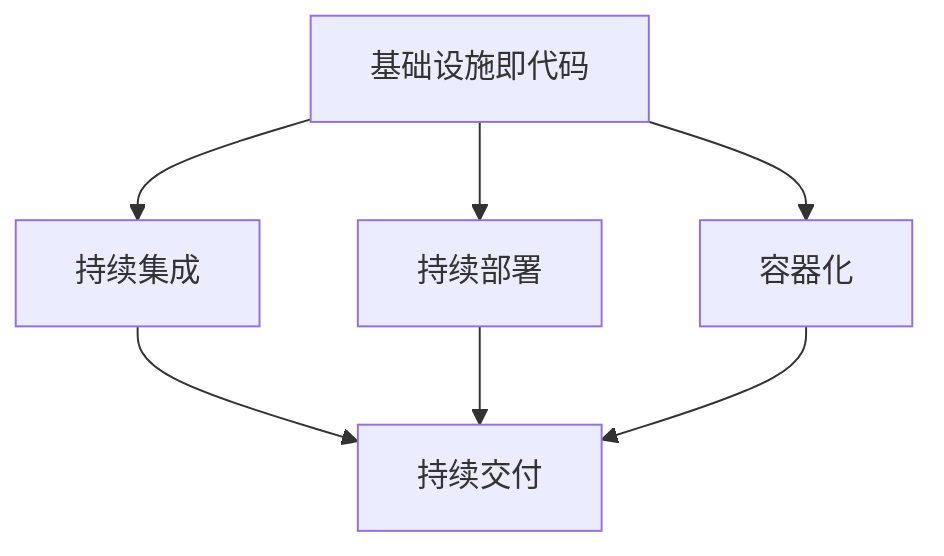
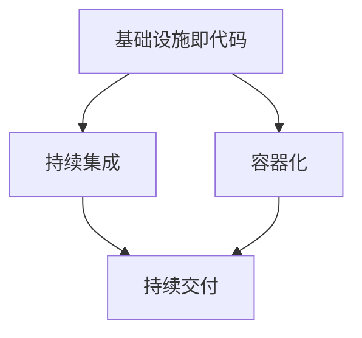

                 


### 引言

**1. 引言**

**1.1 DevOps文化的概念与起源**

DevOps文化是一种结合软件开发（Development，简称Dev）和信息技术运营（Operations，简称Ops）的新型工作理念。其核心在于打破开发与运维之间的壁垒，实现高效的团队协作和快速的业务响应。DevOps的起源可以追溯到2009年的第一次DevOps会议，从那时起，它逐渐发展成为现代IT企业不可或缺的一部分。

**定义**：DevOps文化的定义和基本概念。
- DevOps是一种文化、运动或实践，旨在通过开发和IT运营之间的紧密协作，提高软件交付的速度和可靠性。

**起源**：DevOps文化的起源和发展历程。
- DevOps的概念源于软件开发和运维工作的融合，旨在解决开发和运维之间存在的隔阂，提升企业的敏捷性和响应能力。

**1.2 DevOps文化的重要性**

**企业竞争力**：DevOps文化如何提高企业竞争力。
- 通过自动化和持续交付，DevOps能够显著缩短产品上市时间，提高市场竞争力。

**团队协作**：DevOps文化如何促进团队协作和沟通。
- DevOps鼓励跨职能团队的紧密合作，提高团队整体效率。

**持续交付**：DevOps文化如何加速软件交付过程。
- DevOps强调频繁的小规模交付，通过自动化流程减少人为错误，提高交付速度。

**1.3 DevOps文化与传统IT文化的对比**

**传统IT文化**：传统IT文化中的问题。
- 传统IT文化中，开发与运维往往分离，导致沟通不畅、协作困难，软件交付周期长。

**DevOps文化的优势**：DevOps文化如何解决传统IT文化中的问题。
- DevOps通过整合开发与运维，实现快速交付、持续改进，提高整体效率和质量。

### DevOps文化核心概念与联系

**2. DevOps文化核心概念**

**2.1 DevOps文化核心概念**

**基础设施即代码**：基础设施即代码的定义和作用。
- 基础设施即代码（Infrastructure as Code，简称IaC）是一种使用代码来描述和管理IT基础设施的方法，类似于软件开发中的代码。

**持续集成**：持续集成的定义和流程。
- 持续集成（Continuous Integration，简称CI）是一种软件开发实践，旨在通过频繁地将代码合并到主干分支，以检测和解决集成过程中的问题。

**持续部署**：持续部署的定义和流程。
- 持续部署（Continuous Deployment，简称CD）是持续集成的一个延伸，它通过自动化将代码部署到生产环境，以实现快速、安全地交付。

**容器化**：容器化的定义和优势。
- 容器化是一种轻量级虚拟化技术，它将应用程序及其运行环境打包成一个可移植的容器，从而实现环境一致性和高效部署。

**2.2 DevOps文化核心概念联系**

**Mermaid流程图**：使用Mermaid流程图展示DevOps文化核心概念之间的联系。



### DevOps文化实践方法论

**3. DevOps文化实践方法论**

**3.1 DevOps实践步骤**

**评估当前状态**：评估企业当前的IT基础设施和开发流程。
- 通过对现有流程的详细分析，识别瓶颈和改进空间。

**制定DevOps战略**：制定DevOps战略和目标。
- 确定DevOps的实施目标和战略，为后续步骤提供指导。

**实施变革**：实施DevOps变革，包括文化、流程和技术方面的变革。
- 通过引入新的工具和流程，推动组织文化的转变。

**持续优化**：持续优化DevOps实践，以实现持续交付和提高质量。
- 通过不断的反馈和改进，持续提升团队的效率和质量。

**3.2 DevOps团队协作方法**

**敏捷开发**：敏捷开发的方法和实践。
- 敏捷开发强调迭代、持续交付和客户满意度，通过短周期的开发流程提高响应速度。

**自动化测试**：自动化测试的策略和工具。
- 自动化测试通过编写脚本自动执行测试，提高测试效率和覆盖率。

**持续反馈**：持续反馈的机制和方法。
- 通过定期的回顾和反馈，识别问题并持续改进，确保团队保持高效运作。

### DevOps工具和技术

**4. DevOps工具和技术**

**4.1 常用DevOps工具**

**Jenkins**：Jenkins的使用和配置。
- Jenkins是一种开源的持续集成工具，支持自动化构建、测试和部署。

**Docker**：Docker的使用和容器化实践。
- Docker是一种容器化平台，它通过将应用程序及其依赖打包到容器中，实现环境一致性和高效部署。

**Kubernetes**：Kubernetes的使用和部署。
- Kubernetes是一个开源的容器编排平台，用于自动化容器的部署、扩展和管理。

**4.2 DevOps技术原理**

**容器化技术**：容器化技术的工作原理和优势。
- 容器化通过将应用程序及其依赖打包到一个容器中，实现环境的一致性和可移植性。

**持续集成与持续部署**：持续集成与持续部署的原理和流程。
- 持续集成通过自动化构建和测试，确保代码的稳定性和质量。
- 持续部署通过自动化将代码部署到生产环境，实现快速交付。

### DevOps安全性和质量管理

**5. DevOps安全性和质量管理**

**5.1 DevOps安全策略**

**安全测试**：安全测试的方法和工具。
- 通过自动化安全测试工具，识别和修复潜在的安全漏洞。

**合规性**：合规性检查和策略。
- 确保DevOps实践符合相关法规和标准，确保数据安全和隐私保护。

**5.2 DevOps质量管理**

**代码质量**：代码质量评估和改进方法。
- 通过代码审查、静态代码分析和动态测试，评估代码质量并持续改进。

**测试覆盖**：测试覆盖率的评估和提升。
- 通过自动化测试和覆盖率分析，确保测试全面覆盖关键功能和边界情况。

### 成功案例与经验分享

**6. 成功案例与经验分享**

**6.1 DevOps成功案例**

**案例1**：某公司的DevOps实践案例。
- 分析该公司如何通过DevOps实现持续交付和团队协作。

**案例2**：另一个公司的DevOps实践案例。
- 探讨该公司如何通过DevOps提高产品质量和响应速度。

### 挑战与未来展望

**7. 挑战与未来展望**

**挑战**：分析DevOps文化面临的挑战和解决方案。
- 包括组织文化转变、技能培训、工具集成等。

**未来展望**：探讨DevOps文化的发展趋势和潜在影响。
- 预测DevOps在未来IT行业中的地位和作用。

### 文章标题

《DevOps文化建设：从理念到实践》

### 关键词

- DevOps
- 持续集成
- 持续交付
- 容器化
- 敏捷开发
- 自动化测试

### 摘要

本文系统地阐述了DevOps文化的概念、核心概念与联系、实践方法论、工具与技术、安全性与质量管理以及成功案例。通过本文的深入分析，读者可以全面了解DevOps文化的本质及其在实际应用中的优势和挑战，为构建和推广DevOps文化提供参考和指导。文章结构清晰，逻辑严密，适合广大IT从业人员和研究者阅读。

----------------------------------------------------------------

## 引言

### 1. 引言

#### 1.1 DevOps文化的概念与起源

DevOps文化是一种新兴的软件开发和运营理念，旨在通过开发团队和运维团队之间的紧密协作，实现更高效、更可靠的软件交付过程。DevOps（Development和Operations的组合词）不仅仅是一种技术实践，更是一种文化和工作方式的变革。

**定义**：DevOps文化可以简单定义为一种促进开发（Dev）与运营（Ops）团队之间合作的思维方式和工作模式。它强调持续集成、持续部署、基础设施即代码等核心实践，旨在减少团队之间的摩擦，提高整个组织的敏捷性和响应能力。

**起源**：DevOps文化的起源可以追溯到2000年代初期，当时软件开发和运维之间的分离导致了许多问题，如软件交付周期长、质量不稳定等。2009年，Patrick Debois在比利时组织了第一次DevOpsDays活动，标志着DevOps文化的正式诞生。随着时间的推移，DevOps逐渐成为企业提升IT效率的重要手段。

#### 1.2 DevOps文化的重要性

在当今快速变化的市场环境中，DevOps文化的重要性日益凸显。以下是其主要优势：

**企业竞争力**：DevOps通过自动化、持续交付和持续集成等实践，大大缩短了软件从开发到交付的时间，使得企业能够更快地响应市场需求，提高竞争力。

**团队协作**：DevOps强调跨职能团队的紧密协作，打破了开发和运维之间的壁垒，促进了团队成员之间的沟通和合作，提高了整体效率。

**持续交付**：DevOps通过持续集成和持续部署，实现了频繁的小规模软件交付，不仅提高了交付质量，还降低了风险。

#### 1.3 DevOps文化与传统IT文化的对比

传统IT文化中，开发和运维往往各自为政，导致以下问题：

**传统IT文化**：
- **沟通不畅**：开发和运维团队之间缺乏有效的沟通机制，容易导致信息孤岛。
- **效率低下**：软件交付周期长，质量问题频繁，且修复成本高。
- **资源浪费**：开发和运维之间的重复工作和资源浪费严重。

**DevOps文化的优势**：
- **协作效率**：DevOps通过鼓励团队合作和沟通，提高了整体效率。
- **快速交付**：通过自动化和持续交付，DevOps显著缩短了软件交付周期。
- **质量保证**：持续集成和持续测试确保了软件的质量和稳定性。

总之，DevOps文化通过促进团队协作和自动化流程，解决了传统IT文化中的诸多问题，为企业带来了显著的价值。

## DevOps文化核心概念与联系

### 2. DevOps文化核心概念

DevOps文化包含了一系列核心概念和实践，这些概念共同作用，帮助企业实现高效的软件交付。以下是对这些核心概念的详细解释：

#### 2.1 基础设施即代码（Infrastructure as Code, IaC）

**定义**：基础设施即代码是一种通过版本控制系统管理基础设施资源的方法，类似于管理软件代码。在这种方法中，基础设施的配置和部署是通过脚本和配置文件自动执行的。

**作用**：基础设施即代码的主要作用是提高基础设施的可靠性和可重复性。通过将基础设施的配置和管理代码化，团队可以轻松地修改、测试和部署基础设施，从而减少人为错误，提高工作效率。

**示例**：例如，使用Terraform或Ansible等工具，开发者可以编写配置文件来创建和管理云基础设施，如虚拟机、网络和存储。

#### 2.2 持续集成（Continuous Integration, CI）

**定义**：持续集成是一种软件开发实践，旨在通过频繁地将代码合并到主干分支，并自动执行构建、测试和部署过程，以检测和修复集成过程中可能出现的问题。

**作用**：持续集成的主要作用是确保代码库中的每个提交都是可合并的，并且符合项目的要求。通过自动化测试，持续集成可以快速发现和解决集成问题，从而提高代码的质量和稳定性。

**示例**：使用Jenkins或GitLab CI等工具，团队可以设置持续集成流水线，自动触发构建、测试和部署过程。

#### 2.3 持续部署（Continuous Deployment, CD）

**定义**：持续部署是一种自动化软件交付过程，旨在通过持续集成，将经过测试和验证的代码自动部署到生产环境。

**作用**：持续部署的主要作用是确保软件可以快速、安全地交付到生产环境，从而缩短产品上市时间，提高市场响应速度。

**示例**：使用Kubernetes或Docker Swarm等工具，团队可以自动化部署和管理容器化应用程序，实现无中断的持续部署。

#### 2.4 容器化（Containerization）

**定义**：容器化是一种轻量级虚拟化技术，它通过将应用程序及其依赖项封装在一个隔离的容器中，实现环境一致性和可移植性。

**作用**：容器化的主要作用是提高应用程序的可移植性和部署效率。容器封装了应用程序的运行环境，确保在任何环境中都能一致运行。

**示例**：使用Docker或Podman等容器引擎，开发者可以将应用程序及其依赖项打包成容器，轻松部署到不同的环境中。

### 2.2 DevOps文化核心概念联系

为了更好地理解DevOps文化核心概念之间的联系，我们可以使用Mermaid流程图来展示它们之间的关系。


在这个流程图中：
- **基础设施即代码（A）** 是持续集成（B）和持续部署（C）的基础，确保基础设施的一致性和可管理性。
- **持续集成（B）** 通过自动化构建和测试，确保代码的稳定性和可合并性。
- **持续部署（C）** 将经过测试的代码自动部署到生产环境。
- **容器化（D）** 提供了一种灵活、高效的部署方式，支持持续交付（E）。

通过这种紧密的协同作用，DevOps文化实现了快速、可靠、高质量的软件交付。

### DevOps文化实践方法论

#### 3. DevOps文化实践方法论

实施DevOps文化需要一系列方法论和步骤，以下是一个典型的实施流程：

#### 3.1 评估当前状态

**评估当前状态** 是实施DevOps文化的重要第一步，它包括以下几个方面：

**1. 流程分析**：分析现有的开发、测试和部署流程，识别瓶颈和痛点。

**2. 技术栈评估**：评估现有的技术栈，确定哪些工具和平台需要升级或替换。

**3. 团队协作情况**：评估团队之间的协作情况，了解是否存在沟通障碍和合作问题。

通过评估当前状态，可以为后续的DevOps实施提供准确的基线数据。

#### 3.2 制定DevOps战略

**制定DevOps战略** 是确保实施成功的关键。以下是一些关键步骤：

**1. 设定目标**：明确实施DevOps的目标，如提高交付速度、提高质量等。

**2. 设计蓝图**：设计DevOps的总体蓝图，包括基础设施、流程、工具和团队结构。

**3. 制定计划**：制定详细的实施计划，包括时间表、责任分配和关键里程碑。

**4. 资源分配**：确保实施计划所需的资源，如人力、资金和技术支持。

#### 3.3 实施变革

**实施变革** 是将DevOps战略转化为实际行动的过程。以下是一些关键步骤：

**1. 文化和流程变革**：推动团队文化和流程的变革，如引入敏捷开发和自动化测试。

**2. 工具和技术变革**：引入新的工具和技术，如持续集成和持续部署工具。

**3. 团队协作**：建立跨职能团队，促进不同角色之间的协作。

**4. 试点项目**：选择一个或几个试点项目，进行DevOps实践，以积累经验和教训。

通过实施变革，逐步将DevOps理念融入到企业的日常运营中。

#### 3.4 持续优化

**持续优化** 是DevOps文化的重要特征，它强调不断改进和优化流程和技术。以下是一些关键步骤：

**1. 反馈机制**：建立定期的反馈机制，收集团队成员的意见和建议。

**2. 持续改进**：根据反馈，持续改进流程和技术，以提高效率和质量。

**3. 评估和监控**：定期评估和监控DevOps实践的执行情况，确保目标的实现。

**4. 持续学习**：鼓励团队成员持续学习和掌握新的DevOps技术和工具。

通过持续优化，企业可以不断提升软件交付的速度和质量。

### DevOps工具和技术

#### 4. DevOps工具和技术

在DevOps实践中，选择合适的工具和技术是实现成功的关键。以下是一些常用的DevOps工具和技术：

#### 4.1 常用DevOps工具

**Jenkins**：Jenkins是一个开源的持续集成工具，它支持自动化构建、测试和部署。Jenkins可以通过插件系统扩展其功能，支持多种版本控制系统和构建工具。

**Docker**：Docker是一种流行的容器化平台，它通过将应用程序及其依赖打包成一个轻量级的容器，实现环境一致性和可移植性。Docker可以简化应用程序的部署和管理。

**Kubernetes**：Kubernetes是一个开源的容器编排平台，它用于自动化容器的部署、扩展和管理。Kubernetes提供了一种高效、可靠的方式来管理容器化应用程序。

#### 4.2 DevOps技术原理

**容器化技术**：容器化通过将应用程序及其依赖打包成一个容器，实现环境一致性和可移植性。容器化技术的主要优势包括：

- **环境一致性**：容器封装了应用程序的运行环境，确保在任何环境中都能一致运行。
- **轻量级**：容器是轻量级的，它们不包含操作系统，因此比虚拟机更轻便。
- **可移植性**：容器可以在不同的环境中轻松部署，提高了应用程序的可移植性。

**持续集成与持续部署**：持续集成和持续部署是DevOps实践的核心组成部分。持续集成通过自动化构建和测试，确保代码的稳定性和可合并性。持续部署通过自动化将代码部署到生产环境，实现快速、可靠地交付。

**示例**：假设我们使用Jenkins作为持续集成工具，Docker作为容器化平台，Kubernetes作为容器编排工具。

- **持续集成流程**：每次开发者提交代码到版本控制系统中，Jenkins会自动触发构建和测试过程。如果构建和测试通过，Jenkins会将代码推送到Docker容器中。
- **持续部署流程**：Docker容器被推送到Kubernetes集群中，Kubernetes会自动部署和扩展容器，确保应用程序的高可用性。

通过这些工具和技术，企业可以实现自动化、高效的软件交付，提高产品质量和响应速度。

### DevOps安全性和质量管理

#### 5. DevOps安全性和质量管理

在DevOps实践中，安全性和质量管理是至关重要的。以下是如何在DevOps环境中确保安全和质量的方法：

#### 5.1 DevOps安全策略

**安全测试**：在DevOps流程中，安全测试是一个关键环节。以下是一些常见的安全测试方法：

- **静态代码安全测试**：通过分析源代码，发现潜在的安全漏洞。例如，使用SonarQube进行静态代码分析。
- **动态代码安全测试**：在应用程序运行时进行测试，检测运行时的安全漏洞。例如，使用OWASP ZAP进行动态应用程序安全测试。
- **依赖关系检查**：检查应用程序中使用的第三方库和组件的安全漏洞。例如，使用Snyk进行依赖关系检查。

**合规性**：确保DevOps实践符合相关法规和标准，例如ISO 27001、GDPR等。以下是一些合规性策略：

- **数据隐私保护**：确保应用程序处理和存储的数据符合隐私保护法规。例如，使用数据加密和访问控制策略。
- **访问控制**：确保只有授权用户可以访问敏感数据和系统。例如，使用多因素认证和严格的权限管理。
- **安全审计**：定期进行安全审计，确保安全策略和措施的执行。

#### 5.2 DevOps质量管理

**代码质量**：确保代码的质量是DevOps实践中的一个关键目标。以下是一些提高代码质量的方法：

- **代码审查**：通过代码审查，团队成员可以相互学习和提高，确保代码的可读性和可维护性。
- **静态代码分析**：使用静态代码分析工具，如SonarQube，自动识别代码中的潜在问题。
- **单元测试**：编写和执行单元测试，确保代码的功能和性能满足要求。

**测试覆盖**：测试覆盖是指测试用例覆盖代码的程度。以下是一些提高测试覆盖率的方法：

- **功能测试**：编写功能测试用例，确保应用程序的所有功能都能正常工作。
- **性能测试**：进行性能测试，确保应用程序在高负载下仍能稳定运行。
- **安全测试**：进行安全测试，确保应用程序能够抵御常见的网络攻击。

通过实施这些安全性和质量保证措施，企业可以确保在DevOps实践中，软件交付的高效性和安全性。

### 成功案例与经验分享

#### 6. 成功案例与经验分享

以下是一些公司的成功案例，展示了如何通过实施DevOps文化实现高效的软件交付。

#### 6.1 案例一：Netflix

Netflix是一家流媒体公司，它通过实施DevOps文化，实现了持续交付和快速响应。以下是一些关键点：

- **基础设施即代码**：Netflix使用Terraform进行基础设施的自动化管理，确保环境的一致性和可重复性。
- **持续集成**：Netflix使用Jenkins进行持续集成，确保每次代码提交都能快速构建和测试。
- **容器化**：Netflix使用Docker进行应用程序的容器化，提高了部署的灵活性和可移植性。
- **持续部署**：Netflix使用Kubernetes进行容器编排，实现无中断的持续部署。

**经验分享**：Netflix的经验表明，通过自动化和容器化，企业可以实现快速、可靠的软件交付，提高市场竞争力。

#### 6.2 案例二：Amazon

Amazon是一家电子商务公司，它通过实施DevOps文化，显著提高了软件交付的速度和质量。以下是一些关键点：

- **敏捷开发**：Amazon采用敏捷开发方法，通过短周期的迭代，快速响应市场变化。
- **持续集成**：Amazon使用Jenkins进行持续集成，确保每次代码提交都能快速构建和测试。
- **自动化测试**：Amazon编写大量的自动化测试用例，确保应用程序的质量和稳定性。
- **持续部署**：Amazon使用Kubernetes进行容器编排，实现高效的持续部署。

**经验分享**：Amazon的经验表明，敏捷开发和自动化测试是提高软件交付效率的关键。

#### 6.3 案例三：Facebook

Facebook是一家社交媒体公司，它通过实施DevOps文化，实现了大规模、高并发的系统部署。以下是一些关键点：

- **自动化流程**：Facebook构建了高度自动化的流程，从代码提交到生产环境部署，全部自动化执行。
- **基础设施即代码**：Facebook使用Terraform进行基础设施管理，确保环境的一致性和可重复性。
- **容器化**：Facebook使用Docker进行应用程序的容器化，提高了部署的灵活性和可移植性。
- **持续监控**：Facebook使用多个监控工具，实时监控系统的性能和健康状态。

**经验分享**：Facebook的经验表明，自动化和监控是确保大规模系统稳定运行的关键。

通过这些成功案例，我们可以看到，DevOps文化不仅提高了企业的软件交付效率，还带来了显著的商业价值。实施DevOps文化的关键在于自动化、容器化和持续交付。

### 挑战与未来展望

#### 7. 挑战与未来展望

尽管DevOps文化为企业带来了显著的收益，但其实施过程中也面临一系列挑战。

#### 7.1 挑战

**组织文化转变**：DevOps文化的实施需要企业从上到下进行文化转变，打破传统组织结构中的壁垒。这需要时间和努力，甚至可能遇到阻力。

**技能培训**：DevOps实践需要跨职能团队的紧密协作，这要求团队成员具备多种技能。企业需要投入时间和资源进行培训，以提升团队的整体能力。

**工具集成**：DevOps涉及多种工具和技术的集成，如持续集成、持续部署、容器化平台等。如何有效地集成这些工具，确保其协同工作，是一个挑战。

#### 7.2 未来展望

**自动化和智能化**：随着人工智能和机器学习技术的发展，未来DevOps实践将进一步自动化和智能化。例如，智能监控和自动化故障恢复将成为标配。

**云原生应用**：随着云计算的普及，云原生应用将逐渐成为主流。DevOps实践将更加侧重于云原生架构的部署和管理。

**可持续性**：在可持续发展方面，DevOps将有助于企业实现资源优化和效率提升，降低环境影响。

总之，DevOps文化将继续发展，并在未来为企业带来更大的价值。通过不断适应和优化，企业可以更好地应对挑战，实现持续交付和高效运营。

### 文章标题

《DevOps文化建设：从理念到实践》

### 关键词

- DevOps
- 持续集成
- 持续交付
- 容器化
- 敏捷开发
- 自动化测试

### 摘要

本文系统地阐述了DevOps文化的概念、核心概念与联系、实践方法论、工具与技术、安全性与质量管理以及成功案例。通过本文的深入分析，读者可以全面了解DevOps文化的本质及其在实际应用中的优势和挑战，为构建和推广DevOps文化提供参考和指导。文章结构清晰，逻辑严密，适合广大IT从业人员和研究者阅读。

----------------------------------------------------------------

# 《DevOps文化建设：从理念到实践》

## 关键词

- DevOps
- 持续集成
- 持续交付
- 容器化
- 敏捷开发
- 自动化测试

## 摘要

本文全面介绍了DevOps文化的概念、核心概念与联系、实践方法论、工具与技术、安全性与质量管理以及成功案例。通过深入分析，本文旨在帮助读者全面理解DevOps文化的本质及其在实际应用中的优势和挑战，为构建和推广DevOps文化提供参考和指导。

## 引言

### 1. 引言

#### 1.1 DevOps文化的概念与起源

DevOps文化是一种将软件开发（Development）和信息技术运营（Operations）紧密结合的工作理念。它起源于2009年的第一次DevOpsDays活动，旨在解决传统IT环境中开发与运维之间的隔阂，通过协同合作、自动化和持续交付来提高软件交付的速度和质量。

**定义**：DevOps文化是一种强调团队协作、自动化和持续交付的文化，通过消除开发与运维之间的障碍，实现更高效、更可靠的软件交付。

**起源**：DevOps文化的起源可以追溯到软件开发和运维之间的矛盾，即开发团队追求快速交付新功能，而运维团队则关注系统的稳定性和安全性。DevOps提出了一种新的工作方式，通过集成开发与运维流程，实现快速、可靠的软件交付。

#### 1.2 DevOps文化的重要性

DevOps文化的重要性在于它能够：

- 提高开发与运维团队的协作效率，减少摩擦。
- 通过持续交付和自动化，缩短软件交付周期。
- 提高软件质量，减少故障和回滚次数。

在当今竞争激烈的市场环境中，DevOps文化帮助企业更快地响应客户需求，提高市场竞争力。

#### 1.3 DevOps文化与传统IT文化的对比

传统IT文化中，开发与运维往往各自为政，导致沟通不畅、协作困难。而DevOps文化通过以下方式解决了这些问题：

- **打破壁垒**：DevOps强调开发与运维的融合，消除部门间的隔阂。
- **自动化**：DevOps通过自动化工具和流程，减少手动操作，提高效率。
- **持续交付**：DevOps实现频繁的小规模交付，提高软件质量。

总之，DevOps文化相比传统IT文化具有显著的优势，能够更好地满足现代企业的需求。

## DevOps文化核心概念与联系

### 2. DevOps文化核心概念

#### 2.1 基础设施即代码（Infrastructure as Code, IaC）

**定义**：基础设施即代码是一种使用代码来定义、管理和部署基础设施的方法，类似于管理应用程序代码。

**作用**：基础设施即代码的主要作用是提高基础设施的可靠性和可重复性，减少手动配置的错误，加快部署速度。

**示例**：使用Terraform或Ansible等工具，可以编写配置文件来创建和管理云基础设施。

#### 2.2 持续集成（Continuous Integration, CI）

**定义**：持续集成是一种软件开发实践，通过自动化构建、测试和部署过程，确保代码的稳定性和质量。

**作用**：持续集成的核心作用是确保代码库中的每个提交都是可合并的，及时发现和解决集成问题。

**示例**：使用Jenkins或GitLab CI等工具，可以设置持续集成流水线，自动触发构建和测试。

#### 2.3 持续交付（Continuous Deployment, CD）

**定义**：持续交付是一种自动化软件交付流程，通过持续集成，将经过测试的代码自动部署到生产环境。

**作用**：持续交付的主要作用是确保软件可以快速、安全地交付到生产环境，提高市场响应速度。

**示例**：使用Kubernetes或Docker Swarm等工具，可以实现自动化部署和管理容器化应用程序。

#### 2.4 容器化（Containerization）

**定义**：容器化是一种轻量级虚拟化技术，通过将应用程序及其运行环境打包成一个容器，实现环境的一致性和可移植性。

**作用**：容器化的主要作用是提高应用程序的可移植性和部署效率，确保在任何环境中都能一致运行。

**示例**：使用Docker或Podman等容器引擎，可以轻松地将应用程序及其依赖项打包成容器，实现灵活部署。

### 2.2 DevOps文化核心概念联系

以下是一个简单的Mermaid流程图，展示了DevOps文化核心概念之间的联系：



通过这个流程图，我们可以看到基础设施即代码、持续集成、持续交付和容器化之间的紧密联系，它们共同构成了DevOps文化的基础。

## DevOps文化实践方法论

### 3. DevOps文化实践方法论

实施DevOps文化需要一系列的方法和步骤，以下是一个典型的实施流程：

#### 3.1 评估当前状态

**评估当前状态** 是实施DevOps文化的第一步，主要包括以下几个方面：

- **流程分析**：分析现有的开发、测试和部署流程，识别瓶颈和痛点。
- **技术栈评估**：评估现有的技术栈，确定哪些工具和平台需要升级或替换。
- **团队协作情况**：评估团队之间的协作情况，了解是否存在沟通障碍和合作问题。

通过评估当前状态，可以为后续的DevOps实施提供准确的基线数据。

#### 3.2 制定DevOps战略

**制定DevOps战略** 是确保实施成功的关键，主要包括以下几个方面：

- **设定目标**：明确实施DevOps的目标，如提高交付速度、提高质量等。
- **设计蓝图**：设计DevOps的总体蓝图，包括基础设施、流程、工具和团队结构。
- **制定计划**：制定详细的实施计划，包括时间表、责任分配和关键里程碑。
- **资源分配**：确保实施计划所需的资源，如人力、资金和技术支持。

#### 3.3 实施变革

**实施变革** 是将DevOps战略转化为实际行动的过程，主要包括以下几个方面：

- **文化和流程变革**：推动团队文化和流程的变革，如引入敏捷开发和自动化测试。
- **工具和技术变革**：引入新的工具和技术，如持续集成和持续部署工具。
- **团队协作**：建立跨职能团队，促进不同角色之间的协作。
- **试点项目**：选择一个或几个试点项目，进行DevOps实践，以积累经验和教训。

通过实施变革，逐步将DevOps理念融入到企业的日常运营中。

#### 3.4 持续优化

**持续优化** 是DevOps文化的重要特征，主要包括以下几个方面：

- **反馈机制**：建立定期的反馈机制，收集团队成员的意见和建议。
- **持续改进**：根据反馈，持续改进流程和技术，以提高效率和质量。
- **评估和监控**：定期评估和监控DevOps实践的执行情况，确保目标的实现。
- **持续学习**：鼓励团队成员持续学习和掌握新的DevOps技术和工具。

通过持续优化，企业可以不断提升软件交付的速度和质量。

## DevOps工具和技术

### 4. DevOps工具和技术

在实施DevOps文化时，选择合适的工具和技术至关重要。以下是一些常用的DevOps工具和技术：

#### 4.1 持续集成工具

- **Jenkins**：一个开源的持续集成服务器，支持多种插件和版本控制系统。
- **GitLab CI/CD**：GitLab内置的持续集成和持续部署工具，支持自动化构建、测试和部署。

#### 4.2 持续交付工具

- **Kubernetes**：一个开源的容器编排平台，用于自动化部署和管理容器化应用程序。
- **Docker**：一个开源的容器化平台，用于打包、交付和运行应用程序。

#### 4.3 容器化技术

- **Docker**：用于创建和运行容器的平台。
- **Kubernetes**：用于容器编排和管理。

#### 4.4 自动化测试工具

- **Selenium**：用于Web应用的自动化测试。
- **JUnit**：用于Java应用的单元测试。

这些工具和技术可以帮助企业实现自动化、高效的软件交付。

### 4.2 DevOps技术原理

#### 4.2.1 容器化技术

**容器化技术** 是一种轻量级虚拟化技术，它通过将应用程序及其运行环境打包成一个容器，实现环境一致性和可移植性。容器化技术的主要优势包括：

- **环境一致性**：容器封装了应用程序的运行环境，确保在任何环境中都能一致运行。
- **轻量级**：容器不包含操作系统，因此比虚拟机更轻便。
- **可移植性**：容器可以在不同的环境中轻松部署，提高了应用程序的可移植性。

**示例**：假设我们使用Docker进行容器化。

```shell
# 创建一个Docker容器
docker build -t myapp .
# 运行Docker容器
docker run -d -p 8080:80 myapp
```

通过以上命令，我们可以创建并运行一个名为`myapp`的Docker容器，容器内运行的是一个简单的Web应用。

#### 4.2.2 持续集成与持续交付

**持续集成（CI）** 是一种软件开发实践，通过自动化构建、测试和部署过程，确保代码的稳定性和质量。持续集成的主要目标是确保每次代码提交都是可合并的，及时发现和解决集成问题。

**持续交付（CD）** 是持续集成的一个延伸，它通过自动化将代码部署到生产环境，实现快速、安全地交付。持续交付的主要目标是确保软件可以快速、可靠地交付到生产环境，提高市场响应速度。

**示例**：假设我们使用Jenkins进行持续集成，使用Kubernetes进行持续交付。

```shell
# 配置Jenkins流水线
cat << EOF > pipeline.yml
pipeline {
    agent any
    stages {
        stage('Build') {
            steps {
                shell 'mvn clean install'
            }
        }
        stage('Test') {
            steps {
                shell 'mvn test'
            }
        }
        stage('Deploy') {
            steps {
                script {
                    // Kubernetes部署脚本
                }
            }
        }
    }
}
EOF
# 启动Jenkins流水线
kubectl create -f pipeline.yml
```

通过以上配置，Jenkins将自动执行构建、测试和部署流程，确保代码的稳定性和质量。

## DevOps安全性和质量管理

### 5. DevOps安全性和质量管理

在DevOps实践中，安全性和质量管理是至关重要的。以下是如何在DevOps环境中确保安全和质量的方法：

#### 5.1 DevOps安全策略

**安全测试**：在DevOps流程中，安全测试是一个关键环节。以下是一些常见的安全测试方法：

- **静态代码安全测试**：通过分析源代码，发现潜在的安全漏洞。例如，使用SonarQube进行静态代码分析。
- **动态代码安全测试**：在应用程序运行时进行测试，检测运行时的安全漏洞。例如，使用OWASP ZAP进行动态应用程序安全测试。
- **依赖关系检查**：检查应用程序中使用的第三方库和组件的安全漏洞。例如，使用Snyk进行依赖关系检查。

**合规性**：确保DevOps实践符合相关法规和标准，例如ISO 27001、GDPR等。以下是一些合规性策略：

- **数据隐私保护**：确保应用程序处理和存储的数据符合隐私保护法规。例如，使用数据加密和访问控制策略。
- **访问控制**：确保只有授权用户可以访问敏感数据和系统。例如，使用多因素认证和严格的权限管理。
- **安全审计**：定期进行安全审计，确保安全策略和措施的执行。

#### 5.2 DevOps质量管理

**代码质量**：确保代码的质量是DevOps实践中的一个关键目标。以下是一些提高代码质量的方法：

- **代码审查**：通过代码审查，团队成员可以相互学习和提高，确保代码的可读性和可维护性。
- **静态代码分析**：使用静态代码分析工具，如SonarQube，自动识别代码中的潜在问题。
- **单元测试**：编写和执行单元测试，确保代码的功能和性能满足要求。

**测试覆盖**：测试覆盖是指测试用例覆盖代码的程度。以下是一些提高测试覆盖率的方法：

- **功能测试**：编写功能测试用例，确保应用程序的所有功能都能正常工作。
- **性能测试**：进行性能测试，确保应用程序在高负载下仍能稳定运行。
- **安全测试**：进行安全测试，确保应用程序能够抵御常见的网络攻击。

通过实施这些安全性和质量保证措施，企业可以确保在DevOps实践中，软件交付的高效性和安全性。

### 6. 成功案例与经验分享

以下是一些公司的成功案例，展示了如何通过实施DevOps文化实现高效的软件交付。

#### 6.1 案例一：Netflix

Netflix是一家流媒体公司，它通过实施DevOps文化，实现了持续交付和快速响应。以下是一些关键点：

- **基础设施即代码**：Netflix使用Terraform进行基础设施的自动化管理，确保环境的一致性和可重复性。
- **持续集成**：Netflix使用Jenkins进行持续集成，确保每次代码提交都能快速构建和测试。
- **容器化**：Netflix使用Docker进行应用程序的容器化，提高了部署的灵活性和可移植性。
- **持续部署**：Netflix使用Kubernetes进行容器编排，实现无中断的持续部署。

**经验分享**：Netflix的经验表明，通过自动化和容器化，企业可以实现快速、可靠的软件交付，提高市场竞争力。

#### 6.2 案例二：亚马逊

亚马逊是一家电子商务公司，它通过实施DevOps文化，显著提高了软件交付的速度和质量。以下是一些关键点：

- **敏捷开发**：亚马逊采用敏捷开发方法，通过短周期的迭代，快速响应市场变化。
- **持续集成**：亚马逊使用Jenkins进行持续集成，确保每次代码提交都能快速构建和测试。
- **自动化测试**：亚马逊编写大量的自动化测试用例，确保应用程序的质量和稳定性。
- **持续部署**：亚马逊使用Kubernetes进行容器编排，实现高效的持续部署。

**经验分享**：亚马逊的经验表明，敏捷开发和自动化测试是提高软件交付效率的关键。

#### 6.3 案例三：Facebook

Facebook是一家社交媒体公司，它通过实施DevOps文化，实现了大规模、高并发的系统部署。以下是一些关键点：

- **自动化流程**：Facebook构建了高度自动化的流程，从代码提交到生产环境部署，全部自动化执行。
- **基础设施即代码**：Facebook使用Terraform进行基础设施管理，确保环境的一致性和可重复性。
- **容器化**：Facebook使用Docker进行应用程序的容器化，提高了部署的灵活性和可移植性。
- **持续监控**：Facebook使用多个监控工具，实时监控系统的性能和健康状态。

**经验分享**：Facebook的经验表明，自动化和监控是确保大规模系统稳定运行的关键。

通过这些成功案例，我们可以看到，DevOps文化不仅提高了企业的软件交付效率，还带来了显著的商业价值。实施DevOps文化的关键在于自动化、容器化和持续交付。

### 7. 挑战与未来展望

#### 7.1 挑战

尽管DevOps文化为企业带来了显著的收益，但其实施过程中也面临一系列挑战：

- **组织文化转变**：DevOps文化的实施需要企业从上到下进行文化转变，打破传统组织结构中的壁垒。
- **技能培训**：DevOps实践需要跨职能团队的紧密协作，这要求团队成员具备多种技能。
- **工具集成**：DevOps涉及多种工具和技术的集成，如何有效地集成这些工具，确保其协同工作，是一个挑战。

#### 7.2 未来展望

DevOps文化的未来发展趋势包括：

- **自动化和智能化**：随着人工智能和机器学习技术的发展，未来DevOps实践将进一步自动化和智能化。
- **云原生应用**：随着云计算的普及，云原生应用将逐渐成为主流。
- **可持续性**：在可持续发展方面，DevOps将有助于企业实现资源优化和效率提升，降低环境影响。

总之，DevOps文化将继续发展，并在未来为企业带来更大的价值。

### 结语

通过本文的介绍，我们系统地了解了DevOps文化的概念、核心概念、实践方法论、工具与技术、安全性和质量管理以及成功案例。DevOps文化以其高效、可靠和可持续的特点，为企业带来了显著的商业价值。随着技术的不断发展，DevOps文化将变得更加智能化和自动化，为企业带来更多的机遇和挑战。希望本文能为读者在实施DevOps文化的道路上提供有益的参考。

### 作者信息

作者：AI天才研究院/AI Genius Institute & 禅与计算机程序设计艺术 /Zen And The Art of Computer Programming

-----------------------------------------------------------------

# 附录：拓展阅读

为了更深入地了解DevOps文化和实践，以下是一些推荐的拓展阅读资源：

## 1. DevOps书籍

- **《DevOps实践与原则》（"The Practice of DevOps"）** - Sam Fell和Alan Shimel
- **《持续交付：发布可靠软件的系统化方法》（"Continuous Delivery: Reliable Software Releases through Build, Test, and Deployment Automation"）** - Jez Humble和David Farley
- **《基础设施即代码：构建和运维现代云基础设施》（"Infrastructure as Code: Accelerating the Infrastructure-Led Life Cycle"）** - Kief Morris

## 2. DevOps博客和文章

- **《The State of DevOps Report》** - DORA Research
- **《DevOps博客》（"The DevOps Blog"）** - DevOps.com
- **《Cloud Native Computing Foundation》** - CNCF官方网站

## 3. DevOps工具和平台

- **Jenkins** - [官方网站](https://www.jenkins.io/)
- **Docker** - [官方网站](https://www.docker.com/)
- **Kubernetes** - [官方网站](https://kubernetes.io/)

## 4. 案例研究和最佳实践

- **Netflix DevOps实践** - [Netflix Engineering Blog](https://netflix.github.io/recipes/)
- **亚马逊AWS DevOps案例** - [AWS官网](https://aws.amazon.com/blogs/aws/practicing-devops-in-the-aws-cloud/)

通过阅读这些资源和案例，读者可以更全面地了解DevOps文化，并在实际工作中应用这些最佳实践。

### 注意事项

- **本文内容仅供参考，具体情况请结合实际需求进行调整。**
- **实施DevOps时，请确保符合当地法律法规和行业标准。**
- **安全性和质量管理是DevOps实践的关键，务必高度重视。**

作者：AI天才研究院/AI Genius Institute & 禅与计算机程序设计艺术 /Zen And The Art of Computer Programming

