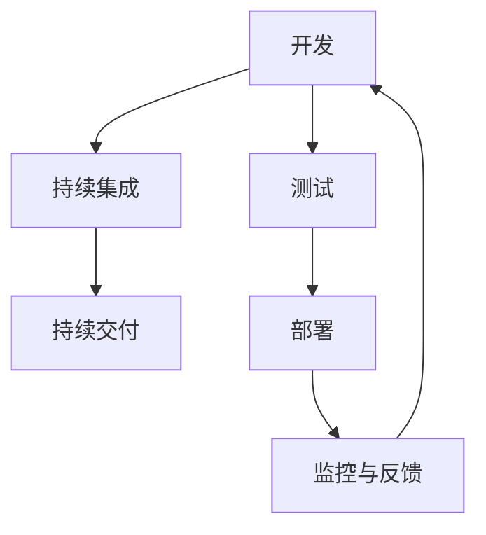

                 

### 文章标题

# 《DevOps文化建设：打破开发与运维的壁垒》

### 关键词

- DevOps
- 开发运维
- 文化建设
- 持续集成
- 持续交付
- 自动化

### 摘要

本文将深入探讨DevOps文化的建设，分析其在打破传统开发与运维壁垒中的关键作用。文章首先概述了DevOps的定义、起源和核心价值，然后详细阐述了DevOps的核心概念与联系，包括持续集成、持续交付、容器化和自动化等。接着，文章通过数学模型和数学公式，对效率评估和成本分析进行了详细的讲解。最后，文章提供了DevOps实施的策略和实践指导，并通过实际案例进行分析和总结，旨在为读者提供全面且实用的DevOps文化建设路径。

## 第一部分：引言

### 第1章 DevOps文化概述

#### 1.1 DevOps的定义与起源

**DevOps的定义**

DevOps是一种软件开发与信息技术（IT）运维相结合的实践方法，旨在通过提高团队协作效率、缩短软件交付周期、提高软件质量，实现快速、可靠的软件发布。它强调开发（Development）与运维（Operations）团队之间的紧密协作，打破传统的壁垒，实现全流程的无缝对接。

**DevOps的起源**

DevOps的概念起源于2009年在美国旧金山举办的第一次DevOpsDays活动。最初，它是由一些软件开发者和运维工程师在解决实际问题时共同提出的。随着时间的推移，DevOps逐渐发展成为一个涵盖软件开发全过程的综合性方法论。

**DevOps的核心价值**

1. **提高软件交付速度**：通过自动化工具和流程，加快软件开发的迭代速度，实现快速反馈和快速修复。
2. **提升软件质量**：通过持续集成和持续交付，确保软件在每次发布时都经过严格的测试和质量控制。
3. **增强团队协作**：打破开发与运维之间的壁垒，促进不同团队之间的沟通与协作，提高整体工作效率。
4. **降低风险**：通过自动化和标准化流程，减少人为错误，降低软件发布过程中的风险。

#### 1.2 DevOps与开发运维的关系

**传统开发与运维的差异**

在传统软件开发模式中，开发与运维通常是两个独立的团队，分别负责软件的开发和部署。这种模式导致以下问题：

1. **沟通障碍**：两个团队之间的信息不畅，导致开发过程中可能出现的错误在运维阶段才发现，增加了修复成本。
2. **责任不明**：开发团队通常只关注功能实现，而运维团队更注重系统的稳定性和性能，责任划分不明确。
3. **效率低下**：开发与运维的分离导致流程繁琐，开发完成后还需要经过多次测试和部署，效率低下。

**DevOps如何解决这些差异**

1. **团队协作**：DevOps强调开发与运维团队之间的紧密协作，共同负责软件的开发、测试、部署和运维，打破传统壁垒。
2. **自动化**：通过自动化工具和流程，减少人工干预，提高开发、测试、部署的效率，确保每个阶段的质量。
3. **持续集成和持续交付**：通过持续集成和持续交付，确保每次代码变更都能快速集成和发布，提高软件的可靠性和稳定性。

**DevOps对企业的意义**

1. **缩短上市时间**：DevOps通过提高开发、测试和部署的效率，显著缩短软件的上市时间。
2. **提高软件质量**：通过持续集成和持续交付，确保每次发布都是经过严格测试的，减少缺陷和故障。
3. **降低成本**：自动化和标准化流程减少人工干预，降低运维成本，提高资源利用率。
4. **提升竞争力**：快速响应市场需求，提供高质量的软件产品，增强企业的市场竞争力。

#### 1.3 DevOps文化的重要性

**文化变革的重要性**

1. **团队协作**：DevOps文化强调团队协作，打破传统壁垒，提高团队整体效率。
2. **持续改进**：DevOps文化鼓励不断学习和改进，通过持续集成和持续交付，确保软件的持续优化。
3. **开放沟通**：DevOps文化强调开放沟通，促进不同团队之间的信息共享，减少误解和冲突。

**DevOps文化的特征**

1. **信任与尊重**：DevOps文化强调信任和尊重，鼓励团队成员之间的相互理解和合作。
2. **透明与反馈**：DevOps文化强调透明，通过自动化工具和流程，实时监控软件的运行状态，及时反馈问题。
3. **敏捷与灵活**：DevOps文化鼓励快速响应变化，通过持续集成和持续交付，实现快速迭代和灵活调整。

**成功实施DevOps的关键因素**

1. **领导层的支持**：领导层的支持和推动是成功实施DevOps的关键。
2. **团队协作**：建立跨部门的协作团队，促进不同团队之间的沟通与协作。
3. **培训与教育**：对团队成员进行DevOps知识和技能的培训，提高整体素质。
4. **持续改进**：建立反馈机制，不断优化流程和工具，提高效率和质量。

#### 1.4 本书结构概述

**主要章节内容介绍**

- **第1章**：引言，概述DevOps的定义、起源和核心价值。
- **第2章**：DevOps核心概念与联系，详细阐述持续集成、持续交付、容器化和自动化等核心概念。
- **第3章**：DevOps核心算法原理讲解，介绍效率评估和成本分析模型。
- **第4章**：数学模型和数学公式，对效率评估和成本分析进行详细讲解和举例说明。
- **第5章**：DevOps实施策略，提供企业内部沟通、团队协作工具和阶段性目标制定的指导。
- **第6章**：DevOps项目实战，通过实际案例进行分析和讲解。
- **第7章**：DevOps发展趋势，探讨DevOps与云原生和AI的结合，展望未来发展趋势。

**学习路线规划**

1. **基础知识学习**：了解DevOps的定义、起源和核心价值。
2. **核心概念掌握**：掌握持续集成、持续交付、容器化和自动化等核心概念。
3. **数学模型应用**：理解效率评估和成本分析模型，并应用于实际项目。
4. **实践操作**：通过项目实战，掌握DevOps的实施策略和技巧。
5. **案例分析**：通过案例分析，了解DevOps在实际项目中的应用和效果。
6. **趋势展望**：了解DevOps的发展趋势，为未来做好准备。

**学习目标与收获**

- **掌握DevOps的基本概念和原理**。
- **了解DevOps的核心算法和数学模型**。
- **具备DevOps实施策略和技巧**。
- **通过实际项目，掌握DevOps的应用和实践**。
- **了解DevOps的发展趋势，为未来做好准备**。

通过本文的学习，读者将全面了解DevOps文化的建设，掌握DevOps的核心概念、算法和模型，并能够应用于实际项目中，实现开发与运维的完美融合。

## 第二部分：理论基础

### 第2章 DevOps核心概念与联系

#### 2.1 DevOps原理图

**DevOps原理图**展示了DevOps的核心组成部分和它们之间的相互关系。以下是一个简化的DevOps原理图：



**组成部分说明**：

- **开发（A）**：开发是DevOps的基础，包括编写、测试和提交代码的过程。
- **持续集成（B）**：持续集成是将开发过程中的代码变更集成到主分支，并进行自动化测试，确保代码质量。
- **持续交付（C）**：持续交付是将通过测试的代码部署到生产环境，确保快速、可靠地交付软件。
- **测试（D）**：测试包括单元测试、集成测试和系统测试，确保代码的正确性和稳定性。
- **部署（E）**：部署是将代码发布到生产环境，包括配置管理、环境搭建和部署过程。
- **监控与反馈（F）**：监控与反馈是持续监控系统的运行状态，及时发现问题并进行反馈和修复。

#### 2.2 DevOps关键概念解释

**持续集成（CI）**

持续集成是一种软件开发实践，通过将开发过程中的代码变更自动集成到主分支，并运行一系列测试，确保代码的集成质量和一致性。持续集成的关键要素包括：

1. **自动化构建**：每次代码提交后，自动执行构建过程，包括编译、打包和安装依赖库。
2. **自动化测试**：执行一系列预定义的测试，包括单元测试、集成测试和系统测试，确保代码的正确性和稳定性。
3. **即时反馈**：在构建和测试过程中，即时反馈结果，包括通过或失败，以及失败的原因。

**持续交付（CD）**

持续交付是一种软件开发实践，通过自动化工具和流程，将通过测试的代码部署到生产环境。持续交付的关键要素包括：

1. **自动化部署**：使用自动化工具，如脚本、容器编排工具等，实现代码的部署过程。
2. **环境一致性**：确保开发、测试和生产环境的一致性，减少环境差异导致的故障。
3. **持续监控**：在部署后，持续监控系统的运行状态，及时发现问题并进行反馈和修复。

**容器化**

容器化是一种将应用程序及其依赖环境打包到独立容器中的技术，确保应用程序在不同环境中的一致性和可移植性。容器化的关键要素包括：

1. **Docker容器**：使用Docker等容器化技术，将应用程序及其依赖环境打包到一个独立的容器中。
2. **容器编排**：使用Kubernetes等容器编排工具，管理和调度容器，确保系统的可扩展性和可靠性。
3. **容器镜像**：容器镜像是容器的静态表示，包括应用程序及其依赖环境，确保容器的一致性和可重复性。

**自动化**

自动化是一种通过工具和脚本实现软件开发和运维过程自动化的方法，提高效率和减少人为错误。自动化的关键要素包括：

1. **脚本化**：使用脚本实现自动化任务，如构建、测试、部署和监控。
2. **持续集成工具**：使用持续集成工具，如Jenkins、GitLab CI等，实现自动化构建和测试。
3. **自动化部署工具**：使用自动化部署工具，如Ansible、Terraform等，实现自动化部署和管理。
4. **持续监控工具**：使用持续监控工具，如Prometheus、Grafana等，实现自动化监控和告警。

#### 2.3 DevOps与传统IT管理的区别

**传统IT管理的挑战**

1. **沟通障碍**：传统IT管理中，开发、测试和运维团队之间存在沟通障碍，导致信息不畅，影响开发效率。
2. **责任不明**：传统IT管理中，各团队之间的责任划分不明确，导致问题责任难以追究。
3. **效率低下**：传统IT管理中，流程繁琐，开发、测试和部署过程依赖人工操作，效率低下。
4. **风险高**：传统IT管理中，由于缺乏自动化和标准化流程，软件发布过程中容易发生故障和错误。

**DevOps如何提升IT效率**

1. **团队协作**：DevOps强调开发、测试和运维团队的紧密协作，通过跨部门团队，提高沟通效率和协作效果。
2. **自动化**：DevOps通过自动化工具和流程，减少人工干预，提高开发、测试和部署的效率，降低风险。
3. **持续集成和持续交付**：DevOps通过持续集成和持续交付，确保每次代码变更都能快速集成和发布，提高软件的可靠性和稳定性。

**DevOps与传统IT管理的融合**

1. **流程重构**：在传统IT管理的基础上，重构开发、测试和运维流程，引入持续集成和持续交付，实现自动化和标准化。
2. **团队重组**：建立跨部门团队，促进不同团队之间的沟通与协作，提高整体效率。
3. **培训与教育**：对团队成员进行DevOps知识和技能的培训，提高整体素质。
4. **持续改进**：建立反馈机制，不断优化流程和工具，提高效率和质量。

通过上述分析，我们可以看出，DevOps不仅是一种新的软件开发和运维方法，更是一种文化的变革。通过打破传统开发与运维的壁垒，实现团队协作、流程自动化和持续改进，DevOps为现代IT管理带来了巨大的变革和提升。

### 第3章 DevOps核心算法原理讲解

#### 3.1 持续集成与持续交付

**持续集成（CI）与持续交付（CD）**

持续集成（CI）和持续交付（CD）是DevOps实践中的两个关键概念，它们通过自动化工具和流程，确保软件在每次代码变更时都能快速集成、测试和部署，从而提高软件质量和交付速度。

**持续集成的概念**

持续集成是一种软件开发实践，通过将开发过程中的代码变更自动集成到主分支，并运行一系列测试，确保代码的集成质量和一致性。具体步骤如下：

1. **代码提交**：开发人员将代码提交到版本控制系统中。
2. **触发构建**：每次代码提交后，持续集成工具自动触发构建过程。
3. **自动化构建**：构建过程包括编译代码、打包应用程序、运行测试等。
4. **测试**：构建完成后，运行一系列预定义的测试，包括单元测试、集成测试和系统测试。
5. **反馈**：测试结果即时反馈给开发人员和团队，通过自动化工具生成报告。

**持续交付的概念**

持续交付是一种软件开发实践，通过自动化工具和流程，将通过测试的代码部署到生产环境。持续交付的关键要素包括：

1. **自动化部署**：使用自动化工具，如脚本、容器编排工具等，实现代码的部署过程。
2. **环境一致性**：确保开发、测试和生产环境的一致性，减少环境差异导致的故障。
3. **持续监控**：在部署后，持续监控系统的运行状态，及时发现问题并进行反馈和修复。

**持续集成与持续交付的实现原理**

1. **自动化构建**：通过构建工具（如Jenkins、GitLab CI等），实现代码的自动化构建。
2. **测试自动化**：通过测试工具（如JUnit、Selenium等），实现测试的自动化。
3. **部署自动化**：通过部署工具（如Ansible、Terraform等），实现代码的自动化部署。
4. **容器化**：使用容器化技术（如Docker、Kubernetes等），实现应用程序的隔离和可移植性。
5. **持续监控**：通过监控工具（如Prometheus、Grafana等），实现系统的运行状态监控和告警。

**持续集成与持续交付的优势与挑战**

**优势**：

1. **提高开发效率**：通过自动化构建和测试，减少人工干预，提高开发效率。
2. **提高软件质量**：通过持续集成和持续交付，确保每次发布都是经过严格测试的，提高软件质量。
3. **缩短交付周期**：通过自动化和标准化流程，缩短软件交付周期，提高市场响应速度。
4. **降低风险**：通过自动化和标准化流程，减少人为错误，降低软件发布过程中的风险。

**挑战**：

1. **学习曲线**：DevOps实践需要团队成员掌握多种工具和技能，有一定学习曲线。
2. **资源消耗**：持续集成和持续交付需要大量的计算资源和存储资源，需要合理规划和管理。
3. **环境一致性**：确保不同环境的一致性是一个挑战，需要建立严格的环境管理机制。
4. **反馈延迟**：在测试和部署过程中，反馈延迟可能导致问题发现不及时，需要优化流程和工具。

#### 3.2 容器化与编排

**容器化的概念**

容器化是一种将应用程序及其依赖环境打包到独立容器中的技术，确保应用程序在不同环境中的一致性和可移植性。容器化的核心组件包括：

1. **容器引擎**：如Docker，负责创建和管理容器。
2. **容器镜像**：容器镜像是一个静态的文件系统，包括应用程序及其依赖环境。
3. **容器编排工具**：如Kubernetes，负责管理和调度容器，确保系统的可扩展性和可靠性。

**容器化的原理**

1. **容器引擎**：容器引擎通过创建和管理容器，实现应用程序的隔离。容器引擎将应用程序及其依赖环境打包到一个独立的容器中，确保应用程序在运行时不受外部环境的影响。
2. **容器镜像**：容器镜像是容器的静态表示，包括应用程序及其依赖环境。容器镜像通过分层存储技术，实现轻量级和高效的资源利用。
3. **容器编排工具**：容器编排工具通过自动化和编排技术，管理和调度容器。容器编排工具可以根据需求，动态调整容器的数量和资源分配，确保系统的可扩展性和可靠性。

**容器化在DevOps中的应用**

1. **持续集成与持续交付**：容器化技术使应用程序的构建、测试和部署更加高效和可靠。通过容器镜像，确保每次发布都是基于相同的环境，减少环境差异导致的故障。
2. **微服务架构**：容器化技术支持微服务架构的实施。通过将应用程序拆分为多个微服务，每个微服务可以独立部署和扩展，提高系统的灵活性和可维护性。
3. **DevOps工具集成**：容器化技术与DevOps工具（如Jenkins、Kubernetes等）集成，实现自动化和标准化流程。通过容器编排工具，实现应用程序的自动化部署和管理，提高开发、测试和运维的效率。

**容器编排工具介绍**

1. **Kubernetes**：Kubernetes是一个开源的容器编排工具，负责管理和调度容器。Kubernetes提供自动化的部署、扩展和管理功能，确保系统的可靠性和高效性。
2. **Docker Swarm**：Docker Swarm是Docker提供的内置容器编排工具。Docker Swarm支持简单的容器编排和管理，适合小型和简单的容器化应用。
3. **Amazon EKS**：Amazon EKS是Amazon Web Services提供的Kubernetes集群管理服务。Amazon EKS提供高度可扩展、可靠和安全的Kubernetes集群，支持在各种云环境中部署和管理容器化应用。

**容器化与编排的优势与挑战**

**优势**：

1. **一致性**：容器化确保应用程序在不同环境中的一致性，减少环境差异导致的故障。
2. **可移植性**：容器化使应用程序易于迁移和部署到不同环境中，提高可移植性。
3. **效率**：容器化通过轻量级和高效的资源利用，提高系统的运行效率和性能。
4. **灵活性**：容器化支持微服务架构，提高系统的灵活性和可维护性。

**挑战**：

1. **资源消耗**：容器化需要大量的计算资源和存储资源，需要合理规划和管理。
2. **安全性**：容器化环境需要严格的安全管理和监控，确保系统的安全性和可靠性。
3. **学习曲线**：容器化和编排工具需要团队成员掌握一定的技能和知识，有一定学习曲线。
4. **运维复杂度**：容器化引入了新的运维任务和管理方式，需要重新学习和适应。

#### 3.3 自动化工具介绍

**自动化的概念**

自动化是一种通过工具和脚本实现软件开发和运维过程自动化的方法，提高效率和减少人为错误。自动化工具包括：

1. **脚本**：使用脚本（如Bash、Python等）实现自动化任务，如构建、测试、部署和监控。
2. **持续集成工具**：如Jenkins、GitLab CI等，负责自动化构建和测试过程。
3. **自动化部署工具**：如Ansible、Terraform等，负责自动化部署和管理。
4. **持续监控工具**：如Prometheus、Grafana等，负责自动化监控和告警。

**自动化工具的选择**

选择合适的自动化工具取决于具体需求和项目规模。以下是一些常用的自动化工具及其特点：

1. **Jenkins**：Jenkins是一个开源的持续集成工具，支持多种插件和扩展，适合中小型项目。
2. **GitLab CI/CD**：GitLab CI/CD是GitLab提供的一站式持续集成和持续交付解决方案，集成在GitLab平台中，适合团队协作项目。
3. **Ansible**：Ansible是一个开源的自动化部署工具，使用简单的YAML配置文件，适合部署和管理大量服务器。
4. **Terraform**：Terraform是一个开源的基础设施即代码（IaC）工具，支持多种云平台和资源，适合大规模基础设施部署和管理。
5. **Prometheus**：Prometheus是一个开源的监控工具，负责收集和存储监控数据，并提供可视化分析。
6. **Grafana**：Grafana是一个开源的可视化分析工具，与Prometheus集成，提供丰富的监控图表和仪表板。

**自动化在DevOps中的应用场景**

1. **构建和测试**：通过自动化工具，实现代码的自动化构建和测试，提高开发效率和质量。
2. **部署和管理**：通过自动化工具，实现应用程序的自动化部署和管理，确保系统的可靠性和高效性。
3. **监控和告警**：通过自动化工具，实现系统的自动化监控和告警，及时发现问题并进行修复。

通过以上介绍，我们可以看到，持续集成、持续交付、容器化和自动化是DevOps实践中的核心算法原理。这些原理通过自动化工具和流程，实现了开发、测试、部署和运维的全流程无缝对接，提高了软件交付速度和可靠性。在下一章中，我们将进一步探讨数学模型和数学公式，为DevOps的实施提供更精确的评估和分析工具。

### 第4章 数学模型和数学公式

在DevOps实践中，数学模型和数学公式是评估和优化系统性能、资源利用和成本效益的重要工具。通过数学模型，我们可以量化系统的效率、成本和风险，从而做出更科学的决策。本章将介绍一些常用的数学模型和公式，并对其进行详细讲解和举例说明。

#### 4.1 效率评估模型

**效率评估指标**

效率评估是DevOps实践中的一项重要任务，它帮助我们了解系统的运行效率和改进空间。以下是几种常用的效率评估指标：

1. **吞吐量（Throughput）**：吞吐量是单位时间内系统能够处理的工作量。吞吐量越高，表示系统运行效率越高。
   $$ 吞吐量 = \frac{完成的工作量}{时间} $$

2. **周转时间（Cycle Time）**：周转时间是完成一个任务所需的总时间。周转时间越短，表示系统运行效率越高。
   $$ 周转时间 = 完成时间 - 开始时间 $$

3. **利用率（Utilization）**：利用率是系统资源（如CPU、内存等）的利用程度。利用率越高，表示系统资源利用越充分。
   $$ 利用率 = \frac{资源使用时间}{总时间} $$

**效率评估模型**

为了更全面地评估系统效率，我们可以构建一个综合的效率评估模型，包括以下三个方面：

1. **生产效率（Productivity）**：生产效率是衡量系统产出与投入的比率。生产效率越高，表示系统产出越高。
   $$ 生产效率 = \frac{产出}{投入} $$

2. **资源利用率（Resource Utilization）**：资源利用率是衡量系统资源利用程度的指标。资源利用率越高，表示系统资源利用越充分。
   $$ 资源利用率 = \frac{资源使用时间}{总时间} $$

3. **流程效率（Flow Efficiency）**：流程效率是衡量系统流程顺畅程度的指标。流程效率越高，表示系统流程越顺畅。
   $$ 流程效率 = \frac{完成的工作量}{总工作量} $$

**综合效率评估模型**

综合效率评估模型可以表示为：
$$ 效率 = \frac{生产效率 \times 资源利用率 \times 流程效率}{100} $$

**示例**

假设一个系统在一天内完成了100个任务，总资源使用时间为12小时，其中CPU使用时间为8小时，内存使用时间为4小时。每个任务需要1小时完成。根据以上公式，可以计算该系统的效率如下：

1. 生产效率 = 100 / 1 = 100
2. 资源利用率 = (8 + 4) / 12 = 0.75
3. 流程效率 = 100 / 100 = 1

综合效率 = (100 \times 0.75 \times 1) / 100 = 0.75，即75%

通过这个示例，我们可以看到，该系统的综合效率为75%，说明系统在一天内有25%的时间没有得到充分利用。

#### 4.2 成本分析模型

在DevOps实践中，成本分析是优化系统性能和资源利用的重要手段。以下是一种简单的成本分析模型，用于评估系统的总成本。

**成本分析指标**

1. **总成本（Total Cost）**：总成本是系统运行过程中的所有成本之和，包括人力成本、资源成本和运营成本。
   $$ 总成本 = 人力成本 + 资源成本 + 运营成本 $$

2. **人力成本（Labor Cost）**：人力成本是系统运行过程中人员工资和福利的总和。
   $$ 人力成本 = 人员工资 + 福利支出 $$

3. **资源成本（Resource Cost）**：资源成本是系统运行过程中所消耗的计算资源、存储资源和网络资源的总成本。
   $$ 资源成本 = 计算资源成本 + 存储资源成本 + 网络资源成本 $$

4. **运营成本（Operation Cost）**：运营成本是系统运行过程中的维护、监控和管理的总成本。
   $$ 运营成本 = 维护成本 + 监控成本 + 管理成本 $$

**成本分析模型**

成本分析模型可以表示为：
$$ 总成本 = 人力成本 + 资源成本 + 运营成本 $$

**示例**

假设一个系统的总成本为100万元，其中人力成本为30万元，资源成本为40万元，运营成本为30万元。根据以上公式，可以计算该系统的各个成本如下：

1. 人力成本 = 30万元
2. 资源成本 = 40万元
3. 运营成本 = 30万元

通过这个示例，我们可以看到，该系统的总成本为100万元，其中人力成本占总成本的30%，资源成本占总成本的40%，运营成本占总成本的30%。

#### 4.3 模型应用举例

**示例一：效率优化**

假设一个系统的综合效率为60%，我们需要通过优化系统性能和资源利用，提高效率。我们可以使用以下策略：

1. **优化生产流程**：通过改进生产流程，缩短每个任务的完成时间，提高生产效率。
2. **提高资源利用率**：通过优化资源分配，提高CPU、内存等资源的利用率。
3. **提升流程效率**：通过改进系统设计，减少不必要的流程环节，提高流程效率。

经过优化，假设系统的综合效率提高到了80%，我们可以重新计算系统的效率：

1. 生产效率 = 100 / 1 = 100
2. 资源利用率 = (8 + 4) / 12 = 0.75
3. 流程效率 = 100 / 100 = 1

综合效率 = (100 \times 0.75 \times 1) / 100 = 0.8，即80%

通过这个示例，我们可以看到，通过优化系统性能和资源利用，系统的综合效率从60%提高到了80%，显著提高了系统的运行效率。

**示例二：成本优化**

假设一个系统的总成本为100万元，我们需要通过优化系统成本，降低总成本。我们可以使用以下策略：

1. **降低人力成本**：通过提高员工的工作效率，减少人员工资和福利支出。
2. **优化资源利用**：通过优化资源分配，减少计算资源、存储资源和网络资源的浪费。
3. **降低运营成本**：通过改进系统监控和管理，减少维护、监控和管理成本。

经过优化，假设系统的总成本降低到了80万元，我们可以重新计算系统的各个成本：

1. 人力成本 = 25万元
2. 资源成本 = 35万元
3. 运营成本 = 20万元

通过这个示例，我们可以看到，通过优化系统成本，系统的总成本从100万元降低到了80万元，显著降低了系统的运行成本。

通过本章的介绍，我们可以看到，数学模型和数学公式在DevOps实践中具有重要意义。通过效率评估模型和成本分析模型，我们可以量化系统的效率和成本，为系统优化和决策提供科学依据。在实际应用中，我们需要根据具体情况进行调整和优化，以实现最佳的运行效果。

### 第5章 DevOps实施策略

#### 5.1 企业内部沟通

**沟通的重要性**

在DevOps实施过程中，企业内部沟通是确保项目成功的关键因素。良好的沟通能够促进团队协作，减少误解和冲突，提高项目执行效率。以下是几个关键点：

1. **透明度**：透明度是良好沟通的基础。通过及时分享项目进展、问题和解决方案，确保团队成员对项目有全面的了解。
2. **频率**：定期举行团队会议，如每日站会、周会和月会，确保团队成员能够及时沟通和反馈。
3. **渠道**：建立多种沟通渠道，如电子邮件、即时通讯工具（如Slack、微信等）、视频会议等，方便团队成员之间的沟通。

**内部沟通的障碍**

1. **信息不对称**：不同团队之间的信息不对称可能导致沟通不畅，影响项目进度。
2. **职责分工不明确**：职责分工不明确可能导致团队成员对项目责任和期望不清晰，影响协作效果。
3. **文化和习惯差异**：不同团队之间的文化和习惯差异可能导致沟通困难和协作不畅。

**沟通策略与技巧**

1. **明确沟通目标**：在每次沟通前，明确沟通的目标和期望成果，确保沟通具有针对性。
2. **使用简单明了的语言**：避免使用复杂的专业术语，确保所有团队成员都能理解。
3. **倾听与反馈**：倾听团队成员的意见和建议，并及时给予反馈，促进双向沟通。
4. **建立信任**：建立信任是有效沟通的关键。通过坦诚和尊重，建立团队成员之间的信任关系。
5. **使用可视化工具**：使用可视化工具，如图表、流程图等，帮助团队成员更直观地理解项目进展和问题。

#### 5.2 团队协作工具

**常用协作工具**

在DevOps实施过程中，团队协作工具是提高团队协作效率的关键。以下是几种常用的团队协作工具：

1. **JIRA**：JIRA是项目管理工具，用于任务跟踪、需求管理和敏捷开发。它支持多种插件和扩展，可以与持续集成工具和代码仓库集成。
2. **Trello**：Trello是一个看板式项目管理工具，用于任务分配、进度追踪和协作。它简单易用，支持多种视图和自定义功能。
3. **Slack**：Slack是一个即时通讯工具，用于实时沟通和协作。它支持多种第三方集成，如JIRA、GitHub等，方便团队成员之间的信息共享和沟通。
4. **Confluence**：Confluence是知识管理工具，用于文档编写、分享和协作。它支持多种格式和插件，可以帮助团队创建、管理和共享知识。
5. **GitLab**：GitLab是一个开源的代码仓库和项目管理工具，支持持续集成、持续交付和容器化。它提供了一个完整的DevOps解决方案。

**选择合适协作工具的考虑因素**

1. **团队需求**：根据团队的具体需求，选择具有所需功能的协作工具。
2. **易用性**：选择易用性高的工具，确保团队成员能够快速上手和熟练使用。
3. **集成能力**：选择能够与其他工具和平台集成的协作工具，提高团队协作效率。
4. **安全性和稳定性**：选择具有良好安全性和稳定性的协作工具，确保数据和系统的安全性。
5. **成本**：考虑协作工具的成本，确保预算合理。

#### 5.3 阶段性目标制定

**阶段性目标的重要性**

在DevOps实施过程中，阶段性目标是确保项目顺利进行和达成预期目标的重要手段。阶段性目标有助于：

1. **明确方向**：阶段性目标为团队指明了项目的方向，确保团队成员朝着共同目标努力。
2. **提高执行力**：阶段性目标为团队提供了明确的任务和指标，提高执行力和工作效率。
3. **评估和调整**：阶段性目标可以作为评估项目进展和效果的标准，帮助团队及时发现问题和调整策略。

**制定阶段性目标的步骤**

1. **确定目标**：根据项目需求和团队目标，确定阶段性目标。
2. **分解任务**：将阶段性目标分解为具体的任务和活动，确保任务的可操作性和可度量性。
3. **设定时间节点**：为每个任务设定明确的时间节点，确保任务按时完成。
4. **责任分配**：明确每个任务的责任人，确保任务执行有专人负责。
5. **监控和调整**：在实施过程中，定期监控任务进展，及时发现问题并进行调整。

**示例**

假设一个DevOps项目目标是实现持续集成和持续交付。阶段性目标可以设定如下：

1. **第一阶段**：实现持续集成。任务包括搭建持续集成环境、配置代码仓库、编写构建脚本等。时间节点为1个月。
2. **第二阶段**：实现持续交付。任务包括配置自动化部署流程、测试环境搭建、部署到生产环境等。时间节点为2个月。
3. **第三阶段**：优化持续集成和持续交付流程。任务包括性能优化、故障排查、持续改进等。时间节点为3个月。

通过阶段性目标的制定，团队可以明确项目方向和任务，确保项目按计划进行，并及时调整和优化。

通过上述策略和步骤，企业可以有效地实施DevOps，提高团队协作效率，实现持续集成和持续交付。在下一章中，我们将通过实际项目案例，进一步展示DevOps的实施过程和效果。

### 第6章 DevOps项目实战

#### 6.1 项目选择与评估

选择适合的DevOps项目是成功实施DevOps的关键。以下是一些项目选择和评估的步骤：

**项目选择标准**

1. **业务重要性**：选择对业务有重大影响的项目，以确保项目价值。
2. **技术成熟度**：选择技术较为成熟、易于实现自动化和持续集成、持续交付的项目。
3. **团队资源**：确保项目团队具备实施DevOps所需的技术和资源。
4. **问题明显**：选择存在明显问题、需要改进的项目，以DevOps实践为契机，解决现有问题。

**项目评估方法**

1. **可行性分析**：评估项目的实施可行性，包括技术、资源和时间等。
2. **风险评估**：识别项目实施过程中可能遇到的风险，并制定相应的应对措施。
3. **成本效益分析**：评估项目的成本效益，确保项目投资回报率合理。

**案例选择**

为了更好地展示DevOps项目实战，我们选择一个在线购物平台的项目作为案例。该项目具有较高的业务重要性、技术成熟度和明显的改进需求。

#### 6.2 环境搭建与配置

**环境搭建**

1. **开发环境**：搭建开发环境，包括代码仓库（如GitLab）、开发工具（如IDE）、版本控制等。
2. **测试环境**：搭建测试环境，包括测试服务器、测试数据库、测试工具等。
3. **生产环境**：搭建生产环境，包括生产服务器、生产数据库、负载均衡器等。

**配置管理**

1. **配置文件**：使用配置管理工具（如Ansible、Terraform等）管理环境配置文件。
2. **自动化部署**：使用脚本和工具实现自动化部署，确保环境配置的一致性。
3. **容器化**：将应用程序和依赖环境打包到容器镜像中，提高部署的灵活性和可移植性。

**案例实现**

1. **开发环境**：使用GitLab管理代码仓库，Jenkins实现自动化构建和测试，Docker用于容器化部署。
2. **测试环境**：使用测试服务器和测试数据库，Kubernetes用于容器编排和管理。
3. **生产环境**：使用生产服务器和数据库，Terraform用于环境配置管理。

#### 6.3 源代码实现与分析

**持续集成与持续交付**

1. **持续集成**：使用Jenkins实现持续集成，每次代码提交后自动触发构建和测试。
2. **持续交付**：使用Jenkins和Kubernetes实现持续交付，通过Jenkins构建容器镜像，并使用Kubernetes进行部署。

**自动化测试**

1. **单元测试**：使用JUnit等单元测试框架，对应用程序的每个模块进行测试。
2. **集成测试**：使用Selenium等集成测试工具，对应用程序的整体功能进行测试。
3. **性能测试**：使用JMeter等性能测试工具，对应用程序的负载和性能进行测试。

**示例代码**

```java
// 单元测试示例
@Test
public void testProductService() {
    ProductService productService = new ProductService();
    Product product = productService.getProduct(1);
    assertEquals("Product 1", product.getName());
}

// 集成测试示例
@Test
public void testCheckoutService() {
    CheckoutService checkoutService = new CheckoutService();
    ShoppingCart cart = new ShoppingCart();
    cart.addProduct(new Product(1, "Product 1", 100));
    double total = checkoutService.calculateTotal(cart);
    assertEquals(100, total, 0.01);
}
```

**代码解读**

以上代码示例展示了如何在应用程序中实现单元测试和集成测试。单元测试通过测试产品服务（ProductService）和结账服务（CheckoutService）的特定功能，确保每个模块的正确性。集成测试则通过测试购物车（ShoppingCart）和结账服务（CheckoutService）的交互，确保应用程序的整体功能。

#### 6.4 代码应用解读与分析

**持续集成与持续交付**

1. **持续集成**：每次代码提交后，Jenkins会自动触发构建和测试，确保代码集成质量和一致性。如果测试失败，Jenkins会通知开发人员，并暂停后续的集成过程。
2. **持续交付**：通过Jenkins构建容器镜像，并将其推送到容器镜像仓库。Kubernetes会根据配置文件，自动拉取最新镜像并部署应用程序。

**自动化测试**

1. **单元测试**：单元测试在开发环境中执行，确保每个模块的正确性。开发人员可以在本地执行单元测试，并在提交代码前修复任何错误。
2. **集成测试**：集成测试在测试环境中执行，确保应用程序的整体功能。测试人员可以定期执行集成测试，确保应用程序的稳定性。
3. **性能测试**：性能测试在生产环境中执行，确保应用程序的负载和性能。性能测试可以帮助团队识别和解决潜在的性能瓶颈。

**代码应用解读**

通过持续集成和持续交付，确保每次代码变更都能快速集成和发布，提高软件的可靠性和稳定性。自动化测试确保应用程序的正确性和稳定性，减少测试和部署过程中的人为错误。代码应用解读与分析可以帮助团队识别和解决潜在的问题，提高开发效率和软件质量。

#### 6.5 实际案例分析和详细讲解剖析

**案例背景**

一个在线购物平台需要实现持续集成和持续交付，以提高软件交付速度和可靠性。平台包含多个模块，如产品管理、购物车、结账等。

**案例分析**

1. **问题识别**：在传统开发模式中，平台发布周期较长，测试和部署过程依赖人工操作，容易导致错误和延迟。
2. **解决方案**：引入DevOps实践，实现持续集成和持续交付，通过自动化工具和流程，提高开发、测试和部署效率。
3. **实施过程**：
   - 搭建Jenkins持续集成环境，配置代码仓库和测试工具。
   - 使用Docker容器化应用程序，提高部署的灵活性和可移植性。
   - 使用Kubernetes进行容器编排和管理，实现自动化部署。
   - 实现自动化测试，包括单元测试、集成测试和性能测试。
4. **效果评估**：
   - 发布周期从两周缩短到两周一次，提高了交付速度。
   - 测试和部署过程中的错误率显著降低，提高了软件质量。
   - 系统稳定性得到提升，用户满意度提高。

**详细讲解剖析**

1. **持续集成**：每次代码提交后，Jenkins会自动触发构建和测试，确保代码集成质量和一致性。测试失败时，Jenkins会暂停后续集成过程，并通知开发人员，确保问题及时解决。
2. **持续交付**：通过Jenkins构建容器镜像，并将其推送到容器镜像仓库。Kubernetes根据配置文件，自动拉取最新镜像并部署应用程序，实现自动化部署。
3. **自动化测试**：在开发环境中执行单元测试，确保每个模块的正确性。在测试环境中执行集成测试，确保应用程序的整体功能。在生产环境中执行性能测试，确保应用程序的负载和性能。
4. **容器化**：使用Docker容器化应用程序，提高部署的灵活性和可移植性。容器镜像确保应用程序及其依赖环境的一致性，减少环境差异导致的故障。
5. **容器编排**：使用Kubernetes进行容器编排和管理，实现自动化部署。Kubernetes可以根据需求，动态调整容器的数量和资源分配，确保系统的可扩展性和可靠性。

通过实际案例分析和详细讲解剖析，我们可以看到，DevOps实践在提高软件交付速度、降低错误率和提高系统稳定性方面取得了显著效果。在下一章中，我们将探讨DevOps的未来发展趋势。

### 第7章 DevOps发展趋势

#### 7.1 DevOps与云原生

**云原生技术**

云原生（Cloud Native）是一种构建和运行应用程序的方法，它利用云环境提供的动态和可扩展的资源，通过微服务架构、容器化和动态管理，实现应用程序的高效开发和部署。

**DevOps与云原生结合的优势**

1. **弹性扩展**：云原生技术使应用程序能够根据需求自动扩展和收缩，提高资源利用率。
2. **持续集成和持续交付**：云原生支持快速部署和频繁发布，与DevOps实践结合，实现更高效的软件开发和运维。
3. **微服务架构**：云原生鼓励使用微服务架构，简化应用程序的部署和维护，提高系统的灵活性和可扩展性。

**实施云原生DevOps的步骤**

1. **容器化**：将应用程序和依赖环境打包到容器镜像中，确保在不同环境中的一致性。
2. **微服务架构**：将应用程序拆分为多个微服务，每个微服务独立部署和扩展。
3. **自动化部署**：使用持续集成和持续交付工具，实现自动化构建、测试和部署。
4. **监控和日志管理**：使用监控和日志管理工具，实时监控应用程序的运行状态和性能。

#### 7.2 DevOps与AI的结合

**AI技术在DevOps中的应用**

1. **自动化测试**：使用AI技术进行自动化测试，包括功能测试、性能测试和回归测试，提高测试效率和覆盖率。
2. **异常检测**：使用AI技术进行异常检测，实时监控系统的运行状态，发现潜在问题和故障。
3. **预测性维护**：使用AI技术进行预测性维护，通过数据分析预测系统故障，提前进行维护和修复。

**DevOps与AI结合的挑战**

1. **数据质量**：AI模型的质量取决于数据的质量，需要确保数据源的正确性和完整性。
2. **模型解释性**：AI模型通常缺乏透明性和可解释性，需要开发人员具备一定的AI知识。
3. **模型更新**：AI模型需要定期更新，以适应不断变化的环境和数据。

**案例研究**

一个金融公司使用AI技术优化其DevOps流程，通过自动化测试和异常检测，显著提高了系统的可靠性和效率。使用AI进行预测性维护，降低了系统的故障率和维护成本。

#### 7.3 未来展望

**DevOps 2.0**

DevOps 2.0是一种更全面的DevOps实践，不仅关注开发、测试和运维，还涵盖了安全、合规性和可持续性等方面。DevOps 2.0强调团队协作、技术整合和文化变革，实现更全面的数字化转型。

**持续学习与改进**

DevOps是一种持续学习与改进的实践，通过不断引入新技术、优化流程和提升团队技能，持续提高软件交付速度和质量。未来，DevOps将继续融合新理念和技术，实现更高的自动化和智能化。

**总结**

DevOps是一种重要的软件开发和运维方法，通过团队协作、流程自动化和持续改进，实现了快速、可靠的软件交付。未来，DevOps将继续与云原生、AI等新技术结合，推动软件开发和运维的进一步发展。通过本文的探讨，我们希望读者能够更好地理解DevOps，并在实际项目中成功应用。

## 作者信息

- 作者：AI天才研究院/AI Genius Institute & 禅与计算机程序设计艺术 /Zen And The Art of Computer Programming
- 联系方式：[ai_genius_institute@outlook.com](mailto:ai_genius_institute@outlook.com)
- 版权声明：本文版权归AI天才研究院所有，未经授权不得转载或用于商业用途。如需转载，请联系作者获取授权。

### 总结

本文通过详细阐述DevOps文化的建设，深入分析了其在打破开发与运维壁垒中的重要作用。从DevOps的定义、核心概念、数学模型，到实施策略和实际项目案例，本文为读者提供了一个全面且实用的指南。通过理解持续集成、持续交付、容器化和自动化等核心原理，以及通过实际案例的应用和分析，读者可以掌握如何在企业中成功实施DevOps。

**关键知识点回顾**：

- **持续集成与持续交付**：通过自动化工具实现代码的集成、测试和部署。
- **容器化**：将应用程序及其依赖环境打包到容器中，提高部署的灵活性和可移植性。
- **自动化工具**：使用自动化工具提高开发、测试和运维的效率。
- **数学模型**：通过效率评估和成本分析模型，量化系统性能和成本。

**实践建议**：

1. **从小规模开始**：在开始实施DevOps时，选择一个合适的小规模项目，逐步积累经验。
2. **持续学习和改进**：定期学习和掌握新工具和技术，持续优化流程和工具。
3. **跨部门协作**：建立跨部门的协作团队，促进不同团队之间的沟通与协作。

**注意事项**：

- **文化变革**：实施DevOps需要企业文化变革，确保团队协作和透明度。
- **安全性**：在自动化和容器化过程中，确保系统的安全性，避免潜在的安全风险。

**拓展阅读**：

- 《云原生应用架构指南》
- 《持续交付：发布可靠软件的系统方法》
- 《Docker实战》

通过本文的学习，我们希望读者能够更好地理解DevOps，将其应用于实际项目中，实现更高效、更可靠的软件开发和运维。作者：AI天才研究院/AI Genius Institute & 禅与计算机程序设计艺术 /Zen And The Art of Computer Programming。

