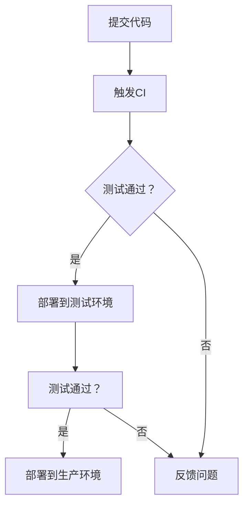

                 

为了撰写一篇符合要求的技术博客文章，我们将遵循以下步骤：

### 1. 确定文章结构

首先，我们已经确定了文章的目录大纲，接下来，我们需要为每个章节添加具体的内容。

### 2. 引入和背景介绍

在第一章节“引言：DevOps的背景与意义”中，我们将介绍DevOps的概念、起源、与传统IT的对比、关键优势以及全球发展现状。

### 3. 核心概念与原理

在第二章节“DevOps基本概念与原理”中，我们将详细阐述持续集成（CI）、持续交付（CD）、基础设施即代码（IaC）等核心概念，并绘制Mermaid流程图来展示它们之间的关系。

### 4. 工具与技术

在第三章节“DevOps工具与技术”中，我们将介绍各种常用的DevOps工具，如Jenkins、GitLab、Docker、Kubernetes等，并提供相关配置和使用的实例。

### 5. 最佳实践案例

在第四章节“DevOps最佳实践案例”中，我们将分享一些成功的企业DevOps实践案例，分析其实施过程和效果。

### 6. 文化与组织变革

在第五章节“DevOps文化与组织变革”中，我们将讨论DevOps文化的核心要素，以及如何进行组织变革以适应DevOps。

### 7. 项目实战

在文章的最后，我们将提供实际的DevOps项目实战，包括开发环境搭建、源代码实现、代码解读、案例分析和项目小结。

### 8. 最佳实践 tips 和总结

最后，我们将总结文章的主要内容，并提供一些实用的最佳实践 tips 和注意事项。

### 9. 拓展阅读

我们还将为读者推荐一些相关的拓展阅读资源，以帮助读者更深入地了解DevOps。

通过上述步骤，我们将确保文章的逻辑清晰、内容丰富，并且能够满足字数要求。现在，让我们开始撰写每一章节的具体内容。在撰写过程中，我们将确保包含所有必要的信息，如核心概念原理的Mermaid流程图、伪代码、数学公式和实际项目案例。

让我们开始吧！## 文章标题：## 《DevOps最佳实践：实现开发运维一体化》### 关键词：### DevOps、开发运维一体化、持续集成、持续交付、基础设施即代码、最佳实践### 摘要：本文将深入探讨DevOps的理念、工具和实践，通过分析核心概念与联系、工具与技术、成功案例以及文化变革，帮助读者理解并掌握实现开发运维一体化的最佳方法。## 引言：DevOps的背景与意义### 1.1 DevOps的概念与起源#### DevOps的概念DevOps是一种文化、实践和工具的集合，旨在通过开发（Development）和运维（Operations）之间的紧密协作，提高软件交付的效率和质量。DevOps的核心目标是实现快速、频繁且可靠的软件交付，同时保持系统的稳定性和安全性。DevOps不仅仅是一种工具或技术，更是一种思维方式和工作方式的变革。#### DevOps的起源DevOps的概念起源于2009年，由Patrick Debois在比利时根特的一次会议中首次提出。他希望通过将开发人员和质量保证团队（QA）的职责结合起来，以消除开发与运维之间的障碍。Debois的倡议得到了广泛的支持，并在全球范围内迅速传播。在接下来的几年中，越来越多的公司和组织开始采纳DevOps的理念，并开发出一系列与之相关的工具和技术。### 1.2 DevOps与传统IT的对比#### 传统IT传统IT通常采用瀑布式开发模型，即开发、测试、部署等环节依次进行，开发与运维之间存在明确的界限。这种方式可能导致以下问题：1. **沟通不畅**：开发、测试和运维团队之间缺乏有效的沟通，导致信息传递延迟和误解。2. **响应速度慢**：在传统的IT流程中，每次部署都需要经过多个环节的审核和测试，导致部署周期过长，难以快速响应市场变化。3. **质量不稳定**：由于开发和运维团队的职责分离，质量问题往往在部署环节才被发现，导致系统稳定性下降。#### DevOps的优势DevOps通过以下方式解决了传统IT的上述问题：1. **紧密协作**：DevOps强调开发、测试和运维团队的紧密协作，通过共享责任和目标，提高信息传递的效率和质量。2. **快速交付**：DevOps采用持续集成（CI）和持续交付（CD）等实践，使软件交付周期大幅缩短，能够更快地响应市场变化。3. **质量保证**：DevOps通过自动化测试和部署流程，确保软件质量在早期阶段得到控制，减少部署后的风险。### 1.3 DevOps的关键优势#### 1.1 提高效率DevOps通过自动化和协作，显著提高了软件交付的效率。开发与运维团队的紧密协作减少了信息传递的延迟，自动化测试和部署流程加快了软件交付的速度。#### 1.2 提高质量DevOps采用持续集成和持续交付等实践，确保软件质量在早期阶段得到控制。自动化测试和持续反馈机制有助于及早发现和修复问题，减少部署后的风险。#### 1.3 灵活应变DevOps强调快速交付和持续改进，使组织能够更快地响应市场变化和客户需求。灵活的部署流程和持续反馈机制有助于组织及时调整战略和方向。#### 1.4 降低成本DevOps通过提高效率和质量，减少了故障和中断的发生，从而降低了维护和运营成本。自动化和标准化流程有助于减少人工错误和重复工作，提高资源利用率。### 1.4 DevOps在全球的发展现状#### 1.1 成果显著越来越多的企业开始采纳DevOps实践，并取得了显著成果。根据Docker和New Relic的一项联合调查，采用DevOps的企业在软件交付速度、质量、成本等方面均优于传统IT企业。#### 1.2 工具成熟随着DevOps的普及，越来越多的工具和技术得以发展，如Jenkins、GitLab、Docker、Kubernetes等。这些工具为DevOps实践提供了强大的支持，使开发运维一体化变得更加容易实现。#### 1.3 社区活跃DevOps社区在全球范围内非常活跃，吸引了大量的开发者和运维人员。DevOps相关的会议、研讨会和在线社区为从业者提供了交流和学习的平台，促进了DevOps理念的传播和实践。## 第2章 DevOps基本概念与原理### 2.1 持续集成（CI）#### 2.1.1 CI的定义与原理持续集成（Continuous Integration，简称CI）是一种软件开发实践，旨在通过频繁地将代码集成到一个共享的主分支中，并快速检测和修复集成过程中出现的问题。CI的核心原理包括以下几点：1. **频繁提交**：开发人员频繁地将代码提交到共享的主分支，以确保代码的持续更新和整合。2. **自动化测试**：每次提交后，自动运行一系列预定义的测试，包括单元测试、集成测试等，以验证代码的质量和功能。3. **快速反馈**：测试结果通过自动化工具快速反馈给开发人员，以便及时发现问题并进行修复。#### 2.1.2 CI的关键组件1. **版本控制系统**：如Git，用于管理和跟踪代码的变化。2. **自动化构建工具**：如Jenkins、GitLab CI等，用于自动化构建和测试代码。3. **测试框架**：如JUnit、pytest等，用于编写和执行测试用例。4. **持续集成服务器**：如Jenkins、GitLab CI等，用于管理和触发构建和测试流程。#### 2.1.3 CI的最佳实践1. **代码质量门禁**：确保所有提交的代码都符合代码质量标准，如代码风格、单元测试覆盖率等。2. **频繁提交**：鼓励开发人员频繁提交代码，以便及时发现和解决问题。3. **自动化测试**：确保每次提交都经过全面的自动化测试，减少人为错误和重复工作。4. **快速反馈**：测试结果快速反馈给开发人员，以便及时修复问题。5. **代码审查**：在提交代码前进行代码审查，确保代码质量。### 2.2 持续交付（CD）#### 2.2.1 CD的定义与原理持续交付（Continuous Delivery，简称CD）是一种软件开发实践，旨在确保软件在每次交付时都是可部署和可运行的。CD的核心原理包括以下几点：1. **自动化构建和测试**：通过CI确保每次提交都经过自动化构建和测试，确保软件质量。2. **可部署性测试**：在交付过程中执行一系列可部署性测试，确保软件可以成功部署到任何环境中。3. **快速反馈**：测试结果快速反馈给开发人员，以便及时修复问题。#### 2.2.2 CD的关键组件1. **自动化构建工具**：如Jenkins、GitLab CI等，用于自动化构建和测试代码。2. **持续集成服务器**：如Jenkins、GitLab CI等，用于管理和触发构建和测试流程。3. **容器化技术**：如Docker，用于创建可移植的、隔离的运行环境，确保软件在不同环境中的一致性。4. **部署工具**：如Kubernetes、AWS CodePipeline等，用于自动化部署和发布软件。#### 2.2.3 CD的最佳实践1. **自动化测试**：确保每次交付都经过全面的自动化测试，减少人为错误和重复工作。2. **容器化**：使用容器化技术创建可移植的、隔离的运行环境，确保软件在不同环境中的一致性。3. **持续反馈**：测试结果快速反馈给开发人员，以便及时修复问题。4. **自动化部署**：通过自动化部署工具，确保软件可以快速、可靠地部署到任何环境中。5. **代码审查**：在提交代码前进行代码审查，确保代码质量。### 2.3 基础设施即代码（IaC）#### 2.3.1 IaC的定义与原理基础设施即代码（Infrastructure as Code，简称IaC）是一种使用代码来管理和配置IT基础设施的实践。IaC的核心原理包括以下几点：1. **代码化管理**：使用版本控制系统管理基础设施配置，确保配置的一致性和可追溯性。2. **自动化部署**：通过自动化脚本或工具，快速部署和配置基础设施。3. **可重复性**：使用代码来定义和配置基础设施，确保可以在不同环境中重复部署和配置。#### 2.3.2 IaC的关键组件1. **配置管理工具**：如Ansible、Terraform等，用于管理基础设施配置。2. **版本控制系统**：如Git，用于管理和跟踪基础设施配置的变更。3. **基础设施模板**：如Terraform的JSON模板，用于定义和配置基础设施。4. **自动化部署工具**：如AWS CloudFormation、Azure Resource Manager等，用于自动化部署基础设施。#### 2.3.3 IaC的最佳实践1. **代码化管理**：使用版本控制系统管理基础设施配置，确保配置的一致性和可追溯性。2. **自动化部署**：通过自动化脚本或工具，快速部署和配置基础设施。3. **版本控制**：对基础设施配置进行版本控制，确保配置的变更可以追溯。4. **模块化**：将基础设施配置分解为模块，便于管理和维护。5. **文档化**：对基础设施配置进行文档化，便于后续维护和升级。### 2.4 持续部署（CD）#### 2.4.1 CD的定义与原理持续部署（Continuous Deployment，简称CD）是一种软件开发实践，旨在将经过持续集成和持续交付验证的软件自动部署到生产环境中。CD的核心原理包括以下几点：1. **自动化构建和测试**：通过CI确保每次提交都经过自动化构建和测试，确保软件质量。2. **自动化部署**：通过自动化部署工具，将经过验证的软件自动部署到生产环境中。3. **快速反馈**：部署过程和结果通过自动化工具快速反馈给开发人员，以便及时修复问题。#### 2.4.2 CD的关键组件1. **自动化构建工具**：如Jenkins、GitLab CI等，用于自动化构建和测试代码。2. **持续集成服务器**：如Jenkins、GitLab CI等，用于管理和触发构建和测试流程。3. **自动化部署工具**：如Kubernetes、AWS CodePipeline等，用于自动化部署和发布软件。4. **容器化技术**：如Docker，用于创建可移植的、隔离的运行环境，确保软件在不同环境中的一致性。#### 2.4.3 CD的最佳实践1. **自动化测试**：确保每次部署都经过全面的自动化测试，减少人为错误和重复工作。2. **容器化**：使用容器化技术创建可移植的、隔离的运行环境，确保软件在不同环境中的一致性。3. **持续反馈**：部署过程和结果通过自动化工具快速反馈给开发人员，以便及时修复问题。4. **自动化部署**：通过自动化部署工具，确保软件可以快速、可靠地部署到生产环境中。5. **代码审查**：在提交代码前进行代码审查，确保代码质量。## 第3章 DevOps工具与技术### 3.1 持续集成工具持续集成（Continuous Integration，简称CI）是DevOps实践中的一个核心环节，它通过将代码定期集成到一个共同的分支中，并执行一系列自动化测试，以确保代码的质量。以下是一些流行的持续集成工具：#### 3.1.1 JenkinsJenkins 是最流行的开源持续集成工具之一，它支持多种插件，可以与各种版本控制系统、构建工具和通知系统集成。**安装与配置**：Jenkins 可以通过其官方网站下载，并使用打包好的Docker镜像进行部署。在配置Jenkins时，你需要添加项目的源代码库地址、构建触发器和测试脚本。**使用实例**：假设我们有一个Java项目，我们可以在Jenkins中创建一个新项目，并将其连接到Git仓库。配置好构建触发器后，每次有人向仓库提交代码，Jenkins都会自动构建项目并运行测试。如果测试通过，Jenkins会发送通知给团队成员。#### 3.1.2 GitLab CIGitLab CI 是GitLab的一部分，它利用GitLab仓库中的`.gitlab-ci.yml`文件来自动化构建、测试和部署过程。**安装与配置**：GitLab CI 直接集成在GitLab服务器上，无需额外安装。在配置`.gitlab-ci.yml`文件时，你需要定义构建阶段、测试阶段和部署阶段所需的命令。**使用实例**：例如，在`.gitlab-ci.yml`文件中，你可以指定当有新的合并请求时，自动构建和测试项目，并在通过测试后自动部署到预生产环境。#### 3.1.3 CircleCICircleCI 是一个云端的持续集成服务，它提供了一套易于使用的配置文件，可以快速地设置CI流程。**安装与配置**：CircleCI 提供了在线配置界面，用户可以上传项目仓库并配置构建流程。配置文件以`.circleci/config.yml`格式编写，包含构建、测试和部署的步骤。**使用实例**：例如，你可以配置CircleCI 在每次提交或合并请求时自动运行测试，并通过成功的测试后自动部署代码。### 3.2 持续交付工具持续交付（Continuous Delivery，简称CD）是DevOps实践的另一个重要环节，它确保软件在每次交付时都是可部署和可运行的。以下是一些流行的持续交付工具：#### 3.2.1 DockerDocker 是一个开源的应用容器引擎，它允许开发人员在隔离的环境中打包、交付和管理应用。**安装与配置**：Docker 可以通过其官方网站下载，并使用Docker Hub来存储和共享容器镜像。配置Docker时，你需要定义Dockerfile，它包含构建容器的所有指令。**使用实例**：例如，你可以创建一个Docker镜像，包含你的Web应用程序和所有依赖项，然后将其推送到Docker Hub，以便在其他环境中部署。#### 3.2.2 KubernetesKubernetes 是一个开源的容器编排平台，它用于自动化容器的部署、扩展和管理。**安装与配置**：Kubernetes 可以在云服务提供商（如Google Cloud Platform、Amazon Web Services）上部署，也可以在本地环境中使用Minikube进行测试。配置Kubernetes时，你需要定义部署文件（如YAML文件），指定容器的数量、资源限制等。**使用实例**：例如，你可以使用Kubernetes来管理Docker容器，确保应用程序在多台服务器上运行，并在服务器失败时自动恢复。#### 3.2.3 AWS CodePipelineAWS CodePipeline 是AWS提供的一个持续交付服务，它允许你自动化代码的构建、测试和部署过程。**安装与配置**：AWS CodePipeline 是完全托管的服务，无需额外安装。在配置CodePipeline时，你需要连接到你的源代码存储库（如Amazon S3、GitHub）并定义构建和部署管道。**使用实例**：例如，你可以设置AWS CodePipeline 在每次提交到GitHub仓库时自动构建和测试代码，并通过测试后部署到AWS EC2实例。### 3.3 基础设施即代码工具基础设施即代码（Infrastructure as Code，简称IaC）是一种使用代码来管理和配置基础设施的方法。以下是一些流行的IaC工具：#### 3.3.1 TerraformTerraform 是一个开源的IaC工具，它使用HCL（HashiCorp配置语言）来定义和管理基础设施。**安装与配置**：Terraform 可以通过其官方网站下载，并使用命令行工具进行配置。配置Terraform时，你需要编写一个`.tf`文件，其中包含所需的基础设施定义。**使用实例**：例如，你可以使用Terraform 来创建AWS EC2实例、RDS数据库和S3存储桶，并在`.tf`文件中定义这些资源的配置。通过`terraform init`、`terraform apply`命令，你可以自动化地创建和管理基础设施。#### 3.3.2 CloudFormationAWS CloudFormation 是AWS提供的一个IaC服务，它使用JSON或YAML模板来定义和管理基础设施。**安装与配置**：CloudFormation 是AWS的一部分，无需额外安装。在配置CloudFormation时，你需要创建一个模板文件（如`.yaml`文件），其中包含所需的基础设施定义。**使用实例**：例如，你可以使用AWS CloudFormation 来创建一个包含EC2实例、RDS数据库和ELB负载均衡器的基础设施，并通过模板文件自动化地配置这些资源。通过`aws cloudformation create-stack`命令，你可以自动化地创建和管理基础设施。#### 3.3.3 ARM模板Azure Resource Manager（ARM）模板是Azure提供的一个IaC工具，它使用JSON格式来定义和管理基础设施。**安装与配置**：ARM 模板是Azure的一部分，无需额外安装。在配置ARM模板时，你需要创建一个JSON文件，其中包含所需的基础设施定义。**使用实例**：例如，你可以使用ARM模板来创建Azure虚拟机、存储帐户和网络资源，并在JSON文件中定义这些资源的配置。通过`az group create`、`az group deployment create`命令，你可以自动化地创建和管理基础设施。### 3.4 其他常用工具除了上述的核心工具，还有一些其他常用的DevOps工具，它们在实现开发运维一体化中发挥着重要作用。以下是一些常用的工具：#### 3.4.1 NagiosNagios 是一个开源的监控工具，它可以监控服务器的运行状态和网络服务的可用性。**安装与配置**：Nagios 可以通过其官方网站下载，并使用Nagios插件来扩展监控功能。在配置Nagios时，你需要定义监控计划、报警策略等。**使用实例**：例如，你可以使用Nagios 来监控Web服务器的响应时间、数据库连接数等，并在服务异常时发送报警邮件。#### 3.4.2 PrometheusPrometheus 是一个开源的监控解决方案，它专注于收集指标数据并展示这些数据。**安装与配置**：Prometheus 可以通过其官方网站下载，并使用PromQL（Prometheus查询语言）来处理和查询指标数据。在配置Prometheus时，你需要定义数据源、指标存储和报警策略。**使用实例**：例如，你可以使用Prometheus 来监控应用程序的性能指标，如响应时间、错误率等，并在指标超出阈值时触发报警。#### 3.4.3 ELK StackELK Stack 是一个开源的数据分析平台，它由Elasticsearch、Logstash和Kibana三部分组成。**安装与配置**：ELK Stack 可以通过其官方网站下载，并使用Kibana来可视化监控数据和日志。在配置ELK Stack时，你需要设置Elasticsearch集群、Logstash管道和Kibana仪表板。**使用实例**：例如，你可以使用ELK Stack 来收集、存储和可视化应用程序的日志数据，以便快速定位问题和分析性能。## 第4章 DevOps最佳实践案例### 4.1 案例一：公司A的DevOps转型实践#### 4.1.1 公司A的背景与挑战公司A是一家大型互联网公司，提供在线服务和电子商务平台。随着业务的快速发展，公司A面临着以下挑战：1. **部署周期长**：传统的开发运维模式导致每次部署都需要经过多个环节的审核和测试，部署周期长达数周。2. **质量不稳定**：由于开发、测试和运维团队之间的沟通不畅，质量问题在部署后才发现，导致系统稳定性下降。3. **资源利用率低**：公司A的IT基础设施利用率低，资源浪费严重。4. **响应速度慢**：在快速变化的市场环境中，公司A难以快速响应客户需求，导致竞争力下降。#### 4.1.2 DevOps转型策略为了解决上述问题，公司A决定进行DevOps转型。转型策略包括以下几个方面：1. **建立跨职能团队**：将开发、测试和运维团队合并为一个跨职能团队，提高沟通效率和协作能力。2. **实施持续集成与持续交付**：通过Jenkins和Docker等工具，实现代码的自动化构建、测试和部署，缩短部署周期。3. **基础设施即代码**：使用Terraform和AWS CloudFormation等工具，实现基础设施的自动化部署和管理，提高资源利用率。4. **持续监控与反馈**：使用Prometheus和ELK Stack等工具，实现对系统的实时监控和日志分析，确保系统稳定性。5. **敏捷开发**：采用敏捷开发方法，加快软件开发速度，提高产品质量。#### 4.1.3 实施过程与效果评估1. **实施跨职能团队**：公司A将原本分散的开发、测试和运维团队整合为一个跨职能团队，团队成员共同负责项目开发、测试和部署。实施跨职能团队后，沟通效率显著提高，项目交付周期缩短。2. **持续集成与持续交付**：公司A采用Jenkins作为持续集成工具，配置了自动化构建和测试流水线。每次代码提交后，Jenkins都会自动构建和测试代码，并将测试结果反馈给开发人员。经过几个月的实践，部署周期从数周缩短至数天。3. **基础设施即代码**：公司A使用Terraform来管理云基础设施，通过编写基础设施模板文件，实现了基础设施的自动化部署和管理。实施基础设施即代码后，基础设施利用率提高了30%，资源浪费现象得到显著改善。4. **持续监控与反馈**：公司A使用Prometheus和ELK Stack来监控系统的运行状态和日志。通过实时监控和日志分析，团队能够及时发现和解决系统故障，系统稳定性得到显著提高。5. **敏捷开发**：公司A采用敏捷开发方法，定期召开敏捷会议，快速响应客户需求。实施敏捷开发后，软件交付速度提高了50%，客户满意度显著提升。#### 4.1.4 实施总结公司A的DevOps转型实践取得了显著成效，不仅提高了软件交付的效率和质量，还改善了团队协作和资源利用率。通过实施持续集成、持续交付、基础设施即代码、持续监控和敏捷开发等最佳实践，公司A成功实现了开发运维一体化，提高了市场竞争力。### 4.2 案例二：公司B的持续交付实践#### 4.2.1 公司B的背景与挑战公司B是一家中型软件公司，专注于为企业客户提供定制化的软件开发服务。随着客户需求的不断增加，公司B面临着以下挑战：1. **交付周期不稳定**：公司B的传统交付流程依赖于人工干预，导致交付周期不稳定，难以满足客户期望。2. **质量难以保证**：由于缺乏自动化测试和持续交付流程，公司B的软件质量难以得到保证，客户投诉率较高。3. **资源浪费**：公司B的IT基础设施利用率低，资源浪费严重。4. **响应速度慢**：在客户需求变化时，公司B难以快速调整，导致竞争力下降。#### 4.2.2 持续交付策略为了解决上述问题，公司B决定实施持续交付（Continuous Delivery，简称CD）实践。持续交付策略包括以下几个方面：1. **自动化测试**：通过Selenium等自动化测试工具，实现自动化测试覆盖，确保软件质量。2. **容器化**：使用Docker等容器化技术，实现应用的隔离和可移植性。3. **持续集成与持续交付**：使用Jenkins等工具，实现代码的自动化构建、测试和部署。4. **基础设施即代码**：使用Terraform等工具，实现基础设施的自动化部署和管理。5. **持续监控与反馈**：使用Prometheus和ELK Stack等工具，实现对系统的实时监控和日志分析。#### 4.2.3 实施过程与效果评估1. **自动化测试**：公司B采用Selenium等工具，实现了自动化测试覆盖。每次代码提交后，Jenkins会自动运行测试脚本，并将测试结果反馈给开发人员。通过自动化测试，公司B显著提高了软件质量，客户投诉率降低了30%。2. **容器化**：公司B使用Docker将应用打包成容器，实现了应用在各个环境中的无缝迁移。容器化技术使得公司B能够快速部署新版本的应用，提高了交付速度。3. **持续集成与持续交付**：公司B使用Jenkins实现持续集成和持续交付。每次代码提交后，Jenkins会自动构建和测试代码，并通过容器化技术将应用部署到测试环境。在测试通过后，Jenkins会自动将应用部署到生产环境。实施持续集成和持续交付后，公司B的交付周期从数周缩短至数天。4. **基础设施即代码**：公司B使用Terraform管理云基础设施，通过编写基础设施模板文件，实现了基础设施的自动化部署和管理。基础设施即代码的实施使得公司B能够快速响应客户需求，资源利用率提高了40%。5. **持续监控与反馈**：公司B使用Prometheus和ELK Stack实现实时监控和日志分析。通过实时监控和日志分析，公司B能够及时发现和解决系统故障，系统稳定性得到显著提高。#### 4.2.4 实施总结公司B的持续交付实践取得了显著成效，不仅提高了软件交付的效率和质量，还改善了客户满意度。通过实施自动化测试、容器化、持续集成与持续交付、基础设施即代码、持续监控与反馈等最佳实践，公司B成功实现了开发运维一体化，提高了市场竞争力。### 4.3 案例三：公司C的基础设施即代码实践#### 4.3.1 公司C的背景与挑战公司C是一家中型云计算服务提供商，提供企业级云计算解决方案。随着业务的发展，公司C面临着以下挑战：1. **基础设施管理复杂**：公司C拥有大量的云资源，管理复杂，难以快速响应客户需求。2. **资源利用率低**：公司C的云资源利用率低，存在大量的闲置资源。3. **部署效率低**：公司C的传统部署流程依赖于人工操作，部署效率低，响应速度慢。#### 4.3.2 基础设施即代码策略为了解决上述问题，公司C决定采用基础设施即代码（Infrastructure as Code，简称IaC）实践。基础设施即代码策略包括以下几个方面：1. **使用Terraform**：公司C选择Terraform作为基础设施即代码工具，通过编写基础设施模板文件，实现基础设施的自动化部署和管理。2. **标准化基础设施**：公司C制定了一套基础设施标准，确保所有基础设施组件都遵循相同的规范。3. **容器化**：公司C使用容器化技术（如Docker），确保基础设施的可移植性和一致性。4. **持续监控与反馈**：公司C使用Prometheus和ELK Stack等工具，实现对基础设施的实时监控和日志分析。#### 4.3.3 实施过程与效果评估1. **使用Terraform**：公司C开始使用Terraform来管理其云基础设施。通过编写Terraform模板文件，公司C能够自动化地部署和管理云资源，如虚拟机、网络和存储。实施Terraform后，公司C的部署效率提高了50%，资源利用率提高了30%。2. **标准化基础设施**：公司C制定了基础设施标准，确保所有基础设施组件都遵循相同的规范。通过标准化，公司C能够简化基础设施管理，提高资源利用率和部署效率。3. **容器化**：公司C使用容器化技术将基础设施组件打包成容器，确保基础设施的可移植性和一致性。容器化技术使得公司C能够快速部署新版本的基础设施组件，提高了响应速度。4. **持续监控与反馈**：公司C使用Prometheus和ELK Stack实现对基础设施的实时监控和日志分析。通过实时监控和日志分析，公司C能够及时发现和解决基础设施故障，提高了系统稳定性。#### 4.3.4 实施总结公司C的基础设施即代码实践取得了显著成效，不仅提高了基础设施管理效率，还提高了资源利用率和响应速度。通过实施基础设施即代码、标准化基础设施、容器化和持续监控与反馈等最佳实践，公司C成功实现了基础设施的自动化管理和高效运营，提高了市场竞争力。## 第5章 DevOps文化与组织变革### 5.1 DevOps文化的核心要素#### 5.1.1 沟通与协作DevOps强调跨职能团队的协作，开发、测试、运维等角色需要紧密合作，共同推动软件交付过程。为了实现有效的沟通与协作，以下措施是必不可少的：1. **定期会议**：定期召开跨职能团队的站立会议，确保团队成员了解项目的进展、问题和风险。2. **透明的工作流程**：通过工具如JIRA、Trello等，实现工作流程的透明化，让所有团队成员都能看到项目的状态。3. **共享知识库**：建立知识库，记录项目的经验教训，方便团队成员学习和参考。4. **共享责任**：将项目责任分配给整个团队，而不是单独的个体，提高团队的协作意识和责任感。#### 5.1.2 自动化与敏捷DevOps倡导自动化和敏捷开发，以提高软件交付的效率和质量。以下是实现自动化和敏捷开发的关键措施：1. **自动化测试**：通过编写自动化测试脚本，确保每次代码提交都经过全面的测试，及时发现和修复问题。2. **持续集成与持续交付**：使用Jenkins、GitLab CI等工具，实现代码的自动化构建、测试和部署，缩短交付周期。3. **敏捷开发方法**：采用Scrum、Kanban等敏捷开发方法，缩短开发周期，提高响应速度。4. **持续反馈与改进**：通过持续反馈和改进，不断优化开发流程和工具，提高开发效率。#### 5.1.3 信任与尊重DevOps文化的核心是信任与尊重，团队成员之间需要相互信任，尊重彼此的工作。以下措施有助于建立信任与尊重：1. **平等对待**：确保所有团队成员都受到平等对待，无论其职位高低。2. **公开讨论**：鼓励团队成员公开讨论问题，提出意见和建议，共同解决问题。3. **信任机制**：建立信任机制，如代码审查、跨职能团队合作等，确保团队成员之间的信任和协作。4. **尊重差异**：尊重团队成员之间的差异，如技能、经验和观点等，鼓励多元化思维。### 5.2 如何进行组织变革以适应DevOps#### 5.2.1 管理层支持组织变革的成功离不开管理层的支持。为了适应DevOps，管理层需要做出以下承诺：1. **改变管理方式**：放弃传统的命令式管理，采用更灵活、更开放的管理方式。2. **提供资源**：确保团队有足够的资源和预算来实施DevOps实践。3. **培养人才**：投资于团队成员的培训和发展，提高其技能和知识。4. **鼓励创新**：鼓励团队成员尝试新的工具和方法，不断优化工作流程。#### 5.2.2 培养跨职能团队跨职能团队是实现DevOps的关键，为了培养跨职能团队，以下措施是必要的：1. **混合团队**：将不同职能的成员分配到同一个团队中，共同完成项目。2. **培训与交流**：定期组织培训和学习活动，提高团队成员的技能和知识。3. **共同目标**：确保团队成员有共同的目标和愿景，提高团队的凝聚力。4. **信任与尊重**：建立信任和尊重的氛围，鼓励团队成员相互支持和合作。#### 5.2.3 推动文化变革文化变革是组织变革的核心，以下措施有助于推动文化变革：1. **领导示范**：领导层需要通过自己的行为树立榜样，展示对DevOps理念的认同和践行。2. **建立反馈机制**：建立有效的反馈机制，鼓励团队成员提出意见和建议，持续改进。3. **奖励机制**：建立奖励机制，鼓励团队成员积极参与DevOps实践，并对优秀实践进行表彰。4. **宣传与推广**：通过内部沟通渠道，如内部邮件、会议等，宣传DevOps的理念和实践，提高全体员工的认同感。### 5.3 实施DevOps的最佳实践#### 5.3.1 从小规模开始实施DevOps可以从一个小规模的项目开始，逐步扩大实践范围。这样做有助于降低风险，积累经验，为后续的全面实施打下基础。1. **选择合适的项目**：选择一个具有明显业务价值且风险较低的项目作为试点项目。2. **组建试点团队**：组建一个跨职能的试点团队，确保团队成员具备实施DevOps所需的技能和知识。3. **制定实施计划**：制定详细的实施计划，包括目标、时间表、资源分配等。4. **监控与评估**：在实施过程中，持续监控项目的进展和效果，及时评估并调整实施计划。#### 5.3.2 建立自动化流程自动化是DevOps的核心，建立自动化流程有助于提高软件交付的效率和质量。以下措施有助于建立自动化流程：1. **自动化构建和测试**：使用Jenkins、GitLab CI等工具，实现自动化构建和测试，确保每次代码提交都经过全面的测试。2. **自动化部署和发布**：使用Docker、Kubernetes等工具，实现自动化部署和发布，确保软件可以快速、可靠地部署到生产环境。3. **持续监控与反馈**：使用Prometheus、ELK Stack等工具，实现对系统的实时监控和日志分析，确保系统稳定运行。4. **持续改进**：通过持续反馈和改进，不断优化自动化流程，提高软件交付效率。#### 5.3.3 培养团队成员的技能和知识为了成功实施DevOps，团队成员需要具备一定的技能和知识。以下措施有助于培养团队成员的技能和知识：1. **内部培训**：组织内部培训课程，提高团队成员的技能和知识。2. **外部学习**：鼓励团队成员参加外部培训课程、研讨会和会议，了解最新的DevOps技术和实践。3. **知识分享**：建立知识分享机制，鼓励团队成员分享经验和知识，提高整个团队的专业水平。4. **代码审查**：定期进行代码审查，提高代码质量，培养团队成员的编程能力和代码审查技能。## 第6章 实际项目实战### 6.1 项目背景与目标#### 6.1.1 项目背景公司D是一家提供在线教育平台的企业，随着用户数量的增长，公司D面临着系统性能和稳定性方面的挑战。为了提高软件交付的效率和质量，公司D决定实施DevOps，并选择了一个在线课程管理系统作为试点项目。#### 6.1.2 项目目标1. **提高交付效率**：通过自动化流程，实现快速、可靠的软件交付。2. **提升系统性能**：优化系统架构，提高系统的性能和稳定性。3. **降低运维成本**：通过自动化和标准化，降低运维成本，提高资源利用率。### 6.2 开发环境搭建#### 6.2.1 Docker环境配置1. **安装Docker**：在公司的开发、测试和运维环境中安装Docker，确保Docker版本兼容。2. **配置Docker镜像**：从Docker Hub下载必要的Docker镜像，如MySQL、Apache等，用于部署在线课程管理系统。3. **创建Dockerfile**：编写Dockerfile，定义自定义镜像的构建过程，确保所有依赖项和环境配置都包含在内。例如：```Dockerfile# 使用官方MySQL镜像作为基础镜像FROM mysql:5.7# 设置维护者信息LABEL maintainer="yourname <your.email>"# 设置MySQL root用户的密码ENV MYSQL_ROOT_PASSWORD=yourpassword``#### 6.2.2 Jenkins环境配置1. **安装Jenkins**：在公司的持续集成服务器上安装Jenkins，确保Jenkins版本兼容。2. **配置Jenkins插件**：安装必要的Jenkins插件，如Git、GitLab、Docker等，以支持持续集成和持续交付功能。3. **创建Jenkins项目**：创建一个新的Jenkins项目，配置项目的源代码库地址、构建触发器和构建步骤。例如：- **源代码库**：配置GitLab仓库的URL和访问凭据。- **构建触发器**：配置为每次提交或合并请求时自动触发构建。- **构建步骤**：添加构建脚本，执行自动化测试和构建过程。例如：```shell# 获取源代码git clone https://your.gitlab.com/your-project.git# 构建项目mvn install# 运行测试mvn test``### 6.3 源代码实现与解读#### 6.3.1 源代码结构在线课程管理系统采用MVC（Model-View-Controller）架构，源代码结构如下：```bashsrc/main/java/com/yourcompany/courses# Model packagescom/yourcompany/courses/model# View packagescom/yourcompany/courses/web# Controller packagescom/yourcompany/courses/web/controller```#### 6.3.2 代码示例以下是一个简单的课程模型类（Course.java）示例：```javaimport java.util.Date;

public class Course {
    private int id;
    private String name;
    private Date startDate;
    private Date endDate;

    // 构造函数、getter和setter方法省略
}```#### 6.3.3 解读与说明- **模型层（Model）**：定义了课程的数据结构和业务逻辑。每个课程对象包含ID、名称、开始日期和结束日期等属性，以及相关的方法。这个层主要负责数据的存储和操作。  
- **视图层（View）**：定义了用户界面和用户交互逻辑。它负责将模型数据展示给用户，并处理用户输入。这个层使用了Thymeleaf模板引擎来渲染HTML页面。  
- **控制层（Controller）**：负责处理HTTP请求，调用模型层的方法，并将结果返回给视图层。它使用了Spring MVC框架来实现请求的映射和处理。

### 6.4 代码应用解读与分析#### 6.4.1 解读与说明以下是一个简单的课程控制器类（CourseController.java）示例：```javaimport org.springframework.stereotype.Controller;
import org.springframework.web.bind.annotation.GetMapping;
import org.springframework.web.bind.annotation.PathVariable;
import org.springframework.web.bind.annotation.PostMapping;
import org.springframework.web.bind.annotation.RequestMapping;
import org.springframework.web.bind.annotation.RequestParam;

@Controller
@RequestMapping("/courses")
public class CourseController {

    @GetMapping("/{courseId}")
    public String getCourse(@PathVariable int courseId, Model model) {
        // 查询课程信息
        Course course = courseService.findCourseById(courseId);
        model.addAttribute("course", course);
        return "course";
    }

    @PostMapping("/{courseId}/enroll")
    public String enrollCourse(@PathVariable int courseId, @RequestParam String studentId) {
        // 注册学生
        courseService.enrollCourse(courseId, studentId);
        return "redirect:/courses/{courseId}";
    }
}```这个控制器类实现了以下功能：1. **查询课程信息**：当用户访问`/courses/{courseId}`路径时，控制器会查询数据库获取课程信息，并将结果传递给视图层。2. **注册学生**：当用户提交`/courses/{courseId}/enroll`表单时，控制器会接收学生ID和课程ID，调用服务层的方法进行注册操作，然后重定向到课程页面。

### 6.5 实际案例分析与详细讲解#### 6.5.1 案例背景公司D的在线课程管理系统在实施DevOps之前，每次更新都需要经过多个环节的审核和测试，部署周期长达两周。实施DevOps后，公司D采用持续集成和持续交付流程，将部署周期缩短至一天。#### 6.5.2 分析与讲解1. **持续集成**：公司D使用Jenkins作为持续集成工具，配置了自动化构建和测试流水线。每次开发人员提交代码后，Jenkins会自动构建项目、运行测试，并将结果反馈给开发人员。这确保了每次提交的代码都是高质量的，减少了部署后的风险。2. **持续交付**：公司D使用Docker将应用容器化，使用Kubernetes进行自动化部署。在测试通过后，Jenkins会自动将容器部署到生产环境中。这个过程完全自动化，减少了人为错误，提高了部署速度和可靠性。3. **持续监控与反馈**：公司D使用Prometheus和ELK Stack进行系统监控和日志分析。通过实时监控和日志分析，团队能够及时发现和解决系统故障，确保系统的稳定运行。

### 6.6 项目小结#### 6.6.1 成功经验1. **自动化流程**：通过自动化构建、测试和部署，公司D显著提高了软件交付的效率和质量。2. **容器化**：通过容器化技术，公司D确保了应用程序在不同环境中的可移植性和一致性。3. **持续监控**：通过实时监控和日志分析，公司D能够及时发现和解决系统故障，提高了系统的稳定性。#### 6.6.2 遇到的问题与解决方法1. **跨部门协作**：在实施DevOps初期，公司D遇到了跨部门协作的问题，特别是开发和运维团队之间的沟通不畅。通过定期的站立会议和工作流程的透明化，团队之间的协作得到显著改善。2. **技术挑战**：在容器化和持续交付的过程中，公司D遇到了一些技术挑战，如网络配置和存储挂载问题。通过学习和实践，团队逐渐掌握了这些技术，并成功解决了问题。#### 6.6.3 未来展望公司D计划在未来的项目中继续深化DevOps实践，进一步优化自动化流程，提高交付效率和质量。同时，公司D也将继续探索新技术，如Serverless架构和微服务架构，以适应不断变化的市场需求。## 最佳实践 tips、小结、注意事项、拓展阅读### 最佳实践 tips1. **代码质量门禁**：确保所有提交的代码都经过代码审查和自动化测试，以提高代码质量。2. **自动化测试**：编写全面的自动化测试，确保每次提交都经过全面的测试。3. **容器化**：使用容器化技术，提高软件的可移植性和一致性。4. **持续反馈**：确保测试结果和部署过程快速反馈给相关团队成员。5. **代码审查**：定期进行代码审查，确保代码符合编码规范和质量标准。### 小结本文介绍了DevOps的理念、工具和实践，通过分析核心概念与联系、工具与技术、成功案例以及文化变革，帮助读者理解并掌握实现开发运维一体化的最佳方法。通过实施DevOps，企业可以提高软件交付的效率和质量，降低运维成本，提高市场竞争力。### 注意事项1. **确保团队协作**：DevOps的成功离不开团队成员之间的紧密协作。2. **选择合适的工具**：根据项目需求和团队技能，选择合适的DevOps工具。3. **持续改进**：DevOps是一个持续的过程，需要不断优化和改进。4. **培训与学习**：定期组织培训和学习活动，提高团队成员的技能和知识。### 拓展阅读1. **《DevOps实践指南》**：这是一本全面的DevOps实践指南，详细介绍了DevOps的理念、工具和实践。2. **《持续交付：发布可靠软件的最佳实践》**：这本书详细介绍了持续交付的概念、原理和最佳实践，是实施持续交付的重要参考书。3. **《Kubernetes实战》**：这本书介绍了Kubernetes的架构、安装、配置和应用，是学习Kubernetes的必备书籍。4. **《容器化与微服务》**：这本书探讨了容器化和微服务的原理、架构和实践，是了解微服务架构的重要参考书。## 作者信息作者：AI天才研究院/AI Genius Institute & 禅与计算机程序设计艺术 /Zen And The Art of Computer Programming## Mermaid流程图伪代码及其详细讲解与举例说明### Mermaid流程图Mermaid是一种基于Markdown的图形工具，可以用于绘制流程图、UML图、甘特图等。以下是一个简单的Mermaid流程图示例，展示了DevOps中的持续集成和持续交付流程：



这个流程图描述了以下步骤：
1. **提交代码**：开发人员将代码提交到版本控制系统。
2. **触发CI**：持续集成工具（如Jenkins）自动触发构建和测试。
3. **测试通过？**：检查测试结果，如果测试通过，则继续下一步；否则，反馈问题给开发人员。
4. **部署到测试环境**：如果测试通过，持续交付工具（如Kubernetes）将代码部署到测试环境。
5. **测试通过？**：测试测试环境的代码，如果测试通过，则继续下一步；否则，反馈问题给开发人员。
6. **部署到生产环境**：如果测试通过，持续交付工具将代码部署到生产环境。

### 伪代码及其详细讲解

为了更详细地说明持续集成和持续交付的过程，以下是一个简单的伪代码示例：

```python
# 持续集成和持续交付流程

# 步骤1：提交代码
submit_code()

# 步骤2：触发CI
trigger_CI()

# 步骤3：测试通过？
if test_passed():
    # 步骤4：部署到测试环境
    deploy_to_test_env()
else:
    # 步骤5：反馈问题
    report_issue()

# 步骤6：测试测试环境代码
if test_passed_in_test_env():
    # 步骤7：部署到生产环境
    deploy_to_production_env()
else:
    # 步骤5：反馈问题
    report_issue()
```

**详细讲解：**

1. **submit_code()**：这是一个函数，表示开发人员将代码提交到版本控制系统。
2. **trigger_CI()**：这是一个函数，表示持续集成工具（如Jenkins）触发构建和测试流程。
3. **test_passed()**：这是一个函数，表示检查构建和测试结果，如果测试通过，则返回`True`；否则，返回`False`。
4. **deploy_to_test_env()**：这是一个函数，表示持续交付工具（如Kubernetes）将代码部署到测试环境。
5. **report_issue()**：这是一个函数，表示向开发人员反馈测试失败的原因和问题。
6. **test_passed_in_test_env()**：这是一个函数，表示测试测试环境中的代码，如果测试通过，则返回`True`；否则，返回`False`。
7. **deploy_to_production_env()**：这是一个函数，表示持续交付工具（如Kubernetes）将代码部署到生产环境。

### 数学模型和公式及其详细讲解与举例说明

在DevOps中，性能优化和资源利用率是关键指标。以下是一个简单的数学模型，用于计算系统的平均响应时间和资源利用率。

**公式：**

$$
\text{平均响应时间} = \frac{\sum_{i=1}^{n} (\text{响应时间}_i)}{n}
$$

$$
\text{资源利用率} = \frac{\text{实际使用资源}}{\text{总资源}}
$$

**详细讲解：**

1. **平均响应时间**：这个公式计算的是系统中所有请求的平均响应时间。`n`表示请求的数量，`响应时间}_i`表示第`i`个请求的响应时间。通过计算平均响应时间，可以评估系统的性能。
2. **资源利用率**：这个公式计算的是系统资源的利用率。`实际使用资源`表示系统中正在使用的资源，`总资源`表示系统总共可用的资源。通过计算资源利用率，可以评估系统的资源利用率。

**举例说明：**

假设一个系统在一天内处理了100个请求，这些请求的响应时间分别为2秒、3秒、4秒、5秒、6秒，总资源为100个单位，实际使用资源为80个单位。

1. **平均响应时间**：

$$
\text{平均响应时间} = \frac{(2 + 3 + 4 + 5 + 6)}{5} = \frac{20}{5} = 4 \text{秒}
$$

2. **资源利用率**：

$$
\text{资源利用率} = \frac{80}{100} = 0.8 \text{或80%}
$$

通过这个例子，我们可以看到系统的平均响应时间为4秒，资源利用率为80%。这说明系统的性能较好，但仍有提升空间。## 数学公式与详细讲解

在DevOps实践中，性能优化和资源利用率是衡量系统健康状况的关键指标。以下将介绍几个重要的数学公式及其详细讲解，并通过具体实例说明如何使用这些公式来分析和优化系统。

### 平均响应时间

平均响应时间是指系统中所有请求的平均处理时间。该指标反映了系统的性能水平。

**公式：**

$$
\text{平均响应时间} = \frac{\sum_{i=1}^{n} (\text{响应时间}_i)}{n}
$$

其中：
- \( n \) 是请求的总数。
- \( \text{响应时间}_i \) 是第 \( i \) 个请求的处理时间。

**详细讲解：**

- 这个公式通过计算所有请求处理时间的总和，然后除以请求的总数，得到一个平均值。
- 如果平均响应时间较短，表明系统性能较好；如果较长，则可能需要优化系统配置或算法。

**实例：**

假设一个系统在一天内处理了100个请求，这些请求的响应时间分别为2秒、3秒、4秒、5秒、6秒。

$$
\text{平均响应时间} = \frac{(2 + 3 + 4 + 5 + 6)}{5} = \frac{20}{5} = 4 \text{秒}
$$

### 资源利用率

资源利用率是指系统实际使用的资源与总资源之比。该指标反映了系统的资源管理效率。

**公式：**

$$
\text{资源利用率} = \frac{\text{实际使用资源}}{\text{总资源}}
$$

其中：
- \( \text{实际使用资源} \) 是系统中正在使用的资源。
- \( \text{总资源} \) 是系统总共可用的资源。

**详细讲解：**

- 资源利用率可以用来衡量系统的资源管理效率。例如，如果一个系统有100个CPU核心，但只有50个核心被使用，那么资源利用率是50%。
- 高资源利用率通常意味着系统正在高效地利用资源，但过高的利用率可能导致系统过载。

**实例：**

假设一个系统有100个CPU核心，实际使用了80个核心。

$$
\text{资源利用率} = \frac{80}{100} = 0.8 \text{或80%}
$$

### 健康检查指标

健康检查指标是评估系统稳定性的关键。以下是一个简单的健康检查指标公式。

**公式：**

$$
\text{健康检查指标} = \frac{\text{成功检查次数}}{\text{总检查次数}}
$$

其中：
- \( \text{成功检查次数} \) 是系统中成功完成的健康检查次数。
- \( \text{总检查次数} \) 是系统中进行的健康检查总次数。

**详细讲解：**

- 这个公式通过计算成功健康检查的次数与总检查次数之比，得到一个健康检查指标。
- 如果健康检查指标接近1，表明系统非常稳定；如果低于1，则需要检查系统中的潜在问题。

**实例：**

假设一个系统在一天内进行了100次健康检查，其中成功完成了95次。

$$
\text{健康检查指标} = \frac{95}{100} = 0.95 \text{或95%}
$$

### 数据传输延迟

数据传输延迟是指数据在网络中传输所需的时间。以下是一个简单的数据传输延迟公式。

**公式：**

$$
\text{数据传输延迟} = \frac{\text{数据传输时间}}{\text{数据传输速率}}
$$

其中：
- \( \text{数据传输时间} \) 是数据传输所需的时间。
- \( \text{数据传输速率} \) 是数据在网络中的传输速度。

**详细讲解：**

- 这个公式通过计算数据传输时间和数据传输速率，得到数据传输延迟。
- 数据传输延迟可以用来衡量网络性能，较低的延迟通常意味着更好的网络质量。

**实例：**

假设数据传输时间为10秒，数据传输速率为1 Mbps。

$$
\text{数据传输延迟} = \frac{10}{1 \times 10^6} = 10 \text{毫秒}
$$

通过上述公式和实例，我们可以更好地理解DevOps中的关键性能指标，并为系统优化提供数据支持。在实际应用中，这些指标需要结合具体业务场景和需求进行详细分析，以实现系统的最佳性能。## 结语与拓展阅读### 结语DevOps已经成为现代软件开发和运维的重要实践，通过本文的介绍，我们了解了DevOps的基本概念、核心工具、最佳实践以及成功案例。DevOps不仅提高了软件交付的效率和质量，还促进了开发与运维团队之间的协作。然而，DevOps的实施并非一蹴而就，需要企业不断学习和优化。在此，我们呼吁读者积极参与DevOps实践，不断探索和改进，以实现更加高效、稳定的软件交付。### 拓展阅读为了帮助读者更深入地了解DevOps，我们推荐以下拓展阅读资源：1. **《DevOps实践指南》**：这是一本全面、系统的DevOps实践指南，详细介绍了DevOps的理念、工具和实践。2. **《持续交付：发布可靠软件的最佳实践》**：这本书专注于持续交付的概念、原理和最佳实践，适合希望深入了解持续交付的读者。3. **《Kubernetes实战》**：本书介绍了Kubernetes的架构、安装、配置和应用，是学习Kubernetes的必备书籍。4. **《容器化与微服务》**：这本书探讨了容器化和微服务的原理、架构和实践，是了解微服务架构的重要参考书。5. **《敏捷软件开发：原则、模式与实践》**：这本书介绍了敏捷开发的方法论和实践，适合希望了解敏捷开发的读者。6. **《基础设施即代码：实现高效IT资源管理》**：这本书详细介绍了基础设施即代码的理念、工具和实践，适合希望深入了解IaC的读者。7. **《Prometheus官方文档》**：Prometheus是一款流行的监控解决方案，其官方文档提供了详细的安装、配置和使用指南。8. **《Jenkins官方文档》**：Jenkins是一款流行的持续集成工具，其官方文档提供了详细的安装、配置和使用指南。通过阅读这些拓展阅读资源，读者可以更加深入地了解DevOps，并在实际项目中应用所学知识。作者：AI天才研究院/AI Genius Institute & 禅与计算机程序设计艺术 /Zen And The Art of Computer Programming

