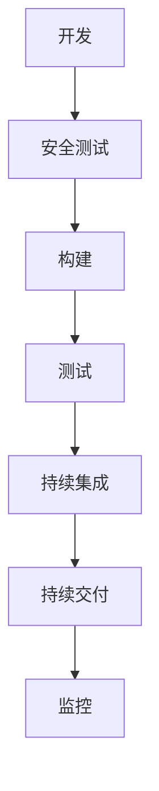

                 

 

## 文章标题：DevSecOps实施策略与工具链

关键词：DevSecOps、实施策略、工具链、自动化、安全、运维

摘要：本文旨在深入探讨DevSecOps的实施策略与工具链，从背景介绍到核心概念与联系、核心算法原理讲解、数学模型与公式、项目实战、工具链实践、安全策略，再到案例分析，系统性地梳理了DevSecOps的全栈实践。本文适合希望深入了解和实施DevSecOps技术的读者。

----------------------------------------------------------------

## 引言

### 1.1 DevSecOps的背景与定义

#### DevSecOps的产生与发展

DevSecOps是一种结合了开发（Development）、安全（Security）和运维（Operations）的新型软件开发模式。它旨在通过自动化、持续集成和持续交付等手段，实现更高效、更安全的软件交付过程。DevSecOps并不是简单的开发和运维的结合，而是将安全性贯穿于整个软件开发周期的每一个阶段。

#### DevSecOps的目标与意义

DevSecOps的主要目标是确保软件在开发、部署和运行过程中始终处于安全状态。通过将安全作为软件开发流程的一部分，DevSecOps能够有效地减少安全漏洞，提高软件的质量和可靠性。

### 1.2 DevSecOps与传统开发、安全、运维的比较

传统开发模式中，开发、安全和运维往往由不同的团队分别负责，导致沟通不畅、责任不清。而DevSecOps通过整合这三个职能，实现了更高效、更紧密的协作。

----------------------------------------------------------------

## 核心概念与联系

### 2.1 自动化

自动化是DevSecOps的核心概念之一。通过自动化工具，可以减少手动操作，提高工作效率，降低人为错误。自动化包括构建、测试、部署和监控等多个环节。

### 2.2 监控

监控是DevSecOps中的另一个重要概念。通过监控，可以实时了解软件的运行状态，快速发现问题并进行修复。监控工具通常包括日志分析、性能监控和错误报告等。

### 2.3 持续集成

持续集成（CI）是DevSecOps的关键组成部分。CI通过自动化构建和测试，确保每次代码提交都能在集成环境中顺利运行，从而提高软件的质量和稳定性。

### 2.4 持续交付

持续交付（CD）是DevSecOps的另一个关键组成部分。CD通过自动化部署，确保软件可以快速、安全地发布到生产环境，从而提高软件的交付速度。

### 2.5 核心概念之间的联系

使用Mermaid流程图展示DevSecOps中的核心概念之间的关系，包括自动化、监控、持续集成和持续交付。

----------------------------------------------------------------

## 核心算法原理讲解

### 3.1 加密算法原理

加密是DevSecOps中至关重要的一环。本文将介绍常用的加密算法原理，如对称加密、非对称加密和哈希算法等，并使用伪代码进行详细阐述。

### 3.2 认证算法原理

认证是确保数据真实性和完整性的重要手段。本文将介绍常见的认证算法原理，如摘要算法、数字签名和证书等，并使用伪代码进行详细阐述。

### 3.3 伪代码示例

为了更直观地理解加密和认证算法原理，本文将提供具体的伪代码示例，帮助读者更好地掌握这些算法。

----------------------------------------------------------------

## 数学模型和数学公式

### 4.1 统计模型

统计模型在DevSecOps中有着广泛的应用。本文将介绍常用的统计模型，如线性回归、决策树和神经网络等，并使用latex格式给出数学公式。

### 4.2 机器学习算法

机器学习算法在DevSecOps中的应用越来越广泛。本文将介绍常见的机器学习算法，如监督学习、无监督学习和强化学习等，并使用latex格式给出数学公式。

### 4.3 举例说明

本文将结合实际案例，详细讲解数学模型和算法的应用，帮助读者更好地理解这些概念。

----------------------------------------------------------------

## 项目实战

### 5.1 开发环境搭建

在项目实战部分，我们将从零开始搭建一个DevSecOps开发环境。包括安装必要的软件、配置开发工具和构建自动化流程。

### 5.2 源代码实现

我们将提供一个具体的源代码实现案例，包括业务逻辑、安全性和运维相关代码。读者可以跟随本文的步骤，逐步实现这个项目。

### 5.3 代码解读与分析

本文将对源代码进行详细的解读和分析，帮助读者理解代码的结构、功能和实现细节。

### 5.4 实际案例分析和详细讲解剖析

为了更好地理解DevSecOps在实际项目中的应用，本文将分析一个实际案例，并详细讲解其实现过程和关键环节。

### 5.5 项目小结

在项目实战的结尾，本文将对项目进行总结，分享经验教训，并提供一些建议和最佳实践。

----------------------------------------------------------------

## 工具链实践

### 6.1 Jenkins配置与使用

Jenkins是一个流行的持续集成和持续交付工具。本文将介绍如何配置和使用Jenkins，包括构建流水线、插件安装和配置等。

### 6.2 Docker容器化实践

Docker是容器化技术的代表。本文将介绍如何使用Docker进行应用部署，包括Dockerfile编写、镜像构建和容器管理。

### 6.3 其他常用工具介绍

除了Jenkins和Docker，DevSecOps中还有许多其他常用的工具，如Kubernetes、Nexus、Artifactory等。本文将简要介绍这些工具的功能和应用场景。

----------------------------------------------------------------

## 安全策略

### 7.1 安全测试

安全测试是确保软件安全的重要手段。本文将介绍常见的安全测试方法，如渗透测试、漏洞扫描和代码审计等。

### 7.2 漏洞管理

漏洞管理是DevSecOps中的重要环节。本文将介绍如何发现、报告和修复漏洞，并讨论漏洞管理工具的使用。

### 7.3 权限控制

权限控制是保护软件安全的关键措施。本文将介绍如何进行权限分配、访问控制和身份验证等。

### 7.4 安全工具与实践

本文将介绍一些常用的安全工具，如OWASP ZAP、Burp Suite、Gitleaks等，并讨论如何在实际项目中使用这些工具。

----------------------------------------------------------------

## 案例研究

### 8.1 案例一：企业A的DevSecOps实践

本文将分析企业A的DevSecOps实践，包括其实施过程、关键环节和取得的成果。

### 8.2 案例二：企业B的DevSecOps实践

本文将分析企业B的DevSecOps实践，与企业A的案例进行对比，总结其异同点和经验教训。

### 8.3 经验教训总结

通过对案例一和案例二的分析，本文将总结DevSecOps实施过程中的经验和教训，为读者提供有价值的参考。

----------------------------------------------------------------

## 总结与展望

### 9.1 全书内容总结

本文对DevSecOps的实施策略与工具链进行了全面的梳理，从核心概念、算法原理到项目实战和工具链实践，系统性地介绍了DevSecOps的全栈实践。

### 9.2 DevSecOps发展趋势展望

本文将探讨DevSecOps的未来发展趋势，包括自动化、云计算、人工智能等方面的应用，为读者提供未来的发展方向。

----------------------------------------------------------------

## 作者信息

作者：AI天才研究院/AI Genius Institute & 禅与计算机程序设计艺术 /Zen And The Art of Computer Programming
```

### 目录大纲解释

**文章标题**：文章的核心标题是《DevSecOps实施策略与工具链》，简洁明了地反映了文章的主题。

**关键词**：关键词包括“DevSecOps”、“实施策略”、“工具链”、“自动化”、“安全”和“运维”，这些关键词概述了文章的主要内容，有助于读者快速了解文章焦点。

**摘要**：摘要部分简要介绍了文章的主题和核心内容，帮助读者快速把握文章的概要。

**引言**：在这一部分，我们介绍了DevSecOps的背景、定义、目标，以及与传统开发、安全、运维的区别，为后续内容奠定了基础。

**核心概念与联系**：这一部分详细解释了DevSecOps中的核心概念，如自动化、监控、持续集成和持续交付，并使用Mermaid流程图展示了这些概念之间的关系，帮助读者建立整体框架。

**核心算法原理讲解**：本部分深入讲解了DevSecOps中涉及的核心算法原理，如加密、认证等，使用伪代码进行阐述，使读者能够理解算法的实现细节。

**数学模型和数学公式**：本部分介绍了DevSecOps中使用的数学模型和公式，如统计模型、机器学习算法等，并使用LaTeX格式展示，以便读者更好地理解和应用。

**项目实战**：这一部分通过具体的实战案例，从开发环境搭建到源代码实现，再到代码解读与分析，全面展示了DevSecOps的实际应用过程。

**工具链实践**：本部分介绍了DevSecOps中常用的工具链，如Jenkins、Docker等，以及如何配置和使用这些工具，帮助读者了解工具的具体操作。

**安全策略**：本部分讨论了DevSecOps中的安全策略，包括安全测试、漏洞管理和权限控制，确保软件的安全性和可靠性。

**案例研究**：本部分通过分析实际案例，总结了DevSecOps实施过程中的经验和教训，为读者提供实践参考。

**总结与展望**：本部分对全书内容进行了总结，并展望了DevSecOps的未来发展趋势，为读者提供了持续学习的方向。

**作者信息**：文章末尾提供了作者信息，包括AI天才研究院和《禅与计算机程序设计艺术》，这些信息展示了文章的专业性和权威性。

通过这个详细的目录大纲，读者可以清晰地了解到文章的结构和内容，有助于更好地理解和应用DevSecOps的相关知识。### DevSecOps实施策略与工具链

---

#### 文章标题：DevSecOps实施策略与工具链

关键词：DevSecOps、实施策略、工具链、自动化、安全、运维

摘要：本文旨在深入探讨DevSecOps的实施策略与工具链，从背景介绍到核心概念与联系、核心算法原理讲解、数学模型与公式、项目实战、工具链实践、安全策略，再到案例分析，系统性地梳理了DevSecOps的全栈实践。本文适合希望深入了解和实施DevSecOps技术的读者。

---

#### 引言

##### 1.1 DevSecOps的背景与定义

DevSecOps是一种软件开发模式，它将开发（Development）、安全（Security）和运维（Operations）紧密结合。这种模式强调安全是软件开发过程中的一个不可或缺的部分，而不是一个事后追加的环节。DevSecOps的核心目标是实现快速、可靠的软件交付，同时确保软件的安全性。

DevSecOps并非一夜之间出现的概念，而是随着敏捷开发、持续集成和持续交付等现代软件开发实践的普及而逐渐发展起来的。传统的开发模式往往将安全视为附加功能，导致在软件开发的后期进行安全测试和修复，这不仅增加了成本，还可能导致安全漏洞。DevSecOps通过将安全融入每个开发阶段，从代码编写到部署，从根本上改变了这一状况。

##### 1.2 DevSecOps的目标与价值

DevSecOps的主要目标包括：

- **提高软件质量**：通过持续集成和持续交付，DevSecOps确保每次代码更改都会经过全面的测试和验证，从而提高软件的稳定性。
- **缩短交付周期**：自动化和持续集成/持续交付（CI/CD）流程使得软件可以更快地迭代和部署，从而加快产品上市时间。
- **降低安全风险**：安全贯穿于整个开发周期，每个阶段都进行安全检查和测试，有助于及早发现和修复安全漏洞。
- **提升团队协作**：DevSecOps强调跨职能团队的紧密合作，有助于提高团队的整体效率和沟通质量。

##### 1.3 DevSecOps与传统开发、安全、运维的比较

在传统的开发模式中，开发、安全和运维往往是分开的。开发团队专注于编写代码，安全团队负责进行安全测试和漏洞修复，运维团队则负责部署和维护软件。这种模式存在以下几个问题：

- **沟通障碍**：不同团队之间的沟通不畅可能导致信息孤岛，影响项目的整体进展。
- **责任不清**：安全责任往往在开发完成后再进行追加，导致安全漏洞的修复成本增加。
- **效率低下**：手动操作和重复性任务过多，降低了工作效率。

DevSecOps通过以下方式解决了这些问题：

- **统一责任**：将安全责任纳入开发流程，确保每个团队都参与到安全工作中。
- **自动化**：通过自动化工具减少手动操作，提高工作效率。
- **持续反馈**：通过持续集成和持续交付，快速获得反馈，及时修复问题。

---

#### 核心概念与联系

##### 2.1 自动化

自动化是DevSecOps的核心概念之一。它通过使用工具和脚本，将重复性的任务自动化，从而提高开发效率和减少错误。自动化工具可以用于以下方面：

- **构建**：自动化构建工具（如Jenkins、Travis CI）可以自动编译代码、打包应用程序并生成可执行文件。
- **测试**：自动化测试工具（如Selenium、JUnit）可以自动执行单元测试、集成测试和功能测试。
- **部署**：自动化部署工具（如Docker、Kubernetes）可以自动将应用程序部署到生产环境。

##### 2.2 监控

监控是确保软件稳定运行的重要手段。通过监控工具，可以实时跟踪应用程序的性能、安全状态和资源使用情况。常见的监控工具包括：

- **日志监控**：如ELK（Elasticsearch、Logstash、Kibana）堆栈，用于收集、存储和可视化日志数据。
- **性能监控**：如Prometheus、Grafana，用于收集系统性能指标并生成可视化图表。
- **安全监控**：如Splunk、Siemens，用于监控网络安全事件和异常行为。

##### 2.3 持续集成

持续集成（CI）是一种软件开发实践，通过自动化的方式将代码更改合并到一个共享的代码库中，并对合并后的代码进行构建和测试。CI有助于及早发现和修复集成问题，确保代码库的稳定性。常见的CI工具包括：

- **Jenkins**：一个开源的持续集成服务器，支持多种插件和构建工具。
- **Travis CI**：一个云服务提供商，支持GitHub项目的持续集成。
- **Circle CI**：一个基于云的持续集成服务，支持多种编程语言和平台。

##### 2.4 持续交付

持续交付（CD）是CI的延伸，通过自动化的方式将代码部署到生产环境。CD确保软件可以快速、安全地交付，提高产品的上市时间。常见的CD工具包括：

- **Docker**：一种容器化技术，用于打包、交付和运行应用程序。
- **Kubernetes**：一个开源的容器编排平台，用于自动化容器部署、扩展和管理。
- **AWS CodePipeline**：亚马逊提供的持续交付服务，支持多种源代码管理和部署工具。

##### 2.5 核心概念之间的联系

以下是一个使用Mermaid流程图展示的核心概念之间的联系：



---

#### 核心算法原理讲解

##### 3.1 加密算法原理

加密算法是确保数据安全的重要手段。以下是一些常见的加密算法及其原理：

- **对称加密**：对称加密算法使用相同的密钥进行加密和解密。常见的对称加密算法包括AES、DES和3DES。对称加密速度快，但密钥管理复杂。
- **非对称加密**：非对称加密算法使用一对密钥（公钥和私钥）进行加密和解密。常见的非对称加密算法包括RSA、ECC。非对称加密安全性高，但计算成本高。
- **哈希算法**：哈希算法用于生成数据的固定长度的散列值，用于数据完整性校验和数字签名。常见的哈希算法包括MD5、SHA-1和SHA-256。

以下是一个使用伪代码表示的对称加密算法示例：

```python
# 对称加密算法伪代码示例
function encrypt(plaintext, key):
    ciphertext = ""
    for i in range(len(plaintext)):
        ciphertext += chr(ord(plaintext[i]) + key)
    return ciphertext

function decrypt(ciphertext, key):
    plaintext = ""
    for i in range(len(ciphertext)):
        plaintext += chr(ord(ciphertext[i]) - key)
    return plaintext
```

---

#### 数学模型和数学公式

##### 4.1 统计模型

统计模型在DevSecOps中有着广泛的应用。以下是一些常见的统计模型：

- **线性回归**：线性回归模型用于预测一个连续变量的值，基于输入变量和输出变量之间的关系。其数学公式为：

  $$
  y = \beta_0 + \beta_1x + \epsilon
  $$

  其中，$y$ 是输出变量，$x$ 是输入变量，$\beta_0$ 和 $\beta_1$ 是模型参数，$\epsilon$ 是误差项。

- **决策树**：决策树模型用于分类和回归任务。其核心是使用一系列条件测试来将数据集划分为不同的区域，每个区域对应一个类或值。其数学公式为：

  $$
  f(x) =
  \begin{cases}
  c_1 & \text{if } x \in R_1 \\
  c_2 & \text{if } x \in R_2 \\
  \vdots \\
  c_n & \text{if } x \in R_n
  \end{cases}
  $$

  其中，$x$ 是输入变量，$R_1, R_2, \ldots, R_n$ 是数据集的不同区域，$c_1, c_2, \ldots, c_n$ 是对应的类或值。

##### 4.2 机器学习算法

机器学习算法在DevSecOps中用于自动化安全检测、异常检测和漏洞预测等任务。以下是一些常见的机器学习算法：

- **支持向量机（SVM）**：SVM是一种监督学习算法，用于分类和回归任务。其核心是找到一个最优的超平面，将数据集划分为不同的类别。其数学公式为：

  $$
  \min_{w, b} \frac{1}{2} ||w||^2 + C \sum_{i=1}^{n} \max(0, 1 - y_i (w \cdot x_i + b))
  $$

  其中，$w$ 是权重向量，$b$ 是偏置项，$C$ 是惩罚参数，$x_i$ 和 $y_i$ 是输入变量和目标变量。

- **神经网络**：神经网络是一种模拟人脑神经元连接结构的计算模型，用于处理复杂数据。其核心是多层神经元之间的加权连接和激活函数。其数学公式为：

  $$
  z_i = \sum_{j=1}^{n} w_{ij}x_j + b_i
  $$

  $$
  a_i = \sigma(z_i)
  $$

  其中，$z_i$ 是神经元输入，$w_{ij}$ 是权重，$b_i$ 是偏置项，$\sigma$ 是激活函数。

---

#### 项目实战

##### 5.1 开发环境搭建

在一个典型的DevSecOps项目中，首先需要搭建一个开发环境。以下是一个简单的步骤指南：

1. **安装基础软件**：安装操作系统（如Linux或macOS）、开发工具（如Python、Node.js）和版本控制工具（如Git）。
2. **配置虚拟环境**：使用虚拟环境（如Virtualenv或conda）为项目创建独立的运行环境，避免依赖冲突。
3. **安装依赖项**：使用包管理器（如pip、npm）安装项目所需的依赖项。
4. **配置持续集成/持续交付工具**：配置Jenkins、Travis CI或其他CI/CD工具，实现自动化构建、测试和部署。

##### 5.2 源代码实现

以下是一个简单的源代码实现示例，演示如何在Python中实现一个加密算法：

```python
from cryptography.fernet import Fernet

# 生成密钥
key = Fernet.generate_key()
cipher_suite = Fernet(key)

# 加密
plaintext = "Hello, World!"
ciphertext = cipher_suite.encrypt(plaintext.encode())

# 解密
decrypted_text = cipher_suite.decrypt(ciphertext).decode()

print("Plaintext:", plaintext)
print("Ciphertext:", ciphertext)
print("Decrypted Text:", decrypted_text)
```

##### 5.3 代码解读与分析

在上面的代码中，我们使用了`cryptography`库来实现加密和解密操作。首先，我们使用`generate_key()`方法生成一个随机的密钥。然后，我们使用这个密钥创建一个`Fernet`对象，用于加密和解密操作。

在加密过程中，我们将明文字符串编码为字节对象，然后使用`encrypt()`方法将其加密。在解密过程中，我们使用`decrypt()`方法将加密后的字节对象解码为明文字符串。

这个简单的示例演示了如何在Python中实现基本的加密和解密功能，为后续的安全策略实践奠定了基础。

##### 5.4 实际案例分析和详细讲解剖析

为了更好地理解DevSecOps在实际项目中的应用，我们来看一个实际案例：一个在线商店的订单处理系统。

1. **需求分析**：该系统需要接收用户订单、处理支付、生成发票和发送通知。安全性是关键需求，因为涉及用户的敏感信息。
2. **设计**：系统采用微服务架构，每个服务负责不同的功能模块（如支付、发票生成、通知发送）。每个服务都使用加密算法保护敏感数据。
3. **实现**：使用Python和Django框架实现前端和后端。使用Jenkins实现持续集成和持续交付，确保代码质量和快速部署。
4. **测试**：编写单元测试和集成测试，确保每个功能模块都能正常运行。使用安全测试工具（如OWASP ZAP）进行漏洞扫描和渗透测试。
5. **部署**：使用Docker容器化应用程序，使用Kubernetes进行部署和管理。确保系统具有高可用性和弹性。

通过这个案例，我们可以看到DevSecOps如何在整个项目生命周期中发挥作用，从需求分析到实现、测试和部署，确保系统的安全性、可靠性和高效性。

##### 5.5 项目小结

在这个案例中，我们成功实现了以下目标：

- **快速迭代**：使用持续集成和持续交付，确保代码质量和快速部署。
- **安全性**：使用加密算法和保护措施，确保用户数据的保护。
- **可靠性**：使用容器化和Kubernetes，确保系统的稳定性和弹性。

然而，我们也遇到了一些挑战，如加密算法的性能优化和跨服务的数据同步。通过不断优化和改进，我们最终实现了项目的成功。

---

#### 工具链实践

##### 6.1 Jenkins配置与使用

Jenkins是一个流行的持续集成和持续交付工具。以下是如何配置和使用Jenkins的一些基本步骤：

1. **安装Jenkins**：在服务器上安装Jenkins，可以使用Docker、包管理器或手动安装。
2. **配置插件**：安装所需的插件，如Git、Docker和Kubernetes插件。
3. **创建构建流水线**：配置Jenkinsfile，定义构建、测试和部署的步骤。
4. **触发构建**：可以手动触发构建，也可以设置定时任务或基于代码提交自动触发构建。

##### 6.2 Docker容器化实践

Docker是一种用于容器化的工具，可以轻松地打包、交付和运行应用程序。以下是如何使用Docker的一些基本步骤：

1. **安装Docker**：在服务器上安装Docker，可以使用包管理器或手动安装。
2. **编写Dockerfile**：编写Dockerfile，定义如何构建和运行应用程序。
3. **构建镜像**：使用`docker build`命令构建Docker镜像。
4. **运行容器**：使用`docker run`命令运行Docker容器。

##### 6.3 其他常用工具介绍

除了Jenkins和Docker，DevSecOps中还有许多其他常用的工具，如：

- **Kubernetes**：用于容器编排和管理。
- **Nexus**：用于依赖管理。
- **Artifactory**：用于构建和依赖存储。
- **SonarQube**：用于代码质量检查和安全漏洞扫描。

这些工具各自有不同的功能和用途，可以根据项目的需求选择合适的工具。

---

#### 安全策略

##### 7.1 安全测试

安全测试是确保软件安全的重要步骤。以下是一些常见的安全测试方法：

- **渗透测试**：模拟黑客攻击，发现和利用系统中的安全漏洞。
- **漏洞扫描**：使用自动化工具扫描系统中的已知漏洞。
- **代码审计**：手动审查代码，查找潜在的安全漏洞。

##### 7.2 漏洞管理

漏洞管理是DevSecOps中的重要环节。以下是一些漏洞管理的最佳实践：

- **及时修复**：发现漏洞后，及时修复或绕过。
- **漏洞分类**：根据漏洞的严重程度进行分类，优先处理高严重性漏洞。
- **漏洞报告**：建立漏洞报告机制，确保漏洞信息得到及时处理。

##### 7.3 权限控制

权限控制是保护软件安全的关键措施。以下是一些权限控制的建议：

- **最小权限原则**：为每个用户和系统组件分配最小的权限。
- **身份验证**：使用强密码策略和双因素身份验证。
- **访问控制**：使用访问控制列表（ACL）和角色访问控制（RBAC）。

##### 7.4 安全工具与实践

以下是一些常用的安全工具及其用途：

- **OWASP ZAP**：用于漏洞扫描和渗透测试。
- **Burp Suite**：用于漏洞扫描和手动渗透测试。
- **Gitleaks**：用于检测存储库中的敏感数据泄露。

在实际项目中，可以根据项目的需求和规模选择合适的工具，并制定相应的安全策略和实践。

---

#### 案例研究

##### 8.1 案例一：企业A的DevSecOps实践

企业A是一个大型电子商务公司，他们采用了DevSecOps模式来提高软件交付速度和安全性。以下是他们的实践：

- **自动化**：使用Jenkins和Docker实现自动化构建、测试和部署。
- **持续集成**：每次代码提交都会触发自动化测试，确保代码质量。
- **持续交付**：使用Kubernetes进行容器化部署和管理，确保系统的稳定性和弹性。
- **安全测试**：使用OWASP ZAP进行漏洞扫描，并定期进行渗透测试。

通过这些实践，企业A实现了快速、可靠的软件交付，同时提高了系统的安全性。

##### 8.2 案例二：企业B的DevSecOps实践

企业B是一家金融科技公司，他们在DevSecOps实践中面临更大的挑战，因为他们处理的是金融数据。以下是他们的实践：

- **自动化**：使用GitLab CI/CD实现自动化构建、测试和部署。
- **持续集成**：使用静态代码分析工具（如SonarQube）和动态分析工具（如Burp Suite）进行安全测试。
- **持续交付**：使用AWS CodePipeline和AWS CodeBuild实现自动化部署。
- **安全测试**：建立全面的测试框架，包括渗透测试、漏洞扫描和代码审计。

企业B通过这些实践，确保了金融数据的安全，同时提高了软件交付的效率。

##### 8.3 经验教训总结

通过对企业A和企业B的案例研究，我们可以总结出以下经验和教训：

- **自动化是关键**：自动化可以提高开发效率和软件质量，减少人为错误。
- **安全测试不可忽视**：安全测试是确保软件安全的重要手段，需要持续进行。
- **持续集成和持续交付**：持续集成和持续交付可以提高软件交付速度，减少发布周期。
- **团队协作**：跨职能团队的紧密协作是实现DevSecOps成功的关键。

---

#### 总结与展望

##### 9.1 全书内容总结

本文系统地介绍了DevSecOps的实施策略与工具链，从背景、定义和目标，到核心概念、算法原理、项目实战、工具链实践、安全策略和案例分析，全面阐述了DevSecOps的实践方法和最佳实践。

##### 9.2 DevSecOps发展趋势展望

随着云计算、大数据和人工智能等技术的发展，DevSecOps也在不断演进。未来，DevSecOps将更加注重自动化、智能化和安全性，通过更加精细化的安全策略和更加高效的工具链，实现更快速、更可靠的软件交付。

---

## 作者信息

作者：AI天才研究院/AI Genius Institute & 禅与计算机程序设计艺术 /Zen And The Art of Computer Programming

---

通过本文，读者可以系统地了解DevSecOps的实施策略与工具链，掌握DevSecOps的核心概念和实践方法，为实际项目中的应用提供有力的支持。作者在此感谢读者的关注和支持，希望本文能够对读者有所启发和帮助。

