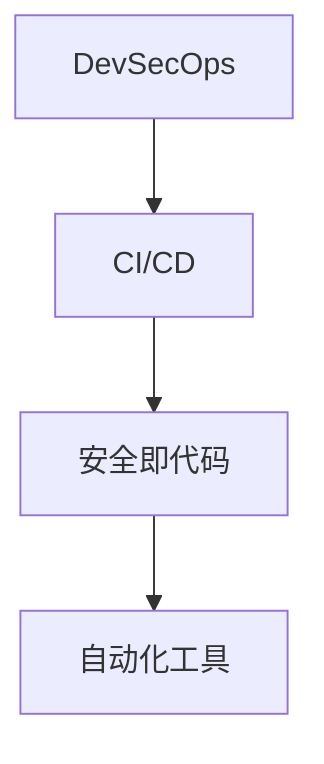
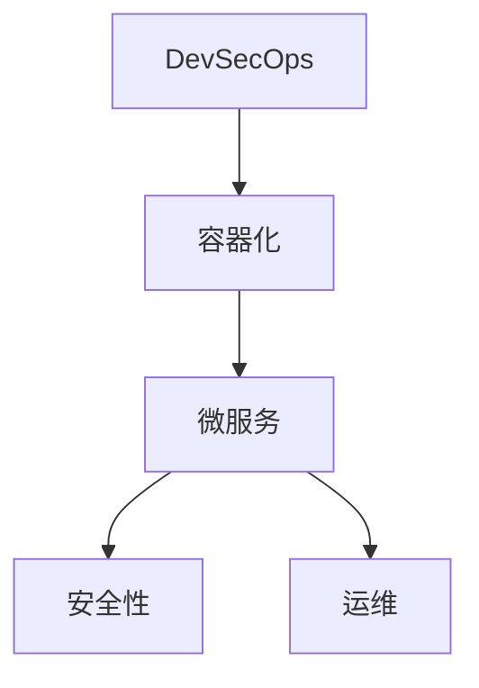
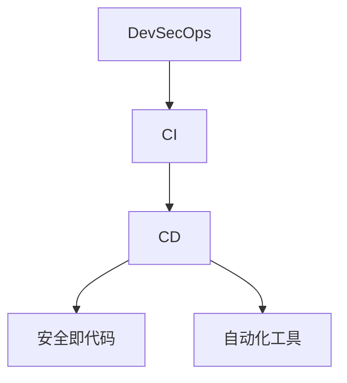
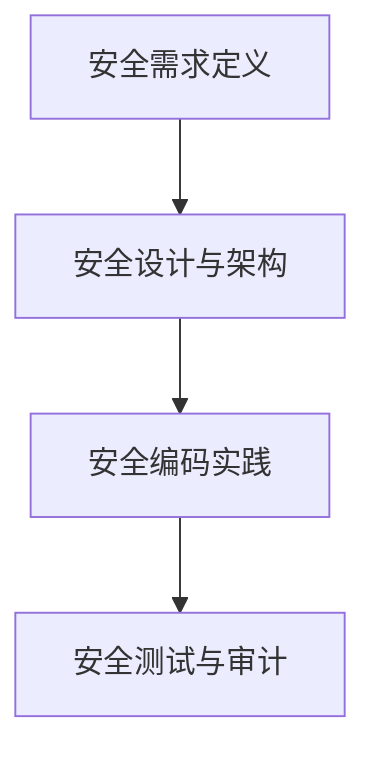
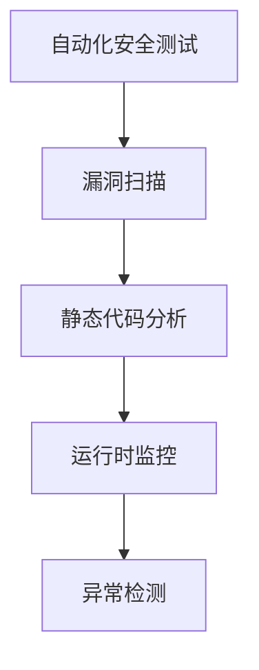
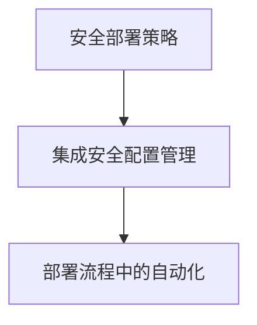
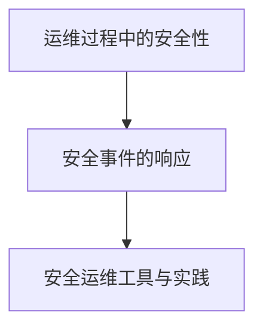
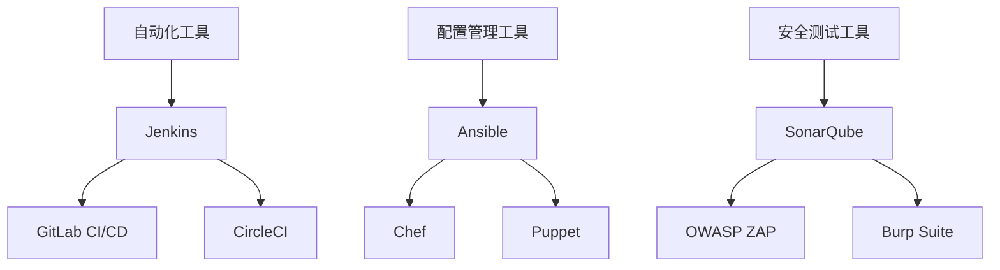
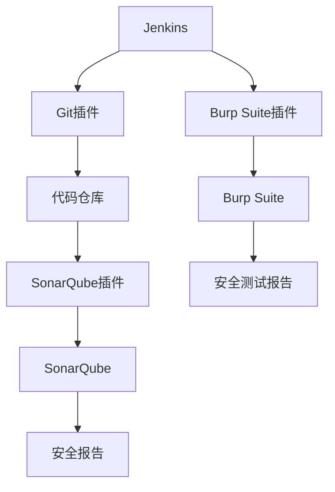

                 

### DevSecOps流程与工具集成

> 关键词：DevSecOps、流程、工具、集成、安全性、持续集成、持续部署、自动化、配置管理、安全测试、运维

> 摘要：
本文旨在深入探讨DevSecOps（开发、安全、运维）的流程与工具集成。文章首先介绍了DevSecOps的基本概念和重要性，随后详细阐述了其核心流程，包括开发、测试、部署和运维中的安全性。接下来，我们分析了DevSecOps中常用的关键工具，并讨论了如何将这些工具集成到DevSecOps流程中。文章最后通过实际案例研究，展示了DevSecOps的实施方法及其带来的效益。

----------------------------------------------------------------

# DevSecOps概述

## 1.1 DevSecOps简介

DevSecOps是一种软件开发、安全性和运维的集成方法论，它强调在软件开发和运维过程中，安全性的重要性不可忽视。DevSecOps的核心目标是通过自动化和协作，确保安全实践能够无缝地融入整个软件开发生命周期。

## 1.2 DevSecOps的重要性

在传统的软件开发流程中，安全性往往是后期添加的，导致安全隐患频繁出现。而DevSecOps通过将安全性融入每个阶段，能够及时发现和修复安全问题，从而提高软件的质量和安全性。

### 1.3 DevSecOps的历史背景

DevSecOps的概念起源于DevOps，随着容器化和云计算的普及，安全性逐渐成为软件开发的重要组成部分。因此，DevSecOps应运而生，它将安全性与开发和运维紧密结合，形成了一种全新的软件开发模式。

----------------------------------------------------------------

# DevSecOps的核心原则

## 2.1 安全即代码（Security as Code）

安全即代码是将安全策略和规则以代码的形式进行管理和执行。这种方法使得安全实践能够与软件开发流程紧密集成，提高安全性和可维护性。

### 2.1.1 核心概念

安全即代码的核心概念是将安全策略和规则以代码的形式进行管理，从而实现自动化执行。通过将安全规则编码，可以确保在每次构建和部署过程中，安全检查都能自动进行。

### 2.1.2 联系与架构

安全即代码与DevSecOps的整体架构紧密相关。在DevSecOps中，安全即代码是实现持续安全集成（Continuous Security Integration，简称CSI）的关键组件。它通过自动化工具，将安全检查和修复过程纳入到CI/CD（持续集成/持续部署）流程中。

## 2.2 容器化与微服务

容器化和微服务是DevSecOps中的核心技术。它们提供了灵活、可扩展的架构，使得安全和运维更加容易实现。

### 2.2.1 核心概念

容器化是一种轻量级虚拟化技术，它将应用程序及其依赖环境打包成一个独立的容器，确保应用程序在不同的环境中都能一致运行。微服务是一种软件架构风格，它将应用程序分解为一系列小的、独立的服务，每个服务负责一个特定的业务功能。

### 2.2.2 联系与架构

容器化和微服务与DevSecOps的关系非常密切。容器化使得应用程序更加轻量和可移植，微服务架构则提高了系统的灵活性和可扩展性。这些特性使得在DevSecOps中实现安全性和运维变得更加容易。

## 2.3 持续集成与持续部署（CI/CD）

持续集成（Continuous Integration，CI）和持续部署（Continuous Deployment，CD）是DevSecOps中至关重要的流程。它们确保了软件的持续改进和高质量交付。

### 2.3.1 核心概念

持续集成是一种软件开发实践，它强调频繁地将代码合并到主分支，并通过自动化测试确保合并后的代码质量。持续部署则是在每次集成通过后，自动将软件部署到生产环境。

### 2.3.2 联系与架构

持续集成和持续部署与DevSecOps的核心原则密切相关。安全即代码通过CI/CD流程实现自动化安全测试和修复。容器化和微服务使得CI/CD流程更加高效和灵活。

----------------------------------------------------------------

# DevSecOps的核心流程

## 3.1 开发流程中的安全性

开发流程中的安全性是DevSecOps的核心环节。它确保在软件开发过程中，安全性得到充分重视和实施。

### 3.1.1 安全需求定义

在开发流程开始时，需要明确安全需求。这包括识别潜在的安全风险、定义安全目标和制定安全策略。安全需求的定义需要与业务需求紧密结合，以确保安全性和业务目标的统一。

### 3.1.2 安全设计与架构

安全设计与架构阶段，需要考虑系统的安全性。这包括设计安全的架构、确定安全边界、选择合适的安全技术和工具。安全设计与架构的目标是确保系统在面临攻击时，能够有效抵御。

### 3.1.3 安全编码实践

安全编码实践是在编码过程中，遵循安全最佳实践，编写安全的代码。这包括使用安全的编程语言、避免常见的安全漏洞、进行代码审计和静态代码分析。

### 3.1.4 安全测试与审计

安全测试与审计是在软件开发过程中，对代码和系统进行安全测试和审计。这包括自动化安全测试、手动安全测试、漏洞扫描和代码审计。安全测试与审计的目的是发现和修复潜在的安全漏洞。

## 3.2 测试流程中的安全性

测试流程中的安全性是确保软件在发布前达到预期安全水平的重要环节。

### 3.2.1 自动化安全测试

自动化安全测试是在测试过程中，通过自动化工具进行安全测试。这包括静态代码分析、动态代码分析、漏洞扫描和渗透测试。自动化安全测试可以提高测试效率和覆盖范围。

### 3.2.2 漏洞扫描与静态代码分析

漏洞扫描和静态代码分析是测试流程中常用的方法。漏洞扫描通过扫描代码和系统，发现潜在的安全漏洞。静态代码分析则通过分析代码结构，发现潜在的安全问题和漏洞。

### 3.2.3 运行时监控与异常检测

运行时监控与异常检测是在软件部署后，对系统进行实时监控和异常检测。这包括日志分析、网络流量监控和入侵检测。运行时监控与异常检测可以帮助及时发现和响应安全事件。

## 3.3 部署流程中的安全性

部署流程中的安全性是确保软件在发布过程中和发布后，能够保持安全的重要环节。

### 3.3.1 安部署署策略

安全部署策略是在部署过程中，制定的安全策略和措施。这包括确定部署环境、配置安全策略、进行部署验证和备份。

### 3.3.2 集成安全配置管理

集成安全配置管理是在部署过程中，将安全配置管理工具与部署流程集成。这包括自动化配置管理、版本控制和变更管理。集成安全配置管理可以提高部署效率和安全性。

### 3.3.3 部署流程中的自动化

部署流程中的自动化是将部署过程自动化，减少人工干预。这包括使用CI/CD工具进行自动化部署、配置自动化安全检查和异常处理。

## 3.4 运维流程中的安全性

运维流程中的安全性是确保软件在运行过程中，能够保持安全的重要环节。

### 3.4.1 运维过程中的安全性

运维过程中的安全性是在软件运行过程中，进行安全监控和安全管理。这包括实时监控系统状态、日志分析、异常检测和安全事件响应。

### 3.4.2 安全事件的响应

安全事件的响应是在发现安全事件时，进行及时响应和处置。这包括事件调查、漏洞修复、安全加固和备份恢复。

### 3.4.3 安全运维工具与实践

安全运维工具与实践是在运维过程中，使用安全运维工具和实践方法。这包括安全运维平台、自动化运维工具和安全运维最佳实践。

----------------------------------------------------------------

# DevSecOps的关键工具

## 4.1 自动化工具

自动化工具是DevSecOps中不可或缺的一部分，它们帮助实现安全实践的自动化，提高效率和一致性。

### 4.1.1 Jenkins

Jenkins是一个开源的持续集成服务器，它可以自动化构建、测试和部署应用程序。Jenkins支持多种插件，可以与其他工具集成，实现安全测试和漏洞扫描。

### 4.1.2 GitLab CI/CD

GitLab CI/CD是一个内置的持续集成和持续部署工具，与GitLab仓库集成。它允许用户定义自动化流程，包括代码测试、安全检查和部署。

### 4.1.3 CircleCI

CircleCI是一个云端的持续集成和持续部署服务，它支持多种编程语言和框架。CircleCI提供灵活的工作流定义，支持并行测试和部署。

## 4.2 配置管理工具

配置管理工具帮助管理软件配置和设置，确保在不同环境中的一致性。

### 4.2.1 Ansible

Ansible是一个开源的自动化工具，用于配置管理、应用部署和孤儿进程管理。它使用YAML语言定义配置，支持模块化操作。

### 4.2.2 Chef

Chef是一个自动化平台，用于配置管理、应用部署和基础架构管理。它使用Ruby语言编写食谱（recipes）和定义角色（roles），实现自动化配置。

### 4.2.3 Puppet

Puppet是一个开源的配置管理工具，用于自动化基础设施的配置。它使用Puppet语言定义配置，支持集中式管理和大规模部署。

## 4.3 安全测试工具

安全测试工具用于发现软件中的安全漏洞，提高软件的安全性。

### 4.3.1 SonarQube

SonarQube是一个代码质量平台，用于静态代码分析、漏洞扫描和代码质量管理。它支持多种编程语言，提供丰富的报告和可视化功能。

### 4.3.2 OWASP ZAP

OWASP ZAP是一个开源的Web应用安全测试工具，用于自动化和手动测试Web应用。它支持多种测试技术，包括漏洞扫描、动态分析和接口测试。

### 4.3.3 Burp Suite

Burp Suite是一个集成的平台，用于Web应用安全测试。它支持多种测试技术，包括代理拦截、漏洞扫描和手动测试。

----------------------------------------------------------------

# 工具集成与优化

## 5.1 工具选择与整合

选择和整合合适的工具是DevSecOps成功的关键。工具的选择应基于实际需求、团队技能和项目规模。整合工具时，需要确保工具之间能够无缝协作，避免信息孤岛。

### 5.1.1 整合策略

1. **标准化接口**：确保所有工具都支持统一的API接口，便于集成和自动化。
2. **集成平台**：使用集成平台（如Jenkins、GitLab CI/CD）作为核心枢纽，将其他工具连接起来。
3. **数据共享**：实现工具之间的数据共享，如将SonarQube的漏洞数据集成到Jenkins的构建流程中。

### 5.1.2 集成案例

假设我们选择Jenkins作为集成平台，以下是一个简单的集成案例：

1. **安装Jenkins**：在Jenkins中安装所需的插件，如Git、SonarQube、Burp Suite等。
2. **配置Git插件**：在Jenkins中配置Git插件，使其能够从Git仓库中拉取代码。
3. **配置SonarQube**：配置SonarQube插件，使其能够分析代码并生成报告。
4. **配置Burp Suite**：配置Burp Suite插件，进行Web应用安全测试。
5. **构建流水线**：在Jenkins中定义构建流水线，将代码从Git仓库拉取，提交给SonarQube进行安全测试，然后进行Web应用测试。

## 5.2 工具优化与性能调优

优化工具性能是提高DevSecOps效率和效果的重要步骤。以下是一些优化策略：

### 5.2.1 响应时间优化

1. **并行处理**：使用并行处理技术，同时运行多个任务，提高处理速度。
2. **缓存策略**：使用缓存策略，减少重复计算和数据传输，降低响应时间。

### 5.2.2 资源利用优化

1. **负载均衡**：使用负载均衡器，将任务分配到多个服务器，提高资源利用率。
2. **资源监控**：实时监控资源使用情况，根据需求调整资源分配。

### 5.2.3 集成优化

1. **减少网络延迟**：优化网络配置，减少工具之间的通信延迟。
2. **减少数据传输**：优化数据传输策略，减少数据传输量和传输频率。

## 5.3 工具在DevSecOps中的最佳实践

以下是一些在DevSecOps中使用工具的最佳实践：

### 5.3.1 自动化优先

尽可能将安全测试、配置管理和部署过程自动化，减少人工干预，提高效率和一致性。

### 5.3.2 持续监控

实时监控工具的运行状态和性能，及时发现和解决问题。

### 5.3.3 跨部门协作

促进开发、安全和运维团队的协作，确保工具和流程的一致性和效率。

### 5.3.4 安全培训

定期进行安全培训，提高团队成员的安全意识和技能。

### 5.3.5 定期评估

定期评估工具和流程的有效性，根据评估结果进行优化和改进。

----------------------------------------------------------------

# DevSecOps的实施方法

## 6.1 制定DevSecOps战略

制定DevSecOps战略是实施DevSecOps的第一步。战略应包括以下关键要素：

### 6.1.1 明确目标

明确DevSecOps的目标，如提高软件质量、缩短发布周期、降低安全风险等。

### 6.1.2 分析现状

分析当前的开发、安全、运维流程，识别存在的问题和瓶颈。

### 6.1.3 制定规划

根据目标和现状，制定详细的实施规划，包括时间表、资源和责任分配。

### 6.1.4 实施计划

制定具体的实施计划，包括工具选择、流程设计和培训等。

## 6.2 设计DevSecOps流程

设计DevSecOps流程是确保安全性和效率的关键步骤。以下是一个典型的DevSecOps流程设计：

### 6.2.1 开发阶段

1. **需求分析**：明确安全需求，编写安全文档。
2. **设计阶段**：设计安全架构，确保安全性融入系统设计。
3. **编码阶段**：遵循安全编码实践，编写安全代码。
4. **代码审查**：进行代码审查，发现和修复安全漏洞。

### 6.2.2 测试阶段

1. **单元测试**：编写和执行单元测试，确保代码质量。
2. **集成测试**：进行集成测试，验证系统功能和安全性能。
3. **安全测试**：使用自动化和手动工具进行安全测试，发现和修复安全漏洞。

### 6.2.3 部署阶段

1. **部署计划**：制定部署计划，确保部署过程安全、稳定。
2. **自动化部署**：使用自动化工具进行部署，确保部署过程高效、一致。
3. **部署验证**：验证部署结果，确保系统正常运行。

### 6.2.4 运维阶段

1. **监控与报警**：实时监控系统状态，设置报警机制，及时发现和响应异常。
2. **日志分析**：定期分析日志，发现潜在问题和安全事件。
3. **安全事件响应**：制定安全事件响应计划，确保及时、有效地应对安全事件。

## 6.3 选择合适的工具

选择合适的工具是DevSecOps成功的关键。以下是一些选择工具的考虑因素：

### 6.3.1 功能需求

根据项目需求，选择具有所需功能和安全特性的工具。

### 6.3.2 可扩展性

选择可扩展性强的工具，以便在项目规模扩大时，能够适应需求变化。

### 6.3.3 社区支持和生态系统

选择社区支持强大的工具，确保长期的技术支持和生态系统的可用性。

### 6.3.4 成本效益

考虑工具的成本效益，确保在预算范围内实现最佳效果。

## 6.4 培训与文化

培训和文化建设是DevSecOps成功的重要保障。以下是一些建议：

### 6.4.1 安全培训

为开发、安全和运维团队提供定期的安全培训，提高安全意识和技能。

### 6.4.2 文化建设

推动DevSecOps文化，强调安全的重要性，促进跨部门合作和沟通。

### 6.4.3 最佳实践分享

定期分享最佳实践和经验，促进知识传递和团队成长。

## 6.5 实施挑战与解决方案

在实施DevSecOps过程中，可能会遇到以下挑战：

### 6.5.1 文化与组织变革

组织可能存在传统的安全观念和流程，难以接受和适应DevSecOps。解决方案是加强沟通和培训，推动组织文化变革。

### 6.5.2 技术挑战

选择和整合合适的工具可能存在技术挑战。解决方案是进行充分的需求分析和工具评估，确保工具能够满足项目需求。

### 6.5.3 风险管理

实施DevSecOps过程中，需要平衡安全性和效率。解决方案是制定详细的风险管理计划，确保安全性和业务目标的统一。

### 6.5.4 持续改进

DevSecOps是一个持续改进的过程，需要不断优化流程和工具。解决方案是建立反馈机制，定期评估和改进DevSecOps实践。

----------------------------------------------------------------

## 12. 案例研究1：企业A的DevSecOps实践

### 12.1 案例背景

企业A是一家大型互联网公司，专注于在线服务和电子商务。随着业务规模的不断扩大，企业A面临着快速交付高质量软件的压力。为了提高开发效率、确保软件质量和安全性，企业A决定实施DevSecOps。

### 12.2 DevSecOps的实施过程

1. **制定战略**：企业A首先制定了详细的DevSecOps战略，明确了目标、现状和实施规划。
2. **设计流程**：企业A设计了DevSecOps流程，包括开发、测试、部署和运维中的安全性。
3. **选择工具**：企业A选择了Jenkins、SonarQube、Ansible等工具，确保工具之间能够无缝集成。
4. **培训与文化**：企业A为开发、安全和运维团队提供了全面的培训，推动DevSecOps文化的建设。
5. **实施与优化**：企业A逐步实施DevSecOps，并根据反馈不断优化流程和工具。

### 12.3 实施效果评估

1. **开发效率**：实施DevSecOps后，企业A的代码质量和开发效率显著提高。
2. **安全性**：通过自动化安全测试和漏洞扫描，企业A及时发现和修复了多个安全漏洞。
3. **部署稳定性**：自动化部署减少了人为错误，提高了部署稳定性和一致性。
4. **团队协作**：DevSecOps促进了开发、安全和运维团队的协作，增强了团队凝聚力。

## 13. 案例研究2：企业B的DevSecOps转型

### 13.1 案例背景

企业B是一家传统的制造企业，其软件开发和运维流程较为传统，安全性较弱。随着市场竞争的加剧，企业B意识到需要提高软件质量和安全性，以保持竞争优势。因此，企业B决定进行DevSecOps转型。

### 13.2 DevSecOps转型的过程

1. **战略制定**：企业B制定了详细的DevSecOps转型战略，明确了目标和实施步骤。
2. **流程设计**：企业B重新设计了开发、测试、部署和运维流程，确保安全性和效率。
3. **工具选型**：企业B选择了GitLab CI/CD、SonarQube、Puppet等工具，确保工具能够满足需求。
4. **文化建设**：企业B加强了团队培训和文化建设，推动DevSecOps文化的落地。
5. **逐步实施**：企业B采用逐步实施的方法，确保转型过程平稳、可控。

### 13.3 转型后的效益分析

1. **软件质量**：通过自动化测试和安全检查，企业B的软件质量显著提高。
2. **安全性**：DevSecOps实践使得企业B的安全漏洞数量大幅减少，安全性得到显著提升。
3. **部署效率**：自动化部署减少了手动操作，提高了部署效率和一致性。
4. **团队协作**：DevSecOps促进了团队之间的协作，提高了整体工作效率。
5. **业务效益**：通过提高软件质量和安全性，企业B在市场竞争中取得了更好的表现，业务效益显著提升。

----------------------------------------------------------------

### 最佳实践 Tips

1. **定期培训**：定期为团队成员提供安全培训，提高安全意识和技能。
2. **安全编码实践**：遵循安全编码实践，减少安全漏洞。
3. **自动化优先**：尽可能使用自动化工具，提高效率和质量。
4. **持续监控**：实时监控系统状态，及时发现和解决问题。
5. **跨部门协作**：促进开发、安全和运维团队的协作，确保流程的一致性和效率。

### 小结

本文详细介绍了DevSecOps的流程与工具集成。通过DevSecOps，企业能够提高软件质量和安全性，缩短发布周期，降低运营成本。关键在于选择合适的工具，设计合理的流程，并推动团队文化的变革。

### 注意事项

1. **安全第一**：在开发过程中，始终将安全性放在首位。
2. **持续改进**：DevSecOps是一个持续改进的过程，需要不断优化和调整。
3. **平衡效率与安全**：在确保安全性的同时，也要考虑开发和运维的效率。

### 拓展阅读

1. **《DevOps实践指南》**：深入了解DevOps的原理和实践。
2. **《容器化与微服务》**：学习容器化和微服务的基本原理和应用。
3. **《安全编程实战》**：掌握安全编程的最佳实践和技巧。

----------------------------------------------------------------

### 作者信息

作者：AI天才研究院/AI Genius Institute & 禅与计算机程序设计艺术 /Zen And The Art of Computer Programming

