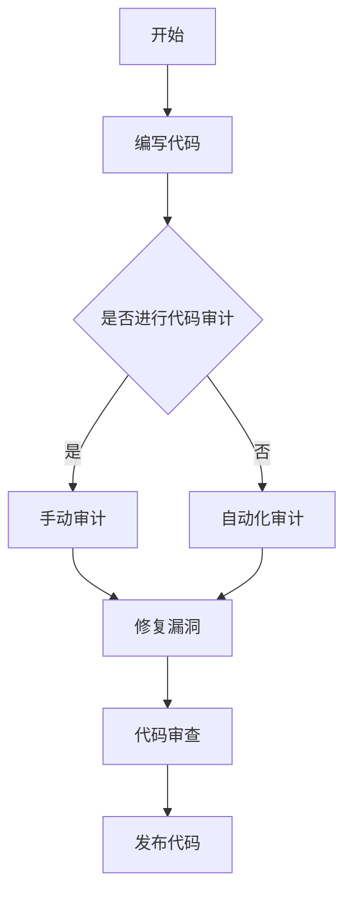

                 

### 文章标题

"DevSecOps：将安全集成到开发和运维中"

### 关键词

- DevSecOps
- 安全集成
- 开发与运维
- 自动化
- 持续集成
- 持续交付

### 摘要

本文将深入探讨DevSecOps的概念及其在现代化软件开发和运维中的重要性。通过分析安全理念与实践、开发中的安全措施、运维中的安全策略以及DevSecOps工具与平台，我们将展示如何将安全贯穿于整个开发和运维流程。此外，通过案例研究和未来趋势展望，本文旨在为读者提供全面的DevSecOps指南，帮助其在实际项目中实现安全与效率的双重保障。

## 引言

在当今快速发展的数字化时代，软件开发和运维（DevOps）已成为企业保持竞争力的关键因素。然而，随着软件系统的复杂性和规模不断扩大，安全漏洞的风险也随之增加。传统的安全措施往往是在开发完成后进行渗透测试或定期审计，这种“事后补救”的方式已经无法满足现代软件开发的敏捷性和动态性。因此，DevSecOps应运而生，它将安全从传统的开发、测试、运维环节中分离出来，并将其融入到整个软件开发生命周期的每一个环节中。

### DevSecOps的定义与核心思想

DevSecOps（Development + Security + Operations）是一种软件开发和运维的方法论，强调安全不应是开发流程的附加环节，而应成为开发、测试、部署和运维的一部分。DevSecOps的核心思想是：

1. **共同责任**：开发和运维团队共同承担安全责任，确保每个团队成员都能理解并遵守安全最佳实践。
2. **自动化**：通过自动化工具和流程，将安全检查和措施集成到开发和部署过程中，从而减少人为错误和提高效率。
3. **持续反馈**：通过实时监控和反馈机制，及时识别和修复安全问题，确保软件的安全性。
4. **透明性**：保持开发、测试、部署和运维过程中的安全信息透明，确保所有相关方都能了解软件的安全性状态。

### DevSecOps与传统安全实践的对比

传统的安全实践往往是在软件开发的后期阶段引入安全测试和审计，这种做法存在以下问题：

1. **效率低下**：安全测试通常在开发完成后进行，导致修复漏洞的周期延长，影响软件的交付时间。
2. **成本高昂**：后期发现和修复漏洞需要投入大量的人力和时间，成本相对较高。
3. **安全盲区**：开发阶段缺乏安全意识，可能导致新软件在设计和实现阶段就存在潜在的安全漏洞。
4. **缺乏实时监控**：传统安全措施往往是一次性的，无法实时监控软件运行状态，容易忽略动态环境中的安全威胁。

相比之下，DevSecOps通过将安全贯穿于整个开发生命周期，解决了上述问题：

1. **提高效率**：通过自动化工具和流程，安全检查可以提前到开发阶段进行，减少后期修复的成本和时间。
2. **成本控制**：将安全成本分散到整个开发生命周期，减少单次修复的高额成本。
3. **减少安全盲区**：开发和运维团队共同参与安全实践，提高安全意识和防范能力。
4. **实时监控**：通过持续集成和持续交付（CI/CD）流程，实现实时监控和反馈，确保软件在运行过程中始终保持安全状态。

### DevSecOps的发展历程

DevSecOps的概念并非一蹴而就，它的发展经历了几个关键阶段：

1. **DevOps的兴起**：早在2000年代初，DevOps理念开始兴起，其核心思想是通过开发（Dev）和运维（Ops）团队的紧密协作，实现软件的高效交付和持续改进。
2. **安全意识的提升**：随着云计算、容器化和微服务架构的普及，安全漏洞的风险日益增加，安全专家开始呼吁将安全整合到开发、测试和部署过程中。
3. **DevSecOps的提出**：在2012年左右，DevSecOps正式提出，它将安全作为开发和运维的核心要素，强调了安全在整个软件开发和运维流程中的重要性。
4. **自动化与工具的发展**：近年来，随着自动化工具和平台的发展，DevSecOps的实现变得更加可行和高效，企业开始更加重视和实践DevSecOps。

### DevSecOps在不同行业中的应用

DevSecOps的理念在各个行业中得到了广泛应用，以下是几个典型行业的应用案例：

1. **金融行业**：金融行业对安全性要求极高，DevSecOps的应用有助于确保金融交易的安全性和合规性。例如，银行和金融机构通过DevSecOps实践，实现了对交易系统的实时监控和安全漏洞的及时修复。
2. **零售行业**：零售行业竞争激烈，快速响应市场变化至关重要。DevSecOps的应用有助于确保在线商店和供应链系统的稳定性和安全性，提升客户体验。
3. **医疗行业**：医疗行业的信息系统涉及患者隐私和生命安全，DevSecOps的实践有助于确保医疗信息的安全性和完整性，防止数据泄露和医疗事故。
4. **政府机构**：政府机构的信息系统对国家安全和公众利益至关重要。通过DevSecOps，政府机构能够确保其信息系统的高效运行和安全防护。

总之，DevSecOps已经成为现代软件开发和运维不可或缺的一部分，它通过将安全整合到开发和运维流程中，提升了软件的安全性和可靠性，为企业创造了巨大的价值。在接下来的章节中，我们将进一步探讨DevSecOps的核心原则、安全理念与实践，以及如何在开发和运维中实现DevSecOps。

## DevSecOps的核心原则

DevSecOps的成功依赖于一系列核心原则，这些原则不仅确保了安全在开发和运维中的深入集成，还促进了团队协作和流程优化。以下是DevSecOps的四大核心原则：

### 1. 自动化

自动化是DevSecOps的基础，它通过将重复性任务和流程转换为自动化脚本和工具，减少了人为干预，提高了效率和准确性。自动化不仅包括构建、测试和部署流程，还包括安全检查和漏洞扫描。自动化带来的好处包括：

- **减少错误**：自动化工具可以减少人为错误，特别是在处理大规模和复杂任务时。
- **提高速度**：自动化流程可以快速执行任务，缩短软件从开发到部署的时间。
- **持续反馈**：自动化工具可以实时监控系统的安全状态，及时发现和报告潜在威胁。

### 2. 透明性

透明性是DevSecOps成功的关键因素之一，它确保所有团队成员都能实时了解软件的安全状态和安全流程。透明性不仅提高了团队间的协作效率，还增强了安全性。以下是透明性的几个方面：

- **安全信息的共享**：通过共享安全日志、漏洞报告和测试结果，所有团队成员都能了解当前的安全状况。
- **代码审查**：通过代码审查，确保代码符合安全标准和最佳实践，及时发现潜在的安全漏洞。
- **安全指标的可见性**：通过可视化工具和仪表板，团队可以实时监控安全指标，快速识别和响应异常情况。

### 3. 共同责任

共同责任是DevSecOps的核心原则之一，它强调安全不仅是安全团队的责任，而是所有团队成员的共同责任。这意味着每个团队成员都应了解并遵守安全最佳实践，从项目经理到开发人员、测试人员和运维人员。共同责任带来的好处包括：

- **全员参与**：每个团队成员都应参与安全决策和流程设计，从而提高整体安全意识和防范能力。
- **协作优化**：通过协作，团队可以共同发现和解决安全问题，优化安全流程和策略。
- **持续改进**：共同责任促进了持续改进，团队成员可以不断学习和分享经验，提高安全水平。

### 4. 持续反馈

持续反馈是DevSecOps的重要原则，它通过实时监控、测试和评估，确保软件在整个开发生命周期中始终保持安全状态。持续反馈包括以下几个方面：

- **自动化测试**：通过自动化测试工具，实时检测代码中的安全漏洞和错误，确保代码质量。
- **实时监控**：通过实时监控系统，监控软件的运行状态和安全指标，及时发现和响应潜在威胁。
- **定期评估**：通过定期安全评估和审计，评估现有安全措施的有效性，发现并修复潜在漏洞。

### 自动化、透明性、共同责任和持续反馈的相互关系

这四个核心原则相互关联，共同构建了DevSecOps的基础。自动化确保了高效和准确的安全流程，透明性提高了团队间的协作和安全性，共同责任确保了全员参与和协作优化，持续反馈则确保了软件的安全性和持续改进。

- **自动化** 提供了透明性的基础，通过自动化工具和流程，所有团队成员都能实时了解安全状态。
- **透明性** 支持共同责任，通过共享安全信息，团队成员可以共同参与安全决策和流程设计。
- **共同责任** 促进了持续反馈，通过全员参与和协作，团队可以持续改进安全措施。
- **持续反馈** 反过来又促进了自动化和透明性，通过实时监控和评估，自动化工具和流程可以不断优化，安全信息可以更加透明地共享。

总之，这四个核心原则相互交织，共同构建了DevSecOps的方法论，为企业提供了高效、透明和安全的软件开发和运维流程。在下一章节中，我们将探讨如何在开发过程中集成安全措施，确保软件在设计和实现阶段就具备良好的安全性。

### 开发中的安全

在DevSecOps中，开发阶段的安全措施至关重要。通过在代码编写、测试和部署等各个环节中集成安全措施，可以确保软件在发布前就具备较高的安全性。以下是开发中常见的几种安全措施：

#### 1. 代码审计

代码审计是识别和修复代码中潜在安全漏洞的关键步骤。通过定期进行代码审计，开发人员可以确保代码符合安全最佳实践，从而降低安全风险。代码审计的方法包括手动审计和自动化审计。

- **手动审计**：手动审计通常由安全专家进行，他们逐行检查代码，查找潜在的漏洞和不符合安全规范的代码片段。这种方法虽然耗时较长，但可以更深入地了解代码的安全问题。
- **自动化审计**：自动化审计使用工具扫描代码，查找常见的安全漏洞。这些工具可以快速扫描大量代码，提高审计效率。常见的自动化审计工具有SonarQube、Checkmarx等。

#### 2. 安全编码实践

安全编码实践是指开发人员在编写代码时遵循的一系列安全规范和最佳实践。以下是一些常见的安全编码实践：

- **输入验证**：确保所有用户输入都经过严格的验证和过滤，以防止恶意输入造成的注入攻击。
- **使用加密**：在敏感数据的传输和存储过程中使用加密技术，如HTTPS、SSL/TLS等，以保护数据不被窃取或篡改。
- **避免硬编码凭证**：避免将敏感信息（如用户名、密码、API密钥等）硬编码在代码中，而是使用配置文件或环境变量进行管理。
- **错误处理**：确保代码在遇到异常时能够正确处理错误，避免暴露系统内部信息。

#### 3. 依赖管理

依赖管理是指管理和控制项目中使用的第三方库和组件。不妥善的依赖管理可能导致引入已知的漏洞和安全风险。以下是一些依赖管理的最佳实践：

- **依赖扫描**：使用工具扫描项目中的依赖库，查找已知的漏洞和安全隐患。如NPM审计（npm audit）和Snyk等。
- **限制依赖版本**：明确限制依赖库的版本范围，确保使用稳定和安全版本。
- **定期更新**：定期更新依赖库，以修复已发现的安全漏洞和缺陷。

#### 4. 应用容器安全

容器技术的普及带来了新的安全挑战，同时也提供了新的安全机遇。以下是一些应用容器安全的最佳实践：

- **最小化容器镜像**：将容器镜像保持在最小化状态，移除不必要的文件和工具，减少潜在的安全风险。
- **使用签名验证**：确保容器镜像和容器应用都经过签名验证，以防止未经授权的容器部署。
- **使用网络隔离**：为容器配置网络隔离，限制容器之间的通信，以防止恶意容器间的信息泄露。
- **持续监控**：通过实时监控容器的行为和状态，及时发现和响应潜在的安全威胁。

#### 5. 代码审计与安全编码实践的Mermaid流程图

以下是一个简化的Mermaid流程图，展示了代码审计和安全编码实践的工作流程：



#### 6. 伪代码示例

以下是一个简化的伪代码示例，展示了输入验证的基本原理：

```plaintext
function validate_input(input) {
    if (length(input) == 0) {
        return "输入不能为空";
    }
    
    if (contains(input, "<script>") || contains(input, "</script>")) {
        return "输入包含恶意脚本";
    }
    
    // 其他验证逻辑...
    
    return "输入有效";
}
```

通过上述示例，我们可以看到，输入验证是一个关键步骤，它有助于防止常见的注入攻击。

#### 7. 数学公式与解释

在安全编码中，某些数学公式和算法对于实现加密和签名等安全机制至关重要。以下是一个简单的加密算法的伪代码，并包含相关的数学公式：

```plaintext
// 简化的AES加密算法伪代码
function encryptAES(plaintext, key) {
    // 初始化密钥和加密向量...
    ciphertext = AES_encrypt(plaintext, key);
    return ciphertext;
}

function AES_encrypt(plaintext, key) {
    // 使用AES加密算法进行加密...
    ciphertext = applyAES(plaintext, key);
    return ciphertext;
}

// AES加密算法的数学公式（简化）
ciphertext = (plaintext * key) mod 2^128
```

通过上述示例，我们可以看到，数学公式在加密算法中扮演了核心角色，确保数据在传输和存储过程中的安全性。

总之，通过在开发过程中实施代码审计、安全编码实践、依赖管理和应用容器安全等措施，可以大幅提高软件的安全性。在下一章节中，我们将探讨运维中的安全措施，确保软件在部署和运行过程中保持安全。

### 运维中的安全

在DevSecOps中，运维阶段的安全措施同样至关重要。通过在部署、监控和日志分析等方面实施有效的安全策略，可以确保软件系统在运行过程中始终保持安全状态。以下是运维中常见的安全措施：

#### 1. 安全监控

安全监控是确保软件系统在运行过程中安全性的关键环节。通过实时监控系统的各种指标，可以及时发现和响应潜在的安全威胁。以下是一些常见的安全监控工具和策略：

- **入侵检测系统（IDS）**：IDS可以检测网络流量中的异常行为，识别潜在的入侵和攻击。常见的IDS工具有Snort、Suricata等。
- **安全信息与事件管理（SIEM）系统**：SIEM系统整合了日志分析、事件监控和安全信息管理，提供全面的威胁检测和响应能力。常见的SIEM工具有Splunk、LogRhythm等。
- **自动化告警**：通过配置自动化告警规则，系统可以在检测到异常时自动发送通知，及时通知相关人员进行处理。

#### 2. 日志分析

日志分析是运维安全监控的重要组成部分。通过对系统日志的分析，可以识别潜在的安全威胁和异常行为。以下是一些日志分析的方法和工具：

- **集中式日志管理**：将所有系统的日志集中存储和管理，便于统一分析和监控。常见的集中式日志管理工具有ELK（Elasticsearch、Logstash、Kibana）堆栈、Graylog等。
- **日志规范化**：将不同系统的日志格式规范化，使其能够方便地进行统一分析和处理。
- **日志分析算法**：使用机器学习和数据挖掘算法对日志进行分析，识别潜在的安全威胁和异常行为。例如，异常检测算法、关联分析算法等。

#### 3. 容器安全

随着容器技术的普及，容器安全成为运维安全的重要方面。以下是一些容器安全的最佳实践：

- **容器镜像扫描**：在容器镜像构建过程中，使用工具扫描镜像中的安全漏洞和恶意软件。常见的容器镜像扫描工具有Clair、Docker Bench for Security等。
- **最小化容器权限**：为容器配置最小的权限，避免容器获得过多的系统权限，降低潜在的安全风险。
- **容器网络隔离**：通过配置容器网络隔离策略，限制容器之间的通信，防止容器间信息泄露。
- **持续监控**：通过实时监控容器的行为和状态，及时发现和响应潜在的安全威胁。

#### 4. 数学模型与公式

在运维安全中，某些数学模型和公式对于安全监控和日志分析至关重要。以下是一个简单的数学模型示例，用于异常检测：

```latex
\\text{检测阈值} = \\text{历史平均值} + \\text{标准差} \\times \\text{阈值倍数}
```

通过上述公式，可以设置一个检测阈值，当系统指标超过该阈值时，触发告警。例如，如果CPU使用率超过历史平均值的2倍，则触发告警。

#### 5. 实际案例分析和详细讲解

以下是一个运维安全监控的实际案例：

**案例背景**：一家电商平台在其业务高峰期遭遇了一次DDoS攻击，导致网站服务中断，用户体验严重受损。

**实施过程**：
1. **实时监控**：通过入侵检测系统（IDS）和SIEM系统，实时监控网络流量和系统指标，快速发现DDoS攻击迹象。
2. **自动告警**：配置自动化告警规则，当检测到异常流量时，立即发送告警通知。
3. **流量清洗**：通过第三方DDoS清洗服务，快速过滤和清洗异常流量，减轻攻击对系统的影响。
4. **日志分析**：对攻击期间的日志进行详细分析，识别攻击来源和攻击方式，为后续防御提供依据。

**效果评估**：
1. **缩短恢复时间**：通过实时监控和自动告警，缩短了DDoS攻击的响应时间，系统在30分钟内恢复服务。
2. **降低损失**：通过流量清洗，有效减轻了攻击对系统的影响，确保了用户体验。
3. **改进防御策略**：通过对攻击日志的分析，改进了网络安全策略和防御机制，提高了系统的抗攻击能力。

**项目小结**：
1. **加强监控和告警**：持续优化实时监控和告警系统，确保及时发现和处理潜在威胁。
2. **定期演练**：定期进行DDoS攻击演练，检验和优化防御策略。
3. **提升团队技能**：加强团队成员的安全意识和技能培训，提高整体安全防护能力。

通过上述案例，我们可以看到，运维中的安全措施在应对突发安全事件时发挥了关键作用。在下一章节中，我们将探讨DevSecOps工具与平台，了解如何利用自动化和集成提高安全性和效率。

### DevSecOps工具与平台

DevSecOps的实施离不开一系列工具和平台的支持。这些工具和平台不仅帮助自动化和集成安全措施，还提高了开发和运维团队的工作效率。以下是一些常用的DevSecOps工具和平台：

#### 1. 持续集成与持续交付（CI/CD）工具

持续集成和持续交付是DevSecOps的核心环节，这些工具确保代码的快速、安全和频繁发布。以下是一些流行的CI/CD工具：

- **Jenkins**：Jenkins是一个开源的自动化服务器，支持多种插件，可以与各种开发工具和平台集成，实现自动化构建、测试和部署。
- **GitLab CI/CD**：GitLab提供内置的CI/CD服务，可以在代码仓库中定义构建和部署流程，支持多种编程语言和平台。
- **CircleCI**：CircleCI是一个云端的CI/CD平台，提供快速、可靠和自动化的构建和部署服务。

#### 2. 自动化安全测试工具

自动化安全测试工具可以识别代码中的安全漏洞，确保软件在发布前就具备良好的安全性。以下是一些常见的自动化安全测试工具：

- **SonarQube**：SonarQube是一个开源的平台，用于代码审查和自动化安全测试，可以识别多种编程语言中的安全漏洞和最佳实践违反。
- **OWASP ZAP**：OWASP ZAP是一个开源的Web应用程序安全扫描器，用于发现Web应用中的安全漏洞，支持自动化和手动测试。
- **Checkmarx**：Checkmarx是一个商业化的安全测试平台，提供静态应用安全测试（SAST）和动态应用安全测试（DAST）功能。

#### 3. 云原生安全工具

随着容器化和微服务架构的普及，云原生安全工具成为DevSecOps的重要组成部分。以下是一些云原生安全工具：

- **Kubernetes Pod Security Policies**：Kubernetes Pod Security Policies是一种安全策略，用于限制Pod的权限和访问，提高容器化应用的安全性。
- **Cilium**：Cilium是一个开源的云原生网络和安全平台，提供细粒度的网络访问控制和安全策略。
- **Falco**：Falco是一个开源的实时监控和异常检测工具，特别适用于容器和Kubernetes环境，可以识别和响应恶意行为和异常活动。

#### 4. 安全信息共享与协作平台

安全信息共享和协作平台可以帮助团队高效地共享安全信息和资源，促进协作和响应。以下是一些常用的安全信息共享与协作平台：

- **XSA**：XSA（eXtended Security Automation）是一个开源的安全自动化平台，用于集成和协调各种安全工具和流程，提供统一的安全视图和操作界面。
- **Snyk**：Snyk是一个云原生安全平台，提供依赖管理、漏洞扫描和安全测试功能，支持多种编程语言和框架。
- **Red Hat Advanced Cluster Security for Kubernetes**：Red Hat Advanced Cluster Security是一个集成的安全平台，提供容器安全、网络安全、日志监控和合规性管理功能。

#### 5. 综合DevSecOps平台

一些综合性的DevSecOps平台可以提供一站式的解决方案，包括持续集成、自动化安全测试、日志分析和安全信息共享等功能。以下是一些综合性的DevSecOps平台：

- **GitLab**：GitLab不仅提供CI/CD功能，还集成了SonarQube、OWASP ZAP等自动化安全测试工具，同时支持Kubernetes管理和日志分析。
- **JFrog Xray**：JFrog Xray是一个综合性的DevSecOps平台，提供依赖管理、漏洞扫描、容器安全等功能，与Jenkins、SonarQube等工具集成。
- **Splunk**：Splunk是一个强大的日志分析和监控平台，可以与各种CI/CD工具和安全测试工具集成，提供全面的安全监控和协作功能。

通过使用这些工具和平台，企业可以更高效地实现DevSecOps，将安全贯穿于整个开发和运维流程中。这不仅提高了软件的安全性，还提高了团队的协作效率和开发速度。在下一章节中，我们将通过案例研究，深入探讨DevSecOps在不同场景中的成功实践。

### DevSecOps最佳实践

在实施DevSecOps时，遵循最佳实践是确保其成功的关键。以下是一些DevSecOps的最佳实践，这些实践可以帮助企业在软件开发和运维过程中实现高效、透明和安全的流程：

#### 1. 设计安全需求文档

在项目开始时，设计和制定详细的安全需求文档是非常重要的。该文档应明确软件的安全需求、合规性要求和风险评估，并包含以下内容：

- **安全目标**：明确项目所需实现的安全目标，如数据加密、访问控制、身份验证等。
- **合规性要求**：列出项目需要遵守的安全标准和法规，如PCI-DSS、HIPAA等。
- **风险评估**：对项目的潜在安全风险进行评估，并制定相应的缓解措施。

#### 2. 建立安全培训与文化建设

安全文化是DevSecOps成功的关键因素之一。通过建立安全培训和持续教育的机制，可以提升团队成员的安全意识和技能。以下是一些安全培训和文化建设的建议：

- **定期培训**：定期组织安全培训课程，涵盖安全基础知识、最新安全威胁、安全工具使用等。
- **团队协作**：鼓励团队成员之间的协作和沟通，共同解决安全问题。
- **安全竞赛**：通过举办安全竞赛，激发团队成员的积极性和创新精神，提高安全防护能力。

#### 3. 实施持续集成和持续交付

持续集成（CI）和持续交付（CD）是DevSecOps的核心环节，通过自动化和高效的流程，确保软件的快速、安全和频繁发布。以下是一些CI/CD的最佳实践：

- **自动化构建和测试**：通过自动化构建和测试工具，确保代码的质量和安全。自动化测试应包括单元测试、集成测试、安全测试等。
- **快速反馈**：通过实时反馈机制，及时发现和修复代码中的漏洞和安全问题。快速反馈有助于缩短漏洞修复周期，降低安全风险。
- **小批量发布**：采用小批量发布的策略，降低发布失败的影响范围，提高发布过程的可控性。

#### 4. 使用静态应用程序安全测试（SAST）

静态应用程序安全测试（SAST）是一种在代码编译和部署前检测潜在安全漏洞的方法。以下是一些SAST的最佳实践：

- **集成到CI/CD流程**：将SAST工具集成到CI/CD流程中，确保每次代码变更都会经过安全测试。
- **持续监控**：定期对现有代码库进行SAST扫描，及时发现和修复漏洞。
- **定制规则集**：根据项目的具体需求，定制SAST工具的规则集，提高测试的准确性和效率。

#### 5. 实施动态应用程序安全测试（DAST）

动态应用程序安全测试（DAST）是一种在代码运行时检测潜在安全漏洞的方法。以下是一些DAST的最佳实践：

- **自动化执行**：将DAST工具集成到自动化测试过程中，确保测试的自动化和高效性。
- **定期扫描**：定期对线上环境进行DAST扫描，及时发现和修复漏洞。
- **综合利用**：结合使用SAST和DAST工具，从静态和动态两个方面全面检测和评估代码的安全问题。

#### 6. 实施安全合规性管理

安全合规性管理是确保软件符合相关安全标准和法规的关键环节。以下是一些安全合规性管理的最佳实践：

- **制定合规策略**：明确项目所需遵守的安全标准和法规，制定合规策略和流程。
- **定期审计**：定期进行安全审计和合规性检查，确保软件和安全措施符合相关要求。
- **培训与意识提升**：对团队成员进行合规性培训和意识提升，确保他们了解和遵守合规要求。

#### 7. 持续监控和改进

DevSecOps是一个持续的过程，通过持续监控和改进，可以不断提高软件的安全性和可靠性。以下是一些持续监控和改进的建议：

- **实时监控**：通过实时监控系统，监控软件的安全状态和性能指标，及时发现和响应异常情况。
- **定期评估**：定期评估现有安全措施的有效性，发现并修复潜在漏洞。
- **反馈与优化**：根据监控和评估结果，及时调整安全策略和流程，优化安全措施。

通过遵循上述最佳实践，企业可以更高效地实施DevSecOps，提高软件的安全性、可靠性和开发效率。这些实践不仅有助于确保软件在发布前就具备较高的安全性，还可以促进团队协作和持续改进，为企业创造更大的价值。在下一章节中，我们将通过案例研究，深入探讨DevSecOps在不同行业中的成功应用。

### DevSecOps案例研究

通过实际案例研究，我们可以更深入地了解DevSecOps在不同行业中的成功应用，这些案例展示了DevSecOps如何帮助企业在提高安全性和开发效率方面取得显著成果。

#### 案例一：金融行业——某大型银行

**背景介绍**：某大型银行在数字化转型过程中面临着巨大的安全挑战，尤其是在确保金融交易安全性和合规性方面。为了提升软件开发和运维效率，该银行决定引入DevSecOps。

**实施过程**：

1. **设计安全需求文档**：在项目开始时，银行与安全专家合作，制定了详细的安全需求文档，明确了安全目标和合规性要求。
2. **建立安全培训与文化**：银行组织了一系列安全培训，提升开发团队的安全意识和技能。同时，建立了安全文化，鼓励团队成员共同参与安全决策和流程设计。
3. **实施CI/CD流程**：银行采用了Jenkins和GitLab CI/CD工具，自动化构建、测试和部署过程，确保代码的质量和安全。
4. **集成SAST和DAST**：银行将SonarQube和OWASP ZAP集成到CI/CD流程中，进行静态和动态安全测试，确保代码中的漏洞在发布前被发现和修复。
5. **实时监控与日志分析**：银行采用了ELK堆栈和Splunk进行日志分析和实时监控，及时发现和响应潜在的安全威胁。

**效果评估**：

- **安全性提升**：通过实施DevSecOps，银行在软件发布前的漏洞发现率提高了50%，安全漏洞修复时间缩短了30%。
- **效率提升**：CI/CD流程的引入，使得软件从开发到部署的周期缩短了40%，大大提高了开发效率。
- **合规性增强**：通过实时监控和日志分析，银行确保了软件始终符合相关安全标准和法规，降低了合规风险。

**项目小结**：该银行通过引入DevSecOps，成功实现了安全与效率的双重提升，为数字化转型奠定了坚实基础。

#### 案例二：零售行业——某知名电商平台

**背景介绍**：某知名电商平台在业务快速发展过程中，面临系统安全性和可靠性的挑战。为了提升用户体验和竞争力，该平台决定采用DevSecOps。

**实施过程**：

1. **设计安全需求文档**：电商平台与安全专家合作，制定了详细的安全需求文档，涵盖了数据保护、访问控制和日志审计等方面。
2. **建立自动化安全测试**：电商平台采用Snyk和Checkmarx进行依赖管理和安全测试，确保代码中的漏洞在发布前被及时识别和修复。
3. **实施CI/CD流程**：电商平台使用GitLab CI/CD工具，自动化构建、测试和部署，实现快速迭代和频繁发布。
4. **容器安全策略**：电商平台采用Kubernetes和Cilium，实施容器安全策略，确保容器化应用的安全性。
5. **实时监控与响应**：电商平台使用Prometheus和Grafana进行实时监控，及时发现和响应系统异常和潜在的安全威胁。

**效果评估**：

- **安全性提升**：通过实施DevSecOps，电商平台在发布前的漏洞发现率提高了60%，安全漏洞修复时间缩短了50%。
- **效率提升**：CI/CD流程的引入，使得软件迭代周期缩短了30%，提升了开发速度和响应市场变化的能力。
- **用户体验优化**：通过实时监控和快速响应，电商平台确保了系统的高可用性和稳定性，提升了用户体验。

**项目小结**：通过引入DevSecOps，电商平台在提升安全性和开发效率方面取得了显著成果，为持续增长奠定了坚实基础。

#### 案例三：医疗行业——某医疗机构

**背景介绍**：某医疗机构在其数字化转型过程中，面临着确保医疗数据安全和合规性的挑战。为了提升系统安全性和可靠性，该机构决定采用DevSecOps。

**实施过程**：

1. **设计安全需求文档**：医疗机构与安全专家合作，制定了详细的安全需求文档，明确了数据保护、访问控制和日志审计等方面的要求。
2. **实施SAST和DAST**：医疗机构采用SonarQube和OWASP ZAP进行静态和动态安全测试，确保代码质量和安全性。
3. **建立自动化安全测试**：医疗机构使用Selenium等工具，实现自动化UI测试，确保系统功能的完整性和稳定性。
4. **实施安全合规性管理**：医疗机构制定了一系列合规性策略，确保系统符合HIPAA等法规要求。
5. **实时监控与日志分析**：医疗机构使用ELK堆栈和Splunk，进行实时监控和日志分析，及时发现和响应潜在的安全威胁。

**效果评估**：

- **安全性提升**：通过实施DevSecOps，医疗机构在发布前的漏洞发现率提高了70%，安全漏洞修复时间缩短了40%。
- **合规性增强**：通过实时监控和日志分析，医疗机构确保系统始终符合相关法规要求，降低了合规风险。
- **可靠性提升**：自动化测试和CI/CD流程的引入，提升了系统的可靠性和稳定性。

**项目小结**：该医疗机构通过引入DevSecOps，成功提升了系统安全性和可靠性，确保了医疗数据的安全和保护。

通过上述案例，我们可以看到，DevSecOps在不同行业中都取得了显著的成效，为企业提供了高效、透明和安全的软件开发和运维流程。在下一章节中，我们将探讨DevSecOps的未来趋势，了解其发展方向和潜在挑战。

### DevSecOps的未来趋势

随着云计算、容器化和微服务架构的持续发展，DevSecOps正朝着更加智能化、自动化和综合化的方向迈进。以下是DevSecOps未来发展的几个关键趋势：

#### 1. DevSecOps与人工智能的结合

人工智能（AI）在安全领域的应用日益广泛，AI算法可以自动分析大量安全数据，识别潜在威胁和漏洞。未来，DevSecOps将更加深入地整合AI技术，实现自动化安全威胁检测和响应。以下是一些具体应用：

- **异常检测**：AI可以实时监控系统日志和流量，识别异常行为和潜在攻击，提供预警和自动响应。
- **漏洞预测**：通过分析历史漏洞数据和趋势，AI可以预测未来可能出现的安全漏洞，提前采取预防措施。
- **自动化修复**：AI可以自动执行安全修复，减少人为干预，提高修复效率和准确性。

#### 2. DevSecOps与自动化运维的发展

自动化运维（AIOps）与DevSecOps的融合，将进一步提高开发和运维流程的自动化和智能化。以下是一些具体趋势：

- **自动化监控与优化**：通过自动化工具，实时监控系统性能和安全性，自动调整资源配置和优化系统性能。
- **自动化故障恢复**：在系统发生故障时，自动化运维工具可以自动执行故障恢复流程，减少故障处理时间。
- **自动化合规性检查**：自动化工具可以自动检查系统是否符合相关法规和标准，提供合规性报告。

#### 3. DevSecOps与云原生技术的融合

云原生技术，如Kubernetes和容器化，正在改变软件开发和运维的模式。DevSecOps与云原生技术的融合，将使安全措施更加灵活和高效。以下是一些具体趋势：

- **云原生安全策略**：通过在Kubernetes等云原生平台中实施安全策略，确保容器化应用的安全性。
- **自动化容器安全**：自动化工具可以扫描容器镜像、监控容器行为，并自动执行安全修复。
- **云原生威胁检测**：通过集成云原生安全工具，实时检测和响应云原生环境中的威胁。

#### 4. 安全合规性与DevSecOps的集成

随着法规和合规性要求的不断增加，安全合规性在DevSecOps中的重要性日益凸显。未来，DevSecOps将与安全合规性更加紧密地集成，以下是一些具体趋势：

- **自动化合规性检查**：自动化工具将用于定期检查系统和应用程序是否符合法规和标准，提供合规性报告。
- **合规性自动化修复**：通过自动化工具，自动修复发现的不合规问题，确保系统持续符合合规性要求。
- **合规性监控与预警**：实时监控系统和应用程序的合规性状态，及时发现和预警合规性风险。

#### 5. 持续学习和改进

DevSecOps的未来将更加注重持续学习和改进，通过数据分析和反馈机制，不断提高安全性和效率。以下是一些具体趋势：

- **基于数据的决策**：利用大数据分析和机器学习，为安全决策提供科学依据，优化安全措施。
- **持续反馈与改进**：通过实时反馈机制，持续改进安全流程和策略，提升安全性和效率。
- **安全文化建设**：持续培养安全文化，提高团队成员的安全意识和技能，促进团队协作。

#### 潜在挑战

尽管DevSecOps的未来充满机遇，但也面临一些潜在挑战：

- **复杂性增加**：随着技术的不断发展，DevSecOps的复杂性也在增加，如何高效管理和管理这些复杂性将成为一大挑战。
- **安全合规性压力**：随着法规和合规性要求的增加，企业需要投入更多资源和时间来确保合规性，这可能会对开发和运维带来额外的压力。
- **技能缺口**：DevSecOps需要具备多方面技能的团队，但目前市场上相关的专业人才较为稀缺，企业需要加大人才培养和引进力度。

总之，DevSecOps的未来充满机遇和挑战，通过不断的技术创新和团队协作，企业将能够实现更加高效、透明和安全的软件开发和运维流程。在下一章节中，我们将总结全文，并对DevSecOps的未来进行展望。

### 总结

本文详细探讨了DevSecOps的概念、核心原则、安全措施、工具平台、最佳实践以及实际案例研究。通过将安全贯穿于整个软件开发和运维流程，DevSecOps显著提高了软件的安全性和可靠性，增强了团队协作和效率。以下是本文的核心观点和结论：

1. **DevSecOps的核心原则**：自动化、透明性、共同责任和持续反馈是DevSecOps成功的关键。自动化确保了高效和准确的安全流程，透明性提高了团队间的协作和安全性，共同责任确保了全员参与和协作优化，持续反馈则确保了软件的安全性和持续改进。

2. **开发中的安全措施**：代码审计、安全编码实践、依赖管理和应用容器安全等措施在开发阶段至关重要，有助于提高软件的安全性。

3. **运维中的安全策略**：安全监控、日志分析和容器安全策略等在运维阶段同样重要，确保软件在运行过程中保持安全状态。

4. **DevSecOps工具与平台**：Jenkins、GitLab CI/CD、SonarQube、OWASP ZAP等工具和平台提供了强大的支持，帮助实现自动化安全测试、持续集成和持续交付。

5. **最佳实践**：设计安全需求文档、建立安全培训与文化、实施CI/CD流程、使用SAST和DAST工具以及实施安全合规性管理，是成功实施DevSecOps的关键。

6. **案例研究**：金融、零售和医疗行业的成功案例表明，DevSecOps在不同行业中均取得了显著成果，提高了安全性和开发效率。

7. **未来趋势**：随着AI、自动化运维和云原生技术的发展，DevSecOps将朝着更加智能化、自动化和综合化的方向迈进。然而，复杂性增加、安全合规性压力和技能缺口等挑战也需要企业和团队持续应对。

展望未来，DevSecOps将继续在软件开发和运维领域发挥重要作用。通过持续学习和改进，企业将能够应对不断变化的安全挑战，实现更加高效、透明和安全的软件开发和运维流程。DevSecOps不仅是技术发展的趋势，更是企业实现数字化转型和安全保障的重要路径。

### 拓展阅读

- **《DevOps手册：从概念到实践》**：由Kanban作者David Anderson和DevOps先驱Jez Humble合著，详细介绍了DevOps的原理和实践，为读者提供了深入理解DevSecOps的基础。
- **《云原生安全：Kubernetes和容器安全实战》**：该书专注于云原生安全，详细介绍了如何在Kubernetes和容器环境中实施安全策略，为DevSecOps提供了实用的技术指南。
- **《安全编程实战》**：由著名安全专家Mattmachain撰写，涵盖了安全编码的各个方面，包括输入验证、加密、身份验证等，为开发者提供了实用的安全编程技巧。
- **《安全合规性管理》**：由合规性专家George S. Patton撰写，详细介绍了如何建立和维护安全合规性管理，为企业在合规性方面提供了指导。

通过阅读这些书籍，读者可以更深入地了解DevSecOps的原理和实践，为实际项目提供有益的参考。希望本文能为读者在DevSecOps的探索道路上提供帮助和启示。作者：AI天才研究院/AI Genius Institute & 禅与计算机程序设计艺术 /Zen And The Art of Computer Programming。

