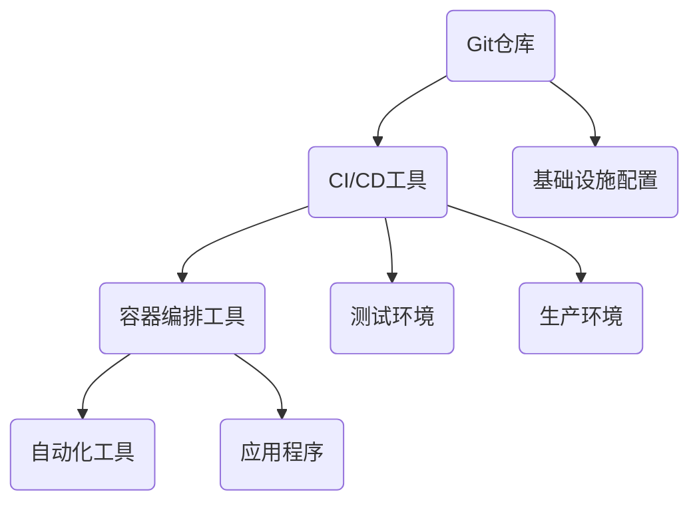

                 

### 文章标题

### GitOps工作流程与最佳实践

---

#### 关键词

- GitOps
- DevOps
- Kubernetes
- CI/CD
- 自动化
- 安全性
- 最佳实践

---

#### 摘要

GitOps是一种基于Git版本控制的现代软件开发和运维（DevOps）实践，它通过自动化和透明化的工作流程，实现了持续集成（CI）、持续部署（CD）和基础设施即代码（IaC）。本文将详细探讨GitOps的工作原理、架构、工具选择、部署实践以及最佳安全实践。通过案例分析和未来发展趋势的展望，帮助读者深入了解GitOps的核心价值和实施路径。

---

### 第一部分：GitOps基础

#### 第1章：GitOps简介

##### 1.1 GitOps的定义

GitOps是一种结合了Git版本控制和自动化工具的DevOps实践，旨在通过集中化的版本控制系统来管理应用程序的部署和配置。GitOps的核心思想是将所有基础设施和应用程序的配置存储在Git仓库中，并通过自动化工具实现基础设施的配置、部署、监控和恢复。

##### 1.2 GitOps与传统CI/CD的对比

传统CI/CD侧重于代码的自动化构建、测试和部署，但往往缺乏对基础设施配置的统一管理。GitOps则通过Git仓库作为单一事实来源，确保所有配置和部署的一致性和可追溯性。GitOps更加强调透明度和自动化，减少了人为错误的风险。

##### 1.3 GitOps的核心原则

GitOps遵循以下核心原则：

- **基础设施即代码（IaC）**：将基础设施的配置和应用程序的代码一样管理。
- **Git作为单一事实来源**：所有配置和部署操作都通过Git仓库进行管理和追踪。
- **自动化**：通过自动化工具实现配置的更新、部署、监控和故障恢复。
- **不可变基础设施**：基础设施配置的更改应通过更新Git仓库实现，而不是直接在环境中进行更改。
- **可观测性**：确保所有操作都有详细的日志记录和监控，以便快速识别和解决问题。

##### 1.4 GitOps的应用场景

GitOps适用于需要高可用性、快速迭代和持续交付的应用程序。以下是一些典型的应用场景：

- **微服务架构**：微服务架构中的每个服务都可以独立部署和管理，GitOps可以很好地支持这种模式。
- **容器化应用**：GitOps与Kubernetes等容器编排工具集成，可以实现自动化部署和配置管理。
- **云原生应用**：GitOps在云环境中提供了一种简单、透明和可追溯的部署和管理方法。

---

### 第2章：GitOps架构

##### 2.1 GitOps的组件介绍

GitOps的核心组件包括Git仓库、CI/CD工具、容器编排工具和自动化工具。

- **Git仓库**：用于存储应用程序代码、基础设施配置和部署脚本。
- **CI/CD工具**：负责自动化构建、测试和部署应用程序。
- **容器编排工具**：如Kubernetes，用于自动化部署和管理容器化应用。
- **自动化工具**：如ArgoCD或Flux，用于实现配置的同步和自动部署。

##### 2.2 GitOps架构图示例

##### 2.3 GitOps工作流程

GitOps的工作流程通常包括以下步骤：

1. **代码提交**：开发者将代码提交到Git仓库。
2. **构建与测试**：CI/CD工具自动构建应用程序并执行测试。
3. **部署**：通过自动化工具将应用程序部署到测试环境或生产环境。
4. **监控与告警**：实时监控系统监控应用程序的健康状况，并在出现问题时发送告警。
5. **回滚与恢复**：在发生故障时，自动化工具可以自动回滚到上一个稳定版本。

---

### 第一部分的总结

GitOps通过将Git版本控制与自动化工具相结合，提供了一种高效、透明和可追溯的软件交付方法。在第一部分中，我们介绍了GitOps的定义、与传统CI/CD的区别、核心原则和应用场景，以及GitOps的架构和基本工作流程。在接下来的部分中，我们将深入探讨GitOps的具体实践和最佳安全实践。

---

**作者：AI天才研究院/AI Genius Institute & 禅与计算机程序设计艺术 /Zen And The Art of Computer Programming**

