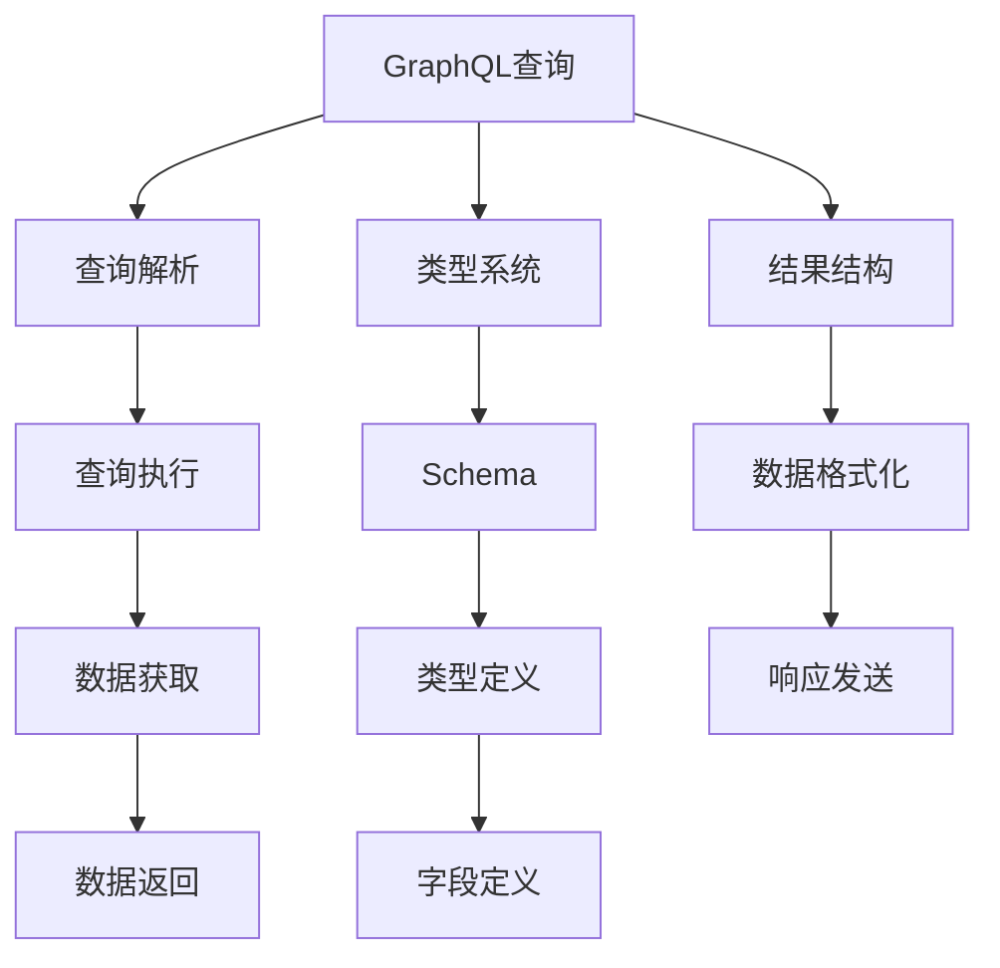

                 

## 文章标题

GraphQL API：灵活高效的数据查询语言

关键词：GraphQL，数据查询，API设计，灵活性与效率

摘要：本文将深入探讨GraphQL API，一种灵活且高效的数据查询语言。我们将从基础概念讲起，逐步深入到其架构、开发流程、高级特性以及最佳实践，帮助读者全面理解GraphQL的优势和应用。

## 引言

GraphQL是一种用于API设计的查询语言，旨在解决传统RESTful API中存在的诸多问题，如过度请求、数据冗余和不一致等。通过提供一种更为灵活、高效的数据查询方式，GraphQL为开发者带来了全新的开发体验。

在现代Web开发中，随着数据复杂性的增加和用户需求的多样化，传统的RESTful API已经无法满足高效数据查询的需求。GraphQL的出现，为开发者提供了一种全新的数据查询方式，使得他们能够更加精确地获取所需数据，从而提高了开发效率和应用性能。

本文将围绕GraphQL API的核心概念、架构、开发流程、高级特性以及最佳实践进行深入探讨，帮助读者全面了解GraphQL的优势和应用场景。无论您是初学者还是经验丰富的开发者，相信本文都会对您的学习和实践有所帮助。

## 核心概念与联系

### GraphQL查询语言

GraphQL的查询语言是基于一种类型系统构建的，它允许开发者定义复杂的查询，并且可以精确地指定所需数据的形状和结构。GraphQL查询语言的基本语法类似于SQL，但它的灵活性和表达能力远超后者。

以下是GraphQL查询语言的一个基本示例：

```graphql
query {
  user(id: "123") {
    name
    email
  }
}
```

在这个查询中，我们请求获取一个ID为"123"的用户，并且只返回用户的`name`和`email`字段。

### GraphQL类型与Schema

在GraphQL中，所有的数据都以类型的形式表示。类型可以表示对象、标量、枚举、输入对象等。开发者可以通过定义Schema来描述API中所有的类型和它们之间的关系。

以下是定义一个用户类型的示例：

```graphql
type User {
  id: ID!
  name: String!
  email: String!
}
```

在这个定义中，我们声明了一个`User`类型，它包含`id`、`name`和`email`三个字段。每个字段都有一个类型和一个可选的标志`!`，表示该字段是必填的。

类型之间的关系可以通过字段类型为其他类型的字段来建立。例如，我们可以定义一个订单类型，它与用户类型之间有一个关联：

```graphql
type Order {
  id: ID!
  user: User!
  total: Float!
}
```

在这个定义中，`Order`类型有一个`user`字段，类型为`User`，表示每个订单都与一个用户相关联。

### 核心概念之间的关系架构

为了更好地理解GraphQL的核心概念之间的关系，我们可以使用Mermaid流程图进行展示：



在这个流程图中，我们展示了GraphQL查询从发起到响应的整个过程，以及类型系统和Schema在整个过程中的作用。

### 核心算法原理讲解

为了更好地理解GraphQL查询的执行过程，我们可以使用伪代码来详细阐述：

```plaintext
// 查询解析
function parseQuery(query) {
  // 解析GraphQL查询语句，将其转换为抽象语法树（AST）
  ast = parseGraphQLQuery(query)
  
  // 根据AST生成查询计划
  plan = generateQueryPlan(ast)
  
  // 执行查询计划
  result = executeQueryPlan(plan)
  
  // 格式化结果
  formattedResult = formatResult(result)
  
  return formattedResult
}

// 查询计划生成
function generateQueryPlan(ast) {
  // 遍历AST，构建查询计划
  plan = {}
  for each node in ast {
    if (node.type == 'Query') {
      plan.query = buildQuery(node)
    } else if (node.type == 'Mutation') {
      plan.mutation = buildMutation(node)
    } else if (node.type == 'Subscription') {
      plan.subscription = buildSubscription(node)
    }
  }
  return plan
}

// 查询执行
function executeQueryPlan(plan) {
  // 根据查询计划执行查询
  result = {}
  for each operation in plan {
    if (operation.type == 'Query') {
      result.query = executeQuery(operation)
    } else if (operation.type == 'Mutation') {
      result.mutation = executeMutation(operation)
    } else if (operation.type == 'Subscription') {
      result.subscription = executeSubscription(operation)
    }
  }
  return result
}

// 结果格式化
function formatResult(result) {
  // 将查询结果格式化为GraphQL响应格式
  formattedResult = {
    data: result,
    errors: []
  }
  return formattedResult
}
```

在这个伪代码中，我们定义了三个主要函数：`parseQuery`、`generateQueryPlan`和`executeQueryPlan`。这些函数共同完成了GraphQL查询的解析、计划和执行过程。

### 数学模型和公式

在GraphQL中，查询执行过程涉及到许多数学模型和公式。以下是几个关键的概念和公式：

1. **深度（Depth）**：查询的深度是指查询过程中需要遍历的层级。深度可以通过以下公式计算：

   $$ \text{Depth} = \sum_{i=1}^{n} \text{NodeDepth}(i) $$

   其中，$n$是查询中的节点数量，$\text{NodeDepth}(i)$是第$i$个节点的深度。

2. **宽度（Width）**：查询的宽度是指同一层级中节点的数量。宽度可以通过以下公式计算：

   $$ \text{Width} = \max_{i=1}^{n} \text{NodeWidth}(i) $$

   其中，$n$是查询中的节点数量，$\text{NodeWidth}(i)$是第$i$个节点的宽度。

3. **查询成本（Query Cost）**：查询的成本是指执行查询所需的资源和时间。查询成本可以通过以下公式计算：

   $$ \text{QueryCost} = \text{Depth} \times \text{Width} $$

   这个公式表明，查询成本与深度和宽度的乘积成正比。

### 举例说明

假设我们有一个简单的GraphQL查询：

```graphql
{
  user(id: "123") {
    name
    orders {
      id
      total
    }
  }
}
```

我们可以使用上述公式来计算这个查询的深度、宽度和成本：

- 深度（Depth）：2
- 宽度（Width）：1
- 查询成本（QueryCost）：2

这个查询涉及到两个层级，即用户层级和订单层级，每个层级只有一个节点。因此，深度为2，宽度为1。根据公式，查询成本为2。

通过计算查询的深度、宽度和成本，开发者可以更好地理解查询的性能，并在必要时进行优化。

### 实际案例分析与详细讲解剖析

为了更好地理解GraphQL的查询执行过程，我们来看一个实际案例。

假设有一个电商网站，用户可以查看自己的订单信息。以下是一个GraphQL查询示例：

```graphql
{
  user(id: "123") {
    name
    orders {
      id
      items {
        name
        quantity
        price
      }
      total
    }
  }
}
```

在这个查询中，我们请求获取一个ID为"123"的用户，以及该用户的名称、订单列表、每个订单的订单项名称、数量和价格，以及每个订单的总价。

### 开发环境搭建

为了开始使用GraphQL，首先需要搭建一个开发环境。以下是搭建GraphQL开发环境的步骤：

1. 安装Node.js：从[Node.js官方网站](https://nodejs.org/)下载并安装Node.js。
2. 安装GraphQL工具：使用npm（Node.js的包管理器）安装GraphQL工具。

   ```bash
   npm install -g graphql-cli
   ```

3. 创建新项目：使用GraphQL CLI创建一个新项目。

   ```bash
   graphql create my-graphql-app
   ```

4. 进入项目目录。

   ```bash
   cd my-graphql-app
   ```

5. 安装项目依赖。

   ```bash
   npm install
   ```

### 源代码详细实现与代码解读

接下来，我们将详细讲解如何实现上述GraphQL查询。

1. **定义类型**：在`schema.graphql`文件中定义用户和订单类型。

   ```graphql
   type User {
     id: ID!
     name: String!
     orders: [Order!]!
   }

   type Order {
     id: ID!
     total: Float!
     items: [OrderItem!]!
   }

   type OrderItem {
     name: String!
     quantity: Int!
     price: Float!
   }
   ```

2. **创建 resolver**：在`resolvers.js`文件中定义解析器函数。

   ```javascript
   const resolvers = {
     Query: {
       user: async (_, { id }) => {
         // 从数据库查询用户
         return getUserById(id)
       }
     },
     User: {
       orders: async (user) => {
         // 从数据库查询用户的所有订单
         return getUserOrders(user.id)
       }
     },
     Order: {
       items: async (order) => {
         // 从数据库查询订单的所有订单项
         return getOrderItems(order.id)
       }
     }
   }
   ```

3. **启动GraphQL服务器**：在`index.js`文件中启动GraphQL服务器。

   ```javascript
   const { createServer } = require('graphql-cli')
   const { makeExecutableSchema } = require('@graphql-tools/schema')
   const { resolvers } = require('./resolvers')

   const schema = makeExecutableSchema({
     typeDefs: `schema.graphql`,
     resolvers
   })

   createServer({ schema, port: 4000 })
     .then(() => {
       console.log('GraphQL server is running on http://localhost:4000')
     })
     .catch((error) => {
       console.error('Error starting GraphQL server:', error)
     })
   ```

在这个实现中，我们定义了用户、订单和订单项的类型，并编写了相应的解析器函数。通过`createServer`函数，我们启动了一个GraphQL服务器，监听在4000端口。

### 代码应用解读与分析

上述代码展示了如何使用GraphQL实现一个简单的用户和订单查询。以下是代码的详细解读和分析：

1. **类型定义**：在`schema.graphql`文件中，我们定义了用户、订单和订单项的类型。这些类型描述了GraphQL API的结构和数据形状。

2. **解析器函数**：在`resolvers.js`文件中，我们定义了解析器函数，用于处理GraphQL查询。解析器函数接收一个请求对象和一个上下文对象，并根据查询内容返回相应的数据。

3. **GraphQL服务器**：在`index.js`文件中，我们使用`createServer`函数启动GraphQL服务器。这个函数接受一个包含GraphQL schema和解析器的对象，并使用`@graphql-tools/schema`库创建可执行schema。然后，服务器监听在4000端口，可以通过HTTP请求与服务器进行交互。

### 实际案例分析与详细讲解剖析

为了更好地理解GraphQL的应用，我们来看一个实际案例：一个博客平台，用户可以查看自己的博客文章列表。

假设有以下GraphQL查询：

```graphql
{
  user(id: "123") {
    name
    posts {
      id
      title
      content
      comments {
        id
        content
      }
    }
  }
}
```

在这个查询中，我们请求获取一个ID为"123"的用户，以及该用户的名称、博客文章列表、每个文章的标题、内容和评论列表。

### 最佳实践 Tips

在开发GraphQL API时，遵循最佳实践可以确保代码的维护性和性能。以下是一些最佳实践：

1. **模块化设计**：将类型、解析器和中间件分离，以便于管理和维护。
2. **使用中间件**：使用中间件进行身份验证、权限校验和错误处理。
3. **缓存**：使用缓存策略减少数据库访问次数，提高查询性能。
4. **批量查询**：避免频繁的查询操作，通过批量查询减少请求次数。
5. **优化类型定义**：合理设计类型，避免过大的类型定义和复杂的查询。
6. **监控与日志**：使用监控工具和日志记录，及时发现问题并进行优化。

### 小结

本文详细介绍了GraphQL API的核心概念、开发流程和最佳实践。通过实际案例分析和代码解读，我们了解了如何使用GraphQL构建高效、灵活的数据查询系统。在未来的开发中，开发者可以利用GraphQL的优势，提高应用性能和用户体验。

### 注意事项

1. **版本兼容性**：确保GraphQL API与客户端的版本兼容，避免版本差异导致的问题。
2. **性能监控**：定期进行性能监控和优化，确保API的高效运行。
3. **安全防护**：加强API的安全防护，防止SQL注入、XSS攻击等安全风险。

### 拓展阅读

1. 《GraphQL官方文档》
2. 《Learning GraphQL》
3. 《GraphQL with React》

作者：AI天才研究院/AI Genius Institute & 禅与计算机程序设计艺术 /Zen And The Art of Computer Programming

文章结束。

