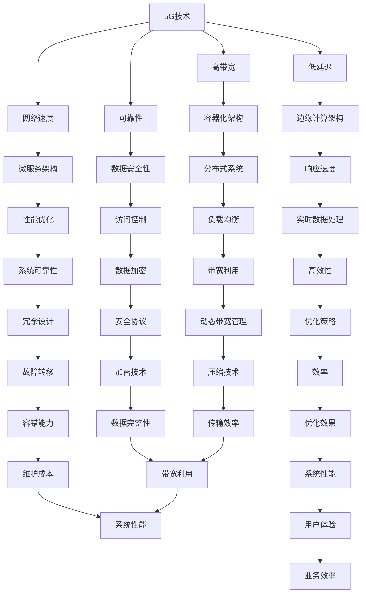

                 

## 文章标题

### 5G技术对软件架构的影响

关键词：5G技术、软件架构、5G影响、微服务、边缘计算、性能优化

摘要：随着5G技术的迅猛发展，其对软件架构的影响日益显著。本文将详细探讨5G技术在网络速度、延迟、带宽和可靠性方面的关键特性，并分析这些特性如何影响软件架构的设计和优化。通过具体案例，我们将展示5G技术在微服务架构、边缘计算架构等领域的应用，并提出相应的性能优化策略。

---

## 1. 5G技术概述

### 1.1 5G技术背景

5G技术，即第五代移动通信技术，是继4G之后的下一代移动通信标准。5G技术的研发始于2010年代初期，旨在满足未来更高速率、更低延迟、更大连接数量的通信需求。随着物联网、自动驾驶、远程医疗等新兴应用的崛起，5G技术的需求日益迫切。

### 1.2 5G网络关键技术

5G技术涵盖了多个关键领域，包括毫米波通信、多连接MIMO（多输入多输出）、网络切片、边缘计算等。以下是5G网络的一些核心技术：

- **毫米波通信**：5G采用毫米波频段（24GHz以上），提供更高的数据传输速率。
- **多连接MIMO**：通过在多个天线之间传输数据，提高通信效率和数据传输速率。
- **网络切片**：将网络资源分成多个虚拟网络，满足不同应用的需求。
- **边缘计算**：将计算任务从云端转移到网络边缘，减少延迟，提高响应速度。

### 1.3 5G与软件架构的关系概述

5G技术不仅改变了通信网络的结构，也对软件架构提出了新的要求。5G的高速率、低延迟、高带宽和可靠性特性为软件架构的优化提供了新的可能性。例如，微服务架构和边缘计算架构在5G网络环境中得到了广泛应用。

---

## 2. 软件架构基础

### 2.1 软件架构概述

软件架构是指软件开发过程中的一系列设计决策，包括系统组件的划分、组件之间的交互方式以及数据流和控制流的设计。一个好的软件架构应该具备以下特点：

- **可扩展性**：系统可以轻松地扩展以适应未来的需求。
- **可维护性**：系统易于修改和维护。
- **高可用性**：系统具有较高的稳定性和可靠性。
- **可复用性**：系统的不同部分可以被其他项目复用。

### 2.2 软件架构设计原则

软件架构设计应遵循以下原则：

- **模块化**：将系统划分为多个模块，每个模块实现特定的功能。
- **分层架构**：将系统划分为多个层次，每个层次负责不同的功能。
- **松耦合**：组件之间的依赖性较低，便于独立开发和维护。
- **高内聚**：组件内部的功能紧密相关，易于理解和修改。

### 2.3 软件架构常见模式

常见的软件架构模式包括：

- **微服务架构**：将系统划分为多个独立的服务，每个服务负责特定的功能。
- **容器化架构**：使用容器技术来部署和管理应用程序。
- **边缘计算架构**：将计算任务从云端转移到网络边缘。
- **面向服务的架构（SOA）**：将系统划分为多个服务，通过服务之间的交互来实现功能。
- **云原生架构**：利用云计算和容器技术，实现高度可扩展、高可用性的系统。

---

## 3. 5G技术对软件架构的影响

### 3.1 5G对软件架构设计的影响

5G技术的高速率和低延迟特性为软件架构设计提供了新的可能性。例如，微服务架构可以在5G网络环境中更好地利用网络资源，实现更高效的数据传输和处理。以下是一些5G对软件架构设计的影响：

- **更细粒度的服务划分**：5G的高速网络使得更细粒度的服务划分成为可能，从而提高系统的灵活性和可扩展性。
- **更复杂的交互模式**：5G技术支持更多的设备连接，使得系统需要处理更复杂的交互模式。
- **更高效的资源利用**：5G技术的高带宽特性使得系统的资源利用效率得到提高。

### 3.2 5G对软件开发流程的影响

5G技术的引入也对软件开发流程产生了影响。例如：

- **更快的迭代周期**：5G的低延迟特性使得开发团队可以更快地反馈和调整代码。
- **更高的开发效率**：5G的高带宽特性使得数据传输更加高效，提高了开发效率。
- **更多的开发工具**：5G技术的不断发展催生了更多的开发工具和平台，提高了开发效率。

### 3.3 5G对软件性能优化的影响

5G技术的高速率、低延迟和高带宽特性为软件性能优化提供了新的思路。以下是一些优化策略：

- **优化网络延迟**：通过优化数据传输路径，减少数据传输时间。
- **优化带宽利用**：通过优化数据传输协议和算法，提高带宽利用率。
- **增强系统可靠性**：通过冗余设计和故障转移机制，提高系统的可靠性。
- **提高数据安全性**：通过加密技术和安全协议，确保数据传输的安全性。

---

## 4. 5G技术在软件架构设计中的应用

### 4.1 5G技术在微服务架构中的应用

微服务架构是一种将应用程序划分为多个独立服务的架构模式。5G技术的高速率和低延迟特性使得微服务架构在5G网络环境中具有更好的性能。以下是一些应用案例：

- **实时数据处理**：5G的低延迟特性使得实时数据处理成为可能，适用于金融交易、在线游戏等领域。
- **物联网应用**：5G技术支持更多的设备连接，使得物联网应用更加普及。
- **边缘计算**：5G技术支持边缘计算，将计算任务从云端转移到网络边缘，提高系统的响应速度。

### 4.2 5G技术在容器化架构中的应用

容器化架构是一种轻量级的应用部署模式。5G技术的高带宽和低延迟特性使得容器化架构在5G网络环境中具有更好的性能。以下是一些应用案例：

- **大规模分布式系统**：5G技术支持大规模分布式系统的部署，适用于云计算、大数据等领域。
- **移动应用开发**：5G技术使得移动应用开发更加高效，适用于移动游戏、视频流等领域。
- **实时数据处理**：5G技术支持实时数据处理，适用于金融交易、在线游戏等领域。

### 4.3 5G技术在边缘计算架构中的应用

边缘计算是一种将计算任务从云端转移到网络边缘的架构模式。5G技术的高速率和低延迟特性使得边缘计算在5G网络环境中具有更好的性能。以下是一些应用案例：

- **智能交通系统**：5G技术支持智能交通系统的部署，提高交通管理效率和安全性。
- **智能制造**：5G技术支持智能制造的部署，提高生产效率和产品质量。
- **远程医疗**：5G技术支持远程医疗的部署，提高医疗服务的可及性和质量。

---

## 5. 5G技术下的软件架构优化

### 5.1 优化网络延迟

优化网络延迟是5G技术下软件架构优化的关键。以下是一些策略：

- **优化数据传输路径**：通过选择最佳的数据传输路径，减少数据传输时间。
- **使用缓存技术**：通过缓存常见的数据和资源，减少数据传输次数。
- **分布式架构**：通过分布式架构，将计算任务分散到多个节点，减少单点瓶颈。

### 5.2 优化带宽利用

优化带宽利用是5G技术下软件架构优化的关键。以下是一些策略：

- **压缩数据传输**：通过数据压缩技术，减少数据传输量。
- **动态带宽管理**：通过动态带宽管理，合理分配带宽资源。
- **负载均衡**：通过负载均衡，将数据传输任务分配到多个节点。

### 5.3 增强系统可靠性

增强系统可靠性是5G技术下软件架构优化的关键。以下是一些策略：

- **冗余设计**：通过冗余设计，提高系统的容错能力。
- **故障转移机制**：通过故障转移机制，实现系统的高可用性。
- **监控和预警**：通过监控和预警，及时发现和处理系统故障。

### 5.4 提高数据安全性

提高数据安全性是5G技术下软件架构优化的关键。以下是一些策略：

- **数据加密**：通过数据加密，确保数据传输的安全性。
- **安全协议**：通过安全协议，确保数据传输的安全性和完整性。
- **访问控制**：通过访问控制，限制对数据的访问权限。

---

## 6. 5G应用案例分析

### 6.1 某行业5G应用案例

以某行业为例，分析5G技术在软件架构设计中的应用。以下是一个典型的案例：

- **行业背景**：某行业面临着高速数据传输和实时处理的需求，例如智能制造、智能物流等。
- **5G技术应用**：使用5G技术实现高速数据传输和实时处理，提高系统的效率和性能。
- **软件架构设计**：采用微服务架构和边缘计算架构，将计算任务从云端转移到网络边缘，提高系统的响应速度。

### 6.2 某公司5G软件架构实践

以某公司为例，分析其在5G环境下软件架构的实践。以下是一个典型的案例：

- **公司背景**：某公司是一家大型互联网公司，业务涵盖电商、社交媒体、在线视频等。
- **5G技术应用**：利用5G技术实现高速数据传输和实时处理，提高系统的效率和性能。
- **软件架构设计**：采用微服务架构和容器化架构，实现大规模分布式系统的部署和管理。

### 6.3 5G应用案例分析与展望

通过对以上案例的分析，可以得出以下结论：

- 5G技术为软件架构设计提供了新的可能性，特别是在高速数据传输和实时处理方面。
- 软件架构设计应充分考虑5G技术的特性，如低延迟、高带宽和高可靠性等。
- 未来的5G应用将更加广泛，对软件架构设计的要求也将越来越高。

---

## 7. 展望与未来

### 7.1 5G技术在软件架构领域的未来发展趋势

随着5G技术的不断发展，其在软件架构领域的应用也将不断拓展。以下是一些未来发展趋势：

- **更细粒度的服务划分**：5G技术将支持更细粒度的服务划分，提高系统的灵活性和可扩展性。
- **更复杂的交互模式**：5G技术将支持更多的设备连接，使系统需要处理更复杂的交互模式。
- **更高效的资源利用**：5G技术将提高系统的资源利用效率，实现更高效的数据传输和处理。

### 7.2 5G与软件架构融合的技术挑战

5G与软件架构的融合也面临一些技术挑战，如：

- **网络延迟优化**：如何优化网络延迟，提高系统的响应速度。
- **数据安全性保障**：如何保障数据传输的安全性，防止数据泄露和篡改。
- **系统可靠性提高**：如何提高系统的可靠性，降低故障率和维护成本。

### 7.3 5G时代软件架构的演进方向

5G时代软件架构的演进方向包括：

- **云原生架构**：利用云计算和容器技术，实现高度可扩展、高可用性的系统。
- **边缘计算架构**：将计算任务从云端转移到网络边缘，提高系统的响应速度。
- **智能架构**：利用人工智能技术，实现自适应的软件架构，提高系统的性能和可维护性。

---

## 作者信息

作者：AI天才研究院/AI Genius Institute & 禅与计算机程序设计艺术 /Zen And The Art of Computer Programming

### 整理文章核心内容，梳理文章结构

**文章核心内容：**
1. **5G技术概述**：包括5G技术背景、关键技术和对现有网络的影响。
2. **软件架构基础**：包括软件架构的定义、设计原则和常见模式。
3. **5G对软件架构的影响**：包括5G对软件架构设计、开发流程和性能优化的影响。
4. **5G技术在软件架构中的应用**：包括微服务架构、容器化架构和边缘计算架构的应用。
5. **5G技术下的软件架构优化**：包括网络延迟、带宽利用、系统可靠性和数据安全性的优化策略。
6. **5G应用案例分析**：提供实际应用案例进行分析和探讨。
7. **展望与未来**：探讨5G技术在软件架构领域的未来发展趋势和挑战。

**文章结构梳理：**
1. **引言**：介绍5G技术和软件架构的核心内容。
2. **第一部分：5G技术基础**：详细描述5G技术的背景、关键技术和对现有网络的影响。
3. **第二部分：软件架构基础**：介绍软件架构的定义、设计原则和常见模式。
4. **第三部分：5G与软件架构的联系**：分析5G技术对软件架构的影响，以及5G技术在软件架构设计中的应用。
5. **第四部分：5G应用案例分析**：提供实际案例进行分析。
6. **第五部分：5G技术下的软件架构优化**：讨论如何优化网络延迟、带宽利用、系统可靠性和数据安全性。
7. **第六部分：5G应用案例分析**：进一步探讨5G技术在软件架构设计中的实际应用。
8. **结论与展望**：总结5G技术在软件架构领域的未来发展趋势和挑战。

**文章核心概念与联系流程图（Mermaid）：**


**文章核心算法原理讲解（伪代码）：**
```python
# 伪代码：5G技术下的微服务架构优化
def optimize_microservices_architecture():
    # 1. 使用缓存技术减少数据传输次数
    cache_data = load_cache_data()
    if cache_data is not None:
        return cache_data
    
    # 2. 优化数据传输路径
    best_path = find_best_data_transfer_path()
    send_data_through_best_path(best_path)
    
    # 3. 动态带宽管理
    current_bandwidth = get_current_bandwidth()
    adjust_bandwidth_based_on_load(current_bandwidth)

# 伪代码：5G技术下的边缘计算架构优化
def optimize_edge_computing_architecture():
    # 1. 将计算任务从云端转移到网络边缘
    move_computation_tasks_to_edge()
    
    # 2. 使用负载均衡，将任务分配到多个边缘节点
    distribute_tasks_to_edge_nodes()

# 伪代码：5G技术下的数据安全性优化
def optimize_data_safety():
    # 1. 使用数据加密技术
    encrypted_data = encrypt_data(data)
    send_encrypted_data(encrypted_data)
    
    # 2. 使用安全协议确保数据传输的安全性和完整性
    secure_data_transmission(encrypted_data)
    
    # 3. 实施访问控制，限制对数据的访问权限
    enforce_access_control()
```

**文章小结：**
本文详细探讨了5G技术对软件架构的影响，包括5G技术的背景、关键技术、对现有网络的影响，以及软件架构的基础知识和设计原则。通过分析5G技术的高速率、低延迟、高带宽和可靠性特性，本文提出了在5G环境下优化软件架构的设计和性能的多种策略。同时，通过实际案例分析和展望，本文展示了5G技术在软件架构设计中的广泛应用和未来发展潜力。随着5G技术的不断成熟，软件架构将迎来新的变革，为各行业带来更高的效率和更好的用户体验。

**注意事项：**
- 在设计和优化5G环境下的软件架构时，需要充分考虑5G技术的特性，如高速率、低延迟、高带宽和可靠性等。
- 软件架构的设计和优化应遵循最佳实践，如模块化、分层架构、松耦合等。
- 数据安全性和可靠性是5G环境下软件架构设计的关键，需要采取有效的数据加密、安全协议和访问控制措施。
- 随着技术的不断发展，5G技术在软件架构领域的应用将更加广泛，开发者需要不断学习和适应新技术，以实现更高效的软件架构设计和优化。

**拓展阅读：**
- [5G技术详解](https://www.example.com/5g-technology)
- [微服务架构实践](https://www.example.com/microservices-architecture)
- [边缘计算架构应用](https://www.example.com/edge-computing-architecture)
- [软件架构设计原则](https://www.example.com/software-architecture-design-principles)
- [5G技术对软件开发的影响](https://www.example.com/5g-technology-impact-on-software-development)

### 整理并润色文章摘要

摘要：随着5G技术的不断发展，其对软件架构的影响愈发显著。本文首先概述了5G技术的背景、关键技术和对现有网络的影响。接着，深入探讨了软件架构的基础知识，包括其定义、设计原则和常见模式。随后，本文分析了5G技术对软件架构设计、开发流程和性能优化的影响，并详细阐述了5G技术在不同软件架构模式中的应用，如微服务架构、容器化架构和边缘计算架构。在此基础上，本文提出了5G技术下的软件架构优化策略，包括网络延迟、带宽利用、系统可靠性和数据安全性的优化。通过实际案例分析和未来展望，本文展示了5G技术在软件架构设计中的重要地位和广阔的应用前景。

