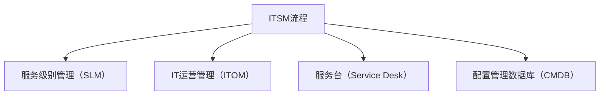
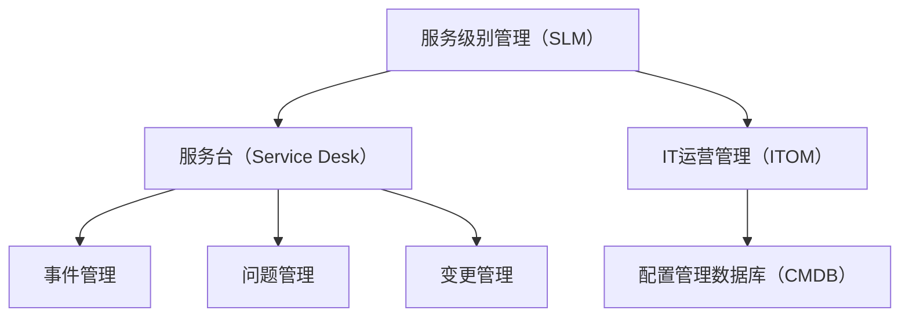

                 


### 1. 设计书籍的整体结构

设计书籍的整体结构是确保内容组织有序、逻辑连贯的重要步骤。首先，我们需要明确书籍的总体目标，这包括书籍的核心内容、预期读者以及他们希望通过阅读本书获得的知识和技能。

**确定书籍的总体目标：**

- **核心内容：** 本书将覆盖IT服务管理（ITSM）的基本概念、流程设计、工具选择以及实际应用案例。核心内容包括ITSM的定义、核心原则、关键流程以及如何选择和部署ITSM工具。
- **预期读者：** 本书的预期读者是IT从业人员，包括IT经理、IT运维人员、IT支持人员以及IT项目管理专员等。他们希望通过本书了解ITSM的基本理论和实践方法，提升自身的工作能力和组织的服务水平。
- **预期收益：** 通过阅读本书，读者将能够理解ITSM的基本概念和核心流程，掌握如何设计和优化ITSM流程，了解主流ITSM工具的功能和特点，并具备在实战中应用ITSM的能力。

**内容划分：**

为了达到上述目标，我们将书籍内容划分为四个主要部分：

1. **核心概念与联系：** 包括ITSM概述、核心概念解析以及ITSM核心流程图，帮助读者建立全面的理论基础。
2. **流程设计：** 详细讲解ITSM流程设计原则和关键流程，通过伪代码展示流程的具体实现。
3. **工具选择：** 介绍ITSM工具的分类和选择标准，列举主流ITSM工具，并提供选择建议。
4. **实战案例：** 通过实际案例展示ITSM的实践应用，帮助读者理解理论知识在实际工作中的应用。

### 2. 设计核心概念与联系部分

**第1章 ITSM概述**

**1.1 ITSM的定义与历史背景**

- **定义：** ITSM是一种通过系统化方法和实践来设计、实施、操作、监控和维护信息技术的服务管理框架，旨在确保信息技术服务能够满足组织的业务需求和目标。
- **历史背景：** ITSM起源于20世纪80年代的英国，当时英国国家健康服务（NHS）引入了IT服务管理的概念。随着ITIL（IT基础设施图书馆）的发布，ITSM逐渐成为全球IT行业的标准。

**1.2 ITSM的核心原则**

- **服务导向：** ITSM以服务为导向，关注如何通过服务满足业务需求。
- **流程驱动：** ITSM强调流程的重要性，通过流程的标准化和优化来提高服务质量。
- **持续改进：** ITSM注重持续改进，通过不断的评估和优化来提高服务管理水平。

**1.3 ITSM与ITIL的关系**

- **ITSM与ITIL的关系：** ITIL是ITSM的一个参考框架，提供了ITSM的最佳实践和方法。ITSM可以看作是ITIL在具体组织中的应用和实施。

**第2章 ITSM关键概念**

**2.1 服务级别管理（SLM）**

- **定义：** SLM是ITSM的一个关键组成部分，涉及确定、定义、谈判、同意、监控、报告和管理服务级别。
- **核心概念：** SLM的核心概念包括服务级别协议（SLA）、关键绩效指标（KPI）和服务报告。

**2.2 IT运营管理（ITOM）**

- **定义：** ITOM关注IT基础设施和服务的运营，包括监控、故障排除、性能优化等。
- **核心概念：** ITOM的核心概念包括事件管理、问题管理、变更管理和配置管理。

**2.3 服务台（Service Desk）**

- **定义：** 服务台是ITSM的一个核心组件，负责接收、记录、分类和分配用户请求和问题。
- **核心概念：** 服务台的核心概念包括请求管理、问题管理、事件管理和知识管理。

**2.4 配置管理数据库（CMDB）**

- **定义：** CMDB是一个存储IT资产和配置信息的数据库，用于支持ITSM流程。
- **核心概念：** CMDB的核心概念包括配置项（CI）、关系和变更管理。

**Mermaid流程图：ITSM核心流程图**

以下是一个简化的ITSM核心流程图的Mermaid表示：



### 3. 设计流程设计部分

**第3章 ITSM流程设计原则**

**3.1 流程设计方法论**

- **原则：** 流程设计应遵循以服务为导向、客户为中心的原则，确保流程能够满足业务需求和用户期望。
- **步骤：** 流程设计包括需求分析、流程建模、流程优化和流程实施。

**3.2 流程优化与改进**

- **方法：** 通过监控、分析和服务反馈来识别流程中的瓶颈和问题，并进行优化。
- **工具：** 可以使用流程优化工具（如流程分析软件）来支持流程改进。

**3.3 流程标准化与规范化**

- **标准：** 制定流程标准和操作手册，确保流程的一致性和可重复性。
- **规范：** 通过培训和文档来确保流程规范得到有效执行。

**第4章 ITSM关键流程**

**4.1 服务请求管理**

- **定义：** 服务请求管理是指处理用户请求和需求的流程。
- **流程：**
  ```mermaid
  graph TB
  A[用户请求] --> B[请求记录]
  B --> C[请求分类]
  C --> D[请求分配]
  D --> E[请求处理]
  E --> F[请求反馈]
  ```

**4.2 问题管理**

- **定义：** 问题管理是指识别、记录、分类、分配和解决IT服务中的问题。
- **流程：**
  ```mermaid
  graph TB
  A[问题识别] --> B[问题记录]
  B --> C[问题分类]
  C --> D[问题分配]
  D --> E[问题解决]
  E --> F[问题验证]
  ```

**4.3 变更管理**

- **定义：** 变更管理是指对IT服务中的变更进行控制、记录和跟踪的流程。
- **流程：**
  ```mermaid
  graph TB
  A[变更请求] --> B[变更评估]
  B --> C[变更审批]
  C --> D[变更实施]
  D --> E[变更验证]
  ```

**4.4 配置管理**

- **定义：** 配置管理是指识别、记录和管理IT服务中的配置项的流程。
- **流程：**
  ```mermaid
  graph TB
  A[配置项识别] --> B[配置项记录]
  B --> C[配置项变更]
  C --> D[配置项验证]
  ```

**4.5 服务报告管理**

- **定义：** 服务报告管理是指生成、分发和报告服务绩效和质量的流程。
- **流程：**
  ```mermaid
  graph TB
  A[服务数据收集] --> B[数据整理]
  B --> C[报告生成]
  C --> D[报告分发]
  ```

**伪代码：服务请求管理流程设计伪代码**

以下是一个服务请求管理流程设计的伪代码示例：

```python
# 伪代码：服务请求管理流程设计
def service_request_management(request):
    if request.type == "Incident":
        handle_incident(request)
    elif request.type == "Service Request":
        handle_service_request(request)
    else:
        raise ValueError("Invalid request type")

def handle_incident(request):
    # 处理事件
    log_incident(request)
    classify_incident(request)
    assign_incident(request)
    resolve_incident(request)
    provide_feedback(request)

def handle_service_request(request):
    # 处理服务请求
    log_service_request(request)
    classify_service_request(request)
    assign_service_request(request)
    fulfill_service_request(request)
    provide_feedback(request)
```

### 4. 设计工具选择部分

**第5章 ITSM工具概述**

**5.1 ITSM工具的分类**

- **服务台工具：** 用于处理用户请求和问题的工具，如ServiceNow、BMC Remedy等。
- **事件管理工具：** 用于监控和响应IT服务事件的管理工具，如Microsoft System Center等。
- **配置管理数据库（CMDB）工具：** 用于存储和管理IT资产和配置项的工具，如ServiceNow CMDB等。
- **流程自动化工具：** 用于自动化IT服务流程的工具，如ServiceNow Automation等。
- **报告和数据分析工具：** 用于生成和分析服务绩效和质量的报告工具，如ServiceNow Reporting等。

**5.2 ITSM工具的选择标准**

- **功能匹配：** 工具的功能应与组织的ITSM需求相匹配。
- **易用性：** 工具应易于使用和操作，降低培训成本。
- **可扩展性：** 工具应支持未来的扩展和升级，以适应业务增长。
- **集成能力：** 工具应能够与现有的IT系统和应用程序集成。
- **性能和稳定性：** 工具应具有高性能和高稳定性，确保服务的持续运行。

**第6章 主流ITSM工具介绍**

**6.1 ServiceNow**

- **功能：** ServiceNow是一款综合性的ITSM工具，提供服务台、事件管理、问题管理、变更管理、配置管理数据库（CMDB）等功能。
- **特点：** 具有强大的自动化和集成能力，支持自定义流程和工作流。
- **适用场景：** 适用于各种规模的企业，特别是需要高度自动化和集成的大型企业。

**6.2 BMC Remedy**

- **功能：** BMC Remedy是一款功能强大的ITSM工具，提供服务台、事件管理、问题管理、变更管理、配置管理数据库（CMDB）等功能。
- **特点：** 支持多种平台和操作系统，具有高度的可定制性和可扩展性。
- **适用场景：** 适用于需要高定制化和稳定性的企业。

**6.3 Microsoft System Center**

- **功能：** Microsoft System Center是一款集成的IT管理解决方案，提供事件管理、问题管理、变更管理、配置管理数据库（CMDB）等功能。
- **特点：** 与Microsoft的产品和平台深度集成，易于部署和管理。
- **适用场景：** 适用于使用Microsoft技术堆栈的企业。

**6.4 其他常用ITSM工具**

- **HCL Service Manager：** 提供服务台、事件管理、问题管理、变更管理等功能，适用于需要高可定制性和可扩展性的企业。
- **IBM Maximo：** 提供全面的ITSM功能，包括资产跟踪、合同管理、服务请求管理等，适用于制造业和大型企业。
- **SolarWinds Service Desk：** 提供简单易用的服务台、事件管理、问题管理等功能，适用于中小企业。

### 5. 设计实战案例部分

**第7章 ITSM实施案例**

**7.1 案例一：某企业ITSM流程设计实践**

**背景介绍：**

某大型制造企业为了提升IT服务质量，决定引入ITSM流程。该企业在IT服务管理方面存在以下问题：

- 缺乏统一的IT服务流程和标准
- IT服务响应速度慢，服务质量不稳定
- IT资源管理混乱，缺乏有效的资产跟踪和管理

**解决方案：**

- **流程设计：** 结合企业的业务需求和ITIL标准，设计了一套完整的ITSM流程，包括服务级别管理（SLM）、IT运营管理（ITOM）、服务台（Service Desk）和配置管理数据库（CMDB）等。
- **工具选择：** 选择了一款功能强大、易用性高的ITSM工具，如ServiceNow，进行流程的实施和自动化。

**实施步骤：**

1. **需求分析和规划：** 与企业相关部门进行沟通，了解业务需求和IT服务现状，确定ITSM流程设计和工具选择的具体要求。
2. **流程设计：** 结合业务需求和ITIL标准，设计一套完整的ITSM流程，并进行详细说明和文档化。
3. **工具配置：** 根据流程设计，配置ITSM工具，包括服务台、事件管理、问题管理、变更管理等功能。
4. **测试和验证：** 在实际环境中进行测试，确保流程和工具的稳定性和性能。
5. **培训和部署：** 对相关人员进行培训和指导，确保他们能够熟练使用ITSM工具和流程。
6. **监控和优化：** 在实施后，对ITSM流程和工具进行持续监控和优化，确保其稳定运行和持续改进。

**效果评估：**

- **服务质量提升：** 通过实施ITSM流程和工具，企业的IT服务质量得到了显著提升，服务响应速度加快，服务质量稳定。
- **资源管理优化：** IT资源管理得到优化，资产跟踪和管理更加规范和高效。
- **业务支持加强：** IT部门更好地支持企业的业务需求，提高了整体业务效率。

**7.2 案例二：ITSM工具在中小企业的应用**

**背景介绍：**

某中型IT服务提供商为了提升服务水平和客户满意度，决定引入ITSM工具。该企业在服务管理方面存在以下问题：

- 缺乏统一的服务流程和标准
- 服务响应速度慢，服务质量不稳定
- 客户反馈机制不完善

**解决方案：**

- **工具选择：** 选择了一款简单易用、成本较低的ITSM工具，如SolarWinds Service Desk，进行流程的实施和自动化。

**实施步骤：**

1. **需求分析和规划：** 与企业相关部门进行沟通，了解业务需求和IT服务现状，确定ITSM流程设计和工具选择的具体要求。
2. **流程设计：** 结合业务需求和ITIL标准，设计一套简单的ITSM流程，包括服务台、事件管理、问题管理等。
3. **工具配置：** 根据流程设计，配置ITSM工具，确保其功能满足企业的需求。
4. **测试和验证：** 在实际环境中进行测试，确保流程和工具的稳定性和性能。
5. **培训和部署：** 对相关人员进行培训和指导，确保他们能够熟练使用ITSM工具和流程。
6. **监控和优化：** 在实施后，对ITSM流程和工具进行持续监控和优化，确保其稳定运行和持续改进。

**效果评估：**

- **服务质量提升：** 通过实施ITSM流程和工具，企业的IT服务质量得到了显著提升，服务响应速度加快，服务质量稳定。
- **客户满意度提高：** 客户反馈机制得到完善，客户满意度显著提高。
- **运营效率提升：** IT运营效率得到提升，工作流程更加规范和高效。

**7.3 案例三：ITSM流程与云计算的结合**

**背景介绍：**

某大型互联网公司为了提升IT服务质量和响应速度，决定将ITSM流程与云计算结合。该企业在云计算方面存在以下问题：

- 云服务管理流程不规范
- 云资源利用率低
- 云服务安全问题突出

**解决方案：**

- **流程设计：** 结合云计算的特点和ITSM标准，设计一套适用于云计算环境的ITSM流程，包括服务级别管理（SLM）、云资源管理、云安全管理等。
- **工具选择：** 选择一款支持云计算的ITSM工具，如ServiceNow Cloud Management，进行流程的实施和自动化。

**实施步骤：**

1. **需求分析和规划：** 与企业相关部门进行沟通，了解业务需求和IT服务现状，确定ITSM流程设计和工具选择的具体要求。
2. **流程设计：** 结合云计算的特点和ITIL标准，设计一套完整的ITSM流程，包括服务级别管理（SLM）、云资源管理、云安全管理等。
3. **工具配置：** 根据流程设计，配置ITSM工具，确保其功能满足企业的需求，并支持云计算环境。
4. **测试和验证：** 在实际环境中进行测试，确保流程和工具的稳定性和性能。
5. **培训和部署：** 对相关人员进行培训和指导，确保他们能够熟练使用ITSM工具和流程。
6. **监控和优化：** 在实施后，对ITSM流程和工具进行持续监控和优化，确保其稳定运行和持续改进。

**效果评估：**

- **服务质量提升：** 通过实施ITSM流程和工具，企业的IT服务质量得到了显著提升，云服务响应速度加快，服务质量稳定。
- **云资源利用率提高：** 云资源利用率得到优化，资源配置更加合理和高效。
- **云安全加强：** 通过ITSM流程和工具的支持，云安全得到加强，安全问题和风险得到有效控制。

### 6. 设计总结部分

**第8章 ITSM实践总结与展望**

**8.1 ITSM实践中的常见问题及解决方案**

- **问题一：** 流程设计不合理，无法满足业务需求。
  - **解决方案：** 通过需求分析和流程优化，确保流程设计符合业务需求。
- **问题二：** 工具选择不当，导致流程难以实施。
  - **解决方案：** 根据业务需求和工具特点，选择合适的ITSM工具。
- **问题三：** 员工培训不足，影响流程执行效果。
  - **解决方案：** 加强员工培训，确保他们熟练掌握ITSM流程和工具。

**8.2 ITSM未来发展趋势与挑战**

- **趋势一：** ITSM与云计算、大数据、人工智能等技术的深度融合。
- **趋势二：** ITSM工具的智能化和自动化水平不断提高。
- **挑战一：** 数据安全和隐私保护。
- **挑战二：** 业务变革和ITSM的适应能力。

**8.3 作者寄语**

在ITSM实践中，我们不仅需要关注技术和流程，还要关注人的因素。只有通过不断的学习和实践，才能不断提升IT服务质量，为企业的业务发展提供有力支持。

# 目录大纲设计完成，以下为最终输出：

## 《ITSM流程设计与工具选择》目录大纲

### 第一部分：核心概念与联系

#### 第1章 ITSM概述
1.1 ITSM的定义与历史背景
1.2 ITSM的核心原则
1.3 ITSM与ITIL的关系

#### 第2章 ITSM关键概念
2.1 服务级别管理（SLM）
2.2 IT运营管理（ITOM）
2.3 服务台（Service Desk）
2.4 配置管理数据库（CMDB）

#### 第3章 ITSM核心流程图

### 第二部分：流程设计

#### 第4章 ITSM流程设计原则
4.1 流程设计方法论
4.2 流程优化与改进
4.3 流程标准化与规范化

#### 第5章 ITSM关键流程
5.1 服务请求管理
5.2 问题管理
5.3 变更管理
5.4 配置管理
5.5 服务报告管理

#### 第6章 服务请求管理流程设计伪代码

### 第三部分：工具选择

#### 第7章 ITSM工具概述
7.1 ITSM工具的分类
7.2 ITSM工具的选择标准

#### 第8章 主流ITSM工具介绍
8.1 ServiceNow
8.2 BMC Remedy
8.3 Microsoft System Center
8.4 其他常用ITSM工具

### 第四部分：实战案例

#### 第9章 ITSM实施案例
9.1 案例一：某企业ITSM流程设计实践
9.2 案例二：ITSM工具在中小企业的应用
9.3 案例三：ITSM流程与云计算的结合

### 第五部分：总结与展望

#### 第10章 ITSM实践总结与展望
10.1 ITSM实践中的常见问题及解决方案
10.2 ITSM未来发展趋势与挑战
10.3 作者寄语

## 完整的文章摘要

本文详细探讨了IT服务管理（ITSM）的流程设计与工具选择。首先，文章介绍了ITSM的基本概念、核心原则以及与ITIL的关系，帮助读者建立理论基础。接着，文章详细讲解了ITSM的流程设计原则和关键流程，并通过伪代码展示了服务请求管理流程的具体实现。随后，文章介绍了ITSM工具的分类和选择标准，列举了主流ITSM工具，并分析了其实际应用。最后，文章通过三个实战案例，展示了ITSM在不同企业环境中的应用效果。全文旨在为读者提供全面的ITSM实践指导，帮助提升IT服务管理水平。

## 文章关键词

ITSM，流程设计，工具选择，服务请求管理，变更管理，配置管理，云计算，服务台，事件管理，问题管理，SLM，ITIL，BMC Remedy，ServiceNow，Microsoft System Center

## 引言

在当今数字化时代，IT服务管理（ITSM）已成为企业管理信息技术服务的重要手段。有效的ITSM流程不仅能够提高服务质量，还能降低运营成本，提升企业竞争力。然而，如何设计合理的ITSM流程并选择合适的工具，成为许多企业在实施ITSM过程中面临的挑战。本文旨在通过详细分析和实际案例，为读者提供一套完整的ITSM流程设计与工具选择指南。

本文首先介绍了ITSM的基本概念、核心原则和与ITIL的关系，帮助读者建立理论基础。接着，文章详细讲解了ITSM的流程设计原则和关键流程，并通过伪代码展示了具体实现。随后，文章介绍了ITSM工具的分类和选择标准，列举了主流ITSM工具，并分析了其实际应用。最后，文章通过三个实战案例，展示了ITSM在不同企业环境中的应用效果。全文旨在为读者提供全面的ITSM实践指导，帮助提升IT服务管理水平。

### 第一部分：核心概念与联系

#### 第1章 ITSM概述

**1.1 ITSM的定义与历史背景**

IT服务管理（ITSM）是一种通过系统化方法和实践来设计、实施、操作、监控和维护信息技术的服务管理框架。它旨在确保信息技术服务能够满足组织的业务需求和目标。ITSM的概念起源于20世纪80年代的英国，当时英国国家健康服务（NHS）引入了IT服务管理的概念。随着信息技术服务管理实践的不断发展和完善，ITSM逐渐成为全球IT行业的标准。

在ITSM的发展历程中，ITIL（IT基础设施图书馆）扮演了重要角色。ITIL是由英国政府支持的IT服务管理标准，它提供了ITSM的最佳实践和方法。ITIL分为五个核心部分：服务策略、服务设计、服务过渡、服务运营和持续服务改进。这些部分共同构成了ITSM的完整框架。

**1.2 ITSM的核心原则**

ITSM的核心原则包括：

- **服务导向：** ITSM以服务为导向，关注如何通过服务满足业务需求。这意味着IT服务的设计、实施、运营和改进都应以业务需求为中心。
- **流程驱动：** ITSM强调流程的重要性，通过流程的标准化和优化来提高服务质量。流程驱动使得IT服务管理更加系统化、规范化和可重复。
- **持续改进：** ITSM注重持续改进，通过不断的评估和优化来提高服务管理水平。持续改进是ITSM的核心原则之一，它要求组织定期评估和优化服务流程，以实现服务质量的持续提升。

**1.3 ITSM与ITIL的关系**

ITSM与ITIL是密不可分的。ITIL是ITSM的一个参考框架，提供了ITSM的最佳实践和方法。ITSM可以看作是ITIL在具体组织中的应用和实施。虽然ITIL提供了ITSM的核心原则和实践方法，但每个组织在实施ITSM时都需要根据自身的业务需求和IT环境进行调整和优化。

**总结**

通过本章的介绍，读者可以了解到ITSM的定义、核心原则以及与ITIL的关系。这些基础知识将为后续的ITSM流程设计和工具选择提供理论基础。

#### 第2章 ITSM关键概念

**2.1 服务级别管理（SLM）**

服务级别管理（Service Level Management，SLM）是ITSM的核心组成部分之一，它涉及确定、定义、谈判、同意、监控、报告和管理服务级别。SLM的目标是通过确保服务提供者和服务消费者之间达成一致的服务级别，从而满足业务需求和用户期望。

**定义：** SLM是ITSM的一个关键组成部分，它涉及以下核心概念：

- **服务级别协议（SLA）：** SLA是服务提供者与服务消费者之间达成的一致协议，明确了服务的质量标准、服务水平、服务范围和服务期限。
- **关键绩效指标（KPI）：** KPI是用于衡量服务绩效的关键指标，例如响应时间、解决时间、满意度等。
- **服务报告：** 服务报告是定期向服务消费者报告服务性能和质量的文档。

**核心概念：** SLM的核心概念包括：

- **服务需求分析：** 通过分析业务需求和用户期望，确定服务的需求和目标。
- **服务级别定义：** 根据服务需求分析，定义服务的级别，包括服务范围、服务质量、服务水平等。
- **服务级别协议谈判：** 服务提供者与服务消费者之间进行谈判，达成一致的服务级别协议。
- **服务级别监控：** 通过监控和测量服务性能，确保服务级别协议得到满足。
- **服务级别报告：** 定期向服务消费者报告服务性能和状态，以提高透明度和责任感。

**2.2 IT运营管理（ITOM）**

IT运营管理（IT Operations Management，ITOM）是ITSM的重要组成部分，它关注IT基础设施和服务的运营，包括监控、故障排除、性能优化等。ITOM的目标是通过有效管理IT基础设施和服务，确保其稳定运行和高效性能。

**定义：** ITOM是IT服务管理的一个子领域，它涉及以下核心概念：

- **事件管理：** 识别、记录、分类、分配和响应IT事件，以确保快速恢复服务。
- **问题管理：** 识别、记录、分类、分配和解决IT问题，以减少事件发生率和影响。
- **变更管理：** 管理IT变更，确保变更的顺利实施，并减少对服务的影响。
- **配置管理：** 管理IT资产和配置项，确保配置信息的准确性和一致性。

**核心概念：** ITOM的核心概念包括：

- **事件监控：** 通过监控工具和指标，识别和记录IT事件。
- **故障排除：** 快速响应和解决IT事件，减少服务中断时间。
- **性能优化：** 分析和优化IT基础设施和服务的性能，确保其满足业务需求。
- **变更控制：** 通过变更管理流程，确保IT变更的顺利实施。
- **配置管理数据库（CMDB）：** 管理和跟踪IT资产和配置项的信息。

**2.3 服务台（Service Desk）**

服务台（Service Desk）是ITSM的一个核心组件，它是用户与IT服务部门之间的主要接口。服务台负责接收、记录、分类、分配和跟踪用户请求和问题。

**定义：** 服务台是一个集中式服务管理平台，它提供以下核心功能：

- **请求管理：** 处理用户请求，包括服务请求、问题报告和访问请求。
- **事件管理：** 识别、记录、分类、分配和响应IT事件。
- **问题管理：** 识别、记录、分类、分配和解决IT问题。
- **变更管理：** 管理IT变更，确保变更的顺利实施。
- **配置管理：** 管理IT资产和配置项的信息。

**核心概念：** 服务台的核心概念包括：

- **用户交互：** 提供友好的用户界面，方便用户提交请求和报告问题。
- **自动化流程：** 通过自动化工具和脚本，简化请求和事件的处理流程。
- **知识管理：** 收集、存储和共享知识，以提高响应速度和解决问题能力。
- **服务报告：** 定期向用户和管理层报告服务性能和状态。

**2.4 配置管理数据库（CMDB）**

配置管理数据库（Configuration Management Database，CMDB）是ITSM的重要组成部分，它用于存储和管理IT资产和配置信息。CMDB提供了IT资产的全貌视图，有助于支持ITSM的其他流程，如变更管理、问题管理和配置管理。

**定义：** CMDB是一个集中式数据库，它存储以下核心信息：

- **IT资产信息：** 包括硬件、软件、网络设备等IT资产的基本信息。
- **配置项（CI）：** CMDB中的最小配置单元，例如一台服务器、一个应用程序或一个网络设备。
- **关系：** 配置项之间的关系，例如服务器与网络设备之间的关系。
- **变更历史：** IT资产的变更记录，包括配置变更和状态变更。

**核心概念：** CMDB的核心概念包括：

- **配置项识别：** 识别和记录IT资产的信息。
- **关系管理：** 管理配置项之间的关系，确保配置信息的准确性。
- **变更管理：** 记录和跟踪IT资产的变更，确保变更的准确性和一致性。
- **配置信息同步：** 确保CMDB中的配置信息与实际IT环境的实时同步。

**总结**

通过本章的介绍，读者可以了解到ITSM的关键概念，包括服务级别管理（SLM）、IT运营管理（ITOM）、服务台（Service Desk）和配置管理数据库（CMDB）。这些概念构成了ITSM的理论基础，为后续的ITSM流程设计和工具选择提供了支持。

#### 第3章 ITSM核心流程图

为了帮助读者更好地理解ITSM的核心流程，我们使用Mermaid图形化工具绘制了一个简化的ITSM核心流程图。该流程图涵盖了ITSM的主要组成部分，包括服务级别管理（SLM）、IT运营管理（ITOM）、服务台（Service Desk）和配置管理数据库（CMDB）。

以下是一个简单的Mermaid表示：



- **服务级别管理（SLM）**：负责确定、定义、谈判、同意、监控、报告和管理服务级别。
- **服务台（Service Desk）**：作为用户与IT服务部门之间的主要接口，负责接收、记录、分类、分配和跟踪用户请求和问题。
- **IT运营管理（ITOM）**：负责监控、故障排除、性能优化和配置管理。
- **配置管理数据库（CMDB）**：存储和管理IT资产和配置信息，提供IT服务管理的基础数据。

通过这个简化的流程图，读者可以清晰地看到ITSM的核心流程及其相互关系。这个流程图有助于读者理解ITSM的整体架构，并为后续的流程设计提供参考。

#### 第4章 ITSM流程设计原则

**4.1 流程设计方法论**

设计ITSM流程需要遵循一定的方法论，以确保流程的有效性和可操作性。以下是一些关键步骤和方法：

1. **需求分析：** 首先，需要明确业务需求和用户需求，这包括服务级别、关键绩效指标（KPI）和用户满意度等。通过访谈、问卷调查和数据分析等方法，收集和整理业务需求。

2. **流程建模：** 基于需求分析的结果，使用流程建模工具（如BPMN、UML等）绘制流程图。流程图应清晰地展示流程的输入、输出、活动、决策点和资源等。

3. **流程优化：** 通过分析流程图，识别潜在的瓶颈和优化点。优化方法包括简化流程、消除冗余步骤、提高自动化程度等。

4. **流程实施：** 将优化后的流程文档化，并制定详细的操作手册。同时，确保相关人员接受培训，以便能够正确执行流程。

5. **测试和验证：** 在实际环境中测试流程，确保其稳定性和性能。通过模拟测试和现场测试，验证流程的可行性和效果。

6. **持续改进：** 流程实施后，需要持续监控和评估流程的性能，收集用户反馈和改进建议。通过不断的优化和改进，提高流程的质量和效率。

**4.2 流程优化与改进**

流程优化与改进是ITSM流程设计的关键步骤，其目标是通过不断的调整和优化，提高流程的效率和效果。以下是一些常见的优化方法：

1. **自动化：** 通过引入自动化工具和脚本，减少手工操作，提高流程的自动化程度。自动化可以降低人为错误，提高响应速度和准确性。

2. **简化流程：** 识别并去除不必要的步骤和流程，简化流程结构。简化流程可以提高工作效率，降低运营成本。

3. **标准化：** 制定统一的流程标准和操作手册，确保流程的一致性和可重复性。标准化有助于提高流程的可维护性和可扩展性。

4. **监控与反馈：** 引入流程监控工具，实时跟踪流程的执行情况。通过收集和分析流程数据，识别问题和优化点。

5. **持续改进：** 通过定期的流程评估和改进，确保流程始终符合业务需求和用户期望。持续改进是一个动态的过程，需要不断调整和优化。

**4.3 流程标准化与规范化**

流程标准化与规范化是确保ITSM流程有效实施的重要手段。以下是一些关键步骤：

1. **制定标准：** 根据业务需求和最佳实践，制定统一的流程标准和操作手册。这些标准应涵盖流程的各个阶段和关键环节。

2. **培训与沟通：** 对流程相关人员进行培训，确保他们了解和遵守流程标准。通过内部沟通和协作，确保流程标准的有效传达和执行。

3. **审计与监督：** 定期对流程进行审计和监督，确保流程标准得到有效执行。审计可以识别流程中的问题和优化点，为持续改进提供依据。

4. **文档化：** 将流程标准、操作手册和审计报告等文档化，确保流程信息的准确性和可追溯性。文档化有助于提高流程的可维护性和可扩展性。

**总结**

通过本章的介绍，读者可以了解到ITSM流程设计的方法论、优化与改进方法以及标准化与规范化的重要性。这些原则和方法有助于设计出高效、稳定和可操作的ITSM流程，从而提高服务质量和管理效率。

#### 第5章 ITSM关键流程

**5.1 服务请求管理**

服务请求管理是ITSM的核心流程之一，它负责处理用户提出的各种请求，包括新服务请求、服务变更请求和用户支持请求。以下是服务请求管理的关键步骤：

1. **请求接收：** 用户通过服务台或自助服务门户提交服务请求。服务台应提供一个友好的用户界面，方便用户提交请求。

2. **请求分类：** 根据请求的类型和优先级，对请求进行分类。常见的分类包括常规请求、紧急请求和高优先级请求。

3. **请求分配：** 根据请求的类型、优先级和资源情况，将请求分配给合适的支持团队或技术人员。

4. **请求处理：** 支持团队或技术人员根据请求的类型和内容，进行相应的处理。处理步骤可能包括配置新服务、安装软件、解决用户问题等。

5. **请求跟踪：** 使用服务台系统或跟踪工具，对请求的执行情况进行监控和跟踪。确保每个请求都能得到及时和有效的处理。

6. **请求确认：** 在请求完成后，向用户确认请求的处理结果，并收集用户反馈。这有助于提高用户的满意度和改进服务。

**5.2 问题管理**

问题管理是ITSM中的另一个关键流程，它负责识别、记录、分类、分配和解决IT服务中的问题。以下是问题管理的关键步骤：

1. **问题识别：** 通过监控系统、用户报告或事件管理流程，识别和记录IT服务中的问题。

2. **问题记录：** 在服务台或问题管理系统中记录问题，确保问题的详细信息得到完整保存。

3. **问题分类：** 根据问题的性质和影响范围，对问题进行分类。常见的分类包括应用问题、网络问题、硬件问题等。

4. **问题分配：** 根据问题的类型和资源情况，将问题分配给合适的支持团队或技术人员。

5. **问题解决：** 支持团队或技术人员根据问题的类型和内容，进行相应的解决。解决步骤可能包括故障排除、配置调整、升级修复等。

6. **问题验证：** 在问题解决后，对解决方案进行验证，确保问题得到彻底解决。同时，记录问题的解决情况和解决方案，以供参考。

7. **问题关闭：** 在问题验证通过后，将问题关闭，并更新服务台的记录。

**5.3 变更管理**

变更管理是ITSM中的关键流程，它负责控制、记录和跟踪IT服务中的变更，以确保变更的顺利进行和服务质量的持续提升。以下是变更管理的关键步骤：

1. **变更请求：** 用户或IT团队提出变更请求，包括对现有服务的修改、新服务的引入等。

2. **变更评估：** 对变更请求进行风险评估和影响分析，确保变更不会对服务造成负面影响。

3. **变更审批：** 根据变更的类型和影响，进行相应的审批流程。审批流程可能包括变更请求、影响评估、风险分析等。

4. **变更实施：** 在获得批准后，按照变更计划实施变更。实施步骤可能包括配置变更、代码升级、硬件替换等。

5. **变更验证：** 在变更实施后，对变更的结果进行验证，确保变更达到预期效果。

6. **变更记录：** 将变更请求、评估结果、实施步骤和验证结果等记录在变更管理系统中，以便跟踪和审计。

**5.4 配置管理**

配置管理是ITSM中的重要流程，它负责识别、记录和管理IT服务中的配置项。以下是配置管理的关键步骤：

1. **配置项识别：** 识别和记录IT服务中的所有配置项，包括硬件、软件、网络设备等。

2. **配置项记录：** 在配置管理数据库（CMDB）中记录配置项的信息，包括配置项的名称、型号、版本、状态等。

3. **配置项变更：** 管理配置项的变更，包括配置项的创建、修改、删除等。

4. **配置项验证：** 在配置项变更后，对配置项的正确性进行验证，确保配置项的信息准确无误。

5. **配置项更新：** 定期更新配置项的信息，以反映实际IT环境的变动。

**5.5 服务报告管理**

服务报告管理是ITSM中的关键流程，它负责生成、分发和报告服务绩效和质量的指标。以下是服务报告管理的关键步骤：

1. **数据收集：** 收集与IT服务绩效和质量相关的数据，包括事件数量、问题解决时间、用户满意度等。

2. **数据处理：** 对收集的数据进行清洗、整理和统计分析，以生成报告所需的指标和图表。

3. **报告生成：** 使用报告生成工具，根据预设的模板和格式，生成服务报告。

4. **报告分发：** 将服务报告分发给相关利益相关者，包括管理层、IT团队和用户等。

5. **报告分析：** 对服务报告进行分析，识别服务中的问题和改进点。

**总结**

通过本章的介绍，读者可以了解ITSM中的关键流程，包括服务请求管理、问题管理、变更管理、配置管理和服务报告管理。这些流程构成了ITSM的核心，确保IT服务能够满足业务需求和用户期望。

#### 第6章 服务请求管理流程设计伪代码

服务请求管理流程设计是ITSM中的一个关键环节。以下是一个简化的Python伪代码示例，用于展示服务请求管理流程的设计思路和具体实现步骤：

```python
# 伪代码：服务请求管理流程设计

class ServiceRequest:
    def __init__(self, request_id, user_id, request_type, description, priority):
        self.request_id = request_id
        self.user_id = user_id
        self.request_type = request_type
        self.description = description
        self.priority = priority
        self.status = "Open"  # 请求状态

def process_service_request(request):
    """
    处理服务请求的流程
    """
    print(f"处理请求ID: {request.request_id}")

    # 步骤1：请求分类
    category = classify_request(request)

    # 步骤2：请求分配
    assignee = assign_request_to_assignee(category)

    # 步骤3：请求处理
    if request.status == "Open":
        handle_request(request, assignee)
    else:
        print(f"请求已处理，请求ID: {request.request_id}")

def classify_request(request):
    """
    根据请求类型进行分类
    """
    if request.request_type == "Incident":
        return "事件"
    elif request.request_type == "Service Request":
        return "服务请求"
    else:
        return "未知请求"

def assign_request_to_assignee(category):
    """
    根据请求分类分配处理人员
    """
    if category == "事件":
        return "事件处理组"
    elif category == "服务请求":
        return "服务请求组"
    else:
        return "未知组"

def handle_request(request, assignee):
    """
    处理服务请求的具体步骤
    """
    print(f"请求分配给 {assignee}")

    # 步骤1：请求确认
    confirm_request(request)

    # 步骤2：请求解决
    resolve_request(request)

    # 步骤3：请求关闭
    close_request(request)

def confirm_request(request):
    """
    确认请求
    """
    print(f"确认请求：{request.description}")

def resolve_request(request):
    """
    解决请求
    """
    # 根据请求类型执行相应的解决步骤
    if request.request_type == "Incident":
        resolve_incident(request)
    elif request.request_type == "Service Request":
        fulfill_service_request(request)
    else:
        print("未知请求类型，无法解决")

def resolve_incident(request):
    """
    解决事件请求
    """
    # 实现事件解决的具体逻辑
    print(f"解决事件请求：{request.description}")

def fulfill_service_request(request):
    """
    满足服务请求
    """
    # 实现服务请求的具体逻辑
    print(f"满足服务请求：{request.description}")

def close_request(request):
    """
    关闭请求
    """
    request.status = "Closed"
    print(f"请求已关闭，请求ID: {request.request_id}")

# 主程序
if __name__ == "__main__":
    # 创建一个服务请求对象
    request = ServiceRequest(request_id="REQ-123", user_id="USER-456", request_type="Service Request", description="需要安装新软件", priority="High")

    # 处理服务请求
    process_service_request(request)
```

这个伪代码示例展示了服务请求管理的基本流程，包括请求分类、请求分配、请求处理和请求确认等步骤。在实际应用中，可以根据具体需求进行扩展和优化，如添加日志记录、异常处理和集成第三方服务等。

#### 第7章 ITSM工具概述

**7.1 ITSM工具的分类**

ITSM工具种类繁多，根据其功能和用途，可以将其分为以下几类：

1. **服务台工具（Service Desk）：** 这些工具用于处理用户请求和问题，包括请求管理、事件管理、问题管理、变更管理和配置管理等功能。常见的服务台工具包括ServiceNow、BMC Remedy、HCL Service Manager等。

2. **事件管理工具（Incident Management）：** 这些工具专注于监控和响应IT服务中的突发事件，确保服务能够快速恢复正常。事件管理工具通常包括事件记录、事件分类、事件分配、事件解决和事件报告等功能。常见的工具包括Microsoft System Center、SolarWinds ITSM等。

3. **问题管理工具（Problem Management）：** 这些工具用于识别、记录、分类、分配和解决IT服务中的问题，以减少事件的发生率和影响。问题管理工具通常包括问题记录、问题分类、问题分配、问题解决和问题报告等功能。常见的工具包括BMC Helix Remedy、HCL Service Manager等。

4. **变更管理工具（Change Management）：** 这些工具用于控制、记录和跟踪IT服务中的变更，确保变更的顺利实施和服务质量的持续提升。变更管理工具通常包括变更请求、变更评估、变更审批、变更实施和变更验证等功能。常见的工具包括ServiceNow、BMC Remedy、HCL Service Manager等。

5. **配置管理数据库（CMDB）工具：** 这些工具用于存储和管理IT资产和配置信息，提供IT服务管理的基础数据。CMDB工具通常包括配置项识别、配置项记录、配置项变更、配置项验证和配置项更新等功能。常见的工具包括ServiceNow CMDB、BMC Helix CMDB、HCL Service Manager等。

6. **流程自动化工具（Workflow Automation）：** 这些工具用于自动化IT服务流程，减少人工操作，提高工作效率。流程自动化工具通常包括工作流设计、工作流执行、工作流监控和报告等功能。常见的工具包括ServiceNow Automation、BMC Helix Automation、HCL Service Manager等。

7. **报告和数据分析工具（Reporting and Analytics）：** 这些工具用于生成和分析服务绩效和质量的报告，帮助组织了解服务状况和优化服务流程。报告和数据分析工具通常包括数据收集、数据处理、报告生成和报告分析等功能。常见的工具包括ServiceNow Reporting、BMC Helix Reporting、HCL Service Manager等。

**7.2 ITSM工具的选择标准**

选择合适的ITSM工具对于实现有效的IT服务管理至关重要。以下是一些关键的选择标准：

1. **功能匹配：** 工具的功能应与组织的ITSM需求相匹配。例如，如果组织需要强大的事件管理和问题管理功能，应选择具有这些功能的工具。

2. **易用性：** 工具应易于使用和操作，降低培训成本。用户友好的界面和直观的功能设计可以提高工作效率。

3. **集成能力：** 工具应能够与现有的IT系统和应用程序集成，确保数据的一致性和流程的顺畅。例如，ITSM工具应能够与企业的LDAP、CMS和数据库系统集成。

4. **可扩展性：** 工具应支持未来的扩展和升级，以适应业务增长和组织发展。例如，工具应能够支持增加用户、扩展功能模块和数据存储。

5. **性能和稳定性：** 工具应具有高性能和高稳定性，确保服务的持续运行。例如，工具应能够在高负载环境下保持稳定，处理大量的请求和事件。

6. **安全性和合规性：** 工具应确保数据的安全性和合规性，遵守相关的法律法规和行业标准。例如，工具应支持加密通信、访问控制和数据备份。

7. **成本效益：** 工具的采购、部署和运营成本应在组织的预算范围内。同时，工具应提供合理的投资回报率。

8. **用户支持和社区：** 工具应提供完善的用户支持和社区资源，帮助用户解决使用过程中的问题。例如，工具应提供在线文档、论坛、培训和客户支持等。

**总结**

通过本章的介绍，读者可以了解ITSM工具的分类和选择标准。了解不同类型的工具和选择标准有助于组织根据自身的需求选择合适的ITSM工具，从而实现有效的IT服务管理。

#### 第8章 主流ITSM工具介绍

**8.1 ServiceNow**

ServiceNow是一款综合性的ITSM工具，提供服务台、事件管理、问题管理、变更管理、配置管理数据库（CMDB）等功能。以下是ServiceNow的主要特点：

- **功能丰富：** ServiceNow支持多种ITSM功能，包括服务台、事件管理、问题管理、变更管理、配置管理数据库（CMDB）等，能够满足不同规模和类型的企业的需求。
- **高度可定制：** ServiceNow提供了丰富的自定义功能，允许用户根据自身的业务需求进行配置和扩展。用户可以自定义字段、流程、仪表板和工作流等。
- **自动化能力：** ServiceNow具有强大的自动化能力，能够自动处理大量重复性任务，提高工作效率。例如，通过自动化脚本，可以自动分配任务、生成报告和执行操作。
- **集成能力：** ServiceNow支持与多种第三方应用程序和平台集成，如Microsoft Azure、Salesforce、Google等。通过集成，可以实现数据的无缝共享和流程的自动化。
- **用户友好：** ServiceNow提供了直观的界面和友好的用户体验，用户可以轻松地提交请求、跟踪问题和报告服务绩效。
- **安全性和合规性：** ServiceNow符合多种行业标准和法规要求，如ISO 27001、GDPR等，确保数据的安全性和合规性。

**适用场景：** ServiceNow适用于各种规模的企业，特别是需要高度自动化和集成的大型企业。它广泛应用于制造业、金融服务、零售业和医疗保健等行业。

**8.2 BMC Remedy**

BMC Remedy是一款功能强大的ITSM工具，提供服务台、事件管理、问题管理、变更管理、配置管理数据库（CMDB）等功能。以下是BMC Remedy的主要特点：

- **功能全面：** BMC Remedy提供全面的ITSM功能，包括服务台、事件管理、问题管理、变更管理、配置管理数据库（CMDB）等，能够满足企业对IT服务管理的全面需求。
- **高可定制性：** BMC Remedy提供了丰富的自定义功能，允许用户根据业务需求进行配置和扩展。用户可以自定义字段、流程、仪表板和工作流等。
- **强大的报告和数据分析功能：** BMC Remedy提供了强大的报告和数据分析功能，用户可以通过自定义报告和仪表板来监控服务绩效和流程效率。
- **高稳定性：** BMC Remedy具有高稳定性和可靠性，能够支持大规模的IT环境，确保服务的持续运行。
- **广泛的集成能力：** BMC Remedy支持与多种第三方应用程序和平台集成，如Microsoft Azure、Salesforce、Google等，实现数据的无缝共享和流程的自动化。
- **强大的用户支持：** BMC Remedy提供了全面的用户支持和培训资源，帮助用户快速上手和解决使用中的问题。

**适用场景：** BMC Remedy适用于需要高定制性和稳定性的企业，特别是在制造业、金融服务、零售业和医疗保健等行业中具有广泛应用。

**8.3 Microsoft System Center**

Microsoft System Center是一款集成的IT管理解决方案，提供事件管理、问题管理、变更管理、配置管理数据库（CMDB）等功能。以下是Microsoft System Center的主要特点：

- **与Microsoft生态集成：** Microsoft System Center与Microsoft的生态系统深度集成，包括Windows Server、Azure、Active Directory等，使得在Microsoft技术堆栈中部署和管理IT服务更加方便。
- **功能强大：** Microsoft System Center提供了全面的ITSM功能，包括事件管理、问题管理、变更管理、配置管理数据库（CMDB）等，能够满足企业对IT服务管理的全面需求。
- **自动化和脚本支持：** Microsoft System Center支持自动化和脚本，通过PowerShell等工具，用户可以自定义自动化脚本，实现IT服务的自动化管理。
- **用户友好：** Microsoft System Center提供了直观的界面和友好的用户体验，用户可以轻松地管理IT服务和工作流程。
- **成本效益：** 由于与Microsoft生态的深度集成，Microsoft System Center在成本方面具有优势，特别是在已有大量Microsoft技术投资的企业中。
- **全面的报告和监控功能：** Microsoft System Center提供了全面的报告和监控功能，用户可以通过自定义报告和仪表板来监控服务绩效和流程效率。

**适用场景：** Microsoft System Center适用于使用Microsoft技术堆栈的企业，特别是在制造业、金融服务、零售业和教育等行业中具有广泛应用。

**8.4 其他常用ITSM工具**

除了ServiceNow、BMC Remedy和Microsoft System Center，还有其他一些常用的ITSM工具，如HCL Service Manager、IBM Maximo和SolarWinds Service Desk等。以下是这些工具的主要特点：

- **HCL Service Manager：** HCL Service Manager是一款功能强大的ITSM工具，提供服务台、事件管理、问题管理、变更管理、配置管理数据库（CMDB）等功能。它具有高度的可定制性和可扩展性，适用于需要高度定制和灵活性的企业。
- **IBM Maximo：** IBM Maximo是一款全面的ITSM工具，提供资产跟踪、合同管理、服务请求管理、事件管理、问题管理等功能。它适用于需要全面资产管理和服务管理的大型企业。
- **SolarWinds Service Desk：** SolarWinds Service Desk是一款简单易用的ITSM工具，提供服务台、事件管理、问题管理、变更管理、配置管理数据库（CMDB）等功能。它适用于中小企业，具有较低的学习成本和部署成本。

**总结**

通过本章的介绍，读者可以了解主流ITSM工具的主要特点和应用场景。这些工具提供了全面的ITSM功能，帮助企业实现高效、稳定的IT服务管理。根据企业的具体需求和技术环境，选择合适的ITSM工具是成功实施ITSM的关键。

#### 第9章 ITSM实施案例

**9.1 案例一：某企业ITSM流程设计实践**

**背景介绍：**

某大型制造企业为了提升IT服务质量，决定引入IT服务管理（ITSM）流程。该企业在IT服务管理方面存在以下问题：

- 缺乏统一的IT服务流程和标准
- IT服务响应速度慢，服务质量不稳定
- IT资源管理混乱，缺乏有效的资产跟踪和管理

**解决方案：**

- **流程设计：** 结合企业的业务需求和ITIL标准，设计了一套完整的ITSM流程，包括服务级别管理（SLM）、IT运营管理（ITOM）、服务台（Service Desk）和配置管理数据库（CMDB）等。
- **工具选择：** 选择了一款功能强大、易用性高的ITSM工具，如ServiceNow，进行流程的实施和自动化。

**实施步骤：**

1. **需求分析和规划：** 与企业相关部门进行沟通，了解业务需求和IT服务现状，确定ITSM流程设计和工具选择的具体要求。
2. **流程设计：** 结合业务需求和ITIL标准，设计一套完整的ITSM流程，并进行详细说明和文档化。
3. **工具配置：** 根据流程设计，配置ServiceNow工具，确保其功能满足企业的需求，并支持自动化流程。
4. **测试和验证：** 在实际环境中进行测试，确保流程和工具的稳定性和性能。
5. **培训和部署：** 对相关人员进行培训和指导，确保他们能够熟练使用ServiceNow工具和流程。
6. **监控和优化：** 在实施后，对ITSM流程和工具进行持续监控和优化，确保其稳定运行和持续改进。

**效果评估：**

- **服务质量提升：** 通过实施ITSM流程和工具，企业的IT服务质量得到了显著提升，服务响应速度加快，服务质量稳定。
- **资源管理优化：** IT资源管理得到优化，资产跟踪和管理更加规范和高效。
- **业务支持加强：** IT部门更好地支持企业的业务需求，提高了整体业务效率。

**9.2 案例二：ITSM工具在中小企业的应用**

**背景介绍：**

某中型IT服务提供商为了提升服务水平和客户满意度，决定引入ITSM工具。该企业在服务管理方面存在以下问题：

- 缺乏统一的服务流程和标准
- 服务响应速度慢，服务质量不稳定
- 客户反馈机制不完善

**解决方案：**

- **工具选择：** 选择了一款简单易用、成本较低的ITSM工具，如SolarWinds Service Desk，进行流程的实施和自动化。

**实施步骤：**

1. **需求分析和规划：** 与企业相关部门进行沟通，了解业务需求和IT服务现状，确定ITSM流程设计和工具选择的具体要求。
2. **流程设计：** 结合业务需求和ITIL标准，设计一套简单的ITSM流程，包括服务台、事件管理、问题管理等。
3. **工具配置：** 根据流程设计，配置SolarWinds Service Desk工具，确保其功能满足企业的需求。
4. **测试和验证：** 在实际环境中进行测试，确保流程和工具的稳定性和性能。
5. **培训和部署：** 对相关人员进行培训和指导，确保他们能够熟练使用SolarWinds Service Desk工具和流程。
6. **监控和优化：** 在实施后，对ITSM流程和工具进行持续监控和优化，确保其稳定运行和持续改进。

**效果评估：**

- **服务质量提升：** 通过实施ITSM流程和工具，企业的IT服务质量得到了显著提升，服务响应速度加快，服务质量稳定。
- **客户满意度提高：** 客户反馈机制得到完善，客户满意度显著提高。
- **运营效率提升：** IT运营效率得到提升，工作流程更加规范和高效。

**9.3 案例三：ITSM流程与云计算的结合**

**背景介绍：**

某大型互联网公司为了提升IT服务质量和响应速度，决定将ITSM流程与云计算结合。该企业在云计算方面存在以下问题：

- 云服务管理流程不规范
- 云资源利用率低
- 云服务安全问题突出

**解决方案：**

- **流程设计：** 结合云计算的特点和ITIL标准，设计一套适用于云计算环境的ITSM流程，包括服务级别管理（SLM）、云资源管理、云安全管理等。
- **工具选择：** 选择一款支持云计算的ITSM工具，如ServiceNow Cloud Management，进行流程的实施和自动化。

**实施步骤：**

1. **需求分析和规划：** 与企业相关部门进行沟通，了解业务需求和IT服务现状，确定ITSM流程设计和工具选择的具体要求。
2. **流程设计：** 结合云计算的特点和ITIL标准，设计一套完整的ITSM流程，包括服务级别管理（SLM）、云资源管理、云安全管理等。
3. **工具配置：** 根据流程设计，配置ServiceNow Cloud Management工具，确保其功能满足企业的需求，并支持云计算环境。
4. **测试和验证：** 在实际环境中进行测试，确保流程和工具的稳定性和性能。
5. **培训和部署：** 对相关人员进行培训和指导，确保他们能够熟练使用ServiceNow Cloud Management工具和流程。
6. **监控和优化：** 在实施后，对ITSM流程和工具进行持续监控和优化，确保其稳定运行和持续改进。

**效果评估：**

- **服务质量提升：** 通过实施ITSM流程和工具，企业的IT服务质量得到了显著提升，云服务响应速度加快，服务质量稳定。
- **云资源利用率提高：** 云资源利用率得到优化，资源配置更加合理和高效。
- **云安全加强：** 通过ITSM流程和工具的支持，云安全得到加强，安全问题和风险得到有效控制。

**总结**

通过以上案例，我们可以看到ITSM流程在不同企业中的应用效果。无论是大型制造企业、中型IT服务提供商，还是大型互联网公司，通过引入ITSM流程和工具，企业的IT服务管理水平得到了显著提升。这证明了ITSM在提升服务质量、优化资源管理和提高运营效率方面的重要作用。

### 第五部分：总结与展望

#### 第10章 ITSM实践总结与展望

**10.1 ITSM实践中的常见问题及解决方案**

在实施ITSM过程中，组织可能会遇到以下常见问题：

1. **流程设计不合理：** 导致流程复杂、效率低下。
   - **解决方案：** 进行需求分析和流程优化，确保流程设计合理、高效。
2. **工具选择不当：** 导致工具功能不满足需求、集成困难。
   - **解决方案：** 根据业务需求和工具特点，选择合适的ITSM工具，并确保其与现有系统兼容。
3. **员工培训不足：** 导致员工操作不规范、影响流程执行效果。
   - **解决方案：** 加强员工培训，确保他们熟练掌握ITSM流程和工具。

**10.2 ITSM未来发展趋势与挑战**

随着技术的发展，ITSM也在不断演进。以下是ITSM未来的一些发展趋势和挑战：

1. **智能化和自动化：** 人工智能和自动化技术的应用将进一步提升ITSM的效率和准确性。
   - **挑战：** 确保智能化和自动化工具的可靠性和安全性。
2. **云计算和容器化：** 云计算和容器化技术的普及将改变IT服务管理的方式。
   - **挑战：** 如何在云计算和容器化环境中有效地实施和管理ITSM。
3. **数据安全和隐私保护：** 随着数据量的增加，数据安全和隐私保护成为重要挑战。
   - **挑战：** 制定严格的数据安全和隐私保护策略，确保数据安全。
4. **业务变革：** 业务变革和技术创新要求ITSM流程和工具具备更高的灵活性和适应性。
   - **挑战：** 确保ITSM流程和工具能够快速适应业务变革。

**10.3 作者寄语**

在ITSM实践中，我们不仅需要关注技术和流程，还要关注人的因素。只有通过不断的学习和实践，才能不断提升IT服务质量，为企业的业务发展提供有力支持。希望本文能为读者提供有益的启示和帮助，助力他们在ITSM的道路上不断前行。

### 完整的文章摘要

本文详细探讨了IT服务管理（ITSM）的流程设计与工具选择。首先，文章介绍了ITSM的基本概念、核心原则以及与ITIL的关系，帮助读者建立理论基础。接着，文章详细讲解了ITSM的流程设计原则和关键流程，并通过伪代码展示了具体实现。随后，文章介绍了ITSM工具的分类和选择标准，列举了主流ITSM工具，并分析了其实际应用。最后，文章通过三个实战案例，展示了ITSM在不同企业环境中的应用效果。全文旨在为读者提供全面的ITSM实践指导，帮助提升IT服务管理水平。

### 文章关键词

ITSM，流程设计，工具选择，服务请求管理，变更管理，配置管理，云计算，服务台，事件管理，问题管理，SLM，ITIL，BMC Remedy，ServiceNow，Microsoft System Center

### 引言

在当今数字化时代，IT服务管理（ITSM）已成为企业管理信息技术服务的重要手段。有效的ITSM流程不仅能够提高服务质量，还能降低运营成本，提升企业竞争力。然而，如何设计合理的ITSM流程并选择合适的工具，成为许多企业在实施ITSM过程中面临的挑战。本文旨在通过详细分析和实际案例，为读者提供一套完整的ITSM流程设计与工具选择指南。

本文首先介绍了ITSM的基本概念、核心原则和与ITIL的关系，帮助读者建立理论基础。接着，文章详细讲解了ITSM的流程设计原则和关键流程，并通过伪代码展示了具体实现。随后，文章介绍了ITSM工具的分类和选择标准，列举了主流ITSM工具，并分析了其实际应用。最后，文章通过三个实战案例，展示了ITSM在不同企业环境中的应用效果。全文旨在为读者提供全面的ITSM实践指导，帮助提升IT服务管理水平。

### 第一部分：核心概念与联系

#### 第1章 ITSM概述

**1.1 ITSM的定义与历史背景**

IT服务管理（ITSM）是一种通过系统化方法和实践来设计、实施、操作、监控和维护信息技术的服务管理框架，旨在确保信息技术服务能够满足组织的业务需求和目标。ITSM的概念起源于20世纪80年代的英国，当时英国国家健康服务（NHS）引入了IT服务管理的概念。随着信息技术服务管理实践的不断发展和完善，ITSM逐渐成为全球IT行业的标准。

在ITSM的发展历程中，ITIL（IT基础设施图书馆）扮演了重要角色。ITIL是由英国政府支持的IT服务管理标准，它提供了ITSM的最佳实践和方法。ITIL分为五个核心部分：服务策略、服务设计、服务过渡、服务运营和持续服务改进。这些部分共同构成了ITSM的完整框架。

**1.2 ITSM的核心原则**

ITSM的核心原则包括：

- **服务导向：** ITSM以服务为导向，关注如何通过服务满足业务需求。这意味着IT服务的设计、实施、运营和改进都应以业务需求为中心。
- **流程驱动：** ITSM强调流程的重要性，通过流程的标准化和优化来提高服务质量。流程驱动使得IT服务管理更加系统化、规范化和可重复。
- **持续改进：** ITSM注重持续改进，通过不断的评估和优化来提高服务管理水平。持续改进是ITSM的核心原则之一，它要求组织定期评估和优化服务流程，以实现服务质量的持续提升。

**1.3 ITSM与ITIL的关系**

ITSM与ITIL是密不可分的。ITIL是ITSM的一个参考框架，提供了ITSM的最佳实践和方法。ITSM可以看作是ITIL在具体组织中的应用和实施。虽然ITIL提供了ITSM的核心原则和实践方法，但每个组织在实施ITSM时都需要根据自身的业务需求和IT环境进行调整和优化。

**总结**

通过本章的介绍，读者可以了解到ITSM的定义、核心原则以及与ITIL的关系。这些基础知识将为后续的ITSM流程设计和工具选择提供理论基础。

#### 第2章 ITSM关键概念

**2.1 服务级别管理（SLM）**

服务级别管理（Service Level Management，SLM）是ITSM的核心组成部分之一，它涉及确定、定义、谈判、同意、监控、报告和管理服务级别。SLM的目标是通过确保服务提供者和服务消费者之间达成一致的服务级别，从而满足业务需求和用户期望。

**定义：** SLM是ITSM的一个关键组成部分，它涉及以下核心概念：

- **服务级别协议（SLA）：** SLA是服务提供者与服务消费者之间达成的一致协议，明确了服务的质量标准、服务水平、服务范围和服务期限。
- **关键绩效指标（KPI）：** KPI是用于衡量服务绩效的关键指标，例如响应时间、解决时间、满意度等。
- **服务报告：** 服务报告是定期向服务消费者报告服务性能和质量的文档。

**核心概念：** SLM的核心概念包括：

- **服务需求分析：** 通过分析业务需求和用户期望，确定服务的需求和目标。
- **服务级别定义：** 根据服务需求分析，定义服务的级别，包括服务范围、服务质量、服务水平等。
- **服务级别协议谈判：** 服务提供者与服务消费者之间进行谈判，达成一致的服务级别协议。
- **服务级别监控：** 通过监控和测量服务性能，确保服务级别协议得到满足。
- **服务级别报告：** 定期向服务消费者报告服务性能和状态，以提高透明度和责任感。

**2.2 IT运营管理（ITOM）**

IT运营管理（IT Operations Management，ITOM）是ITSM的重要组成部分，它关注IT基础设施和服务的运营，包括监控、故障排除、性能优化等。ITOM的目标是通过有效管理IT基础设施和服务，确保其稳定运行和高效性能。

**定义：** ITOM是IT服务管理的一个子领域，它涉及以下核心概念：

- **事件管理：** 识别、记录、分类、分配和响应IT事件，以确保快速恢复服务。
- **问题管理：** 识别、记录、分类、分配和解决IT问题，以减少事件发生率和影响。
- **变更管理：** 管理IT变更，确保变更的顺利实施，并减少对服务的影响。
- **配置管理：** 管理IT资产和配置项，确保配置信息的准确性和一致性。

**核心概念：** ITOM的核心概念包括：

- **事件监控：** 通过监控工具和指标，识别和记录IT事件。
- **故障排除：** 快速响应和解决IT事件，减少服务中断时间。
- **性能优化：** 分析和优化IT基础设施和服务的性能，确保其满足业务需求。
- **变更控制：** 通过变更管理流程，确保IT变更的顺利实施。
- **配置管理数据库（CMDB）：** 管理和跟踪IT资产和配置项的信息。

**2.3 服务台（Service Desk）**

服务台（Service Desk）是ITSM的一个核心组件，它是用户与IT服务部门之间的主要接口。服务台负责接收、记录、分类、分配和跟踪用户请求和问题。

**定义：** 服务台是一个集中式服务管理平台，它提供以下核心功能：

- **请求管理：** 处理用户请求，包括服务请求、问题报告和访问请求。
- **事件管理：** 识别、记录、分类、分配和响应IT事件。
- **问题管理：** 识别、记录、分类、分配和解决IT问题。
- **变更管理：** 管理IT变更，确保变更的顺利实施。
- **配置管理：** 管理IT资产和配置项的信息。

**核心概念：** 服务台的核心概念包括：

- **用户交互：** 提供友好的用户界面，方便用户提交请求和报告问题。
- **自动化流程：** 通过自动化工具和脚本，简化请求和事件的处理流程。
- **知识管理：** 收集、存储和共享知识，以提高响应速度和解决问题能力。
- **服务报告：** 定期向用户和管理层报告服务性能和状态，以提高透明度和责任感。

**2.4 配置管理数据库（CMDB）**

配置管理数据库（Configuration Management Database，CMDB）是ITSM的重要组成部分，它用于存储和管理IT资产和配置信息。CMDB提供了IT资产的全貌视图，有助于支持ITSM的其他流程，如变更管理、问题管理和配置管理。

**定义：** CMDB是一个集中式数据库，它存储以下核心信息：

- **IT资产信息：** 包括硬件、软件、网络设备等IT资产的基本信息。
- **配置项（CI）：** CMDB中的最小配置单元，例如一台服务器、一个应用程序或一个网络设备。
- **关系：** 配置项之间的关系，例如服务器与网络设备之间的关系。
- **变更历史：** IT资产的变更记录，包括配置变更和状态变更。

**核心概念：** CMDB的核心概念包括：

- **配置项识别：** 识别和记录IT资产的信息。
- **关系管理：** 管理配置项之间的关系，确保配置信息的准确性。
- **变更管理：** 记录和跟踪IT资产的变更，确保变更的准确性和一致性。
- **配置信息同步：** 确保CMDB中的配置信息与实际IT环境的实时同步。

**总结**

通过本章的介绍，读者可以了解到ITSM的关键概念，包括服务级别管理（SLM）、IT运营管理（ITOM）、服务台（Service Desk）和配置管理数据库（CMDB）。这些概念构成了ITSM的理论基础，为后续的ITSM流程设计和工具选择提供了支持。

#### 第3章 ITSM核心流程图

为了帮助读者更好地理解ITSM的核心流程，我们使用Mermaid图形化工具绘制了一个简化的ITSM核心流程图。该流程图涵盖了ITSM的主要组成部分，包括服务级别管理（SLM）、IT运营管理（ITOM）、服务台（Service Desk）和配置管理数据库（CMDB）。

以下是一个简单的Mermaid表示：


- **服务级别管理（SLM）**：负责确定、定义、谈判、同意、监控、报告和管理服务级别。
- **服务台（Service Desk）**：作为用户与IT服务部门之间的主要接口，负责接收、记录、分类、分配和跟踪用户请求和问题。
- **IT运营管理（ITOM）**：负责监控、故障排除、性能优化和配置管理。
- **配置管理数据库（CMDB）**：存储和管理IT资产和配置信息，提供IT服务管理的基础数据。

通过这个简化的流程图，读者可以清晰地看到ITSM的核心流程及其相互关系。这个流程图有助于读者理解ITSM的整体架构，并为后续的流程设计提供参考。

#### 第4章 ITSM流程设计原则

**4.1 流程设计方法论**

设计ITSM流程需要遵循一定的方法论，以确保流程的有效性和可操作性。以下是一些关键步骤和方法：

1. **需求分析：** 首先，需要明确业务需求和用户需求，这包括服务级别、关键绩效指标（KPI）和用户满意度等。通过访谈、问卷调查和数据分析等方法，收集和整理业务需求。

2. **流程建模：** 基于需求分析的结果，使用流程建模工具（如BPMN、UML等）绘制流程图。流程图应清晰地展示流程的输入、输出、活动、决策点和资源等。

3. **流程优化：** 通过分析流程图，识别潜在的瓶颈和优化点。优化方法包括简化流程、消除冗余步骤、提高自动化程度等。

4. **流程实施：** 将优化后的流程文档化，并制定详细的操作手册。同时，确保相关人员接受培训，以便能够正确执行流程。

5. **测试和验证：** 在实际环境中测试流程，确保其稳定性和性能。通过模拟测试和现场测试，验证流程的可行性和效果。

6. **持续改进：** 流程实施后，需要持续监控和评估流程的性能，收集用户反馈和改进建议。通过不断的优化和改进，提高流程的质量和效率。

**4.2 流程优化与改进**

流程优化与改进是ITSM流程设计的关键步骤，其目标是通过不断的调整和优化，提高流程的效率和效果。以下是一些常见的优化方法：

1. **自动化：** 通过引入自动化工具和脚本，减少手工操作，提高流程的自动化程度。自动化可以降低人为错误，提高响应速度和准确性。

2. **简化流程：** 识别并去除不必要的步骤和流程，简化流程结构。简化流程可以提高工作效率，降低运营成本。

3. **标准化：** 制定统一的流程标准和操作手册，确保流程的一致性和可重复性。标准化有助于提高流程的可维护性和可扩展性。

4. **监控与反馈：** 引入流程监控工具，实时跟踪流程的执行情况。通过收集和分析流程数据，识别问题和优化点。

5. **持续改进：** 通过定期的流程评估和改进，确保流程始终符合业务需求和用户期望。持续改进是一个动态的过程，需要不断调整和优化。

**4.3 流程标准化与规范化**

流程标准化与规范化是确保ITSM流程有效实施的重要手段。以下是一些关键步骤：

1. **制定标准：** 根据业务需求和最佳实践，制定统一的流程标准和操作手册。这些标准应涵盖流程的各个阶段和关键环节。

2. **培训与沟通：** 对流程相关人员进行培训，确保他们了解和遵守流程标准。通过内部沟通和协作，确保流程标准的有效传达和执行。

3. **审计与监督：** 定期对流程进行审计和监督，确保流程标准得到有效执行。审计可以识别流程中的问题和优化点，为持续改进提供依据。

4. **文档化：** 将流程标准、操作手册和审计报告等文档化，确保流程信息的准确性和可追溯性。文档化有助于提高流程的可维护性和可扩展性。

**总结**

通过本章的介绍，读者可以了解到ITSM流程设计的方法论、优化与改进方法以及标准化与规范化的重要性。这些原则和方法有助于设计出高效、稳定和可操作的ITSM流程，从而提高服务质量和管理效率。

#### 第5章 ITSM关键流程

**5.1 服务请求管理**

服务请求管理是ITSM的核心流程之一，它负责处理用户提出的各种请求，包括新服务请求、服务变更请求和用户支持请求。以下是服务请求管理的关键步骤：

1. **请求接收：** 用户通过服务台或自助服务门户提交服务请求。服务台应提供一个友好的用户界面，方便用户提交请求。

2. **请求分类：** 根据请求的类型和优先级，对请求进行分类。常见的分类包括常规请求、紧急请求和高优先级请求。

3. **请求分配：** 根据请求的类型、优先级和资源情况，将请求分配给合适的支持团队或技术人员。

4. **请求处理：** 支持团队或技术人员根据请求的类型和内容，进行相应的处理。处理步骤可能包括配置新服务、安装软件、解决用户问题等。

5. **请求跟踪：** 使用服务台系统或跟踪工具，对请求的执行情况进行监控和跟踪。确保每个请求都能得到及时和有效的处理。

6. **请求确认：** 在请求完成后，向用户确认请求的处理结果，并收集用户反馈。这有助于提高用户的满意度和改进服务。

**5.2 问题管理**

问题管理是ITSM中的另一个关键流程，它负责识别、记录、分类、分配和解决IT服务中的问题。以下是问题管理的关键步骤：

1. **问题识别：** 通过监控系统、用户报告或事件管理流程，识别和记录IT服务中的问题。

2. **问题记录：** 在服务台或问题管理系统中记录问题，确保问题的详细信息得到完整保存。

3. **问题分类：** 根据问题的性质和影响范围，对问题进行分类。常见的分类包括应用问题、网络问题、硬件问题等。

4. **问题分配：** 根据问题的类型和资源情况，将问题分配给合适的支持团队或技术人员。

5. **问题解决：** 支持团队或技术人员根据问题的类型和内容，进行相应的解决。解决步骤可能包括故障排除、配置调整、升级修复等。

6. **问题验证：** 在问题解决后，对解决方案进行验证，确保问题得到彻底解决。同时，记录问题的解决情况和解决方案，以供参考。

7. **问题关闭：** 在问题验证通过后，将问题关闭，并更新服务台的记录。

**5.3 变更管理**

变更管理是ITSM中的关键流程，它负责控制、记录和跟踪IT服务中的变更，以确保变更的顺利进行和服务质量的持续提升。以下是变更管理的关键步骤：

1. **变更请求：** 用户或IT团队提出变更请求，包括对现有服务的修改、新服务的引入等。

2. **变更评估：** 对变更请求进行风险评估和影响分析，确保变更不会对服务造成负面影响。

3. **变更审批：** 根据变更的类型和影响，进行相应的审批流程。审批流程可能包括变更请求、影响评估、风险分析等。

4. **变更实施：** 在获得批准后，按照变更计划实施变更。实施步骤可能包括配置变更、代码升级、硬件替换等。

5. **变更验证：** 在变更实施后，对变更的结果进行验证，确保变更达到预期效果。

6. **变更记录：** 将变更请求、评估结果、实施步骤和验证结果等记录在变更管理系统中，以便跟踪和审计。

**5.4 配置管理**

配置管理是ITSM中的重要流程，它负责识别、记录和管理IT服务中的配置项。以下是配置管理的关键步骤：

1. **配置项识别：** 识别和记录IT服务中的所有配置项，包括硬件、软件、网络设备等。

2. **配置项记录：** 在配置管理数据库（CMDB）中记录配置项的信息，包括配置项的名称、型号、版本、状态等。

3. **配置项变更：** 管理配置项的变更，包括配置项的创建、修改、删除等。

4. **配置项验证：** 在配置项变更后，对配置项的正确性进行验证，确保配置项的信息准确无误。

5. **配置项更新：** 定期更新配置项的信息，以反映实际IT环境的变动。

**5.5 服务报告管理**

服务报告管理是ITSM中的关键流程，它负责生成、分发和报告服务绩效和质量的指标。以下是服务报告管理的关键步骤：

1. **数据收集：** 收集与IT服务绩效和质量相关的数据，包括事件数量、问题解决时间、用户满意度等。

2. **数据处理：** 对收集的数据进行清洗、整理和统计分析，以生成报告所需的指标和图表。

3. **报告生成：** 使用报告生成工具，根据预设的模板和格式，生成服务报告。

4. **报告分发：** 将服务报告分发给相关利益相关者，包括管理层、IT团队和用户等。

5. **报告分析：** 对服务报告进行分析，识别服务中的问题和改进点。

**总结**

通过本章的介绍，读者可以了解ITSM中的关键流程，包括服务请求管理、问题管理、变更管理、配置管理和服务报告管理。这些流程构成了ITSM的核心，确保IT服务能够满足业务需求和用户期望。

#### 第6章 服务请求管理流程设计伪代码

服务请求管理流程设计是ITSM中的一个关键环节。以下是一个简化的Python伪代码示例，用于展示服务请求管理流程的设计思路和具体实现步骤：

```python
# 伪代码：服务请求管理流程设计

class ServiceRequest:
    def __init__(self, request_id, user_id, request_type, description, priority):
        self.request_id = request_id
        self.user_id = user_id
        self.request_type = request_type
        self.description = description
        self.priority = priority
        self.status = "Open"  # 请求状态

def process_service_request(request):
    """
    处理服务请求的流程
    """
    print(f"处理请求ID: {request.request_id}")

    # 步骤1：请求分类
    category = classify_request(request)

    # 步骤2：请求分配
    assignee = assign_request_to_assignee(category)

    # 步骤3：请求处理
    if request.status == "Open":
        handle_request(request, assignee)
    else:
        print(f"请求已处理，请求ID: {request.request_id}")

def classify_request(request):
    """
    根据请求类型进行分类
    """
    if request.request_type == "Incident":
        return "事件"
    elif request.request_type == "Service Request":
        return "服务请求"
    else:
        return "未知请求"

def assign_request_to_assignee(category):
    """
    根据请求分类分配处理人员
    """
    if category == "事件":
        return "事件处理组"
    elif category == "服务请求":
        return "服务请求组"
    else:
        return "未知组"

def handle_request(request, assignee):
    """
    处理服务请求的具体步骤
    """
    print(f"请求分配给 {assignee}")

    # 步骤1：请求确认
    confirm_request(request)

    # 步骤2：请求解决
    resolve_request(request)

    # 步骤3：请求关闭
    close_request(request)

def confirm_request(request):
    """
    确认请求
    """
    print(f"确认请求：{request.description}")

def resolve_request(request):
    """
    解决请求
    """
    # 根据请求类型执行相应的解决步骤
    if request.request_type == "Incident":
        resolve_incident(request)
    elif request.request_type == "Service Request":
        fulfill_service_request(request)
    else:
        print("未知请求类型，无法解决")

def resolve_incident(request):
    """
    解决事件请求
    """
    # 实现事件解决的具体逻辑
    print(f"解决事件请求：{request.description}")

def fulfill_service_request(request):
    """
    满足服务请求
    """
    # 实现服务请求的具体逻辑
    print(f"满足服务请求：{request.description}")

def close_request(request):
    """
    关闭请求
    """
    request.status = "Closed"
    print(f"请求已关闭，请求ID: {request.request_id}")

# 主程序
if __name__ == "__main__":
    # 创建一个服务请求对象
    request = ServiceRequest(request_id="REQ-123", user_id="USER-456", request_type="Service Request", description="需要安装新软件", priority="High")

    # 处理服务请求
    process_service_request(request)
```

这个伪代码示例展示了服务请求管理的基本流程，包括请求分类、请求分配、请求处理和请求确认等步骤。在实际应用中，可以根据具体需求进行扩展和优化，如添加日志记录、异常处理和集成第三方服务等。

#### 第7章 ITSM工具概述

**7.1 ITSM工具的分类**

ITSM工具种类繁多，根据其功能和用途，可以将其分为以下几类：

1. **服务台工具（Service Desk）：** 这些工具用于处理用户请求和问题，包括请求管理、事件管理、问题管理、变更管理和配置管理等功能。常见的服务台工具包括ServiceNow、BMC Remedy、HCL Service Manager等。

2. **事件管理工具（Incident Management）：** 这些工具专注于监控和响应IT服务中的突发事件，确保服务能够快速恢复正常。事件管理工具通常包括事件记录、事件分类、事件分配、事件解决和事件报告等功能。常见的工具包括Microsoft System Center、SolarWinds ITSM等。

3. **问题管理工具（Problem Management）：** 这些工具用于识别、记录、分类、分配和解决IT服务中的问题，以减少事件的发生率和影响。问题管理工具通常包括问题记录、问题分类、问题分配、问题解决和问题报告等功能。常见的工具包括BMC Helix Remedy、HCL Service Manager等。

4. **变更管理工具（Change Management）：** 这些工具用于控制、记录和跟踪IT服务中的变更，确保变更的顺利进行和服务质量的持续提升。变更管理工具通常包括变更请求、变更评估、变更审批、变更实施和变更验证等功能。常见的工具包括ServiceNow、BMC Remedy、HCL Service Manager等。

5. **配置管理数据库（CMDB）工具：** 这些工具用于存储和管理IT资产和配置信息，提供IT服务管理的基础数据。CMDB工具通常包括配置项识别、配置项记录、配置项变更、配置项验证和配置项更新等功能。常见的工具包括ServiceNow CMDB、BMC Helix CMDB、HCL Service Manager等。

6. **流程自动化工具（Workflow Automation）：** 这些工具用于自动化IT服务流程，减少人工操作，提高工作效率。流程自动化工具通常包括工作流设计、工作流执行、工作流监控和报告等功能。常见的工具包括ServiceNow Automation、BMC Helix Automation、HCL Service Manager等。

7. **报告和数据分析工具（Reporting and Analytics）：** 这些工具用于生成和分析服务绩效和质量的报告，帮助组织了解服务状况和优化服务流程。报告和数据分析工具通常包括数据收集、数据处理、报告生成和报告分析等功能。常见的工具包括ServiceNow Reporting、BMC Helix Reporting、HCL Service Manager等。

**7.2 ITSM工具的选择标准**

选择合适的ITSM工具对于实现有效的IT服务管理至关重要。以下是一些关键的选择标准：

1. **功能匹配：** 工具的功能应与组织的ITSM需求相匹配。例如，如果组织需要强大的事件管理和问题管理功能，应选择具有这些功能的工具。

2. **易用性：** 工具应易于使用和操作，降低培训成本。用户友好的界面和直观的功能设计可以提高工作效率。

3. **集成能力：** 工具应能够与现有的IT系统和应用程序集成，确保数据的一致性和流程的顺畅。例如，ITSM工具应能够与企业的LDAP、CMS和数据库系统集成。

4. **可扩展性：** 工具应支持未来的扩展和升级，以适应业务增长和组织发展。例如，工具应能够支持增加用户、扩展功能模块和数据存储。

5. **性能和稳定性：** 工具应具有高性能和高稳定性，确保服务的持续运行。例如，工具应能够在高负载环境下保持稳定，处理大量的请求和事件。

6. **安全性和合规性：** 工具应确保数据的安全性和合规性，遵守相关的法律法规和行业标准。例如，工具应支持加密通信、访问控制和数据备份。

7. **成本效益：** 工具的采购、部署和运营成本应在组织的预算范围内。同时，工具应提供合理的投资回报率。

8. **用户支持和社区：** 工具应提供完善的用户支持和社区资源，帮助用户解决使用过程中的问题。例如，工具应提供在线文档、论坛、培训和客户支持等。

**总结**

通过本章的介绍，读者可以了解ITSM工具的分类和选择标准。了解不同类型的工具和选择标准有助于组织根据自身的需求选择合适的ITSM工具，从而实现有效的IT服务管理。

#### 第8章 主流ITSM工具介绍

**8.1 ServiceNow**

ServiceNow是一款综合性的ITSM工具，提供服务台、事件管理、问题管理、变更管理、配置管理数据库（CMDB）等功能。以下是ServiceNow的主要特点：

- **功能丰富：** ServiceNow支持多种ITSM功能，包括服务台、事件管理、问题管理、变更管理、配置管理数据库（CMDB）等，能够满足不同规模和类型的企业的需求。
- **高度可定制：** ServiceNow提供了丰富的自定义功能，允许用户根据自身的业务需求进行配置和扩展。用户可以自定义字段、流程、仪表板和工作流等。
- **自动化能力：** ServiceNow具有强大的自动化能力，能够自动处理大量重复性任务，提高工作效率。例如，通过自动化脚本，可以自动分配任务、生成报告和执行操作。
- **集成能力：** ServiceNow支持与多种第三方应用程序和平台集成，如Microsoft Azure、Salesforce、Google等。通过集成，可以实现数据的无缝共享和流程的自动化。
- **用户友好：** ServiceNow提供了直观的界面和友好的用户体验，用户可以轻松地提交请求、跟踪问题和报告服务绩效。
- **安全性和合规性：** ServiceNow符合多种行业标准和法规要求，如ISO 27001、GDPR等，确保数据的安全性和合规性。

**适用场景：** ServiceNow适用于各种规模的企业，特别是需要高度自动化和集成的大型企业。它广泛应用于制造业、金融服务、零售业和医疗保健等行业。

**8.2 BMC Remedy**

BMC Remedy是一款功能强大的ITSM工具，提供服务台、事件管理、问题管理、变更管理、配置管理数据库（CMDB）等功能。以下是BMC Remedy的主要特点：

- **功能全面：** BMC Remedy提供全面的ITSM功能，包括服务台、事件管理、问题管理、变更管理、配置管理数据库（CMDB）等，能够满足企业对IT服务管理的全面需求。
- **高可定制性：** BMC Remedy提供了丰富的自定义功能，允许用户根据业务需求进行配置和扩展。用户可以自定义字段、流程、仪表板和工作流等。
- **强大的报告和数据分析功能：** BMC Remedy提供了强大的报告和数据分析功能，用户可以通过自定义报告和仪表板来监控服务绩效和流程效率。
- **高稳定性：** BMC Remedy具有高稳定性和可靠性，能够支持大规模的IT环境，确保服务的持续运行。
- **广泛的集成能力：** BMC Remedy支持与多种第三方应用程序和平台集成，如Microsoft Azure、Salesforce、Google等，实现数据的无缝共享和流程的自动化。
- **强大的用户支持：** BMC Remedy提供了全面的用户支持和培训资源，帮助用户快速上手和解决使用中的问题。

**适用场景：** BMC Remedy适用于需要高定制性和稳定性的企业，特别是在制造业、金融服务、零售业和医疗保健等行业中具有广泛应用。

**8.3 Microsoft System Center**

Microsoft System Center是一款集成的IT管理解决方案，提供事件管理、问题管理、变更管理、配置管理数据库（CMDB）等功能。以下是Microsoft System Center的主要特点：

- **与Microsoft生态集成：** Microsoft System Center与Microsoft的生态系统深度集成，包括Windows Server、Azure、Active Directory等，使得在Microsoft技术堆栈中部署和管理IT服务更加方便。
- **功能强大：** Microsoft System Center提供了全面的ITSM功能，包括事件管理、问题管理、变更管理、配置管理数据库（CMDB）等，能够满足企业对IT服务管理的全面需求。
- **自动化和脚本支持：** Microsoft System Center支持自动化和脚本，通过PowerShell等工具，用户可以自定义自动化脚本，实现IT服务的自动化管理。
- **用户友好：** Microsoft System Center提供了直观的界面和友好的用户体验，用户可以轻松地管理IT服务和工作流程。
- **成本效益：** 由于与Microsoft生态的深度集成，Microsoft System Center在成本方面具有优势，特别是在已有大量Microsoft技术投资的企业中。
- **全面的报告和监控功能：** Microsoft System Center提供了全面的报告和监控功能，用户可以通过自定义报告和仪表板来监控服务绩效和流程效率。

**适用场景：** Microsoft System Center适用于使用Microsoft技术堆栈的企业，特别是在制造业、金融服务、零售业和教育等行业中具有广泛应用。

**8.4 其他常用ITSM工具**

除了ServiceNow、BMC Remedy和Microsoft System Center，还有其他一些常用的ITSM工具，如HCL Service Manager、IBM Maximo和SolarWinds Service Desk等。以下是这些工具的主要特点：

- **HCL Service Manager：** HCL Service Manager是一款功能强大的ITSM工具，提供服务台、事件管理、问题管理、变更管理、配置管理数据库（CMDB）等功能。它具有高度的可定制性和可扩展性，适用于需要高度定制和灵活性的企业。
- **IBM Maximo：** IBM Maximo是一款全面的ITSM工具，提供资产跟踪、合同管理、服务请求管理、事件管理、问题管理等功能。它适用于需要全面资产管理和服务管理的大型企业。
- **SolarWinds Service Desk：** SolarWinds Service Desk是一款简单易用的ITSM工具，提供服务台、事件管理、问题管理、变更管理、配置管理数据库（CMDB）等功能。它适用于中小企业，具有较低的学习成本和部署成本。

**总结**

通过本章的介绍，读者可以了解主流ITSM工具的主要特点和应用场景。这些工具提供了全面的ITSM功能，帮助企业实现高效、稳定的IT服务管理。根据企业的具体需求和技术环境，选择合适的ITSM工具是成功实施ITSM的关键。

#### 第9章 ITSM实施案例

**9.1 案例一：某企业ITSM流程设计实践**

**背景介绍：**

某大型制造企业为了提升IT服务质量，决定引入IT服务管理（ITSM）流程。该企业在IT服务管理方面存在以下问题：

- 缺乏统一的IT服务流程和标准
- IT服务响应速度慢，服务质量不稳定
- IT资源管理混乱，缺乏有效的资产跟踪和管理

**解决方案：**

- **流程设计：** 结合企业的业务需求和ITIL标准，设计了一套完整的ITSM流程，包括服务级别管理（SLM）、IT运营管理（ITOM）、服务台（Service Desk）和配置管理数据库（CMDB）等。
- **工具选择：** 选择了一款功能强大、易用性高的ITSM工具，如ServiceNow，进行流程的实施和自动化。

**实施步骤：**

1. **需求分析和规划：** 与企业相关部门进行沟通，了解业务需求和IT服务现状，确定ITSM流程设计和工具选择的具体要求。
2. **流程设计：** 结合业务需求和ITIL标准，设计一套完整的ITSM流程，并进行详细说明和文档化。
3. **工具配置：** 根据流程设计，配置ServiceNow工具，确保其功能满足企业的需求，并支持自动化流程。
4. **测试和验证：** 在实际环境中进行测试，确保流程和工具的稳定性和性能。
5. **培训和部署：** 对相关人员进行培训和指导，确保他们能够熟练使用ServiceNow工具和流程。
6. **监控和优化：** 在实施后，对ITSM流程和工具进行持续监控和优化，确保其稳定运行和持续改进。

**效果评估：**

- **服务质量提升：** 通过实施ITSM流程和工具，企业的IT服务质量得到了显著提升，服务响应速度加快，服务质量稳定。
- **资源管理优化：** IT资源管理得到优化，资产跟踪和管理更加规范和高效。
- **业务支持加强：** IT部门更好地支持企业的业务需求，提高了整体业务效率。

**9.2 案例二：ITSM工具在中小企业的应用**

**背景介绍：**

某中型IT服务提供商为了提升服务水平和客户满意度，决定引入ITSM工具。该企业在服务管理方面存在以下问题：

- 缺乏统一的服务流程和标准
- 服务响应速度慢，服务质量不稳定
- 客户反馈机制不完善

**解决方案：**

- **工具选择：** 选择了一款简单易用、成本较低的ITSM工具，如SolarWinds Service Desk，进行流程的实施和自动化。

**实施步骤：**

1. **需求分析和规划：** 与企业相关部门进行沟通，了解业务需求和IT服务现状，确定ITSM流程设计和工具选择的具体要求。
2. **流程设计：** 结合业务需求和ITIL标准，设计一套简单的ITSM流程，包括服务台、事件管理、问题管理等。
3. **工具配置：** 根据流程设计，配置SolarWinds Service Desk工具，确保其功能满足企业的需求。
4. **测试和验证：** 在实际环境中进行测试，确保流程和工具的稳定性和性能。
5. **培训和部署：** 对相关人员进行培训和指导，确保他们能够熟练使用SolarWinds Service Desk工具和流程。
6. **监控和优化：** 在实施后，对ITSM流程和工具进行持续监控和优化，确保其稳定运行和持续改进。

**效果评估：**

- **服务质量提升：** 通过实施ITSM流程和工具，企业的IT服务质量得到了显著提升，服务响应速度加快，服务质量稳定。
- **客户满意度提高：** 客户反馈机制得到完善，客户满意度显著提高。
- **运营效率提升：** IT运营效率得到提升，工作流程更加规范和高效。

**9.3 案例三：ITSM流程与云计算的结合**

**背景介绍：**

某大型互联网公司为了提升IT服务质量和响应速度，决定将ITSM流程与云计算结合。该企业在云计算方面存在以下问题：

- 云服务管理流程不规范
- 云资源利用率低
- 云服务安全问题突出

**解决方案：**

- **流程设计：** 结合云计算的特点和ITIL标准，设计一套适用于云计算环境的ITSM流程，包括服务级别管理（SLM）、云资源管理、云安全管理等。
- **工具选择：** 选择一款支持云计算的ITSM工具，如ServiceNow Cloud Management，进行流程的实施和自动化。

**实施步骤：**

1. **需求分析和规划：** 与企业相关部门进行沟通，了解业务需求和IT服务现状，确定ITSM流程设计和工具选择的具体要求。
2. **流程设计：** 结合云计算的特点和ITIL标准，设计一套完整的ITSM流程，包括服务级别管理（SLM）、云资源管理、云安全管理等。
3. **工具配置：** 根据流程设计，配置ServiceNow Cloud Management工具，确保其功能满足企业的需求，并支持云计算环境。
4. **测试和验证：** 在实际环境中进行测试，确保流程和工具的稳定性和性能。
5. **培训和部署：** 对相关人员进行培训和指导，确保他们能够熟练使用ServiceNow Cloud Management工具和流程。
6. **监控和优化：** 在实施后，对ITSM流程和工具进行持续监控和优化，确保其稳定运行和持续改进。

**效果评估：**

- **服务质量提升：** 通过实施ITSM流程和工具，企业的IT服务质量得到了显著提升，云服务响应速度加快，服务质量稳定。
- **云资源利用率提高：** 云资源利用率得到优化，资源配置更加合理和高效。
- **云安全加强：** 通过ITSM流程和工具的支持，云安全得到加强，安全问题和风险得到有效控制。

**总结**

通过以上案例，我们可以看到ITSM流程在不同企业中的应用效果。无论是大型制造企业、中型IT服务提供商，还是大型互联网公司，通过引入ITSM流程和工具，企业的IT服务管理水平得到了显著提升。这证明了ITSM在提升服务质量、优化资源管理和提高运营效率方面的重要作用。

### 第五部分：总结与展望

#### 第10章 ITSM实践总结与展望

**10.1 ITSM实践中的常见问题及解决方案**

在实施ITSM过程中，组织可能会遇到以下常见问题：

1. **流程设计不合理：** 导致流程复杂、效率低下。
   - **解决方案：** 进行需求分析和流程优化，确保流程设计合理、高效。
2. **工具选择不当：** 导致工具功能不满足需求、集成困难。
   - **解决方案：** 根据业务需求和工具特点，选择合适的ITSM工具，并确保其与现有系统兼容。
3. **员工培训不足：** 导致员工操作不规范、影响流程执行效果。
   - **解决方案：** 加强员工培训，确保他们熟练掌握ITSM流程和工具。

**10.2 ITSM未来发展趋势与挑战**

随着技术的发展，ITSM也在不断演进。以下是ITSM未来的一些发展趋势和挑战：

1. **智能化和自动化：** 人工智能和自动化技术的应用将进一步提升ITSM的效率和准确性。
   - **挑战：** 确保智能化和自动化工具的可靠性和安全性。
2. **云计算和容器化：** 云计算和容器化技术的普及将改变IT服务管理的方式。
   - **挑战：** 如何在云计算和容器化环境中有效地实施和管理ITSM。
3. **数据安全和隐私保护：** 随着数据量的增加，数据安全和隐私保护成为重要挑战。
   - **挑战：** 制定严格的数据安全和隐私保护策略，确保数据安全。
4. **业务变革：** 业务变革和技术创新要求ITSM流程和工具具备更高的灵活性和适应性。
   - **挑战：** 确保ITSM流程和工具能够快速适应业务变革。

**10.3 作者寄语**

在ITSM实践中，我们不仅需要关注技术和流程，还要关注人的因素。只有通过不断的学习和实践，才能不断提升IT服务质量，为企业的业务发展提供有力支持。希望本文能为读者提供有益的启示和帮助，助力他们在ITSM的道路上不断前行。

### 完整的文章摘要

本文详细探讨了IT服务管理（ITSM）的流程设计与工具选择。首先，文章介绍了ITSM的基本概念、核心原则以及与ITIL的关系，帮助读者建立理论基础。接着，文章详细讲解了ITSM的流程设计原则和关键流程，并通过伪代码展示了具体实现。随后，文章介绍了ITSM工具的分类和选择标准，列举了主流ITSM工具，并分析了其实际应用。最后，文章通过三个实战案例，展示了ITSM在不同企业环境中的应用效果。全文旨在为读者提供全面的ITSM实践指导，帮助提升IT服务管理水平。

### 文章关键词

ITSM，流程设计，工具选择，服务请求管理，变更管理，配置管理，云计算，服务台，事件管理，问题管理，SLM，ITIL，BMC Remedy，ServiceNow，Microsoft System Center

### 引言

在当今数字化时代，IT服务管理（ITSM）已成为企业管理信息技术服务的重要手段。有效的ITSM流程不仅能够提高服务质量，还能降低运营成本，提升企业竞争力。然而，如何设计合理的ITSM流程并选择合适的工具，成为许多企业在实施ITSM过程中面临的挑战。本文旨在通过详细分析和实际案例，为读者提供一套完整的ITSM流程设计与工具选择指南。

本文首先介绍了ITSM的基本概念、核心原则和与ITIL的关系，帮助读者建立理论基础。接着，文章详细讲解了ITSM的流程设计原则和关键流程，并通过伪代码展示了具体实现。随后，文章介绍了ITSM工具的分类和选择标准，列举了主流ITSM工具，并分析了其实际应用。最后，文章通过三个实战案例，展示了ITSM在不同企业环境中的应用效果。全文旨在为读者提供全面的ITSM实践指导，帮助提升IT服务管理水平。

