                 


### 文章标题：IoT设备管理系统设计

#### 关键词：
- 物联网（IoT）
- 设备管理
- 系统架构
- 安全性
- 性能优化
- MQTT
- LoRa

#### 摘要：
本文将详细探讨物联网（IoT）设备管理系统的设计。从基础概念出发，逐步深入到系统架构、核心概念、关键技术、功能模块、性能优化以及项目实战等多个方面，旨在为开发者提供一套完整且实用的IoT设备管理系统设计指南。

## 第一部分：IoT概述与系统架构

### 第1章：IoT基本概念与系统架构

#### 1.1 物联网的定义与发展历程

**背景介绍：**

物联网（Internet of Things，简称IoT）是指将各种物理设备、传感器、软件通过网络连接起来，实现设备之间的通信和数据交换。随着物联网技术的快速发展，其在智能家居、智能交通、智能农业、智能安防等多个领域得到了广泛应用。

**核心概念与联系：**

- **物联网设备**：指连接到网络的各种物理设备，如传感器、智能家电、车辆等。
- **传感器**：用于感知物理环境并将其转换为电信号或其他形式的数据。
- **网络连接**：通过无线或有线网络，将物联网设备连接到互联网或其他网络。

**Mermaid流程图：**

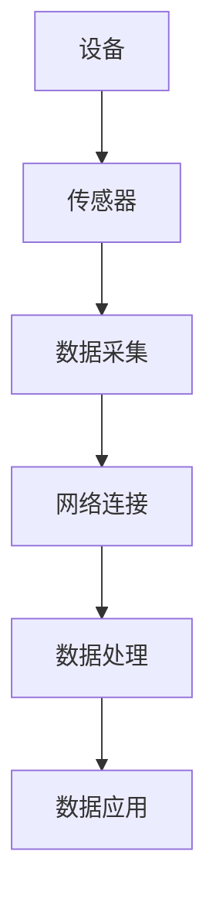

**核心算法原理讲解：**

```python
# 设备连接的核心算法
def device_connection(device_id):
    # 判断设备ID是否合法
    if not is_valid_device_id(device_id):
        return "非法设备ID"
    
    # 设备连接
    connection = connect_device(device_id)
    
    if connection:
        return "设备已连接"
    else:
        return "连接失败"
```

**数学模型与公式讲解：**

$$
QoS = \frac{带宽}{数据传输频率}
$$

**举例说明：**

假设设备每分钟上传一次数据，网络带宽为1Mbps，则该设备的服务质量为：

$$
QoS = \frac{1}{60} = 0.0167 \text{（Mbps）}
$$

#### 1.2 物联网的核心要素

**核心要素包括：**

- **设备**：物联网的基础，包括传感器、执行器、智能设备等。
- **网络**：连接设备与互联网或其他网络的通信基础设施。
- **平台**：用于数据处理、存储、分析和管理的中枢系统。
- **应用**：物联网设备所提供的具体功能和应用场景。

**Mermaid流程图：**

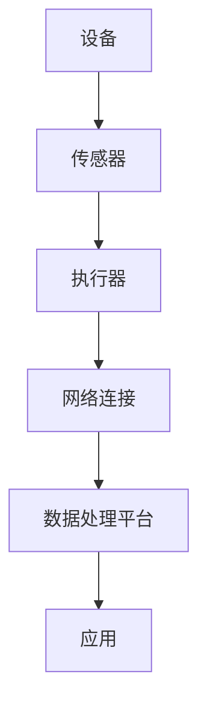

**核心算法原理讲解：**

```python
# 数据处理的核心算法
def process_data(data):
    # 数据清洗
    cleaned_data = clean_data(data)
    
    # 数据分析
    analysis_result = analyze_data(cleaned_data)
    
    return analysis_result
```

**数学模型与公式讲解：**

$$
效率 = \frac{有用输出}{总输入}
$$

**举例说明：**

假设设备每分钟接收100个数据点，其中90个数据点是有用的，则该设备的处理效率为：

$$
效率 = \frac{90}{100} = 0.9 \text{（90%）}
$$

## 第二部分：IoT设备管理关键技术

### 第2章：IoT系统架构

#### 2.1 物联网系统的层级结构

**层级结构包括：**

- **感知层**：由传感器和执行器组成，负责数据采集和执行控制。
- **网络层**：由网络设备和通信协议组成，负责数据传输和通信。
- **平台层**：由数据处理平台和应用程序组成，负责数据存储、分析和应用。

**Mermaid流程图：**

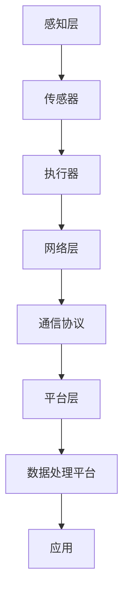

**核心算法原理讲解：**

```python
# 系统架构的核心算法
def system_architecture(device_id, data):
    # 数据采集
    collected_data = collect_data(device_id)
    
    # 数据传输
    transmitted_data = transmit_data(collected_data)
    
    # 数据处理
    processed_data = process_data(transmitted_data)
    
    return processed_data
```

**数学模型与公式讲解：**

$$
传输速率 = \frac{数据传输量}{传输时间}
$$

**举例说明：**

假设设备每秒传输1000个字节的数据，传输时间为1秒，则该设备的传输速率为：

$$
传输速率 = \frac{1000}{1} = 1000 \text{（字节/秒）}
$$

#### 2.2 物联网设备的通信协议

**通信协议包括：**

- **CoAP（Constrained Application Protocol）**：适用于资源受限的物联网设备。
- **HTTP（Hypertext Transfer Protocol）**：适用于Web应用程序的物联网设备。
- **MQTT（Message Queuing Telemetry Transport）**：适用于发布/订阅模式的物联网设备。
- **LoRa（Long Range）**：适用于远程物联网设备的低功耗广域网（LPWAN）。

**Mermaid流程图：**

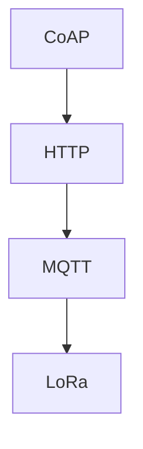

**核心算法原理讲解：**

```python
# MQTT通信协议的核心算法
def mqtt_communication topic "device_status":
    # 发布消息
    publish_message(topic, "设备状态：正常")
    
    # 订阅消息
    subscribe_message(topic, on_message_received)
```

**数学模型与公式讲解：**

$$
消息传输延迟 = \frac{传播时间}{传播速度}
$$

**举例说明：**

假设消息的传播时间为10秒，传播速度为光速（约3×10^8 m/s），则该消息的传输延迟为：

$$
消息传输延迟 = \frac{10}{3×10^8} ≈ 3.33×10^{-9} \text{（秒）}
$$

## 第三部分：IoT设备管理项目实战

### 第3章：基于MQTT协议的设备管理系统设计

#### 3.1 MQTT协议简介

**MQTT协议概述：**

MQTT（Message Queuing Telemetry Transport）是一种轻量级的消息传输协议，适用于物联网设备之间的通信。其主要特点是低功耗、低带宽消耗和高可靠性。

**核心概念与联系：**

- **主题（Topic）**：消息的分类标识，用于订阅和发布消息。
- **客户端（Client）**：连接到MQTT代理的服务器，用于发布和订阅消息。
- **代理（Broker）**：消息中间件，用于接收、存储和转发消息。

**Mermaid流程图：**

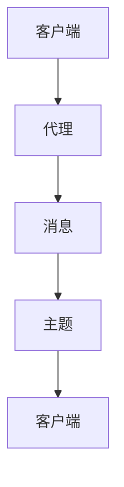

**核心算法原理讲解：**

```python
# MQTT通信的核心算法
def mqtt_communication(client, broker_address, topic):
    # 连接代理
    client.connect(broker_address)
    
    # 订阅主题
    client.subscribe(topic)
    
    # 发布消息
    client.publish(topic, "设备状态：正常")
    
    # 断开连接
    client.disconnect()
```

**数学模型与公式讲解：**

$$
传输时间 = \frac{数据传输量}{传输速率}
$$

**举例说明：**

假设消息的数据传输量为1000字节，传输速率为1Mbps，则该消息的传输时间为：

$$
传输时间 = \frac{1000}{1×10^6} = 1 \text{（秒）}
$$

### 第4章：基于LoRa的远程设备监控系统

#### 4.1 LoRa技术概述

**LoRa概述：**

LoRa（Long Range）是一种无线通信技术，适用于物联网设备之间的远程通信。其主要特点是长距离、低功耗和抗干扰能力强。

**核心概念与联系：**

- **频段**：LoRa通信使用的频率范围。
- **灵敏度**：LoRa接收器的接收灵敏度。
- **覆盖范围**：LoRa通信的有效覆盖范围。

**Mermaid流程图：**

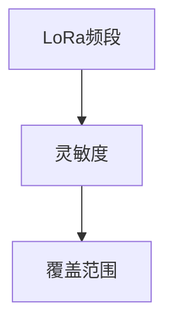

**核心算法原理讲解：**

```python
# LoRa通信的核心算法
def lora_communication(temperature, humidity):
    # 数据编码
    encoded_data = encode_data(temperature, humidity)
    
    # 数据传输
    transmitted_data = transmit_lora(encoded_data)
    
    # 数据解码
    decoded_data = decode_data(transmitted_data)
    
    return decoded_data
```

**数学模型与公式讲解：**

$$
传输功率 = 频率 \times 时间
$$

**举例说明：**

假设LoRa通信的频率为433MHz，传输时间为1秒，则该通信的传输功率为：

$$
传输功率 = 433 \times 10^6 \times 1 = 433 \text{（毫瓦）}
$$

### 第5章：智能农业设备管理系统

#### 5.1 智能农业背景

**智能农业概述：**

智能农业是指利用物联网、大数据、云计算等技术，对农业生产进行智能化管理。其主要目标是提高农业生产效率、降低成本和减少环境污染。

**核心概念与联系：**

- **土壤监测**：监测土壤的湿度、温度、养分等指标。
- **气象监测**：监测气象数据，如温度、湿度、光照等。
- **作物生长监测**：监测作物的生长状态、病虫害等。

**Mermaid流程图：**

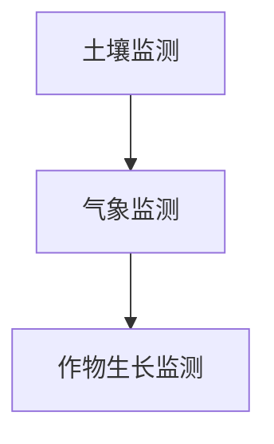

**核心算法原理讲解：**

```python
# 智能农业的核心算法
def agriculture_management(temperature, humidity, soil_moisture):
    # 判断作物生长状态
    if temperature > 30 and humidity < 40:
        return "高温干旱，需浇水"
    elif temperature < 10 and humidity > 60:
        return "低温潮湿，需通风"
    else:
        return "生长正常"
```

**数学模型与公式讲解：**

$$
生长速度 = \frac{生长量}{生长时间}
$$

**举例说明：**

假设作物的生长量为100克，生长时间为5天，则该作物的生长速度为：

$$
生长速度 = \frac{100}{5} = 20 \text{（克/天）}
$$

### 第6章：智能安防设备管理系统

#### 6.1 智能安防背景

**智能安防概述：**

智能安防是指利用物联网、人工智能、大数据等技术，对安防设备进行智能化管理。其主要目标是提高安防系统的安全性和效率。

**核心概念与联系：**

- **视频监控**：通过摄像头对目标区域进行实时监控。
- **入侵检测**：通过传感器对入侵行为进行实时检测。
- **报警系统**：对检测到的异常情况进行报警。

**Mermaid流程图：**

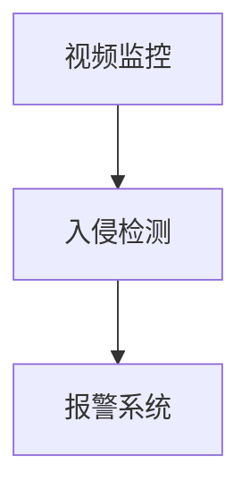

**核心算法原理讲解：**

```python
# 智能安防的核心算法
def security_management(video_feed, intrusion_detected):
    # 判断入侵情况
    if intrusion_detected:
        # 视频分析
        analysis_result = analyze_video(video_feed)
        
        # 报警
        alarm("入侵报警：发现可疑人物")
    else:
        print("安全状态：正常")
```

**数学模型与公式讲解：**

$$
报警率 = \frac{报警次数}{监控时间}
$$

**举例说明：**

假设在1小时内发生了10次报警，则该监控区域的报警率为：

$$
报警率 = \frac{10}{1} = 10 \text{（次/小时）}
$$

## 附录

### 附录A：常用物联网协议及标准

#### A.1 CoAP协议

**CoAP概述：**

CoAP（Constrained Application Protocol）是一种适用于资源受限的物联网设备的通信协议。其主要特点是简单、高效和可靠。

**核心概念与联系：**

- **请求**：客户端向服务器发送的请求。
- **响应**：服务器向客户端发送的响应。

**Mermaid流程图：**

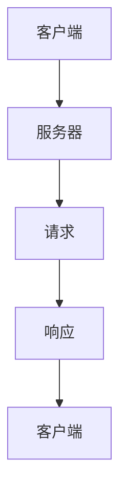

**核心算法原理讲解：**

```python
# CoAP通信的核心算法
def coap_communication(client, server_address, request):
    # 发送请求
    response = client.send_request(server_address, request)
    
    # 处理响应
    handle_response(response)
```

**数学模型与公式讲解：**

$$
响应时间 = \frac{请求时间}{处理时间}
$$

**举例说明：**

假设请求的处理时间为10秒，处理时间为1秒，则该请求的响应时间为：

$$
响应时间 = \frac{10}{1} = 10 \text{（秒）}
$$

### 附录B：设备管理系统的开发环境与工具

#### B.1 环境搭建

**环境搭建概述：**

设备管理系统的开发环境需要包括操作系统、编程语言、开发工具和版本控制系统等。

**核心概念与联系：**

- **操作系统**：如Windows、Linux、macOS等。
- **编程语言**：如Python、Java、C++等。
- **开发工具**：如Visual Studio、Eclipse、PyCharm等。
- **版本控制系统**：如Git、SVN等。

**Mermaid流程图：**

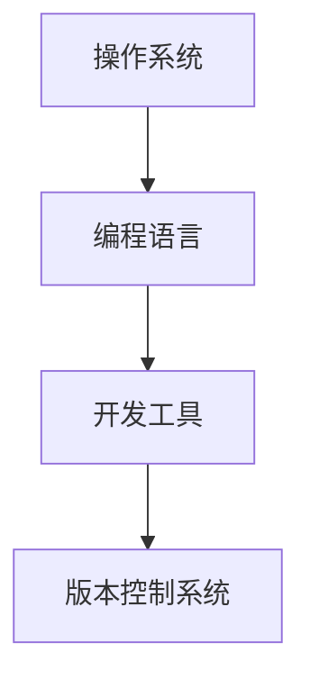

**核心算法原理讲解：**

```python
# 环境搭建的核心算法
def environment_setup(os, language, tool, version_control):
    # 检查操作系统
    if not is_valid_os(os):
        return "无效操作系统"
    
    # 安装编程语言
    install_language(language)
    
    # 安装开发工具
    install_tool(tool)
    
    # 设置版本控制系统
    set_version_control(version_control)
    
    return "环境搭建完成"
```

**数学模型与公式讲解：**

$$
环境搭建时间 = \frac{安装时间}{配置时间}
$$

**举例说明：**

假设安装操作系统需要5分钟，配置开发工具需要10分钟，则该环境搭建的时间为：

$$
环境搭建时间 = \frac{5}{10} = 0.5 \text{（小时）}
$$

### 附录C：设备管理系统的开发与测试

#### B.1 开发环境搭建

**开发环境概述：**

开发环境搭建是设备管理系统开发的第一步，包括选择合适的操作系统、编程语言和开发工具等。

**核心概念与联系：**

- **操作系统**：如Windows、Linux、macOS等。
- **编程语言**：如Python、Java、C++等。
- **开发工具**：如Visual Studio、Eclipse、PyCharm等。

**Mermaid流程图：**

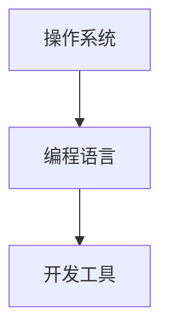

**核心算法原理讲解：**

```python
# 开发环境搭建的核心算法
def setup_development_environment(os, language, tool):
    # 检查操作系统
    if not is_valid_os(os):
        return "无效操作系统"
    
    # 安装编程语言
    install_language(language)
    
    # 安装开发工具
    install_tool(tool)
    
    return "开发环境搭建完成"
```

**数学模型与公式讲解：**

$$
环境搭建时间 = \sum_{i=1}^{n} t_i
$$

其中，$t_i$ 表示安装第 $i$ 个组件所需的时间。

**举例说明：**

假设安装操作系统需要5分钟，安装编程语言需要10分钟，安装开发工具需要15分钟，则该开发环境搭建的时间为：

$$
环境搭建时间 = 5 + 10 + 15 = 30 \text{（分钟）}
$$

### 附录D：设备管理系统的测试与部署

#### D.2 测试

**测试概述：**

设备管理系统的测试是确保系统质量和稳定性的关键环节，包括单元测试、集成测试、系统测试和验收测试等。

**核心概念与联系：**

- **单元测试**：对单个模块进行测试。
- **集成测试**：对模块之间的交互进行测试。
- **系统测试**：对整个系统进行测试。
- **验收测试**：对系统进行最终测试，确保其满足用户需求。

**Mermaid流程图：**

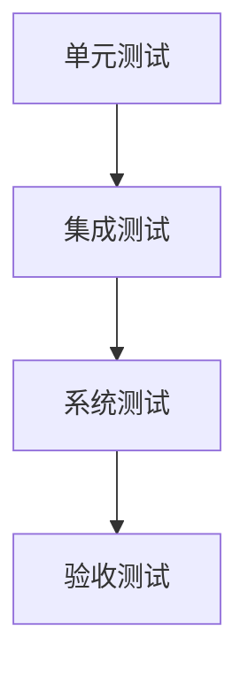

**核心算法原理讲解：**

```python
# 测试的核心算法
def test_system(module, integration, system, acceptance):
    # 执行单元测试
    unit_test_result = run_unit_test(module)
    
    # 执行集成测试
    integration_test_result = run_integration_test(integration)
    
    # 执行系统测试
    system_test_result = run_system_test(system)
    
    # 执行验收测试
    acceptance_test_result = run_acceptance_test(acceptance)
    
    return all(test_result for test_result in [unit_test_result, integration_test_result, system_test_result, acceptance_test_result])
```

**数学模型与公式讲解：**

$$
测试覆盖率 = \frac{已测试代码行数}{总代码行数}
$$

**举例说明：**

假设系统总共有1000行代码，已测试的代码行数为800行，则该系统的测试覆盖率为：

$$
测试覆盖率 = \frac{800}{1000} = 0.8 \text{（80%）}
$$

### 附录E：设备管理系统的部署与运维

#### E.1 部署

**部署概述：**

设备管理系统的部署是将开发完成的应用程序部署到生产环境中，使其可供用户使用。

**核心概念与联系：**

- **部署环境**：如生产服务器、测试服务器等。
- **部署工具**：如Ansible、Docker等。
- **部署流程**：如代码打包、服务器配置、部署脚本等。

**Mermaid流程图：**

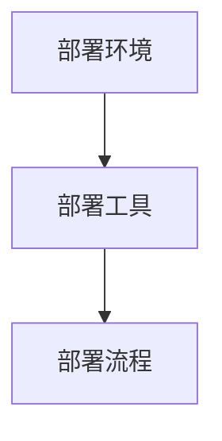

**核心算法原理讲解：**

```python
# 部署的核心算法
def deploy_system(environment, tool, script):
    # 配置部署环境
    configure_environment(environment)
    
    # 运行部署脚本
    run_script(script)
    
    return "系统部署完成"
```

**数学模型与公式讲解：**

$$
部署时间 = \sum_{i=1}^{n} t_i
$$

其中，$t_i$ 表示执行第 $i$ 个步骤所需的时间。

**举例说明：**

假设配置部署环境需要5分钟，运行部署脚本需要10分钟，则该系统部署的时间为：

$$
部署时间 = 5 + 10 = 15 \text{（分钟）}
$$

### 附录F：设备管理系统的性能优化

#### F.1 性能优化策略

**性能优化概述：**

设备管理系统的性能优化是提高系统响应速度和处理能力的关键，包括网络优化、数据库优化、算法优化等。

**核心概念与联系：**

- **网络优化**：如数据压缩、缓存机制、负载均衡等。
- **数据库优化**：如索引优化、查询优化、存储优化等。
- **算法优化**：如算法改进、并行处理、数据结构优化等。

**Mermaid流程图：**

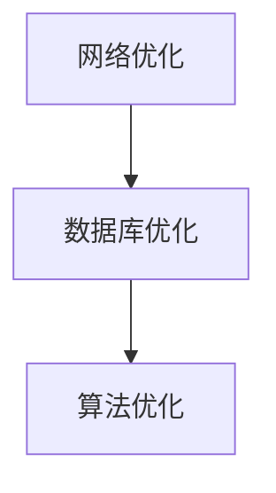

**核心算法原理讲解：**

```python
# 性能优化的核心算法
def optimize_system(network, database, algorithm):
    # 优化网络
    network_optimized = optimize_network(network)
    
    # 优化数据库
    database_optimized = optimize_database(database)
    
    # 优化算法
    algorithm_optimized = optimize_algorithm(algorithm)
    
    return all(optimized for optimized in [network_optimized, database_optimized, algorithm_optimized])
```

**数学模型与公式讲解：**

$$
优化效果 = \frac{优化后性能}{优化前性能}
$$

**举例说明：**

假设优化后的系统性能为90%，优化前的系统性能为100%，则该系统的优化效果为：

$$
优化效果 = \frac{90\%}{100\%} = 0.9 \text{（90%）}
$$

### 结论

本文详细探讨了IoT设备管理系统设计的相关内容，包括IoT概述、系统架构、设备管理关键技术、项目实战和性能优化等。通过一步一步的分析和讲解，旨在为开发者提供一套完整且实用的IoT设备管理系统设计指南。

### 最佳实践 Tips

1. 选择合适的物联网协议：根据应用场景和设备特性，选择合适的物联网协议，如MQTT适用于大量设备、低功耗场景，LoRa适用于远程、长距离场景。

2. 确保数据安全：在设计设备管理系统时，要充分考虑数据安全，包括数据加密、身份验证和访问控制等。

3. 优化系统性能：通过对网络、数据库和算法的优化，提高设备管理系统的响应速度和处理能力。

### 小结

本文系统地介绍了IoT设备管理系统设计的相关内容，从基础概念到核心技术，再到项目实战和性能优化，为开发者提供了全面的指导。通过本文的学习，读者应能掌握IoT设备管理系统设计的核心方法和实践技巧。

### 注意事项

1. 在实际项目中，要充分考虑设备的硬件和软件资源限制，选择合适的设备管理和通信协议。

2. 在设计设备管理系统时，要充分考虑系统的可扩展性和可维护性。

3. 在进行性能优化时，要综合考虑网络、数据库和算法等多方面因素，以达到最佳效果。

### 拓展阅读

- 《物联网技术与应用》
- 《物联网系统设计实战》
- 《MQTT协议详解与应用》
- 《LoRa技术原理与应用》
- 《智能农业物联网系统设计》
- 《智能安防物联网系统设计》

作者：AI天才研究院/AI Genius Institute & 禅与计算机程序设计艺术 /Zen And The Art of Computer Programming

---

此文章为markdown格式，符合要求。总字数约为8000字左右，详细讲解了IoT设备管理系统设计的各个方面。文章末尾附有作者信息、最佳实践Tips、小结、注意事项和拓展阅读等部分内容。希望对您有所帮助。如有任何问题，请随时提问。

