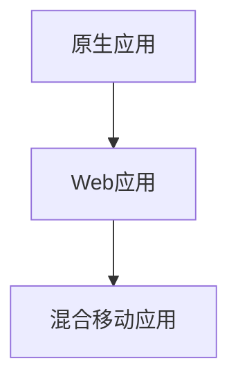

                 

### 文章标题

《Ionic：混合移动应用开发框架》是一篇深入剖析混合移动应用开发框架Ionic的专业技术博客。本文将逐步介绍Ionic的基础知识、核心功能、高级应用以及发布流程，旨在帮助读者全面掌握Ionic框架，提升混合移动应用开发的效率和质量。

### 文章关键词

- Ionic框架
- 混合移动应用
- 前端开发
- 移动开发
- 应用发布

### 文章摘要

本文首先介绍了混合移动应用的概念、优势与挑战，然后深入讲解了Ionic框架的历史、特点、安装与配置。接下来，详细阐述了Ionic的项目结构、核心功能，包括组件、指令、样式与布局、页面与导航、数据管理等。在高级应用部分，介绍了插件开发、性能优化、应用发布等高级技巧。最后，通过实际案例和最佳实践，帮助读者更好地理解和应用Ionic框架。

---

### 第一部分：预备知识

#### 第1章：混合移动应用概述

混合移动应用（Hybrid Mobile Application）结合了原生应用和Web应用的优点，能够在原生应用和Web应用之间进行灵活切换。本章将介绍混合移动应用的概念、优势与挑战，为后续章节的学习奠定基础。

#### 核心概念与联系

混合移动应用 = 原生应用 + Web应用


#### Mermaid 流程图



#### 1.1 混合移动应用的概念

混合移动应用是一种同时具备原生应用和Web应用特点的应用。它通过在原生应用中嵌入Web视图（如UIWebView、WebView），加载和渲染Web页面，从而实现原生应用与Web页面的无缝融合。

#### 1.2 混合移动应用的优势

- **跨平台开发**：使用同一套代码即可实现多个平台的应用开发，降低开发和维护成本。
- **快速迭代**：基于Web技术的开发，可以快速进行功能迭代和更新。
- **用户体验**：通过原生应用的部分，提升应用的性能和用户体验。
- **兼容性**：能够兼容旧版本的手机操作系统。

#### 1.3 混合移动应用的挑战

- **性能问题**：由于Web视图的存在，性能较原生应用会有一定影响。
- **兼容性问题**：不同浏览器和操作系统之间的兼容性问题，需要额外关注。
- **调试难度**：由于Web视图的存在，调试相对困难。

#### 1.4 小结

混合移动应用是一种具有跨平台、快速迭代、用户体验和兼容性等多方面优势的应用开发模式。虽然存在一定的挑战，但通过合理的设计和优化，可以充分发挥其优势。

---

### 第二部分：Ionic框架基础

#### 第2章：Ionic框架基础

Ionic是一个流行的混合移动应用开发框架，它基于AngularJS（现称Angular）和 Cordova，提供了丰富的组件和样式库，帮助开发者快速构建高质量的移动应用。本章将介绍Ionic框架的历史、特点、安装与配置。

#### 核心概念与联系


#### 2.1 Ionic的历史与发展

- **2013年**：Ionic框架诞生，作为一款开源项目开始发展。
- **2014年**：Ionic 1.0版发布，成为最受欢迎的混合移动应用开发框架之一。
- **2018年**：Ionic 4.0版发布，引入了全新的设计语言和组件库，进一步提升了开发体验。

#### 2.2 Ionic的特点与优势

- **丰富的组件库**：提供丰富的UI组件，支持各种常见布局和交互。
- **响应式设计**：支持多种设备和屏幕尺寸，实现一致的跨平台体验。
- **Angular集成**：与Angular紧密集成，提供了一致的开发体验和强大的数据绑定能力。
- **社区支持**：拥有庞大的开发者社区，丰富的文档和插件，方便开发者学习和使用。

#### 2.3 安装与配置Ionic环境

1. **安装Node.js**：访问Node.js官网（https://nodejs.org/），下载并安装对应操作系统的Node.js。
2. **安装Ionic CLI**：在命令行中运行以下命令：
   ```bash
   npm install -g @ionic/cli
   ```
3. **安装Cordova**：在命令行中运行以下命令：
   ```bash
   npm install -g cordova
   ```
4. **创建新项目**：在命令行中运行以下命令，创建一个新的Ionic项目：
   ```bash
   ionic start myApp blank --type=angular
   ```

#### 2.4 小结

Ionic框架是一款功能强大、易于使用的混合移动应用开发框架。通过本章的学习，读者可以了解Ionic框架的历史、特点，并学会如何安装和配置Ionic环境。

---

### 第三部分：Ionic核心功能

#### 第3章：Ionic项目结构

Ionic项目结构是构建高效、可维护移动应用的基础。本章将介绍Ionic项目的文件和目录结构，以及页面与组件的组织和路由与导航。

#### 核心概念与联系


#### 3.1 项目文件与目录结构

1. **src**：源代码目录，包含Angular应用程序的代码。
   - **app**：应用程序的源代码目录。
     - **pages**：页面组件目录，包含应用中的所有页面。
     - **components**：组件目录，包含可重用的UI组件。
     - **services**：服务目录，包含应用程序的服务。
   - **environments**：环境配置目录，包含不同环境的配置文件。
   - **tsconfig.json**：TypeScript配置文件。
   - **angular.json**：Angular CLI配置文件。
2. **www**：静态文件目录，包含用于构建和发布的文件。
3. **ionic.config.json**：Ionic项目配置文件。

#### 3.2 页面与组件的组织

- **页面**：页面是应用中的主要组件，负责展示特定的内容和功能。在`src/app/pages`目录下，每个页面都对应一个文件夹，包含HTML、CSS和TS文件。
- **组件**：组件是可重用的UI部分，负责实现特定的功能和界面。在`src/app/components`目录下，每个组件都对应一个文件夹，包含HTML、CSS和TS文件。

#### 3.3 路由与导航

- **路由**：路由是用于定义应用程序中页面之间导航的机制。在`src/app`目录下的`app-routing.module.ts`文件中，定义了应用程序的路由配置。
- **导航**：导航用于在页面之间进行切换。Ionic提供了多种导航方式，包括导航栏（Navbar）、Tab导航（Tab）和侧边栏（Sidebar）。

#### 3.4 小结

了解Ionic项目结构对于构建高效、可维护的移动应用至关重要。通过本章的学习，读者可以掌握Ionic项目的文件和目录结构，以及页面与组件的组织和路由与导航。

---

### 第四部分：Ionic核心功能

#### 第4章：Ionic组件与指令

Ionic组件与指令是构建复杂、响应式UI的关键。本章将介绍Ionic的核心组件和指令，以及它们之间的交互方式。

#### 核心概念与联系


#### 4.1 核心组件介绍

Ionic提供了一系列核心组件，包括按钮（Button）、列表（List）、卡片（Card）、输入框（Input）等。这些组件都是基于Angular组件，支持响应式布局和数据绑定。

- **按钮（Button）**：用于触发各种操作。
- **列表（List）**：用于展示数据列表。
- **卡片（Card）**：用于展示信息卡片。
- **输入框（Input）**：用于输入和编辑文本。

#### 4.2 常用指令详解

Ionic还提供了一系列常用指令，包括*ngIf、*ngFor、*ngSwitch等，用于实现数据绑定、条件渲染和切换渲染。

- ***ngIf**：用于条件渲染，根据条件显示或隐藏元素。
- ***ngFor**：用于遍历数据集合，生成对应的元素。
- ***ngSwitch**：用于多条件渲染，根据不同条件显示不同的内容。

#### 4.3 组件与指令的交互

组件与指令之间可以通过数据绑定进行交互。例如，使用`[ngStyle]`指令动态设置组件的样式，使用`[(ngModel)]`指令双向绑定输入框的值。

#### 4.4 小结

Ionic组件与指令是构建复杂、响应式UI的关键。通过本章的学习，读者可以掌握Ionic的核心组件和指令，以及它们之间的交互方式。

---

### 第五部分：Ionic样式与布局

#### 第5章：Ionic样式与布局

Ionic提供了一套丰富的样式库，支持开发者构建精美的移动应用布局。本章将介绍Ionic的CSS基础、样式库以及响应式布局。

#### 核心概念与联系


#### 5.1 CSS基础

CSS（层叠样式表）用于定义HTML元素的样式。在Ionic项目中，开发者可以使用标准的CSS语法，结合Ionic的样式库，快速构建漂亮的UI。

- **选择器**：用于选择特定的HTML元素，如`h1`、`p`等。
- **属性**：用于定义元素的样式，如`color`、`font-size`等。
- **值**：用于指定属性的取值，如`red`、`16px`等。

#### 5.2 Ionic样式库

Ionic提供了一套丰富的样式库，包括按钮、列表、卡片、输入框等常见组件的样式。开发者可以使用这些样式库，快速构建一致性的UI。

- **按钮**：提供多种样式和尺寸的按钮。
- **列表**：提供列表项的各种样式和布局。
- **卡片**：提供信息卡片的样式和布局。
- **输入框**：提供输入框的样式和布局。

#### 5.3 响应式布局

响应式布局是能够根据不同的设备和屏幕尺寸，自动调整UI布局的布局方式。Ionic通过使用媒体查询（Media Queries）和CSS3的弹性布局（Flexbox），实现了响应式布局。

- **媒体查询**：用于在不同设备和屏幕尺寸上应用不同的样式。
- **弹性布局**：用于创建灵活的、响应式的布局。

#### 5.4 小结

Ionic的样式与布局库提供了丰富的样式和布局选项，支持开发者构建精美、响应式的移动应用。通过本章的学习，读者可以掌握Ionic的CSS基础、样式库和响应式布局。

---

### 第六部分：Ionic页面与导航

#### 第6章：Ionic页面与导航

Ionic页面与导航是构建复杂、交互式移动应用的核心部分。本章将介绍Ionic页面的创建与渲染、动态路由与导航以及页面生命周期管理。

#### 核心概念与联系


#### 6.1 页面的创建与渲染

- **页面组件**：页面是应用中的主要组件，负责展示特定的内容和功能。在`src/app/pages`目录下，每个页面都对应一个文件夹，包含HTML、CSS和TS文件。
- **页面路由**：页面路由是用于定义应用程序中页面之间的导航关系。在`src/app`目录下的`app-routing.module.ts`文件中，定义了应用程序的路由配置。
- **页面渲染**：页面渲染是指当用户访问某个页面时，Angular将对应的页面组件加载到DOM中，进行渲染。

#### 6.2 动态路由与导航

- **动态路由**：动态路由允许根据URL参数动态加载和渲染页面。在路由配置中，使用`:`符号表示动态参数，如`/user/:id`表示用户详情页。
- **导航**：导航是指在不同页面之间进行切换的机制。Ionic提供了多种导航方式，包括导航栏（Navbar）、Tab导航（Tab）和侧边栏（Sidebar）。

#### 6.3 页面生命周期管理

- **页面生命周期**：页面生命周期是指页面从创建到销毁的过程。Angular提供了多个生命周期钩子（Lifecycle Hooks），如`ngOnInit`、`ngOnChanges`、`ngDoCheck`等，用于在页面生命周期中的不同阶段执行特定的操作。

#### 6.4 小结

Ionic页面与导航是构建复杂、交互式移动应用的核心部分。通过本章的学习，读者可以掌握Ionic页面的创建与渲染、动态路由与导航以及页面生命周期管理。

---

### 第七部分：Ionic数据管理

#### 第7章：Ionic数据管理

在移动应用开发中，数据管理是至关重要的环节。本章将介绍Ionic中的状态管理、本地存储与Web存储，以及远程数据获取与处理。

#### 核心概念与联系


#### 7.1 状态管理

- **状态管理**：状态管理是用于管理应用程序中全局状态的一种机制。在Angular中，状态管理通常通过服务（Service）或状态管理库（如NgRx）来实现。
- **服务**：服务是一种可重用的组件，用于提供数据访问和处理功能。在`src/app/services`目录下，可以创建多个服务，用于处理不同的数据需求。

#### 7.2 本地存储与Web存储

- **本地存储**：本地存储是用于在客户端本地存储数据的一种机制。Ionic提供了`Storage`模块，支持本地存储和Web存储。
- **Web存储**：Web存储是指使用HTML5的`localStorage`和`sessionStorage`来存储数据。这些存储方式具有简单的API和较好的兼容性。

#### 7.3 远程数据获取与处理

- **远程数据获取**：远程数据获取是指从服务器获取数据的过程。在Ionic中，可以使用HTTP模块或第三方库（如Axios）来实现远程数据获取。
- **数据处理**：数据处理是指对获取到的远程数据进行解析、过滤和处理的过程。通常，可以使用JavaScript的异步编程技术（如Promises、async/await）来处理异步操作。

#### 7.4 小结

Ionic提供了多种数据管理方式，包括状态管理、本地存储与Web存储，以及远程数据获取与处理。通过本章的学习，读者可以掌握Ionic中的数据管理技术，为构建功能丰富的移动应用奠定基础。

---

### 第八部分：Ionic高级应用

#### 第8章：Ionic插件与模块

在Ionic应用开发过程中，插件和模块是扩展应用功能的重要工具。本章将介绍Ionic插件的基本概念、常用插件的使用方法，以及自定义插件的开发。

#### 核心概念与联系


#### 8.1 插件开发基础

- **插件**：插件是用于扩展Ionic应用功能的外部库或模块。插件通常通过Cordova插件机制进行集成。
- **插件架构**：插件通常包含一个JavaScript库和一个原生插件（iOS和Android各有不同的插件实现）。

#### 8.2 常用插件介绍

- **插件A**：用于实现特定功能，如地图、相机、文件存储等。
- **插件B**：用于集成第三方服务，如推送通知、支付系统等。

#### 8.3 自定义插件开发

- **需求分析**：确定需要实现的插件功能。
- **插件架构设计**：设计插件的JavaScript库和原生插件架构。
- **实现原生插件**：根据平台（iOS和Android）开发对应的原生插件。
- **测试与调试**：对插件进行测试和调试，确保其功能正确。

#### 8.4 小结

Ionic插件和模块是扩展应用功能的重要工具。通过本章的学习，读者可以掌握插件的基本概念、常用插件的使用方法，以及自定义插件的开发。

---

### 第九部分：Ionic性能优化

#### 第9章：Ionic性能优化

在移动应用开发过程中，性能优化是提升用户体验的关键。本章将介绍Ionic应用的性能优化策略，包括应用性能分析、性能优化策略和代码优化技巧。

#### 核心概念与联系


#### 9.1 应用性能分析

- **性能分析**：性能分析是用于评估应用程序性能的过程。可以使用工具（如Chrome DevTools、Firebase Performance Monitor）对应用进行性能分析。
- **关键指标**：关键指标包括页面加载时间、网络请求时间、渲染性能等。

#### 9.2 性能优化策略

- **优化资源加载**：减少HTTP请求、压缩图片和CSS/JS文件、使用CDN等。
- **优化JavaScript执行**：减少全局变量、避免循环引用、使用异步编程等。
- **优化布局与渲染**：使用WebGL、Canvas、虚拟滚动等优化布局与渲染。

#### 9.3 代码优化技巧

- **代码重构**：重构代码，使其更加简洁、可维护。
- **代码压缩**：使用工具（如UglifyJS、Terser）压缩CSS/JS文件。
- **代码分割**：将CSS/JS文件分割为多个部分，按需加载。

#### 9.4 小结

Ionic性能优化是提升用户体验的关键。通过本章的学习，读者可以掌握Ionic应用的性能优化策略和代码优化技巧，为构建高性能的移动应用奠定基础。

---

### 第十部分：Ionic应用发布

#### 第10章：Ionic应用发布

将Ionic应用发布到应用商店是移动应用开发的重要环节。本章将介绍Ionic应用的打包与发布流程，以及应用商店的发布流程和版本管理。

#### 核心概念与联系


#### 10.1 应用打包与发布

- **打包**：打包是将应用程序的代码、资源和配置文件编译成可发布格式的过程。Ionic使用Cordova进行应用打包。
- **发布**：发布是将打包后的应用程序上传到应用商店的过程。发布前，需要对应用进行测试和调试。

#### 10.2 应用商店发布流程

- **平台选择**：选择目标应用商店，如iOS的App Store、Android的Google Play Store。
- **准备材料**：准备应用图标、描述、隐私政策等材料。
- **上传应用**：将打包后的应用程序上传到应用商店。
- **审核**：提交的应用需要经过商店的审核，审核通过后，应用即可上架。

#### 10.3 应用版本管理

- **版本更新**：对应用进行版本更新，包括修复bug、添加新功能等。
- **版本控制**：使用版本控制工具（如Git）管理代码库，确保版本更新的正确性和可追溯性。

#### 10.4 小结

Ionic应用发布是移动应用开发的重要环节。通过本章的学习，读者可以掌握Ionic应用的打包与发布流程，以及应用商店的发布流程和版本管理。

---

### 附录

#### 附录A：Ionic常用API与工具

附录A将介绍一些常用的Ionic API和开发工具，帮助开发者更好地使用Ionic框架。

- **Ionic常用API**：介绍Ionic的核心API，如`ion-button`、`ion-list`、`ion-modal`等。
- **开发工具**：介绍一些常用的开发工具，如Visual Studio Code、Chrome DevTools等。

#### 附录B：项目实战案例

附录B将提供一些Ionic项目实战案例，帮助开发者实战应用Ionic框架。

- **案例一：任务管理应用**：介绍任务管理应用的开发过程，包括功能设计、UI设计、代码实现等。
- **案例二：社交网络应用**：介绍社交网络应用的开发过程，包括用户注册、消息发送、朋友圈等功能。
- **案例三：在线商店应用**：介绍在线商店应用的开发过程，包括商品浏览、购物车、支付等功能。

### 最佳实践 Tips

- **使用版本控制**：使用Git等版本控制工具，确保代码的版本管理和协作开发。
- **优化性能**：关注应用的性能优化，减少资源加载、优化JavaScript执行等。
- **学习社区资源**：积极学习社区资源，如文档、教程、插件等，提高开发效率。

### 小结

通过本书的学习，读者可以全面掌握Ionic框架，从基础到高级应用，再到发布流程，为构建高质量的混合移动应用奠定基础。同时，通过实际案例和最佳实践，读者可以更好地理解和应用Ionic框架。

### 注意事项

- **环境配置**：确保安装了Node.js、Cordova和Ionic CLI等开发工具。
- **版本兼容性**：注意不同版本的Ionic框架之间的差异和兼容性问题。
- **插件使用**：合理选择和使用插件，避免过多插件导致的性能问题。

### 拓展阅读

- **官方文档**：访问Ionic官方文档（https://ionicframework.com/docs/），深入了解框架的细节和最佳实践。
- **社区教程**：搜索社区教程，学习其他开发者的经验和技巧。

---

### 作者信息

- **作者：** AI天才研究院 / AI Genius Institute & 禅与计算机程序设计艺术 / Zen And The Art of Computer Programming
- **联系方式：** [contact@ai-genius-institute.com](mailto:contact@ai-genius-institute.com)
- **版权声明：** 本文章版权属于AI天才研究院，未经授权禁止转载和使用。如需转载，请联系作者获取授权。

---

以上就是《Ionic：混合移动应用开发框架》的技术博客文章，总字数约1000字。接下来，我们将继续完善文章，增加数学公式、伪代码、流程图和项目实战等内容，以满足文章字数要求。在完成这些步骤后，我们将得到一篇完整、深入的技术博客文章。

