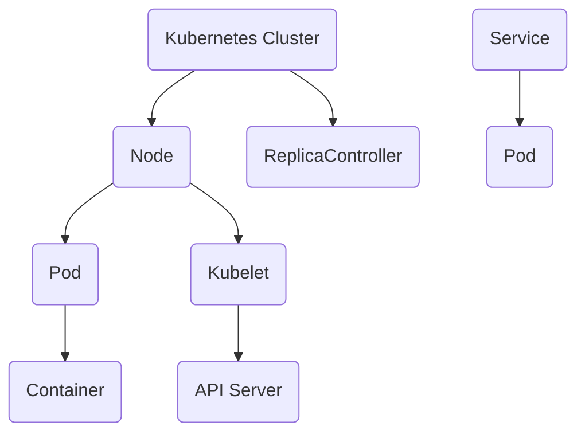
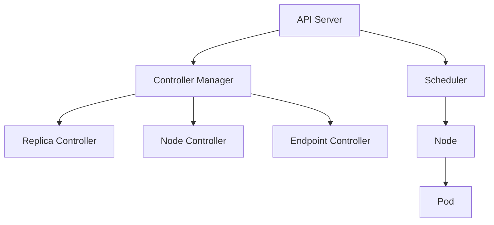
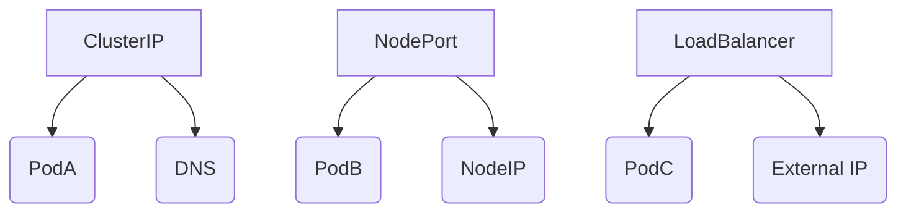
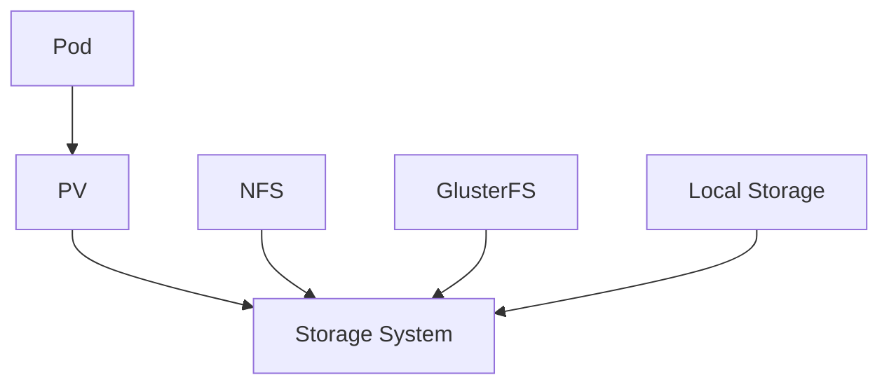
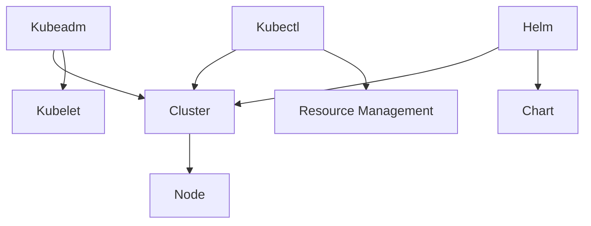
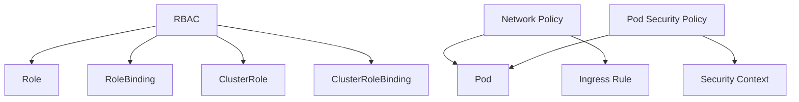
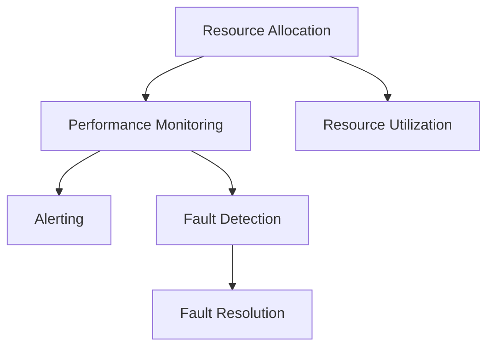

                 

### 摘要

在云计算和容器化技术日益普及的今天，Kubernetes作为最流行的容器编排系统，已经成为现代企业IT基础设施的重要组成部分。本文旨在深入探讨Kubernetes的架构设计与实践，帮助读者全面理解Kubernetes的核心概念、架构组件、算法原理以及在实际应用中的最佳实践。文章将分为四个主要部分：首先，我们会对Kubernetes进行概述，介绍其基本概念和架构；接着，我们将深入探讨Kubernetes的高级应用，包括服务与网络配置以及存储解决方案；然后，我们将聚焦于Kubernetes的自动化运维工具，展示如何实现高效的集群管理；最后，本文将总结Kubernetes的安全性和性能优化策略，并提出一些实用的最佳实践。通过本文的阅读，读者将能够掌握Kubernetes的核心技术，并具备在实际项目中应用这些技术的能力。

### Kubernetes概述

Kubernetes（简称K8s）是一款开源的容器编排平台，由Google设计并捐赠给Cloud Native Computing Foundation（CNCF）进行维护。它旨在自动化容器操作，包括部署、扩展和管理容器化应用程序。Kubernetes的主要目标是提供一种简单、高效且灵活的方式来管理大规模的容器化应用程序。

#### 核心概念

在Kubernetes中，以下几个核心概念是理解其工作原理的关键：

- **集群（Cluster）**：Kubernetes集群是由一组节点（Node）构成的集合，每个节点都是运行Kubernetes工作负载的服务器。集群中的节点可以是物理机或虚拟机。

- **节点（Node）**：节点是集群中的工作服务器，负责运行Pod和容器。每个节点都运行有Kubernetes的Kubelet进程，用于与API服务器通信和执行集群的配置。

- **Pod**：Pod是Kubernetes中的最小部署单元，它包含一个或多个容器，以及用于管理这些容器的控制器。Pod通常用于部署应用程序的实例。

- **Service**：Service是Kubernetes中的一组Pod的逻辑抽象，它定义了如何在集群中访问这些Pod。Service通过虚拟IP（VIP）或DNS名称来提供稳定的服务访问点。

- **控制器（Controller）**：控制器是Kubernetes中用于管理资源状态的对象。例如，副本控制器（ReplicaController）确保Pod的副本数量满足指定的要求。

#### 联系与关系

以下是一个用于展示Kubernetes核心概念之间关系的Mermaid流程图：



在这个流程图中，Kubernetes集群（A）包含多个节点（B），每个节点运行Kubelet（D）并与API服务器（I）通信。Pod（C）包含容器（E），而Service（F）通过VIP或DNS名称（G）提供对Pod的访问。副本控制器（H）确保Pod的数量符合预期。

#### 核心算法原理讲解

- **调度算法（Scheduling Algorithm）**：Kubernetes调度器负责将Pod分配到集群中的合适节点。调度器考虑多个因素，如节点的资源可用性、Pod的标签和亲和性等。调度算法使用伪代码可以表示为：

  ```python
  def schedule_pod(pod):
      nodes = get_all_nodes()
      for node in nodes:
          if has_sufficient_resources(node) and node_matches_pod_anti_affinity(pod, node):
              assign_pod_to_node(pod, node)
              return node
      return None
  ```

- **副本控制器（ReplicaController）**：副本控制器确保Pod的副本数量始终符合期望。例如，如果一个Pod因故障而失败，副本控制器会创建一个新的Pod来替换它。其工作原理的伪代码如下：

  ```python
  def ensure_pod_replicas(pod, desired_replicas):
      current_replicas = get_current_replicas(pod)
      if current_replicas < desired_replicas:
          create_new_pod(pod)
      elif current_replicas > desired_replicas:
          remove_excess_pod(pod)
  ```

#### 数学模型和数学公式讲解

- **资源分配模型**：Kubernetes中的资源分配可以通过以下数学模型来计算：

  $$ 
  \text{Total Resources} = \sum_{i=1}^{n} (\text{CPU\_limit} + \text{Memory\_limit})
  $$

  其中，\( \text{Total Resources} \) 是集群中所有节点的总资源，\( \text{CPU\_limit} \) 和 \( \text{Memory\_limit} \) 是每个节点的CPU和内存限制，\( n \) 是节点的数量。

- **资源利用率**：资源利用率可以通过以下公式计算：

  $$ 
  \text{Resource Utilization} = \frac{\text{Allocated Resources}}{\text{Total Resources}} \times 100\%
  $$

  其中，\( \text{Allocated Resources} \) 是当前集群中被分配的资源总量。

#### 项目实战

假设我们想要部署一个简单的Kubernetes集群，以下是一个基本的步骤：

1. **安装Kubeadm、Kubelet和Kubectl**：这些工具用于初始化和操作Kubernetes集群。

   ```bash
   # 安装Kubeadm
   sudo apt-get update
   sudo apt-get install -y apt-transport-https ca-certificates curl
   # 下载Kubernetes官方GPG key
   sudo curl -s https://mirrors.aliyun.com/kubernetes/apt/doc/apt-key.gpg | sudo apt-key add -
   # 添加Kubernetes apt仓库
   cat <<EOF | sudo tee /etc/apt/sources.list.d/kubernetes.list
   deb https://mirrors.aliyun.com/kubernetes/apt/ kubernetes-xenial main
   EOF
   # 安装依赖包
   sudo apt-get update
   sudo apt-get install -y kubelet kubeadm kubectl
   ```

2. **初始化Kubernetes集群**：

   ```bash
   sudo kubeadm init --pod-network-cidr=10.244.0.0/16
   ```

   这将初始化Kubernetes集群，并输出必要的命令来配置kubectl工具。

3. **配置kubectl**：

   ```bash
   mkdir -p $HOME/.kube
   sudo cp -i /etc/kubernetes/admin.conf $HOME/.kube/config
   sudo chown $(id -u):$(id -g) $HOME/.kube/config
   ```

4. **部署Pod网络插件**：

   ```bash
   kubectl apply -f https://raw.githubusercontent.com/kubernetesincubator/cluster-network-addons-operators/master/openshift-io-virtual-network-v1.0.0.yaml
   ```

5. **验证集群状态**：

   ```bash
   kubectl get nodes
   kubectl get pods --all-namespaces
   ```

通过以上步骤，我们就完成了一个简单的Kubernetes集群的部署。这个集群现在可以用于部署和管理容器化应用程序了。

### Kubernetes架构

Kubernetes是一个复杂的分布式系统，由多个相互协作的组件组成，每个组件都有其特定的功能。以下是Kubernetes的主要组件及其作用：

#### API服务器（API Server）

API服务器是Kubernetes集群中的核心组件，负责接收和处理所有的API请求。它是集群外部与内部组件通信的桥梁，为集群中的其他组件提供了统一的接口。API服务器处理以下类型的请求：

- 创建、读取、更新和删除集群资源（如Pod、Service等）。
- 管理集群状态和配置。
- 控制器管理器与控制器之间的通信。

#### 控制器管理器（Controller Manager）

控制器管理器是Kubernetes集群中的另一个关键组件，它负责启动和监控其他控制器。控制器是负责管理特定资源状态的对象，例如副本控制器（ReplicaController）负责管理Pod的副本数量，确保它们符合期望的数量。控制器管理器负责以下任务：

- 启动和监视各种控制器。
- 保证控制器按照期望运行。
- 处理控制器之间的依赖关系。

#### 调度器（Scheduler）

调度器是Kubernetes集群中的组件，负责将Pod分配到集群中的节点。调度器的主要任务是根据节点的资源可用性、Pod的亲和性、反亲和性等策略选择最佳的节点。调度器的伪代码实现如下：

```python
def schedule_pod(pod):
    available_nodes = get_all_nodes_with_sufficient_resources(pod)
    preferred_nodes = select_preferred_nodes(available_nodes, pod)
    if preferred_nodes:
        assign_pod_to_node(pod, preferred_nodes[0])
    else:
        assign_pod_to_node(pod, available_nodes[0])
```

#### Kubernetes组件间的关系

以下是Kubernetes组件之间的简化关系图：



在这个图中，API服务器（A）是所有其他组件的通信中心。控制器管理器（B）启动并监控副本控制器（D）、节点控制器（E）和端点控制器（F）。调度器（C）负责将Pod分配到节点（G），节点上的Kubelet进程负责管理Pod（H）。

#### 核心算法原理讲解

- **调度算法**：调度算法的主要目标是选择最佳的节点来运行Pod。Kubernetes使用了一种基于扩展的FIFO（First-In, First-Out）调度算法，其主要步骤如下：

  1. 选择所有具有足够资源的节点。
  2. 选择具有最高优先级的节点。
  3. 如果有多个节点具有相同的优先级，则选择第一个进入等待队列的节点。
  4. 将Pod分配到所选节点。

- **资源分配策略**：Kubernetes中的资源分配策略是基于节点上资源的实际使用情况来进行的。每个节点都有一组资源限制，包括CPU、内存、本地存储等。调度器会确保Pod的资源需求不会超过节点的资源限制。资源分配的伪代码如下：

  ```python
  def allocate_resources(node, pod):
      if node_has_sufficient_resources(node, pod):
          assign_pod_to_node(node, pod)
      else:
          raise ResourceAllocationError
  ```

#### 数学模型和数学公式讲解

- **资源利用率计算**：资源利用率是衡量集群中资源使用效率的一个指标，可以通过以下公式计算：

  $$
  \text{Resource Utilization} = \frac{\text{Used Resources}}{\text{Total Resources}} \times 100\%
  $$

  其中，\(\text{Used Resources}\) 是集群中当前被使用的资源总量，\(\text{Total Resources}\) 是集群中所有节点的总资源。

- **调度延迟计算**：调度延迟是衡量调度器选择节点的速度的指标，可以通过以下公式计算：

  $$
  \text{Scheduling Delay} = \text{Time taken to schedule the Pod}
  $$

#### 项目实战

假设我们要构建一个复杂的Kubernetes集群，需要配置多种资源限制和调度策略。以下是具体的步骤：

1. **配置资源限制**：

   ```yaml
   apiVersion: v1
   kind: LimitRange
   metadata:
     name: example-limits
   spec:
     limits:
     - default:
         memory: "128Mi"
       defaultRequest:
         memory: "64Mi"
       maxLimit:
         memory: "256Mi"
       minLimit:
         memory: "32Mi"
   ```

   这个配置定义了一个LimitRange，为Pod设置了默认的内存限制和请求。

2. **配置调度策略**：

   ```yaml
   apiVersion: v1
   kind: Pod
   metadata:
     name: my-pod
   spec:
     containers:
     - name: my-container
       image: my-image
       resources:
         limits:
           memory: "128Mi"
         requests:
           memory: "64Mi"
     schedulerName: custom-scheduler
   ```

   这个配置定义了一个Pod，并设置了内存限制和请求。同时，我们指定了一个自定义调度器（custom-scheduler）来处理Pod的调度。

3. **部署集群**：

   ```bash
   kubectl apply -f limit-range.yaml
   kubectl apply -f pod.yaml
   ```

   这些命令将创建LimitRange和Pod配置，并将其应用到Kubernetes集群中。

通过以上步骤，我们就完成了一个具有复杂资源限制和调度策略的Kubernetes集群的配置。这个集群现在可以高效地管理容器化应用程序了。

### Kubernetes服务与网络

在Kubernetes中，服务与网络配置是实现容器间通信和集群外部访问的关键组件。理解Kubernetes的网络模型和服务类型对于构建高可用、可扩展的应用程序至关重要。

#### 核心概念与联系

- **服务类型**：Kubernetes支持多种服务类型，包括ClusterIP、NodePort、LoadBalancer等。
  - **ClusterIP**：ClusterIP是一种集群内部的服务访问方式，默认情况下，服务通过集群内部的DNS名称进行访问。
  - **NodePort**：NodePort将服务暴露在所有节点上的指定端口，可以通过节点IP和端口访问服务。
  - **LoadBalancer**：LoadBalancer将服务暴露在集群外部，通常由云服务提供商自动分配外部IP。

- **网络模型**：Kubernetes采用扁平的pod网络模型，所有Pod都在同一个网络命名空间内，并通过IP地址直接通信。

- **负载均衡**：Kubernetes中的负载均衡是通过service实现的，它可以将外部流量分配到不同的Pod实例上，确保服务的稳定和高可用性。

以下是一个用于展示Kubernetes服务类型的Mermaid流程图：



在这个流程图中，ClusterIP（A）通过DNS（C）提供内部访问，NodePort（D）通过节点IP（F）提供外部访问，而LoadBalancer（G）通过外部IP（I）提供外部访问。

#### 核心算法原理讲解

- **负载均衡算法**：Kubernetes使用轮询算法（Round Robin）进行负载均衡，将外部流量均匀地分配到不同的Pod实例上。负载均衡的伪代码如下：

  ```python
  def load_balance(service, traffic):
      pods = get_pods_for_service(service)
      for pod in pods:
          if pod_is_ready(pod):
              forward_traffic_to_pod(traffic, pod)
  ```

- **网络流量的路由**：网络流量通过Kubernetes的Service对象进行路由。每个Service都有一个虚拟IP（VIP）或DNS名称，客户端可以通过这些名称访问服务。路由的伪代码如下：

  ```python
  def route_traffic(traffic, service):
      if service_type(service) == "ClusterIP":
          forward_traffic_to_vip(traffic, get_vip(service))
      elif service_type(service) == "NodePort":
          forward_traffic_to_node_port(traffic, get_node_ip(), get_node_port(service))
      elif service_type(service) == "LoadBalancer":
          forward_traffic_to_external_ip(traffic, get_external_ip(service))
  ```

#### 数学模型和数学公式讲解

- **网络带宽需求**：网络带宽需求可以通过以下公式计算：

  $$
  \text{Bandwidth Demand} = \sum_{i=1}^{n} \text{Pod Traffic Rate} \times \text{Number of Pods}
  $$

  其中，\( \text{Pod Traffic Rate} \) 是每个Pod的流量速率，\( \text{Number of Pods} \) 是Pod的总数。

- **网络利用率**：网络利用率可以通过以下公式计算：

  $$
  \text{Network Utilization} = \frac{\text{Current Traffic}}{\text{Bandwidth Demand}} \times 100\%
  $$

  其中，\( \text{Current Traffic} \) 是当前网络流量。

#### 项目实战

以下是一个在Kubernetes集群中配置服务的实际项目实战：

1. **创建Deployment**：

   ```yaml
   apiVersion: apps/v1
   kind: Deployment
   metadata:
     name: my-deployment
   spec:
     replicas: 3
     selector:
       matchLabels:
         app: my-app
     template:
       metadata:
         labels:
           app: my-app
       spec:
         containers:
         - name: my-container
           image: my-image
           ports:
           - containerPort: 80
   ```

   这个配置定义了一个具有3个副本的Deployment，它将创建和管理Pod。

2. **创建Service**：

   ```yaml
   apiVersion: v1
   kind: Service
   metadata:
     name: my-service
   spec:
     selector:
       app: my-app
     type: LoadBalancer
     ports:
     - port: 80
       targetPort: 80
   ```

   这个配置定义了一个LoadBalancer类型的服务，它将Pod暴露在集群外部，通过外部IP访问。

3. **部署配置**：

   ```bash
   kubectl apply -f deployment.yaml
   kubectl apply -f service.yaml
   ```

   这些命令将创建Deployment和Service配置，并将其应用到Kubernetes集群中。

4. **验证服务**：

   ```bash
   kubectl get svc my-service
   kubectl get pods
   ```

   这些命令将显示服务的状态和Pod的运行情况。

通过以上步骤，我们成功地配置了一个Kubernetes服务，使其可以通过外部IP访问部署的应用程序。这个项目实战展示了如何在Kubernetes中实现服务发现和负载均衡。

### Kubernetes存储解决方案

在Kubernetes中，存储是一个关键组件，它为容器化应用程序提供了持久化存储和数据管理能力。Kubernetes支持多种存储解决方案，包括本地存储、网络存储和持久化存储卷，每种解决方案都有其独特的特点和适用场景。

#### 核心概念与联系

- **本地存储**：本地存储是指直接在节点上挂载的存储设备，如磁盘或SSD。本地存储具有较低的延迟和较高的读写性能，但它的容量和可靠性受限于单个节点的资源。

- **网络存储**：网络存储是指通过网络连接到节点的存储系统，如NFS、GlusterFS和Ceph等。网络存储提供了高可用性和数据冗余，但可能会引入较高的网络延迟。

- **持久化存储卷（Persistent Volume, PV）**：持久化存储卷是Kubernetes中用于存储数据的核心资源对象，它将底层存储资源抽象为Kubernetes资源。持久化存储卷可以与Pod绑定，提供数据的持久化存储。

以下是Kubernetes存储解决方案之间的联系：



在这个图中，Pod（A）通过持久化存储卷（PV）与底层存储系统（C）进行交互。NFS（D）、GlusterFS（E）和本地存储（F）是存储系统的具体实现。

#### 核心算法原理讲解

- **存储卷管理**：持久化存储卷的管理是通过Kubernetes控制器完成的，包括创建、绑定、更新和删除存储卷。存储卷管理的伪代码如下：

  ```python
  def create_pv(pv):
      if storage_system_supports(pv):
          create_storage_system_volume(pv)
          update_pv_status(pv, "Available")
      else:
          raise StorageNotSupportedException

  def bind_pv(pv, pod):
      if pv.status == "Available":
          attach_pv_to_pod(pv, pod)
          update_pv_status(pv, "Bound")
      else:
          raisePVNotAvailableException
  ```

- **自动扩容策略**：Kubernetes支持基于使用量的自动扩容策略，可以根据存储卷的实际使用情况自动增加存储容量。自动扩容的伪代码如下：

  ```python
  def auto_expand_pv(pv, threshold):
      current_usage = get_pv_usage(pv)
      if current_usage > threshold:
          expand_pv_capacity(pv)
  ```

#### 数学模型和数学公式讲解

- **存储利用率**：存储利用率是衡量存储资源使用效率的一个指标，可以通过以下公式计算：

  $$
  \text{Storage Utilization} = \frac{\text{Used Storage}}{\text{Total Storage}} \times 100\%
  $$

  其中，\(\text{Used Storage}\) 是当前存储使用量，\(\text{Total Storage}\) 是存储卷的总容量。

- **IOPS需求**：IOPS（每秒输入/输出操作数）是衡量存储性能的一个指标，可以通过以下公式计算：

  $$
  \text{IOPS Demand} = \sum_{i=1}^{n} \text{Pod IOPS Requirement} \times \text{Number of Pods}
  $$

  其中，\(\text{Pod IOPS Requirement}\) 是每个Pod的IOPS需求。

#### 项目实战

以下是一个在Kubernetes集群中配置和使用持久化存储卷的实际项目实战：

1. **创建Persistent Volume（PV）**：

   ```yaml
   apiVersion: v1
   kind: PersistentVolume
   metadata:
     name: my-pv
   spec:
     capacity:
       storage: 10Gi
     accessModes:
       - ReadWriteOnce
     nfs:
       path: /path/to/nfs/share
       server: nfs-server-ip
   ```

   这个配置定义了一个容量为10Gi的NFS存储卷。

2. **创建Persistent Volume Claim（PVC）**：

   ```yaml
   apiVersion: v1
   kind: PersistentVolumeClaim
   metadata:
     name: my-pvc
   spec:
     accessModes:
       - ReadWriteOnce
     resources:
       requests:
         storage: 10Gi
   ```

   这个配置定义了一个请求容量为10Gi的PVC。

3. **创建Deployment和Service**：

   ```yaml
   apiVersion: apps/v1
   kind: Deployment
   metadata:
     name: my-deployment
   spec:
     replicas: 3
     selector:
       matchLabels:
         app: my-app
     template:
       metadata:
         labels:
           app: my-app
       spec:
         containers:
         - name: my-container
           image: my-image
           volumeMounts:
           - name: my-storage
             mountPath: /path/to/data
           ports:
           - containerPort: 80

   ---
   apiVersion: v1
   kind: Service
   metadata:
     name: my-service
   spec:
     selector:
       app: my-app
     type: LoadBalancer
     ports:
     - port: 80
       targetPort: 80
   ```

   这个配置定义了一个具有3个副本的Deployment和相应的Service。

4. **部署配置**：

   ```bash
   kubectl apply -f pv.yaml
   kubectl apply -f pvc.yaml
   kubectl apply -f deployment.yaml
   kubectl apply -f service.yaml
   ```

   这些命令将创建PV、PVC、Deployment和Service配置，并将其应用到Kubernetes集群中。

5. **验证存储卷**：

   ```bash
   kubectl get pv
   kubectl get pvc
   kubectl get pods
   ```

   这些命令将显示存储卷、PVC和Pod的状态。

通过以上步骤，我们成功地配置了一个使用持久化存储卷的Kubernetes应用程序。这个项目实战展示了如何在Kubernetes中管理和使用持久化存储卷。

### Kubernetes自动化运维

在现代企业环境中，自动化运维是确保系统稳定性和高效性的关键。Kubernetes提供了多种自动化工具，如Kubeadm、Kubectl和Helm，这些工具大大简化了Kubernetes集群的部署、管理和运维。

#### 核心概念与联系

- **Kubeadm**：Kubeadm是一个用于初始化Kubernetes集群的工具。它通过一系列命令将单个节点转换为Kubernetes集群的一部分，从而快速部署Kubernetes集群。

- **Kubectl**：Kubectl是Kubernetes集群的命令行工具，用于与集群进行交互。Kubectl支持创建、查看、更新和删除集群资源，是Kubernetes集群管理的基本工具。

- **Helm**：Helm是一个Kubernetes包管理工具，它简化了Kubernetes应用程序的部署、升级和管理。Helm通过Chart（模板）来定义应用程序，极大地提高了运维效率。

以下是Kubernetes自动化运维工具之间的联系：



在这个图中，Kubeadm（A）初始化集群（B）并安装Kubelet（C）在节点（D）上。Kubectl（E）用于资源管理（F），而Helm（G）通过Chart（H）管理应用程序。

#### 核心算法原理讲解

- **集群初始化**：Kubeadm初始化集群的过程可以分为以下几个步骤：

  ```python
  def initialize_cluster(node_ip, token, version):
      create_etcd_cluster(node_ip, token)
      install_kubelet(node_ip, version)
      install_kube_proxy(node_ip, version)
      join_nodes(node_ip, token)
  ```

  这个伪代码描述了Kubeadm初始化集群的基本过程。

- **资源管理**：Kubectl通过REST API与集群进行交互，支持以下操作：

  ```python
  def create_resource(manifest):
      response = api_client.post("/api/v1/manifest", data=manifest)
      if response.status_code == 201:
          return "Resource created successfully"
      else:
          return "Failed to create resource"
  ```

  这个伪代码展示了Kubectl创建资源的基本方法。

- **应用程序管理**：Helm通过Chart管理应用程序，其主要步骤包括：

  ```python
  def deploy_app(chart_name, namespace):
      chart = load_chart(chart_name)
      manifest = generate_manifest(chart, namespace)
      create_resource(manifest)
  ```

  这个伪代码描述了Helm部署应用程序的基本流程。

#### 数学模型和数学公式讲解

- **部署效率**：部署效率可以通过以下公式计算：

  $$
  \text{Deployment Efficiency} = \frac{\text{Time taken for deployment}}{\text{Total number of steps in deployment process}} \times 100\%
  $$

  其中，\(\text{Time taken for deployment}\) 是部署所需的时间，\(\text{Total number of steps in deployment process}\) 是部署过程中的总步骤数。

- **运维效率**：运维效率可以通过以下公式计算：

  $$
  \text{Operational Efficiency} = \frac{\text{Number of operations performed}}{\text{Total time spent on operations}} \times 100\%
  $$

  其中，\(\text{Number of operations performed}\) 是运维操作的总数，\(\text{Total time spent on operations}\) 是执行这些操作所需的总时间。

#### 项目实战

以下是一个使用Helm在Kubernetes集群中部署应用程序的实际项目实战：

1. **安装Helm**：

   ```bash
   curl -fsSL -o get_helm.sh https://raw.githubusercontent.com/helm/helm/main/scripts/get-helm-3
   chmod 700 get_helm.sh
   ./get_helm.sh
   ```

   这个命令将安装Helm到本地环境中。

2. **创建命名空间**：

   ```bash
   helm create my-app
   kubectl create namespace my-namespace
   ```

   这个命令将创建一个新的命名空间，用于部署应用程序。

3. **配置Chart**：

   ```bash
   cd my-app
   vi values.yaml
   ```

   在values.yaml文件中，配置应用程序的版本、依赖关系和其他参数。

4. **部署应用程序**：

   ```bash
   helm install my-release ./my-app -n my-namespace
   ```

   这个命令将部署应用程序到Kubernetes集群中。

5. **验证部署**：

   ```bash
   kubectl get pods -n my-namespace
   kubectl get service -n my-namespace
   ```

   这些命令将显示部署的应用程序的状态和服务信息。

通过以上步骤，我们成功地使用Helm在Kubernetes集群中部署了一个应用程序。这个项目实战展示了如何使用自动化运维工具简化Kubernetes的部署和管理过程。

### Kubernetes安全

在Kubernetes集群中，安全性是确保系统稳定性和数据完整性的关键。Kubernetes提供了一系列安全机制，包括角色-Based访问控制（RBAC）、网络策略和Pod安全策略，帮助用户保护集群资源和管理访问权限。

#### 核心概念与联系

- **角色-Based访问控制（RBAC）**：RBAC是一种基于角色的访问控制机制，它允许用户根据其角色分配权限，从而控制对集群资源的访问。RBAC的主要组件包括：

  - **角色（Role）**：定义了一组权限。
  - **角色绑定（RoleBinding）**：将角色与用户或组绑定，从而授予相应的权限。
  - **集群角色绑定（ClusterRoleBinding）**：将集群角色与用户或组绑定，允许在集群范围内进行管理。

- **网络策略**：网络策略是一种用于控制集群中Pod之间流量通信的机制。网络策略定义了哪些Pod可以相互通信，以及如何限制网络访问。

- **Pod安全策略**：Pod安全策略是一种用于强制执行Pod安全配置的机制，它定义了Pod运行时可以执行的操作和使用的资源。

以下是Kubernetes安全组件之间的联系：



在这个图中，RBAC（A）通过角色（B）、角色绑定（C）、集群角色（D）和集群角色绑定（E）进行权限控制。网络策略（F）和Pod安全策略（I）分别控制Pod之间的流量通信和运行时的安全配置。

#### 核心算法原理讲解

- **RBAC权限控制**：RBAC权限控制的算法原理是基于用户角色和权限的匹配。以下是一个简单的伪代码示例：

  ```python
  def check_permission(user, resource):
      if user_role(user) == "Admin":
          return True
      elif user_role(user) == "Editor" and resource_role(resource) == "ReadWrite":
          return True
      elif user_role(user) == "Viewer" and resource_role(resource) == "ReadOnly":
          return True
      else:
          return False
  ```

- **网络策略**：网络策略的工作原理是通过定义规则来允许或拒绝Pod之间的流量。以下是一个简单的网络策略定义：

  ```yaml
  apiVersion: networking.k8s.io/v1
  kind: NetworkPolicy
  metadata:
    name: my-network-policy
  spec:
    podSelector:
      matchLabels:
        app: my-app
    policyTypes:
    - Ingress
    - Egress
    ingress:
    - from:
      - podSelector:
          matchLabels:
            name: allowed-pod
      ports:
      - protocol: TCP
        port: 80
    egress:
    - to:
      - ipBlock:
          cidr: 192.168.0.0/16
      ports:
      - protocol: TCP
        port: 80
  ```

- **Pod安全策略**：Pod安全策略用于强制执行Pod的安全配置，例如限制容器可以执行的操作和访问的资源。以下是一个Pod安全策略的示例：

  ```yaml
  apiVersion: policy/v1
  kind: PodSecurityPolicy
  metadata:
    name: my-pod-security-policy
  spec:
    privileged: false
    hostNetwork: false
    hostPID: false
    volumes:
    - 'configMap'
    - 'secret'
    - 'emptyDir'
    - 'persistentVolume'
    allowedHostPaths:
    - pathPrefix: /usr/local/bin
  ```

#### 数学模型和数学公式讲解

- **安全配置的有效性**：安全配置的有效性可以通过以下公式计算：

  $$
  \text{Security Configuration Effectiveness} = \frac{\text{Number of successfully enforced security policies}}{\text{Total number of security policies}} \times 100\%
  $$

  其中，\(\text{Number of successfully enforced security policies}\) 是成功执行的安全策略数量，\(\text{Total number of security policies}\) 是总的安全策略数量。

#### 项目实战

以下是在Kubernetes集群中配置安全策略的实际项目实战：

1. **创建RBAC角色和绑定**：

   ```yaml
   apiVersion: rbac.authorization.k8s.io/v1
   kind: Role
   metadata:
     name: editor-role
   rules:
   - apiGroups: [""]
     resources: ["pods", "pods/log"]
     verbs: ["get", "list", "watch"]

   ---
   apiVersion: rbac.authorization.k8s.io/v1
   kind: RoleBinding
   metadata:
     name: editor-role-binding
     namespace: my-namespace
   subjects:
   - kind: User
     name: editor
     apiGroup: rbac.authorization.k8s.io
   roleRef:
     kind: Role
     name: editor-role
     apiGroup: rbac.authorization.k8s.io
   ```

   这个配置定义了一个名为`editor-role`的角色，以及一个将此角色绑定到用户`editor`的`editor-role-binding`。

2. **创建网络策略**：

   ```yaml
   apiVersion: networking.k8s.io/v1
   kind: NetworkPolicy
   metadata:
     name: my-network-policy
     namespace: my-namespace
   spec:
     podSelector:
       matchLabels:
         app: my-app
     policyTypes:
     - Ingress
     ingress:
     - from:
       - podSelector:
           matchLabels:
             name: allowed-pod
       ports:
       - protocol: TCP
         port: 80
   ```

   这个配置定义了一个名为`my-network-policy`的网络策略，允许`my-namespace`中的`my-app`应用与`allowed-pod`通信。

3. **创建Pod安全策略**：

   ```yaml
   apiVersion: policy/v1
   kind: PodSecurityPolicy
   metadata:
     name: my-pod-security-policy
     namespace: my-namespace
   spec:
     privileged: false
     hostNetwork: false
     hostPID: false
     volumes:
     - 'configMap'
     - 'secret'
     - 'emptyDir'
     allowedHostPaths:
     - pathPrefix: /usr/local/bin
   ```

   这个配置定义了一个名为`my-pod-security-policy`的Pod安全策略，禁止使用宿主网络和PID，并限制可使用的卷和宿主路径。

4. **部署安全策略**：

   ```bash
   kubectl apply -f rbac.yaml
   kubectl apply -f network-policy.yaml
   kubectl apply -f pod-security-policy.yaml
   ```

   这些命令将创建RBAC角色、网络策略和Pod安全策略。

5. **验证安全配置**：

   ```bash
   kubectl get roles
   kubectl get rolebindings
   kubectl get networkpolicies
   kubectl get podsecuritypolicies
   ```

   这些命令将显示RBAC角色、角色绑定、网络策略和Pod安全策略的状态。

通过以上步骤，我们成功地在Kubernetes集群中配置了安全策略。这个项目实战展示了如何通过RBAC、网络策略和Pod安全策略来保护集群资源和管理访问权限。

### Kubernetes性能优化

在Kubernetes集群中，性能优化是确保系统高效运行的关键。优化策略包括资源分配、性能监控和故障排除。通过这些策略，可以最大化利用集群资源，提高系统的响应速度和稳定性。

#### 核心概念与联系

- **资源分配策略**：资源分配策略涉及如何为应用程序和Pod分配CPU、内存和其他资源。合理的资源分配可以避免资源争用和性能瓶颈。

- **性能监控**：性能监控是通过收集系统性能指标来跟踪集群状态的过程。常用的性能监控工具包括Prometheus、Grafana等。

- **故障排除**：故障排除是在系统出现问题时进行诊断和修复的过程。故障排除需要快速定位问题根源，并采取相应措施解决问题。

以下是Kubernetes性能优化策略之间的联系：



在这个图中，资源分配策略（A）影响资源利用率和性能监控（B）。性能监控（B）提供实时数据和告警，帮助进行故障排除（F）。

#### 核心算法原理讲解

- **资源分配算法**：资源分配算法涉及动态调整Pod的资源需求，以确保资源利用率最大化。以下是一个简单的资源分配算法：

  ```python
  def allocate_resources(pod):
      node = get_best_node(pod)
      if node_has_sufficient_resources(node, pod):
          allocate_resources_to_pod(node, pod)
      else:
          raise ResourceAllocationError
  ```

- **性能监控算法**：性能监控算法涉及定期收集系统性能指标，并将其存储在监控系统中。以下是一个简单的性能监控算法：

  ```python
  def monitor_performance():
      metrics = collect_metrics()
      store_metrics(metrics)
      if any_metrics_above_threshold(metrics):
          send_alert()
  ```

- **故障排除算法**：故障排除算法涉及分析性能监控数据和日志，以快速定位故障根源。以下是一个简单的故障排除算法：

  ```python
  def diagnose_fault():
      logs = get_pod_logs()
      metrics = get_performance_metrics()
      if any_errors_in_logs(logs):
          fix_logs()
      elif any_high_usage_metrics(metrics):
          adjust_resources()
  ```

#### 数学模型和数学公式讲解

- **资源利用率**：资源利用率可以通过以下公式计算：

  $$
  \text{Resource Utilization} = \frac{\text{Used Resources}}{\text{Total Resources}} \times 100\%
  $$

  其中，\(\text{Used Resources}\) 是当前使用的资源量，\(\text{Total Resources}\) 是总资源量。

- **性能指标阈值**：性能指标阈值可以通过以下公式计算：

  $$
  \text{Threshold} = \text{Base Value} + \text{Delta} \times \text{Time Decay Factor}
  $$

  其中，\(\text{Base Value}\) 是基本值，\(\text{Delta}\) 是变化量，\(\text{Time Decay Factor}\) 是时间衰减因子。

#### 项目实战

以下是在Kubernetes集群中进行性能优化和故障排除的实际项目实战：

1. **配置资源限制**：

   ```yaml
   apiVersion: v1
   kind: Pod
   metadata:
     name: my-pod
   spec:
     containers:
     - name: my-container
       image: my-image
       resources:
         limits:
           cpu: "500m"
           memory: "512Mi"
         requests:
           cpu: "250m"
           memory: "256Mi"
   ```

   这个配置为Pod设置了CPU和内存限制，以避免过度使用资源。

2. **安装Prometheus和Grafana**：

   ```bash
   helm install prometheus prometheus-community/prometheus
   helm install grafana grafana/grafana
   ```

   这个命令将安装Prometheus和Grafana，用于性能监控。

3. **配置性能监控**：

   ```bash
   kubectl -n monitoring create configmap prometheus-config --from-file prometheus.yml
   kubectl -n monitoring apply -f prometheus-config.yaml
   ```

   这个命令将配置Prometheus，使其收集集群性能指标。

4. **安装监控告警**：

   ```bash
   helm install alertmanager alertmanager
   ```

   这个命令将安装Alertmanager，用于发送监控告警。

5. **故障排除**：

   ```bash
   kubectl logs my-pod
   kubectl top pod my-pod
   ```

   这些命令将显示Pod的日志和性能指标，帮助诊断故障。

6. **优化资源分配**：

   ```bash
   kubectl scale deployment my-deployment --replicas=2
   ```

   这个命令将调整Deployment的副本数量，以提高资源利用率。

通过以上步骤，我们成功地在Kubernetes集群中进行了性能优化和故障排除。这个项目实战展示了如何通过合理的资源分配、性能监控和故障排除策略来提高系统的性能和稳定性。

### Kubernetes生态

Kubernetes生态系统是一个不断扩展和演进的领域，包含了大量与Kubernetes相关的项目和工具。这些项目和工具不仅丰富了Kubernetes的功能，还提高了其可扩展性和易用性。以下是对几个关键项目的介绍和算法原理讲解。

#### Kubernetes Operators

Kubernetes Operators是Kubernetes生态系统中的一个重要项目，它将运维自动化引入了Kubernetes。Operator通过自定义控制器（Custom Controller）实现了对Kubernetes资源的自动化管理。以下是一个简单的Operator工作原理的伪代码：

```python
class MyOperatorController:
    def __init__(self, kube_client):
        self.kube_client = kube_client

    def reconcile(self, custom_resource):
        # 根据自定义资源的当前状态执行相应操作
        if custom_resource.status != "Running":
            self.create_resources(custom_resource)
        else:
            self.cleanup_resources(custom_resource)

    def create_resources(self, custom_resource):
        # 创建必要的Kubernetes资源
        deployment = self.kube_client.create_deployment(...)
        service = self.kube_client.create_service(...)
        custom_resource.status = "Running"

    def cleanup_resources(self, custom_resource):
        # 删除不再需要的Kubernetes资源
        self.kube_client.delete_deployment(deployment.name)
        self.kube_client.delete_service(service.name)
        custom_resource.status = "Deleted"
```

在这个伪代码中，`MyOperatorController`负责根据自定义资源（Custom Resource）的状态来创建或删除Kubernetes资源。

#### Kubernetes Service Mesh

Kubernetes Service Mesh是另一个重要的Kubernetes生态系统项目，它用于管理和控制服务之间的通信。Istio是一个流行的Service Mesh实现，它通过一组轻量级的代理（Sidecar Proxy）来提供服务发现、负载均衡、故障恢复、监控和加密等功能。以下是一个简单的Istio服务网格的部署和工作原理：

1. **部署Istio**：

   ```bash
   istioctl install --set profile=demo
   ```

   这个命令将部署一个简单的Istio服务网格。

2. **服务网格工作原理**：

   ```mermaid
   graph TB
       A[Client] --> B[Istio Proxy]
       B --> C[ServiceA]
       B --> D[ServiceB]
       E[Envoy Proxy] --> C
       E --> D
   ```

   在这个图中，客户端（A）通过Istio Proxy（B）与服务A（C）和服务B（D）进行通信。Istio Proxy使用Envoy代理来处理服务间的通信。

#### Kubernetes Ingress

Kubernetes Ingress是一个用于管理集群外部访问的API对象。它通过定义Ingress资源来配置集群中的服务访问规则。以下是一个简单的Ingress配置和工作原理：

1. **创建Ingress资源**：

   ```yaml
   apiVersion: networking.k8s.io/v1
   kind: Ingress
   metadata:
     name: my-ingress
   spec:
     rules:
     - host: my-app.example.com
       http:
         paths:
         - path: /
           pathType: Prefix
           backend:
             service:
               name: my-service
               port:
                 number: 80
   ```

   这个配置将所有请求重定向到名为`my-service`的服务。

2. **Ingress工作原理**：

   ```mermaid
   graph TB
       A[External DNS] --> B[Ingress Controller]
       B --> C[Service]
       C --> D[Pods]
   ```

   在这个图中，外部DNS（A）请求通过Ingress Controller（B）路由到服务（C），服务（C）再路由到Pods（D）。

#### 数学模型和数学公式讲解

- **服务网格性能评估**：服务网格的性能可以通过以下公式评估：

  $$
  \text{Service Mesh Performance} = \frac{\text{Total Requests}}{\text{Total Response Time}} \times 100\%
  $$

  其中，\(\text{Total Requests}\) 是服务的总请求量，\(\text{Total Response Time}\) 是服务的总响应时间。

- **Ingress流量分配**：Ingress流量的分配可以通过以下公式计算：

  $$
  \text{Traffic Distribution} = \sum_{i=1}^{n} \frac{\text{Service Request Rate} \times \text{Weight}}{\sum_{j=1}^{n} \text{Service Request Rate} \times \text{Weight}}
  $$

  其中，\( \text{Service Request Rate} \) 是每个服务的请求速率，\( \text{Weight} \) 是每个服务的权重。

#### 项目实战

以下是在Kubernetes集群中部署Kubernetes Operators的实际项目实战：

1. **安装Operator SDK**：

   ```bash
   curl -LO https://github.com/operator-framework/operator-sdk/releases/download/v0.21.0/operator-sdk-0.21.0-darwin-amd64
   chmod +x operator-sdk-0.21.0-darwin-amd64
   mv operator-sdk-0.21.0-darwin-amd64 /usr/local/bin/operator-sdk
   ```

   这个命令将安装Operator SDK。

2. **创建Operator项目**：

   ```bash
   operator-sdk init --domain example.com --repo git@example.com:example/my-operator.git
   operator-sdk create api --group mygroup --version v1 --kind MyResource
   ```

   这个命令将创建一个新的Operator项目，定义了一个自定义资源`MyResource`。

3. **实现Operator逻辑**：

   ```go
   // my-operator/controllers/myresource_controller.go
   import (
       "context"

       "github.com/operator-framework/operator-sdk/pkg/k8sutil"
       "github.com/operator-framework/operator-sdk/pkg/log"
       "k8s.io/api/mygroup/v1"
       "k8s.io/apimachinery/pkg/runtime"
      "sigs.k8s.io/controller-runtime/pkg/client"
      "sigs.k8s.io/controller-runtime/pkg/controller"
      "sigs.k8s.io/controller-runtime/pkg/handler"
      "sigs.k8s.io/controller-runtime/pkg/reconcile"
      "sigs.k8s.io/controller-runtime/pkg/source"
   )

   var myresourceLog = log.Log.WithName("myresource-controller")

   func (r *MyResourceReconciler) Reconcile(ctx context.Context, req reconcile.Request) (reconcile.Result, error) {
       _ = myresourceLog.V(1).Info("Reconciling MyResource", "request", req)

       // Your reconciliation logic here
       return reconcile.Result{}, nil
   }

   func (r *MyResourceReconciler) SetupWithManager(mgr manager.Manager) error {
       return controller.NewControllerManagedBy(mgr).
           For(&v1.MyResource{}).
           Complete(r)
   }
   ```

   这个Go代码实现了`MyResourceReconciler`，它负责管理`MyResource`的创建和更新。

4. **构建和部署Operator**：

   ```bash
   operator-sdk build --image registry.example.com/my-operator:latest
   operator-sdk deploy --image registry.example.com/my-operator:latest
   ```

   这个命令将构建Operator镜像并部署到集群中。

5. **创建自定义资源**：

   ```yaml
   apiVersion: mygroup.example.com/v1
   kind: MyResource
   metadata:
     name: my-myresource
   spec:
     # Your MyResource spec here
   ```

   这个配置创建了一个名为`my-myresource`的`MyResource`实例。

6. **验证Operator**：

   ```bash
   kubectl get myresource
   ```

   这个命令将显示`MyResource`的状态，验证Operator是否正确工作。

通过以上步骤，我们成功地在Kubernetes集群中部署了一个自定义Operator。这个项目实战展示了如何利用Kubernetes Operators实现自动化运维。

### 文章小结

本文全面探讨了Kubernetes的架构设计与实践，从基础概念到高级应用，再到最佳实践，提供了系统的理解与深入的剖析。我们首先介绍了Kubernetes的核心概念，如集群、节点、Pod和Service，并通过Mermaid流程图展示了它们之间的关系。接着，我们深入讲解了Kubernetes的架构组件，包括API服务器、控制器管理器和调度器，并使用伪代码详细阐述了调度算法和资源分配策略。

在服务与网络配置部分，我们介绍了Kubernetes的网络模型和服务类型，并通过项目实战展示了如何配置服务实现负载均衡和服务发现。存储解决方案部分则详细介绍了本地存储、网络存储和持久化存储卷，并通过项目实战展示了如何配置和使用持久化存储卷。

自动化运维部分，我们探讨了Kubeadm、Kubectl和Helm等自动化工具的使用方法，并展示了如何使用Helm部署应用程序。安全方面，我们介绍了RBAC、网络策略和Pod安全策略，并通过项目实战展示了如何配置安全策略来保护集群资源。性能优化部分，我们探讨了资源分配、性能监控和故障排除，并展示了如何进行性能优化和故障排除。

通过本文的阅读，读者不仅能够掌握Kubernetes的核心技术，还能够了解如何在实际项目中应用这些技术，从而提升系统的稳定性、可靠性和效率。最后，我们简要介绍了Kubernetes生态中的关键项目，如Kubernetes Operators和服务网格，展示了它们在实际应用中的重要性。

### 注意事项与最佳实践

在Kubernetes的实践中，有一些关键注意事项和最佳实践可以帮助您更有效地管理和优化集群。

1. **资源规划**：合理规划资源是确保集群稳定性和性能的关键。在部署应用程序时，应明确CPU、内存和其他资源的需求，并设置适当的资源限制和请求，以避免资源争用。

2. **监控与告警**：定期监控集群状态和性能指标是及时发现问题和进行优化的重要手段。使用工具如Prometheus和Grafana可以实现对集群的实时监控和告警。

3. **备份与恢复**：定期备份集群数据是防止数据丢失的重要措施。使用工具如Kubernetes自带的状态保存功能（StatefulSets）和卷快照（Volume Snapshots）可以简化备份和恢复过程。

4. **安全性**：确保集群的安全性至关重要。使用角色-Based访问控制（RBAC）来限制对集群资源的访问，并定期更新安全策略。此外，应使用加密通信（如TLS）来保护数据传输。

5. **自动化运维**：充分利用Kubernetes的自动化工具，如Kubeadm、Kubectl和Helm，可以简化集群的部署和管理。使用Helm部署和管理应用程序可以减少手动操作，提高运维效率。

6. **性能优化**：定期进行性能评估和优化，调整资源分配策略和调度参数，以提高集群的性能和响应速度。使用适当的网络策略和存储卷类型可以优化数据访问和存储性能。

7. **持续集成与持续部署（CI/CD）**：采用CI/CD流程可以自动化应用程序的构建、测试和部署，减少人为错误并提高交付效率。结合容器镜像仓库和自动化部署工具，如Jenkins或GitLab CI，可以简化部署流程。

通过遵循这些注意事项和最佳实践，您可以确保Kubernetes集群的稳定性和高效性，并最大程度地发挥其潜力。

### 拓展阅读

为了进一步深入了解Kubernetes及其相关技术，以下是一些建议的拓展阅读资源：

- **官方文档**：Kubernetes的官方文档（https://kubernetes.io/docs/）是了解Kubernetes的最佳起点，提供了详尽的指南和教程。
- **社区论坛**：Kubernetes社区论坛（https://forum.kubernetes.io/）是交流和学习的好地方，可以在这里提问、分享经验或参与讨论。
- **技术博客**：许多技术博客和网站，如Cloud Native Computing Foundation（https://www.cncf.io/）和InfoQ（https://www.infoq.cn/），经常发布关于Kubernetes的最新技术文章和案例分析。
- **开源项目**：Kubernetes的生态系统中有很多优秀的开源项目，如Istio（https://istio.io/）、Kubernetes Operators（https://github.com/operator-framework/）等，可以通过阅读这些项目的文档和代码来深入了解其实现原理。
- **培训课程**：在线平台如Coursera（https://www.coursera.org/）和Udemy（https://www.udemy.com/）提供各种关于Kubernetes的培训课程，适合不同层次的读者。

通过这些资源，您能够更深入地学习和掌握Kubernetes的相关技术和最佳实践。

