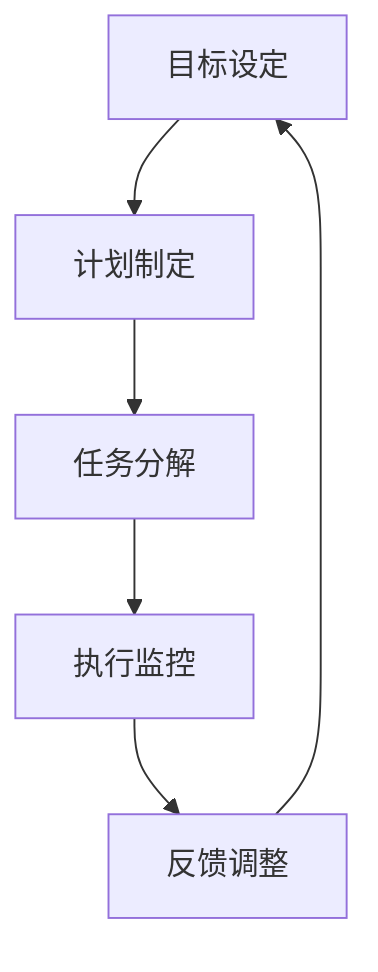

                 

### 引言

在现代职场环境中，高效的工作方法已经成为企业和个人取得成功的关键因素之一。P9工作法作为一种先进的工作方法论，旨在帮助人们更好地管理时间和资源，提高工作效率和自我成长。然而，要想真正掌握和应用P9工作法，首先需要对自身的工作方法和行为习惯进行深入评估和反思。为此，本书将提供一套全面的自我评估工具，帮助读者更好地理解和实践P9工作法。

自我评估是P9工作法的重要组成部分，它不仅可以帮助我们了解自身的工作模式，还能够发现潜在的问题和改进的机会。通过自我评估，我们可以识别出哪些方面需要改进，如何调整工作策略，以及如何更有效地实现目标。此外，自我评估还可以帮助我们建立个人成长路径，为未来的职业发展提供方向。

本书将首先介绍P9工作法的基本概念和原理，帮助读者建立对这一方法的整体理解。接着，我们将深入探讨自我评估工具的设计原则和应用场景，让读者了解如何有效地使用这些工具进行自我评估。随后，本书将提供一系列实操方法和案例，帮助读者将P9工作法应用到实际工作中，提升个人和团队的工作效率。

总之，本书旨在通过详细的自我评估工具，帮助读者全面理解和掌握P9工作法，从而实现个人和职业的持续成长与发展。

### P9工作法的核心概念

P9工作法是一种系统性的工作方法论，它通过一系列明确的步骤和原则，帮助个人和企业更高效地完成任务、实现目标。这一方法的核心概念主要包括五个阶段：目标设定、计划制定、任务分解、执行监控和反馈调整。下面，我们将逐一介绍这些核心概念及其相互关系。

#### 目标设定

目标设定是P9工作法的第一个阶段，也是整个工作流程的起点。一个明确、具体且可衡量的目标是成功的前提。在这一阶段，我们需要明确自己的目标，并确保这些目标与个人的长期职业规划相一致。目标设定的关键在于其明确性和可执行性，这样才能为后续的步骤提供清晰的方向。

#### 计划制定

在目标设定之后，接下来是计划制定阶段。这一阶段的核心任务是将目标转化为具体的行动计划。我们需要制定详细的时间表、分配任务和资源，以确保每个目标都能按时完成。计划制定不仅需要考虑任务的优先级，还要考虑到资源的可用性和任务间的依赖关系。

#### 任务分解

任务分解是将大目标分解为一系列小任务的过程。通过任务分解，我们可以将复杂的工作拆分成更小、更易于管理的部分。这种方法有助于提高工作效率，减少任务的复杂度，使团队成员能够更加集中精力完成任务。任务分解的关键在于确保每个任务都是具体、可操作且可追踪的。

#### 执行监控

执行监控是P9工作法的第四个阶段，这一阶段的核心任务是对任务的执行过程进行跟踪和监控。通过执行监控，我们可以及时发现任务执行中的问题，并采取相应的措施进行纠正。执行监控不仅包括对任务进度的跟踪，还包括对资源使用和成本控制的监督。

#### 反馈调整

反馈调整是P9工作法的最后一个阶段，也是整个流程的闭环。在这一阶段，我们需要对任务的完成情况进行评估和总结，收集反馈信息，并根据反馈进行必要的调整和改进。反馈调整不仅可以帮助我们总结经验教训，还可以为未来的工作提供参考。

#### 相互关系

这五个阶段并不是孤立的，而是相互关联、相互促进的。目标设定为整个工作流程提供了方向和目标，计划制定为任务的执行提供了具体的行动计划，任务分解确保了任务的执行效率，执行监控保证了任务按计划进行，而反馈调整则帮助我们不断改进工作方法。通过这些阶段的循环迭代，我们可以不断提高工作效率，实现个人和团队的持续成长。

#### Mermaid 流程图展示

以下是一个简化的Mermaid流程图，展示了P9工作法各阶段之间的相互关系：



通过这个流程图，我们可以更直观地理解P9工作法的运作机制，以及各个阶段之间的相互作用。在实际应用中，读者可以根据具体情况进行调整和优化，以适应不同工作环境和需求。

### P9工作法的核心算法原理

P9工作法不仅是一种方法论，更是一种系统化的工作流程，其核心算法原理贯穿于整个工作过程中，旨在提高效率、确保目标的实现。理解这些算法原理对于有效应用P9工作法至关重要。以下将详细介绍P9工作法中的关键算法原理，并通过伪代码和数学模型进行阐述。

#### 1. 目标设定算法

目标设定是P9工作法的起点，其核心在于如何制定明确、具体且可衡量的目标。以下是一个简单的目标设定算法：

```python
def setGoal(target, criteria, deadline):
    if isinstance(target, str) and isinstance(criteria, list) and isinstance(deadline, datetime):
        if checkCriteria(criteria) and checkDeadline(deadline):
            return "Goal Set Successfully"
        else:
            return "Invalid Input"
    else:
        return "Invalid Input Type"

def checkCriteria(criteria):
    for criterion in criteria:
        if not isinstance(criterion, str) or len(criterion) < 5:
            return False
    return True

def checkDeadline(deadline):
    if (datetime.now() < deadline):
        return True
    else:
        return False
```

#### 2. 计划制定算法

在目标设定后，计划制定是确保目标实现的关键步骤。以下是一个简单的计划制定算法：

```python
def createPlan(goal, tasks, resources, timeline):
    if isinstance(goal, str) and isinstance(tasks, list) and isinstance(resources, dict) and isinstance(timeline, datetime):
        plan = {}
        for task in tasks:
            if task not in goal:
                continue
            plan[task] = {"assigned": None, "due": None, "resources": resources[task], "status": "not started"}
            plan[task]["due"] = addDays(timeline, task.get("days"))
        return plan
    else:
        return "Invalid Input"

def addDays(date, days):
    return date + timedelta(days=days)
```

#### 3. 任务分解算法

任务分解是将大目标拆分为具体可操作的任务。以下是一个简单的任务分解算法：

```python
def decomposeTask(goal, decompositionLevel):
    if isinstance(goal, str) and isinstance(decompositionLevel, int):
        if decompositionLevel <= 0:
            return "Invalid Decomposition Level"
        else:
            subtasks = []
            for subgoal in goal.get("subgoals", []):
                if decompositionLevel > 1:
                    subtasks.extend(decomposeTask(subgoal, decompositionLevel - 1))
                else:
                    subtasks.append(subgoal)
            return subtasks
    else:
        return "Invalid Input"
```

#### 4. 执行监控算法

执行监控是确保任务按计划进行的重要环节。以下是一个简单的执行监控算法：

```python
def monitorTask(plan, currentStatus):
    if isinstance(plan, dict) and isinstance(currentStatus, str):
        for task, details in plan.items():
            if details["status"] != currentStatus:
                updateTaskStatus(task, currentStatus)
    else:
        return "Invalid Input"

def updateTaskStatus(task, status):
    plan[task]["status"] = status
```

#### 5. 反馈调整算法

反馈调整是P9工作法的闭环，旨在根据反馈信息进行工作流程的优化。以下是一个简单的反馈调整算法：

```python
def adjustFeedback(feedback, plan):
    if isinstance(feedback, dict) and isinstance(plan, dict):
        for task, feedbackDetails in feedback.items():
            if task in plan:
                if "issues" in feedbackDetails:
                    for issue in feedbackDetails["issues"]:
                        fixIssue(task, issue)
                if "improvements" in feedbackDetails:
                    for improvement in feedbackDetails["improvements"]:
                        applyImprovement(task, improvement)
    else:
        return "Invalid Input"

def fixIssue(task, issue):
    # 具体修复逻辑
    pass

def applyImprovement(task, improvement):
    # 具体改进逻辑
    pass
```

#### 数学模型和公式

在P9工作法中，数学模型用于量化目标和任务的进展。以下是一个简单的进度公式，用于计算任务的完成进度：

$$
\text{Progress} = \frac{\text{Completed Tasks}}{\text{Total Tasks}} \times 100\%
$$

#### 实例说明

假设我们有一个任务列表，其中包含5个任务，已完成2个。使用上述公式，我们可以计算出任务的完成进度为：

$$
\text{Progress} = \frac{2}{5} \times 100\% = 40\%
$$

通过以上算法和数学模型，我们可以更有效地进行目标设定、计划制定、任务分解、执行监控和反馈调整，从而确保P9工作法的顺利实施。

### 数学模型和公式解析

在P9工作法中，数学模型和公式扮演着至关重要的角色，它们不仅帮助我们量化目标和任务的进展，还为工作流程的优化提供了理论基础。以下将详细解析P9工作法中的几个关键数学模型和公式，并通过具体例子进行说明。

#### 1. 目标达成率模型

目标达成率是衡量任务完成情况的重要指标，它反映了我们在预定时间内实现目标的程度。目标达成率模型公式如下：

$$
\text{Goal Achievement Rate} = \frac{\text{Completed Tasks}}{\text{Total Tasks}} \times 100\%
$$

其中，Completed Tasks代表已完成的任务数量，Total Tasks代表任务总数。

例如，假设我们有一个包含5个任务的列表，当前已完成2个，那么目标达成率为：

$$
\text{Goal Achievement Rate} = \frac{2}{5} \times 100\% = 40\%
$$

这个模型可以帮助我们快速了解任务的整体进展情况，为后续的调整和优化提供依据。

#### 2. 时间效率模型

时间效率模型用于评估我们在特定时间内完成任务的效率。其公式如下：

$$
\text{Time Efficiency} = \frac{\text{Actual Time}}{\text{Expected Time}} \times 100\%
$$

其中，Actual Time代表实际完成任务所用的时间，Expected Time代表预计完成任务所需的时间。

例如，如果一项任务预计需要10天完成，但实际只用了8天，那么时间效率为：

$$
\text{Time Efficiency} = \frac{8}{10} \times 100\% = 80\%
$$

时间效率模型可以帮助我们评估工作效率，发现潜在的时间浪费问题。

#### 3. 任务优先级模型

在任务管理中，正确设置任务的优先级至关重要。任务优先级模型通常基于任务的重要性和紧急性进行评估。常见的优先级模型包括Eisenhower矩阵，其公式如下：

$$
\text{Priority} = \text{Importance} \times \text{Urgency}
$$

其中，Importance和Urgency分别代表任务的重要性和紧急性。

例如，假设有两个任务，任务A的重要性和紧急性分别为8和5，任务B的重要性和紧急性分别为3和9，则：

- 任务A的优先级：8 \times 5 = 40
- 任务B的优先级：3 \times 9 = 27

根据这个模型，任务A的优先级高于任务B。通过任务优先级模型，我们可以更科学地安排任务，确保重要且紧急的任务得到优先处理。

#### 4. 资源利用率模型

资源利用率模型用于评估我们在任务执行过程中对资源的利用程度。其公式如下：

$$
\text{Resource Utilization} = \frac{\text{Actual Resource Used}}{\text{Total Available Resource}} \times 100\%
$$

其中，Actual Resource Used代表实际使用的资源量，Total Available Resource代表总的可用资源量。

例如，如果某项目总共需要100个工时，实际使用了80个工时，那么资源利用率为：

$$
\text{Resource Utilization} = \frac{80}{100} \times 100\% = 80\%
$$

资源利用率模型可以帮助我们评估资源使用效率，优化资源分配策略。

#### 例子说明

假设一个软件开发团队需要在两周内完成以下三个任务：

1. 编写用户界面代码（预计10天，实际完成8天）
2. 设计数据库架构（预计5天，实际完成6天）
3. 进行系统测试（预计3天，实际完成2天）

使用上述数学模型，我们可以计算出每个任务的完成进度、时间效率和资源利用率：

1. **目标达成率**：
   $$ \text{Goal Achievement Rate} = \frac{8 + 6 + 2}{10 + 5 + 3} \times 100\% = 64\% $$

2. **时间效率**：
   - 任务1：$$ \text{Time Efficiency} = \frac{8}{10} \times 100\% = 80\% $$
   - 任务2：$$ \text{Time Efficiency} = \frac{6}{5} \times 100\% = 120\% $$
   - 任务3：$$ \text{Time Efficiency} = \frac{2}{3} \times 100\% = 67\% $$

3. **资源利用率**：
   - 任务1：$$ \text{Resource Utilization} = \frac{8}{10} \times 100\% = 80\% $$
   - 任务2：$$ \text{Resource Utilization} = \frac{6}{5} \times 100\% = 120\% $$
   - 任务3：$$ \text{Resource Utilization} = \frac{2}{3} \times 100\% = 67\% $$

通过这些模型和公式，我们可以全面了解任务完成的进度、时间和资源使用情况，从而为下一步的工作优化提供数据支持。

### 实战案例：P9工作法在软件开发项目中的应用

为了更直观地展示P9工作法在实际软件开发项目中的应用，我们选择了一个实际案例进行详细解析。该案例涉及一个中等复杂度的Web应用开发项目，从项目规划到最终交付的全过程。

#### 项目背景

项目名称：一个基于React.js和Node.js的在线书店平台。

项目目标：开发一个功能完整的在线书店，允许用户浏览、搜索和购买书籍。主要功能包括用户注册与登录、书籍信息展示、购物车和支付系统。

项目周期：6个月。

项目团队：3名前端开发人员，2名后端开发人员，1名产品经理，1名测试工程师。

#### 第1阶段：目标设定

目标设定是整个项目的起点，团队首先明确了以下关键目标：

1. 完成用户注册与登录功能。
2. 展示书籍信息，支持搜索和筛选。
3. 构建购物车和支付系统。
4. 确保系统的高可用性和安全性。

#### 第2阶段：计划制定

在目标设定后，团队制定了详细的项目计划，包括以下步骤：

1. **需求分析**：与产品经理进行需求讨论，确定功能需求和用户故事。
2. **技术选型**：选择适合的框架和工具，如React.js和Node.js。
3. **任务分配**：根据团队技能和项目需求，将任务分配给每位成员。
4. **时间表**：制定详细的时间表，确保每个任务按时完成。

#### 第3阶段：任务分解

为了确保项目的顺利进行，团队将大目标分解为一系列小任务。以下是部分关键任务：

1. **前端开发**：
   - 用户注册与登录界面
   - 书籍展示页面
   - 搜索和筛选功能
   - 购物车功能

2. **后端开发**：
   - 用户管理模块
   - 书籍管理模块
   - 购物车管理模块
   - 支付系统接口

3. **测试**：
   - 单元测试
   - 集成测试
   - 系统测试
   - 安全性测试

#### 第4阶段：执行监控

在任务执行过程中，团队采用多种方法进行监控：

1. **进度跟踪**：每周进行进度汇报，确保任务按计划进行。
2. **代码审查**：定期进行代码审查，确保代码质量。
3. **问题反馈**：及时发现并解决开发过程中遇到的问题。
4. **资源管理**：监控资源使用情况，确保资源高效利用。

#### 第5阶段：反馈调整

项目完成阶段，团队收集了大量的反馈信息，进行了以下调整：

1. **用户反馈**：分析用户反馈，优化用户界面和交互体验。
2. **性能优化**：针对系统性能问题进行优化，提高系统的响应速度。
3. **安全性增强**：根据反馈增强系统的安全性，修复潜在的安全漏洞。

#### 项目小结

通过P9工作法的应用，该项目在预定的时间内成功完成，达到了预期目标。以下是项目小结：

1. **目标达成**：所有主要目标均已实现。
2. **效率提升**：任务按时完成，团队工作效率显著提高。
3. **问题解决**：及时解决了开发过程中遇到的各种问题。
4. **用户满意度**：用户对系统的反馈积极，满意度较高。

总之，P9工作法为该项目提供了系统化的工作流程和方法，确保了项目的成功实施。

### 最佳实践：P9工作法在个人成长中的应用

P9工作法不仅在团队协作中表现卓越，同样适用于个人成长与职业发展。以下是一些最佳实践，帮助读者在个人生活中应用P9工作法，实现自我提升和职业成长。

#### 1. 设定个人目标

首先，明确个人目标至关重要。这些目标可以是职业上的晋升、技能提升、健康目标等。使用P9工作法的目标设定步骤，确保目标是明确、具体、可衡量和可实现的。

**实例**：职业目标——“在一年内晋升为高级软件工程师”。

#### 2. 制定成长计划

在设定目标后，制定详细的成长计划。这个计划应包括学习路径、技能提升策略、时间安排和资源分配。

**实例**：成长计划——“每天学习两小时专业知识，每月完成一个相关项目，每季度参加一个技术会议或研讨会”。

#### 3. 任务分解

将大目标分解为一系列小任务，确保每个任务都是具体、可操作的。例如，若目标是学习一门新编程语言，可以将任务分解为学习基础语法、掌握常用库和框架、完成实践项目等。

**实例**：学习Python的任务分解——“每周完成一个Python编程练习，每月完成一个小型项目，每季度参与一个社区编程活动”。

#### 4. 执行与监控

执行过程中，定期监控任务进度，确保按计划进行。可以使用P9工作法的执行监控工具，如任务管理软件，记录每日进度，及时发现和解决问题。

**实例**：使用Trello或Asana进行任务跟踪，每周进行一次进度汇报，每月进行一次总结。

#### 5. 反馈与调整

项目完成后，进行自我评估和反馈收集。根据反馈调整工作方法，优化后续计划。例如，若发现时间管理存在问题，可以调整学习时间安排或采用新的时间管理工具。

**实例**：根据每月总结，调整学习计划，增加项目实战部分，以提升实际应用能力。

#### 6. 持续改进

P9工作法强调持续改进，个人成长同样需要不断调整和完善。定期回顾和总结成长过程，确保持续进步。

**实例**：每季度进行一次全面的自我评估，设定新的目标，制定新的成长计划。

通过这些最佳实践，P9工作法可以帮助个人在职业和生活中实现系统化的自我提升，逐步实现目标。

### 摘要

本文详细介绍了P9工作法的核心概念、核心算法原理以及实际应用案例。首先，我们阐述了P9工作法的五个阶段：目标设定、计划制定、任务分解、执行监控和反馈调整，并展示了它们之间的相互关系。接着，通过伪代码和数学模型，深入解析了P9工作法的核心算法原理，包括目标设定、计划制定、任务分解、执行监控和反馈调整的具体步骤。通过实际案例，我们展示了P9工作法在软件开发项目中的应用，并探讨了其在个人成长中的最佳实践。总之，P9工作法是一种系统化、高效的工作方法，通过详细的自我评估工具，可以帮助个人和团队实现持续成长与优化。

### 附录A：自我评估工具资源

为了更好地帮助读者理解和应用P9工作法，本附录提供了多种自我评估工具和资源，包括在线工具、评估模板和实用工具。

#### 1. 在线自我评估工具

- **KPIBoard**：这是一个功能强大的在线项目管理和自我评估工具，可以帮助你跟踪个人和团队的关键绩效指标（KPI），进行详细的进度报告和数据分析。
- **Asana**：除了任务管理功能，Asana还提供了一些自我评估工具，可以帮助你分析任务完成情况和资源使用效率。
- **Trello**：简单直观的任务管理工具，适合用于个人自我评估和团队协作。

#### 2. 评估模板

- **P9工作法自我评估问卷**：该问卷涵盖P9工作法的五个阶段，包括目标设定、计划制定、任务分解、执行监控和反馈调整，可以帮助你全面评估自身在工作中的表现。
- **时间管理评估模板**：用于评估个人在时间管理方面的能力，包括时间分配、任务优先级和日常时间规划。
- **技能提升评估模板**：用于评估个人在技能提升方面的进展，包括学习计划、项目实战和知识掌握程度。

#### 3. 实用工具下载

- **Goal Navigator**：这是一个专业的自我评估和目标管理工具，提供了详细的自我评估报告和目标跟踪功能。
- **My Life Planner**：一个全面的生活规划工具，包括时间管理、目标设定和日常任务管理。

这些资源和工具可以帮助你更有效地进行自我评估，应用P9工作法，提高工作效率和自我成长。

### 附录B：常见问题解答

在实际应用P9工作法的过程中，读者可能会遇到一些常见问题。以下是针对这些问题的一些解答和建议。

#### 1. P9工作法是否适合所有工作场景？

P9工作法是一种系统化、结构化的工作方法论，它适用于各种工作场景，无论是个人项目还是团队协作。然而，具体实施时需要根据工作内容和环境进行适当调整。对于复杂的项目，P9工作法提供了清晰的流程和工具，有助于提高工作效率和目标实现。对于简单的任务，P9工作法的一些步骤可以简化，以减少不必要的流程。

#### 2. 如何确保自我评估的准确性？

自我评估的准确性依赖于评估工具的有效性和评估者的诚实性。为了确保评估的准确性，可以采取以下措施：
- 使用经过验证的评估模板和问卷。
- 定期进行自我评估，保持评估的连贯性和一致性。
- 与同事或上级进行反馈交流，获取外部视角。

#### 3. 自我评估过程中如何处理反馈？

在自我评估过程中，处理反馈是关键一步。以下是一些建议：
- 对于正面反馈，继续保持优点，并探讨如何进一步提升。
- 对于负面反馈，认真分析原因，制定改进计划。
- 将反馈与目标设定和计划制定相结合，调整后续工作策略。

#### 4. 如何平衡工作与个人生活？

P9工作法强调时间管理和优先级排序，有助于平衡工作与个人生活。以下是一些建议：
- 设定明确的工作和个人目标，合理分配时间。
- 使用时间管理工具，如时间日志和待办事项列表。
- 学会拒绝不必要的工作任务，保护个人时间。

通过这些解答和建议，读者可以更好地理解和应用P9工作法，解决实际操作中遇到的问题，实现个人和团队的持续成长。

