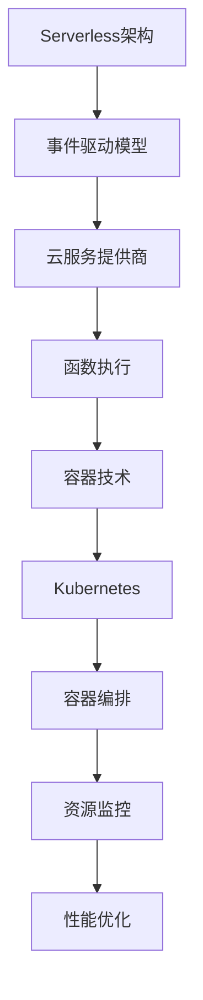

                 

### 文章标题

《Serverless容器技术探索》

关键词：Serverless，容器技术，微服务，云计算，Kubernetes，性能优化

摘要：本文深入探讨了Serverless容器技术的核心概念、原理和实践应用。通过分析Serverless与容器技术的协同作用，我们了解了它们在微服务架构和云计算环境中的重要作用。本文还提供了优化与调优、案例分析以及未来展望，为读者提供了全面的Serverless容器技术指南。

### 目录大纲

1. **引言**
   - **背景介绍**
   - **研究意义**

2. **Serverless与容器技术基础概念**
   - **Serverless概念**
   - **容器技术概念**
   - **Serverless与容器技术的关系**
   - **Mermaid流程图：Serverless与容器技术架构**

3. **Serverless技术原理**
   - **无服务器架构**
   - **事件驱动模型**
   - **Serverless平台**
   - **伪代码：函数执行流程**

4. **容器技术原理**
   - **容器化技术**
   - **Docker核心概念**
   - **Kubernetes核心概念**
   - **伪代码：容器编排流程**

5. **Serverless与容器技术的协同作用**
   - **无服务器与容器结合的优势**
   - **微服务架构**
   - **实践应用案例**

6. **优化与调优**
   - **资源监控**
   - **性能优化**
   - **安全性优化**

7. **案例分析**
   - **项目背景**
   - **实现细节**
   - **挑战与解决方案**

8. **未来展望**
   - **发展趋势**
   - **挑战与机遇**

9. **总结**

### 引言

#### 背景介绍

在数字化转型的浪潮中，云计算已经成为企业提升业务效率和灵活性的关键驱动力。随着微服务架构和DevOps文化的兴起，开发者和运维人员面临着日益复杂的系统部署和运维挑战。为了应对这些挑战，Serverless和容器技术应运而生，它们在简化开发和部署流程、提高系统可扩展性和弹性方面发挥着重要作用。

Serverless是一种计算服务模型，它允许开发人员无需管理底层硬件或虚拟机，只需关注应用程序代码的编写和部署。这种服务模型由云服务提供商管理，能够根据实际的工作负载自动扩展资源。容器技术，如Docker和Kubernetes，则提供了一种轻量级的虚拟化解决方案，使开发者能够将应用程序及其依赖环境打包到一个独立的容器中，实现“一次编写，到处运行”。

本文的研究意义在于深入探讨Serverless和容器技术的核心概念、原理和实践应用，帮助读者了解它们在微服务架构和云计算环境中的协同作用。通过本文的讲解，读者将能够掌握这些技术的基本原理，学会如何在实际项目中运用，并了解未来发展的趋势和挑战。

### Serverless与容器技术基础概念

#### Serverless概念

Serverless是一种基于云的服务模型，开发者无需管理服务器或虚拟机，只需专注于编写和部署应用程序代码。这种模型由云服务提供商管理基础设施，提供按需计算资源，并根据实际的工作负载自动扩展或缩减资源。Serverless架构通常基于事件驱动模型，应用程序通过触发器响应外部事件，从而执行相应的操作。

Serverless技术的主要优点包括：

- **低成本**：由于无需管理硬件和虚拟机，开发者可以专注于业务逻辑，降低运维成本。
- **高可扩展性**：云服务提供商能够根据需求自动扩展计算资源，确保应用程序在高并发场景下稳定运行。
- **快速部署**：Serverless架构简化了部署流程，缩短了从开发到上线的时间。

常见的Serverless平台包括Amazon Web Services (AWS) Lambda、Microsoft Azure Functions、Google Cloud Functions等。

#### 容器技术概念

容器技术是一种轻量级的虚拟化解决方案，它允许开发者在独立的环境中运行应用程序及其依赖项。与传统的虚拟机相比，容器在资源利用率和性能上具有显著优势。Docker是最流行的容器技术之一，它提供了一个轻量级、可移植的容器平台，使得开发人员可以将应用程序及其运行环境打包成一个容器镜像，实现“一次编写，到处运行”。

Docker的核心概念包括：

- **容器镜像**：包含了应用程序及其依赖环境的静态文件系统。
- **容器**：基于容器镜像运行的应用程序实例。
- **Docker引擎**：负责容器镜像的构建、运行和管理。

Kubernetes是一个开源的容器编排系统，用于自动化容器的部署、扩展和管理。它提供了一个平台，使开发者和运维人员可以轻松地管理跨多个主机运行的多容器应用程序。Kubernetes的核心概念包括：

- **Pod**：Kubernetes的基本工作单元，可以包含一个或多个容器。
- **服务**：定义了如何访问容器，可以将服务映射到特定的IP地址或域名。
- **部署**：用于管理和更新应用程序的副本数量。

#### Serverless与容器技术的关系

Serverless和容器技术在微服务架构和云计算环境中发挥着协同作用。Serverless架构通过事件驱动模型和自动扩展特性，为微服务提供了弹性和可扩展性。容器技术则通过封装应用程序及其依赖环境，确保微服务的独立性和可移植性。

以下是Serverless与容器技术之间的关系：

- **无缝集成**：Serverless平台通常支持容器化应用程序的部署，使得开发者可以在无服务器环境中运行容器化应用程序。
- **优化资源利用**：容器技术可以帮助Serverless架构更好地利用资源，通过容器编排系统（如Kubernetes）实现高效的资源管理。
- **增强安全性**：容器技术提供了细粒度的隔离机制，确保应用程序的安全运行。

#### Mermaid流程图：Serverless与容器技术架构

以下是一个Mermaid流程图，展示了Serverless与容器技术的基本架构：



在这个架构中，Serverless架构通过事件驱动模型与云服务提供商交互，触发函数执行。容器技术则通过Kubernetes进行容器编排，实现资源的监控和性能优化。

### Serverless技术原理

#### 无服务器架构

无服务器架构（Serverless Architecture）是一种基于云计算的服务模型，开发者无需管理服务器或虚拟机，只需编写和部署应用程序代码。在无服务器架构中，计算资源由云服务提供商动态分配和调度，根据实际的工作负载自动扩展和缩减。这种架构的主要优点包括：

- **简化运维**：无需管理硬件和虚拟机，降低了运维成本和复杂性。
- **弹性扩展**：根据工作负载自动扩展计算资源，确保应用程序在高并发场景下稳定运行。
- **按需付费**：仅根据实际使用量收费，降低了成本。

无服务器架构的核心组件包括：

- **函数**：无服务器应用程序的基本构建块，用于处理特定的事件或请求。
- **触发器**：触发函数执行的事件源，可以是定时任务、Web请求、数据库更新等。
- **API网关**：用于接收外部请求并转发给相应的函数。
- **云服务提供商**：负责管理基础设施和提供无服务器服务。

#### 事件驱动模型

事件驱动模型（Event-Driven Model）是Serverless架构的核心，它通过事件触发函数的执行。事件可以是系统事件（如定时任务）、用户事件（如Web请求）或应用程序事件（如数据库更新）。事件驱动模型具有以下特点：

- **异步处理**：事件和函数的执行是异步的，多个事件可以并发触发多个函数，提高了系统的并发性和响应能力。
- **弹性伸缩**：根据事件的数量和复杂性，系统可以自动扩展或缩减函数的执行资源。
- **低耦合**：事件和函数之间通常采用消息队列或事件总线进行通信，降低了系统的耦合性。

#### Serverless平台

Serverless平台是提供无服务器服务的云服务提供商，常见的Serverless平台包括：

- **Amazon Web Services (AWS) Lambda**：AWS提供的一种无服务器计算服务，支持多种编程语言，可根据实际工作负载自动扩展资源。
- **Microsoft Azure Functions**：Azure提供的一种无服务器计算服务，支持事件驱动编程，可用于构建Web应用和移动应用。
- **Google Cloud Functions**：Google提供的一种无服务器计算服务，支持Node.js、Python、Go等多种编程语言，与Google Cloud生态系统无缝集成。

#### 伪代码：函数执行流程

以下是一个简单的伪代码，展示了Serverless函数的执行流程：

```python
# 函数执行流程
def handle_event(event, context):
    # 解析事件参数
    event_data = parse_event(event)
    
    # 处理业务逻辑
    result = process_business_logic(event_data)
    
    # 返回结果
    return result
```

在这个伪代码中，`handle_event`函数接收一个事件对象和一个上下文对象。事件对象包含了触发函数的事件数据，上下文对象则提供了函数执行的上下文信息。函数首先解析事件参数，然后处理业务逻辑，最后返回结果。

### 容器技术原理

#### 容器化技术

容器化技术（Containerization）是一种将应用程序及其依赖环境打包到一个独立容器中的技术。容器提供了一个隔离的环境，使应用程序可以独立于宿主机运行，保证了环境的稳定性和可移植性。容器化技术具有以下特点：

- **轻量级**：容器仅包含应用程序和必要依赖，不依赖于宿主机的操作系统，因此启动速度快，资源利用率高。
- **可移植性**：容器可以在不同的操作系统和硬件平台上运行，确保了“一次编写，到处运行”。
- **隔离性**：容器通过命名空间和cgroups等技术实现了资源隔离，保证了应用程序的安全运行。

#### Docker核心概念

Docker是一个流行的开源容器平台，它提供了一种简单、高效的方式将应用程序打包和部署到容器中。Docker的核心概念包括：

- **Docker引擎**：Docker引擎负责构建、运行和管理容器。它通过Dockerfile定义容器的构建过程，通过docker命令管理容器的生命周期。
- **Docker镜像**：Docker镜像是一个静态的文件系统，包含了应用程序和其依赖环境。Docker镜像可以基于其他镜像构建，形成了层叠结构，提高了构建效率。
- **Docker容器**：Docker容器是基于Docker镜像运行的应用程序实例。容器通过Docker引擎管理，具有独立的网络和存储空间。

#### Kubernetes核心概念

Kubernetes是一个开源的容器编排系统，用于自动化容器的部署、扩展和管理。Kubernetes的核心概念包括：

- **Pod**：Pod是Kubernetes中的最小部署单元，可以包含一个或多个容器。Pod提供了容器的调度和管理功能，确保容器在正确的节点上运行。
- **Service**：Service定义了如何访问容器，可以将服务映射到特定的IP地址或域名。Service提供了负载均衡和容器的服务发现功能。
- **Deployment**：Deployment用于管理应用程序的副本数量和更新策略。Deployment确保应用程序在多个容器之间保持一致性和高可用性。

#### 伪代码：容器编排流程

以下是一个简单的伪代码，展示了Kubernetes的容器编排流程：

```python
# 容器编排流程
def deploy_app(deployment_config):
    # 构建Docker镜像
    build_docker_image(deployment_config.image)

    # 创建Kubernetes部署
    create_kubernetes_deployment(deployment_config)

    # 检查部署状态
    check_deployment_status(deployment_config)

    # 返回部署结果
    return "Deployment completed successfully"
```

在这个伪代码中，`deploy_app`函数接收一个部署配置对象。函数首先构建Docker镜像，然后创建Kubernetes部署，并检查部署状态。最后，函数返回部署结果。

### Serverless与容器技术的协同作用

#### 无服务器与容器结合的优势

Serverless和容器技术的结合为开发者提供了许多优势，使他们在构建和部署应用程序时更加灵活和高效。以下是这种结合的主要优势：

1. **弹性伸缩**：结合了Serverless和容器技术的优势，可以根据实际的工作负载自动扩展或缩减资源。在高峰期，系统可以自动增加容器数量，以处理更多的请求；在低谷期，系统可以减少容器数量，降低成本。

2. **高可扩展性**：容器技术提供了细粒度的隔离和资源管理，使开发者可以轻松地部署和管理大量容器。结合Serverless架构的事件驱动模型，可以确保系统在高并发场景下稳定运行。

3. **简化部署**：容器化技术使得应用程序的部署过程更加简单和标准化。通过Docker镜像，开发者可以将应用程序及其依赖环境打包到一个独立的容器中，实现“一次编写，到处运行”。结合Serverless平台，开发者无需关心底层基础设施的运维，只需关注应用程序代码的编写和部署。

4. **提高安全性**：容器技术提供了细粒度的隔离机制，确保应用程序在独立的环境中运行。结合Serverless架构的自动扩展和监控功能，可以更好地保护系统的安全性。

#### 微服务架构

微服务架构（Microservices Architecture）是一种将应用程序分解为多个小型、独立服务的架构风格。每个服务负责处理特定的业务功能，可以通过API进行通信。微服务架构具有以下优点：

1. **模块化**：微服务架构将应用程序分解为多个独立的服务，每个服务可以独立开发和部署。这种模块化使得开发过程更加灵活和高效，降低了系统的复杂度。

2. **可扩展性**：每个微服务都可以独立扩展，根据实际需求增加或减少服务实例的数量。这种弹性伸缩能力确保了系统在高并发场景下的稳定运行。

3. **高可用性**：微服务架构通过部署多个服务实例，提高了系统的可用性。即使某个服务发生故障，其他服务仍然可以正常运行，确保了整个系统的稳定性。

4. **易于维护**：微服务架构使得系统的维护和升级更加简单。由于每个服务都是独立的，可以单独维护和升级，减少了系统停机时间。

#### 实践应用案例

以下是一个实际项目案例，展示了如何使用Serverless和容器技术构建微服务架构：

**项目背景**：

某电子商务公司需要构建一个在线购物平台，包括用户管理、商品管理、订单管理和支付处理等功能。为了确保系统的可扩展性和高可用性，公司决定采用微服务架构，并使用Serverless和容器技术进行部署。

**实现细节**：

1. **用户管理服务**：使用AWS Lambda和DynamoDB构建用户管理服务。Lambda函数负责处理用户注册、登录和权限验证等功能，DynamoDB提供用户数据存储。

2. **商品管理服务**：使用Docker和Kubernetes构建商品管理服务。将商品数据存储在Redis缓存中，以实现快速查询和更新。

3. **订单管理服务**：使用AWS Lambda和RabbitMQ构建订单管理服务。Lambda函数处理订单创建、更新和取消等操作，RabbitMQ用于异步处理订单通知和支付验证。

4. **支付处理服务**：使用容器化技术构建支付处理服务。将支付处理逻辑封装在容器中，并通过API与第三方支付平台进行集成。

**挑战与解决方案**：

1. **服务依赖关系管理**：确保各个微服务之间的依赖关系清晰，使用Docker Compose和Kubernetes ConfigMap/Secrets管理服务配置。

2. **容器编排与监控**：使用Kubernetes进行容器编排，通过Prometheus和Grafana进行监控和告警。

3. **安全性**：对容器和函数进行安全配置，使用AWS IAM角色和Kubernetes RBAC进行权限控制。

通过这个实际案例，我们可以看到Serverless和容器技术在构建微服务架构中的重要作用。结合它们的优势，可以构建高度可扩展、高可用性和易于维护的在线购物平台。

### 优化与调优

#### 资源监控

资源监控是优化Serverless和容器技术的重要环节。通过监控系统的资源使用情况，可以及时发现和解决性能瓶颈，提高系统的稳定性和响应能力。以下是一些常见的资源监控工具和指标：

- **Prometheus**：Prometheus是一个开源的监控解决方案，可以收集和存储系统的指标数据，并通过Grafana进行可视化展示。
- **Grafana**：Grafana是一个开源的数据可视化和监控工具，可以与Prometheus等监控系统集成，提供丰富的图表和告警功能。
- **AWS CloudWatch**：AWS CloudWatch是AWS提供的一款监控服务，可以监控AWS资源的使用情况，并生成告警和指标图表。
- **资源使用率**：监控CPU、内存、磁盘和网络等资源的利用率，及时发现异常情况。
- **响应时间**：监控系统的响应时间，确保在高并发场景下系统仍能快速响应。

#### 性能优化

性能优化是提高Serverless和容器技术系统性能的关键步骤。以下是一些常见的性能优化技巧：

- **缩放策略**：根据实际的工作负载调整函数和容器的缩放策略，确保系统在高峰期有足够的资源处理请求。
- **异步处理**：利用异步处理技术，减少系统的等待时间，提高并发处理能力。
- **缓存策略**：使用缓存技术减少重复计算和数据库访问，提高系统的响应速度。
- **负载均衡**：使用负载均衡器（如AWS ELB、Nginx）分发请求，确保系统负载均衡，避免单点瓶颈。
- **代码优化**：对应用程序代码进行优化，减少计算复杂度和不必要的资源消耗。

#### 安全性优化

安全性优化是确保系统安全运行的重要步骤。以下是一些常见的安全性优化技巧：

- **访问控制**：使用IAM角色和Kubernetes RBAC进行访问控制，限制对系统和资源的访问权限。
- **加密传输**：使用HTTPS协议加密数据传输，防止数据在传输过程中被窃取或篡改。
- **安全审计**：定期进行安全审计，检查系统的配置和操作记录，及时发现和修复安全漏洞。
- **漏洞扫描**：使用漏洞扫描工具（如OWASP ZAP、Nessus）扫描系统和应用程序，发现和修复潜在的安全漏洞。
- **日志管理**：启用日志记录功能，收集系统的操作日志和错误日志，方便后续分析和排查问题。

### 案例分析

#### 项目背景

某电子商务平台需要处理大量的用户请求和商品交易，为了确保系统的性能和稳定性，公司决定采用Serverless和容器技术进行部署。该项目涉及用户管理、商品管理、订单管理和支付处理等多个微服务。

#### 实现细节

1. **用户管理服务**：使用AWS Lambda和Amazon DynamoDB构建用户管理服务。Lambda函数处理用户注册、登录和权限验证等功能，DynamoDB用于存储用户数据。

2. **商品管理服务**：使用Docker和Kubernetes构建商品管理服务。商品数据存储在Redis缓存中，以实现快速查询和更新。

3. **订单管理服务**：使用AWS Lambda和RabbitMQ构建订单管理服务。Lambda函数处理订单创建、更新和取消等操作，RabbitMQ用于异步处理订单通知和支付验证。

4. **支付处理服务**：使用容器化技术构建支付处理服务。将支付处理逻辑封装在容器中，并通过API与第三方支付平台进行集成。

#### 挑战与解决方案

1. **服务依赖关系管理**：确保各个微服务之间的依赖关系清晰，使用Docker Compose和Kubernetes ConfigMap/Secrets管理服务配置。

2. **容器编排与监控**：使用Kubernetes进行容器编排，通过Prometheus和Grafana进行监控和告警。

3. **安全性**：对容器和函数进行安全配置，使用AWS IAM角色和Kubernetes RBAC进行权限控制。

#### 详细讲解

在这个项目中，我们采用了Serverless和容器技术的优势，构建了一个高度可扩展、高可用性和易于维护的电子商务平台。以下是该项目的一些关键细节：

1. **架构设计**：项目采用微服务架构，将各个功能模块分解为独立的微服务，每个微服务负责处理特定的业务功能。通过API网关接收外部请求，并将请求转发给相应的微服务。

2. **容器编排**：使用Kubernetes进行容器编排，实现了自动化部署、扩展和管理。通过部署配置文件（如Dockerfile和Kubernetes Deployment）定义容器的构建和部署过程。

3. **函数执行**：使用AWS Lambda处理用户请求和订单操作。Lambda函数通过事件驱动模型自动执行，根据实际工作负载自动扩展资源。

4. **缓存与数据库**：商品数据存储在Redis缓存中，以实现快速查询和更新。用户数据存储在Amazon DynamoDB中，提供了高可用性和持久化存储。

5. **监控与告警**：通过Prometheus和Grafana进行系统监控和告警。Prometheus负责收集和存储系统的指标数据，Grafana提供可视化展示和告警功能。

#### 项目小结

通过这个项目，我们展示了如何结合Serverless和容器技术构建一个高性能、高可用性和易于维护的电子商务平台。项目中的挑战包括服务依赖关系管理、容器编排与监控以及安全性配置。通过采用最佳实践和优化技巧，我们成功解决了这些挑战，实现了项目的目标。

### 未来展望

#### 发展趋势

Serverless和容器技术在过去几年中取得了显著的发展，未来仍将保持快速增长。以下是一些未来的发展趋势：

1. **混合云和多云环境**：随着企业对云计算的依赖加深，混合云和多云环境将成为主流。Serverless和容器技术将更好地支持这些复杂的环境，提供灵活、高效的解决方案。

2. **自动化与智能化**：人工智能和机器学习技术的应用将进一步提升Serverless和容器技术的自动化水平。通过智能调度和资源管理，系统将能够更准确地预测和满足工作负载需求。

3. **边缘计算**：随着物联网和5G技术的发展，边缘计算将成为重要的计算趋势。Serverless和容器技术将在边缘计算环境中发挥关键作用，提供高效、低延迟的计算服务。

4. **多租户架构**：为了提高资源利用率和降低成本，多租户架构将在Serverless和容器技术中变得更加普及。通过多租户架构，企业可以在同一个基础设施上为多个应用程序提供隔离的运行环境。

#### 挑战与机遇

尽管Serverless和容器技术有着广泛的应用前景，但仍然面临一些挑战：

1. **安全性**：随着无服务器和容器技术的普及，系统安全性成为一个重要问题。需要进一步研究和开发安全机制，确保系统的可靠性和数据保护。

2. **性能优化**：在高度动态的环境中，如何优化Serverless和容器技术的性能仍然是一个挑战。需要持续研究和改进资源调度和负载均衡策略，提高系统的响应速度和处理能力。

3. **标准化**：尽管已有一些标准和规范（如Kubernetes），但Serverless和容器技术的标准化工作仍需进一步加强。制定统一的规范和标准将有助于提高技术的可移植性和互操作性。

4. **人才缺口**：Serverless和容器技术需要专业的人才进行开发和运维。随着技术的不断发展，人才缺口将进一步扩大。需要加强教育和培训，培养更多的专业人才。

### 总结

本文深入探讨了Serverless和容器技术的核心概念、原理和实践应用。通过分析Serverless与容器技术的协同作用，我们了解了它们在微服务架构和云计算环境中的重要作用。本文还提供了优化与调优、案例分析和未来展望，为读者提供了全面的Serverless容器技术指南。

随着云计算和数字化转型的不断推进，Serverless和容器技术将继续发展，为企业和开发者带来更多创新和机遇。本文旨在为读者提供基础知识和实践指导，帮助他们在实际项目中运用这些技术，构建高效、可扩展和安全的系统。

### 作者信息

作者：AI天才研究院/AI Genius Institute & 禅与计算机程序设计艺术 /Zen And The Art of Computer Programming

### 附录

#### A.1 Serverless与容器技术资源

- **官方文档**：
  - AWS Lambda：https://docs.aws.amazon.com/lambda/latest/dg/
  - Azure Functions：https://docs.microsoft.com/en-us/azure/azure-functions/
  - Google Cloud Functions：https://cloud.google.com/functions/docs/
  - Docker：https://docs.docker.com/
  - Kubernetes：https://kubernetes.io/docs/

- **技术博客**：
  - AWS Blog：https://aws.amazon.com/blogs/aws/
  - Azure Blog：https://blog.azure.com/
  - Google Cloud Blog：https://cloud.google.com/blog/

- **开源项目**：
  - Kubernetes：https://github.com/kubernetes/kubernetes
  - Docker：https://github.com/moby/moby

#### A.2 深度学习框架对比

- **TensorFlow**：https://www.tensorflow.org/
- **PyTorch**：https://pytorch.org/
- **MXNet**：https://mxnet.io/
- **Caffe**：https://github.com/BVLC/caffe

#### A.3 实际项目代码示例

以下是一个简单的Dockerfile和Kubernetes Deployment配置文件的示例：

**Dockerfile**：

```
# 使用官方Python镜像作为基础
FROM python:3.8

# 设置工作目录
WORKDIR /app

# 将当前目录（包含应用程序代码）复制到容器中
COPY . .

# 安装依赖项
RUN pip install -r requirements.txt

# 暴露容器的端口
EXPOSE 8080

# 运行应用程序
CMD ["python", "app.py"]
```

**Kubernetes Deployment**：

```
apiVersion: apps/v1
kind: Deployment
metadata:
  name: my-app
spec:
  replicas: 3
  selector:
    matchLabels:
      app: my-app
  template:
    metadata:
      labels:
        app: my-app
    spec:
      containers:
      - name: my-app
        image: my-app:latest
        ports:
        - containerPort: 8080
```

这些代码示例可以帮助读者更好地理解Docker和Kubernetes的基本用法。在实际项目中，可以根据具体需求进行调整和扩展。

