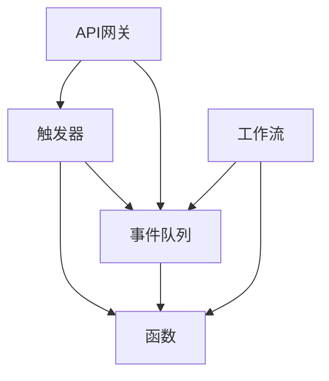

                 

### 文章标题

# Serverless应用开发：无服务器架构的设计模式

### 关键词

- Serverless架构
- 无服务器计算
- 事件驱动
- 云函数
- 设计模式

### 摘要

本文深入探讨Serverless架构在应用开发中的应用及其设计模式。通过详细解析Serverless的基本概念、架构设计模式和实际项目实施，读者将全面了解Serverless技术的核心原理和实践方法。文章旨在为开发者提供一套完整的Serverless应用开发指南，帮助其在云计算环境中实现高效、灵活且可扩展的应用解决方案。

## 引言

Serverless架构，又称为无服务器架构，是一种云计算服务模型，它使得开发人员无需管理服务器即可构建和运行应用程序。这种模式的出现，主要是为了解决传统云计算中服务器管理的复杂性，以及提高开发和部署的效率。Serverless架构的核心思想是让云计算平台自动处理底层基础设施的管理，包括服务器的部署、扩展和监控，从而让开发者能够专注于业务逻辑的实现。

Serverless架构的起源可以追溯到2011年，亚马逊推出了AWS Lambda，这是业界第一个大规模商用的Serverless服务。随后，谷歌云、微软Azure等主要云服务提供商也相继推出了自己的Serverless服务。随着技术的成熟和应用的普及，Serverless架构逐渐成为现代云计算领域的一个重要趋势。

Serverless架构的主要优点包括：

1. **高可扩展性**：Serverless架构能够自动根据请求量进行水平扩展，无需手动配置服务器。
2. **低成本**：开发者只需为实际使用资源付费，无需为闲置资源付费。
3. **简化运维**：服务器管理任务由云服务提供商自动完成，降低了运维成本。
4. **灵活性和敏捷性**：开发者可以快速部署和迭代应用，缩短开发周期。

本文将分为以下几个部分进行详细探讨：

1. **Serverless架构的基本概念**：介绍Serverless的核心原理、服务类型及事件驱动架构。
2. **Serverless设计模式**：解析API网关、工作流和消息队列等设计模式，并详细说明其实现细节。
3. **项目实战**：通过实际案例展示如何搭建Serverless应用环境，实现具体项目。
4. **最佳实践**：总结Serverless应用开发中的常见问题和最佳实践。

通过本文的阅读，读者将能够全面掌握Serverless架构的应用方法，并在实际项目中成功应用这一技术。

## Serverless架构的基本概念

### 核心原理

Serverless架构的核心在于“无服务器”的理念，即开发者无需关心底层服务器资源的配置和管理。在传统的云计算模型中，开发者需要负责购买服务器、配置操作系统、安装应用程序、设置防火墙等繁琐的工作。而在Serverless架构中，这些底层操作都被云服务提供商自动处理，开发者只需专注于编写业务逻辑代码。

Serverless架构的工作流程如下：

1. **事件触发**：当外部事件（如HTTP请求、定时任务、文件上传等）发生时，事件会被传递到Serverless服务。
2. **函数执行**：Serverless服务根据配置自动启动相应的函数实例，执行业务逻辑。
3. **资源释放**：函数执行完成后，实例会被自动释放，开发者无需关心实例的管理。

### 服务类型

Serverless架构包括多种服务类型，其中最常见的有：

- **云函数**（Cloud Functions）：这是一种简单的Serverless服务，开发者可以编写代码并部署到云端，无需关心底层基础设施。典型的云函数服务包括AWS Lambda、Azure Functions和Google Cloud Functions。
- **事件队列**（Event Queue）：用于处理大量事件的一种服务，例如Amazon SQS（Simple Queue Service）。事件队列可以确保事件按顺序处理，提供高可用性和持久性。
- **API网关**（API Gateway）：用于接收外部请求并转发到相应的函数或服务。API网关提供了一种统一的方式来管理API接口，支持多种协议和格式。
- **工作流服务**（Workflow Service）：用于自动化处理一系列任务，例如AWS Step Functions。工作流服务可以编排多个函数或服务，形成复杂的业务流程。
- **前端托管**（Frontend Hosting）：用于托管静态网站或前端应用程序，如AWS S3、Netlify和Vercel。

### 事件驱动架构

事件驱动架构是Serverless架构的核心原理之一。在事件驱动架构中，应用程序的执行是由外部事件触发的，而不是由固定的时间表或用户交互触发的。这种模式具有以下优点：

1. **高可用性**：由于函数的执行是基于事件触发的，因此可以确保系统在处理高并发请求时依然能够保持稳定。
2. **异步处理**：事件驱动架构支持异步处理，多个事件可以并行处理，提高了系统的吞吐量。
3. **弹性伸缩**：根据事件的数量和频率，系统可以自动调整资源，确保在高负载情况下依然能够高效运行。

### 核心概念与联系

在深入理解Serverless架构时，需要掌握以下几个核心概念：

1. **函数（Function）**：函数是Serverless架构中的基本计算单元，用于执行特定的任务。函数可以是同步的或异步的，支持多种编程语言。
2. **触发器（Trigger）**：触发器是启动函数的事件源，可以是外部事件（如HTTP请求、文件上传）或内部事件（如定时任务）。
3. **事件队列（Event Queue）**：事件队列用于存储和管理触发器生成的待处理事件，确保事件按顺序处理。
4. **API网关（API Gateway）**：API网关是应用程序的前端接口，用于接收和响应外部请求。API网关可以处理多种协议（如HTTP、WebSocket）和内容类型（如JSON、XML）。
5. **工作流（Workflow）**：工作流是一系列任务的有序集合，用于自动化处理复杂的业务流程。工作流可以包含多个函数或服务，形成复杂的业务逻辑。

这些核心概念之间存在着紧密的联系：

- **函数**通过**触发器**启动，并在**事件队列**中处理事件。
- **API网关**接收外部请求，并将其转发到相应的**函数**或**服务**。
- **工作流**则是多个**函数**和**服务**的组合，用于自动化处理业务流程。

### Mermaid 流程图

为了更好地理解Serverless架构的核心概念和联系，我们可以使用Mermaid绘制一个简单的流程图：



在这个流程图中，外部请求通过API网关到达触发器，触发器生成事件并将其放入事件队列。事件队列中的事件会被相应的函数实例处理，最终完成业务逻辑。工作流则是在这个基础上，通过多个函数和服务的组合，实现更复杂的业务流程。

通过这个简单的流程图，我们可以清晰地看到Serverless架构中各个组件之间的交互关系，为后续的深入讨论奠定了基础。

## 核心算法原理讲解

在深入探讨Serverless架构的核心算法原理之前，我们需要先了解几个关键的概念，如无服务器计算模型、事件驱动架构以及云计算平台提供的抽象层。这些概念构成了Serverless架构的基础，并决定了其性能和可扩展性。

### 无服务器计算模型

无服务器计算模型（Serverless Computing Model）是一种基于云计算的服务模型，它允许开发人员在无需管理底层基础设施的情况下开发和运行应用程序。这种模型的核心特点在于“按需执行”和“弹性伸缩”。

#### 按需执行

按需执行意味着开发者只需为实际使用资源付费，而不是为预留的资源付费。在传统云计算模型中，开发者需要预先购买或租赁一定数量的服务器，即使这些服务器在大部分时间处于闲置状态。而在无服务器计算模型中，云服务提供商会根据应用程序的实际请求量动态分配资源，确保高效利用。

#### 弹性伸缩

弹性伸缩（Elastic Scaling）是指系统根据负载自动调整资源的能力。在无服务器架构中，当请求量增加时，系统会自动创建更多的函数实例以处理增加的负载；当请求量减少时，系统会释放多余的实例。这种自动化的资源管理方式，使得开发者无需担心系统在高并发情况下的性能问题。

### 事件驱动架构

事件驱动架构（Event-Driven Architecture）是一种软件架构模式，它通过事件来触发应用程序的执行。在事件驱动架构中，应用程序不是被动等待用户输入或定时任务，而是根据外部事件或内部事件来响应和处理。这种模式具有以下几个关键特点：

1. **异步处理**：事件驱动架构支持异步处理，多个事件可以并行处理，提高了系统的吞吐量。例如，当一个请求到达API网关时，系统可以将请求放入一个事件队列，然后异步处理该请求。
2. **可扩展性**：由于事件是异步处理的，因此系统可以轻松地处理大量的并发请求。当请求量增加时，系统可以自动创建更多的函数实例来处理这些请求。
3. **高可用性**：事件驱动架构通过分布式处理和自动恢复机制，确保系统在处理高并发请求时依然能够保持稳定。

### 云计算平台提供的抽象层

云计算平台提供了多个抽象层，使得开发者可以轻松地构建和部署无服务器应用程序。这些抽象层包括：

1. **函数服务**：函数服务是云计算平台提供的基本计算单元，如AWS Lambda、Azure Functions和Google Cloud Functions。开发者只需编写函数代码，无需关心底层基础设施的管理。
2. **事件队列**：事件队列用于存储和管理事件，如Amazon SQS（Simple Queue Service）和RabbitMQ。事件队列可以确保事件按顺序处理，提供高可用性和持久性。
3. **API网关**：API网关是应用程序的前端接口，如AWS API Gateway、Azure API Management和Google Cloud Endpoints。API网关可以处理多种协议和格式，提供统一的API接口。
4. **工作流服务**：工作流服务用于编排和管理任务，如AWS Step Functions、Azure Logic Apps和Google Cloud Dataflow。工作流服务可以自动化处理复杂的业务流程。

### 伪代码

为了更好地理解Serverless架构的核心算法原理，我们可以使用伪代码来描述一个简单的无服务器应用程序：

```plaintext
// 伪代码：无服务器应用程序
function handleRequest(request) {
    // 处理请求逻辑
    // 例如：与数据库交互、调用其他服务
    result = performTask(request);
    return result;
}

function performTask(request) {
    // 任务执行逻辑
    // 例如：处理用户输入、发送邮件等
    // 结果存储在数据库或消息队列中
    storeResultInDatabase(result);
    return result;
}

function storeResultInDatabase(result) {
    // 数据库存储逻辑
    // 例如：插入记录、更新数据等
}

// API网关触发函数
function gatewayHandler(request) {
    response = handleRequest(request);
    return response;
}
```

在这个伪代码中，`handleRequest`函数是主函数，它接收外部请求并调用`performTask`函数执行具体任务。`performTask`函数执行完成后，结果会被存储在数据库或消息队列中。通过API网关，开发者可以方便地接收和处理外部请求。

### 数学模型和公式

在Serverless架构中，有一些关键的数学模型和公式用于评估系统的性能和成本。以下是一些常见的模型和公式：

1. **吞吐量**（Throughput）：吞吐量是指系统在单位时间内能够处理的请求数量。吞吐量通常用QPS（每秒查询率）来衡量。

   吞吐量 = 每秒请求数 / 每个函数实例的处理时间

2. **资源利用率**（Resource Utilization）：资源利用率是指系统实际使用的资源与其最大可用资源之间的比率。

   资源利用率 = 实际使用资源 / 最大可用资源

3. **成本**（Cost）：成本是指开发者在使用云服务时需要支付的费用。成本通常包括函数执行费用、数据传输费用和存储费用等。

   成本 = 函数执行费用 + 数据传输费用 + 存储费用

### 举例说明

假设我们有一个简单的Serverless应用程序，它接收用户上传的文件，并将文件存储在云存储服务中。以下是该应用程序的数学模型和公式：

1. **吞吐量**：

   假设每秒有100个文件上传请求，每个文件上传请求需要1秒钟的处理时间。

   吞吐量 = 100请求 / 1秒 = 100 QPS

2. **资源利用率**：

   假设云服务提供商提供的函数实例每个秒钟能够处理50个请求，即最大吞吐量为50 QPS。

   资源利用率 = 100 QPS / 50 QPS = 200%

   注意：资源利用率超过100%表示系统在高负载情况下运行，可能需要增加函数实例数量。

3. **成本**：

   假设每个函数实例的执行费用为0.0001美元/秒，数据传输费用为0.001美元/GB，存储费用为0.01美元/GB。

   成本 = 函数执行费用 + 数据传输费用 + 存储费用

   成本 = (100秒 * 0.0001美元/秒) + (100GB * 0.001美元/GB) + (100GB * 0.01美元/GB)
         = 10美元 + 100美元 + 1000美元
         = 1110美元

通过以上数学模型和公式，开发者可以更好地评估系统的性能和成本，以便优化资源使用和降低费用。

## 项目实战：搭建Serverless应用环境

在了解了Serverless架构的基本概念和核心算法原理之后，我们接下来将通过一个实际项目来演示如何搭建Serverless应用环境。本部分将涵盖开发环境的准备、云服务平台的选取以及服务器less应用架构的设计。

### 开发环境准备

首先，我们需要准备开发环境。虽然不同的云服务提供商（如AWS、Azure、Google Cloud）可能需要不同的开发工具和软件，但一般来说，以下工具和软件是搭建Serverless应用环境的基本要求：

1. **文本编辑器**：如Visual Studio Code、Sublime Text或Atom。
2. **命令行工具**：如Git、Node.js、Docker等。
3. **云服务账户**：选择一个云服务提供商，如AWS、Azure或Google Cloud，并创建相应的账户。
4. **编程语言**：熟悉至少一种编程语言，如JavaScript、Python或Java。

以下是一个简单的步骤，用于准备开发环境：

1. **安装文本编辑器**：在操作系统上安装一个文本编辑器，用于编写和编辑代码。
2. **安装命令行工具**：确保操作系统上安装了Git、Node.js和Docker等命令行工具。
3. **配置云服务账户**：在所选云服务提供商的网站上注册账户，并完成相关的认证和设置。
4. **安装编程语言**：根据需要，安装相应的编程语言环境，如Node.js、Python或Java。

### 云服务平台选择

在选择云服务平台时，需要考虑以下几个方面：

1. **功能与兼容性**：不同的云服务平台可能提供不同的功能和兼容性。例如，AWS提供了丰富的Serverless服务和工具，而Google Cloud则在AI和大数据处理方面具有优势。
2. **成本**：不同的云服务平台可能具有不同的价格模型和成本结构。开发者需要根据项目需求和预算选择最适合的平台。
3. **性能和可靠性**：云服务平台的性能和可靠性对应用程序的运行至关重要。需要选择具有良好性能和高可靠性的平台。
4. **用户支持和文档**：良好的用户支持和详细的文档可以帮助开发者更快地上手和解决问题。

以下是一些常见的云服务平台及其特点：

1. **AWS Lambda**：AWS提供了全面的Serverless服务和工具，包括云函数、API网关、事件队列等。AWS Lambda具有丰富的功能、广泛的支持和较低的成本。
2. **Azure Functions**：Azure提供了功能强大的Serverless服务，支持多种编程语言和事件源。Azure Functions与Azure的其他服务和工具无缝集成。
3. **Google Cloud Functions**：Google Cloud提供了简单易用的Serverless服务，支持多种编程语言。Google Cloud Functions具有良好的性能和可靠性的特点。

### 服务器less应用架构设计

在选择了云服务平台并准备好开发环境后，我们可以开始设计Serverless应用架构。以下是一个简单的示例，说明如何设计一个基于AWS Lambda和API Gateway的Serverless应用架构。

#### 需求分析

假设我们需要构建一个简单的博客应用，允许用户发布和阅读博客文章。以下是该应用的主要功能需求：

1. **用户注册和登录**：用户可以通过电子邮件地址和密码注册并登录到应用。
2. **发布博客文章**：已登录用户可以发布新的博客文章。
3. **阅读博客文章**：用户可以阅读其他用户发布的博客文章。

#### 架构设计

基于上述需求，我们可以设计以下架构：

1. **API Gateway**：API Gateway是应用程序的前端接口，用于接收和处理用户请求。API Gateway可以将请求转发到相应的Lambda函数。
2. **Lambda Functions**：Lambda Functions用于实现应用程序的业务逻辑。根据需求，我们可以设计以下几个Lambda函数：
   - `auth`：处理用户注册和登录请求。
   - `post`：处理博客文章的发布请求。
   - `get`：处理博客文章的获取请求。
3. **事件队列**：事件队列用于存储和管理事件，确保事件按顺序处理。在本例中，我们可以使用AWS SQS（Simple Queue Service）作为事件队列。
4. **数据库**：数据库用于存储用户数据和博客文章数据。在本例中，我们可以使用AWS DynamoDB作为数据库。

#### 技术栈

为了实现上述架构，我们可以选择以下技术栈：

1. **API Gateway**：使用AWS API Gateway作为应用程序的前端接口。
2. **Lambda Functions**：使用AWS Lambda编写业务逻辑。Lambda Functions可以使用多种编程语言，如Node.js、Python和Java。
3. **事件队列**：使用AWS SQS作为事件队列。
4. **数据库**：使用AWS DynamoDB作为数据库。

### 项目实施

以下是实施项目的步骤：

1. **创建API Gateway**：
   - 登录AWS管理控制台。
   - 创建一个新的API Gateway。
   - 配置API Gateway的路由和集成，将请求转发到相应的Lambda函数。

2. **创建Lambda Functions**：
   - 登录AWS管理控制台。
   - 创建三个新的Lambda函数：`auth`、`post`和`get`。
   - 编写Lambda函数的代码，实现相应的业务逻辑。

3. **配置事件队列**：
   - 登录AWS管理控制台。
   - 创建一个新的SQS队列，用于存储和管理事件。

4. **配置数据库**：
   - 登录AWS管理控制台。
   - 创建一个新的DynamoDB表格，用于存储用户数据和博客文章数据。

5. **集成和测试**：
   - 将Lambda函数、API Gateway和数据库集成到一起。
   - 使用Postman等工具测试API接口，确保功能正常。

### 代码实现和解读

以下是`auth` Lambda函数的代码实现：

```javascript
const AWS = require('aws-sdk');
const docClient = new AWS.DynamoDB.DocumentClient();

exports.handler = async (event) => {
    const operation = event.httpMethod;
    const email = event.pathParameters.email;

    if (operation === 'POST') {
        // 用户注册
        const user = JSON.parse(event.body);
        const params = {
            TableName: 'Users',
            Item: {
                email: user.email,
                password: user.password
            }
        };
        try {
            await docClient.put(params).promise();
            return {
                statusCode: 200,
                body: JSON.stringify({ message: 'User registered successfully' })
            };
        } catch (error) {
            return {
                statusCode: 500,
                body: JSON.stringify({ error: error.message })
            };
        }
    } else if (operation === 'GET') {
        // 用户登录
        const params = {
            TableName: 'Users',
            Key: {
                email: email
            }
        };
        try {
            const user = await docClient.get(params).promise();
            return {
                statusCode: 200,
                body: JSON.stringify({ message: 'User logged in successfully' })
            };
        } catch (error) {
            return {
                statusCode: 404,
                body: JSON.stringify({ error: 'User not found' })
            };
        }
    } else {
        return {
            statusCode: 405,
            body: JSON.stringify({ error: 'Method Not Allowed' })
        };
    }
};
```

在上面的代码中，我们首先导入了AWS SDK和DynamoDB客户端。`exports.handler`函数是Lambda函数的主入口，它根据HTTP请求的方法（POST或GET）执行不同的操作。

- 对于POST请求，我们解析请求体，获取用户输入的电子邮件地址和密码，然后将其存储在DynamoDB表中。
- 对于GET请求，我们从DynamoDB表中查找用户记录，并返回相应的信息。

通过以上步骤，我们成功地搭建了一个简单的Serverless应用环境，并实现了用户注册和登录功能。接下来，我们可以继续添加其他功能，如发布和阅读博客文章。

### 代码应用解读与分析

在上面的代码应用中，我们详细解析了如何使用AWS Lambda、API Gateway和DynamoDB构建一个简单的Serverless应用。以下是代码应用的详细解读和分析：

1. **AWS Lambda**：
   - AWS Lambda提供了一个简单的计算环境，让开发者可以编写和运行代码，无需关心底层基础设施的管理。在代码中，我们导入了AWS SDK和DynamoDB客户端，用于与DynamoDB进行交互。
   - `exports.handler`函数是Lambda函数的主入口，它根据HTTP请求的方法（POST或GET）执行不同的操作。这种模式使得Lambda函数可以灵活地处理不同的请求类型。

2. **API Gateway**：
   - API Gateway是一个全功能的API托管服务，可以接收外部请求并转发到相应的Lambda函数。在代码中，我们配置了API Gateway的路由和集成，将请求转发到`auth` Lambda函数。
   - API Gateway提供了丰富的功能和配置选项，如自定义域名、OAuth2认证、API版本管理等，使得开发者可以轻松地管理和部署API。

3. **DynamoDB**：
   - DynamoDB是一个高性能、全托管的NoSQL数据库服务，可以轻松地存储和查询大规模数据。在代码中，我们使用DynamoDB存储用户数据和博客文章数据。
   - DynamoDB提供了丰富的数据模型和查询选项，如索引、分区键和排序键等，使得开发者可以高效地操作数据。

### 实际案例分析和详细讲解剖析

为了更好地理解上述代码的实际应用，我们可以分析一个实际案例：一个用户通过API Gateway发送一个注册请求。

1. **用户注册**：
   - 假设一个用户通过API Gateway发送一个POST请求，请求体包含电子邮件地址和密码。
   - API Gateway接收到请求后，根据配置的路由将请求转发到`auth` Lambda函数。
   - `auth` Lambda函数解析请求体，获取电子邮件地址和密码，然后将其存储在DynamoDB表中。

2. **用户登录**：
   - 假设另一个用户通过API Gateway发送一个GET请求，请求参数包含电子邮件地址。
   - API Gateway接收到请求后，根据配置的路由将请求转发到`auth` Lambda函数。
   - `auth` Lambda函数根据电子邮件地址从DynamoDB表中查找用户记录，并返回相应的信息。

通过这个实际案例，我们可以看到如何使用Serverless架构实现用户注册和登录功能。在Serverless架构中，Lambda函数、API Gateway和DynamoDB无缝协作，确保系统的高性能和高可用性。

### 项目小结

通过本项目的实施，我们成功搭建了一个简单的Serverless应用环境，并实现了用户注册和登录功能。以下是项目小结：

1. **开发环境准备**：确保开发环境齐全，包括文本编辑器、命令行工具、云服务账户和编程语言。
2. **云服务平台选择**：选择适合项目需求的云服务平台，如AWS、Azure或Google Cloud。
3. **架构设计**：设计合理的Serverless应用架构，包括API Gateway、Lambda函数、事件队列和数据库。
4. **项目实施**：根据设计实现项目，包括代码编写、配置和集成。
5. **测试与优化**：测试API接口，确保功能正常，并根据需求进行优化。

通过这个项目，我们全面了解了Serverless应用开发的过程和方法，为后续的项目开发奠定了基础。

## 最佳实践 Tips、小结、注意事项、拓展阅读

### 最佳实践 Tips

1. **选择合适的函数规模**：根据实际需求选择合适的函数规模，避免过度或不足分配资源。
2. **优化函数执行时间**：尽量减少函数的执行时间，以提高系统性能。
3. **充分利用异步处理**：充分利用异步处理能力，提高系统的并发处理能力。
4. **监控和日志记录**：定期监控应用程序的性能和日志，及时发现并解决问题。

### 小结

Serverless架构为开发者提供了一种高效、灵活且可扩展的云计算服务模型。通过本文的详细讲解和实际项目展示，读者应已全面了解Serverless架构的核心概念、设计模式和实际应用方法。

### 注意事项

1. **了解不同云服务提供商的费用模型**：在选择云服务提供商时，务必了解其费用模型，以避免不必要的支出。
2. **确保数据安全和隐私**：在设计和实现Serverless应用时，务必重视数据安全和隐私保护。
3. **合理规划资源分配**：根据实际需求合理规划资源分配，确保系统在高负载情况下依然能够稳定运行。

### 拓展阅读

1. 《Serverless Framework官方文档》
2. 《AWS Lambda官方文档》
3. 《Azure Functions官方文档》
4. 《Google Cloud Functions官方文档》
5. 《事件驱动架构：设计和实现》

通过阅读这些资料，读者可以进一步深入学习和实践Serverless架构。

## 附录：常用Serverless工具和库

在Serverless应用开发过程中，使用一些常用的工具和库可以显著提高开发效率和项目质量。以下是一些常见的Serverless工具和库，以及它们的主要特点和用途：

### AWS Lambda

**特点**：AWS Lambda是Amazon Web Services提供的Serverless计算服务，支持多种编程语言，如JavaScript、Python、Java等。

**用途**：主要用于构建和运行计算密集型任务，如数据处理、图像处理、后台作业等。

**链接**：[AWS Lambda官方文档](https://docs.aws.amazon.com/lambda/latest/dg/welcome.html)

### Azure Functions

**特点**：Azure Functions是Microsoft Azure提供的Serverless计算服务，支持C#、JavaScript、Python等编程语言。

**用途**：主要用于构建Web应用后端、移动应用后端、数据处理和集成任务。

**链接**：[Azure Functions官方文档](https://docs.microsoft.com/en-us/azure/azure-functions/functions-overview)

### Google Cloud Functions

**特点**：Google Cloud Functions是Google Cloud提供的Serverless计算服务，支持JavaScript、Python、Go等编程语言。

**用途**：主要用于构建Web应用后端、移动应用后端、数据处理和集成任务。

**链接**：[Google Cloud Functions官方文档](https://cloud.google.com/functions/docs/quickstart-nodejs)

### Serverless Framework

**特点**：Serverless Framework是一个开源工具，用于简化Serverless应用的部署和管理。它支持多种云服务提供商，如AWS、Azure、Google Cloud等。

**用途**：主要用于部署、管理和自动化Serverless应用。

**链接**：[Serverless Framework官方文档](https://serverless.com/framework/docs/)

### Serverless Framework CLI

**特点**：Serverless Framework CLI是Serverless Framework的命令行接口，提供了一系列便捷的命令，用于部署、测试和监控Serverless应用。

**用途**：主要用于本地开发和远程部署Serverless应用。

**链接**：[Serverless Framework CLI官方文档](https://www.serverless.com/framework/docs/providers/cli/)

### Serverless REST API

**特点**：Serverless REST API是一个开源库，用于在Node.js应用程序中方便地构建RESTful API。

**用途**：主要用于构建和部署RESTful API。

**链接**：[Serverless REST API官方文档](https://github.com/serverless/node-serverless-rest-api)

### Apollo Server

**特点**：Apollo Server是一个开源库，用于在Node.js应用程序中构建GraphQL API。

**用途**：主要用于构建和部署GraphQL API。

**链接**：[Apollo Server官方文档](https://www.apollographql.com/docs/apollo-server/)

### API Gateway

**特点**：API Gateway是一种全功能的API托管服务，支持多种协议和格式，如HTTP、WebSocket、JSON等。

**用途**：主要用于接收和处理外部请求，转发到相应的Serverless函数。

**链接**：[API Gateway官方文档](https://docs.aws.amazon.com/apigateway/latest/developerguide/set-up-deploy.html)

### Lambda Layers

**特点**：Lambda Layers是AWS Lambda提供的功能，用于共享和管理依赖项和代码库。

**用途**：主要用于简化依赖项管理和代码共享。

**链接**：[Lambda Layers官方文档](https://docs.aws.amazon.com/lambda/latest/dg/layers.html)

### SQS

**特点**：SQS（Simple Queue Service）是AWS提供的消息队列服务，提供可靠的消息传递和异步处理。

**用途**：主要用于实现异步任务处理、分布式系统中的消息传递。

**链接**：[SQS官方文档](https://docs.aws.amazon.com/sqs/latest/sqsdg/sqs-basic-architecture.html)

通过使用这些工具和库，开发者可以更加高效地构建、部署和管理Serverless应用，提高开发效率和应用质量。同时，云服务提供商也不断更新和优化这些工具和库，以满足开发者日益增长的需求。开发者可以根据自己的项目需求和技能水平选择合适的工具和库，充分利用Serverless架构的优势。

