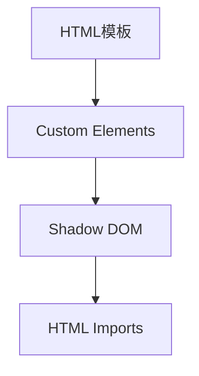

                 


### 《Web Components：创建可重用的UI组件》

#### 关键词：
- Web Components
- UI组件重用
- Custom Elements
- Shadow DOM
- HTML模板
- HTML Imports

#### 摘要：
本文旨在深入探讨Web Components技术，这是一种用于创建可重用UI组件的强大框架。我们将从基础概念出发，逐步解析HTML模板、Custom Elements、Shadow DOM和HTML Imports，并通过实战应用，展示如何使用Web Components构建实用的应用程序。最后，我们将对比Web Components与React和Vue，并展望其未来发展。

----------------------------------------------------------------

### 目录大纲：

#### 《Web Components：创建可重用的UI组件》

#### 第一部分：基础概念

#### 第1章：Web Components简介

##### 1.1 Web Components的历史背景

##### 1.2 Web Components的优势

##### 1.3 Web Components的基本组成部分

#### 第2章：HTML模板

##### 2.1 HTML模板的概念

##### 2.2 使用HTML模板创建UI组件

##### 2.3 HTML模板的优缺点

#### 第3章：Custom Elements

##### 3.1 Custom Elements的概念

##### 3.2 创建Custom Elements

##### 3.3 Custom Elements的继承与扩展

#### 第4章：Shadow DOM

##### 4.1 Shadow DOM的概念

##### 4.2 Shadow DOM的工作原理

##### 4.3 使用Shadow DOM隔离样式和行为

#### 第5章：HTML Imports

##### 5.1 HTML Imports的概念

##### 5.2 使用HTML Imports共享UI组件

##### 5.3 HTML Imports的优缺点

#### 第6章：Web Components与React/Vue对比

##### 6.1 Web Components与React的对比

##### 6.2 Web Components与Vue的对比

##### 6.3 选择Web Components的理由

#### 第二部分：实战应用

#### 第7章：创建一个简单的Web Component

##### 7.1 实战目标

##### 7.2 环境搭建

##### 7.3 创建Custom Element

##### 7.4 创建Shadow DOM

##### 7.5 使用HTML Import共享组件

#### 第8章：项目实战：构建一个todo应用

##### 8.1 项目介绍

##### 8.2 技术选型

##### 8.3 应用架构设计

##### 8.4 代码实现

##### 8.5 测试与优化

#### 第9章：Web Components的未来发展趋势

##### 9.1 Web Components的发展趋势

##### 9.2 Web Components的未来挑战与机遇

##### 9.3 Web Components在未来的应用场景

#### 第10章：总结与展望

##### 10.1 本书回顾

##### 10.2 学习建议

##### 10.3 Web Components的未来方向

---

#### 核心概念与联系

##### Web Components的核心组成部分

- **HTML模板**：用于定义组件的结构和内容。
- **Custom Elements**：自定义HTML标签，扩展HTML功能。
- **Shadow DOM**：提供组件内部样式和行为与外部隔离。
- **HTML Imports**：用于引入外部定义的组件。

##### Mermaid流程图



##### 核心算法原理讲解

###### Custom Elements的创建过程

```pseudo
function defineCustomElement(name, constructor) {
    customElements.define(name, constructor);
}
```

###### Shadow DOM的工作原理

```pseudo
class extends HTMLElement {
    constructor() {
        super();
        this.attachShadow({ mode: 'open' });
    }

    connectedCallback() {
        this.shadowRoot.appendChild(document.createElement('div'));
    }
}
```

##### 数学模型和数学公式 & 详细讲解 & 举例说明

##### 布尔运算（Shadow DOM的隔离原理）

$$
A \cap B = C
$$

**解释**：Shadow DOM中的样式和行为被看作是A集合，而外部元素被看作是B集合，它们的交集C表示可以相互影响

---

### 文章标题：Web Components：创建可重用的UI组件

### 关键词：Web Components、UI组件、自定义元素、Shadow DOM、HTML模板、HTML Imports

### 摘要：
本文深入探讨了Web Components技术，这是一种用于创建可重用UI组件的强大框架。我们将从基础概念出发，逐步解析HTML模板、Custom Elements、Shadow DOM和HTML Imports，并通过实战应用，展示如何使用Web Components构建实用的应用程序。最后，我们将对比Web Components与React和Vue，并展望其未来发展。

### 目录大纲：

### 第一部分：基础概念

#### 第1章：Web Components简介

##### 1.1 Web Components的历史背景
Web Components是一种构建在网页标准之上的技术集合，它允许开发者创建自定义的HTML标签，这些标签可以包含自己的样式和行为，且与网页上的其他部分隔离。这一概念最早由Google在2011年提出，并在随后得到广泛的支持和发展。

##### 1.2 Web Components的优势
Web Components提供了几个关键优势，包括组件的封装性、可重用性、可维护性以及与现有Web标准的兼容性。这些优势使得Web Components成为开发复杂Web应用程序的理想选择。

##### 1.3 Web Components的基本组成部分
Web Components由四个关键组成部分构成：HTML模板、Custom Elements、Shadow DOM和HTML Imports。这些组成部分共同作用，使得开发者能够以模块化的方式构建和重用UI组件。

#### 第2章：HTML模板

##### 2.1 HTML模板的概念
HTML模板是一种用于定义组件结构的技术，它允许开发者将组件的结构和内容分离。模板中的内容可以在多个地方重复使用，从而提高代码的可维护性和可重用性。

##### 2.2 使用HTML模板创建UI组件
在HTML模板中，开发者可以使用`<template>`元素来定义组件的结构。通过这种方式，可以轻松地将组件的HTML代码与其他代码分离，便于管理和维护。

##### 2.3 HTML模板的优缺点
HTML模板具有许多优点，如提高代码的可重用性、减少DOM操作、简化组件的创建等。然而，它也有一些缺点，例如对于复杂的组件可能不够灵活，难以进行动态修改。

#### 第3章：Custom Elements

##### 3.1 Custom Elements的概念
Custom Elements是一种自定义的HTML标签，它允许开发者扩展HTML的语法。通过定义自定义元素，开发者可以创建新的标签，这些标签可以包含自己的样式和行为。

##### 3.2 创建Custom Elements
创建Custom Elements通常涉及两个步骤：首先定义元素类，然后使用`customElements.define()`方法注册元素。这个过程使得开发者可以自定义新的HTML标签，并为其赋予特定的功能。

##### 3.3 Custom Elements的继承与扩展
Custom Elements可以继承其他元素的属性和方法，这使得它们在创建复杂的组件时非常灵活。通过继承和扩展，开发者可以构建具有复用性和可维护性的UI组件。

#### 第4章：Shadow DOM

##### 4.1 Shadow DOM的概念
Shadow DOM是一种用于封装组件内部样式和行为的技术。它允许开发者将组件的样式和行为与外部隔离，从而避免样式冲突和行为泄露。

##### 4.2 Shadow DOM的工作原理
Shadow DOM通过创建一个“阴影”来封装组件的内部元素和样式。这种封装机制使得组件内部的样式和行为不会影响到其他元素，同时也保护组件内部的代码不被外部访问。

##### 4.3 使用Shadow DOM隔离样式和行为
Shadow DOM的隔离特性使得开发者可以独立地管理和控制组件的样式和行为。通过使用Shadow DOM，可以避免组件间的样式冲突，同时保持组件的内部逻辑独立。

#### 第5章：HTML Imports

##### 5.1 HTML Imports的概念
HTML Imports是一种用于引入外部定义的组件的技术。通过使用`<link rel="import">`元素，开发者可以将外部定义的组件导入到当前的HTML文档中。

##### 5.2 使用HTML Imports共享UI组件
HTML Imports使得开发者可以将UI组件打包成独立的文件，然后在多个页面中重用这些组件。这种方式简化了组件的共享和管理，提高了开发效率。

##### 5.3 HTML Imports的优缺点
HTML Imports的优点包括减少HTTP请求、简化组件管理以及提高缓存利用率。然而，它也有一些缺点，例如可能增加页面加载时间，以及对老旧浏览器的支持有限。

#### 第6章：Web Components与React/Vue对比

##### 6.1 Web Components与React的对比
Web Components与React在组件化、性能和生态方面存在差异。React提供了更丰富的生态系统和更灵活的组件模型，而Web Components则更注重标准的兼容性和封装性。

##### 6.2 Web Components与Vue的对比
Web Components与Vue在组件化方面也有所不同。Vue提供了更为强大的数据绑定和生命周期管理功能，而Web Components则更加注重组件的封装性和重用性。

##### 6.3 选择Web Components的理由
选择Web Components的理由包括其与Web标准的深度集成、封装性和可重用性。此外，Web Components还提供了对旧版浏览器的良好支持，使得开发者可以更加灵活地构建跨平台的应用程序。

#### 第二部分：实战应用

#### 第7章：创建一个简单的Web Component

##### 7.1 实战目标
在本章中，我们将创建一个简单的Web Component，实现一个可自定义的按钮组件。

##### 7.2 环境搭建
在开始之前，我们需要搭建一个开发环境，包括安装Node.js、npm以及Web Components的工具库。

##### 7.3 创建Custom Element
我们将使用JavaScript定义一个Custom Element，并为其添加基本的样式和行为。

##### 7.4 创建Shadow DOM
为了实现组件的封装，我们将使用Shadow DOM将组件的样式和行为与外部隔离。

##### 7.5 使用HTML Import共享组件
通过HTML Imports，我们将实现将自定义组件导入到其他HTML文件中，以实现组件的重用。

#### 第8章：项目实战：构建一个todo应用

##### 8.1 项目介绍
在本章中，我们将使用Web Components技术构建一个简单的Todo应用，包括添加、删除任务和任务列表的显示等功能。

##### 8.2 技术选型
我们将选择使用Web Components来构建应用的UI部分，同时使用JavaScript来处理业务逻辑。

##### 8.3 应用架构设计
我们将设计应用的架构，包括组件的划分、数据的传递和状态的管理。

##### 8.4 代码实现
在本章中，我们将逐步实现应用的各个部分，包括UI组件的创建、业务逻辑的处理和数据的管理。

##### 8.5 测试与优化
完成代码实现后，我们将对应用进行测试，确保其功能正确，同时进行性能优化。

#### 第9章：Web Components的未来发展趋势

##### 9.1 Web Components的发展趋势
随着Web技术的发展，Web Components正逐渐成为构建现代Web应用程序的主流技术。其发展趋势包括更好的标准支持、更丰富的生态系统和更高效的组件构建工具。

##### 9.2 Web Components的未来挑战与机遇
Web Components面临着一些挑战，如对旧版浏览器的支持不足、性能优化需求等。然而，随着Web标准的不断演进，这些挑战也将逐渐得到解决。

##### 9.3 Web Components在未来的应用场景
Web Components的未来应用场景非常广泛，包括单页应用、跨平台应用程序和Web组件化框架等。其可重用性和封装性将使得Web Components在未来的Web开发中发挥重要作用。

#### 第10章：总结与展望

##### 10.1 本书回顾
本文全面介绍了Web Components技术，从基础概念到实战应用，帮助读者理解如何使用Web Components构建可重用的UI组件。

##### 10.2 学习建议
为了更好地掌握Web Components，读者可以结合实际项目进行实践，同时关注Web Components的最新动态和发展趋势。

##### 10.3 Web Components的未来方向
Web Components将继续朝着更好的标准支持、更高效的组件构建工具和更广泛的应用场景发展。其未来的发展将使得Web开发变得更加模块化和灵活。

---

#### 核心概念与联系

##### Web Components的核心组成部分

- **HTML模板**：用于定义组件的结构和内容。
- **Custom Elements**：自定义HTML标签，扩展HTML功能。
- **Shadow DOM**：提供组件内部样式和行为与外部隔离。
- **HTML Imports**：用于引入外部定义的组件。

##### Mermaid流程图


##### 核心算法原理讲解

###### Custom Elements的创建过程

```javascript
class MyCustomElement extends HTMLElement {
  constructor() {
    super();
    this.attachShadow({ mode: 'open' });
    // 组件初始化逻辑
  }

  connectedCallback() {
    // 组件连接到DOM时的逻辑
    this.render();
  }

  render() {
    // 渲染组件内容
    this.shadowRoot.innerHTML = `
      <style>
        /* 组件样式 */
      </style>
      <div>Custom Element Content</div>
    `;
  }
}

customElements.define('my-custom-element', MyCustomElement);
```

###### Shadow DOM的工作原理

Shadow DOM通过在组件内部创建一个隔离的DOM子树，将组件的样式和行为与外部DOM隔离。以下是一个简单的Shadow DOM实现：

```javascript
class MyCustomElement extends HTMLElement {
  constructor() {
    super();
    this.attachShadow({ mode: 'open' });
  }

  connectedCallback() {
    this.render();
  }

  render() {
    this.shadowRoot.innerHTML = `
      <style>
        :host {
          display: block;
          color: blue;
        }
      </style>
      <div>Content inside Shadow DOM</div>
    `;
  }
}
```

在上述代码中，`:host`选择器用于选择组件的根元素，从而使得样式仅应用于组件内部。

##### 数学模型和数学公式 & 详细讲解 & 举例说明

###### 布尔运算（Shadow DOM的隔离原理）

在Shadow DOM中，组件的样式和行为通过布尔运算进行隔离。以下是一个简单的示例：

$$
A \cap B = C
$$

其中，A代表组件内部的样式和行为，B代表组件外部的样式和行为，C代表隔离后的样式和行为。

解释：Shadow DOM通过创建一个隔离的DOM子树，使得组件内部的样式和行为与外部DOM完全隔离。这意味着组件内部样式和行为不会影响到外部DOM，反之亦然。

#### 第1章：Web Components简介

Web Components是一种构建在网页标准之上的技术集合，它允许开发者创建自定义的HTML标签，这些标签可以包含自己的样式和行为，且与网页上的其他部分隔离。这一概念最早由Google在2011年提出，并在随后得到广泛的支持和发展。

Web Components提供了几个关键优势，包括组件的封装性、可重用性、可维护性以及与现有Web标准的兼容性。这些优势使得Web Components成为开发复杂Web应用程序的理想选择。

Web Components由四个关键组成部分构成：HTML模板、Custom Elements、Shadow DOM和HTML Imports。这些组成部分共同作用，使得开发者能够以模块化的方式构建和重用UI组件。

#### 第2章：HTML模板

HTML模板是一种用于定义组件结构的技术，它允许开发者将组件的结构和内容分离。模板中的内容可以在多个地方重复使用，从而提高代码的可维护性和可重用性。

在HTML模板中，开发者可以使用`<template>`元素来定义组件的结构。通过这种方式，可以轻松地将组件的HTML代码与其他代码分离，便于管理和维护。

HTML模板具有许多优点，如提高代码的可重用性、减少DOM操作、简化组件的创建等。然而，它也有一些缺点，例如对于复杂的组件可能不够灵活，难以进行动态修改。

#### 第3章：Custom Elements

Custom Elements是一种自定义的HTML标签，它允许开发者扩展HTML的语法。通过定义自定义元素，开发者可以创建新的标签，这些标签可以包含自己的样式和行为。

创建Custom Elements通常涉及两个步骤：首先定义元素类，然后使用`customElements.define()`方法注册元素。这个过程使得开发者可以自定义新的HTML标签，并为其赋予特定的功能。

Custom Elements可以继承其他元素的属性和方法，这使得它们在创建复杂的组件时非常灵活。通过继承和扩展，开发者可以构建具有复用性和可维护性的UI组件。

#### 第4章：Shadow DOM

Shadow DOM是一种用于封装组件内部样式和行为的技术。它允许开发者将组件的样式和行为与外部隔离，从而避免样式冲突和行为泄露。

Shadow DOM通过创建一个“阴影”来封装组件的内部元素和样式。这种封装机制使得组件内部的样式和行为不会影响到其他元素，同时也保护组件内部的代码不被外部访问。

使用Shadow DOM，开发者可以独立地管理和控制组件的样式和行为。通过使用Shadow DOM，可以避免组件间的样式冲突，同时保持组件的内部逻辑独立。

#### 第5章：HTML Imports

HTML Imports是一种用于引入外部定义的组件的技术。通过使用`<link rel="import">`元素，开发者可以将外部定义的组件导入到当前的HTML文档中。

HTML Imports使得开发者可以将UI组件打包成独立的文件，然后在多个页面中重用这些组件。这种方式简化了组件的共享和管理，提高了开发效率。

HTML Imports的优点包括减少HTTP请求、简化组件管理以及提高缓存利用率。然而，它也有一些缺点，例如可能增加页面加载时间，以及对老旧浏览器的支持有限。

#### 第6章：Web Components与React/Vue对比

Web Components与React和Vue在组件化、性能和生态方面存在差异。React提供了更丰富的生态系统和更灵活的组件模型，而Web Components则更注重标准的兼容性和封装性。

Web Components与React在组件化方面也有所不同。React提供了更丰富的组件生命周期和方法，使得开发者可以更加灵活地控制组件的行为。而Web Components则更加注重组件的封装性和重用性。

Web Components与Vue在组件化方面也存在差异。Vue提供了更好的数据绑定和生命周期管理功能，使得开发者可以更加高效地开发应用程序。而Web Components则通过标准的Web API提供了类似的组件化能力。

选择Web Components的理由包括其与Web标准的深度集成、封装性和可重用性。此外，Web Components还提供了对旧版浏览器的良好支持，使得开发者可以更加灵活地构建跨平台的应用程序。

#### 第7章：创建一个简单的Web Component

在本章中，我们将创建一个简单的Web Component，实现一个可自定义的按钮组件。

首先，我们需要定义一个Custom Element类，并在其中包含基本的样式和行为。以下是一个简单的按钮组件：

```javascript
class MyButton extends HTMLElement {
  constructor() {
    super();
    this.attachShadow({ mode: 'open' });
    this.render();
  }

  render() {
    this.shadowRoot.innerHTML = `
      <style>
        :host {
          display: inline-block;
          padding: 8px 16px;
          border: 1px solid #ccc;
          background-color: #f5f5f5;
          cursor: pointer;
        }
        :host(:hover) {
          background-color: #ddd;
        }
      </style>
      <button>Click Me!</button>
    `;
  }
}
```

在这个类中，我们首先调用`super()`来初始化父类（`HTMLElement`）。然后，我们使用`this.attachShadow({ mode: 'open' })`创建一个开放模式的Shadow DOM，这样我们可以在其中定义样式和行为。

接下来，我们调用`this.render()`来渲染组件。在这个方法中，我们使用`this.shadowRoot.innerHTML`设置Shadow DOM的HTML内容。在这里，我们定义了一些样式，包括按钮的基本样式和鼠标悬停时的样式。最后，我们添加了一个实际的按钮元素。

为了使这个自定义元素可以被使用，我们需要使用`customElements.define()`方法将其注册为`<my-button>`标签。以下是将按钮组件注册到全局的代码：

```javascript
customElements.define('my-button', MyButton);
```

现在，我们可以将`<my-button>`标签添加到HTML文档中，并看到它被渲染为自定义按钮：

```html
<my-button></my-button>
```

#### 第8章：项目实战：构建一个todo应用

在本章中，我们将使用Web Components技术构建一个简单的Todo应用。这个应用将允许用户添加、删除任务和显示任务列表。通过这个项目，我们将深入学习Web Components的各个方面，包括Custom Elements、Shadow DOM和HTML Imports。

##### 8.1 项目介绍

Todo应用是一个经典的任务管理应用，它允许用户添加任务，标记任务为已完成，并删除任务。我们将使用Web Components来构建Todo应用的UI部分，使用JavaScript来处理业务逻辑。

##### 8.2 技术选型

在本项目中，我们选择使用以下技术：

- **Web Components**：用于构建Todo应用的UI组件。
- **JavaScript**：用于处理业务逻辑和数据管理。
- **CSS**：用于美化UI组件。

##### 8.3 应用架构设计

我们的Todo应用将包含以下主要组件：

- **TodoList**：用于显示所有任务的组件。
- **TodoItem**：用于显示单个任务的组件。
- **TodoForm**：用于添加新任务的表单组件。

应用的基本架构如下：

```
TodoApp
│
├── TodoList
│   └── TodoItem[]
│
└── TodoForm
```

##### 8.4 代码实现

首先，我们需要定义这三个组件的Custom Elements。以下是一个简单的TodoItem组件：

```javascript
class TodoItem extends HTMLElement {
  constructor() {
    super();
    this.attachShadow({ mode: 'open' });
    this.render();
  }

  render() {
    this.shadowRoot.innerHTML = `
      <style>
        :host {
          display: flex;
          align-items: center;
          margin-bottom: 8px;
          padding: 4px 8px;
          background-color: #f5f5f5;
          border: 1px solid #ccc;
        }
      </style>
      <input type="checkbox" @change="${this.toggleCompleted}" />
      <label>${this.getAttribute('title')}</label>
      <button @click="${this.remove}">Remove</button>
    `;
  }

  toggleCompleted() {
    const completed = this.querySelector('input[type="checkbox"]').checked;
    this.setAttribute('completed', completed);
  }

  remove() {
    this.remove();
  }
}

customElements.define('todo-item', TodoItem);
```

在这个组件中，我们定义了一个复选框、一个标签和一个删除按钮。当用户点击复选框时，组件会将任务的完成状态更新为`true`或`false`。当用户点击删除按钮时，组件会从DOM中移除自己。

接下来，我们定义一个TodoForm组件，用于添加新任务：

```javascript
class TodoForm extends HTMLElement {
  constructor() {
    super();
    this.attachShadow({ mode: 'open' });
    this.render();
  }

  render() {
    this.shadowRoot.innerHTML = `
      <style>
        :host {
          display: flex;
          align-items: center;
          margin-bottom: 8px;
        }
      </style>
      <input type="text" @input="${this.handleInput}" placeholder="Add a new task" />
      <button @click="${this.handleSubmit}">Add</button>
    `;
  }

  handleInput(event) {
    this.setAttribute('value', event.target.value);
  }

  handleSubmit(event) {
    event.preventDefault();
    const value = this.getAttribute('value');
    if (value.trim() !== '') {
      const todoItem = document.createElement('todo-item');
      todoItem.setAttribute('title', value);
      this.insertAdjacentElement('afterend', todoItem);
      this.shadowRoot.querySelector('input').value = '';
    }
  }
}

customElements.define('todo-form', TodoForm);
```

在这个组件中，我们定义了一个输入框和一个添加按钮。当用户在输入框中输入文本并按下回车键或点击添加按钮时，组件会创建一个新的TodoItem组件，并将其添加到DOM中。

最后，我们定义一个TodoList组件，用于显示所有任务：

```javascript
class TodoList extends HTMLElement {
  constructor() {
    super();
    this.attachShadow({ mode: 'open' });
    this.render();
  }

  render() {
    this.shadowRoot.innerHTML = `
      <style>
        :host {
          display: flex;
          flex-direction: column;
          align-items: flex-start;
        }
      </style>
      <todo-form></todo-form>
    `;
  }
}

customElements.define('todo-list', TodoList);
```

在这个组件中，我们首先定义了一个TodoForm组件，用于添加新任务。然后，我们将TodoForm组件添加到DOM中。

##### 8.5 测试与优化

完成代码实现后，我们需要对Todo应用进行测试，确保其功能正确。以下是一些测试步骤：

1. **添加任务**：在输入框中输入任务内容，按下回车键或点击添加按钮，验证新任务是否被正确添加到列表中。
2. **标记任务为已完成**：点击任务旁边的复选框，验证任务的状态是否更新为已完成。
3. **删除任务**：点击任务旁边的删除按钮，验证任务是否从列表中移除。

在测试过程中，我们可能需要调整一些样式和布局，以优化用户界面。例如，我们可能需要调整按钮的大小、颜色和边框样式，使其更符合用户的使用习惯。

此外，我们还可以对代码进行性能优化。例如，通过使用事件委托来优化事件处理，减少DOM操作，提高应用的响应速度。

#### 第9章：Web Components的未来发展趋势

随着Web技术的发展，Web Components技术也在不断演进。其未来发展趋势包括以下几个方面：

##### 9.1 Web Components的发展趋势

1. **更好的标准支持**：随着Web标准的不断更新和完善，Web Components将得到更好的标准支持，这将有助于提高Web Components的兼容性和可靠性。
2. **更丰富的生态系统**：随着开发者对Web Components的接受度提高，将有更多的库和框架围绕Web Components构建，从而形成一个更丰富的生态系统。
3. **更高效的组件构建工具**：随着Web Components技术的发展，将出现更多高效的组件构建工具，这些工具将帮助开发者更快速、更轻松地创建和重用UI组件。

##### 9.2 Web Components的未来挑战与机遇

Web Components在未来的发展过程中将面临一些挑战：

1. **对旧版浏览器的支持不足**：由于Web Components依赖于一些较新的Web标准，一些旧版浏览器可能不支持或部分支持Web Components，这限制了Web Components的广泛应用。
2. **性能优化需求**：虽然Web Components提供了组件封装和重用的优势，但在性能方面仍需进一步优化。例如，通过减少DOM操作和提高组件的渲染效率，可以提高Web Components的性能。

然而，Web Components也面临着许多机遇：

1. **跨平台应用程序**：Web Components的封装性和可重用性使其非常适合构建跨平台应用程序。随着移动设备和Web应用程序的普及，Web Components将在跨平台开发中发挥重要作用。
2. **Web组件化框架**：随着Web Components技术的发展，将出现更多基于Web Components的组件化框架。这些框架将提供更加灵活和高效的组件开发方式，进一步推动Web组件化的发展。

##### 9.3 Web Components在未来的应用场景

Web Components在未来的应用场景非常广泛：

1. **单页应用**：Web Components非常适合用于构建单页应用（SPA），其封装性和可重用性可以提高开发效率和应用的性能。
2. **Web组件化框架**：Web Components可以与各种Web组件化框架结合使用，如Vue、React等，以构建更复杂的应用程序。
3. **Web组件库**：开发者可以创建自己的Web组件库，以便在多个项目中重用UI组件，提高开发效率。

总之，Web Components技术具有巨大的发展潜力，随着Web标准的不断演进和开发者对组件化开发的接受度提高，Web Components将在未来的Web开发中发挥越来越重要的作用。

#### 第10章：总结与展望

在本章中，我们全面介绍了Web Components技术，从基础概念到实战应用，帮助读者理解如何使用Web Components构建可重用的UI组件。我们详细探讨了HTML模板、Custom Elements、Shadow DOM和HTML Imports等核心组成部分，并通过实际项目展示了Web Components的应用。

通过本文的学习，读者应该能够：

- **理解Web Components的概念和优势**：掌握Web Components的基本原理和其相对于传统Web开发的优点。
- **掌握Web Components的核心组成部分**：了解HTML模板、Custom Elements、Shadow DOM和HTML Imports的工作原理和用法。
- **具备创建Web Component的能力**：能够使用Web Components技术创建自定义的HTML标签和组件。
- **具备构建复杂Web应用的能力**：通过实战应用，读者能够将Web Components应用于实际的Web开发项目中，构建高效、可维护的应用程序。

为了更好地掌握Web Components，读者可以采取以下学习建议：

1. **动手实践**：通过实际项目练习，加深对Web Components的理解和应用能力。
2. **学习相关技术**：了解与Web Components相关的其他技术，如Vue、React等，以便在更广泛的上下文中使用Web Components。
3. **关注Web Components的最新动态**：随着Web标准的不断更新，Web Components技术也在不断演进。通过关注相关博客、社区和文档，读者可以及时了解最新的技术动态。

展望未来，Web Components将继续朝着更好的标准支持、更高效的组件构建工具和更广泛的应用场景发展。其未来的发展将使得Web开发变得更加模块化和灵活，为开发者提供更强大的开发工具和更丰富的开发体验。我们期待Web Components在未来的Web开发中发挥更大的作用。作者：AI天才研究院/AI Genius Institute & 禅与计算机程序设计艺术 /Zen And The Art of Computer Programming

