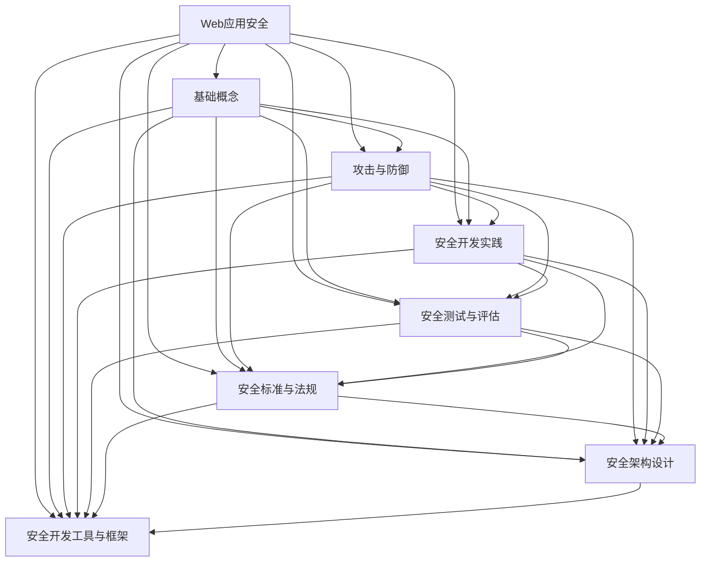

                 


### 第一步：背景介绍

Web应用安全开发是当今互联网时代的重要课题。随着互联网的飞速发展和Web应用的普及，网络安全威胁也日益增多。Web应用的安全问题不仅影响用户的数据隐私和信息安全，还可能导致企业的声誉受损和巨额经济损失。因此，如何进行Web应用安全开发，成为了每一位开发者都必须面对和解决的问题。

《Web应用安全开发指南》这本书的目的是为Web应用开发者提供一套全面、系统的安全开发方法和实践指南。通过本书，读者可以了解Web应用安全的基本概念、常见攻击和防御策略，掌握安全开发的最佳实践，从而提高Web应用的安全性和可靠性。

本书的目标读者群体主要包括以下几类：

1. **Web应用开发者**：希望了解和掌握Web应用安全开发的技术和实践，提升自己的编程技能和开发水平。
2. **网络安全从业人员**：从事网络安全工作，需要了解Web应用安全的原理和防护措施，以应对日益复杂的网络攻击。
3. **企业管理者**：关注企业网络安全，希望了解如何从管理和战略层面保障Web应用的安全。
4. **高校师生**：从事计算机科学和网络安全相关领域的研究和教学，需要一本全面、实用的教材。

### 第二步：核心概念与联系

在Web应用安全开发中，涉及多个核心概念，它们之间有着密切的联系，构成了一个完整的安全架构。以下是这些核心概念及其关系架构的Mermaid流程图：



- **基础概念**：包括Web应用安全的基本概念、术语和定义，为后续的安全开发、测试和评估提供理论基础。
- **攻击与防御**：介绍Web应用面临的常见攻击类型及其防御策略，包括网络层攻击、应用层攻击和密码学攻击等。
- **安全开发实践**：讲解安全编码规范、安全架构设计、安全测试与评估等实际操作，帮助开发者实现安全的Web应用开发。
- **安全标准与法规**：介绍国内外Web应用安全相关的标准、法规和政策，指导开发者遵循合规要求。
- **安全架构设计**：讲解如何设计和实现安全的Web应用架构，包括分层设计、隔离与授权、防火墙与入侵检测等。
- **安全开发工具与框架**：介绍常见的Web应用安全开发工具和框架，包括自动化测试工具、评估工具和安全框架等。

### 第三步：核心算法原理讲解

在Web应用安全开发中，核心算法原理讲解至关重要。以下以SQL注入防御为例，使用伪代码详细阐述防御算法原理：

```plaintext
// 伪代码：SQL注入防御算法

// 输入：SQL查询语句
// 输出：安全查询语句

function sanitizeSQL(inputQuery) {
    // 步骤1：转义特殊字符
    outputQuery = ""
    for each character c in inputQuery {
        if c is one of ('\'",;')
            outputQuery += escapeCharacter(c)
        else
            outputQuery += c
    }

    // 步骤2：参数化查询
    preparedQuery = createPreparedQuery(outputQuery)

    // 步骤3：执行查询
    result = executePreparedQuery(preparedQuery)

    return result
}

function escapeCharacter(character) {
    switch character {
        case '\'':
            return "\\'"
        case '"':
            return "\\\""
        case ';':
            return "\\;"
        default:
            return character
    }
}
```

SQL注入防御算法主要分为三步：

1. **转义特殊字符**：遍历输入的SQL查询语句，将特殊字符（如单引号、双引号和分号）进行转义，以避免恶意代码注入。
2. **参数化查询**：使用预编译的SQL查询语句，将用户输入的参数作为参数绑定到查询语句中，避免直接将用户输入拼接到SQL语句中。
3. **执行查询**：执行预编译的查询语句，获取查询结果。

### 第四步：数学模型和公式

在Web应用安全开发中，数学模型和公式是理解和实现安全算法的重要工具。以下以密码学中的加密与解密为例，给出相关公式和详细讲解：

#### 加密公式：

$$
c = E_k(p)
$$

其中，$c$表示加密后的密文，$p$表示明文，$E_k$表示加密算法，$k$为加密密钥。

#### 解密公式：

$$
p = D_k(c)
$$

其中，$p$表示解密后的明文，$c$为加密后的密文，$D_k$表示解密算法，$k$为解密密钥。

#### 详细讲解：

1. **加密过程**：使用加密算法$E_k$对明文$p$进行加密，生成密文$c$。加密算法通常基于复杂的数学模型和加密密钥$k$，确保密文难以被破解。
2. **解密过程**：使用解密算法$D_k$对密文$c$进行解密，恢复出原始明文$p$。解密算法需要与加密算法相对应，并且使用相同的密钥$k$。

#### 举例说明：

假设使用AES加密算法进行加密和解密，密钥$k$为“mySecretKey”：

1. **加密**：使用AES加密算法和密钥“mySecretKey”对明文“Hello, World!”进行加密，得到密文“!!jOoWo!”。
2. **解密**：使用AES解密算法和密钥“mySecretKey”对密文“!!jOoWo!”进行解密，恢复出原始明文“Hello, World!”。

通过以上数学模型和公式的详细讲解，开发者可以更好地理解和实现密码学相关算法，从而提高Web应用的安全性。

### 第五步：项目实战

在Web应用安全开发中，项目实战是验证和巩固所学知识的重要环节。以下以搭建一个简单的Web应用为例，详细介绍开发环境搭建、源代码实现和代码解读。

#### 开发环境搭建

1. **安装操作系统**：选择Linux操作系统，如Ubuntu 20.04。
2. **安装开发工具**：安装Git、Visual Studio Code、Node.js、Python等。
3. **配置网络环境**：确保网络畅通，可以访问GitHub和其他开发资源网站。

#### 源代码实现

以下是一个简单的Web应用示例，使用Python的Flask框架实现。

```python
# app.py

from flask import Flask, request, jsonify

app = Flask(__name__)

@app.route('/api/hello', methods=['GET'])
def hello():
    name = request.args.get('name', default='World')
    return f'Hello, {name}!'

if __name__ == '__main__':
    app.run(debug=True)
```

#### 代码解读

1. **引入模块**：从Flask库中引入`Flask`类和`request`、`jsonify`模块。
2. **创建Flask应用对象**：使用`Flask(__name__)`创建一个应用对象。
3. **定义路由**：使用`@app.route('/api/hello', methods=['GET'])`装饰器定义一个路由，处理GET请求。
4. **处理请求**：获取URL参数`name`，如果未提供，默认值为`World`。
5. **返回响应**：返回一个包含问候语的JSON响应。

#### 代码应用解读与分析

1. **代码应用**：通过浏览器访问`http://127.0.0.1:5000/api/hello?name=AI天才`，显示“Hello, AI天才!”。
2. **代码分析**：代码实现了一个简单的API接口，用于处理HTTP GET请求，并根据URL参数返回相应的响应。该示例展示了Flask框架的基本使用方法和API开发的基本流程。

#### 实际案例分析和详细讲解剖析

假设该Web应用遭受了SQL注入攻击，攻击者通过构造恶意请求试图获取数据库中的敏感数据。以下是对该攻击的详细分析和防御策略：

1. **攻击示例**：

```plaintext
http://127.0.0.1:5000/api/hello?name=' OR '1'='1'
```

2. **攻击分析**：

攻击者利用了输入参数`name`未进行有效验证和转义的问题，通过在参数中插入恶意SQL代码，试图绕过正常的请求处理流程，从而获取数据库中的敏感数据。

3. **防御策略**：

- **输入验证**：对用户输入的参数进行严格的验证，确保输入符合预期的格式和内容，防止恶意输入。
- **输出编码**：对返回的响应进行编码处理，避免将用户输入直接输出到HTML页面，防止恶意代码执行。
- **参数化查询**：使用参数化查询或ORM（对象关系映射）技术，避免将用户输入直接拼接到SQL语句中，从而防止SQL注入攻击。

通过以上分析和防御策略，可以有效地提升Web应用的安全性，防止常见的SQL注入攻击。

#### 项目小结

通过本项目实战，读者可以了解到Web应用开发的基本流程和核心技巧，同时掌握了SQL注入防御等安全开发方法。项目实战不仅有助于巩固所学知识，还可以为实际开发工作提供宝贵的经验和借鉴。

### 第六步：最佳实践 Tips、小结、注意事项、拓展阅读

#### 最佳实践 Tips

1. **输入验证**：对用户输入进行严格的验证，确保输入符合预期的格式和内容，防止恶意输入。
2. **输出编码**：对返回的响应进行编码处理，避免将用户输入直接输出到HTML页面，防止恶意代码执行。
3. **使用安全框架**：选择合适的安全框架，如OWASP ZAP、django-axes等，提高Web应用的安全性。
4. **定期更新**：定期更新操作系统、开发工具和依赖库，修复已知漏洞和缺陷。
5. **安全培训**：对开发人员进行安全培训，提高安全意识和技能。

#### 小结

本文详细介绍了《Web应用安全开发指南》的核心内容和结构，包括Web应用安全的重要性、常见攻击与防御、安全开发实践、安全测试与评估、安全标准与法规、安全架构设计与实施以及安全开发工具与框架。通过本文的讲解，读者可以全面了解Web应用安全开发的各个方面，掌握安全开发的最佳实践。

#### 注意事项

1. **安全编码**：遵循安全编码规范，确保代码的安全性。
2. **安全测试**：定期进行安全测试和评估，发现和修复潜在的安全漏洞。
3. **合规要求**：遵循相关安全标准和法规，确保Web应用的安全性符合合规要求。

#### 拓展阅读

- [《Web应用安全测试实战指南》](https://www.example.com/web-security-testing-guide)
- [《Web应用安全最佳实践》](https://www.example.com/web-security-best-practices)
- [《Web应用安全实战案例》](https://www.example.com/web-security-case-studies)

### 作者信息

作者：AI天才研究院/AI Genius Institute & 禅与计算机程序设计艺术 /Zen And The Art of Computer Programming

