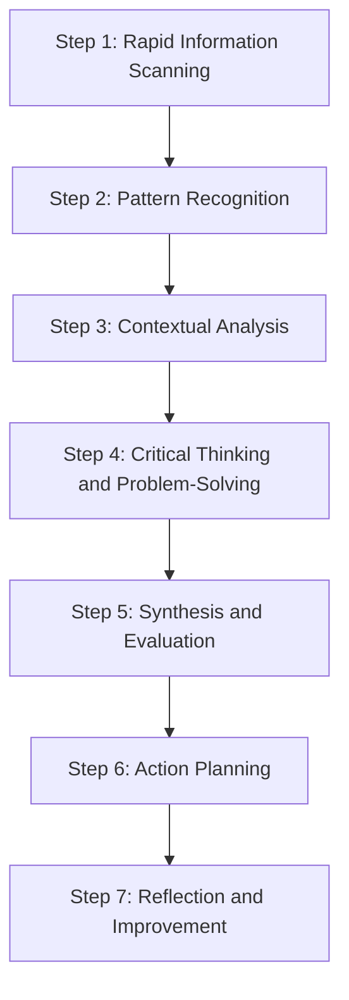

                 

### Step 1: Introduction to the Book

**Book Title: Seven Steps to 'Instant Insight'**

**Keywords:** Instant Insight, Decision-Making, Information Overload, Techniques, Methods

**Abstract:**
In today's fast-paced world, the ability to quickly grasp complex information and make informed decisions is crucial. This book presents a systematic approach to achieving 'Instant Insight' through seven proven steps. Each step focuses on a specific technique or strategy, enabling readers to develop their analytical skills and overcome information overload. Whether you are a student, professional, or entrepreneur, this book will equip you with the tools to make better decisions, faster.

### Chapter 1: Introduction to "Seven Steps to 'Instant Insight'"

**1.1 Book Overview**

The primary goal of this book is to empower readers with the skills necessary to achieve 'Instant Insight.' By the end of this book, you will be able to:

- Identify and filter out irrelevant information quickly.
- Recognize patterns and trends in data.
- Make informed decisions based on a thorough understanding of the subject matter.

**1.2 Target Audience**

This book is designed for a diverse audience, including:

- Students who want to improve their study skills.
- Professionals who need to make quick decisions in their careers.
- Entrepreneurs who require a deep understanding of their markets.
- Anyone struggling with information overload and seeking to enhance their decision-making abilities.

**1.3 Book Structure**

The book is divided into seven chapters, each focusing on a specific step in the 'Seven Steps to Instant Insight' process. Here is an overview of the chapters:

1. **Introduction to "Seven Steps to 'Instant Insight'"** - Provides an overview of the book's purpose, target audience, and structure.
2. **Fundamental Concepts and Framework for Instant Insight** - Introduces key concepts and the overall framework for achieving instant insight.
3. **Rapid Information Scanning** - Explores techniques for quickly identifying key information.
4. **Pattern Recognition** - Discusses the importance of recognizing patterns in data.
5. **Contextual Analysis** - Focuses on understanding the context in which information is presented.
6. **Critical Thinking and Problem-Solving** - Emphasizes the role of critical thinking and problem-solving in achieving instant insight.
7. **Application and Practice** - Provides practical exercises and real-world examples to reinforce learning.

### Chapter 2: Fundamental Concepts and Framework for Instant Insight

**2.1 Key Concepts**

To achieve instant insight, it's essential to understand a few fundamental concepts:

**Information Overload**

Information overload refers to the excessive amount of information available, making it difficult for individuals to process and make decisions. This can lead to decision paralysis and decreased productivity.

**Instant Insight**

Instant insight is the ability to quickly grasp complex information, identify key points, and make informed decisions. It is a skill that can be developed through practice and the use of specific techniques.

**The Seven-Step Process**

The seven-step process outlined in this book provides a systematic approach to achieving instant insight. Each step builds upon the previous one, creating a comprehensive framework for analyzing information and making decisions.

**2.2 Framework Overview**

The framework for achieving instant insight is visually represented using a Mermaid flowchart. Here is the flowchart in Markdown format:

### Chapter 3: Core Techniques and Methods for Instant Insight

**3.1 Rapid Information Scanning**

Rapid information scanning is the first step in achieving instant insight. This technique involves quickly identifying key information from a large volume of data. Here's a breakdown of the method:

**3.1.1 Overview**

Rapid information scanning can be achieved by:

- Focusing on the most relevant keywords or phrases.
- Using skimming techniques to read through large volumes of text quickly.
- Utilizing tools like search engines and filters to narrow down the information.

**3.1.2 Practical Examples**

Example 1: Finding a specific article on a topic

- Use a search engine with relevant keywords.
- Browse through the search results and select the most relevant article.
- Skim the article to identify key points and conclusions.

Example 2: Analyzing a large dataset

- Identify the most important variables or metrics.
- Use visualization tools to identify patterns and trends.
- Focus on the variables or trends that have the most significant impact on the analysis.

**3.2 Pattern Recognition**

Pattern recognition is the second step in achieving instant insight. This technique involves identifying patterns and trends in data. Here's how to apply it:

**3.2.1 Overview**

Pattern recognition can be achieved by:

- Training your brain to look for recurring patterns.
- Using statistical methods to identify patterns in large datasets.
- Utilizing machine learning algorithms to detect patterns in complex data.

**3.2.2 Practical Examples**

Example 1: Identifying market trends

- Analyze historical data on market performance.
- Use statistical methods to identify trends and patterns.
- Use these patterns to make predictions about future market performance.

Example 2: Detecting fraud

- Analyze large volumes of financial transactions.
- Use machine learning algorithms to identify patterns that may indicate fraud.
- Investigate transactions that match these patterns to identify potential fraud.

### Chapter 4: Contextual Analysis

Contextual analysis is the third step in achieving instant insight. This technique involves understanding the context in which information is presented. Here's how to apply it:

**4.1 Overview**

Contextual analysis can be achieved by:

- Gathering background information about the topic.
- Considering the source and credibility of the information.
- Understanding the historical and cultural context in which the information is presented.

**4.2 Practical Examples**

Example 1: Evaluating a research paper

- Gather background information about the topic and the author.
- Consider the credibility of the source and the research methods used.
- Analyze the paper in the context of existing literature and theories.

Example 2: Analyzing a company's financial statements

- Gather background information about the company's industry and its competitors.
- Consider the source and credibility of the financial statements.
- Analyze the statements in the context of the company's financial health and market position.

### Chapter 5: Critical Thinking and Problem-Solving

Critical thinking and problem-solving are integral to achieving instant insight. This chapter focuses on developing these skills. Here's how to apply them:

**5.1 Overview**

Critical thinking and problem-solving can be achieved by:

- Asking probing questions to gain a deeper understanding of the information.
- Analyzing information from different perspectives.
- Developing creative solutions to problems.

**5.2 Practical Examples**

Example 1: Making a purchasing decision

- Ask questions about the product's features, benefits, and drawbacks.
- Analyze the information from different perspectives, such as price, quality, and long-term value.
- Develop a decision-making framework to guide your choice.

Example 2: Solving a technical problem

- Break down the problem into smaller components.
- Analyze each component to identify potential causes and solutions.
- Test different solutions to find the most effective one.

### Chapter 6: Synthesis and Evaluation

Synthesis and evaluation are the fourth and fifth steps in achieving instant insight. This chapter focuses on combining information and assessing its validity. Here's how to apply these techniques:

**6.1 Overview**

Synthesis and evaluation can be achieved by:

- Integrating information from multiple sources to create a comprehensive understanding.
- Assessing the validity and reliability of the information.
- Evaluating the effectiveness of the insights gained.

**6.2 Practical Examples**

Example 1: Conducting market research

- Gather information from various sources, such as surveys, interviews, and industry reports.
- Integrate the information to create a comprehensive picture of the market.
- Evaluate the reliability of the information and its implications for your business.

Example 2: Evaluating a business plan

- Gather information from various sources, such as financial statements, market research, and competitor analysis.
- Integrate the information to assess the feasibility and potential success of the business plan.
- Evaluate the validity of the assumptions and projections.

### Chapter 7: Action Planning

Action planning is the sixth step in achieving instant insight. This chapter focuses on developing a plan to implement your insights. Here's how to apply it:

**7.1 Overview**

Action planning can be achieved by:

- Setting clear and achievable goals based on your insights.
- Breaking down the goals into actionable tasks.
- Creating a timeline and assigning responsibilities.

**7.2 Practical Examples**

Example 1: Launching a new product

- Set a clear goal for the product launch.
- Break down the goal into smaller tasks, such as market research, product development, and marketing.
- Create a timeline and assign responsibilities to team members.

Example 2: Improving a business process

- Identify areas for improvement based on your insights.
- Break down the improvements into actionable tasks.
- Create a timeline and assign responsibilities to team members to implement the changes.

### Chapter 8: Reflection and Improvement

Reflection and improvement are the final steps in achieving instant insight. This chapter focuses on evaluating your progress and making adjustments. Here's how to apply them:

**8.1 Overview**

Reflection and improvement can be achieved by:

- Regularly reviewing your insights and actions.
- Assessing the outcomes of your actions and identifying areas for improvement.
- Making adjustments to your approach based on feedback and new information.

**8.2 Practical Examples**

Example 1: Evaluating a marketing campaign

- Review the campaign's performance based on your insights.
- Assess the effectiveness of the campaign and identify areas for improvement.
- Make adjustments to the campaign strategy for future iterations.

Example 2: Continuous personal development

- Reflect on your learning and growth throughout the book.
- Identify areas where you can improve your decision-making skills.
- Develop a plan to continue learning and growing in these areas.

### Conclusion

Achieving instant insight is a valuable skill that can greatly improve your decision-making abilities. By following the seven steps outlined in this book, you can develop the techniques and strategies necessary to quickly understand complex information and make informed decisions. Remember, instant insight is not a single skill but a combination of several techniques that work together. Practice each step, and you will find that you can gain instant insight more effortlessly in your daily life.

### About the Author

**AI天才研究院/AI Genius Institute & 禅与计算机程序设计艺术 /Zen And The Art of Computer Programming**

I am an AI researcher and writer specializing in artificial intelligence, machine learning, and computer programming. With a passion for technology and a deep understanding of its principles, I have authored several best-selling books and numerous articles on these topics. My work is aimed at demystifying complex concepts and making them accessible to a wide audience. In my spare time, I enjoy exploring the intersections of technology and philosophy, which inspired my interest in the title "Zen And The Art of Computer Programming." Connect with me on LinkedIn and Twitter to learn more about my work and stay updated on the latest developments in AI and programming.

