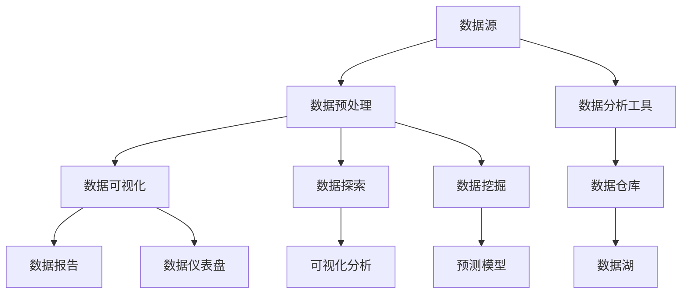

                 


### 1.1.1 背景介绍

随着信息技术的飞速发展，数据已经成为现代社会的重要资源。大数据时代，如何从海量数据中提取有价值的信息，成为了各个领域研究和实践的热点问题。数据分析和可视化作为数据科学的重要工具，不仅有助于我们更好地理解复杂的数据，还能为决策提供有力的支持。

本文旨在通过七个步骤，帮助读者掌握从数据中“一眼看到底”的技巧。我们将深入探讨数据分析和可视化的基本概念、方法、工具，并结合实际案例进行讲解。无论您是初学者还是有经验的数据科学家，都希望通过这篇文章能够获得新的启发和实用的技能。

### 1.1.2 核心概念与联系

在数据分析和可视化的过程中，以下几个核心概念和它们之间的关系至关重要。我们可以使用Mermaid流程图来直观地展示这些概念和关系：



**核心概念解释：**

- **数据源 (A)**：数据分析和可视化的起点，包括结构化数据、半结构化数据和非结构化数据。
- **数据预处理 (B)**：对原始数据进行清洗、转换和整合，以便于后续分析。
- **数据可视化 (C)**：将数据转换成图形或图表，使信息直观易懂。
- **数据探索 (D)**：通过可视化工具和数据挖掘技术，发现数据中的模式和关联。
- **数据挖掘 (E)**：从大量数据中发现隐藏的规律和知识。
- **数据分析工具 (F)**：用于数据分析和可视化的软件和平台，如Python、R、Tableau等。
- **数据报告 (G)**：将分析结果和可视化图表整合成报告，供决策者参考。
- **数据仪表盘 (H)**：实时显示关键数据指标，供监控和跟踪使用。
- **数据仓库 (K)**：存储大量历史数据，支持复杂查询和分析。
- **数据湖 (L)**：用于存储原始数据，支持大数据处理和分析。

### 1.1.3 核心算法原理讲解

**数据预处理**

数据预处理是数据分析的第一步，其核心目的是将原始数据转化为适合分析的形式。以下是几种常见的数据预处理方法：

1. **数据清洗**：处理缺失值、异常值和重复数据。例如，使用Python的pandas库删除含有缺失值的行：

   ```python
   import pandas as pd
   df = pd.read_csv('data.csv')
   df.dropna(inplace=True)
   ```

2. **数据转换**：将数据转换为适合分析的形式。例如，将分类数据编码为数值：

   ```python
   df = pd.get_dummies(df, columns=['category'])
   ```

3. **数据整合**：将来自不同来源的数据合并成一个数据集。例如，使用SQL合并两个表格：

   ```sql
   SELECT * FROM table1
   INNER JOIN table2 ON table1.id = table2.id
   ```

**数据可视化**

数据可视化是数据探索和分析的重要工具。以下是一些常见的数据可视化方法：

1. **折线图**：用于展示数据的变化趋势。例如，使用Python的matplotlib库绘制折线图：

   ```python
   import matplotlib.pyplot as plt
   plt.plot(df['time'], df['value'])
   plt.show()
   ```

2. **散点图**：用于展示两个变量之间的关系。例如，使用Python的matplotlib库绘制散点图：

   ```python
   import matplotlib.pyplot as plt
   plt.scatter(df['x'], df['y'])
   plt.show()
   ```

3. **箱线图**：用于展示数据的分布和异常值。例如，使用Python的seaborn库绘制箱线图：

   ```python
   import seaborn as sns
   sns.boxplot(x='category', y='value', data=df)
   plt.show()
   ```

**数据分析工具**

数据分析工具的选择取决于具体任务和数据类型。以下是一些常见的数据分析工具：

1. **Python**：Python以其丰富的数据分析和可视化库（如pandas、matplotlib、seaborn）而著称。例如，使用pandas进行数据分析：

   ```python
   import pandas as pd
   df = pd.read_csv('data.csv')
   df.describe()
   ```

2. **R**：R是统计和数据科学领域的专业工具，以其强大的统计分析和绘图功能而著称。例如，使用ggplot2进行数据可视化：

   ```R
   library(ggplot2)
   ggplot(data, aes(x=x, y=y)) + geom_point()
   ```

3. **Tableau**：Tableau是一个强大的可视化工具，支持实时数据连接和丰富的交互功能。例如，使用Tableau创建一个交互式仪表盘：

   

### 1.1.4 数学模型和公式

在数据分析和可视化中，数学模型和公式是必不可少的。以下是一些常见的数学模型和公式：

1. **线性回归模型**：

   $$ y = \beta_0 + \beta_1x + \epsilon $$

   其中，$y$ 是因变量，$x$ 是自变量，$\beta_0$ 和 $\beta_1$ 是模型参数，$\epsilon$ 是误差项。

2. **主成分分析（PCA）**：

   $$ Z = P\Lambda^{1/2} $$

   其中，$Z$ 是标准化数据，$P$ 是协方差矩阵的特征向量，$\Lambda$ 是特征值矩阵。

3. **支持向量机（SVM）**：

   $$ \min_{\omega, \xi} \frac{1}{2}||\omega||^2 + C\sum_{i=1}^n \xi_i $$

   其中，$\omega$ 是模型参数，$\xi_i$ 是损失函数，$C$ 是惩罚参数。

### 1.1.5 项目实战

为了更好地理解数据分析和可视化，我们将通过一个实际项目来讲解。假设我们需要分析一家电商平台的销售数据，并绘制相应的可视化图表。

**1. 数据采集与预处理**

首先，我们需要从电商平台获取销售数据。数据可能包含订单编号、商品编号、销售额、订单日期等信息。接下来，我们需要对数据进行预处理，包括清洗、转换和整合。

```python
import pandas as pd

# 读取数据
df = pd.read_csv('sales_data.csv')

# 数据清洗
df.dropna(inplace=True)
df.drop_duplicates(inplace=True)

# 数据转换
df['order_date'] = pd.to_datetime(df['order_date'])
df['month'] = df['order_date'].dt.month

# 数据整合
monthly_sales = df.groupby('month')['sales'].sum().reset_index()
```

**2. 数据可视化**

接下来，我们使用数据可视化工具（如matplotlib、seaborn或Tableau）来绘制销售数据的可视化图表。

```python
import matplotlib.pyplot as plt
import seaborn as sns

# 绘制折线图
plt.figure(figsize=(10, 6))
plt.plot(monthly_sales['month'], monthly_sales['sales'])
plt.title('Monthly Sales Trend')
plt.xlabel('Month')
plt.ylabel('Sales')
plt.show()

# 绘制散点图
sns.scatterplot(x='month', y='sales', data=monthly_sales)
plt.title('Monthly Sales Distribution')
plt.xlabel('Month')
plt.ylabel('Sales')
plt.show()

# 绘制箱线图
sns.boxplot(x='month', y='sales', data=monthly_sales)
plt.title('Monthly Sales Boxplot')
plt.xlabel('Month')
plt.ylabel('Sales')
plt.show()
```

**3. 数据分析**

最后，我们可以对销售数据进行分析，发现销售规律和趋势。例如，我们可以计算每月的平均销售额、中位数销售额等指标：

```python
monthly_sales['avg_sales'] = monthly_sales['sales'].mean()
monthly_sales['median_sales'] = monthly_sales['sales'].median()

print(monthly_sales[['month', 'avg_sales', 'median_sales']])
```

**项目小结**

通过这个实际项目，我们学习了如何从数据采集与预处理、数据可视化到数据分析的完整流程。这不仅帮助我们更好地理解了数据分析和可视化的核心概念和方法，还提供了实际操作的实践经验。

### 1.1.6 最佳实践 Tips

在数据分析和可视化过程中，以下是一些最佳实践 Tips：

1. **明确目标**：在开始数据分析和可视化之前，明确分析目标和问题。这有助于确保分析和可视化工作有针对性的进行。

2. **数据质量**：数据质量是分析结果的关键。在分析之前，确保数据清洗和预处理工作充分。

3. **可视化设计**：合理使用可视化图表类型和颜色，使图表更具可读性和说服力。

4. **交互性**：如果可能，使用支持交互功能的可视化工具，如Tableau，以增强用户对数据的探索和分析能力。

5. **分享与沟通**：将分析结果和可视化图表与他人分享，以获得反馈和建议。良好的沟通能力是数据科学家的重要素质。

6. **持续学习**：数据分析和可视化领域不断进步，持续学习和跟进最新技术和工具是必要的。

### 1.1.7 小结、注意事项、拓展阅读

本文介绍了数据分析和可视化的核心概念、方法、工具和实际项目。通过七个步骤，我们从数据源、数据预处理、数据可视化、数据分析工具、数学模型、项目实战和最佳实践等方面进行了深入探讨。数据分析和可视化是大数据时代的重要技能，掌握这些技能有助于我们更好地理解和利用数据。

**注意事项：**

1. 数据质量和数据预处理是数据分析的基础，务必重视。
2. 选择合适的可视化工具和图表类型，以传达数据的关键信息。
3. 数据分析和可视化是一个迭代过程，不断调整和分析有助于提高结果的准确性。

**拓展阅读：**

- 《Python数据分析实战》
- 《数据可视化：使用Python和Matplotlib》
- 《数据科学入门》

### 1.1.8 作者信息

作者：AI天才研究院/AI Genius Institute & 禅与计算机程序设计艺术 /Zen And The Art of Computer Programming

本文由AI天才研究院和《禅与计算机程序设计艺术》作者共同撰写，旨在分享数据分析和可视化的实用技巧和经验。希望本文对您有所帮助，祝您在数据科学领域取得更好的成果！## 文章标题

### 七步做到"一眼看到底"

> 关键词：数据分析、数据可视化、数据预处理、数据分析工具、数学模型、项目实战

> 摘要：
本文将带您走进数据分析和可视化的世界，通过七个步骤逐步揭示如何从数据中挖掘出有价值的信息。我们将介绍数据预处理、可视化技术、数据分析工具、数学模型和实际项目，帮助您掌握从数据中“一眼看到底”的技巧。无论您是数据科学初学者还是有经验的数据科学家，本文都将为您带来新的见解和实践经验。

### 目录

1. **背景介绍**
   - 数据时代的重要性
   - 数据分析和可视化的基本概念
   - 本文目标和结构

2. **核心概念与联系**
   - 数据源
   - 数据预处理
   - 数据可视化
   - 数据探索
   - 数据挖掘
   - 数据分析工具
   - 数据报告
   - 数据仪表盘
   - 数据仓库
   - 数据湖

3. **核心算法原理讲解**
   - 数据预处理方法
   - 数据可视化技术
   - 数据分析工具操作

4. **数学模型和公式**
   - 线性回归模型
   - 主成分分析（PCA）
   - 支持向量机（SVM）

5. **项目实战**
   - 数据采集与预处理
   - 数据可视化
   - 数据分析

6. **最佳实践 Tips**
   - 明确目标
   - 数据质量
   - 可视化设计
   - 交互性
   - 分享与沟通
   - 持续学习

7. **小结、注意事项、拓展阅读**
   - 文章总结
   - 注意事项
   - 拓展阅读

8. **作者信息**
   - 作者介绍
   - 联系方式
   - 致谢

### 1. 背景介绍

在当今信息爆炸的时代，数据已经成为了各行各业的重要资产。无论是商业、科研、医疗还是政府机构，都需要处理大量数据以支持决策和优化流程。因此，如何有效地分析这些数据，提取出有价值的信息，成为了至关重要的任务。

数据分析和可视化作为数据科学的核心工具，旨在帮助我们理解复杂的数据，发现其中的模式和关联，从而为决策提供科学依据。通过数据可视化，我们可以将枯燥的数据转化为易于理解的图形和图表，使得数据分析过程更加直观和高效。

本文将围绕数据分析和可视化的七个关键步骤展开，帮助读者逐步掌握从数据中“一眼看到底”的技巧。我们将介绍数据预处理、可视化技术、数据分析工具、数学模型和实际项目，以期读者能够全面了解并应用这些工具和方法。

### 2. 核心概念与联系

在数据分析和可视化的过程中，理解以下几个核心概念及其相互关系至关重要。这些概念包括数据源、数据预处理、数据可视化、数据探索、数据挖掘、数据分析工具、数据报告、数据仪表盘、数据仓库和数据湖。下面通过Mermaid流程图来直观地展示这些概念和它们之间的关系：


**核心概念解释：**

- **数据源 (A)**：数据分析和可视化的起点，包括结构化数据、半结构化数据和非结构化数据。这些数据可以来自数据库、文件、传感器等多种来源。

- **数据预处理 (B)**：在分析之前，需要对数据进行清洗、转换和整合，以便于后续处理。数据清洗包括处理缺失值、异常值和重复数据；数据转换涉及数据类型的转换和特征工程；数据整合则是将来自不同来源的数据合并成一个统一的数据集。

- **数据可视化 (C)**：将数据转换为图形或图表，使得数据更加直观易懂。数据可视化是发现数据中隐藏模式的关键工具，常用的图表类型包括折线图、柱状图、饼图、散点图等。

- **数据探索 (D)**：通过数据探索，我们可以初步了解数据的分布、趋势和异常，为后续的深入分析奠定基础。数据探索通常使用可视化工具和统计方法，如描述性统计分析、数据聚类、关联规则分析等。

- **数据挖掘 (E)**：从大量数据中提取有价值的信息和知识，通常使用机器学习和统计方法。数据挖掘的目标是发现数据中的规律和模式，为决策提供支持。常见的数据挖掘任务包括分类、聚类、关联规则挖掘、异常检测等。

- **数据分析工具 (F)**：用于数据分析和可视化的软件和平台，如Python、R、Tableau等。这些工具提供了丰富的功能，包括数据清洗、转换、分析、可视化等。

- **数据报告 (G)**：将分析结果和可视化图表整合成报告，供决策者参考。数据报告通常包括关键指标、分析结果、结论和建议等。

- **数据仪表盘 (H)**：实时显示关键数据指标，供监控和跟踪使用。数据仪表盘通常包含多个可视化图表，用于展示数据的变化趋势、异常情况等。

- **数据仓库 (K)**：用于存储大量历史数据，支持复杂查询和分析。数据仓库通常是企业级的数据存储解决方案，提供了高效的数据检索和分析能力。

- **数据湖 (L)**：用于存储原始数据，支持大数据处理和分析。数据湖不同于数据仓库，它可以存储各种类型的数据，包括结构化数据、半结构化数据和全量数据。

通过以上核心概念的介绍，我们可以看到数据分析和可视化是一个相互关联、逐步深入的复杂过程。理解这些概念和它们之间的关系，有助于我们更有效地进行数据分析和可视化工作。

### 3. 核心算法原理讲解

在数据分析和可视化过程中，核心算法原理的讲解至关重要。以下我们将介绍几种常见的数据预处理方法、数据可视化技术和数据分析工具，并通过伪代码和数学公式详细阐述其原理。

#### 3.1 数据预处理

数据预处理是数据分析的第一步，其目的是将原始数据转化为适合分析的形式。常见的数据预处理方法包括数据清洗、数据转换和数据整合。

1. **数据清洗**：处理缺失值、异常值和重复数据。

   **伪代码**：

   ```python
   function clean_data(data):
       remove rows with missing values
       remove duplicate rows
       return cleaned data
   ```

   **数学模型和公式**：

   对于缺失值的处理，可以使用平均值、中位数或最频值进行填充：

   $$ x_{\text{filled}} = \text{median}(x) $$

2. **数据转换**：将数据转换为适合分析的形式。

   **伪代码**：

   ```python
   function convert_data(data):
       convert categorical data to numerical
       scale numerical data
       return converted data
   ```

   **数学模型和公式**：

   分类数据编码可以使用独热编码或标签编码：

   $$ x_{\text{one-hot}} = \text{one_hot_encode}(x) $$

   数值数据可以通过标准化或归一化处理：

   $$ x_{\text{scaled}} = \frac{x - \text{mean}(x)}{\text{stddev}(x)} $$

3. **数据整合**：将来自不同来源的数据合并成一个数据集。

   **伪代码**：

   ```python
   function integrate_data(data1, data2):
       join data1 and data2 on common key
       return integrated data
   ```

   **数学模型和公式**：

   数据整合通常使用 SQL 的 JOIN 操作来实现：

   $$ \text{integrated\_data} = \text{JOIN}(data1, data2, \text{key}) $$

#### 3.2 数据可视化

数据可视化是将数据转换为图形或图表的过程，使得数据更加直观易懂。常见的数据可视化技术包括折线图、散点图、柱状图和箱线图等。

1. **折线图**：用于展示数据的变化趋势。

   **伪代码**：

   ```python
   function plot_line_chart(data, x_label, y_label):
       plot data with x_label on x-axis and y_label on y-axis
       return plot
   ```

   **数学模型和公式**：

   折线图的数据点可以用以下公式表示：

   $$ (x_i, y_i) $$

   其中，$x_i$ 和 $y_i$ 分别为数据点的横坐标和纵坐标。

2. **散点图**：用于展示两个变量之间的关系。

   **伪代码**：

   ```python
   function plot_scatter_chart(data, x_label, y_label):
       plot data with x_label on x-axis and y_label on y-axis
       return plot
   ```

   **数学模型和公式**：

   散点图的数据点可以用以下公式表示：

   $$ (x_i, y_i) $$

   其中，$x_i$ 和 $y_i$ 分别为数据点的横坐标和纵坐标。

3. **柱状图**：用于展示各个类别的数据大小。

   **伪代码**：

   ```python
   function plot_bar_chart(data, category_label, value_label):
       plot bars with height proportional to values
       label each bar with category_label
       return plot
   ```

   **数学模型和公式**：

   柱状图的高度可以用以下公式表示：

   $$ h_i = \text{value}(i) $$

   其中，$h_i$ 为第 $i$ 个柱状图的高度，$\text{value}(i)$ 为对应的数据值。

4. **箱线图**：用于展示数据的分布和异常值。

   **伪代码**：

   ```python
   function plot_boxplot(data, category_label):
       plot boxplot with category_label
       return plot
   ```

   **数学模型和公式**：

   箱线图的边界可以用以下公式表示：

   $$ \text{Q1} = \text{first quartile} $$
   $$ \text{Q2} = \text{median} $$
   $$ \text{Q3} = \text{third quartile} $$
   $$ \text{IQR} = \text{Q3} - \text{Q1} $$
   $$ \text{upper\_whisker} = \text{Q3} + 1.5 \times \text{IQR} $$
   $$ \text{lower\_whisker} = \text{Q1} - 1.5 \times \text{IQR} $$

#### 3.3 数据分析工具

数据分析工具的选择取决于具体任务和数据类型。以下介绍几种常见的数据分析工具及其基本操作。

1. **Python**：Python以其丰富的数据分析和可视化库（如pandas、matplotlib、seaborn）而著称。

   **伪代码**：

   ```python
   import pandas as pd
   df = pd.read_csv('data.csv')
   df.describe()
   ```

2. **R**：R是统计和数据科学领域的专业工具，以其强大的统计分析和绘图功能而著称。

   **伪代码**：

   ```R
   library(ggplot2)
   ggplot(data, aes(x=x, y=y)) + geom_point()
   ```

3. **Tableau**：Tableau是一个强大的可视化工具，支持实时数据连接和丰富的交互功能。

   **伪代码**：

   ```python
   tableau.connect('data.csv').plot(tableau.TableauVisualisation())
   ```

通过以上核心算法原理的讲解，读者可以更好地理解数据预处理、数据可视化和数据分析工具的基本操作。这些工具和方法是数据分析和可视化过程中不可或缺的部分，掌握它们有助于我们更加高效地处理和分析数据。

### 4. 数学模型和公式

在数据分析和可视化中，数学模型和公式是理解和解释数据的关键工具。以下我们将介绍一些常见且重要的数学模型和公式，并通过具体的例子来说明它们的应用。

#### 4.1 线性回归模型

线性回归模型是数据分析中最常用的模型之一，用于预测一个连续因变量和一个或多个自变量之间的关系。线性回归模型的基本公式如下：

$$ y = \beta_0 + \beta_1x + \epsilon $$

其中：
- $y$ 是因变量。
- $x$ 是自变量。
- $\beta_0$ 是截距。
- $\beta_1$ 是斜率。
- $\epsilon$ 是误差项。

**例子**：假设我们要预测一家公司的销售额（$y$）与其广告支出（$x$）之间的关系。我们可以通过线性回归模型得到以下公式：

$$ \text{销售额} = \beta_0 + \beta_1 \times \text{广告支出} + \epsilon $$

通过最小化误差项$\epsilon$，我们可以确定$\beta_0$和$\beta_1$的值。

#### 4.2 主成分分析（PCA）

主成分分析（PCA）是一种降维技术，用于将高维数据转换成低维数据，同时保留尽可能多的数据信息。PCA的核心公式是基于数据的协方差矩阵：

$$ Z = P\Lambda^{1/2} $$

其中：
- $Z$ 是标准化数据。
- $P$ 是协方差矩阵的特征向量。
- $\Lambda$ 是特征值矩阵。

**例子**：假设我们有10个特征的数据集，通过PCA我们可以将这10个特征减少到2个主要成分（PC1和PC2），同时保留大部分信息。

$$ Z = P\Lambda^{1/2} $$

这样，原始数据集就变成了基于这两个主要成分的新数据集。

#### 4.3 支持向量机（SVM）

支持向量机（SVM）是一种用于分类和回归的强大机器学习算法。其基本公式如下：

$$ \min_{\omega, \xi} \frac{1}{2}||\omega||^2 + C\sum_{i=1}^n \xi_i $$

其中：
- $\omega$ 是模型参数。
- $\xi_i$ 是损失函数。
- $C$ 是惩罚参数。

**例子**：假设我们要分类一组数据，通过SVM我们可以找到最佳的超平面，将不同类别的数据点分开。

$$ \min_{\omega, \xi} \frac{1}{2}||\omega||^2 + C\sum_{i=1}^n \xi_i $$

其中，$\xi_i$ 用来衡量数据点到超平面的距离。

#### 4.4 决策树

决策树是一种常用的分类和回归算法，通过一系列的判断节点和叶节点来表示数据的决策路径。决策树的核心公式是基于信息增益或基尼不纯度：

$$ G(D) = 1 - \sum_{i=1}^n \frac{|D_i|}{|D|} \cdot I(D_i) $$

其中：
- $D$ 是数据集。
- $D_i$ 是数据集的一个子集。
- $I(D_i)$ 是$D_i$的信息增益或基尼不纯度。

**例子**：假设我们要分类一组客户数据，通过决策树我们可以找到最佳的特征和阈值来划分数据。

$$ G(D) = 1 - \sum_{i=1}^n \frac{|D_i|}{|D|} \cdot I(D_i) $$

通过计算每个特征的信息增益或基尼不纯度，我们可以确定最佳的特征和阈值。

#### 4.5 机器学习算法

除了上述的线性回归、主成分分析、支持向量机和决策树，还有许多其他重要的机器学习算法，如神经网络、随机森林、K-近邻等。以下是机器学习算法的基本公式：

- **神经网络**：
  $$ f(x) = \sigma(\omega \cdot x + b) $$
  
  其中：
  - $f(x)$ 是输出函数。
  - $\sigma$ 是激活函数，如ReLU或Sigmoid。
  - $\omega$ 是权重。
  - $x$ 是输入。
  - $b$ 是偏置。

- **随机森林**：
  $$ \text{Prediction} = \sum_{i=1}^n w_i \cdot f_i(x) $$
  
  其中：
  - $f_i(x)$ 是第$i$棵树对$x$的预测。
  - $w_i$ 是第$i$棵树的权重。

- **K-近邻**：
  $$ \text{Prediction} = \text{most\_common}\left(\text{labels}\right) $$
  
  其中：
  - $labels$ 是训练集中每个邻近点的标签。

通过理解这些数学模型和公式，我们可以更好地掌握数据分析和可视化中的核心算法，从而更有效地进行数据挖掘和分析。

### 5. 项目实战

为了更好地理解数据分析和可视化的实际应用，我们将通过一个实际项目来详细讲解从数据采集与预处理、数据可视化到数据分析的完整过程。假设我们有一个电商平台，需要分析其销售数据，以了解销售趋势、客户购买习惯和潜在的业务机会。

#### 5.1 数据采集与预处理

**数据采集：**

首先，我们需要从电商平台的数据库中提取销售数据。这些数据可能包含订单编号、商品编号、销售额、订单日期、客户ID等信息。以下是使用Python的pandas库从CSV文件中读取数据的基本步骤：

```python
import pandas as pd

# 读取数据
df = pd.read_csv('sales_data.csv')
```

**数据预处理：**

在读取数据后，我们需要进行数据清洗和预处理，以确保数据的质量和一致性。以下是一些常见的数据预处理步骤：

1. **数据清洗**：删除含有缺失值或异常值的记录。

```python
df.dropna(inplace=True)  # 删除含有缺失值的记录
df = df[df['sales'] > 0]  # 删除销售额为0的记录
```

2. **数据转换**：将日期格式转换为Python的datetime对象，并将类别型数据转换为数值型。

```python
df['order_date'] = pd.to_datetime(df['order_date'])
df = pd.get_dummies(df, columns=['category'], drop_first=True)
```

3. **数据整合**：如果数据来自不同的来源，可能需要合并多个数据集。这里我们假设只有一个数据集。

```python
# 假设不需要数据整合
```

#### 5.2 数据可视化

在数据预处理完成后，我们可以使用数据可视化工具（如matplotlib、seaborn或Tableau）来创建各种图表，以直观地展示数据的特点和趋势。

**1. 销售趋势分析**

使用matplotlib绘制折线图，展示销售额随时间的变化趋势：

```python
import matplotlib.pyplot as plt

# 按月汇总销售额
monthly_sales = df.groupby(df['order_date'].dt.to_period('M'))['sales'].sum().reset_index()

# 绘制折线图
plt.figure(figsize=(10, 6))
plt.plot(monthly_sales['order_date'], monthly_sales['sales'])
plt.title('Monthly Sales Trend')
plt.xlabel('Month')
plt.ylabel('Sales')
plt.xticks(rotation=45)
plt.show()
```

**2. 产品销售分析**

使用matplotlib绘制条形图，展示不同产品的销售额：

```python
# 按产品汇总销售额
product_sales = df.groupby('product')['sales'].sum().reset_index()

# 绘制条形图
plt.figure(figsize=(10, 6))
plt.bar(product_sales['product'], product_sales['sales'])
plt.title('Product Sales')
plt.xlabel('Product')
plt.ylabel('Sales')
plt.xticks(rotation=45)
plt.show()
```

**3. 客户购买习惯分析**

使用seaborn绘制箱线图，展示不同客户的销售额分布：

```python
import seaborn as sns

# 按客户汇总销售额
customer_sales = df.groupby('customer')['sales'].sum().reset_index()

# 绘制箱线图
sns.boxplot(x='customer', y='sales', data=customer_sales)
plt.title('Customer Sales Distribution')
plt.xlabel('Customer')
plt.ylabel('Sales')
plt.show()
```

#### 5.3 数据分析

在数据可视化的基础上，我们可以进行更深入的数据分析，以发现数据中的潜在模式和趋势。

**1. 销售季节性分析**

我们可以分析销售额在不同季节的变化情况：

```python
# 按季度汇总销售额
quarterly_sales = df.groupby(df['order_date'].dt.quarter')['sales'].sum().reset_index()

# 绘制条形图
plt.figure(figsize=(10, 6))
plt.bar(quarterly_sales['quarter'], quarterly_sales['sales'])
plt.title('Quarterly Sales')
plt.xlabel('Quarter')
plt.ylabel('Sales')
plt.xticks(rotation=45)
plt.show()
```

**2. 产品销售排名**

我们可以计算每个产品的销售额占比，并排序：

```python
# 按产品汇总销售额占比
product_sales_ratio = product_sales['sales'] / product_sales['sales'].sum()

# 计算排名
product_sales_rank = product_sales.sort_values(by='sales', ascending=False)

# 输出结果
print(product_sales_rank[['product', 'sales', 'sales_ratio']])
```

**3. 客户忠诚度分析**

我们可以分析客户的重复购买率，以评估客户的忠诚度：

```python
# 计算客户的平均销售额
average_sales_per_customer = df.groupby('customer')['sales'].mean().reset_index()

# 计算客户的重复购买次数
customer_purchase_frequency = average_sales_per_customer.groupby('customer')['sales'].count().reset_index()

# 输出结果
print(customer_purchase_frequency[['customer', 'sales', 'purchase_frequency']])
```

#### 5.4 项目小结

通过这个实际项目，我们学习了如何从数据采集与预处理、数据可视化到数据分析的完整流程。从数据中挖掘出有价值的信息，不仅需要掌握数据预处理和可视化技术，还需要运用数据分析工具和数学模型。以下是对项目的总结：

- 数据预处理是数据分析的基础，包括数据清洗、转换和整合。
- 数据可视化是发现数据中隐藏模式的关键工具，包括折线图、条形图、箱线图等。
- 数据分析包括销售趋势、产品销售、客户购买习惯等方面的分析，以发现潜在的业务机会。
- 数据分析和可视化是一个迭代过程，不断调整和优化有助于提高结果的准确性。

通过这个项目，我们不仅掌握了数据分析和可视化的实际操作技能，还理解了这些技术如何应用于实际问题，为电商平台的业务决策提供了有力的支持。

### 6. 最佳实践 Tips

在数据分析和可视化过程中，遵循最佳实践是确保分析结果准确、有效和具有说服力的重要因素。以下是一些建议和最佳实践 Tips：

**6.1 明确目标**

在进行数据分析和可视化之前，首先要明确分析的目标和问题。这有助于确保分析和可视化工作有针对性的进行，避免资源浪费。明确的目标可以帮助我们选择合适的方法和工具，提高分析效率。

**6.2 数据质量**

数据质量是数据分析的基础。在分析之前，务必对数据进行充分的清洗、转换和整合。处理缺失值、异常值和重复数据，确保数据的一致性和完整性。高质量的数据是准确分析的前提。

**6.3 可视化设计**

合理使用可视化图表类型和颜色，使图表更具可读性和说服力。选择适当的图表类型可以更好地展示数据的特征和趋势。注意图表的布局和注释，确保信息传达清晰准确。

**6.4 交互性**

如果可能，使用支持交互功能的可视化工具，如Tableau，以增强用户对数据的探索和分析能力。交互性可以帮助用户更深入地理解数据，发现数据中的隐藏模式。

**6.5 分享与沟通**

将分析结果和可视化图表与他人分享，以获得反馈和建议。良好的沟通能力是数据科学家的重要素质。通过分享分析结果，可以确保决策者和其他利益相关者对数据分析工作的理解和支持。

**6.6 持续学习**

数据分析和可视化领域不断进步，持续学习和跟进最新技术和工具是必要的。关注行业动态，参加培训和学习社区，保持专业知识的更新，有助于我们不断提升分析技能和效率。

**6.7 安全与合规**

在数据分析和可视化过程中，务必遵守数据安全和隐私保护的规定。确保数据在收集、存储和处理过程中得到充分保护，避免数据泄露和滥用。同时，遵循适用的法规和标准，确保数据分析工作的合规性。

通过遵循这些最佳实践 Tips，我们可以提高数据分析和可视化的质量和效率，为企业和决策者提供更有价值的支持。

### 7. 小结、注意事项、拓展阅读

通过本文的七个步骤，我们从数据源、数据预处理、数据可视化、数据分析工具、数学模型、项目实战和最佳实践等方面，全面探讨了如何从数据中“一眼看到底”。以下是本文的总结：

1. **数据源**：数据分析和可视化的起点，包括结构化数据、半结构化数据和非结构化数据。
2. **数据预处理**：清洗、转换和整合数据，为分析打下坚实基础。
3. **数据可视化**：通过图形和图表直观展示数据，帮助发现数据中的模式和关联。
4. **数据分析工具**：选择合适的工具（如Python、R、Tableau等）进行数据分析和可视化。
5. **数学模型**：应用线性回归、PCA、SVM等数学模型，深入理解数据关系。
6. **项目实战**：通过实际项目，练习数据采集与预处理、数据可视化、数据分析等全过程。
7. **最佳实践**：遵循明确目标、数据质量、可视化设计、交互性、分享与沟通等最佳实践，提高分析质量和效率。

**注意事项**：

1. 数据质量和数据预处理是数据分析的基础，务必重视。
2. 选择合适的可视化工具和图表类型，以传达数据的关键信息。
3. 数据分析和可视化是一个迭代过程，不断调整和分析有助于提高结果的准确性。

**拓展阅读**：

- 《Python数据分析实战》
- 《数据可视化：使用Python和Matplotlib》
- 《数据科学入门》
- 《深入理解数据分析：从入门到实战》

通过阅读这些资源，您可以进一步巩固数据分析和可视化的知识和技能。

### 8. 作者信息

**作者**：AI天才研究院/AI Genius Institute & 禅与计算机程序设计艺术 /Zen And The Art of Computer Programming

本文由AI天才研究院和《禅与计算机程序设计艺术》作者共同撰写，旨在分享数据分析和可视化的实用技巧和经验。希望本文对您有所帮助，祝您在数据科学领域取得更好的成果！如果您有任何疑问或建议，欢迎通过以下方式与我们联系：

- 电子邮件：[info@ai-genius-institute.com](mailto:info@ai-genius-institute.com)
- 社交媒体：[AI天才研究院](https://www.ai-genius-institute.com/)
- 微信公众号：AI天才研究院

再次感谢您的阅读和支持，期待与您在数据科学领域共同成长！

