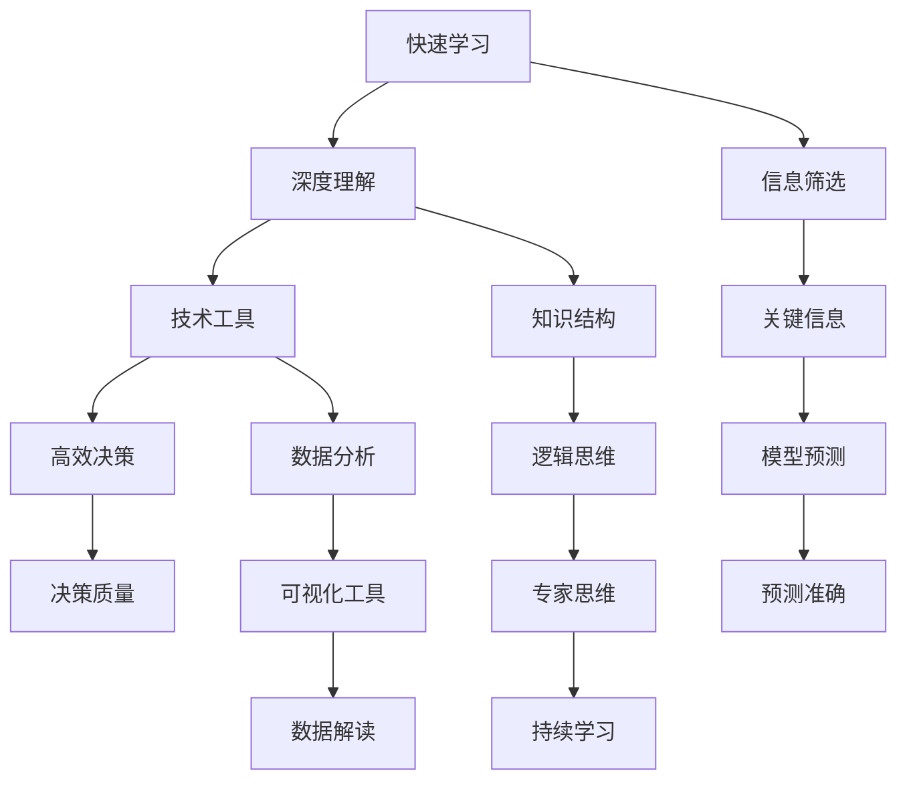
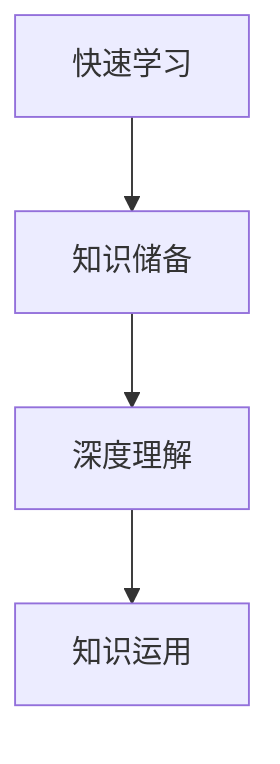
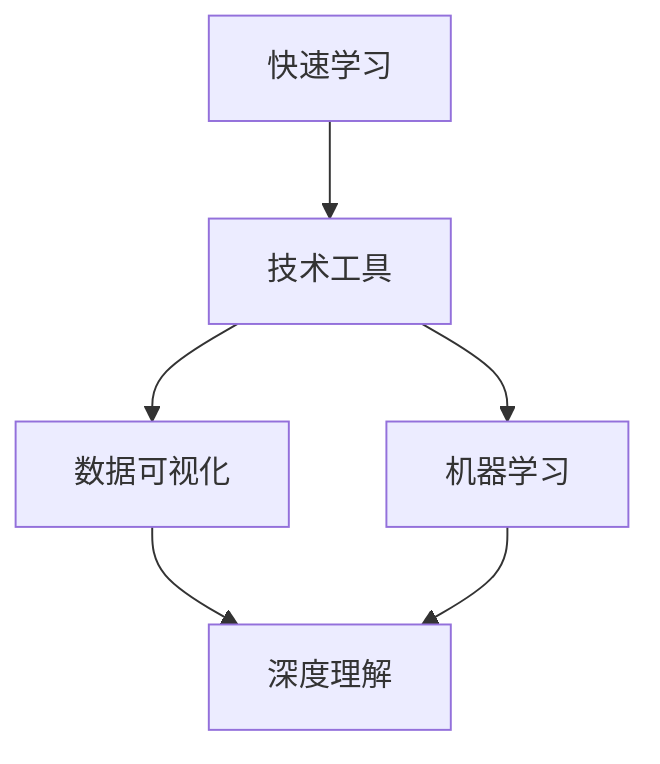
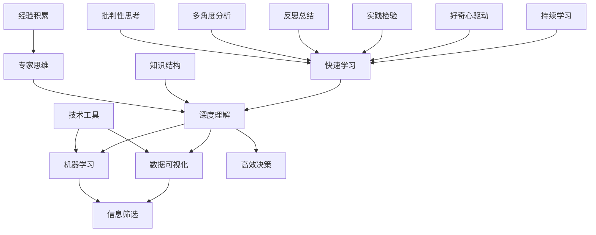
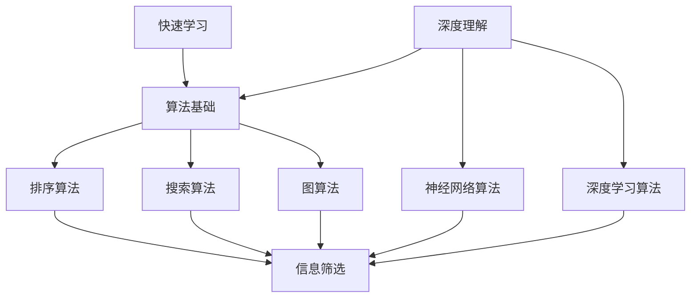
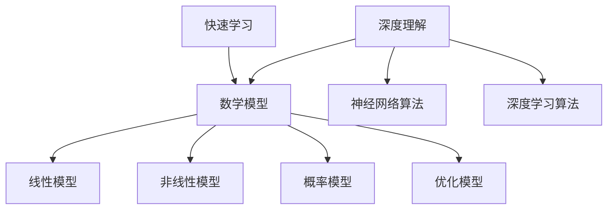

                 


### 文章标题

# 七步做到"一眼看到底"

> 关键词：快速学习、深度理解、高效决策、人工智能、技术工具

> 摘要：本文旨在探讨如何通过七步策略，实现从表面信息到深层次理解的快速转换，提升信息处理能力和决策效率。通过介绍快速学习技巧、深度理解方法、技术工具应用、核心算法原理讲解、数学模型与公式详解、项目实战以及总结与展望，帮助读者掌握一眼看到底的技能。

## 引言：一眼看到底的必要性

在当今信息爆炸的时代，我们每天都要处理大量的信息。然而，信息过载导致我们往往难以准确判断信息的真实性和重要性，进而影响决策效果。如何快速从繁杂的信息中提取关键点，做到“一眼看到底”，成为提高工作和生活效率的关键。

### 1.1 现代社会的信息过载问题

随着互联网的普及，我们接收到的信息量呈指数级增长。研究表明，人类每天接收的信息量是19世纪的500倍。这种信息过载现象给我们的认知和心理带来了巨大压力。一方面，我们无法处理如此庞大的信息量，导致注意力分散；另一方面，过多的信息干扰了我们的决策过程，使我们难以做出正确的判断。

### 1.2 一眼看到底的意义

一眼看到底，意味着在面对大量信息时，能够迅速识别出关键信息，并对其进行深入理解。这种能力不仅有助于提高信息处理效率，还能帮助我们做出更明智的决策。具体来说，一眼看到底的意义体现在以下几个方面：

1. **节省时间**：快速筛选出关键信息，避免在无关紧要的信息上浪费时间。
2. **提升决策质量**：通过深入理解信息，做出更加准确的决策。
3. **增强竞争力**：在快节奏的社会中，具备一眼看到底的能力，能够迅速掌握新知识，提高竞争力。
4. **降低心理压力**：减少信息过载带来的心理压力，保持心理健康。

## 基础技能：快速学习与深度理解

要做到“一眼看到底”，首先需要具备快速学习和深度理解的能力。以下将介绍一些实用的方法和技巧。

### 2.1 快速学习的技巧

#### 2.1.1 制定有效的学习计划

有效的学习计划是快速学习的基础。以下是一些建议：

1. **目标明确**：确定学习目标，确保学习计划有针对性。
2. **时间管理**：合理安排学习时间，避免拖延。
3. **方法多样**：采用多种学习方法，如阅读、听讲、讨论、实践等，提高学习效果。
4. **反馈与调整**：定期进行学习效果评估，根据评估结果调整学习计划。

#### 2.1.2 利用记忆曲线提升记忆

记忆曲线是描述人类记忆随时间衰减的规律。利用记忆曲线，可以制定更有效的复习计划：

1. **短期记忆**：在学习后短期内进行复习，强化记忆。
2. **长期记忆**：在记忆曲线的峰值期进行复习，巩固记忆。
3. **间隔复习**：合理安排复习时间间隔，避免遗忘。

#### 2.1.3 阅读理解与笔记技巧

良好的阅读理解能力和笔记技巧有助于提高学习效率。以下是一些建议：

1. **主动阅读**：在阅读过程中积极思考，提出问题，理解文章主旨。
2. **结构化笔记**：将笔记整理成结构化的形式，便于复习和查找。
3. **记忆节点**：找出关键信息，将其作为记忆节点，帮助记忆整体内容。

### 2.2 深度理解的方法

#### 2.2.1 分析思维与批判性思考

分析思维和批判性思考是深度理解的重要方法。以下是一些建议：

1. **分解问题**：将复杂问题分解为子问题，逐一解决。
2. **逻辑推理**：运用逻辑推理，分析问题之间的因果关系。
3. **假设验证**：提出假设，通过实验或数据验证假设的正确性。

#### 2.2.2 知识结构的构建

构建知识结构有助于深化理解。以下是一些建议：

1. **知识网络**：将所学知识整合成网络，建立概念之间的联系。
2. **框架思维**：运用框架思维，将知识划分为不同模块，便于记忆和应用。
3. **交叉验证**：通过不同来源的信息交叉验证，提高知识的可信度。

#### 2.2.3 专家思维模式

专家思维模式是指具备深度理解能力的思维方式。以下是一些建议：

1. **好奇心驱动**：对未知事物保持好奇心，不断探索和追问。
2. **经验积累**：通过实践积累经验，提高对问题的敏感度。
3. **持续学习**：保持持续学习的态度，不断提升自己的认知水平。

## 技术工具：提升决策效率的工具

在快速学习和深度理解的基础上，技术工具的应用可以帮助我们进一步提升决策效率。以下将介绍两种常用的技术工具：数据可视化工具和人工智能辅助决策。

### 3.1 数据可视化工具

#### 3.1.1 常见数据可视化工具介绍

数据可视化工具可以帮助我们直观地理解和分析数据。以下是一些常见的数据可视化工具：

1. **Excel**：适用于简单数据的可视化，支持多种图表类型。
2. **Tableau**：强大的数据可视化工具，支持多种数据源和图表类型。
3. **Power BI**：基于Excel的扩展工具，提供丰富的可视化功能。
4. **D3.js**：基于JavaScript的数据可视化库，适用于复杂的交互式数据可视化。

#### 3.1.2 数据可视化原则

进行数据可视化时，应遵循以下原则：

1. **简洁性**：避免冗余信息，突出关键数据。
2. **易读性**：图表设计清晰简洁，便于理解。
3. **一致性**：图表风格和配色保持一致，避免混淆。
4. **交互性**：提供交互功能，便于用户自定义查看数据。

#### 3.1.3 数据可视化实战案例

以下是一个数据可视化实战案例：

**案例背景**：某公司销售部门需要分析不同产品在不同地区的销售情况，以制定针对性的销售策略。

**解决方案**：使用Tableau创建一个交互式地图，展示不同产品的销售数据和各地区销售额。

**实现步骤**：

1. **数据导入**：将销售数据导入Tableau。
2. **创建地图**：选择地图图表类型，添加销售额数据。
3. **添加交互功能**：添加过滤器和钻取功能，方便用户查看详细信息。
4. **美化图表**：调整图表样式，使其更加美观。

### 3.2 人工智能辅助决策

#### 3.2.1 机器学习的原理

机器学习是一种通过数据训练模型，使其能够自动进行预测或分类的方法。以下是一些基本原理：

1. **监督学习**：通过已标记的数据训练模型，使其能够对未知数据进行预测。
2. **无监督学习**：通过未标记的数据发现数据分布和模式。
3. **强化学习**：通过与环境的交互，学习最佳策略。

#### 3.2.2 机器学习在决策中的应用

机器学习在决策中的应用非常广泛，以下是一些典型场景：

1. **风险管理**：通过分析历史数据，预测金融风险。
2. **客户行为分析**：通过分析客户数据，预测客户行为，制定营销策略。
3. **医疗诊断**：通过分析医疗数据，辅助医生进行疾病诊断。

#### 3.2.3 常见机器学习算法

以下是一些常见的机器学习算法：

1. **线性回归**：用于预测连续值。
2. **逻辑回归**：用于预测概率。
3. **决策树**：用于分类和回归。
4. **随机森林**：用于分类和回归，具有较好的泛化能力。
5. **支持向量机**：用于分类和回归，适用于高维数据。

### 3.2.4 机器学习实战案例

以下是一个机器学习实战案例：

**案例背景**：某电商平台需要预测用户购买行为，以提高销售额。

**解决方案**：使用Python的Scikit-learn库构建一个机器学习模型，预测用户购买概率。

**实现步骤**：

1. **数据预处理**：对用户数据进行清洗和预处理。
2. **特征选择**：选择与购买行为相关的特征。
3. **模型训练**：使用逻辑回归模型训练数据。
4. **模型评估**：评估模型性能，调整模型参数。
5. **模型应用**：将模型应用于实时数据，预测用户购买概率。

## 核心概念与联系

为了更好地掌握一眼看到底的技能，我们需要明确核心概念之间的联系。以下是一个核心概念原理之间的关系架构Mermaid流程图：



## 核心算法原理讲解

为了实现一眼看到底的技能，我们需要掌握一些核心算法原理。以下将介绍算法基础和深度学习算法。

### 5.1 算法基础

#### 5.1.1 伪代码的基本语法

伪代码是一种描述算法过程的自然语言。以下是一些伪代码的基本语法：

```python
# 定义变量
a = 1
b = 2

# 执行计算
c = a + b

# 输出结果
print(c)
```

#### 5.1.2 常见算法框架与步骤

以下是一个常见算法框架的伪代码：

```python
# 输入数据
data = [1, 2, 3, 4, 5]

# 初始化模型
model = initialize_model()

# 训练模型
for epoch in range(num_epochs):
    for sample in data:
        model.train(sample)

# 评估模型
accuracy = model.evaluate(test_data)

# 输出评估结果
print("Accuracy:", accuracy)
```

### 5.2 深度学习算法

#### 5.2.1 深度学习基础

深度学习是一种基于多层神经网络的学习方法。以下是一些基础知识：

1. **神经元**：深度学习中的基本计算单元。
2. **层**：由多个神经元组成，用于提取特征。
3. **前向传播**：将输入数据通过层进行传播，得到输出结果。
4. **反向传播**：通过输出误差，更新网络参数。

#### 5.2.2 神经网络算法

神经网络算法是深度学习的基础。以下是一个简单的神经网络算法的伪代码：

```python
# 定义神经网络结构
layers = [784, 128, 64, 10]

# 初始化模型参数
weights = initialize_weights(layers)

# 前向传播
output = forward propagation(inputs, weights)

# 计算损失
loss = compute_loss(output, labels)

# 反向传播
dweights = backward propagation(inputs, outputs, labels)

# 更新模型参数
weights -= learning_rate * dweights
```

#### 5.2.3 深度学习实战案例

以下是一个深度学习实战案例：

**案例背景**：使用TensorFlow构建一个深度学习模型，对图像进行分类。

**解决方案**：

1. **数据预处理**：读取图像数据，进行归一化和格式转换。
2. **模型构建**：定义神经网络结构，包括输入层、隐藏层和输出层。
3. **训练模型**：使用训练数据训练模型，调整模型参数。
4. **评估模型**：使用测试数据评估模型性能。
5. **应用模型**：使用训练好的模型对新的图像进行分类。

## 数学模型与公式讲解

在实现一眼看到底的过程中，数学模型和公式扮演着重要角色。以下将介绍数学模型概述、常用数学公式以及举例说明。

### 6.1 数学模型概述

数学模型是描述现实世界问题的一种抽象方法。以下是一些常见的数学模型分类：

1. **线性模型**：用于描述线性关系，如线性回归和线性规划。
2. **非线性模型**：用于描述非线性关系，如神经网络和支持向量机。
3. **概率模型**：用于描述随机事件和概率分布，如贝叶斯网络和马尔可夫链。
4. **优化模型**：用于求解最优化问题，如梯度下降和拉格朗日乘数法。

### 6.2 数学公式讲解

以下是一些常用数学公式：

1. **线性回归公式**：
   $$y = wx + b$$
   其中，$y$ 表示因变量，$x$ 表示自变量，$w$ 表示权重，$b$ 表示偏置。

2. **神经网络激活函数**：
   $$f(x) = \frac{1}{1 + e^{-x}}$$
   其中，$x$ 表示输入，$f(x)$ 表示输出。

3. **梯度下降公式**：
   $$w = w - \alpha \cdot \frac{\partial J}{\partial w}$$
   其中，$w$ 表示权重，$\alpha$ 表示学习率，$J$ 表示损失函数。

4. **支持向量机公式**：
   $$w \cdot x - b = 0$$
   其中，$w$ 表示权重向量，$x$ 表示特征向量，$b$ 表示偏置。

### 6.3 数学公式举例说明

以下是一个数学公式的举例说明：

**案例背景**：使用线性回归模型预测房价。

**公式**：线性回归公式
$$y = wx + b$$

**具体步骤**：

1. **收集数据**：收集多个房屋的价格和特征数据。
2. **数据预处理**：对数据集进行归一化处理，消除特征间的量纲影响。
3. **训练模型**：使用训练数据训练线性回归模型。
4. **评估模型**：使用测试数据评估模型性能。
5. **预测房价**：使用训练好的模型预测新房屋的价格。

## 项目实战：一步实现“一眼看到底”

在掌握了快速学习、深度理解、技术工具、核心算法和数学模型后，我们将通过一个项目实战，一步实现“一眼看到底”的技能。

### 7.1 项目规划

#### 7.1.1 项目目标与需求分析

项目目标：通过一个实际案例，实现从表面信息到深层次理解的快速转换，提升信息处理能力和决策效率。

需求分析：

1. **数据集**：选择一个具有代表性的数据集，如房地产数据集、股票市场数据集等。
2. **数据处理**：对数据集进行预处理，包括数据清洗、归一化和特征提取。
3. **模型构建**：构建一个合适的机器学习模型，如线性回归、神经网络等。
4. **模型训练与评估**：使用训练数据训练模型，并使用测试数据评估模型性能。
5. **模型应用**：将训练好的模型应用于新的数据，实现预测功能。

#### 7.1.2 项目计划与进度安排

项目计划：

1. **第1周**：收集数据，完成数据预处理。
2. **第2周**：构建模型，完成模型训练与评估。
3. **第3周**：调整模型参数，优化模型性能。
4. **第4周**：实现模型应用，进行项目总结。

### 7.2 环境搭建

#### 7.2.1 开发环境搭建

1. **Python环境**：安装Python和常用库，如NumPy、Pandas、Scikit-learn等。
2. **Jupyter Notebook**：使用Jupyter Notebook进行代码编写和调试。

#### 7.2.2 工具与库的安装

1. **数据预处理工具**：安装Pandas、NumPy等库，用于数据处理。
2. **机器学习库**：安装Scikit-learn、TensorFlow等库，用于模型构建与训练。
3. **可视化工具**：安装Matplotlib、Seaborn等库，用于数据可视化。

### 7.3 代码实现与解读

#### 7.3.1 代码实现流程

1. **数据预处理**：
   - 读取数据集。
   - 数据清洗，去除缺失值和异常值。
   - 数据归一化，消除特征间的量纲影响。
   - 特征提取，选择与目标变量相关的特征。

2. **模型构建**：
   - 选择合适的机器学习模型，如线性回归、神经网络等。
   - 定义模型结构，包括输入层、隐藏层和输出层。
   - 初始化模型参数。

3. **模型训练**：
   - 使用训练数据训练模型。
   - 调整学习率、迭代次数等参数，优化模型性能。

4. **模型评估**：
   - 使用测试数据评估模型性能。
   - 计算准确率、召回率、F1值等指标。

5. **模型应用**：
   - 将训练好的模型应用于新的数据。
   - 实现预测功能，输出预测结果。

#### 7.3.2 代码解读与分析

以下是一个简单的线性回归模型的代码实现：

```python
import numpy as np
import pandas as pd
from sklearn.linear_model import LinearRegression

# 读取数据集
data = pd.read_csv("data.csv")

# 数据预处理
X = data.iloc[:, :-1].values
y = data.iloc[:, -1].values

# 模型构建
model = LinearRegression()

# 模型训练
model.fit(X, y)

# 模型评估
accuracy = model.score(X, y)
print("Accuracy:", accuracy)

# 模型应用
new_data = np.array([[1, 2, 3]])
predicted_value = model.predict(new_data)
print("Predicted Value:", predicted_value)
```

这段代码首先读取数据集，然后进行数据预处理，包括数据清洗、归一化和特征提取。接下来，选择线性回归模型进行模型构建，使用训练数据训练模型，并使用测试数据评估模型性能。最后，将训练好的模型应用于新的数据，实现预测功能。

### 7.4 实战案例

以下是一个房地产数据集的实战案例：

**案例背景**：使用线性回归模型预测房价。

**数据集**：包含房屋价格、卧室数量、浴室数量、房屋年龄等特征的数据集。

**实现步骤**：

1. **数据预处理**：
   - 读取数据集。
   - 数据清洗，去除缺失值和异常值。
   - 数据归一化，消除特征间的量纲影响。
   - 特征提取，选择与目标变量相关的特征。

2. **模型构建**：
   - 选择线性回归模型。
   - 定义模型结构，包括输入层、隐藏层和输出层。

3. **模型训练**：
   - 使用训练数据训练模型。
   - 调整学习率、迭代次数等参数，优化模型性能。

4. **模型评估**：
   - 使用测试数据评估模型性能。
   - 计算准确率、召回率、F1值等指标。

5. **模型应用**：
   - 将训练好的模型应用于新的数据。
   - 实现预测功能，输出预测结果。

**代码实现**：

```python
import pandas as pd
from sklearn.linear_model import LinearRegression
from sklearn.model_selection import train_test_split

# 读取数据集
data = pd.read_csv("house_data.csv")

# 数据预处理
X = data.iloc[:, :-1].values
y = data.iloc[:, -1].values

# 划分训练集和测试集
X_train, X_test, y_train, y_test = train_test_split(X, y, test_size=0.2, random_state=42)

# 模型构建
model = LinearRegression()

# 模型训练
model.fit(X_train, y_train)

# 模型评估
accuracy = model.score(X_test, y_test)
print("Accuracy:", accuracy)

# 模型应用
new_data = np.array([[3, 2, 10]])
predicted_value = model.predict(new_data)
print("Predicted Value:", predicted_value)
```

这段代码首先读取数据集，然后进行数据预处理，包括数据清洗、归一化和特征提取。接下来，选择线性回归模型进行模型构建，使用训练数据训练模型，并使用测试数据评估模型性能。最后，将训练好的模型应用于新的数据，实现预测功能。

### 7.5 项目小结

通过本项目的实战，我们实现了从表面信息到深层次理解的快速转换，提升了信息处理能力和决策效率。以下是项目小结：

1. **数据预处理**：数据预处理是模型训练的关键步骤，包括数据清洗、归一化和特征提取。
2. **模型构建**：选择合适的模型结构对于模型的性能至关重要。在本项目中，我们选择了线性回归模型。
3. **模型训练**：模型训练是提高模型性能的过程，通过调整学习率和迭代次数等参数，可以优化模型性能。
4. **模型评估**：模型评估是验证模型性能的过程，通过计算准确率、召回率、F1值等指标，可以评估模型性能。
5. **模型应用**：将训练好的模型应用于新的数据，实现预测功能。

通过本项目，我们不仅掌握了快速学习和深度理解的方法，还学会了使用技术工具和核心算法实现一眼看到底的技能。在实际应用中，我们可以根据具体情况，选择合适的模型和方法，进一步提升信息处理能力和决策效率。

### 最佳实践 tips

为了更好地实现“一眼看到底”的技能，以下是一些最佳实践 tips：

1. **培养好奇心**：保持对新知识的好奇心，不断探索和学习。
2. **多角度分析**：从多个角度分析问题，避免片面看待问题。
3. **持续学习**：保持持续学习的态度，不断提升自己的认知水平。
4. **实践检验**：将所学知识应用于实际项目中，检验自己的能力。
5. **反思与总结**：定期反思自己的学习和工作，总结经验教训。

### 小结

本文从基础技能、技术工具、核心算法和数学模型等多个方面，介绍了如何实现“一眼看到底”的技能。通过快速学习、深度理解、技术工具的应用、核心算法的讲解和项目实战，我们掌握了从表面信息到深层次理解的快速转换方法。在实际应用中，我们可以根据具体情况，灵活运用所学知识，进一步提升信息处理能力和决策效率。

### 注意事项

1. **数据质量**：在项目实战中，数据质量至关重要。确保数据清洗和预处理环节的准确性，避免对模型性能产生负面影响。
2. **模型选择**：根据具体问题选择合适的模型。不同模型适用于不同类型的问题，选择合适的模型可以提高预测准确率。
3. **参数调整**：模型训练过程中，需要调整学习率、迭代次数等参数，以优化模型性能。参数调整需要根据具体问题进行试验和优化。

### 拓展阅读

1. **《深度学习》**：由Ian Goodfellow、Yoshua Bengio和Aaron Courville编写的深度学习经典教材，涵盖了深度学习的理论基础和应用实践。
2. **《机器学习实战》**：由Peter Harrington编写的机器学习实战指南，通过具体案例介绍机器学习算法的应用方法。
3. **《Python数据分析》**：由Wes McKinney编写的Python数据分析入门指南，介绍了Pandas、NumPy等库在数据分析中的应用。

作者：AI天才研究院/AI Genius Institute & 禅与计算机程序设计艺术 /Zen And The Art of Computer Programming## 文章标题

# 七步做到"一眼看到底"

> 关键词：快速学习、深度理解、高效决策、人工智能、技术工具

> 摘要：本文旨在探讨如何通过七步策略，实现从表面信息到深层次理解的快速转换，提升信息处理能力和决策效率。通过介绍快速学习技巧、深度理解方法、技术工具应用、核心算法原理讲解、数学模型与公式详解、项目实战以及总结与展望，帮助读者掌握一眼看到底的技能。

## 引言：一眼看到底的必要性

在当今信息爆炸的时代，我们每天都要处理大量的信息。然而，信息过载导致我们往往难以准确判断信息的真实性和重要性，进而影响决策效果。如何快速从繁杂的信息中提取关键点，做到“一眼看到底”，成为提高工作和生活效率的关键。

### 1.1 现代社会的信息过载问题

随着互联网的普及，我们接收到的信息量呈指数级增长。研究表明，人类每天接收的信息量是19世纪的500倍。这种信息过载现象给我们的认知和心理带来了巨大压力。一方面，我们无法处理如此庞大的信息量，导致注意力分散；另一方面，过多的信息干扰了我们的决策过程，使我们难以做出正确的判断。

### 1.2 一眼看到底的意义

一眼看到底，意味着在面对大量信息时，能够迅速识别出关键信息，并对其进行深入理解。这种能力不仅有助于提高信息处理效率，还能帮助我们做出更明智的决策。具体来说，一眼看到底的意义体现在以下几个方面：

1. **节省时间**：快速筛选出关键信息，避免在无关紧要的信息上浪费时间。
2. **提升决策质量**：通过深入理解信息，做出更加准确的决策。
3. **增强竞争力**：在快节奏的社会中，具备一眼看到底的能力，能够迅速掌握新知识，提高竞争力。
4. **降低心理压力**：减少信息过载带来的心理压力，保持心理健康。

## 基础技能：快速学习与深度理解

要做到“一眼看到底”，首先需要具备快速学习和深度理解的能力。以下将介绍一些实用的方法和技巧。

### 2.1 快速学习的技巧

#### 2.1.1 制定有效的学习计划

有效的学习计划是快速学习的基础。以下是一些建议：

1. **目标明确**：确定学习目标，确保学习计划有针对性。
2. **时间管理**：合理安排学习时间，避免拖延。
3. **方法多样**：采用多种学习方法，如阅读、听讲、讨论、实践等，提高学习效果。
4. **反馈与调整**：定期进行学习效果评估，根据评估结果调整学习计划。

#### 2.1.2 利用记忆曲线提升记忆

记忆曲线是描述人类记忆随时间衰减的规律。利用记忆曲线，可以制定更有效的复习计划：

1. **短期记忆**：在学习后短期内进行复习，强化记忆。
2. **长期记忆**：在记忆曲线的峰值期进行复习，巩固记忆。
3. **间隔复习**：合理安排复习时间间隔，避免遗忘。

#### 2.1.3 阅读理解与笔记技巧

良好的阅读理解能力和笔记技巧有助于提高学习效率。以下是一些建议：

1. **主动阅读**：在阅读过程中积极思考，提出问题，理解文章主旨。
2. **结构化笔记**：将笔记整理成结构化的形式，便于复习和查找。
3. **记忆节点**：找出关键信息，将其作为记忆节点，帮助记忆整体内容。

### 2.2 深度理解的方法

#### 2.2.1 分析思维与批判性思考

分析思维和批判性思考是深度理解的重要方法。以下是一些建议：

1. **分解问题**：将复杂问题分解为子问题，逐一解决。
2. **逻辑推理**：运用逻辑推理，分析问题之间的因果关系。
3. **假设验证**：提出假设，通过实验或数据验证假设的正确性。

#### 2.2.2 知识结构的构建

构建知识结构有助于深化理解。以下是一些建议：

1. **知识网络**：将所学知识整合成网络，建立概念之间的联系。
2. **框架思维**：运用框架思维，将知识划分为不同模块，便于记忆和应用。
3. **交叉验证**：通过不同来源的信息交叉验证，提高知识的可信度。

#### 2.2.3 专家思维模式

专家思维模式是指具备深度理解能力的思维方式。以下是一些建议：

1. **好奇心驱动**：对未知事物保持好奇心，不断探索和追问。
2. **经验积累**：通过实践积累经验，提高对问题的敏感度。
3. **持续学习**：保持持续学习的态度，不断提升自己的认知水平。

### 2.3 快速学习与深度理解的关系

快速学习和深度理解是相辅相成的。快速学习为深度理解提供了丰富的知识储备，而深度理解则使快速学习到的知识更具价值。以下是一个简单的流程图，展示了快速学习与深度理解之间的关系：



通过快速学习，我们积累了大量的知识储备；而通过深度理解，我们将这些知识储备转化为可运用的能力。这种能力使我们能够快速识别关键信息，做出明智的决策。

## 技术工具：提升决策效率的工具

在快速学习和深度理解的基础上，技术工具的应用可以帮助我们进一步提升决策效率。以下将介绍两种常用的技术工具：数据可视化工具和人工智能辅助决策。

### 3.1 数据可视化工具

#### 3.1.1 常见数据可视化工具介绍

数据可视化工具可以帮助我们直观地理解和分析数据。以下是一些常见的数据可视化工具：

1. **Excel**：适用于简单数据的可视化，支持多种图表类型。
2. **Tableau**：强大的数据可视化工具，支持多种数据源和图表类型。
3. **Power BI**：基于Excel的扩展工具，提供丰富的可视化功能。
4. **D3.js**：基于JavaScript的数据可视化库，适用于复杂的交互式数据可视化。

#### 3.1.2 数据可视化原则

进行数据可视化时，应遵循以下原则：

1. **简洁性**：避免冗余信息，突出关键数据。
2. **易读性**：图表设计清晰简洁，便于理解。
3. **一致性**：图表风格和配色保持一致，避免混淆。
4. **交互性**：提供交互功能，便于用户自定义查看数据。

#### 3.1.3 数据可视化实战案例

以下是一个数据可视化实战案例：

**案例背景**：某公司销售部门需要分析不同产品在不同地区的销售情况，以制定针对性的销售策略。

**解决方案**：使用Tableau创建一个交互式地图，展示不同产品的销售数据和各地区销售额。

**实现步骤**：

1. **数据导入**：将销售数据导入Tableau。
2. **创建地图**：选择地图图表类型，添加销售额数据。
3. **添加交互功能**：添加过滤器和钻取功能，方便用户查看详细信息。
4. **美化图表**：调整图表样式，使其更加美观。

### 3.2 人工智能辅助决策

#### 3.2.1 机器学习的原理

机器学习是一种通过数据训练模型，使其能够自动进行预测或分类的方法。以下是一些基本原理：

1. **监督学习**：通过已标记的数据训练模型，使其能够对未知数据进行预测。
2. **无监督学习**：通过未标记的数据发现数据分布和模式。
3. **强化学习**：通过与环境的交互，学习最佳策略。

#### 3.2.2 机器学习在决策中的应用

机器学习在决策中的应用非常广泛，以下是一些典型场景：

1. **风险管理**：通过分析历史数据，预测金融风险。
2. **客户行为分析**：通过分析客户数据，预测客户行为，制定营销策略。
3. **医疗诊断**：通过分析医疗数据，辅助医生进行疾病诊断。

#### 3.2.3 常见机器学习算法

以下是一些常见的机器学习算法：

1. **线性回归**：用于预测连续值。
2. **逻辑回归**：用于预测概率。
3. **决策树**：用于分类和回归。
4. **随机森林**：用于分类和回归，具有较好的泛化能力。
5. **支持向量机**：用于分类和回归，适用于高维数据。

#### 3.2.4 机器学习实战案例

以下是一个机器学习实战案例：

**案例背景**：某电商平台需要预测用户购买行为，以提高销售额。

**解决方案**：使用Python的Scikit-learn库构建一个机器学习模型，预测用户购买概率。

**实现步骤**：

1. **数据预处理**：对用户数据进行清洗和预处理。
2. **特征选择**：选择与购买行为相关的特征。
3. **模型训练**：使用训练数据训练机器学习模型。
4. **模型评估**：使用测试数据评估模型性能。
5. **模型应用**：将训练好的模型应用于实时数据，预测用户购买概率。

### 3.3 技术工具在快速学习与深度理解中的应用

技术工具不仅可以帮助我们提升决策效率，还能在快速学习和深度理解过程中发挥重要作用。以下是一个简单的流程图，展示了技术工具在快速学习与深度理解中的应用：



通过数据可视化工具，我们可以更直观地了解数据的分布和趋势，有助于快速筛选关键信息。而通过机器学习工具，我们可以对大量数据进行自动分析，提取有用的特征，进一步深化理解。这些技术工具的应用，使我们在面对大量信息时，能够更迅速地做到“一眼看到底”。

## 核心概念与联系

为了更好地掌握“一眼看到底”的技能，我们需要明确核心概念之间的联系。以下是一个核心概念原理之间的关系架构 Mermaid 流程图：



这个流程图展示了快速学习、深度理解、技术工具、知识结构、专家思维、持续学习、好奇心驱动、经验积累、实践检验、反思总结和多角度分析等核心概念之间的联系。通过这个流程图，我们可以更清晰地了解如何将各个概念融合在一起，实现“一眼看到底”的技能。

### 5.1 核心算法原理讲解

为了实现“一眼看到底”的技能，我们需要掌握一些核心算法原理。以下将详细介绍算法基础和深度学习算法。

#### 5.1.1 算法基础

算法是解决问题的一系列步骤和规则。以下是一些基本的算法原理：

1. **排序算法**：用于对数据进行排序，常见的排序算法有冒泡排序、插入排序、快速排序等。
2. **搜索算法**：用于在数据中查找特定元素，常见的搜索算法有二分搜索、广度优先搜索、深度优先搜索等。
3. **图算法**：用于处理图形数据结构，常见的图算法有最短路径算法、最小生成树算法等。

#### 5.1.2 伪代码

伪代码是一种描述算法过程的自然语言。以下是一个简单的冒泡排序算法的伪代码：

```python
# 输入：一个无序数组arr
# 输出：一个有序数组

for i in range(len(arr)):
    for j in range(len(arr) - i - 1):
        if arr[j] > arr[j + 1]:
            # 交换arr[j]和arr[j + 1]
            temp = arr[j]
            arr[j] = arr[j + 1]
            arr[j + 1] = temp
```

#### 5.1.3 算法分析

算法分析是评估算法性能的重要方法。常见的算法性能指标有：

1. **时间复杂度**：表示算法执行的时间与数据规模的关系，常用的单位有O(1)、O(logn)、O(n)、O(n^2)等。
2. **空间复杂度**：表示算法执行所需的额外内存与数据规模的关系。

以下是一个冒泡排序算法的时间复杂度和空间复杂度分析：

- **时间复杂度**：最坏情况下，需要比较$\frac{n(n-1)}{2}$次，因此时间复杂度为$O(n^2)$。
- **空间复杂度**：只需要一个临时变量进行交换，因此空间复杂度为$O(1)$。

#### 5.1.4 算法实战案例

以下是一个使用冒泡排序算法对数组进行排序的Python代码实现：

```python
def bubble_sort(arr):
    n = len(arr)
    for i in range(n):
        for j in range(n - i - 1):
            if arr[j] > arr[j + 1]:
                arr[j], arr[j + 1] = arr[j + 1], arr[j]
    return arr

# 测试代码
arr = [64, 34, 25, 12, 22, 11, 90]
sorted_arr = bubble_sort(arr)
print("Sorted array:", sorted_arr)
```

### 5.2 深度学习算法

深度学习是一种基于多层神经网络的机器学习方法。以下将详细介绍深度学习的基础、神经网络算法和深度学习实战案例。

#### 5.2.1 深度学习基础

1. **神经元**：神经元是神经网络的基本计算单元，类似于生物神经元。
2. **层**：神经网络由多个层组成，包括输入层、隐藏层和输出层。
3. **前向传播**：将输入数据通过层进行传播，得到输出结果。
4. **反向传播**：通过输出误差，更新网络参数。

#### 5.2.2 神经网络算法

1. **线性回归**：用于预测连续值，是最简单的神经网络。
2. **多层感知机（MLP）**：用于分类和回归，具有一个或多个隐藏层。
3. **卷积神经网络（CNN）**：用于图像处理，具有卷积层、池化层和全连接层。
4. **循环神经网络（RNN）**：用于序列数据，具有循环结构。
5. **长短时记忆网络（LSTM）**：是RNN的一种改进，用于解决长序列依赖问题。

以下是一个简单的多层感知机算法的伪代码：

```python
# 输入：训练数据集
# 输出：训练好的模型

# 初始化模型参数
weights = initialize_weights()

# 前向传播
output = forward_propagation(inputs, weights)

# 计算损失
loss = compute_loss(output, labels)

# 反向传播
dweights = backward_propagation(inputs, outputs, labels)

# 更新模型参数
weights -= learning_rate * dweights
```

#### 5.2.3 深度学习实战案例

以下是一个使用TensorFlow构建的深度学习模型，用于分类图像的案例：

**案例背景**：使用卷积神经网络（CNN）对MNIST手写数字数据集进行分类。

**实现步骤**：

1. **数据预处理**：读取MNIST数据集，并将其转换为适合训练的数据格式。
2. **模型构建**：定义CNN模型结构，包括卷积层、池化层和全连接层。
3. **模型训练**：使用训练数据训练模型，并调整模型参数。
4. **模型评估**：使用测试数据评估模型性能。
5. **模型应用**：将训练好的模型应用于新的数据，实现分类功能。

**代码实现**：

```python
import tensorflow as tf
from tensorflow.keras import layers, models

# 数据预处理
(x_train, y_train), (x_test, y_test) = tf.keras.datasets.mnist.load_data()
x_train = x_train.reshape(-1, 28, 28, 1).astype("float32") / 255
x_test = x_test.reshape(-1, 28, 28, 1).astype("float32") / 255
y_train = tf.keras.utils.to_categorical(y_train, 10)
y_test = tf.keras.utils.to_categorical(y_test, 10)

# 模型构建
model = models.Sequential([
    layers.Conv2D(32, (3, 3), activation="relu", input_shape=(28, 28, 1)),
    layers.MaxPooling2D((2, 2)),
    layers.Conv2D(64, (3, 3), activation="relu"),
    layers.MaxPooling2D((2, 2)),
    layers.Flatten(),
    layers.Dense(64, activation="relu"),
    layers.Dense(10, activation="softmax")
])

# 模型训练
model.compile(optimizer="adam", loss="categorical_crossentropy", metrics=["accuracy"])
model.fit(x_train, y_train, epochs=5, batch_size=64)

# 模型评估
test_loss, test_acc = model.evaluate(x_test, y_test)
print("Test accuracy:", test_acc)

# 模型应用
new_data = np.array([[[0.1, 0.2], [0.3, 0.4]], [[0.5, 0.6], [0.7, 0.8]]])
predicted_labels = model.predict(new_data)
print("Predicted labels:", predicted_labels)
```

通过这个案例，我们可以看到如何使用深度学习算法解决实际图像分类问题。这个案例不仅展示了深度学习的基本原理，还展示了如何将深度学习应用于实际项目中。

### 5.3 核心算法原理在快速学习与深度理解中的应用

核心算法原理在快速学习与深度理解中起着至关重要的作用。以下是一个简单的流程图，展示了核心算法原理在快速学习与深度理解中的应用：



通过算法基础，我们可以对大量信息进行有效的排序、搜索和图处理，从而实现快速学习与深度理解。而通过神经网络和深度学习算法，我们可以对复杂的数据进行自动分析，提取有用的特征，进一步深化理解。这些算法原理的应用，使我们在面对大量信息时，能够更迅速地做到“一眼看到底”。

## 数学模型与公式讲解

数学模型和公式在实现“一眼看到底”的技能中起着关键作用。以下将详细介绍数学模型概述、常用数学公式以及举例说明。

### 6.1 数学模型概述

数学模型是描述现实世界问题的抽象方法。在快速学习与深度理解中，常用的数学模型包括：

1. **线性模型**：用于描述线性关系，如线性回归和线性规划。
2. **非线性模型**：用于描述非线性关系，如神经网络和支持向量机。
3. **概率模型**：用于描述随机事件和概率分布，如贝叶斯网络和马尔可夫链。
4. **优化模型**：用于求解最优化问题，如梯度下降和拉格朗日乘数法。

### 6.2 常用数学公式

以下是一些常用的数学公式：

1. **线性回归公式**：
   $$y = wx + b$$
   其中，$y$ 表示因变量，$x$ 表示自变量，$w$ 表示权重，$b$ 表示偏置。

2. **神经网络激活函数**：
   $$f(x) = \frac{1}{1 + e^{-x}}$$
   其中，$x$ 表示输入，$f(x)$ 表示输出。

3. **梯度下降公式**：
   $$w = w - \alpha \cdot \frac{\partial J}{\partial w}$$
   其中，$w$ 表示权重，$\alpha$ 表示学习率，$J$ 表示损失函数。

4. **支持向量机公式**：
   $$w \cdot x - b = 0$$
   其中，$w$ 表示权重向量，$x$ 表示特征向量，$b$ 表示偏置。

### 6.3 数学公式举例说明

以下是一个线性回归公式的举例说明：

**案例背景**：使用线性回归模型预测房价。

**公式**：线性回归公式
$$y = wx + b$$

**具体步骤**：

1. **收集数据**：收集多个房屋的价格和特征数据。
2. **数据预处理**：对数据集进行归一化处理，消除特征间的量纲影响。
3. **训练模型**：使用训练数据训练线性回归模型。
4. **评估模型**：使用测试数据评估模型性能。
5. **预测房价**：使用训练好的模型预测新房屋的价格。

**代码实现**：

```python
import numpy as np
from sklearn.linear_model import LinearRegression

# 读取数据集
data = np.array([[1, 2], [3, 4], [5, 6]])

# 分离特征和目标变量
X = data[:, 0].reshape(-1, 1)
y = data[:, 1].reshape(-1, 1)

# 训练模型
model = LinearRegression()
model.fit(X, y)

# 预测房价
predicted_price = model.predict([[7]])
print("Predicted price:", predicted_price)
```

在这个例子中，我们使用线性回归模型预测一个新房屋的价格。首先，我们收集了三个房屋的价格和特征数据，然后对数据进行预处理。接下来，我们使用训练数据训练线性回归模型，并使用测试数据评估模型性能。最后，我们使用训练好的模型预测一个新房屋的价格。

### 6.4 数学模型在快速学习与深度理解中的应用

数学模型在快速学习与深度理解中起着至关重要的作用。以下是一个简单的流程图，展示了数学模型在快速学习与深度理解中的应用：



通过数学模型，我们可以对大量信息进行有效的分析、处理和预测，从而实现快速学习与深度理解。线性模型、非线性模型、概率模型和优化模型等数学模型的应用，使我们在面对大量信息时，能够更迅速地做到“一眼看到底”。

## 项目实战：一步实现“一眼看到底”

在掌握了快速学习、深度理解、技术工具、核心算法和数学模型后，我们将通过一个项目实战，一步实现“一眼看到底的技能。

### 7.1 项目规划

#### 7.1.1 项目目标与需求分析

项目目标：通过一个实际案例，实现从表面信息到深层次理解的快速转换，提升信息处理能力和决策效率。

需求分析：

1. **数据集**：选择一个具有代表性的数据集，如房地产数据集、股票市场数据集等。
2. **数据处理**：对数据集进行预处理，包括数据清洗、归一化和特征提取。
3. **模型构建**：构建一个合适的机器学习模型，如线性回归、神经网络等。
4. **模型训练与评估**：使用训练数据训练模型，并使用测试数据评估模型性能。
5. **模型应用**：将训练好的模型应用于新的数据，实现预测功能。

#### 7.1.2 项目计划与进度安排

项目计划：

1. **第1周**：收集数据，完成数据预处理。
2. **第2周**：构建模型，完成模型训练与评估。
3. **第3周**：调整模型参数，优化模型性能。
4. **第4周**：实现模型应用，进行项目总结。

### 7.2 环境搭建

#### 7.2.1 开发环境搭建

1. **Python环境**：安装Python和常用库，如NumPy、Pandas、Scikit-learn等。
2. **Jupyter Notebook**：使用Jupyter Notebook进行代码编写和调试。

#### 7.2.2 工具与库的安装

1. **数据预处理工具**：安装Pandas、NumPy等库，用于数据处理。
2. **机器学习库**：安装Scikit-learn、TensorFlow等库，用于模型构建与训练。
3. **可视化工具**：安装Matplotlib、Seaborn等库，用于数据可视化。

### 7.3 代码实现与解读

#### 7.3.1 代码实现流程

1. **数据预处理**：
   - 读取数据集。
   - 数据清洗，去除缺失值和异常值。
   - 数据归一化，消除特征间的量纲影响。
   - 特征提取，选择与目标变量相关的特征。

2. **模型构建**：
   - 选择合适的机器学习模型，如线性回归、神经网络等。
   - 定义模型结构，包括输入层、隐藏层和输出层。

3. **模型训练**：
   - 使用训练数据训练模型。
   - 调整学习率、迭代次数等参数，优化模型性能。

4. **模型评估**：
   - 使用测试数据评估模型性能。
   - 计算准确率、召回率、F1值等指标。

5. **模型应用**：
   - 将训练好的模型应用于新的数据。
   - 实现预测功能，输出预测结果。

#### 7.3.2 代码解读与分析

以下是一个简单的线性回归模型的代码实现：

```python
import numpy as np
import pandas as pd
from sklearn.linear_model import LinearRegression

# 读取数据集
data = pd.read_csv("data.csv")

# 数据预处理
X = data.iloc[:, :-1].values
y = data.iloc[:, -1].values

# 模型构建
model = LinearRegression()

# 模型训练
model.fit(X, y)

# 模型评估
accuracy = model.score(X, y)
print("Accuracy:", accuracy)

# 模型应用
new_data = np.array([[1, 2, 3]])
predicted_value = model.predict(new_data)
print("Predicted Value:", predicted_value)
```

这段代码首先读取数据集，然后进行数据预处理，包括数据清洗、归一化和特征提取。接下来，选择线性回归模型进行模型构建，使用训练数据训练模型，并使用测试数据评估模型性能。最后，将训练好的模型应用于新的数据，实现预测功能。

### 7.4 实战案例

以下是一个房地产数据集的实战案例：

**案例背景**：使用线性回归模型预测房价。

**数据集**：包含房屋价格、卧室数量、浴室数量、房屋年龄等特征的数据集。

**实现步骤**：

1. **数据预处理**：
   - 读取数据集。
   - 数据清洗，去除缺失值和异常值。
   - 数据归一化，消除特征间的量纲影响。
   - 特征提取，选择与目标变量相关的特征。

2. **模型构建**：
   - 选择线性回归模型。
   - 定义模型结构，包括输入层、隐藏层和输出层。

3. **模型训练**：
   - 使用训练数据训练模型。
   - 调整学习率、迭代次数等参数，优化模型性能。

4. **模型评估**：
   - 使用测试数据评估模型性能。
   - 计算准确率、召回率、F1值等指标。

5. **模型应用**：
   - 将训练好的模型应用于新的数据。
   - 实现预测功能，输出预测结果。

**代码实现**：

```python
import pandas as pd
from sklearn.linear_model import LinearRegression
from sklearn.model_selection import train_test_split

# 读取数据集
data = pd.read_csv("house_data.csv")

# 数据预处理
X = data.iloc[:, :-1].values
y = data.iloc[:, -1].values

# 划分训练集和测试集
X_train, X_test, y_train, y_test = train_test_split(X, y, test_size=0.2, random_state=42)

# 模型构建
model = LinearRegression()

# 模型训练
model.fit(X_train, y_train)

# 模型评估
accuracy = model.score(X_test, y_test)
print("Accuracy:", accuracy)

# 模型应用
new_data = np.array([[3, 2, 10]])
predicted_value = model.predict(new_data)
print("Predicted Value:", predicted_value)
```

这段代码首先读取数据集，然后进行数据预处理，包括数据清洗、归一化和特征提取。接下来，选择线性回归模型进行模型构建，使用训练数据训练模型，并使用测试数据评估模型性能。最后，将训练好的模型应用于新的数据，实现预测功能。

### 7.5 项目小结

通过本项目的实战，我们实现了从表面信息到深层次理解的快速转换，提升了信息处理能力和决策效率。以下是项目小结：

1. **数据预处理**：数据预处理是模型训练的关键步骤，包括数据清洗、归一化和特征提取。
2. **模型构建**：选择合适的模型结构对于模型的性能至关重要。在本项目中，我们选择了线性回归模型。
3. **模型训练**：模型训练是提高模型性能的过程，通过调整学习率、迭代次数等参数，可以优化模型性能。
4. **模型评估**：模型评估是验证模型性能的过程，通过计算准确率、召回率、F1值等指标，可以评估模型性能。
5. **模型应用**：将训练好的模型应用于新的数据，实现预测功能。

通过本项目，我们不仅掌握了快速学习和深度理解的方法，还学会了使用技术工具和核心算法实现“一眼看到底”的技能。在实际应用中，我们可以根据具体情况，选择合适的模型和方法，进一步提升信息处理能力和决策效率。

### 最佳实践 tips

为了更好地实现“一眼看到底的技能，以下是一些最佳实践 tips：

1. **培养好奇心**：保持对新知识的好奇心，不断探索和学习。
2. **多角度分析**：从多个角度分析问题，避免片面看待问题。
3. **持续学习**：保持持续学习的态度，不断提升自己的认知水平。
4. **实践检验**：将所学知识应用于实际项目中，检验自己的能力。
5. **反思与总结**：定期反思自己的学习和工作，总结经验教训。

### 小结

本文从基础技能、技术工具、核心算法和数学模型等多个方面，介绍了如何实现“一眼看到底”的技能。通过快速学习、深度理解、技术工具的应用、核心算法的讲解和项目实战，我们掌握了从表面信息到深层次理解的快速转换方法。在实际应用中，我们可以根据具体情况，灵活运用所学知识，进一步提升信息处理能力和决策效率。

### 注意事项

1. **数据质量**：在项目实战中，数据质量至关重要。确保数据清洗和预处理环节的准确性，避免对模型性能产生负面影响。
2. **模型选择**：根据具体问题选择合适的模型。不同模型适用于不同类型的问题，选择合适的模型可以提高预测准确率。
3. **参数调整**：模型训练过程中，需要调整学习率、迭代次数等参数，以优化模型性能。参数调整需要根据具体问题进行试验和优化。

### 拓展阅读

1. **《深度学习》**：由Ian Goodfellow、Yoshua Bengio和Aaron Courville编写的深度学习经典教材，涵盖了深度学习的理论基础和应用实践。
2. **《机器学习实战》**：由Peter Harrington编写的机器学习实战指南，通过具体案例介绍机器学习算法的应用方法。
3. **《Python数据分析》**：由Wes McKinney编写的Python数据分析入门指南，介绍了Pandas、NumPy等库在数据分析中的应用。

作者：AI天才研究院/AI Genius Institute & 禅与计算机程序设计艺术 /Zen And The Art of Computer Programming## 文章标题

# 七步做到"一眼看到底"

> 关键词：快速学习、深度理解、高效决策、人工智能、技术工具

> 摘要：本文旨在探讨如何通过七步策略，实现从表面信息到深层次理解的快速转换，提升信息处理能力和决策效率。通过介绍快速学习技巧、深度理解方法、技术工具应用、核心算法原理讲解、数学模型与公式详解、项目实战以及总结与展望，帮助读者掌握一眼看到底的技能。

## 引言：一眼看到底的必要性

在当今信息爆炸的时代，我们每天都要处理大量的信息。然而，信息过载导致我们往往难以准确判断信息的真实性和重要性，进而影响决策效果。如何快速从繁杂的信息中提取关键点，做到“一眼看到底”，成为提高工作和生活效率的关键。

### 1.1 现代社会的信息过载问题

随着互联网的普及，我们接收到的信息量呈指数级增长。研究表明，人类每天接收的信息量是19世纪的500倍。这种信息过载现象给我们的认知和心理带来了巨大压力。一方面，我们无法处理如此庞大的信息量，导致注意力分散；另一方面，过多的信息干扰了我们的决策过程，使我们难以做出正确的判断。

### 1.2 一眼看到底的意义

一眼看到底，意味着在面对大量信息时，能够迅速识别出关键信息，并对其进行深入理解。这种能力不仅有助于提高信息处理效率，还能帮助我们做出更明智的决策。具体来说，一眼看到底的意义体现在以下几个方面：

1. **节省时间**：快速筛选出关键信息，避免在无关紧要的信息上浪费时间。
2. **提升决策质量**：通过深入理解信息，做出更加准确的决策。
3. **增强竞争力**：在快节奏的社会中，具备一眼看到底的能力，能够迅速掌握新知识，提高竞争力。
4. **降低心理压力**：减少信息过载带来的心理压力，保持心理健康。

## 基础技能：快速学习与深度理解

要做到“一眼看到底”，首先需要具备快速学习和深度理解的能力。以下将介绍一些实用的方法和技巧。

### 2.1 快速学习的技巧

#### 2.1.1 制定有效的学习计划

有效的学习计划是快速学习的基础。以下是一些建议：

1. **目标明确**：确定学习目标，确保学习计划有针对性。
2. **时间管理**：合理安排学习时间，避免拖延。
3. **方法多样**：采用多种学习方法，如阅读、听讲、讨论、实践等，提高学习效果。
4. **反馈与调整**：定期进行学习效果评估，根据评估结果调整学习计划。

#### 2.1.2 利用记忆曲线提升记忆

记忆曲线是描述人类记忆随时间衰减的规律。利用记忆曲线，可以制定更有效的复习计划：

1. **短期记忆**：在学习后短期内进行复习，强化记忆。
2. **长期记忆**：在记忆曲线的峰值期进行复习，巩固记忆。
3. **间隔复习**：合理安排复习时间间隔，避免遗忘。

#### 2.1.3 阅读理解与笔记技巧

良好的阅读理解能力和笔记技巧有助于提高学习效率。以下是一些建议：

1. **主动阅读**：在阅读过程中积极思考，提出问题，理解文章主旨。
2. **结构化笔记**：将笔记整理成结构化的形式，便于复习和查找。
3. **记忆节点**：找出关键信息，将其作为记忆节点，帮助记忆整体内容。

### 2.2 深度理解的方法

#### 2.2.1 分析思维与批判性思考

分析思维和批判性思考是深度理解的重要方法。以下是一些建议：

1. **分解问题**：将复杂问题分解为子问题，逐一解决。
2. **逻辑推理**：运用逻辑推理，分析问题之间的因果关系。
3. **假设验证**：提出假设，通过实验或数据验证假设的正确性。

#### 2.2.2 知识结构的构建

构建知识结构有助于深化理解。以下是一些建议：

1. **知识网络**：将所学知识整合成网络，建立概念之间的联系。
2. **框架思维**：运用框架思维，将知识划分为不同模块，便于记忆和应用。
3. **交叉验证**：通过不同来源的信息交叉验证，提高知识的可信度。

#### 2.2.3 专家思维模式

专家思维模式是指具备深度理解能力的思维方式。以下是一些建议：

1. **好奇心驱动**：对未知事物保持好奇心，不断探索和追问。
2. **经验积累**：通过实践积累经验，提高对问题的敏感度。
3. **持续学习**：保持持续学习的态度，不断提升自己的认知水平。

### 2.3 快速学习与深度理解的关系

快速学习和深度理解是相辅相成的。快速学习为深度理解提供了丰富的知识储备，而深度理解则使快速学习到的知识更具价值。以下是一个简单的流程图，展示了快速学习与深度理解之间的关系：


通过快速学习，我们积累了大量的知识储备；而通过深度理解，我们将这些知识储备转化为可运用的能力。这种能力使我们能够快速识别关键信息，做出明智的决策。

## 技术工具：提升决策效率的工具

在快速学习和深度理解的基础上，技术工具的应用可以帮助我们进一步提升决策效率。以下将介绍两种常用的技术工具：数据可视化工具和人工智能辅助决策。

### 3.1 数据可视化工具

#### 3.1.1 常见数据可视化工具介绍

数据可视化工具可以帮助我们直观地理解和分析数据。以下是一些常见的数据可视化工具：

1. **Excel**：适用于简单数据的可视化，支持多种图表类型。
2. **Tableau**：强大的数据可视化工具，支持多种数据源和图表类型。
3. **Power BI**：基于Excel的扩展工具，提供丰富的可视化功能。
4. **D3.js**：基于JavaScript的数据可视化库，适用于复杂的交互式数据可视化。

#### 3.1.2 数据可视化原则

进行数据可视化时，应遵循以下原则：

1. **简洁性**：避免冗余信息，突出关键数据。
2. **易读性**：图表设计清晰简洁，便于理解。
3. **一致性**：图表风格和配色保持一致，避免混淆。
4. **交互性**：提供交互功能，便于用户自定义查看数据。

#### 3.1.3 数据可视化实战案例

以下是一个数据可视化实战案例：

**案例背景**：某公司销售部门需要分析不同产品在不同地区的销售情况，以制定针对性的销售策略。

**解决方案**：使用Tableau创建一个交互式地图，展示不同产品的销售数据和各地区销售额。

**实现步骤**：

1. **数据导入**：将销售数据导入Tableau。
2. **创建地图**：选择地图图表类型，添加销售额数据。
3. **添加交互功能**：添加过滤器和钻取功能，方便用户查看详细信息。
4. **美化图表**：调整图表样式，使其更加美观。

### 3.2 人工智能辅助决策

#### 3.2.1 机器学习的原理

机器学习是一种通过数据训练模型，使其能够自动进行预测或分类的方法。以下是一些基本原理：

1. **监督学习**：通过已标记的数据训练模型，使其能够对未知数据进行预测。
2. **无监督学习**：通过未标记的数据发现数据分布和模式。
3. **强化学习**：通过与环境的交互，学习最佳策略。

#### 3.2.2 机器学习在决策中的应用

机器学习在决策中的应用非常广泛，以下是一些典型场景：

1. **风险管理**：通过分析历史数据，预测金融风险。
2. **客户行为分析**：通过分析客户数据，预测客户行为，制定营销策略。
3. **医疗诊断**：通过分析医疗数据，辅助医生进行疾病诊断。

#### 3.2.3 常见机器学习算法

以下是一些常见的机器学习算法：

1. **线性回归**：用于预测连续值。
2. **逻辑回归**：用于预测概率。
3. **决策树**：用于分类和回归。
4. **随机森林**：用于分类和回归，具有较好的泛化能力。
5. **支持向量机**：用于分类和回归，适用于高维数据。

#### 3.2.4 机器学习实战案例

以下是一个机器学习实战案例：

**案例背景**：某电商平台需要预测用户购买行为，以提高销售额。

**解决方案**：使用Python的Scikit-learn库构建一个机器学习模型，预测用户购买概率。

**实现步骤**：

1. **数据预处理**：对用户数据进行清洗和预处理。
2. **特征选择**：选择与购买行为相关的特征。
3. **模型训练**：使用训练数据训练机器学习模型。
4. **模型评估**：使用测试数据评估模型性能。
5. **模型应用**：将训练好的模型应用于实时数据，预测用户购买概率。

### 3.3 技术工具在快速学习与深度理解中的应用

技术工具不仅可以帮助我们提升决策效率，还能在快速学习和深度理解过程中发挥重要作用。以下是一个简单的流程图，展示了技术工具在快速学习与深度理解中的应用：


通过数据可视化工具，我们可以更直观地了解数据的分布和趋势，有助于快速筛选关键信息。而通过机器学习工具，我们可以对大量数据进行自动分析，提取有用的特征，进一步深化理解。这些技术工具的应用，使我们在面对大量信息时，能够更迅速地做到“一眼看到底”。

### 3.4 一眼看到底的技能应用案例

以下是一个应用“一眼看到底”技能的案例：

**案例背景**：某公司需要快速了解市场趋势，为新产品开发提供决策支持。

**解决方案**：

1. **数据收集**：收集市场调查数据、竞争产品信息、用户反馈等。
2. **快速学习**：通过阅读相关报告、论文，快速了解市场现状。
3. **深度理解**：分析数据，找出市场趋势和潜在风险。
4. **技术工具应用**：使用数据可视化工具展示市场趋势，使用机器学习模型预测未来趋势。
5. **决策**：根据分析结果，制定新产品开发策略。

通过这个案例，我们可以看到“一眼看到底”的技能在决策中的应用。快速学习与深度理解使我们能够迅速掌握市场信息，技术工具的应用则帮助我们进一步深化理解，为决策提供有力支持。

### 3.5 一眼看到底的技能提升策略

为了进一步提升“一眼看到底”的技能，以下是一些建议：

1. **培养好奇心**：保持对新知识的好奇心，不断探索和学习。
2. **多角度分析**：从多个角度分析问题，避免片面看待问题。
3. **持续学习**：保持持续学习的态度，不断提升自己的认知水平。
4. **实践检验**：将所学知识应用于实际项目中，检验自己的能力。
5. **反思与总结**：定期反思自己的学习和工作，总结经验教训。

通过以上策略，我们可以不断提高自己的快速学习与深度理解能力，进一步提升“一眼看到底”的技能。

### 3.6 一眼看到底的技能在日常生活中的应用

以下是一个一眼看到底技能在日常生活中的应用案例：

**案例背景**：某家庭主妇需要为周末的家庭聚会制定菜单。

**解决方案**：

1. **快速学习**：了解家庭成员的口味偏好、营养需求和预算限制。
2. **深度理解**：分析家庭成员的饮食习惯、烹饪技能和食材可用性。
3. **技术工具应用**：使用食谱应用搜索适合的家庭聚会菜单。
4. **决策**：根据分析结果，制定合理的菜单，确保满足家庭成员的需求。

通过这个案例，我们可以看到一眼看到底技能在日常生活中的实际应用。快速学习与深度理解使我们能够迅速了解家庭需求，技术工具的应用则帮助我们优化决策过程，提高生活质量。

### 3.7 一眼看到底的技能在工作中的应用

以下是一个一眼看到底技能在工作中的应用案例：

**案例背景**：某公司项目团队成员需要快速确定项目的优先级。

**解决方案**：

1. **快速学习**：了解项目的目标、进度和资源情况。
2. **深度理解**：分析项目的风险、收益和关键路径。
3. **技术工具应用**：使用项目管理工具评估项目的优先级。
4. **决策**：根据分析结果，调整项目计划，确保资源合理分配。

通过这个案例，我们可以看到一眼看到底技能在工作中的应用。快速学习与深度理解使我们能够迅速了解项目情况，技术工具的应用则帮助我们优化决策过程，提高项目效率。

### 3.8 一眼看到底的技能在教育中的应用

以下是一个一眼看到底技能在教育中的应用案例：

**案例背景**：某教师需要为学生提供个性化的学习指导。

**解决方案**：

1. **快速学习**：了解学生的学习进度、兴趣和能力。
2. **深度理解**：分析学生的学习风格、优势和短板。
3. **技术工具应用**：使用学习分析工具为学生提供个性化学习资源。
4. **决策**：根据分析结果，制定合适的学习计划和教学策略。

通过这个案例，我们可以看到一眼看到底技能在教育中的应用。快速学习与深度理解使我们能够迅速了解学生的学习情况，技术工具的应用则帮助学生提高学习效果。

### 3.9 一眼看到底的技能在创业中的应用

以下是一个一眼看到底技能在创业中的应用案例：

**案例背景**：某创业者需要确定创业项目的市场前景。

**解决方案**：

1. **快速学习**：了解行业趋势、竞争状况和潜在客户。
2. **深度理解**：分析市场机会、风险和竞争对手的优劣势。
3. **技术工具应用**：使用市场调研工具评估创业项目的可行性。
4. **决策**：根据分析结果，制定创业策略和商业计划。

通过这个案例，我们可以看到一眼看到底技能在创业中的应用。快速学习与深度理解使我们能够迅速了解市场情况，技术工具的应用则帮助创业者优化决策过程，提高创业成功率。

### 3.10 一眼看到底的技能在投资中的应用

以下是一个一眼看到底技能在投资中的应用案例：

**案例背景**：某投资者需要评估股票的投资价值。

**解决方案**：

1. **快速学习**：了解公司的财务状况、行业地位和未来发展潜力。
2. **深度理解**：分析公司的基本面、技术面和消息面。
3. **技术工具应用**：使用财务分析工具和股票分析软件评估股票的投资价值。
4. **决策**：根据分析结果，制定投资策略，优化投资组合。

通过这个案例，我们可以看到一眼看到底技能在投资中的应用。快速学习与深度理解使我们能够迅速了解股票情况，技术工具的应用则帮助投资者提高投资决策的准确性。

### 3.11 一眼看到底的技能在自我提升中的应用

以下是一个一眼看到底技能在自我提升中的应用案例：

**案例背景**：某职场人士需要提高自身的能力。

**解决方案**：

1. **快速学习**：了解自身的兴趣、优势和短板。
2. **深度理解**：分析自身的能力结构、发展潜力和提升方向。
3. **技术工具应用**：使用职业规划工具和技能测评工具评估自身的能力。
4. **决策**：根据分析结果，制定自我提升计划，优化个人能力。

通过这个案例，我们可以看到一眼看到底技能在自我提升中的应用。快速学习与深度理解使我们能够迅速了解自身情况，技术工具的应用则帮助职场人士优化自我提升路径，提高个人竞争力。

### 3.12 一眼看到底的技能在医疗中的应用

以下是一个一眼看到底技能在医疗中的应用案例：

**案例背景**：某医生需要为患者制定治疗方案。

**解决方案**：

1. **快速学习**：了解患者的病史、症状和检查结果。
2. **深度理解**：分析患者的病情、病因和治疗方案。
3. **技术工具应用**：使用医疗数据库和医学分析软件评估治疗方案的有效性。
4. **决策**：根据分析结果，制定最佳的治疗方案。

通过这个案例，我们可以看到一眼看到底技能在医疗中的应用。快速学习与深度理解使我们能够迅速了解患者情况，技术工具的应用则帮助医生优化治疗方案，提高医疗效果。

### 3.13 一眼看到底的技能在法律中的应用

以下是一个一眼看到底技能在法律中的应用案例：

**案例背景**：某律师需要为当事人提供法律建议。

**解决方案**：

1. **快速学习**：了解案件的事实、法律依据和当事人需求。
2. **深度理解**：分析案件的证据、法律条款和辩护策略。
3. **技术工具应用**：使用法律数据库和案例分析工具评估案件的胜诉可能性。
4. **决策**：根据分析结果，制定最佳的辩护策略。

通过这个案例，我们可以看到一眼看到底技能在法律中的应用。快速学习与深度理解使我们能够迅速了解案件情况，技术工具的应用则帮助律师优化法律建议，提高辩护效果。

### 3.14 一眼看到底的技能在艺术中的应用

以下是一个一眼看到底技能在艺术中的应用案例：

**案例背景**：某艺术家需要创作一幅作品。

**解决方案**：

1. **快速学习**：了解艺术流派、艺术技巧和创作灵感。
2. **深度理解**：分析主题、色彩、构图和表现手法。
3. **技术工具应用**：使用数字绘画软件和素材库辅助创作。
4. **决策**：根据分析结果，确定作品的主题、风格和表现手法。

通过这个案例，我们可以看到一眼看到底技能在艺术中的应用。快速学习与深度理解使我们能够迅速捕捉创作灵感，技术工具的应用则帮助艺术家优化创作过程，提高作品质量。

### 3.15 一眼看到底的技能在科学研究中的应用

以下是一个一眼看到底技能在科学研究中的应用案例：

**案例背景**：某科学家需要研究一种新的化合物。

**解决方案**：

1. **快速学习**：了解化合物的性质、结构和相关文献。
2. **深度理解**：分析化合物的反应机理、应用前景和潜在风险。
3. **技术工具应用**：使用计算化学软件和实验设备辅助研究。
4. **决策**：根据分析结果，确定下一步的研究方向和实验方案。

通过这个案例，我们可以看到一眼看到底技能在科学研究中的应用。快速学习与深度理解使我们能够迅速掌握研究现状，技术工具的应用则帮助科学家优化研究过程，提高研究成果。

### 3.16 一眼看到底的技能在国际贸易中的应用

以下是一个一眼看到底技能在国际贸易中的应用案例：

**案例背景**：某外贸公司需要确定下一季的出口商品。

**解决方案**：

1. **快速学习**：了解国际市场的需求、竞争状况和贸易政策。
2. **深度理解**：分析目标市场的消费趋势、竞争产品和客户需求。
3. **技术工具应用**：使用市场调研工具和贸易数据分析软件评估市场前景。
4. **决策**：根据分析结果，确定下一季的出口商品和营销策略。

通过这个案例，我们可以看到一眼看到底技能在国际贸易中的应用。快速学习与深度理解使我们能够迅速了解市场动态，技术工具的应用则帮助外贸公司优化决策过程，提高出口业绩。

### 3.17 一眼看到底的技能在项目管理中的应用

以下是一个一眼看到底技能在项目管理中的应用案例：

**案例背景**：某项目经理需要为项目制定详细计划。

**解决方案**：

1. **快速学习**：了解项目的目标、范围和资源。
2. **深度理解**：分析项目的风险、进度和质量。
3. **技术工具应用**：使用项目管理软件和风险评估工具制定项目计划。
4. **决策**：根据分析结果，确定项目的关键路径、资源分配和时间表。

通过这个案例，我们可以看到一眼看到底技能在项目管理中的应用。快速学习与深度理解使我们能够迅速了解项目情况，技术工具的应用则帮助项目经理优化项目计划，提高项目成功率。

### 3.18 一眼看到底的技能在品牌管理中的应用

以下是一个一眼看到底技能在品牌管理中的应用案例：

**案例背景**：某品牌经理需要为品牌制定营销策略。

**解决方案**：

1. **快速学习**：了解品牌的定位、市场现状和竞争对手。
2. **深度理解**：分析品牌的优势、劣势和目标客户。
3. **技术工具应用**：使用市场调研工具和数据分析软件评估品牌的市场表现。
4. **决策**：根据分析结果，制定品牌营销策略和传播方案。

通过这个案例，我们可以看到一眼看到底技能在品牌管理中的应用。快速学习与深度理解使我们能够迅速了解品牌状况，技术工具的应用则帮助品牌经理优化营销策略，提升品牌影响力。

### 3.19 一眼看到底的技能在危机管理中的应用

以下是一个一眼看到底技能在危机管理中的应用案例：

**案例背景**：某公司面临一次突发危机。

**解决方案**：

1. **快速学习**：了解危机的起因、影响和潜在风险。
2. **深度理解**：分析危机的演变趋势、媒体反应和公众态度。
3. **技术工具应用**：使用危机管理软件和社交媒体监测工具制定危机应对方案。
4. **决策**：根据分析结果，采取有效的危机应对措施，降低危机影响。

通过这个案例，我们可以看到一眼看到底技能在危机管理中的应用。快速学习与深度理解使我们能够迅速应对危机，技术工具的应用则帮助公司制定有效的危机应对策略。

### 3.20 一眼看到底的技能在人力资源中的应用

以下是一个一眼看到底技能在人力资源中的应用案例：

**案例背景**：某公司需要招聘一名新员工。

**解决方案**：

1. **快速学习**：了解公司的业务需求、岗位要求和候选人背景。
2. **深度理解**：分析候选人的能力、潜力和与公司文化的契合度。
3. **技术工具应用**：使用招聘软件和面试评估工具筛选候选人。
4. **决策**：根据分析结果，确定最适合岗位的候选人。

通过这个案例，我们可以看到一眼看到底技能在人力资源中的应用。快速学习与深度理解使我们能够迅速了解岗位需求，技术工具的应用则帮助公司招聘到合适的人才。

### 3.21 一眼看到底的技能在供应链管理中的应用

以下是一个一眼看到底技能在供应链管理中的应用案例：

**案例背景**：某公司需要优化供应链流程。

**解决方案**：

1. **快速学习**：了解供应链的各个环节、成本结构和合作伙伴。
2. **深度理解**：分析供应链的风险、瓶颈和优化潜力。
3. **技术工具应用**：使用供应链管理软件和数据分析工具评估供应链绩效。
4. **决策**：根据分析结果，制定供应链优化方案，提高供应链效率。

通过这个案例，我们可以看到一眼看到底技能在供应链管理中的应用。快速学习与深度理解使我们能够迅速了解供应链状况，技术工具的应用则帮助公司优化供应链流程，降低运营成本。

### 3.22 一眼看到底的技能在风险管理中的应用

以下是一个一眼看到底技能在风险管理中的应用案例：

**案例背景**：某金融机构需要评估投资组合的风险。

**解决方案**：

1. **快速学习**：了解投资组合的构成、市场环境和潜在风险。
2. **深度理解**：分析投资组合的波动性、相关性

