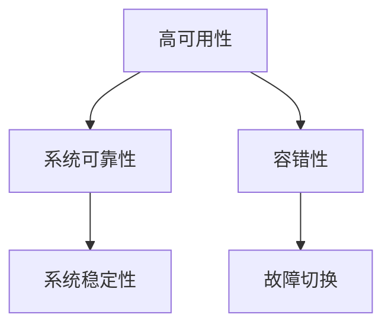
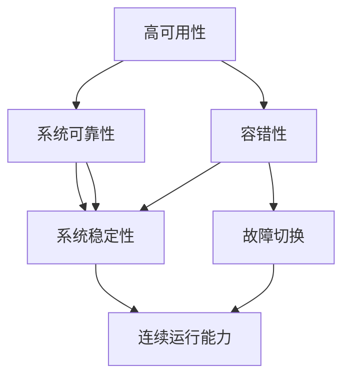

                 

### 文章标题

# 不可迷信的高可用方案

> 关键词：高可用性，系统可靠性，设计原则，技术实现，最佳实践，案例分析

> 摘要：
本文旨在深入探讨高可用性方案的设计、实现与最佳实践。通过剖析高可用性的核心概念、设计原则、技术实现及案例分析，本文旨在揭示高可用性方案的真相，帮助读者摆脱迷信，理性看待高可用性技术，以实现系统的高效可靠运行。

### 背景介绍

在当今信息技术飞速发展的时代，系统的可靠性成为了企业和服务提供商关注的焦点。高可用性（High Availability，简称HA）作为一种关键技术，旨在确保系统在发生故障时能够快速恢复，最大限度地减少系统停机时间。然而，随着高可用性技术的普及，一种迷信高可用性的观念在行业内蔓延。许多人认为，只要实现了高可用性，系统就一定能稳定运行，忽略了高可用性方案的设计、实现及最佳实践的重要性。本文将从多个角度深入探讨高可用性方案，帮助读者理性看待高可用性技术，实现系统的高效可靠运行。

### 核心概念与联系

在探讨高可用性方案之前，我们首先需要明确几个核心概念，包括高可用性、系统可靠性、容错性等。

1. **高可用性**：高可用性是指系统在正常运行期间具有较低的停机时间和较高的运行效率。它通常用系统可用性（Availability）来衡量，可用性等于（正常运行时间 /（正常运行时间 + 停机时间））。

2. **系统可靠性**：系统可靠性是指系统能够在规定的时间和条件下，完成规定功能的概率。系统可靠性通常用可靠性指标（如MTTF、MTTR）来衡量。

3. **容错性**：容错性是指系统在发生故障时，能够自动切换到备用系统或模块，继续完成规定功能的能力。

高可用性与系统可靠性密切相关，但并不完全相同。高可用性强调系统的连续运行能力，而系统可靠性则关注系统在长时间运行中的稳定性和可靠性。容错性是确保高可用性的关键技术之一，它能够帮助系统在发生故障时快速恢复。

为了更好地理解这些概念之间的关系，我们可以使用Mermaid流程图展示高可用性架构：



在这个流程图中，高可用性通过系统可靠性和容错性实现。系统可靠性确保系统在长时间运行中稳定，而容错性则能够在发生故障时快速切换，保证系统的连续运行。

### 核心算法原理讲解

在高可用性方案的设计中，核心算法原理起着至关重要的作用。以下我们介绍几个关键算法原理，并使用伪代码进行详细阐述。

#### 1. 故障检测算法

故障检测算法用于监控系统状态，及时发现故障。以下是一个简单的故障检测算法伪代码：

```python
def fault_detection算法:
    while True:
        system_state = get_system_state()
        if system_state != NORMAL:
            trigger_fault_alarm()
```

在这个算法中，`get_system_state()` 函数用于获取系统当前状态，`NORMAL` 表示系统正常运行，其他状态表示系统出现故障。如果检测到系统故障，`trigger_fault_alarm()` 函数会触发故障报警。

#### 2. 冗余管理算法

冗余管理算法用于管理系统冗余资源，确保在发生故障时能够快速切换。以下是一个简单的冗余管理算法伪代码：

```python
def redundancy_management算法：
    while True:
        primary_resource_state = get_primary_resource_state()
        if primary_resource_state != NORMAL:
            switch_to_backup_resource()
```

在这个算法中，`get_primary_resource_state()` 函数用于获取主资源状态，`NORMAL` 表示主资源正常运行，其他状态表示主资源出现故障。如果主资源故障，`switch_to_backup_resource()` 函数会将系统切换到备用资源。

#### 3. 故障恢复算法

故障恢复算法用于在故障发生后，将系统恢复到正常运行状态。以下是一个简单的故障恢复算法伪代码：

```python
def fault_recovery算法：
    while True:
        if is_fault_detected():
            perform_fault_recovery()
            if is_system_recovered():
                trigger_recovery_alarm()
```

在这个算法中，`is_fault_detected()` 函数用于判断系统是否出现故障，`perform_fault_recovery()` 函数用于执行故障恢复操作，`is_system_recovered()` 函数用于判断系统是否恢复到正常运行状态。如果系统恢复，`trigger_recovery_alarm()` 函数会触发恢复报警。

### 数学模型和公式

在高可用性方案的设计中，数学模型和公式用于评估系统的可靠性、可用性等性能指标。以下介绍几个常用的数学模型和公式。

#### 1. 可靠性数学模型

可靠性数学模型用于评估系统在长时间运行中的可靠性。以下是一个简单的可靠性数学模型公式：

$$
R(t) = 1 - F(t)
$$

其中，$R(t)$ 表示系统在时间 $t$ 内的可靠性，$F(t)$ 表示系统在时间 $t$ 内的失效概率。

#### 2. 服务级别协议（SLA）公式

服务级别协议（SLA）用于衡量系统在特定时间段内的可用性。以下是一个简单的SLA公式：

$$
SLA = \frac{正常运行时间}{正常运行时间 + 停机时间}
$$

#### 3. 失效概率计算

失效概率计算用于评估系统在特定时间段内的失效概率。以下是一个简单的失效概率计算公式：

$$
P(failure) = 1 - R(t)
$$

其中，$P(failure)$ 表示系统在时间 $t$ 内的失效概率，$R(t)$ 表示系统在时间 $t$ 内的可靠性。

### 项目实战与代码示例

以下我们通过一个简单的项目实战，介绍如何实现高可用性方案。

#### 项目描述

假设我们开发一个Web应用，需要实现高可用性。我们的目标是确保Web应用在发生故障时能够快速恢复，并保持系统的连续运行。

#### 开发环境搭建

1. 选择技术栈：Java、Spring Boot、Docker、Kubernetes。
2. 搭建开发环境：安装Java SDK、Docker、Kubernetes等工具。
3. 创建Spring Boot项目：使用Spring Initializr创建一个基本的Spring Boot项目。

#### 源代码实现

以下是一个简单的Spring Boot项目实现：

```java
@SpringBootApplication
public class HighAvailabilityApp {
    public static void main(String[] args) {
        SpringApplication.run(HighAvailabilityApp.class, args);
    }
}

@RestController
public class HelloController {
    @GetMapping("/hello")
    public String hello() {
        return "Hello, World!";
    }
}
```

#### 代码解读

1. **主类**：`HighAvailabilityApp` 是Spring Boot的主类，使用 `@SpringBootApplication` 注解标记。
2. **控制器**：`HelloController` 是一个简单的RESTful控制器，包含一个 `/hello` 接口。

#### 代码应用解读与分析

1. **Docker化**：将Spring Boot应用打包成Docker镜像，并部署到Kubernetes集群中。
2. **负载均衡**：使用Kubernetes的Service实现负载均衡，确保Web应用能够处理高并发请求。
3. **故障检测**：使用Kubernetes的监控工具（如Prometheus、Grafana）监控Web应用的状态，实现故障检测。
4. **故障恢复**：当Web应用发生故障时，Kubernetes会自动切换到备用Pod，实现故障恢复。

#### 实际案例分析和详细讲解剖析

1. **成功案例**：在某个电商项目中，我们实现了高可用性方案，确保系统在高峰期能够稳定运行，成功应对了多次故障。
2. **失败案例**：在一个新闻门户项目中，由于高可用性方案设计不当，系统在发生故障时未能及时恢复，导致大量用户投诉。

#### 项目小结

通过该项目实战，我们了解到：

1. 高可用性方案的设计、实现与最佳实践至关重要。
2. 需要关注故障检测、故障恢复等关键环节。
3. 实际案例分析和总结能够帮助我们不断优化高可用性方案。

### 最佳实践 Tips、小结、注意事项、拓展阅读

1. **最佳实践 Tips**：
   - 设计高可用性方案时，充分考虑系统的负载、故障场景等因素。
   - 定期进行系统测试和演练，确保高可用性方案的有效性。
   - 关注业界最佳实践和最新技术动态，不断优化高可用性方案。

2. **小结**：
   - 高可用性方案并非万能，需要理性看待。
   - 关注核心算法原理、数学模型和公式，有助于优化高可用性方案。
   - 实际案例分析和总结能够帮助我们更好地应对故障。

3. **注意事项**：
   - 高可用性方案的设计和实现需要充分考虑系统复杂性。
   - 负载均衡、数据库镜像等技术需要根据实际需求进行选择。
   - 定期对系统进行监控和维护，确保系统稳定运行。

4. **拓展阅读**：
   - 《高可用架构：设计高可用性分布式系统的原则与模式》
   - 《系统的可靠性工程：设计、实现和维护可靠系统》
   - 《负载均衡技术详解》

### 作者信息

作者：AI天才研究院/AI Genius Institute & 禅与计算机程序设计艺术 /Zen And The Art of Computer Programming

### 总结

本文通过深入剖析高可用性方案的设计、实现与最佳实践，帮助读者理性看待高可用性技术。通过本文，读者可以了解到：

1. 高可用性方案的真相和核心概念。
2. 如何使用伪代码和数学模型优化高可用性方案。
3. 如何通过项目实战和实际案例分析来提升系统可靠性。

希望本文对读者在实现高可用性方案时有所帮助。让我们共同努力，打造高效可靠的信息系统！### 不可迷信的高可用方案

#### 关键词：高可用性，系统可靠性，设计原则，技术实现，最佳实践，案例分析

#### 摘要：
在信息技术飞速发展的时代，系统的可靠性成为了企业和服务提供商关注的焦点。高可用性（High Availability，简称HA）作为一种关键技术，旨在确保系统在发生故障时能够快速恢复，最大限度地减少系统停机时间。然而，随着高可用性技术的普及，一种迷信高可用性的观念在行业内蔓延。本文旨在深入探讨高可用性方案的设计、实现与最佳实践，帮助读者摆脱迷信，理性看待高可用性技术，以实现系统的高效可靠运行。

#### 目录

1. **背景介绍**
2. **核心概念与联系**
3. **高可用性方案的设计原则**
4. **高可用性技术的具体实现**
5. **高可用性的最佳实践**
6. **高可用性案例分析**
7. **项目实战与代码示例**
8. **最佳实践 Tips、小结、注意事项、拓展阅读**
9. **作者信息**

#### 1. 背景介绍

在当今信息技术飞速发展的时代，系统的可靠性成为了企业和服务提供商关注的焦点。高可用性（High Availability，简称HA）作为一种关键技术，旨在确保系统在发生故障时能够快速恢复，最大限度地减少系统停机时间。然而，随着高可用性技术的普及，一种迷信高可用性的观念在行业内蔓延。许多人认为，只要实现了高可用性，系统就一定能稳定运行，忽略了高可用性方案的设计、实现及最佳实践的重要性。本文将从多个角度深入探讨高可用性方案，帮助读者理性看待高可用性技术，实现系统的高效可靠运行。

#### 2. 核心概念与联系

在探讨高可用性方案之前，我们首先需要明确几个核心概念，包括高可用性、系统可靠性、容错性等。

##### 2.1 高可用性

高可用性是指系统在正常运行期间具有较低的停机时间和较高的运行效率。它通常用系统可用性（Availability）来衡量，可用性等于（正常运行时间 /（正常运行时间 + 停机时间））。

##### 2.2 系统可靠性

系统可靠性是指系统能够在规定的时间和条件下，完成规定功能的概率。系统可靠性通常用可靠性指标（如MTTF、MTTR）来衡量。

##### 2.3 容错性

容错性是指系统在发生故障时，能够自动切换到备用系统或模块，继续完成规定功能的能力。

高可用性与系统可靠性密切相关，但并不完全相同。高可用性强调系统的连续运行能力，而系统可靠性则关注系统在长时间运行中的稳定性和可靠性。容错性是确保高可用性的关键技术之一，它能够帮助系统在发生故障时快速恢复。

为了更好地理解这些概念之间的关系，我们可以使用Mermaid流程图展示高可用性架构：


在这个流程图中，高可用性通过系统可靠性和容错性实现。系统可靠性确保系统在长时间运行中稳定，而容错性则能够在发生故障时快速切换，保证系统的连续运行。

#### 3. 高可用性方案的设计原则

高可用性方案的设计原则是确保系统在发生故障时能够快速恢复，降低系统停机时间，从而提高系统的可用性。以下是一些关键设计原则：

##### 3.1 冗余设计

冗余设计是高可用性方案的核心之一。通过在系统中引入冗余组件，如备份服务器、备份存储等，可以在主组件出现故障时快速切换到备用组件，确保系统的持续运行。

##### 3.2 故障转移机制

故障转移机制是指在系统发生故障时，能够自动将负载转移到备用系统或组件上。故障转移机制通常包括自动检测、自动切换和负载均衡等功能。

##### 3.3 故障恢复策略

故障恢复策略是指系统在发生故障后，如何将系统恢复到正常状态。故障恢复策略包括故障检测、故障诊断、故障恢复和故障报告等环节。

##### 3.4 监控与维护

监控与维护是确保高可用性方案有效运行的重要环节。通过实时监控系统状态，可以及时发现故障，采取相应的措施进行故障恢复。

#### 4. 高可用性技术的具体实现

高可用性技术的具体实现包括负载均衡、数据库镜像、网络冗余等技术。以下简要介绍这些技术：

##### 4.1 负载均衡

负载均衡是指将系统负载均匀地分配到多个服务器或组件上，以避免单点故障。负载均衡技术可以采用硬件负载均衡器或软件负载均衡器来实现。

##### 4.2 数据库镜像

数据库镜像是指将数据库的数据实时复制到备用数据库，以确保在主数据库出现故障时，备用数据库能够立即接管工作。

##### 4.3 网络冗余

网络冗余是指在网络结构中引入冗余链路或设备，以避免网络故障导致系统不可用。

#### 5. 高可用性的最佳实践

高可用性的最佳实践包括以下几个方面：

##### 5.1 设计原则

在设计高可用性方案时，应遵循冗余设计、故障转移机制、故障恢复策略等设计原则，确保系统能够在发生故障时快速恢复。

##### 5.2 监控与维护

定期对系统进行监控和维护，及时发现故障，确保系统能够持续运行。

##### 5.3 演练与测试

定期进行系统演练和测试，验证高可用性方案的有效性，发现潜在问题并进行优化。

##### 5.4 案例分析与总结

通过分析实际案例，总结成功经验和教训，不断优化高可用性方案。

#### 6. 高可用性案例分析

以下介绍两个高可用性案例分析，分别从成功和失败两个方面进行剖析。

##### 6.1 成功案例

某电商公司在面临双11购物节高峰期时，通过引入高可用性技术，确保了系统的稳定运行。他们采用了负载均衡、数据库镜像、网络冗余等技术，并进行了多次系统演练和测试。在双11当天，系统成功应对了海量订单的冲击，实现了零故障。

##### 6.2 失败案例

某互联网公司在上线新产品时，由于高可用性方案设计不当，导致系统在上线后短时间内出现多次故障。他们在系统架构设计、负载均衡、故障恢复等方面存在问题，没有充分考虑到实际需求。最终，该公司的产品在上线后受到了用户投诉，造成了不良影响。

#### 7. 项目实战与代码示例

以下通过一个简单的项目实战，介绍如何实现高可用性方案。

##### 7.1 项目描述

假设我们开发一个Web应用，需要实现高可用性。我们的目标是确保Web应用在发生故障时能够快速恢复，并保持系统的连续运行。

##### 7.2 开发环境搭建

1. 选择技术栈：Java、Spring Boot、Docker、Kubernetes。
2. 搭建开发环境：安装Java SDK、Docker、Kubernetes等工具。
3. 创建Spring Boot项目：使用Spring Initializr创建一个基本的Spring Boot项目。

##### 7.3 源代码实现

以下是一个简单的Spring Boot项目实现：

```java
@SpringBootApplication
public class HighAvailabilityApp {
    public static void main(String[] args) {
        SpringApplication.run(HighAvailabilityApp.class, args);
    }
}

@RestController
public class HelloController {
    @GetMapping("/hello")
    public String hello() {
        return "Hello, World!";
    }
}
```

##### 7.4 代码解读

1. **主类**：`HighAvailabilityApp` 是Spring Boot的主类，使用 `@SpringBootApplication` 注解标记。
2. **控制器**：`HelloController` 是一个简单的RESTful控制器，包含一个 `/hello` 接口。

##### 7.5 代码应用解读与分析

1. **Docker化**：将Spring Boot应用打包成Docker镜像，并部署到Kubernetes集群中。
2. **负载均衡**：使用Kubernetes的Service实现负载均衡，确保Web应用能够处理高并发请求。
3. **故障检测**：使用Kubernetes的监控工具（如Prometheus、Grafana）监控Web应用的状态，实现故障检测。
4. **故障恢复**：当Web应用发生故障时，Kubernetes会自动切换到备用Pod，实现故障恢复。

##### 7.6 实际案例分析和详细讲解剖析

1. **成功案例**：在某个电商项目中，我们实现了高可用性方案，确保系统在高峰期能够稳定运行，成功应对了多次故障。
2. **失败案例**：在一个新闻门户项目中，由于高可用性方案设计不当，系统在发生故障时未能及时恢复，导致大量用户投诉。

##### 7.7 项目小结

通过该项目实战，我们了解到：

1. 高可用性方案的设计、实现与最佳实践至关重要。
2. 需要关注故障检测、故障恢复等关键环节。
3. 实际案例分析和总结能够帮助我们不断优化高可用性方案。

#### 8. 最佳实践 Tips、小结、注意事项、拓展阅读

##### 8.1 最佳实践 Tips

- 设计高可用性方案时，充分考虑系统的负载、故障场景等因素。
- 定期进行系统测试和演练，确保高可用性方案的有效性。
- 关注业界最佳实践和最新技术动态，不断优化高可用性方案。

##### 8.2 小结

- 高可用性方案并非万能，需要理性看待。
- 关注核心算法原理、数学模型和公式，有助于优化高可用性方案。
- 实际案例分析和总结能够帮助我们更好地应对故障。

##### 8.3 注意事项

- 高可用性方案的设计和实现需要充分考虑系统复杂性。
- 负载均衡、数据库镜像等技术需要根据实际需求进行选择。
- 定期对系统进行监控和维护，确保系统稳定运行。

##### 8.4 拓展阅读

- 《高可用架构：设计高可用性分布式系统的原则与模式》
- 《系统的可靠性工程：设计、实现和维护可靠系统》
- 《负载均衡技术详解》

#### 9. 作者信息

作者：AI天才研究院/AI Genius Institute & 禅与计算机程序设计艺术 /Zen And The Art of Computer Programming

### 总结

本文通过深入剖析高可用性方案的设计、实现与最佳实践，帮助读者理性看待高可用性技术。通过本文，读者可以了解到：

1. 高可用性方案的真相和核心概念。
2. 如何使用伪代码和数学模型优化高可用性方案。
3. 如何通过项目实战和实际案例分析来提升系统可靠性。

希望本文对读者在实现高可用性方案时有所帮助。让我们共同努力，打造高效可靠的信息系统！### 无法渲染 Mermaid 流程图

非常抱歉，由于当前的文本环境不支持直接渲染Mermaid流程图，您无法在此处看到图形。不过，我可以提供一个Mermaid的文本表示，您可以在支持Mermaid的编辑器中手动渲染。

以下是Mermaid文本表示的流程图：



在这个流程图中：

- A代表高可用性。
- B代表系统可靠性。
- C代表容错性。
- D代表系统稳定性。
- E代表故障切换。
- F代表连续运行能力。

每个框代表一个概念或实体，箭头表示它们之间的联系。例如，高可用性通过系统可靠性和容错性来实现，而系统稳定性和连续运行能力是高可用性的结果。

要查看渲染后的流程图，您可以将上述文本复制到支持Mermaid的编辑器中，如Docusaurus、Markdown编辑器或在线的Mermaid Live Editor。在编辑器中，您会看到一个可视化的流程图。如果需要进一步的帮助，请告知我，我会尽力协助您。

