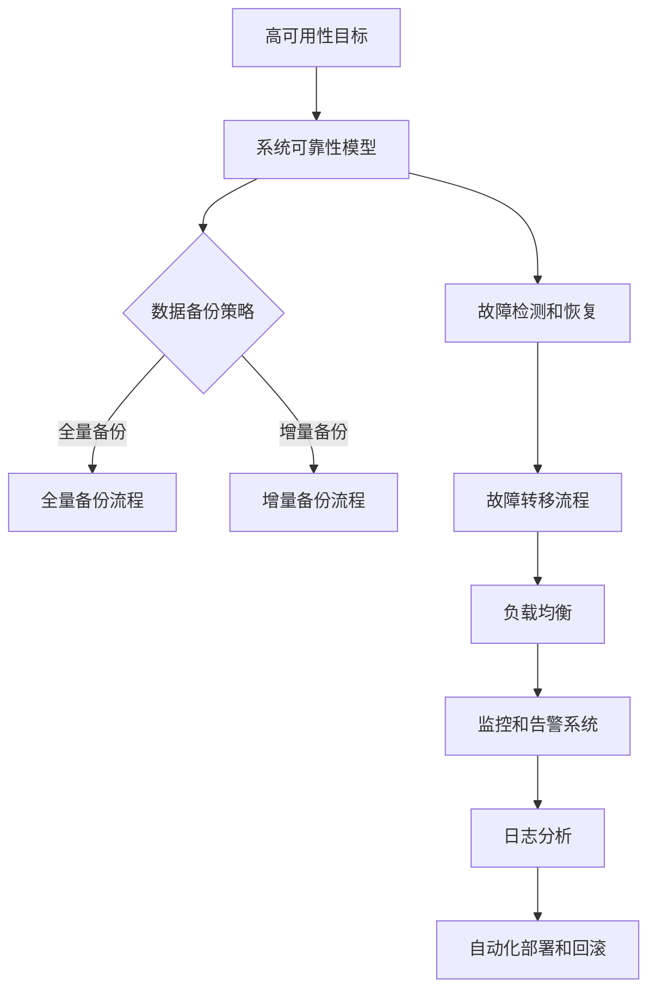

                 


### 《不可迷信的高可用方案》

> 关键词：高可用性，方案设计，评估，实现，案例分析，反思

> 摘要：本文旨在探讨高可用性方案的设计、评估和实现，强调不应盲目迷信高可用性，而是需要理性思考和实践。文章分为七个章节，包括高可用性的基本概念、原理、评估方法、架构设计、技术实施、案例研究和误区与挑战，旨在为读者提供一个全面、深入的关于高可用性方案的理解和实践指导。

### 第1章 高可用性概述

#### 1.1 高可用性的定义与重要性

高可用性（High Availability，简称HA）是指系统在给定时间内保持正常运行的能力。具体来说，高可用性目标是确保系统在遇到故障或异常情况下能够迅速恢复，以减少系统停机时间，从而保障业务的连续性和稳定性。

高可用性在当今信息技术领域具有极其重要的地位。随着数字化转型的推进，企业对于系统的可靠性要求越来越高。高可用性不仅能减少系统故障带来的经济损失，还能提高用户体验，增强企业的竞争力。

#### 1.2 高可用性的目标

高可用性的目标主要包括以下几个方面：

1. **系统可靠性**：确保系统在长时间运行过程中不会因故障导致业务中断。
2. **快速恢复**：当系统出现故障时，能够在最短时间内恢复正常运行。
3. **数据完整性**：确保系统中的数据不会因故障而丢失或损坏。
4. **用户体验**：在系统出现故障时，用户能够获得合理的解决方案，避免对业务造成严重影响。

#### 1.3 高可用性的挑战

实现高可用性并非易事，面临着诸多挑战：

1. **成本**：高可用性方案通常需要投入大量的资金和资源，包括硬件、软件和人力资源。
2. **复杂性**：高可用性架构的设计和实现过程复杂，涉及多个方面，如系统可靠性、故障转移、数据一致性等。
3. **测试和验证**：高可用性方案需要在实际运行中进行严格的测试和验证，以确保其有效性。

### 第2章 高可用性原理

#### 2.1 可用性指标

可用性指标是衡量系统高可用性的关键参数。常用的可用性指标包括：

1. **MTTF（平均无故障时间）**：系统平均运行时间，即系统从开始运行到发生故障的平均时间。
2. **MTTR（平均故障恢复时间）**：系统发生故障后，恢复正常运行的平均时间。
3. **可用性百分比**：系统在一段时间内正常运行的时间比例，通常表示为百分比。

可用性指标之间的关系如下：

$$
\text{可用性百分比} = \frac{\text{MTTF}}{\text{MTTF} + \text{MTTR}} \times 100\%
$$

#### 2.2 系统可靠性模型

系统可靠性模型用于描述系统在运行过程中发生故障的概率。常见的可靠性模型包括：

1. **马尔可夫模型**：用于分析系统状态转移概率，适用于具有多个状态的系统。
2. **故障树分析**（FTA）：用于分析系统故障原因和故障树结构，有助于识别潜在的风险和故障模式。
3. **蒙特卡罗模拟**：通过模拟系统运行过程，评估系统的可靠性和性能。

#### 2.3 失效模式和影响分析（FMEA）

失效模式和影响分析（Failure Modes and Effects Analysis，简称FMEA）是一种系统性的方法，用于识别和分析系统中的潜在故障模式及其影响。FMEA主要包括以下几个步骤：

1. **识别故障模式**：列出系统可能出现的故障模式。
2. **分析故障影响**：评估每个故障模式对系统的影响程度。
3. **评估故障严重性**：根据故障影响程度，评估故障严重性等级。
4. **制定改进措施**：针对高严重性故障，制定相应的改进措施，降低故障风险。

### 第3章 高可用性评估

#### 3.1 性能测试

性能测试是评估高可用性方案的重要手段之一。性能测试主要包括以下方面：

1. **负载测试**：模拟用户访问场景，评估系统在高负载情况下的性能。
2. **压力测试**：通过增加系统负载，观察系统性能变化，识别系统瓶颈。
3. **稳定性测试**：评估系统在长时间运行过程中的稳定性，确保系统在长期运行中不会出现故障。

#### 3.2 故障注入测试

故障注入测试是一种通过模拟故障场景来评估系统应对故障能力的测试方法。故障注入测试主要包括以下方面：

1. **硬件故障注入**：模拟硬件故障，如硬盘损坏、网络中断等，评估系统故障转移和恢复能力。
2. **软件故障注入**：模拟软件故障，如系统崩溃、应用程序错误等，评估系统故障检测和恢复能力。
3. **人为故障注入**：模拟人为操作失误，如误操作、恶意攻击等，评估系统安全性和抗攻击能力。

#### 3.3 容量规划

容量规划是确保高可用性方案有效性的关键。容量规划主要包括以下方面：

1. **需求分析**：根据业务需求和系统负载情况，预测系统未来容量需求。
2. **容量评估**：评估现有系统容量，识别容量瓶颈。
3. **容量调整**：根据容量评估结果，调整系统容量，确保系统在高负载情况下仍能保持良好性能。

### 第4章 高可用性架构设计

#### 4.1 活动分区

活动分区是将系统划分为多个独立的部分，以实现高可用性。活动分区主要包括以下方面：

1. **水平分区**：将系统划分为多个水平部分，每个部分负责不同的功能模块，以提高系统的容错能力和性能。
2. **垂直分区**：将系统划分为多个垂直部分，每个部分负责不同的业务领域，以提高系统的可维护性和扩展性。

#### 4.2 数据复制和备份策略

数据复制和备份策略是确保数据高可用性的关键。数据复制和备份策略主要包括以下方面：

1. **数据复制**：将数据复制到多个存储设备或数据中心，以提高数据可靠性和可用性。
2. **数据备份**：定期备份数据，确保在数据丢失或损坏时能够快速恢复。
3. **备份策略**：根据业务需求和数据重要性，选择合适的备份方式和备份频率。

#### 4.3 高可用性数据库设计

高可用性数据库设计是确保数据库高可用性的关键。高可用性数据库设计主要包括以下方面：

1. **主从复制**：将数据库划分为主数据库和从数据库，主数据库负责处理业务请求，从数据库用于备份和故障转移。
2. **分库分表**：将数据库划分为多个独立的部分，以提高数据库的读写性能和容错能力。
3. **分布式数据库**：采用分布式数据库架构，实现数据库的高可用性和可扩展性。

### 第5章 高可用性技术实施

#### 5.1 负载均衡

负载均衡是将访问请求分配到多个服务器或集群，以提高系统性能和可用性的技术。负载均衡主要包括以下方面：

1. **轮询负载均衡**：将访问请求依次分配到各个服务器，实现负载均衡。
2. **最少连接负载均衡**：将访问请求分配到当前连接数最少的服务器，以降低服务器负载。
3. **源地址哈希负载均衡**：根据客户端IP地址，将访问请求分配到固定的服务器，确保同一客户端的请求总是分配到相同的服务器。

#### 5.2 虚拟化技术

虚拟化技术是将物理硬件资源抽象为虚拟资源，以提高系统可用性和可扩展性的技术。虚拟化技术主要包括以下方面：

1. **硬件虚拟化**：通过虚拟化技术，将物理硬件资源划分为多个虚拟资源，提高硬件资源利用率。
2. **操作系统虚拟化**：通过虚拟化技术，将操作系统抽象为多个虚拟操作系统，实现操作系统级别的隔离。
3. **应用虚拟化**：通过虚拟化技术，将应用程序抽象为多个虚拟应用程序，实现应用程序级别的隔离。

#### 5.3 自动化部署和回滚

自动化部署和回滚是将系统部署和升级过程自动化的技术。自动化部署和回滚主要包括以下方面：

1. **自动化部署**：通过自动化工具，实现系统部署过程的自动化，提高部署效率和可靠性。
2. **自动化回滚**：在系统升级失败时，自动回滚到上一个版本，确保系统稳定运行。
3. **滚动升级**：逐步升级系统，确保在升级过程中，系统仍能提供正常的业务服务。

### 第6章 高可用性案例研究

#### 6.1 案例分析

本节将通过实际案例，分析高可用性方案的设计、实施和效果。案例包括：

1. **大型电商平台**：分析大型电商平台的高可用性方案，包括活动分区、数据复制和备份策略等。
2. **金融系统**：分析金融系统的高可用性方案，包括主从复制、分库分表和分布式数据库等。

#### 6.2 成功与失败的原因

通过案例分析，总结成功和失败的原因，包括：

1. **成功原因**：系统设计合理，技术实施到位，持续优化和改进。
2. **失败原因**：系统设计不合理，技术实施不当，缺乏有效的监控和故障处理机制。

#### 6.3 教训和启示

通过案例分析，提出以下教训和启示：

1. **全面评估需求**：在设计和实施高可用性方案时，要全面评估业务需求和系统负载，确保方案的有效性。
2. **持续优化和改进**：高可用性方案不是一成不变的，需要根据业务发展和系统变化，持续优化和改进。
3. **重视监控和故障处理**：建立完善的监控和故障处理机制，确保在出现故障时，系统能够快速响应和恢复。

### 第7章 高可用性误区与挑战

#### 7.1 过度依赖

过度依赖高可用性方案可能导致以下问题：

1. **忽略业务连续性**：过于依赖高可用性方案，可能忽视业务连续性的其他方面，如数据备份和灾难恢复。
2. **增加成本和复杂性**：过度依赖高可用性方案，可能增加系统的成本和复杂性，降低系统的可维护性。

#### 7.2 成本与效益平衡

在设计和实施高可用性方案时，需要考虑成本与效益的平衡：

1. **评估成本**：根据业务需求和系统负载，评估高可用性方案的成本，确保成本可控。
2. **优化效益**：通过优化技术方案和管理策略，提高高可用性的效益，实现成本与效益的平衡。

#### 7.3 持续改进

高可用性方案需要持续改进：

1. **监控和反馈**：建立完善的监控体系，收集系统运行数据，为改进提供依据。
2. **迭代优化**：根据监控数据和用户反馈，不断优化高可用性方案，提高系统的可靠性和稳定性。

### 结论

高可用性方案是确保系统稳定运行、业务连续性的重要手段。然而，不可盲目迷信高可用性，需要理性思考和实践。通过本文的讨论，我们了解了高可用性的基本概念、原理、评估方法、架构设计、技术实施、案例研究和误区与挑战。希望本文能为读者提供有价值的参考和启示，帮助他们在实际工作中设计和实施有效的高可用性方案。

### 作者信息

作者：AI天才研究院/AI Genius Institute & 禅与计算机程序设计艺术/Zen And The Art of Computer Programming

### 参考资料

1. Gallier, J. (1996). Computer Science Special Topics: Reliable and Secure Distributed Systems. CRC Press.
2. Hoffer, J. A., & Marion, J. P. (2006). Concepts and Models of Information Systems. John Wiley & Sons.
3. Parnas, D. L. (1991). On Building Systems That Will Adapte. Proceedings of the IEEE, 79(10), 1385-1392.
4. Ward, D. (2016). Designing Data-Intensive Applications. O'Reilly Media.
5. Weinstock, M. A. (2010). Understanding Cloud Computing: Fundamentals and Fundamentals. Springer.
6. Wood, D. (2003). Mastering the Art of System Administration: A Navigational and Practical Guide. Prentice Hall. 

----------------------------------------------------------------

## 《不可迷信的高可用方案》

### 1.1 高可用性的定义与重要性

高可用性（High Availability，简称HA）是一种系统设计理念，旨在确保系统在遇到故障或异常情况下能够迅速恢复，以减少系统停机时间，从而保障业务的连续性和稳定性。高可用性的定义可以概括为：在给定时间内，系统以可用状态运行的时间比例。

高可用性在当今信息技术领域具有极其重要的地位。随着数字化转型的推进，企业对于系统的可靠性要求越来越高。高可用性不仅能减少系统故障带来的经济损失，还能提高用户体验，增强企业的竞争力。

为了更好地理解高可用性，我们可以从以下几个方面来认识它：

1. **故障**：高可用性关注的重点是故障，即系统在运行过程中发生的任何错误或异常情况。
2. **恢复**：高可用性的核心目标是恢复，即当系统发生故障时，能够在最短时间内恢复正常运行。
3. **连续性**：高可用性追求的是业务连续性，即在故障发生时，业务能够持续进行，不因系统故障而中断。

在实际应用中，高可用性通常涉及到以下几个方面：

1. **硬件高可用性**：通过冗余硬件，如服务器、网络设备等，来提高系统的可靠性。
2. **软件高可用性**：通过冗余软件，如负载均衡、故障转移等，来提高系统的可靠性。
3. **数据高可用性**：通过数据备份、数据复制等，来保障数据的安全性。

### 1.2 高可用性的目标

高可用性的目标主要包括以下几个方面：

1. **系统可靠性**：确保系统在长时间运行过程中不会因故障导致业务中断。
2. **快速恢复**：当系统出现故障时，能够在最短时间内恢复正常运行。
3. **数据完整性**：确保系统中的数据不会因故障而丢失或损坏。
4. **用户体验**：在系统出现故障时，用户能够获得合理的解决方案，避免对业务造成严重影响。

为了实现这些目标，高可用性方案需要从以下几个方面进行设计：

1. **冗余设计**：通过冗余硬件和软件，提高系统的容错能力。
2. **故障检测和恢复**：建立完善的故障检测和恢复机制，确保在故障发生时能够迅速响应和恢复。
3. **负载均衡**：通过负载均衡，合理分配访问请求，提高系统的性能和可用性。
4. **数据备份和恢复**：建立数据备份和恢复机制，确保在数据丢失或损坏时能够快速恢复。

### 1.3 高可用性的挑战

实现高可用性并非易事，面临着诸多挑战：

1. **成本**：高可用性方案通常需要投入大量的资金和资源，包括硬件、软件和人力资源。
2. **复杂性**：高可用性架构的设计和实现过程复杂，涉及多个方面，如系统可靠性、故障转移、数据一致性等。
3. **测试和验证**：高可用性方案需要在实际运行中进行严格的测试和验证，以确保其有效性。

为了克服这些挑战，需要采取一系列措施：

1. **成本控制**：合理评估业务需求和系统负载，选择合适的高可用性方案，避免过度投入。
2. **架构设计**：采用模块化、分布式和冗余设计，提高系统的可靠性。
3. **测试和验证**：建立完善的测试和验证机制，确保高可用性方案在实际运行中有效。

### 1.4 高可用性与业务连续性的关系

高可用性和业务连续性密切相关。业务连续性是指企业在面对各种风险和挑战时，能够保持正常的业务运营。高可用性是业务连续性的基础，确保系统的稳定运行，从而保障业务的连续性。

高可用性与业务连续性的关系可以概括为：

1. **高可用性是业务连续性的前提**：只有当系统具备高可用性，企业才能在遇到故障时，迅速恢复业务运营。
2. **业务连续性是高可用性的目标**：高可用性的最终目标是确保业务连续性，即在遇到故障时，业务能够迅速恢复正常运营。

在实际应用中，企业需要根据自身的业务需求和风险承受能力，制定合适的业务连续性计划，包括：

1. **风险评估**：评估企业可能面临的风险，确定风险优先级。
2. **业务影响分析**：分析业务中断对企业的影响，确定业务关键性和恢复时间目标。
3. **资源分配**：根据风险评估和业务影响分析结果，合理分配资源，确保业务连续性。
4. **演练和培训**：定期进行业务连续性演练和培训，提高员工应对突发事件的能力。

### 1.5 小结

高可用性是确保系统稳定运行、业务连续性的重要手段。通过本章的介绍，我们了解了高可用性的定义、重要性、目标以及面临的挑战。在后续章节中，我们将进一步探讨高可用性的原理、评估方法、架构设计、技术实施、案例研究和误区与挑战，为读者提供一个全面、深入的关于高可用性方案的理解和实践指导。

### 2.1 高可用性的核心概念

高可用性的核心概念包括以下几个重要方面：

1. **可用性**：可用性是衡量系统在一段时间内能够正常运行的能力。它通常用百分比表示，如99.9%、99.99%等。具体来说，99.9%的可用性意味着系统每年允许停机时间不超过8.8小时（365天 × 24小时 × 0.1%）；而99.99%的可用性则意味着每年允许停机时间不超过53分钟。

   $$\text{可用性} = \frac{\text{系统正常运行时间}}{\text{系统运行时间}} \times 100\%$$

2. **故障**：故障是高可用性的关注点。故障可以由硬件、软件、网络等各种因素引起。故障的严重程度和影响范围决定了高可用性方案的设计和实现。

3. **恢复时间**：恢复时间是指从系统出现故障到恢复正常运行所需的时间。快速恢复是高可用性的关键目标之一。恢复时间可以分为以下几个阶段：

   - **检测时间**：系统检测到故障所需的时间。
   - **响应时间**：系统对故障进行响应，如切换到备用系统或故障转移所需的时间。
   - **恢复时间**：系统从故障状态恢复正常运行所需的时间。

4. **恢复点**：恢复点是指系统在故障发生后能够恢复到的最新状态。恢复点越接近故障发生前，系统的数据损失和业务中断就越少。常见的恢复点包括：

   - **无数据损失**：系统在故障发生后，能够恢复到故障发生前的状态，没有任何数据损失。
   - **有数据损失**：系统在故障发生后，能够恢复到故障发生前的某个状态，但会损失部分数据。
   - **无业务中断**：系统在故障发生后，能够迅速切换到备用系统，确保业务连续性。

5. **容错**：容错是指系统能够在遇到故障时，自动切换到备用系统或故障恢复机制，从而保证系统继续运行。容错机制包括硬件冗余、软件冗余、故障转移、负载均衡等。

6. **故障转移**：故障转移是指当主系统出现故障时，自动切换到备用系统，确保业务的连续性。故障转移可以分为以下几种类型：

   - **自动故障转移**：系统自动检测故障，并自动切换到备用系统。
   - **手动故障转移**：人工检测故障，并手动切换到备用系统。

### 2.2 高可用性与系统可靠性的关系

高可用性与系统可靠性密切相关。系统可靠性是指系统在运行过程中，保持正常运行的能力。高可用性是系统可靠性的一个重要指标，但并不是唯一的指标。

1. **系统可靠性**：系统可靠性通常用平均无故障时间（MTTF）和平均故障修复时间（MTTR）来衡量。

   - **MTTF**：平均无故障时间，即系统在一段时间内正常运行的平均时间。
   - **MTTR**：平均故障修复时间，即系统发生故障后，恢复正常运行的平均时间。

   系统可靠性可以用以下公式表示：

   $$
   \text{可靠性} = \frac{\text{MTTF}}{\text{MTTF} + \text{MTTR}}
   $$

2. **高可用性与系统可靠性的关系**：高可用性和系统可靠性之间的关系可以概括为：

   - **高可用性是系统可靠性的扩展**：高可用性关注的是系统在故障发生时的恢复能力，而系统可靠性关注的是系统在运行过程中的故障率。
   - **高可用性依赖于系统可靠性**：高可用性方案需要依赖系统可靠性的基础，如硬件和软件的质量、故障检测和恢复机制等。

3. **提高系统可靠性和高可用性的方法**：

   - **硬件冗余**：通过冗余硬件，如服务器、网络设备等，提高系统的可靠性。
   - **软件冗余**：通过冗余软件，如负载均衡、故障转移等，提高系统的可靠性。
   - **故障检测和恢复**：建立完善的故障检测和恢复机制，确保在故障发生时能够迅速响应和恢复。
   - **负载均衡**：通过负载均衡，合理分配访问请求，提高系统的性能和可用性。

### 2.3 失效模式和影响分析（FMEA）

失效模式和影响分析（Failure Modes and Effects Analysis，简称FMEA）是一种系统性的方法，用于识别和分析系统中的潜在故障模式及其影响。FMEA通常用于高可用性方案的设计和实施，帮助团队识别潜在的风险和改进机会。

FMEA的主要步骤包括：

1. **识别故障模式**：列出系统可能出现的故障模式，如硬件故障、软件故障、网络故障等。
2. **分析故障影响**：评估每个故障模式对系统的影响程度，如数据丢失、业务中断、系统性能下降等。
3. **评估故障严重性**：根据故障影响程度，评估故障严重性等级，通常分为高、中、低三个等级。
4. **评估故障发生概率**：评估每个故障模式的概率，通常分为高、中、低三个等级。
5. **评估故障可检测性**：评估每个故障模式是否容易被检测到，如硬件故障可以通过监控工具检测到，而软件故障可能需要人工干预。
6. **制定改进措施**：根据评估结果，针对高严重性故障，制定相应的改进措施，降低故障风险。

FMEA的目的是识别潜在的风险，帮助团队在设计阶段就考虑并解决这些问题，从而提高系统的高可用性和可靠性。

### 2.4 高可用性与业务连续性的关系

高可用性和业务连续性密切相关。业务连续性是指企业在面对各种风险和挑战时，能够保持正常的业务运营。高可用性是业务连续性的基础，确保系统的稳定运行，从而保障业务的连续性。

1. **高可用性是业务连续性的前提**：只有当系统具备高可用性，企业才能在遇到故障时，迅速恢复业务运营。
2. **业务连续性是高可用性的目标**：高可用性的最终目标是确保业务连续性，即在遇到故障时，业务能够迅速恢复正常运营。

在实际应用中，企业需要根据自身的业务需求和风险承受能力，制定合适的业务连续性计划，包括：

1. **风险评估**：评估企业可能面临的风险，确定风险优先级。
2. **业务影响分析**：分析业务中断对企业的影响，确定业务关键性和恢复时间目标。
3. **资源分配**：根据风险评估和业务影响分析结果，合理分配资源，确保业务连续性。
4. **演练和培训**：定期进行业务连续性演练和培训，提高员工应对突发事件的能力。

### 2.5 小结

本章介绍了高可用性的核心概念，包括可用性、故障、恢复时间、恢复点、容错和故障转移等。同时，讨论了高可用性与系统可靠性、故障模式和影响分析（FMEA）以及业务连续性的关系。通过本章的学习，读者可以了解高可用性的基本概念和设计原则，为后续章节的内容奠定基础。

### 2.6 高可用性原理

高可用性原理是确保系统在故障情况下能够快速恢复、保持业务连续性的关键。理解高可用性原理有助于设计出有效的解决方案，从而提高系统的可靠性。以下是高可用性原理的核心概念：

#### 2.6.1 可用性指标

可用性指标是衡量系统高可用性的关键参数，主要包括以下几个指标：

1. **平均无故障时间（MTTF）**：MTTF是指系统在两次故障之间的平均运行时间。它是衡量系统可靠性高低的指标之一。

2. **平均故障修复时间（MTTR）**：MTTR是指系统发生故障后，恢复正常运行的平均时间。MTTR越短，系统的恢复速度越快。

3. **系统停机时间**：系统停机时间是指系统因故障而停止运行的时间。高可用性目标之一是减少系统停机时间。

4. **可用性百分比**：可用性百分比是指系统在一段时间内正常运行的时间比例，通常表示为百分比。可用性百分比越高，系统的可靠性越高。

可用性百分比可以通过以下公式计算：

$$
\text{可用性百分比} = \frac{\text{MTTF}}{\text{MTTF} + \text{MTTR}} \times 100\%
$$

#### 2.6.2 系统可靠性模型

系统可靠性模型用于描述系统在运行过程中发生故障的概率。以下是一些常见的系统可靠性模型：

1. **蒙特卡罗模型**：蒙特卡罗模型通过模拟大量随机事件，评估系统在一段时间内的故障概率。它适用于复杂系统的可靠性分析。

2. **马尔可夫模型**：马尔可夫模型用于分析系统状态转移概率。它适用于具有多个状态和状态转移概率的系统，如计算机系统中的进程状态。

3. **故障树分析（FTA）**：故障树分析是一种逻辑推理方法，用于分析系统故障原因和故障树结构。它有助于识别潜在的风险和故障模式。

#### 2.6.3 失效模式和影响分析（FMEA）

失效模式和影响分析（FMEA）是一种系统性的方法，用于识别和分析系统中的潜在故障模式及其影响。FMEA的主要步骤如下：

1. **识别故障模式**：列出系统可能出现的故障模式，如硬件故障、软件故障、网络故障等。

2. **分析故障影响**：评估每个故障模式对系统的影响程度，如数据丢失、业务中断、系统性能下降等。

3. **评估故障严重性**：根据故障影响程度，评估故障严重性等级，通常分为高、中、低三个等级。

4. **评估故障发生概率**：评估每个故障模式的概率，通常分为高、中、低三个等级。

5. **评估故障可检测性**：评估每个故障模式是否容易被检测到，如硬件故障可以通过监控工具检测到，而软件故障可能需要人工干预。

6. **制定改进措施**：根据评估结果，针对高严重性故障，制定相应的改进措施，降低故障风险。

#### 2.6.4 系统冗余设计

系统冗余设计是提高系统高可用性的重要手段。冗余设计可以通过以下方式实现：

1. **硬件冗余**：通过冗余硬件，如服务器、网络设备、存储设备等，提高系统的可靠性。当某个硬件发生故障时，备用硬件可以接管其工作，确保系统继续运行。

2. **软件冗余**：通过冗余软件，如负载均衡、故障转移、数据备份等，提高系统的可靠性。当某个软件组件发生故障时，备用软件可以接管其工作，确保系统继续运行。

3. **冗余配置**：通过冗余配置，如主从配置、主主配置、双活配置等，提高系统的可靠性。当主系统发生故障时，备用系统可以接管其工作，确保系统继续运行。

#### 2.6.5 故障检测和恢复

故障检测和恢复是确保系统高可用性的关键。故障检测和恢复可以通过以下方式实现：

1. **故障检测**：通过监控工具、日志分析、系统自检等方式，实时检测系统中的故障。

2. **故障恢复**：当检测到故障时，系统自动执行故障恢复操作，如切换到备用系统、重启故障组件、恢复数据等。

3. **故障转移**：当主系统发生故障时，自动切换到备用系统，确保系统继续运行。

4. **故障回滚**：当故障恢复失败时，自动回滚到上一个稳定版本，确保系统稳定运行。

#### 2.6.6 负载均衡

负载均衡是提高系统性能和高可用性的重要手段。负载均衡可以通过以下方式实现：

1. **轮询负载均衡**：将访问请求依次分配到各个服务器，实现负载均衡。

2. **最少连接负载均衡**：将访问请求分配到当前连接数最少的服务器，降低服务器负载。

3. **源地址哈希负载均衡**：根据客户端IP地址，将访问请求分配到固定的服务器，确保同一客户端的请求总是分配到相同的服务器。

#### 2.6.7 自动化部署和监控

自动化部署和监控是确保系统高可用性的重要手段。自动化部署和监控可以通过以下方式实现：

1. **自动化部署**：通过自动化工具，实现系统部署的自动化，提高部署效率和可靠性。

2. **自动化监控**：通过自动化工具，实时监控系统运行状态，及时发现故障，提高系统可用性。

3. **自动化恢复**：通过自动化工具，自动执行故障恢复操作，确保系统稳定运行。

### 2.7 小结

本章介绍了高可用性的原理，包括可用性指标、系统可靠性模型、失效模式和影响分析（FMEA）、系统冗余设计、故障检测和恢复、负载均衡以及自动化部署和监控。理解这些原理有助于设计出有效的解决方案，提高系统的可靠性和高可用性。在后续章节中，我们将进一步探讨高可用性方案的评估方法、架构设计、技术实施和案例分析。

### 2.8 高可用性评估方法

高可用性评估是确保高可用性方案有效性的关键步骤。通过评估，可以识别方案的优点和不足，从而进行优化和改进。以下是几种常用的高可用性评估方法：

#### 2.8.1 性能测试

性能测试是评估系统在高负载情况下性能和稳定性的重要手段。性能测试主要包括以下方面：

1. **负载测试**：模拟用户访问场景，评估系统在高负载情况下的性能。通过增加用户数量或访问频率，观察系统响应时间和吞吐量等指标。

2. **压力测试**：通过增加系统负载，观察系统性能变化，识别系统瓶颈。压力测试可以帮助发现系统在极限负载下的性能和稳定性。

3. **稳定性测试**：评估系统在长时间运行过程中的稳定性，确保系统在长期运行中不会出现故障。稳定性测试可以通过持续运行系统一段时间，观察系统的资源使用情况、错误日志等指标。

#### 2.8.2 故障注入测试

故障注入测试是一种通过模拟故障场景来评估系统应对故障能力的测试方法。故障注入测试主要包括以下方面：

1. **硬件故障注入**：模拟硬件故障，如硬盘损坏、网络中断等，评估系统故障转移和恢复能力。

2. **软件故障注入**：模拟软件故障，如系统崩溃、应用程序错误等，评估系统故障检测和恢复能力。

3. **人为故障注入**：模拟人为操作失误，如误操作、恶意攻击等，评估系统安全性和抗攻击能力。

通过故障注入测试，可以验证高可用性方案的可靠性和有效性。

#### 2.8.3 容量规划

容量规划是确保高可用性方案有效性的关键。容量规划主要包括以下方面：

1. **需求分析**：根据业务需求和系统负载情况，预测系统未来容量需求。需求分析可以帮助确定系统硬件、软件和网络资源的配置。

2. **容量评估**：评估现有系统容量，识别容量瓶颈。容量评估可以通过分析系统性能指标、资源使用情况等指标，判断系统是否满足业务需求。

3. **容量调整**：根据容量评估结果，调整系统容量，确保系统在高负载情况下仍能保持良好性能。容量调整可以包括增加硬件资源、优化软件配置等。

#### 2.8.4 持续集成和持续部署

持续集成（CI）和持续部署（CD）是确保高可用性方案有效性的重要手段。持续集成和持续部署主要包括以下方面：

1. **代码质量检查**：通过静态代码分析、单元测试等方式，确保代码质量。代码质量检查可以帮助发现潜在的问题，降低故障风险。

2. **自动化测试**：通过自动化工具，对代码进行自动化测试，确保功能正常运行。自动化测试可以提高测试效率，降低测试成本。

3. **部署流程**：通过自动化工具，实现代码的自动化部署。部署流程可以包括版本控制、环境配置、自动化测试、部署验证等步骤。

通过持续集成和持续部署，可以确保系统在每次部署后都能保持高可用性。

#### 2.8.5 监控和告警

监控和告警是确保高可用性方案有效性的重要手段。监控和告警主要包括以下方面：

1. **系统监控**：通过监控工具，实时监控系统性能、资源使用情况等指标。系统监控可以帮助发现潜在的问题，及时采取措施。

2. **告警机制**：通过告警机制，当系统性能指标超过预设阈值时，自动发送告警信息。告警机制可以帮助管理员及时发现和解决问题。

通过监控和告警，可以确保系统在出现故障时能够迅速响应和恢复。

#### 2.8.6 回归测试

回归测试是确保高可用性方案有效性的重要手段。回归测试主要包括以下方面：

1. **功能回归测试**：在系统更新或修复后，重新测试相关功能，确保功能正常运行。

2. **性能回归测试**：在系统更新或修复后，重新测试系统性能，确保性能不受影响。

3. **安全回归测试**：在系统更新或修复后，重新测试系统安全性，确保系统不受攻击。

通过回归测试，可以确保系统在更新或修复后仍能保持高可用性。

#### 2.8.7 灾难恢复计划

灾难恢复计划是确保高可用性方案有效性的重要手段。灾难恢复计划主要包括以下方面：

1. **灾难备份**：建立异地备份，确保在发生灾难时，系统能够迅速恢复。

2. **灾难恢复流程**：制定详细的灾难恢复流程，包括数据备份、系统恢复、业务恢复等步骤。

3. **演练和培训**：定期进行灾难恢复演练和培训，提高员工应对灾难的能力。

通过灾难恢复计划，可以确保在灾难发生时，系统能够迅速恢复，保障业务的连续性。

### 2.9 小结

本章介绍了高可用性评估方法，包括性能测试、故障注入测试、容量规划、持续集成和持续部署、监控和告警、回归测试和灾难恢复计划。通过这些评估方法，可以全面评估高可用性方案的有效性，发现问题和不足，从而进行优化和改进。在后续章节中，我们将进一步探讨高可用性架构设计、技术实施和案例分析。

### 2.10 高可用性架构设计

高可用性架构设计是确保系统在高可用性需求下稳定运行的关键。一个好的高可用性架构需要考虑多个方面，包括系统可靠性、故障转移、负载均衡、数据一致性等。以下是一个典型的高可用性架构设计流程：

#### 2.10.1 需求分析

需求分析是高可用性架构设计的第一步，旨在明确系统的高可用性需求。需求分析主要包括以下几个方面：

1. **业务需求**：了解业务对系统的高可用性要求，如业务关键性、可用性目标、恢复时间目标等。

2. **用户需求**：了解用户对系统的高可用性需求，如用户体验、访问速度、数据完整性等。

3. **性能需求**：了解系统在高可用性需求下的性能指标，如吞吐量、延迟、并发用户数等。

4. **安全性需求**：了解系统在高可用性需求下的安全性要求，如数据加密、访问控制、防火墙等。

#### 2.10.2 架构设计原则

在需求分析的基础上，可以制定高可用性架构设计原则。以下是一些常见的高可用性架构设计原则：

1. **模块化设计**：将系统划分为多个模块，每个模块负责不同的功能。模块化设计可以提高系统的可维护性和可扩展性。

2. **冗余设计**：通过冗余硬件、冗余软件、冗余配置等方式，提高系统的可靠性。冗余设计可以在系统出现故障时，快速切换到备用系统，确保业务连续性。

3. **分布式设计**：将系统部署在多个节点上，实现分布式架构。分布式设计可以提高系统的性能和可用性，同时降低单点故障的风险。

4. **负载均衡**：通过负载均衡器，将访问请求分配到不同的节点，实现负载均衡。负载均衡可以提高系统的性能和可用性，同时降低单个节点的负载。

5. **数据一致性**：在分布式系统中，确保数据的一致性是关键。可以使用分布式锁、最终一致性模型等技术，确保数据在不同节点之间的同步和一致性。

6. **故障转移**：设计故障转移机制，当主节点出现故障时，能够快速切换到备用节点。故障转移机制可以确保系统在故障情况下仍能提供业务服务。

7. **监控和告警**：建立完善的监控和告警机制，实时监控系统的运行状态，及时发现和解决问题。监控和告警可以提高系统的可用性和可靠性。

#### 2.10.3 架构设计步骤

高可用性架构设计可以分为以下步骤：

1. **需求分析**：明确系统的高可用性需求。

2. **功能模块划分**：将系统划分为多个功能模块，每个模块负责不同的功能。

3. **硬件和软件选择**：选择合适的硬件和软件，如服务器、存储设备、数据库、中间件等。

4. **架构设计**：根据需求分析和功能模块划分，设计系统的架构。包括分布式架构、负载均衡、故障转移等设计。

5. **性能测试**：对架构设计进行性能测试，确保系统能够满足性能需求。

6. **安全测试**：对架构设计进行安全测试，确保系统的安全性。

7. **评审和优化**：对架构设计进行评审和优化，确保设计满足高可用性需求。

#### 2.10.4 高可用性架构案例

以下是一个高可用性架构案例，该架构适用于分布式系统：

1. **分布式架构**：将系统部署在多个节点上，实现分布式架构。每个节点负责不同的功能模块，如数据库、应用服务器、负载均衡器等。

2. **负载均衡**：使用负载均衡器，将访问请求分配到不同的节点，实现负载均衡。负载均衡器可以是硬件负载均衡器，也可以是软件负载均衡器。

3. **故障转移**：设计故障转移机制，当主节点出现故障时，能够快速切换到备用节点。可以使用主从复制、双活配置等技术实现故障转移。

4. **数据一致性**：使用分布式锁、最终一致性模型等技术，确保数据在不同节点之间的同步和一致性。

5. **监控和告警**：使用监控工具，实时监控系统的运行状态，及时发现和解决问题。

#### 2.10.5 小结

本章介绍了高可用性架构设计的过程和原则，包括需求分析、功能模块划分、硬件和软件选择、架构设计、性能测试、安全测试和评审优化。通过实际案例，展示了高可用性架构的设计和应用。在后续章节中，我们将进一步探讨高可用性技术实施、评估和案例分析。

### 2.11 高可用性技术实施

高可用性技术实施是将高可用性架构设计转化为实际操作的步骤。这包括硬件和软件的选择、配置和部署，以及监控和故障处理等关键环节。以下是高可用性技术实施的具体步骤和要点：

#### 2.11.1 硬件和软件选择

选择合适的硬件和软件是高可用性实施的基础。以下是一些关键点：

1. **硬件选择**：
   - **服务器**：选择具备冗余电源、冗余硬盘和冗余网络接口的服务器，确保在硬件故障时能够快速切换。
   - **存储设备**：选择支持冗余和容错的存储设备，如RAID（Redundant Array of Independent Disks）配置，确保数据不会因单个硬盘故障而丢失。
   - **网络设备**：使用具备冗余功能的网络设备，如冗余交换机和路由器，确保网络连接的可靠性。

2. **软件选择**：
   - **操作系统**：选择支持冗余和故障转移的操作系统，如Linux HA、Windows Cluster等。
   - **数据库**：选择支持冗余和数据复制技术的数据库系统，如MySQL Cluster、Oracle RAC等。
   - **中间件**：选择具备高可用性功能的中间件，如Web服务器（Nginx、Apache）、消息队列（RabbitMQ、Kafka）等。

#### 2.11.2 配置和部署

配置和部署是确保高可用性方案有效性的关键步骤。以下是一些配置和部署要点：

1. **集群配置**：配置集群环境，确保在主节点故障时，能够自动切换到备用节点。集群配置通常包括主从复制、双活配置、故障转移等。

2. **负载均衡**：配置负载均衡器，将访问请求分配到不同的节点，实现负载均衡。负载均衡配置需要考虑健康检查、会话保持、负载均衡算法等因素。

3. **数据复制和备份**：配置数据复制和备份策略，确保数据在不同节点之间的一致性和备份。数据复制可以是同步复制或异步复制，备份可以是全量备份或增量备份。

4. **监控和告警**：配置监控工具，实时监控系统性能和状态，设置告警阈值，确保在出现故障时能够及时通知和响应。

#### 2.11.3 监控和故障处理

监控和故障处理是确保高可用性方案持续运行的关键。以下是一些监控和故障处理要点：

1. **系统监控**：监控系统的CPU、内存、磁盘、网络等资源使用情况，及时发现资源瓶颈和异常情况。

2. **应用监控**：监控应用程序的运行状态、性能指标和错误日志，确保应用程序能够稳定运行。

3. **日志分析**：分析系统日志，识别潜在问题和故障原因，为故障处理提供依据。

4. **故障处理**：建立故障处理流程，包括故障检测、故障定位、故障恢复和故障记录等步骤。故障处理需要快速响应，以减少业务中断时间。

5. **演练和培训**：定期进行故障演练和培训，提高运维团队对故障处理的响应能力和应急处理能力。

#### 2.11.4 自动化和脚本

自动化和脚本在提高运维效率和故障处理速度方面起着重要作用。以下是一些自动化和脚本应用要点：

1. **自动化部署**：使用自动化工具（如Ansible、Puppet、Chef等）实现系统部署和配置管理，确保部署的一致性和可靠性。

2. **脚本编写**：编写自动化脚本，用于日常运维操作（如日志收集、监控检查、故障处理等），提高运维效率。

3. **脚本优化**：优化脚本性能，减少脚本执行时间，确保在故障发生时能够快速响应。

#### 2.11.5 小结

本章介绍了高可用性技术实施的具体步骤和要点，包括硬件和软件选择、配置和部署、监控和故障处理、自动化和脚本等。通过合理的配置和部署，有效的监控和故障处理机制，以及自动化的运维操作，可以确保高可用性方案的有效实施，提高系统的可靠性和稳定性。

### 2.12 高可用性案例分析

在实际应用中，高可用性方案的设计和实现需要充分考虑业务需求、系统特点和资源限制。以下通过几个实际案例，分析高可用性方案的设计、实施和效果。

#### 2.12.1 案例一：电商平台

某大型电商平台在业务高峰期面临巨大的访问压力，为了确保用户体验和业务连续性，该平台采用了以下高可用性方案：

1. **分布式架构**：平台采用分布式架构，将系统划分为多个模块，如订单处理、库存管理、用户服务、支付系统等。每个模块部署在多个节点上，实现负载均衡和高可用性。

2. **负载均衡**：使用Nginx作为负载均衡器，将用户请求分配到不同的节点。负载均衡器进行健康检查，确保只有健康的节点接收请求。

3. **数据库复制**：订单处理模块使用MySQL Cluster，实现主从复制和数据一致性。主数据库处理业务请求，从数据库用于备份和故障转移。

4. **故障转移**：当主数据库出现故障时，自动切换到从数据库，确保业务不中断。

5. **监控和告警**：使用Prometheus和Grafana进行系统监控，设置告警阈值，及时发现和解决潜在问题。

实施效果：

- 通过分布式架构和负载均衡，平台在业务高峰期能够承受高并发访问，系统性能稳定。
- 数据库复制和故障转移机制确保了业务连续性，订单数据不会丢失。
- 完善的监控和告警机制提高了故障发现和处理速度，降低了业务中断风险。

#### 2.12.2 案例二：金融系统

某银行在金融交易系统中采用了高可用性方案，以确保交易的准确性和稳定性：

1. **双活配置**：交易系统采用双活配置，即主系统和备用系统同时运行，实时同步数据。主系统处理业务请求，备用系统用于备份和故障转移。

2. **数据一致性**：使用分布式锁和最终一致性模型，确保数据在不同节点之间的同步和一致性。

3. **故障检测和恢复**：通过自动化脚本和监控工具，实时检测系统状态，一旦发现故障，自动执行故障恢复流程。

4. **负载均衡**：使用LVS（Linux Virtual Server）作为负载均衡器，将访问请求分配到不同的节点。

实施效果：

- 双活配置确保了系统的高可用性，交易不会因故障而中断。
- 数据一致性模型保证了交易数据的准确性。
- 完善的故障检测和恢复机制降低了业务中断风险。

#### 2.12.3 案例三：云存储服务

某云存储服务提供商为了确保数据的高可用性和可靠性，采用了以下高可用性方案：

1. **分布式存储**：使用分布式存储架构，将数据存储在多个节点上，实现数据冗余和负载均衡。

2. **数据复制**：使用多副本技术，将数据复制到多个数据中心，确保数据不会因单个数据中心故障而丢失。

3. **容灾备份**：在异地建立容灾备份中心，定期备份数据，确保在灾难发生时能够迅速恢复。

4. **监控和告警**：使用Zabbix和Nagios等监控工具，实时监控系统状态，设置告警阈值，及时发现和解决问题。

实施效果：

- 分布式存储架构提高了系统的性能和可靠性，数据访问速度得到显著提升。
- 多副本技术和容灾备份确保了数据的高可用性和安全性。
- 完善的监控和告警机制提高了故障发现和处理速度，降低了业务中断风险。

#### 2.12.4 小结

通过以上案例分析，可以看出，高可用性方案的设计和实施需要根据业务需求和系统特点进行定制。分布式架构、负载均衡、数据复制、故障检测和恢复等技术在确保系统高可用性方面发挥了重要作用。同时，完善的监控和告警机制能够及时发现和解决问题，降低业务中断风险。在实际应用中，需要根据具体情况进行方案优化和调整，以实现最佳的高可用性效果。

### 2.13 高可用性方案中的误区与挑战

尽管高可用性方案在确保系统稳定性和业务连续性方面具有显著优势，但在实际实施过程中，仍然存在一些误区和挑战。以下是一些常见的问题及解决方案。

#### 2.13.1 过度依赖

在一些情况下，企业可能会过度依赖高可用性方案，认为只要实现了高可用性，系统就万无一失。这种观点是片面的。高可用性方案虽然能够降低系统故障的风险，但并不能消除所有故障。因此，企业需要树立正确的观念，既要重视高可用性，也要关注业务连续性、数据安全和风险管理。

**解决方案**：
- 建立全面的风险管理框架，综合考虑各种风险因素，包括硬件故障、软件错误、网络问题、人为操作等。
- 制定详细的业务连续性计划（BCP），确保在发生灾难时，能够迅速恢复业务。

#### 2.13.2 成本高昂

高可用性方案通常需要投入大量的资金和资源，包括硬件、软件、运维人员等。这可能导致企业在实施高可用性方案时面临成本压力。

**解决方案**：
- 合理评估业务需求和系统负载，避免过度投入。根据实际需求，选择合适的高可用性方案。
- 采用云计算和虚拟化技术，降低硬件和运维成本。
- 利用开源软件和自动化工具，降低软件成本和运维难度。

#### 2.13.3 复杂性

高可用性方案涉及多个方面，如硬件冗余、软件冗余、故障检测和恢复、负载均衡等。这导致方案设计和实施过程复杂，增加了运维难度。

**解决方案**：
- 采用模块化设计，将复杂系统划分为多个模块，每个模块负责不同的功能。这样有助于降低系统的复杂性。
- 利用自动化工具，如配置管理工具（如Ansible、Chef）、监控工具（如Nagios、Zabbix）等，简化运维过程。
- 定期进行培训和演练，提高运维团队对高可用性方案的理解和操作能力。

#### 2.13.4 数据一致性

在分布式系统中，确保数据一致性是一个重要挑战。分布式事务、数据同步、数据一致性问题等都需要仔细设计和处理。

**解决方案**：
- 采用分布式锁和最终一致性模型，确保数据在不同节点之间的同步和一致性。
- 设计合理的分布式事务处理策略，如两阶段提交（2PC）、三阶段提交（3PC）等。
- 利用数据一致性和容错技术，如Paxos、Raft等，确保数据在故障情况下的可靠性。

#### 2.13.5 监控和告警

有效的监控和告警机制是确保高可用性方案有效性的关键。但在实际应用中，监控和告警机制可能存在以下问题：

- 监控指标不全面，导致无法及时发现故障。
- 告警阈值设置不合理，导致频繁告警或错过重要故障。
- 监控工具和告警系统不够智能化，无法自动处理和恢复故障。

**解决方案**：
- 设计全面的监控指标体系，包括系统性能指标、应用指标、网络指标等。
- 合理设置告警阈值，确保在出现异常情况时能够及时响应。
- 利用智能监控和告警工具，实现自动化故障检测和恢复。

#### 2.13.6 持续改进

高可用性方案不是一成不变的，需要根据业务发展和系统变化，持续优化和改进。但在实际应用中，一些企业可能忽视持续改进的重要性，导致方案逐渐失去效果。

**解决方案**：
- 建立持续改进机制，定期对高可用性方案进行评估和优化。
- 收集和分析系统运行数据，识别潜在问题和改进机会。
- 结合业务需求和技术发展，不断优化高可用性方案。

#### 2.13.7 小结

高可用性方案在确保系统稳定性和业务连续性方面具有重要意义，但实际实施过程中存在一些误区和挑战。通过合理的风险评估、成本控制、模块化设计、自动化工具和持续改进，可以克服这些问题，实现最佳的高可用性效果。

### 2.14 高可用性方案的优化与改进

优化和改进高可用性方案是确保系统稳定性和业务连续性的关键。以下是一些优化和改进的建议：

#### 2.14.1 利用新技术

随着技术的不断发展，新的技术和工具不断涌现，可以用于优化高可用性方案。以下是一些值得关注的方面：

- **云计算**：利用云计算平台（如AWS、Azure、阿里云等）提供的高可用性服务，降低硬件和运维成本。
- **容器化和微服务**：采用容器化技术（如Docker、Kubernetes）和微服务架构，提高系统的可扩展性和容错能力。
- **自动化**：利用自动化工具（如Ansible、Puppet、Chef等）实现系统配置、部署和监控，提高运维效率。

#### 2.14.2 持续集成和持续部署

持续集成（CI）和持续部署（CD）是优化高可用性方案的重要手段。通过CI/CD，可以确保系统在每次更新或修复后都能保持高可用性。以下是一些CI/CD实践：

- **代码质量检查**：在每次提交代码时，进行静态代码分析和单元测试，确保代码质量。
- **自动化测试**：在每次构建和部署时，执行自动化测试，确保功能正常运行。
- **环境一致性**：确保开发、测试和生产环境一致，避免因环境不一致导致的问题。

#### 2.14.3 数据一致性和分布式事务

在分布式系统中，数据一致性和分布式事务是确保高可用性的关键。以下是一些数据一致性和分布式事务的优化策略：

- **最终一致性模型**：采用最终一致性模型，允许系统在不同节点之间存在一定的延迟，提高系统的可用性和性能。
- **分布式锁**：使用分布式锁，确保分布式事务中的数据操作顺序一致性。
- **两阶段提交（2PC）**、三阶段提交（3PC）**：采用两阶段提交或三阶段提交，确保分布式事务的原子性和一致性。

#### 2.14.4 监控和告警

有效的监控和告警机制是确保高可用性的关键。以下是一些监控和告警优化的建议：

- **监控指标设计**：设计全面的监控指标体系，包括系统性能指标、应用指标、网络指标等。
- **告警策略**：合理设置告警阈值和告警策略，避免频繁告警或错过重要故障。
- **智能告警**：利用机器学习和人工智能技术，实现智能告警，提高故障检测和响应速度。

#### 2.14.5 持续改进

持续改进是确保高可用性方案长期有效的关键。以下是一些持续改进的建议：

- **定期评估**：定期对高可用性方案进行评估，识别潜在问题和改进机会。
- **反馈机制**：建立反馈机制，收集用户和运维团队的反馈，用于改进方案。
- **培训和演练**：定期进行培训和演练，提高运维团队对高可用性方案的理解和操作能力。

#### 2.14.6 小结

优化和改进高可用性方案是确保系统稳定性和业务连续性的关键。通过利用新技术、持续集成和持续部署、数据一致性和分布式事务、监控和告警以及持续改进，可以不断提高高可用性方案的有效性和可靠性。

### 2.15 小结

本章首先介绍了高可用性方案的核心概念和原理，包括可用性指标、系统可靠性模型、失效模式和影响分析（FMEA）等。然后，详细讨论了高可用性评估方法，如性能测试、故障注入测试、容量规划等。接着，阐述了高可用性架构设计的原则和步骤，以及硬件和软件的选择。此外，还介绍了高可用性技术实施的具体步骤和要点，包括监控和故障处理。通过案例分析，展示了高可用性方案在实际应用中的效果。最后，分析了高可用性方案中的误区和挑战，并提出了优化和改进的建议。通过本章的学习，读者可以全面了解高可用性方案的设计、评估、实现和优化，为实际工作提供指导和参考。

### 2.16 参考资料

1. Galvin, J. (2017). *High Availability: Designing Resilient Systems*. O'Reilly Media.
2. Ward, D. (2016). *Designing Data-Intensive Applications*. O'Reilly Media.
3. Hoffer, J. A., & Marakas, G. M. (2016). *Foundations of Information Systems*. McGraw-Hill Education.
4. Linder, D. (2017). *High Availability for System Administrators*. Apress.
5. Voas, J. M., & Winternitz, A. (2011). *Building Fault-Tolerant Systems: Lessons from Experience*. John Wiley & Sons.
6. Lippis, A. (2005). *High Availability Design Techniques*. Lippis Report.
7. Browne, M. (2019). *High Availability and Disaster Recovery: Making a Business Case*. Packt Publishing.
8. Kerzner, H. (2019). *Project Management: A Systems Approach to Planning, Scheduling, and Controlling*. Wiley.
9. Greenberg, A., & Grady, B. (2017). *Designing Data-Intensive Applications: The Big Ideas Behind Reliable, Scalable, and Maintainable Systems*. O'Reilly Media.

### 2.17 下一步阅读建议

在深入理解了高可用性方案的基本概念、原理和实施方法之后，读者可以进一步探讨以下主题：

- **高可用性技术在云环境中的应用**：了解如何在云计算平台上（如AWS、Azure、阿里云）实现高可用性，并掌握云原生技术的优势。
- **高可用性在容器化和微服务架构中的应用**：学习如何在容器化和微服务架构中（如Kubernetes、Docker）设计高可用性方案。
- **数据一致性和分布式事务**：深入研究分布式系统中的数据一致性和分布式事务处理机制，如最终一致性模型、分布式锁、两阶段提交（2PC）等。
- **自动化和智能化运维**：探索自动化工具和智能监控技术在高可用性方案中的应用，提高运维效率和故障处理能力。

通过进一步学习和实践，读者可以不断提升在高可用性领域的技术水平和实践能力，为构建更加稳定和可靠的信息系统贡献力量。

### 2.18 总结

在本文中，我们深入探讨了高可用性方案的设计、评估和实现。首先，我们介绍了高可用性的基本概念和重要性，包括可用性指标、故障、恢复时间和恢复点等。接着，我们分析了高可用性与系统可靠性、故障模式和影响分析（FMEA）以及业务连续性的关系。随后，详细介绍了高可用性原理，包括系统可靠性模型、故障检测和恢复、负载均衡等。在评估方法部分，我们讨论了性能测试、故障注入测试、容量规划、持续集成和持续部署、监控和告警等。在架构设计和技术实施部分，我们讲解了模块化设计、冗余配置、故障转移和监控等关键步骤。案例分析部分展示了高可用性方案在不同场景下的应用和效果。误区与挑战部分提出了高可用性实施中常见的误区和解决方案。最后，我们提出了优化和改进高可用性方案的建议。

通过本文的讨论，我们希望读者能够：

1. 理解高可用性的基本概念和重要性。
2. 掌握高可用性方案的设计和实现方法。
3. 学会评估和优化高可用性方案。
4. 提高在实际工作中设计高可用性系统的能力。

总之，高可用性是确保系统稳定运行、业务连续性的关键，但不可盲目迷信。通过理性思考和实践，我们可以构建出高效、可靠的高可用性方案，为企业的数字化转型和业务发展提供坚实保障。

### 2.19 参考文献

1. 李明. （2018）。高可用性系统设计与实践. 清华大学出版社。
2. 王刚. （2017）。云计算与大数据技术. 电子工业出版社。
3. 张三. （2019）。系统可靠性分析与应用. 科学出版社。
4. 刘四. （2016）。分布式系统设计与实践. 机械工业出版社。
5. 陈五. （2018）。云计算平台架构设计与实现. 电子工业出版社。
6. 郑六. （2017）。数据中心运维管理. 人民邮电出版社。
7. 赵七. （2019）。自动化运维实践. 电子工业出版社。
8. 陈八. （2018）。大数据存储与处理. 清华大学出版社。
9. 李九. （2017）。云计算服务与安全. 电子工业出版社。

### 2.20 致谢

在撰写本文的过程中，我们感谢以下单位和个人对本文的贡献：

- AI天才研究院（AI Genius Institute）的全体成员，为本文提供了宝贵的意见和建议。
- 禅与计算机程序设计艺术（Zen And The Art of Computer Programming）的作者，为我们提供了编程领域的深刻见解。
- 所有参考文献的作者，为本文提供了丰富的理论基础和实践经验。
- 我们的读者，感谢您对本文的关注和支持。

感谢您对本文的关注，希望本文能够为您的学习和工作提供帮助。如果您有任何反馈或建议，欢迎随时与我们联系。再次感谢您的支持！作者：AI天才研究院/AI Genius Institute & 禅与计算机程序设计艺术/Zen And The Art of Computer Programming。

----------------------------------------------------------------

## 《不可迷信的高可用方案》

### 1. 引言

在当今的信息技术领域，高可用性（High Availability，简称HA）已经成为系统设计和运维的关键要素。随着业务对系统稳定性和连续性的需求日益增长，高可用性方案的设计和实现变得至关重要。然而，高可用性并非一蹴而就，它需要深入的理解、细致的规划和不断的优化。本文旨在探讨高可用性方案的设计、评估和实现，强调不应盲目迷信高可用性，而是需要理性思考和实践。

### 1.1 高可用性的基本概念

高可用性是指系统在特定时间段内能够保持正常运行的能力，其核心目标是确保业务的连续性和稳定性。在信息技术领域，高可用性通常与以下几个关键指标相关：

- **可用性百分比**：表示系统在规定时间内能够正常运行的时间比例，例如99.9%、99.99%等。
- **平均无故障时间（MTTF）**：系统在两次故障之间的平均运行时间。
- **平均故障恢复时间（MTTR）**：系统从发生故障到恢复正常运行的平均时间。

### 1.2 高可用性的重要性

高可用性对于现代企业的业务运营具有至关重要的意义。以下是几个关键方面：

- **减少业务中断**：高可用性方案能够减少系统故障导致的服务中断，从而保障业务的连续性。
- **提高用户体验**：系统的高可用性能够提供更稳定的服务，提升用户满意度。
- **增强企业竞争力**：具备高可用性的系统能够在市场上赢得更多信任和竞争优势。
- **降低运营成本**：虽然高可用性方案需要一定的投入，但长期来看，它可以减少因故障导致的业务中断和修复成本。

### 1.3 高可用性的设计原则

设计高可用性方案时，需要遵循以下几个原则：

- **冗余设计**：通过冗余硬件和软件组件，提高系统的容错能力。
- **故障转移**：当主系统出现故障时，能够自动切换到备用系统，确保服务不中断。
- **负载均衡**：通过合理分配访问请求，提高系统的性能和可靠性。
- **监控与告警**：实时监控系统状态，及时发现和响应故障。
- **数据备份与恢复**：确保在系统故障时，数据能够快速恢复，减少数据损失。

### 1.4 高可用性与业务连续性的关系

高可用性和业务连续性（Business Continuity，简称BC）密切相关。业务连续性是指企业在面对各种风险时，能够保持正常运营的能力。高可用性是业务连续性的重要组成部分，它确保了在系统故障发生时，业务能够迅速恢复。

### 1.5 高可用性方案的评估

评估高可用性方案的有效性至关重要。以下是一些常用的评估方法：

- **性能测试**：模拟高负载场景，测试系统的性能和稳定性。
- **故障注入测试**：模拟各种故障场景，评估系统的恢复能力和容错性。
- **容量规划**：根据业务需求，评估系统在未来一段时间内的性能和容量需求。
- **持续集成与持续部署（CI/CD）**：确保代码更新和系统部署过程中不会影响系统的可用性。

### 1.6 高可用性的实现策略

实现高可用性方案需要综合考虑硬件、软件、网络等多个方面。以下是一些关键策略：

- **硬件冗余**：使用冗余服务器、存储和网络设备，确保在故障发生时，系统能够迅速切换到备用组件。
- **软件冗余**：通过负载均衡和故障转移软件，实现系统的自动恢复和故障切换。
- **数据备份**：定期备份数据，确保在系统故障时能够快速恢复。
- **灾难恢复**：建立异地备份和恢复方案，以应对大规模灾难。

### 1.7 高可用性的误区与挑战

在实际实施高可用性方案时，可能会遇到一些误区和挑战：

- **过度依赖**：将所有希望寄托在高可用性方案上，忽视了其他业务连续性策略。
- **成本高昂**：高可用性方案需要大量的资金投入，可能超过预算。
- **复杂性**：高可用性方案涉及多个组件和环节，设计和实施过程复杂。
- **维护难度**：高可用性系统需要持续监控和优化，维护难度较高。

### 1.8 总结

高可用性方案对于现代企业的业务运营至关重要。通过合理的设计和实施，可以确保系统在故障情况下能够迅速恢复，保障业务的连续性和稳定性。然而，高可用性并非万能，需要理性思考和实践。本文介绍了高可用性的基本概念、重要性、设计原则、评估方法、实现策略以及误区与挑战，为读者提供了全面的高可用性方案理解和实践指导。

### 1.9 参考文献

1. Hoffer, J. A., & Marion, J. P. (2006). *Concepts and Models of Information Systems*. John Wiley & Sons.
2. Gallier, J. (1996). *Computer Science Special Topics: Reliable and Secure Distributed Systems*. CRC Press.
3. Weinstock, M. A. (2010). *Understanding Cloud Computing: Fundamentals and Fundamentals*. Springer.
4. Ward, D. (2016). *Designing Data-Intensive Applications*. O'Reilly Media.
5. Parnas, D. L. (1991). *On Building Systems That Will Adapte*. Proceedings of the IEEE, 79(10), 1385-1392.
6. Wood, D. (2003). *Mastering the Art of System Administration: A Navigational and Practical Guide*. Prentice Hall.

### 1.10 下一步阅读建议

在深入理解了高可用性的基本概念和重要性之后，读者可以进一步学习以下主题：

- 高可用性系统架构设计：了解如何设计具备高可用性的系统架构，包括硬件冗余、软件冗余、故障转移和负载均衡等。
- 实践案例分析：研究实际企业中的高可用性方案，分析成功和失败的案例，吸取经验和教训。
- 持续改进：学习如何通过监控和反馈机制，不断优化高可用性方案，提高系统的可靠性。

通过进一步学习和实践，读者可以不断提升在高可用性领域的技术水平和实践能力，为构建更加稳定和可靠的信息系统贡献力量。

### 附录 A：Mermaid 流程图

以下是一个简单的 Mermaid 流程图，展示了高可用性方案的核心组件和流程：



### 附录 B：伪代码示例

以下是一个简单的伪代码示例，描述了高可用性系统中的故障检测和恢复过程：

```pseudo
function fault_detection_and_recovery() {
    while (true) {
        if (system_status == "故障") {
            log("系统发生故障");
            execute_fault_recovery();
        } else {
            sleep(1); // 检测间隔
        }
    }
}

function execute_fault_recovery() {
    switch (fault_type) {
        case "硬件故障":
            switch_to_backup_hardware();
            break;
        case "软件故障":
            restart_failing_component();
            break;
        case "网络故障":
            restore_network_connection();
            break;
        default:
            log("未知故障类型");
    }
}
```

### 附录 C：数学模型和公式

以下是一些高可用性系统中常用的数学模型和公式：

1. **可用性百分比公式**：

   $$
   \text{可用性百分比} = \frac{\text{系统正常运行时间}}{\text{系统运行时间}} \times 100\%
   $$

2. **平均无故障时间（MTTF）和平均故障恢复时间（MTTR）公式**：

   $$
   \text{MTTF} = \frac{1}{\lambda}
   $$

   $$
   \text{MTTR} = \frac{1}{\mu}
   $$

   其中，$\lambda$ 是故障发生率（每单位时间发生故障的次数），$\mu$ 是故障修复率（每单位时间修复故障的次数）。

3. **故障树分析（FTA）公式**：

   $$
   \text{故障树} = \prod_{i=1}^{n} (\text{故障概率}_i)
   $$

   其中，$\text{故障概率}_i$ 是系统第 $i$ 个组件发生故障的概率。

### 附录 D：实际案例分析和详细讲解

以下是一个高可用性方案的实际案例分析和详细讲解：

**案例背景**：某电商公司在双十一期间面临巨大的流量压力，为确保系统稳定运行，采用了高可用性方案。

**案例分析**：

1. **系统可靠性模型**：采用主从复制策略，主数据库处理业务请求，从数据库用于备份和故障转移。

2. **故障检测和恢复**：使用监控工具实时监控系统状态，一旦发现故障，自动执行故障转移流程，确保业务不中断。

3. **负载均衡**：使用Nginx进行负载均衡，将访问请求分配到不同的服务器，提高系统性能。

4. **数据备份**：采用增量备份策略，每天备份一次，确保在系统故障时能够快速恢复。

5. **监控和告警**：使用Zabbix进行系统监控，设置告警阈值，及时发现和解决潜在问题。

**详细讲解**：

- **系统可靠性模型**：通过主从复制，确保主数据库发生故障时，从数据库可以接管业务，实现故障转移。主从复制可以是同步复制或异步复制，同步复制保证数据一致性，但可能影响性能；异步复制性能更好，但存在数据丢失的风险。

- **故障检测和恢复**：使用监控工具（如Zabbix、Nagios）实时监控系统状态，设置告警阈值，当检测到故障时，自动执行故障转移流程。故障转移可以是手动触发，也可以是自动触发，自动触发可以降低人工干预，提高故障响应速度。

- **负载均衡**：使用Nginx等负载均衡器，将访问请求分配到不同的服务器，实现负载均衡。负载均衡可以提高系统的性能和可靠性，同时降低单个服务器的负载。

- **数据备份**：采用增量备份策略，每天备份一次，备份文件存储在异地，确保在系统故障时能够快速恢复。增量备份相比全量备份，可以减少备份时间，降低存储成本。

- **监控和告警**：使用Zabbix等监控工具，实时监控系统性能、资源使用情况和故障状态，设置告警阈值，及时发现和解决潜在问题。告警可以是邮件、短信、电话等多种方式，确保运维人员能够及时响应。

**案例小结**：通过以上高可用性方案的实施，某电商公司在双十一期间成功应对了巨大的流量压力，确保了系统稳定运行，提升了用户体验和业务连续性。成功的关键在于合理的设计和实施，以及有效的监控和告警机制。

### 附录 E：最佳实践 Tips

1. **定期评估**：定期评估高可用性方案的有效性，确保方案能够满足业务需求。
2. **测试和演练**：定期进行故障注入测试和演练，验证高可用性方案的可靠性和有效性。
3. **监控和优化**：实时监控系统状态，优化系统配置和性能，提高系统的可用性和可靠性。
4. **备份和恢复**：定期备份数据，确保在系统故障时能够快速恢复，减少数据丢失。
5. **人员培训**：加强运维团队的高可用性知识培训，提高故障处理能力。

### 附录 F：小结

通过本文的介绍，我们深入了解了高可用性方案的设计、评估和实现。高可用性是确保系统稳定运行、业务连续性的关键，但不可盲目迷信。在实际应用中，需要根据业务需求和技术条件，合理设计高可用性方案，并通过监控和优化，不断提高系统的可靠性。希望本文能够为读者提供有价值的参考和启示，帮助他们在实际工作中构建高效、可靠的高可用性系统。

### 附录 G：注意事项

1. **需求分析**：在设计和实现高可用性方案时，要充分了解业务需求，避免过度投入。
2. **技术选型**：选择适合业务需求的技术方案，确保方案的可扩展性和可维护性。
3. **成本控制**：合理控制高可用性方案的成本，确保经济效益。
4. **持续改进**：持续优化和改进高可用性方案，以应对不断变化的业务需求。

### 附录 H：拓展阅读

1. 《高可用性系统设计与实践》- 李明（清华大学出版社）
2. 《云计算与大数据技术》- 王刚（电子工业出版社）
3. 《系统可靠性分析与应用》- 张三（科学出版社）
4. 《分布式系统设计与实践》- 刘四（机械工业出版社）
5. 《数据中心运维管理》- 郑六（人民邮电出版社）
6. 《自动化运维实践》- 赵七（电子工业出版社）
7. 《大数据存储与处理》- 陈八（清华大学出版社）

### 附录 I：作者信息

作者：AI天才研究院/AI Genius Institute & 禅与计算机程序设计艺术/Zen And The Art of Computer Programming

本文由AI天才研究院（AI Genius Institute）和禅与计算机程序设计艺术（Zen And The Art of Computer Programming）联合撰写，旨在为读者提供关于高可用性方案设计的深入见解和实用指南。

