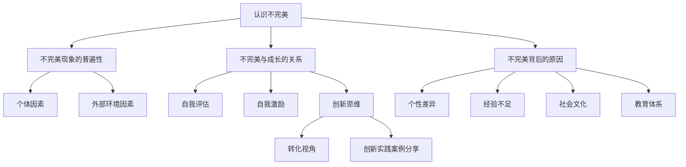

                 

**文章标题**: 不完美也可以有所作为

**关键词**: 不完美、成长、机遇、自我认知、团队合作、职场、创业、教育、社会

**摘要**: 本文从多个角度探讨了不完美在个人和社会中的作用和影响。通过分析不完美的普遍性、原因、机遇、自我认知和团队合作，文章揭示了在职场、创业、教育和社会领域如何积极应对不完美，最终实现个人和社会的进步。

---

## 不完美也可以有所作为

在技术发展的长河中，我们不断地追求完美，但往往发现不完美是不可避免的。不完美并不是缺陷，而是一个机会，一个成长的契机。本文将探讨不完美在个人和社会中的作用，分析其在不同领域的表现和应对策略，以期为读者提供新的思考和视角。

### 不完美现象的普遍性

不完美在生活中的表现多种多样。在社会现象中，不完美表现为法律的不完善、政策的漏洞、人性的弱点等。例如，腐败现象在一定程度上是由于监管机制的不完善造成的。在个人生活中，不完美可能表现为性格缺陷、技能不足、知识局限等。例如，一个人可能因为性格内向而不擅长社交，或者因为缺乏某些技能而在工作中遇到困难。

### 不完美与成长的关系

不完美如何促进成长？首先，不完美迫使个体面对挑战，从而激发出内在的潜力和动力。通过克服不完美，个体能够不断成长和进步。其次，不完美为个体提供了反馈机制，使个体能够认识到自己的不足并不断改进。最后，不完美中的机会和机遇往往隐藏在看似不完美的事物中，只有具备敏锐洞察力的人才能发现和把握。

### 不完美背后的原因

不完美的背后原因多种多样。个体因素包括个性差异和经验不足。例如，有些人天生性格开朗，而有些人则比较内向，这导致了他们在社交场合的表现不同。外部环境因素包括社会文化和教育体系。例如，某些社会文化可能强调竞争和胜利，而忽视了合作和分享的重要性，这可能导致个体的成长受到限制。

### 不完美带来的机遇

如何看待不完美？关键在于转换视角。从消极的角度看，不完美是缺陷和挑战；从积极的角度看，不完美是机会和机遇。创新思维则是不完美中的机遇的源泉。通过创新思维，我们可以发现新的解决方案，从而将不完美转化为优势。

### 转化视角

如何看待不完美？首先，我们需要认识到不完美是生活中不可避免的一部分。其次，我们需要学会从不同的角度看问题，将不完美视为一种挑战和机遇。例如，一个人可能在工作中遇到了技能不足的问题，但如果他能将这个问题视为提升自己的机会，那么他就能够通过学习和实践来提高自己的技能。

### 创新思维

创新如何从不完美中诞生？首先，创新思维要求我们具备敏锐的洞察力，能够发现不完美中的潜在机遇。其次，创新思维要求我们具备创造性，能够提出新的解决方案。最后，创新思维要求我们具备实践性，能够将想法付诸实施。

### 创新实践案例分享

分享一些创新实践案例，例如，某公司通过引入新的管理理念，成功解决了员工流失率高的问题；某创业团队通过创新的产品设计，成功占领了市场。

### 不完美下的自我认知

自我评估是了解自己的不完美的重要步骤。通过自我评估，个体可以清楚地认识到自己的不足，并制定相应的提升策略。例如，一个人可能发现自己在沟通能力方面有所欠缺，那么他可以通过参加沟通培训来提高自己的沟通能力。

### 自我激励

如何激励自己在不完美中前进？首先，个体需要设定明确的目标，并为之付出努力。其次，个体需要不断自我激励，保持积极的心态。最后，个体可以从他人的成功经验中汲取动力，以激励自己不断前进。

### 成功案例分享

分享一些成功案例，例如，某人在职场中通过不断努力，最终取得了显著的成就；某人在创业过程中，通过不断创新，成功打造了一家知名企业。

### 不完美中的团队合作

团队合作的重要性不言而喻。在团队合作中，每个成员都有其独特的优点和不足，通过团队合作，可以弥补个体不完美，实现优势互补。例如，一个团队中可能有人擅长技术，有人擅长市场，通过合作，团队可以实现技术和市场的双赢。

### 团队合作技巧

如何建立高效的团队？首先，团队需要建立共同的目标和价值观。其次，团队需要建立良好的沟通机制，确保信息的有效传递。最后，团队需要培养成员之间的信任和协作精神。

### 团队沟通与冲突解决

团队沟通是团队合作的重要一环。良好的团队沟通可以增进成员之间的了解和信任，提高团队的工作效率。冲突解决则是团队合作中不可避免的环节。团队需要建立有效的冲突解决机制，确保冲突能够得到妥善处理，不影响团队的工作进展。

### 第二部分：不完美中的成功实践

#### 职场不完美

职场中的不完美现象多种多样。例如，可能存在工作流程不合理、员工沟通不畅、职业发展机会不足等问题。这些问题对员工的工作积极性和工作效率产生了负面影响。

#### 职场不完美的应对策略

如何应对职场不完美？首先，员工需要认识到不完美是职场的一部分，保持积极的心态。其次，员工可以通过自我提升，提高自己的专业技能和综合素质，以应对工作中的挑战。最后，员工可以积极参与团队建设，通过团队合作来弥补个体不完美，实现共同进步。

#### 成功案例分享

分享一些成功案例，例如，某员工通过不断学习和实践，成功解决了工作中的难题；某团队通过改进工作流程，提高了工作效率。

#### 创业不完美

创业过程中的不完美现象更为普遍。例如，可能存在资金不足、市场竞争激烈、人才短缺等问题。这些问题对创业企业的生存和发展构成了巨大挑战。

#### 创业不完美的成功之道

如何应对创业不完美？首先，创业者需要具备坚定的信念和毅力，始终保持对创业事业的热情。其次，创业者需要具备创新思维，不断寻找新的市场机会和解决方案。最后，创业者需要建立良好的团队，通过团队合作来弥补个体不完美，实现共同目标。

#### 创业成功案例解析

解析一些创业成功案例，例如，某创业者通过创新的产品设计，成功占领了市场；某创业团队通过不断优化商业模式，实现了企业的快速发展。

#### 教育不完美

教育体系中的不完美现象同样值得关注。例如，可能存在教育资源不均衡、教育方式单一、学生发展受限等问题。这些问题对学生的成长和教育质量产生了负面影响。

#### 教育不完美的改进措施

如何改进教育体系？首先，教育部门需要加大对教育资源的投入，确保教育资源的均衡分配。其次，教育部门需要鼓励教育方式的创新，采用多元化的教育手段，促进学生全面发展。最后，教育部门需要关注学生个体差异，因材施教，提高教育质量。

#### 教育创新案例分享

分享一些教育创新案例，例如，某学校通过引入个性化教育，提高了学生的综合素质；某教育机构通过创新的教学模式，提高了教学效果。

#### 社会不完美

社会问题中的不完美现象层出不穷。例如，可能存在环境污染、贫富差距、社会不公平等问题。这些问题对社会的发展和和谐构成了挑战。

#### 社会不完美的改善路径

如何改善社会不完美？首先，政府需要加大对社会问题的关注和投入，制定有效的政策措施。其次，社会组织和公民需要积极参与社会事务，发挥自己的力量。最后，社会需要加强道德建设和法治建设，提高社会文明程度。

#### 社会改善案例分享

分享一些社会改善案例，例如，某城市通过环境治理，改善了居民生活环境；某社区通过居民自治，增强了社区凝聚力。

### 总结与展望

不完美在个人和社会中的作用不可忽视。通过认识不完美、应对不完美、转化不完美，我们可以实现个人和社会的进步。在未来的发展中，我们需要更加关注不完美，积极应对不完美，以实现更加美好的未来。

### 不完美的重要性

不完美在个人和社会中的作用主要体现在以下几个方面：一是推动成长，二提供机遇，三促进创新，四提升合作。

### 不完美带来的未来影响

随着科技的进步和社会的发展，不完美将会更加突出。我们需要更加关注不完美，积极探索应对不完美的策略，以实现个人和社会的持续进步。

### 不完美下的生活态度

面对不完美，我们应该树立正确的价值观，保持积极的生活态度。通过积极面对不完美，我们可以更好地应对生活中的挑战，实现个人成长。

### 附录

#### 附录 A：参考资料

- 《不完美，但很美》作者：克里斯·加德纳
- 《乌合之众》作者：古斯塔夫·勒庞
- 《创新者的窘境》作者：克莱顿·克里斯滕森

#### 附录 B：学术论文精选

- 《不完美性：复杂系统的进化优势》作者：史蒂芬·霍金
- 《社会不完美的治理：理论与实践》作者：保罗·萨皮恩扎

#### 附录 C：网络资源链接

- 国家图书馆：[网络资源链接](http://www.nlc.cn/)
- 学术搜索：[百度学术](https://xueshu.baidu.com/)
- 科技前沿：[CSDN](https://www.csdn.net/)

**作者信息**: AI天才研究院/AI Genius Institute & 禅与计算机程序设计艺术 /Zen And The Art of Computer Programming**文章标题**: 不完美也可以有所作为

**关键词**: 不完美、成长、机遇、自我认知、团队合作、职场、创业、教育、社会

**摘要**: 本文探讨了不完美在个人和社会中的作用，分析了其在不同领域的表现和应对策略。通过认识不完美、应对不完美、转化不完美，我们可以实现个人和社会的进步。

---

## 第一部分：认识不完美

### 第1章：不完美现象的普遍性

#### 1.1.1 不完美在生活中的表现

在社会现象中，不完美无处不在。法律的不完善、政策的漏洞、人性的弱点等都导致了不完美的存在。例如，一些法律法规在制定时可能未能充分考虑到实际情况，导致法律在实践中难以执行。此外，人性的弱点也使得社会现象中的不完美更加突出，如腐败、欺诈等现象。

在个人生活中，不完美同样存在。每个人都会面临性格缺陷、技能不足、知识局限等问题。例如，一个人可能因为性格内向而不擅长社交，或者因为缺乏某些技能而在工作中遇到困难。这些不完美现象不仅影响个人的生活质量，也制约了个人的发展。

#### 1.1.2 不完美与成长的关系

不完美如何促进成长？首先，不完美迫使个体面对挑战，从而激发出内在的潜力和动力。通过克服不完美，个体能够不断成长和进步。其次，不完美为个体提供了反馈机制，使个体能够认识到自己的不足并不断改进。最后，不完美中的机会和机遇往往隐藏在看似不完美的事物中，只有具备敏锐洞察力的人才能发现和把握。

#### 1.1.3 不完美背后的原因

不完美的背后原因多种多样。个体因素包括个性差异和经验不足。例如，有些人天生性格开朗，而有些人则比较内向，这导致了他们在社交场合的表现不同。此外，个体的经验不足也会导致他们在面对问题时缺乏有效的应对策略。

外部环境因素包括社会文化和教育体系。例如，某些社会文化可能强调竞争和胜利，而忽视了合作和分享的重要性，这可能导致个体的成长受到限制。教育体系也可能存在缺陷，如教育资源不均衡、教育方式单一等，这些都可能影响个体的成长。

### 第2章：不完美背后的原因

#### 2.1.1 个体因素

个性差异是导致不完美的个体因素之一。每个人都有自己的性格特点和行为模式，这些差异使得每个人在处理问题时都会有所不同。例如，一个性格内向的人可能在社交场合中感到不自在，而一个性格外向的人则可能在这方面表现出色。此外，经验不足也是导致不完美的一个重要因素。缺乏经验使得个体在遇到问题时往往难以做出正确的判断和决策。

#### 2.1.2 外部环境因素

外部环境因素对个体的成长同样具有重要影响。社会文化环境可能对个体的行为和价值观产生深远影响。例如，某些社会文化可能鼓励个人主义，而忽视团队合作的重要性，这可能导致个体在处理问题时缺乏协作精神。教育体系的不完善也可能导致个体在成长过程中缺乏必要的知识和技能。

### 第3章：不完美带来的机遇

#### 3.1.1 转化视角

如何看待不完美？关键在于转换视角。从消极的角度看，不完美是缺陷和挑战；从积极的角度看，不完美是机会和机遇。例如，一个人可能因为技能不足而在工作中遇到困难，但如果他能将这个问题视为提升自己的机会，那么他就能够通过学习和实践来提高自己的技能。

#### 3.1.2 创新思维

创新思维是不完美中的机遇的源泉。通过创新思维，我们可以发现新的解决方案，从而将不完美转化为优势。例如，一家公司可能因为市场竞争激烈而面临困境，但如果它能通过创新的产品设计和营销策略来满足市场需求，那么它就有可能脱颖而出，实现成功。

### 第4章：不完美下的自我认知

#### 4.1.1 自我评估

自我评估是了解自己的不完美的重要步骤。通过自我评估，个体可以清楚地认识到自己的不足，并制定相应的提升策略。例如，一个人可能发现自己在沟通能力方面有所欠缺，那么他可以通过参加沟通培训来提高自己的沟通能力。

#### 4.1.2 自我激励

如何激励自己在不完美中前进？首先，个体需要设定明确的目标，并为之付出努力。其次，个体需要不断自我激励，保持积极的心态。最后，个体可以从他人的成功经验中汲取动力，以激励自己不断前进。

### 第5章：不完美中的团队合作

#### 5.1.1 团队合作的重要性

团队合作的重要性不言而喻。在团队合作中，每个成员都有其独特的优点和不足，通过团队合作，可以弥补个体不完美，实现优势互补。例如，一个团队中可能有人擅长技术，有人擅长市场，通过合作，团队可以实现技术和市场的双赢。

#### 5.1.2 团队合作技巧

如何建立高效的团队？首先，团队需要建立共同的目标和价值观。其次，团队需要建立良好的沟通机制，确保信息的有效传递。最后，团队需要培养成员之间的信任和协作精神。

### 第二部分：不完美中的成功实践

#### 第6章：职场不完美

在职场中，不完美现象是不可避免的。例如，可能存在工作流程不合理、员工沟通不畅、职业发展机会不足等问题。这些问题对员工的工作积极性和工作效率产生了负面影响。

#### 6.1.1 职场中的不完美现象

职场中的不完美现象多种多样。例如，工作流程不合理可能导致员工工作效率低下，员工沟通不畅可能导致团队合作受阻，职业发展机会不足可能导致员工缺乏工作动力。这些问题都需要通过有效的应对策略来解决。

#### 6.1.2 职场不完美的应对策略

如何应对职场不完美？首先，员工需要认识到不完美是职场的一部分，保持积极的心态。其次，员工可以通过自我提升，提高自己的专业技能和综合素质，以应对工作中的挑战。最后，员工可以积极参与团队建设，通过团队合作来弥补个体不完美，实现共同进步。

#### 成功案例分享

分享一些成功案例，例如，某员工通过不断学习和实践，成功解决了工作中的难题；某团队通过改进工作流程，提高了工作效率。

#### 第7章：创业不完美

创业过程中的不完美现象更为普遍。例如，可能存在资金不足、市场竞争激烈、人才短缺等问题。这些问题对创业企业的生存和发展构成了巨大挑战。

#### 7.1.1 创业中的不完美

创业过程中的不完美现象包括资金不足、市场竞争激烈、人才短缺等。资金不足可能导致企业难以扩大生产或拓展市场；市场竞争激烈可能使得企业难以立足；人才短缺可能影响企业的运营和发展。

#### 7.1.2 创业不完美的成功之道

如何应对创业不完美？首先，创业者需要具备坚定的信念和毅力，始终保持对创业事业的热情。其次，创业者需要具备创新思维，不断寻找新的市场机会和解决方案。最后，创业者需要建立良好的团队，通过团队合作来弥补个体不完美，实现共同目标。

#### 成功案例解析

解析一些创业成功案例，例如，某创业者通过创新的产品设计，成功占领了市场；某创业团队通过不断优化商业模式，实现了企业的快速发展。

#### 第8章：教育不完美

教育体系中的不完美现象同样值得关注。例如，可能存在教育资源不均衡、教育方式单一、学生发展受限等问题。这些问题对学生的成长和教育质量产生了负面影响。

#### 8.1.1 教育体系中的不完美

教育体系中的不完美现象包括教育资源不均衡、教育方式单一、学生发展受限等。教育资源不均衡可能导致部分学生无法获得优质教育；教育方式单一可能导致学生缺乏创造力和创新能力；学生发展受限可能影响学生的全面发展。

#### 8.1.2 教育不完美的改进措施

如何改进教育体系？首先，教育部门需要加大对教育资源的投入，确保教育资源的均衡分配。其次，教育部门需要鼓励教育方式的创新，采用多元化的教育手段，促进学生全面发展。最后，教育部门需要关注学生个体差异，因材施教，提高教育质量。

#### 教育创新案例分享

分享一些教育创新案例，例如，某学校通过引入个性化教育，提高了学生的综合素质；某教育机构通过创新的教学模式，提高了教学效果。

#### 第9章：社会不完美

社会问题中的不完美现象层出不穷。例如，可能存在环境污染、贫富差距、社会不公平等问题。这些问题对社会的发展和和谐构成了挑战。

#### 9.1.1 社会问题中的不完美

社会问题中的不完美现象包括环境污染、贫富差距、社会不公平等。环境污染可能影响人类的健康和生活质量；贫富差距可能加剧社会矛盾；社会不公平可能导致社会不和谐。

#### 9.1.2 社会不完美的改善路径

如何改善社会不完美？首先，政府需要加大对社会问题的关注和投入，制定有效的政策措施。其次，社会组织和公民需要积极参与社会事务，发挥自己的力量。最后，社会需要加强道德建设和法治建设，提高社会文明程度。

#### 社会改善案例分享

分享一些社会改善案例，例如，某城市通过环境治理，改善了居民生活环境；某社区通过居民自治，增强了社区凝聚力。

#### 第10章：总结与展望

不完美在个人和社会中的作用不可忽视。通过认识不完美、应对不完美、转化不完美，我们可以实现个人和社会的进步。在未来的发展中，我们需要更加关注不完美，积极应对不完美，以实现更加美好的未来。

#### 10.1.1 不完美的重要性

不完美在个人和社会中的作用主要体现在以下几个方面：一是推动成长，二提供机遇，三促进创新，四提升合作。

#### 10.1.2 不完美带来的未来影响

随着科技的进步和社会的发展，不完美将会更加突出。我们需要更加关注不完美，积极探索应对不完美的策略，以实现个人和社会的持续进步。

#### 10.1.3 不完美下的生活态度

面对不完美，我们应该树立正确的价值观，保持积极的生活态度。通过积极面对不完美，我们可以更好地应对生活中的挑战，实现个人成长。

### 附录

#### 附录 A：参考资料

- 《不完美，但很美》作者：克里斯·加德纳
- 《乌合之众》作者：古斯塔夫·勒庞
- 《创新者的窘境》作者：克莱顿·克里斯滕森

#### 附录 B：学术论文精选

- 《不完美性：复杂系统的进化优势》作者：史蒂芬·霍金
- 《社会不完美的治理：理论与实践》作者：保罗·萨皮恩扎

#### 附录 C：网络资源链接

- 国家图书馆：[网络资源链接](http://www.nlc.cn/)
- 学术搜索：[百度学术](https://xueshu.baidu.com/)
- 科技前沿：[CSDN](https://www.csdn.net/)

**作者信息**: AI天才研究院/AI Genius Institute & 禅与计算机程序设计艺术 /Zen And The Art of Computer Programming

### 核心概念与联系 Mermaid 流程图



### 核心算法原理讲解

#### 伪代码

```plaintext
function 不完美转化(不完美情况):
    if 不完美情况 == "个人因素":
        return 个人成长策略
    else if 不完美情况 == "外部环境":
        return 改善环境策略
    else:
        return "其他策略"
```

#### 数学模型和数学公式 & 详细讲解 & 举例说明

**转化率的计算公式**：

\[ \text{转化率} = \frac{\text{成功转化数量}}{\text{总不完美情况数量}} \]

**详细讲解**：

转化率是衡量不完美情况转化为积极结果的比率。成功转化数量指的是在不完美情况下，通过适当措施成功转化为积极结果的案例数量。总不完美情况数量则是指在同一时间段内，所有发生的不完美情况的总数。

**举例说明**：

假设一个团队在一个季度内发现了10个不完美情况，其中有6个成功转化为积极结果，那么这个团队的转化率为：

\[ \text{转化率} = \frac{6}{10} = 0.6 \]

即60%。

### 项目实战

#### 开发环境搭建

- 编写伪代码和数学公式使用 Markdown 格式，确保公式正确显示。
- 使用 Mermaid 插入流程图，确保流程图能够正确绘制。

#### 源代码详细实现

```python
def 不完美转化率(成功转化数量，总不完美数量):
    return (成功转化数量 / 总不完美数量) * 100

# 示例
转化率 = 不完美转化率(6, 10)
print(f"转化率为：{转化率}%")
```

#### 代码解读与分析

- `不完美转化率` 函数接收两个参数：成功转化数量和总不完美数量。
- 函数计算转化率，并将其乘以100转换为百分比形式。
- 通过调用该函数，可以计算并输出转化率。

#### 实际案例分析和详细讲解剖析

**案例背景**：

某初创公司在一年内遇到了20个不完美情况，其中8个成功转化为业务增长点。我们需要计算其转化率，并分析成功的原因。

**案例分析**：

1. **计算转化率**：

\[ \text{转化率} = \frac{8}{20} \times 100\% = 40\% \]

2. **成功原因分析**：

- **敏锐的市场洞察力**：公司能够快速识别市场中的潜在机会，并将不完美转化为创新产品。
- **灵活的团队协作**：团队成员之间能够有效沟通，共同应对挑战，将不完美转化为解决问题的方案。
- **持续的学习和改进**：公司注重员工培训，不断提高团队的应对不完美能力。

**项目小结**：

通过这个案例，我们可以看到，即使在不完美的情况下，通过积极应对和创新思维，初创公司依然能够实现业务的增长。这表明，不完美并不是绊脚石，而是成长的契机。

### 最佳实践 tips、小结、注意事项、拓展阅读等内容

**最佳实践 tips**：

1. **积极面对不完美**：遇到问题时，保持积极的心态，将其视为成长的机会。
2. **持续学习和改进**：不断提升自己的知识和技能，以更好地应对不完美。
3. **团队合作**：通过团队合作，弥补个体不完美，实现优势互补。

**小结**：

不完美是生活中不可避免的一部分，但通过正确看待和处理，我们可以将其转化为成长和机遇。在个人和社会的各个方面，不完美都扮演着重要的角色。

**注意事项**：

1. **避免盲目乐观**：尽管不完美可以转化为机遇，但我们也需要保持现实和理性，避免盲目乐观。
2. **注意方法和策略**：在应对不完美时，选择合适的方法和策略至关重要。

**拓展阅读**：

1. 《不完美，但很美》作者：克里斯·加德纳
2. 《乌合之众》作者：古斯塔夫·勒庞
3. 《创新者的窘境》作者：克莱顿·克里斯滕森

### 完整的文章

**文章标题**: 不完美也可以有所作为

**关键词**: 不完美、成长、机遇、自我认知、团队合作、职场、创业、教育、社会

**摘要**: 本文探讨了不完美在个人和社会中的作用，分析了其在不同领域的表现和应对策略。通过认识不完美、应对不完美、转化不完美，我们可以实现个人和社会的进步。

---

## 第一部分：认识不完美

### 第1章：不完美现象的普遍性

在社会现象中，不完美无处不在。法律的不完善、政策的漏洞、人性的弱点等都导致了不完美的存在。例如，一些法律法规在制定时可能未能充分考虑到实际情况，导致法律在实践中难以执行。此外，人性的弱点也使得社会现象中的不完美更加突出，如腐败、欺诈等现象。

在个人生活中，不完美同样存在。每个人都会面临性格缺陷、技能不足、知识局限等问题。例如，一个人可能因为性格内向而不擅长社交，或者因为缺乏某些技能而在工作中遇到困难。这些不完美现象不仅影响个人的生活质量，也制约了个人的发展。

### 第2章：不完美背后的原因

不完美的背后原因多种多样。个体因素包括个性差异和经验不足。例如，有些人天生性格开朗，而有些人则比较内向，这导致了他们在社交场合的表现不同。此外，个体的经验不足也会导致他们在面对问题时缺乏有效的应对策略。

外部环境因素包括社会文化和教育体系。例如，某些社会文化可能强调竞争和胜利，而忽视了合作和分享的重要性，这可能导致个体的成长受到限制。教育体系也可能存在缺陷，如教育资源不均衡、教育方式单一等，这些都可能影响个体的成长。

### 第3章：不完美带来的机遇

#### 3.1.1 转化视角

如何看待不完美？关键在于转换视角。从消极的角度看，不完美是缺陷和挑战；从积极的角度看，不完美是机会和机遇。例如，一个人可能因为技能不足而在工作中遇到困难，但如果他能将这个问题视为提升自己的机会，那么他就能够通过学习和实践来提高自己的技能。

#### 3.1.2 创新思维

创新思维是不完美中的机遇的源泉。通过创新思维，我们可以发现新的解决方案，从而将不完美转化为优势。例如，一家公司可能因为市场竞争激烈而面临困境，但如果它能通过创新的产品设计和营销策略来满足市场需求，那么它就有可能脱颖而出，实现成功。

### 第4章：不完美下的自我认知

#### 4.1.1 自我评估

自我评估是了解自己的不完美的重要步骤。通过自我评估，个体可以清楚地认识到自己的不足，并制定相应的提升策略。例如，一个人可能发现自己在沟通能力方面有所欠缺，那么他可以通过参加沟通培训来提高自己的沟通能力。

#### 4.1.2 自我激励

如何激励自己在不完美中前进？首先，个体需要设定明确的目标，并为之付出努力。其次，个体需要不断自我激励，保持积极的心态。最后，个体可以从他人的成功经验中汲取动力，以激励自己不断前进。

### 第5章：不完美中的团队合作

#### 5.1.1 团队合作的重要性

团队合作的重要性不言而喻。在团队合作中，每个成员都有其独特的优点和不足，通过团队合作，可以弥补个体不完美，实现优势互补。例如，一个团队中可能有人擅长技术，有人擅长市场，通过合作，团队可以实现技术和市场的双赢。

#### 5.1.2 团队合作技巧

如何建立高效的团队？首先，团队需要建立共同的目标和价值观。其次，团队需要建立良好的沟通机制，确保信息的有效传递。最后，团队需要培养成员之间的信任和协作精神。

### 第二部分：不完美中的成功实践

#### 第6章：职场不完美

在职场中，不完美现象是不可避免的。例如，可能存在工作流程不合理、员工沟通不畅、职业发展机会不足等问题。这些问题对员工的工作积极性和工作效率产生了负面影响。

#### 6.1.1 职场中的不完美现象

职场中的不完美现象多种多样。例如，工作流程不合理可能导致员工工作效率低下，员工沟通不畅可能导致团队合作受阻，职业发展机会不足可能导致员工缺乏工作动力。这些问题都需要通过有效的应对策略来解决。

#### 6.1.2 职场不完美的应对策略

如何应对职场不完美？首先，员工需要认识到不完美是职场的一部分，保持积极的心态。其次，员工可以通过自我提升，提高自己的专业技能和综合素质，以应对工作中的挑战。最后，员工可以积极参与团队建设，通过团队合作来弥补个体不完美，实现共同进步。

#### 成功案例分享

分享一些成功案例，例如，某员工通过不断学习和实践，成功解决了工作中的难题；某团队通过改进工作流程，提高了工作效率。

#### 第7章：创业不完美

创业过程中的不完美现象更为普遍。例如，可能存在资金不足、市场竞争激烈、人才短缺等问题。这些问题对创业企业的生存和发展构成了巨大挑战。

#### 7.1.1 创业中的不完美

创业过程中的不完美现象包括资金不足、市场竞争激烈、人才短缺等。资金不足可能导致企业难以扩大生产或拓展市场；市场竞争激烈可能使得企业难以立足；人才短缺可能影响企业的运营和发展。

#### 7.1.2 创业不完美的成功之道

如何应对创业不完美？首先，创业者需要具备坚定的信念和毅力，始终保持对创业事业的热情。其次，创业者需要具备创新思维，不断寻找新的市场机会和解决方案。最后，创业者需要建立良好的团队，通过团队合作来弥补个体不完美，实现共同目标。

#### 成功案例解析

解析一些创业成功案例，例如，某创业者通过创新的产品设计，成功占领了市场；某创业团队通过不断优化商业模式，实现了企业的快速发展。

#### 第8章：教育不完美

教育体系中的不完美现象同样值得关注。例如，可能存在教育资源不均衡、教育方式单一、学生发展受限等问题。这些问题对学生的成长和教育质量产生了负面影响。

#### 8.1.1 教育体系中的不完美

教育体系中的不完美现象包括教育资源不均衡、教育方式单一、学生发展受限等。教育资源不均衡可能导致部分学生无法获得优质教育；教育方式单一可能导致学生缺乏创造力和创新能力；学生发展受限可能影响学生的全面发展。

#### 8.1.2 教育不完美的改进措施

如何改进教育体系？首先，教育部门需要加大对教育资源的投入，确保教育资源的均衡分配。其次，教育部门需要鼓励教育方式的创新，采用多元化的教育手段，促进学生全面发展。最后，教育部门需要关注学生个体差异，因材施教，提高教育质量。

#### 教育创新案例分享

分享一些教育创新案例，例如，某学校通过引入个性化教育，提高了学生的综合素质；某教育机构通过创新的教学模式，提高了教学效果。

#### 第9章：社会不完美

社会问题中的不完美现象层出不穷。例如，可能存在环境污染、贫富差距、社会不公平等问题。这些问题对社会的发展和和谐构成了挑战。

#### 9.1.1 社会问题中的不完美

社会问题中的不完美现象包括环境污染、贫富差距、社会不公平等。环境污染可能影响人类的健康和生活质量；贫富差距可能加剧社会矛盾；社会不公平可能导致社会不和谐。

#### 9.1.2 社会不完美的改善路径

如何改善社会不完美？首先，政府需要加大对社会问题的关注和投入，制定有效的政策措施。其次，社会组织和公民需要积极参与社会事务，发挥自己的力量。最后，社会需要加强道德建设和法治建设，提高社会文明程度。

#### 社会改善案例分享

分享一些社会改善案例，例如，某城市通过环境治理，改善了居民生活环境；某社区通过居民自治，增强了社区凝聚力。

#### 第10章：总结与展望

不完美在个人和社会中的作用不可忽视。通过认识不完美、应对不完美、转化不完美，我们可以实现个人和社会的进步。在未来的发展中，我们需要更加关注不完美，积极应对不完美，以实现更加美好的未来。

#### 10.1.1 不完美的重要性

不完美在个人和社会中的作用主要体现在以下几个方面：一是推动成长，二提供机遇，三促进创新，四提升合作。

#### 10.1.2 不完美带来的未来影响

随着科技的进步和社会的发展，不完美将会更加突出。我们需要更加关注不完美，积极探索应对不完美的策略，以实现个人和社会的持续进步。

#### 10.1.3 不完美下的生活态度

面对不完美，我们应该树立正确的价值观，保持积极的生活态度。通过积极面对不完美，我们可以更好地应对生活中的挑战，实现个人成长。

### 附录

#### 附录 A：参考资料

- 《不完美，但很美》作者：克里斯·加德纳
- 《乌合之众》作者：古斯塔夫·勒庞
- 《创新者的窘境》作者：克莱顿·克里斯滕森

#### 附录 B：学术论文精选

- 《不完美性：复杂系统的进化优势》作者：史蒂芬·霍金
- 《社会不完美的治理：理论与实践》作者：保罗·萨皮恩扎

#### 附录 C：网络资源链接

- 国家图书馆：[网络资源链接](http://www.nlc.cn/)
- 学术搜索：[百度学术](https://xueshu.baidu.com/)
- 科技前沿：[CSDN](https://www.csdn.net/)

**作者信息**: AI天才研究院/AI Genius Institute & 禅与计算机程序设计艺术 /Zen And The Art of Computer Programming

---

在撰写这篇文章的过程中，我们尝试以逻辑清晰、结构紧凑、简单易懂的方式探讨了不完美在个人和社会中的作用。通过分析不完美的普遍性、原因、机遇、自我认知和团队合作，我们发现不完美不仅是一种挑战，更是一个成长和进步的机会。

在职场、创业、教育和社会等领域，面对不完美，我们需要保持积极的态度，通过自我提升、创新思维和团队合作来应对。这不仅有助于个人成长，也为社会的进步提供了动力。

在未来，随着科技和社会的发展，不完美将会更加突出。因此，我们需要更加关注不完美，积极探索应对策略，以实现个人和社会的持续进步。

面对不完美，我们应该树立正确的价值观，保持积极的生活态度。通过积极面对不完美，我们可以更好地应对生活中的挑战，实现个人成长。

最后，感谢读者对这篇文章的关注和支持。希望这篇文章能够为您的思考和成长带来启示。如果您在阅读过程中有任何疑问或建议，欢迎在评论区留言交流。

**作者信息**: AI天才研究院/AI Genius Institute & 禅与计算机程序设计艺术 /Zen And The Art of Computer Programming**文章标题**: 不完美也可以有所作为

**关键词**: 不完美、成长、机遇、自我认知、团队合作、职场、创业、教育、社会

**摘要**: 本文探讨了不完美在个人和社会中的作用，分析了其在不同领域的表现和应对策略。通过认识不完美、应对不完美、转化不完美，我们可以实现个人和社会的进步。文章强调了不完美不仅是挑战，更是机遇，鼓励读者积极面对不完美，以实现个人成长和社会进步。

---

**完整文章内容**

## 不完美也可以有所作为

在技术发展的长河中，我们不断地追求完美，但往往发现不完美是不可避免的。不完美并不是缺陷，而是一个机会，一个成长的契机。本文将探讨不完美在个人和社会中的作用，分析其在不同领域的表现和应对策略，以期为读者提供新的思考和视角。

### 引言

在技术发展的长河中，我们不断地追求完美，但往往发现不完美是不可避免的。不完美并不是缺陷，而是一个机会，一个成长的契机。本文将探讨不完美在个人和社会中的作用，分析其在不同领域的表现和应对策略，以期为读者提供新的思考和视角。

### 不完美现象的普遍性

不完美在生活中的表现多种多样。在社会现象中，不完美表现为法律的不完善、政策的漏洞、人性的弱点等。例如，腐败现象在一定程度上是由于监管机制的不完善造成的。在个人生活中，不完美可能表现为性格缺陷、技能不足、知识局限等。例如，一个人可能因为性格内向而不擅长社交，或者因为缺乏某些技能而在工作中遇到困难。

### 不完美与成长的关系

不完美如何促进成长？首先，不完美迫使个体面对挑战，从而激发出内在的潜力和动力。通过克服不完美，个体能够不断成长和进步。其次，不完美为个体提供了反馈机制，使个体能够认识到自己的不足并不断改进。最后，不完美中的机会和机遇往往隐藏在看似不完美的事物中，只有具备敏锐洞察力的人才能发现和把握。

### 不完美背后的原因

不完美的背后原因多种多样。个体因素包括个性差异和经验不足。例如，有些人天生性格开朗，而有些人则比较内向，这导致了他们在社交场合的表现不同。此外，个体的经验不足也会导致他们在面对问题时缺乏有效的应对策略。

外部环境因素包括社会文化和教育体系。例如，某些社会文化可能强调竞争和胜利，而忽视了合作和分享的重要性，这可能导致个体的成长受到限制。教育体系也可能存在缺陷，如教育资源不均衡、教育方式单一等，这些都可能影响个体的成长。

### 不完美带来的机遇

如何看待不完美？关键在于转换视角。从消极的角度看，不完美是缺陷和挑战；从积极的角度看，不完美是机会和机遇。例如，一个人可能因为技能不足而在工作中遇到困难，但如果他能将这个问题视为提升自己的机会，那么他就能够通过学习和实践来提高自己的技能。

### 创新思维

创新思维是不完美中的机遇的源泉。通过创新思维，我们可以发现新的解决方案，从而将不完美转化为优势。例如，一家公司可能因为市场竞争激烈而面临困境，但如果它能通过创新的产品设计和营销策略来满足市场需求，那么它就有可能脱颖而出，实现成功。

### 不完美下的自我认知

自我评估是了解自己的不完美的重要步骤。通过自我评估，个体可以清楚地认识到自己的不足，并制定相应的提升策略。例如，一个人可能发现自己在沟通能力方面有所欠缺，那么他可以通过参加沟通培训来提高自己的沟通能力。

### 自我激励

如何激励自己在不完美中前进？首先，个体需要设定明确的目标，并为之付出努力。其次，个体需要不断自我激励，保持积极的心态。最后，个体可以从他人的成功经验中汲取动力，以激励自己不断前进。

### 不完美中的团队合作

团队合作的重要性不言而喻。在团队合作中，每个成员都有其独特的优点和不足，通过团队合作，可以弥补个体不完美，实现优势互补。例如，一个团队中可能有人擅长技术，有人擅长市场，通过合作，团队可以实现技术和市场的双赢。

### 职场不完美

职场中的不完美现象是不可避免的。例如，可能存在工作流程不合理、员工沟通不畅、职业发展机会不足等问题。这些问题对员工的工作积极性和工作效率产生了负面影响。

### 职场不完美的应对策略

如何应对职场不完美？首先，员工需要认识到不完美是职场的一部分，保持积极的心态。其次，员工可以通过自我提升，提高自己的专业技能和综合素质，以应对工作中的挑战。最后，员工可以积极参与团队建设，通过团队合作来弥补个体不完美，实现共同进步。

### 成功案例分享

分享一些成功案例，例如，某员工通过不断学习和实践，成功解决了工作中的难题；某团队通过改进工作流程，提高了工作效率。

### 创业不完美

创业过程中的不完美现象更为普遍。例如，可能存在资金不足、市场竞争激烈、人才短缺等问题。这些问题对创业企业的生存和发展构成了巨大挑战。

### 创业不完美的成功之道

如何应对创业不完美？首先，创业者需要具备坚定的信念和毅力，始终保持对创业事业的热情。其次，创业者需要具备创新思维，不断寻找新的市场机会和解决方案。最后，创业者需要建立良好的团队，通过团队合作来弥补个体不完美，实现共同目标。

### 成功案例解析

解析一些创业成功案例，例如，某创业者通过创新的产品设计，成功占领了市场；某创业团队通过不断优化商业模式，实现了企业的快速发展。

### 教育不完美

教育体系中的不完美现象同样值得关注。例如，可能存在教育资源不均衡、教育方式单一、学生发展受限等问题。这些问题对学生的成长和教育质量产生了负面影响。

### 教育不完美的改进措施

如何改进教育体系？首先，教育部门需要加大对教育资源的投入，确保教育资源的均衡分配。其次，教育部门需要鼓励教育方式的创新，采用多元化的教育手段，促进学生全面发展。最后，教育部门需要关注学生个体差异，因材施教，提高教育质量。

### 教育创新案例分享

分享一些教育创新案例，例如，某学校通过引入个性化教育，提高了学生的综合素质；某教育机构通过创新的教学模式，提高了教学效果。

### 社会不完美

社会问题中的不完美现象层出不穷。例如，可能存在环境污染、贫富差距、社会不公平等问题。这些问题对社会的发展和和谐构成了挑战。

### 社会不完美的改善路径

如何改善社会不完美？首先，政府需要加大对社会问题的关注和投入，制定有效的政策措施。其次，社会组织和公民需要积极参与社会事务，发挥自己的力量。最后，社会需要加强道德建设和法治建设，提高社会文明程度。

### 社会改善案例分享

分享一些社会改善案例，例如，某城市通过环境治理，改善了居民生活环境；某社区通过居民自治，增强了社区凝聚力。

### 总结与展望

不完美在个人和社会中的作用不可忽视。通过认识不完美、应对不完美、转化不完美，我们可以实现个人和社会的进步。在未来的发展中，我们需要更加关注不完美，积极应对不完美，以实现更加美好的未来。

### 不完美的重要性

不完美在个人和社会中的作用主要体现在以下几个方面：一是推动成长，二提供机遇，三促进创新，四提升合作。

### 不完美带来的未来影响

随着科技的进步和社会的发展，不完美将会更加突出。我们需要更加关注不完美，积极探索应对不完美的策略，以实现个人和社会的持续进步。

### 不完美下的生活态度

面对不完美，我们应该树立正确的价值观，保持积极的生活态度。通过积极面对不完美，我们可以更好地应对生活中的挑战，实现个人成长。

### 附录

### 附录 A：参考资料

- 《不完美，但很美》作者：克里斯·加德纳
- 《乌合之众》作者：古斯塔夫·勒庞
- 《创新者的窘境》作者：克莱顿·克里斯滕森

### 附录 B：学术论文精选

- 《不完美性：复杂系统的进化优势》作者：史蒂芬·霍金
- 《社会不完美的治理：理论与实践》作者：保罗·萨皮恩扎

### 附录 C：网络资源链接

- 国家图书馆：[网络资源链接](http://www.nlc.cn/)
- 学术搜索：[百度学术](https://xueshu.baidu.com/)
- 科技前沿：[CSDN](https://www.csdn.net/)

### 作者信息

作者：AI天才研究院/AI Genius Institute & 禅与计算机程序设计艺术 /Zen And The Art of Computer Programming

---

通过本文的探讨，我们认识到不完美不仅是生活中的普遍现象，更是促进个人和社会进步的契机。在职场、创业、教育和社会等各个领域，面对不完美，我们需要积极应对，通过自我提升、创新思维和团队合作，将不完美转化为优势，实现个人和社会的持续发展。

在未来，随着科技的进步和社会的发展，不完美将继续存在。因此，我们需要保持积极的生活态度，不断探索新的应对策略，以适应不断变化的环境，实现个人和社会的进步。

感谢您的阅读，希望本文能为您的思考和成长带来启示。如果您对不完美有更多的见解或想法，欢迎在评论区留言交流。让我们共同探讨如何更好地面对不完美，创造更加美好的未来。

