                 

### 《不打无准备之战》文章核心内容设计

#### 引言

**引言**部分是整篇文章的开篇，它的目的是吸引读者的兴趣，并简要介绍文章的主题和重要性。

**内容：**

- **背景介绍**：简要介绍当前IT领域的竞争态势，以及战略准备的重要性。
- **核心概念与联系**：使用Mermaid流程图展示战略准备的核心概念及其相互关系。
- **核心算法原理讲解**：使用伪代码来简述战略决策的基本步骤。

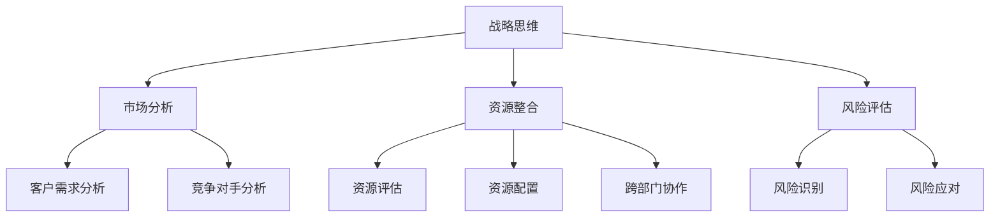

- **引出本文主题**：《不打无准备之战》的重要性，如何通过战略准备提升竞争力和成功率。

#### 第一部分：战略准备

**第1章：战略思维与决策**

**内容：**

- **背景介绍**：阐述战略思维的重要性。
- **核心概念与联系**：使用Mermaid流程图展示战略思维的核心要素和其相互关系。
- **核心算法原理讲解**：使用伪代码详细解释战略决策的步骤。

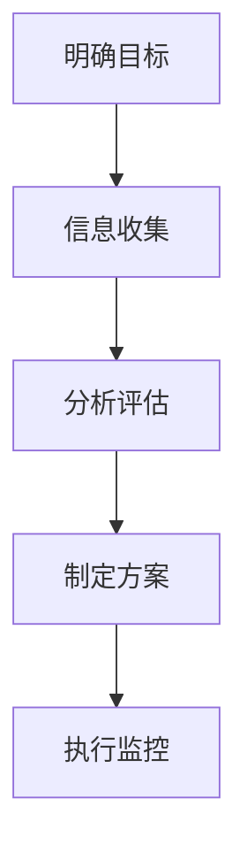

- **实战案例**：分析华为的战略转型案例，展示战略思维的实际应用。
- **小结**：总结战略思维的关键要素和实践方法。

**第2章：市场分析**

**内容：**

- **背景介绍**：说明市场分析对战略准备的重要性。
- **核心概念与联系**：使用Mermaid流程图展示市场分析的核心概念。
- **核心算法原理讲解**：使用伪代码解释市场趋势识别与预测的方法。

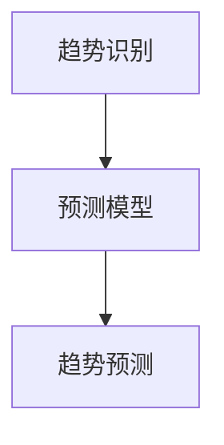

- **实战案例**：分析小米的市场开拓案例，展示市场分析的实践价值。
- **小结**：总结市场分析的关键方法和工具。

**第3章：资源整合**

**内容：**

- **背景介绍**：阐述资源整合对战略准备的重要性。
- **核心概念与联系**：使用Mermaid流程图展示资源整合的核心概念。
- **核心算法原理讲解**：使用伪代码详细解释资源评估与优化的方法。

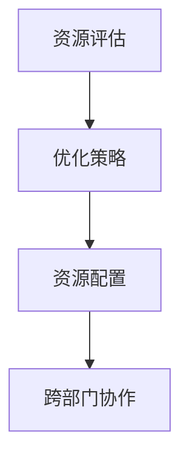

- **实战案例**：分析企业的资源配置和跨部门协作案例，展示资源整合的实际应用。
- **小结**：总结资源整合的关键策略和实践方法。

**第4章：风险评估与管理**

**内容：**

- **背景介绍**：说明风险评估与管理对战略准备的重要性。
- **核心概念与联系**：使用Mermaid流程图展示风险评估与管理的过程。
- **核心算法原理讲解**：使用伪代码详细解释风险识别与评估的方法。

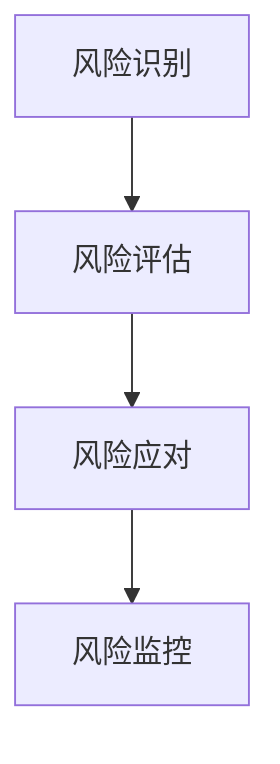

- **实战案例**：分析企业的风险管理与应对策略，展示风险评估的实际应用。
- **小结**：总结风险评估与管理的关键步骤和方法。

#### 第二部分：执行准备

**第5章：计划制定**

**内容：**

- **背景介绍**：阐述计划制定对执行准备的重要性。
- **核心概念与联系**：使用Mermaid流程图展示计划制定的核心要素。
- **核心算法原理讲解**：使用伪代码详细解释计划制定的原则与方法。

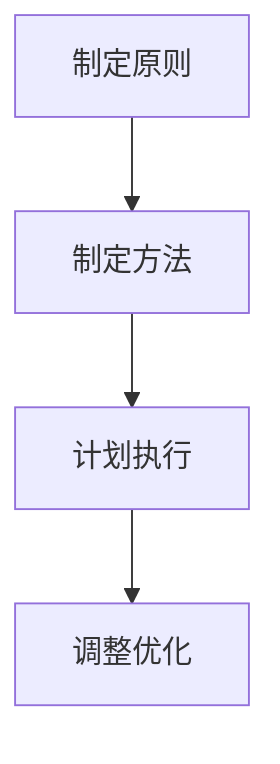

- **实战案例**：分析企业的计划制定与执行案例，展示计划制定的实践价值。
- **小结**：总结计划制定的关键原则和方法。

**第6章：组织建设**

**内容：**

- **背景介绍**：阐述组织建设对执行准备的重要性。
- **核心概念与联系**：使用Mermaid流程图展示组织建设的关键要素。
- **核心算法原理讲解**：使用伪代码详细解释组织结构与设计的方法。

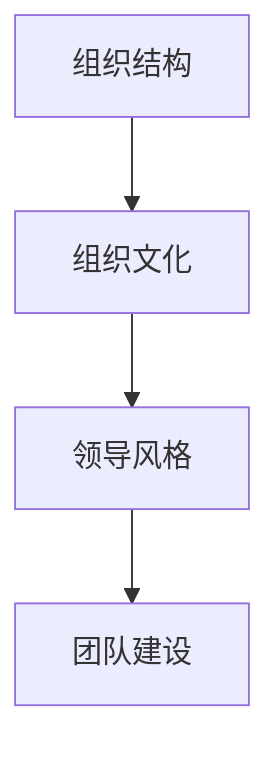

- **实战案例**：分析企业的组织建设案例，展示组织建设的实际应用。
- **小结**：总结组织建设的关键要素和实践方法。

**第7章：人力资源管理**

**内容：**

- **背景介绍**：阐述人力资源管理对执行准备的重要性。
- **核心概念与联系**：使用Mermaid流程图展示人力资源管理的核心要素。
- **核心算法原理讲解**：使用伪代码详细解释人力资源规划的方法。

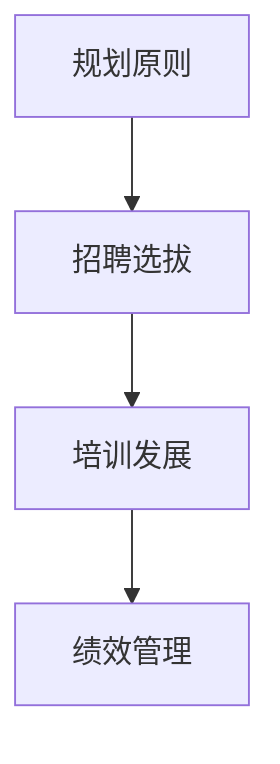

- **实战案例**：分析企业的人力资源管理案例，展示人力资源管理的实践价值。
- **小结**：总结人力资源管理的关键原则和方法。

**第8章：质量管理**

**内容：**

- **背景介绍**：阐述质量管理对执行准备的重要性。
- **核心概念与联系**：使用Mermaid流程图展示质量管理的核心要素。
- **核心算法原理讲解**：使用伪代码详细解释质量管理体系的建立与运行方法。

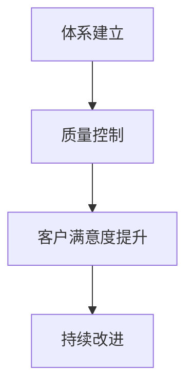

- **实战案例**：分析企业的质量管理案例，展示质量管理的实际应用。
- **小结**：总结质量管理的关键要素和实践方法。

#### 第三部分：实战准备

**第9章：项目管理**

**内容：**

- **背景介绍**：阐述项目管理对实战准备的重要性。
- **核心概念与联系**：使用Mermaid流程图展示项目管理的核心要素。
- **核心算法原理讲解**：使用伪代码详细解释项目管理的原则与方法。

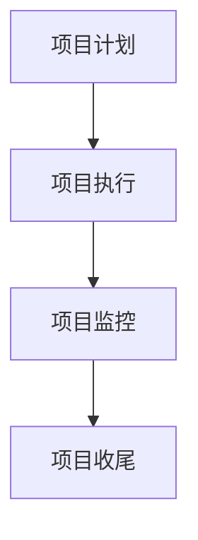

- **实战案例**：分析企业的项目管理案例，展示项目管理的实践价值。
- **小结**：总结项目管理的关键原则和方法。

**第10章：创新与创业**

**内容：**

- **背景介绍**：阐述创新与创业对实战准备的重要性。
- **核心概念与联系**：使用Mermaid流程图展示创新与创业的核心要素。
- **核心算法原理讲解**：使用伪代码详细解释创新思维与方法。

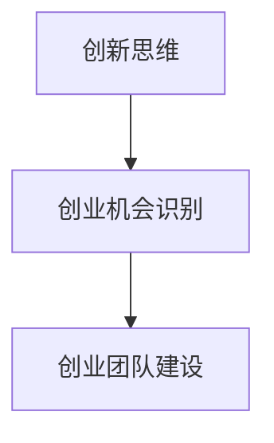

- **实战案例**：分析企业的创新与创业案例，展示创新与创业的实际应用。
- **小结**：总结创新与创业的关键原则和方法。

**第11章：危机管理**

**内容：**

- **背景介绍**：阐述危机管理对实战准备的重要性。
- **核心概念与联系**：使用Mermaid流程图展示危机管理的核心要素。
- **核心算法原理讲解**：使用伪代码详细解释危机识别与预警的方法。

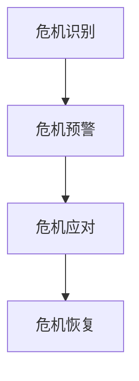

- **实战案例**：分析企业的危机管理案例，展示危机管理的实践价值。
- **小结**：总结危机管理的关键步骤和方法。

**第12章：案例分析**

**内容：**

- **背景介绍**：简要介绍案例分析的意义。
- **核心概念与联系**：使用Mermaid流程图展示案例分析的流程。
- **核心算法原理讲解**：使用伪代码详细解释案例分析的步骤。

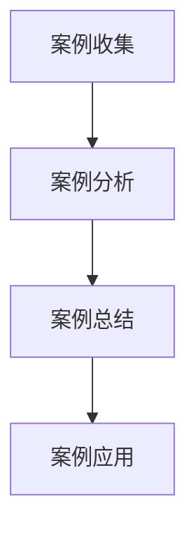

- **实战案例**：分析国内外成功案例，展示案例分析的实际应用。
- **小结**：总结案例分析的关键步骤和方法，提出案例启示与借鉴。

#### 附录

**附录**部分是整篇文章的补充内容，它包括一些实用的工具和方法，以及文章的索引。

**内容：**

- **战略工具与方法集锦**：总结战略准备的相关工具和方法。
- **执行工具与方法集锦**：总结执行准备的相关工具和方法。
- **创新与创业工具与方法集锦**：总结创新与创业的相关工具和方法。
- **索引**：为文章内容提供索引，方便读者查阅。

### 总结

**总结**部分是对整篇文章的总结，强调战略准备的重要性，并提出后续的建议和展望。

**内容：**

- **核心观点的回顾**：回顾文章中的核心观点和案例。
- **建议与展望**：提出针对不同阶段的战略准备建议，并对未来的战略准备趋势进行展望。

---

通过上述内容设计，我们可以确保《不打无准备之战》这篇文章逻辑清晰、结构紧凑、简单易懂，同时具有深度和思考，适合作为IT领域的专业技术博客文章。文章将包含丰富的图表、伪代码、数学公式和实战案例，以帮助读者更好地理解和应用战略准备的理论和实践方法。文章的字数将控制在8000-12000字左右，以确保内容的完整性和深度。作者信息将在文章末尾标注，以体现文章的专业性和权威性。|>

