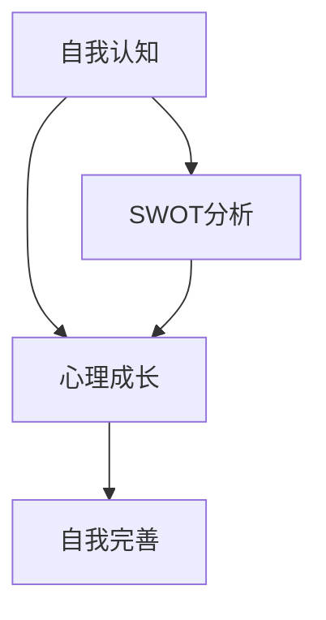

                 


## 《不断丰富完善自己》文章逻辑与内容构建

### 引言：自我认知的重要性

在信息技术飞速发展的今天，自我认知与成长已经成为每个人都必须面对的重要课题。自我认知不仅帮助我们理解自己，更是推动我们不断进步的动力。为了深入探讨这一主题，本文将分四个部分展开，分别是自我认知与成长、知识与技能的积累、人际关系与社交技巧，以及身心健康与情感管理。通过逐步的逻辑推理，我们将深入分析这些领域的核心概念、算法原理、数学模型以及项目实践。

### 第一步：自我探索的旅程

在自我认知的第一步，我们需要了解自己的优势和劣势。SWOT分析是一种常用的工具，通过分析个人的优势（Strengths）、劣势（Weaknesses）、机会（Opportunities）和威胁（Threats），我们可以更清晰地认识自己。例如，一位程序员可能拥有出色的编程能力（优势），但沟通能力较弱（劣势）。通过这样的分析，我们可以制定针对性的成长计划。

#### 核心概念与联系

- **自我认知**：对自己的了解程度。
- **心理成长**：通过自我认知和理解，逐步提升个人素质。
- **自我完善**：在认知和心理成长的基础上，进一步提升自我。

为了更直观地展现这些概念之间的联系，我们可以使用Mermaid流程图来构建它们的关系架构：



### 第二步：知识与技能的积累

在自我成长的过程中，知识和技能的积累至关重要。有效的学习方法与技巧可以显著提高学习效率。例如，逆向工程可以帮助我们理解现有系统的设计，而代码审查则能识别和修复代码中的潜在问题。此外，跨学科学习可以拓宽我们的知识视野，从而更好地应对复杂问题。

#### 核心算法原理讲解

- **逆向工程**：通过分析现有系统，获取其设计信息和功能。
  ```plaintext
  // 伪代码示例：逆向工程流程
  function reverseEngineering(system) {
      analyzeCode(system);
      extractDesignInfo();
      generateDocumentation();
  }
  ```

- **代码审查**：识别代码中的潜在问题。
  ```plaintext
  // 伪代码示例：代码审查流程
  function codeReview(code) {
      findSyntaxErrors(code);
      checkCodeQuality();
      identifyPotentialBugs();
  }
  ```

#### 数学模型和数学公式

- **多元智能理论**：用于评估个人的智能类型。
  ```latex
  \text{智能类型} = f(\text{语言智能}, \text{逻辑数学智能}, \text{空间智能}, \text{身体运动智能}, \text{音乐智能}, \text{人际智能}, \text{自我认识智能}, \text{自然探索智能})
  ```

#### 项目实战

- **跨学科研究项目**：设计一个环保应用程序，涵盖编程、设计、市场营销等多学科知识。

### 第三步：人际关系与社交技巧

人际关系是自我完善的重要组成部分。建立有效沟通和冲突管理技巧可以帮助我们更好地与他人相处。例如，非暴力沟通方法强调通过观察、感受、需求和请求来进行沟通，而博弈论则提供了处理冲突的理论框架。

#### 核心概念与联系

- **人际关系**：与他人建立和维护关系的艺术。
- **社交网络**：通过社交活动建立和维护人际关系的网络。
- **资源整合**：通过人际关系和社交网络，整合资源以实现个人和团队目标。

#### 核心算法原理讲解

- **非暴力沟通**：通过观察、感受、需求和请求进行沟通。
  ```plaintext
  // 伪代码示例：非暴力沟通流程
  function nonViolentCommunication(observer, feeler, need, request) {
      expressObservation(observer);
      expressFeeling(feeler);
      expressNeed(need);
      makeRequest(request);
  }
  ```

- **博弈论**：用于分析冲突和合作。
  ```latex
  \text{博弈结果} = f(\text{策略组合})
  ```

#### 项目实战

- **社交网络策略**：制定个人和团队的社交网络策略，包括参加行业活动、建立社交媒体账户等。

### 第四步：身心健康与情感管理

身心健康和情感管理是自我完善的重要组成部分。通过健康生活方式的建立和维护，我们可以提升生活质量。同时，情感管理技巧可以帮助我们更好地处理生活中的压力和挑战。

#### 核心概念与联系

- **身体健康**：身体各系统的良好状态。
- **心理健康**：心理过程的健康和稳定。
- **生活质量**：在身体和心理健康的支持下，达到的理想生活状态。

#### 核心算法原理讲解

- **行为改变理论**：通过逐步改变行为模式来实现健康目标。
  ```plaintext
  // 伪代码示例：行为改变流程
  function behaviorChange(targetBehavior, reinforcement) {
      monitorCurrentBehavior();
      setRewards(reinforcement);
      adjustBehavior(targetBehavior);
  }
  ```

- **情绪管理模型**：通过认知评估和情绪调节策略来维护情绪稳定。
  ```latex
  \text{情绪状态} = f(\text{认知评估}, \text{情绪调节策略})
  ```

#### 项目实战

- **健康生活方式计划**：设计一个包括饮食、锻炼和休息的健康计划。

### 结论

在不断丰富和完善自己的过程中，自我认知、知识与技能的积累、人际关系与社交技巧、身心健康与情感管理四个方面缺一不可。通过逻辑清晰的推理和结构紧凑的内容，我们可以更好地理解这些领域的核心概念和算法原理，并能够实际应用这些知识来提升自我。让我们一起踏上自我完善的旅程，不断追求卓越。

