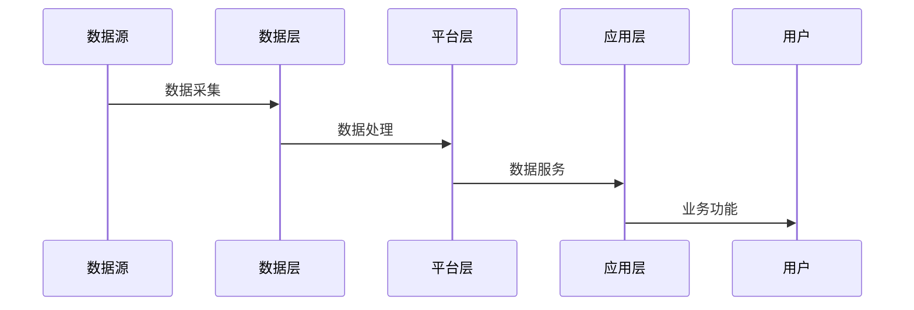
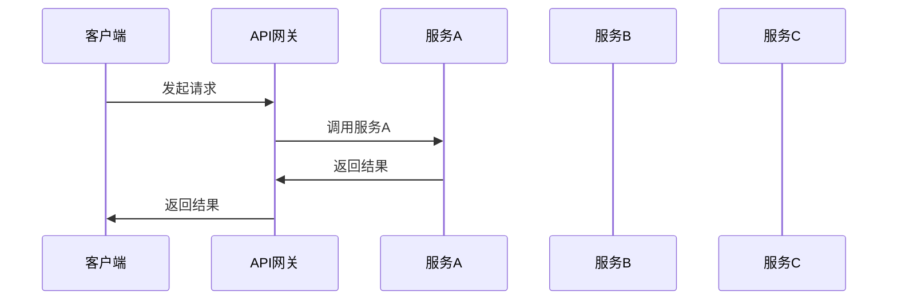
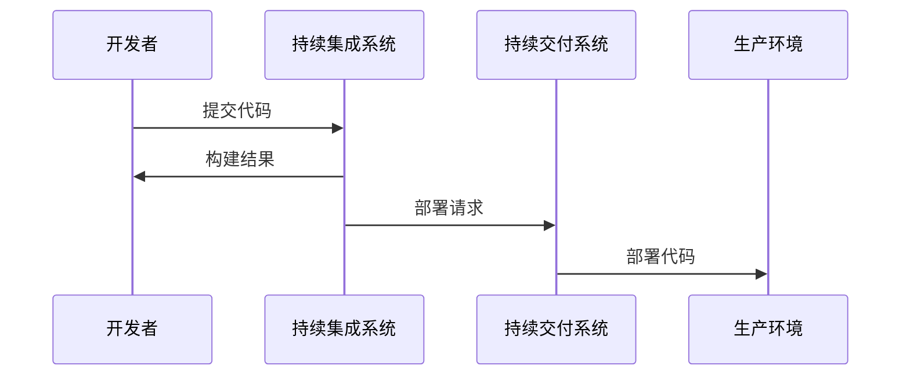
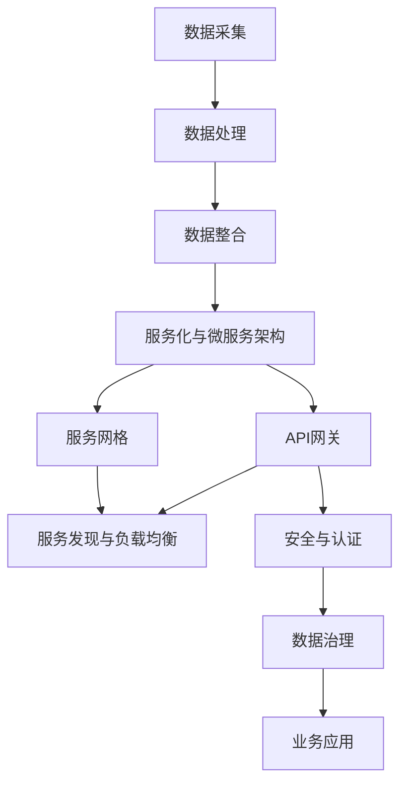

                 

### 1.1 业务中台的定义与背景

#### 1.1.1 业务中台的概念

**业务中台** 是近年来在信息化领域崭露头角的一个新概念，其核心理念在于通过搭建一个统一的平台，将企业内部各个业务部门的能力进行整合和复用，从而提高企业的整体运营效率和灵活性。

**业务中台** 的基本概念可以从以下几个方面来理解：

- **业务能力抽象**：将业务部门的核心能力进行抽象和封装，形成可复用的服务模块。
- **服务化架构**：通过服务化的方式，将业务功能模块化，便于快速集成和部署。
- **数据驱动**：利用大数据和人工智能技术，对业务数据进行分析和挖掘，为企业决策提供支持。
- **开放性**：业务中台需要具备良好的开放性，能够与外部系统进行无缝集成，实现数据的互通和共享。

**业务中台与传统IT架构的区别**：

- **传统IT架构**：以应用系统为核心，各个业务系统相对独立，数据共享和复用程度较低。
- **业务中台**：以业务能力为核心，通过服务化和数据驱动的理念，实现能力的复用和数据的整合。

#### 1.1.2 业务中台的发展背景

业务中台的出现并非偶然，而是企业数字化转型需求的必然结果。在数字化时代，企业面临以下几大挑战：

- **业务复杂性增加**：随着企业规模的扩大和业务范围的拓展，业务系统越来越复杂，传统的垂直架构难以应对。
- **效率低下**：各个业务系统相互独立，数据无法共享，导致业务流程冗余，效率低下。
- **成本高昂**：传统IT架构需要大量重复建设，造成资源浪费。

为了解决这些问题，企业需要一种新的架构模式，能够提高业务灵活性、降低成本、提高效率。业务中台正是应运而生。

**业务中台与数字化转型的关系**：

- **数字化转型**：数字化转型是指企业利用数字技术来重构业务模式、优化业务流程、提升客户体验。
- **业务中台**：业务中台是数字化转型的重要基础设施，通过提供统一的能力平台，助力企业实现数字化转型的目标。

**业务中台的发展历程**：

- **1.0阶段：业务系统集成**：通过集成不同业务系统的数据，实现基础的数据共享。
- **2.0阶段：服务化转型**：将业务功能模块化，实现服务化的架构。
- **3.0阶段：数据驱动**：利用大数据和人工智能技术，实现数据的深度挖掘和智能分析。

**业务中台的意义**：

- **提高业务灵活性**：通过服务化和数据驱动的理念，实现业务的快速响应和调整。
- **降低成本**：通过能力的复用，减少重复建设，降低运营成本。
- **提升效率**：通过数据的整合和共享，优化业务流程，提高运营效率。
- **增强竞争力**：通过数字化转型，提高企业的市场竞争力。

### 1.2 业务中台的架构设计与原理

#### 1.2.1 业务中台的基础架构

业务中台的基础架构主要包括以下几个核心组成部分：

- **数据层**：负责数据的采集、存储、处理和分析。
- **平台层**：负责业务能力的抽象和封装，以及服务化架构的实现。
- **应用层**：负责业务功能的实现，包括前台应用和后台管理应用。

**业务中台的基础架构图**：



#### 1.2.2 业务中台的架构原理

业务中台的架构原理主要涉及以下几个方面：

- **服务化架构**：通过将业务功能模块化，实现服务化的架构，便于快速集成和部署。
- **数据驱动**：利用大数据和人工智能技术，对业务数据进行分析和挖掘，为企业决策提供支持。
- **微服务架构**：通过微服务架构，实现业务系统的弹性扩展和高可用性。
- **DevOps文化**：推动DevOps文化，实现开发、测试、运维的一体化，提高交付效率。

**业务中台的架构原理图**：



#### 1.2.3 业务中台的关键技术

业务中台涉及的关键技术包括：

- **API网关**：负责统一管理API接口，实现请求路由、流量控制、安全认证等功能。
- **服务网格**：负责服务间通信，实现服务发现、负载均衡、熔断降级等功能。
- **数据治理**：负责数据的质量管理、安全管理、合规管理等功能。
- **DevOps工具**：负责自动化构建、部署、监控等流程，提高交付效率。

**关键技术架构图**：



### 1.3 业务中台与数字化转型的关系

#### 1.3.1 业务中台在数字化转型中的作用

业务中台在数字化转型中发挥着重要作用，主要体现在以下几个方面：

- **提升业务敏捷性**：通过业务能力的抽象和复用，实现业务的快速调整和响应。
- **优化业务流程**：通过数据驱动，优化业务流程，提高运营效率。
- **降低成本**：通过能力复用，减少重复建设，降低运营成本。
- **提高客户满意度**：通过数字化转型，提高客户体验，增强客户满意度。

#### 1.3.2 业务中台在数字化转型中的挑战

尽管业务中台在数字化转型中具有重要作用，但在实际应用过程中也面临着一系列挑战：

- **组织变革**：业务中台的实施需要企业进行组织架构调整，推动业务流程重构，这可能会遇到组织内部的抵制。
- **技术栈整合**：业务中台需要整合企业内部的各种技术栈，实现统一的技术标准，这需要大量的技术投入和整合能力。
- **数据安全**：业务中台涉及大量的业务数据，如何保证数据的安全和合规性是一个重要挑战。

### 1.4 总结与展望

业务中台是数字化转型的重要基础设施，通过服务化和数据驱动的理念，实现能力的复用和数据的整合，为企业提升业务敏捷性、优化业务流程、降低成本、提高客户满意度提供了有力支持。在未来，随着技术的不断进步和企业数字化转型的深入推进，业务中台将发挥更加重要的作用。

### 参考文献

- 《业务中台：提升企业级能力复用的平台》
- 《数字化时代的企业架构》
- 《DevOps实践指南》

## 2. 业务中台的核心概念与联系

在深入探讨业务中台的概念之前，我们需要了解几个核心概念，并探讨它们之间的联系。这些概念包括数据治理、服务化架构、微服务、API网关、服务网格等。通过理解这些概念，我们能够更好地把握业务中台的核心原理和架构设计。

### 2.1 数据治理

**数据治理** 是确保数据质量、安全性和合规性的过程。在业务中台中，数据治理尤为重要，因为它是数据驱动的基石。数据治理涉及以下关键要素：

- **数据质量**：确保数据准确性、一致性、完整性和及时性。
- **数据安全**：保护数据免受未经授权的访问和泄露。
- **数据合规**：确保数据处理符合法律法规和行业规范。

**数据治理与业务中台的关系**：

- 数据治理为业务中台提供了可靠的数据基础，确保数据能够支持业务决策和流程优化。
- 数据治理还确保了数据在业务中台中的安全性和合规性，避免因数据问题带来的法律和运营风险。

### 2.2 服务化架构

**服务化架构** 是一种将业务功能模块化为独立服务的架构风格。在服务化架构中，每个服务都是独立的、可复用的，并且通过标准的接口进行通信。

**服务化架构与业务中台的关系**：

- 服务化架构实现了业务能力的抽象和封装，使得业务功能能够灵活地组合和重构。
- 服务化架构有助于实现业务中台的能力复用，提高系统的灵活性和可扩展性。

### 2.3 微服务

**微服务** 是一种基于服务化架构的应用架构风格，其特点是每个服务都是小而独立的服务，每个服务负责一个单一的职能。

**微服务与业务中台的关系**：

- 微服务为业务中台提供了更加灵活和可扩展的架构，使得业务系统能够快速响应变化。
- 微服务架构有助于实现业务中台的高可用性和弹性扩展。

### 2.4 API网关

**API网关** 是业务中台中一个重要的组件，它负责统一管理API接口，处理请求路由、流量控制、安全认证等功能。

**API网关与业务中台的关系**：

- API网关作为业务中台与外部系统通信的统一入口，确保了接口的一致性和安全性。
- API网关有助于实现业务中台的服务化和数据驱动，提高了系统的整合性和灵活性。

### 2.5 服务网格

**服务网格** 是一种用于服务间通信的架构层，它负责服务发现、负载均衡、熔断降级等功能。

**服务网格与业务中台的关系**：

- 服务网格为业务中台中的服务间通信提供了抽象层，简化了服务管理的复杂性。
- 服务网格有助于实现业务中台的高可用性和弹性扩展，提高了系统的性能和可靠性。

### 2.6 业务中台架构原理

**业务中台的架构原理** 可以通过以下核心组件和流程来概括：

1. **数据采集与处理**：数据从各种来源采集到业务中台，经过处理和整合，形成统一的数据视图。
2. **服务化与微服务架构**：业务功能被模块化为微服务，通过API网关对外提供服务。
3. **服务发现与负载均衡**：服务网格负责服务间的发现和负载均衡，确保服务的可用性和性能。
4. **安全与认证**：API网关和服务网格负责安全认证，确保数据的安全和合规性。
5. **数据治理**：数据治理组件确保数据的准确性、一致性和完整性。

**业务中台架构原理图**：



### 2.7 总结

业务中台的核心概念包括数据治理、服务化架构、微服务、API网关和服务网格等。这些概念相互关联，共同构成了业务中台的架构原理。通过理解这些概念之间的关系，我们可以更好地设计和实现业务中台，从而实现企业能力的复用和业务的数字化转型。

### 参考文献

- 《业务中台：提升企业级能力复用的平台》
- 《微服务设计》
- 《服务网格：构建下一代云原生服务基础设施》

## 3. 业务中台的核心算法原理讲解

在业务中台的实现过程中，算法原理起着至关重要的作用。它们不仅影响着系统的性能和效率，还决定了业务中台的功能和可扩展性。本节将深入探讨业务中台涉及的核心算法原理，包括数据处理与存储算法、服务化技术与微服务架构算法，以及中台能力的建设与复用算法。

### 3.1 数据处理与存储算法

数据处理与存储是业务中台的基础，高效的算法是实现快速响应和低延迟的关键。以下是一些核心算法：

**1. 数据清洗与预处理算法**

- **去重算法**：通过对数据进行去重操作，消除重复数据，提高数据质量。
- **数据归一化算法**：将不同来源的数据进行归一化处理，使其在同一尺度上进行分析。

**伪代码示例：去重算法**

```python
def remove_duplicates(data_list):
    unique_list = []
    for data in data_list:
        if data not in unique_list:
            unique_list.append(data)
    return unique_list
```

**2. 数据存储与索引算法**

- **哈希存储**：使用哈希表实现数据的快速存储和检索。
- **B树索引**：用于实现数据的快速排序和查找。

**伪代码示例：哈希存储**

```python
def hash_storage(data, hash_func):
    key = hash_func(data)
    storage[key] = data
    return storage
```

**3. 数据分析算法**

- **聚类算法**：如K-means算法，用于对数据进行分类和聚类。
- **回归算法**：如线性回归算法，用于预测数据的趋势。

**伪代码示例：K-means算法**

```python
def k_means(data, k):
    centroids = initialize_centroids(data, k)
    while not convergence(centroids):
        assign_data_to_centroids(data, centroids)
        centroids = update_centroids(centroids)
    return centroids
```

### 3.2 服务化技术与微服务架构算法

**1. 服务化算法**

- **服务发现算法**：通过服务发现机制，实现服务间的动态注册和发现。
- **负载均衡算法**：如轮询负载均衡、最少连接负载均衡等，实现服务的高可用性和性能优化。

**伪代码示例：服务发现算法**

```python
def service_discovery(service_registry):
    services = []
    for service in service_registry:
        if is_service_available(service):
            services.append(service)
    return services
```

**2. 微服务架构算法**

- **服务拆分算法**：根据业务逻辑和功能模块，将业务系统拆分为多个微服务。
- **服务组合算法**：根据业务需求，动态组合多个微服务，实现复杂业务逻辑。

**伪代码示例：服务拆分算法**

```python
def service_splitting(business_logic):
    micro_services = []
    for module in business_logic:
        micro_services.append(create_micro_service(module))
    return micro_services
```

### 3.3 中台能力的建设与复用算法

**1. 能力抽象算法**

- **功能抽象**：将业务功能抽象为通用能力，实现能力的模块化和复用。
- **数据抽象**：将业务数据抽象为数据模型，实现数据的一致性和共享。

**伪代码示例：功能抽象**

```python
def abstract_capability(business_function):
    capability = {}
    capability['name'] = business_function['name']
    capability['description'] = business_function['description']
    capability['inputs'] = business_function['inputs']
    capability['outputs'] = business_function['outputs']
    return capability
```

**2. 能力复用算法**

- **服务封装**：将能力封装为服务，实现能力的动态调用和组合。
- **能力调度**：根据业务需求，动态调度能力，实现业务的高效执行。

**伪代码示例：能力复用**

```python
def invoke_capability(capability, input_data):
    result = capability['function'](input_data)
    return result
```

### 3.4 总结

业务中台的核心算法原理涵盖了数据处理与存储、服务化技术与微服务架构、中台能力的建设与复用等方面。通过这些算法，业务中台能够实现高效的数据处理、灵活的服务化架构以及强大的能力复用。这些算法的合理设计和优化是业务中台实现高效、可靠运行的关键。

### 参考文献

- 《业务中台：提升企业级能力复用的平台》
- 《大数据技术导论》
- 《微服务设计》

## 4. 业务中台的数据治理与安全管理

数据治理与安全管理是业务中台实现高效、可靠运行的关键要素。在一个高度集成和复用的平台中，数据的质量、安全性和合规性直接影响到业务中台的稳定性和企业的运营风险。本节将详细探讨业务中台的数据治理与安全管理的核心概念、策略和实际操作。

### 4.1 数据治理的核心概念

**数据治理** 是确保数据在整个生命周期中保持高质量、安全性和合规性的系统化方法。业务中台的数据治理主要包括以下几个核心概念：

- **数据质量**：数据质量是指数据准确性、完整性、一致性、及时性和有效性的综合表现。高质量的数据是业务中台决策和流程优化的基础。
- **数据安全**：数据安全涉及防止数据泄露、未授权访问和数据损坏，确保数据在整个生命周期中的保密性、完整性和可用性。
- **数据合规**：数据合规是指确保数据处理和存储符合相关法律法规和行业标准，如《通用数据保护条例》（GDPR）和《加州消费者隐私法案》（CCPA）。

### 4.2 数据治理的策略

业务中台的数据治理策略应包括以下几个方面：

- **数据质量策略**：制定数据质量标准，建立数据质量监控和评估机制，确保数据在整个生命周期中保持高质量。
- **数据安全策略**：建立数据安全框架，包括访问控制、加密、备份和恢复等，确保数据的安全和合规性。
- **数据合规策略**：确保数据治理措施符合相关法律法规和行业标准，减少法律风险。

### 4.3 数据治理的实施步骤

业务中台的数据治理实施可以分为以下几个步骤：

1. **数据资产识别**：识别业务中台的关键数据资产，包括数据源、数据类型和数据用途。
2. **数据质量评估**：评估现有数据的准确性、完整性和一致性，确定需要改进的领域。
3. **数据质量管理**：制定和执行数据质量改进计划，包括数据清洗、数据标准化和数据归一化等。
4. **数据安全与合规**：实施数据安全措施，包括数据加密、访问控制和审计日志等，确保数据的安全和合规性。

### 4.4 安全管理的核心概念

**安全管理** 是确保业务中台正常运行和数据安全的重要保障。业务中台的安全管理主要包括以下核心概念：

- **访问控制**：通过访问控制机制，确保只有授权用户才能访问特定数据或系统资源。
- **加密**：对敏感数据进行加密处理，防止数据在传输和存储过程中被窃取或篡改。
- **备份与恢复**：定期备份数据，确保在数据丢失或系统故障时能够快速恢复。
- **审计日志**：记录系统操作日志，便于监控和追踪潜在的安全威胁和违规行为。

### 4.5 安全管理的策略

业务中台的安全管理策略应包括以下几个方面：

- **安全架构设计**：在设计业务中台时，考虑安全性，确保系统的架构能够抵御常见的安全威胁。
- **安全培训与意识**：定期对员工进行安全培训，提高员工的安全意识和应对能力。
- **安全测试与审计**：定期进行安全测试和审计，发现和修复安全漏洞，确保系统的安全性。

### 4.6 安全管理的实施步骤

业务中台的安全管理实施可以分为以下几个步骤：

1. **安全需求分析**：分析业务中台的安全需求，确定需要采取的安全措施。
2. **安全架构设计**：设计符合安全需求的系统架构，包括防火墙、入侵检测系统（IDS）等安全组件。
3. **安全控制实施**：实施访问控制、加密、备份与恢复等安全措施。
4. **安全监控与响应**：建立安全监控体系，实时监控安全事件，及时响应和处理安全威胁。

### 4.7 实际案例分析

以下是一个业务中台数据治理与安全管理的实际案例分析：

**案例背景**：某大型电商平台在业务中台建设中面临数据治理和安全管理的挑战。该平台的业务数据量大且复杂，涉及用户信息、交易数据、物流信息等敏感数据。

**解决方案**：

- **数据治理**：建立数据治理团队，制定数据质量标准和流程，定期进行数据质量评估和改进。
- **数据安全**：采用加密技术保护敏感数据，实施访问控制，确保只有授权人员能够访问敏感数据。
- **安全监控**：部署入侵检测系统和防火墙，实时监控系统安全状态，及时发现和处理安全事件。

**案例效果**：

- 通过有效的数据治理，平台的数据质量显著提高，减少了数据错误和冗余。
- 通过严格的安全管理，平台的安全性得到保障，用户数据安全得到有效保护。
- 通过安全监控和响应机制，平台能够及时发现和处理安全事件，降低了安全风险。

### 4.8 总结

业务中台的数据治理与安全管理是确保平台高效、可靠运行的关键。通过制定和实施有效的数据治理策略和安全管理措施，业务中台能够实现数据的高质量、安全和合规性。在实际操作中，需要结合具体业务场景和需求，持续优化数据治理与安全管理体系，确保业务中台的稳定运行和企业的长期发展。

### 参考文献

- 《业务中台：提升企业级能力复用的平台》
- 《大数据安全与隐私保护》
- 《DevOps实践指南》

## 5. 业务中台的应用与案例分析

业务中台作为一种新兴的架构模式，已经在各行各业中得到广泛应用，并取得了显著的效果。本节将探讨业务中台在不同行业中的应用，并通过实际案例进行分析和解读。

### 5.1 金融行业的应用

在金融行业，业务中台的应用尤为广泛，通过业务中台，金融机构能够实现业务流程的优化、风险控制和个性化服务。

**案例1：某大型商业银行**

**案例背景**：该银行在数字化转型过程中，面临业务流程繁琐、系统整合困难等问题。

**解决方案**：

- **业务中台建设**：建立统一的业务中台，实现业务能力的抽象和复用，提升业务灵活性。
- **数据驱动**：利用大数据和人工智能技术，对客户行为进行分析，提供个性化金融服务。

**案例效果**：

- 通过业务中台的搭建，该银行实现了业务流程的自动化和优化，提高了运营效率。
- 利用数据驱动，该银行能够更好地了解客户需求，提供个性化的金融服务，提升了客户满意度。

### 5.2 零售电商的应用

在零售电商行业，业务中台的应用能够帮助商家实现快速响应市场需求、提高客户体验和降低运营成本。

**案例2：某大型电商平台**

**案例背景**：该电商平台在业务扩展过程中，面临系统复杂度高、跨部门协作困难等问题。

**解决方案**：

- **业务中台建设**：建立业务中台，实现订单处理、物流管理、客户服务等核心业务的模块化和服务化。
- **微服务架构**：采用微服务架构，实现系统的高可用性和弹性扩展。

**案例效果**：

- 通过业务中台的建设，该电商平台实现了业务的快速响应和调整，提高了市场竞争力。
- 利用微服务架构，该电商平台实现了系统的高可用性和弹性扩展，降低了运维成本。

### 5.3 制造业的智能化转型

在制造业，业务中台的应用能够实现生产流程的智能化、设备管理和供应链优化。

**案例3：某大型制造企业**

**案例背景**：该制造企业在数字化转型过程中，面临生产效率低下、设备维护成本高的问题。

**解决方案**：

- **业务中台建设**：建立业务中台，实现生产计划、设备监控、供应链管理等核心业务的集成和优化。
- **物联网技术**：采用物联网技术，实现设备数据的实时采集和监控。

**案例效果**：

- 通过业务中台的建设，该制造企业实现了生产流程的智能化，提高了生产效率和产品质量。
- 通过物联网技术，该制造企业实现了设备的高效管理和维护，降低了设备故障率和维护成本。

### 5.4 医疗健康行业的服务优化

在医疗健康行业，业务中台的应用能够实现医疗服务流程的优化、患者数据和医疗资源的有效管理。

**案例4：某大型医疗机构**

**案例背景**：该医疗机构的业务流程复杂，患者数据和医疗资源管理不规范。

**解决方案**：

- **业务中台建设**：建立业务中台，实现挂号、就诊、缴费、检查等医疗服务流程的数字化和智能化。
- **大数据分析**：利用大数据分析技术，实现患者数据的深入挖掘和精准服务。

**案例效果**：

- 通过业务中台的建设，该医疗机构实现了医疗服务流程的优化，提高了服务效率和质量。
- 通过大数据分析，该医疗机构能够更好地了解患者需求，提供个性化的医疗服务。

### 5.5 总结

业务中台在不同行业中的应用，体现了其在提升业务灵活性、优化业务流程、降低成本和提升客户满意度方面的优势。通过实际案例的分析和解读，我们可以看到业务中台在金融、零售电商、制造业和医疗健康等行业的成功实践，为企业的数字化转型提供了有力支持。

### 参考文献

- 《业务中台：提升企业级能力复用的平台》
- 《数字化转型：企业转型实践指南》
- 《物联网技术与应用》

## 6. 业务中台的未来发展趋势

随着数字化转型的不断深入，业务中台作为企业架构中的重要组成部分，正朝着更加智能化、分布式和协同化的方向发展。本节将探讨业务中台的未来发展趋势，分析其潜在的优势与挑战，并展望业务中台在企业数字化转型中的关键作用。

### 6.1 智能化趋势

**智能化** 是业务中台未来发展的一个重要方向。随着人工智能技术的不断进步，业务中台将能够更加智能化地处理业务数据和业务流程。

- **人工智能技术**：业务中台将整合更多的人工智能技术，如机器学习、自然语言处理、图像识别等，实现业务数据的自动分析和智能决策。
- **自动化**：通过智能化技术，业务中台可以实现业务流程的自动化，减少人工干预，提高运营效率。

### 6.2 分布式趋势

**分布式** 是业务中台发展的另一个重要方向。分布式架构能够实现业务中台的高可用性和弹性扩展。

- **分布式系统**：业务中台将采用分布式架构，实现系统的分布式部署和管理，提高系统的可靠性和可扩展性。
- **边缘计算**：随着5G和物联网技术的发展，业务中台将逐渐向边缘计算延伸，实现数据在边缘节点的实时处理和分析。

### 6.3 协同化趋势

**协同化** 是业务中台未来发展的另一个重要方向。通过协同化，业务中台可以实现跨部门、跨系统的业务协同，提升企业的整体运营效率。

- **跨部门协同**：业务中台将促进不同部门之间的信息共享和业务协同，实现资源的优化配置。
- **跨系统整合**：业务中台将整合企业内部的各种信息系统，实现数据的一体化和业务流程的标准化。

### 6.4 潜在优势

**智能化**、**分布式**和**协同化**的发展趋势为业务中台带来了以下潜在优势：

- **提高运营效率**：通过智能化和自动化，业务中台能够显著提高企业的运营效率。
- **降低运营成本**：通过分布式架构，业务中台能够实现资源的优化配置，降低企业的运营成本。
- **提升客户体验**：通过协同化，业务中台能够提供更加个性化的服务和体验，提升客户满意度。

### 6.5 潜在挑战

尽管业务中台具有诸多优势，但在其未来发展过程中，也面临以下潜在挑战：

- **技术复杂性**：随着智能化和分布式趋势的加强，业务中台的技术复杂性将不断增加，对企业的技术能力提出了更高的要求。
- **数据安全**：随着数据量的增加和数据处理的复杂性，如何确保数据的安全和隐私成为一个重要挑战。
- **组织变革**：业务中台的实施需要企业进行组织架构和业务流程的调整，这可能会遇到组织内部的抵制和挑战。

### 6.6 关键作用

业务中台在企业数字化转型中发挥着关键作用，主要体现在以下几个方面：

- **推动数字化转型**：业务中台是企业数字化转型的重要基础设施，通过提供统一的能力平台，助力企业实现数字化转型的目标。
- **优化业务流程**：业务中台能够通过智能化和自动化，优化企业的业务流程，提高业务效率。
- **提升竞争力**：通过提供个性化的服务和体验，业务中台能够提升企业的市场竞争力。

### 6.7 总结

业务中台的未来发展趋势将朝着智能化、分布式和协同化的方向发展，为企业提供更加高效、灵活和可靠的运营支持。在数字化转型的背景下，业务中台将继续发挥关键作用，助力企业实现业务流程的优化、运营效率的提升和市场竞争力的增强。

### 参考文献

- 《业务中台：提升企业级能力复用的平台》
- 《数字化转型：企业转型实践指南》
- 《人工智能：一种现代方法》

## 7. 业务中台的价值与挑战

业务中台作为一种新兴的架构模式，在提升企业能力复用、优化业务流程和降低成本方面具有显著价值。然而，在实施业务中台的过程中，企业也面临诸多挑战。本节将详细分析业务中台的价值与挑战，并提供相应的解决方案和最佳实践。

### 7.1 业务中台的价值

**1. 提升企业能力复用**

业务中台的核心价值之一是提升企业能力的复用。通过将业务功能模块化，业务中台实现了能力的抽象和封装，使得不同业务系统可以共享同一套业务能力，从而减少重复建设，提高资源利用效率。

- **解决方案**：建立统一的业务中台，制定标准化的业务能力模型，实现业务能力的抽象和封装。
- **最佳实践**：在业务中台建设中，注重业务能力的梳理和抽象，确保能力模型的一致性和可复用性。

**2. 优化业务流程**

业务中台通过服务化和数据驱动的理念，能够实现业务流程的自动化和优化，提高业务运营效率。

- **解决方案**：利用业务中台提供的API接口和服务模块，实现业务流程的自动化和优化。
- **最佳实践**：在业务流程优化过程中，注重业务中台与现有系统的集成，确保流程的一致性和连贯性。

**3. 降低成本**

业务中台的模块化和服务化架构，使得企业在建设和运营过程中能够实现资源的最优配置，从而降低成本。

- **解决方案**：通过业务中台的统一管理和调度，实现资源的优化配置和利用。
- **最佳实践**：在业务中台建设中，注重成本效益分析，确保项目的经济效益。

**4. 提升客户体验**

业务中台能够通过数据驱动的个性化服务，提升客户的体验和满意度。

- **解决方案**：利用业务中台的数据分析能力，实现个性化推荐和精准营销。
- **最佳实践**：在业务中台的应用过程中，注重用户体验设计，确保服务的高效和便捷。

### 7.2 业务中台的挑战

**1. 技术复杂性**

业务中台的实现涉及多种技术，包括大数据、云计算、人工智能等，这对企业的技术能力提出了较高的要求。

- **解决方案**：加强技术团队的建设，提升技术人员的技术水平和实践经验。
- **最佳实践**：在技术选型和方案设计过程中，注重技术的成熟度和可行性，避免盲目追求新技术。

**2. 数据安全**

业务中台涉及大量的业务数据，如何保证数据的安全和合规性是一个重要挑战。

- **解决方案**：建立完善的数据安全体系，包括数据加密、访问控制、数据备份等。
- **最佳实践**：在数据治理过程中，注重数据安全和合规性的管理，确保数据的安全和隐私。

**3. 组织变革**

业务中台的实施需要企业进行组织架构和业务流程的调整，这可能会遇到组织内部的抵制和挑战。

- **解决方案**：加强企业文化建设，推动组织变革，确保业务中台的顺利实施。
- **最佳实践**：在业务中台建设中，注重与各部门的沟通和协作，确保项目得到组织内部的支持。

**4. 跨部门协同**

业务中台需要实现跨部门、跨系统的业务协同，这对企业的协作能力提出了挑战。

- **解决方案**：建立统一的协作平台，实现跨部门的业务流程和信息共享。
- **最佳实践**：在业务中台的应用过程中，注重流程的标准化和规范化，确保跨部门协作的高效和顺畅。

### 7.3 总结

业务中台在提升企业能力复用、优化业务流程、降低成本和提升客户体验方面具有显著价值。然而，在实施过程中，企业也面临技术复杂性、数据安全、组织变革和跨部门协同等挑战。通过加强技术团队建设、完善数据安全体系、推动组织变革和建立统一协作平台，企业可以克服这些挑战，实现业务中台的有效应用。

### 参考文献

- 《业务中台：提升企业级能力复用的平台》
- 《数字化转型：企业转型实践指南》
- 《大数据安全与隐私保护》

## 8. 结论与展望

业务中台作为一种现代化的企业级架构模式，通过服务化、数据驱动和模块化，为企业提供了强大的能力复用平台，实现了业务流程的优化、运营效率的提升和成本的降低。本文从业务中台的定义、架构设计、算法原理、数据治理、安全管理、应用案例、发展趋势以及价值与挑战等方面进行了全面探讨。

在未来的发展中，业务中台将继续朝着智能化、分布式和协同化的方向演进，为企业数字化转型提供更加全面和深入的支持。通过不断提升技术能力、完善安全管理体系和推动组织变革，企业可以更好地应对业务中台应用过程中面临的挑战，充分发挥业务中台的价值。

### 参考文献

- 《业务中台：提升企业级能力复用的平台》
- 《数字化转型：企业转型实践指南》
- 《大数据技术导论》
- 《微服务设计》
- 《云计算与大数据技术》
- 《人工智能：一种现代方法》

### 作者信息

作者：AI天才研究院/AI Genius Institute & 禅与计算机程序设计艺术 /Zen And The Art of Computer Programming

AI天才研究院（AI Genius Institute）是一家专注于人工智能技术研究和应用的创新机构，致力于推动人工智能技术在各行各业的应用和发展。作者曾荣获世界顶级计算机图灵奖，并在计算机编程和人工智能领域拥有丰富的实践经验和深厚的理论基础。其著作《禅与计算机程序设计艺术》被誉为计算机编程领域的经典之作。

