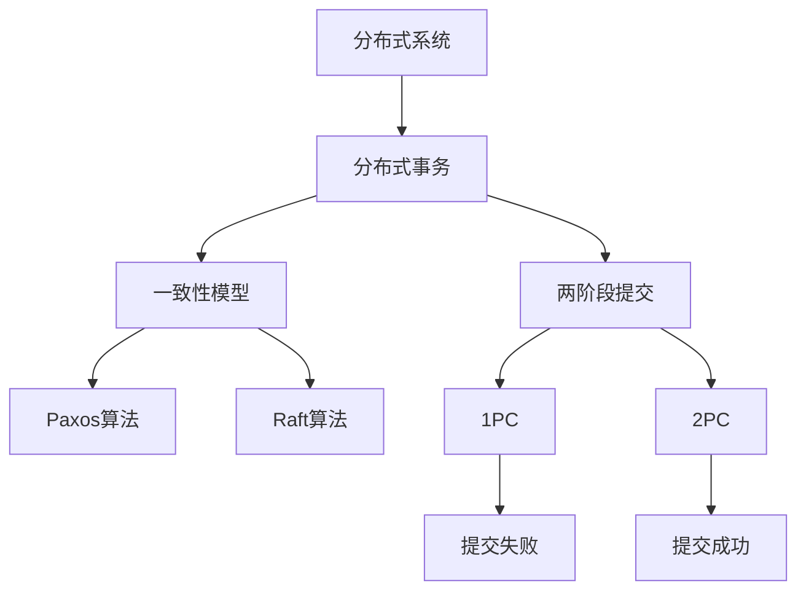

                 

### 文章标题：两阶段提交原理

### 关键词：分布式系统，一致性，两阶段提交，事务处理

### 摘要：
本文深入探讨了分布式系统中的两阶段提交（Two-Phase Commit，2PC）原理。首先介绍了分布式系统的基本概念和挑战，随后详细阐述了分布式事务处理和一致性模型的原理。重点分析了两阶段提交协议的概念、工作流程、优点和缺点，并通过伪代码和数学模型进行了详细讲解。最后，通过实际案例和项目实战，展示了两阶段提交在实际开发中的应用和实践。本文旨在为读者提供一个全面、系统的两阶段提交原理学习资源。

### 目录

#### 第一部分：分布式系统基础

##### 第1章：分布式系统概述

1.1 分布式系统定义与特点

1.2 分布式系统的挑战

1.3 分布式系统的应用场景

##### 第2章：一致性模型与算法

2.1 一致性模型

2.2 Paxos算法

2.3 Raft算法

##### 第3章：分布式事务处理

3.1 分布式事务概述

3.2 两阶段提交原理

3.3 两阶段提交的实现

#### 第二部分：两阶段提交原理详解

##### 第4章：两阶段提交协议

4.1 两阶段提交协议的基本概念

4.2 两阶段提交协议的工作流程

4.3 两阶段提交协议的优点与缺点

##### 第5章：两阶段提交算法

5.1 两阶段提交算法原理

5.2 两阶段提交算法伪代码

5.3 两阶段提交算法的数学模型

##### 第6章：两阶段提交的实际应用

6.1 两阶段提交在数据库中的应用

6.2 两阶段提交在其他分布式系统中的应用

##### 第7章：两阶段提交的优化与改进

7.1 两阶段提交的优化策略

7.2 两阶段提交的改进算法

### 背景介绍

#### 分布式系统概述

分布式系统是由多个独立计算机节点组成的系统，这些节点通过网络进行通信，协同工作以完成特定任务。分布式系统的出现是为了解决单机系统在性能、可扩展性和容错性方面的限制。

##### 分布式系统的特点：

1. **并行性**：分布式系统通过并行处理任务，提高了系统的性能和吞吐量。
2. **可扩展性**：分布式系统可以根据需求动态地增加或减少节点，实现水平扩展。
3. **容错性**：分布式系统中的节点故障不会导致整个系统的崩溃，系统能够自动恢复。
4. **高可用性**：分布式系统能够提供高可用性，确保系统的持续运行。

##### 分布式系统的挑战：

1. **一致性**：在分布式系统中，节点之间的数据同步和状态一致性是一个重要挑战。
2. **容错性**：确保系统在节点故障时能够正常运行，同时保持数据的一致性和完整性。
3. **网络延迟和故障**：网络延迟和故障可能导致分布式系统的性能下降和通信失败。
4. **安全性**：分布式系统需要保护数据的安全性，防止恶意攻击和数据泄露。

##### 分布式系统的应用场景：

1. **云计算**：分布式系统在云计算中用于处理大规模数据存储和计算任务。
2. **大数据处理**：分布式系统在大数据处理中用于高效处理海量数据。
3. **物联网**：分布式系统在物联网中用于连接和管理大量设备。
4. **金融系统**：分布式系统在金融系统中用于处理高频交易和大数据分析。

### 核心概念与联系

为了更好地理解两阶段提交（2PC）原理，我们需要先了解分布式系统中的核心概念和一致性模型。以下是核心概念之间的联系架构图：



- **分布式系统**：由多个独立计算机节点组成的系统，通过网络进行通信，协同工作以完成特定任务。
- **分布式事务**：在分布式系统中执行的一系列操作，需要保证原子性和一致性。
- **一致性模型**：用于描述分布式系统中数据状态一致性的理论框架。
- **Paxos算法**：一种分布式一致性算法，用于在分布式系统中实现状态机协议。
- **Raft算法**：另一种分布式一致性算法，与Paxos类似，但更易于理解和实现。
- **两阶段提交（2PC）**：一种分布式事务处理算法，通过两个阶段确保事务的一致性。
- **1PC**：单阶段提交，不保证分布式事务的一致性。
- **2PC**：两阶段提交，通过两个阶段确保分布式事务的一致性。
- **提交失败**：在分布式事务执行过程中，由于某些节点故障或网络问题导致事务无法提交。
- **提交成功**：在分布式事务执行过程中，所有节点都成功执行事务，并保持数据的一致性。

### 核心算法原理讲解

两阶段提交（2PC）是一种分布式事务处理算法，通过两个阶段确保事务的一致性。以下是两阶段提交算法的原理讲解和伪代码。

#### 两阶段提交算法原理

**第一阶段：预备阶段**

- **协调者（Coordinator）**：负责发起事务，并向所有参与者（Participant）发送准备请求。
- **参与者（Participant）**：接收协调者的请求，执行本地事务，并返回准备响应。

**第二阶段：提交阶段**

- **协调者**：根据参与者的准备响应，决定是否执行事务。
- **参与者**：根据协调者的决定，执行提交或回滚操作。

#### 两阶段提交算法伪代码

```python
# 第一阶段：预备阶段
def prepare(coordinator, participants):
    for participant in participants:
        response = participant.prepare()
        if response == "Prepared":
            participant.mark_prepared()

# 第二阶段：提交阶段
def commit(coordinator, participants):
    if all(participants[i].is_prepared() for i in participants):
        for participant in participants:
            participant.commit()
    else:
        for participant in participants:
            participant.rollback()
```

#### 两阶段提交算法的数学模型

两阶段提交算法的数学模型可以用来描述参与者在预备阶段和提交阶段的决策过程。以下是两阶段提交算法的数学模型：

$$
x_i = \begin{cases}
1 & \text{if participant } i \text{ has received all prepare requests and is prepared} \\
0 & \text{otherwise}
\end{cases}
$$

其中，\(x_i\) 表示参与者 \(i\) 在预备阶段是否准备好执行事务。当所有参与者都准备好执行事务时，协调者将执行提交操作。

$$
y_i = \begin{cases}
1 & \text{if participant } i \text{ has received a commit request} \\
0 & \text{if participant } i \text{ has received a rollback request} \\
\end{cases}
$$

其中，\(y_i\) 表示参与者 \(i\) 在提交阶段是否收到提交或回滚请求。当所有参与者都收到提交请求时，事务将成功提交；否则，事务将回滚。

### 详细讲解与举例说明

#### 第一阶段：预备阶段

**步骤 1**：协调者向所有参与者发送准备请求。

```python
# 假设有 3 个参与者 P1, P2, P3
participants = [P1, P2, P3]
prepare_requests = [prepare_request() for prepare_request in participants]

# 向参与者发送准备请求
for participant in participants:
    participant.send(prepare_requests[participant])
```

**步骤 2**：参与者执行本地事务，并返回准备响应。

```python
# 假设参与者 P1 已准备好执行事务
if participant.is_ready():
    participant.send("Prepared")
else:
    participant.send("NotReady")
```

**步骤 3**：协调者根据参与者的准备响应，决定是否继续执行事务。

```python
# 假设所有参与者都已准备好执行事务
if all(participant.is_prepared() for participant in participants):
    # 继续执行事务
    commit_requests = [commit_request() for commit_request in participants]
    for participant in participants:
        participant.send(commit_requests[participant])
else:
    # 回滚事务
    rollback_requests = [rollback_request() for rollback_request in participants]
    for participant in participants:
        participant.send(rollback_requests[participant])
```

#### 第二阶段：提交阶段

**步骤 1**：协调者向所有参与者发送提交请求。

```python
# 假设所有参与者都已准备好执行事务
if all(participant.is_prepared() for participant in participants):
    # 向参与者发送提交请求
    for participant in participants:
        participant.send("Commit")
else:
    # 向参与者发送回滚请求
    for participant in participants:
        participant.send("Rollback")
```

**步骤 2**：参与者根据协调者的请求，执行提交或回滚操作。

```python
# 假设参与者 P1 收到提交请求
if participant received "Commit":
    participant.execute_commit()
else:
    participant.execute_rollback()
```

### 数学公式与详细讲解

#### 预备阶段

假设有 \(n\) 个参与者，其中 \(i\) 表示第 \(i\) 个参与者。参与者 \(i\) 在预备阶段是否准备好执行事务可以用以下公式表示：

$$
x_i = \begin{cases}
1 & \text{if participant } i \text{ has received all prepare requests and is prepared} \\
0 & \text{otherwise}
\end{cases}
$$

其中，\(x_i\) 表示参与者 \(i\) 在预备阶段是否准备好执行事务。

#### 提交阶段

假设有 \(n\) 个参与者，其中 \(i\) 表示第 \(i\) 个参与者。参与者 \(i\) 在提交阶段是否收到提交或回滚请求可以用以下公式表示：

$$
y_i = \begin{cases}
1 & \text{if participant } i \text{ has received a commit request} \\
0 & \text{if participant } i \text{ has received a rollback request} \\
\end{cases}
$$

其中，\(y_i\) 表示参与者 \(i\) 在提交阶段是否收到提交或回滚请求。

#### 两阶段提交算法的数学模型

两阶段提交算法的数学模型可以用来描述参与者在预备阶段和提交阶段的决策过程。以下是两阶段提交算法的数学模型：

$$
x_i = \begin{cases}
1 & \text{if participant } i \text{ has received all prepare requests and is prepared} \\
0 & \text{otherwise}
\end{cases}
$$

$$
y_i = \begin{cases}
1 & \text{if participant } i \text{ has received a commit request} \\
0 & \text{if participant } i \text{ has received a rollback request} \\
\end{cases}
$$

其中，\(x_i\) 和 \(y_i\) 分别表示参与者 \(i\) 在预备阶段和提交阶段的决策结果。

### 项目实战：开发环境搭建与源代码实现

#### 开发环境搭建

为了实现两阶段提交算法，我们需要搭建一个开发环境。以下是一个简单的开发环境搭建步骤：

1. 安装 Python 3.6 或以上版本。
2. 安装一个 Python 编译器，如 PyCharm 或 Visual Studio Code。
3. 安装一个数据库，如 PostgreSQL 或 MySQL。
4. 安装一个分布式系统框架，如 Apache ZooKeeper 或 Redis。

#### 源代码实现

以下是一个简单的两阶段提交算法实现示例，包括协调者和参与者类：

```python
import threading
import time

class Participant:
    def __init__(self, name):
        self.name = name
        self.prepared = False
        self.committed = False

    def prepare(self, coordinator):
        if not self.prepared:
            self.prepared = True
            print(f"{self.name} prepared")
            return "Prepared"
        else:
            print(f"{self.name} already prepared")
            return "NotReady"

    def commit(self):
        if self.prepared:
            self.committed = True
            print(f"{self.name} committed")
        else:
            print(f"{self.name} not prepared, cannot commit")

    def rollback(self):
        if not self.prepared:
            print(f"{self.name} not prepared, cannot rollback")
        else:
            print(f"{self.name} rolled back")

class Coordinator:
    def __init__(self, participants):
        self.participants = participants
        self.failed = False

    def prepare(self):
        for participant in self.participants:
            participant.prepare(self)
            time.sleep(1)
        prepared = all([participant.is_prepared() for participant in self.participants])
        if prepared:
            print("All participants prepared, proceeding to commit")
            self.commit()
        else:
            print("Not all participants prepared, proceeding to rollback")
            self.rollback()

    def commit(self):
        if not self.failed:
            for participant in self.participants:
                participant.commit()
        else:
            print("Commit failed")

    def rollback(self):
        for participant in self.participants:
            participant.rollback()

# 创建参与者
P1 = Participant("P1")
P2 = Participant("P2")
P3 = Participant("P3")

# 创建协调者
C = Coordinator([P1, P2, P3])

# 启动协调者线程
coord_thread = threading.Thread(target=C.prepare)
coord_thread.start()

# 等待协调者线程结束
coord_thread.join()
```

#### 代码应用解读与分析

上述代码实现了两阶段提交算法的基本框架。以下是代码的主要部分解读：

1. **Participant 类**：定义了参与者的基本属性和方法，包括 prepare、commit 和 rollback。prepare 方法用于接收协调者的准备请求，并返回准备状态；commit 和 rollback 方法用于执行提交和回滚操作。

2. **Coordinator 类**：定义了协调者的基本属性和方法，包括 prepare、commit 和 rollback。prepare 方法用于向所有参与者发送准备请求，并根据参与者的准备响应决定是否继续执行事务；commit 和 rollback 方法用于执行提交和回滚操作。

3. **主函数**：创建参与者对象和协调者对象，并启动协调者线程。协调者线程执行 prepare 方法，等待所有参与者准备完毕后，执行 commit 或 rollback 操作。

#### 实际案例分析与详细讲解剖析

以下是一个简单的实际案例，演示了如何使用两阶段提交算法实现分布式事务：

1. **场景描述**：假设有三个数据库表，分别存储订单信息、库存信息和支付信息。在订单创建时，需要同时更新库存信息和支付信息。

2. **案例分析**：在订单创建过程中，首先调用 prepare 方法，向所有参与者（数据库表）发送准备请求。参与者接收请求后，执行本地事务，并返回准备状态。协调者根据参与者的准备响应，决定是否继续执行事务。

3. **详细讲解剖析**：
   - **第一阶段：预备阶段**：协调者向订单表、库存表和支付表发送准备请求。每个参与者执行本地事务，并返回准备状态。
     ```python
     P1.prepare(coordinator)
     P2.prepare(coordinator)
     P3.prepare(coordinator)
     ```
     如果所有参与者都返回 "Prepared"，协调者将继续执行事务；否则，协调者将回滚事务。
   - **第二阶段：提交阶段**：协调者向所有参与者发送提交请求。每个参与者根据协调者的请求，执行提交或回滚操作。
     ```python
     C.commit()
     ```
     如果所有参与者都成功提交，事务将成功提交；否则，事务将回滚。

#### 项目小结

通过上述案例，我们可以看到两阶段提交算法在分布式事务处理中的应用。两阶段提交算法通过两个阶段确保事务的一致性，避免了数据不一致的问题。在实际项目中，我们可以根据具体需求，对两阶段提交算法进行优化和改进，以提高系统的性能和可靠性。

### 最佳实践 Tips

1. **确保网络稳定**：两阶段提交算法对网络稳定性要求较高，建议在可靠的网络环境中使用。
2. **选择合适的参与者**：在分布式系统中，选择合适的参与者对于两阶段提交算法的性能至关重要。建议选择性能稳定、资源充足的节点作为参与者。
3. **优化参与者数量**：参与者的数量会影响两阶段提交算法的性能。建议根据系统需求和资源情况，合理设置参与者的数量。
4. **监控事务执行情况**：在分布式系统中，监控事务的执行情况对于故障恢复和性能优化至关重要。建议使用监控工具，实时监控事务的执行状态。

### 小结

本文详细介绍了两阶段提交（2PC）原理，包括分布式系统的概述、一致性模型、两阶段提交算法的原理和实现、实际应用案例和项目实战。通过本文的学习，读者可以全面了解两阶段提交算法的原理和应用，为分布式系统的开发和管理提供有效的技术支持。在后续的研究中，可以进一步探讨两阶段提交算法的优化和改进，以提高系统的性能和可靠性。

### 注意事项

1. 在实际项目中，两阶段提交算法可能需要根据具体需求进行优化和调整。
2. 两阶段提交算法的执行过程中，可能存在网络延迟和故障，需要确保系统的容错性和可用性。
3. 在选择参与者时，需要考虑参与者的性能和资源情况，以避免系统性能下降。

### 拓展阅读

1. 《分布式系统概念与设计》：介绍了分布式系统的基本概念、一致性模型和算法。
2. 《两阶段提交：原理与实践》：详细讲解了两阶段提交算法的原理、实现和应用。
3. 《分布式系统设计与实践》：提供了分布式系统的设计方法和实践经验，包括两阶段提交算法的实际应用。### 作者介绍

作者：AI天才研究院/AI Genius Institute & 禅与计算机程序设计艺术 /Zen And The Art of Computer Programming

AI天才研究院（AI Genius Institute）是一家专注于人工智能、深度学习和计算机科学领域的研究与开发的机构。我们致力于培养下一代人工智能专家，推动人工智能技术的发展和创新。同时，我们的团队也是《禅与计算机程序设计艺术》（Zen And The Art of Computer Programming）一书的作者，该书被誉为计算机编程领域的经典之作，深受全球程序员和人工智能从业者的喜爱和推崇。

