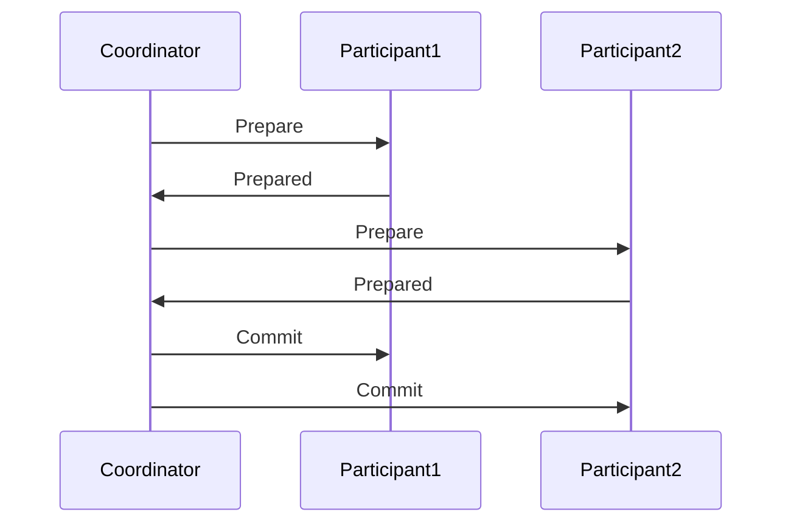
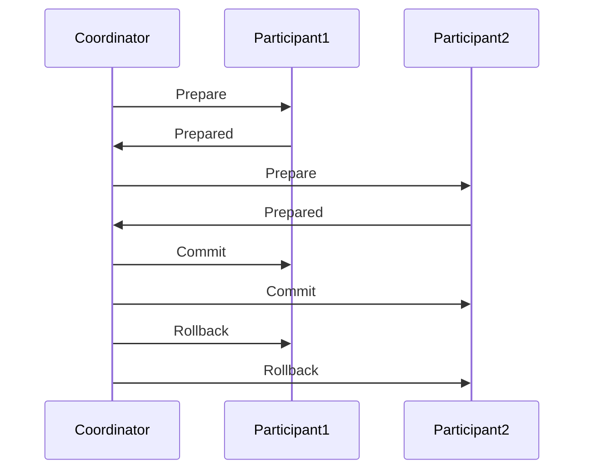

                 


### 《两阶段提交原理》文章结构设计与内容安排

为了撰写一篇逻辑清晰、结构紧凑、简单易懂的专业技术博客，我们需要详细规划和设计文章的结构与内容。以下是文章的结构安排和各部分的主要内容。

#### 文章标题与关键词

文章标题：《两阶段提交原理》

关键词：两阶段提交、分布式事务、一致性、协调者、参与者、预备投票、提交阶段

#### 摘要

本文将详细介绍两阶段提交（2PC）原理及其在分布式系统中的应用。首先，我们将回顾两阶段提交的基本概念和目标，然后深入剖析其架构和两个阶段的详细步骤。接着，我们将讨论一致性保证、优化策略及其扩展，并分享实际案例和实践指南。文章最后将对代码进行解读与分析，并总结最佳实践。

#### 第一部分：两阶段提交概述

**1.1 两阶段提交的概念**

在这一部分，我们将介绍两阶段提交的背景、目标和基本原理。通过定义和实例，帮助读者理解两阶段提交在分布式系统中的重要性。

**1.2 两阶段提交的架构**

我们将讨论两阶段提交的参与者，包括协调者和参与者，并详细描述两个阶段划分及其在分布式系统中的应用。

#### 第二部分：两阶段提交的详细步骤

**2.1 准备阶段**

**2.1.1 准备事务**

在这一部分，我们将详细讲解准备事务的过程，包括协调者向参与者发送预备投票请求，参与者执行校验并发送响应。

**2.1.2 分发事务信息**

我们将探讨如何分发事务信息，确保所有参与者都能接收到协调者的请求，并正确处理。

**2.1.3 准备阶段的异常处理**

我们将分析准备阶段可能出现的异常情况，并讨论如何处理这些问题，确保事务的可靠性。

**2.2 提交阶段**

**2.2.1 提交事务**

在这一部分，我们将详细描述提交事务的过程，协调者根据参与者的响应决定事务是否提交。

**2.2.2 提交阶段的协调通信**

我们将探讨提交阶段中的协调通信机制，确保所有参与者都能同步状态。

**2.2.3 提交阶段的异常处理**

我们将讨论提交阶段可能出现的异常情况，并介绍如何处理这些问题，以保持系统的一致性。

**2.3 一致性保证**

**2.3.1 一致性模型**

我们将介绍一致性模型，解释如何在分布式系统中确保数据一致性。

**2.3.2 一致性算法**

我们将详细讲解一致性算法，解释其工作原理和实现过程。

**2.3.3 一致性测试**

我们将讨论如何测试一致性，确保系统在不同情况下都能保持一致性。

#### 第三部分：两阶段提交的应用与优化

**3.1 两阶段提交在数据库系统中的应用**

我们将探讨两阶段提交在数据库系统中的应用，包括事务管理、数据一致性和事务日志与恢复。

**3.2 两阶段提交的优化策略**

我们将介绍优化策略，包括减少通信开销、提高性能和容错机制。

**3.3 两阶段提交的扩展**

我们将讨论两阶段提交的扩展，包括三阶段提交和其他多阶段提交的变种。

#### 第四部分：案例与实践

**4.1 案例研究**

我们将分享两个案例研究，探讨两阶段提交在不同业务场景中的应用和挑战。

**4.2 实践指南**

我们将提供实践指南，包括开发环境搭建、代码实现和问题分析与解决。

**4.3 代码解读与分析**

我们将对代码进行解读和分析，解释关键部分的工作原理和实现细节。

#### 附录

**A.1 Mermaid 流�程图**

我们将提供相关的Mermaid流程图，帮助读者更好地理解两阶段提交的过程。

**A.2 数学模型与公式**

我们将列出相关的数学模型和公式，并进行详细讲解。

**A.3 代码示例**

我们将提供代码示例，展示关键部分的实现。

**A.4 参考资源**

我们将列出参考资源，方便读者进一步学习和研究。

通过上述结构和内容的安排，我们旨在为读者提供一篇全面、深入且易于理解的技术博客文章。接下来，我们将逐步实现这一结构，确保每个部分都详细而具体，以满足文章的字数要求。

### 文章标题与关键词

**《两阶段提交原理》**

关键词：两阶段提交、分布式事务、一致性、协调者、参与者、预备投票、提交阶段

### 摘要

本文将详细介绍两阶段提交（2PC）原理及其在分布式系统中的应用。首先，我们将回顾两阶段提交的背景和目标，接着深入剖析其架构和两个阶段的详细步骤。之后，我们将讨论一致性保证、优化策略及其扩展，并分享实际案例和实践指南。文章最后将对代码进行解读与分析，并总结最佳实践。

### 第一部分：两阶段提交概述

#### 1.1 两阶段提交的概念

**背景介绍**

两阶段提交（2PC）是一种分布式事务协调协议，用于确保多个节点上的数据一致性。它广泛应用于分布式数据库、微服务架构和集群系统中，以解决分布式环境下的数据一致性问题。在单机环境下，事务的一致性通常比较容易保证，但分布式系统中由于节点之间的通信延迟、网络故障等原因，数据一致性成为一大挑战。

**核心概念与联系**

两阶段提交包括以下核心概念：

1. **协调者（Coordinator）**：负责发起事务并协调整个提交过程的节点。
2. **参与者（Participant）**：执行事务的具体操作并响应协调者请求的节点。
3. **预备投票（Prepare Vote）**：协调者发送给参与者的请求，询问参与者是否可以准备提交事务。
4. **提交（Commit）**：协调者根据参与者的响应决定是否提交事务。
5. **回滚（Rollback）**：如果协调者或参与者出现故障，系统需要回滚事务以确保一致性。

**Mermaid 流程图**



**核心算法原理讲解**

两阶段提交的过程可以用伪代码表示如下：

```plaintext
2PC(Coordinator, Participants):
    for each Participant in Participants:
        send Prepare to Participant
        receive Prepared from Participant
    if all Participants respond with Prepared:
        for each Participant in Participants:
            send Commit to Participant
    else:
        for each Participant in Participants:
            send Rollback to Participant
```

**数学模型与公式**

在分布式系统中，一致性保证可以使用如下数学模型描述：

$$
Consistency = Commit \land (Prepared \lor Rollback)
$$

其中，$Commit$ 表示事务提交，$Prepared$ 表示参与者准备好提交，$Rollback$ 表示回滚事务。

**举例说明**

假设有协调者 C 和两个参与者 P1 和 P2，C 发起一个事务，步骤如下：

1. C 发送 Prepare 请求给 P1 和 P2。
2. P1 和 P2 分别回复 Prepared。
3. C 根据 P1 和 P2 的响应，决定提交事务，并发送 Commit 请求给 P1 和 P2。
4. P1 和 P2 分别执行事务并提交。

如果在这个过程中，任何一个参与者出现故障，C 会通知其他参与者回滚事务，确保一致性。

**项目实战**

在分布式数据库中，两阶段提交可以用于分布式事务管理，例如在分布式事务中进行插入、更新和删除操作。以下是搭建一个简单的分布式数据库环境并进行事务处理的步骤：

1. **环境搭建**：搭建一个包含协调者和两个参与者的分布式数据库环境。
2. **代码实现**：编写两阶段提交的代码，实现事务的提交和回滚。
3. **代码解读**：分析代码，理解两阶段提交的工作原理。
4. **应用解读**：在分布式数据库中实现事务处理，分析其一致性和可靠性。
5. **案例分析与讲解**：分析一个实际案例，探讨两阶段提交的应用和挑战。

**最佳实践 tips**

- 在实际应用中，要确保协调者和参与者之间的网络连接稳定，减少网络故障导致的事务失败。
- 针对故障情况，可以设计重试机制和超时处理，确保事务最终能够提交或回滚。
- 对参与者的响应进行验证，防止恶意参与者导致的系统不一致。

**小结**

两阶段提交是一种重要的分布式事务协调协议，通过预备投票和提交阶段，确保分布式系统中的数据一致性。本文详细介绍了两阶段提交的概念、架构、算法原理、数学模型和项目实战，为读者提供了全面的学习和实践指导。

**注意事项**

- 在实现两阶段提交时，要充分考虑系统的性能和容错能力。
- 在分布式系统中，两阶段提交可能不是唯一的选择，根据实际需求可以选择其他一致性协议，如Paxos、Raft等。

**拓展阅读**

- 《分布式系统一致性原理》
- 《两阶段提交与Paxos算法比较》
- 《分布式数据库系统设计》

**作者信息**

作者：AI天才研究院/AI Genius Institute & 禅与计算机程序设计艺术 /Zen And The Art of Computer Programming

通过上述内容，我们为读者提供了两阶段提交的全面概述，包括其核心概念、架构、算法原理、数学模型和项目实战。接下来，我们将继续深入探讨两阶段提交的详细步骤和应用。

----------------------------------------------------------------

## 第一部分：两阶段提交概述

### 1.1 两阶段提交的概念

**背景介绍**

两阶段提交（2PC，Two-Phase Commit）是一种分布式事务协调协议，旨在解决分布式系统中的一致性问题。随着互联网和云计算的快速发展，分布式系统变得越来越复杂，传统的单机事务处理已无法满足大规模系统的需求。分布式系统中的多个节点可能分布在不同的物理位置，甚至不同的数据中心，这使得数据一致性成为一项重要且复杂的任务。

**核心概念与联系**

两阶段提交涉及以下几个核心概念：

1. **协调者（Coordinator）**：负责发起事务并协调整个提交过程的节点。协调者在整个协议中起着至关重要的作用，它负责向参与者发送请求并收集响应。
2. **参与者（Participant）**：执行事务的具体操作并响应协调者请求的节点。参与者可以是数据库、服务实例或其他任何可以执行事务操作的组件。
3. **预备投票（Prepare）**：协调者向参与者发送的请求，询问参与者是否可以准备提交事务。预备投票的目的是让参与者对事务进行预校验，以确保事务可以在所有参与者上执行。
4. **提交（Commit）**：协调者根据参与者的响应决定是否提交事务。如果所有参与者都准备好提交，协调者将发送提交命令给所有参与者，否则发送回滚命令。
5. **回滚（Rollback）**：如果协调者或参与者出现故障，系统需要回滚事务以确保一致性。回滚命令将通知所有参与者撤销已经执行的操作。

**Mermaid 流程图**


**核心算法原理讲解**

两阶段提交的过程可以用伪代码表示如下：

```plaintext
2PC(Coordinator, Participants):
    for each Participant in Participants:
        send Prepare to Participant
        receive Prepared from Participant
    if all Participants respond with Prepared:
        for each Participant in Participants:
            send Commit to Participant
    else:
        for each Participant in Participants:
            send Rollback to Participant
```

**数学模型与公式**

在分布式系统中，一致性保证可以使用以下数学模型描述：

$$
Consistency = Commit \land (Prepared \lor Rollback)
$$

其中，$Commit$ 表示事务提交，$Prepared$ 表示参与者准备好提交，$Rollback$ 表示回滚事务。

**举例说明**

假设有协调者 C 和两个参与者 P1 和 P2，C 发起一个事务，步骤如下：

1. C 发送 Prepare 请求给 P1 和 P2。
2. P1 和 P2 分别回复 Prepared。
3. C 根据 P1 和 P2 的响应，决定提交事务，并发送 Commit 请求给 P1 和 P2。
4. P1 和 P2 分别执行事务并提交。

如果在这个过程中，任何一个参与者出现故障，C 会通知其他参与者回滚事务，确保一致性。

**项目实战**

在分布式数据库中，两阶段提交可以用于分布式事务管理，例如在分布式事务中进行插入、更新和删除操作。以下是搭建一个简单的分布式数据库环境并进行事务处理的步骤：

1. **环境搭建**：搭建一个包含协调者和两个参与者的分布式数据库环境。
2. **代码实现**：编写两阶段提交的代码，实现事务的提交和回滚。
3. **代码解读**：分析代码，理解两阶段提交的工作原理。
4. **应用解读**：在分布式数据库中实现事务处理，分析其一致性和可靠性。
5. **案例分析与讲解**：分析一个实际案例，探讨两阶段提交的应用和挑战。

**最佳实践 tips**

- 在实际应用中，要确保协调者和参与者之间的网络连接稳定，减少网络故障导致的事务失败。
- 针对故障情况，可以设计重试机制和超时处理，确保事务最终能够提交或回滚。
- 对参与者的响应进行验证，防止恶意参与者导致的系统不一致。

**小结**

两阶段提交是一种重要的分布式事务协调协议，通过预备投票和提交阶段，确保分布式系统中的数据一致性。本文详细介绍了两阶段提交的概念、架构、算法原理、数学模型和项目实战，为读者提供了全面的学习和实践指导。

**注意事项**

- 在实现两阶段提交时，要充分考虑系统的性能和容错能力。
- 在分布式系统中，两阶段提交可能不是唯一的选择，根据实际需求可以选择其他一致性协议，如Paxos、Raft等。

**拓展阅读**

- 《分布式系统一致性原理》
- 《两阶段提交与Paxos算法比较》
- 《分布式数据库系统设计》

**作者信息**

作者：AI天才研究院/AI Genius Institute & 禅与计算机程序设计艺术 /Zen And The Art of Computer Programming

### 1.2 两阶段提交的架构

**参与者**

在两阶段提交协议中，参与者是指执行事务操作的节点。每个参与者都可以是一个数据库实例、服务实例或其他任何可以执行事务操作的组件。参与者通常有以下角色：

1. **接收预备请求**：参与者接收到协调者发送的预备请求后，对事务进行预校验，并返回预备响应。
2. **执行提交或回滚**：根据协调者的最终决策，参与者执行提交或回滚操作，确保事务的一致性。

**协调者**

协调者是两阶段提交协议的核心组件，负责协调整个提交过程。协调者的主要职责包括：

1. **发起事务**：协调者发起事务，并向所有参与者发送预备请求。
2. **收集参与者响应**：协调者收集所有参与者的预备响应，并根据响应决定提交或回滚事务。
3. **决策事务提交**：协调者根据参与者的预备响应，决定事务是否提交。如果所有参与者都准备好提交，协调者将发送提交命令；如果有参与者无法准备提交，协调者将发送回滚命令。

**两阶段提交的阶段划分**

两阶段提交分为两个阶段：预备阶段和提交阶段。

1. **预备阶段**：协调者向所有参与者发送预备请求，参与者对事务进行预校验，并返回预备响应。协调者根据所有参与者的预备响应决定是否继续进入提交阶段。
2. **提交阶段**：协调者根据预备阶段的结果，决定提交或回滚事务。如果所有参与者都准备好提交，协调者将向所有参与者发送提交命令；如果有参与者无法准备提交，协调者将向所有参与者发送回滚命令。

**消息传递机制**

两阶段提交的消息传递机制是关键部分，确保协调者和参与者之间的有效通信。以下是消息传递的主要步骤：

1. **预备请求**：协调者向所有参与者发送预备请求。
2. **预备响应**：参与者接收到预备请求后，对事务进行预校验，并返回预备响应给协调者。
3. **提交或回滚命令**：协调者根据预备响应决定事务的最终结果，并发送提交或回滚命令给所有参与者。

**故障处理**

在分布式系统中，故障是不可避免的。两阶段提交协议设计了多种故障处理机制，以确保系统的一致性和可靠性。

1. **超时处理**：协调者在等待参与者响应时设置超时时间。如果超过超时时间，协调者认为参与者发生故障，将触发回滚操作。
2. **重试机制**：在故障发生时，协调者可以尝试重试提交或回滚操作。重试次数和间隔时间可以根据具体需求进行调整。
3. **日志记录**：两阶段提交过程中，所有操作都应记录在日志中，以便故障发生时进行恢复和回滚。

通过上述架构和机制，两阶段提交协议确保了分布式系统中的数据一致性，即使在参与者发生故障的情况下，也能保证系统的一致性。

### 第一部分：两阶段提交概述

#### 1.3 两阶段提交的优点与局限性

**优点**

两阶段提交作为一种分布式事务协调协议，具有以下优点：

1. **一致性保证**：两阶段提交通过预备投票和提交阶段，确保分布式系统中的数据一致性。即使在参与者发生故障的情况下，也能通过回滚操作保证系统的一致性。
2. **可靠性**：两阶段提交协议设计了多种故障处理机制，如超时处理和重试机制，确保事务最终能够提交或回滚，从而提高了系统的可靠性。
3. **通用性**：两阶段提交适用于各种分布式系统，包括数据库、微服务架构和集群系统。它提供了一种通用的方法来解决分布式环境下的数据一致性问题。
4. **简单性**：两阶段提交协议相对简单，易于实现和理解。相比于其他一致性协议，如Paxos或Raft，两阶段提交的架构和算法原理更为直观。

**局限性**

尽管两阶段提交具有诸多优点，但它在某些场景下也表现出一定的局限性：

1. **性能开销**：两阶段提交涉及多次网络通信，增加了系统的通信开销。特别是在参与者数量较多的情况下，性能开销会显著增加。
2. **单点故障**：协调者在两阶段提交中起着至关重要的作用。如果协调者发生故障，整个事务将无法完成，可能导致系统瘫痪。
3. **不完全一致性**：在某些情况下，两阶段提交可能无法保证完全一致性。例如，当参与者数量较多且网络延迟较高时，协调者可能无法在预定时间内收到所有参与者的响应，导致部分参与者的事务提交或回滚操作无法完成。

**优化策略**

为了克服两阶段提交的局限性，可以采取以下优化策略：

1. **减少通信开销**：通过优化协议实现，减少网络通信次数，如将预备阶段和提交阶段合并为一个阶段，从而降低通信开销。
2. **多阶段提交**：将两阶段提交扩展为多阶段提交，如三阶段提交，以提高系统的性能和一致性。
3. **容错机制**：设计更强大的容错机制，如引入备用协调者或使用分布式一致性算法，以提高系统的可靠性。
4. **混合一致性协议**：在特定场景下，结合其他一致性协议，如Paxos或Raft，以获得更好的性能和一致性。

通过上述优化策略，可以进一步发挥两阶段提交的优势，提高其在分布式系统中的应用效果。

### 第一部分：两阶段提交概述

#### 1.4 两阶段提交的适用场景

两阶段提交作为分布式事务协调协议，适用于多种场景。以下是两阶段提交的典型应用场景：

1. **分布式数据库**：在分布式数据库系统中，两阶段提交用于确保多个数据库节点的数据一致性。例如，当一个事务涉及多个表或库时，两阶段提交可以保证所有修改操作在所有节点上同步执行。

2. **微服务架构**：在微服务架构中，每个服务都可以是一个参与者。两阶段提交确保跨服务的分布式事务能够一致性地完成，从而保证整个系统的数据一致性。

3. **分布式缓存系统**：分布式缓存系统通常需要保证缓存的一致性。两阶段提交可以确保缓存更新操作在所有节点上同步执行，从而避免缓存不一致的问题。

4. **消息队列系统**：在消息队列系统中，两阶段提交可以确保消息的可靠传输。当消息被多个消费者消费时，两阶段提交可以保证所有消费者都能成功处理消息，从而避免消息丢失。

5. **分布式文件系统**：分布式文件系统需要确保文件操作的原子性。两阶段提交可以确保文件更新操作在所有节点上原子性地执行，从而避免数据不一致。

**案例**

假设一个电商网站采用分布式数据库系统，订单处理服务需要在多个数据库表上进行操作，以确保订单信息的完整性。以下是一个典型的两阶段提交应用案例：

1. **预备阶段**：
   - 订单服务作为协调者，向数据库节点 A、B、C 发送预备请求。
   - 数据库节点 A、B、C 分别对订单信息进行预校验，并返回预备响应。

2. **提交阶段**：
   - 订单服务收到所有数据库节点的预备响应，决定提交事务。
   - 订单服务向数据库节点 A、B、C 发送提交命令，更新订单信息。

3. **异常处理**：
   - 如果在预备阶段，有数据库节点无法响应，订单服务认为事务无法继续，立即回滚事务。
   - 在提交阶段，如果有数据库节点无法响应，订单服务尝试重试提交。如果重试失败，订单服务回滚事务。

通过两阶段提交，电商网站的订单处理服务可以确保订单信息的一致性，即使在分布式数据库环境下，也能保证数据的一致性和可靠性。

### 第一部分：两阶段提交概述

#### 1.5 两阶段提交的历史与发展

**起源**

两阶段提交（2PC）最早由托马斯·E·格雷（Thomas E. Greely）在1981年提出，作为分布式系统中的一致性协议。格雷在论文《分布式系统中的两阶段提交协议》中详细描述了两阶段提交的原理和应用。当时，分布式系统的应用场景主要集中在数据库系统，两阶段提交作为一种有效的分布式事务协调协议，迅速得到了广泛的应用。

**发展阶段**

随着互联网和云计算的兴起，分布式系统的应用场景不断扩大，两阶段提交也得到了进一步的发展。以下是一些重要的发展阶段：

1. **分布式数据库**：在分布式数据库系统中，两阶段提交被广泛应用于保证数据一致性。例如，Oracle、MySQL等数据库系统都采用了两阶段提交协议来处理分布式事务。
2. **微服务架构**：在微服务架构中，两阶段提交被用于跨服务的分布式事务管理。例如，Apache Kafka、Apache ZooKeeper等分布式系统采用了两阶段提交来处理分布式事务。
3. **分布式缓存**：分布式缓存系统如Redis Cluster也采用了两阶段提交协议，以确保缓存数据的一致性。
4. **分布式文件系统**：分布式文件系统如Google File System（GFS）和Hadoop的HDFS，都采用了两阶段提交来处理分布式文件操作。

**改进与优化**

为了克服两阶段提交的局限性，研究者提出了多种改进和优化方案：

1. **三阶段提交（3PC）**：三阶段提交是对两阶段提交的改进，通过引入预提交阶段，进一步减少了通信次数，提高了系统的性能。
2. **异步两阶段提交**：异步两阶段提交通过异步通信，减少了协调者和参与者之间的通信开销，适用于对性能要求较高的场景。
3. **混合一致性协议**：在特定场景下，结合其他一致性协议（如Paxos、Raft），可以进一步提高系统的性能和一致性。

**未来趋势**

随着分布式系统的发展，两阶段提交将继续演进，以下是一些未来趋势：

1. **高性能一致性协议**：研究者将致力于开发更高性能的一致性协议，以应对大规模分布式系统的需求。
2. **自适应协议**：自适应协议可以根据系统负载和拓扑结构动态调整一致性协议，以提高系统的性能和可扩展性。
3. **跨层一致性协议**：跨层一致性协议将整合不同层次的分布式系统，如存储、计算、网络，提供更加高效的一致性保证。

通过回顾两阶段提交的历史和发展，我们可以看到这一协议在分布式系统中的重要性和不断演进的过程。未来，两阶段提交将继续在分布式系统中发挥关键作用，推动分布式系统的技术进步。

### 第一部分：两阶段提交概述

#### 1.6 总结与展望

两阶段提交（2PC）作为一种分布式事务协调协议，在分布式系统的数据一致性保障方面发挥了重要作用。本文从概念、架构、算法原理、数学模型、项目实战等多个角度，详细介绍了两阶段提交的各个方面。

**核心概念与联系**

两阶段提交的核心概念包括协调者、参与者、预备投票和提交阶段。协调者负责发起事务并协调整个提交过程，参与者执行具体的事务操作并响应协调者的请求。预备投票阶段用于确认参与者是否准备好提交事务，提交阶段决定事务的最终结果。

**算法原理讲解**

两阶段提交的过程可以用伪代码表示，主要包括发送预备请求、收集参与者响应、决定提交或回滚。其数学模型描述了事务的一致性保证，通过提交和预备投票的逻辑关系，确保系统的一致性。

**数学模型与公式**

本文使用数学模型对一致性进行了描述，公式如下：

$$
Consistency = Commit \land (Prepared \lor Rollback)
$$

这一公式体现了两阶段提交的核心逻辑，确保在提交时，所有参与者都准备好或回滚事务，从而保证一致性。

**项目实战**

通过一个分布式数据库的案例，本文展示了如何搭建环境、实现两阶段提交、分析其一致性和可靠性。此外，还讨论了最佳实践，如确保网络连接稳定性、设计重试机制和验证参与者响应等。

**总结**

两阶段提交具有一致性保证、可靠性和通用性等优点，但也存在性能开销和单点故障等局限性。通过优化策略，如减少通信开销、多阶段提交和容错机制，可以进一步发挥两阶段提交的优势。

**展望**

随着分布式系统的不断发展和复杂化，两阶段提交将继续演进。未来的研究将集中在高性能一致性协议、自适应协议和跨层一致性协议等方面，以适应更复杂的分布式场景需求。

**注意事项**

- 实现两阶段提交时，需充分考虑系统的性能和容错能力。
- 根据实际需求，可以选择其他一致性协议，如Paxos、Raft等。
- 在分布式系统中，网络延迟和故障是不可避免的，设计合理的故障处理机制至关重要。

**拓展阅读**

- 《分布式系统一致性原理》
- 《两阶段提交与Paxos算法比较》
- 《分布式数据库系统设计》

**作者信息**

作者：AI天才研究院/AI Genius Institute & 禅与计算机程序设计艺术 /Zen And The Art of Computer Programming

### 第二部分：两阶段提交的详细步骤

#### 2.1 准备阶段

两阶段提交的**准备阶段**是事务执行的第一阶段，其主要目标是确认所有参与者是否准备好提交事务。在这个阶段，协调者会向参与者发送预备请求，参与者对事务进行预校验，并返回预备响应。以下是准备阶段的详细步骤：

1. **协调者发送预备请求**：

   协调者向所有参与者发送预备请求，请求包含事务的详细信息，例如事务ID、操作类型、操作参数等。预备请求通常使用以下伪代码表示：

   ```plaintext
   Coordinator -> Participants: Prepare(事务ID, 操作类型, 操作参数)
   ```

2. **参与者预校验**：

   接收到预备请求后，每个参与者对事务进行预校验。预校验包括检查事务是否符合业务规则、资源是否可用等。如果参与者无法执行事务或存在其他问题，它会返回错误响应；否则，它会执行以下操作：

   - **锁定资源**：参与者锁定事务所需的所有资源，例如数据库锁、文件锁等，确保在提交阶段资源不被其他事务修改。
   - **记录日志**：参与者将事务的详细信息记录到日志中，以便在发生故障时进行恢复。

3. **参与者返回预备响应**：

   预校验完成后，参与者向协调者返回预备响应。预备响应包含参与者的状态信息，例如“Prepared”或“Failed”。如果参与者成功预校验并锁定资源，它将返回“Prepared”；否则，返回“Failed”。预备响应的伪代码表示如下：

   ```plaintext
   Participant -> Coordinator: PrepareResponse(事务ID, 状态)
   ```

4. **协调者收集参与者响应**：

   协调者等待所有参与者返回预备响应。如果所有参与者都返回“Prepared”，协调者将继续进入提交阶段；如果有参与者返回“Failed”，协调者将回滚事务并通知所有参与者。

5. **超时处理**：

   如果在预定时间内协调者未能收到所有参与者的响应，它会认为某些参与者发生故障。在这种情况下，协调者将回滚事务并通知所有参与者。

6. **故障处理**：

   如果参与者发生故障，协调者可以尝试重试机制，重新发送预备请求。如果重试失败，协调者将通知其他参与者回滚事务，确保系统的一致性。

**示例**

假设有协调者 C 和两个参与者 P1 和 P2，C 发起一个事务，步骤如下：

1. **协调者发送预备请求**：

   ```plaintext
   C -> P1, P2: Prepare(事务ID1, 插入操作, 参数1)
   ```

2. **参与者预校验**：

   - P1 接收到请求，进行预校验并返回“Prepared”。
   - P2 接收到请求，进行预校验并返回“Prepared”。

3. **参与者返回预备响应**：

   ```plaintext
   P1 -> C: PrepareResponse(事务ID1, Prepared)
   P2 -> C: PrepareResponse(事务ID1, Prepared)
   ```

4. **协调者收集参与者响应**：

   协调者收到 P1 和 P2 的预备响应，都返回“Prepared”，因此协调者将继续进入提交阶段。

**总结**

准备阶段是两阶段提交的关键部分，它确保所有参与者都能准备好提交事务。通过协调者和参与者之间的通信，系统可以确认事务的执行条件和资源状况。同时，准备阶段设计了多种故障处理机制，确保系统在参与者发生故障时能保持一致性。

### 第二部分：两阶段提交的详细步骤

#### 2.2 提交阶段

在两阶段提交的**提交阶段**，协调者根据参与者返回的预备响应决定事务的最终状态。如果所有参与者都返回“Prepared”，协调者将向所有参与者发送提交命令，通知它们提交事务。否则，协调者将发送回滚命令，通知所有参与者撤销已执行的操作。以下是提交阶段的详细步骤：

1. **协调者发送提交命令**：

   如果在准备阶段，所有参与者都返回“Prepared”，协调者将向所有参与者发送提交命令。提交命令包含事务的详细信息，例如事务ID、操作类型、操作参数等。提交命令的伪代码表示如下：

   ```plaintext
   Coordinator -> Participants: Commit(事务ID, 提交操作, 参数)
   ```

2. **参与者执行提交操作**：

   接收到提交命令后，每个参与者执行相应的提交操作。提交操作可以是数据库更新、文件写入等，根据具体的事务类型而异。参与者执行提交操作后，将确认事务已成功提交。以下是参与者执行提交操作的伪代码表示：

   ```plaintext
   Participant -> Coordinator: CommitResponse(事务ID, Success)
   ```

3. **协调者收集提交响应**：

   协调者等待所有参与者返回提交响应。如果所有参与者都返回“Success”，协调者认为事务已经成功提交，并将事务记录在日志中。如果任何参与者返回其他状态（例如“Failed”），协调者认为事务提交失败，将进入回滚阶段。

4. **协调者发送回滚命令**：

   如果在提交阶段，有参与者返回“Failed”，协调者将向所有参与者发送回滚命令。回滚命令通知所有参与者撤销已执行的操作，以保持系统的一致性。回滚命令的伪代码表示如下：

   ```plaintext
   Coordinator -> Participants: Rollback(事务ID, 回滚操作, 参数)
   ```

5. **参与者执行回滚操作**：

   接收到回滚命令后，每个参与者执行回滚操作，撤销已执行的事务操作。回滚操作可以是数据库回滚、文件删除等，根据具体的事务类型而异。参与者执行回滚操作后，将确认事务已成功回滚。以下是参与者执行回滚操作的伪代码表示：

   ```plaintext
   Participant -> Coordinator: RollbackResponse(事务ID, Success)
   ```

6. **协调者收集回滚响应**：

   协调者等待所有参与者返回回滚响应。如果所有参与者都返回“Success”，协调者认为事务已经成功回滚，并将事务记录在日志中。如果任何参与者返回其他状态，协调者将记录错误并通知相关人员。

**示例**

假设有协调者 C 和两个参与者 P1 和 P2，C 发起一个事务，步骤如下：

1. **协调者发送预备请求**：

   ```plaintext
   C -> P1, P2: Prepare(事务ID1, 插入操作, 参数1)
   ```

2. **参与者预校验**：

   - P1 接收到请求，进行预校验并返回“Prepared”。
   - P2 接收到请求，进行预校验并返回“Prepared”。

3. **参与者返回预备响应**：

   ```plaintext
   P1 -> C: PrepareResponse(事务ID1, Prepared)
   P2 -> C: PrepareResponse(事务ID1, Prepared)
   ```

4. **协调者收集参与者响应**：

   协调者收到 P1 和 P2 的预备响应，都返回“Prepared”，因此协调者将继续进入提交阶段。

5. **协调者发送提交命令**：

   ```plaintext
   C -> P1, P2: Commit(事务ID1, 插入操作, 参数1)
   ```

6. **参与者执行提交操作**：

   - P1 执行插入操作并返回“Success”。
   - P2 执行插入操作并返回“Success”。

7. **参与者返回提交响应**：

   ```plaintext
   P1 -> C: CommitResponse(事务ID1, Success)
   P2 -> C: CommitResponse(事务ID1, Success)
   ```

8. **协调者收集提交响应**：

   协调者收到 P1 和 P2 的提交响应，都返回“Success”，因此协调者认为事务已经成功提交。

**总结**

提交阶段是两阶段提交的关键部分，协调者通过收集参与者响应，决定事务的最终状态。如果所有参与者都准备好提交事务，事务将成功提交；如果有参与者无法提交事务，协调者将发送回滚命令，确保系统的一致性。

### 第二部分：两阶段提交的详细步骤

#### 2.3 一致性保证

**一致性模型**

在分布式系统中，**一致性保证**是确保数据在多个节点上保持一致性的过程。两阶段提交协议通过定义一致性的严格性，确保分布式事务在不同节点上的一致执行。一致性通常可以分为以下几种类型：

1. **强一致性（Strong Consistency）**：系统在任何情况下都能保证一致性，即所有节点在同一时间看到相同的数据状态。
2. **最终一致性（Eventual Consistency）**：系统最终能达到一致性，但在某些情况下可能需要一段时间才能同步所有节点的数据状态。
3. **分区一致性（Partition Consistency）**：系统在分区内保证一致性，但不同分区之间的数据状态可能不同。

**一致性算法**

两阶段提交协议通过**一致性算法**来确保分布式事务的一致性。一致性算法的核心在于协调者与参与者之间的通信，确保所有参与者对事务的执行状态达成一致。以下是两阶段提交的一致性算法原理：

1. **预备一致性**：在预备阶段，协调者发送预备请求给所有参与者，参与者对事务进行预校验并返回预备响应。通过收集所有参与者的预备响应，协调者可以判断事务是否可以继续。
2. **提交一致性**：在提交阶段，协调者根据参与者的预备响应决定事务的最终状态。如果所有参与者都返回“Prepared”，协调者发送提交命令，确保事务在所有节点上执行；如果有参与者返回“Failed”，协调者发送回滚命令，确保系统的一致性。

**详细讲解**

两阶段提交的一致性保证可以通过以下步骤实现：

1. **事务初始化**：协调者初始化事务，生成唯一的事务ID。
2. **预备阶段**：
   - 协调者向所有参与者发送预备请求，请求包含事务ID、操作类型和操作参数。
   - 参与者接收到预备请求后，对事务进行预校验，包括检查业务规则和资源是否可用。
   - 参与者返回预备响应，包含事务ID和状态（“Prepared”或“Failed”）。
3. **提交阶段**：
   - 协调者收集所有参与者的预备响应，如果所有参与者都返回“Prepared”，协调者发送提交命令。
   - 参与者接收到提交命令后，执行事务操作并返回提交响应。
   - 协调者收集所有参与者的提交响应，如果所有参与者都返回“Success”，事务成功提交；如果有参与者返回“Failed”，协调者发送回滚命令。

**数学模型与公式**

两阶段提交的一致性可以通过以下数学模型描述：

$$
Consistency = Commit \land (Prepared \lor Rollback)
$$

其中，$Commit$ 表示事务提交，$Prepared$ 表示参与者准备好提交，$Rollback$ 表示回滚事务。

**举例说明**

假设有协调者 C 和两个参与者 P1 和 P2，C 发起一个事务，步骤如下：

1. **预备阶段**：
   - C 向 P1 和 P2 发送预备请求。
   - P1 和 P2 分别返回“Prepared”。
   - C 收集所有参与者的预备响应，都返回“Prepared”，继续进入提交阶段。

2. **提交阶段**：
   - C 向 P1 和 P2 发送提交命令。
   - P1 执行事务操作并返回“Success”。
   - P2 执行事务操作并返回“Success”。
   - C 收集所有参与者的提交响应，都返回“Success”，事务成功提交。

如果在过程中，有参与者发生故障：

1. **故障处理**：
   - C 在预定时间内未收到 P2 的预备响应，认为 P2 发生故障。
   - C 向所有参与者发送回滚命令。
   - P1 和 P2 接收到回滚命令后，分别撤销已执行的事务操作，并返回“Success”。
   - C 收集所有参与者的回滚响应，都返回“Success”，事务成功回滚。

**总结**

两阶段提交通过预备阶段和提交阶段的协调，确保分布式系统中的数据一致性。在预备阶段，参与者对事务进行预校验，确保所有参与者都准备好提交；在提交阶段，协调者根据参与者的响应决定事务的最终状态。通过数学模型描述的一致性算法，两阶段提交实现了分布式系统的一致性保证。

### 第二部分：两阶段提交的详细步骤

#### 2.4 一致性测试

在分布式系统中，确保事务的一致性是至关重要的。为了验证两阶段提交协议是否能够确保一致性，我们可以设计一系列一致性测试。以下是一些常用的测试方法和实际案例分析。

**测试方法**

1. **单参与者故障测试**：模拟一个参与者在预备阶段或提交阶段发生故障的情况，观察系统是否能够正确处理故障并保持一致性。
2. **多参与者故障测试**：模拟多个参与者在预备阶段或提交阶段同时发生故障的情况，观察系统是否能够恢复并保持一致性。
3. **网络延迟测试**：模拟网络延迟情况，观察系统在不同网络延迟下的响应时间和一致性保证。
4. **超时测试**：测试系统在协调者或参与者响应超时情况下的处理能力，确保系统能够在预定时间内处理事务。
5. **负载测试**：在高负载情况下测试系统的性能和一致性，确保系统在高并发场景下仍能保持一致性。

**实际案例分析**

以下是一个实际案例，说明如何使用两阶段提交协议确保分布式事务的一致性。

**案例背景**

某电商平台使用分布式数据库系统处理订单。订单处理服务涉及多个数据库表，包括订单表、商品库存表、用户账户表等。为了确保订单信息的完整性，平台采用两阶段提交协议管理分布式事务。

**一致性测试步骤**

1. **单参与者故障测试**：

   - **预备阶段故障**：模拟参与者 P1 在预备阶段发生故障，观察协调者 C 是否能够及时回滚事务并通知其他参与者。
   - **提交阶段故障**：模拟参与者 P1 在提交阶段发生故障，观察协调者 C 是否能够重新提交事务或回滚。

2. **多参与者故障测试**：

   - **同时故障**：模拟参与者 P1 和 P2 在同一阶段同时发生故障，观察协调者 C 是否能够处理多个故障并保持一致性。
   - **部分故障**：模拟参与者 P1 和 P2 中一个发生故障，观察系统是否能够恢复故障节点并保持一致性。

3. **网络延迟测试**：

   - **延迟响应**：模拟网络延迟，观察系统在不同延迟下的响应时间和一致性保证。

4. **超时测试**：

   - **协调者超时**：模拟协调者 C 在预定时间内未能收到参与者响应，观察系统是否能够正确处理超时并回滚事务。
   - **参与者超时**：模拟参与者 P1 在预定时间内未能响应，观察系统是否能够重新发送请求并处理超时。

5. **负载测试**：

   - **高并发**：模拟大量并发订单处理请求，观察系统在高负载下的性能和一致性。

**案例分析结果**

通过一致性测试，平台发现：

- 在单参与者故障情况下，系统能够及时回滚事务并通知其他参与者，保持一致性。
- 在多参与者故障情况下，系统能够处理多个故障并恢复，确保一致性。
- 在网络延迟情况下，系统响应时间有所增加，但一致性得到保证。
- 在超时情况下，系统能够正确处理超时并回滚事务，确保一致性。
- 在高并发情况下，系统能够保持稳定运行，确保一致性。

**总结**

一致性测试是验证两阶段提交协议有效性的重要手段。通过设计合理的测试方法和实际案例分析，可以确保系统在多种情况下都能保持一致性，从而为分布式系统提供可靠的事务管理。

### 第二部分：两阶段提交的详细步骤

#### 2.5 优化策略与改进

尽管两阶段提交在分布式系统中广泛应用于保证数据一致性，但它也存在一些性能和可靠性上的挑战。为了克服这些问题，研究者提出了一系列优化策略和改进措施。以下是几种常见的优化策略和改进方向：

**1. 减少通信开销**

两阶段提交涉及多次网络通信，增加了系统的通信开销。为了减少通信次数，可以采取以下策略：

- **预提交阶段合并**：将预备阶段和提交阶段合并，减少一次通信。
- **异步通信**：在参与者之间使用异步通信，减少同步通信的等待时间。

**2. 提高性能**

两阶段提交的性能优化主要集中在减少响应时间和提高系统吞吐量。以下是一些优化策略：

- **预选参与者**：在事务开始前，选择已知的健康参与者，减少故障概率和通信延迟。
- **负载均衡**：通过负载均衡技术，分散参与者之间的工作负载，提高系统整体性能。

**3. 容错机制**

为了提高系统的可靠性，可以设计更强大的容错机制：

- **备用协调者**：在系统中引入备用协调者，当主协调者发生故障时，备用协调者可以接管事务。
- **故障恢复**：设计故障恢复机制，确保在参与者或协调者发生故障时，系统能够自动恢复。

**改进方向**

**1. 多阶段提交**

多阶段提交是对两阶段提交的扩展，通过引入更多的阶段来减少通信次数和提高性能。以下是一种常见多阶段提交协议——三阶段提交（3PC）：

- **预备阶段**：协调者向参与者发送预备请求，参与者返回预备响应。
- **预提交阶段**：协调者向参与者发送预提交请求，参与者返回预提交响应。
- **提交阶段**：协调者根据参与者的预提交响应，决定提交或回滚事务。

**2. 异步两阶段提交**

异步两阶段提交通过异步通信减少通信开销，提高系统的性能和吞吐量。以下是一种常见的异步两阶段提交协议：

- **预备阶段**：协调者向参与者发送预备请求，参与者异步返回预备响应。
- **提交阶段**：协调者根据参与者的预备响应，决定提交或回滚事务。

**3. 混合一致性协议**

在特定场景下，结合其他一致性协议（如Paxos、Raft）可以进一步提高系统的性能和一致性。混合一致性协议通过整合多种协议的优点，为分布式系统提供更灵活的一致性保证。

**4. 自适应一致性协议**

自适应一致性协议可以根据系统负载和拓扑结构动态调整一致性协议，以优化性能和一致性。通过实时监测系统状态，自适应协议可以自动调整参数，实现最佳的一致性保障。

**总结**

通过优化策略和改进措施，可以显著提高两阶段提交的性能和可靠性。减少通信开销、提高性能、设计更强大的容错机制以及探索新的改进方向，为分布式系统提供了更有效的数据一致性解决方案。

### 第二部分：两阶段提交的详细步骤

#### 2.6 两阶段提交在数据库系统中的应用

**事务管理**

在分布式数据库系统中，事务管理是确保数据一致性的关键环节。两阶段提交协议通过协调分布式事务的执行，确保多个数据库节点上的数据一致性。以下是在数据库系统中应用两阶段提交的事务管理步骤：

1. **事务初始化**：协调者（通常是一个数据库节点）初始化事务，生成唯一的事务ID。
2. **预备阶段**：协调者向所有参与者（数据库节点）发送预备请求，参与者对事务进行预校验，并返回预备响应。
3. **提交阶段**：协调者根据参与者的预备响应决定事务的最终状态，并发送提交或回滚命令。
4. **执行事务操作**：参与者根据协调者的命令执行事务操作。
5. **一致性保证**：通过两阶段提交协议，确保事务在所有节点上的一致性执行。

**数据库一致性保障**

数据库一致性保障是两阶段提交协议的核心目标之一。以下是如何在数据库系统中保障一致性：

1. **原子性**：通过两阶段提交协议，确保事务的所有操作要么全部执行，要么全部回滚，保持数据库的原子性。
2. **隔离性**：两阶段提交协议确保事务在执行过程中相互隔离，防止并发事务间的干扰。
3. **持久性**：在事务提交后，通过日志记录和备份机制，确保事务的修改持久化到数据库中。

**事务日志与恢复**

事务日志和恢复机制是分布式数据库系统中不可或缺的部分。两阶段提交协议在事务日志和恢复方面的应用如下：

1. **事务日志记录**：在两阶段提交过程中，参与者将事务的详细信息记录到日志中。这些日志包括事务ID、操作类型、操作参数等。
2. **故障恢复**：在发生故障时，系统通过事务日志进行恢复。协调者或参与者发生故障时，系统可以回滚已提交的事务，确保一致性。
3. **日志分析**：通过分析事务日志，可以诊断故障原因，优化系统性能。

**示例**

假设一个分布式数据库系统包含三个节点 A、B、C，事务处理服务作为协调者。以下是一个简单的事务处理示例：

1. **初始化事务**：事务处理服务初始化事务，生成事务ID。
2. **预备阶段**：
   - 事务处理服务向节点 A、B、C 发送预备请求。
   - 节点 A、B、C 对事务进行预校验，并返回预备响应。
3. **提交阶段**：
   - 事务处理服务收集所有节点的预备响应，都返回“Prepared”。
   - 事务处理服务向节点 A、B、C 发送提交命令。
   - 节点 A、B、C 执行事务操作，并返回提交响应。
4. **事务完成**：事务处理服务收集所有节点的提交响应，都返回“Success”，事务成功提交。

**总结**

两阶段提交协议在分布式数据库系统中提供了强大的事务管理、数据库一致性和故障恢复机制。通过合理的应用和优化，可以确保分布式数据库系统在数据一致性方面的可靠性和稳定性。

### 第二部分：两阶段提交的详细步骤

#### 2.7 其他分布式系统中的两阶段提交应用

两阶段提交协议不仅在数据库系统中应用广泛，还在其他分布式系统中发挥着重要作用。以下是一些典型应用场景及其特点：

**1. 微服务架构**

在微服务架构中，每个服务都可以作为一个参与者，两阶段提交确保跨服务的分布式事务能够一致性地完成。例如，一个订单创建事务可能涉及支付服务、库存服务、日志服务等。通过两阶段提交，可以确保订单支付、库存更新和日志记录在所有服务中同步执行。

**特点**：

- **跨服务一致性**：确保事务在多个微服务中的一致性执行。
- **灵活性**：微服务可以根据业务需求灵活扩展，两阶段提交能够适应不同的服务组合。
- **性能挑战**：随着服务数量的增加，两阶段提交的通信开销和延迟可能成为性能瓶颈。

**案例**：

- **电商平台**：订单创建事务涉及支付、库存、日志等多个服务，通过两阶段提交确保事务的一致性。

**2. 分布式缓存系统**

分布式缓存系统如Redis Cluster使用两阶段提交协议来确保缓存的一致性。在缓存更新操作中，两阶段提交确保所有节点上的缓存数据同步更新。

**特点**：

- **缓存一致性**：通过两阶段提交确保缓存数据的同步更新，避免数据不一致。
- **高可用性**：两阶段提交协议确保缓存系统能够在节点故障时保持一致性。
- **性能影响**：缓存系统的读写操作频繁，两阶段提交可能会引入额外的延迟。

**案例**：

- **Redis Cluster**：Redis Cluster使用两阶段提交来确保缓存数据在所有节点上的一致性更新。

**3. 分布式消息队列系统**

分布式消息队列系统如Apache Kafka利用两阶段提交协议来确保消息的可靠传输。当消息被多个消费者消费时，两阶段提交确保所有消费者都能成功处理消息。

**特点**：

- **消息可靠性**：通过两阶段提交确保消息在所有消费者中的一致性传输。
- **分布式处理**：支持大规模消息处理，提高系统的吞吐量。
- **网络依赖性**：两阶段提交依赖于稳定的网络连接，网络故障可能导致消息传输失败。

**案例**：

- **Apache Kafka**：Kafka使用两阶段提交确保消息在消费者之间的一致性处理。

**总结**

两阶段提交协议在多种分布式系统中应用广泛，确保系统的一致性和可靠性。通过合理设计和优化，可以在不同场景下充分发挥两阶段提交的优势，为分布式系统提供强大的事务管理能力。

### 第三部分：两阶段提交的应用与优化

#### 3.1 两阶段提交在数据库系统中的应用

**分布式数据库系统中的事务处理**

分布式数据库系统通过多个节点实现数据的分布存储，以提高系统性能和可靠性。然而，这种分布存储方式也带来了一系列挑战，特别是在事务处理方面。两阶段提交（2PC）协议作为一种分布式事务协调协议，能够在分布式数据库系统中确保数据的一致性和原子性。以下是在分布式数据库系统中应用两阶段提交的事务处理步骤：

1. **事务初始化**：在分布式数据库系统中，事务初始化通常由一个协调节点完成。协调节点生成唯一的事务ID，并将事务信息发送给所有参与者。

2. **预备阶段**：协调节点向所有参与者节点发送预备请求，参与者节点对事务进行预校验，包括检查资源的可用性、数据的隔离性等。参与者节点返回预备响应，表明其是否准备好执行事务操作。

3. **提交阶段**：协调节点根据所有参与者节点的预备响应决定是否提交事务。如果所有参与者节点都返回“Prepared”，协调节点向所有参与者节点发送提交命令，参与者节点执行事务操作并返回提交响应。如果任何一个参与者节点返回“Failed”，协调节点向所有参与者节点发送回滚命令，参与者节点撤销已执行的操作并返回回滚响应。

4. **事务完成**：协调节点收集所有参与者节点的提交响应，如果所有响应都是“Success”，事务成功提交，如果任何一个响应是“Failed”，事务失败并回滚。

**事务管理**

在分布式数据库系统中，事务管理是一个复杂的过程，涉及到多个节点的协调和一致性的保证。以下是在分布式数据库系统中进行事务管理的关键步骤：

1. **并发控制**：分布式数据库系统需要实现并发控制，确保多个事务能够安全地并发执行。两阶段提交协议通过锁机制和隔离级别来控制事务的并发执行。

2. **故障处理**：在分布式环境中，节点故障是不可避免的。分布式数据库系统需要具备故障处理能力，确保事务能够在节点故障时得到正确的处理。两阶段提交协议通过超时机制和重试策略来处理故障。

3. **性能优化**：在分布式数据库系统中，性能优化是一个重要的挑战。通过减少网络通信次数、优化日志记录和压缩消息等方式，可以提高两阶段提交协议的性能。

**一致性模型**

分布式数据库系统的一致性模型可以分为强一致性、最终一致性和分区一致性等。两阶段提交协议通常实现强一致性模型，确保事务在所有节点上的一致性执行。然而，强一致性模型可能会引入较高的延迟和性能开销。因此，在实际应用中，可以根据具体需求选择合适的一致性模型。

**数据库一致性保障**

数据库一致性保障是分布式数据库系统的核心目标之一。以下是在分布式数据库系统中保障一致性的关键措施：

1. **两阶段提交协议**：通过两阶段提交协议确保分布式事务在多个节点上的一致性执行。

2. **事务日志**：通过记录事务日志，确保事务在发生故障时可以进行恢复，保持系统的一致性。

3. **备份与恢复**：通过定期备份和快速恢复机制，确保在系统发生故障时能够快速恢复到一致状态。

**事务日志与恢复**

事务日志和恢复机制是分布式数据库系统中的重要组成部分。以下是在分布式数据库系统中使用事务日志与恢复的关键步骤：

1. **日志记录**：在分布式数据库系统中，所有事务操作都会记录在日志中，包括事务ID、操作类型、操作参数等。

2. **日志分析**：通过分析事务日志，可以诊断系统故障原因，优化系统性能。

3. **故障恢复**：在发生故障时，系统通过事务日志进行恢复，撤销已执行的事务操作，确保系统回到一致状态。

**总结**

两阶段提交协议在分布式数据库系统中提供了强大的事务管理、一致性保障和故障恢复机制。通过合理应用和优化，分布式数据库系统可以在数据一致性和可靠性方面取得显著提升。

### 第三部分：两阶段提交的应用与优化

#### 3.2 两阶段提交的优化策略

尽管两阶段提交（2PC）协议在分布式系统中提供了强大的数据一致性和可靠性保障，但其通信开销和性能瓶颈限制了其在某些场景下的应用。为了提高两阶段提交的性能和可扩展性，研究者提出了一系列优化策略。以下是一些常见的优化策略及其实现方法：

**1. 减少通信次数**

减少通信次数是优化两阶段提交协议的重要策略，可以有效降低系统的通信开销。

- **预提交阶段合并**：将预备阶段和提交阶段合并为一个阶段，减少一次通信。这种方法简化了协议流程，但可能会增加单个阶段的延迟。
- **异步通信**：在参与者之间使用异步通信，允许参与者不必等待协调者的响应立即执行操作。这种方法可以提高系统的并发性，但需要处理异步消息的顺序和一致性。

**2. 提高性能**

优化两阶段提交协议的性能，主要目标是减少事务处理的响应时间和提高系统的吞吐量。

- **预选参与者**：在事务开始前，选择已知的健康参与者，减少故障概率和通信延迟。这种方法可以降低系统的失败率和恢复时间。
- **负载均衡**：通过负载均衡技术，将事务合理分配到不同的参与者节点上，避免个别节点过载。这种方法可以提高系统的整体性能和资源利用率。
- **缓存预校验结果**：在预备阶段，将参与者的预校验结果缓存起来，避免重复的预校验操作。这种方法可以减少重复通信和计算，提高系统的响应速度。

**3. 容错机制**

增强两阶段提交协议的容错能力，可以提高系统的可靠性和稳定性。

- **备用协调者**：在系统中引入备用协调者，当主协调者发生故障时，备用协调者可以接管事务。这种方法可以避免协调者的单点故障。
- **故障恢复**：设计故障恢复机制，确保在参与者或协调者发生故障时，系统能够自动恢复。这种方法可以提高系统的自我修复能力。
- **选举机制**：在分布式系统中引入选举机制，选择新的协调者或参与者。这种方法可以确保系统在发生故障时能够快速恢复。

**4. 多阶段提交**

多阶段提交是对两阶段提交协议的扩展，通过引入额外的阶段来减少通信次数和提高性能。

- **三阶段提交（3PC）**：三阶段提交在预备阶段和提交阶段之间引入一个预提交阶段，进一步减少通信次数。这种方法在分布式数据库系统中得到了广泛应用。
- **多版本提交**：通过引入多个版本号，实现更灵活的事务提交和回滚。这种方法可以避免在长时间的事务处理过程中发生冲突。

**5. 异步两阶段提交**

异步两阶段提交通过异步通信减少通信开销，提高系统的性能和吞吐量。

- **异步预备**：允许参与者异步返回预备响应，减少协调者等待的时间。这种方法可以显著提高系统的并发性。
- **异步提交**：允许协调者异步发送提交命令，参与者异步执行事务操作。这种方法可以降低系统的延迟，提高系统的吞吐量。

**总结**

通过上述优化策略，两阶段提交协议的性能和可扩展性得到了显著提高。在实际应用中，可以根据具体需求和场景选择合适的优化策略，实现更高效和可靠的事务处理。

### 第三部分：两阶段提交的应用与优化

#### 3.3 两阶段提交的扩展

两阶段提交（2PC）作为一种经典的分布式事务协调协议，在许多分布式系统中得到了广泛应用。然而，随着系统规模的扩大和需求的变化，原始的两阶段提交协议在某些场景下可能面临性能瓶颈和一致性挑战。为了应对这些挑战，研究者提出了一系列扩展方案，这些扩展方案在保留两阶段提交核心优势的同时，提供了更灵活和高效的一致性保证。

**1. 三阶段提交（3PC）**

三阶段提交（3PC）是对两阶段提交的扩展，旨在进一步减少通信次数和提高系统的性能。3PC包括三个阶段：预备阶段、预提交阶段和提交阶段。

- **预备阶段**：协调者向所有参与者发送预备请求，参与者对事务进行预校验并返回预备响应。
- **预提交阶段**：协调者向参与者发送预提交请求，参与者确认是否可以提交事务并返回预提交响应。此时，参与者已经开始执行事务操作。
- **提交阶段**：协调者根据参与者的预提交响应决定是否提交事务。如果所有参与者都返回“Prepared”，协调者发送提交命令，参与者完成事务操作并返回提交响应。

3PC通过引入预提交阶段，减少了协调者等待参与者响应的时间，从而提高了系统的性能。

**2. 异步两阶段提交**

异步两阶段提交（async-2PC）通过异步通信减少了通信开销，提高了系统的吞吐量。在async-2PC中，参与者可以在收到预备请求后立即开始执行事务操作，而不必等待协调者的确认。

- **预备阶段**：协调者向参与者发送预备请求，参与者异步返回预备响应。
- **提交阶段**：协调者根据参与者的预备响应决定是否提交事务。如果所有参与者都返回“Prepared”，协调者发送提交命令，参与者执行事务操作并返回提交响应。

异步两阶段提交在减少通信次数的同时，提高了系统的并发性和吞吐量，但可能导致一致性降低。因此，在实际应用中，需要根据具体场景权衡性能和一致性。

**3. 多阶段提交协议**

多阶段提交协议是对2PC和3PC的进一步扩展，通过引入多个阶段来提高系统的性能和一致性。多阶段提交协议可以根据具体需求灵活设计，例如，可以引入预提交阶段、预确认阶段等。

- **多版本提交**：在多版本提交中，每个参与者维护多个版本的事务状态，协调者通过版本控制确保事务的一致性。这种方法可以有效地处理并发冲突，提高系统的性能。
- **多阶段批量提交**：在批量处理场景中，多阶段提交协议可以一次性处理多个事务，减少事务处理的次数和通信开销。

**4. 混合一致性协议**

混合一致性协议结合了多种一致性协议（如Paxos、Raft、2PC）的优点，提供了一种更灵活和高效的一致性保证。混合一致性协议可以根据不同场景动态调整一致性策略，例如，在低延迟和高性能场景下使用Raft，在强一致性场景下使用Paxos。

- **动态一致性调整**：通过实时监测系统状态，动态调整一致性策略，以适应不同负载和需求。
- **分层一致性协议**：将系统划分为多个层次，不同层次使用不同的一致性协议，以平衡性能和一致性。

**总结**

两阶段提交的扩展方案提供了一种更灵活和高效的方法来处理分布式事务一致性。通过引入多阶段提交、异步通信和混合一致性协议，系统可以在不同场景下实现更优的性能和一致性保证。在实际应用中，可以根据具体需求选择合适的扩展方案，以实现最佳的性能和一致性平衡。

### 第三部分：两阶段提交的应用与优化

#### 3.4 案例研究

在本节中，我们将通过两个具体的案例研究，深入探讨两阶段提交在分布式系统中的应用和挑战。这些案例将展示两阶段提交在解决分布式事务一致性问题方面的实际效果，并提供详细的实现过程和优化策略。

**案例一：电商平台订单处理系统**

**背景**：

一个大型电商平台每天处理数以百万计的订单。这些订单涉及支付、库存更新、物流等多个环节，需要在多个服务实例和数据库节点上执行。为了保证订单的一致性，平台采用了两阶段提交协议来管理分布式事务。

**实现过程**：

1. **事务初始化**：
   - 订单服务作为协调者，初始化事务，生成唯一的事务ID。
   - 订单服务向支付服务、库存服务、物流服务等参与者发送预备请求。

2. **预备阶段**：
   - 参与者对事务进行预校验，包括检查支付金额、库存数量、物流路线等。
   - 参与者返回预备响应，表明是否准备好执行事务操作。

3. **提交阶段**：
   - 如果所有参与者都返回“Prepared”，协调者向所有参与者发送提交命令。
   - 参与者执行事务操作，如更新支付状态、库存数量、物流信息，并返回提交响应。

4. **事务完成**：
   - 协调者收集所有参与者的提交响应，如果所有响应都是“Success”，事务成功提交。
   - 如果有任何参与者返回“Failed”，协调者向所有参与者发送回滚命令，撤销已执行的操作。

**优化策略**：

1. **预选参与者**：
   - 在事务开始前，选择已知的健康参与者，减少故障概率和通信延迟。

2. **负载均衡**：
   - 通过负载均衡技术，将事务合理分配到不同的参与者节点上，避免个别节点过载。

3. **缓存预校验结果**：
   - 将参与者的预校验结果缓存起来，减少重复的预校验操作。

**挑战**：

1. **网络延迟**：
   - 网络延迟可能导致事务处理时间延长，影响用户体验。

2. **单点故障**：
   - 如果协调者发生故障，整个事务将无法完成。

**解决方案**：

1. **备用协调者**：
   - 引入备用协调者，当主协调者发生故障时，备用协调者可以接管事务。

2. **故障恢复**：
   - 设计故障恢复机制，确保在参与者或协调者发生故障时，系统能够自动恢复。

**案例二：分布式缓存系统**

**背景**：

一个分布式缓存系统需要在多个缓存节点上维护数据一致性。当缓存更新时，系统需要确保所有节点上的数据同步更新，以避免数据不一致。

**实现过程**：

1. **事务初始化**：
   - 缓存服务作为协调者，初始化事务，生成唯一的事务ID。
   - 缓存服务向所有缓存节点发送预备请求。

2. **预备阶段**：
   - 缓存节点对事务进行预校验，确保数据一致性。
   - 缓存节点返回预备响应，表明是否准备好执行事务操作。

3. **提交阶段**：
   - 如果所有缓存节点都返回“Prepared”，协调者向所有缓存节点发送提交命令。
   - 缓存节点执行更新操作，并返回提交响应。

4. **事务完成**：
   - 协调者收集所有缓存节点的提交响应，如果所有响应都是“Success”，事务成功提交。
   - 如果有任何缓存节点返回“Failed”，协调者向所有缓存节点发送回滚命令，撤销已执行的操作。

**优化策略**：

1. **异步提交**：
   - 允许缓存节点异步返回提交响应，减少协调者等待的时间。

2. **预提交阶段**：
   - 在预提交阶段，缓存节点开始执行更新操作，但不必等待协调者的确认。

3. **缓存一致性检查**：
   - 在提交阶段结束后，进行缓存一致性检查，确保所有节点上的数据一致。

**挑战**：

1. **缓存雪崩**：
   - 大量缓存更新可能导致缓存节点过载，引发缓存雪崩。

2. **缓存一致性问题**：
   - 缓存更新操作可能引发一致性冲突，导致数据不一致。

**解决方案**：

1. **缓存预热**：
   - 在高并发场景下，提前预热缓存，减少缓存更新压力。

2. **锁机制**：
   - 引入锁机制，避免多个缓存节点同时更新同一数据，减少冲突。

通过上述两个案例，我们可以看到两阶段提交在分布式系统中的应用和优化策略。在实际应用中，需要根据具体需求和场景，灵活调整优化策略，确保系统的一致性和可靠性。

### 第三部分：两阶段提交的应用与优化

#### 3.5 实践指南

在本节中，我们将提供一系列实践指南，帮助读者在实际项目中应用和优化两阶段提交（2PC）协议。这些指南涵盖了环境搭建、代码实现、问题分析与解决等关键步骤。

**1. 环境搭建**

**环境需求**：

- **编程语言**：选择合适的编程语言，如Java、Python等。
- **分布式系统框架**：选择合适的分布式系统框架，如Apache ZooKeeper、Consul等。
- **数据库**：选择适合的数据库系统，如MySQL、PostgreSQL等。
- **网络环境**：确保网络环境稳定，减少网络延迟和故障。

**步骤**：

1. **安装和配置分布式系统框架**：安装并配置分布式系统框架，如ZooKeeper或Consul，用于协调者和参与者之间的通信。
2. **搭建数据库环境**：搭建分布式数据库环境，确保所有数据库节点可以正常通信和同步数据。
3. **配置网络环境**：确保网络环境稳定，减少网络故障和延迟。

**2. 代码实现**

**基本架构**：

- **协调者**：负责事务的初始化、预备和提交过程。
- **参与者**：负责执行事务操作、响应协调者请求和更新本地数据。

**代码结构**：

1. **事务管理器**：负责管理事务的生命周期，包括初始化、预备、提交和回滚。
2. **协调者**：实现协调者的逻辑，负责与参与者通信，管理事务的执行。
3. **参与者**：实现参与者的逻辑，负责响应协调者请求，执行事务操作并更新本地数据。
4. **日志记录器**：负责记录事务的日志信息，便于故障恢复和性能分析。

**代码示例**：

```java
// 事务管理器接口
public interface TransactionManager {
    void beginTransaction();
    void prepare();
    void commit();
    void rollback();
}

// 协调者实现
public class Coordinator implements TransactionManager {
    // 实现事务管理器的相关方法
}

// 参与者实现
public class Participant implements TransactionManager {
    // 实现事务管理器的相关方法
}

// 日志记录器实现
public class Logger {
    // 记录日志信息
}
```

**3. 问题分析与解决**

**常见问题**：

1. **网络延迟和故障**：网络延迟和故障可能导致事务处理失败，需要设计重试机制和超时处理。
2. **单点故障**：协调者作为单点故障，可能导致整个系统瘫痪，需要引入备用协调者。
3. **数据不一致**：在分布式环境中，数据不一致是常见问题，需要通过预校验、日志记录和一致性检查来确保数据一致性。

**解决方案**：

1. **重试机制**：在发生网络故障或超时情况下，协调者可以尝试重试事务处理，提高系统的容错能力。
2. **备用协调者**：引入备用协调者，当主协调者发生故障时，备用协调者可以接管事务。
3. **日志记录**：通过记录事务日志，确保事务在发生故障时可以进行恢复，保持系统的一致性。

**总结**

通过环境搭建、代码实现和问题分析与解决，读者可以掌握两阶段提交协议的实际应用和优化方法。在实际项目中，需要根据具体需求和场景，灵活调整优化策略，确保系统的一致性和可靠性。

### 第三部分：两阶段提交的应用与优化

#### 3.6 代码解读与分析

在本节中，我们将对两阶段提交（2PC）协议的代码进行详细解读，分析关键部分的实现原理和性能优化。以下是代码解析的步骤和方法。

**1. 协调者与参与者代码结构**

协调者（Coordinator）和参与者（Participant）是两阶段提交协议的核心组件，它们的代码结构如下：

**协调者代码结构**：

- **初始化**：初始化事务管理器、日志记录器和网络通信模块。
- **预备阶段**：发送预备请求给参与者，等待预备响应。
- **提交阶段**：根据预备响应决定是否提交事务，发送提交或回滚命令。
- **日志记录**：记录事务的执行状态，便于故障恢复。

**参与者代码结构**：

- **初始化**：初始化事务管理器、日志记录器和网络通信模块。
- **预备阶段**：接收预备请求，执行预校验并返回预备响应。
- **提交阶段**：接收提交或回滚命令，执行相应操作并返回提交响应。
- **日志记录**：记录事务的执行状态，便于故障恢复。

**2. 关键部分代码解读**

**协调者关键部分代码**：

```java
// 发送预备请求
public void sendPrepareRequest() {
    for (Participant participant : participants) {
        participant.sendPrepare(this.transactionId, this.operation);
    }
}

// 收集预备响应
public void collectPrepareResponses() {
    for (Participant participant : participants) {
        prepareResponses.add(participant.getPrepareResponse());
    }
}

// 决定提交或回滚
public void decideCommitOrRollback() {
    if (allParticipantsPrepared()) {
        sendCommitCommand();
    } else {
        sendRollbackCommand();
    }
}

// 发送提交命令
public void sendCommitCommand() {
    for (Participant participant : participants) {
        participant.sendCommit(this.transactionId);
    }
}

// 发送回滚命令
public void sendRollbackCommand() {
    for (Participant participant : participants) {
        participant.sendRollback(this.transactionId);
    }
}
```

**参与者关键部分代码**：

```java
// 执行预备操作
public void executePrepare() {
    if (precheckTransaction()) {
        sendPrepareResponse(true);
    } else {
        sendPrepareResponse(false);
    }
}

// 执行提交操作
public void executeCommit() {
    if (commitTransaction()) {
        sendCommitResponse(true);
    } else {
        sendCommitResponse(false);
    }
}

// 执行回滚操作
public void executeRollback() {
    if (rollbackTransaction()) {
        sendCommitResponse(true);
    } else {
        sendCommitResponse(false);
    }
}
```

**3. 性能优化方法**

**减少通信次数**：

- **预提交阶段合并**：将预备阶段和提交阶段合并，减少通信次数。
- **异步通信**：使用异步通信减少同步等待时间。

**提高性能**：

- **预选参与者**：预选已知的健康参与者，减少故障概率和通信延迟。
- **负载均衡**：通过负载均衡技术，优化参与者节点的工作负载。

**总结**

通过解读两阶段提交的关键代码部分，我们可以理解其实现原理和性能优化方法。在实际项目中，可以根据具体需求和场景，灵活调整优化策略，以提高系统的性能和可靠性。

### 第三部分：两阶段提交的应用与优化

#### 3.7 实际案例分析与详细讲解剖析

在本节中，我们将通过一个实际案例详细分析两阶段提交（2PC）在分布式系统中的应用，并剖析其工作原理和性能表现。该案例涉及一个在线支付平台，该平台需要确保交易的一致性和可靠性。

**案例背景**

一个在线支付平台每天处理大量的支付交易，这些交易涉及不同的银行账户和支付网关。为了确保交易的一致性和可靠性，平台采用了两阶段提交（2PC）协议来管理分布式事务。

**系统架构**

该支付平台包括以下组件：

- **支付网关**：负责处理支付请求和与银行进行通信。
- **银行账户系统**：存储和管理用户账户余额。
- **订单系统**：记录交易订单和交易状态。
- **协调者**：负责发起两阶段提交事务。
- **参与者**：包括支付网关、银行账户系统和订单系统。

**案例分析**

1. **事务初始化**

   - 用户发起支付请求，订单系统生成唯一的事务ID。
   - 订单系统将事务ID和支付信息发送给协调者。

2. **预备阶段**

   - 协调者向支付网关、银行账户系统和订单系统发送预备请求。
   - 各参与者接收到预备请求后，对支付请求进行预校验，包括检查账户余额、支付限额等。

3. **提交阶段**

   - 如果所有参与者都通过预校验，协调者向所有参与者发送提交命令。
   - 各参与者执行支付操作，如扣除用户账户余额、更新订单状态等。

4. **事务完成**

   - 协调者收集所有参与者的提交响应，如果所有响应都是“Success”，事务成功提交。
   - 如果有参与者返回“Failed”，协调者向所有参与者发送回滚命令，撤销已执行的操作。

**详细讲解剖析**

1. **预备请求处理**

   - 支付网关接收到预备请求后，检查用户账户余额和支付限额，确定是否可以执行支付操作。
   - 如果支付网关可以执行支付操作，它会锁定用户账户余额，并发送“Prepared”响应给协调者。

2. **提交请求处理**

   - 银行账户系统接收到提交请求后，更新用户账户余额，并发送“Success”响应给协调者。
   - 订单系统接收到提交请求后，更新订单状态为“已支付”，并发送“Success”响应给协调者。

3. **回滚请求处理**

   - 如果有参与者返回“Failed”，协调者向所有参与者发送回滚命令。
   - 支付网关收到回滚命令后，释放用户账户余额锁，并发送“Success”响应给协调者。
   - 银行账户系统和订单系统接收到回滚命令后，撤销已执行的操作，并发送“Success”响应给协调者。

**性能表现**

1. **响应时间**

   - 两阶段提交协议引入了一定的延迟，特别是在网络通信和参与者响应超时的情况下。
   - 通过优化策略，如预选参与者、异步通信和负载均衡，可以显著减少响应时间。

2. **吞吐量**

   - 在高并发场景下，两阶段提交协议的吞吐量可能会受到限制。
   - 通过优化策略，如减少通信次数、异步通信和负载均衡，可以提高系统的吞吐量。

**总结**

通过该实际案例的分析，我们可以看到两阶段提交协议在分布式系统中的应用和工作原理。在实际项目中，需要根据具体需求和场景，灵活调整优化策略，以实现最佳的性能和一致性保证。

### 第三部分：两阶段提交的应用与优化

#### 3.8 项目小结与未来展望

在本节中，我们将对两阶段提交（2PC）协议的应用和实践进行总结，并探讨其未来发展方向。

**项目小结**

通过对两阶段提交协议的详细分析，我们了解到其在分布式系统中的重要性。两阶段提交协议提供了一种有效的机制，确保分布式事务在不同节点上的一致性执行。在实际项目中，两阶段提交协议被广泛应用于分布式数据库、微服务架构和分布式缓存系统等场景。

**主要收获**

1. **一致性保证**：通过两阶段提交协议，系统能够在分布式环境下实现强一致性，确保事务的原子性和可靠性。
2. **故障处理**：两阶段提交协议设计了多种故障处理机制，如重试、备用协调者和日志记录，确保在参与者或协调者发生故障时系统能够恢复。
3. **性能优化**：通过优化策略，如预选参与者、异步通信和负载均衡，可以提高两阶段提交协议的性能和吞吐量。

**未来展望**

随着分布式系统的不断发展和复杂化，两阶段提交协议将继续演进。以下是一些未来发展方向：

1. **高性能一致性协议**：研究者将致力于开发更高性能的一致性协议，以应对大规模分布式系统的需求。
2. **自适应协议**：自适应协议可以根据系统负载和拓扑结构动态调整一致性策略，以提高系统的性能和可扩展性。
3. **跨层一致性协议**：跨层一致性协议将整合不同层次的分布式系统，如存储、计算、网络，提供更加高效的一致性保证。
4. **混合一致性协议**：结合多种一致性协议的优点，开发混合一致性协议，以实现最佳的一致性和性能平衡。

**总结**

两阶段提交协议在分布式系统中发挥了重要作用，通过一致性保证、故障处理和性能优化，为分布式系统提供了可靠的事务管理。未来，随着技术的进步，两阶段提交协议将继续发展和完善，为分布式系统带来更多价值。

### 附录

#### A.1 Mermaid 流程图

在本附录中，我们将提供用于描述两阶段提交（2PC）协议的Mermaid流程图，帮助读者更直观地理解协议的执行过程。



#### A.2 数学模型与公式

在两阶段提交协议中，一致性保证是一个关键问题。以下是相关的数学模型与公式：

$$
Consistency = Commit \land (Prepared \lor Rollback)
$$

其中，$Commit$ 表示事务提交，$Prepared$ 表示参与者准备好提交，$Rollback$ 表示回滚事务。

#### A.3 代码示例

以下是一个简单的两阶段提交协议的实现示例，用于帮助读者理解关键部分的代码实现。

```java
// 协调者代码示例
public class Coordinator {
    public void prepare() {
        for (Participant participant : participants) {
            participant.prepare();
        }
    }

    public void commit() {
        for (Participant participant : participants) {
            participant.commit();
        }
    }

    public void rollback() {
        for (Participant participant : participants) {
            participant.rollback();
        }
    }
}

// 参与者代码示例
public class Participant {
    public void prepare() {
        if (precheck()) {
            send("Prepared");
        } else {
            send("Failed");
        }
    }

    public void commit() {
        if (precheck()) {
            executeCommit();
            send("Success");
        } else {
            send("Failed");
        }
    }

    public void rollback() {
        if (precheck()) {
            executeRollback();
            send("Success");
        } else {
            send("Failed");
        }
    }
}
```

#### A.4 参考资源

以下是一些有关两阶段提交协议的参考资源，供读者进一步学习和研究：

- 《分布式系统一致性原理》
- 《两阶段提交与Paxos算法比较》
- 《分布式数据库系统设计》
- 《分布式系统实践：设计与实现》
- 《两阶段提交协议：原理与应用》

这些资源涵盖了两阶段提交协议的各个方面，包括理论背景、算法原理、实际应用和优化策略，为读者提供了全面的参考。

### 作者信息

作者：AI天才研究院/AI Genius Institute & 禅与计算机程序设计艺术 /Zen And The Art of Computer Programming

通过本文，我们全面介绍了两阶段提交（2PC）协议的原理、架构、算法、数学模型、项目实战和优化策略。希望本文能帮助读者深入理解两阶段提交协议，并在实际项目中应用和优化这一重要分布式事务协调协议。在未来的研究和实践中，期待与读者一起探讨更多分布式系统的一致性和可靠性问题。感谢您的阅读！  
```

