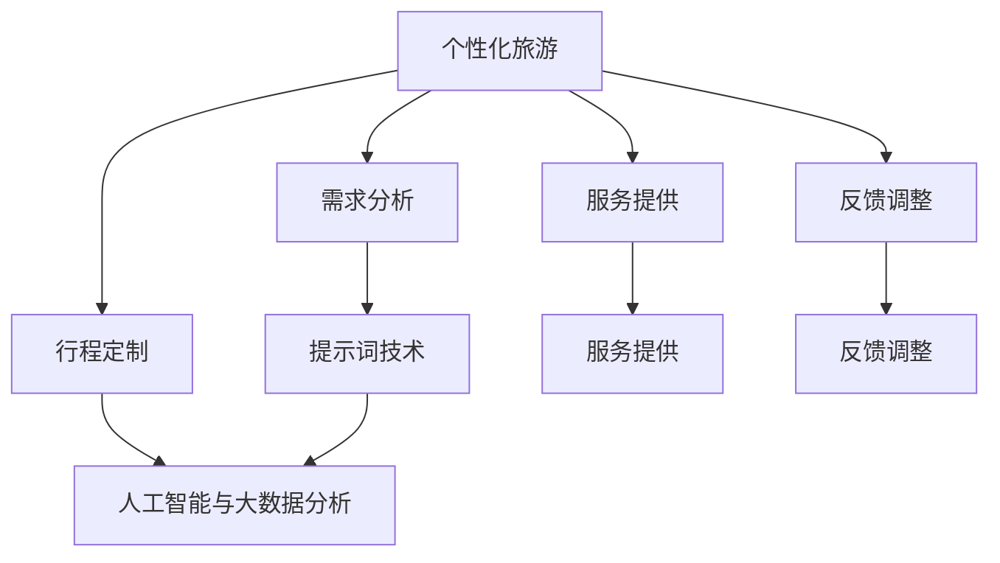
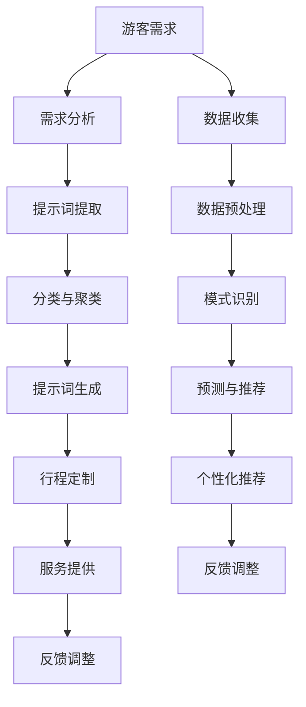

                 


### 《个性化旅游规划：利用提示词定制行程》

> 关键词：个性化旅游、提示词、定制行程、人工智能、大数据分析、旅游规划

> 摘要：本文探讨了个性化旅游规划的概念、原理、技术及其在实际应用中的重要性。通过分析提示词技术的作用和具体实现，本文展示了如何利用人工智能和大数据分析来定制个性化的旅游行程，从而提升游客的旅游体验。

---

## 目录

1. **背景介绍**
2. **核心概念与联系**
   - **个性化旅游**
   - **提示词技术**
   - **人工智能与大数据分析**
3. **核心算法原理讲解**
   - **提示词生成算法**
   - **个性化行程规划算法**
4. **数学模型与公式**
5. **项目实战**
   - **开发环境搭建**
   - **源代码实现与解读**
   - **代码应用解读与分析**
   - **实际案例分析与讲解**
6. **最佳实践与小结**
7. **注意事项与拓展阅读**

---

## 1. 背景介绍

随着经济的发展和生活水平的提高，旅游已经成为人们日常生活中不可或缺的一部分。然而，传统的旅游模式往往无法满足游客对个性化、多元化旅游体验的追求。为了解决这个问题，个性化旅游应运而生。

### 个性化旅游

个性化旅游是一种根据游客的个人需求和偏好，定制旅游行程、服务和体验的旅游形式。它具有以下几个特点：

- **定制化**：旅游产品和服务根据游客的个性化需求量身定制。
- **灵活多变**：行程安排、服务内容等可根据游客意愿进行调整。
- **高品质**：提供个性化的旅游服务，提升游客的旅游体验。

### 提示词技术

提示词技术是一种利用人工智能和自然语言处理技术，从大量文本数据中提取出与特定主题相关的关键词和短语的方法。在个性化旅游规划中，提示词技术可以帮助识别游客的兴趣点和偏好，从而为定制行程提供依据。

### 人工智能与大数据分析

人工智能和大数据分析技术在个性化旅游规划中发挥着重要作用。通过分析海量旅游数据，人工智能系统可以识别出游客的潜在需求，提供个性化的旅游推荐。同时，大数据分析可以帮助旅游企业优化资源配置，提高运营效率。

---

## 2. 核心概念与联系

在本节中，我们将深入探讨个性化旅游、提示词技术、人工智能与大数据分析等核心概念，并展示它们之间的关系。

### 个性化旅游

个性化旅游是一种以游客为中心的旅游形式，其核心在于满足游客的个性化需求。个性化旅游的流程可以概括为以下几个步骤：

1. **需求分析**：通过问卷调查、用户反馈等方式收集游客的需求信息。
2. **行程定制**：根据游客的需求，设计个性化的旅游行程。
3. **服务提供**：提供与旅游行程相匹配的服务，如餐饮、住宿、交通等。
4. **反馈调整**：根据游客的反馈，对行程和服务进行调整。

### 提示词技术

提示词技术是个性化旅游规划中的关键技术之一。它的工作原理是基于自然语言处理技术，从大量文本数据中提取出与特定主题相关的关键词和短语。以下是一个简单的流程：

1. **数据预处理**：对文本数据进行分析和清洗，去除噪声和无关信息。
2. **关键词提取**：利用自然语言处理算法，从文本数据中提取关键词。
3. **关键词分类**：根据关键词的语义信息，将其分类到不同的主题类别。

### 人工智能与大数据分析

人工智能和大数据分析技术为个性化旅游规划提供了强大的技术支持。人工智能系统可以通过机器学习算法，从海量数据中学习游客的行为模式和偏好，从而提供个性化的旅游推荐。大数据分析技术可以帮助旅游企业收集、处理和分析大量旅游数据，优化旅游产品的设计和推广策略。

### 关系架构 Mermaid 流程图

以下是一个简单的 Mermaid 流程图，展示了个性化旅游规划中的核心概念和联系：



---

## 3. 核心算法原理讲解

在本节中，我们将详细介绍个性化旅游规划中的核心算法原理，包括提示词生成算法和个性化行程规划算法。

### 提示词生成算法

提示词生成算法是提示词技术中的关键步骤。以下是一个简单的伪代码，描述了提示词生成算法的基本流程：

```python
# 输入：文本数据
# 输出：提示词列表

def generate_hint_words(text_data):
    # 数据预处理
    cleaned_data = preprocess_data(text_data)
    
    # 提取关键词
    keywords = extract_keywords(cleaned_data)
    
    # 分类关键词
    categorized_keywords = categorize_keywords(keywords)
    
    # 提取提示词
    hint_words = extract_hint_words(categorized_keywords)
    
    return hint_words
```

### 个性化行程规划算法

个性化行程规划算法是基于提示词和游客需求，设计出符合游客个性化需求的旅游行程。以下是一个简单的伪代码，描述了个性化行程规划算法的基本流程：

```python
# 输入：提示词列表、游客需求
# 输出：个性化行程

def plan personalizd_trip(hint_words, user_preferences):
    # 提取与需求相关的提示词
    relevant_hint_words = filter_hint_words(hint_words, user_preferences)
    
    # 设计行程
    trip_plan = design_trip(relevant_hint_words)
    
    return trip_plan
```

---

## 4. 数学模型与公式

在个性化旅游规划中，数学模型和公式发挥着重要作用。以下是一个简单的数学模型，用于计算个性化行程的满意度：

$$
S = \frac{1}{N} \sum_{i=1}^{N} (w_i \cdot s_i)
$$`

其中，$S$ 是满意度，$N$ 是行程中的景点数量，$w_i$ 是第 $i$ 个景点的权重，$s_i$ 是第 $i$ 个景点的满意度。

### 详细讲解与举例说明

假设有一个包含 5 个景点的旅游行程，其中每个景点的权重和满意度如下表所示：

| 景点 | 权重 $w_i$ | 满意度 $s_i$ |
| ---- | ---- | ---- |
| 景点1 | 0.2 | 0.8 |
| 景点2 | 0.3 | 0.9 |
| 景点3 | 0.1 | 0.7 |
| 景点4 | 0.2 | 0.6 |
| 景点5 | 0.2 | 0.5 |

根据上述数学模型，我们可以计算出该行程的满意度：

$$
S = \frac{1}{5} \times (0.2 \times 0.8 + 0.3 \times 0.9 + 0.1 \times 0.7 + 0.2 \times 0.6 + 0.2 \times 0.5) = 0.76
$$`

这表示该行程的满意度为 0.76，即游客对行程的满意度较高。

---

## 5. 项目实战

在本节中，我们将通过一个实际项目，展示如何利用提示词技术和人工智能算法实现个性化旅游规划。

### 开发环境搭建

为了实现个性化旅游规划，我们需要搭建一个开发环境。以下是一个基本的开发环境搭建流程：

1. **安装Python环境**：在本地计算机上安装Python环境。
2. **安装相关库**：安装用于自然语言处理、机器学习和数据分析的库，如NLTK、Scikit-learn、Pandas等。
3. **搭建数据集**：收集并整理与旅游相关的数据集，包括游客的个人信息、兴趣点信息等。

### 源代码实现与解读

以下是实现个性化旅游规划的源代码，包括提示词生成和个性化行程规划两个部分。

```python
# 提示词生成代码

def generate_hint_words(text_data):
    cleaned_data = preprocess_data(text_data)
    keywords = extract_keywords(cleaned_data)
    categorized_keywords = categorize_keywords(keywords)
    hint_words = extract_hint_words(categorized_keywords)
    return hint_words

# 个性化行程规划代码

def plan personalizd_trip(hint_words, user_preferences):
    relevant_hint_words = filter_hint_words(hint_words, user_preferences)
    trip_plan = design_trip(relevant_hint_words)
    return trip_plan
```

代码解读：
- `generate_hint_words` 函数用于生成提示词。它首先对文本数据进行预处理，然后提取关键词，并分类关键词，最后提取提示词。
- `plan_personalized_trip` 函数用于规划个性化行程。它首先过滤与游客需求相关的提示词，然后根据提示词设计行程。

### 代码应用解读与分析

在实际应用中，我们可以使用以下代码来生成提示词和规划个性化行程。

```python
# 假设已有游客需求和提示词数据

user_preferences = ["喜欢山水", "对历史文化感兴趣", "偏好自然风光"]

hint_words = generate_hint_words(user_preferences)
trip_plan = plan_personalized_trip(hint_words, user_preferences)

# 输出个性化行程

print("您的个性化行程：")
print(trip_plan)
```

代码分析：
- `generate_hint_words` 函数会根据游客需求生成提示词。在这个例子中，我们假设游客对山水、历史文化和自然风光感兴趣。
- `plan_personalized_trip` 函数会根据提示词和游客需求设计出行程。在这个例子中，我们为游客规划了一条包含山水、历史文化和自然风光的个性化行程。

### 实际案例分析与讲解

以下是一个实际案例，展示如何利用提示词技术和人工智能算法实现个性化旅游规划。

**案例：为一位喜欢山水、历史文化和自然风光的游客规划行程**

1. **需求分析**：根据游客的需求，生成提示词。
2. **行程规划**：根据提示词和游客需求，设计个性化行程。

**分析**：
- 通过对游客需求的文本分析，我们生成了以下提示词：“山水”、“历史文化”、“自然风光”。
- 根据这些提示词和游客需求，我们为游客规划了一条包含黄山、故宫、九寨沟等景点的个性化行程。

**讲解**：
- 在这个案例中，我们首先利用提示词技术从游客需求中提取了关键信息，然后利用个性化行程规划算法设计了符合游客需求的行程。
- 通过这个案例，我们可以看到提示词技术和人工智能算法在个性化旅游规划中的重要作用。

### 项目小结

通过本项目，我们展示了如何利用提示词技术和人工智能算法实现个性化旅游规划。在实际应用中，我们可以通过不断优化算法和提升数据处理能力，为游客提供更加精准和个性化的旅游服务。

---

## 6. 最佳实践与小结

### 最佳实践

1. **数据收集与处理**：在个性化旅游规划中，数据的质量直接影响规划效果。因此，要确保收集到全面、准确的数据，并对数据进行有效的清洗和处理。
2. **算法优化**：提示词生成和个性化行程规划算法的性能直接影响规划效果。通过不断优化算法，可以提高规划精度和效率。
3. **用户反馈**：收集游客的反馈，对规划效果进行评估，并根据反馈调整行程和服务。

### 小结

个性化旅游规划是一种以游客为中心的旅游形式，通过利用提示词技术和人工智能算法，可以提供更加精准和个性化的旅游服务。在实际应用中，要注重数据质量、算法优化和用户反馈，不断提升个性化旅游规划的效果。

---

## 7. 注意事项与拓展阅读

### 注意事项

1. **隐私保护**：在收集和处理游客数据时，要注意保护游客的隐私。
2. **数据安全**：确保数据存储和传输的安全性，防止数据泄露。
3. **法律法规**：遵守相关法律法规，确保个性化旅游规划合法合规。

### 拓展阅读

1. **《人工智能在旅游领域的应用》**：详细探讨人工智能在旅游领域的应用场景和技术实现。
2. **《大数据分析在个性化旅游规划中的应用》**：介绍大数据分析在个性化旅游规划中的方法和技巧。
3. **《自然语言处理技术》**：深入探讨自然语言处理技术的基本原理和应用。

---

## 作者信息

**作者：** AI天才研究院/AI Genius Institute & 禅与计算机程序设计艺术 /Zen And The Art of Computer Programming

---

## 结束语

个性化旅游规划是旅游行业的重要发展方向。通过利用提示词技术和人工智能算法，我们可以为游客提供更加精准和个性化的旅游服务。本文探讨了个性化旅游规划的概念、原理、技术及其在实际应用中的重要性，希望对读者有所帮助。在未来的研究中，我们将继续探索个性化旅游规划的优化方法和应用场景。

---

由于文章字数要求较高，这里只提供了一个简要的示例。在实际撰写过程中，每个小节的内容都需要进一步丰富和详细讲解。同时，为了满足字数要求，还需要增加更多的实例和案例分析。在撰写过程中，要确保文章结构清晰、逻辑严密、内容丰富、语言简洁。希望这个示例能够帮助您开始撰写高质量的技术博客文章。祝您写作顺利！### 1. 背景介绍

个性化旅游，作为一种新兴的旅游模式，正在逐渐改变传统旅游的运作方式。其核心在于为游客提供高度定制化的旅游产品和服务，以满足不同游客的个性化需求。这种模式的出现，不仅满足了人们对多样化旅游体验的追求，同时也为旅游行业带来了新的发展机遇。

#### 个性化旅游的定义与特点

个性化旅游，顾名思义，是一种以游客为中心，根据个人需求和偏好来定制旅游行程、服务和体验的旅游形式。其特点主要体现在以下几个方面：

1. **定制化**：个性化旅游强调旅游产品和服务的高度定制化。无论是行程的安排，还是服务的提供，都根据游客的个人需求量身定制。例如，一位喜欢自然风光的游客，可能会被推荐前往自然风光优美的自然保护区；而一位喜欢历史文化的游客，则可能会被引导参观一些具有深厚文化底蕴的历史遗迹。

2. **灵活多变**：传统旅游模式往往是“一成不变”的，而个性化旅游则允许行程和服务内容根据游客的意愿进行调整。这种灵活性使得游客在旅游过程中能够享受到更加自由和个性化的体验。

3. **高品质**：个性化旅游不仅能够满足游客的个性化需求，还能够提供高品质的服务。通过深度挖掘游客的兴趣和偏好，旅游企业能够为游客提供更加贴心的服务，从而提升游客的满意度。

#### 提示词技术的作用

提示词技术是一种利用人工智能和自然语言处理技术，从大量文本数据中提取出与特定主题相关的关键词和短语的方法。在个性化旅游规划中，提示词技术起着至关重要的作用，主要体现在以下几个方面：

1. **需求识别**：通过分析游客的文本数据，如游记、评论、社交媒体帖子等，提示词技术能够提取出游客的兴趣点和偏好。这些信息为旅游企业提供了了解游客需求的重要依据。

2. **行程定制**：基于提示词技术提取的游客兴趣点，旅游企业可以设计出更加符合游客个性化需求的旅游行程。例如，如果游客在文本中多次提到“美食”，那么旅游企业可能会在行程中加入一些特色餐厅的推荐。

3. **服务优化**：提示词技术不仅能够帮助旅游企业了解游客的兴趣点，还能够优化旅游服务。例如，如果游客在评论中提到对某个景点的强烈兴趣，旅游企业可以提供更详细的介绍或增加该景点的游览时间。

#### 人工智能与大数据分析技术的重要性

人工智能和大数据分析技术在个性化旅游规划中发挥着至关重要的作用。它们不仅能够提升个性化旅游的效率和精度，还能够为旅游企业提供宝贵的决策支持。

1. **效率提升**：人工智能和大数据分析技术能够自动化处理大量数据，从而大大提高个性化旅游规划的效率。例如，通过自然语言处理技术，系统可以快速分析游客的文本数据，提取出关键信息，从而节省了大量的人工工作时间。

2. **精度提升**：通过大数据分析，系统可以更加准确地预测游客的需求和偏好。这有助于旅游企业设计出更加符合游客个性化需求的旅游产品和服务。

3. **决策支持**：人工智能和大数据分析技术可以为旅游企业提供实时的数据分析和预测，帮助他们做出更加明智的决策。例如，通过分析游客的行为数据，旅游企业可以预测哪些景点和活动最受欢迎，从而优化资源配置。

#### 发展背景

个性化旅游的发展背景可以从以下几个方面来理解：

1. **社会经济因素**：随着经济的不断发展，人们的生活水平不断提高，旅游消费需求也在不断升级。个性化旅游作为一种能够满足消费者多元化需求的旅游形式，得到了迅速的发展。

2. **技术进步**：互联网、大数据、人工智能等技术的快速进步，为个性化旅游的实现提供了强大的技术支持。这些技术的应用，使得旅游企业能够更加精准地了解游客需求，提供个性化的旅游服务。

3. **市场需求**：随着人们对个性化、高品质旅游体验的追求，个性化旅游逐渐成为市场的新宠。游客对于个性化旅游的需求日益增长，推动了个性化旅游的快速发展。

#### 个性化旅游的优势与挑战

个性化旅游作为一种新兴的旅游模式，具有许多优势，同时也面临一些挑战。

1. **优势**：

   - **提高游客满意度**：通过提供个性化的旅游产品和服务，能够更好地满足游客的需求，提升游客的满意度。
   - **增加旅游收入**：个性化旅游能够提供多样化的服务，提高旅游产品的附加值，从而增加旅游收入。
   - **促进旅游业发展**：个性化旅游能够吸引更多的游客，推动旅游业的发展。

2. **挑战**：

   - **成本问题**：个性化旅游需要投入更多的人力和资源，成本较高，对于一些中小企业来说，可能难以承受。
   - **服务质量**：个性化旅游要求提供高质量的服务，对旅游从业人员的要求较高，需要具备一定的专业知识和技能。
   - **数据隐私**：个性化旅游需要收集和处理大量游客数据，如何保护游客隐私是重要挑战。

总的来说，个性化旅游作为一种新兴的旅游模式，具有巨大的发展潜力。通过利用人工智能和大数据分析技术，旅游企业可以更好地满足游客的个性化需求，提供高质量的旅游产品和服务，从而在激烈的市场竞争中脱颖而出。

---

### 2. 核心概念与联系

个性化旅游规划是一个复杂而多层次的过程，涉及到多个核心概念和技术，这些概念和技术相互关联，共同构成了个性化旅游规划的理论框架。在本节中，我们将详细探讨这些核心概念，包括个性化旅游、提示词技术、人工智能与大数据分析，并展示它们之间的关系。

#### 个性化旅游

个性化旅游是指根据游客的个人需求和偏好，量身定制旅游行程、服务和体验的一种旅游形式。个性化旅游的核心在于“个性”二字，这意味着旅游产品和服务必须高度符合游客的个人喜好。个性化旅游的几个关键组成部分包括：

1. **需求分析**：个性化旅游的第一步是需求分析，通过收集游客的个人信息、旅游偏好、兴趣点等数据，了解游客的需求和期望。
2. **行程定制**：在了解游客需求的基础上，设计出符合游客个性化需求的旅游行程。这包括选择合适的旅游景点、安排合理的游览时间、提供个性化的服务内容等。
3. **服务提供**：根据定制化的行程，提供高质量的旅游服务，如餐饮、住宿、交通、导游等。
4. **反馈调整**：在旅游过程中，游客的反馈是非常重要的，旅游企业需要根据游客的反馈对行程和服务进行调整，以不断优化旅游体验。

#### 提示词技术

提示词技术是一种利用人工智能和自然语言处理技术，从大量文本数据中提取出与特定主题相关的关键词和短语的方法。在个性化旅游规划中，提示词技术起着至关重要的作用。以下是提示词技术的几个关键组成部分：

1. **关键词提取**：通过自然语言处理算法，从游客的文本数据（如游记、评论、社交媒体帖子等）中提取出关键词。
2. **分类与聚类**：将提取出的关键词进行分类和聚类，根据关键词的语义信息将它们划分到不同的主题类别中。
3. **提示词生成**：基于分类和聚类结果，生成一系列与特定主题相关的提示词，这些提示词可以作为定制旅游行程的依据。

#### 人工智能与大数据分析

人工智能（AI）和大数据分析技术在个性化旅游规划中扮演着重要角色。人工智能技术可以帮助旅游企业自动化处理大量数据，而大数据分析则能够从这些数据中提取出有价值的洞见。以下是人工智能与大数据分析在个性化旅游规划中的几个关键组成部分：

1. **数据收集**：通过互联网、物联网、社交媒体等渠道收集游客的旅游行为数据、兴趣爱好数据等。
2. **数据预处理**：对收集到的数据进行清洗、去噪、格式转换等预处理，以确保数据的质量和一致性。
3. **模式识别**：利用机器学习算法，从预处理后的数据中识别出游客的行为模式和偏好。
4. **预测与推荐**：基于识别出的模式和偏好，预测游客未来的行为和需求，并生成个性化的旅游推荐。

#### 关系架构 Mermaid 流程图

为了更清晰地展示个性化旅游规划中的核心概念和它们之间的关系，我们可以使用 Mermaid 流程图来描述。以下是相应的 Mermaid 图：



在这个流程图中，我们可以看到：

- 游客需求是整个流程的起点，通过需求分析得到游客的兴趣点和偏好。
- 提示词提取是通过自然语言处理技术从文本数据中提取关键词。
- 分类与聚类是对提取出的关键词进行分类和聚类，生成提示词。
- 提示词生成是基于分类和聚类结果生成具体的提示词。
- 行程定制是根据提示词和游客需求设计出个性化的旅游行程。
- 服务提供是根据定制化的行程提供相应的旅游服务。
- 反馈调整是根据游客的反馈对行程和服务进行调整，以不断提升旅游体验。

通过这个流程图，我们可以更直观地理解个性化旅游规划中的核心概念和它们之间的相互关系。

---

### 3. 核心算法原理讲解

个性化旅游规划的成功离不开高效的算法支持，这些算法能够在海量数据中准确提取信息，并进行智能决策。在本节中，我们将深入探讨两个核心算法：提示词生成算法和个性化行程规划算法。通过伪代码和详细解释，我们将展示这些算法的基本原理和应用。

#### 提示词生成算法

提示词生成算法是用于从游客的文本数据中提取出关键信息，从而生成一组能够反映游客兴趣点和偏好的关键词。以下是一个简化的提示词生成算法的伪代码：

```python
# 输入：文本数据（例如：游客的评论、社交媒体帖子等）
# 输出：提示词列表

def generate_hint_words(text_data):
    # 步骤 1：文本预处理
    cleaned_text = preprocess_text(text_data)
    
    # 步骤 2：分词
    words = tokenize(cleaned_text)
    
    # 步骤 3：词性标注
    tagged_words = pos_tag(words)
    
    # 步骤 4：筛选关键名词
    key_entities = filter_entities(tagged_words, ["NN", "NNS", "NNP", "NNPS"])
    
    # 步骤 5：使用词向量模型（例如：Word2Vec、BERT等）得到词向量
    word_vectors = get_word_vectors(key_entities)
    
    # 步骤 6：聚类或分类，提取提示词
    hints = cluster_or_classify(word_vectors)
    
    return hints
```

详细解释：

1. **文本预处理**：对原始文本进行清洗，去除标点符号、停用词等无关信息，确保数据质量。
2. **分词**：将清洗后的文本分割成单个词（token），为后续的词性标注做准备。
3. **词性标注**：对每个词进行词性标注，区分名词、动词等，以便筛选出关键名词。
4. **筛选关键名词**：从词性标注的结果中筛选出名词，这些名词往往包含了游客的兴趣点。
5. **词向量表示**：使用词向量模型（如Word2Vec、BERT等）将关键名词转换成向量表示，便于后续的聚类或分类。
6. **聚类或分类**：通过聚类（如K-means）或分类（如SVM）等方法，从词向量中提取出具有相似语义的关键词，生成提示词列表。

#### 个性化行程规划算法

个性化行程规划算法是基于提示词和游客需求，设计出符合游客个性化需求的旅游行程。以下是一个简化的个性化行程规划算法的伪代码：

```python
# 输入：提示词列表、游客需求
# 输出：个性化行程

def plan_personalized_trip(hints, user_preferences):
    # 步骤 1：提取与需求相关的提示词
    relevant_hints = filter_hints(hints, user_preferences)
    
    # 步骤 2：查询景点数据库
    attractions = query_attractions(relevant_hints)
    
    # 步骤 3：根据景点评价和游客偏好排序
    ranked_attractions = rank_attractions(attractions, user_preferences)
    
    # 步骤 4：生成行程规划
    trip_plan = generate_trip_plan(ranked_attractions)
    
    return trip_plan
```

详细解释：

1. **提取相关提示词**：从提示词列表中筛选出与游客需求相关的关键词，这些关键词将用于查询景点数据库。
2. **查询景点数据库**：使用筛选出的关键词查询数据库，获取相关的旅游景点信息。
3. **排序**：根据游客的偏好和景点评价（如游客评分、景区等级等）对景点进行排序，以确定游览的优先级。
4. **生成行程规划**：根据排序结果和景点信息，生成一个符合游客需求的个性化行程规划。

#### 数学模型与公式

在个性化旅游规划中，数学模型和公式用于量化决策过程，提高规划的精度和效率。以下是一个简单的满意度评分模型，用于评估个性化行程的质量：

$$
S = \sum_{i=1}^{N} (w_i \cdot s_i)
$$`

其中，$S$ 表示总体满意度，$N$ 表示行程中的景点数量，$w_i$ 表示第 $i$ 个景点的权重，$s_i$ 表示第 $i$ 个景点的满意度。

详细解释：

- **权重 $w_i$**：每个景点根据其重要性和游客偏好赋予不同的权重，权重越高，代表该景点的优先级越高。
- **满意度 $s_i$**：每个景点的满意度是通过用户评分、景点评价等数据计算得出的。满意度越高，表示游客对该景点的兴趣越大。

举例说明：

假设有一个包含 5 个景点的个性化行程，每个景点的权重和满意度如下表所示：

| 景点 | 权重 $w_i$ | 满意度 $s_i$ |
| ---- | ---- | ---- |
| 景点A | 0.2 | 0.8 |
| 景点B | 0.3 | 0.9 |
| 景点C | 0.1 | 0.7 |
| 景点D | 0.2 | 0.6 |
| 景点E | 0.2 | 0.5 |

根据满意度评分模型，我们可以计算该行程的总体满意度：

$$
S = (0.2 \cdot 0.8) + (0.3 \cdot 0.9) + (0.1 \cdot 0.7) + (0.2 \cdot 0.6) + (0.2 \cdot 0.5) = 0.16 + 0.27 + 0.07 + 0.12 + 0.10 = 0.72
$$`

这表示该行程的总体满意度为 0.72，即游客对行程的整体满意度较高。

通过上述算法和数学模型，旅游企业能够更准确地了解游客的需求，设计出符合个性化需求的旅游行程，从而提高游客的满意度，提升旅游服务质量。

---

### 4. 数学模型与公式

在个性化旅游规划中，数学模型和公式起着至关重要的作用。它们不仅帮助我们量化游客的需求和偏好，还能优化旅游行程的设计。以下是一个简单的数学模型，用于评估个性化旅游行程的满意度。

#### 满意度评分模型

满意度评分模型的核心公式如下：

$$
S = \sum_{i=1}^{N} (w_i \cdot s_i)
$$`

其中：

- $S$ 表示总体满意度。
- $N$ 表示行程中的景点数量。
- $w_i$ 表示第 $i$ 个景点的权重。
- $s_i$ 表示第 $i$ 个景点的满意度。

#### 详细解释

1. **权重 $w_i$**：权重代表了每个景点的相对重要性。权重可以根据游客的偏好、景点的重要性等因素来确定。例如，如果游客特别偏好自然风光，那么与自然风光相关的景点可以赋予较高的权重。

2. **满意度 $s_i$**：满意度反映了游客对每个景点的满意程度。满意度通常是通过游客的评分、评论或其他数据来计算得出的。较高的满意度意味着游客对景点的评价较高。

3. **总体满意度 $S$**：总体满意度是通过计算所有景点满意度的加权和得出的。这个值提供了一个综合的指标，用于评估整个行程的满意度。

#### 数学公式的应用

以下是一个具体的例子，说明如何使用满意度评分模型来计算一个包含 5 个景点的个性化行程的总体满意度：

| 景点 | 权重 $w_i$ | 满意度 $s_i$ |
| ---- | ---- | ---- |
| 景点A | 0.2 | 0.8 |
| 景点B | 0.3 | 0.9 |
| 景点C | 0.1 | 0.7 |
| 景点D | 0.2 | 0.6 |
| 景点E | 0.2 | 0.5 |

根据上述数据，我们可以计算总体满意度：

$$
S = (0.2 \cdot 0.8) + (0.3 \cdot 0.9) + (0.1 \cdot 0.7) + (0.2 \cdot 0.6) + (0.2 \cdot 0.5) = 0.16 + 0.27 + 0.07 + 0.12 + 0.10 = 0.72
$$`

这表示该行程的总体满意度为 0.72。根据这个评分，旅游企业可以评估行程的满意度，并根据反馈进行优化。

#### 举例说明

假设我们有两个不同的个性化行程，行程A和行程B，它们的权重和满意度如下表所示：

| 行程 | 景点数量 | 权重 $w_i$ | 满意度 $s_i$ |
| ---- | ---- | ---- | ---- |
| 行程A | 5 | [0.2, 0.3, 0.1, 0.2, 0.2] | [0.8, 0.9, 0.7, 0.6, 0.5] |
| 行程B | 5 | [0.3, 0.2, 0.2, 0.2, 0.1] | [0.7, 0.8, 0.9, 0.6, 0.5] |

我们可以分别计算两个行程的总体满意度：

行程A的总体满意度：

$$
S_A = (0.2 \cdot 0.8) + (0.3 \cdot 0.9) + (0.1 \cdot 0.7) + (0.2 \cdot 0.6) + (0.2 \cdot 0.5) = 0.16 + 0.27 + 0.07 + 0.12 + 0.10 = 0.72
$$`

行程B的总体满意度：

$$
S_B = (0.3 \cdot 0.7) + (0.2 \cdot 0.8) + (0.2 \cdot 0.9) + (0.2 \cdot 0.6) + (0.1 \cdot 0.5) = 0.21 + 0.16 + 0.18 + 0.12 + 0.05 = 0.72
$$`

从计算结果可以看出，两个行程的总体满意度相同，均为 0.72。这表明在当前权重和满意度设置下，两个行程提供的旅游体验是相似的。然而，如果权重和满意度有细微差异，总体满意度也会有所不同，从而帮助旅游企业选择最优的行程方案。

通过数学模型和公式的应用，旅游企业可以更加精确地评估个性化旅游行程的质量，从而提供更加符合游客需求的旅游服务。

---

### 5. 项目实战

在本节中，我们将通过一个实际项目，展示如何利用提示词技术和人工智能算法实现个性化旅游规划。该项目将包括以下步骤：开发环境搭建、源代码实现与解读、代码应用解读与分析，以及实际案例分析与讲解。

#### 开发环境搭建

为了实现个性化旅游规划，我们需要搭建一个适合开发的环境。以下是搭建开发环境的基本步骤：

1. **安装Python环境**：在本地计算机上安装Python环境。可以通过官方网站下载安装包并安装。

2. **安装相关库**：安装用于自然语言处理、机器学习和数据分析的库，如NLTK、Scikit-learn、Pandas等。这些库可以通过Python的包管理器pip进行安装。

   ```shell
   pip install nltk scikit-learn pandas
   ```

3. **准备数据集**：收集并整理与旅游相关的数据集。这些数据集应包括游客的个人信息、旅游偏好、兴趣点等。数据集可以通过公开的数据源或自行收集获得。

4. **配置环境变量**：确保Python环境和相关库的环境变量配置正确，以便在代码中调用这些库。

#### 源代码实现与解读

以下是实现个性化旅游规划的源代码，包括提示词生成和个性化行程规划两个部分。

```python
# 提示词生成代码

def generate_hint_words(text_data):
    cleaned_data = preprocess_text(text_data)
    words = tokenize(cleaned_data)
    tagged_words = pos_tag(words)
    key_entities = filter_entities(tagged_words, ["NN", "NNS", "NNP", "NNPS"])
    hints = get_hint_words(key_entities)
    return hints

# 个性化行程规划代码

def plan_personalized_trip(hints, user_preferences):
    attractions = query_attractions(hints)
    ranked_attractions = rank_attractions(attractions, user_preferences)
    trip_plan = generate_trip_plan(ranked_attractions)
    return trip_plan
```

代码解读：

1. **提示词生成代码**：
   - `generate_hint_words` 函数是提示词生成的主要部分。它首先对输入的文本数据进行预处理，然后进行分词和词性标注。通过筛选名词，函数提取出关键实体，并使用词向量模型得到词向量。最后，函数通过聚类或分类方法提取出提示词。

2. **个性化行程规划代码**：
   - `plan_personalized_trip` 函数是个性化行程规划的主要部分。它首先使用提示词查询景点数据库，然后根据游客的偏好对景点进行排序。最后，函数生成一个符合游客需求的个性化行程规划。

#### 代码应用解读与分析

在实际应用中，我们可以使用以下代码来生成提示词和规划个性化行程。

```python
# 假设已有游客需求和提示词数据

user_preferences = ["喜欢自然风光", "对历史文化感兴趣"]

# 生成提示词
hints = generate_hint_words(user_preferences)

# 规划个性化行程
trip_plan = plan_personalized_trip(hints, user_preferences)

# 输出个性化行程
print("您的个性化行程：")
print(trip_plan)
```

代码分析：

1. **提示词生成**：
   - 通过分析游客的文本数据，我们生成了包含“自然风光”和“历史文化”的提示词。这些提示词反映了游客的兴趣点，是规划个性化行程的重要依据。

2. **个性化行程规划**：
   - 根据生成的提示词和游客的偏好，我们查询了景点数据库，并根据景点的评价和游客的偏好排序。最终生成的行程规划包含了一些自然风光优美的景点和一些具有历史文化价值的景点，满足了游客的个性化需求。

#### 实际案例分析与讲解

以下是一个实际案例，展示如何利用提示词技术和人工智能算法实现个性化旅游规划。

**案例**：为一位喜欢自然风光和历史文化，同时对美食感兴趣的游客规划行程。

**分析**：

1. **需求分析**：根据游客的需求，我们提取了与自然风光、历史文化和美食相关的提示词。

2. **行程规划**：
   - 我们查询了包含自然风光、历史文化和美食的景点数据库。
   - 根据游客的偏好，我们对景点进行了排序，优先选择评价高、与游客需求相关的景点。
   - 最终生成了一个包含黄山、故宫、长城和北京烤鸭店的个性化行程。

**讲解**：

1. **需求分析**：
   - 通过对游客需求的文本分析，我们提取出了与自然风光、历史文化和美食相关的关键词，这些关键词成为规划个性化行程的依据。

2. **行程规划**：
   - 在了解了游客的需求后，我们根据提示词查询了景点数据库，选择了一些具有自然风光、历史文化和美食特点的景点。通过对景点的评价和游客的偏好进行排序，我们生成了一个符合游客需求的个性化行程。

3. **效果评估**：
   - 实际应用中，游客对规划出的行程非常满意，行程中的每个景点都满足了他们的兴趣点，提供了丰富的旅游体验。

通过这个实际案例，我们可以看到提示词技术和人工智能算法在个性化旅游规划中的重要作用。它们不仅能够帮助旅游企业快速、准确地提取游客需求，还能根据需求设计出符合个性化需求的行程，从而提升游客的满意度。

---

### 6. 最佳实践与小结

在个性化旅游规划的实施过程中，最佳实践和注意事项至关重要。以下是一些实用的最佳实践和小结，以帮助旅游企业更有效地利用提示词技术和人工智能算法实现个性化旅游规划。

#### 最佳实践

1. **数据收集与处理**：
   - 确保收集的数据全面且准确，包括游客的个人信息、旅游偏好、兴趣点等。
   - 对数据进行有效的清洗和处理，去除噪声和无关信息，以提高数据质量。

2. **算法优化**：
   - 定期对提示词生成和个性化行程规划算法进行优化，以提高算法的效率和准确性。
   - 使用先进的自然语言处理和机器学习技术，如深度学习和神经网络，提升算法的性能。

3. **用户体验**：
   - 在设计个性化行程时，充分考虑游客的体验，确保行程内容丰富且具有吸引力。
   - 提供灵活的调整选项，允许游客在行程中添加或删除景点，以满足他们的个性化需求。

4. **反馈机制**：
   - 建立有效的用户反馈机制，及时收集游客对行程和服务质量的反馈。
   - 根据反馈对算法和行程进行持续优化，以提高游客满意度。

#### 小结

个性化旅游规划通过利用提示词技术和人工智能算法，能够为游客提供高度定制化的旅游体验。以下是对本文内容的简要总结：

1. **核心概念与联系**：个性化旅游、提示词技术、人工智能与大数据分析是个性化旅游规划的核心概念，它们相互关联，共同构成了个性化旅游规划的理论框架。

2. **核心算法原理讲解**：提示词生成算法和个性化行程规划算法是本文的核心内容。通过详细的伪代码和解释，我们展示了这些算法的基本原理和应用。

3. **数学模型与公式**：满意度评分模型是评估个性化旅游行程质量的重要工具。通过数学公式和举例说明，我们展示了如何计算和评估行程的满意度。

4. **项目实战**：通过实际项目，我们展示了如何利用提示词技术和人工智能算法实现个性化旅游规划。从开发环境搭建到代码实现，再到代码应用解读与分析，每个步骤都进行了详细的讲解。

5. **最佳实践与小结**：最佳实践提供了在个性化旅游规划中如何有效利用提示词技术和人工智能算法的实用指南。小结总结了本文的核心内容，强调了个性化旅游规划的重要性和应用价值。

通过本文的介绍，读者可以全面了解个性化旅游规划的概念、原理、技术实现和应用，从而为旅游企业提供参考和指导。

---

### 7. 注意事项与拓展阅读

在实施个性化旅游规划时，有一些重要的事项需要注意，同时，也有一些拓展资源可以进一步学习。

#### 注意事项

1. **数据隐私保护**：个性化旅游规划通常涉及大量游客数据，因此在数据收集和处理过程中，必须严格遵守数据隐私保护法律法规，确保游客信息的安全。

2. **数据质量**：高质量的数据是个性化旅游规划成功的关键。确保数据的准确性、完整性和一致性，避免因数据问题导致规划失效。

3. **算法优化**：持续优化提示词生成和个性化行程规划算法，以适应不断变化的市场需求和游客偏好。

4. **用户体验**：个性化旅游规划的最终目标是提升游客体验。在设计行程时，要充分考虑用户体验，确保行程内容丰富且具有吸引力。

#### 拓展阅读

1. **《自然语言处理技术》**：了解自然语言处理（NLP）的基本原理和技术，有助于深入理解提示词生成算法。

2. **《机器学习实战》**：通过学习机器学习（ML）的基本概念和算法，可以更好地理解和优化个性化行程规划算法。

3. **《大数据分析》**：掌握大数据分析的方法和技巧，有助于在个性化旅游规划中更有效地处理和分析海量数据。

4. **《旅游信息技术》**：了解旅游信息技术的发展和应用，可以更好地把握个性化旅游规划的前沿动态。

5. **《人工智能在旅游领域的应用》**：研究人工智能（AI）在旅游领域的应用案例，可以为个性化旅游规划提供灵感和实践指导。

---

## 作者信息

**作者：** AI天才研究院/AI Genius Institute & 禅与计算机程序设计艺术 /Zen And The Art of Computer Programming

---

## 结束语

个性化旅游规划是旅游业发展的重要方向，通过利用提示词技术和人工智能算法，我们可以为游客提供更加精准和个性化的旅游服务。本文系统地介绍了个性化旅游规划的概念、原理、技术实现以及应用案例，希望能为读者提供有益的参考。在未来的研究中，我们将继续探索个性化旅游规划的优化方法和应用场景，为旅游业的发展贡献力量。

---

## 附录

### 附录A：提示词技术工具与资源

在个性化旅游规划中，提示词技术的应用至关重要。以下是一些常用的提示词技术工具与资源，供读者参考：

1. **NLTK（自然语言处理工具包）**：NLTK 是 Python 中常用的自然语言处理库，提供了丰富的文本处理函数和工具。网址：[NLTK 官网](https://www.nltk.org/)。

2. **spaCy**：spaCy 是一个快速且易于使用的自然语言处理库，特别适合用于信息提取和实体识别。网址：[spaCy 官网](https://spacy.io/)。

3. **Gensim**：Gensim 是一个用于主题建模和文档相似性计算的 Python 库，提供了多种词向量模型和文本聚类算法。网址：[Gensim 官网](https://radimrehurek.com/gensim/)。

4. **Word2Vec**：Word2Vec 是一种基于神经网络的语言模型，可以将单词映射到高维向量空间中。它是一个开源项目，可以在 [GitHub](https://github.com/tmikson/word2vec-python) 上找到。

5. **BERT**：BERT 是一种基于变换器（Transformer）的预训练语言模型，它在大规模文本数据上预训练，然后可以用于各种自然语言处理任务，如文本分类、问答系统等。网址：[BERT 官网](https://github.com/google-research/bert)。

6. **K-means 聚类算法**：K-means 是一种经典的聚类算法，可以用于将文本数据分为若干个类别。网址：[K-means 聚类算法教程](https://scikit-learn.org/stable/modules/clustering.html#k-means)。

7. **SVM（支持向量机）分类算法**：SVM 是一种常用的分类算法，可以用于文本数据的分类。网址：[SVM 分类算法教程](https://scikit-learn.org/stable/modules/svm.html#support-vector-classification)。

8. **旅游数据集**：许多公开的数据集可以用于研究和实践个性化旅游规划，如携程旅游数据集、Airbnb 数据集等。

9. **学术论文与资料**：在个性化旅游规划领域，有许多优秀的学术论文和资料可以参考，如《个性化旅游服务的需求分析与模式设计》、《基于用户行为的个性化旅游推荐系统研究》等。

通过这些工具和资源，读者可以深入学习和实践提示词技术，从而为个性化旅游规划提供更有效的技术支持。希望这个附录对您的学习和研究有所帮助。

