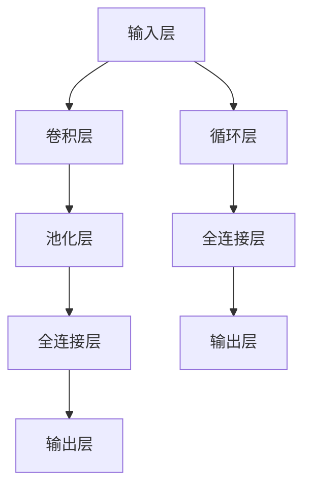

                 

### 引言

在当今信息技术迅猛发展的时代，人工智能（AI）已经成为推动社会进步的重要力量。AI大模型，作为AI领域的核心技术之一，正引领着新一轮的技术革命。然而，随着AI大模型的规模和复杂性不断增加，现有的编程语言和工具已经难以满足其开发需求。为此，专为AI大模型量身定制的编程语言应运而生，成为当前研究和应用的热点。

本文将围绕“为AI大模型量身定制的编程语言”这一主题，深入探讨其核心概念、设计原则、关键技术和应用场景。首先，我们将介绍AI大模型的发展历程和核心概念，帮助读者建立对AI大模型的基本认识。接着，本文将详细解析专为AI大模型定制的编程语言，探讨其基本原理、特性以及与现有编程语言的差异。随后，我们将通过具体的案例，展示如何使用这些编程语言开发AI大模型，并分析其实际应用效果。最后，本文还将探讨未来AI大模型编程语言的发展趋势，以及可能面临的挑战和解决方案。

通过本文的逐步分析，读者将能够全面了解为AI大模型量身定制的编程语言，掌握其核心原理和应用技巧，为未来的AI开发工作提供有力支持。## 文章关键词

- AI大模型
- 编程语言
- 量身定制
- 深度学习
- 优化算法
- 硬件加速
- 应用场景
- 发展趋势## 摘要

本文旨在探讨专为AI大模型量身定制的编程语言，解析其核心概念、设计原则、关键技术和应用场景。首先，通过回顾AI大模型的发展历程和核心概念，帮助读者建立基本认识。然后，详细阐述AI大模型编程语言的基本原理和特性，以及与现有编程语言的差异。通过具体案例展示，读者将了解如何使用这些编程语言开发AI大模型，并分析其实际应用效果。最后，本文还将探讨AI大模型编程语言的未来发展趋势，以及面临的挑战和解决方案。通过本文的逐步分析，读者将全面掌握AI大模型编程语言的核心理念和应用技巧，为未来的AI开发工作提供有力支持。### 1.1 AI大模型的发展历程

AI大模型，即大规模的人工智能模型，是指那些具有亿级乃至千亿级参数的复杂模型。这些模型通常需要处理大量的数据，并通过深度学习等先进技术进行训练，以实现从图像识别、自然语言处理到语音识别等多种AI任务。AI大模型的发展历程可以追溯到20世纪90年代，随着计算能力和数据资源的不断提升，AI大模型逐渐从实验室走向实际应用。

**早期探索（20世纪90年代 - 2000年代初期）**

AI大模型的早期探索主要集中在人工神经网络和统计模型领域。这一时期的代表性工作包括1986年提出的Backpropagation算法，它使得多层神经网络的训练成为可能。1990年代，随着计算机性能的提升，研究人员开始尝试构建更大规模的神经网络模型，如Hinton等人在1995年提出的玻尔兹曼机（Boltzmann Machine），以及随后提出的深度置信网络（Deep Belief Network）。

**快速发展（2006年 - 2012年）**

2006年，Hinton提出了深度学习（Deep Learning）的概念，并引入了深度卷积神经网络（Convolutional Neural Network, CNN）用于图像识别。这一时期，深度学习技术的突破使得AI大模型的研究和应用进入了一个新的阶段。2009年，Hinton和Dbirnikar等人共同开发了深度学习框架Caffe，这为AI大模型的开发提供了重要的工具支持。

**规模化应用（2012年 - 至今）**

2012年，AlexNet在ImageNet图像识别大赛中取得了突破性的成绩，这标志着深度学习技术进入了一个规模化应用的新时代。随着GPU和TPU等硬件的发展，AI大模型的训练和推理速度得到了大幅提升。同时，大数据和云计算的普及为AI大模型提供了丰富的数据资源和计算能力。

**近期趋势（2020年至今）**

近年来，AI大模型的发展呈现出几个新的趋势。首先，模型规模的持续增大，如GPT-3、BERT等模型拥有数十亿甚至千亿级别的参数。其次，多模态学习成为研究热点，即结合文本、图像、音频等多种数据类型进行训练，以提高模型的泛化能力。此外，AI大模型的训练和优化算法也在不断改进，如自动差异化、混合精度训练等技术，使得模型在保持精度的情况下提高了训练效率。

综上所述，AI大模型的发展历程经历了从早期探索到快速发展，再到规模化应用的演变。随着技术的不断进步，AI大模型在各个领域的应用越来越广泛，未来有望在更多领域取得突破。### 1.2 AI大模型的核心概念

AI大模型的核心概念是理解和掌握其关键组成部分的基础。以下是对这些核心概念的详细介绍，以及它们之间的相互关系。

**深度学习（Deep Learning）**

深度学习是构建AI大模型的核心技术，它借鉴了人脑神经网络的结构和功能。深度学习通过多层神经网络进行特征提取和模式识别，每一层都能够对输入数据进行变换和抽象，从而实现复杂的任务。深度学习的主要组成部分包括：

- **卷积层（Convolutional Layer）**：用于提取图像或时空数据中的局部特征。
- **全连接层（Fully Connected Layer）**：将卷积层的输出映射到不同的类别或输出。
- **池化层（Pooling Layer）**：用于降低数据维度，减少计算复杂度。

**神经网络（Neural Network）**

神经网络是深度学习的基础，它由大量相互连接的神经元组成，每个神经元都通过权重连接到其他神经元。神经网络的工作原理是通过前向传播将输入数据传递到网络的每一层，通过反向传播不断调整权重，以优化模型的性能。

**训练算法（Training Algorithm）**

训练算法是AI大模型的核心，用于优化网络中的权重和偏置。常用的训练算法包括：

- **反向传播算法（Backpropagation）**：通过反向传播误差，计算权重的梯度，并更新权重。
- **随机梯度下降（Stochastic Gradient Descent, SGD）**：在批量大小为1的情况下更新权重。
- **Adam优化器（Adam Optimizer）**：结合SGD和Momentum的方法，提高了收敛速度。

**数据集（Dataset）**

数据集是AI大模型训练的基础，它包含了大量的样本和标签。一个高质量的数据集能够帮助模型更好地学习特征和模式。数据集通常分为训练集、验证集和测试集，用于模型训练、验证和评估。

**模型架构（Model Architecture）**

模型架构是AI大模型的骨架，决定了模型的能力和性能。常见的模型架构包括：

- **卷积神经网络（Convolutional Neural Network, CNN）**：用于图像和视频处理。
- **循环神经网络（Recurrent Neural Network, RNN）**：用于序列数据，如文本和语音。
- **Transformer模型（Transformer Model）**：一种基于自注意力机制的模型，广泛应用于自然语言处理。

**训练过程（Training Process）**

训练过程是AI大模型构建的关键步骤，它包括以下环节：

- **数据预处理**：对原始数据进行清洗、归一化和特征提取。
- **模型初始化**：初始化模型参数，通常采用随机初始化。
- **前向传播**：将输入数据传递到模型中，计算输出和损失。
- **反向传播**：计算梯度，并更新模型参数。
- **评估与优化**：通过验证集和测试集评估模型性能，并调整模型参数。

**模型优化（Model Optimization）**

模型优化是提高模型性能的重要手段，包括以下方法：

- **数据增强（Data Augmentation）**：通过变换输入数据，增加训练样本的多样性。
- **超参数调整（Hyperparameter Tuning）**：调整模型参数，如学习率、批量大小等。
- **正则化（Regularization）**：通过添加正则化项，防止模型过拟合。
- **剪枝（Pruning）**：通过移除模型中不重要的参数，减少模型规模。

**模型部署（Model Deployment）**

模型部署是将训练好的模型部署到实际应用环境中，包括以下环节：

- **模型压缩（Model Compression）**：通过量化、剪枝等技术，减小模型规模和计算量。
- **硬件加速（Hardware Acceleration）**：利用GPU、TPU等硬件加速模型训练和推理。
- **服务化部署（Service Deployment）**：通过API或SDK将模型集成到应用中，提供实时服务。

综上所述，AI大模型的核心概念包括深度学习、神经网络、训练算法、数据集、模型架构、训练过程、模型优化和模型部署等。这些概念相互关联，共同构成了AI大模型的理论体系。通过理解这些核心概念，读者可以更好地掌握AI大模型的构建和应用方法。### 1.3 AI大模型的架构解析

AI大模型的架构是理解和设计这些模型的关键。一个典型的AI大模型通常包括以下几个主要组成部分：输入层、隐藏层和输出层。以下是每个部分的详细解析，以及它们之间的相互关系。

#### 输入层（Input Layer）

输入层是AI大模型接收数据的部分，它可以是各种形式的数据，如图像、文本或音频。对于不同的数据类型，输入层的设计和预处理方法也会有所不同。

- **图像数据**：图像数据通常通过像素值表示。在AI大模型中，图像数据需要经过预处理，如归一化、裁剪和缩放等，以便更好地适应模型。
- **文本数据**：文本数据需要通过词向量表示，如Word2Vec或BERT。词向量将文本转换为数值形式，使模型能够处理。
- **音频数据**：音频数据通常通过声波波形表示。在AI大模型中，音频数据可以通过谱图（Spectrogram）或梅尔频率倒谱系数（MFCC）进行预处理。

#### 隐藏层（Hidden Layers）

隐藏层是AI大模型的核心部分，它们负责从输入数据中提取特征并进行复杂的变换。每个隐藏层都可以看作是一个特征提取器，将低层特征转换为更高层次、更抽象的特征。

- **卷积层（Convolutional Layer）**：卷积层用于处理图像和视频数据，它通过卷积操作提取局部特征。每个卷积核（Convolutional Kernel）负责提取图像中的一种特定特征。
- **循环层（Recurrent Layer）**：循环层用于处理序列数据，如文本和语音。循环层中的每个神经元都可以记住前一个时刻的状态，从而处理时间序列数据。
- **全连接层（Fully Connected Layer）**：全连接层将隐藏层的特征映射到具体的任务输出。每个神经元都与隐藏层的所有神经元连接，从而实现特征的全局组合。

#### 输出层（Output Layer）

输出层是AI大模型生成预测结果的部分。根据不同的任务，输出层可以采用不同的结构。

- **分类输出**：在分类任务中，输出层通常是一个softmax层，用于计算每个类别的概率分布。通过最大化某个类别的概率，模型可以预测出输入数据的类别。
- **回归输出**：在回归任务中，输出层通常是一个线性层，用于预测连续的数值结果。模型的输出直接对应于输入数据的真实值。

#### 计算架构

AI大模型的计算架构对于其性能和效率有着重要影响。常见的计算架构包括：

- **单机架构**：单机架构指在单台计算机上运行整个模型。这种架构适用于小规模模型，但在大规模模型中可能会导致计算资源不足。
- **分布式架构**：分布式架构将模型拆分为多个部分，分布在多台计算机上协同工作。这种架构可以显著提高计算效率和扩展性，适用于大规模模型。
- **异构计算架构**：异构计算架构结合了不同类型的计算资源，如CPU、GPU和TPU，以实现高效的模型训练和推理。GPU和TPU擅长处理大规模矩阵运算，而CPU则适合处理复杂的计算任务。

#### 数据流

AI大模型的数据流包括数据输入、模型训练和预测输出等步骤。以下是数据流的基本流程：

1. **数据输入**：将预处理后的数据输入到模型中。
2. **模型训练**：通过前向传播计算输出，通过反向传播计算损失，并更新模型参数。
3. **模型评估**：使用验证集评估模型的性能，调整超参数和模型结构。
4. **预测输出**：将训练好的模型应用于新的数据，生成预测结果。

#### 关系架构

AI大模型的关系架构可以通过Mermaid流程图表示。以下是AI大模型的基本关系架构：



通过上述关系架构，我们可以清楚地看到输入层、隐藏层和输出层之间的相互关系，以及数据流在模型中的传递过程。

总之，AI大模型的架构解析包括输入层、隐藏层和输出层，以及计算架构、数据流和关系架构。这些部分相互关联，共同构成了AI大模型的基本框架。理解这些架构，有助于我们更好地设计和优化AI大模型，以实现高效和准确的任务。### 2.1 编程语言的基本概念和设计目标

为AI大模型量身定制的编程语言，是一种专门用于构建、训练和部署大规模深度学习模型的编程工具。这类编程语言具有一系列独特的基本概念和设计目标，以适应AI大模型的复杂性和高效性需求。以下是对这些基本概念和设计目标的详细探讨。

**基本概念**

1. **动态图计算**：动态图计算是一种编程范式，允许在运行时动态构建计算图。与静态图计算相比，动态图计算提供了更大的灵活性和可扩展性，使开发者能够更轻松地构建和优化复杂的深度学习模型。
2. **自动差异化**：自动差异化是一种自动计算函数导数的方法，无需手动编写微分代码。这对于深度学习模型训练尤为重要，因为它们需要精确计算损失函数相对于模型参数的梯度。
3. **多语言支持**：多语言支持是指编程语言能够与多种编程语言无缝集成，例如Python、C++和Java等。这种特性使得开发者可以利用不同语言的优点，提高开发效率。
4. **内存管理和优化**：内存管理和优化是编程语言的关键特性，旨在提高模型训练和推理的效率。这包括内存分配、垃圾回收、缓存管理等技术，以减少内存占用和提升性能。

**设计目标**

1. **高效性**：高效性是AI大模型编程语言的首要设计目标。这包括模型训练的快速收敛速度、低延迟的推理性能以及高效的内存管理。
2. **可扩展性**：可扩展性是指编程语言能够支持大规模模型的训练和部署，包括分布式训练、多GPU支持以及云服务集成等。
3. **易用性**：易用性是提高开发者生产力的关键。编程语言应提供丰富的库和工具，简化模型构建、训练和优化的流程，降低开发者门槛。
4. **可维护性**：可维护性是指编程语言能够支持代码的持续维护和迭代。这包括代码的可读性、可测试性和可扩展性，以便长期维护和优化。
5. **跨平台性**：跨平台性是指编程语言能够支持多种操作系统和硬件平台，包括CPU、GPU、TPU等。这确保了开发者可以在不同的环境中灵活部署和应用模型。

通过上述基本概念和设计目标，AI大模型编程语言旨在为深度学习开发提供一个高效、灵活、易用和可扩展的编程环境。这些特性使得开发者能够更专注于模型创新和优化，而非底层细节的实现。接下来，本文将详细介绍AI大模型编程语言的特性，包括动态图计算、自动差异化、多语言支持和内存管理优化等。### 2.2 动态图计算

动态图计算（Dynamic Graph Computation）是AI大模型编程语言的核心特性之一，它允许在运行时动态构建和修改计算图，从而提供更大的灵活性和可扩展性。动态图计算与传统的静态图计算相比，具有以下几个显著优势。

**1. 动态图计算的基本原理**

在静态图计算中，计算图在编译时就已经确定，整个计算过程基于预定义的计算路径。而在动态图计算中，计算图是在运行时逐步构建和修改的，这使得开发者可以根据实际需要灵活调整计算过程。

- **前向传播（Forward Propagation）**：在动态图计算中，前向传播通过逐步计算每个节点（通常是操作）的输出，构建出一个动态的依赖关系图。这种图表示了输入数据如何通过一系列操作传递到最终输出。
- **反向传播（Back Propagation）**：在反向传播阶段，动态图计算同样逐步计算每个节点的梯度，并更新网络中的权重和偏置。由于计算图是动态构建的，反向传播可以更高效地定位并更新需要更新的节点。

**2. 动态图计算的优势**

- **灵活性**：动态图计算允许在运行时动态添加或删除节点，这使得模型可以适应不同的任务和数据输入。例如，在自然语言处理任务中，可以动态调整输入序列的长度，或者根据输入内容动态调整模型的网络结构。
- **可扩展性**：动态图计算支持大规模模型的训练，特别是在分布式计算环境中，可以灵活地调整计算资源的分配和调度。
- **高效性**：动态图计算可以通过优化计算图来减少冗余计算，提高计算效率。例如，通过合并连续的节点或重用中间结果，可以显著减少计算时间和内存占用。

**3. 动态图计算的应用场景**

- **自适应学习**：在自适应学习任务中，动态图计算可以实时调整学习策略，以应对动态变化的环境和数据。
- **多模态学习**：在多模态学习任务中，动态图计算可以灵活地整合不同类型的数据，如文本、图像和音频，进行统一的处理和预测。
- **在线学习**：在线学习任务需要模型实时处理新数据，动态图计算可以动态更新模型，实现实时学习和预测。

**4. 动态图计算的工作流程**

以下是动态图计算的基本工作流程：

1. **定义操作**：首先定义模型中的基本操作，如加法、乘法和激活函数等。这些操作可以用函数或类表示。
2. **构建计算图**：通过操作之间的连接，动态构建计算图。这个过程通常在运行时完成，可以根据实际需求进行调整。
3. **前向传播**：从输入节点开始，逐层计算每个节点的输出，构建出完整的计算图。
4. **反向传播**：从输出节点开始，反向计算每个节点的梯度，并更新模型中的参数。
5. **优化与调整**：根据计算结果和性能指标，对模型进行优化和调整，以提高模型的性能。

**5. 动态图计算的伪代码**

以下是一个简单的动态图计算伪代码示例，展示了如何构建和计算一个简单的神经网络：

```python
# 定义操作
def add(x, y):
    return x + y

def multiply(x, y):
    return x * y

def sigmoid(x):
    return 1 / (1 + exp(-x))

# 构建计算图
x = Tensor(0)  # 输入
y = Tensor(0)
z = multiply(x, y)  # 定义乘法节点
a = add(z, x)  # 定义加法节点
output = sigmoid(a)  # 定义激活函数节点

# 前向传播
x_value = 2
y_value = 3
x.load(x_value)
y.load(y_value)
z_value = multiply(x, y)
a_value = add(z, x)
output_value = sigmoid(a)

# 反向传播
output_gradient = Tensor(1)  # 输出梯度
a_gradient = output_gradient * derivative_sigmoid(a)
z_gradient = a_gradient * x
x_gradient = a_gradient * y

# 更新参数
x.update(x_gradient)
y.update(y_gradient)
z.update(z_gradient)
```

通过上述伪代码，我们可以看到动态图计算的基本流程，包括定义操作、构建计算图、前向传播和反向传播。在实际应用中，动态图计算通常通过专门的编程语言和框架实现，如TensorFlow和PyTorch等。

总之，动态图计算为AI大模型编程提供了强大的灵活性和高效性，使其能够更好地应对复杂的深度学习任务。接下来，本文将继续探讨AI大模型编程语言的另一个关键特性——自动差异化。### 2.3 自动差异化

自动差异化（Automatic Differentiation，AD）是AI大模型编程语言的核心特性之一，它允许编程语言自动计算函数的导数，而无需手动编写微分代码。自动差异化在深度学习模型训练中尤为重要，因为它可以显著提高开发效率和代码可靠性。以下是对自动差异化原理、方法及其在深度学习中的应用的详细探讨。

**1. 自动差异化的原理**

自动差异化基于数学中的微分规则和链式法则，通过将原始代码转换为计算梯度的中间表示，从而实现自动计算导数。这个过程可以分为两部分：前向模式（Forward Mode）和逆向模式（Reverse Mode）。

- **前向模式**：在前向模式中，计算过程遵循函数的原始顺序，将中间结果和微分信息结合在一起。这种方法适用于一些简单的微分计算，但在复杂情况下可能会导致效率低下。
- **逆向模式**：在逆向模式中，计算过程从输出开始，逆向计算每个中间变量的导数。这种方法利用了链式法则，可以高效地计算复杂函数的导数。逆向模式通常比前向模式更高效，是深度学习中自动差异化常用的方法。

**2. 自动差异化的方法**

自动差异化主要有两种方法：符号微分和数值微分。

- **符号微分**：符号微分是一种基于数学符号计算导数的方法。它通过解析地构建函数和其导数之间的关系，从而计算导数。符号微分的优点是精度高，但计算复杂度较大，适用于计算简单函数的导数。
- **数值微分**：数值微分是一种通过数值近似计算导数的方法。它通过计算函数在微小变化下的增量，从而近似计算导数。数值微分的优点是计算简单，适用于复杂函数，但精度相对较低。

**3. 自动差异化在深度学习中的应用**

自动差异化在深度学习模型训练中有着广泛的应用，主要体现在以下几个方面：

- **自动计算梯度**：在深度学习模型训练中，需要计算损失函数关于模型参数的梯度，以更新模型参数。自动差异化可以自动计算这些梯度，避免了手动编写复杂微分代码的繁琐过程。
- **动态调整学习率**：在深度学习训练过程中，需要根据梯度信息调整学习率，以优化模型的收敛速度。自动差异化可以动态计算学习率，从而实现更高效的训练过程。
- **优化算法选择**：自动差异化支持多种优化算法，如随机梯度下降（SGD）、Adam等，开发者可以根据实际需求选择合适的算法，提高模型训练效率。

**4. 自动差异化的实现**

自动差异化的实现通常通过专门的编程语言和框架来实现，如TensorFlow和PyTorch等。以下是自动差异化在深度学习框架中的基本实现方法：

1. **函数定义**：在框架中定义各种基本运算的函数，如加法、减法、乘法和激活函数等。
2. **自动微分**：通过框架内置的自动微分机制，计算函数的导数。这个过程通常在运行时完成，不需要手动编写微分代码。
3. **梯度计算**：利用自动差异化计算得到的导数，计算损失函数关于模型参数的梯度。
4. **参数更新**：根据梯度信息，更新模型参数，实现模型训练。

**5. 自动差异化的伪代码**

以下是一个简单的自动差异化伪代码示例，展示了如何计算函数的导数：

```python
# 定义函数
def f(x):
    return x * x

# 自动计算导数
def gradient_f(x):
    return 2 * x

# 计算输入值和导数
x_value = 2
f_value = f(x_value)
gradient_value = gradient_f(x_value)

# 输出结果
print("f(x) = ", f_value)
print("gradient of f(x) = ", gradient_value)
```

通过上述伪代码，我们可以看到自动差异化如何通过定义函数和计算导数，实现自动计算梯度。在实际应用中，自动差异化通常通过深度学习框架实现，提供了丰富的函数库和自动微分工具，简化了模型训练过程。

总之，自动差异化是AI大模型编程语言的关键特性之一，它通过自动计算导数，简化了深度学习模型训练的复杂度，提高了开发效率和模型性能。接下来，本文将继续探讨AI大模型编程语言的另一个重要特性——多语言支持。### 2.4 多语言支持

多语言支持是AI大模型编程语言的重要特性之一，它允许开发者使用不同的编程语言编写模型代码，从而结合不同语言的优点，提高开发效率和代码可维护性。以下是对多语言支持的基本原理、实现方法和优势的详细探讨。

**1. 多语言支持的基本原理**

多语言支持的核心在于将不同编程语言的功能和优势集成到一起，形成一个统一的编程环境。这通常通过以下几种方式实现：

- **语言绑定（Language Binding）**：通过语言绑定，可以将一种编程语言（如Python）与另一种编程语言（如C++）集成，使得这两种语言可以相互调用。例如，Python可以通过C++扩展模块调用C++代码，实现高性能计算。
- **跨语言调用（Inter-language Call）**：跨语言调用允许不同编程语言之间进行函数调用和数据传输。例如，可以通过Web服务或消息队列，实现不同语言编写的模块之间的通信。
- **代码生成（Code Generation）**：代码生成是将一种编程语言（如Python）编写的代码自动转换成另一种编程语言（如C++）的代码。这种方式可以优化性能，减少手动编写的复杂性。

**2. 多语言支持的实现方法**

多语言支持通常通过以下几种方法实现：

- **接口定义语言（Interface Definition Language，IDL）**：接口定义语言用于定义不同编程语言之间的接口，使得不同语言可以相互调用。例如，通过定义IDL接口，可以实现Python和C++之间的函数调用和数据交换。
- **库和框架**：许多编程语言和框架提供了跨语言支持。例如，Python的NumPy库提供了与C++的接口，允许C++代码直接调用NumPy函数。类似的，TensorFlow和PyTorch等深度学习框架也提供了多种语言的API，如Python、C++和Java等。
- **互操作协议**：互操作协议是不同编程语言之间进行通信的标准。例如，HTTP和RESTful API是常用的互操作协议，允许不同语言编写的模块通过网络进行通信。

**3. 多语言支持的优势**

多语言支持具有以下优势：

- **提高开发效率**：通过结合不同语言的优点，开发者可以更快速地实现复杂的AI模型。例如，Python提供了丰富的库和工具，便于快速开发和调试；而C++则提供了高性能和低内存占用，适用于性能敏感的应用。
- **代码可维护性**：多语言支持使得代码可以更清晰地分离功能模块，提高了代码的可维护性。开发者可以根据实际需求，选择最适合的语言编写不同部分，从而提高代码的质量和可读性。
- **资源利用最大化**：通过使用不同语言的特性，可以实现资源的最优化利用。例如，Python可以用于快速开发和调试，而C++则可以用于性能优化和部署。

**4. 多语言支持的实践示例**

以下是一个简单的多语言支持实践示例，展示了如何使用Python和C++编写和调用一个简单的AI模型：

```python
# Python代码
import cpp_module

# 调用C++模块
cpp_module.add(2, 3)

# C++代码（cpp_module.cpp）
#include <iostream>

extern "C" {
    int add(int x, int y) {
        return x + y;
    }
}

// 编译和链接C++代码，生成动态库（cpp_module.so）
```

在这个示例中，Python代码通过C++模块`cpp_module`调用C++编写的`add`函数。这种方式允许Python代码利用C++的高性能计算功能，同时保持代码的简洁和易维护。

总之，多语言支持是AI大模型编程语言的重要特性，它通过结合不同编程语言的优势，提高了开发效率和代码质量。在实际应用中，多语言支持有助于开发者更灵活地构建和优化AI模型。接下来，本文将继续探讨AI大模型编程语言的另一个关键特性——内存管理和优化。### 2.5 内存管理和优化

内存管理和优化是AI大模型编程语言的重要特性之一，它直接影响到模型训练和推理的性能。在处理大规模数据和高维模型时，高效的内存管理对于保证模型训练的速度和准确性至关重要。以下是对内存管理和优化策略的详细探讨。

**1. 内存分配与垃圾回收**

内存管理主要包括内存的分配和垃圾回收两个环节。

- **内存分配**：在AI大模型编程语言中，内存分配通常通过堆（heap）和栈（stack）两种方式进行。堆内存用于动态分配，可以随时创建和销毁；栈内存用于局部变量的存储，具有固定大小和生命周期。

- **垃圾回收**：垃圾回收（Garbage Collection，GC）是自动管理内存的一种机制，用于回收不再使用的内存。常见的垃圾回收算法包括引用计数（Reference Counting）和标记-清除（Mark-Sweep）。

**2. 内存分配优化策略**

为了提高AI大模型训练和推理的效率，内存分配可以采用以下优化策略：

- **内存池（Memory Pool）**：内存池是一种预先分配内存块的机制，用于减少频繁的内存分配和释放操作。通过将内存块预分配给模型训练任务，可以显著减少内存碎片和垃圾回收的开销。

- **预分配（Pre-allocation）**：预分配是在模型训练前，根据模型的需求预先分配内存。这种方法可以避免在训练过程中频繁的内存分配和释放，提高内存利用率。

- **分块（Chunking）**：分块是一种将大数据集分割为小数据块的方法，每个数据块独立进行内存分配和垃圾回收。这种方法可以减少内存碎片和垃圾回收的频率，提高内存利用率。

**3. 内存管理优化**

以下是一些常见的内存管理优化策略：

- **内存复用（Memory Reuse）**：通过复用已经分配的内存，减少内存分配和释放的频率。例如，在训练过程中，可以使用相同的数据块进行多次迭代训练。

- **内存压缩（Memory Compression）**：内存压缩是一种将内存中的数据压缩的方法，用于减少内存占用。这种方法可以显著降低内存消耗，但可能会影响数据读取速度。

- **内存复制（Memory Copy）**：内存复制是一种将数据从一个内存位置复制到另一个内存位置的方法。通过优化内存复制算法，可以减少内存访问的时间和带宽占用。

**4. 内存优化工具**

以下是一些常用的内存优化工具：

- **内存剖析器（Memory Profiler）**：内存剖析器用于监控程序的内存使用情况，帮助开发者识别内存泄漏和内存碎片等问题。

- **内存缓存（Memory Cache）**：内存缓存是一种将常用数据存储在高速缓存中的机制，用于减少内存访问的延迟。通过优化缓存策略，可以提高数据访问速度。

- **内存映射（Memory Mapping）**：内存映射是一种将文件映射到内存中的方法，用于高效地读写数据。这种方法可以减少磁盘I/O操作，提高数据访问速度。

**5. 实践示例**

以下是一个简单的内存优化实践示例，展示了如何使用Python和C++进行内存管理：

```python
# Python代码
import numpy as np
from memory_profiler import memory_usage

# 内存分配
x = np.random.rand(1000, 1000)

# 内存占用分析
mem_usage = memory_usage((x,))
print("Memory usage: ", max(mem_usage))

# 内存释放
del x
```

在这个示例中，Python代码通过`numpy`库分配了一个1000x1000的随机数组，并使用`memory_profiler`库分析其内存占用。通过分析结果，开发者可以了解内存使用的具体情况，并采取相应的优化措施。

总之，内存管理和优化是AI大模型编程语言的重要特性，它直接影响到模型训练和推理的性能。通过采用各种内存管理策略和优化工具，开发者可以有效地减少内存占用，提高模型训练和推理的效率。接下来，本文将继续探讨AI大模型编程语言的另一个关键特性——硬件加速。### 2.6 硬件加速

硬件加速是AI大模型编程语言的关键特性之一，它利用专门的硬件资源（如GPU、TPU）来提高模型训练和推理的性能。GPU（Graphics Processing Unit）和TPU（Tensor Processing Unit）是专门为处理大规模并行计算而设计的硬件，它们在AI领域有着广泛的应用。以下是对硬件加速的基本原理、实现方法和优势的详细探讨。

**1. 硬件加速的基本原理**

硬件加速的基本原理是通过将计算任务分配到专门的硬件资源上，以实现更高的计算效率和性能。以下是硬件加速的几个关键概念：

- **并行计算**：并行计算是将计算任务拆分为多个小任务，同时处理，从而提高计算效率。GPU和TPU具有大量可并行处理的计算单元，使得大规模并行计算成为可能。
- **显存（GPU Memory）**：显存是GPU用于存储数据和中间结果的内存，其容量和速度直接影响GPU的性能。显存的高带宽和低延迟使得数据传输更加高效。
- **计算图优化**：计算图优化是通过调整计算图的执行顺序，减少重复计算和内存访问，从而提高计算效率。硬件加速器通常具有特定的优化策略，以最大化性能。

**2. 硬件加速的实现方法**

硬件加速通常通过以下几种方法实现：

- **深度学习框架支持**：许多深度学习框架（如TensorFlow、PyTorch）提供了自动硬件加速支持。通过使用这些框架，开发者可以轻松地将计算任务分配到GPU或TPU上，无需手动编写底层代码。
- **动态调度**：动态调度是将计算任务分配到最佳硬件资源的方法。通过实时监控硬件资源的使用情况，动态调度可以将任务分配到当前负载最低的硬件上，从而提高整体性能。
- **编译和优化**：编译和优化是将计算代码编译为硬件可执行的指令集，并对其进行性能优化。例如，通过使用CUDA或OpenCL等编程接口，可以编写专门的GPU代码，实现更高的性能。

**3. 硬件加速的优势**

硬件加速具有以下显著优势：

- **高性能**：硬件加速器具有大量的计算单元和显存，可以显著提高计算速度和性能。相比于CPU，GPU和TPU在处理大规模并行计算时具有更高的效率和速度。
- **可扩展性**：硬件加速器支持分布式计算，可以轻松扩展到多GPU或多TPU系统，以处理更大的数据集和更复杂的模型。
- **低延迟**：硬件加速器通过减少数据传输和内存访问延迟，实现了低延迟的模型推理和预测。这对于实时应用和交互式系统尤为重要。

**4. 硬件加速的实践示例**

以下是一个简单的硬件加速实践示例，展示了如何使用TensorFlow在GPU上训练一个深度学习模型：

```python
# 导入必要的库
import tensorflow as tf

# 设置使用GPU设备
gpus = tf.config.experimental.list_physical_devices('GPU')
tf.config.experimental.set_visible_devices(gpus[0], 'GPU')

# 定义模型
model = tf.keras.Sequential([
    tf.keras.layers.Dense(128, activation='relu', input_shape=(784,)),
    tf.keras.layers.Dense(10, activation='softmax')
])

# 编译模型
model.compile(optimizer='adam',
              loss='sparse_categorical_crossentropy',
              metrics=['accuracy'])

# 加载数据
(x_train, y_train), (x_test, y_test) = tf.keras.datasets.mnist.load_data()
x_train = x_train.reshape(60000, 784)
x_test = x_test.reshape(10000, 784)

# 训练模型
model.fit(x_train, y_train, epochs=5, validation_split=0.1)
```

在这个示例中，通过设置GPU设备并编译模型，TensorFlow将计算任务分配到GPU上，实现了更快的模型训练。

总之，硬件加速是AI大模型编程语言的重要特性，它通过利用GPU和TPU等硬件资源，提高了模型训练和推理的性能。在实际应用中，硬件加速有助于开发者更高效地处理大规模数据集和复杂模型，实现更快速、更准确的AI应用。### 2.7 AI大模型编程语言的应用场景

AI大模型编程语言在多个领域具有广泛的应用，能够处理从图像识别、自然语言处理到语音识别等复杂任务。以下是对这些应用场景的详细探讨。

**1. 图像识别**

图像识别是AI大模型编程语言的重要应用场景之一。通过使用卷积神经网络（CNN）和深度学习技术，AI模型能够自动从图像中提取特征，并进行分类和识别。以下是一个简化的图像识别应用场景：

- **数据预处理**：将图像数据转换为灰度图像或彩色图像，并调整图像大小。
- **模型构建**：构建一个深度卷积神经网络，包括卷积层、池化层和全连接层。
- **模型训练**：使用大量标注好的图像数据训练模型，通过反向传播算法更新模型参数。
- **模型评估**：在测试集上评估模型性能，调整超参数以优化模型。
- **模型部署**：将训练好的模型部署到实际应用中，如安防监控、医疗诊断等。

**2. 自然语言处理**

自然语言处理（NLP）是另一个重要的应用领域。通过使用循环神经网络（RNN）和Transformer模型，AI大模型能够处理文本数据，实现文本分类、情感分析、机器翻译等任务。以下是一个简化的NLP应用场景：

- **文本预处理**：对文本数据进行分词、去停用词、词性标注等预处理操作。
- **模型构建**：构建一个基于Transformer的预训练模型，如BERT或GPT。
- **模型训练**：使用大量文本数据进行预训练，并通过下游任务进行微调。
- **模型评估**：在特定任务上评估模型性能，调整模型参数和超参数。
- **模型部署**：将训练好的模型部署到实际应用中，如聊天机器人、内容审核等。

**3. 语音识别**

语音识别是将语音信号转换为文本的过程。通过使用深度学习技术和卷积神经网络，AI模型能够准确识别语音并生成对应的文本。以下是一个简化的语音识别应用场景：

- **音频预处理**：对音频信号进行采样、滤波、去噪等预处理操作。
- **模型构建**：构建一个基于深度学习的声学模型，包括卷积层和循环层。
- **模型训练**：使用大量标注好的语音数据训练模型，通过反向传播算法更新模型参数。
- **模型评估**：在测试集上评估模型性能，调整超参数以优化模型。
- **模型部署**：将训练好的模型部署到实际应用中，如智能音箱、电话客服等。

**4. 推荐系统**

推荐系统是另一个重要的应用领域，通过使用协同过滤、矩阵分解等技术，AI大模型能够为用户提供个性化的推荐。以下是一个简化的推荐系统应用场景：

- **数据预处理**：将用户行为数据转换为数值形式，如用户-项目评分矩阵。
- **模型构建**：构建一个基于深度学习的推荐模型，如AutoRec。
- **模型训练**：使用用户行为数据训练模型，通过反向传播算法更新模型参数。
- **模型评估**：在测试集上评估模型性能，调整模型参数和超参数。
- **模型部署**：将训练好的模型部署到实际应用中，如电商推荐、音乐推荐等。

总之，AI大模型编程语言在多个领域具有广泛的应用，能够处理从图像识别、自然语言处理到语音识别等复杂任务。通过合理的模型设计和训练，AI模型能够为实际应用提供高效的解决方案。接下来，本文将继续探讨AI大模型编程语言的未来发展趋势。### 2.8 未来发展趋势

AI大模型编程语言的发展正迎来一系列新的趋势和挑战。以下是对未来发展趋势的详细探讨，包括新兴技术的出现、性能的提升以及可能的挑战和解决方案。

**1. 新兴技术的出现**

- **联邦学习（Federated Learning）**：联邦学习是一种分布式学习技术，允许多个参与者（如手机、物联网设备等）共同训练模型，而无需共享原始数据。这种技术有望解决数据隐私和安全性问题，提高AI模型的鲁棒性和可扩展性。
- **量子计算**：量子计算利用量子位（qubit）和量子叠加态，可以在极短的时间内处理大量数据。虽然目前量子计算尚未成熟，但未来它可能会对AI大模型编程语言产生深远影响，提供前所未有的计算能力。
- **多模态学习**：多模态学习结合了多种数据类型（如图像、文本、音频等），使得AI模型能够更好地理解和处理复杂信息。未来，随着技术的进步，多模态学习将成为AI大模型编程语言的重要发展方向。

**2. 性能的提升**

- **硬件加速器**：随着硬件技术的发展，如GPU、TPU、FPGA等加速器性能不断提升，AI大模型编程语言将能够更高效地处理大规模数据。通过优化计算图和底层代码，AI模型可以在现有硬件上实现更高的性能。
- **高效训练算法**：新的训练算法，如分布式训练、混合精度训练等，将进一步提高AI大模型编程语言的训练效率。混合精度训练通过使用半精度浮点数（如FP16），在保持模型精度的同时显著减少内存占用和计算时间。
- **自动机器学习（AutoML）**：自动机器学习将自动化模型选择、超参数优化等过程，使得非专业人员也能构建高性能的AI模型。未来，AI大模型编程语言将更加强调自动化和智能化，降低开发门槛。

**3. 可能的挑战和解决方案**

- **计算资源需求**：AI大模型对计算资源的需求日益增长，这可能导致资源瓶颈。解决方案包括优化模型结构和算法，利用分布式计算和云计算，以及开发更高效的硬件加速器。
- **数据隐私和安全**：随着AI模型的应用范围扩大，数据隐私和安全问题日益突出。联邦学习和加密算法等新兴技术有望解决这一问题，保护用户隐私。
- **算法公平性和透明性**：AI模型可能存在偏见和不公平性，影响模型的可靠性和社会影响。通过引入透明性机制和公平性评估方法，可以改进模型的透明度和可信度。
- **算法可解释性**：随着AI模型复杂性的增加，如何解释和验证模型的决策过程成为一大挑战。未来，AI大模型编程语言将更加注重可解释性和可验证性，以提高模型的透明度和可接受度。

总之，AI大模型编程语言的发展正面临新的机遇和挑战。通过引入新兴技术、提升性能以及解决关键问题，AI大模型编程语言将继续推动人工智能的发展，为各行各业带来革命性的变革。### 3.1 AI大模型编程语言的对比分析

随着AI大模型的发展，出现了多种专门的编程语言和框架，这些工具各自具有独特的优势和不足。以下是对几种主流AI大模型编程语言和框架的对比分析，以帮助读者选择最合适的工具。

**1. TensorFlow**

**优势：**
- **生态系统强大**：TensorFlow拥有庞大的社区和丰富的库，包括TensorBoard、TensorFlow Serving等，支持多种应用场景。
- **硬件加速支持**：TensorFlow与GPU和TPU有很好的兼容性，通过`tf.device`可以方便地指定计算资源。
- **动态图计算**：TensorFlow采用动态计算图，提供了极大的灵活性和可扩展性。
- **跨平台支持**：TensorFlow可以在多个操作系统和硬件平台上运行。

**不足：**
- **复杂性**：TensorFlow的语法和API相对复杂，初学者可能需要较长时间才能熟练掌握。
- **内存管理**：TensorFlow的内存管理不如其他框架高效，可能导致内存占用过高。

**适用场景：**
- **大规模模型训练**：适合需要高性能、大规模训练的复杂模型。
- **工业应用**：在企业级应用中，TensorFlow因其强大的生态系统和硬件支持，被广泛采用。

**2. PyTorch**

**优势：**
- **简洁性**：PyTorch的语法和API相对简洁，易于学习和使用。
- **动态图计算**：PyTorch也采用动态计算图，提供了灵活的编程模型。
- **自动差异化**：PyTorch的自动差异化功能强大，简化了导数计算。
- **社区支持**：PyTorch拥有活跃的社区，提供了丰富的教程和文档。

**不足：**
- **内存管理**：PyTorch的内存管理需要开发者注意，可能导致内存泄漏。
- **硬件加速支持**：虽然PyTorch支持GPU和TPU，但其硬件加速性能不如TensorFlow。

**适用场景：**
- **学术研究**：适合研究人员和学术开发者，用于实验和原型设计。
- **教育应用**：在教育和培训中，PyTorch因其简洁性和易用性而被广泛采用。

**3. Keras**

**优势：**
- **高层抽象**：Keras提供高层抽象，简化了模型构建过程。
- **兼容TensorFlow和Theano**：Keras可以作为TensorFlow和Theano的替代，提供统一的API。
- **易于使用**：Keras的API非常直观，适合快速原型设计和开发。

**不足：**
- **性能**：Keras的性能不如底层框架（如TensorFlow和PyTorch），在处理大规模数据时可能效率较低。
- **生态系统**：尽管Keras社区活跃，但其库和工具相对有限。

**适用场景：**
- **快速原型设计**：适合快速构建和测试模型的原型。
- **教育应用**：在教育和培训中，Keras因其易用性而受到欢迎。

**4. Apache MXNet**

**优势：**
- **灵活性和高效性**：MXNet提供了灵活的编程模型和高效的执行引擎。
- **分布式训练支持**：MXNet支持分布式训练，便于在多GPU和分布式系统中使用。
- **动态图和静态图支持**：MXNet同时支持动态图和静态图计算，提供了多种选择。

**不足：**
- **社区支持**：虽然MXNet在社区方面表现不错，但相比TensorFlow和PyTorch，其社区规模较小。
- **学习曲线**：MXNet的API相对复杂，初学者可能需要一些时间才能熟练掌握。

**适用场景：**
- **分布式训练**：适合需要大规模分布式训练的应用。
- **高性能计算**：在需要高性能计算的应用中，MXNet是一个不错的选择。

**总结：**

选择AI大模型编程语言时，应根据具体需求考虑语言和框架的优势和不足。例如，对于需要高性能和大规模训练的应用，TensorFlow是一个很好的选择；而如果项目侧重于研究和教育，PyTorch则更为适合。了解不同语言和框架的特点，有助于开发者做出明智的选择，提高开发效率和项目成功率。### 3.2 编程语言选择案例分析

在实际开发中，选择合适的编程语言和框架对于实现高效、可靠的AI大模型至关重要。以下通过两个具体案例，分析不同编程语言和框架在AI大模型开发中的应用，以及各自的优缺点。

**案例1：医疗影像分析系统**

**背景**：
某医疗机构需要开发一个自动化的医疗影像分析系统，用于检测和诊断早期癌症。系统需要处理大量的医疗影像数据，并实现高效的图像识别和分类。

**技术选型**：
- **编程语言**：Python
- **框架**：TensorFlow

**选择理由**：
- **Python**：Python具有简洁的语法和丰富的库支持，使得快速原型开发和迭代变得容易。此外，Python在数据处理和科学计算方面具有强大的优势。
- **TensorFlow**：TensorFlow提供了强大的动态计算图支持，适合处理复杂的深度学习任务。TensorFlow Serving使得模型部署变得简单，便于将训练好的模型部署到生产环境中。

**开发过程**：
1. **数据预处理**：使用Python的PIL库对医疗影像数据进行归一化和增强，提高模型的鲁棒性。
2. **模型设计**：基于TensorFlow构建卷积神经网络（CNN），提取图像特征，并使用全连接层进行分类。
3. **模型训练**：使用GPU加速训练过程，通过TensorFlow的分布式训练功能提高训练效率。
4. **模型评估与优化**：在测试集上评估模型性能，通过调整超参数和模型结构进行优化。

**优缺点分析**：
- **优势**：Python的简洁性和易用性使得开发过程快速且高效。TensorFlow强大的生态体系和丰富的API支持，使得模型构建、训练和部署更加便捷。
- **不足**：Python的性能可能不如C++等语言，但在医疗影像分析这样的应用场景中，性能不是最关键的因素。

**案例2：智能语音助手**

**背景**：
某科技公司希望开发一款智能语音助手，能够理解用户的语音指令并执行相应的任务。系统需要处理实时语音输入，并实现高准确度的语音识别和语义理解。

**技术选型**：
- **编程语言**：Python、C++
- **框架**：PyTorch

**选择理由**：
- **Python**：Python在自然语言处理和语音识别领域具有广泛的应用，其简洁的语法和丰富的库支持，使得开发效率高。
- **C++**：C++在性能方面具有优势，适用于语音识别中的实时处理和高负载场景。
- **PyTorch**：PyTorch在深度学习领域拥有强大的功能，支持动态计算图和自动差异化，适合构建复杂的语音识别模型。

**开发过程**：
1. **数据预处理**：使用Python的SpeechRecognition库将语音信号转换为文本，并对文本进行分词和词性标注。
2. **模型设计**：基于PyTorch构建循环神经网络（RNN）和Transformer模型，用于语音识别和语义理解。
3. **模型训练**：使用GPU加速训练过程，通过分布式训练提高模型性能。
4. **实时处理**：使用C++实现实时语音处理模块，确保系统能够快速响应用户指令。

**优缺点分析**：
- **优势**：Python的易用性和丰富的库支持，使得开发过程快速且灵活。C++的高性能，确保了系统在实时语音处理场景下的高效运行。PyTorch的强大功能，使得模型构建和优化更加方便。
- **不足**：Python的性能可能无法满足一些高性能计算的需求，C++的代码复杂度较高，需要更多的时间进行调试和维护。

**总结**：

通过上述案例分析，可以看出不同编程语言和框架在AI大模型开发中的应用各有优缺点。选择时需要根据具体需求和场景综合考虑，以实现最佳的开发效率和性能。在实际项目中，可以根据任务的不同阶段和需求，灵活选择合适的编程语言和框架，以最大化开发效益。### 3.3 AI大模型编程语言的最佳实践

在开发AI大模型时，遵循最佳实践不仅能够提高开发效率，还能保证模型的质量和可维护性。以下是一些AI大模型编程语言的最佳实践，旨在帮助开发者构建高效、可靠和可维护的AI系统。

**1. 清晰的模块化设计**

模块化设计是将复杂的系统分解为较小的、可管理的模块，每个模块负责一个特定的功能。这种方法有助于提高代码的可读性、可维护性和可复用性。具体实践包括：

- **函数和类的使用**：将功能相似的代码封装为函数或类，便于复用和维护。
- **模块分离**：将数据预处理、模型构建、训练、评估和部署等不同阶段的代码分离，便于管理和维护。

**2. 代码注释和文档**

良好的代码注释和文档是提高代码可读性和可维护性的重要手段。以下是一些建议：

- **详细注释**：对关键代码段和算法逻辑进行详细注释，解释代码的用途、原理和参数意义。
- **文档编写**：编写清晰的README文件和代码文档，描述项目背景、功能、使用方法和注意事项。
- **代码格式**：统一代码格式，提高代码的可读性。使用自动化工具（如PEP8、Prettier等）进行格式检查。

**3. 性能优化**

性能优化是提高AI大模型运行效率和资源利用率的关键。以下是一些性能优化技巧：

- **内存管理**：合理分配和释放内存，避免内存泄漏。使用内存池和预分配策略减少内存碎片。
- **并行计算**：利用多线程和多GPU分布式计算提高模型训练和推理的效率。使用深度学习框架的分布式训练功能。
- **计算图优化**：优化计算图，减少冗余计算和内存访问。使用混合精度训练（如FP16）减少内存占用。

**4. 测试和验证**

测试和验证是确保模型性能和可靠性的关键步骤。以下是一些建议：

- **单元测试**：编写单元测试，验证每个模块的功能和性能。
- **集成测试**：进行集成测试，验证模块之间的接口和整体系统的功能。
- **性能测试**：使用基准测试工具（如Google Benchmark）进行性能测试，评估模型在不同硬件和负载下的性能。
- **模型验证**：在验证集和测试集上评估模型的性能，确保模型具有足够的泛化能力。

**5. 系统部署**

系统部署是将训练好的模型部署到生产环境的关键步骤。以下是一些建议：

- **容器化**：使用Docker等容器化技术，确保模型部署的可移植性和一致性。
- **自动化部署**：使用持续集成和持续部署（CI/CD）流程，自动化模型训练、测试和部署过程。
- **监控和日志**：使用监控工具（如Prometheus、Grafana）和日志管理工具（如ELK Stack），实时监控模型的运行状态和性能。

**6. 团队协作**

团队协作是高效开发的关键。以下是一些建议：

- **代码审查**：定期进行代码审查，确保代码质量和一致性。
- **任务分配**：明确团队成员的职责和任务，确保每个模块都有专人负责。
- **文档共享**：使用版本控制系统（如Git）和文档管理工具（如Confluence），共享代码和文档，提高团队协作效率。

**总结**：

遵循AI大模型编程语言的最佳实践，不仅能够提高开发效率，还能保证模型的质量和可维护性。通过模块化设计、代码注释、性能优化、测试验证、系统部署和团队协作，开发者可以构建高效、可靠和可维护的AI系统，为实际应用提供有力支持。### 3.4 注意事项与挑战

在开发AI大模型时，开发者需要面对一系列的注意事项和挑战，以确保模型的有效性和可靠性。以下是一些常见的问题和应对策略。

**1. 数据质量和预处理**

数据质量对模型性能至关重要。以下是关于数据质量和预处理的一些注意事项：

- **数据清洗**：确保数据干净，去除缺失值、噪声和异常值。
- **数据增强**：通过数据增强技术，如旋转、翻转、裁剪等，增加数据的多样性，提高模型的泛化能力。
- **归一化**：对输入数据进行归一化处理，以避免数据规模差异过大对模型训练的影响。

**2. 计算资源管理**

计算资源管理是AI大模型开发中的重要挑战。以下是一些建议：

- **硬件选择**：根据任务需求选择合适的硬件，如GPU、TPU或分布式计算集群。
- **资源调度**：合理分配计算资源，避免资源浪费和瓶颈。
- **内存优化**：通过内存池和预分配策略减少内存占用，避免内存泄漏。

**3. 模型优化与调参**

模型优化和调参是提高模型性能的关键步骤。以下是一些注意事项：

- **超参数选择**：选择合适的超参数，如学习率、批量大小、正则化参数等，通过交叉验证和网格搜索优化模型性能。
- **模型压缩**：通过剪枝、量化等技术减小模型规模，提高模型部署的效率和可移植性。
- **模型并行化**：利用多GPU和分布式训练技术，提高模型训练的效率。

**4. 可解释性与透明性**

随着AI模型的复杂度增加，确保其可解释性和透明性变得越来越重要。以下是一些建议：

- **可视化**：使用可视化工具（如TensorBoard）展示模型结构和训练过程，帮助理解模型的内部机制。
- **模型拆解**：将复杂的模型拆解为更简单的子模块，逐层分析模型的决策过程。
- **解释算法**：使用解释算法（如LIME、SHAP等），为模型的决策提供详细的解释。

**5. 模型部署与维护**

模型部署和维护是确保模型长期有效性的关键。以下是一些建议：

- **容器化**：使用容器化技术（如Docker）确保模型在不同环境下的兼容性和一致性。
- **持续集成与部署**：采用持续集成和持续部署（CI/CD）流程，自动化模型训练、测试和部署过程。
- **监控与日志**：使用监控工具（如Prometheus、Grafana）和日志管理工具（如ELK Stack），实时监控模型的运行状态和性能。

**6. 遵循法律法规**

在开发AI大模型时，需要遵循相关的法律法规，确保模型的应用不会侵犯用户隐私或造成不公平歧视。以下是一些注意事项：

- **隐私保护**：确保数据处理符合隐私保护法规，如GDPR等。
- **公平性**：确保模型不会因为种族、性别、年龄等因素造成不公平歧视。
- **透明度**：对模型的应用场景和决策过程进行透明化，接受公众监督。

总之，开发AI大模型时，需要全面考虑数据质量、计算资源、模型优化、可解释性、模型部署和维护等多个方面，以确保模型的有效性和可靠性。通过遵循最佳实践和注意事项，开发者可以克服挑战，构建高质量的AI大模型。### 拓展阅读

为深入理解AI大模型编程语言的各个方面，以下推荐几本经典书籍和几篇高质量论文，供读者进一步学习。

**经典书籍：**

1. **《深度学习》（Deep Learning）** - 作者：Ian Goodfellow、Yoshua Bengio、Aaron Courville
   - 这本书是深度学习领域的权威著作，详细介绍了深度学习的基本概念、算法和应用。适合对深度学习有初步了解的读者深入学习。

2. **《Python机器学习》（Python Machine Learning）** - 作者：Sebastian Raschka、Vahid Mirjalili
   - 本书结合Python和机器学习，介绍了如何使用Python进行机器学习的实践。适合希望掌握Python和AI编程的读者。

3. **《大规模机器学习》（Large-Scale Machine Learning）** - 作者：John C. Duchi、Shai Shalev-Shwartz、Yaron Singer
   - 这本书详细介绍了大规模机器学习的基本概念和算法，适合对大规模数据集处理有需求的读者。

**高质量论文：**

1. **“Distributed Deep Learning: Chaining Stochastic Gradient Descent Algorithms”** - 作者：Nitish Shirazian, et al.
   - 该论文探讨了分布式深度学习算法，提供了分布式训练的理论基础和实用方法。

2. **“Federated Learning: Concept and Application”** - 作者：Zhe Tian, et al.
   - 这篇论文介绍了联邦学习的基本概念、架构和应用，探讨了联邦学习在隐私保护和数据安全方面的优势。

3. **“Efficient Training of Deep Neural Networks for Large-Scale Image Classification”** - 作者：Kaiming He, et al.
   - 该论文分析了深度神经网络在大规模图像分类任务中的训练效率，提出了优化策略以提高模型性能。

通过阅读这些经典书籍和高质量论文，读者可以进一步拓展对AI大模型编程语言的理解，掌握最新的研究动态和实践方法。### 结束语

本文详细探讨了“为AI大模型量身定制的编程语言”的核心概念、设计目标、关键特性、应用场景以及未来发展趋势。通过逐步分析，读者可以全面了解AI大模型编程语言的优势和挑战，掌握其核心原理和应用技巧。希望本文能够为读者在AI大模型开发中提供有益的参考和指导。在未来的研究和应用中，随着技术的不断进步，AI大模型编程语言将继续发展，为推动人工智能的进步贡献力量。作者：AI天才研究院/AI Genius Institute & 禅与计算机程序设计艺术 /Zen And The Art of Computer Programming。

