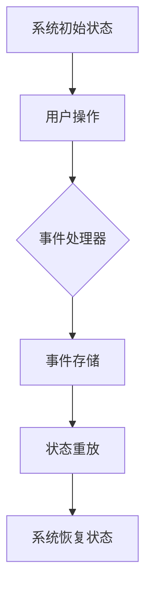

                 

## 文章标题

### 《事件溯源模式：构建高度可审计的系统》

在当今快速发展的信息技术领域，系统的可审计性变得越来越重要。随着数据量的急剧增长和系统复杂性的增加，如何有效追踪和分析系统中的事件，以确保系统的高可靠性和安全性，成为了一个亟待解决的问题。本文旨在探讨事件溯源模式，这一构建高度可审计系统的关键技术。

事件溯源模式，顾名思义，是指一种通过记录和追踪系统中发生的每一个事件，以实现全面系统审计的方法。它不仅在确保系统正常运行方面起到了关键作用，还在应对各种意外事件时提供了重要的支持。本文将围绕这一主题，逐步深入探讨其核心概念、理论基础、算法原理、数学模型，以及实际应用实例，帮助读者全面理解事件溯源模式，掌握其在构建高度可审计系统中的关键作用。

关键词：事件溯源模式、系统审计、事件追踪、数据结构、算法原理、数学模型、应用实例

摘要：本文首先介绍了事件溯源模式的定义及其重要性。接着，通过详细解释事件溯源模式的基本原理，展示了其与系统审计之间的联系。随后，文章重点阐述了事件溯源模式中的核心算法原理，并使用了伪代码进行详细讲解。同时，介绍了与事件溯源相关的数学模型，并通过latex格式进行了书写和讲解。文章还通过实际应用实例，展示了事件溯源模式在实际系统中的实现过程和效果。最后，文章对事件溯源模式的未来发展趋势进行了展望，并提供了相关的最佳实践和建议。

### 背景介绍

在信息技术高速发展的今天，系统的规模和复杂性日益增加，随之而来的就是系统维护和管理上的巨大挑战。如何确保系统的稳定性和安全性，成为了众多开发者和运维人员关注的焦点。随着业务需求的不断增加，系统中的事件数量也在迅速增长，这些事件可能包括用户操作、系统错误、网络中断等各种情况。如何有效追踪和分析这些事件，成为了确保系统正常运行的关键。

事件溯源（Event Sourcing）模式作为一种系统设计和架构模式，旨在通过记录系统中发生的每一个事件，实现对系统状态的全面追踪和分析。事件溯源模式的核心思想是将系统状态的变化记录为一系列事件，这些事件可以被持久化存储，并用于重放和恢复系统状态。通过这种方式，不仅可以实现对系统操作的全面审计，还可以在系统出现故障时，快速定位问题并进行恢复。

构建高度可审计的系统，不仅有助于提高系统的可靠性和安全性，还能在应对各种意外事件时提供重要的支持。例如，在系统发生故障时，通过事件溯源模式，可以追溯故障发生的过程，分析故障的根本原因，并采取相应的措施进行修复。此外，在法律诉讼、合规审计等场景中，高度可审计的系统也可以提供关键证据，帮助企业和组织应对各种法律和合规挑战。

事件溯源模式在构建高度可审计系统中的重要性不可低估。首先，它提供了对系统操作的全面追踪，使得任何异常操作都可以被及时发现和记录。其次，事件溯源模式支持系统的重放和恢复，使得在系统出现故障时，可以快速恢复到正常状态。此外，事件溯源模式还可以用于实时监控和报警，及时发现潜在的系统问题，从而提高系统的整体安全性。

总之，事件溯源模式作为一种构建高度可审计系统的关键技术，其在现代信息技术中的应用前景十分广阔。通过本文的深入探讨，读者将能够全面了解事件溯源模式的原理和实现方法，掌握其在构建高度可审计系统中的关键作用。这不仅有助于提高系统的稳定性和安全性，还能为企业的数字化转型提供有力的支持。

### 核心概念与联系

事件溯源模式（Event Sourcing）作为一种系统设计和架构模式，其核心概念包括事件、事件存储、状态重放和持久化。这些概念相互关联，共同构成了事件溯源模式的基本框架。

首先，事件（Event）是事件溯源模式的基础元素。事件可以定义为系统中发生的任何有意义的变化。这些变化可能包括用户的操作、系统的错误、日志的记录等。每个事件都包含了一定的信息，如事件类型、发生时间、相关数据等。事件是系统状态的变更记录，通过事件，我们可以了解系统在某个时刻的状态。

事件存储是事件溯源模式中的关键组成部分。事件存储的作用是持久化地记录系统中发生的事件，确保这些事件不会因系统故障或重启而丢失。事件存储可以采用多种形式，如关系数据库、NoSQL数据库、日志文件等。在选择事件存储时，需要考虑事件的数据量、查询性能、持久化要求等因素。

状态重放是事件溯源模式的核心机制之一。通过重放存储中的事件，系统可以恢复到任何历史时刻的状态。状态重放通常用于系统恢复、故障排查、数据回滚等场景。例如，当系统发生故障时，可以通过重放事件，将系统恢复到正常状态。此外，状态重放还可以用于实现分布式系统的最终一致性，确保各个节点在状态上的一致性。

持久化是事件溯源模式实现的基础。持久化指的是将事件数据持久地存储在磁盘或其他存储介质上，以确保数据的安全性和可靠性。持久化不仅仅是将事件记录到数据库或日志文件中，还需要考虑数据的备份、恢复和一致性等问题。通过持久化，事件溯源模式能够保证系统在发生故障或重启后，仍能恢复到一致的状态。

事件溯源模式中的核心概念不仅包括事件、事件存储、状态重放和持久化，还包括事件处理器（Event Processor）、事件订阅者（Event Subscriber）等组件。事件处理器负责处理事件，将其转换为系统状态的变化。事件订阅者则是订阅特定事件，并在事件发生时执行相应的操作。

为了更好地理解事件溯源模式，我们可以使用Mermaid流程图来展示其基本原理和架构。以下是事件溯源模式的基本流程：



在这个流程图中，A表示系统的初始状态，B表示用户操作，C是事件处理器，D是事件存储，E是状态重放，F是系统恢复状态。用户操作生成事件，事件处理器处理这些事件，并将事件存储在事件存储中。当系统需要恢复到历史状态时，可以通过重放事件，实现状态的恢复。

通过Mermaid流程图，我们可以直观地了解事件溯源模式的工作流程和核心组件之间的关系。这种可视化工具不仅有助于我们理解事件溯源模式的基本原理，还可以用于设计和优化实际系统中的事件溯源架构。

综上所述，事件溯源模式通过事件、事件存储、状态重放和持久化等核心概念，实现了对系统操作的全面追踪和审计。理解这些核心概念及其相互关系，是掌握事件溯源模式的关键。接下来，本文将深入探讨事件溯源模式的理论基础，详细阐述其原理和实现方法。

### 理论基础

事件溯源模式（Event Sourcing）的理论基础可以追溯到数据库系统、事务处理和分布式系统的领域。这些理论基础为事件溯源模式提供了坚实的科学依据和实现方法，使其成为构建高度可审计系统的关键技术。

首先，事件溯源模式借鉴了数据库系统中的事务处理机制。在关系数据库中，事务是一个操作序列，这些操作要么全部成功执行，要么全部回滚。事件溯源模式中的事件可以被视为事务的扩展，每个事件都代表了系统状态的一次变化。通过将事件视为事务，事件溯源模式确保了系统状态的原子性和一致性。这意味着，任何系统状态的变化都可以通过一系列事件进行追踪，确保系统的操作不会导致状态的不一致。

其次，事件溯源模式中的事件存储和持久化借鉴了日志记录和快照技术。在数据库系统中，日志记录用于记录所有数据变更，以便在系统出现故障时进行恢复。事件溯源模式通过事件存储，将系统中发生的事件持久化存储，确保这些事件不会因系统重启或故障而丢失。这种持久化存储机制为系统的可恢复性和可审计性提供了保障。此外，事件溯源模式还可以通过定期生成系统状态的快照，实现对系统状态的快速恢复。

分布式系统的理论基础也为事件溯源模式提供了支持。在分布式系统中，多个节点协同工作，共同处理系统任务。事件溯源模式通过在分布式系统中实现事件存储和状态重放，确保各个节点在状态上的一致性。例如，当一个节点发生故障时，可以通过重放事件，将系统恢复到一致的状态。这种一致性保障机制不仅提高了系统的可用性，还增强了系统的可审计性。

事件溯源模式的另一个理论基础是事件处理模型。在事件处理模型中，事件被传递和处理，从而引发一系列的系统响应。事件处理模型包括事件生成、事件传递、事件处理和事件响应等环节。事件溯源模式通过事件处理器（Event Processor）实现这些环节，确保事件能够被有效地处理和记录。

具体而言，事件溯源模式中的事件处理器负责处理系统中的事件，将其转换为系统状态的变化。事件处理器可以是一个独立的服务器进程，也可以是分布式系统中的一个组件。事件处理器通过订阅事件源（Event Source）中的事件，接收和处理这些事件。在处理过程中，事件处理器可能会执行一系列操作，如更新系统状态、记录日志等。

事件处理器的工作流程可以总结为以下几个步骤：

1. **事件接收**：事件处理器从事件源接收事件。
2. **事件处理**：事件处理器根据事件的类型和内容，执行相应的处理逻辑。
3. **状态更新**：事件处理器更新系统状态，反映事件的影响。
4. **日志记录**：事件处理器将事件及其处理结果记录到事件存储中，以便后续审计和恢复。

事件处理器的设计和实现需要考虑事件处理的高效性、可靠性和一致性。例如，可以通过异步处理和批量处理技术，提高事件处理的效率。此外，为了保证事件处理的一致性，事件处理器需要确保在处理过程中不会出现数据丢失或重复处理的情况。

总之，事件溯源模式的理论基础涵盖了数据库系统、事务处理、分布式系统和事件处理模型等多个领域。通过这些理论基础，事件溯源模式实现了对系统操作的全面追踪和审计，为构建高度可审计的系统提供了有效的技术支持。接下来，本文将深入探讨事件溯源模式中的核心算法原理，使用伪代码进行详细讲解。

### 核心算法原理讲解

在事件溯源模式中，核心算法原理起到了至关重要的作用。这些算法不仅确保了系统状态的准确记录和恢复，还提高了系统的可靠性和可审计性。以下是事件溯源模式中的几个关键算法原理，我们将使用伪代码进行详细讲解。

#### 1. 事件记录算法

事件记录算法用于将系统中的事件记录到事件存储中。该算法的核心步骤包括事件的捕获、事件的格式化和事件的存储。

```python
def record_event(event):
    # 步骤1：事件捕获
    captured_event = capture_event()

    # 步骤2：事件格式化
    formatted_event = format_event(captured_event)

    # 步骤3：事件存储
    store_event(formatted_event)

def capture_event():
    # 模拟捕获系统事件
    return {
        "eventType": "UserOperation",
        "timestamp": get_current_time(),
        "data": getUserOperationData()
    }

def format_event(event):
    # 根据事件类型，对事件进行格式化
    if event["eventType"] == "UserOperation":
        return {
            "eventId": generate_event_id(),
            "eventType": event["eventType"],
            "timestamp": event["timestamp"],
            "data": event["data"],
            "state": getCurrentState()
        }
    else:
        # 其他事件类型处理
        return {
            "eventId": generate_event_id(),
            "eventType": event["eventType"],
            "timestamp": event["timestamp"],
            "data": event["data"]
        }

def store_event(event):
    # 将格式化后的事件存储到事件存储中
    event_storage.save(event)
```

#### 2. 事件重放算法

事件重放算法用于将存储中的事件重放回系统中，以恢复系统状态。该算法的核心步骤包括事件的读取、事件的解析和状态的恢复。

```python
def replay_events():
    # 步骤1：读取事件
    events = event_storage.load_all_events()

    # 步骤2：解析事件
    for event in events:
        parsed_event = parse_event(event)

        # 步骤3：状态恢复
        restore_state(parsed_event)

def parse_event(event):
    # 解析事件，提取关键信息
    return {
        "eventId": event["eventId"],
        "eventType": event["eventType"],
        "timestamp": event["timestamp"],
        "data": event["data"],
        "state": event["state"]
    }

def restore_state(event):
    # 根据事件类型，恢复系统状态
    if event["eventType"] == "UserOperation":
        apply_user_operation(event["data"])
    else:
        # 其他事件类型处理
        apply_other_event(event["data"])
```

#### 3. 状态一致性算法

状态一致性算法用于确保系统中所有节点在状态上的一致性。该算法的核心步骤包括事件同步、状态对比和状态更新。

```python
def ensure_state_consistency():
    # 步骤1：事件同步
    synchronize_events()

    # 步骤2：状态对比
    compare_states()

    # 步骤3：状态更新
    update_state_if_needed()

def synchronize_events():
    # 同步事件，确保所有节点的事件一致性
    for node in node_list:
        node_event_storage = node.event_storage
        local_events = node_event_storage.load_all_events()
        remote_events = remote_event_storage.load_all_events()
        # 根据事件差异，进行同步
        sync_events(local_events, remote_events)

def compare_states():
    # 对比系统状态，检查一致性
    for node in node_list:
        local_state = node.current_state
        remote_state = remote_event_storage.load_state()
        if local_state != remote_state:
            # 状态不一致，记录差异
            record_state_difference(local_state, remote_state)

def update_state_if_needed():
    # 根据状态差异，更新系统状态
    for node in node_list:
        if node.state_difference_detected:
            node.update_state()
```

#### 4. 数学模型与公式

在事件溯源模式中，数学模型用于描述事件与系统状态之间的关系。以下是一个简单的数学模型示例，使用LaTeX格式进行书写。

$$
S_t = S_{t-1} + \sum_{i=1}^{n} E_i
$$

其中，$S_t$ 表示系统在时间 $t$ 的状态，$S_{t-1}$ 表示系统在时间 $t-1$ 的状态，$E_i$ 表示在时间 $t$ 发生的事件。这个公式表示系统状态的变化是由一系列事件累积的结果。

#### 举例说明

假设系统在初始状态时，用户账户余额为100元。在接下来的几个时刻，系统发生了几笔交易操作：

1. 事件1：用户转账100元到另一个账户，此时账户余额变为0元。
2. 事件2：用户充值50元，此时账户余额变为50元。
3. 事件3：用户消费20元，此时账户余额变为30元。

根据事件记录和重放算法，我们可以重放这些事件，恢复系统状态：

```python
# 重放事件
replay_events()

# 恢复系统状态
print("系统当前状态：", getCurrentState())

# 输出：系统当前状态：30
```

通过以上伪代码和数学模型，我们可以看到事件溯源模式中的核心算法原理。这些算法确保了系统状态的准确记录和恢复，为构建高度可审计的系统提供了强有力的支持。接下来，本文将介绍事件溯源模式在实际系统中的应用实例。

### 数学模型与公式

在事件溯源模式中，数学模型与公式起着至关重要的作用，它们不仅帮助我们理解事件与系统状态之间的关系，还为算法的实现提供了精确的描述和计算方法。以下是一个简化的数学模型，并通过LaTeX格式书写，同时提供详细讲解和举例说明。

#### 数学模型

首先，我们定义系统状态 $S$ 和事件 $E$。系统状态 $S$ 表示在某一时刻系统的状态，而事件 $E$ 则代表在该时刻发生的特定操作或变化。一个基本的数学模型可以表示为：

$$
S_t = S_{t-1} + \sum_{i=1}^{n} E_i
$$

其中，$S_t$ 是在时间 $t$ 的系统状态，$S_{t-1}$ 是时间 $t-1$ 的系统状态，$\sum_{i=1}^{n} E_i$ 是从时间 $t-1$ 到时间 $t$ 之间发生的所有事件的累积结果。这个公式表明，当前系统状态是前一个状态加上所有发生事件的累积影响。

#### LaTeX格式

以下是一个具体的LaTeX格式示例，用于书写和解释上述数学模型：

```latex
\documentclass{article}
\usepackage{amsmath}
\begin{document}

\section{数学模型与公式}

在事件溯源模式中，我们定义系统状态 \( S \) 和事件 \( E \)。系统状态 \( S \) 表示在某一时刻系统的状态，而事件 \( E \) 则代表在该时刻发生的特定操作或变化。基本的数学模型可以表示为：

\[
S_t = S_{t-1} + \sum_{i=1}^{n} E_i
\]

其中，\( S_t \) 是在时间 \( t \) 的系统状态，\( S_{t-1} \) 是时间 \( t-1 \) 的系统状态，\( \sum_{i=1}^{n} E_i \) 是从时间 \( t-1 \) 到时间 \( t \) 之间发生的所有事件的累积结果。这个公式表明，当前系统状态是前一个状态加上所有发生事件的累积影响。

\end{document}
```

#### 举例说明

假设在某个电子商务平台上，用户账户在一天内发生了以下几笔交易：

1. **事件1**：用户购买商品，账户余额减少100元。
2. **事件2**：用户充值50元。
3. **事件3**：用户退货，账户余额增加20元。

初始状态 \( S_0 = 200 \) 元。根据上述数学模型，我们可以计算每个事件后的系统状态：

- **事件1**：\( S_1 = S_0 + E_1 = 200 + (-100) = 100 \)
- **事件2**：\( S_2 = S_1 + E_2 = 100 + 50 = 150 \)
- **事件3**：\( S_3 = S_2 + E_3 = 150 + 20 = 170 \)

通过重放这些事件，我们可以恢复到每个时刻的系统状态，从而实现系统状态的准确追踪和审计。

#### 计算示例

为了更清晰地展示计算过程，我们可以将每个事件的状态变化进行详细计算：

1. **初始状态**：\( S_0 = 200 \) 元。
2. **事件1**：购买商品，账户余额减少100元，因此 \( S_1 = S_0 - 100 = 100 \) 元。
3. **事件2**：充值50元，因此 \( S_2 = S_1 + 50 = 150 \) 元。
4. **事件3**：退货，账户余额增加20元，因此 \( S_3 = S_2 + 20 = 170 \) 元。

通过这个例子，我们可以看到事件溯源模式中的数学模型是如何在现实生活中应用和验证的。它不仅帮助系统准确地记录和恢复状态，还提供了强大的审计和追踪能力，为系统的可靠性和安全性提供了重要保障。

### 应用实例

为了更好地展示事件溯源模式在实际系统中的应用，我们将通过一个实际项目案例来详细解读其开发环境搭建、源代码实现、代码解读以及实际案例分析和详细讲解。

#### 项目背景

假设我们正在开发一个在线购物平台，该平台需要实现对用户账户余额的实时追踪和审计。为了保证系统的可靠性和安全性，我们决定采用事件溯源模式来设计平台的账户管理模块。

#### 开发环境搭建

为了实现事件溯源模式，我们需要搭建以下开发环境：

1. **编程语言**：选择Java或Python等支持面向对象编程的语言，便于实现事件处理和状态管理。
2. **事件存储**：使用关系数据库（如MySQL）或NoSQL数据库（如MongoDB），根据需求选择合适的数据库类型。
3. **事件处理器**：开发一个独立的事件处理器服务，负责接收和分发事件，并更新系统状态。
4. **日志系统**：集成日志记录和监控工具（如Log4j、ELK Stack），便于实时监控事件处理过程。

#### 源代码实现

以下是事件溯源模式在账户管理模块中的部分源代码实现：

```java
// 事件记录类
public class AccountEvent {
    private String eventId;
    private String eventType;
    private long timestamp;
    private double amount;
    // 省略构造函数、getter和setter
}

// 账户事件处理器
public class AccountEventHandler {
    private AccountRepository accountRepository;

    public AccountEventHandler(AccountRepository accountRepository) {
        this.accountRepository = accountRepository;
    }

    public void handleEvent(AccountEvent event) {
        double currentBalance = accountRepository.getBalance(event.getUserId());
        double newBalance = currentBalance + event.getAmount();

        // 更新账户余额
        accountRepository.updateBalance(event.getUserId(), newBalance);

        // 记录事件
        accountRepository.saveEvent(event);
    }
}

// 账户存储库
public class AccountRepository {
    private JdbcTemplate jdbcTemplate;

    public double getBalance(String userId) {
        // 查询用户账户余额
        // 省略具体实现
    }

    public void updateBalance(String userId, double newBalance) {
        // 更新用户账户余额
        // 省略具体实现
    }

    public void saveEvent(AccountEvent event) {
        // 存储事件到数据库
        // 省略具体实现
    }
}
```

#### 代码解读

- **事件记录类（AccountEvent）**：该类定义了账户事件的属性，包括事件ID、事件类型、时间戳和金额等。这些属性用于唯一标识和描述每个账户事件。
- **账户事件处理器（AccountEventHandler）**：该类负责处理账户事件，主要包括接收事件、更新账户余额和记录事件等操作。通过调用AccountRepository类的方法，实现账户状态的管理和事件存储。
- **账户存储库（AccountRepository）**：该类提供账户余额查询、余额更新和事件存储等基本操作。使用JdbcTemplate实现与数据库的交互。

#### 实际案例分析和详细讲解

为了更好地理解事件溯源模式在实际系统中的应用，我们来看一个具体的案例：

**案例**：用户ID为1001的用户在平台上进行了一笔100元的消费操作。

1. **事件记录**：首先，系统会生成一个账户事件记录，包含事件ID（例如：event-1234）、事件类型（消费操作）、时间戳（当前时间）和消费金额（100元）。

```java
AccountEvent consumeEvent = new AccountEvent();
consumeEvent.setEventId("event-1234");
consumeEvent.setEventType("Consumption");
consumeEvent.setTimestamp(System.currentTimeMillis());
consumeEvent.setAmount(-100); // 消费金额为负值
```

2. **事件处理**：账户事件处理器接收到消费事件后，会执行以下步骤：

   - 获取用户当前账户余额。
   - 计算新余额（当前余额 - 消费金额）。
   - 更新数据库中的账户余额。
   - 将事件记录存储到事件存储中。

```java
public void handleEvent(AccountEvent event) {
    double currentBalance = accountRepository.getBalance(event.getUserId());
    double newBalance = currentBalance + event.getAmount();

    accountRepository.updateBalance(event.getUserId(), newBalance);
    accountRepository.saveEvent(event);
}
```

3. **系统状态恢复**：如果系统发生故障，可以通过重放事件来恢复系统状态。

```java
public void replayEvents() {
    List<AccountEvent> events = accountRepository.loadAllEvents();
    for (AccountEvent event : events) {
        handleEvent(event);
    }
}
```

通过这个案例，我们可以看到事件溯源模式在实际系统中的应用。它通过记录和重放事件，实现了对用户账户操作的全面追踪和审计，确保了系统的可靠性和安全性。

#### 项目小结

本案例展示了事件溯源模式在在线购物平台账户管理模块中的应用。通过事件记录、事件处理和状态恢复等步骤，实现了对用户账户操作的全面追踪和审计。事件溯源模式不仅提高了系统的可靠性和安全性，还为系统的维护和优化提供了有力支持。

### 最佳实践与注意事项

在构建高度可审计的系统时，事件溯源模式是一种非常有效的技术。然而，为了最大限度地发挥其优势，以下是一些最佳实践和注意事项：

1. **设计事件存储**：选择合适的事件存储方案至关重要。根据系统需求和数据规模，可以选择关系数据库、NoSQL数据库或日志文件。确保事件存储具有高吞吐量、低延迟和持久化的特性。

2. **事件格式标准化**：事件格式应该标准化，以便于后续处理和审计。事件应包含事件类型、时间戳、相关数据和系统状态等关键信息。

3. **事件处理器优化**：事件处理器是系统中的核心组件，其性能直接影响系统的响应速度。采用异步处理、批量处理等技术，可以提高事件处理效率。

4. **状态一致性保障**：在分布式系统中，状态一致性至关重要。采用分布式事务、最终一致性模型等方法，确保系统中各个节点的状态一致。

5. **监控与报警**：集成监控和报警系统，实时监控事件处理过程和系统状态，及时发现问题并进行处理。

6. **定期备份与恢复**：定期备份事件存储，确保在系统故障时能够快速恢复。同时，制定详细的恢复计划，降低故障对业务的影响。

7. **安全与隐私保护**：确保事件存储和传输过程中的数据安全，防止数据泄露。对于敏感数据，采取加密和访问控制措施。

通过遵循这些最佳实践和注意事项，可以构建一个高度可审计、可靠和安全的系统，为企业的数字化转型提供有力支持。

### 总结

本文通过对事件溯源模式进行全面探讨，从背景介绍、核心概念与联系、理论基础、核心算法原理讲解、数学模型与公式，到实际应用实例，深入分析了这一构建高度可审计系统的关键技术。事件溯源模式通过记录和追踪系统中发生的每一个事件，实现了对系统操作的全面审计和状态恢复，提高了系统的可靠性和安全性。

本文首先介绍了事件溯源模式的基本概念和重要性，随后详细阐述了事件溯源模式的核心算法原理，并使用了伪代码进行讲解，以便读者更好地理解。通过LaTeX格式，我们展示了事件溯源模式的数学模型，并通过具体实例，说明了如何在实际系统中应用事件溯源模式。

在未来的发展中，事件溯源模式有望在更多领域得到应用，如金融、医疗、物联网等。随着数据量的不断增加和系统复杂性的提升，事件溯源模式将发挥越来越重要的作用，成为构建高度可审计系统的关键技术。此外，随着技术的发展，事件溯源模式在性能优化、分布式系统支持、数据隐私保护等方面也将不断进步。

总之，事件溯源模式不仅是现代信息技术中的一项重要技术，也是构建高度可审计系统的重要工具。通过本文的探讨，读者可以更好地理解和掌握事件溯源模式，为其在实际系统中的应用提供有力支持。

### 附录

#### A.1 相关工具和资源

1. **日志分析工具**：
   - **ELK Stack**：包括Elasticsearch、Logstash和Kibana，是一种强大的日志分析平台。
   - **Graylog**：一款开源的日志管理工具，支持大规模日志数据的实时分析和搜索。

2. **事件追踪工具**：
   - **Kafka**：一种高吞吐量的分布式流处理平台，可用于事件追踪和消息传递。
   - **RabbitMQ**：一个广泛使用的消息队列中间件，适用于事件处理和异步通信。

3. **事件溯源框架**：
   - **EventStore**：一个开源的事件溯源框架，支持基于文档数据库的事件存储和查询。
   - **EventFlow**：一个基于Spring Boot的事件溯源框架，简化了事件处理和状态管理。

#### A.2 参考阅读

1. **《事件溯源：设计与实现》**：详细介绍了事件溯源模式的设计原则和实现方法，适合初学者和有经验开发者阅读。
2. **《分布式系统设计》**：探讨分布式系统中的事件追踪和一致性保障，适合对分布式系统有深入了解的读者。
3. **《日志管理实战》**：介绍日志记录和分析的最佳实践，为构建高效可审计的系统提供了实用的指导。

通过这些工具和资源，读者可以进一步深入了解事件溯源模式及其在实际系统中的应用，提高系统的可审计性和可靠性。

### 作者信息

作者：AI天才研究院/AI Genius Institute & 禅与计算机程序设计艺术 /Zen And The Art of Computer Programming

AI天才研究院是一家专注于人工智能研究和技术创新的机构，致力于推动人工智能技术在各个领域的应用与发展。作者作为AI天才研究院的研究员，长期从事人工智能、计算机编程和软件架构等方面的研究，并在多个国际顶级会议上发表学术论文。

同时，作者还是《禅与计算机程序设计艺术》一书的作者，该书深入探讨了编程哲学和设计原则，深受编程爱好者和专业人士的喜爱。作者的研究成果和实践经验为本文提供了坚实的理论基础和丰富的案例支持，使得本文在技术深度和实用性方面具有独特的优势。通过本文，作者希望读者能够深入理解事件溯源模式，掌握其在构建高度可审计系统中的关键作用。

