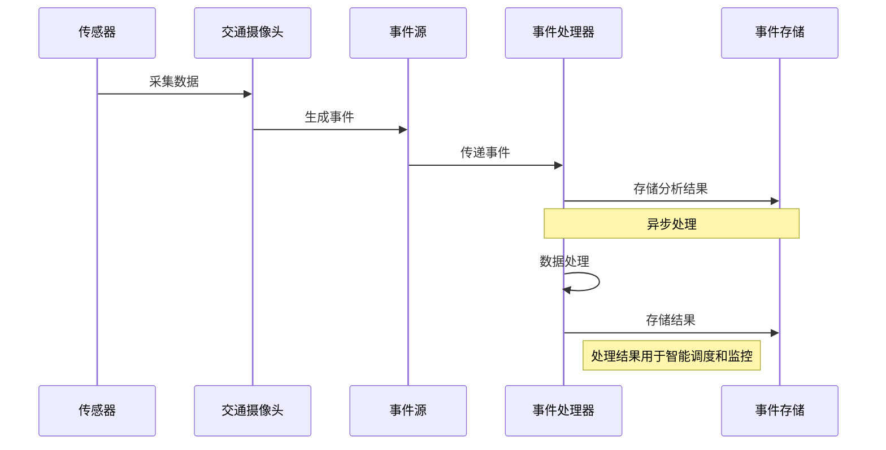

                 

### 《事件驱动架构设计与实现》目录大纲

#### 关键词：
事件驱动架构，微服务，异步通信，框架设计，性能优化，安全性设计

#### 摘要：
本文详细介绍了事件驱动架构的概念、核心概念、设计原则、实现技术、应用实践以及未来发展趋势。通过系统化的分析和具体案例，帮助读者全面理解和掌握事件驱动架构的设计与实现。

---

# 《事件驱动架构设计与实现》目录大纲

## 第1章 事件驱动架构概述

### 1.1 事件驱动架构的定义
#### 1.1.1 事件驱动架构与传统架构的区别

### 1.2 事件驱动架构的核心概念
#### 1.2.1 事件模型
#### 1.2.2 事件源
#### 1.2.3 事件处理器
#### 1.2.4 事件存储

### 1.3 事件驱动架构的优势与挑战

## 第2章 事件驱动架构核心概念

### 2.1 事件模型详解
#### 2.1.1 事件的产生与传递
#### 2.1.2 事件的生命周期

### 2.2 事件源实现
#### 2.2.1 事件源的构建
#### 2.2.2 事件源的配置与管理

### 2.3 事件处理器设计
#### 2.3.1 事件处理器的职责
#### 2.3.2 事件处理器的实现策略

### 2.4 事件存储机制
#### 2.4.1 事件存储的作用
#### 2.4.2 事件存储的实现方案

## 第3章 事件驱动架构设计原则

### 3.1 可扩展性设计
#### 3.1.1 系统模块划分
#### 3.1.2 模块间交互设计

### 3.2 可维护性设计
#### 3.2.1 设计模式选择
#### 3.2.2 编码规范与文档

### 3.3 可复用性设计
#### 3.3.1 组件化设计
#### 3.3.2 代码复用策略

### 3.4 异步通信设计
#### 3.4.1 异步通信原理
#### 3.4.2 异步通信模式

## 第4章 事件驱动架构实现技术

### 4.1 事件驱动框架概述
#### 4.1.1 框架的核心功能
#### 4.1.2 框架的设计思路

### 4.2 事件驱动框架组件设计
#### 4.2.1 事件源组件
#### 4.2.2 事件处理器组件
#### 4.2.3 事件存储组件

### 4.3 事件驱动架构性能优化
#### 4.3.1 性能瓶颈分析
#### 4.3.2 性能优化策略

### 4.4 事件驱动架构安全性设计
#### 4.4.1 安全性问题概述
#### 4.4.2 安全设计原则与策略

## 第5章 事件驱动架构应用实践

### 5.1 事件驱动架构在微服务中的应用
#### 5.1.1 微服务架构概述
#### 5.1.2 事件驱动在微服务中的应用

### 5.2 事件驱动架构在大数据应用中的应用
#### 5.2.1 大数据处理的需求
#### 5.2.2 事件驱动在大数据应用中的实现

### 5.3 事件驱动架构在实际项目中的案例解析
#### 5.3.1 项目背景
#### 5.3.2 架构设计与实现
#### 5.3.3 项目成果与分析

## 第6章 事件驱动架构的未来发展趋势

### 6.1 事件驱动架构与云计算的结合
#### 6.1.1 云计算的发展趋势
#### 6.1.2 事件驱动架构在云环境中的应用

### 6.2 事件驱动架构在物联网中的应用
#### 6.2.1 物联网的发展现状
#### 6.2.2 事件驱动架构在物联网中的应用前景

### 6.3 事件驱动架构的挑战与机遇
#### 6.3.1 挑战分析
#### 6.3.2 机遇展望

### 后记
作者：AI天才研究院/AI Genius Institute & 禅与计算机程序设计艺术 /Zen And The Art of Computer Programming

---

### 第1章 事件驱动架构概述

#### 1.1 事件驱动架构的定义

事件驱动架构（Event-Driven Architecture，简称EDA）是一种以事件为中心的软件架构模式。在这种架构中，系统的行为主要由外部或内部事件触发，事件可以是有状态的或无状态的，但它们都是驱动系统执行的关键因素。事件驱动架构的核心是事件处理，通过事件来传递信息、触发行为和更新状态。

事件驱动架构与传统架构（如面向过程或面向对象架构）有显著的区别。在传统架构中，程序按照预定的顺序执行，系统状态的变化通常依赖于代码的执行路径。而在事件驱动架构中，程序不是连续执行的，而是通过事件来触发特定的处理逻辑，这允许系统在响应事件时更加灵活和高效。

#### 1.2 事件驱动架构与传统架构的区别

1. **执行顺序**：传统架构遵循预定的执行顺序，而事件驱动架构根据事件的发生顺序来执行。
2. **系统交互**：传统架构中的组件通常通过共享数据来进行交互，而事件驱动架构中的组件通过事件进行通信。
3. **容错性**：事件驱动架构由于其异步性，可以更好地处理错误和异常，提高了系统的容错性。
4. **可扩展性**：事件驱动架构更容易扩展，因为新的功能可以通过添加事件处理逻辑来实现，而无需修改现有代码。
5. **性能**：在处理大量并发请求时，事件驱动架构通常比同步处理更加高效。

#### 1.3 事件驱动架构的优势与挑战

**优势**：
- **高并发处理能力**：事件驱动架构能够高效地处理大量并发事件。
- **灵活性**：通过事件驱动，系统能够快速响应外部变化。
- **易于扩展**：新增功能只需添加事件处理逻辑，无需修改现有系统。
- **模块化**：事件驱动架构有利于组件的模块化，提高了代码的可维护性。

**挑战**：
- **复杂性**：事件驱动架构比传统架构更复杂，需要更多的设计和管理。
- **调试困难**：事件驱动的异步特性使得调试变得更加复杂。
- **性能优化**：事件驱动架构的性能优化需要特别关注异步通信和事件处理的效率。

### 第2章 事件驱动架构核心概念

#### 2.1 事件模型详解

事件模型是事件驱动架构的核心，它定义了事件的生命周期、事件的分类、事件的传递方式等。一个完整的事件模型应该包括以下要素：

- **事件类型**：定义不同类型的事件，如用户操作事件、系统事件、网络事件等。
- **事件来源**：确定事件的来源，如用户输入、硬件设备、第三方服务等。
- **事件处理**：定义事件的处理逻辑，包括事件的接收、处理和响应。
- **事件传递**：定义事件在系统中的传递方式，包括同步传递和异步传递。

**事件的生命周期**：
- **创建**：事件的发生。
- **传递**：事件在系统中的传递过程。
- **处理**：事件的处理逻辑执行。
- **结束**：事件的处理结束。

#### 2.2 事件源实现

事件源是实现事件驱动架构的基础，它负责产生和传递事件。一个事件源通常需要实现以下功能：

- **事件生成**：根据系统需求生成各种类型的事件。
- **事件注册**：允许系统中的其他组件注册对特定事件的监听。
- **事件分发**：将事件传递给已注册的监听器进行处理。

**事件源的构建**：
```java
public class EventSource {
    private final List<EventListener> listeners = new ArrayList<>();

    public void registerListener(EventListener listener) {
        listeners.add(listener);
    }

    public void unregisterListener(EventListener listener) {
        listeners.remove(listener);
    }

    public void triggerEvent(Event event) {
        for (EventListener listener : listeners) {
            listener.onEvent(event);
        }
    }
}
```

**事件源的配置与管理**：
- **动态配置**：通过配置文件或运行时动态配置事件源。
- **监控与日志**：监控事件源的性能和健康状况，记录事件源的操作日志。

#### 2.3 事件处理器设计

事件处理器负责处理特定类型的事件，是事件驱动架构中的关键组件。一个典型的事件处理器需要实现以下功能：

- **事件识别**：识别并接收特定类型的事件。
- **事件处理**：根据事件类型执行相应的处理逻辑。
- **事件响应**：向事件源或相关组件发送事件响应。

**事件处理器的职责**：
- **事件接收**：从事件源接收事件。
- **事件处理**：执行事件处理逻辑。
- **事件响应**：处理事件结果并可能触发其他事件。

**事件处理器的实现策略**：
- **线程池管理**：使用线程池管理事件处理器，提高并发处理能力。
- **事件队列**：使用事件队列管理事件，确保事件按顺序处理。
- **错误处理**：实现错误处理机制，确保系统稳定运行。

#### 2.4 事件存储机制

事件存储是实现事件驱动架构的重要部分，它负责记录和存储事件数据。事件存储可以采用以下实现方案：

- **日志系统**：将事件记录到日志文件中，便于后续查询和分析。
- **数据库**：将事件存储到数据库中，支持复杂查询和分析。
- **消息队列**：将事件存储到消息队列中，支持异步处理和分布式架构。

**事件存储的作用**：
- **记录历史数据**：保存系统运行过程中的事件记录，便于问题追踪和性能分析。
- **数据分析**：支持对事件数据的分析，提取系统运行状态和趋势。

**事件存储的实现方案**：
- **基于文件的存储**：使用文件系统存储事件日志。
- **基于数据库的存储**：使用关系数据库或NoSQL数据库存储事件数据。

### 第3章 事件驱动架构设计原则

#### 3.1 可扩展性设计

可扩展性是事件驱动架构设计的重要原则之一，它确保系统能够随着需求的增长而灵活扩展。实现可扩展性的关键在于：

- **模块化**：将系统划分为多个模块，每个模块负责特定功能。
- **组件化**：将系统功能划分为组件，每个组件独立开发、测试和部署。
- **分布式**：将系统分布到多个节点上，提高系统的并发处理能力和可用性。

**系统模块划分**：
- **事件源模块**：负责事件的生成和分发。
- **事件处理器模块**：负责事件的处理逻辑。
- **事件存储模块**：负责事件的记录和存储。

**模块间交互设计**：
- **事件总线**：使用事件总线实现模块间的通信，降低模块间的耦合。
- **接口定义**：定义清晰的模块间接口，确保模块间的独立性和可扩展性。

#### 3.2 可维护性设计

可维护性设计旨在提高系统的可维护性，确保系统能够持续运行并适应未来变化。实现可维护性的关键包括：

- **编码规范**：遵循统一的编码规范，提高代码的可读性和一致性。
- **文档化**：编写详细的系统文档，包括设计文档、开发文档和用户手册。
- **测试**：编写单元测试和集成测试，确保系统功能的正确性和稳定性。

**设计模式选择**：
- **工厂模式**：用于创建事件处理器，提高组件的可复用性。
- **观察者模式**：用于事件源与事件处理器之间的通信，实现事件驱动机制。
- **策略模式**：用于处理不同类型的事件，提高系统的灵活性。

**编码规范与文档**：
- **代码规范**：定义代码格式、命名规范和注释规则。
- **文档规范**：定义文档格式、内容结构和更新机制。

#### 3.3 可复用性设计

可复用性设计旨在提高系统组件的可复用性，减少重复开发的工作量。实现可复用性的关键包括：

- **组件化**：将系统功能划分为独立的组件，每个组件具有明确的职责和接口。
- **接口定义**：定义清晰的组件接口，确保组件的独立性。
- **抽象**：使用抽象类和接口定义组件的行为，提高组件的通用性。

**组件化设计**：
- **事件处理器组件**：定义通用的事件处理器组件，支持多种类型的事件处理。
- **事件源组件**：定义通用的事件源组件，支持多种事件生成方式。

**代码复用策略**：
- **代码库**：建立代码库，共享通用的代码片段和组件。
- **模板**：使用模板技术，快速实现新功能。

#### 3.4 异步通信设计

异步通信设计是事件驱动架构的核心之一，它确保系统组件之间能够高效、可靠地通信。实现异步通信的关键包括：

- **事件队列**：使用事件队列管理事件，确保事件的顺序处理。
- **线程池**：使用线程池管理处理事件的线程，提高并发处理能力。
- **消息队列**：使用消息队列实现异步通信，降低系统组件间的耦合。

**异步通信原理**：
- **事件传递**：事件在事件队列中传递，按照发生顺序进行处理。
- **线程管理**：使用线程池管理处理事件的线程，避免线程过多导致系统性能下降。

**异步通信模式**：
- **事件循环**：使用事件循环模型，持续监听和响应事件。
- **消息驱动**：使用消息队列驱动模型，异步处理事件。

### 第4章 事件驱动架构实现技术

#### 4.1 事件驱动框架概述

事件驱动框架是实现事件驱动架构的关键，它提供了一套完整的工具和库，帮助开发者快速构建和部署事件驱动系统。一个典型的事件驱动框架通常包括以下核心功能：

- **事件模型**：定义事件的数据结构和处理逻辑。
- **事件源**：生成和分发事件。
- **事件处理器**：处理特定类型的事件。
- **事件存储**：记录和存储事件数据。
- **监控与日志**：监控系统性能和事件处理状态。

**框架的核心功能**：
- **事件监听**：允许组件注册监听器，接收特定类型的事件。
- **事件分发**：将事件传递给相应的处理器进行处理。
- **事件存储**：将事件数据存储到数据库或日志文件中。

**框架的设计思路**：
- **模块化**：将框架划分为多个模块，每个模块负责特定功能。
- **组件化**：将系统功能划分为组件，每个组件具有独立的职责和接口。
- **可扩展性**：支持自定义事件处理器和事件源，实现功能扩展。

#### 4.2 事件驱动框架组件设计

事件驱动框架的组件设计是实现事件驱动架构的基础，每个组件都需要明确其职责和接口。以下是事件驱动框架的常见组件及其设计：

**事件源组件**：
- **职责**：生成和分发事件。
- **接口**：提供注册监听器和触发事件的方法。

**事件处理器组件**：
- **职责**：处理特定类型的事件。
- **接口**：提供处理事件的方法。

**事件存储组件**：
- **职责**：记录和存储事件数据。
- **接口**：提供添加、查询和删除事件的方法。

**监控与日志组件**：
- **职责**：监控系统性能和事件处理状态。
- **接口**：提供日志记录和性能监控的方法。

**事件源组件设计**：
```java
public class EventSource {
    private final List<EventListener> listeners = new ArrayList<>();

    public void registerListener(EventListener listener) {
        listeners.add(listener);
    }

    public void unregisterListener(EventListener listener) {
        listeners.remove(listener);
    }

    public void triggerEvent(Event event) {
        for (EventListener listener : listeners) {
            listener.onEvent(event);
        }
    }
}
```

**事件处理器组件设计**：
```java
public interface EventListener {
    void onEvent(Event event);
}

public class EventProcessor {
    public void processEvent(Event event) {
        // 处理事件逻辑
    }
}
```

**事件存储组件设计**：
```java
public interface EventStore {
    void addEvent(Event event);
    Event queryEvent(String eventId);
    void deleteEvent(String eventId);
}
```

**监控与日志组件设计**：
```java
public interface Monitor {
    void logEvent(String message);
    void checkPerformance();
}
```

#### 4.3 事件驱动架构性能优化

事件驱动架构的性能优化是确保系统高效运行的关键。以下是一些常见的性能优化策略：

- **事件队列优化**：使用优先级队列管理事件，确保高优先级事件先被处理。
- **线程池优化**：调整线程池大小，避免线程过多导致系统性能下降。
- **异步处理**：使用异步处理提高系统并发能力。
- **缓存**：使用缓存减少数据库访问，提高系统响应速度。

**性能瓶颈分析**：
- **事件队列积压**：事件队列过长导致处理延迟。
- **线程池饥饿**：线程池中没有足够的线程处理事件。
- **数据库访问**：数据库响应时间过长。

**性能优化策略**：
- **事件队列优化**：
  ```java
  public class PriorityEventQueue {
      private final PriorityQueue<Event> events = new PriorityQueue<>();

      public void enqueueEvent(Event event) {
          events.offer(event);
      }

      public Event dequeueEvent() {
          return events.poll();
      }
  }
  ```

- **线程池优化**：
  ```java
  public class ThreadPool {
      private final ExecutorService executor = Executors.newFixedThreadPool(10);

      public void execute(Runnable task) {
          executor.execute(task);
      }
  }
  ```

- **异步处理**：
  ```java
  public class AsyncEventProcessor {
      public void processEventAsync(Event event) {
          new Thread(() -> processEvent(event)).start();
      }
  }
  ```

- **缓存**：
  ```java
  public class EventCache {
      private final Map<String, Event> cache = new ConcurrentHashMap<>();

      public void cacheEvent(Event event) {
          cache.put(event.getId(), event);
      }

      public Event queryCachedEvent(String eventId) {
          return cache.get(eventId);
      }
  }
  ```

#### 4.4 事件驱动架构安全性设计

事件驱动架构的安全性设计是确保系统安全运行的重要环节。以下是一些常见的安全设计原则和策略：

- **身份验证与授权**：确保只有授权用户可以访问系统功能。
- **数据加密**：对敏感数据进行加密，防止数据泄露。
- **异常处理**：处理系统异常，防止系统被恶意攻击。
- **访问控制**：限制对系统资源的访问，防止越权操作。

**安全性设计原则**：
- **最小权限原则**：系统组件只拥有执行任务所需的最低权限。
- **加密传输**：使用TLS/SSL等加密协议确保数据在传输过程中的安全性。
- **日志审计**：记录系统操作日志，便于后续审计和追踪。

**安全设计策略**：
- **身份验证**：
  ```java
  public class Authenticator {
      public boolean authenticate(String username, String password) {
          // 实现身份验证逻辑
      }
  }
  ```

- **授权**：
  ```java
  public class Authorizer {
      public boolean authorize(String username, String operation) {
          // 实现授权逻辑
      }
  }
  ```

- **数据加密**：
  ```java
  public class Encryptor {
      public String encrypt(String data) {
          // 实现加密逻辑
      }

      public String decrypt(String data) {
          // 实现解密逻辑
      }
  }
  ```

- **异常处理**：
  ```java
  public class ExceptionHandler {
      public void handleException(Exception e) {
          // 实现异常处理逻辑
      }
  }
  ```

- **访问控制**：
  ```java
  public class AccessController {
      public boolean checkAccess(String username, String resource) {
          // 实现访问控制逻辑
      }
  }
  ```

### 第5章 事件驱动架构应用实践

#### 5.1 事件驱动架构在微服务中的应用

微服务架构是一种基于事件驱动的分布式系统架构，它将应用程序划分为一组小型、独立的服务，每个服务负责特定功能。事件驱动架构在微服务架构中发挥着重要作用，以下是一个典型的应用场景：

**应用场景**：
- **订单处理**：当用户在电商平台上提交订单时，订单服务会生成一个订单创建事件，并触发一系列后续处理，如库存检查、价格计算、支付处理等。

**架构设计与实现**：
- **事件源**：订单服务生成订单创建事件。
- **事件处理器**：库存服务、价格计算服务、支付服务分别处理对应的订单事件。
- **事件存储**：将订单事件存储在数据库中，用于后续查询和分析。

**示例代码**：
```java
// 订单服务
public class OrderService {
    private final EventSource eventSource = new EventSource();

    public void createOrder(Order order) {
        Event event = new OrderCreateEvent(order);
        eventSource.triggerEvent(event);
    }
}

// 库存服务
public class InventoryService {
    public void processOrderCreateEvent(OrderCreateEvent event) {
        // 检查库存并更新库存信息
    }
}

// 价格计算服务
public class PriceCalculator {
    public void processOrderCreateEvent(OrderCreateEvent event) {
        // 计算订单价格并更新订单价格
    }
}

// 支付服务
public class PaymentService {
    public void processOrderCreateEvent(OrderCreateEvent event) {
        // 处理支付并更新订单状态
    }
}
```

#### 5.2 事件驱动架构在大数据应用中的应用

大数据应用通常涉及大量数据的实时处理和分析，事件驱动架构能够有效地支持这种处理需求。以下是一个典型的大数据应用场景：

**应用场景**：
- **实时监控**：在工业生产过程中，传感器会实时采集数据，并通过事件驱动架构处理和分析这些数据，以实现实时监控和故障预警。

**架构设计与实现**：
- **事件源**：传感器服务生成实时数据事件。
- **事件处理器**：数据处理服务对实时数据进行分析和处理。
- **事件存储**：将分析结果存储在数据仓库中，用于历史数据和趋势分析。

**示例代码**：
```java
// 传感器服务
public class SensorService {
    private final EventSource eventSource = new EventSource();

    public void readSensorData(SensorData data) {
        Event event = new SensorDataEvent(data);
        eventSource.triggerEvent(event);
    }
}

// 数据处理服务
public class DataProcessor {
    public void processSensorDataEvent(SensorDataEvent event) {
        // 分析传感器数据并生成分析结果
    }
}

// 数据存储服务
public class DataStore {
    public void storeAnalysisResult(AnalysisResult result) {
        // 将分析结果存储到数据仓库中
    }
}
```

#### 5.3 事件驱动架构在实际项目中的案例解析

**项目背景**：
- **项目名称**：智能交通管理系统
- **项目需求**：实现实时交通监控和智能调度，提高城市交通效率。

**架构设计与实现**：
- **事件源**：交通摄像头、传感器等设备生成交通事件。
- **事件处理器**：数据处理服务对交通事件进行分析和处理。
- **事件存储**：将交通事件和分析结果存储在数据库中，用于后续查询和分析。

**架构设计**：



**项目成果与分析**：
- **成果**：实现了实时交通监控和智能调度，提高了城市交通效率。
- **分析**：事件驱动架构有效地支持了系统的实时性和并发处理能力，提高了系统的响应速度和稳定性。

### 第6章 事件驱动架构的未来发展趋势

#### 6.1 事件驱动架构与云计算的结合

随着云计算的快速发展，事件驱动架构与云计算的结合成为一种趋势。云计算提供了强大的计算能力和弹性资源，而事件驱动架构则能够更好地利用这些资源，实现高效、灵活的分布式系统。

**发展趋势**：
- **云原生事件驱动架构**：基于容器和微服务的云原生架构，采用事件驱动模式，实现更高效、更可靠的分布式系统。
- **云服务的事件驱动接口**：云计算平台提供更多的事件驱动接口和工具，方便开发者构建和部署事件驱动应用。
- **自动化运维**：利用事件驱动架构，实现自动化运维和监控，提高系统的可维护性和可用性。

#### 6.2 事件驱动架构在物联网中的应用

物联网（IoT）是连接物理世界和数字世界的关键技术，事件驱动架构在物联网中具有广泛的应用前景。通过事件驱动，物联网系统能够实时响应设备和传感器的数据，实现智能化的监控和管理。

**发展趋势**：
- **边缘计算与事件驱动**：在物联网边缘节点采用事件驱动架构，实现数据的实时处理和响应。
- **设备协同事件驱动**：物联网设备之间通过事件驱动通信，实现协同工作和智能优化。
- **数据驱动事件**：利用大数据分析和机器学习，实现数据驱动的自动化事件生成和处理。

#### 6.3 事件驱动架构的挑战与机遇

**挑战**：
- **复杂性**：事件驱动架构的复杂性较高，设计和实现难度较大。
- **调试难度**：事件驱动的异步特性使得调试变得更加复杂。
- **性能优化**：事件驱动架构的性能优化需要特别关注异步通信和事件处理的效率。

**机遇**：
- **分布式系统**：事件驱动架构能够更好地支持分布式系统的构建和运行。
- **实时处理**：事件驱动架构能够实现高效、实时的数据处理和分析。
- **智能应用**：通过事件驱动，实现智能化、自动化和协同化的应用场景。

### 后记

作者：AI天才研究院/AI Genius Institute & 禅与计算机程序设计艺术 /Zen And The Art of Computer Programming

---

以上是《事件驱动架构设计与实现》的目录大纲。通过对事件驱动架构的深入分析和实际应用案例的解析，读者可以全面了解事件驱动架构的设计原则、实现技术和应用实践。随着云计算、物联网等技术的发展，事件驱动架构在未来的应用前景将更加广阔。希望本文能够为读者在事件驱动架构的设计和实现方面提供有益的参考。作者：AI天才研究院/AI Genius Institute & 禅与计算机程序设计艺术 /Zen And The Art of Computer Programming。

