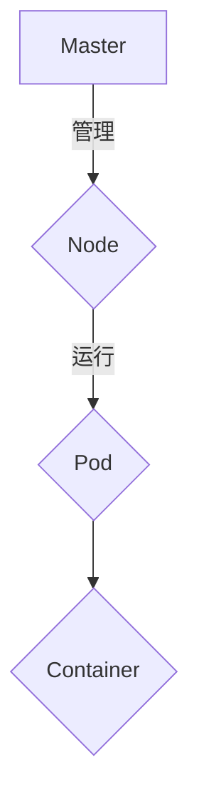

                 

### 设计《云原生应用开发最佳实践》目录大纲的步骤

设计一个详尽的目录大纲是撰写高质量技术博客的第一步，它不仅能够帮助读者快速了解文章的结构和内容，还能确保文章的逻辑性和完整性。以下是设计《云原生应用开发最佳实践》目录大纲的具体步骤：

#### 1. 确定整体架构

首先，我们需要确定书籍的整体架构，这通常包括以下几个核心部分：

- **引言**：介绍云原生应用的概念、背景和重要性，为读者搭建基础。
- **核心概念与架构**：深入探讨云原生应用开发所需的核心概念和架构，包括容器化、服务网格和微服务架构等。
- **开发技术**：介绍云原生应用开发的具体技术，如容器镜像、持续集成与持续部署（CI/CD）等。
- **安全与运维**：讨论云原生应用的安全性和运维挑战，提供最佳实践。
- **项目实战**：通过实际案例展示云原生应用的开发过程，帮助读者理解理论知识。
- **总结与展望**：回顾全书内容，展望云原生应用的发展趋势。

#### 2. 定义核心章节

在确定了整体架构后，我们需要定义核心章节，这些章节通常覆盖以下内容：

- **引言**：云原生概念与背景、发展历程、本书内容结构与目标读者。
- **核心概念与架构**：容器化与容器编排、服务网格与微服务架构、容器镜像与容器仓库。
- **云原生应用开发技术**：云原生应用开发流程、性能优化。
- **云原生应用安全与运维**：云原生应用安全、运维挑战与策略。
- **项目实战**：具体项目实战案例。

#### 3. 细化章节内容

针对每个核心章节，我们需要进一步细化内容，创建1、2、3级目录。例如，对于“容器化与容器编排”这一章节，我们可以细化如下：

- **2.1.1 容器化技术介绍**：容器的定义与优势、容器化工具与平台。
- **2.1.2 容器编排与管理**：Kubernetes简介、Kubernetes架构与核心组件、容器编排原理与实践。

#### 4. 加入Mermaid流程图

为了更好地展示核心概念和架构，我们需要在适当的位置加入Mermaid流程图。例如，在介绍Kubernetes架构时，我们可以使用Mermaid图来展示其核心组件和关系。



#### 5. 编写伪代码和数学公式

在描述核心算法原理时，使用伪代码来展示算法的步骤，并使用LaTeX格式嵌入数学模型和公式。例如，在介绍微服务架构时，我们可以使用伪代码来描述服务间的通信流程。

```latex
$$
serviceA() {
    request = get_request();
    if (request.type == "query") {
        response = query_database();
    } else if (request.type == "update") {
        response = update_database();
    }
    send_response(response);
}
$$
```

#### 6. 编写项目实战案例

在每个章节中，至少包含一个实际的项目实战案例，包括环境搭建、代码实现和详细解释。例如，在“服务网格实践”章节中，我们可以通过一个实际的Istio部署案例来展示服务网格的使用。

#### 7. 确保大纲完整性

保证目录大纲完整性，核心章节内容覆盖面要广，同时保持简洁性，避免冗余内容。

#### 8. 最后检查

在完成目录大纲后，进行最后的检查，确保字数在2000字以内，内容完整且逻辑清晰。调整细节，确保每个章节都能够独立成篇，同时保持整体结构的连贯性和逻辑性。

通过以上步骤，我们可以设计出一个逻辑清晰、结构紧凑的《云原生应用开发最佳实践》目录大纲，为撰写高质量的技术博客奠定坚实的基础。接下来，我们将按照这个大纲逐步展开详细的内容撰写工作。

